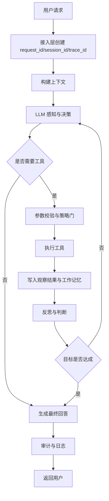
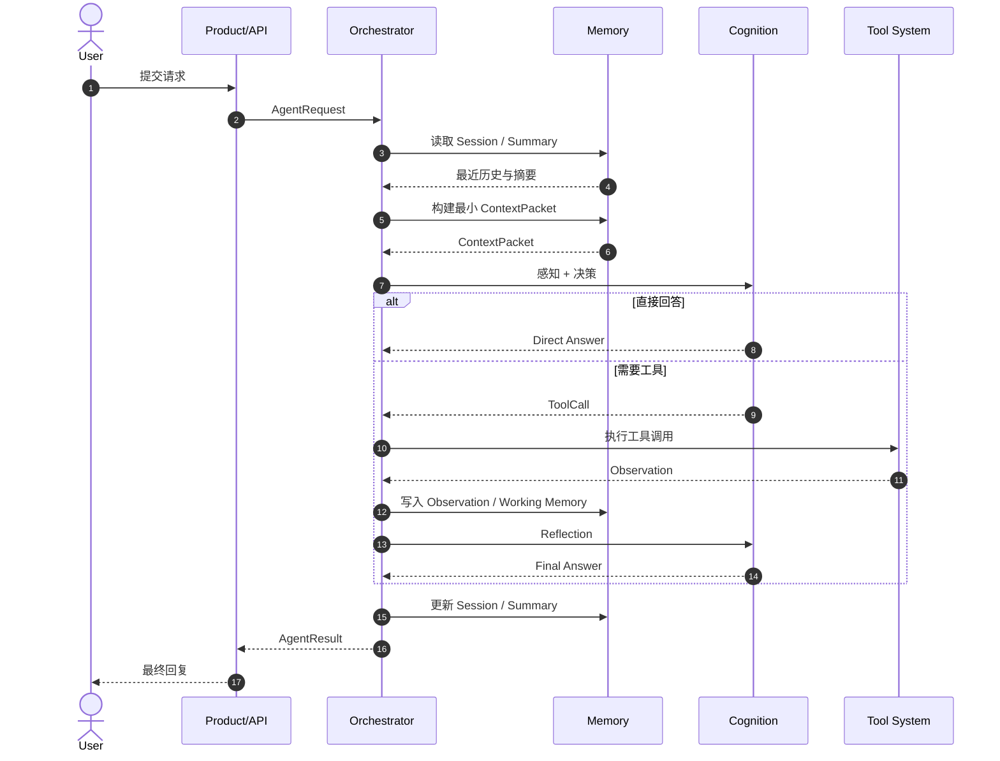
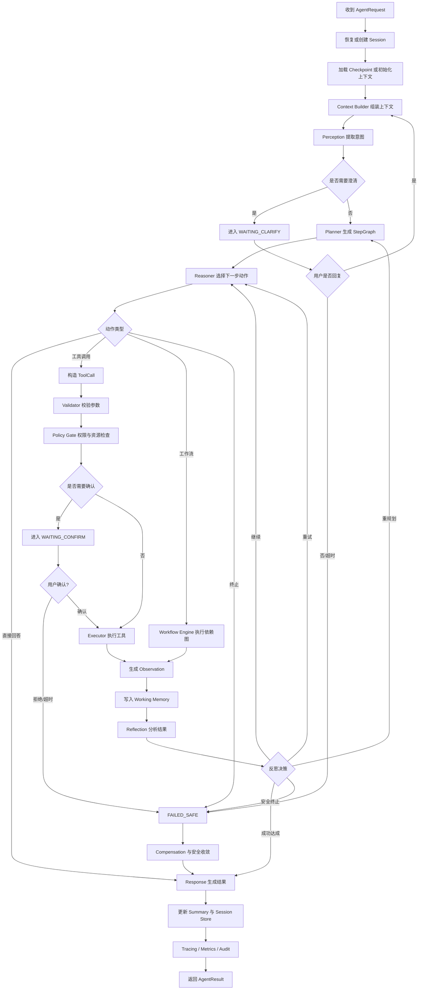
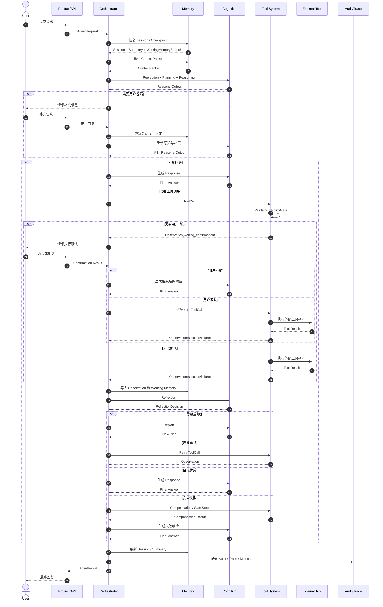
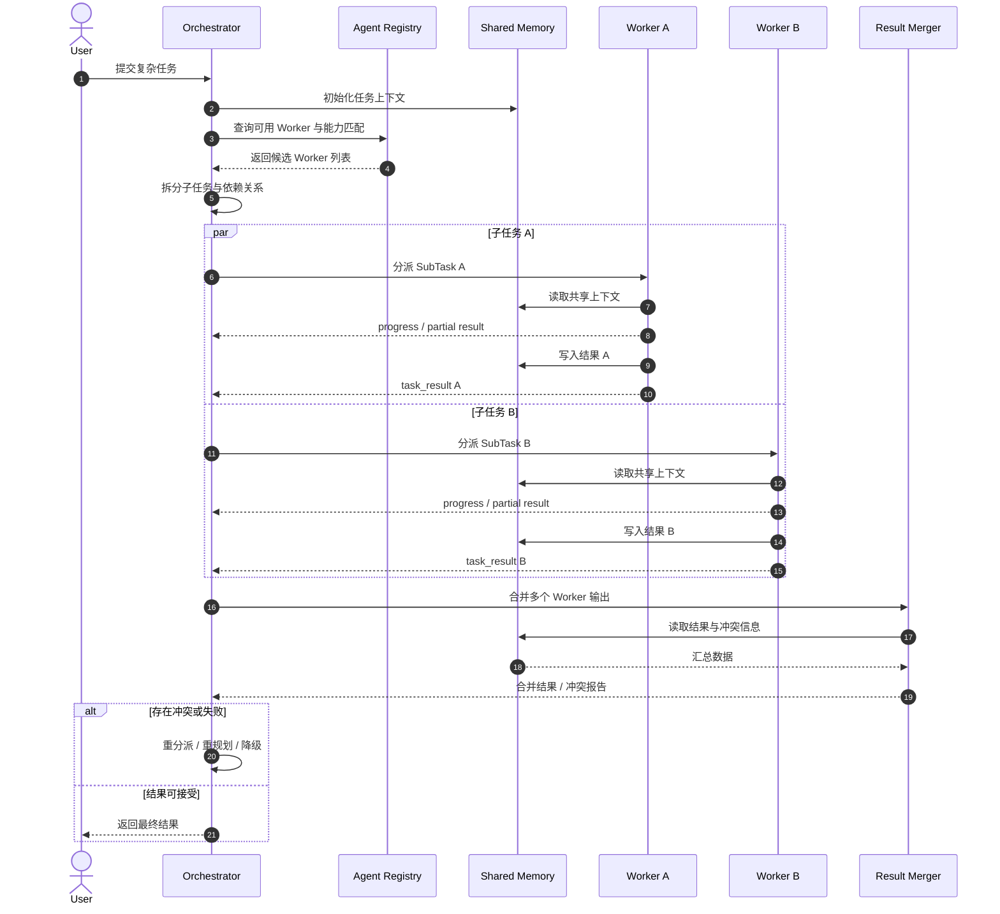

# LLM Agent 架构学习与原型设计

> 本文档系统梳理 LLM Agent 的核心架构设计，涵盖分层、状态机、记忆、规划、工具调用和多 Agent 协作，面向入门到进阶阶段的开发者。
>
> 文档定位：这是一份学习版原型设计文档。目标是帮助读者建立 Agent 的工程心智模型，并给出可落地的原型接口草图；它不是直接可运行的实现规范，也不是某个具体框架的 API 手册。

---

## 目录

1. [Agent 概述](#1-agent-概述)
    - 1.1 什么是 LLM Agent
    - 1.2 Agent 的核心循环
    - 1.3 最小端到端流程图
    - 1.4 这份文档适合作为什么
2. [分层架构](#2-分层架构)
    - 2.1 五层架构模型
    - 2.2 总架构图
    - 2.3 各层详细职责
3. [核心契约层](#3-核心契约层)
    - 3.1 请求与结果契约
    - 3.2 观察与错误契约
    - 3.3 检查点与恢复契约
    - 3.4 图节点到数据结构映射表
    - 3.5 失败恢复与补偿专用映射表
4. [状态机与主循环](#4-状态机与主循环)
    - 4.1 为什么需要状态机
    - 4.2 Agent 的核心状态定义
    - 4.3 状态转移规则
    - 4.4 主循环控制
    - 4.5 中断恢复设计
    - 4.6 完整流程图
    - 4.7 完整时序图
5. [记忆系统](#5-记忆系统)
    - 5.1 记忆的四种类型
    - 5.2 工作记忆（Working Memory）：黑板模式
    - 5.3 会话存储（Session Store）
    - 5.4 上下文构建器（Context Builder）
    - 5.5 Token 预算管理
    - 5.6 历史摘要（Summary Memory）
    - 5.7 记忆写回规则
    - 5.8 冲突处理与置信度
    - 5.9 从工作记忆回灌长期记忆
    - 5.10 经验记忆与策略学习
6. [规划模块](#6-规划模块)
    - 6.1 感知与意图识别（Perception）
    - 6.2 任务规划（Planner）
    - 6.3 推理决策（Reasoner）
    - 6.4 反思与重规划（Reflection）
    - 6.5 目标契约、信念状态与自评接口
7. [工具调用系统](#7-工具调用系统)
    - 7.1 工具模式（Tool Schema）设计
    - 7.2 Function Calling：模型到工具层的结构化接口
    - 7.3 工具注册中心（Tool Registry）
    - 7.4 工具中间表示（Tool IR）
    - 7.5 参数校验器（Validator）
    - 7.6 权限控制与策略门（Policy Gate）
    - 7.7 执行器（Executor）
    - 7.8 面向模型的观察摘要（Observation Digest）
    - 7.9 模型路由与提示治理
    - 7.10 技能（Skill）：面向任务的能力封装与复用
    - 7.11 MCP：协议化能力接入与统一工具面
    - 7.12 工作流（Workflow）与跨工具协作
    - 7.13 补偿与回滚（Compensation）
8. [多 Agent 协作](#8-多-agent-协作)
    - 8.1 何时需要多 Agent
    - 8.2 多 Agent 基本架构模式
    - 8.3 任务拆分策略
    - 8.4 Agent Registry 与能力匹配
    - 8.5 子代理（Sub-Agent）设计
    - 8.6 协同通信机制
    - 8.7 结果合并与冲突仲裁
    - 8.8 多 Agent 的失败处理
    - 8.9 多 Agent 的可观测性
9. [设计原则总结](#9-设计原则总结)
    - 9.1 边界优先，实现其次
    - 9.2 工具不是函数列表，而是受控执行系统
    - 9.3 记忆是 Agent 作为"有状态系统"的根基
    - 9.4 反思能力是 Agent 自适应的核心
    - 9.5 先单 Agent，后多 Agent
    - 9.6 可观测性贯穿全局
    - 9.7 更接近理想智能体的补充要求
    - 9.8 从学习文档走向实现规格

---

## 1. Agent 概述

### 1.1 什么是 LLM Agent

LLM Agent 是以大语言模型（LLM）为核心推理引擎，能够感知输入、制定计划、调用工具、与环境交互并最终完成目标的系统。

Agent 与单次 LLM 调用的本质区别在于：

| 维度 | 单次 LLM 调用 | Agent |
|------|-------------|-------|
| 执行轮次 | 单轮 | 多轮迭代直到目标完成 |
| 工具使用 | 无 | 可调用外部工具和 API |
| 状态管理 | 无持久状态 | 有会话状态、工作记忆、长期记忆 |
| 规划能力 | 无 | 可将目标拆解成步骤序列 |
| 自我修正 | 无 | 可感知失败并重新规划 |

### 1.2 Agent 的核心循环

所有 Agent 系统都遵循一个基本的感知-决策-执行反馈环（ReAct 循环）：

```
┌─────────────────────────────────────────────┐
│                 Agent 主循环                 │
│                                             │
│   输入/观察 ──► 推理/规划 ──► 行动/执行         │
│       ▲                            │        │
│       └─────────── 观察结果 ────────┘         │
└─────────────────────────────────────────────┘
```

这个循环称为 **Observation → Thought → Action → Observation** 循环，是现代 Agent 系统的基本驱动模型。

### 1.3 最小端到端流程图

下面这张图刻意只保留最小闭环，用来回答一个最基本的问题：一个单 Agent 系统从收到请求到返回结果，最少需要经过哪些环节。



#### 单 Agent 最小时序图

如果说上面的流程图回答的是“经过哪些环节”，那么下面这张图回答的是“这些最小环节之间按什么顺序交互”。它只保留单 Agent 的最短成功路径，不展开澄清、确认、补偿和多轮重规划。



### 1.4 这份文档适合作为什么

如果目标是学习 Agent 工程设计，这份文档是合适的载体，因为它承载的是三个层面的信息：

1. 心智模型：分层、状态机、记忆、工具治理、多 Agent 协调这些核心概念如何互相连接。
2. 原型接口：关键对象和模块之间应该交换什么信息，而不是只停留在概念描述。
3. 迭代边界：哪些地方属于学习阶段可以抽象，哪些地方如果不补齐就会直接影响真实实现。

因此，后文会尽量保持两个原则：

1. 伪代码要接近实现，但不追求完整可运行。
2. 所有关键模块都要先有契约，再讨论实现。

---

## 2. 分层架构

### 2.1 五层架构模型

一个设计良好的 Agent 系统应该被分为五类稳定边界，每一层有明确的职责，且依赖方向单向向下：

```
┌─────────────────────────────────────────────────────┐
│                  产品层 (Products)                   │
│          CLI / API 服务 / 设备运行时                  │
├─────────────────────────────────────────────────────┤
│                  认知层 (Cognition)                  │
│        感知 → 规划 → 推理 → 反思 → 响应生成             │
├──────────────────┬──────────────────────────────────┤
│   工具层 (Tools)  │         记忆层 (Memory)           │
│  注册/执行/编排    │  上下文/会话/摘要/检索/工作记忆      │
├──────────────────┴──────────────────────────────────┤
│               能力域 (Capabilities)                  │
│      文件系统 / 网络搜索 / 视觉 / 语音 / 设备控制        │
├─────────────────────────────────────────────────────┤
│             平台抽象层 (Platform Abstraction)         │
│          OS / 传输协议 / 硬件总线 / 存储               │
└─────────────────────────────────────────────────────┘
```

这张图适合作为业务分层视图，用来回答“系统大致由哪些稳定业务边界组成”。但如果要覆盖本文后续讨论到的核心契约、运行时内核、治理面和多 Agent 协调，仅靠这五层还不够，因此还需要一张更完整的总架构图。

### 2.2 总架构图

下面这张图把本文后续会展开的主要模块放到同一个系统视图里。它不是替代前面的五层图，而是把前面的业务分层，与控制平面、共享契约和横切治理组合起来。

```
┌──────────────────────────────────────────────────────────────────────────────┐
│                           横切治理（Governance）                               │
│ Audit / Trace / Metrics / ModelRoute / Prompt Governance / Policy Config     │
│ 作用方式：对运行时内核、认知、记忆、工具治理、多 Agent 协调提供统一约束与观测            │
└──────────────────────────────────────────────────────────────────────────────┘

                                    │
                                    ▼

┌──────────────────────────────────────────────────────────────────────────────┐
│                           产品与接入层（Products）                              │
│ Product Surface / CLI / HTTP API / Runtime Host                              │
│ Session Gateway / Input Adapter / request_id / session_id / trace_id         │
└──────────────────────────────────────────────────────────────────────────────┘
                                    │
                                    ▼
┌──────────────────────────────────────────────────────────────────────────────┐
│                           核心契约层（Contracts）                              │
│ AgentRequest / GoalContract / ContextPacket / BeliefState                    │
│ AgentResult / ErrorInfo / Checkpoint                                         │
└──────────────────────────────────────────────────────────────────────────────┘
                                    │
                                    │
                                    ▼
┌──────────────────────────────────────────────────────────────────────────────┐
│                    运行时内核 / 控制平面（Runtime Kernel）                       │
│ Agent Orchestrator / FSM / Scheduler / Retry / Timeout / Budget / Recovery   │
└──────────────────────────────────────────────────────────────────────────────┘
                                    │
    ┌──────────────────────┬──────────────────────┬──────────────────────┐
    │                      │                      │                      │
    ▼                      ▼                      ▼                      ▼

┌──────────────────────┐  ┌──────────────────────┐  ┌──────────────────────┐  ┌──────────────────────┐
│ 认知层                │  │ 记忆层                │  │ 工具治理与执行层        │  │ 多 Agent 协调层       │
│ Cognition            │  │ Memory               │  │ Tools                │  │ Multi-Agent          │
├──────────────────────┤  ├──────────────────────┤  ├──────────────────────┤  ├──────────────────────┤
│ Perception           │  │ Session Store        │  │ Tool Registry        │  │ Task Decomposer      │
│ Planner              │  │ Working Memory       │  │ Tool Schema / IR     │  │ Agent Registry       │
│ Reasoner             │  │ Shared Blackboard    │  │ Validator            │  │ Capability Match     │
│ Reflection           │  │ Summary Memory       │  │ Policy Gate          │  │ Worker Agents        │
│ Response Generator   │  │ Semantic Memory      │  │ Executor             │  │ Specialized Roles    │
│                      │  │ Retrieval            │  │ MCP Adapter          │  │ Result Merger        │
│                      │  │ Context Builder      │  │ Compensation Manager │  │ Conflict Resolution  │
│                      │  │ Token Budget         │  │ Workflow Engine      │  │                      │
│                      │  │ Experience Memory    │  │ Observation Digest   │  │                      │
│                      │  │                      │  │ Skill Registry       │  │                      │
└──────────────────────┘  └──────────────────────┘  └──────────────────────┘  └──────────────────────┘
             │                      │                      │                      │
             └──────────────┬───────┴──────────────┬───────┴──────────────┬───────┘
                            │                      │                      │
                            ▼                      ▼                      ▼
┌──────────────────────────────────────────────────────────────────────────────┐
│                    能力域与平台抽象（Capabilities / Platform）                  │
│ Filesystem / Search / Browser / Vision / Speech / Device Control             │
│ OS / Network / Storage / Hardware Bus / External Services                    │
└──────────────────────────────────────────────────────────────────────────────┘

补充说明：
1. 主执行链路是“产品与接入层 → 核心契约层 → 运行时内核 → 各业务执行层 → 能力域与平台”。
2. 核心契约层不是业务功能层，而是所有模块共享的数据边界。
3. 横切治理不直接承载业务流转，但对所有关键模块提供审计、追踪、路由和策略约束。
4. 认知、记忆、工具治理、多 Agent 协调都受运行时内核统一驱动，而不是彼此任意直连。
```

阅读这张总图时，可以把它拆成三部分理解：

1. 前台业务视图：产品与接入层、认知层、记忆层、工具层、能力域与平台抽象，对应前面的五层模型。
2. 中台控制视图：核心契约层和运行时内核，负责把模块连接成可恢复、可审计、可暂停的执行系统。
3. 横切治理视图：审计、追踪、模型路由、提示治理和策略配置，负责给所有模块提供统一约束和可观测性。

这里尤其要注意，提示词治理不应被理解为“认知层里的一段 system prompt 文本”，而应被视为横切治理的一部分。原因在于：提示词一旦决定了工具选择倾向、澄清策略、风险措辞、输出结构和反思路径，它就已经在塑造整个 Agent 的运行行为，因此必须像模型路由和策略配置一样被版本化、可观测、可回滚。

同理，MCP 也不应被理解为“Agent 直接拥有的一组远程工具”。更准确的定位是：MCP 位于工具层与能力域之间，承担协议适配和能力暴露的职责。Agent 不直接理解 MCP 传输细节，它只看到经过 Tool Registry、Schema、Policy Gate 和 Executor 统一治理后的可用工具面。

因此，后文各章节其实都可以回挂到这张图上：

1. 第 3 章是在展开核心契约层。
2. 第 4 章是在展开运行时内核与状态机。
3. 第 5 至第 7 章分别展开记忆、规划/认知，以及工具治理与其扩展资产（提示词治理、Skills、MCP、Workflow、补偿）。
4. 第 8 章是在展开多 Agent 协调层。
5. 第 9 章总结的是贯穿全局的设计约束。

### 2.3 各层详细职责

#### 认知层（Cognition Layer）

认知层是 Agent 的"大脑"，负责所有思考过程。它包含五个子模块：

```
agent-cognition/
├── perception/    # 感知：解析用户输入，识别意图和约束
├── planner/       # 规划：任务分解，生成步骤依赖图
├── reasoner/      # 推理：根据当前状态选择下一步行动
├── reflection/    # 反思：分析执行结果，决定重试/重规划/终止
└── response/      # 响应：生成最终的结构化答复
```

关键属性：
- `perception` 是输入的第一个处理节点，它把自然语言转化为结构化的意图表示
- `planner` 和 `reasoner` 是核心决策节点，两者区别在于：`planner` 做长期目标分解，`reasoner` 做单步动作选择
- `reflection` 是 Agent 具备自适应能力的关键，它能区分局部失败（重试当前步骤）和全局失败（重新规划）

#### 工具层（Tools Layer）

工具层是 Agent 的"手臂"，负责受控执行，而不仅仅是工具列表：

```
agent-tools/
├── registry/      # 工具注册：schema、风险等级、超时策略
├── tool-ir/       # 工具中间表示：统一工具调用格式
├── validator/     # 参数校验：输入验证和规范化
├── policy-gate/   # 策略门：权限、allowlist、二次确认
├── executor/      # 执行器：统一执行入口
├── adapters/      # 协议适配：本地能力、MCP Server、远程服务接入
├── skills/        # 技能资产：面向任务的工具组合、模板与匹配规则
├── workflow/      # 工作流：跨工具依赖图和并行调度
└── compensation/  # 补偿：回滚和副作用处理
```

如果把单个工具看作 Agent 的“原子动作”，那么 Skills 更接近“面向任务的可复用动作包”。它通常由工具集合、工作流模板、阶段提示词、输入输出契约和评测用例共同组成。换句话说，Skill 不是单独的新分层，而是沉淀在工具层中的复用资产，并由运行时内核在规划与执行阶段统一调度。

同样，MCP 也不应直接放进认知层。它更适合作为 `adapters/` 里的协议桥接设施，把外部服务器暴露出来的资源、工具和上下文能力转换成 Agent 内部统一的工具契约。

#### 记忆层（Memory Layer）

记忆层决定 Agent 每次思考时"带着什么信息"：

```
agent-memory/
├── session-store/    # 会话存储：近期消息和工具轨迹
├── context-builder/  # 上下文构建器：组装发给 LLM 的完整上下文
├── working-memory/   # 工作记忆：跨工具步骤共享的黑板状态
├── summary/          # 摘要记忆：压缩长期历史
├── retrieval/        # 检索：向量检索和关键词检索
└── token-budget/     # Token 预算：上下文裁剪和降级策略
```

#### 依赖方向规则

```
Products  →  Cognition / Tools / Memory / Capabilities / Platform
Cognition →  Memory / Tools / Shared
Tools     →  Capabilities / Platform / Shared
Memory    →  Shared
Platform  →  （不能反向依赖任何高层）
```

**唯一最重要的约束**：依赖只能向下，底层不能反向依赖高层。

---

## 3. 核心契约层

在讨论状态机、记忆、工具和多 Agent 之前，必须先冻结几个跨模块共享的核心对象。否则每个子系统都会定义一套自己的输入输出，最终导致编排层无法稳定工作。

### 3.1 请求与结果契约

```python
@dataclass
class AgentRequest:
    request_id: str
    session_id: str
    user_id: str
    trace_id: str
    user_input: str
    attachments: list[str]
    metadata: dict

@dataclass
class AgentResult:
    request_id: str
    session_id: str
    final_answer: str
    status: str                # success / partial_success / failed / cancelled
    final_state: str
    artifacts: list[dict]      # 生成的文件、链接、结构化结果
    audit_ref: str | None

@dataclass
class GoalContract:
    goal: str
    success_criteria: list[str]   # 任务完成的显式判据
    constraints: list[str]        # 时间、成本、风格、资源等约束
    budget: dict                  # token、延迟、工具调用预算
    risk_tolerance: str           # low / medium / high
    approval_policy: dict         # 哪些动作必须先确认
```

这里有两个设计点：

1. `request_id` 和 `trace_id` 必须分开。前者标识一次业务请求，后者用于全链路追踪。
2. `AgentResult` 不应该只返回一段文本，还要能带上结构化产物和最终状态。
3. 对复杂任务来说，仅有原始用户输入还不够，系统还需要一个显式的 `GoalContract` 来冻结成功判据、预算和风险边界。否则后续很多决策只能从自然语言里猜测，而不是从契约里读取。

### 3.2 观察与错误契约

```python
class FailureType(Enum):
    VALIDATION_ERROR = "validation_error"
    POLICY_DENIED = "policy_denied"
    TOOL_TIMEOUT = "tool_timeout"
    TOOL_UNAVAILABLE = "tool_unavailable"
    EXECUTION_ERROR = "execution_error"
    USER_DENIED = "user_denied"
    COMPENSATION_FAILED = "compensation_failed"

@dataclass
class ErrorInfo:
    type: FailureType
    message: str
    retryable: bool
    safe_to_replan: bool
    details: dict

@dataclass
class Observation:
    source: str                # tool / worker / human / retrieval
    trace_id: str
    success: bool
    payload: dict | None
    error: ErrorInfo | None
    side_effects: list[str]

@dataclass
class BeliefState:
    confirmed_facts: list[str]
    hypotheses: list[str]
    assumptions: list[str]
    evidence_refs: list[str]
    confidence: float
```

关键点不是“有没有报错”，而是错误是否可重试、是否适合重规划、是否已经留下副作用。

除此之外，更完整的系统还应显式维护 `BeliefState`。它用来区分“已确认事实”“当前假设”“推理前提”和“证据来源”，避免系统把暂时推测误当作稳定事实。

### 3.3 检查点与恢复契约

```python
@dataclass
class Checkpoint:
    session_id: str
    request_id: str
    state: str
    step_id: str | None
    working_memory_snapshot: dict
    retry_counters: dict
    pending_action: dict | None
    created_at: datetime
```

恢复点不是为了“重启后继续”，而是为了明确以下问题：

1. 当前 Agent 停在哪个状态。
2. 哪个步骤已经有副作用，不能盲目重放。
3. 当前是否正在等待用户确认、等待澄清或等待某个子代理返回。

### 3.4 图节点到数据结构映射表

前面的最小流程图、完整流程图、完整时序图和多 Agent 协同时序图，都是在描述同一组核心契约如何流转。为了避免“图能看懂，但不知道落到哪个对象和字段”，这里给出统一映射表。

| 图中节点或事件 | 对应对象 | 关键字段 | 说明 |
|---------------|---------|---------|------|
| 用户请求 | `AgentRequest` | `request_id`, `session_id`, `user_id`, `trace_id`, `user_input`, `attachments` | 所有流程的统一入口。最小流程图中的“用户请求”和完整时序图中的 `AgentRequest` 都对应这里。 |
| 冻结任务目标与边界 | `GoalContract` | `goal`, `success_criteria`, `constraints`, `budget`, `risk_tolerance`, `approval_policy` | 复杂任务不应只靠用户原话驱动，而应先冻结成正式目标契约。 |
| 接入层创建请求上下文 | `AgentRequest` + `Session` | `request_id`, `session_id`, `metadata`, `last_active` | 接入层负责补齐追踪和会话元信息，而不是只转发文本。 |
| 读取会话/恢复上下文 | `Session`, `SummaryMemory`, `Checkpoint` | `turns`, `metadata`, `current_goals`, `state`, `pending_action` | 在最小时序图和完整时序图里，对应 Memory 返回最近历史、摘要和恢复点。 |
| 构建上下文 | `ContextPacket` | `user_turn`, `recent_history`, `summary_memory`, `retrieval_evidence`, `active_tools`, `policy_digest`, `token_budget_report`, `final_messages` | 流程图中的“构建上下文”和时序图中的 `ContextPacket` 都是这个对象。 |
| 感知/意图提取 | `Intent` | `goal`, `subtasks`, `constraints`, `ambiguities`, `requires_clarification` | 对应 Perception 阶段输出，是 Planner 和 Reasoner 的输入。 |
| 形成当前信念状态 | `BeliefState` | `confirmed_facts`, `hypotheses`, `assumptions`, `evidence_refs`, `confidence` | 规划、反思和结果生成不应只看文本观察，还应读取当前信念状态。 |
| 规划步骤图 | `Step`, `StepGraph` | `step_id`, `description`, `tool_name`, `inputs`, `depends_on`, `goal` | 完整流程图中的 Planner 结果，以及工作流执行的依赖图。 |
| 单步决策 | `ReasonerOutput` | `action_type`, `decision_summary`, `tool_name`, `tool_args`, `workflow_steps`, `clarification_question` | 图里的“LLM 感知与决策”“Reasoner 选择下一步动作”都落到这个对象。 |
| 请求用户澄清 | `ReasonerOutput` + `Checkpoint` | `action_type`, `clarification_question`, `state`, `pending_action` | 当图进入 `WAITING_CLARIFY` 时，系统需要保存当前问题和待恢复动作。 |
| 请求用户确认 | `PolicyDecision`, `Checkpoint` | `requires_confirmation`, `confirmation_prompt`, `state`, `pending_action` | 高风险工具不会直接执行，而是先把确认信息挂起。 |
| 工具调用 | `ToolCall` | `call_id`, `tool_name`, `raw_args`, `normalized_args`, `trace_id`, `step_id` | 完整流程图中的 `ToolCall`、执行器入口和时序图里的工具调用都映射到这里。 |
| 参数校验 | `ToolCall` + `ToolSchema` | `raw_args`, `normalized_args`, `parameters` | Validator 对 `raw_args` 做校验、规范化和默认值注入。 |
| 权限与资源检查 | `PolicyContext`, `PolicyDecision` | `user_id`, `tenant_id`, `profile`, `granted_capabilities`, `allowed`, `deny_reason`, `confirmation_prompt` | 对应策略门阶段，决定允许、拒绝还是需要确认。 |
| 工具执行结果 | `Observation` 或 `ToolObservation` | `source`, `trace_id`, `success`, `payload`, `error`, `side_effects` | 图里的 Observation 是工具系统返回给编排层的统一观察对象。 |
| 工具错误 | `ErrorInfo` | `type`, `message`, `retryable`, `safe_to_replan`, `details` | 不同失败路径是否重试、重规划或补偿，主要由这些字段驱动。 |
| 写入工作记忆 | `WorkingMemory` | `data`, `provenance`, `version` | 流程图中的“写入观察结果与工作记忆”和多 Agent 图中的共享黑板都用它承载。 |
| 反思与判断 | `ReflectionDecision` | `CONTINUE`, `RETRY_STEP`, `REPLAN`, `ABORT_SAFE` | 完整流程图中的 Reflection 节点，决定回到执行、规划还是进入失败安全态。 |
| 安全失败与补偿 | `ErrorInfo`, `CompensationAction`, `Checkpoint` | `type`, `side_effects`, `compensates_call_id`, `compensation_tool`, `pending_action` | 对应 `FAILED_SAFE` 节点，需要先识别副作用，再执行补偿。 |
| 更新会话与摘要 | `Session`, `SummaryMemory` | `turns`, `last_active`, `decisions_made`, `confirmed_facts`, `tool_outcomes` | 最小时序图和完整时序图中结束前的 Memory 更新都落到这里。 |
| 返回最终结果 | `AgentResult` | `final_answer`, `status`, `final_state`, `artifacts`, `audit_ref` | 所有图里的“返回用户”或 `AgentResult` 输出都应统一收束到这个对象。 |
| 多 Agent 子任务分派 | `SubTask`, `WorkerSpec`, `AgentMessage` | `task_id`, `description`, `worker_type`, `allowed_tools`, `permissions`, `message_type`, `content` | 多 Agent 协同时序图中的任务派发，实质上是任务对象和消息契约在流动。 |
| Worker 能力匹配 | `AgentCapability`, `AgentRegistry` | `name`, `supported_tools`, `max_concurrency`, `cost_class` | 对应多 Agent 图里 Orchestrator 向 Registry 查询候选 Worker 的过程。 |
| 多 Agent 结果合并 | `Observation` + `ResultMerger` 输出 | `payload`, `error`, `summary`, `citations`, `conflicts` | 多 Agent 协同时序图里的合并阶段，本质是把多个观察结果归并成一个统一输出。 |

可以把这张表当作读图索引：

1. 如果先看图，就用它定位到后文具体的数据结构。
2. 如果先看契约，就用它反向理解该对象在流程中的位置。
3. 如果后续要做实现规格，可以直接从这张表继续扩展成接口定义表和时序契约表。

### 3.5 失败恢复与补偿专用映射表

正常路径解释的是“系统如何完成任务”，异常路径解释的是“系统在什么地方失败、如何记录失败、如何收敛到安全状态”。下面这张表专门对应异常流转。

| 异常节点或事件 | 触发位置 | 对应对象 | 关键字段 | 恢复或补偿动作 |
|---------------|---------|---------|---------|---------------|
| 意图解析失败 | `Perception` | `ErrorInfo`, `AgentResult` | `type=VALIDATION_ERROR`, `message`, `details` | 直接进入响应阶段，返回澄清性回复或失败说明。 |
| 成功判据不明确 | `GoalContract` / `Perception` | `success_criteria`, `constraints`, `details` | 不直接启动执行，优先回到澄清路径补齐任务边界。 |
| 需要用户澄清但超时 | `WAITING_CLARIFY` | `Checkpoint`, `ErrorInfo` | `state`, `pending_action`, `type=EXECUTION_ERROR` | 从等待态进入 `FAILED_SAFE`，生成超时说明，并保留恢复点。 |
| 参数校验失败 | `Validator` | `ToolCall`, `ErrorInfo`, `Observation` | `raw_args`, `normalized_args`, `type=VALIDATION_ERROR`, `retryable=false` | 不进入真实执行，交给 Reflection 决定重试还是重规划。 |
| 权限拒绝 | `Policy Gate` | `PolicyDecision`, `ErrorInfo`, `Observation` | `allowed=false`, `deny_reason`, `type=POLICY_DENIED` | 终止当前工具路径，通常允许重规划到低权限替代方案。 |
| 资源范围越界 | `Policy Gate` | `PolicyContext`, `PolicyDecision`, `ErrorInfo` | `current_directory`, `network_zone`, `granted_capabilities`, `deny_reason` | 拒绝执行，并在审计日志中记录越界请求。 |
| 等待高风险确认 | `Policy Gate` | `PolicyDecision`, `Checkpoint` | `requires_confirmation`, `confirmation_prompt`, `pending_action` | 挂起当前动作，等待用户确认，不直接执行工具。 |
| 用户拒绝确认 | `WAITING_CONFIRM` | `ErrorInfo`, `Checkpoint` | `type=USER_DENIED`, `pending_action`, `state` | 不执行该工具，返回拒绝后的收敛响应。 |
| 用户确认超时 | `WAITING_CONFIRM` | `ErrorInfo`, `Checkpoint` | `type=USER_DENIED` 或超时错误, `pending_action` | 进入 `FAILED_SAFE`，必要时释放锁或租约。 |
| 工具执行超时 | `Executor` | `Observation`, `ErrorInfo` | `type=TOOL_TIMEOUT`, `retryable=true`, `safe_to_replan=true` | 先走局部重试策略；超过阈值后再交给重规划。 |
| 工具不可用 | `Executor` / 适配器层 | `ErrorInfo`, `Observation` | `type=TOOL_UNAVAILABLE`, `retryable=false` | 直接触发重规划或切换到替代工具。 |
| 工具执行异常 | `Executor` | `ErrorInfo`, `Observation` | `type=EXECUTION_ERROR`, `message`, `side_effects` | 由 Reflection 判断重试、重规划或进入安全失败。 |
| 工作流中单步失败 | `WorkflowEngine` | `Observation`, `ErrorInfo`, `Step` | `step_id`, `error`, `safe_to_replan` | 终止当前批次，回传失败 Observation，由 orchestrator 接管。 |
| 多 Agent 子任务失败 | `Worker` / `Orchestrator` | `AgentMessage`, `ErrorInfo`, `SubTask` | `task_id`, `message_type=task_failed`, `details` | 重新调度、降级跳过或整体重规划。 |
| 子代理租约超时 | `Orchestrator` | `Checkpoint`, `AgentMessage`, `ErrorInfo` | `task_id`, `pending_action`, `type=EXECUTION_ERROR` | 回收子任务，决定是否重新派发给其他 Worker。 |
| 结果冲突无法仲裁 | `ResultMerger` | `Observation`, `AgentResult` | `conflicts`, `summary`, `citations` | 上抛给 orchestrator，由其决定追问用户或返回带冲突说明的结果。 |
| 达到最大重试次数 | `Reflection` / `Orchestrator` | `ErrorInfo`, `Checkpoint` | `retry_counters`, `type=EXECUTION_ERROR`, `safe_to_replan=false` | 放弃局部重试，转为重规划或失败收敛。 |
| 达到最大重规划次数 | `Orchestrator` | `ErrorInfo`, `AgentResult` | `type=EXECUTION_ERROR`, `message=重规划次数超限` | 进入 `FAILED_SAFE`，停止继续扩散错误。 |
| 检测到副作用残留 | `Reflection` / `CompensationManager` | `Observation`, `CompensationAction` | `side_effects`, `compensates_call_id`, `compensation_tool` | 注册补偿动作，按逆序回滚副作用。 |
| 补偿执行失败 | `CompensationManager` | `ErrorInfo`, `CompensationAction`, `AgentResult` | `type=COMPENSATION_FAILED`, `compensation_tool`, `details` | 记录高优先级审计事件，并把结果标记为 `partial_success` 或 `failed`。 |
| 审计落盘失败 | `Audit/Trace` | `ErrorInfo`, `AgentResult` | `audit_ref`, `type=EXECUTION_ERROR` | 不应影响主业务结果，但要记录降级状态并告警。 |

这张表可以和前面的通用映射表配合使用：

1. 通用映射表回答“对象在主流程里怎么流动”。
2. 异常映射表回答“对象在失败路径里如何驱动恢复与补偿”。
3. 后续如果要细化实现，可以继续把这里扩展成“错误码表 + 恢复策略矩阵”。

---

## 4. 状态机与主循环

### 4.1 为什么需要状态机

Agent 处理一个请求不是线性单步的，而是一个可能反复迭代的多阶段过程。状态机（FSM, Finite State Machine）用来精确控制 Agent 当前处于哪个阶段、能做哪些动作、下一步应该进入哪个状态。

没有状态机的 Agent 常见问题：
- 无法限制最大工具调用次数，导致无限循环
- 失败后不知道应当重试还是终止
- 中断后无法恢复到上次的位置继续执行

### 4.2 Agent 的核心状态定义

```
                    ┌─────────────────────┐
                    │      IDLE           │ ◄── 等待新请求
                    └──────────┬──────────┘
                               │ 收到请求
                               ▼
                    ┌─────────────────────┐
                    │    PERCEIVING       │ ◄── 解析意图和约束
                    └──────────┬──────────┘
                               │ 解析成功
                               ▼
                    ┌─────────────────────┐
               ┌──► │     PLANNING        │ ◄── 生成任务步骤图
               │    └──────────┬──────────┘
               │               │ 规划完成
               │               ▼
               │    ┌─────────────────────┐
               │    │     REASONING       │ ◄── 选择下一步行动
               │    └──────────┬──────────┘
               │               │         ┌─────────────────────┐
               │               ├───────► │ WAITING_CLARIFY     │ ◄── 等待用户补充信息
               │               │         └──────────┬──────────┘
               │               │                    │ 用户回复
               │               │                    ▼
               │               │         ┌─────────────────────┐
               │               ├───────► │ WAITING_CONFIRM     │ ◄── 等待高风险确认
               │               │         └──────────┬──────────┘
               │               │                    │ 用户确认/拒绝
               │               │                    ▼
               │               │ 决定工具调用
               │               ▼
               │    ┌─────────────────────┐
               │    │     EXECUTING       │ ◄── 执行工具/能力
               │    └──────────┬──────────┘
               │               │ 得到观察结果
               │               ▼
               │    ┌─────────────────────┐
               │    │    REFLECTING       │ ◄── 分析结果
               │    └──────────┬──────────┘
               │               │
               │    ┌──────────┴──────────┐
               │    │                     │
               │  [重规划]            [完成/失败]
               └────┘                     │
                                          ▼
                              ┌─────────────────────┐
                              │    FAILED_SAFE      │ ◄── 安全失败与补偿
                              └──────────┬──────────┘
                                         │
                                         ▼
                              ┌─────────────────────┐
                              │    RESPONDING       │ ◄── 生成输出
                              └──────────┬──────────┘
                                         │
                                         ▼
                              ┌─────────────────────┐
                              │      AUDITING       │ ◄── 日志/审计
                              └──────────┬──────────┘
                                         │
                                         ▼
                                      IDLE
```

### 4.3 状态转移规则

每个状态转移应该有明确的触发条件和守卫（Guard）：

```python
# 以伪代码示例状态转移逻辑
class AgentFSM:
    transitions = {
        (State.IDLE,       Event.REQUEST_RECEIVED)  -> State.PERCEIVING,
        (State.PERCEIVING, Event.INTENT_EXTRACTED)  -> State.PLANNING,
        (State.PERCEIVING, Event.PARSE_FAILED)      -> State.RESPONDING,
        (State.PLANNING,   Event.PLAN_CREATED)      -> State.REASONING,
        (State.PLANNING,   Event.NO_PLAN_NEEDED)    -> State.RESPONDING,
        (State.REASONING,  Event.TOOL_SELECTED)     -> State.EXECUTING,
        (State.REASONING,  Event.CLARIFICATION_NEEDED) -> State.WAITING_CLARIFY,
        (State.REASONING,  Event.CONFIRMATION_NEEDED)  -> State.WAITING_CONFIRM,
        (State.REASONING,  Event.DIRECT_ANSWER)     -> State.RESPONDING,
        (State.WAITING_CLARIFY, Event.USER_REPLIED) -> State.PERCEIVING,
        (State.WAITING_CLARIFY, Event.USER_TIMEOUT) -> State.FAILED_SAFE,
        (State.WAITING_CONFIRM, Event.USER_CONFIRMED) -> State.EXECUTING,
        (State.WAITING_CONFIRM, Event.USER_DENIED)  -> State.RESPONDING,
        (State.WAITING_CONFIRM, Event.USER_TIMEOUT) -> State.FAILED_SAFE,
        (State.EXECUTING,  Event.TOOL_SUCCESS)      -> State.REFLECTING,
        (State.EXECUTING,  Event.TOOL_FAILED)       -> State.REFLECTING,
        (State.EXECUTING,  Event.TIMEOUT)           -> State.REFLECTING,
        (State.REFLECTING, Event.GOAL_ACHIEVED)     -> State.RESPONDING,
        (State.REFLECTING, Event.RETRY_STEP)        -> State.REASONING,
        (State.REFLECTING, Event.REPLANNING_NEEDED) -> State.PLANNING,
        (State.REFLECTING, Event.ABORT)             -> State.FAILED_SAFE,
        (State.FAILED_SAFE, Event.FAILURE_CAPTURED) -> State.RESPONDING,
        (State.RESPONDING, Event.RESPONSE_READY)    -> State.AUDITING,
        (State.AUDITING,   Event.AUDIT_DONE)        -> State.IDLE,
    }
```

这里新增的等待状态非常关键，因为 Agent 不是单纯的自动机，它经常需要和用户共同完成任务。只要系统里存在追问或确认，FSM 就必须把这些暂停点建模出来。

### 4.4 主循环控制

主循环（Orchestrator）负责驱动 FSM 并管理关键的防护参数：

```python
class AgentOrchestrator:
    MAX_TOOL_CALLS = 20          # 单次请求最大工具调用次数
    MAX_REPLAN_COUNT = 3         # 最多重规划次数
    STEP_TIMEOUT_SECONDS = 30    # 单步执行超时
    SESSION_TIMEOUT_SECONDS = 300

    def run(self, request: AgentRequest) -> AgentResult:
        state = State.PERCEIVING
        tool_call_count = 0
        replan_count = 0
        context = self.context_builder.build_or_resume(request)

        while state not in TERMINAL_STATES:
            if tool_call_count >= self.MAX_TOOL_CALLS:
                context.last_error = ErrorInfo(
                    type=FailureType.EXECUTION_ERROR,
                    message="工具调用次数超限",
                    retryable=False,
                    safe_to_replan=False,
                    details={},
                )
                state = State.FAILED_SAFE
            if replan_count >= self.MAX_REPLAN_COUNT:
                context.last_error = ErrorInfo(
                    type=FailureType.EXECUTION_ERROR,
                    message="重规划次数超限",
                    retryable=False,
                    safe_to_replan=False,
                    details={},
                )
                state = State.FAILED_SAFE

            self.checkpoint_store.save(self.make_checkpoint(request, state, context))

            event, context = self.process_state(state, context)
            next_state = self.fsm.transition(state, event)

            if event == Event.TOOL_SELECTED:
                tool_call_count += 1
            if event == Event.REPLANNING_NEEDED:
                replan_count += 1

            state = next_state

        return self.build_result(request, context, state)
```

主循环的要点不是 while 循环本身，而是要让以下能力统一接入：

1. 每次状态切换前都能持久化 Checkpoint。
2. 进入等待用户状态时能够暂停，而不是继续空转。
3. 达到安全失败条件时先进入 `FAILED_SAFE`，给补偿和审计留出口。

### 4.5 中断恢复设计

生产环境中 Agent 可能因网络断开、进程崩溃、超时等原因中断。良好的 Agent 需要支持**恢复点**（Checkpoint）机制：

- Agent 在每个状态转移时将当前状态序列化持久化
- 重启后从最近的 Checkpoint 恢复，而不是从头开始
- 具有副作用的工具调用需要幂等设计，确保重试不会产生重复副作用

除了基本恢复点，还应明确三类恢复场景：

1. 计算恢复：纯推理步骤中断，恢复后可直接继续。
2. 人机恢复：系统在 `WAITING_CLARIFY` 或 `WAITING_CONFIRM` 状态停住，恢复后需要重新装载 pending action。
3. 副作用恢复：工具已执行但结果未落盘，恢复时必须先查询外部真实状态，再决定是否重放。

### 4.6 完整流程图

最小闭环图适合建立直觉，但真实 Agent 原型需要把等待用户、权限确认、安全失败、补偿和审计都画出来。下面这张图更接近可实现的完整流程。



### 4.7 完整时序图

流程图回答的是“经过哪些步骤”，时序图回答的是“谁先和谁交互”。下面这张图给出一个包含上下文、工具调用、用户确认和反思重试的完整时序。



---

## 5. 记忆系统

### 5.1 记忆的四种类型

Agent 的记忆系统借鉴认知科学的记忆分类：

```
┌─────────────────────────────────────────────────────────────┐
│                      Agent 记忆系统                          │
│                                                             │
│  ┌──────────────────┐   ┌──────────────────────────────┐   │
│  │   短期/工作记忆    │   │         长期记忆               │   │
│  │ (Working Memory) │   │                              │   │
│  │                  │   │  ┌────────────┐  ┌────────┐  │   │
│  │ 当前任务上下文     │   │  │  情景记忆   │  │语义记忆 │  │   │
│  │ 跨步骤共享状态     │   │  │(Episodic)  │  │(Seman.)│  │   │
│  │ 工具执行中间结果   │   │  │历史会话摘要  │  │外部知识 │  │   │
│  └──────────────────┘   │  └────────────┘  └────────┘  │   │
│                         └──────────────────────────────┘   │
└─────────────────────────────────────────────────────────────┘
```

| 记忆类型 | 存储内容 | 生命周期 | 实现方式 |
|---------|---------|---------|---------|
| 工作记忆 | 当前任务中间状态 | 单次请求内 | 内存 / 黑板 |
| 情景记忆 | 历史对话和工具轨迹 | 持久化 | 数据库 / 文件 |
| 语义记忆 | 外部知识、文档、代码 | 持久化 | 向量数据库 |
| 程序记忆 | Agent 能力本身、技能 | 随模型版本 | 模型权重 |

### 5.2 工作记忆（Working Memory）：黑板模式

工作记忆在 Agent 执行过程中起到**黑板（Blackboard）**的作用——多个子模块和工具的中间结果都写入这里，而不是仅靠文本对话传递。

```python
class WorkingMemory:
    def __init__(self):
        self.data: dict = {}        # 键值对存储
        self.provenance: dict = {}  # 记录每个值由哪个工具写入
        self.version: int = 0

    def write(self, key: str, value: Any, written_by: str):
        """工具/子模块写入中间结果"""
        self.data[key] = value
        self.provenance[key] = {
            "written_by": written_by,
            "version": self.version,
        }
        self.version += 1

    def read(self, key: str) -> Any:
        """其他模块读取共享状态"""
        return self.data.get(key)

    def snapshot(self) -> dict:
        """在反思阶段，Reflection 模块读取当前全量状态"""
        return dict(self.data)
```

**为什么不直接在对话历史里传递中间状态？**
- 对话历史需要消耗 Token，中间结构化数据放在黑板里可以不占 LLM 上下文
- 多个工具并行执行时，对话历史无法表达并行状态
- 黑板支持精确读取，对话历史只能让 LLM 从文本中解析

### 5.3 会话存储（Session Store）

会话存储负责持久化对话轮次，让 Agent 具备跨轮次的连贯性：

```python
# 会话存储的核心数据结构
@dataclass
class Turn:
    turn_id: str
    user_input: str
    tool_calls: list[ToolCall]    # 该轮产生的工具调用
    observations: list[str]       # 工具返回的观察结果
    agent_response: str
    timestamp: datetime

@dataclass
class Session:
    session_id: str
    turns: list[Turn]
    created_at: datetime
    last_active: datetime
    metadata: dict               # 用户偏好、权限级别等
```

### 5.4 上下文构建器（Context Builder）

上下文构建器是 Agent 调用 LLM 前的最后一关，负责把所有记忆来源组装成 LLM 能理解的 Messages 序列。

```python
@dataclass
class ContextPacket:
    session_id: str
    user_turn: str                     # 本轮用户输入
    recent_history: list[Turn]         # 最近 N 轮完整历史
    summary_memory: SummaryMemory      # 长期历史摘要
    retrieval_evidence: list[Document] # RAG 检索结果
    active_tools: list[ToolSchema]     # 当前可用工具列表
    policy_digest: str                 # 当前权限和策略摘要
    token_budget_report: BudgetReport  # token 使用情况报告
    final_messages: list[Message]      # 最终发给 LLM 的 Messages

class ContextBuilder:
    def build(self, session: Session, query: str) -> ContextPacket:
        # 1. 获取最近历史
        recent = self.session_store.get_recent_turns(session.session_id, n=5)
        # 2. 获取历史摘要
        summary = self.summary.get_summary(session.session_id)
        # 3. RAG 检索（如果需要）
        evidence = self.retrieval.retrieve(query, top_k=5)
        # 4. 计算 token 预算并裁剪
        budget = self.token_budget.allocate(
            system=500, summary=300, evidence=800,
            history=1200, tools=600, query=200
        )
        # 5. 按预算裁剪并组装最终 messages
        messages = self.assemble(summary, recent, evidence, query, budget)
        return ContextPacket(...)
```

### 5.5 Token 预算管理

Token 预算是 Agent 稳定性的重要保障，防止上下文超出 LLM 的最大限制：

**裁剪优先级（从先裁减到后保留）**：

```
优先裁剪 ──► RAG 检索证据（可降低相关性阈值减少数量）
           ──► 较旧的历史对话轮次
           ──► 非关键工具轨迹（只保留最后 N 次）
           ──► 历史摘要（压缩为更短摘要）
最后保留 ──► 系统策略 / 工具列表 / 最近关键轮次
```

### 5.6 历史摘要（Summary Memory）

长会话不可能每轮都带上全部历史。摘要记忆负责将历史压缩成结构化事实：

```python
@dataclass
class SummaryMemory:
    current_goals: list[str]      # 用户当前目标
    decisions_made: list[str]     # 已经做出的决策
    confirmed_facts: list[str]    # 已确认的事实
    constraints: list[str]        # 约束条件
    open_questions: list[str]     # 未解决的问题
    tool_outcomes: list[str]      # 重要工具执行结果摘要
```

摘要不是简单截断，而是每隔 N 轮让 LLM 压缩生成，然后替换掉最老的那段历史。

### 5.7 记忆写回规则

仅仅定义“有哪些记忆”还不够，更重要的是定义“什么时候写、谁可以写、写回后如何淘汰”。

建议采用如下写回策略：

| 记忆类型 | 写入时机 | 写入方 | 淘汰/压缩策略 |
|---------|---------|-------|--------------|
| 工作记忆 | 步骤开始、步骤完成、工具返回后 | orchestrator / executor / worker | 请求结束后默认清空，只保留快照 |
| 会话记忆 | 每轮用户输入、每轮最终回复后 | session-store | 保留最近 N 轮完整记录 |
| 摘要记忆 | 达到轮次阈值、会话结束、长时间挂起前 | summary 模块 | 用结构化摘要替换旧轮次 |
| 语义记忆 | 事实被确认且具有复用价值时 | retrieval / curator | 依据来源可信度和命中率淘汰 |

### 5.8 冲突处理与置信度

长期记忆不能把所有信息都当成等价事实。建议为记忆条目增加来源和置信度：

```python
@dataclass
class MemoryFact:
    fact_id: str
    content: str
    source: str               # user / tool / retrieval / worker
    confidence: float         # 0.0 ~ 1.0
    last_verified_at: datetime | None
    conflicts_with: list[str]
```

冲突处理的原则：

1. 用户明确声明的偏好优先级高于外部检索结果。
2. 来自高可信工具链的结果优先级高于单次 LLM 推断。
3. 互相冲突的事实不应直接覆盖，而应并存并等待下一次验证。

### 5.9 从工作记忆回灌长期记忆

不是所有工作记忆都值得进入长期存储。更合理的回灌规则是：

1. 只有被确认的事实、稳定约束、明确决策才进入摘要记忆。
2. 临时参数、单轮中间变量、失败路径上的噪声数据不进入长期记忆。
3. 高频重复出现的信息应被合并成摘要条目，而不是逐轮堆积。

### 5.10 经验记忆与策略学习

更完整的智能体系统不应只记住“发生过什么”，还应记住“什么策略更有效”。这类信息不属于会话事实，而属于经验记忆。

```python
@dataclass
class ExperienceRecord:
    pattern: str                  # 任务模式或失败模式
    recommended_strategy: str     # 推荐策略
    unreliable_tools: list[str]   # 在此模式下经常不可靠的工具
    recovery_hint: str            # 常用恢复路径
    confidence: float
```

经验记忆的作用主要有三类：

1. 在规划阶段提供更稳妥的默认策略。
2. 在反思阶段优先匹配历史上有效的恢复路径。
3. 在工具选择阶段规避已知高失败率的调用组合。

---

## 6. 规划模块

### 6.1 感知与意图识别（Perception）

感知是认知层的入口，负责从自然语言中提取结构化意图：

```python
@dataclass
class Intent:
    goal: str                    # 用户的核心目标
    subtasks: list[str]          # 可能的子任务
    constraints: list[str]       # 约束条件（时间/成本/风格等）
    ambiguities: list[str]       # 模糊点，可能需要追问
    requires_clarification: bool # 是否需要先向用户确认

class Perception:
    def extract_intent(self, user_input: str, context: ContextPacket) -> Intent:
        prompt = f"""
        分析用户输入，提取结构化意图。
        用户输入：{user_input}
        当前对话摘要：{context.summary_memory}
        输出字段：goal, subtasks, constraints, ambiguities
        """
        result = self.llm.call(prompt)
        return Intent(**result)
```

    感知阶段除了抽取意图，还应尽量把用户原始表达冻结为更正式的目标契约。对于复杂任务，若 `success_criteria` 或 `constraints` 缺失，系统应优先回到澄清流程，而不是直接进入规划。

### 6.2 任务规划（Planner）

规划器负责将意图分解成可执行的步骤依赖图（Step Graph）：

```python
@dataclass
class Step:
    step_id: str
    description: str
    tool_name: str | None         # 需要调用哪个工具，None 表示 LLM 推理步骤
    inputs: dict                  # 输入参数
    depends_on: list[str]         # 依赖哪些步骤的输出（step_id 列表）
    is_optional: bool = False     # 是否可以跳过
    estimated_risk: str = "low"   # low / medium / high

@dataclass
class StepGraph:
    steps: list[Step]
    goal: str

    def topological_order(self) -> list[list[Step]]:
        """返回可并行执行的步骤批次"""
        # 按依赖关系排序，同一批中的步骤可以并行运行
        ...
```

    规划器的输入不应只有意图文本，还应读取：

    1. `GoalContract`：明确什么算完成。
    2. `BeliefState`：明确哪些信息是事实、哪些只是推测。
    3. `ExperienceRecord`：避免重复走进历史上高失败率的路径。

**示例**：用户请求"搜索最新的 Python 版本信息并保存到文件"

```
StepGraph
├── Step 1: web_search("Python latest version")         [depends_on: []]
├── Step 2: parse_search_result(step1.output)           [depends_on: [step1]]
└── Step 3: file_write("python_version.txt", step2.data) [depends_on: [step2]]
```

### 6.3 推理决策（Reasoner）

推理器基于当前状态选择下一步行动，输出五种动作类型之一：

```python
class ActionType(Enum):
    DIRECT_ANSWER     = "direct_answer"    # 直接回答，无需工具
    CALL_TOOL         = "call_tool"        # 单工具调用
    RUN_WORKFLOW      = "run_workflow"     # 跨工具工作流
    ASK_CLARIFICATION = "ask_clarification" # 追问用户
    ABORT             = "abort"            # 终止任务

@dataclass
class ReasonerOutput:
    action_type: ActionType
    decision_summary: str      # 面向系统和审计的简要决策说明
    tool_name: str | None
    tool_args: dict | None
    workflow_steps: list[Step] | None
    clarification_question: str | None
```

这里不建议把完整 Chain-of-Thought 作为正式接口字段。更稳的做法是只保留面向系统使用的 `decision_summary`，必要时单独记录私有推理痕迹，但不把它混入公共契约。

### 6.4 反思与重规划（Reflection）

反思是 Agent 自适应能力的核心。在每次工具执行后，反思模块分析结果并做出决策：

```python
class ReflectionDecision(Enum):
    CONTINUE          = "continue"        # 继续执行计划
    RETRY_STEP        = "retry_step"      # 局部重试当前步骤
    REPLAN            = "replan"          # 重新规划（全局）
    ABORT_SAFE        = "abort_safe"      # 安全终止

class Reflection:
    def analyze(
        self,
        step: Step,
        observation: ToolObservation,
        context: ContextPacket,
        working_memory: WorkingMemory,
    ) -> ReflectionDecision:
        
        # 情况 1：步骤成功，继续执行
        if observation.success and self.goal_satisfied(step, observation):
            return ReflectionDecision.CONTINUE

        # 情况 2：可恢复的失败（如网络超时），局部重试
        if observation.is_retryable and self.retry_count < MAX_RETRY:
            return ReflectionDecision.RETRY_STEP

        # 情况 3：步骤失败但有替代路径，需要重规划
        if self.has_alternative(step, working_memory):
            return ReflectionDecision.REPLAN

        # 情况 4：不可恢复的失败或已超出最大重试次数
        return ReflectionDecision.ABORT_SAFE
```

一个更稳的反思模块，除了看 `Observation`，还应重新评估 `BeliefState`。如果某个关键假设被推翻，系统就不该只做局部重试，而应直接进入重规划。

### 6.5 目标契约、信念状态与自评接口

为了让认知层更稳定，建议在规划和反思之间引入一个轻量自评接口：

```python
@dataclass
class SelfAssessment:
    objective_alignment: float   # 当前动作与目标契约的一致性
    confidence: float            # 对当前动作的把握度
    evidence_sufficiency: float  # 当前证据是否充分
    fallback_ready: bool         # 失败后是否已有退路
```

这个对象不是为了暴露内部推理细节，而是为了在关键动作前后显式回答四个问题：

1. 当前动作是否真的朝着成功判据推进。
2. 当前判断的把握度有多高。
3. 证据是否足够支持执行。
4. 一旦失败，是否已经有回退路径。

**局部重试 vs 全局重规划 的判断依据**：

| 判断维度 | 局部重试 | 全局重规划 |
|---------|---------|----------|
| 失败原因 | 临时性（超时/网络） | 根本性（工具不可用/参数错误） |
| 影响范围 | 单步可独立解决 | 影响后续多个步骤 |
| 前提假设 | 仍然有效 | 前提假设已被推翻 |
| 已有副作用 | 无残留副作用 | 需要先补偿再规划 |

---

## 7. 工具调用系统

在本章中，术语写法采用以下约定：

1. 正文首次出现的核心概念尽量采用“中文（English）”格式，例如“技能（Skill）”“工作流（Workflow）”。
2. 在非代码语境里，后续优先使用中文表达；如需强调特定工程概念，再补充英文。
3. 代码类型名、字段名、协议名保持英文原样，例如 `ToolSchema`、`ToolCall`、`WorkflowEngine`。
4. `Skill` 用于指代单个技能资产；`Skills` 仅用于表示多个技能实例或技能集合。

### 7.1 工具模式（Tool Schema）设计

工具模式（Tool Schema）是工具调用的核心契约，它定义了工具的输入/输出规范、风险等级和调用约束：

```json
{
  "name": "web_search",
  "description": "搜索互联网，返回相关结果列表。用于获取实时信息或特定知识。",
  "version": "1.2.0",
  "risk_level": "low",
  "idempotent": true,
  "timeout_seconds": 10,
  "requires_confirmation": false,
  "parameters": {
    "type": "object",
    "properties": {
      "query": {
        "type": "string",
        "description": "搜索关键词或问题",
        "minLength": 1,
        "maxLength": 500
      },
      "max_results": {
        "type": "integer",
        "description": "返回结果数量",
        "default": 5,
        "minimum": 1,
        "maximum": 20
      }
    },
    "required": ["query"]
  },
  "returns": {
    "type": "array",
    "items": {
      "type": "object",
      "properties": {
        "title": {"type": "string"},
        "url": {"type": "string"},
        "snippet": {"type": "string"},
        "relevance_score": {"type": "number"}
      }
    }
  },
  "compensation": {
    "strategy": "none"
  },
  "examples": [
    {
      "input": {"query": "Python 3.13 新特性"},
      "output": [{"title": "...", "url": "...", "snippet": "..."}]
    }
  ]
}
```

**关键字段解释**：

| 字段 | 含义 |
|------|------|
| `risk_level` | `low` / `medium` / `high`，决定是否需要审计、是否需要用户确认 |
| `idempotent` | 是否幂等，即重复调用是否产生相同结果（影响重试策略） |
| `requires_confirmation` | 是否必须先获得用户明确确认才能执行 |
| `compensation` | 如果执行后需要回滚，对应的补偿动作 |

除了这些基础字段，生产级 Tool Schema 还应该补上资源作用域和授权要求，例如：

```json
{
    "resource_scope": {
        "filesystem": ["/workspace/docs/**"],
        "network": ["api.example.com"],
        "secrets": []
    },
    "required_capabilities": ["fs.write"],
    "audit_level": "full"
}
```

这样策略门才能判断“能不能做”以及“能做到什么范围”。

除了面向执行器的字段，理想的工具系统还应考虑“模型如何消费工具结果”。如果工具返回结构过于底层、噪声过多，会直接降低下一轮推理质量。

### 7.2 Function Calling：模型到工具层的结构化接口

函数调用（Function Calling）可以理解为“模型把下一步动作结构化表达出来”的接口能力。它的核心作用不是替代工具系统，而是把模型原本可能输出的一段自然语言动作意图，约束成可解析、可验证、可执行的函数调用请求。

在 Agent 语境下，Function Calling 最适合放在“模型输出”和“工具执行系统”之间：

```text
用户请求
→ 上下文构建
→ LLM 推理
→ Function Calling 输出候选调用
→ Tool IR 规范化
→ Validator / Policy Gate / Executor
→ Observation
```

#### 7.2.1 Function Calling 是什么，不是什么

Function Calling 与几个相近概念的边界需要明确：

1. 它不是工具执行器，而是模型输出动作的结构化协议。
2. 它不是 Tool Schema 本身，而是模型消费 Tool Schema 后产出的调用结果。
3. 它不是工作流引擎，因为它通常描述单步动作，而不是跨步骤依赖图。
4. 它不是权限机制，因为能不能执行仍然要由 Validator 和 Policy Gate 决定。

因此，更准确的关系是：

```text
Tool Schema 定义“可调用什么”
Function Calling 负责输出“模型想调用什么”
Tool IR 负责把模型输出转成内部可执行对象
Executor 负责真正执行
```

#### 7.2.2 Function Calling 在 Agent 中解决什么问题

如果没有 Function Calling，模型往往只能用自然语言表达动作，例如“我接下来应该搜索 Python 最新版本”。这会带来三个问题：

1. 参数边界不清晰，系统还需要额外从文本中解析参数。
2. 调用意图和执行细节混在一起，不利于审计和回放。
3. 不同模型、不同提示词版本下，动作表达格式容易漂移。

引入 Function Calling 后，模型输出会更接近如下结构：

```json
{
    "name": "web_search",
    "arguments": {
        "query": "Python latest version",
        "max_results": 5
    }
}
```

这使得 Agent 能够：

1. 直接把调用候选交给参数校验器。
2. 记录更稳定的调用日志。
3. 把模型层和执行层通过明确接口解耦。

#### 7.2.3 Function Calling 与 Tool Schema、Tool IR 的关系

Function Calling 最容易与 Tool Schema、Tool IR 混淆，三者其实对应不同阶段：

1. **Tool Schema**：定义工具能力、参数、风险和约束。
2. **Function Calling**：模型依据 schema 生成结构化调用候选。
3. **Tool IR**：把模型输出规范化为内部统一对象，供执行系统使用。

可以把它们理解成一条连续链路：

```text
Tool Schema → LLM Function Calling → Tool IR → Executor
```

这也是为什么 Function Calling 虽然是模型接口能力，但仍然必须纳入整个工具调用系统来讨论，而不能孤立地看成某家模型 API 的特性。

#### 7.2.4 Agent 如何融合 Function Calling

在 Agent 主循环里，Function Calling 最稳妥的融合方式是：

1. Context Builder 把当前可用工具的 schema 摘要放入模型上下文。
2. Reasoner 所用模型通过 Function Calling 机制返回单步调用候选。
3. 编排层把该调用候选转换成内部 `ToolCall` 或其他 Tool IR 表示。
4. Validator 校验参数、注入默认值并清理非法输入。
5. Policy Gate 决定允许、拒绝或要求确认。
6. Executor 执行通过校验的调用。
7. Reflection 根据 Observation 判断下一步是继续、重试还是重规划。

换句话说，Function Calling 解决的是“模型如何把动作表达出来”，而不是“动作是否应该执行”或“多个动作如何协同执行”。后两个问题仍然由后文的 7.12 节和 7.13 节负责。

#### 7.2.5 常见误区与反模式

Function Calling 在工程里常见的误用主要有五类：

1. 把函数调用结果直接当作可信执行命令，跳过校验与策略门。
2. 认为 Function Calling 已经等于完整工具系统，忽略 Tool Registry、补偿和审计。
3. 让模型看到过多底层实现细节，导致输出强耦合到某个执行后端。
4. 用 Function Calling 表达复杂工作流，而不是单步动作或局部决策。
5. 在多模型场景中假设所有模型的函数调用语义完全一致，忽略兼容层。

因此，Function Calling 更适合被理解为“模型到工具系统的结构化出口”，而不是工具治理体系本身。

### 7.3 工具注册中心（Tool Registry）

工具注册中心是工具的元数据管理中心：

```python
class ToolRegistry:
    def __init__(self):
        self._tools: dict[str, ToolSchema] = {}

    def register(self, schema: ToolSchema):
        """注册工具"""
        self._validate_schema(schema)
        self._tools[schema.name] = schema

    def get_schema(self, name: str) -> ToolSchema:
        if name not in self._tools:
            raise ToolNotFoundError(f"工具 {name!r} 未注册")
        return self._tools[name]

    def get_active_tools(self, profile: str, permissions: set[str]) -> list[ToolSchema]:
        """根据当前档位和权限过滤可用工具列表"""
        return [
            schema for schema in self._tools.values()
            if self._is_allowed(schema, profile, permissions)
        ]

    def to_llm_format(self, tools: list[ToolSchema]) -> list[dict]:
        """将工具列表转为 OpenAI / Anthropic 等 LLM API 能接受的格式"""
        return [self._schema_to_function_def(t) for t in tools]
```

### 7.4 工具中间表示（Tool IR）

LLM 的输出（自然语言或 JSON）需要先规范化为内部 Tool IR，再交给执行器。这一步骤解耦了 LLM 的输出格式与执行系统的内部格式：

```python
@dataclass
class ToolCall:
    """工具调用的统一中间表示"""
    call_id: str              # 唯一调用 ID，用于追踪和补偿
    tool_name: str
    raw_args: dict            # LLM 原始输出的参数
    normalized_args: dict     # 经过校验和规范化后的参数
    trace_id: str             # 关联到请求级别的 trace
    step_id: str              # 关联到步骤图中的哪一步

@dataclass
class ToolObservation:
    """工具执行结果的统一表示"""
    call_id: str
    tool_name: str
    success: bool
    result: Any               # 成功时的结构化结果
    error: ToolError | None   # 失败时的标准化错误
    is_retryable: bool        # 是否适合重试
    side_effects: list[str]   # 产生了哪些副作用（用于补偿判断）
    execution_time_ms: int
```

### 7.5 参数校验器（Validator）

参数校验在工具执行前运行，防止非法参数进入执行层：

```python
class ToolValidator:
    def validate(self, call: ToolCall) -> ValidationResult:
        schema = self.registry.get_schema(call.tool_name)

        # 1. JSON Schema 校验
        errors = jsonschema.validate(call.raw_args, schema.parameters)
        if errors:
            return ValidationResult(valid=False, errors=errors)

        # 2. 注入默认值
        normalized = self._inject_defaults(call.raw_args, schema.parameters)

        # 3. 业务级约束校验（如文件路径不能包含 .. 等安全限制）
        security_errors = self._check_security_constraints(normalized, schema)
        if security_errors:
            return ValidationResult(valid=False, errors=security_errors)

        call.normalized_args = normalized
        return ValidationResult(valid=True)
```

### 7.6 权限控制与策略门（Policy Gate）

策略门是 Agent 安全模型的核心，所有工具调用必须先通过策略门才能执行：

```python
class RiskLevel(Enum):
    LOW    = 1   # 只读、无副作用（搜索、读文件）
    MEDIUM = 2   # 有副作用但可逆（写文件、发邮件草稿）
    HIGH   = 3   # 不可逆或影响范围大（删除文件、执行代码、网络请求）

class PolicyGate:
    def check(
        self,
        call: ToolCall,
        session: Session,
        permissions: set[str],
        policy_context: "PolicyContext",
    ) -> PolicyDecision:

        schema = self.registry.get_schema(call.tool_name)

        # 1. Allowlist 检查：工具是否在当前 session 的允许列表中
        if call.tool_name not in permissions:
            return PolicyDecision.DENY("工具不在当前权限范围内")

        # 2. 资源范围检查：路径、网络出口、租户边界
        if not self._resource_scope_allowed(call.normalized_args, schema, policy_context):
            return PolicyDecision.DENY("资源访问范围不被允许")

        # 3. 显式确认门控：高风险或工具自己要求确认
        if schema.risk_level == RiskLevel.HIGH or schema.requires_confirmation:
            self.audit.record(call, reason="high_risk_tool")
            return PolicyDecision.REQUIRE_CONFIRMATION(
                prompt=f"即将执行高风险操作：{schema.name}，参数：{call.normalized_args}"
            )

        # 4. 频率限制（防止工具被异常频繁调用）
        if self._rate_limited(session, call.tool_name):
            return PolicyDecision.DENY("工具调用频率超限")

        return PolicyDecision.ALLOW()

@dataclass
class PolicyContext:
    user_id: str
    tenant_id: str
    profile: str
    current_directory: str | None
    network_zone: str | None
    granted_capabilities: set[str]

@dataclass
class PolicyDecision:
    allowed: bool
    requires_confirmation: bool = False
    confirmation_prompt: str | None = None
    deny_reason: str | None = None
```

**策略门的三种决策**：

| 决策 | 含义 | 适用场景 |
|------|------|---------|
| `ALLOW` | 直接执行 | 低、中风险工具，权限验证通过 |
| `REQUIRE_CONFIRMATION` | 暂停并向用户确认 | 高风险工具、涉及不可逆操作 |
| `DENY` | 拒绝执行并返回错误 | 权限不足、频率超限、黑名单工具 |

策略门不是只看 `risk_level` 的 if/else，它本质上是在做四类判断：

1. 主体能否调用该工具。
2. 当前参数是否越过资源作用域。
3. 当前动作是否需要额外确认。
4. 当前会话是否已经达到频率或额度上限。

### 7.7 执行器（Executor）

执行器是工具调用的统一入口，它整合了校验、策略、执行和异常处理：

```python
class ToolExecutor:
    def execute(self, call: ToolCall, session: Session) -> ToolObservation:

        # 1. 参数校验
        validation = self.validator.validate(call)
        if not validation.valid:
            return ToolObservation(success=False, error=ValidationError(validation.errors))

        # 2. 策略门检查
        policy = self.policy_gate.check(
            call,
            session,
            session.permissions,
            policy_context=self.build_policy_context(session),
        )
        if not policy.allowed:
            return ToolObservation(
                success=False,
                error=ErrorInfo(
                    type=FailureType.POLICY_DENIED,
                    message=policy.deny_reason,
                    retryable=False,
                    safe_to_replan=True,
                    details={},
                ),
            )
        if policy.requires_confirmation:
            return ToolObservation(
                success=False,
                error=ErrorInfo(
                    type=FailureType.USER_DENIED,
                    message="等待用户确认",
                    retryable=False,
                    safe_to_replan=True,
                    details={"confirmation_prompt": policy.confirmation_prompt},
                ),
            )

        # 3. 实际调用工具
        try:
            with self.tracer.span(f"tool.{call.tool_name}"):
                result = self._dispatch(call)
            return ToolObservation(success=True, result=result, ...)
        except TimeoutError:
            return ToolObservation(
                success=False,
                is_retryable=True,
                error=ErrorInfo(
                    type=FailureType.TOOL_TIMEOUT,
                    message="工具执行超时",
                    retryable=True,
                    safe_to_replan=True,
                    details={},
                ),
            )
        except Exception as e:
            return ToolObservation(
                success=False,
                is_retryable=False,
                error=ErrorInfo(
                    type=FailureType.EXECUTION_ERROR,
                    message=str(e),
                    retryable=False,
                    safe_to_replan=True,
                    details={},
                ),
            )
```

这里把“等待确认”返回成一个结构化 Observation，而不是在执行器里直接阻塞等待用户输入。这样 orchestrator 才能统一驱动等待状态。

### 7.8 面向模型的观察摘要（Observation Digest）

执行器和工作流返回的 `Observation` 往往更适合程序消费，而不一定适合直接喂给后续推理。建议增加一层观察摘要器：

```python
@dataclass
class ObservationDigest:
    summary: str
    key_facts: list[str]
    citations: list[str]
    confidence: float
    omitted_details: list[str]
```

它的作用是把复杂工具结果压缩成更适合下一轮认知处理的结构：

1. `summary` 给出短摘要。
2. `key_facts` 保留高价值信息。
3. `citations` 指向原始证据。
4. `omitted_details` 明确哪些细节被裁剪掉了。

### 7.9 模型路由与提示治理

这一节开始，内容会从“原子工具执行链路”转向“围绕工具系统的治理与复用资产”。因此后续几节虽然仍属于工具调用系统，但编排逻辑不再是单纯按执行先后顺序展开，而是按“治理层 → 任务级资产 → 协议接入 → 跨工具编排 → 补偿收敛”的顺序组织。

更稳妥的智能体系统通常不会让所有认知阶段都使用同一种模型和同一版提示词。建议显式管理模型路由：

```python
@dataclass
class ModelRoute:
    stage: str                  # perception / planner / reasoner / reflection / response
    model_name: str
    prompt_version: str
    fallback_model: str | None
```

这样可以做到：

1. 感知阶段优先使用稳定、低成本模型。
2. 规划和反思阶段可使用更强的模型。
3. 在模型超时、成本超限或质量不稳定时切换到回退模型。

但仅有 `ModelRoute` 还不够。真正落地时，提示词本身也必须被当作一类正式资产管理，而不是散落在代码里的长字符串。

#### 7.9.1 为什么提示词需要治理

在学习阶段，把提示词写成一段文本通常已经够用；但在工程阶段，提示词会直接影响以下行为：

1. 感知阶段是否准确抽取目标、约束和歧义。
2. 规划阶段是否倾向保守策略还是激进策略。
3. 推理阶段是否偏向直接回答、调用工具还是先追问用户。
4. 反思阶段是选择局部重试、全局重规划，还是提前安全终止。
5. 响应阶段输出的是自然语言、结构化 JSON，还是带证据引用的结果。

一旦这些行为受提示词影响，提示词就不再只是“模型输入文本”，而是运行行为的一部分。因此它必须满足四个治理要求：

1. **可版本化**：知道当前运行的是哪一版提示词。
2. **可评测**：知道某次修改是否真的提升了结果质量。
3. **可回滚**：知道线上退化时如何快速恢复到稳定版本。
4. **可观测**：知道问题来自模型、提示词、工具还是记忆。

#### 7.9.2 提示词资产的拆分方式

不建议把所有内容写成一个巨大的 system prompt。更合理的做法是拆成若干独立资产，再由运行时装配。

```python
@dataclass
class PromptSpec:
    prompt_id: str
    stage: str                 # perception / planner / reasoner / reflection / response
    version: str
    language: str
    model_family: str | None
    system_instructions: str
    task_template: str
    output_schema: dict | None
    few_shots: list[dict]
    policy_notes: list[str]
    tags: list[str]
```

建议至少拆分为五类组件：

1. **system_instructions**：角色、边界、总体原则。
2. **task_template**：当前阶段的任务模板，例如“抽取结构化意图”或“判断下一步动作”。
3. **output_schema**：结构化输出约束，避免格式漂移。
4. **few_shots**：少量高质量示例，用于固定风格和决策模式。
5. **policy_notes**：安全边界、拒答约束、敏感操作提示。

这样的拆分带来两个好处：

1. 某次回归如果是输出结构变差，可以只替换 `output_schema` 或 few-shot，不必重写整段提示词。
2. 同一阶段可以复用相同的 system prompt，但针对不同产品面或任务类型替换 task template。

#### 7.9.3 提示词的装配与选择

运行时不应该硬编码整段提示词，而应根据上下文选择合适的 PromptSpec 进行装配：

```python
@dataclass
class PromptSelectionContext:
    stage: str
    task_type: str
    language: str
    risk_tolerance: str
    product_surface: str
    available_tools: list[str]
    model_name: str

class PromptManager:
    def resolve(self, ctx: PromptSelectionContext) -> PromptSpec:
        ...

    def assemble(self, spec: PromptSpec, variables: dict) -> list[dict]:
        ...
```

装配时建议遵守以下规则：

1. **阶段隔离**：不同认知阶段使用不同 PromptSpec，而不是一个万能 Prompt。
2. **变量注入**：用户输入、上下文摘要、工具列表、预算约束通过变量注入，而不是手工字符串拼接。
3. **策略外置**：权限规则、资源范围和高风险确认条件不放进提示词里兜底，而由 policy gate 真正执行。
4. **语言本地化**：同一逻辑可以有中文、英文等不同语言版本，但版本号仍应可追踪。

一个比较稳的装配顺序是：

1. 先选择 `ModelRoute`。
2. 再根据阶段和任务类型选择 `PromptSpec`。
3. 然后注入 `ContextPacket`、工具摘要、预算和策略摘要。
4. 最后生成发给模型的 `messages`。

#### 7.9.4 提示词的版本、评测与发布

提示词管理如果只有“文件版本号”，其实还不够，至少还需要一个与评测和发布绑定的生命周期。

```python
@dataclass
class PromptRelease:
    prompt_id: str
    version: str
    stage: str
    status: str                # draft / experiment / canary / stable / deprecated
    model_name: str
    created_at: datetime
    changelog: str
    eval_report_ref: str | None
```

推荐的发布流程如下：

1. **设计**：新增或修改 PromptSpec，并写明变更目标，例如“降低误选工具率”。
2. **离线评测**：在固定数据集上跑结构化输出正确率、工具选择正确率、澄清命中率、安全拒答稳定性等指标。
3. **灰度发布**：仅让部分流量或部分 session 使用新版本。
4. **线上观察**：对比新旧版本的完成率、重试率、重规划率、用户澄清率和失败类型分布。
5. **稳定晋升或回滚**：指标达标则升为 stable，否则回退到旧版。

对 Agent 来说，至少应建立以下四类 Prompt 回归集：

1. **结构化抽取集**：验证 perception 是否稳定产出合法结构。
2. **工具选择集**：验证 reasoner 是否会误选或漏选工具。
3. **恢复决策集**：验证 reflection 是否正确区分重试、重规划和终止。
4. **安全行为集**：验证高风险场景下不会跳过确认或越权行动。

#### 7.9.5 提示词治理的可观测性与反模式

为了在线定位问题，建议每次模型调用都至少记录：

1. `stage`
2. `model_name`
3. `prompt_id`
4. `prompt_version`
5. `tool_decision`
6. `latency_ms`
7. `error_type`

如果缺少这些字段，线上退化时很难判断到底是：

1. 提示词版本更新导致行为改变。
2. 模型切换导致输出风格漂移。
3. 工具返回质量下降导致后续推理误判。
4. 上下文过长或摘要失真导致认知退化。

常见反模式主要有五类：

1. **把提示词硬编码进业务逻辑**：导致版本、回滚和复用都很困难。
2. **所有阶段共用一份 Prompt**：造成阶段职责混淆，问题难定位。
3. **让提示词承担权限控制**：真正的权限边界必须由 policy gate 执行。
4. **改提示词但不做回归评测**：等于把线上流量当测试环境。
5. **只记录模型名，不记录 prompt_version**：问题发生后无法归因。

因此，更完整的治理闭环应该是：

```text
Prompt 设计 → PromptSpec 版本化 → 离线评测 → 灰度发布 → 线上观测 → 稳定晋升 / 快速回滚
```

对于本文前面的总体架构图，可以把提示词治理理解为一条横跨认知层和运行时内核的治理带：它不直接执行业务，但持续影响 cognition 的输入格式、决策风格和恢复策略。

### 7.10 技能（Skill）：面向任务的能力封装与复用

当工具数量开始增多之后，单靠 Reasoner 在每一轮临时决定“调用哪个工具、按什么顺序调用、失败后如何降级”，会很快失控。这时就需要在工具和 Agent 之间增加一层更稳定的复用单元：技能（Skill）。

#### 7.10.1 Skill 是什么，不是什么

可以把 Skill 理解为“围绕某类任务封装好的可复用执行模板”。它通常包括：

1. 该类任务的适用条件。
2. 可使用的工具集合与权限边界。
3. 推荐的工作流模板。
4. 对应的提示词包和输出契约。
5. 失败时的降级策略与评测用例。

Skill 与几个相近概念的边界需要先划清：

1. **Skill 不是 Tool**：Tool 是原子能力，Skill 是工具组合与任务模板。
2. **Skill 不是 Agent**：Agent 是运行时主体，Skill 是 Agent 可调用的资产。
3. **Skill 不是 Prompt**：Prompt 只描述模型行为约束，Skill 还包含工具、流程、输入输出契约和验证标准。
4. **Skill 不是硬编码业务逻辑**：它应当是可注册、可版本化、可评测、可替换的资产。

因此，一个更准确的关系表达是：

```text
Agent 决定是否启用某个 Skill
Skill 决定这一类任务该如何组织 Prompt、Tools 和 Workflow
Tool 负责执行原子能力
```

#### 7.10.2 一个完整 Skill 至少应包含什么

```python
@dataclass
class SkillSpec:
    skill_id: str
    name: str
    version: str
    description: str
    intent_patterns: list[str]
    input_contract: dict
    success_criteria: list[str]
    preconditions: list[str]
    allowed_tools: list[str]
    workflow_template: StepGraph | None
    prompt_bundle: dict
    fallback_strategy: dict
    eval_suite_ref: str | None
    owner: str | None
```

其中最关键的字段有六类：

1. **intent_patterns**：这个 Skill 适合处理哪些意图模式。
2. **input_contract**：调用该 Skill 前需要准备好的输入结构。
3. **allowed_tools**：该 Skill 允许使用哪些工具，而不是把全局工具都暴露给它。
4. **workflow_template**：推荐执行路径，可以是固定图，也可以是半动态模板。
5. **prompt_bundle**：与该 Skill 配套的阶段提示词集合。
6. **fallback_strategy**：关键工具失败时的替代路径、降级路径或安全终止策略。

其中 `workflow_template` 的具体执行机制，会在后文的 7.12 节中展开。

一个典型例子是“代码审查 Skill”：

1. 意图模式是“评审代码、找风险、给修改建议”。
2. 可用工具可能只有 `read_file`、`grep_search`、`run_tests`。
3. 输出契约要求返回 findings、severity、evidence 和 residual_risks。
4. 若测试工具不可用，则降级为静态阅读 + 风险标注，而不是直接失败。

#### 7.10.3 Skill 在 Agent 中如何融合

把 Skill 真正融入 Agent，最关键的不是“增加一个目录”，而是把它接入现有主链路：

```text
用户请求
→ Perception 提取意图
→ Planner / Reasoner 匹配合适 Skill
→ Skill 实例化出工具范围、提示词包和工作流模板
→ Workflow / Executor 执行
→ Working Memory 写回中间结果
→ Reflection 判断继续、重试、重规划或切换 Skill
→ Response 汇总输出
```

在这个链路里，Skill 主要承担四个作用：

1. **降低临场规划成本**：不必每次从零决定工具组合。
2. **提升行为稳定性**：同类任务走相似的流程和输出结构。
3. **缩小权限暴露面**：Skill 只开放必要工具，而不是全量工具。
4. **沉淀工程经验**：把“这类任务通常怎么做”从口头经验变成系统资产。

从运行时角度看，更合理的接入方式是：

1. Perception 先抽取结构化意图。
2. Skill Matcher 根据意图、上下文、风险等级和可用工具候选出一个或多个 Skill。
3. Planner 决定是否直接采用 Skill 的 workflow template，或在模板基础上做局部裁剪。
4. Reasoner 在 Skill 允许的工具边界内做单步决策。
5. Reflection 在连续失败时，既可以选择重试当前步骤，也可以切换到降级 Skill 或放弃 Skill 回到通用规划路径。

这意味着 Skill 解决的是“这类任务通常怎么组织”，而真正的跨工具执行语义仍由后文的 7.12 节负责。

#### 7.10.4 Skill 的运行时接口

为了避免 Skill 只停留在概念层，建议至少引入三个显式接口：

```python
class SkillRegistry:
    def register(self, spec: SkillSpec):
        ...

    def match(self, intent: Intent, context: ContextPacket) -> list[SkillSpec]:
        ...

class SkillRuntime:
    def instantiate(self, spec: SkillSpec, context: ContextPacket) -> "SkillInstance":
        ...

class SkillInstance:
    skill_id: str
    allowed_tools: list[str]
    prompt_bundle: dict
    workflow: StepGraph | None
```

这里推荐把 Skill 拆成两层：

1. **SkillSpec**：静态定义，描述这个 Skill 是什么。
2. **SkillInstance**：运行时实例，描述这次请求里这个 Skill 如何被具体化。

这样可以避免把 session 相关状态写回 Skill 定义本身，也便于同一个 Skill 在不同请求里被不同参数实例化。

#### 7.10.5 Skill 与提示词、工具、记忆的关系

Skill 的价值在于把多个子系统用“任务级资产”串起来：

1. **与 Prompt 的关系**：Skill 自带 prompt bundle，但提示词版本仍由治理面管理，而不是由 Skill 私自维护一段匿名字符串。
2. **与 Tools 的关系**：Skill 只声明允许用哪些工具以及推荐调用顺序，真正执行仍然走 Tool Registry、Validator、Policy Gate 和 Executor。
3. **与 Memory 的关系**：Skill 可以约定工作记忆中哪些键是输入、哪些键是输出，但不直接拥有记忆层。
4. **与 Agent 的关系**：Agent 负责选择、实例化、执行和放弃 Skill，而不是被某个 Skill 反向控制。

这四条边界非常重要，因为很多系统在引入 Skills 后容易退化成以下错误形态：

1. Skill 内部直接调用工具，绕过统一执行链路。
2. Skill 自带权限判断，绕过 policy gate。
3. Skill 把运行态数据写回自己的静态配置。
4. Skill 私藏提示词版本，导致无法统一回归和回滚。

#### 7.10.6 Skill 的治理与评测

如果提示词（Prompt）要治理，Skill 更需要治理，因为它绑定的是“任务级行为”。建议至少维护如下发布信息：

```python
@dataclass
class SkillRelease:
    skill_id: str
    version: str
    status: str                # draft / experiment / stable / deprecated
    prompt_versions: dict
    tool_versions: dict
    eval_report_ref: str | None
    changelog: str
```

Skill 的回归评测应至少覆盖：

1. **匹配正确率**：这个 Skill 是否被用在正确的任务上。
2. **完成率**：调用该 Skill 后是否更容易完成目标。
3. **工具使用正确率**：是否误用、漏用或越权调用工具。
4. **降级收敛性**：关键步骤失败后，是否能切换到 fallback strategy。
5. **输出契约合法率**：最终结构是否符合预期 schema。

如果一个 Skill 无法提供这些评测能力，它更像一段临时脚本，而不是可以进入生产治理面的资产。

#### 7.10.7 Skill 在工程结构中的建议落点

结合本文前面的分层，比较稳妥的落点有两种：

1. **放在工具层内部**：例如 `agent-tools/skills/`，把 Skill 视作工具编排资产。这适合大多数单 Agent 系统。
2. **放在独立资产目录，但仍受工具层驱动**：例如 `capabilities/skills/` 或 `assets/skills/`。这适合希望把 Skill 当成产品级资产治理的系统。

无论采用哪种目录形式，都应保持一个约束：

```text
Skill 可以约束工具的使用方式，但 Skill 不能绕过工具治理体系。
```

因此，在当前这份架构里，Skills 最合适的理解是：

1. 在分层上，属于工具层中的任务级编排资产。
2. 在运行时上，由 Agent 的 planner / reasoner 选择并实例化。
3. 在治理上，受提示词治理、工具治理和评测发布流程共同约束。

### 7.11 MCP：协议化能力接入与统一工具面

随着 Agent 从“只会调用本地函数”演进为“可接入远程服务、编辑器能力、知识系统和设备能力”的系统，单纯靠手工为每个能力写一套私有适配器会越来越难维护。MCP 可以理解为一种面向模型与 Agent 生态的能力暴露协议，它的价值不在于替代 Tool Registry，而在于把外部能力以更标准化的方式接入 Agent 的工具体系。

#### 7.11.1 MCP 是什么，不是什么

在本文语境下，可以把 MCP 看成“能力提供方和 Agent 之间的协议边界”。

1. MCP Server 暴露能力、资源或上下文接口。
2. Agent 侧通过 MCP Adapter 发现并接入这些能力。
3. 接入后的能力仍然要被转换成统一 Tool Schema / Tool IR。

MCP 与几个相近概念的边界应保持清晰：

1. **MCP 不是 Agent**：它不负责规划、反思或状态机推进。
2. **MCP 不是 Tool Registry**：它提供外部能力来源，Registry 负责内部统一注册与筛选。
3. **MCP 不是 Skills**：MCP 负责提供能力，Skills 负责把能力组织成任务模板。
4. **MCP 不是权限系统**：真正的权限、确认和策略判断仍应由 policy gate 执行。

因此，更准确的关系是：

```text
MCP Server 负责暴露外部能力
MCP Adapter 负责把协议能力转换成内部工具契约
Agent 仍通过统一工具链路调用这些能力
```

#### 7.11.2 MCP 在架构中的位置

从本文已有分层看，MCP 最适合放在工具层与能力域的交界处：

```text
Agent Cognition
→ Tool Registry / Executor
→ MCP Adapter
→ MCP Server
→ External Capability / Resource
```

这样放置有三个直接好处：

1. **保持认知层纯净**：Cognition 不需要理解协议握手、会话管理和服务发现。
2. **保留统一治理入口**：所有 MCP 能力仍然经过 Validator、Policy Gate、Executor。
3. **降低替换成本**：未来可以把某个 MCP Server 替换为本地实现，而不影响上层规划与推理。

如果把 MCP 直接暴露给认知层，系统很容易出现两类问题：

1. 模型直接绑定某个具体协议实现，导致迁移成本极高。
2. 外部能力绕过策略门和审计体系，造成治理穿透。

#### 7.11.3 MCP 接入后的内部表示

MCP 能力真正进入 Agent 之前，建议先转换成内部可治理的描述对象：

```python
@dataclass
class MCPServerSpec:
    server_id: str
    endpoint: str
    capabilities: list[str]
    auth_mode: str
    healthcheck: str | None
    trust_level: str

@dataclass
class MCPToolBinding:
    server_id: str
    remote_name: str
    internal_tool_name: str
    schema_ref: str
    timeout_seconds: int
    risk_level: str
```

这里有一个关键设计点：

1. `MCPServerSpec` 描述的是外部服务本身。
2. `MCPToolBinding` 描述的是“这个远程能力如何映射成内部工具”。

这样做的好处是，远程协议元数据和内部工具治理元数据不会混在一起。Agent 最终消费的仍是内部工具面，而不是裸露的远程协议对象。

#### 7.11.4 Agent 如何融合 MCP 技术

MCP 真正融入 Agent，不是“让模型直接去连 MCP Server”，而是把它接进现有的受控执行链：

```text
用户请求
→ Perception / Planner 识别所需能力
→ Tool Registry 发现本地工具与 MCP 映射工具
→ Reasoner 选择某个内部工具
→ Executor 调用 MCP Adapter
→ MCP Adapter 与 MCP Server 通信
→ 返回 Observation
→ Reflection 决定继续、重试、重规划或降级
```

在这个链路里，MCP 主要解决四个问题：

1. **远程能力接入标准化**：不再为每个外部系统写一套完全私有的接入方式。
2. **能力发现与热插拔**：不同环境下可启用不同 MCP Server，而不改 Cognition。
3. **跨产品面复用**：同一份 Agent 可接桌面、编辑器、设备侧不同能力。
4. **统一协议演进**：未来新增资源、上下文源或服务类型时，上层仍保留统一接口。

从运行时角度看，更稳妥的融合方式是：

1. 在启动时由 MCP Adapter 完成 server discovery、握手和健康检查。
2. 把可暴露的远程能力转换成 Tool Schema 并注册到 Tool Registry。
3. 由 Policy Gate 按 server trust level、资源范围、租户边界和动作风险做额外校验。
4. 执行失败时把网络错误、协议错误、服务不可用错误统一折叠成标准 ErrorInfo。
5. Reflection 在远程能力失败时，可选择重试、切换本地工具、切换备用 MCP Server 或整体重规划。

换句话说，MCP 负责“把能力接进来”，而不是负责“如何把多个能力编排成任务流”。后者仍然由后文的 7.12 节和 7.13 节负责。

#### 7.11.5 MCP 与 Skills、Prompt、Memory 的关系

MCP 自身不负责高层任务组织，但会与其他模块形成稳定协作关系：

1. **与 Skills 的关系**：Skill 可以声明自己依赖哪些 MCP 映射工具，但不直接依赖某个 server endpoint。
2. **与 Prompt 的关系**：Prompt 可以看到“当前有哪些可用工具”，但不应暴露底层协议细节给模型。
3. **与 Memory 的关系**：MCP 返回的结果进入 Observation 和 Working Memory，必要时再沉淀到 Summary / Semantic Memory。
4. **与 Agent 的关系**：Agent 负责选择是否使用某个 MCP 映射工具，而不是让 MCP 驱动 Agent 状态机。

一个比较重要的工程约束是：

```text
对模型可见的是工具能力语义，不是 MCP 协议细节。
```

也就是说，模型应看到“read_repo_file”“search_docs”“list_devices”这类工具语义，而不是看到某个远程 server 的裸 API 名称、认证字段和传输细节。

#### 7.11.6 MCP 的治理、可靠性与反模式

MCP 一旦进入生产链路，除了功能接通，还必须被纳入治理。

推荐至少记录以下运行信息：

1. `server_id`
2. `server_version`
3. `internal_tool_name`
4. `latency_ms`
5. `availability`
6. `error_type`
7. `fallback_path`

推荐的运行保护措施包括：

1. **健康检查**：启动前和运行中都能检测 server 是否可用。
2. **能力缓存**：避免每轮都重新发现全部远程能力。
3. **超时与熔断**：远程服务异常时及时隔离，避免拖垮主循环。
4. **降级策略**：远程 MCP 失败时优先切到本地工具、备用 server 或简化路径。
5. **信任分级**：不同 server 按 trust level 和资源范围施加不同策略。

常见反模式主要有六类：

1. **让模型直接面向远程协议对象决策**：导致提示词、模型和协议实现强耦合。
2. **把 MCP 当作权限边界本身**：真正的授权和确认仍应在 Agent 内部完成。
3. **远程能力绕过 Tool Registry**：会失去统一 schema、审计和策略门。
4. **把 server 不可用错误直接透传给用户**：应先走重试、降级或重规划逻辑。
5. **Skill 直接绑定某个固定 server endpoint**：会导致环境迁移时 Skill 失效。
6. **把所有外部能力都强行 MCP 化**：本地低延迟、强耦合能力未必适合经远程协议暴露。

因此，MCP 更适合被理解为一种“可插拔能力总线”，而不是新的认知层或新的规划层。

### 7.12 工作流（Workflow）与跨工具协作

当任务需要多个工具按顺序或并行执行时，由工作流引擎调度，而不是让工具直接互相调用：

```python
class WorkflowEngine:
    async def execute_graph(
        self,
        graph: StepGraph,
        working_memory: WorkingMemory,
        session: Session,
    ) -> WorkflowResult:

        for batch in graph.topological_order():
            # 同一批中的步骤可并行执行
            futures = [
                self.executor.execute_async(
                    self._build_tool_call(step, working_memory),
                    session
                )
                for step in batch
            ]
            results = await asyncio.gather(*futures, return_exceptions=True)

            # 处理每个步骤的结果
            for step, item in zip(batch, results):
                if isinstance(item, Exception):
                    return self._handle_failure(step, item, working_memory)

                obs = item
                if not obs.success:
                    return self._handle_failure(step, obs, working_memory)

                # 将结果写入黑板，供后续步骤读取
                working_memory.write(
                    key=f"step_{step.step_id}_output",
                    value=obs.result,
                    written_by=step.tool_name,
                )

        return WorkflowResult(success=True)
```

    工作流引擎需要特别注意两件事：

    1. 并行执行是“批次级并行”，不能打破依赖图。
    2. 失败传播要区分异常对象和正常返回的失败观察结果。

**工具不能直接互相调用的原因**：

1. 调用链无法被审计
2. 参数依赖隐式通过函数参数传递，外部无法追踪
3. 副作用无法统一管理和回滚
4. 失败时无法判断是局部重试还是全局重规划

### 7.13 补偿与回滚（Compensation）

当带副作用的工具失败时，需要补偿机制来恢复到安全状态：

```python
@dataclass
class CompensationAction:
    """为每个有副作用的工具定义对应的补偿动作"""
    compensates_call_id: str
    compensation_tool: str
    compensation_args: dict

class CompensationManager:
    def __init__(self):
        self._log: list[CompensationAction] = []

    def register_side_effect(self, call: ToolCall, observation: ToolObservation):
        """工具执行成功后，记录其副作用和对应的补偿动作"""
        schema = self.registry.get_schema(call.tool_name)
        if schema.compensation.strategy != "none":
            self._log.append(CompensationAction(
                compensates_call_id=call.call_id,
                compensation_tool=schema.compensation.tool,
                compensation_args=schema.compensation.build_args(call, observation),
            ))

    def rollback_all(self, session: Session):
        """按 LIFO 顺序执行所有补偿动作"""
        for action in reversed(self._log):
            try:
                self.executor.execute(
                    ToolCall(tool_name=action.compensation_tool, raw_args=action.compensation_args),
                    session,
                )
            except Exception as e:
                self.logger.error(f"补偿失败: {e}")
                # 记录审计日志，人工介入
```

---

## 8. 多 Agent 协作

### 8.1 何时需要多 Agent

**不是所有问题都需要多个 Agent**。先问自己以下问题：

| 问题 | 倾向单 Agent | 倾向多 Agent |
|------|------------|------------|
| 任务是否可以顺序执行？ | 是 → 单 Agent + workflow | 否 → 多 Agent 并行 |
| 子任务之间是否高度独立？ | 耦合 → 单 Agent | 独立 → 多 Agent |
| 不同子任务是否需要不同的专业能力？ | 通用 → 单 Agent | 专业化 → 多 Agent |
| 是否需要不同的安全/权限域？ | 统一 → 单 Agent | 隔离 → 多 Agent |
| 单任务是否超出 LLM 上下文窗口？ | 不超出 → 单 Agent | 超出 → 多 Agent 拆分 |

**使用多 Agent 的真实适用场景**：
- **并行处理**：同时搜索多个数据源，最后汇总结果
- **专业分工**：代码 Agent + 测试 Agent + 部署 Agent，各有专属工具和提示词
- **级联精化**：草稿 Agent → 审校 Agent → 格式 Agent
- **对抗验证**：一个提案 Agent + 一个批评 Agent，提升最终决策质量

### 8.2 多 Agent 基本架构模式

#### 模式一：编排器-工作者（Orchestrator-Worker）

最常用的多 Agent 模式，一个主 Agent 负责规划和协调，多个子 Agent 负责执行：

```
                  ┌─────────────────────┐
                  │   Orchestrator      │
                  │   (规划 + 调度)      │
                  └─────────┬───────────┘
                            │ 下发子任务
           ┌────────────────┼────────────────┐
           ▼                ▼                ▼
   ┌──────────────┐ ┌──────────────┐ ┌──────────────┐
   │   Worker A   │ │   Worker B   │ │   Worker C   │
   │ (代码生成)    │ │ (网络搜索)    │ │ (文件处理)    │
   └──────────────┘ └──────────────┘ └──────────────┘
           │                │                │
           └────────────────┼────────────────┘
                            │ 返回结果
                  ┌─────────▼───────────┐
                  │   Orchestrator      │
                  │   (汇总 + 生成响应)  │
                  └─────────────────────┘
```

**Orchestrator 的职责**：
- 接收用户目标
- 将目标分解成子任务，指派给合适的 Worker Agent
- 监控子任务执行进度
- 处理 Worker 的失败和重试
- 汇总所有结果，生成最终回复

#### 模式二：管道（Pipeline）

每个 Agent 的输出是下一个 Agent 的输入，形成线性流水线：

```
用户输入 ──► 解析 Agent ──► 草稿 Agent ──► 审校 Agent ──► 格式 Agent ──► 最终输出
```

适合需要"加工-精化-验证"等有明确顺序依赖的场景。

#### 模式三：辩论（Debate）

两个或多个 Agent 从不同视角分析问题，最终由裁决 Agent 综合判断：

```python
# 辩论模式示例
proposal = ProposerAgent.generate(task)
critique  = CritiqueAgent.review(proposal)
revised   = ProposerAgent.revise(proposal, critique)
final     = JudgeAgent.decide(proposal, critique, revised)
```

除了执行型 worker，多 Agent 系统还应考虑验证型和裁决型角色。否则系统虽然能并行执行，但缺少专门负责质检、反驳和裁决的节点。

#### 多 Agent 协同时序图

下面这张图把 Orchestrator-Worker 模式进一步展开成时序。重点不是展示所有细节，而是说明主代理、多个子代理、共享记忆和结果合并器之间如何协同。



### 8.3 任务拆分策略

Orchestrator 如何将复杂任务拆分成子任务：

```python
class TaskDecomposer:
    def decompose(self, goal: str, available_workers: list[WorkerSpec]) -> list[SubTask]:
        prompt = f"""
        你是一个任务规划器。将以下目标分解为子任务，每个子任务分配给最合适的工作者。

        目标：{goal}
        可用工作者：
        {self._format_workers(available_workers)}

        输出：子任务列表，每个包含：
        - task_id
        - description（子任务描述）
        - worker_type（分配给哪类工作者）
        - depends_on（依赖哪些 task_id）
        - expected_output_format（期望输出格式）
        """
        return self.llm.call(prompt)
```

**任务拆分的依据**：

1. **能力边界**：代码生成、网络访问、文件系统、图像处理等分属不同 Worker
2. **数据依赖**：有依赖关系的任务不应并行（B 需要 A 的输出）
3. **并行机会**：相互独立的任务分配给不同 Worker 并行执行
4. **粒度控制**：子任务不宜过细（调度开销超过收益）也不宜过粗（单任务太复杂）

### 8.4 Agent Registry 与能力匹配

多 Agent 不应靠硬编码 if/else 选择 worker，而应维护一个统一注册表：

```python
@dataclass
class AgentCapability:
    name: str
    description: str
    supported_tools: list[str]
    max_concurrency: int
    cost_class: str

class AgentRegistry:
    def __init__(self):
        self._workers: dict[str, WorkerSpec] = {}

    def register(self, worker: WorkerSpec, capabilities: list[AgentCapability]):
        self._workers[worker.name] = worker

    def match(self, subtask: "SubTask") -> list[WorkerSpec]:
        return [worker for worker in self._workers.values() if self._can_handle(worker, subtask)]
```

这样 orchestrator 在任务拆分后，才能按能力、成本、并发额度和权限域来选 worker，而不是只按名字路由。

### 8.5 子代理（Sub-Agent）设计

每个 Worker Agent 是一个功能聚焦的 Agent，有自己独立的：
- 专属系统提示（System Prompt）
- 专属工具集（只包含需要的工具）
- 专属权限范围
- 专属上下文（与主 Agent 隔离）

```python
@dataclass
class WorkerSpec:
    name: str
    description: str
    system_prompt: str
    allowed_tools: list[str]
    permissions: set[str]
    max_turns: int = 10        # 单个子任务的最大轮次
    timeout: int = 60          # 子任务超时（秒）

# 示例：代码生成 Worker
code_worker = WorkerSpec(
    name="code_generator",
    description="专门负责生成和修改代码的 Agent",
    system_prompt="你是一名资深软件工程师，专注于编写高质量 Python 代码...",
    allowed_tools=["read_file", "write_file", "run_python"],
    permissions={"read_file", "write_file", "run_python"},
    max_turns=15,
)
```

**子 Agent 的关键约束**：
- 子 Agent 只能使用自己的 `allowed_tools`，不能访问主 Agent 或其他 Worker 的工具
- 子 Agent 不直接与用户交互，所有交互路由通过 Orchestrator
- 子 Agent 的上下文窗口相互独立，防止信息泄露

补充两个关键约束：

1. 子 Agent 应该有任务租约（lease），超过时限后任务自动回收到 orchestrator。
2. 子 Agent 的输出必须符合约定格式，否则 orchestrator 只能把它视为失败观察结果。

对于更完整的协作体系，建议至少区分四类角色：

1. 执行型 Agent：负责调用工具和产出候选结果。
2. 验证型 Agent：负责检查事实、引用和约束是否满足。
3. 批判型 Agent：负责识别推理漏洞和遗漏风险。
4. 裁决型 Agent：负责在冲突候选之间做最终收敛。

### 8.6 协同通信机制

多个 Agent 之间如何传递信息：

#### 方式一：消息传递（Message Passing）

Orchestrator 以结构化消息的形式下发子任务，Worker 以结构化结果回复：

```python
@dataclass
class AgentMessage:
    sender: str               # 发送方 agent_id
    receiver: str             # 接收方 agent_id
    message_type: str         # "task" / "result" / "status" / "error"
    content: dict             # 消息内容
    task_id: str              # 关联的子任务 ID
    timestamp: datetime
    trace_id: str             # 全链路追踪 ID
```

推荐把消息类型固定成有限集合，而不是让每个 agent 自己发明协议。至少应统一：

1. `task_assigned`
2. `task_progress`
3. `task_result`
4. `task_failed`
5. `task_cancelled`

#### 方式二：共享黑板（Shared Blackboard）

所有 Agent 读写同一块工作记忆，适合输出之间高度耦合的场景：

```python
# Orchestrator 初始化任务上下文
shared_memory.write("task_goal", "分析2025年AI芯片市场", written_by="orchestrator")

# Worker A 写入搜索结果
shared_memory.write("web_search_results", [...], written_by="search_worker")

# Worker B 读取 A 的结果并进行分析
results = shared_memory.read("web_search_results")
analysis = analyze(results)
shared_memory.write("market_analysis", analysis, written_by="analysis_worker")
```

#### 方式三：事件总线（Event Bus）

适合松散耦合、需要广播状态变更的场景：

```python
# Worker 完成后发布事件
event_bus.publish(Event(
    type=EventType.SUBTASK_COMPLETED,
    payload={"task_id": "t-001", "result": data},
))

# Orchestrator 订阅并响应
@event_bus.subscribe(EventType.SUBTASK_COMPLETED)
def on_subtask_done(event):
    self.mark_done(event.payload["task_id"])
    self.try_advance_workflow()
```

### 8.7 结果合并与冲突仲裁

多个子代理并行执行后，系统还需要一个显式的合并阶段：

```python
class ResultMerger:
    def merge(self, outputs: list[Observation]) -> dict:
        grouped = self.group_by_topic(outputs)
        resolved = self.resolve_conflicts(grouped)
        return {
            "summary": self.build_summary(resolved),
            "citations": self.collect_sources(resolved),
            "conflicts": self.remaining_conflicts(resolved),
        }
```

冲突仲裁的一般顺序：

1. 先按来源可信度排序。
2. 再按时间新鲜度排序。
3. 无法仲裁时保留冲突并上抛给 orchestrator 或用户。

如果系统引入验证型 Agent，那么 `ResultMerger` 不应只做信息拼接，还应把验证意见和冲突等级一起纳入最终收敛逻辑。

### 8.8 多 Agent 的失败处理

多 Agent 的失败比单 Agent 更复杂，需要考虑以下场景：

```python
class OrchestratorFailurePolicy:

    def handle_worker_failure(
        self, failed_task: SubTask, error: Exception
    ) -> OrchestratorAction:

        # 1. Worker 临时失败 → 重新调度到同类 Worker
        if isinstance(error, TransientError) and self.retry_count[failed_task.task_id] < 3:
            return OrchestratorAction.RESCHEDULE(failed_task)

        # 2. 关键路径上的 Worker 失败 → 整体重规划
        if failed_task.is_critical:
            return OrchestratorAction.REPLAN(
                reason=f"关键子任务 {failed_task.task_id} 失败"
            )

        # 3. 非关键 Worker 失败 → 绕过该步骤，使用降级结果
        if failed_task.is_optional:
            return OrchestratorAction.SKIP(failed_task)

        # 4. 无法恢复 → 回滚所有已产生副作用的步骤
        return OrchestratorAction.ABORT_AND_ROLLBACK()
```

    除了失败恢复，还需要对子代理的重复劳动做抑制：如果同一租约下已有等价任务在执行，orchestrator 应复用结果或合并等待，而不是再次派发。

### 8.9 多 Agent 的可观测性

多 Agent 系统之所以难以调试，根本原因在于状态分散在多个 Agent 中。解决方法：

1. **分布式追踪（Distributed Tracing）**：所有 Agent 共享同一个 `trace_id`，每个子任务产生 `span`，形成完整的调用树
2. **结构化日志**：每条日志必须包含 `agent_id`、`task_id`、`trace_id`
3. **集中化状态视图**：Orchestrator 维护所有子任务的状态快照，可按任意轮次回放

```python
# 每个 Agent 日志必须包含的追踪字段
logger.info(
    "工具执行完成",
    extra={
        "trace_id":   trace_id,
        "agent_id":   "search_worker",
        "task_id":    "t-003",
        "tool_name":  "web_search",
        "duration_ms": 342,
        "success":    True,
    }
)
```

---

## 9. 设计原则总结

### 9.1 边界优先，实现其次

先定义清楚每一层的职责边界和依赖方向，再向内填充实现。这样后续增加新工具、新能力、新 Agent 时不会打破原有结构。

### 9.2 工具不是函数列表，而是受控执行系统

每个工具调用都要经过：**注册 → 中间表示 → 校验 → 策略门 → 执行 → 结果标准化 → 补偿注册**。没有策略门的工具调用是不完整的架构。

### 9.3 记忆是 Agent 作为"有状态系统"的根基

- 工作记忆（黑板）是跨步骤协作的信道，不是对话日志的替代品
- 历史摘要不是简单截断，是有结构的知识压缩
- Token 预算不是可选的，是生产级 Agent 的必需模块

### 9.4 反思能力是 Agent 自适应的核心

反思（Reflection）不是"错了就重试"，而是要区分：
- 局部重试（步骤级别的临时失败）
- 全局重规划（前提假设失效或目标发生变化）
- 安全终止（不可恢复失败，先做补偿再退出）

### 9.5 先单 Agent，后多 Agent

多 Agent 引入的是协调复杂度，不是工程简化手段。在你能用单 Agent + workflow 解决问题之前，不要引入第二个 Agent。多 Agent 的真正价值在于专业分工、并行执行和隔离权限域。

### 9.6 可观测性贯穿全局

任何 Agent 系统在生产中都必须满足：
- **可追踪**：每个请求有全链路 trace_id，工具调用有 span
- **可审计**：高风险工具调用有审计日志，副作用有记录
- **可回放**：出现问题时可以逐步骤回放执行过程
- **可终止**：任何时候都有安全终止路径，且终止后状态是确定的

### 9.7 更接近理想智能体的补充要求

如果希望系统不只是一个稳定的执行宿主，而是更接近完整的智能体实现，还需要补齐以下约束：

1. 目标契约必须显式化，不能只依赖原始用户输入。
2. 信念状态必须显式化，不能把假设和事实混在一起。
3. 经验记忆必须独立存在，用于沉淀工具可靠性和恢复策略。
4. 工具结果需要面向模型的观察摘要，而不只是程序级 Observation。
5. 多 Agent 体系中应存在验证、批判和裁决角色，而不只是执行角色。
6. 模型路由和提示版本应被治理，而不是隐含在实现细节中。
7. 提示词资产应独立于业务代码管理，并绑定评测、灰度和回滚流程。
8. Skills 应作为任务级资产被注册、评测和发布，而不是零散地写在 orchestrator 的分支逻辑里。
9. MCP 应作为能力接入协议被适配到统一工具面，而不是直接暴露给认知层或绕过治理链路。

### 9.8 从学习文档走向实现规格

如果要把这份文档继续迭代成真正的原型规格，下一阶段最值得补的不是更多概念，而是以下四类内容：

1. 正式的状态枚举、事件枚举和错误码表。
2. 每个核心契约的 JSON Schema 或类型定义。
3. 单 Agent 与多 Agent 的最小端到端时序图。
4. 对应的验收指标，例如任务完成率、确认命中率、补偿成功率和重规划率。

---

*文档创建时间：2026-03-11 | 版本：v1.4*
