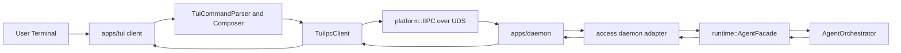
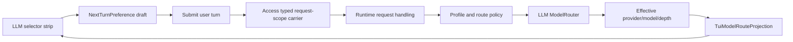
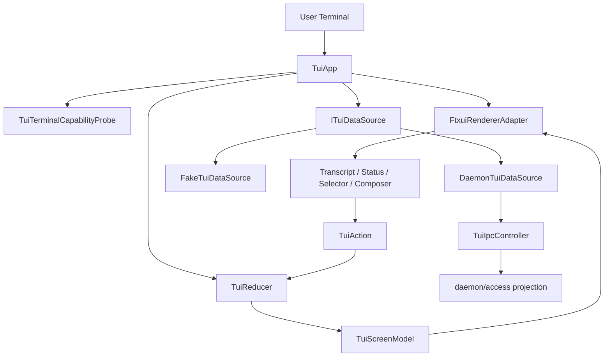

# DASALL TUI 客户端设计方案

文档版本：v0.2
日期：2026-05-13
状态：Draft - component design expanded

## 1. 文档定位

本文档汇总 DASALL TUI 客户端的产品讨论、行业实践调研和现有 DASALL 架构约束，用于冻结新 `dasall` 人机客户端的设计方向、边界、交互模型、技术栈建议与后续 Build 任务拆分。

本文档不是实现说明，也不替代 `DASALL-cli本地控制面详细设计.md`。它是在既有“CLI + daemon + UDS/IIPC + Access -> Runtime 主链”基础上，为新的全屏 TUI 人机入口补充产品与工程设计。

从 v0.2 起，本文同时作为 TUI 专项 TODO 的上游 design baseline：后续任务拆分应从本文的 Design ID、组件卡片、阶段计划、阻塞项与验收矩阵中取数，不应绕过本文另起一套未对齐的实现口径。

## 2. 背景与目标

### 2.1 背景

当前 DASALL 已形成本地控制面方向：入口壳层只负责命令解析、用户交互、结果格式化和 IPC；daemon 负责本地 Access owner 职责，并经 Access -> Runtime 主链进入 AgentOrchestrator。新 TUI 客户端的目标不是新增一个 runtime 主控，也不是把旧结构化 CLI 改造成 REPL，而是在 Product & Access Layer 增加一个适合长时间人机协作的终端界面。

用户侧目标如下：

1. 在安装态通过 bare 命令 `dasall` 直接进入 TUI 客户端。
2. 在同一前台 session 中进行多轮对话、查看当前会话记录、观察执行状态。
3. 在输入区附近查看当前使用的 LLM provider/model/depth，并能设置下一轮请求偏好。
4. 看到受控的执行阶段、工具调用、等待态、恢复摘要和 decision summary，但不暴露原始 Chain-of-Thought。
5. 在 daemon 未启动、终端能力不足或 streaming 未就绪时有清晰降级路径。

### 2.2 设计目标

1. 保持 DASALL 分层与 owner 边界：TUI 只做入口壳层，不直接持有 runtime 主状态机、恢复裁定、上下文编排或模型路由权。
2. 提供优先面向人机交互的全屏终端客户端，默认布局为聊天主屏、右侧状态栏、底部输入区、顶部会话头和底部状态条。
3. 支持当前前台 session 的消息记录浏览，但首版不做多 session 列表、切换或恢复。
4. 提供稳定的输入 composer，支持多行编辑、输入历史、反向搜索、外部编辑器入口和 slash command。
5. 提供 LLM selector strip，表达下一轮请求偏好，而不是绕过 profiles/llm owner 直接选路。
6. 采用成熟 TUI 框架作为渲染和事件循环基座，避免自研 ANSI/termios renderer。
7. 明确 architecture ready / implementation not ready 的现状口径，避免把 supporting types 误表述为端到端流式能力。

### 2.3 非目标

1. 不在首版提供跨启动 session 恢复。
2. 不在首版提供多 session 管理器、左侧会话列表或复杂历史浏览器。
3. 不承诺通用 stream attach、reconnect、replay cursor 或公共 streaming API。
4. 不展示 raw Chain-of-Thought 或 provider-private reasoning_content。
5. 不把 TUI 作为 config owner、runtime owner、RecoveryManager、ContextOrchestrator 或 ModelRouter 的替代实现。
6. 不把 TUI 私有对象提升到 contracts，除非后续需要跨入口共享的稳定语义。

## 3. 行业实践参考

### 3.1 Agent CLI/TUI 产品实践

当前主流 Agent CLI/TUI 工具呈现出几个共同趋势：

1. Claude Code、Gemini CLI、Aider 等工具都把 terminal 作为核心交互面，而不是只做一次性命令执行。
2. Gemini CLI 这类复杂交互终端应用站在成熟 UI 框架之上构建界面、状态和输入，而不是裸写 ANSI 渲染。
3. Aider 这类聊天式终端 Agent 重点依赖成熟输入库处理多行输入、输入历史、搜索和编辑器集成。
4. Textual 生态中已经出现面向 AI coding tools 的 TUI 前端，说明“终端内全屏 Agent 工作台”已经是成熟产品方向。
5. 工业级 CLI 仍保留 headless/script 模式，交互 TUI 与结构化 CLI 通常并存，而不是互相替代。

这些实践对 DASALL 的直接启发是：

1. 自研产品交互模型是必要的，但不应自研最底层终端 renderer 和事件循环。
2. TUI 与脚本化 CLI 应分离命令面：`dasall` 面向人机 TUI，`dasall-cli` 面向脚本和 operator 结构化命令。
3. 输入 composer 是 Agent TUI 的核心能力，重要性不低于聊天主屏。
4. 模型选择、工具状态和执行阶段必须靠受控投影展示，不能让 UI 直接消费内部实现对象。

### 3.2 终端框架实践

候选技术路径如下：

| 路径 | 优点 | 风险 | 结论 |
|---|---|---|---|
| 自建 ANSI/termios renderer | 控制力最高，依赖最少 | 需要长期自养宽字符、CJK、resize、alternate screen、paste、mouse、focus、测试夹具和降级路径 | 淘汰为默认路径 |
| ncurses | 稳定、可打包、历史成熟 | 抽象层较低，复杂布局、composer、selector、状态机仍需大量自建 | 仅作为极简 fallback 候选 |
| notcurses | 现代终端能力强，Unicode 与图形能力强 | 环境与依赖面更复杂，偏富媒体，不适合作为 v1 Agent TUI 默认基座 | 暂不采用 |
| Textual / prompt_toolkit / Ink | 生态成熟，Agent 产品实践多 | 分别引入 Python/Node/TypeScript 运行时，与 DASALL C++/CMake/Debian 主线不贴合 | 仅作产品与交互参考 |
| FTXUI | C++ 原生、CMake 友好、无额外运行时、支持组件/布局/事件循环、UTF-8 和 fullwidth chars | 需要验证 IME、复杂 composer、长 transcript 性能和测试夹具 | 推荐作为首选候选 |

### 3.3 工程化最佳实践落地原则

结合 FTXUI、Textual、prompt_toolkit、Aider、Claude Code、Gemini CLI 等终端产品与框架实践，DASALL TUI 不应只按“画一个终端界面”理解，而应按可测试的交互应用来治理。

推荐冻结以下原则：

1. **Model-View-Update**：所有用户输入、fake/daemon projection、计时刷新、焦点切换都先转化为 `TuiAction`，再由 reducer 更新 `TuiScreenModel`，renderer 只消费 view model。
2. **Clean Architecture for UI shell**：TUI 依赖 `ITuiDataSource` 抽象；prototype 用 `FakeTuiDataSource`，正式实现用 `DaemonTuiDataSource`，两者不改变上层组件语义。
3. **Renderer adapter 隔离**：FTXUI 类型只能出现在 `FtxuiRendererAdapter` 和少量 view 适配层，不能进入 `access`、`runtime`、`contracts`、`llm`、`profiles`，也不能污染 `TuiScreenModel` 单测。
4. **测试金字塔**：优先覆盖 reducer、parser、selector、composer、projection composer；其次做 80x24、120x36、CJK 场景 snapshot/golden；最后补人工样品评审。
5. **终端能力前置探测**：TTY、TERM、宽度高度、UTF-8、CJK 宽字符、bracketed paste、resize、外部编辑器可用性都应先探测，再决定 full-screen、narrow 或 fail-closed 路径。
6. **脚本入口与人机入口分离**：TUI 可以成为最终 bare `dasall` 人机入口，但结构化 CLI 必须保留稳定的 `dasall-cli`，并在打包、文档、测试中明确职责。
7. **安全展示最小化**：TUI 展示投影和摘要，不展示 raw Chain-of-Thought、provider-private reasoning、secret、auth_ref 明文、未经 policy/normalizer 处理的工具输出。
8. **样品先于迁移**：正式命令迁移必须后置于可评审 TUI prototype、权限模型和 packaging smoke matrix；小样阶段不得改变 installed `dasall` 语义。

## 4. DASALL 架构约束

### 4.1 分层边界

新 TUI 客户端归属 Product & Access Layer 的入口壳层。它可以管理终端 UI 状态、草稿、输入历史、当前 session 的前台视图和本地展示缓存，但不得持有以下 owner 权限：

1. Runtime 全局主控权：仍归 runtime/AgentOrchestrator。
2. ContextOrchestrator 权限：仍归 memory/context 侧 owner。
3. Recovery 准入与执行权：仍归 runtime/RecoveryManager。
4. Reflection 语义判断权：仍归 cognition/ReflectionEngine。
5. ModelRoute 与 provider/model/depth 最终裁定权：仍归 profiles/llm/ModelRouter。
6. Tool 执行与权限判断权：仍归 tools/PolicyGate/Executor 与 access policy 链路。

### 4.2 本地控制面复用原则

TUI 客户端以独立的 `apps/tui` 入口工程接入本地 daemon 架构：



关键规则如下：

1. TUI 只构造入口意图、用户输入、slash command 和 next-turn preference，不构造 AgentRequest 内部主控语义。
2. daemon/access 继续负责认证、鉴权、归一化、request_id/session_id/trace_id 生成与结果发布。
3. Runtime 继续负责主循环、任务状态、等待态、恢复、预算和最终 AgentResult。
4. TUI 只消费受控投影，如 TuiSessionSnapshot、TuiStatusProjection、TuiEventProjection、TuiModelRouteProjection。
5. `apps/tui` 与 `apps/cli` 为平行入口工程，只共享 access/platform/infra/contracts 的公共边界，不互相依赖私有实现。

### 4.3 架构兼容与实现成熟度

| 维度 | 结论 | 说明 |
|---|---|---|
| 架构兼容目标 | Ready | TUI 作为 Product & Access Layer 入口壳层，与 CLI + daemon + UDS + Access -> Runtime 主链方向一致 |
| 当前实现成熟度 | Not Ready | 当前仓库没有 TUI substrate；session open/close、TUI 状态投影、模型偏好投影、event feed 均未形成闭环 |
| 首版可交付路径 | Unary + accepted_async + query/poll | LLM internal streaming 已有实现基础，但 access/runtime/TUI 端到端 attach/replay 未闭环，当前不应宣称端到端 stream-ready |
| 未来增强路径 | local-only bounded event feed | 只作为 TUI 私有实时通路，不承诺 reconnect/replay/public streaming |

### 4.4 当前实现基线（2026-05-22）

当前仓库具备部分可复用底座，但距离正式 TUI 仍有明确缺口。后续 TODO 拆分必须以该基线为准，避免把“可复用主链存在”误解为“TUI 已可直接接入”。

| 范畴 | 当前事实 | 对 TUI 的含义 |
|---|---|---|
| `apps/tui` | 当前已接入 non-installed `dasall_tui_prototype` target；`apps/tui/src/main.cpp` 默认保持 fake-only no-daemon placeholder，并在 FTXUI target 已解析时仅追加 private link helper；`apps/tui/src/data/TuiProjectionTypes.h` 已落 module-local projection DTO 基线，`apps/tui/src/data/ITuiDataSource.h` 已落 data source seam 的 request/result/interface 基线，`apps/tui/src/model/TuiAction.h` / `apps/tui/src/model/TuiScreenModel.h` / `apps/tui/src/model/TuiReducer.h/.cpp` 已落 typed MVU model/action/reducer 基线，`tests/unit/tui/TuiReducerTransitionTest.cpp` 与 `tests/unit/tui/TuiDataSourceContractTest.cpp` 已分别守住 reducer 状态迁移与 data source 五个 operation/stable issue contract 的 focused 路径 | `TUI-TODO-012~020` 可复用 prototype substrate、DTO、data source seam 与 model/action/reducer 基线继续演进，但正式 `dasall-tui` / bare `dasall` 迁移仍待后续 gate |
| `apps/cli` | target 名为 `dasall-cli`，但安装产物通过 `OUTPUT_NAME dasall` 占用 bare 命令 | 命令释放是后置迁移任务，不是 UI 小样前置条件 |
| Debian 命令面 | `debian/dasall-cli.install`、manpage、README.Debian、postinst、autopkgtest 当前均围绕 installed `dasall` 结构化 CLI | `/usr/bin/dasall` 改 TUI 会影响 operator 文档、脚本、smoke 和升级路径 |
| 本地 daemon/access | daemon、UDS/IIPC、AccessGateway、readiness、run/status/cancel/diag/knowledge 等本地控制面已可复用 | 正式 TUI 可复用 daemon 主链，但必须通过 access/daemon owner 的 `TuiIpcRequestEnvelope` / `TuiIpcResponseEnvelope` 新增 TUI projection seam |
| 权限模型 | 当前 package/local control plane 主要是 root/sudo-only operator path，普通用户 socket 访问按 fail-closed 处理 | 默认人机 TUI 的启动身份、权限提示和降级路径必须先冻结 |
| runtime session | 现有 session manager 支持 load/prepare/persist/bind/resume seed，不具备 TUI 需要的 open/close/list/query 公共 seam | `/exit`、`/clear`、前台 session 生命周期需要新增或投影化 |
| LLM route | `ModelRouter` 已存在；`ModelSelectionHint` 当前仍未覆盖 provider/model pin 与显式 depth preference，runtime 也尚未把 TUI route preference 投影进 llm route input；但 carrier 决策已冻结为 access/runtime typed sidecar + llm-local route input | LLM selector 可继续先做 UI 草稿和 fake 数据；真实 build 链路按 `TUI-TODO-027~029` 分阶段补齐 |
| Streaming | `LLMManager::stream_generate` 已有实现并具备集成测试；access 仍主要停留在 `stream_requested`、`StreamAttached`、`subscription_ref` 等 supporting shape，runtime/TUI 尚未形成端到端 streaming lifecycle | 首版只能 unary + accepted_async + query/poll；TUI 不接 public streaming |
| 第三方依赖 | `cmake/DASALLThirdParty.cmake` 已冻结 FTXUI 的 default-off resolver 入口、`v6.1.9` / `5cfed50702f52d51c1b189b5f97f8beaf5eaa2a6` pin 与 `apps/tui` private link helper | renderer/snapshot/full-screen 小样仍需 CJK/IME/resize 与 packaging review gate |
| TUI 测试拓扑 | `tests/unit/tui`、`tests/integration/tui`、`tests/fixtures/tui/golden` 已物化，顶层 CMake 可发现 `TuiScreenModelTest` / `TuiReducerTransitionTest` / `ITuiDataSourceContractTest` / `TuiComposerTest` / `TuiPrototypeSmokeTest` / `TuiPrototypeBuildSmokeTest`，且 label 已区分 `unit` / `integration` / `snapshot` | 后续 `TUI-TODO-012~020` 可以复用稳定的 discoverability 与 prototype build smoke 入口，不必边实现边补测试注册 |

现状结论：DASALL 对 TUI 的架构方向是 ready，但正式实现是 implementation not ready。最稳妥执行顺序是：先 fake-only 可交互小样，再补 projection/data-source seam，再接 daemon/session，再处理命令与打包迁移。

## 5. 产品形态设计

### 5.1 命令所有权

推荐冻结如下命令面：

1. `dasall`：安装态默认进入 TUI。
2. `dasall-cli`：保留结构化控制面 CLI，负责配置、调试、诊断、运维操作以及 CI 和 headless 自动化。

该策略定义最终目标命令面：bare `dasall` 对最终用户表达为“进入 DASALL 客户端”，全部结构化控制面命令统一收敛到 `dasall-cli`。
但命令释放不是 TUI prototype 的前置动作。只有当 TUI 样品通过评审、权限模型冻结、`dasall-cli` 兼容矩阵完成、packaging smoke 更新完成后，才允许把 installed `dasall` 从旧结构化 CLI 迁移到 TUI。
命令释放与迁移的实施细节见附录 B。

### 5.2 会话生命周期

首版采用短生命周期前台 session：

1. 每次进入 `dasall` 创建新的前台 session_id。
2. 后续每轮用户请求复用该 session_id。
3. `/exit` 或正常退出触发显式 session close。
4. 退出后不跨启动恢复旧会话。
5. `/clear` 已冻结为“清空当前前台 transcript 与当前 session 绑定的本地展示状态，并在当前进程内切到新的前台 session 语义”；input history 保留，当前 composer draft 清空，即时 daemon close/open 后置到 session seam 明确之后。

该设计刻意避开首版多 session 管理复杂度，符合当前 runtime session seam 尚未具备完整 close/list/query 生命周期的现状。

### 5.3 主界面布局

首版采用“聊天主屏 + 右侧状态栏”的两区布局：

1. 顶部会话头：显示 session、daemon readiness、profile、当前模式。
2. 主消息区：展示当前 session 的 user/assistant/system summary 消息和可折叠工具摘要。
3. 右侧状态栏：展示阶段、工具、等待态、预算、恢复、安全模式、decision summary。
4. LLM selector strip：位于输入框上方，显示 Current route 和 Next preference。
5. 底部 composer：多行输入、slash command、prompt history、状态提示。
6. 底部状态条：显示 keymap、提交状态、错误摘要、降级提示。

首版不做左侧 session 列表、不做多 session 切换、不做独立历史 viewer。

### 5.4 会话记录与输入历史

会话记录和输入历史必须分离：

1. 会话记录是当前前台 session 的 transcript，在主消息区内滚动浏览。
2. 输入历史是用户输入过的 prompt 草稿和已发送内容，用 Up/Down 边界导航与 Ctrl+R 反向搜索访问。
3. 工具轨迹默认以摘要折叠在消息区或右栏展示，不把原始长日志直接塞进主 transcript。
4. 若后续工具轨迹密度过高，再追加 transcript viewer，不在首版引入复杂历史浏览器。

### 5.5 输入 composer

输入区采用底部 composer：

1. 默认 3 行，最多扩展到 6 行。
2. 超过 6 行后输入区内部滚动，不继续挤压主消息区。
3. 默认 `Enter` 发送。
4. `Alt+Enter` 或 `Ctrl+J` 插入换行。
5. 仅当输入为单行且首个非空字符为 `/` 时按 slash command 解析，否则按普通消息发送。
6. Up/Down 先服务输入框内光标移动，只有在输入为空或光标处于边界且内容未修改时切换 prompt history。
7. `Ctrl+R` 进入输入历史反向搜索。
8. `/editor` 打开外部编辑器，保存后回填 composer，取消则保留原草稿。
9. assistant 回合执行中允许继续编辑草稿，但禁用再次发送。
10. 必须优先保证 UTF-8、CJK 宽字符和终端 IME 兼容；能力不足时降级为普通行输入或外部编辑器。

Composer 状态至少包括：

| 状态 | 语义 |
|---|---|
| ready | 可输入、可发送 |
| editing | 正在编辑草稿 |
| history-recall | 正在浏览输入历史 |
| reverse-search | 正在反向搜索历史输入 |
| external-editor | 正在外部编辑器中编辑 |
| submitting | 正在提交当前用户轮次 |
| pending-interaction | 等待澄清、确认或其他用户交互 |

### 5.6 Slash command

首版 slash command 仅保留最小集合：

| 命令 | 行为 | owner 边界 |
|---|---|---|
| `/help` | 展示 TUI 内帮助与 keymap | TUI local |
| `/status` | 查询当前 session/daemon/runtime 摘要 | daemon/access projection |
| `/session` | 展示当前 session_id、启动时间、profile、route 摘要 | daemon/access projection |
| `/clear` | 清空当前前台 transcript 与本地状态，留在当前进程并切到新的前台 session 语义；保留 input history，不要求即时 daemon close/open | TUI + session seam |
| `/editor` | 打开外部编辑器编辑长文本 | TUI local |
| `/exit` | 关闭当前前台 session 并退出 | TUI + daemon session close |

首版不引入自由脚本命令，不允许 slash command 绕过 access policy gate。

### 5.7 权限与启动降级语义

TUI 是人机入口，但 DASALL 当前安装态控制面仍带有 root/sudo-only operator 色彩。正式把 `dasall` 交给 TUI 前，必须冻结以下启动语义：

| 启动场景 | TUI 行为 | 不允许行为 |
|---|---|---|
| 非 TTY 或 stdout/stderr 被管道捕获 | fail-closed，提示使用 `dasall-cli`；必要时仅输出机器可读错误码 | 强行进入 full-screen alternate screen |
| 终端尺寸低于最低基线 | 进入 narrow/fallback 布局，或提示调整终端后退出 | 布局重叠、吞掉 composer 或错误信息 |
| daemon 未运行 | 展示 daemon unavailable 状态和可执行 next step；不直接启动系统 daemon | 在 TUI 内隐式提权或修改系统配置 |
| 普通用户无权访问 socket | 展示 permission denied 与当前 operator 模型说明；引导到文档或 `dasall-cli` 运维路径 | 要求用户在 TUI 中输入 sudo 密码 |
| profile/provider 未配置 | 允许进入 limited ready 状态，只禁用真实提交或 route 选择 | 把 profile 解析和 secret 读取下沉到 TUI |
| FTXUI/终端输入能力不足 | 降级到普通行输入或 `/editor` 路径 | 在不可用 composer 中丢失用户草稿 |

本专项当前冻结结论：v1 daemon-backed TUI 继承已冻结的 `/run/dasall/daemon.sock` + `0600 root/sudo-only` operator model；普通用户命中 socket 权限时只允许 fail-closed `permission denied`/limited explanation，不允许 TUI 内提权、改组或偷开 user-level daemon/socket；若未来要支持普通用户无 sudo 的 full-function TUI，必须围绕 `$XDG_RUNTIME_DIR`、用户态 daemon 生命周期与 packaging/onboarding 另起设计冻结。

## 6. LLM selector strip 设计

### 6.1 控件定位

LLM selector strip 位于输入框上方，是“当前模型信息 + 下一轮偏好切换”的统一入口。它区分两个语义：

1. Current：上一轮或当前 assistant 回合实际生效的 provider/model/reasoning_depth_tier。
2. Next：用户下一轮请求的偏好草稿。

TUI 只拥有 Next preference 草稿，不拥有最终模型路由权。

### 6.2 三种模式

首版不提供三个完全自由下拉，而采用三种模式：

| 模式 | 用户含义 | 路由语义 | 失败语义 |
|---|---|---|---|
| Auto | 使用 profile 默认路由和降级链 | 不增加显式偏好 | 允许既有 degrade/fallback |
| Prefer Depth | 偏好 shallow/standard/deep | 表达 reasoning_depth_tier 偏好，由 ModelRouter 裁定 | 不满足时按 profile 策略处理 |
| Pin Model | 固定 provider/model | 显式 pin provider/model，depth 由模型元数据派生 | 不满足 allowlist/health/verification 时 fail-closed |

### 6.3 过滤与权限

可选项必须受以下条件过滤：

1. 当前 effective profile。
2. profile allowlist。
3. provider/model verification_state。
4. provider/model health snapshot。
5. 当前 stage 与 task type 的 route policy。
6. 安全策略和本地凭证状态。

禁用项可少量展示，但必须显示原因，例如 `not verified`、`provider unhealthy`、`profile disallows cloud`。

### 6.4 数据链路建议



实现时优先定义 TUI 私有的 `NextTurnPreference` 和 `TuiModelRouteProjection`，不要直接让 UI 持有 ModelCatalogEntry 或 RuntimePolicySnapshot 的内部对象。`request_context` 若需要，只允许镜像审计 crumbs，不是 `NextTurnPreference` 的唯一 carrier。

### 6.5 NextTurnPreference 最小语义

`NextTurnPreference` 是 TUI 的草稿语义，不是最终路由决定。建议最小字段如下：

```cpp
enum class TuiRoutePreferenceMode {
  kAuto,
  kPreferDepth,
  kPinModel,
};

struct NextTurnPreference {
  TuiRoutePreferenceMode mode = TuiRoutePreferenceMode::kAuto;
  std::optional<std::string> preferred_depth_tier;
  std::optional<std::string> pinned_provider_id;
  std::optional<std::string> pinned_model_id;
  std::string user_visible_summary;
  std::string source = "tui";
  bool applies_to_next_turn_only = true;
};
```

示例必须使用仓库真实 provider/model 口径，例如 `deepseek-prod/deepseek-chat`、`deepseek-prod/deepseek-reasoner`。如果小样中为了视觉简洁写 `deepseek/deepseek-chat`，必须标注为 mock display label，不得作为真实配置 ID。

### 6.6 与当前 ModelSelectionHint 的差距

当前 `ModelSelectionHint` 更接近 runtime/llm 对任务复杂度、延迟、预算和 reasoning 需要的提示，不覆盖 TUI 需要表达的 provider/model pin 与显式 depth preference。当前 runtime 构造 LLM request 时也还没有把 TUI route preference 真正投影进去。

本轮已冻结的真实链路如下：

1. TUI 内部继续维护 `NextTurnPreference` draft，并通过 `TuiIpcRequestEnvelope.submit_turn.payload.next_preference` 把用户下一轮偏好交给 access owner。
2. `RequestNormalizer` 将该 draft 归一化为 typed `NextTurnPreferenceCarrier`，放入 `RuntimeDispatchRequest` / `RuntimeInvokeContext` 之类的 request-scope sidecar；`request_context` 只允许镜像审计 crumbs，不能成为唯一 carrier。
3. `AgentRequest.client_capabilities` 不承载这类 next-turn route intent；profile override 也不允许承载该语义，因为 profile/runtime policy owner 继续归 profiles。
4. llm route 层应为 `ModelSelectionHint` 增加 optional `route_preference` supporting field，或提供等价的 llm-local route input；无论采用哪种做法，最终裁定权仍归 `ModelRouter`。
5. `Auto` 表示无显式偏好；`PreferDepth` 是 advisory，会按 profile 策略回退；`PinModel` 则在 disallowed/unavailable/not-supported 时 fail-closed，不允许静默回落到其他 provider/model 冒充“pin 已生效”。

在 `TUI-TODO-027~029` 完成前，TUI 仍不得承诺真实 provider/model pin 已经 build-ready；当前只是 carrier 与失败语义已冻结。

## 7. 状态、reasoning summary 与 streaming 口径

### 7.1 可展示内容

TUI 可展示以下受控投影：

1. runtime stage：Receiving、Planning、Reasoning、ToolCalling、WaitingConfirm、Reflecting、Responding 等。
2. tool summary：工具名、风险等级、开始/结束、成功/失败、Observation Digest 摘要。
3. pending interaction：澄清、确认、等待外部事件。
4. budget summary：round/tool/token/latency 的摘要级状态。
5. recovery summary：ReflectionDecision 摘要与 RecoveryManager 准入结果。
6. safe mode/degraded：安全收敛、降级状态和原因。
7. decision summary：面向用户的简短决策摘要。

### 7.2 禁止展示内容

1. raw Chain-of-Thought。
2. provider-private `reasoning_content`。
3. 未经 normalizer/audit/policy 处理的原始工具输出。
4. access/runtime 内部对象 dump。
5. secret、auth_ref 明文、凭证路径和敏感配置。

### 7.3 Streaming 现状口径

当前 DASALL 的 LLM internal streaming 已有实现基础：`LLMManager::stream_generate` 与 adapter-level streaming integration test 已落地，contracts/access 也保留 `stream_requested`、`StreamAttached`、`subscription_ref` 等 supporting shape。需要保持的口径是：这些进展不等同于端到端 TUI/CLI streaming ready。DeepSeek 协议层支持 OpenAI-compatible SSE 和 `stream=true`，未来可兼容，但当前缺口包括：

1. access attach/subscription 生命周期、错误码和权限语义。
2. runtime 主链从 unary/polling 到可观测 event lifecycle 的投影方式。
3. TUI/CLI 事件消费、bounded feed 和 UI backpressure 行为。
4. reconnect/replay cursor contract。
5. installed provider streaming smoke 与 release gate 证据。

因此首版 TUI 不应宣称 stream-ready。推荐交付路径为：

1. v1：unary + accepted_async + query/poll 刷新。
2. v1.1：local-only bounded event feed，仅供 TUI 私有实时状态更新。
3. future：等待 access gate 与 llm streaming lifecycle 冻结后，再支持通用 streaming。

### 7.4 TUI 状态投影边界

TUI 只能消费面向 UI 的 projection，不消费 runtime/access/llm 内部对象 dump。当前冻结的投影边界如下：

| Projection | 来源 owner | 展示用途 | 禁止内容 |
|---|---|---|---|
| `TuiSessionView` | daemon/access session seam | header、`/session`、退出确认 | runtime 内部 checkpoint/body dump |
| `TuiTurnReceipt` | access async receipt/status | 提交状态、accepted/completed/error | 未归一化 exception 或 stack trace |
| `TuiStatusProjection` | runtime 经 access 投影 | stage、pending、budget、recovery、health | RecoveryManager 内部对象、raw policy state |
| `TuiToolSummaryView` | tools/runtime 经 access 摘要 | 工具名、风险、观察摘要、耗时 | 原始工具输出、secret、路径敏感明文 |
| `TuiModelRouteProjection` | profile/llm route 投影 | Current route、disabled reason、Next preference 可选项 | provider secret、完整 profile 文件 |
| `TuiRouteCatalogView` | profile/llm/access route catalog projection | selector modal、当前 route 与候选 route 列表 | provider secret、完整 allowlist 文档、完整 profile 配置文件 |
| `TuiEventProjection` | TUI 私有 poll/event feed | 局部刷新、badge 更新、进度提示 | 公共 streaming/replay contract |

投影字段应优先保持 user-visible、summary、reason-code、timestamp、correlation id 级别，避免把内部对象结构固化为 UI 依赖。

daemon-backed TUI v1 通过 access/daemon owner 的 `TuiIpcRequestEnvelope` / `TuiIpcResponseEnvelope` 接入本地控制面；逻辑 operation 固定为 `open_session`、`submit_turn`、`poll_events`、`route_catalog`、`close_session`。`permission_denied`、`daemon_unavailable`、`timeout`、`schema_mismatch`、`malformed_response` 等失败必须以稳定 reason code 暴露，TUI 不得解析 raw carrier、CLI JSON envelope 或 runtime/access 内部对象来推断错误语义。

## 8. 技术栈建议

### 8.1 推荐结论

推荐采用 FTXUI 作为首选 TUI 框架候选，并在 DASALL 内部包一层自有 seam：

```text
apps/tui
  -> TuiApp
  -> TuiScreenModel
  -> TuiTranscriptView
  -> TuiStatusPanel
  -> TuiModelSelector
  -> TuiComposer
  -> TuiEventBus
  -> FTXUI adapter
```

该 seam 固定放在独立的 `apps/tui` 工程内，不再挂靠 `apps/cli`。
FTXUI 不应泄漏到 access、runtime、contracts、llm、profiles、tools 等模块。所有模块间共享语义通过 DASALL 自有对象表达。

### 8.2 采用 FTXUI 的理由

1. 与 DASALL C++20/CMake 主线一致。
2. 不引入 Python/Node 等额外运行时。
3. 支持组件、布局、事件循环、键盘和鼠标事件。
4. 支持 UTF-8 与 fullwidth chars，贴近中文/CJK 输入展示需求。
5. CMake/FetchContent/submodule/local cache 接入方式与仓库现有第三方依赖治理方向一致。
6. 相比 ncurses 层级更高，能减少布局、组件、事件循环和状态更新的自研成本。

### 8.3 技术验证项

在正式引入前必须先做小样验证：

1. CJK 宽字符显示与输入编辑。
2. IME 输入与 bracketed paste 行为。
3. 窗口 resize 后布局稳定性。
4. 主消息区长 transcript 滚动性能。
5. composer 多行编辑与外部编辑器切换。
6. 右侧状态栏异步刷新。
7. 非 TTY、TERM 异常、低能力终端的降级路径。

### 8.4 FTXUI 接入治理

FTXUI 可以作为首选候选，但接入方式必须和 DASALL third-party 治理一致：

1. 先在 prototype target 中接入，不安装、不改变 bare `dasall`，只服务可交互样品验证。
2. 通过 `cmake/DASALLThirdParty.cmake` 统一管理依赖来源，优先遵循仓库既有 submodule/local cache/FetchContent fallback 策略，并固定版本或 commit；当前冻结 pin 为 `v6.1.9` / `5cfed50702f52d51c1b189b5f97f8beaf5eaa2a6`，resolver 保持 default-off，直到 TUI target 真正接线。
3. TUI target 只以 private dependency 链接 `ftxui::component`、`ftxui::dom`、`ftxui::screen` 或等价 umbrella target；当前仓内 helper 落在 `apps/tui/CMakeLists.txt`，禁止上游模块链接或 include FTXUI。
4. 建立 `render_to_screen()` 或等价 snapshot harness，至少覆盖 80x24、120x36、narrow CJK、selector modal、busy draft。
5. 若 IME 或 composer 行为不满足最低门槛，正式实现必须降级为更保守的输入策略，例如行输入 + `/editor`。
6. 若 FTXUI 打包路径与 Debian policy 冲突，正式命令迁移必须延后，不得用未验证的 vendored 依赖进入安装态；由于 upstream 已存在 Debian/Ubuntu package 分发渠道，installed path 必须额外经过 packaging review，而不是默认长期保留 convenience copy。

## 9. 工程落点与组件设计深化

### 9.1 目录与 target 建议

```text
apps/tui/
  CMakeLists.txt
  src/
    main.cpp
    app/TuiApp.h/.cpp
    model/TuiAction.h
    model/TuiScreenModel.h/.cpp
    model/TuiReducer.h/.cpp
    data/ITuiDataSource.h
    data/FakeTuiDataSource.h/.cpp
    data/DaemonTuiDataSource.h/.cpp
    data/TuiProjectionTypes.h
    ipc/TuiIpcController.h/.cpp
    view/TuiTranscriptView.h/.cpp
    view/TuiStatusPanel.h/.cpp
    view/TuiComposer.h/.cpp
    view/TuiModelSelector.h/.cpp
    view/TuiModalView.h/.cpp
    view/TuiDesignTokens.h
    view/TuiLayoutMetrics.h
    command/TuiSlashCommandParser.h/.cpp
    terminal/TuiTerminalCapabilityProbe.h/.cpp
    terminal/FtxuiRendererAdapter.h/.cpp
tests/unit/tui/
tests/integration/tui/
tests/fixtures/tui/
```

TUI 固定拆分到独立 `apps/tui/`。CLI 保持在 `apps/cli/`，两者分别拥有自己的 `main`、target、依赖声明和打包入口，只通过 access/platform/contracts 等公共边界交互，不共享彼此私有实现。

建议 target 分两阶段治理：

| target | 产物 | 阶段 | 安装态 | 说明 |
|---|---|---|---|---|
| `dasall_tui_prototype` | `dasall_tui_prototype` | 小样/样品评审 | 不安装 | fake-only，不接 daemon，不改变 `dasall` 命令 |
| `dasall-tui` | `dasall` | 正式 TUI | 满足门禁后安装 | 接 daemon projection，成为最终 bare `dasall` owner |
| `dasall-cli` | `dasall-cli` | 结构化 CLI | 命令迁移同批安装 | 保留配置、诊断、CI、operator 自动化路径 |

### 9.2 核心对象与接口草案

以下对象是 TUI module-local design surface，默认不进入 `contracts`。只有当多个入口需要复用同一稳定语义时，才评估是否上升为 shared contracts。

```cpp
struct TuiSessionView {
  std::string session_id;
  std::string profile_id;
  std::string daemon_readiness;
  std::string startup_mode;
  std::string started_at;
};

struct TuiMessageView {
  std::string role;
  std::string content;
  std::string timestamp;
  std::vector<std::string> badges;
  bool collapsible = false;
  bool collapsed = false;
};

struct TuiStatusProjection {
  std::string stage;
  std::string current_tool;
  std::string pending_interaction;
  std::string budget_summary;
  std::string recovery_summary;
  std::string health_summary;
  std::string safe_mode_summary;
};

struct TuiModelRouteProjection {
  std::string current_provider_id;
  std::string current_model_id;
  std::string current_depth_tier;
  std::vector<std::string> disabled_reasons;
  NextTurnPreference next_preference;
};

struct TuiComposerState {
  std::string text;
  std::string mode = "ready";
  std::optional<std::string> history_query;
  bool can_submit = true;
  bool dirty = false;
};

enum class TuiFocusState {
  Transcript,
  Composer,
  Selector,
  StatusPanel,
  Modal,
};

enum class TuiBannerLevel {
  Info,
  Warning,
  Error,
};

struct TuiBanner {
  TuiBannerLevel level = TuiBannerLevel::Info;
  std::string title;
  std::string message;
  std::optional<std::string> reason_code;
  bool sticky = false;
};

enum class TuiModalKind {
  None,
  Selector,
  Confirm,
  Help,
  Session,
};

struct TuiModalState {
  TuiModalKind kind = TuiModalKind::None;
  std::string title;
  std::string body;
  std::vector<std::string> actions;
  std::optional<std::size_t> selected_action_index;
};

struct TuiScreenModel {
  TuiSessionView session;
  std::vector<TuiMessageView> transcript;
  TuiStatusProjection status;
  TuiModelRouteProjection route;
  TuiComposerState composer;
  TuiFocusState focus = TuiFocusState::Composer;
  std::vector<TuiBanner> banners;
  TuiModalState modal;
  std::string debug_reason;
};

class ITuiDataSource {
 public:
  virtual ~ITuiDataSource() = default;
  virtual TuiSessionView open_session() = 0;
  virtual TuiTurnReceipt submit_turn(std::string user_input,
                                     NextTurnPreference preference) = 0;
  virtual std::vector<TuiEventProjection> poll_events() = 0;
  virtual TuiRouteCatalogView route_catalog() = 0;
  virtual void close_session(std::string session_id) = 0;
};
```

`ITuiDataSource` 是 TUI 正式实现的关键 seam。prototype 阶段只实现 fake source；正式阶段再接 daemon source。上层组件不感知数据来自 fake、polling、daemon projection 或未来 bounded event feed。

### 9.3 依赖规则

1. TUI 可以依赖 access public objects、platform IIPC、infra 通用接口以及 contracts 暴露的稳定语义。
2. TUI 不依赖 `apps/cli` 的任何私有对象、工具函数或默认配置基线。
3. CLI 同样不依赖 `apps/tui` 的任何私有对象、渲染组件或状态模型。
4. TUI 不直接依赖 runtime implementation、llm provider implementation、profile secret 文件或 daemon 私有实现。
5. TUI 不直接构造 `AgentRequest` 内部主控语义；归一化、鉴权、trace/session/request id 仍由 daemon/access 负责。
6. FTXUI 仅作为 `apps/tui` private dependency，且只允许 renderer/view adapter include。
7. 测试代码可以使用 fake scenario 和 snapshot harness，但不能把 fake schema 误命名成正式 contract。

### 9.4 组件拓扑



### 9.5 组件级设计卡片

#### 9.5.1 `TuiApp`

1. 职责：启动终端探测、装配 data source、创建 event loop、协调 renderer 与 reducer、处理退出路径。
2. 非职责：不解析 profile 文件，不直接访问 runtime，不做模型路由，不持久化长期 session。
3. 核心数据：消费 `TuiTerminalCapabilities`、`ITuiDataSource`、`TuiScreenModel`；输出进程退出码和用户可见错误。
4. 接口：`int TuiApp::run(TuiAppOptions options)`；内部 `dispatch_action()`、`tick()`、`shutdown()`。
5. 执行流：probe terminal -> 选择 fake/daemon source -> open session -> 进入 renderer loop -> action/reducer 更新 -> close session。
6. 失败语义：非 TTY、终端过小、daemon 不可用、permission denied 均返回可判定错误，不隐式提权。
7. 测试出口：`TuiAppStartupTest`、`TuiPrototypeSmokeTest`；验收 `ctest --preset vscode-linux-ninja -R "Tui(AppStartup|PrototypeSmoke)" --output-on-failure`。

#### 9.5.2 `TuiScreenModel` 与 `TuiReducer`

1. 职责：集中保存 UI 状态，并以纯 reducer 方式响应 `TuiAction`。
2. 非职责：不包含 FTXUI 类型，不做 I/O，不调用 daemon，不读取系统时间。
3. 核心数据：`TuiScreenModel`、`TuiAction`、`TuiFocusState`、`TuiBanner`、`TuiModalState`。
4. 接口：`TuiScreenModel reduce(TuiScreenModel current, TuiAction action)`；内部按 action type 分发，当前基线使用既有 typed action family，并把 submit 路径收敛为 `ComposerModeChanged("submitting")` 的状态迁移。
5. 执行流：用户/数据源事件 -> action -> reducer -> 新 model -> renderer 重绘。
6. 失败语义：未知 action 保持 no-op 并记录 debug reason；非法状态转换 fail-closed 到 banner/modal；当前最小实现已固定 `FocusChanged -> Modal` 且无 active modal 时走 error banner fail-closed。
7. 测试出口：`TuiScreenModelTest`、`TuiReducerTransitionTest`；验收 `ctest --preset vscode-linux-ninja -R "Tui(ScreenModel|Reducer)" --output-on-failure`；当前 focused reducer baseline 已通过 compile、single-test 和 discoverability 验证。

#### 9.5.3 `ITuiDataSource`、`FakeTuiDataSource`、`DaemonTuiDataSource`

1. 职责：为 UI 提供 session、turn receipt、status、route catalog、event projection 的统一来源。
2. 非职责：不拥有 UI 状态，不展示错误，不决定 route，不绕过 access policy。
3. 核心数据：`TuiSessionView`、`TuiTurnReceipt`、`TuiEventProjection`、`TuiRouteCatalogView`。
4. 接口：`open_session()`、`submit_turn()`、`poll_events()`、`route_catalog()`、`close_session()`。
5. 执行流：prototype 从 deterministic scenario 取数；正式实现经 `TuiIpcController` 访问 daemon projection。
6. 失败语义：fake source 不允许网络/IPC；daemon source 将连接失败、权限失败、超时映射为 user-visible reason code。
7. 测试出口：`FakeTuiDataSourceTest`、`DaemonTuiDataSourceContractTest`；验收 `ctest --preset vscode-linux-ninja -R "Tui(FakeDataSource|DaemonDataSource)" --output-on-failure`。

#### 9.5.4 `TuiIpcController`

1. 职责：封装 TUI 到 daemon 的本地 IPC 请求、超时、序列化、错误归一化。
2. 非职责：不渲染 UI，不解析 slash command，不直接调用 runtime facade。
3. 核心数据：消费 daemon endpoint、`TuiIpcRequestEnvelope`、`TuiIpcResponseEnvelope`、timeout policy；输出 TUI projection DTO。
4. 接口：`open_session()`、`submit_turn()`、`poll_events()`、`query_route_catalog()`、`close_session()`。
5. 执行流：TUI DTO / action -> `TuiIpcRequestEnvelope` -> platform IIPC -> daemon/access -> `TuiIpcResponseEnvelope` -> projection DTO -> data source。
6. 失败语义：socket 不存在、permission denied、timeout、schema mismatch、malformed response 都必须映射成稳定 reason code。
7. 测试出口：`TuiIpcControllerTest`、`TuiIpcPermissionDeniedTest`；验收 `ctest --preset vscode-linux-ninja -R "TuiIpc" --output-on-failure`。

#### 9.5.5 `TuiComposer`

1. 职责：多行输入、发送/换行、输入历史、反向搜索、外部编辑器、busy draft。
2. 非职责：不提交 daemon 请求，不解析非输入区全局快捷键，不持久化长期历史。
3. 核心数据：`TuiComposerState`、`TuiInputHistory`、`TuiComposerAction`。
4. 接口：`handle_key()`、`set_busy()`、`recall_history()`、`open_external_editor()`。
5. 执行流：key event -> composer action -> reducer 更新 draft/history/search -> submit action。
6. 失败语义：外部编辑器失败保留原草稿；busy 状态禁止重复提交；IME 不稳时降级到行输入或 `/editor`。
7. 测试出口：`TuiComposerTest`、`TuiComposerHistoryTest`、人工 IME 矩阵；验收 `ctest --preset vscode-linux-ninja -R "TuiComposer" --output-on-failure`。

#### 9.5.6 `TuiModelSelector`

1. 职责：展示 Current route、维护 Next preference 草稿、处理 Auto/Prefer Depth/Pin Model 三模式。
2. 非职责：不直接修改 profile，不读取 provider secret，不绕过 ModelRouter。
3. 核心数据：`TuiModelRouteProjection`、`NextTurnPreference`、`TuiRouteCatalogView`。
4. 接口：`open_selector()`, `apply_preference()`, `cancel_preference()`, `render_disabled_reason()`。
5. 执行流：route catalog -> 可选项过滤展示 -> 用户选择 -> `NextTurnPreference` draft -> `submit_turn` -> access/runtime typed carrier -> `ModelRouter` -> `TuiModelRouteProjection` 回显。
6. 失败语义：不可用 provider/model 显示 disabled reason；`PreferDepth` 未命中时按 profile 策略回退并回显 effective route；`PinModel` 不满足 allowlist/health/verification/credentials 时 fail-closed。
7. 测试出口：`TuiModelSelectorTest`、`TuiRouteCatalogFilterTest`；验收 `ctest --preset vscode-linux-ninja -R "Tui(ModelSelector|RouteCatalog)" --output-on-failure`。

#### 9.5.7 `TuiTranscriptView`

1. 职责：展示当前前台 session 的 user/assistant/system summary、tool summary、折叠块和滚动状态。
2. 非职责：不持久化历史，不展示 raw Chain-of-Thought，不展示未清洗工具输出。
3. 核心数据：`TuiMessageView`、`TuiToolSummaryView`、scroll offset、collapse state。
4. 接口：`render_transcript()`、`toggle_collapse()`、`scroll_to_bottom()`。
5. 执行流：projection/update action -> message view append/update -> layout wrap -> render。
6. 失败语义：超长消息按摘要/折叠/截断策略处理，不挤压 composer；CJK 宽度异常进入 snapshot gate。
7. 测试出口：`TuiTranscriptViewTest`、`TuiRenderSnapshotTest`；验收 `ctest --preset vscode-linux-ninja -R "Tui(TranscriptView|RenderSnapshot)" --output-on-failure`。

#### 9.5.8 `TuiStatusPanel`

1. 职责：展示 stage、tool、pending、budget、recovery、health、safe mode、decision summary。
2. 非职责：不裁定 recovery，不执行 tool，不计算 budget，不读取内部 runtime state。
3. 核心数据：`TuiStatusProjection`、`TuiHealthBadge`、`TuiBudgetBadge`。
4. 接口：`render_status_panel()`、`format_stage_badge()`、`format_health_summary()`。
5. 执行流：status projection -> badge 归一化 -> narrow/full layout render。
6. 失败语义：缺字段显示 unknown/degraded；颜色仅作增强，必须有文本 reason。
7. 测试出口：`TuiStatusPanelTest`、`TuiStatusProjectionContractTest`；验收 `ctest --preset vscode-linux-ninja -R "Tui(StatusPanel|StatusProjection)" --output-on-failure`。

#### 9.5.9 `TuiSlashCommandParser`

1. 职责：解析首版 slash command，并把本地命令或 daemon projection 查询转为 `TuiAction`。
2. 非职责：不执行任意 shell，不实现自由脚本，不绕过 access policy gate。
3. 核心数据：`TuiSlashCommand`、`TuiSlashCommandParseResult`、help/keymap metadata。
4. 接口：`parse(std::string_view line)`、`to_action()`、`help_entries()`。
5. 执行流：composer submit -> 首字符判断 -> parser -> local action 或 data source query action。
6. 失败语义：未知命令不提交 daemon，返回本地错误和建议；危险命令不存在隐式兜底。
7. 测试出口：`TuiSlashCommandParserTest`；验收 `ctest --preset vscode-linux-ninja -R "TuiSlashCommandParser" --output-on-failure`。

#### 9.5.10 `TuiTerminalCapabilityProbe`

1. 职责：检测 TTY、尺寸、TERM、UTF-8、粘贴、resize、外部编辑器和最低交互能力。
2. 非职责：不修改终端永久配置，不启动 daemon，不做 root/sudo 提权。
3. 核心数据：`TuiTerminalCapabilities`、`TuiStartupMode`、`TuiStartupIssue`。
4. 接口：`probe()`, `select_startup_mode()`, `format_startup_error()`。
5. 执行流：进程启动 -> probe -> full/narrow/line/fail-closed 决策 -> banner 或退出。
6. 失败语义：非 TTY、尺寸过小、TERM 异常必须可判定；任何 terminal state 修改都需 RAII 恢复。
7. 测试出口：`TuiTerminalCapabilityProbeTest`、人工终端矩阵；验收 `ctest --preset vscode-linux-ninja -R "TuiTerminalCapability" --output-on-failure`。

#### 9.5.11 `FtxuiRendererAdapter`、`TuiDesignTokens`、`TuiLayoutMetrics`

1. 职责：将 view model 转为 FTXUI component/element，集中治理颜色、间距、badge、布局断点和 snapshot 输出。
2. 非职责：不持有业务状态，不调用 data source，不把 FTXUI 类型泄漏到 reducer/model。
3. 核心数据：`TuiDesignTokens`、`TuiLayoutMetrics`、`TuiRenderFrame`。
4. 接口：`render_root()`, `render_to_screen()`, `apply_layout_metrics()`。
5. 执行流：screen model -> layout metrics -> view render -> FTXUI screen -> terminal/snapshot。
6. 失败语义：布局不可容纳时进入 narrow/fallback；snapshot diff 需人工确认后更新 golden。
7. 测试出口：`TuiDesignTokensTest`、`TuiMainLayoutSnapshotTest`、`TuiRenderSnapshotTest`；验收 `ctest --preset vscode-linux-ninja -R "Tui(DesignTokens|MainLayoutSnapshot|RenderSnapshot)" --output-on-failure`。

### 9.6 ViewModel 与 Projection 边界

| 层级 | 示例对象 | owner | 可否上升 contracts | 规则 |
|---|---|---|---|---|
| UI ViewModel | `TuiScreenModel`、`TuiComposerState` | `apps/tui` | 否 | 只服务渲染和交互测试 |
| TUI DTO | `TuiSessionView`、`TuiStatusProjection`、`TuiTurnReceipt`、`TuiModelRouteProjection`、`TuiEventProjection` | `apps/tui` + access projection seam | 否（v1 维持 module-local） | 可跨 fake/daemon source 复用，但不因复用上升 shared contracts |
| Access/Daemon Projection | `TuiIpcRequestEnvelope`、`TuiIpcResponseEnvelope`、daemon readiness、status receipt、route catalog view | access/daemon | 否（v1 保持 owner-local） | carrier/envelope 保持 access/daemon owner；除非 CLI/gateway 也证明需要同一稳定对象，否则不提升 |
| Runtime Internal | `SessionSnapshot`、recovery internals、budget internals | runtime | 否 | TUI 不直接消费 |
| LLM Internal | provider adapter response、private reasoning、secret refs | llm/profiles | 否 | 只能经 route projection 摘要展示 |

组件实现时应保持“内部对象 -> owner 投影 -> TUI DTO -> ViewModel”的单向转换，不允许 UI 为了展示便利反向依赖 owner 内部结构。

## 10. 阶段计划

| Phase | 目标 | 关键产出 | 阻塞关系 |
|---|---|---|---|
| Phase 0 | 冻结产品契约与未决问题 | 命令目标态、session 生命周期、slash command、streaming 口径、权限模型待决表 | 无 |
| Phase 1 | TUI fake-only 小样 | `dasall_tui_prototype`、FTXUI 小样、screen model、fake source、主布局、composer、selector mock | Phase 0 |
| Phase 2 | FTXUI 与测试基座验证 | third-party 接入 spike、snapshot harness、80x24/120x36/CJK/IME 人工证据 | Phase 1 |
| Phase 3 | TUI projection contract 与 data source seam | `ITuiDataSource`、TUI DTO、daemon projection 草案、no-daemon boundary gate | Phase 1/2 |
| Phase 4 | daemon attach 与前台 session seam | session open/close/query 投影、submit/poll、permission denied 降级、`TuiSessionView` | Phase 3 |
| Phase 5 | 状态与 reasoning summary 投影 | `TuiStatusProjection`、tool summary、budget/recovery/safe-mode projection | Phase 4 |
| Phase 6 | LLM selector 真实数据链 | 已冻结 `NextTurnPreference` carrier；后续落 route catalog projection、selector daemon attach 与 `ModelRouter` 裁定回显 | Phase 4/5 |
| Phase 7 | 命令与打包迁移 | `/usr/bin/dasall` TUI、`/usr/bin/dasall-cli` CLI、manpage/README/postinst/smoke 同步 | Phase 1-6 全部通过 |
| Phase 8 | bounded event feed 候选 | polling fallback 稳定后，再评估 local-only bounded event feed | Phase 5 |
| Phase 9 | 文档与验证闭环 | 专项 TODO、worklog、deliverables、manual review、release note | Phase 1-8 |

该顺序的关键变化是：命令迁移从早期 Phase 后置到 Phase 7。原因是当前 installed `dasall` 已深度绑定 root/sudo-only 结构化 CLI 和 package smoke；在 TUI 样品、权限模型、projection seam 和 selector 链路未冻结前迁移命令，会把产品风险放大到构建、打包和运维面。

## 11. Design -> Build 映射

| Design ID | 设计结论 | 代码目标 | 测试目标 | 验收命令 |
|---|---|---|---|---|
| TUI-DES-001 | `apps/tui` 独立工程，CLI/TUI 互不依赖 | `apps/tui/CMakeLists.txt`、`apps/CMakeLists.txt` | `TuiNoDaemonBoundaryTest` | `ctest --preset vscode-linux-ninja -R "TuiNoDaemonBoundary" --output-on-failure` |
| TUI-DES-002 | prototype fake-only，不接 daemon/IPC/runtime/LLM | `FakeTuiDataSource.*`、`FakeScenarioCatalog.*` | `FakeTuiDataSourceTest` | `ctest --preset vscode-linux-ninja -R "FakeTuiDataSource" --output-on-failure` |
| TUI-DES-003 | MVU screen model 与 reducer 隔离 FTXUI | `TuiScreenModel.*`、`TuiAction.h`、`TuiReducer.*` | `TuiScreenModelTest`、`TuiReducerTransitionTest` | `ctest --preset vscode-linux-ninja -R "Tui(ScreenModel|Reducer)" --output-on-failure` |
| TUI-DES-004 | FTXUI 只作为 renderer adapter private dependency | `FtxuiRendererAdapter.*`、`TuiDesignTokens.h` | `TuiFtxuiDependencyBoundaryTest`、`TuiRenderSnapshotTest` | `ctest --preset vscode-linux-ninja -R "Tui(FtxuiDependencyBoundary|RenderSnapshot)" --output-on-failure` |
| TUI-DES-005 | composer 是核心交互组件 | `TuiComposer.*`、`TuiInputHistory.*` | `TuiComposerTest` | `ctest --preset vscode-linux-ninja -R "TuiComposer" --output-on-failure` |
| TUI-DES-006 | selector 只表达 Next preference | `TuiModelSelector.*`、`NextTurnPreference` | `TuiModelSelectorTest` | `ctest --preset vscode-linux-ninja -R "TuiModelSelector" --output-on-failure` |
| TUI-DES-007 | transcript 只展示受控摘要 | `TuiTranscriptView.*`、`TuiMessageView` | `TuiTranscriptViewTest` | `ctest --preset vscode-linux-ninja -R "TuiTranscriptView" --output-on-failure` |
| TUI-DES-008 | status panel 消费 projection，不读内部对象 | `TuiStatusPanel.*`、`TuiStatusProjection` | `TuiStatusPanelTest`、`TuiStatusProjectionContractTest` | `ctest --preset vscode-linux-ninja -R "Tui(StatusPanel|StatusProjection)" --output-on-failure` |
| TUI-DES-009 | slash command 最小集合且 fail-closed | `TuiSlashCommandParser.*` | `TuiSlashCommandParserTest` | `ctest --preset vscode-linux-ninja -R "TuiSlashCommandParser" --output-on-failure` |
| TUI-DES-010 | 终端能力决定 startup mode | `TuiTerminalCapabilityProbe.*` | `TuiTerminalCapabilityProbeTest` | `ctest --preset vscode-linux-ninja -R "TuiTerminalCapability" --output-on-failure` |
| TUI-DES-011 | 正式接入通过 daemon data source seam | `DaemonTuiDataSource.*`、`TuiIpcController.*` | `DaemonTuiDataSourceContractTest`、`TuiIpcControllerTest` | `ctest --preset vscode-linux-ninja -R "Tui(DaemonDataSource|Ipc)" --output-on-failure` |
| TUI-DES-012 | 命令迁移后置到 TUI ready | `apps/cli/CMakeLists.txt`、`apps/tui/CMakeLists.txt`、`debian/*`、`scripts/packaging/*` | `DasallCommandRoutingTest`、package smoke | `ctest --preset vscode-linux-ninja -R "DasallCommandRouting|CliControlPlane" --output-on-failure` |

## 12. 验证矩阵

| 类型 | 验证项 | 预期 |
|---|---|---|
| doc/design | 本文关键口径 | 存在 architecture ready / implementation not ready、fake-only prototype、命令迁移后置、streaming not ready |
| boundary/unit | no-daemon prototype | prototype target 不 include/link daemon/runtime/provider 私有实现 |
| parser/unit | slash command 解析 | `/help`、`/status`、`/session`、`/clear`、`/editor`、`/exit` 行为可判定 |
| unit | reducer/screen model | 所有 UI action 可纯函数测试，不依赖 FTXUI |
| unit | composer 状态机 | 多行、历史、反向搜索、external-editor、busy draft 不互相污染 |
| unit | selector 模式 | Auto、Prefer Depth、Pin Model 的状态与失败语义可判定 |
| snapshot | 主布局 | 80x24、120x36、narrow CJK、selector modal、busy draft 无重叠 |
| integration | daemon attach | TUI 能连接 daemon projection，提交请求，显示 accepted/completed/error |
| integration | session 生命周期 | 每次启动新 session，`/exit` 触发 close，`/clear` 行为符合冻结语义 |
| integration | 状态投影 | stage/tool/pending/recovery/budget 能随请求推进刷新 |
| packaging | 安装态命令 | bare `dasall` 启动 TUI，`dasall-cli` 保留结构化 CLI，旧脚本迁移可见 |
| fallback | 非 TTY/权限/daemon 不可用 | 明确 fail-closed 或降级提示，不隐式提权、不吞草稿 |
| manual | CJK/IME/resize | 中文输入、宽字符显示、复制粘贴、resize 和 external editor 可用 |

统一文档一致性检查建议：

```bash
rg -n "architecture ready / implementation not ready|fake-only|命令迁移后置|stream-ready|NextTurnPreference|组件级设计卡片" docs/architecture/DASALL_TUI客户端设计方案.md
```

## 13. 风险与未决问题

| ID | 风险或未决问题 | 影响 | 缓解或解阻条件 |
|---|---|---|---|
| TUI-RISK-001 | 当前 session seam 不完整 | 无法可靠 open/close 前台 session | Phase 0 冻结最小生命周期，Phase 4 补 session registry 或等价 projection seam |
| TUI-RISK-002 | root/sudo-only operator 模型与默认人机 TUI 冲突 | 若过早迁移 bare `dasall`，普通用户启动可能只能看到 permission denied | TUI-TODO-001 已冻结 v1 root/sudo-only backend 与 ordinary-user fail-closed；命令迁移继续后置到 Gate-TUI-08 |
| TUI-RISK-003 | streaming supporting types 被误读为 ready | 错误承诺实时流式响应 | 文档固定 unary/polling 首版口径，bounded event feed 单独立项 |
| TUI-RISK-004 | LLM selector 越权 | TUI 变成第二个 ModelRouter | UI 只表达 `NextTurnPreference`，最终由 profile/ModelRouter 裁定 |
| TUI-RISK-005 | `NextTurnPreference` carrier 已冻结但 build 链路未落地 | selector UI 与真实行为不一致 | 在 `TUI-TODO-027~029` 完成前只宣称 draft/fake 行为；真实链路按 Access/Runtime/LLM 三段补齐 |
| TUI-RISK-006 | CJK/IME 小样不达标 | 中文用户体验不可用 | 引入 FTXUI 前做技术验证，不通过则降级输入策略 |
| TUI-RISK-007 | 命令迁移破坏脚本和 package smoke | 用户自动化、Debian 测试和 operator 文档失败 | 命令迁移后置，先完成兼容矩阵和 `dasall-cli` 切换 |
| TUI-RISK-008 | 第三方依赖污染核心模块 | access/runtime/contracts 耦合 UI 框架 | FTXUI 仅限 app shell private dependency，边界测试覆盖 include/link |
| TUI-OQ-001 | 已冻结：`/clear` 留在当前进程并切到新的前台 session 语义，保留 input history，即时 daemon close/open 后置 | 影响 session seam 和用户心智 | 已由 TUI-TODO-002 收口；prototype 与正式实现都必须遵守该用户可见语义 |
| TUI-OQ-002 | 80x24 是否隐藏右侧 status panel | 影响布局和 snapshot | prototype 样品评审决定 |
| TUI-OQ-003 | selector 是否需要 profile-level 持久偏好 | 影响 profiles owner 边界 | v1 只做 next-turn；持久偏好另立 profile 设计 |
| TUI-OQ-004 | 已冻结：v1 不提供普通用户无 sudo 的 full-function 主路径；daemon-backed path 继承 root/sudo-only operator model，user-level daemon/socket 仅作 future evolution | 影响 daemon socket、Debian 文档和安全模型 | 仅在独立 future design 冻结 `$XDG_RUNTIME_DIR` user-runtime 方案后重开 |

## 14. 决策建议

建议冻结以下结论：

1. `dasall` 是最终安装态 TUI 客户端入口，但命令迁移必须后置到 TUI ready 与 packaging matrix ready。
2. `dasall-cli` 是结构化 CLI 与脚本入口，必须在迁移后继续承接配置、诊断、CI 和 operator 自动化。
3. TUI 继续复用 local daemon + UDS/IIPC + Access -> Runtime 主链，不成为 runtime owner。
4. 首版每次启动创建新的短生命周期前台 session，不跨启动恢复。
5. 首版布局采用聊天主屏 + 右侧状态栏 + 底部 composer + LLM selector strip；80x24 fallback 由 prototype 评审冻结。
6. 输入默认 `Enter` 发送，`Alt+Enter` 或 `Ctrl+J` 换行；IME 不满足时保留 `/editor` 降级。
7. 只展示受控状态事件和 reasoning summary，不展示 raw Chain-of-Thought 或 provider-private reasoning_content。
8. LLM selector 只表达下一轮偏好，不拥有最终模型路由权。
9. 首版不宣称 stream-ready，采用 unary/accepted_async/query/poll；bounded event feed 后续单独评审。
10. 技术栈优先验证 FTXUI，不自建 ANSI/termios renderer。
11. 正式实现前必须完成组件卡片对应的 Design -> Build 映射、测试矩阵和样品评审证据。
12. daemon-backed TUI v1 继承 `/run/dasall/daemon.sock` + `0600 root/sudo-only` operator model；普通用户命中权限问题时只允许 fail-closed 解释路径，user-level daemon/socket 另立 future design。
13. `/clear` 不是单纯清屏也不是 `/exit` 别名；它应重置当前前台 transcript/本地状态并切到新的前台 session 语义，保留 input history，而 daemon close/open 细节继续后置到 session seam 设计。
14. daemon-backed TUI v1 通过 access/daemon owner 的 `TuiIpcRequestEnvelope` / `TuiIpcResponseEnvelope` 暴露五个固定 operation：`open_session`、`submit_turn`、`poll_events`、`route_catalog`、`close_session`；失败统一依赖稳定 reason code，而不是 raw carrier 或 CLI projection。
15. `NextTurnPreference` 真链路冻结为 access/runtime owner 的 typed request-scope carrier，再映射到 llm-local route input；它不进入 `request_context` 唯一 sidecar，不写 `client_capabilities`，也不写 profile override。`PreferDepth` 保持 advisory，`PinModel` 在 disallowed/unavailable/not-supported 时 fail-closed。

## 附件 A：TUI 界面小样快速方案

### A.1 小样目标

小样目标不是接入完整 Agent 主链，而是在一组可独立验收的原子任务内验证 TUI 交互风险：布局、输入、状态刷新、模型选择和降级提示。小样必须使用 mock 数据和本地 fake controller；只有样品评审通过后，才进入 daemon projection 接入设计。

### A.2 小样范围

纳入范围：

1. 全屏 TUI 主布局。
2. 主消息区滚动 transcript。
3. 右侧状态栏静态或定时 mock 刷新。
4. 底部 composer 多行输入。
5. LLM selector strip 三模式 mock。
6. `/help`、`/status`、`/exit` 三个本地命令。
7. CJK 文本显示和 resize 验证。

排除范围：

1. 真实 daemon submit。
2. 真实 LLM provider/model 切换。
3. 真实 streaming。
4. 多 session 管理。
5. 完整主题系统。

### A.3 小样主界面

```text
┌ DASALL ─ session: tui-20260512-001 ─ profile: desktop_full ─ daemon: ready ───────┐
│                                                                                  │
│  You                                                                             │
│  帮我检查当前项目的集成状态。                                                     │
│                                                                                  │
│  DASALL                                                                          │
│  我会先读取当前 readiness、最近失败摘要和可用工具，再给出一个受控检查计划。       │
│                                                                                  │
│  Tool Summary                                                                    │
│  health.snapshot  ok  latency=18ms                                               │
│  runtime.status   ok  active_task=none                                           │
│                                                                                  │
│  DASALL                                                                          │
│  当前系统处于 ready；没有活动前台任务。建议下一步运行 integration gate。          │
│                                                                                  │
├──────────────────────────────────────────────┬───────────────────────────────────┤
│ LLM  Current: deepseek-prod/deepseek-chat/std │ Stage        Responding           │
│      Next: Auto                              │ Tool         none                 │
│                                              │ Pending      none                 │
│ > 输入下一轮问题。                            │ Budget       turns 1/8 tools 2/16 │
│   Alt+Enter 换行，Enter 发送。                │ Recovery     none                 │
│                                              │ Health       daemon ready          │
├──────────────────────────────────────────────┴───────────────────────────────────┤
│ Enter send | Alt+Enter newline | Ctrl+R history | /help | /status | /exit        │
└──────────────────────────────────────────────────────────────────────────────────┘
```

### A.4 LLM selector 展开小样

```text
┌ LLM preference for next user turn ────────────────────────────────────────────────┐
│ Mode                                                                            │
│  ● Auto               Use effective profile route and fallback policy            │
│  ○ Prefer Depth       Prefer reasoning depth, router still decides model         │
│  ○ Pin Model          Pin provider/model, fail closed if unavailable             │
│                                                                                  │
│ Current route                                                                    │
│  provider: deepseek-prod   model: deepseek-chat      depth: standard             │
│                                                                                  │
│ Available quick picks                                                            │
│  [Auto] [shallow] [standard] [deep]                                               │
│  [deepseek-prod/deepseek-chat]        verified healthy depth=standard            │
│  [deepseek-prod/deepseek-reasoner]    verified healthy depth=deep                │
│  [local/tiny-classifier]         disabled: profile stage disallows response use   │
│                                                                                  │
│ Enter apply | Esc cancel | Tab switch section                                    │
└──────────────────────────────────────────────────────────────────────────────────┘
```

### A.5 Composer 状态小样

```text
ready
  > 请分析这个错误。

editing multiline
  > 第一行说明问题
    第二行补充约束
    第三行给出期望输出

reverse-search
  reverse-i-search: 集成状态
  match: 帮我检查当前项目的集成状态。

submitting
  当前回合提交中，草稿已锁定。

assistant-busy draft
  当前 assistant 回合进行中；你可以继续编辑草稿，但暂不能发送。
```

### A.6 小样实现切片

| 切片 | 代码目标 | 测试目标 | 验收命令 |
|---|---|---|---|
| TUI-SPIKE-001 | 引入 isolated TuiScreenModel 与 mock renderer，不接 daemon | ScreenModel 状态更新单元测试 | `ctest --preset vscode-linux-ninja -R "TuiScreenModel" --output-on-failure` |
| TUI-SPIKE-002 | FTXUI 小样 target，渲染主布局、右栏和 composer | 构建 target + 手工 resize/CJK 验证 | `cmake --build --preset vscode-linux-ninja --target dasall_tui_prototype` |
| TUI-SPIKE-003 | Composer 状态机：ready/editing/history/search/submitting | Composer state unit test | `ctest --preset vscode-linux-ninja -R "TuiComposer" --output-on-failure` |
| TUI-SPIKE-004 | LLM selector 三模式 mock 与禁用原因展示 | Selector transition unit test | `ctest --preset vscode-linux-ninja -R "TuiModelSelector" --output-on-failure` |
| TUI-SPIKE-005 | FakeTuiDataSource timeline，模拟 stage/tool/budget 刷新 | Poller fake integration test | `ctest --preset vscode-linux-ninja -R "TuiProjectionPoller" --output-on-failure` |

### A.7 小样验收标准

小样完成的最低标准：

1. 80x24 终端可用，120x36 终端布局更完整。
2. 主消息区、右侧栏、selector、composer 不互相覆盖。
3. 中文文本不导致明显列宽错位。
4. resize 后布局可重新计算。
5. `/help`、`/status`、`/exit` 能在本地 mock 下工作。
6. selector 能表达 Auto、Prefer Depth、Pin Model，且能展示禁用原因。
7. composer 能区分发送、换行、历史召回、反向搜索和 busy draft。
8. 不接入真实 daemon 时也能作为 UI 风险验证样机独立运行。

### A.8 小样之后的转正条件

只有在小样满足以下条件后，才进入真实实现：

1. FTXUI 的 CJK、IME、resize、scrolling 表现满足可接受下限。
2. TuiScreenModel 能在不依赖 FTXUI 类型的情况下被单元测试覆盖。
3. TUI 私有 view model 与 access/runtime 投影边界清晰。
4. 命令迁移策略已冻结，但不在小样阶段执行，避免同时让 `dasall` 指向旧 CLI 和新 TUI。
5. packaging smoke 能区分 `dasall` 与 `dasall-cli` 的安装态行为。
6. root/sudo-only operator path 与普通用户 TUI 入口的产品口径已经解清。

## 附件 B：释放 `dasall` 命令占用的迁移附录

### B.0 迁移前置门禁

命令释放是最终目标态的一部分，但不是 TUI 小样的起点。开始迁移 `/usr/bin/dasall` 前必须同时满足：

1. `dasall_tui_prototype` 已通过样品评审，且采纳/延后/废弃清单已回写。
2. 正式 `DaemonTuiDataSource`、session open/close/query、status projection、route projection 已具备最小可用闭环。
3. root/sudo-only operator 模型与普通用户 TUI 启动语义已冻结。
4. `dasall-cli` 的结构化命令兼容矩阵已完成，仓内脚本和 Debian smoke 的迁移路径清晰。
5. FTXUI 依赖来源、Debian 打包策略、snapshot/IME/CJK 质量门已通过。

未满足上述条件时，`apps/tui` 只能产出 prototype 或非安装态实验 target，不得抢占 installed bare `dasall`。

### B.1 当前占用现状

当前安装态 `dasall` 命令由 `dasall-cli` target 占用，具体表现为：

1. `apps/cli/CMakeLists.txt` 中 `dasall-cli` target 使用 `OUTPUT_NAME dasall`，导致实际产物名为 `dasall`。
2. `debian/dasall-cli.install` 将 `debian/tmp/usr/bin/dasall` 安装到 `usr/bin/`，因此二进制包 `dasall-cli` 在安装态直接占用了 bare 命令。
3. 这意味着即使未来新增 TUI 入口，只要不先释放该命令，安装态用户仍会进入旧结构化 CLI，而不是新的 TUI 客户端。

因此，“正式新增安装态 TUI 客户端”与“释放 bare `dasall` 命令”必须视为同一条迁移链路，而不能分成两个彼此独立的改动。prototype 阶段例外：prototype 必须保持 fake-only、non-installed，不参与命令释放。

### B.2 目标状态

推荐冻结如下目标状态：

1. `/usr/bin/dasall`：由新的 TUI 客户端入口拥有。
2. `/usr/bin/dasall-cli`：由现有结构化 CLI 拥有，继续承接配置、调试、诊断、运维脚本、CI 和 headless 自动化。
3. `dasall` 元包、`dasall-cli` 二进制包、`dasall-daemon` 二进制包和 `dasall-common` 二进制包的 Debian 包名保持不变，首轮不因命令迁移而额外改包名。
4. bare `dasall` 不再承接任何旧结构化子命令；原有控制面调用统一显式迁移到 `dasall-cli`。

### B.3 迁移原则

命令释放必须遵守以下原则：

1. 一个公开命令只对应一个公开 owner。安装态 `dasall` 只能归 TUI，`dasall-cli` 只能归结构化 CLI。
2. build、install、packaging、manpage、README.Debian、postinst next steps 必须在同一轮迁移中一起收口，不允许只改 CMake 不改打包说明。
3. 不在 fake-only prototype 阶段改变 installed 命令面；正式迁移必须等待 B.0 门禁通过。
4. 不保留任何旧命令语义的别名或逃生入口；迁移后 `dasall` 与 `dasall-cli` 的职责必须立即分离。
5. 不为迁移方便而把 TUI 直接下沉成 runtime 直连模式；命令释放只改变入口 ownership，不改变 Access -> Runtime 主链。
6. 所有脚本兼容风险必须显式可见；仓内脚本、文档和运维手册必须在同一轮中切换到 `dasall-cli`，不保留旧入口别名。

### B.4 推荐实施路径

#### B.4.1 Build 层

Build 层建议分两步完成：

1. 先把现有 `dasall-cli` target 的公开产物名改回 `dasall-cli`。实现上最保守的方式是删除 `OUTPUT_NAME dasall`，或显式改为 `OUTPUT_NAME dasall-cli`。
2. 再在 `apps/tui` 新增独立的 TUI target，由该 target 产出公开命令 `dasall`。

建议结果如下：

| Target | 产物名 | 用途 |
|---|---|---|
| `dasall-cli` | `dasall-cli` | 配置、调试、诊断、运维脚本和 operator 控制面命令 |
| `dasall-tui` 或等价 target | `dasall` | 新 TUI 客户端入口 |

命令释放与 TUI 入口交付必须同批完成。若 TUI 尚未 ready，则不应开始 bare `dasall` 的命令迁移。

#### B.4.2 Install 层

install 规则必须同步调整：

1. 原先由 `dasall-cli` 安装到 `usr/bin/dasall` 的规则，改为安装到 `usr/bin/dasall-cli`。
2. 新 TUI target 单独安装到 `usr/bin/dasall`。
3. 安装态不提供旧结构化 CLI 的 bare `dasall` 别名，避免终端客户端与控制面命令再次混淆。

推荐的安装态结果如下：

| 路径 | owner | 说明 |
|---|---|---|
| `/usr/bin/dasall` | TUI 入口 | 人机主路径 |
| `/usr/bin/dasall-cli` | 结构化 CLI | 脚本与运维路径 |

#### B.4.3 Packaging 层

Debian 打包层建议最小化 churn：

1. 保持二进制包名 `dasall-cli` 不变，只调整该包内实际提供的命令集合。
2. `dasall-cli` 包内同时安装 `dasall` 与 `dasall-cli` 两个客户端命令是可接受的，前提是文档明确它们的角色不同。
3. `debian/dasall-cli.install` 需要从单一路径安装迁移为双路径安装，确保 `dasall` 和 `dasall-cli` 都由该客户端包提供，除非后续评审决定拆出单独的 `dasall-tui` 包。
4. `debian/dasall-cli.manpages`、帮助文案、包描述和 postinst 需要同步更新，明确 bare `dasall` 已改为 TUI 入口。

首轮不建议因为命令释放单独引入新 Debian 包，原因如下：

1. 当前目标是释放命令 ownership，而不是扩展包矩阵。
2. 保留 `dasall-cli` 包名可以减少 apt 升级、依赖和 autopkgtest 的额外 churn。
3. 若未来 TUI 体积、依赖或目标用户群显著变化，再评估是否拆包更稳妥。

#### B.4.4 命令迁移兼容矩阵

迁移前必须逐项核对以下影响面：

| 影响面 | 当前状态 | 迁移动作 | 验收 |
|---|---|---|---|
| CMake target | `dasall-cli` target 产物名为 `dasall` | CLI 产物改为 `dasall-cli`，TUI target 产物为 `dasall` | build 目录同时存在两个不同二进制 |
| install 规则 | CLI 安装到 `usr/bin/dasall` | CLI 安装到 `usr/bin/dasall-cli`，TUI 安装到 `usr/bin/dasall` | `dpkg-deb -c` 可见双命令 |
| manpage | `debian/dasall.1` 描述旧 CLI | 新增或更新 `dasall.1`/`dasall-cli.1`，分别描述 TUI/CLI | `man dasall` 与 `man dasall-cli` 语义一致 |
| README.Debian/postinst | next step 使用 `sudo dasall config` | operator 命令改为 `sudo dasall-cli config`，TUI 入口单独说明 | package install hint 不再误导 |
| autopkgtest | smoke 调用 `dasall config/ping/run/status` | 结构化命令全部切到 `dasall-cli`，另加 `dasall` TUI smoke | package smoke 同时覆盖 TUI/CLI |
| packaging scripts | lifecycle smoke 调用 bare `dasall` | rootful/local smoke 切到 `dasall-cli` | `scripts/packaging` 不再硬编码旧入口 |
| docs/examples | 文档示例混用 bare `dasall` | 人机示例用 `dasall`，控制面示例用 `dasall-cli` | `rg` 检查无旧控制面误用 |
| shell completion | 若存在旧 completion | `dasall-cli` 承接结构化 completion，`dasall` 只保留 TUI/options | completion 不暴露旧 subcommand |
| release notes | 无迁移说明 | 明确 breaking change 与迁移命令 | 发布说明可检索 |

#### B.4.5 直接迁移策略

通过 B.0 门禁和 B.4.4 兼容矩阵后，迁移不设置长期运行时兼容层，直接切换为最终命令面：

1. `dasall` 只进入终端客户端，承接 DASALL Agent 的完整交互生态。
2. `dasall-cli` 只承接配置、调试、诊断和其他控制面命令。
3. 任何旧的 `dasall <subcommand>` 结构化用法都视为无效调用，按错误路径 fail-closed，并通过文档、manpage 和发布说明完成迁移告知。
4. 仓内脚本、集成验证、operator 手册和安装后 next steps 必须同步改写到 `dasall-cli`，不允许依赖运行时兼容分流兜底。

### B.5 最小原子实施切片

为符合 DASALL 的原子任务治理，建议把命令释放拆成以下最小切片：

| 切片 | 代码目标 | 测试目标 | 验收命令 |
|---|---|---|---|
| CMD-REL-000 | 回写 B.0 门禁证据，证明 TUI ready、权限模型、兼容矩阵已完成 | 文档一致性检查 | `rg -n "B.0|迁移兼容矩阵|dasall-cli" docs/architecture docs/todos debian scripts` |
| CMD-REL-001 | 调整 `apps/cli/CMakeLists.txt`，让现有结构化 CLI 产物名回到 `dasall-cli` | build target 能生成 `dasall-cli` 可执行文件 | `cmake --build --preset vscode-linux-ninja --target dasall-cli` |
| CMD-REL-002 | 新增 `apps/tui/CMakeLists.txt` 与 bare `dasall` TUI 入口 target，并接通终端客户端主路径 | `dasall` 入口可执行并直接进入 TUI 主循环 | `cmake --build --preset vscode-linux-ninja --target dasall-tui` |
| CMD-REL-003 | 更新 `debian/dasall-cli.install` 与相关 manpage/install 规则 | 安装态同时存在 `dasall` 和 `dasall-cli`，角色明确 | `dpkg-deb -c <package>.deb | rg "usr/bin/dasall|usr/bin/dasall-cli"` |
| CMD-REL-004 | 更新帮助文案、README.Debian、postinst next steps、release note | 用户文档不再把 bare `dasall` 表述为旧结构化 CLI | `rg -n "dasall-cli|bare dasall|TUI|sudo dasall" docs debian` |
| CMD-REL-005 | 更新 autopkgtest 与 packaging smoke 脚本 | 结构化控制面 smoke 全部走 `dasall-cli`，TUI 另有启动 smoke | `rg -n "dasall (config|ping|readiness|run|status|cancel|diag|knowledge|version)" debian scripts` |
| CMD-REL-006 | 增加命令分流与错误路径测试 | `dasall` 与 `dasall-cli` 职责清晰，旧结构化调用 fail-closed | `ctest --preset vscode-linux-ninja -R "DasallCommandRouting|CliControlPlane" --output-on-failure` |

### B.6 验收标准

命令释放完成的判定标准如下：

1. B.0 前置门禁全部满足，且迁移兼容矩阵有可追溯证据。
2. 构建产物中同时存在 `dasall` 与 `dasall-cli`，且它们不再是同一个旧 CLI 二进制的重命名副本。
3. 安装态 bare `dasall` 直接进入 TUI 主路径，而不是旧结构化 CLI 或临时 stub。
4. 安装态 `dasall-cli` 继续可执行配置、调试、诊断和既有控制面命令。
5. 旧的 bare `dasall` 结构化调用不再被接受，并能给出清晰错误与迁移说明。
6. manpage、README.Debian、package description、postinst next steps 与实际命令行为一致。
7. packaging smoke 能同时断言两个命令路径存在、行为不同、角色清晰。
8. 仓内脚本、autopkgtest 和文档不再把旧结构化控制面挂在 bare `dasall` 下。

### B.7 风险与回退策略

主要风险如下：

1. 脚本仍硬编码 `dasall status` 等旧命令，升级后会直接失败。
2. 打包规则只改 build 不改 install，导致 `dasall-cli` 产物虽已重命名，但安装态仍缺命令或装错路径。
3. 文档未同步，operator 仍按旧说明执行 bare `dasall`，造成使用落差。
4. root/sudo-only operator 模型未解清，导致普通用户安装后进入 TUI 只看到权限错误。

对应回退策略：

1. 在迁移提交前完成仓内脚本和文档入口切换，不把兼容逻辑留到运行时。
2. 若 TUI 入口未 ready，则整体延后命令释放，不以 stub 或委派替代最终交付。
3. 若 packaging smoke 未通过，不应只上线 build 变更；命令释放必须作为完整的 build + install + docs 原子改动提交。
4. 若普通用户体验尚未冻结，则先保持 `dasall_tui_prototype` 或非安装态 target，不发布 bare `dasall` TUI。

### B.8 与本文主体的关系

本附录不是独立方案，而是本文第 5.1 节“命令所有权”的可实施化展开。它的作用是确保后续实现不再停留在“建议把 `dasall` 给 TUI”这个抽象层，而是明确：

1. 当前是谁占用了该命令。
2. 应该如何在 CMake、install、packaging 和控制面分流上把命令释放出来。
3. 释放命令后如何维持脚本稳定和 operator 迁移可见性。

只有当附录 B 的前置门禁、build/install/packaging/doc/smoke 五个面同时落地时，本文前面关于 `dasall` 作为 TUI 主入口的设计决策，才算真正从架构口径进入可执行口径。
