# DASALL Access 子系统详细设计（Detailed Design）

版本：v1.2
日期：2026-04-15
阶段：Detailed Design（评估优化后）
适用模块：access/、apps/（Access Channel）

## 1. 模块概览

### 1.1 目标与定位

Access 子系统是 DASALL 在 Layer 7 Product & Access Layer 的独立接入与结果发布子系统。方案3下，它采用“顶层 `access/` 承载共享 access core，`apps/*` 承载入口壳层与装配”的双层工程落点：`access/` 负责 module public interface、Admission pipeline、Runtime bridge、Publish/Replay/Observability 核心实现；`apps/cli`、`apps/daemon`、`apps/gateway`、`apps/simulator` 只保留进程生命周期、监听绑定、entry-specific bootstrap 与协议适配器装配。

Access 子系统的目标不是再造一个“轻量 Runtime”，也不是把所有入口都压成单一 HTTP 网关，而是在不改变 Runtime 全局主控权、Memory 上下文主控权、LLM/Tools/Services 子系统既有边界、以及 contracts 当前冻结面的前提下，稳定提供以下六类能力：

1. 统一接收 CLI、daemon、HTTP、WebSocket、MQTT、模拟器、上位机、运维命令和定时触发等入口流量。
2. 在 Access Channel 内完成协议适配、主体识别、认证、授权、限流、幂等校验和输入归一化。
3. 基于既有 contracts 冻结对象生成 `AgentRequest`，并将其提交给 Runtime 主控闭环。
4. 管理同步结果返回、异步提交回执、结果轮询、流式发布和断线重连后的受控结果重放。
5. 为 access 侧认证失败、授权拒绝、异常入口、发布失败、背压拒绝和受控 override 尝试提供统一的日志、指标、追踪和审计事实。
6. 为后续 Build 阶段提供可实现、可测试、可灰度、可演进的 `access/include`、`access/src`、`apps/<entry>/src` 与 `tests/unit|integration/access` 落点。

Access 子系统不是：

1. Runtime 状态机、恢复裁定器或预算拥有者；这些职责继续归 `runtime/`。
2. Service Channel、Field Channel 或 LLM Channel 的 owner；这些通道继续分别归 `services/`+`platform/`、`platform/`/HAL、`llm/`。
3. 业务对象授权语义的全局中心；access 只定义入口动作与主体属性，策略求值继续走 `infra/policy`。
4. 第二套配置中心；运行治理继续以 profiles/infra/config 生效视图为准。
5. 第二主循环或独立调度平面；入口队列、连接会话和结果发布仅服务接入链路，不拥有全局调度裁定权。

来源依据：

1. `docs/architecture/DASALL_Agent_architecture.md` 3.4.1、5.6、5.7。
2. `docs/architecture/DASALL_Engineering_Blueprint.md` 3.2。
3. `docs/architecture/DASALL_架构设计文档.md` 4.3。
4. `docs/architecture/DASALL_runtime子系统详细设计.md` 6.1。

### 1.2 边界定义

| 维度 | 内容 | 边界说明 |
|---|---|---|
| 上游入口 | CLI、daemon、gateway、simulator、上位机、远程客户端、诊断入口、定时触发 | Access 统一承接入口协议事实，不要求上游理解 Runtime 或 contracts 对象 |
| 直接下游消费者 | runtime | Runtime 只接收归一化请求与 access sidecar 上下文，不承担入口协议解析、认证鉴权和发布协议 |
| 同层工程单元 | `access/include`、`access/src`、`apps/cli`、`apps/daemon`、`apps/gateway`、`apps/simulator` | `access/` 承载共享 core；`apps/*` 继续是可执行入口壳层，避免在四个入口重复实现 Admission 与 Publish 主链 |
| 下游基础依赖 | contracts、infra、platform、profiles | contracts 提供 `AgentRequest`/`AgentResult`/`ErrorInfo` 等稳定语义；infra 提供 secret/policy/logging/audit/config；platform 提供网络/IPC/串口等传输事实；profiles 提供运行治理快照 |
| 同层禁止依赖 | cognition、llm、tools、memory、knowledge、services 实现细节 | Access 只把请求交给 Runtime，不直接感知推理、工具、记忆、知识、服务执行内部机制 |
| 通道 owner 边界 | Access Channel 归 access；Service Channel 归 services/platform；Field Channel 归 platform/HAL；LLM Channel 归 llm | Access 不承接内部 RPC/IPC、现场总线或模型 provider 协议 |
| 串口语义边界 | 入口串口归 Access；设备总线串口归 Platform/HAL | 面向人机交互、调试台、上位机命令的串口属于 Access；UART 时序、驱动和现场通信事实继续归 Platform/HAL |

### 1.3 设计范围

纳入范围：

1. Access 子系统职责边界、组件拆分、输入输出、依赖方向和工程落点。
2. 入口协议适配、主体识别、认证鉴权、Admission、请求归一化、Runtime bridge、结果发布、异步回执与流式发布的协作模型。
3. module-local 公共接口与 supporting types 设计，明确哪些留在 `access/include`，哪些继续复用 shared contracts。
4. access 子系统的异常语义、恢复路径、配置源、并发/背压策略、可观测性、测试面和 Design -> Build 映射。
5. 与已冻结架构、ADR、contracts、profiles、infra、runtime 的对齐策略。

不纳入范围：

1. 改写既有 ADR、SSOT、contracts 或 profiles 已冻结结论。
2. 把 access 模块的主体上下文、协议细节、异步回执或流式句柄反向写入 contracts 共享对象。
3. Runtime FSM、恢复裁定、工具执行、Prompt 组装、检索算法、服务路由等其他子系统内部逻辑。
4. 现场总线、HAL 驱动、LLM provider 协议、服务内部 IPC/RPC 细节。
5. 未经边界评审的统一“Communication 子系统”扩张。

### 1.4 现有工程信号

当前仓库已经给出以下真实信号：

1. `apps/CMakeLists.txt` 已存在 `cli/`、`daemon/`、`gateway/`、`simulator/` 四个入口子目录，且仍保持“入口可执行壳层”定位。
2. `apps/cli/src/main.cpp`、`apps/daemon/src/main.cpp`、`apps/gateway/src/main.cpp`、`apps/simulator/src/main.cpp` 均仅输出 placeholder 文本，说明入口可执行骨架存在，但 access 主链尚未落地。
3. 仓库已建立独立 `access/` 顶层目录、`access/include`、`access/src` 与 `dasall_access` 静态库骨架，说明方案3的工程根已经落盘；但当前仍只有最小占位实现，核心 Admission、Runtime bridge、Publish/Replay 与测试门尚未落地。
4. `contracts/include/agent/AgentRequest.h` 与 `contracts/include/agent/AgentResult.h` 已冻结请求/结果边界，且 `tests/contract/agent/AgentRequestContractTest.cpp` 等 contract 测试已建立自动化门禁。
5. 仓库存在 `contracts/include/boundary/IdentityMetadata.h`，但其冻结的是 `request_id/session_id/trace_id/task_id/lease_id` 横切标识，不是 access 入口主体身份契约。
6. `tests/unit/access/`、`tests/integration/access/`、`tests/contract/access/` 当前均不存在，说明 access 子系统尚未建立模块级质量门。

基于这些信号，当前结论必须明确写成：

1. architecture ready：Access Channel owner、入口职责、与 Runtime 的边界、AgentRequest/AgentResult 主链位置已经明确。
2. implementation not ready：虽然 `access/` 顶层骨架已建立，但 access core 的核心组件、协议适配器、认证授权链、Runtime bridge、发布链和测试门禁均未落地。

---

## 2. 约束清单

### 2.1 Must / Should / Must-Not 约束表

| Constraint ID | 来源 | 类型 | 约束描述 | 影响范围 |
|---|---|---|---|---|
| ACC-C001 | `DASALL_Agent_architecture.md` 5.6、5.7 | Must | Access 必须是 Access Channel 的唯一 owner，负责协议适配、认证鉴权、输入归一化和结果发布 | 总体职责 |
| ACC-C002 | `DASALL_Engineering_Blueprint.md` 3.2 | Must | Access 工程落点必须采用 `access/` 承载共享 core、`apps/` 承载入口壳层的双层方案；`apps/` 不再兼任 shared access core 根目录 | 目录结构、Build |
| ACC-C003 | `DASALL_架构设计文档.md` 4.3；`DASALL_runtime子系统详细设计.md` 6.1 | Must | Access 只做接入与发布，不得持有 Runtime 主状态机、预算、恢复或调度裁定 | 子系统边界 |
| ACC-C004 | ADR-008；`DASALL_runtime子系统详细设计.md` 1.1、6.1 | Must | Runtime 继续是唯一全局主控；Access 不得形成第二主循环、独立 scheduler 或入口侧补偿裁定器 | Runtime 边界 |
| ACC-C005 | `WP03-T002-AgentRequest语义说明.md`；`contracts/include/agent/AgentRequest.h` | Must | 归一化输出必须复用已冻结 `AgentRequest`，不得把 runtime 内部态、provider 私有态或 access 协议细节回灌到 contracts | contracts 对齐 |
| ACC-C006 | `contracts/include/agent/AgentResult.h`；`WP03-T014-AgentResult语义说明.md` | Must | 发布链必须以 `AgentResult` 为统一出口，不引入另一套用户可见结果主对象 | 出口语义 |
| ACC-C007 | `contracts/include/boundary/PolicyDecisionMappingCatalog.h`；`DASALL_infra_policy模块详细设计.md` 6.5 | Must | Access 只能消费 allow/deny/require_confirmation 三种共享语义；策略快照代次、matched rules 等继续留在 module-local proof，不得假设 shared `PolicyDecision` 已存在 | 授权边界 |
| ACC-C008 | `DASALL_infra_policy模块详细设计.md` 6.1、6.5 | Must | infra/policy 不负责业务对象授权语义定义；access 必须定义自己的入口动作 taxonomy 和 subject/object attributes，再交给 PolicyManager 求值 | 授权模型 |
| ACC-C009 | `DASALL_profiles模块详细设计.md` 6.9；`DASALL_infra_config模块详细设计方案.md` 6.5 | Must | `runtime_override` 只能来自受控运维命令、诊断入口或受鉴权 ConfigCenter API；Access 不得接受未鉴权 HTTP 参数、cookie、CLI 私有环境变量直接触发 override | override 边界 |
| ACC-C010 | `DASALL_infrastructure子系统详细设计.md` 6.9；OWASP Authorization Cheat Sheet | Must | Access 授权默认 fail-closed；未命中 allow 证明、主体不完整、策略查询失败时必须拒绝请求，不能隐式放行 | Admission、AuthZ |
| ACC-C011 | OWASP Authorization Cheat Sheet | Must | 权限校验必须逐请求执行，不能依赖客户端或连接建立时的一次性放行 | Admission 链 |
| ACC-C012 | OWASP Authorization Cheat Sheet；`DASALL_infra_logging模块详细设计.md` 6.10.2 | Must | 认证失败、授权拒绝、高风险入口、override 请求、诊断拉取等敏感动作必须具备结构化日志和审计留痕 | observability |
| ACC-C013 | `InfraConcurrencyPolicy.md` | Must | Access 若引入队列、连接表、流式缓冲或重放缓存，必须显式声明 overflow policy、backpressure 影响面和 lock order；不得持 L2 锁执行网络 I/O | 并发设计 |
| ACC-C014 | `InfraIntegrationTopology.md` | Must | Access 进入核心链路后，至少补齐 1 个 integration smoke 用例，并保证 `ctest -N` 可发现 | 集成测试 |
| ACC-C015 | `DASALL_工程协作与编码规范.md` 3.6、3.7 | Must | 模块边界处不得吞错；新增公共接口必须同步补 unit 或 integration 测试 | 错误处理、测试 |
| ACC-C016 | `DASALL_runtime子系统详细设计.md` 6.1 | Must-Not | Access 不得直接依赖 `cognition/`、`llm/`、`tools/`、`memory/`、`knowledge/`、`services/` 实现来完成入口决策 | 依赖方向 |
| ACC-C017 | `DASALL_Agent_architecture.md` 5.6 | Must-Not | Access 不得把 Service Channel、Field Channel 或 LLM Channel 的内部协议适配收回自己 | Communication 边界 |
| ACC-C018 | `DASALL_Agent_architecture.md` 5.7；`DASALL_架构设计文档.md` 4.3 | Must | Access 必须生成并传播 `request_id`、`session_id`、`trace_id`，并保证入口拒绝路径也有可追踪锚点 | 标识传播 |
| ACC-C019 | Envoy HTTP filters；OWASP Authorization Cheat Sheet | Should | 协议处理链应采用可排序、可测试的 decoder/encoder pipeline，而不是超级网关 God Object | 组件划分 |
| ACC-C020 | OWASP Authorization Cheat Sheet | Should | 入口授权应优先采用属性化模型（主体、通道、环境、操作、目标）而非纯角色硬编码 | 授权模型 |
| ACC-C021 | `DASALL_profiles模块详细设计.md` 6.9 | Must | access 运行治理优先复用 `runtime_budget.*`、`timeout_policy.*`、`ops_policy.*` 与 `infra.security_policy.*` 等既有策略视图，不新增第二套运行时策略体系 | 配置策略 |
| ACC-C022 | `DASALL_runtime子系统详细设计.md` 9.2；`DASALL_tools子系统详细设计.md` 流式阻塞处理经验 | Should | 在 shared stream object 未冻结前，v1 应先确保 unary + async receipt 闭环可交付，streaming 采用受控扩展策略 | 版本节奏 |

### 2.2 约束抽取结论

Must：

1. Access 必须以 `access/ + apps/` 双层工程落点承接 Layer 7，并继续作为 Access Channel 的唯一 owner。
2. Access 必须把输入归一化为 `AgentRequest`，把输出统一收敛为 `AgentResult` 发布。
3. Access 必须逐请求完成认证、授权、限流、幂等和 fail-closed Admission，不得把权限判断交给客户端。
4. Access 必须通过 module-local sidecar 承接主体上下文、策略证明和发布上下文，不能污染 contracts 冻结对象。
5. Access 必须接受 Runtime 全局主控边界，不抢占恢复、预算、调度和多 Agent 主控权。
6. Access 的敏感动作和失败路径必须可日志、可追踪、可审计、可测试。

Should：

1. 采用共享 access core + 可插拔协议适配器 + Admission pipeline 的结构，而不是每个入口自带一套实现。
2. 优先先交付 unary + async receipt 主链，再增量打开 stream/reconnect/diagnostics 组合路径。
3. 入口授权优先基于属性、环境和操作维度，而不是把角色字符串散落在各入口可执行中。

Must-Not：

1. 不新增独立 `communication/` 顶层模块，也不把共享 access core 再回塞到 `apps/` 目录中。
2. 不把主体身份、流式句柄、异步回执、协议头字段直接写入 contracts 共享语义对象。
3. 不让 Access 直接依赖认知、工具、记忆、知识、服务执行实现。

---

## 3. 现状与缺口

### 3.1 当前实现状态

| 观察项 | 当前状态 | 证据 | 结论 |
|---|---|---|---|
| apps 构建入口 | 已存在 | `apps/CMakeLists.txt` | 入口目录已接入总工程，但仅负责 add_subdirectory |
| 四个入口可执行 | 已存在 | `apps/*/CMakeLists.txt` | `dasall_cli`、`dasall_daemon`、`dasall_gateway`、`dasall_simulator` 目标已存在 |
| 入口源码 | 占位 | `apps/*/src/main.cpp` | 当前 main 仅输出 placeholder，没有任何 access 主链逻辑 |
| 共享 access core | 骨架已建立 | 仓库已有 `access/include`、`access/src` 与 `dasall_access` 静态库目标 | Access 已形成独立子系统工程根，但核心接口与实现仍未收敛 |
| 协议适配器 | 缺失 | 仓库无 `ProtocolAdapter`、`InboundPacket` 相关头/源文件 | 入口协议事实尚未统一 |
| 主体识别与认证 | 缺失 | 仓库无 access auth/policy 代码 | 认证鉴权仅存在于架构文档概念层 |
| Runtime bridge | 缺失 | 仓库无 access -> runtime bridge 对接代码 | 入口层尚不能把 `AgentRequest` 真正提交给 runtime |
| 发布链与流式链 | 缺失 | 仓库无 `ResultPublisher`、`StreamGateway` | 结果发布与断线重放没有实现 |
| 异步回执/结果轮询 | 缺失 | 无 receipt/query task 代码或测试 | 架构要求的同步/异步双路径未落地 |
| shared 请求/结果契约 | 已冻结 | `contracts/include/agent/AgentRequest.h`、`AgentResult.h` | Access 主链输入输出稳定面具备 |
| shared 身份元数据 | 部分具备 | `contracts/include/boundary/IdentityMetadata.h` | 只有横切标识，没有入口主体身份对象 |
| Access 单元测试 | 缺失 | 无 `tests/unit/access` | 无模块级单测 |
| Access 集成测试 | 缺失 | 无 `tests/integration/access` | 无核心链路 smoke |

### 3.2 现状-目标差距表

| 目标能力 | 当前状态 | 关键差距 | 风险等级 | 优先级 |
|---|---|---|---|---|
| 共享 access core | 部分具备 | 已有 `access/include`、`access/src` 和静态库目标，但核心接口与实现仍是占位骨架 | Medium | P0 |
| 统一协议入口模型 | 缺失 | 没有 `InboundPacket`、`ProtocolAdapter`、`ProtocolContext` | High | P0 |
| 主体识别与认证链 | 缺失 | 没有 `SubjectResolver`、`AuthenticatorChain`、`AuthChallenge` | High | P0 |
| Access 授权与 Admission | 缺失 | 没有 `AccessPolicyGate`、限流、幂等、backpressure 策略 | High | P0 |
| Request Normalizer | 缺失 | 尚未把多协议事实规范化为 contracts `AgentRequest` | High | P0 |
| Runtime bridge | 缺失 | 尚未建立 access sidecar 到 runtime 的 module-local 交界面 | High | P0 |
| ResultPublisher | 缺失 | 尚未把 `AgentResult` 统一映射到 CLI/HTTP/WS/MQTT 等出口 | High | P0 |
| async receipt / poll | 缺失 | 架构要求的异步提交与结果查询尚无对象和流程 | High | P0 |
| Stream Gateway | 缺失且受阻 | stream 生命周期对象未冻结，当前没有 publish/reconnect/replay 策略 | Medium | P1 |
| 观测与审计闭环 | 缺失 | access 事件、拒绝原因、发布失败还没有统一桥接层 | Medium | P1 |
| profile/config 投影视图 | 缺失 | 尚未定义 access 启动事实配置与运行治理投影边界 | Medium | P1 |
| 单元测试门禁 | 缺失 | Admission、Normalizer、Publisher、Runtime bridge 无单测 | High | P0 |
| 集成 smoke | 缺失 | `ctest -N` 下无 access integration 测试 | High | P0 |

### 3.3 风险冲突识别

| 冲突类型 | 描述 | 若不处理的后果 |
|---|---|---|
| 边界冲突 | 若 access 直接把请求分发到 tools/services/llm，会绕开 runtime 主控 | 主循环失守，ADR-008 违背 |
| contracts 污染 | 若把 `SubjectIdentity`、`AsyncTaskReceipt`、`StreamSubscription` 写回 contracts | contracts 冻结面被实现细节污染，后续 breaking change 风险高 |
| 授权语义漂移 | 若每个入口可执行各自定义角色和放行规则 | 认证/鉴权策略无法统一验证，出现水平越权和配置漂移 |
| 发布路径阻塞 | 若流式缓冲或 socket 写出在持锁状态下执行 | 违反 SSOT lock order，导致主链阻塞和死锁风险 |
| override 越权 | 若普通 HTTP 参数、CLI flag 或 cookie 能触发 `runtime_override` | 运行时治理面被接入层绕过，形成高危安全缺口 |
| 流式过早推进 | 若在 shared stream lifecycle 未成熟前把 streaming 当首版硬交付 | 生命周期、取消、重连与观测不稳定，测试面失控 |
| 主体信息缺口 | 当前 shared contracts 没有稳定的 access 主体对象 | 需要 sidecar 设计；若设计含糊，后续 runtime/policy 接线会返工 |

### 3.4 现状结论

当前 access 子系统最合适的推进方式不是把共享逻辑继续塞回 `apps/`，也不是继续用四个 placeholder main 各自拼接逻辑，而是：

1. 以 `access/` 为 access 子系统工程根，把 `apps/*` 收敛为入口壳层与装配面。
2. 复用 `AgentRequest`/`AgentResult` 作为 shared 边界，把主体上下文、授权证明、异步回执和流式状态留在 module-local。
3. 先建立可测试的 Admission -> Normalize -> Runtime bridge -> Publish 主链，再增量打开 async receipt 与 streaming 扩展。

---

## 4. 候选方案对比

### 4.1 行业方案调研结论

| 参考来源 | 提炼出的稳定结论 | 对 DASALL access 的启发 |
|---|---|---|
| Envoy HTTP filters | 请求/响应处理适合采用有序 decoder/encoder 过滤链；过滤链必须有稳定排序，末端需要 terminal handler；协议无关过滤优先于协议私有逻辑 | Access 适合采用“协议适配器 + Admission pipeline + 发布 pipeline”结构，避免协议私有逻辑侵入公共归一化链 |
| Envoy route mutation 风险说明 | 授权之后若再修改路由/缓存，可能产生授权绕过 | Access 的协议归一化、operation 识别和 policy target 解析必须先于授权定型；授权后不得再隐式改变目标动作语义 |
| OWASP Authorization Cheat Sheet | deny by default、逐请求授权、服务端/网关侧校验、失败安全退出、日志与测试是 access control 基线 | Access Admission 必须 fail-closed；认证/授权缺失时不能放行；必须补齐 unit/integration/failure 测试 |
| OWASP Authorization Cheat Sheet（ABAC/ReBAC） | 复杂入口授权更适合属性化/关系化，而不是只看角色字符串 | Access 应定义 `subject + channel + environment + operation + target` 的入口属性模型 |

### 4.2 候选方案 A：独立 Access 子系统 + 入口壳层 + Pipeline

设计思路：

1. 在顶层 `access/` 下新增共享 access core，四个入口可执行只保留启动、传输绑定和 adapter 装配。
2. 所有请求统一进入 `ProtocolAdapter -> SubjectResolver -> AuthenticatorChain -> AccessPolicyGate -> RateLimit/Idempotency -> RequestNormalizer -> RuntimeBridge -> ResultPublisher/StreamGateway`。
3. `AgentRequest`/`AgentResult` 继续作为 shared 主链对象；主体上下文、授权证明、回执和发布句柄均保持 module-local。

组件结构：

1. Shared access core。
2. Entry-specific adapters（CLI、daemon、HTTP/WS/MQTT、simulator）。
3. Admission pipeline。
4. Runtime bridge。
5. Publish/stream/replay 子域。

优点：

1. 与“Access 是独立子系统 owner、apps 只是入口壳层”的 Layer 7 工程落点完全一致。
2. 认证、授权、限流、幂等和归一化只实现一套，测试门禁集中。
3. 新增协议时只需新增 adapter，不必重写 Admission 和 Runtime bridge。
4. 最有利于逐步交付 unary、async、stream 三层能力。

风险：

1. 需要定义 runtime sidecar bridge，对当前空骨架来说是新增接口工作量。
2. 需要明确 access 主体上下文与 policy proof 的 module-local 承载方式。
3. 若设计不克制，shared core 容易膨胀成超级网关类。

与 DASALL 约束匹配度：高。

### 4.3 候选方案 B：每个入口可执行自带一套独立接入链

设计思路：

1. `cli/`、`daemon/`、`gateway/`、`simulator/` 各自维护协议适配、认证鉴权、归一化、发布和测试。
2. 通过约定而不是共享 core 保持行为一致。

组件结构：

1. 四套入口专属 Admission 链。
2. 四套 Request Normalizer。
3. 四套 ResultPublisher。

优点：

1. 单个入口内部依赖简单，短期可快速做一个 demo。
2. 各入口可自由引入协议特有优化，不受共享 core 约束。

风险：

1. 认证、授权、幂等和错误映射逻辑重复四次，极易发生漂移。
2. 单元测试和集成测试成本成倍增加，评审难以证明“同策略、同行为”。
3. 后续新增 `runtime_override`、诊断拉取、流式回放时，所有入口都要重复补齐。

与 DASALL 约束匹配度：中偏低。

### 4.4 候选方案 C：Gateway-First 中心化代理方案

设计思路：

1. 把 access 功能集中进一个中心化 `gateway` 进程，CLI/daemon/simulator 通过本地 RPC 或 HTTP 转发给该进程。
2. 认证、授权和结果发布都由 gateway 统一完成。

组件结构：

1. Central Access Gateway。
2. CLI/daemon/simulator proxy client。
3. 单点 publish/stream service。

优点：

1. 中心化治理面清晰，入口策略最容易统一。
2. 对远程网络协议扩展友好。

风险：

1. `cli/`、`simulator/`、`daemon/` 都被迫引入二次 hop，违背 `apps/` 每个子目录独立可执行的蓝图定位。
2. 中心 gateway 容易形成新的主控面，与 Runtime 形成责任争夺。
3. 离线场景、factory test、单进程嵌入场景适配性差。

与 DASALL 约束匹配度：低。

### 4.5 候选方案对比矩阵

| 方案 | 架构一致性 | ADR/边界一致性 | contracts 一致性 | 工程复杂度 | 测试友好性 | 演进性 | 结论 |
|---|---|---|---|---|---|---|---|
| A 独立 Access 子系统 + 壳层 Pipeline | 高 | 高 | 高 | 中 | 高 | 高 | 采纳 |
| B 入口自带独立链 | 中 | 中 | 高 | 高 | 低 | 中 | 不采纳 |
| C Gateway-First 中心代理 | 低 | 低 | 中 | 中 | 中 | 低 | 不采纳 |

---

## 5. 决策结论

### 5.1 最终选型

采纳方案 A：独立 Access 子系统 + 入口壳层 + 协议适配 / Admission / 发布 Pipeline。

### 5.2 采纳理由

1. 这是唯一同时满足 Access 子系统 owner 语义、`access/ + apps/` 双层工程落点、Runtime 主控边界、contracts 冻结策略和可测试性的方案。
2. 它允许在当前空骨架前提下，以最小原子切分逐步补齐 access 子系统，而不是一次性造出中心化巨型网关。
3. 它使新增协议、新增认证方式和新增发布模式都可以通过新增 adapter 或 publisher 扩展，而不必触碰 shared contracts。
4. 它最符合 Envoy 式过滤链与 OWASP fail-closed/逐请求授权的行业实践组合。

### 5.3 放弃其他方案的原因

| 方案 | 放弃原因 |
|---|---|
| 方案 B | 认证鉴权、Admission、Normalizer 与 Publisher 会在四个入口重复实现，导致策略和测试漂移，难以满足统一质量门 |
| 方案 C | 会把 `gateway/` 升级成新的中心化主平面，迫使 CLI/daemon/simulator 二次跳转，与“apps 仅为独立入口壳层”的定位冲突 |

### 5.4 与架构、ADR、contracts 的一致性说明

| 核对面 | 结论 | 说明 |
|---|---|---|
| 架构一致性 | 通过 | Access 继续只承接 Access Channel，Runtime 继续掌主控，Communication 不新增独立顶层模块 |
| ADR-006 | 通过 | Access 不掌上下文装配，也不碰 Prompt 组装；只做入口归一化与发布 |
| ADR-007 | 通过 | Access 不做恢复准入与最终补偿裁定；异常后是否恢复仍由 Runtime/RecoveryManager 决定 |
| ADR-008 | 通过 | Access 不形成第二主循环或多 Agent 调度中心 |
| contracts 冻结一致性 | 通过 | 主链继续复用 `AgentRequest`/`AgentResult`/`ErrorInfo`/`EventEnvelope`；主体上下文、回执、流式句柄留在 module-local |
| profiles/ConfigCenter 一致性 | 通过 | `runtime_override` 仍只来自受控入口，Access 不解析自由输入直接改运行策略 |

---

## 6. 详细设计

### 6.1 职责边界

| 方向 | Access 允许做的事 | Access 禁止做的事 |
|---|---|---|
| 对入口客户端 | 接收请求、发起 challenge、返回拒绝结果、返回回执、发布最终结果、维护连接心跳 | 不向客户端暴露 runtime 内部状态机、Checkpoint 或 provider 私有错误 |
| 对 runtime | 提交 `AgentRequest`、附带 module-local access sidecar 上下文、接收 `AgentResult` 或等待态/异步态结果 | 不直接操纵 Runtime FSM、Budget、Recovery、Scheduler |
| 对 infra/policy | 提交 access 自有 `operation/target/actor` 查询上下文，消费 allow/deny/require_confirmation 语义 | 不把入口业务授权语义推给 infra/policy 定义，也不在 access 内自造第二套策略存储 |
| 对 infra/secret | 读取认证材料引用、TLS/mTLS/JWT 校验所需 secret ref | 不输出明文凭据到日志、审计或 contracts |
| 对 platform | 使用 network/ipc/serial/console 抽象完成 listen、accept、send、recv、peer 识别 | 不直接持有驱动、总线时序和 HAL 细节 |
| 对 cognition/llm/tools/services/memory/knowledge | 不直接调用 | 一律禁止绕过 Runtime 主链 |
| 对 observability | 输出日志、metric、trace、audit、health 事实 | 不吞掉失败，也不以 debug 输出替代正式可观测事件 |

### 6.2 总体组件与调用关系

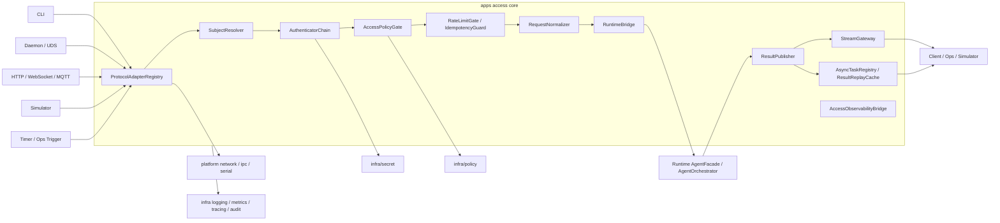

### 6.3 子组件清单与组件职责

| 子组件 | 类型 | 职责 | 主要输入 | 主要输出 |
|---|---|---|---|---|
| ProtocolAdapterRegistry | module-local public | 维护协议适配器注册、按入口选择合适 adapter | raw transport event、entry type | `InboundPacket` |
| ProtocolAdapter | entry-private / shared | 把 CLI/HTTP/WS/MQTT/daemon/simulator 事实折叠成统一 `InboundPacket` | socket/stdin/frame/message | `InboundPacket` |
| SubjectResolver | core | 从 peer、token、证书、CLI 用户、模拟器上下文解析入口主体 | `InboundPacket`、peer info | `SubjectIdentity`、challenge plan |
| AuthenticatorChain | core | 执行 mTLS/JWT/token/peer uid 等认证链，产出认证结论 | `SubjectIdentity`、secret refs、auth config | `AuthenticatedSubject` 或 `AccessError` |
| AccessPolicyGate | core | 基于 access 自有 action taxonomy 构造 query context，调用 `infra/policy` 完成授权裁定 | `AuthenticatedSubject`、operation/target | `AccessDecisionProof` |
| RateLimitGate | core | 做入口级并发、速率和背压控制，保护 runtime 主链 | subject、channel、operation、queue state | allow/reject decision |
| IdempotencyGuard | core | 对 request key 做去重、重放和冲突判断 | request signature、idempotency key | replay / forward / conflict |
| RequestNormalizer | core | 生成 `request_id/session_id/trace_id`，构造 `AgentRequest` 和 module-local dispatch sidecar | `InboundPacket`、subject、decision proof | `RuntimeDispatchRequest` |
| RuntimeBridge | module-local public | 统一 access -> runtime 调用面，提交归一化请求并处理同步/等待/异步结果 | `RuntimeDispatchRequest` | `RuntimeDispatchResult` |
| AsyncTaskRegistry | internal | 管理异步回执、轮询 token、结果可见期和断线重放索引 | `RuntimeDispatchResult`、query request | `AsyncTaskReceipt`、task snapshot |
| ResultPublisher | core | 把 `AgentResult` 映射为协议无关 `PublishEnvelope` 并调用具体 publisher | `AgentResult`、publish context | publish ack / `AccessError` |
| StreamGateway | core | 管理流式订阅、慢消费者断开、心跳、重连和 replay fallback | publish frame、subscription state | stream frame / disconnect / poll fallback |
| ResultReplayCache | internal | 为异步和断线重连保留短期结果副本 | `PublishEnvelope` | replay lookup |
| AccessConfigAdapter | internal | 收敛启动期 access bootstrap config 与 runtime 治理投影 | bootstrap source、policy snapshot | access views |
| AccessObservabilityBridge | internal | 统一 log/metric/trace/audit 事件字段口径 | admission/result/publish events | observability writes |

### 6.4 子组件输入/输出与依赖关系

| 子组件 | 输入来源 | 输出去向 | 依赖关系与边界说明 |
|---|---|---|---|
| ProtocolAdapterRegistry | 各 entry main / transport callbacks | SubjectResolver | 只感知入口与协议，不感知 Runtime |
| SubjectResolver | `InboundPacket`、peer metadata | AuthenticatorChain | 只做主体解析，不做最终认证放行 |
| AuthenticatorChain | SubjectResolver、secret/config | AccessPolicyGate | 只确认“是谁”，不确认“能不能做” |
| AccessPolicyGate | AuthenticatedSubject、operation、target | RequestNormalizer、ResultPublisher、LogQuery/override 特殊路径 | 通过 `infra/policy` 求值；access 自定义 action taxonomy |
| RateLimitGate / IdempotencyGuard | AccessPolicyGate、registry state | RequestNormalizer / replay path | 拒绝前必须出可观测事件 |
| RequestNormalizer | Admission 全链结果 | RuntimeBridge | 负责构造 `AgentRequest`，不接管 publish |
| RuntimeBridge | `AgentRequest` + sidecar context | ResultPublisher / AsyncTaskRegistry | access 对 runtime 的唯一调用面 |
| ResultPublisher | `AgentResult`、publish context | protocol-specific publisher | 只映射出口协议，不重写业务语义 |
| StreamGateway | ResultPublisher、connection registry | clients / replay cache | 慢消费者只影响自身，不阻塞 runtime |
| AccessObservabilityBridge | 全链 stage facts | infra logging/metrics/tracing/audit | 不直接回调 Runtime 或改变业务判定 |

### 6.5 上下游模块调用关系

| 相邻模块 | Access 调用方向 | 调用内容 | Access 不承担的职责 |
|---|---|---|---|
| runtime | access -> runtime | `AgentRequest` 提交、等待态查询、最终 `AgentResult` 接收 | Runtime FSM、恢复、预算、调度 |
| profiles | access <- profiles | 运行治理快照投影，如 timeout、budget、ops policy | Access 不解析 profile yaml，也不自造新策略域 |
| infra/config | access <- infra/config | 启动期 bootstrap 配置查询、受控 override 来源校验结果 | 不解析自由 JSON/YAML 直接改运行态 |
| infra/policy | access -> infra/policy | `PolicyQueryContext` 查询与 allow proof 校验 | 不把 access 行为授权逻辑外包给 infra 定义 |
| infra/secret | access <- infra/secret | mTLS/JWT/签名校验所需 credential ref | 不暴露 secret 明文 |
| infra/logging/audit/metrics/tracing | access -> infra | 入口请求、拒绝、发布、断连、重放、override 尝试等观测事件 | 不自建第二套 observability 存储 |
| infra/diagnostics | access <-> infra/diagnostics | 受控诊断入口、日志 artifact 拉取、导出授权路径 | 不把 diagnostics 变成通用入口执行面 |
| platform | access <- platform | listen/accept/send/recv、peer uid、串口/IPC 事实 | 不感知驱动细节和 HAL |
| cognition/llm/tools/memory/knowledge/services | 无直接依赖 | N/A | 不绕过 runtime 直连 |

### 6.6 核心对象与 contracts 对齐关系

| 核心对象 | 关键字段 | 作用 | 与 contracts 的关系 |
|---|---|---|---|
| `InboundPacket` | `packet_id`、`entry_type`、`protocol_kind`、`payload_ref`、`headers`、`peer_ref`、`requested_mode` | 统一入口协议事实 | access module-local；不进入 contracts |
| `SubjectIdentity` | `actor_ref`、`subject_type`、`auth_method`、`tenant_ref`、`device_ref`、`trust_level`、`attributes` | 表达入口主体事实 | access module-local；`Session.user_id` 仅是后续可选投影，不替代此对象 |
| `AccessDecisionProof` | `decision`、`policy_decision_ref`、`reason_code`、`matched_rule_ids`、`snapshot_id`、`generation` | 记录 access 授权裁定和证据 | `decision` 只对齐 `Allow/Deny/RequireConfirmation` 三语义；其余字段继续 private |
| `AccessAdmissionResult` | `admitted`、`replay_hit`、`reject_reason`、`challenge_hint`、`replay_result_ref` | 表达 Admission 链最终结论 | access module-local |
| `AccessError` | `code`、`reason`、`detail`、`retryable`、`upstream_error` | access 侧统一错误表达，涵盖验证/认证/授权/准入/dispatch/发布/receipt 各类失败 | access module-local；`upstream_error` 可携带 shared `ErrorInfo` |
| `AccessErrorCode` | 100–999 分组枚举 | access 错误码 taxonomy，支持协议映射 | access module-local；映射到 HTTP status / CLI exit code / gRPC code |
| `RuntimeDispatchRequest` | `AgentRequest`、`SubjectIdentity`、`AccessDecisionProof`、`publish_mode`、`client_capability_view`、`dispatch_deadline`、`request_context` | access -> runtime bridge 统一输入 | `RequestNormalizer` 是唯一 owner；只把 `AgentRequest` 暴露为 shared 对象，其余 sidecar 保持 module-local |
| `RuntimeInvokeContext` | `request_id`、`session_id`、`trace_id`、`actor_ref`、`operation`、`decision`、`dispatch_deadline` | `RuntimeBridge` 生成的 bridge-local invoke facts | 不进入 `access/include`；只作为 bridge-local adapter 到 runtime seam 的内部投影 |
| `AsyncTaskReceipt` | `receipt_id`、`request_id`、`session_id`、`actor_ref`、`task_ref`、`expires_at`、`ownership_token` | 表达异步受理回执 | 当前不进入 contracts；避免在 async 语义未冻结前污染 shared 层 |
| `PublishEnvelope` | `request_id`、`result_id`、`session_id`、`trace_id`、`channel_ref`、`protocol_kind`、`agent_result`、`protocol_status_hint`、`protocol_metadata`、`is_final` | 表达协议无关发布计划 | 以 `AgentResult` 为事实源，publish metadata 留在 module-local |
| `AccessGatewayState` | `Uninitialized`、`Initializing`、`Ready`、`Draining`、`ShutDown` | 表达 AccessGateway 生命周期状态 | access module-local |
| `AgentRequest` | frozen shared fields | Runtime 主链统一入口 | shared contracts 复用 |
| `AgentResult` | frozen shared fields | Runtime 主链统一出口 | shared contracts 复用 |
| `ErrorInfo` | `failure_type`、`retryable`、`safe_to_replan`、`details`、`source_ref` | 标准失败信息 | shared contracts 复用；access 早拒绝路径可投影为 `AccessError` + `ErrorInfo` |
| `EventEnvelope` | cross-cutting header | 观测/审计/事件桥接锚点 | shared contracts 复用；payload 仍可保持 access 私有 |

补充约束：Access sidecar 到 runtime / audit 的投影规则以 [../ssot/CrossModuleDataProjectionMatrix.md](../ssot/CrossModuleDataProjectionMatrix.md) 为准；本节只定义 access 侧对象面，不在此重复定义 shared contract 之外的下游语义。

### 6.7 核心接口语义定义

建议头文件落点：`access/include/`

```cpp
namespace dasall::access {

enum class AccessDisposition {
  Rejected = 0,
  Completed = 1,
  AcceptedAsync = 2,
  StreamAttached = 3,
};

struct InboundPacket {
  std::string packet_id;
  std::string entry_type;
  std::string protocol_kind;
  std::string peer_ref;
  std::string payload;
  bool async_preferred = false;
  bool stream_requested = false;
};

struct SubjectIdentity {
  std::string actor_ref;
  std::string subject_type;
  std::string auth_method;
  std::string trust_level;
  std::string tenant_ref;
};

struct AccessDecisionProof {
  contracts::SharedPolicyDecisionSemantic decision;
  std::string policy_decision_ref;
  std::string reason_code;
};

struct RuntimeDispatchRequest {
  contracts::AgentRequest agent_request;
  SubjectIdentity subject_identity;
  AccessDecisionProof decision_proof;
  bool async_allowed = false;
  bool stream_requested = false;
};

struct RuntimeDispatchResult {
  AccessDisposition disposition = AccessDisposition::Rejected;
  std::optional<contracts::AgentResult> agent_result;
  std::optional<AccessError> error_info;
  std::optional<std::string> receipt_ref;
};

enum class AccessErrorCode {
  ValidationRejected = 100,
  PayloadTooLarge = 101,
  UnsupportedProtocol = 102,
  MalformedInput = 103,
  AuthenticationFailed = 200,
  AuthenticationChallengeRequired = 201,
  CredentialExpired = 202,
  AuthorizationDenied = 300,
  ConfirmationRequired = 301,
  OverrideSourceInvalid = 302,
  AdmissionRejected = 400,
  RateLimitExceeded = 401,
  ConcurrencyLimitExceeded = 402,
  IdempotencyConflict = 403,
  IdempotencyReplayHit = 404,
  QueueFull = 405,
  RuntimeDispatchFailed = 500,
  RuntimeDispatchTimeout = 501,
  RuntimeBridgeUnavailable = 502,
  PublishChannelUnavailable = 600,
  PublishTimeout = 601,
  PublishEncodingFailed = 602,
  ReceiptNotFound = 700,
  ReceiptExpired = 701,
  ReceiptOwnerMismatch = 702,
  CancellationFailed = 703,
  InternalError = 900,
  ShuttingDown = 901,
};

struct AccessError {
  AccessErrorCode code = AccessErrorCode::InternalError;
  std::string reason;
  std::string detail;
  bool retryable = false;
  std::optional<contracts::ErrorInfo> upstream_error;
};

struct PublishEnvelope {
  std::string request_id;
  std::string result_id;
  std::string session_id;
  std::string trace_id;
  std::string channel_ref;
  std::string protocol_kind;
  contracts::AgentResult agent_result;
  std::string protocol_status_hint;
  std::string protocol_metadata;
  bool is_final = true;
};

struct AsyncTaskReceipt {
  std::string receipt_id;
  std::string request_id;
  std::string session_id;
  std::string actor_ref;
  std::string task_ref;
  std::chrono::steady_clock::time_point expires_at;
  std::string ownership_token;
};

enum class AccessGatewayState {
  Uninitialized = 0,
  Initializing = 1,
  Ready = 2,
  Draining = 3,
  ShutDown = 4,
};

class IAccessGateway {
 public:
  virtual ~IAccessGateway() = default;
  virtual bool init() = 0;
  virtual void shutdown(std::chrono::milliseconds drain_timeout) = 0;
  virtual AccessGatewayState state() const = 0;
  virtual bool is_ready() const = 0;
  virtual RuntimeDispatchResult submit(const InboundPacket& packet) = 0;
  virtual bool publish_result(const PublishEnvelope& envelope) = 0;
};

class IProtocolAdapter {
 public:
  virtual ~IProtocolAdapter() = default;
  virtual bool can_handle(std::string_view entry_type,
                          std::string_view protocol_kind) const = 0;
  virtual InboundPacket decode() = 0;
  virtual bool encode(const PublishEnvelope& envelope) = 0;
};

class IAdmissionController {
 public:
  virtual ~IAdmissionController() = default;
  virtual AccessAdmissionResult admit(const InboundPacket& packet,
                                      const SubjectIdentity& subject,
                                      const AccessDecisionProof& proof) = 0;
  virtual void release_ticket(std::string_view request_id) = 0;
  virtual void record_completion(std::string_view request_id) = 0;
};

struct AccessAdmissionResult {
  bool admitted = false;
  bool replay_hit = false;
  AccessErrorCode reject_reason = AccessErrorCode::InternalError;
  std::optional<std::string> replay_result_ref;
  std::optional<std::string> challenge_hint;
};

class IAccessRuntimeBridge {
 public:
  virtual ~IAccessRuntimeBridge() = default;
  virtual RuntimeDispatchResult dispatch(const RuntimeDispatchRequest& request) = 0;
  virtual bool cancel(std::string_view request_id, std::string_view actor_ref) = 0;
};

}  // namespace dasall::access
```

接口语义冻结建议：

1. `IAccessGateway.submit()` 是入口主调用面，负责把协议事实推进到 Runtime bridge；它不是 Runtime 执行入口的替身，不拥有额外的业务控制权。
2. `IAccessGateway.shutdown()` 负责触发优雅排空，等待 inflight 请求完成或超时后关闭；进入 `Draining` 态后新请求一律返回 `ShuttingDown` 拒绝。
3. `IAccessGateway.publish_result()` 以 `PublishEnvelope` 为统一发布输入，不直接接受裸 `AgentResult`；这确保 protocol mapping 和 sidecar 信息始终由 access core 统一组装。
4. `IProtocolAdapter` 只负责 decode/encode，不直接做认证授权或 Runtime 调用。
5. `IAdmissionController` 统一收敛限流、幂等和准入语义；`release_ticket()` 和 `record_completion()` 由 gateway/publisher 在请求完成后回调，保证 inflight 计数一致。
6. `IAccessRuntimeBridge.dispatch()` 是 access -> runtime 的唯一 module-local 统一调用面；`cancel()` 支持异步任务主动取消转发。
7. `publish_result()` 以 `AgentResult` 为事实源构造 `PublishEnvelope`，不允许 publisher 私自改写 `result_code/status/task_completed` 等 shared 语义。

#### 6.7.1 Access 授权动作 taxonomy

由于 `infra/policy` 不负责业务对象授权语义定义，access 需要冻结自己的入口动作语义面。建议 v1 至少固定以下动作：

| operation | target_type | 说明 | 默认策略 |
|---|---|---|---|
| `access.request.submit` | `access.entry` | 普通请求提交 | deny-by-default，需显式 allow |
| `access.request.stream` | `access.entry` | 申请流式结果订阅 | deny-by-default，且需 client capability 与 profile 共同允许 |
| `access.task.query` | `access.task` | 按 receipt/task 查询结果 | 仅允许原始主体、受托运维或诊断角色 |
| `access.task.cancel` | `access.task` | 取消等待态/异步任务 | 默认仅允许原始主体或受控 ops |
| `access.runtime_override.apply` | `access.override` | 运行期 patch 申请 | 仅允许受控运维/诊断入口 |
| `access.diagnostics.pull` | `access.diagnostics` | 按 `snapshot_id` 读取已脱敏 diagnostics snapshot，必要时导出本地 artifact | 仅 allow 证明 + diagnostics gate 双重通过时允许 |

#### 6.7.2 Access 主体属性最小集

| 属性 | 说明 | 用途 |
|---|---|---|
| `actor_ref` | 稳定主体标识，如 user/service/ops/device ref | 审计、授权、结果查询归属 |
| `subject_type` | `human`、`service`、`ops`、`simulator`、`factory_test` | 策略匹配 |
| `auth_method` | `local_shell`、`peer_uid`、`mtls`、`jwt`、`token`、`simulator_stub` | 认证事实 |
| `trust_level` | `local_trusted`、`remote_trusted`、`remote_untrusted` 等 | Admission 和 override 准入 |
| `tenant_ref` / `device_ref` | 多租户/设备级作用域 | 细粒度隔离 |
| `channel_ref` | cli/daemon/http/ws/mqtt/simulator/serial-console | 通道策略 |

### 6.8 主数据流

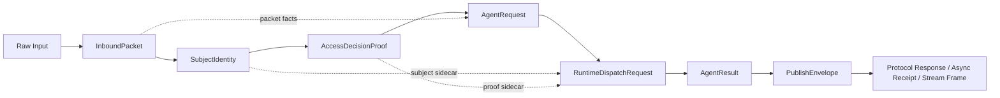

数据流原则：

1. `InboundPacket` 到 `AgentRequest` 的转换只保留语义稳定字段；协议头、连接句柄、frame metadata 留在 sidecar。
2. `SubjectIdentity` 与 `AccessDecisionProof` 不进入 contracts；它们只在 access core 与 runtime bridge/observability 间传播。
3. 发布链以 `AgentResult` 为权威事实源；协议特有 header/frame/status code 是 `PublishEnvelope` 派生结果，不反向修改 `AgentResult`。

### 6.9 主流程时序

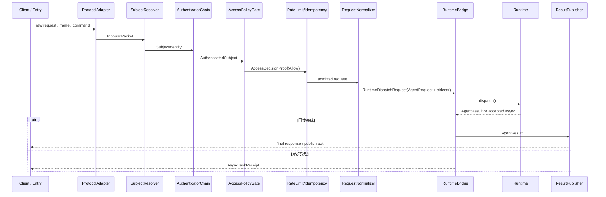

主流程约束：

1. `request_id/session_id/trace_id` 在 `RequestNormalizer` 前必须已经具备生成策略，且拒绝路径也要落日志/审计锚点。
2. Admission 链中任何一步返回非 allow，都必须在进入 Runtime 前终止。
3. `AcceptedAsync` 只表示 Access 已完成受理，不表示 Runtime 已成功完成业务处理。

### 6.10 异常与恢复时序

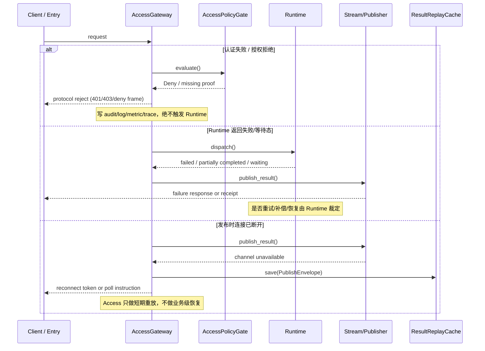

#### 6.10.1 异常语义与恢复边界

| 错误类别 | 典型触发点 | Access 处理方式 | 是否触发 Runtime | 恢复 owner |
|---|---|---|---|---|
| `ValidationRejected` | payload 缺字段、非法模式、协议不支持 | 直接拒绝，返回协议级 4xx/usage error | 否 | Access |
| `AuthenticationFailed` | token 无效、mTLS 校验失败、peer 不可信 | 直接 challenge 或拒绝，写 audit/log | 否 | Access |
| `AuthorizationDenied` | PolicyGate 返回 deny/require_confirmation 未满足 | 直接 fail-closed | 否 | Access |
| `AdmissionRejected` | 限流、队列满、并发上限、幂等冲突 | 返回 busy/conflict/replay hit | 否 | Access |
| `RuntimeRejected` | runtime bridge 拒绝 sidecar 或请求非法 | 返回结构化失败 | 是 | Runtime/Bridge 协作 |
| `PublishChannelUnavailable` | socket/stream/channel 断开 | 对 async/stream 保存重放线索；对 unary 返回可判定失败 | 已发生 | Access |
| `RuntimeExecutionFailed` | Runtime 返回 Failed/Timeout/Cancelled 等 | 按 `AgentResult` 统一发布 | 是 | Runtime |

#### 6.10.2 Access 局部恢复原则

1. Access 只恢复“入口与发布链的局部故障”，例如 challenge 重试、连接重建、短期结果重放、慢消费者断开。
2. Access 不恢复业务执行本身，不决定是否 retry/replan/compensate。
3. 一旦进入 Runtime 后的执行失败，只允许按照 `AgentResult` 或 Runtime sidecar 返回的结论发布，不额外发明 access 层隐式重试。

### 6.11 配置项与默认策略

#### 6.11.1 配置源分层原则

1. **启动事实配置**：listen endpoint、broker/IPC endpoint、TLS secret ref、allowed auth methods、stream heartbeat、replay TTL 等，归 `AccessBootstrapConfig`，只在启动期读取，不进入当前已冻结 shared contracts。
2. **唯一 schema / carrier**：`AccessBootstrapConfig` 的唯一 schema 归 access 所有，合法 carrier 固定为 deployment bundle 中落盘的 typed bootstrap asset 或 ConfigCenter typed query 返回的同 schema 快照；entry 启动参数只允许提供 `bootstrap_ref` / asset path / entry instance locator，不得逐字段直接承载业务配置。
3. **运行治理投影**：优先复用 `runtime_budget.*`、`timeout_policy.*`、`ops_policy.*`、`infra.security_policy.*`、`infra.logging.*` 等既有快照视图，不再复制一套 access 运行策略。
4. **受控 override**：Access 只接收来自 ConfigCenter/诊断/运维命令的已鉴权 typed patch；普通 HTTP 参数、cookie、CLI 环境变量不能直达 override 面，且 override 不能修改 `AccessBootstrapConfig` 静态字段。

#### 6.11.2 `AccessBootstrapConfig` 建议字段

下表字段是 access 启动配置对象，不等价于当前已冻结 `runtime_policy.yaml` 顶层逻辑域；建议该对象在 deployment bundle 与 ConfigCenter typed query 中保持同一 typed schema：

| 字段 | 默认值 | 来源 | 热更新 | 说明 |
|---|---|---|---|---|
| `bootstrap_revision` | required | deployment bundle / ConfigCenter typed query | 否 | 启动事实快照版本；用于缓存、审计与 last-known-good fallback |
| `entry_type` | required | deployment bundle / ConfigCenter typed query | 否 | 明确该 bootstrap 只适用于 `cli`、`daemon`、`gateway`、`simulator` 中之一 |
| `listen_ref` | entry-specific | 启动参数 / deployment bundle | 否 | CLI 为 stdin/stdout；daemon 为 uds/tcp；gateway 首版为 HTTP/1.1 unary business listener；health probe listener 独立绑定 |
| `allowed_protocols` | entry-specific | deployment bundle | 否 | gateway 首版固定 `http`；WS/MQTT 延后到 Phase A5/后续 gate，不在 v1 business listener 中启用 |
| `peer_auth_mode` | `strict` | deployment bundle | 否 | remote 入口默认严格认证，本地 CLI/模拟器可使用本地身份模式 |
| `auth_provider_ref` | empty | deployment bundle / secret ref | 否 | 指向 JWT issuer、mTLS CA、token verifier 等引用 |
| `idempotency_window_ms` | `300000` | 启动配置 | 否 | 幂等窗口 5 分钟 |
| `max_inflight_requests` | `256` | 启动配置 | 否 | 入口并发上限 |
| `result_replay_ttl_ms` | `600000` | 启动配置 | 否 | 结果重放保留 10 分钟 |
| `stream_heartbeat_ms` | `15000` | 启动配置 | 否 | 流式连接保活周期 |
| `slow_consumer_max_buffer` | `32` frames | 启动配置 | 否 | 超限后断开慢消费者并转轮询 |
| `trusted_local_subjects` | empty | deployment bundle | 否 | 仅用于 CLI/daemon 本地主体 allowlist |
| `dispatch_deadline_ms` | `30000` | 启动配置 | 否 | Access dispatch 超时；必须 ≤ runtime budget timeout |
| `drain_timeout_ms` | `10000` | 启动配置 | 否 | 优雅关闭排空等待上限 |
| `max_payload_bytes` | `1048576` (1 MB) | 启动配置 | 否 | HTTP body / 通用 payload 大小上限 |
| `max_user_input_bytes` | `65536` (64 KB) | 启动配置 | 否 | `user_input` 字段大小上限 |
| `cors_allowed_origins` | empty (CORS 禁用) | deployment bundle | 否 | HTTP CORS 允许的来源白名单；空表示不启用 |
| `session_id_mode` | `auto` | 启动配置 | 否 | `auto` 表示服务端生成；`client_hint` 允许客户端通过 header 提供 |
| `ownership_token_hmac_secret_ref` | required | deployment bundle / secret ref | 否 | receipt ownership token 的 HMAC 密钥引用 |

冻结规则：

1. entry 启动参数只允许解析 `bootstrap_ref` / 本地 asset 路径，不允许用 `--listen-ref`、`--dispatch-timeout` 这类逐字段参数在进程内拼出第二份 `AccessBootstrapConfig`。
2. 如果 ConfigCenter 启动期不可用，允许回退到随 deployment 分发的 last-known-good bootstrap asset；若二者都缺失、schema 不合法或 `entry_type` 不匹配，则 Access `init()` 必须 fail-closed。
3. `AccessBootstrapConfig` 不参与 runtime hot-update；任何运行期变化都必须通过后述治理投影视图和受控 `runtime_override` 收敛。

#### 6.11.3 复用的运行治理投影

| 已冻结键或视图 | 默认策略 | Access 使用方式 | `runtime_override` 规则 |
|---|---|---|---|
| `runtime_budget.*` | 按 profile 档位 | 映射到入口并发、等待时长、最大 publish latency 保护阈值 | 可按既有白名单受控收紧 |
| `timeout_policy.*` | 按 profile 档位 | 约束 challenge timeout、dispatch deadline、publish timeout | 可按既有白名单受控收紧 |
| `ops_policy.trace_sample_ratio` | profile 默认 | 决定 access trace 采样率 | 可按既有白名单受控调整 |
| `ops_policy.log_level` | profile 默认 | 决定 access 结构化日志等级 | 可按既有白名单受控调整 |
| `ops_policy.remote_diagnostics_enabled` | false/按 profile | 控制远程诊断入口是否可启用 | 仅受控入口可改 |
| `infra.security_policy.default_effect` | deny | PolicyGate 未命中规则时 fail-closed | 不由 access 改写 |
| `infra.logging.export.enable_diag_pull` | false/按 profile | 诊断日志拉取前置 gate | runtime override 不得开启 |

治理视图冻结规则：

1. `AccessAuthView`、`AccessAdmissionView`、`AccessPublishView`、`AccessRuntimeGovernanceView` 都是 invoke-scoped immutable snapshot，不允许在同一请求生命周期内看到半新半旧视图。
2. `AccessRuntimeGovernanceView` 只允许消费本表列出的现有键；若未来需要更多 access 配置，只能追加 access 内部视图或扩大上游冻结矩阵，不能私自新增 `runtime_policy.yaml` 顶层域。
3. `SnapshotVersionFingerprint` 固定由 `bootstrap_revision + effective_profile_id + runtime_policy_generation` 组成；当任一分量变化时，下一次请求必须重建治理视图。
4. 运行期热更新只影响下一次请求；进行中请求继续持有入口时刻绑定的 fingerprint，不回溯影响 Admission、Publish 或 ResultReplay 行为。

#### 6.11.4 `runtime_override` 入口规则

| 规则 | 设计结论 |
|---|---|
| 合法来源 | 仅允许受控运维命令、诊断入口、受鉴权 ConfigCenter `apply_override` API |
| Access 职责 | 只负责认证入口主体、构造 `access.runtime_override.apply` 授权查询、校验来源元数据完整性 |
| 不允许 | 普通 HTTP 参数、query string、cookie、未签名环境变量、业务流量伪装成 override；也不允许修改 `AccessBootstrapConfig` 静态字段 |
| 失败语义 | 任一来源、作用域、TTL、actor、base_version 或 allow proof 缺失都按 fail-closed 拒绝，并写 audit |

##### 6.11.4.1 `OverrideSourceFact` 与 typed patch 对齐

1. Access 不定义第二套 `runtime_override` patch body；入口 payload 直接复用 infra/config 已冻结的 `ConfigPatch` v1，对齐 `patch_id/source_kind/source_id/actor/target_scope/base_version/reason_code/expires_at/patches` 契约。
2. Access 对 policy / audit / observability 只投影最小 metadata 与 path/op 摘要，不把 patch `value`、自由 JSON、原始 CLI 参数或 HTTP query string 直接带入 `OverrideSourceFact`。
3. `ConfigPatch.patches` 在 access 入口侧必须非空；每个条目继续只允许 `replace` / `remove` 与稳定 `key_path`，空 patch、未知 op 或自由脚本表达式一律 fail-closed。

| 字段 | 对齐来源 | 必填 | 说明 |
|---|---|---|---|
| `override_id` | `ConfigPatch.patch_id` | 是 | override 尝试与审计的稳定 ID；Access 不再自造第二个 patch id |
| `source_kind` | `ConfigPatch.source_kind` | 是 | v1 只接受受控 `config_center_api`、`diagnostics_window`、`ops_command`、`automation_test` 来源 |
| `source_ref` | `ConfigPatch.source_id` | 是 | 来源实例或入口标识；用于审计与 deny 追踪 |
| `actor_ref` | `ConfigPatch.actor` | 是 | 受鉴权主体引用；缺失则直接拒绝 |
| `target_scope` | `ConfigPatch.target_scope` | 是 | override 作用域；必须可映射到 access policy target |
| `base_version` | `ConfigPatch.base_version` | 是 | 防 stale write 的最小版本锚点 |
| `reason_code` | `ConfigPatch.reason_code` | 是 | 运维/诊断原因码；不得为空 |
| `expires_at` | `ConfigPatch.expires_at` | 是 | `runtime_override` TTL；缺失则拒绝 |
| `requested_paths` | `ConfigPatch.patches[*].key_path` 摘要 | 是 | 仅保留稳定路径集合，不保留 value 明文 |
| `requested_ops` | `ConfigPatch.patches[*].op` 摘要 | 是 | v1 仅允许 `replace`、`remove` |

补充规则：

1. Access 只校验 `OverrideSourceFact` 元数据完整性、来源受控性与 allow proof 前置条件；路径白名单、高风险键“只收紧不放宽”和最终 merge 语义仍由 ConfigCenter / profiles validator 负责。
2. 普通业务请求、cookie、query string、未签名环境变量即使能拼出形似 `ConfigPatch` 的对象，也不得进入 override 面；这类输入必须以 `access.runtime_override.denied` 审计并拒绝。

#### 6.11.5 `access.diagnostics.pull` selector / transport 规则

| 规则 | 设计结论 |
|---|---|
| Pull selector | v1 唯一公开 selector 固定为 `SnapshotQuery.snapshot_id`；`trace_id`、`session_id`、`request_id` 仅作为日志/审计关联上下文，不作为 pull selector |
| Access 职责 | 认证入口主体、构造 `access.diagnostics.pull` 授权查询、把 selector/export 请求归一化为 `DiagnosticsSelectorFact` |
| 允许 transport | v1 只允许 `get_snapshot(const SnapshotQuery&)` 与 `export_snapshot(const SnapshotExportRequest&)` 两条 typed 路径；Access 不直接内联返回原始 artifact bytes |
| 默认 gate | 只有 allow proof + access 侧 diagnostics gate 通过时才允许进入 diagnostics service；远程导出仍需 infra/diagnostics 自身 gate 与 exact-match allow-list 再次通过 |
| 失败语义 | 缺失 `snapshot_id`、出现未冻结 selector、`target_ref` 非法、target/format 未冻结或 allow proof 缺失都按 fail-closed 拒绝，并写 audit |

##### 6.11.5.1 `DiagnosticsSelectorFact` schema

1. Access v1 diagnostics pull 对齐 infra/diagnostics 已落盘的 `SnapshotQuery{snapshot_id}` 与 `SnapshotExportRequest{snapshot_id,target,format,target_ref}`；不再保留基于 `trace_id/session_id` 的自由查询面。
2. `DiagnosticsSelectorFact` 只保留 selector 与导出 gate 所需的稳定字段，不复制 diagnostics snapshot 内容，也不把原始 artifact bytes 带回 access 主链。

| 字段 | 对齐来源 | 必填 | 说明 |
|---|---|---|---|
| `selector_kind` | access private enum | 是 | v1 固定为 `snapshot_id` |
| `selector_value` | `SnapshotQuery.snapshot_id` | 是 | 已脱敏 diagnostics snapshot 的稳定引用 |
| `request_mode` | access private enum | 是 | `snapshot_get` 或 `snapshot_export` |
| `export_target` | `SnapshotExportRequest.target` | 否 | 仅 `request_mode=snapshot_export` 时出现；沿用 `LocalFile` / `RemoteUpload` |
| `export_format` | `SnapshotExportRequest.format` | 否 | 仅 `request_mode=snapshot_export` 时出现；沿用 `Json` / `TextArchive` |
| `target_ref` | `SnapshotExportRequest.target_ref` | 否 | 导出目标引用；不得为空字符串或自由 URL 模板 |

size / target / transport 约束：

1. `snapshot_get` 只接受 `SnapshotQuery.snapshot_id`；未冻结 `trace_id`、`session_id`、`request_id` 选择器一律拒绝，待 infra/diagnostics 显式扩展 `SnapshotQuery` 后再开新 gate。
2. `snapshot_export` 必须同时满足 `snapshot_id`、`target`、`format`、`target_ref` 齐备；其中 v1 唯一保证可成功的路径是 `ExportTarget::LocalFile + ExportFormat::Json + local://diagnostics/<artifact_name>.jsonl`。
3. `ExportFormat::TextArchive` 在 v1 必须拒绝；`RemoteUpload` 默认拒绝，只有在 infra/diagnostics 显式开启 `infra.diagnostics.remote.enabled=true` 且 `target_ref` exact-match `infra.diagnostics.remote.allowed_targets` 时才允许继续。
4. diagnostics 导出产物大小继续受 `infra.diagnostics.max_artifact_bytes` 约束；Access 侧只消费 `snapshot_id/export_id/size_bytes/checksum/created_at` 等稳定元数据，不把 artifact 内容反向塞入普通 entry 响应体。

### 6.12 可观测性（日志 / 指标 / 追踪 / 审计）

| 类型 | 名称/事件 | 关键字段 | 触发时机 |
|---|---|---|---|
| 结构化日志 | `access.request.received` | `request_id`、`session_id`、`trace_id`、`entry_type`、`protocol_kind`、`actor_ref(optional)` | protocol adapter 完成 decode 后 |
| 结构化日志 | `access.auth.failed` | `request_id`、`actor_ref`、`auth_method`、`reason_code`、`peer_ref` | 认证失败 |
| 结构化日志 | `access.policy.denied` | `request_id`、`actor_ref`、`operation`、`target_type`、`policy_decision_ref`、`reason_code` | 授权拒绝 |
| 结构化日志 | `access.request.normalized` | `request_id`、`session_id`、`trace_id`、`request_channel`、`async_preferred`、`stream_requested` | `AgentRequest` 构造完成 |
| 结构化日志 | `access.runtime.dispatched` | `request_id`、`result_disposition`、`runtime_latency_ms` | dispatch 返回后 |
| 结构化日志 | `access.result.published` | `request_id`、`result_id`、`status`、`protocol_kind`、`publish_latency_ms` | publish 成功 |
| 结构化日志 | `access.publish.failed` | `request_id`、`result_id`、`error_code`、`channel_ref` | publish 失败 |
| 指标 | `access_requests_total` | `entry_type`、`protocol_kind`、`outcome` | 入口总量 |
| 指标 | `access_auth_fail_total` | `entry_type`、`auth_method`、`reason_code` | 认证失败总量 |
| 指标 | `access_policy_deny_total` | `operation`、`target_type`、`reason_code` | 授权拒绝总量 |
| 指标 | `access_admission_reject_total` | `reject_kind` | 限流、队列满、幂等冲突 |
| 指标 | `access_dispatch_latency_ms` | `entry_type`、`disposition` | access -> runtime dispatch 延迟 |
| 指标 | `access_publish_fail_total` | `protocol_kind`、`error_code` | 发布失败总量 |
| 指标 | `access_active_connections` | `entry_type`、`protocol_kind` | 活跃连接数 |
| 指标 | `access_stream_replay_total` | `reason` | 断线重放次数 |
| 追踪 | span `access.ingress` | `request_id`、`entry_type`、`protocol_kind` | Access 根 span |
| 追踪 | span `access.auth` / `access.policy` / `access.normalize` | `actor_ref`、`operation`、`policy_decision_ref` | Admission 链阶段 span |
| 追踪 | span `access.runtime.dispatch` | `request_id`、`async_allowed`、`stream_requested` | dispatch 阶段 |
| 追踪 | span `access.publish` | `result_id`、`protocol_kind` | 发布阶段 |
| 审计 | `access.auth.failed` | `actor_ref`、`peer_ref`、`reason_code`、`request_id` | 敏感认证失败 |
| 审计 | `access.policy.denied` | `actor_ref`、`operation`、`target_type`、`policy_decision_ref` | 入口授权拒绝 |
| 审计 | `access.runtime_override.requested` / `denied` / `applied` | `actor_ref`、`override_id`、`reason_code`、`target_scope` | override 尝试与结果 |
| 审计 | `access.diagnostics.pull` | `actor_ref`、`selector_kind`、`selector_value`、`request_mode`、`target_ref(optional)`、`policy_decision_ref` | 诊断 snapshot 读取或导出 |

#### 6.12.1 Access-Runtime-Infra 审计语义映射

Access 侧 admission 已经拥有 actor / action / target 的归一化语义；Runtime 拥有执行 outcome；infra 拥有统一 `AuditEvent` 存储面。三者之间只允许做投影和透传，不允许在下游重解释上游已经定型的语义。

| 审计语义轴 | Access 语义 owner | Runtime 投影 / 透传面 | infra 落盘面 | 约束 |
|---|---|---|---|---|
| actor | `SubjectIdentity.actor_ref` | `RuntimeDispatchRequest.subject.actor_ref` 与 `RuntimeInvokeContext` 透传 | `AuditEvent.actor` | actor 只由 access 认证链确定；Runtime/infra 只复制，不重写 |
| action | access action taxonomy 中的 `operation` | 通过 bridge-local invoke context 透传为 access-origin action hint | `AuditEvent.action` | Runtime 不得从 goal 文本、tool 名或结果状态反推 action |
| target | `OperationTargetView.target_type/target_ref` | 通过 bridge-local invoke context 透传为 access-origin target fact | `AuditEvent.target` | target 只由 access 归一化和授权链确定；授权后不得再改写 |
| outcome | Admission 阶段使用 `AccessDecisionProof.decision`；执行阶段使用 `RuntimeDispatchResult` / `AgentResult.status` / `RecoveryOutcome` | Runtime 负责把执行结果收敛为稳定 disposition/outcome | `AuditEvent.outcome` | outcome 由最靠近事实的阶段写入；下游不得把 deny 伪装成 runtime failure，或把 runtime failure 回写成 access deny |
| evidence_ref | `policy_decision_ref`、`request_id`、`receipt_id`、运行期 `Observation` / `RecoveryOutcome` 引用 | 事件生产者按阶段附带最小引用集合 | `AuditEvent.evidence_ref` | 只记录稳定引用，不拼接自由文本“证据说明”；若无引用则宁可留空也不伪造 |

映射规则：

1. `AccessDecisionProof` 只表达 admission 事实；Runtime 侧执行结果必须单独产出 outcome，不得覆盖 access proof。
2. access 到 runtime 的 sidecar 若需扩字段，优先扩 bridge-local invoke context，不扩 shared `AgentRequest`。
3. infra 的 `AuditEvent` 是统一存储面，不是新的语义 owner；任何审计字段冲突都以上游 owner 为准。

可观测性约束：

1. 日志与审计中不得记录 token、password、session secret、原始证书正文、cookie、完整文件路径等高敏数据。
2. `actor_ref`、`request_id`、`session_id`、`trace_id` 是 access 观测的最低锚点组合。
3. `access.publish.failed` 允许主链失败显式可见，但不能吞掉此前 Runtime 已返回的业务结果事实。

### 6.13 并发、背压与状态管理

#### 6.13.1 Access 内部状态表

| 状态容器 | 建议实现 | 并发特性 | 生命周期 |
|---|---|---|---|
| `ConnectionRegistry` | L1 registry map | 读多写少，保护连接/订阅元数据 | 进程生命周期 |
| `AsyncTaskRegistry` | L1 map + L2 receipt cache | receipt/query 并发读写 | 进程生命周期 + TTL |
| `ResultReplayCache` | bounded LRU | 写少读多 | TTL 到期后清理 |
| `StreamSessionTable` | L1 registry + L2 bounded buffer | 慢消费者隔离 | 连接生命周期 |

#### 6.13.2 overflow policy 与背压策略

| 组件 | 默认策略 | 可选策略 | 原因 | 禁止事项 |
|---|---|---|---|---|
| ingress accept queue | `reject` | `block` 禁止 | Access 是主入口，不能因入口积压阻塞整个进程 | 不允许无限等待 |
| async receipt queue | `reject` | 无 | receipt 属于快速确认路径，超限应显式返回 busy | 不允许 silent loss |
| stream frame buffer | `reject + disconnect slow consumer` | `drop_oldest` 仅用于非关键 progress frame | 不让单个慢消费者拖死主链 | 不允许持锁写 socket |
| replay cache | bounded LRU | N/A | 这是 cache 不是 queue，超限淘汰最旧结果并计数 | 不允许无计数淘汰 |

#### 6.13.3 lock order 规则

1. L0：init/shutdown/reconfigure。
2. L1：connection/session/receipt registry。
3. L2：stream frame queue、replay cache、pending publish buffer。
4. L3：socket/write handle、IPC peer、serial handle。

固定规则：

1. 只允许 `L0 -> L1 -> L2` 顺序持锁。
2. 进入网络/IPC/串口写出前必须释放 L2；publish path 采用“快照出锁后写出”。
3. 不允许在持锁状态下进行 JSON 序列化、日志格式化、审计写入、网络 I/O。
4. `reject`、断开慢消费者、cache 淘汰都必须递增计数并写 metric/log。

### 6.14 组件级详细设计补强（用于任务拆分）

#### 6.14.1 评估结论

若目标只是完成子系统级边界评审，当前 6.1 到 6.13 已经足够；但若目标是后续直接依据该文档拆成 Design / Build 原子任务，当前文档仍然缺少“组件级执行规格”。

具体缺口在于：

1. 当前 6.3 已给出组件清单与职责，但还没有把每个核心组件的 non-goal、内部数据面与失败语义拆开描述。
2. 当前 6.6、6.7 已给出核心对象与公共接口，但还没有明确“哪些 supporting types 归哪个组件拥有、哪些接口是 public、哪些接口只应停留在 module-local/internal”。
3. 当前 6.8、6.9 给的是端到端主数据流与主时序，还缺少 AccessGateway、Admission、RuntimeBridge、Publish 链各自的局部执行流和状态切面。
4. 当前第 7 章已经能把工作拆到“组件名”一级，但还不能稳定拆到“先补哪些类型、接口、测试，再补哪些流程与集成验证”的原子粒度。

因此，结论是：

1. 需要补充组件级详细设计内容。
2. 但不需要所有组件一开始都写到同样深度。
3. 应采用“核心组件全量展开、支撑组件轻量展开、受阻组件保留占位”的分层写法，避免文档膨胀而又无法落任务。

#### 6.14.2 为什么当前粒度还不足以直接拆任务

当前 access 文档已经回答了“系统要做什么、整体边界是什么、主链如何走”；但对于任务拆分，还缺三类直接影响实施顺序的信息：

1. **组件 own 的对象面**：例如 `SubjectIdentity`、`AccessDecisionProof`、`AsyncTaskReceipt`、`PublishEnvelope` 分别由谁创建、谁校验、谁销毁，目前仍主要停留在对象表层面。
2. **组件局部执行流**：例如 `AccessPolicyGate` 的 fail-closed 求值顺序、`RuntimeBridge` 的同步/异步分支、`ResultPublisher` 的协议映射顺序、`AsyncTaskRegistry` 的 receipt/query/replay 关系，目前只在总流程中被隐含表达。
3. **可直接映射测试的失败语义**：例如认证失败、授权拒绝、队列满、publish channel unavailable、receipt owner mismatch 分别由哪个组件断言和暴露，目前还不够适合直接转为 unit / integration / failure injection 用例。

换句话说，当前文档对“架构评审”已经够用，但对“稳定拆 TODO 并避免返工”还不够用。

#### 6.14.3 组件细化优先级

| 优先级 | 组件 | 建议细化深度 | 原因 |
|---|---|---|---|
| P0 | AccessGateway | 全量 | 对 apps 壳层暴露统一入口，是后续 A1/A2 的主 facade |
| P0 | ProtocolAdapterRegistry | 全量 | 决定入口协议适配如何挂接 shared access core |
| P0 | SubjectResolver | 全量 | 主体事实来源不清会直接影响认证、授权和审计 |
| P0 | AuthenticatorChain | 全量 | 认证方式、challenge、失败语义需要先冻结 |
| P0 | AccessPolicyGate | 全量 | fail-closed 授权与 override 准入是 access 的硬门禁 |
| P0 | AdmissionController（含 RateLimit / Idempotency） | 全量 | 限流、背压、幂等和 replay hit 的责任边界必须先明确 |
| P0 | RequestNormalizer | 全量 | `AgentRequest` 构造、sidecar 生成和标识传播都从这里开始 |
| P0 | RuntimeBridge | 全量 | access 到 runtime 的统一交界面是工程接线核心 |
| P0 | ResultPublisher | 全量 | `AgentResult` 到协议出口的映射、错误投影和 publish ack 都依赖它 |
| P0 | AsyncTaskRegistry | 全量 | async receipt、query、ownership proof 与 replay TTL 是 v1 可交付关键 |
| P1 | CLI / HTTP ProtocolAdapter | 中等 | 首版最可能先落地的两个入口，需要明确 decode/encode 与错误映射 |
| P1 | AccessObservabilityBridge | 中等 | 认证失败、授权拒绝、发布失败三类事件要能直接转成验收项 |
| P1 | AccessConfigAdapter | 中等 | 启动事实配置和运行治理投影边界需要写清，但执行流较短 |
| P1 | ResultReplayCache | 中等 | 与 AsyncTaskRegistry、StreamGateway 的边界需要明确 |
| P2 | StreamGateway | 中等偏轻 | 需要保留设计，但首版受 shared streaming lifecycle 未冻结所限 |
| P2 | WS / MQTT / daemon / simulator adapters | 轻量 | 可在 CLI / HTTP 稳定后按相同卡片模板增量补齐 |

#### 6.14.4 建议新增的组件卡片模板

为了让后续任务拆分稳定，建议对 P0 组件至少补齐以下 7 项：

1. 职责：组件唯一 owner 的能力，以及它必须向上下游保证的结果。
2. 非职责边界：明确它不做什么，防止 Runtime、infra、apps 壳层职责回流。
3. 核心数据定义：输入对象、输出对象、module-local supporting types、内部状态容器。
4. 公共/内部接口：哪些进入 `access/include`，哪些只留在 `access/src` 内部协作。
5. 关键执行流：组件内部 2 到 6 步的稳定调用顺序，必要时补局部时序图。
6. 失败与回退语义：拒绝、challenge、busy、conflict、publish fail、replay hit 等分支由谁裁定、谁记录、谁向上游暴露。
7. 测试与验收出口：最小 unit test、integration smoke、failure injection 对应关系和验收命令。

推荐写法：

1. P0 组件采用“设计卡片”逐个展开。
2. P1 组件保留表格式卡片即可，不强制每个都单独画图。
3. P2 组件先冻结接口与边界，不急于写 full flow，避免在受阻语义上过度设计。

#### 6.14.5 时序图与数据流图的补强范围

并不是每个组件都需要独立 Mermaid 图。建议只对以下组件补局部图示：

| 组件 | 是否建议补独立图示 | 建议图示类型 | 原因 |
|---|---|---|---|
| AccessGateway | 是 | 时序图 | 需要体现 submit、dispatch、publish、async receipt 的主分支 |
| AccessPolicyGate | 是 | 决策流图 | 需要固定 fail-closed 求值顺序与拒绝出口 |
| AdmissionController | 是 | 决策流图 | 需要体现 rate limit、idempotency、replay/conflict 分支 |
| RuntimeBridge | 是 | 时序图 | 需要体现 sync complete / accepted async / runtime reject 三条出口 |
| ResultPublisher | 是 | 数据流图或时序图 | 需要体现 `AgentResult` 到 `PublishEnvelope` 再到协议出口的映射 |
| AsyncTaskRegistry | 是 | 数据流图 | 需要体现 receipt、query、replay token、TTL/ownership proof 关系 |
| StreamGateway | 视阶段而定 | 时序图 | 若进入实现期再细化；当前先保持轻量设计 |
| ProtocolAdapterRegistry / SubjectResolver / AccessConfigAdapter / AccessObservabilityBridge | 否 | 表格即可 | 这些组件当前更适合用卡片描述，不必先画独立图 |

#### 6.14.6 组件级设计到任务拆分的最小映射规则

为了让后续 TODO 能稳定按原子任务拆分，建议把每个 P0 组件补到至少满足以下 5 条：

1. 组件职责与 Must-Not 边界已经能直接转成评审检查单。
2. 输入对象、输出对象、module-local supporting types 已明确到可直接创建头文件/源文件骨架。
3. 公共接口方法已经能直接转成 `access/include` 头文件与对应单测入口。
4. 关键执行流已经能拆成 2 到 5 个顺序明确的 Build 子任务，而不是一句“实现该组件”。
5. 失败语义与验证方式已经能映射到 unit、integration 或 failure injection 中至少一种。

若缺任一项，该组件仍不适合直接进入正式任务拆分。

#### 6.14.7 P0 接入主链组件组

调研学习结论：

1. 基于本仓库对 Runtime 唯一主控、Access 唯一接入 owner、contracts 冻结面的既有约束，access 主链最适合采用“facade + 有序 Admission pipeline + runtime bridge + publish sidecar”的稳定分层，而不是把所有行为塞进单个 gateway 类。
2. 从 C++ 工程实践看，`access/include` 应只暴露少量稳定门面与 supporting types；`SubjectResolver`、`AuthenticatorChain`、`AccessPolicyGate`、`AdmissionController`、`ResultPublisher` 等协作对象更适合留在 `access/src`，通过组合根注入，避免 public ABI 提前膨胀。
3. 从 Agent 工程实践看，入口受理、主体识别、授权证明、归一化、异步回执、结果发布应当是不同的状态切面；其中只有 `AgentRequest`/`AgentResult` 进入 shared 主链，其余 sidecar 继续保持 module-local，才能既守住边界又支持后续灰度扩展。

##### AccessGateway

1. 职责：作为 access 子系统对 `apps/*` 壳层暴露的唯一 facade，统一接收已解码 `InboundPacket`、驱动 Admission 主链、调用 RuntimeBridge，并收敛同步返回、异步回执和入口拒绝路径。
2. 非职责边界：不直接 `listen/accept/read` 传输事件；不实现协议 decode/encode；不持有 Runtime FSM、Budget、Recovery 裁定；不自己决定重试、补偿或 replan；不把原始连接句柄暴露给 runtime。
3. 核心数据定义：围绕 `InboundPacket`、`AccessAdmissionResult`、`RuntimeDispatchRequest`、`RuntimeDispatchResult`、`PublishEnvelope`、`AccessRequestContext` 建模，其中 `AccessRequestContext` 建议保留 `entry_type`、`channel_ref`、`client_capability_view`、`request_clock`、`adapter_binding_ref` 等 module-local facts。
4. 公共/内部接口：公共面继续冻结为 `IAccessGateway::init()`、`submit(const InboundPacket&)`、`publish_result(const PublishEnvelope&)`；内部建议拆分 `run_submit_pipeline()`、`handle_reject_path()`、`handle_completed_dispatch()`、`handle_async_accept()`、`publish_protocol_result()`。构造方式建议由 `apps/*/main.cpp` 的组合根以依赖注入完成，不在 `IAccessGateway` 上暴露 service locator 风格接口。
5. 关键执行流：入口壳层或 adapter 先完成 decode，随后 `submit()` 依次驱动 `SubjectResolver -> AuthenticatorChain -> AccessPolicyGate -> AdmissionController -> RequestNormalizer -> RuntimeBridge`；当 `RuntimeDispatchResult` 为同步完成时交给 `ResultPublisher`；当为异步受理时调用 `AsyncTaskRegistry` 生成或确认 receipt；任何 Admission 前置失败都在 AccessGateway 内就地终止并输出拒绝响应/日志/审计。
6. 失败与回退语义：AccessGateway 自身必须 fail-closed；一旦下游 `SubjectResolver`/`AuthenticatorChain`/`AccessPolicyGate`/`AdmissionController` 返回拒绝，不得继续进入 Runtime；Runtime 已完成但 publish 失败时只能转入显式发布失败路径或 replay fallback，不得回滚 Runtime 事实；`init()` 失败不得留下半激活的 adapter/publisher 状态。
7. 测试与验收出口：推荐单测为 `AccessGatewayFacadeTest.cpp`、`AccessGatewayRejectPathTest.cpp`、`AccessGatewayAsyncReceiptTest.cpp`；集成验收以 `AccessGatewaySmokeIntegrationTest.cpp` 为主出口；命令可收敛为 `ctest --test-dir build-ci -R "AccessGateway(Facade|RejectPath|AsyncReceipt|Smoke)" --output-on-failure`。

##### ProtocolAdapterRegistry

1. 职责：维护入口协议适配器的注册、查找和 source ownership，向 entry shell 与 publish path 提供稳定的 decode/encode 适配器视图。
2. 非职责边界：不直接管理 socket/IPC/串口生命周期；不做认证授权；不决定 runtime 调用；不持有业务会话；不把 adapter 细节升格到 shared contracts。
3. 核心数据定义：围绕 `AdapterKey(entry_type, protocol_kind)`、`AdapterBinding`、`AdapterDescriptor`、`EncodeTargetRef`、`std::shared_ptr<const AdapterStore>` 建模；注册表内部建议保存 `std::unique_ptr<IProtocolAdapter>` 或等价工厂句柄，避免多态对象在外部重复拷贝。
4. 公共/内部接口：建议保持 internal/module-local 级别，不进入 `access/include`；内部接口建议包括 `register_adapter()`、`resolve_decoder()`、`resolve_encoder()`、`list_bindings()`、`revoke_source()`；对 `apps/*` 只暴露组合根装配入口，不暴露底层存储结构。
5. 关键执行流：启动期由各 entry 壳层注册本 entry 可用的 adapters；请求到达时由 entry 壳层根据 `entry_type/protocol_kind` 查找 decoder 并生成 `InboundPacket`；发布阶段由 `ResultPublisher` 根据 `PublishEnvelope.protocol_metadata` 解析 encoder；动态扩展场景下采用 snapshot-and-swap 更新 binding store，保证读路径一致视图。
6. 失败与回退语义：无匹配 adapter 直接返回 `ValidationRejected`/unsupported protocol；重复绑定或 source 冲突必须在注册期失败，不允许覆盖式静默替换；写路径失败不影响当前已发布快照；不允许在 registry 持锁时执行网络 I/O 或复杂序列化。
7. 测试与验收出口：推荐单测为 `ProtocolAdapterRegistryTest.cpp`、`ProtocolAdapterRegistryConflictTest.cpp`、`ProtocolAdapterRegistryConcurrentReadTest.cpp`；验收标准是 binding resolve、source revoke、快照一致性和错误路径均可自动断言。

##### SubjectResolver

1. 职责：从 `InboundPacket`、peer metadata、本地主体事实和 entry-specific hints 解析出稳定的 `SubjectIdentity`，并在主体信息不完整时给出 challenge plan 或拒绝原因。
2. 非职责边界：不做最终 credential 校验；不做授权；不决定限流或幂等；不创建 `AgentRequest`；不把缺失身份默认为可信主体。
3. 核心数据定义：围绕 `SubjectIdentity`、`SubjectResolveInput`、`PeerMetadata`、`ChallengePlan`、`SubjectResolveOutcome` 建模；建议最小属性面包括 `actor_ref`、`subject_type`、`auth_method`、`trust_level`、`tenant_ref`、`device_ref`、`channel_ref`、`attributes`。
4. 公共/内部接口：保持 internal 级别；建议接口为 `resolve(const InboundPacket&, const PeerMetadata&, const ResolverView&)`、`derive_channel_ref()`、`derive_local_subject()`、`build_challenge_plan()`；不要把 resolver 暴露到 `access/include`。
5. 关键执行流：先从 entry type 派生 `channel_ref`；再解析 peer uid、证书 subject、JWT hint、token claims 或 simulator stub facts；对本地 CLI/daemon 入口优先使用本地受信主体模式；对 remote 入口若关键信息缺失则构造 challenge plan，而不是生成低可信默认主体；解析完成后输出 `SubjectResolveOutcome` 给 `AuthenticatorChain`。
6. 失败与回退语义：主体不完整、来源不可信、同一请求出现冲突身份提示时必须拒绝或要求 challenge；任何“本地可信”推断都必须由明确的 entry/profile/config allowlist 支撑；resolver 失败不得自动回落到匿名 allow。
7. 测试与验收出口：推荐单测为 `SubjectResolverTest.cpp`、`SubjectResolverLocalTrustedTest.cpp`、`SubjectResolverChallengeTest.cpp`；验收要求本地 trusted、远程 untrusted、identity conflict 三类场景可自动区分。

##### AuthenticatorChain

1. 职责：按 entry/channel/profile 允许的认证方式顺序执行 credential 校验，产出 `AuthenticatedSubject` 或 challenge / reject 结论，并把认证后的信任属性补充回主体 sidecar。
2. 非职责边界：不做授权决策；不负责 secret 明文管理；不直接写审计策略；不决定 `runtime_override` 是否允许；不生成 `AgentRequest`。
3. 核心数据定义：围绕 `AuthenticatedSubject`、`AuthenticationContext`、`AuthenticationOutcome`、`AuthChallenge`、`CredentialRef`、`AuthenticatorResult` 建模；C++ 实现建议采用 `std::vector<std::unique_ptr<IAuthenticator>>` 的 chain-of-responsibility 组合。
4. 公共/内部接口：保持 internal 级别；建议接口包括 `authenticate(const SubjectResolveOutcome&, const AccessAuthView&)`、`select_chain()`、`verify_credentials()`、`merge_subject_attributes()`、`map_failure_reason()`；协议无关 challenge 类型继续留在 module-local supporting types。
5. 关键执行流：根据 `channel_ref` 和 `auth_method` 选择适用 authenticators；依次执行本地 shell、peer uid、mTLS、JWT、token 或 simulator stub 认证；成功后合并 `trust_level`、`tenant_ref`、`scopes` 等认证事实；若远程入口允许 challenge 则优先返回 challenge 计划，否则直接拒绝。
6. 失败与回退语义：credential 缺失、secret backend 失败、签名无效、证书不可信时必须 fail-closed；同一请求上不允许“认证失败后继续尝试低安全级默认放行”；challenge 仅适用于协议层支持往返的入口，CLI 本地失败可直接 usage/reject。
7. 测试与验收出口：推荐单测为 `AuthenticatorChainTest.cpp`、`AuthenticatorChainChallengeTest.cpp`、`AuthenticatorChainSecretFailureTest.cpp`；验收要求 challenge、reject、trusted success 三条分支均可断言。

##### AccessPolicyGate

1. 职责：基于 access 自定义 action taxonomy、主体属性、通道属性、环境属性和目标属性构造 `PolicyQueryContext`，调用 `infra/policy` 完成 fail-closed 授权求值，并输出 `AccessDecisionProof`。
2. 非职责边界：不定义 infra/policy 的共享语义；不做限流或幂等；不直接执行 override/diagnostics；不接管 result publish；不把匹配规则细节写回 shared contracts。
3. 核心数据定义：围绕 `AccessPolicyEvaluationInput`、`AccessDecisionProof`、`OperationTargetView`、`AccessDecisionReasonCode`、`OverrideSourceFact`、`DiagnosticsSelectorFact` 建模；其中 `OverrideSourceFact` 只保留 `ConfigPatch` 元数据与 path/op 摘要，`DiagnosticsSelectorFact` 只保留 `SnapshotQuery` / `SnapshotExportRequest` 的 selector 与导出 gate 事实；`AccessDecisionProof` 仍只把 allow/deny/require_confirmation 对齐到 shared 语义，其余证据保持 private。
4. 公共/内部接口：保持 internal 级别；建议接口为 `evaluate_submit()`、`evaluate_task_query()`、`evaluate_override_request()`、`build_query_context()`、`map_policy_result()`；高风险动作单独暴露 helper，而不是把所有行为压进一个 `evaluate()` God method。
5. 关键执行流：先根据请求类型派生 `operation/target_type`；若是 `runtime_override` 或 `diagnostics.pull`，先校验来源元数据、`snapshot_id`/TTL/target_ref 等结构完整性；再构造主体、通道、环境、目标属性并调用 `PolicyManager`；仅在明确获得 allow proof 时输出 `AccessDecisionProof`；若返回 require confirmation，则交由 access 入口侧转为 challenge/confirmation required，而不是当作 allow。
6. 失败与回退语义：任何 query 构造失败、policy backend 不可用、proof 不完整、require confirmation 未满足都必须 deny；授权后不得再修改 operation/target 语义；普通业务流量伪装成 override/diagnostics 时必须审计并拒绝。
7. 测试与验收出口：推荐单测为 `AccessPolicyGateTest.cpp`、`AccessPolicyOverrideGateTest.cpp`、`AccessPolicyBackendFailureTest.cpp`；验收要求 submit、task query、override 三类授权路径和 backend failure 均能二值断言。

AccessPolicyGate 决策流如下：

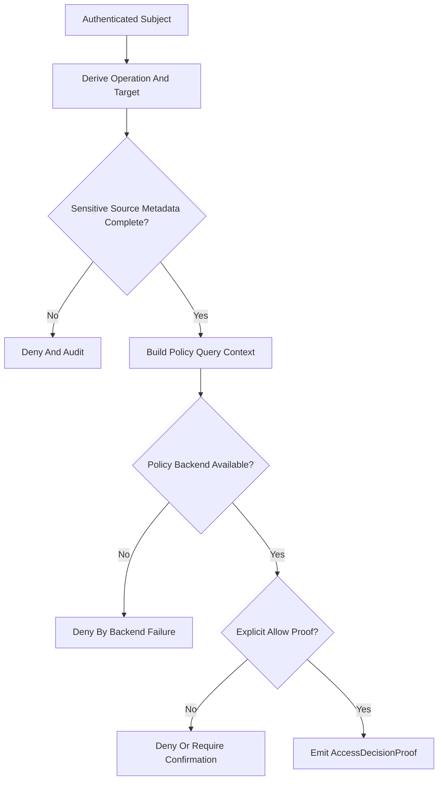

##### AdmissionController（含 RateLimitGate / IdempotencyGuard）

1. 职责：把入口并发控制、背压保护、幂等去重、replay hit 判断统一收敛为 `AccessAdmissionResult`，并在进入 Runtime 之前完成最后一道准入裁定。
2. 非职责边界：不做主体识别或授权；不构造 `AgentRequest`；不直接与 Runtime 交互；不拥有长期结果存储；不把重放命中伪装成新的业务执行。
3. 核心数据定义：围绕 `AccessAdmissionRequest`、`AccessAdmissionResult`、`RateLimitTicket`、`InflightQuotaSnapshot`、`IdempotencyRecord`、`ReplayHitRef` 建模；C++ 状态容器建议使用有界 registry + monotonic clock，而不是无界 map。
4. 公共/内部接口：保持 internal 级别；建议接口为 `admit()`、`acquire_inflight_ticket()`、`check_idempotency()`、`release_inflight_ticket()`、`record_completion()`；`RateLimitGate` 与 `IdempotencyGuard` 可作为 AdmissionController 的内部协作对象，不必分别暴露为 module public。
5. 关键执行流：先按 `channel_ref/subject/operation` 检查并发和队列预算，再生成 idempotency signature；若命中已完成结果则返回 replay hit；若命中处理中请求则返回 conflict/busy；若准入成功则发放 inflight ticket 并把 `admitted=true` 的结果交给 `RequestNormalizer`；完成后由 gateway 或 publisher 回调释放 ticket、更新记录与可重放索引。
6. 失败与回退语义：队列满、并发超限、幂等冲突时必须在 Runtime 前终止；replay hit 必须显式标记，不得再次 dispatch；任何计数器或 registry 不一致都应按 busy/fail-closed 处理；不允许无限等待或 silent loss。
7. 测试与验收出口：推荐单测为 `AdmissionControllerTest.cpp`、`RateLimitGateTest.cpp`、`IdempotencyGuardTest.cpp`、`AdmissionReplayHitTest.cpp`；验收要求 busy、conflict、replay hit、normal admit 四类路径均可自动断言。

##### RequestNormalizer

1. 职责：把 Admission 通过后的协议事实、主体事实和授权证明收敛为 shared `AgentRequest` 与 module-local `RuntimeDispatchRequest`，并保证标识传播、字段裁剪和 sidecar 隔离的一致性。
2. 非职责边界：不做协议 decode；不再次做授权；不直接 dispatch runtime；不决定 publish strategy 的最终执行；不把 access 私有字段塞进 shared contracts。
3. 核心数据定义：围绕 `NormalizationInput`、`RuntimeDispatchRequest`、`AgentRequestProjectionPlan`、`IdentityMetadataProjection`、`PublishContext`、`ClientCapabilityView` 建模；C++ 实现建议使用不可变值对象输出，避免后续阶段修改 shared request。
4. 公共/内部接口：保持 internal 级别；建议接口为 `normalize()`、`ensure_trace_ids()`、`project_agent_request()`、`build_publish_context()`、`sanitize_payload()`；不建议把 normalizer 直接暴露给 `apps/*`。
5. 关键执行流：先确保 `request_id/session_id/trace_id` 已存在或可生成；再把 payload、entry mode、subject/proof sidecar 映射为 `AgentRequest` 与 `RuntimeDispatchRequest`；随后构造 publish context、async/stream flags 和 client capability view，交给 `RuntimeBridge`；任何协议头、连接句柄、认证秘密都停留在 sidecar，不进入 shared 对象。
6. 失败与回退语义：payload 不满足 shared request contract、标识无法稳定生成、协议事实与主体事实冲突时必须拒绝；一旦 `AgentRequest` 已生成，不允许后续组件再改写 shared 字段；normalizer 失败必须保持 contracts tests 全绿而不是通过污染字段凑通流程。
7. 测试与验收出口：推荐单测为 `RequestNormalizerTest.cpp`、`RequestNormalizerIdentityProjectionTest.cpp`、`RequestNormalizerContractCompatibilityTest.cpp`；验收要求 ID 传播、payload 裁剪、shared/module-local 边界均可断言。

##### RuntimeBridge

1. 职责：作为 access 到 runtime 的唯一 module-local bridge，负责把 `RuntimeDispatchRequest` 转换为 runtime 可消费的调用，并将同步完成、异步受理、runtime reject 三类结果映射为稳定的 `RuntimeDispatchResult`。
2. 非职责边界：不拥有 Runtime 主循环；不做恢复裁定；不重试 runtime 调用；不保留长期业务状态；不替 runtime 生成业务级错误解释。
3. 核心数据定义：围绕 `RuntimeDispatchRequest`、`RuntimeDispatchResult`、`RuntimeInvokeContext`、`DispatchDeadlineView`、`AsyncAcceptFact`、`RuntimeRejectReason` 建模；其中 `RuntimeDispatchRequest` 保持 access module public，`RuntimeInvokeContext` 保持 bridge-local invoke shape，在 runtime 公开接口尚未完全收敛前由 adapter/stub 吸收 sidecar 差异。
4. 公共/内部接口：公共面继续为 `IAccessRuntimeBridge::dispatch(const RuntimeDispatchRequest&)`；内部建议拆为 `build_invoke_context()`、`dispatch_sync()`、`dispatch_async_capable()`、`map_runtime_result()`、`map_runtime_reject()`；不要把 runtime 内部对象直接透传到 `access/include`，也不要要求 runtime 立即暴露新的 sidecar public type。
5. 关键执行流：接收 normalizer 输出后，根据 `async_allowed/stream_requested` 与 runtime 能力视图选择 dispatch 模式；先生成 `RuntimeInvokeContext`，再调用 runtime 公开入口或 bridge-local adapter；若 runtime 立即返回 `AgentResult` 则映射为 `Completed`；若 runtime 明确接受异步处理则映射为 `AcceptedAsync` 并附带 receipt seed；若 runtime 拒绝或 sidecar 不一致则返回 `Rejected` 和结构化错误引用。
6. 失败与回退语义：runtime 不可用、deadline 冲突、bridge sidecar 不一致时必须显式失败；bridge 不做隐式 retry 或补偿；runtime 已产生业务事实后，bridge 只负责映射结果，不得二次改写执行语义；streaming 未冻结时，不允许通过 bridge 虚构 `StreamAttached` 成功态。
7. 测试与验收出口：推荐单测为 `RuntimeBridgeTest.cpp`、`RuntimeBridgeAsyncAcceptTest.cpp`、`RuntimeBridgeRejectMappingTest.cpp`；集成验收可与 `AccessGatewaySmokeIntegrationTest.cpp` 联动，验证 sync 和 accepted async 两条主支。

RuntimeBridge 局部时序如下：

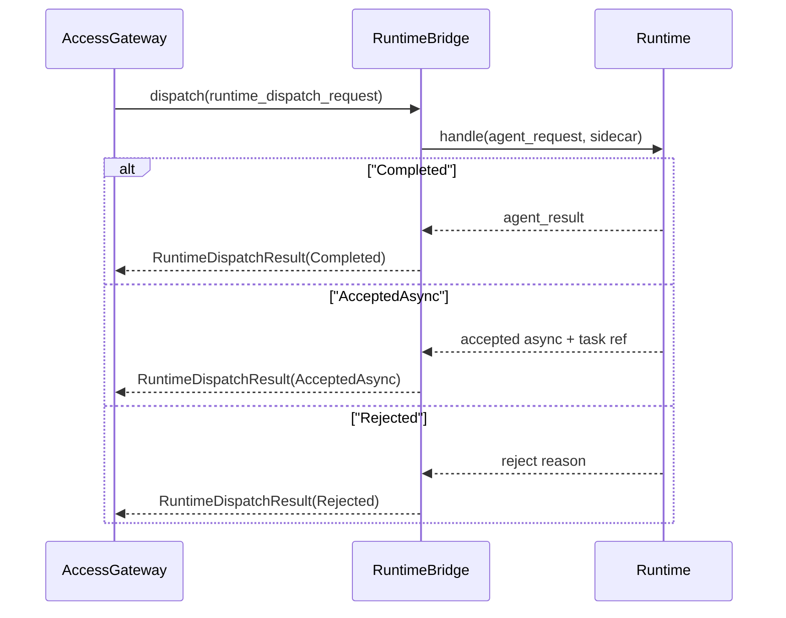

##### ResultPublisher

1. 职责：把 `AgentResult` 或 access 侧结构化失败映射为协议无关 `PublishEnvelope`，并驱动对应 encoder / publisher 完成 CLI、HTTP 等出口发布。
2. 非职责边界：不改写 `AgentResult` shared 语义；不拥有结果主存储；不决定是否 replan/retry；不直接参与授权；不为未冻结的 stream lifecycle 提供虚假保证。
3. 核心数据定义：围绕 `PublishEnvelope`、`PublishContext`、`ProtocolResponsePlan`、`ProtocolErrorMapping`、`PublishOutcome`、`ChannelAvailabilityFact` 建模；`protocol_metadata` 建议仅保留协议必要字段，不夹带认证秘密或运行时私有数据。
4. 公共/内部接口：建议保持 internal 级别，由 `IAccessGateway::publish_result()` 作为 facade 暴露；内部接口建议为 `build_envelope()`、`map_protocol_status()`、`select_encoder()`、`emit_publish()`、`emit_publish_failure()`；具体协议错误码映射留在 adapter-private mapper。
5. 关键执行流：接收 `AgentResult` 与 publish context 后，先生成协议无关 `PublishEnvelope`；再根据 `channel_ref/protocol_kind` 查找 encoder 或 publisher binding；随后输出 CLI 文本、HTTP response、receipt confirmation 等协议结果；如 channel 不可达，则返回 `PublishChannelUnavailable`，由 gateway 决定是否写入 replay cache 或回退为 poll instruction。
6. 失败与回退语义：publisher 失败不得吞掉 Runtime 已返回的业务结果事实；对 unary 请求，发布失败必须显式暴露；对 async/query/replay 请求，可在保持事实一致的前提下回退到 replay cache/poll；绝不允许 publisher 私自修改 `result_code/status/task_completed` 等 shared 字段。
7. 测试与验收出口：推荐单测为 `ResultPublisherTest.cpp`、`ProtocolErrorMapperTest.cpp`、`ResultPublisherChannelFailureTest.cpp`；集成验收继续以 `AccessGatewaySmokeIntegrationTest.cpp` 与 `AccessObservabilityIntegrationTest.cpp` 为主出口。

ResultPublisher 数据流如下：

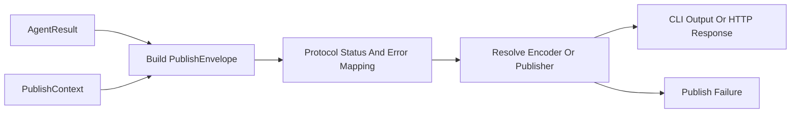

##### AsyncTaskRegistry

1. 职责：为 accepted async 请求管理 receipt、query token、ownership proof、状态推进和 TTL，向 query/replay path 提供稳定的异步受理索引。
2. 非职责边界：不拥有业务执行结果主语义；不替代 Runtime queue；不做长期持久化；不承担 stream session 管理；不在未校验 ownership 的情况下泄露结果状态。
3. 核心数据定义：围绕 `AsyncTaskReceipt`、`AsyncTaskState`、`AsyncTaskRecord`、`ReceiptOwnershipProof`、`ReceiptQueryResult`、`ExpirySweepStats` 建模；状态机建议至少区分 `Accepted`、`Running`、`Completed`、`FailedToPublish`、`Expired`。
4. 公共/内部接口：保持 internal 级别；建议接口为 `register_async_accept()`、`bind_result()`、`query_receipt()`、`mark_publish_failed()`、`expire_due_records()`、`validate_ownership()`；结果体本身继续通过 `ResultReplayCache` 或 publisher sidecar 提供，而不是在 registry 内复制一份完整 payload。
5. 关键执行流：当 RuntimeBridge 返回 `AcceptedAsync` 时，registry 生成 receipt 并绑定 `actor_ref/request_id/session_id/expires_at`；后续 runtime 或 publisher 完成结果回填时更新 task state 和 replay ref；query path 根据 receipt 或 request id 查找记录，先校验 ownership，再返回 pending/completed/expired 视图；定时 sweep 负责 TTL 过期和索引清理。
6. 失败与回退语义：owner mismatch、receipt 过期、记录损坏都必须 fail-closed；query 未命中不能推断任务不存在，应返回明确 not found/expired 语义；registry 写入失败时，gateway 不得伪称 async accepted 成功；任何回放都需要先通过 ownership proof。
7. 测试与验收出口：推荐单测为 `AsyncTaskRegistryTest.cpp`、`AsyncTaskRegistryOwnershipTest.cpp`、`AsyncTaskRegistryExpiryTest.cpp`；集成验收以 `AccessAsyncReceiptIntegrationTest.cpp` 为主出口，并补至少一个 owner mismatch failure case。

AsyncTaskRegistry 数据流如下：

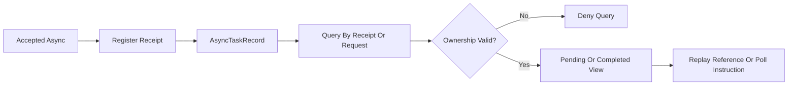

Access submit 主链局部时序如下：

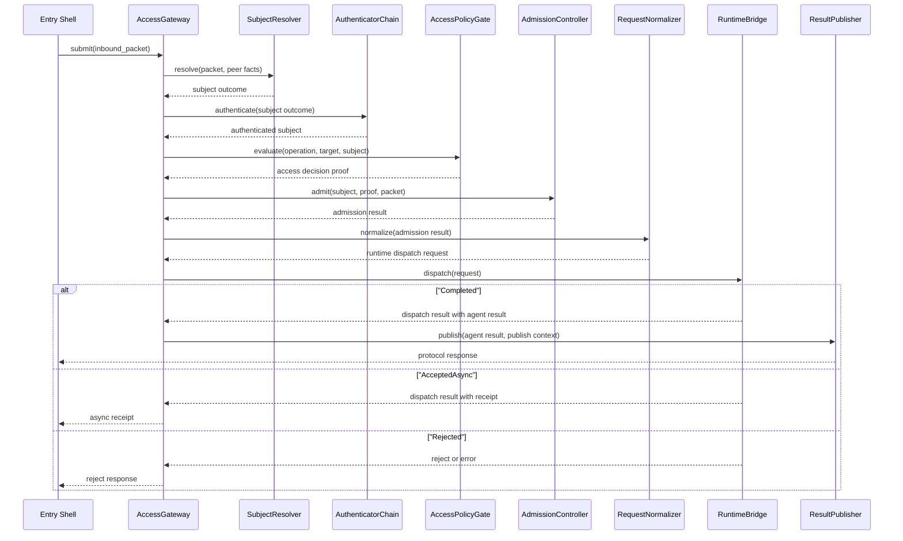

#### 6.14.8 P1 支撑与首版入口组件组

调研学习结论：

1. 首版真正进入实现的入口很可能是 CLI 与 HTTP，因此它们应先形成稳定 adapter 风格，而不是为每个入口重新设计一套 pipeline。
2. 从 C++ 工程实践看，配置投影、观测桥接和 replay cache 更适合做“projection-only / bridge-only / bounded-cache”类型组件，不应膨胀成新的 policy brain、observability store 或 result database。
3. P1 组件的目标是支持 P0 主链稳定落地，因此应优先写清接口、字段口径和失败降级，而非追求复杂流程或广泛协议覆盖。

##### CLI / HTTP ProtocolAdapter

1. 职责：在不改变 `IProtocolAdapter` 公共形状的前提下，把 CLI 输入和 HTTP 请求分别归一化为 `InboundPacket`，并把 `PublishEnvelope` 映射回 CLI 输出或 HTTP 响应。
2. 非职责边界：不做认证授权；不直接与 Runtime 交互；不持有 AsyncTaskRegistry；不自行决定流控；不在 adapter 层定义新的 shared request/result 语义。
3. 核心数据定义：CLI 侧围绕 `CliInvocationFrame`、`CliOutputPlan`、`LocalPeerFact` 建模；HTTP 侧围绕 `HttpRequestSnapshot`、`HttpResponsePlan`、`HttpHeaderView`、`RemotePeerFact` 建模；二者最终都只输出 `InboundPacket` 与 encoder 可消费的 `PublishEnvelope`。
4. 公共/内部接口：公共面继续实现 `IProtocolAdapter` 的 `can_handle()`、`decode()`、`encode()`；内部可分别拆出 `decode_cli_argv()`、`encode_cli_result()`、`decode_http_request()`、`encode_http_response()`；CLI/HTTP adapter 建议留在 `apps/cli/src` 与 `apps/gateway/src`，而非升格到 `access/include`。
5. 关键执行流：CLI adapter 负责把 argv/stdin/local shell facts 映射为 `entry_type=cli` 的 packet，并将 publish envelope 渲染为 stdout/stderr；HTTP adapter 负责从 request line、headers、body、peer addr 派生 `protocol_kind=http` 的 packet，并将 envelope 映射为 status code、headers 和 body；两者都必须在 decode 阶段尽早裁剪协议私有细节，仅把稳定事实送入 shared access core。
6. 失败与回退语义：parse 失败、协议不支持、body 超限或 header 冲突时直接返回 `ValidationRejected`；CLI 输出失败必须显式报错；HTTP channel 写回失败要让 `ResultPublisher` 看见 channel unavailable，而不是在 adapter 内吞掉；adapter 不做隐式重试。
7. 测试与验收出口：推荐单测为 `CliProtocolAdapterTest.cpp`、`HttpProtocolAdapterTest.cpp`、`HttpProtocolAdapterErrorMappingTest.cpp`；集成验收可由 `AccessGatewaySmokeIntegrationTest.cpp` 覆盖最小 CLI/HTTP unary 闭环。

首版入口差异建议如下：

| 入口 | decode 重点 | encode 重点 | 首版边界 |
|---|---|---|---|
| CLI | argv/stdin、本地用户、shell exit code | stdout/stderr、退出码映射 | 不做 challenge 往返，仅做本地 trusted/deny |
| HTTP | path/query/body、headers、peer/mTLS/JWT facts | status code、response body、headers | 仅先支持 unary + async receipt，不承诺 WS/stream |

##### 6.14.8.1 gateway 首版 transport 选型冻结

调研学习结论：

1. 当前仓库 `apps/gateway/CMakeLists.txt` 仅链接本项目目标，`third_party/` 也未预置 HTTP/WS/MQTT transport 依赖，因此 v1 transport 必须优先选择低引入成本、HTTP-only 的实现路径，而不是先引入泛化事件循环框架。
2. shared streaming lifecycle 仍未冻结；若在 004 阶段直接采用把 WebSocket/MQTT 一并带入主路径的 transport 方案，会把 004 与 005 的边界重新混写。

候选比较：

| 候选 | 结论 | 原因 |
|---|---|---|
| `cpp-httplib` | 采纳 | 单文件 header-only，直接提供 HTTP/1.1 server/client 与可配置 task queue；足以承载 unary submit/query/cancel、accepted async receipt 与 health probe，不要求同步打开 WS/MQTT |
| `libuv` | 不采纳 | 仅提供事件循环和 socket 抽象，仍需额外 HTTP parser / route 层；对 v1 最小 gateway 过宽 |
| `Boost.Beast/Asio` | 不采纳 | 仓库当前无 Boost 依赖；同时覆盖 WebSocket 能力，容易把 004 的 HTTP-only 边界重新扩张 |
| 自研最小 HTTP | 不采纳 | parser、安全头、超时、keep-alive 和错误映射的维护风险过高，不适合作为 v1 最小交付 |

冻结结论：

1. `apps/gateway` v1 transport 固定为基于 `cpp-httplib` 的 HTTP/1.1 unary listener；只承载 request/response、accepted async receipt 查询与 `/health/*`，不承诺 SSE、chunked stream、WebSocket 或 MQTT。
2. 业务 listener 与 health listener 使用同一 HTTP transport 家族但独立绑定；health routes 不经过 Admission pipeline。
3. 并发模型固定为 `1` 个 listen/accept 线程 + bounded worker task queue；每个 HTTP 请求在 worker 中走完整 Admission pipeline；不保留 connection-scoped Access 状态，keep-alive 仅作为 transport 优化而非业务语义。
4. `HttpProtocolAdapter` 首版只需覆盖 HTTP unary submit、accepted async receipt query/cancel、health probe 与统一安全头/CORS gate；任何 WS/MQTT route、upgrade 或 subscription 语义在 v1 一律视为 disabled/not ready。
5. `apps/gateway/CMakeLists.txt` 在 004 阶段只记录该选型与边界说明，不提前接入 WS/MQTT 依赖；具体第三方拉取与编译接线留到 ACC-TODO-026 实现阶段。

##### AccessObservabilityBridge

1. 职责：统一 access 全链的日志、指标、追踪、审计字段口径，并把阶段事实桥接到 infra observability 能力。
2. 非职责边界：不决定业务结果；不代替 publisher 或 policy gate；不直接保留 observability 存储；不把高敏数据写入日志/审计；不改变主链控制流。
3. 核心数据定义：围绕 `AccessStageEvent`、`AccessAuditEvent`、`MetricDimensionSet`、`TraceSpanContext`、`ObservabilityEmissionResult` 建模；最低锚点继续固定为 `request_id/session_id/trace_id/actor_ref(optional)`。
4. 公共/内部接口：保持 internal 级别；建议接口为 `emit_request_received()`、`emit_auth_failed()`、`emit_policy_denied()`、`emit_dispatch_result()`、`emit_publish_failed()`、`start_ingress_span()`；桥接实现应无异常外抛，避免影响主链。
5. 关键执行流：在 decode 完成后开启 ingress span；Admission 各阶段写结构化事件与关键指标；dispatch/publish 完成后补齐时延和结果标签；审计事件对 auth failed、policy denied、override requested/denied/applied、diagnostics pull 单独建模；对 metric/trace backend 的故障采取 no-op 或 diagnostics 记录，而不是影响请求流。
6. 失败与回退语义：audit 写出失败必须至少留下日志/metric 的 evidence gap；metrics/trace backend 不可用可降级为 no-op，但不能吞掉 auth/policy/publish 的显式错误事实；任何桥接失败都不得改变业务 accept/deny 结论。
7. 测试与验收出口：推荐单测为 `AccessObservabilityBridgeTest.cpp`；集成验收以 `AccessObservabilityIntegrationTest.cpp` 为主出口，要求认证失败、授权拒绝、发布失败三类事件齐备且字段稳定。

##### AccessConfigAdapter

1. 职责：把启动期 `AccessBootstrapConfig` 与运行期 profile/policy snapshot 投影为 access 内部可消费的治理视图，供 resolver/auth/policy/admission/publisher 使用。
2. 非职责边界：不直接解析 profile 原始 YAML；不拥有第二套策略体系；不做授权决策；不决定 transport 绑定细节以外的业务逻辑；不把投影视图暴露成 shared contracts。
3. 核心数据定义：围绕 `AccessBootstrapConfig`、`AccessAuthView`、`AccessAdmissionView`、`AccessPublishView`、`AccessRuntimeGovernanceView`、`SnapshotVersionFingerprint` 建模；建议所有 view 都是 immutable snapshot，其中 fingerprint 固定由 `bootstrap_revision + effective_profile_id + runtime_policy_generation` 组成。
4. 公共/内部接口：保持 internal 级别；建议接口为 `load_bootstrap_config()`、`build_auth_view()`、`build_admission_view()`、`build_publish_view()`、`refresh_runtime_governance()`、`is_snapshot_current()`；内部缓存建议按 fingerprint 做 invalidate，而不是按自由字段变更逐项热改。
5. 关键执行流：启动期先通过 deployment bundle 或 ConfigCenter typed query 读取 entry-specific bootstrap config，构造 listen/auth/replay/stream heartbeat 等静态视图；运行期再从 `RuntimePolicySnapshot` 提取 timeout、budget、ops/security 等动态治理投影；调用链在单次请求内固定使用同一版本 view，避免准入与发布看到不一致配置。
6. 失败与回退语义：关键配置缺失或不一致时，`init()` 必须失败或返回 deny-oriented view；热更新只影响下一次请求，不回溯影响进行中请求；任何缺省都必须偏向收紧，而不是放宽入口治理。
7. 测试与验收出口：推荐单测为 `AccessConfigAdapterTest.cpp`、`AccessConfigAdapterHotUpdateTest.cpp`、`AccessConfigProjectionProfileDiffTest.cpp`；验收要求 profile 差异和热更新缓存失效可自动断言。

##### ResultReplayCache

1. 职责：为 async query 和断线重放保留短期 `PublishEnvelope` 或其轻量引用，作为 `AsyncTaskRegistry` 与 `StreamGateway` 的 bounded replay cache。
2. 非职责边界：不拥有结果主事实；不承担授权；不替代异步注册表；不做长期持久化；不保留无限容量的历史结果。
3. 核心数据定义：围绕 `ReplayKey`、`ReplayEntry`、`ReplayLookupResult`、`ReplayEvictionStats`、`std::chrono::steady_clock::time_point expires_at` 建模；推荐实现为 bounded LRU + TTL。
4. 公共/内部接口：保持 internal 级别；建议接口为 `put()`、`lookup()`、`erase()`、`evict_expired()`、`size()`；cache API 不应暴露底层容器迭代器，避免越权修改。
5. 关键执行流：publisher 在 publish 成功或 channel unavailable 但允许 replay 时写入 cache；`AsyncTaskRegistry` 和后续 query/reconnect path 通过 `ReplayKey(receipt_id/request_id)` 查找结果；后台 sweep 负责 TTL 过期和容量淘汰统计；命中结果后由 caller 决定是否立即返回还是继续轮询。
6. 失败与回退语义：cache miss 不是业务失败，只表示需要返回 pending/not found/poll instruction；淘汰必须计数并可观测；缓存损坏或反序列化失败时不能伪造空结果，应返回 diagnostics evidence。
7. 测试与验收出口：推荐单测为 `ResultReplayCacheTest.cpp`、`ResultReplayCacheEvictionTest.cpp`、`ResultReplayCacheTtlTest.cpp`；集成验收继续与 `AccessAsyncReceiptIntegrationTest.cpp`、`AccessAdmissionFailureIntegrationTest.cpp` 联动。

#### 6.14.9 P2 延后与扩展入口组件组

调研学习结论：

1. shared streaming lifecycle 尚未在 runtime/llm/contracts 层完全冻结，因此 access 侧 stream 相关组件当前只能先做边界和失败语义冻结，不能把“完整 streaming 语义”当作首版硬门禁。
2. WS、MQTT、daemon、simulator 入口虽然都遵循 `IProtocolAdapter` 家族，但它们的会话模型、peer trust、重连语义和测试策略差异显著，适合在 CLI/HTTP 稳定后按同一模板增量补齐。

##### 延后 Gate 与 async/poll fallback matrix

1. `ACC-GATE-11` 固定为 Access 侧唯一的流式准入门：在 runtime/llm/contracts 尚未共同冻结 `attach/reconnect/replay cursor` shared contract 前，`StreamGateway`、WS/MQTT route、upgrade、subscription 和任何“stream ready”表述一律不得进入 v1 Build-ready 结论。
2. streaming feature flag 必须 default-off；只有同时满足“外部 shared lifecycle 已冻结”和“对应入口 listener / auth / replay tests 已具备”两类证据时，才允许把 `StreamGateway` 或 WS/MQTT adapter 从占位 Gate 提升到 Build 任务。
3. Access v1 唯一默认可交付的断线恢复路径仍是 `AcceptedAsync -> AsyncTaskReceipt -> access.task.query / poll`；该路径优先于任何未冻结的长连接重连、cursor replay 或 subscription keepalive 承诺。

流式延后 Gate 矩阵如下：

| 场景 | 允许行为 | 禁止行为 | 必须回退 |
|---|---|---|---|
| 请求声明 `stream_requested=true`，但 feature flag 关闭或 shared lifecycle 未冻结 | 若原始业务语义可退化为 unary accepted async，则返回 `AcceptedAsync` + receipt；否则显式返回 disabled/not ready | 伪造 `StreamAttached`、创建未冻结的 session/reconnect token、把请求偷转成长连接 ready | `AsyncTaskReceipt` + `access.task.query` / poll instruction |
| 请求携带 reconnect token / replay cursor，但 shared contract 未冻结 | 只允许查询 `AsyncTaskRegistry` / `ResultReplayCache` 中已有的 bounded result/ref | 承诺精确 frame replay、跨连接恢复完整订阅态、把 cursor 当 shared ABI | 返回 poll/query 结果或明确 not ready |
| WS/MQTT upgrade、订阅 route 或 broker/topic attach | 路由定义可保留占位，但默认 disabled/not ready，listener 不绑定到 v1 ready 面 | 宣称 gateway/daemon 已支持 WS/MQTT ready、把 upgrade 当 HTTP-only 首版的隐含能力 | 文档与实现统一保持 disabled/not ready |
| 慢消费者、channel unavailable、heartbeat 失败 | 断开本连接或拒绝 attach，并在 receipt 可用时提供 poll 指引 | 持有无界 buffer、阻塞 runtime/publisher 主链、把失败隐藏成“等待更多帧” | detach + async receipt/query/poll |

##### StreamGateway

1. 职责：仅在 streaming feature flag 明确打开且 `ACC-GATE-11` 被外部冻结证据解除后，管理流式订阅、心跳、慢消费者隔离、短期重连和向 poll/replay 的受控回退。
2. 非职责边界：不定义 shared stream contracts；不拥有 Runtime streaming 执行语义；不做业务级补偿；不保证无限缓冲或 exactly-once；不绕过 `AccessPolicyGate` 直接附着订阅。
3. 核心数据定义：围绕 `StreamSubscriptionRequest`、`StreamSession`、`StreamFrame`、`StreamCursor`、`SlowConsumerState`、`ReconnectToken` 建模；内部缓冲建议为 bounded ring buffer，不允许无界队列。
4. 公共/内部接口：保持 internal 级别；建议接口为 `attach_stream()`、`push_frame()`、`heartbeat()`、`detach_stream()`、`build_poll_fallback()`；在 shared lifecycle 未冻结前，不建议把 stream-specific ABI 放入 `access/include`。
5. 关键执行流：只有在 gate lifted 时，`access.request.stream` 才能经授权后创建 stream session；否则若请求可退化为 accepted async，则直接生成 receipt 并引导 query/poll；若不可退化，则立即返回 disabled/not ready。gate lifted 后，publisher 或 runtime sidecar 产生 frame 时推入 session buffer；慢消费者达到上限则断开并返回 reconnect/poll 指引；若会话短暂断开且 replay cursor 仍在 TTL 内，可通过 replay cache 或 receipt query 恢复有限结果。
6. 失败与回退语义：任何 attach、heartbeat、buffer overflow、channel unavailable 都必须显式可观测；当 shared lifecycle 语义不完整时，默认回退到 async receipt + poll，而不是宣称可靠流式重放；若请求语义无法退化为 unary accepted async，则必须返回显式 not ready/disabled；严禁持 L2 锁执行 socket write。
7. 测试与验收出口：首版只要求设计卡片与占位测试 `AccessStreamReconnectIntegrationTest.cpp`、`StreamGatewaySlowConsumerTest.cpp`；在 Phase A5 之前不作为硬 gate。

##### WS / MQTT / daemon / simulator adapters

1. 职责：在复用 `IProtocolAdapter` 家族和共享 Admission 主链的前提下，为状态化远程连接、daemon 本地 IPC 和 simulator stub 提供 entry-specific decode/encode 适配。
2. 非职责边界：不各自复制 Admission、Normalizer、RuntimeBridge、ResultPublisher；不把入口私有会话语义反推回 contracts；不在 adapter 内持有全局调度或业务状态机。
3. 核心数据定义：WS 侧围绕 `WebSocketFrameSnapshot`、`SubscriptionHint` 建模；MQTT 侧围绕 `TopicRouteView`、`QoSHint` 建模；daemon 侧围绕 `UdsRequestFrame`、`LocalPeerUidFact` 建模；simulator 侧围绕 `SimulatorStimulusFrame`、`DeterministicSubjectStub` 建模。
4. 公共/内部接口：公共面继续只实现 `IProtocolAdapter`；具体 adapter 仍建议留在各自 `apps/<entry>/src`；若后续出现共享 codec，可抽到 `access/src/codec/`，但不升级到 contracts。
5. 关键执行流：WS/MQTT adapters 负责把状态化连接事实折叠为 packet 并在必要时携带 subscription hint；daemon adapter 负责本地 IPC/UDS 的 peer uid 与运维入口事实；simulator adapter 负责确定性测试输入和受控 subject stub；四者最终都只把稳定 packet 交给共享 access core。
6. 失败与回退语义：WS/MQTT 首版不承诺完整 stream 语义，且在 `ACC-GATE-11` 解除前默认 disabled/not ready；daemon 入口必须比 remote entry 更严格地区分 local trusted 与 override source；simulator adapter 只能在测试/工厂 profile 下启用；任何入口私有 parse failure 都应在 adapter 层尽早显式拒绝。
7. 测试与验收出口：当前以接口冻结与占位测试为主，建议后续分别补 `WebSocketProtocolAdapterTest.cpp`、`MqttProtocolAdapterTest.cpp`、`DaemonProtocolAdapterTest.cpp`、`SimulatorProtocolAdapterTest.cpp`；Phase A5 前不把它们列为主 gate。

扩展入口差异摘要如下：

| 入口 | 会话模型 | 主要风险 | 当前冻结结论 |
|---|---|---|---|
| WebSocket | 长连接、状态化、可订阅 | 慢消费者、心跳、重连 | feature flag default-off；不承诺 attach/reconnect/replay lifecycle |
| MQTT | topic 驱动、broker 中介 | topic 授权、QoS 语义、离线重投 | feature flag default-off；首版只冻结 decode/encode 边界 |
| daemon | 本地 IPC/UDS | peer uid 信任、运维入口越权 | 本地 trusted 也必须受 profile allowlist 约束 |
| simulator | 测试/工厂刺激 | subject stub 越权、非生产入口渗透 | 仅在测试/工厂 profile 打开 |

### 6.15 生命周期、线程模型与优雅关闭

#### 6.15.1 AccessGateway 生命周期状态机

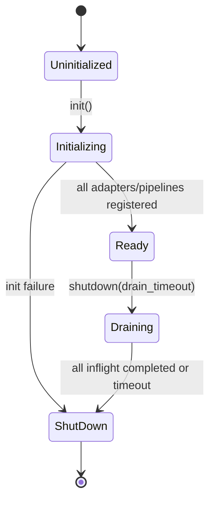

状态语义：

| 状态 | `submit()` 行为 | `publish_result()` 行为 | 说明 |
|---|---|---|---|
| `Uninitialized` | 返回 `InternalError` | 返回 false | 未初始化，不接受任何请求 |
| `Initializing` | 返回 `InternalError` | 返回 false | 正在注册 adapter/pipeline，尚未就绪 |
| `Ready` | 正常处理 | 正常发布 | 唯一可接受新请求的状态 |
| `Draining` | 返回 `ShuttingDown` | 继续处理已受理的 inflight publish | 不再接受新请求，等待 inflight 排空 |
| `ShutDown` | 返回 `ShuttingDown` | 返回 false | 已终止，所有资源已释放 |

#### 6.15.2 优雅关闭流程

1. entry 壳层或 signal handler 调用 `IAccessGateway::shutdown(drain_timeout)`。
2. AccessGateway 进入 `Draining` 状态，新请求一律返回 `ShuttingDown`。
3. 等待所有 inflight 请求完成 dispatch 和 publish（受 `drain_timeout` 约束）。
4. 超时后对仍 inflight 的请求写 `access.shutdown.inflight_abandoned` 审计事件，然后强制释放。
5. 关闭所有 adapter binding、清理 registry/cache/connection table。
6. 进入 `ShutDown` 状态。

优雅关闭约束：

1. drain 期间 `ResultPublisher` 必须继续工作，保证已受理请求的结果可发布。
2. drain 期间不得接受新的 stream attach 或 async receipt query。
3. `AsyncTaskRegistry` 中已生成但未完成的 receipt 标记为 `Expired`，并写审计。
4. 不得在 shutdown 路径上阻塞等待 Runtime 内部处理完成——这超出 access 职责。

#### 6.15.3 线程模型

Access 子系统不强制统一线程模型，但必须遵守以下约束：

| 场景 | 建议模型 | 约束 |
|---|---|---|
| CLI 入口 | 单线程同步 | main 线程处理全部请求-响应往返 |
| daemon 入口 | 单线程事件循环 或 线程池 | UDS accept 与 request dispatch 可共享事件循环或从 accept 派发到 worker |
| gateway 入口 | 单 listen 线程 + bounded worker task queue | 首版固定为 HTTP/1.1 unary；health listener 独立绑定；每个请求的 Admission pipeline 调用必须线程安全 |
| simulator 入口 | 单线程确定性 | 用于测试可重复性，不引入并发 |

通用并发约束：

1. AccessGateway 的 `submit()` 必须线程安全——多个 adapter 可能从不同线程并发调用。
2. ProtocolAdapterRegistry 的注册路径仅在 `Initializing` 期完成，`Ready` 态后为只读。
3. AsyncTaskRegistry、ResultReplayCache、ConnectionRegistry 的读写必须遵守 6.13.3 lock order。
4. 不得在 Admission pipeline 持锁期间执行网络 I/O、JSON 序列化或审计写入。

#### 6.15.4 组合根与依赖注入模式

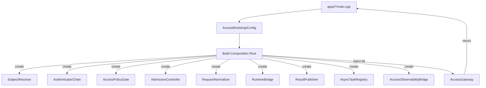

组合根规则：

1. 每个 `apps/<entry>/main.cpp` 只负责创建 entry-specific adapter、读取 bootstrap config、构造 AccessGateway 及其依赖并调用 `init()`。
2. AccessGateway 通过构造函数注入所有协作对象，不使用 service locator 或全局单例。
3. entry 壳层不直接调用 SubjectResolver/AuthenticatorChain 等内部组件，仅通过 `submit()` 和 `publish_result()` 与 AccessGateway 交互。
4. mock/stub 替换在测试中通过同一构造函数注入实现，无需条件编译或工厂方法。

### 6.16 输入验证与 Payload 消毒

#### 6.16.1 验证分层

Access 的输入验证分为三层，各层职责不可替代：

| 验证层 | 执行位置 | 职责 | 失败后行为 |
|---|---|---|---|
| L1 协议层 | ProtocolAdapter.decode() | 协议合规：frame 完整、encoding 合法、header 格式正确、body 大小检查 | 返回 `ValidationRejected` / `MalformedInput`，不进入 Admission |
| L2 语义层 | RequestNormalizer.normalize() | 业务语义：必填字段完整、值域合法、payload 不含注入向量、入口模式一致 | 返回 `ValidationRejected`，不进入 RuntimeBridge |
| L3 契约层 | RequestNormalizer (post-projection) | `AgentRequest` 冻结契约：6 个必填字段非空、channel 合法、tag 不超限 | 返回 `ValidationRejected`，保证 contracts tests 不受污染 |

#### 6.16.2 字段级验证规则

| 字段 / 输入 | 最大长度 | 验证规则 | 违规处理 |
|---|---|---|---|
| `user_input` | 64 KB（默认，profile 可调） | UTF-8 合法、不含 NULL byte | 超限 → `PayloadTooLarge`；编码非法 → `MalformedInput` |
| `goal_hint` | 4 KB | UTF-8 合法 | 超限截断并写 warn 日志 |
| `domain_context` | 4 KB | UTF-8 合法 | 超限截断并写 warn 日志 |
| `idempotency_key` | 256 bytes | ASCII printable、无空格 | 非法字符 → `ValidationRejected` |
| `tags` | 最多 32 个，每项 ≤ 256 bytes | key=value 格式、UTF-8 合法 | 超限 → 静默丢弃多余标签并写 warn |
| `constraint_set` | 8 KB | JSON/结构化格式、已知 key 白名单 | 未知 key 静默忽略、格式错误 → `ValidationRejected` |
| `request_channel` | 枚举值 | 必须 ∈ `{Cli, Gateway, Daemon, Simulator}` | 非法值 → `ValidationRejected` |
| HTTP headers | 总 64 KB、单 header 8 KB | 无 CR/LF injection、无 NULL byte | 注入尝试 → `MalformedInput` + 审计 |
| HTTP body | 1 MB（默认，profile 可调） | Content-Type 与 payload 一致 | 超限 → `PayloadTooLarge` |
| CLI argv | 总 64 KB | 可打印字符、shell escape 检查 | 非法 → usage error |

#### 6.16.3 Payload 消毒原则

1. **不信任客户端**：任何来自入口协议的字段在进入 Admission 前必须完成编码验证和长度断言。
2. **不自动修复**：对安全敏感字段（`idempotency_key`、`constraint_set`、认证 token）不做自动修复或猜测，直接拒绝。
3. **先裁剪后投影**：payload 裁剪/截断在 RequestNormalizer 内完成，投影到 `AgentRequest` 的是已清洗值。
4. **不记录原始 payload 到日志**：日志只记录 field 名、长度和验证结果，不记录原始内容；审计按需记录哈希摘要。
5. **injection 防护**：
   - HTTP header injection（CR/LF）：ProtocolAdapter 层拒绝。
   - Path traversal：Access 不做文件寻址，路径输入仅作为 domain_context 字符串。
   - SQL injection：Access 不直接操作数据库；若 infra/audit 需要持久化，由 infra 负责参数化存储。
   - Prompt injection：Access 不做 prompt 组装；`user_input` 原样传递给 Runtime，prompt 安全由 cognition/llm 层负责。

### 6.17 错误码 taxonomy 与协议映射

#### 6.17.1 AccessErrorCode 分组语义

| 分组 | 码段 | 含义 | 生产者 |
|---|---|---|---|
| Validation | 100–199 | 协议/字段/格式验证失败 | ProtocolAdapter / RequestNormalizer |
| Authentication | 200–299 | 认证失败、challenge、credential 过期 | SubjectResolver / AuthenticatorChain |
| Authorization | 300–399 | 授权拒绝、需确认、override 来源非法 | AccessPolicyGate |
| Admission | 400–499 | 限流、并发超限、幂等冲突、队列满 | AdmissionController |
| RuntimeDispatch | 500–599 | dispatch 失败、超时、bridge 不可用 | RuntimeBridge |
| Publish | 600–699 | 发布 channel 不可达、编码失败、超时 | ResultPublisher |
| Receipt | 700–799 | receipt 未找到、过期、owner 不匹配、取消失败 | AsyncTaskRegistry |
| Internal | 900–999 | 内部错误、关闭中 | AccessGateway |

#### 6.17.2 协议错误映射表

| AccessErrorCode | HTTP Status | CLI Exit Code | gRPC Code（预留） | 说明 |
|---|---|---|---|---|
| `ValidationRejected` | 400 Bad Request | 1 | INVALID_ARGUMENT | 通用验证失败 |
| `PayloadTooLarge` | 413 Payload Too Large | 1 | INVALID_ARGUMENT | 输入超限 |
| `MalformedInput` | 400 Bad Request | 1 | INVALID_ARGUMENT | 编码/格式损坏 |
| `AuthenticationFailed` | 401 Unauthorized | 77 | UNAUTHENTICATED | 认证失败 |
| `AuthenticationChallengeRequired` | 401 + WWW-Authenticate | 77 | UNAUTHENTICATED | 需补充 credential |
| `CredentialExpired` | 401 Unauthorized | 77 | UNAUTHENTICATED | 凭证过期 |
| `AuthorizationDenied` | 403 Forbidden | 77 | PERMISSION_DENIED | 授权拒绝 |
| `ConfirmationRequired` | 403 + X-Confirmation-Required | 77 | PERMISSION_DENIED | 需用户确认 |
| `OverrideSourceInvalid` | 403 Forbidden | 77 | PERMISSION_DENIED | override 来源非法 |
| `RateLimitExceeded` | 429 Too Many Requests | 75 | RESOURCE_EXHAUSTED | 限流 |
| `ConcurrencyLimitExceeded` | 429 Too Many Requests | 75 | RESOURCE_EXHAUSTED | 并发上限 |
| `IdempotencyConflict` | 409 Conflict | 75 | ABORTED | 幂等冲突（处理中） |
| `IdempotencyReplayHit` | 200 + X-Replay-Hit: true | 0 | OK | 幂等命中已完成结果 |
| `QueueFull` | 503 Service Unavailable | 75 | UNAVAILABLE | 入口队列满 |
| `RuntimeDispatchFailed` | 502 Bad Gateway | 1 | INTERNAL | Runtime 拒绝/失败 |
| `RuntimeDispatchTimeout` | 504 Gateway Timeout | 75 | DEADLINE_EXCEEDED | dispatch 超时 |
| `RuntimeBridgeUnavailable` | 503 Service Unavailable | 75 | UNAVAILABLE | bridge 不可用 |
| `PublishChannelUnavailable` | 502 Bad Gateway | 1 | INTERNAL | 发布通道断开 |
| `ReceiptNotFound` | 404 Not Found | 1 | NOT_FOUND | receipt 未找到 |
| `ReceiptExpired` | 410 Gone | 1 | NOT_FOUND | receipt 已过期 |
| `ReceiptOwnerMismatch` | 403 Forbidden | 77 | PERMISSION_DENIED | receipt owner 不匹配 |
| `ShuttingDown` | 503 Service Unavailable | 75 | UNAVAILABLE | 正在关闭 |

协议映射约束：

1. `ProtocolErrorMapper` 由各入口 adapter 或 publisher 实现，但映射表必须与上表对齐。
2. HTTP adapter 必须设置 `Content-Type: application/json`，body 为结构化错误 JSON（包含 `code`、`reason`、`detail`、`request_id`、`trace_id`）。
3. CLI adapter 必须输出人可读的 stderr 错误信息，exit code 遵循 sysexits.h 约定。
4. 安全相关拒绝（401/403/77）不得在响应 body 中暴露内部策略规则名或 matched_rule_ids。

### 6.18 超时级联与请求取消

#### 6.18.1 超时模型

Access 主链涉及三层超时，从外到内递减：

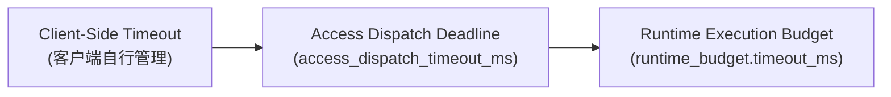

| 超时层 | 默认值 | 配置来源 | 触发方 | 失败行为 |
|---|---|---|---|---|
| Client-side timeout | 客户端自行决定 | 客户端 | Access 不控制 | Access 侧连接可能提前断开，转为 publish channel unavailable |
| Access dispatch deadline | `30,000 ms` | `AccessBootstrapConfig.dispatch_deadline_ms` | AccessGateway / RuntimeBridge | 返回 `RuntimeDispatchTimeout`，不代替 Runtime 做 cancel |
| Runtime execution budget | 按 profile + `AgentRequest.timeout_ms` | profiles + request 可选字段 | Runtime 内部 | Access 仅接收 Runtime 返回的 Timeout `AgentResult`，不二次判定 |

超时级联规则：

1. `access_dispatch_deadline` 必须 ≤ `runtime_budget.timeout_ms`，否则 Access 可能在 Runtime 超时前就放弃等待。
2. Access dispatch timeout 仅终止 bridge 等待，不主动通知 Runtime cancel；Runtime 执行可能在 access 超时后继续完成。
3. 若 Access dispatch 超时但 Runtime 后续完成了 `AgentResult`，该结果写入 `AsyncTaskRegistry` / `ResultReplayCache`，客户端可通过 receipt query 获取。
4. CLI 入口由于同步阻塞特性，`dispatch_deadline_ms` 可适当放大。

#### 6.18.2 请求取消流程

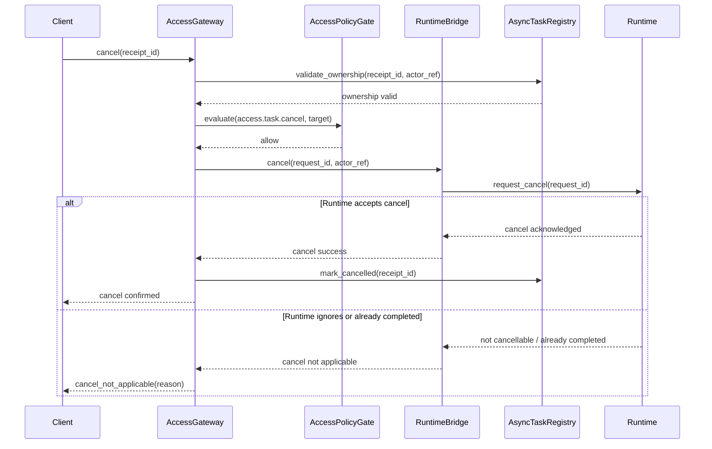

取消约束：

1. 取消必须先通过 receipt ownership 校验和 `access.task.cancel` 授权。
2. Access 只转发 cancel 请求到 Runtime，不自行终止执行——终止裁定权归 Runtime。
3. 若 Runtime 不支持 cancel 或任务已完成，Access 返回明确 `CancellationFailed` 而非虚假成功。
4. 取消后 receipt 标记为 `Cancelled`，query 返回对应状态。

#### 6.18.3 access-runtime bridge seam 冻结

1. `RuntimeDispatchRequest` 固定为 access module public handoff，由 `RequestNormalizer` 作为唯一 owner 生成；apps 壳层、publisher、registry 或 runtime 都不能各自再拼一份 access sidecar。
2. `RuntimeBridge` 固定负责把 `RuntimeDispatchRequest` 压缩为 bridge-local `RuntimeInvokeContext`，再通过 runtime 已有 public seam 或 bridge-local adapter 完成调用；这意味着 runtime-facing seam 的 v1 口径是“`AgentRequest` + invoke context”，而不是把 `SubjectIdentity` / `AccessDecisionProof` 直接拉进 runtime public headers。
3. `RuntimeInvokeContext` 只承载 invoke 期最小事实：`request_id/session_id/trace_id`、`actor_ref`、`operation/target_ref`、`decision/policy_decision_ref`、`publish_mode`、`dispatch_deadline`、`async_allowed/stream_requested`。完整 headers、credential refs、peer 原始句柄继续停留在 access 私有域。
4. cancel seam 固定为 `IAccessRuntimeBridge::cancel(request_id, actor_ref)`；ownership 校验和授权继续留在 access，`RuntimeBridge` 只把 cancel 事实映射到 runtime cancel stub 或后续稳定的 task-control seam，不在 `access/include` 暴露新的 runtime cancel 类型。
5. 上述两段式 handoff 用于解阻 6.6/6.7/6.18 的 public surface 与后续 ACC-TODO-009、011、020；若 runtime public ABI 后续扩展，优先由 bridge-local adapter 吸收，而不是反向改写 access/include 或 contracts。

### 6.19 Session 管理与 Receipt 所有权验证

#### 6.19.1 `session_id` 生成策略

| 入口类型 | `session_id` 生成规则 | 生命周期 | 说明 |
|---|---|---|---|
| CLI | 每次 CLI 调用生成新 `session_id` | 单次命令执行 | CLI 无状态，每次调用是独立会话 |
| HTTP (unary) | 每次 HTTP 请求生成新 `session_id`，除非客户端在 `X-Session-Id` header 中提供有效值 | 客户端指定或单次请求 | 允许客户端维持多轮对话会话 |
| HTTP (async query) | 继承原始请求的 `session_id` | 原始会话 | receipt query 必须携带原始 session 信息以支持 ownership 校验 |
| WebSocket | 连接建立时生成，连接级别共享 | 连接生命周期 | 同一 WebSocket 连接的请求共享 session |
| daemon | 每次 IPC 请求生成，或按客户端 session token 关联 | 请求级或客户端指定 | daemon 客户端可选择维持会话 |
| simulator | 由 fixture 装配注入确定性 `session_id` | 测试 fixture 生命周期 | 保证测试可重复 |

生成格式：建议 `session_id` 采用 UUID v7（时间有序）或 ULID，保证全局唯一且可按时间排序。

`session_id` 安全约束：

1. 客户端提供的 `session_id` 必须通过格式校验（UUID/ULID 正则、长度 ≤ 64 bytes）。
2. 客户端不能通过伪造 `session_id` 访问其他主体的 receipt 或结果——ownership 校验始终绑定 `actor_ref`。
3. `session_id` 不携带敏感信息，不包含 actor_ref/token/secret 的任何子串。

#### 6.19.2 Receipt 所有权验证方案

receipt 查询和取消必须验证调用者是原始请求的合法 owner。建议采用双因子校验：

| 验证因子 | 说明 | 必须匹配 |
|---|---|---|
| `actor_ref` | 调用者主体标识，由 SubjectResolver 当前请求的认证结果提供 | 必须与原始请求 `actor_ref` 一致 |
| `ownership_token` | receipt 生成时由 `AsyncTaskRegistry` 派生的不可预测 token | 必须与 receipt 记录中存储值一致 |

`ownership_token` 生成方式：

```
ownership_token = HMAC-SHA256(server_secret, receipt_id || actor_ref || request_id)
```

验证流程：

1. 调用者提供 `receipt_id` 和 `ownership_token`（HTTP 场景通过 header/body 传递；CLI 场景通过 receipt 文件或参数传递）。
2. `AsyncTaskRegistry.validate_ownership()` 先按 `receipt_id` 查找记录，若 not found 返回 `ReceiptNotFound`。
3. 比对 `actor_ref` 是否与记录一致；不一致返回 `ReceiptOwnerMismatch`（响应中不暴露原始 actor 信息）。
4. 比对 `ownership_token` 使用 constant-time comparison 防止 timing attack。
5. 检查 TTL，过期返回 `ReceiptExpired`。
6. 全部通过后返回 receipt 对应的 task 状态或结果引用。

受控 override 查询：

1. `subject_type=ops` 或 `trust_level=local_trusted` 的运维主体经过 `access.task.query` 授权后，可以跳过 `ownership_token` 校验，但仍必须通过 PolicyGate 授权并写审计。
2. 此路径仅用于诊断和运维，不对普通业务主体开放。

### 6.20 Health Check 与 Readiness Probe

#### 6.20.1 Health Probe 设计

| Probe 类型 | 检查内容 | 返回 | 适用入口 |
|---|---|---|---|
| Liveness | AccessGateway 进程存活、主线程未死锁 | OK / FAIL | 全部入口 |
| Readiness | `AccessGatewayState == Ready`、至少一个 adapter 已注册、RuntimeBridge 可达 | READY / NOT_READY | gateway / daemon |
| Startup | `init()` 完成、bootstrap config 加载成功 | STARTED / STARTING | gateway / daemon |

#### 6.20.2 实现建议

1. HTTP gateway 入口暴露 `/health/live`、`/health/ready`、`/health/startup` 三个端点，使用独立 listener，不经过 Admission pipeline。
2. gateway business listener 与 health listener 都复用同一 HTTP/1.1 transport 家族，但绑定解耦；health 不与业务 listener 共享 Admission / async receipt 路由。
3. daemon 入口通过 UDS 上的特殊 command 或 signal response 提供 health 状态。
4. CLI 和 simulator 无需 health probe。
5. health probe 不暴露内部状态细节（adapter 列表、registry 大小、queue 深度等），仅返回二值状态；详细诊断通过 `access.diagnostics.pull` 授权路径获取。
6. liveness 检查不得依赖外部服务（infra/policy、Runtime、secret backend），仅检查进程内存活状态。

#### 6.20.3 Access 侧 HTTP 安全头与 CORS

对 HTTP gateway 入口的所有响应（包括业务响应和拒绝响应），建议固定写入以下安全头：

| Header | 值 | 说明 |
|---|---|---|
| `X-Content-Type-Options` | `nosniff` | 阻止浏览器 MIME 嗅探 |
| `X-Frame-Options` | `DENY` | 防止 clickjacking |
| `Cache-Control` | `no-store` | 阻止缓存敏感响应 |
| `Content-Security-Policy` | `default-src 'none'` | 最小 CSP |
| `Strict-Transport-Security` | `max-age=31536000; includeSubDomains`（仅 HTTPS） | HSTS |
| `X-Request-Id` | 当前 `request_id` | 可追踪锚点 |

CORS 策略：

1. 默认不启用 CORS（嵌入式 Agent OS 场景多数不面向浏览器）。
2. 若需启用，在 `AccessBootstrapConfig` 中通过 `cors_allowed_origins` 白名单配置。
3. preflight 请求（OPTIONS）走独立处理路径，不经过 Admission pipeline。
4. CORS 配置不得使用 `*` 通配符与 `Access-Control-Allow-Credentials: true` 同时出现。

### 6.21 幂等键语义与生成规则

#### 6.21.1 幂等键生成

| 入口 | 幂等键来源 | 生成规则 | 说明 |
|---|---|---|---|
| HTTP | 客户端通过 `Idempotency-Key` header 提供 | 必须满足 `[A-Za-z0-9_-]{1,256}`，由 adapter 校验格式 | 遵循 IETF RFC draft-ietf-httpapi-idempotency-key-header |
| CLI | 自动生成：`SHA-256(argv_canonical + actor_ref + entry_type)` 截短为 hex 前 32 字节 | 默认关闭；通过 `--idempotent` flag 启用 | CLI 短命令场景幂等需求较低 |
| daemon | 客户端在 IPC frame 中提供 或 服务端自动生成 | 格式同 HTTP 规则 | daemon 长运行场景下建议客户端主动提供 |
| simulator | fixture 注入确定性 key | 用于测试重放验证 | 确保测试可重复 |

#### 6.21.2 幂等语义

1. **幂等范围**：per `(actor_ref, idempotency_key)` 组合。同一 actor 用相同 key 提交的请求视为同一逻辑请求。
2. **幂等窗口**：受 `idempotency_window_ms`（默认 5 分钟）控制。窗口外的相同 key 视为新请求。
3. **处理中冲突**：若相同 key 的请求仍在处理中，返回 `IdempotencyConflict`。
4. **已完成 replay**：若相同 key 的请求已完成且结果仍在 replay cache 中，返回 `IdempotencyReplayHit` 和原始结果。
5. **结果已过期**：若相同 key 的记录已过期（超出 replay TTL），返回 `ReceiptExpired`。

#### 6.21.3 `constraint_set` 投影规则

`AgentRequest.constraint_set` 是可选字段，Access 负责从 Admission 链结果中投影安全约束到此字段：

| 投影来源 | 投影目标键 | 投影条件 | 说明 |
|---|---|---|---|
| `SubjectIdentity.trust_level` | `constraint_set.trust_level` | 始终投影 | Runtime 可据此调整执行策略 |
| `SubjectIdentity.subject_type` | `constraint_set.subject_type` | 始终投影 | 区分人/服务/运维/模拟器 |
| `AccessDecisionProof.decision` | `constraint_set.access_decision` | 仅 `Allow` 投影 | Deny 不会到达此处 |
| `SubjectIdentity.tenant_ref` | `constraint_set.tenant_ref` | 非空时投影 | 多租户隔离上下文 |
| 客户端提供的 `constraint_set` | 透传但白名单过滤 | 已知 key 白名单 | 未知 key 静默忽略，防止客户端注入任意约束 |

投影约束：

1. 投影操作在 `RequestNormalizer.normalize()` 中完成，不在其他组件中散布。
2. 投影后的 `constraint_set` 是 ReadOnly 语义——Runtime 可读取但不应期望修改后回传。
3. 投影不得包含 secret 明文、认证 token、policy rule ID 等敏感信息。

---

## 7. Design -> Build 映射（建议级）

| Design 结论 | Build 目标 | 代码目标 | 测试目标 | 验收命令 | 备注 |
|---|---|---|---|---|---|
| 共享 access core | 建立 `access/include` 与 `access/src` 骨架 | `access/include/IAccessGateway.h`、`IAccessRuntimeBridge.h`、`AccessTypes.h`；`access/src/AccessGateway.cpp` | `tests/unit/access/AccessGatewayFacadeTest.cpp` | `cmake --build build-ci --target dasall_access_unit_tests && ctest --test-dir build-ci -R AccessGatewayFacadeTest --output-on-failure` | 第一优先级 |
| 统一协议入口模型 | 新增 adapter registry 与 `InboundPacket` | `access/src/ProtocolAdapterRegistry.cpp`、`apps/gateway/src/HttpProtocolAdapter.cpp`、`apps/cli/src/CliProtocolAdapter.cpp` | `tests/unit/access/ProtocolAdapterRegistryTest.cpp`、`HttpProtocolAdapterTest.cpp` | `ctest --test-dir build-ci -R "(ProtocolAdapterRegistry|HttpProtocolAdapter)Test" --output-on-failure` | gateway 可先只落 HTTP |
| Admission 链 | 落 SubjectResolver、AuthenticatorChain、PolicyGate、RateLimit/Idempotency | `access/src/SubjectResolver.cpp`、`AuthenticatorChain.cpp`、`AccessPolicyGate.cpp`、`AdmissionController.cpp` | `SubjectResolverTest.cpp`、`AccessPolicyGateTest.cpp`、`IdempotencyGuardTest.cpp` | `ctest --test-dir build-ci -R "(SubjectResolver|AccessPolicyGate|IdempotencyGuard)Test" --output-on-failure` | fail-closed 行为必须可断言 |
| RequestNormalizer | 固化 `AgentRequest` 构造与 sidecar 生成 | `access/src/RequestNormalizer.cpp` | `tests/unit/access/RequestNormalizerTest.cpp` | `ctest --test-dir build-ci -R RequestNormalizerTest --output-on-failure` | 必须保持 AgentRequest contract tests 全绿 |
| Runtime bridge | 建立 access -> runtime module-local bridge | `access/include/IAccessRuntimeBridge.h`、`access/src/RuntimeBridge.cpp` | `tests/unit/access/RuntimeBridgeTest.cpp` | `ctest --test-dir build-ci -R RuntimeBridgeTest --output-on-failure` | 需要 runtime 侧配合 mock/stub |
| 结果发布与协议映射 | 落 ResultPublisher 与 ProtocolErrorMapper | `access/src/ResultPublisher.cpp`、`ProtocolErrorMapper.cpp` | `tests/unit/access/ResultPublisherTest.cpp`、`ProtocolErrorMapperTest.cpp` | `ctest --test-dir build-ci -R "(ResultPublisher|ProtocolErrorMapper)Test" --output-on-failure` | 覆盖 HTTP/CLI 最小映射 |
| async receipt / query | 落 AsyncTaskRegistry 与 query path | `access/src/AsyncTaskRegistry.cpp`、`apps/gateway/src/TaskQueryHandler.cpp` | `tests/unit/access/AsyncTaskRegistryTest.cpp`、`tests/integration/access/AccessAsyncReceiptIntegrationTest.cpp` | `ctest --test-dir build-ci -R "(AsyncTaskRegistryTest|AccessAsyncReceiptIntegrationTest)" --output-on-failure` | v1 推荐进入最小交付 |
| 观测闭环 | 落 AccessObservabilityBridge | `access/src/AccessObservabilityBridge.cpp` | `tests/integration/access/AccessObservabilityIntegrationTest.cpp` | `ctest --test-dir build-ci -R AccessObservabilityIntegrationTest --output-on-failure` | 认证失败/授权拒绝/发布失败至少三类事件齐备 |
| 核心链路 smoke | 新增 integration smoke | `tests/integration/access/AccessGatewaySmokeIntegrationTest.cpp` | `AccessGatewaySmokeIntegrationTest.cpp` | `ctest --test-dir build-ci -L integration --output-on-failure` | 满足 SSOT 集成门禁 |
| 输入验证与 payload 消毒 | 落 RequestValidator + payload sanitizer | `access/src/RequestValidator.cpp`；各 adapter 的 decode 时 L1 校验 | `tests/unit/access/RequestValidatorTest.cpp`、`RequestValidatorPayloadLimitTest.cpp` | `ctest --test-dir build-ci -R "RequestValidator" --output-on-failure` | 必须覆盖 payload 超限、编码非法、注入尝试三类路径 |
| 错误码协议映射 | 落 ProtocolErrorMapper | `access/src/ProtocolErrorMapper.cpp`、各 adapter 内 encode 时映射 | `tests/unit/access/ProtocolErrorMapperTest.cpp` | `ctest --test-dir build-ci -R ProtocolErrorMapperTest --output-on-failure` | AccessErrorCode → HTTP status / CLI exit code 完整映射 |
| 生命周期与优雅关闭 | 落 AccessGateway state machine + shutdown | `access/src/AccessGateway.cpp` 扩展 state/shutdown | `tests/unit/access/AccessGatewayLifecycleTest.cpp` | `ctest --test-dir build-ci -R AccessGatewayLifecycleTest --output-on-failure` | 覆盖 Ready→Draining→ShutDown 转换和 inflight drain |
| 请求取消 | 落 RuntimeBridge.cancel() + AsyncTaskRegistry 状态更新 | `access/src/RuntimeBridge.cpp`、`AsyncTaskRegistry.cpp` 扩展 cancel | `tests/unit/access/AccessCancelFlowTest.cpp` | `ctest --test-dir build-ci -R AccessCancelFlowTest --output-on-failure` | 覆盖 ownership 校验 + 授权 + cancel 转发 |
| Receipt 所有权验证 | 落 HMAC-based ownership token + constant-time comparison | `access/src/AsyncTaskRegistry.cpp` 扩展 validate_ownership | `tests/unit/access/AsyncTaskRegistryOwnershipTest.cpp` | `ctest --test-dir build-ci -R AsyncTaskRegistryOwnershipTest --output-on-failure` | actor mismatch、token mismatch、TTL expired 三路可断言 |
| Health probe | 落 /health/live + /health/ready endpoint（gateway） | `apps/gateway/src/HealthProbeHandler.cpp` | `tests/integration/access/AccessHealthProbeIntegrationTest.cpp` | `ctest --test-dir build-ci -R AccessHealthProbeIntegrationTest --output-on-failure` | 不经 Admission，二值返回 |
| constraint_set 投影 | 落 normalize 内 constraint_set projection | `access/src/RequestNormalizer.cpp` 扩展 | `tests/unit/access/RequestNormalizerConstraintProjectionTest.cpp` | `ctest --test-dir build-ci -R RequestNormalizerConstraintProjectionTest --output-on-failure` | 白名单过滤 + 敏感信息不泄漏 |
| 无法直接映射：完整 streaming lifecycle | 延后到下一阶段 | N/A | 先补 `AccessStreamReconnectIntegrationTest.cpp` 设计占位 | N/A | 阻塞：shared stream lifecycle 尚未冻结，v1 不应强推为硬门禁 |

---

## 8. 实施计划与里程碑

### 8.1 目录与文件落盘建议

```text
access/
  include/
    IAccessGateway.h
    IAccessRuntimeBridge.h
    IProtocolAdapter.h
    AccessTypes.h
    AccessErrors.h
    IAdmissionController.h
  src/
    AccessGateway.cpp
    ProtocolAdapterRegistry.cpp
    SubjectResolver.cpp
    AuthenticatorChain.cpp
    AccessPolicyGate.cpp
    AdmissionController.cpp
    RequestNormalizer.cpp
    RequestValidator.cpp
    ProtocolErrorMapper.cpp
    RuntimeBridge.cpp
    AsyncTaskRegistry.cpp
    ResultPublisher.cpp
    StreamGateway.cpp
    ResultReplayCache.cpp
    AccessConfigAdapter.cpp
    AccessObservabilityBridge.cpp
apps/
  cli/
    src/main.cpp
    src/CliProtocolAdapter.cpp
  daemon/
    src/main.cpp
    src/DaemonProtocolAdapter.cpp
  gateway/
    src/main.cpp
    src/HttpProtocolAdapter.cpp
    src/WebSocketProtocolAdapter.cpp
    src/MqttProtocolAdapter.cpp
    src/TaskQueryHandler.cpp
    src/HealthProbeHandler.cpp
  simulator/
    src/main.cpp
    src/SimulatorProtocolAdapter.cpp
tests/
  unit/access/
    AccessGatewayFacadeTest.cpp
    AccessGatewayLifecycleTest.cpp
    ProtocolAdapterRegistryTest.cpp
    SubjectResolverTest.cpp
    AccessPolicyGateTest.cpp
    IdempotencyGuardTest.cpp
    RequestNormalizerTest.cpp
    RequestNormalizerConstraintProjectionTest.cpp
    RequestValidatorTest.cpp
    RequestValidatorPayloadLimitTest.cpp
    ProtocolErrorMapperTest.cpp
    RuntimeBridgeTest.cpp
    ResultPublisherTest.cpp
    AsyncTaskRegistryOwnershipTest.cpp
    AccessCancelFlowTest.cpp
  integration/access/
    AccessGatewaySmokeIntegrationTest.cpp
    AccessAsyncReceiptIntegrationTest.cpp
    AccessObservabilityIntegrationTest.cpp
    AccessAdmissionFailureIntegrationTest.cpp
    AccessHealthProbeIntegrationTest.cpp
```

### 8.2 分阶段实施计划

| 阶段 | 目标 | 代码目标 | 测试目标 | 完成判定 |
|---|---|---|---|---|
| Phase A1 | 建立 access core 骨架、公共接口与生命周期 | `IAccessGateway`（含 `shutdown/state/is_ready`）、`IProtocolAdapter`、`IAdmissionController`、`AccessTypes`、`AccessErrors`、`AccessGateway` 含状态机实现 | `AccessGatewayFacadeTest`、`AccessGatewayLifecycleTest` | `access/` 可独立编译，四个入口改为依赖共享 core，`Ready→Draining→ShutDown` 状态可自动断言 |
| Phase A2 | 收敛 Admission 链、RequestNormalizer 和输入验证 | `SubjectResolver`、`AuthenticatorChain`、`AccessPolicyGate`、`AdmissionController`、`RequestNormalizer`、`RequestValidator` | `SubjectResolverTest`、`AccessPolicyGateTest`、`RequestNormalizerTest`、`RequestValidatorTest`、`RequestNormalizerConstraintProjectionTest` | 失败路径 fail-closed，payload 验证和 constraint_set 投影可断言 |
| Phase A3 | 打通 Runtime bridge、unary 主链与错误映射 | `RuntimeBridge`（含 `cancel`）、`ResultPublisher`、`ProtocolErrorMapper`、daemon/CLI publisher（HTTP publisher 可并行） | `RuntimeBridgeTest`、`ResultPublisherTest`、`ProtocolErrorMapperTest`、`CliDaemonSmokeIntegrationTest` | CLI/daemon 最小入口可端到端提交并返回结果；错误码 → HTTP status / CLI exit code 映射全覆盖 |
| Phase A4 | 增加 async receipt / query / replay / cancel | `AsyncTaskRegistry`（含 ownership token）、`TaskQueryHandler`、`ResultReplayCache` | `AccessAsyncReceiptIntegrationTest`、`AsyncTaskRegistryOwnershipTest`、`AccessCancelFlowTest`、`AccessAdmissionFailureIntegrationTest` | 异步受理、receipt ownership 校验、取消转发、断线短期重放闭环可用 |
| Phase A5 | 观测、health probe 与加固 | `AccessObservabilityBridge`、`HealthProbeHandler`、WS/MQTT adapter、安全头 | `AccessObservabilityIntegrationTest`、`AccessHealthProbeIntegrationTest`、失败注入用例 | 拒绝/失败/发布异常三类事件齐备；health probe 可达；集成测试可被 `ctest -N` 发现 |

### 8.3 最小可交付切分建议

1. **最小可交付 1**：共享 access core + CLI/daemon unary 提交链。
2. **最小可交付 2**：Access PolicyGate + Idempotency + Runtime bridge 正常/拒绝路径。
3. **最小可交付 3**：Async receipt + query + replay cache。
4. **最小可交付 4**：WS/MQTT 与 StreamGateway 的受控增强版。

### 8.4 阶段完成判定

| 阶段 | 二值判定标准 |
|---|---|
| A1 | `access/include` 与 `access/src` 已存在，且四个入口都编译链接共享 core |
| A2 | Admission 任一失败都在进入 Runtime 前被拒绝，且测试覆盖认证失败、授权拒绝、限流拒绝 |
| A3 | 至少一个同步入口可生成 `AgentRequest`、进入 Runtime bridge、收到并发布 `AgentResult` |
| A4 | receipt 查询和结果重放路径可通过自动化集成测试验证 |
| A5 | `ctest -N` 可发现至少 1 个 `integration` 标签的 access 用例，且关键观测事件齐备 |

### 8.5 与 Access 专项 TODO 回链（2026-04-23）

1. 执行主计划以 [docs/todos/access/DASALL_access子系统专项TODO.md](docs/todos/access/DASALL_access子系统专项TODO.md) 为准，采用“daemon 常驻服务 + CLI 独立进程经 IIPC/UDS 接入 Access 主链”的默认路径。
2. 专项 TODO 中 ACC-TODO-025/029/037/038 已将本地控制面链路与跨子系统依赖显式拆分；其中 gateway transport 选型门（ACC-TODO-004）仅阻断 HTTP/gateway 路径，不阻断 CLI/daemon 本地主链。
3. 本文档的 Phase A3、最小可交付和灰度策略与专项 TODO 已对齐；若后续发生口径差异，以“Runtime 单一主控、Access 单一接入 owner、CLI 不直连 runtime”为仲裁规则。

---

## 9. 测试与质量门

### 9.1 测试矩阵

| 测试层级 | 覆盖范围 | 关键用例 | 目标 |
|---|---|---|---|
| 单元测试 | SubjectResolver、AuthenticatorChain、AccessPolicyGate、IdempotencyGuard、RequestNormalizer、RuntimeBridge、ResultPublisher | `SubjectResolverTest`、`AccessPolicyGateTest`、`IdempotencyGuardTest`、`RequestNormalizerTest`、`RuntimeBridgeTest`、`ResultPublisherTest` | 验证组件职责、失败原因码和 fail-closed 行为 |
| 契约测试影响点 | `AgentRequest`/`AgentResult`/`ErrorInfo`/`IdentityMetadata` 边界不被 access 污染 | 复跑既有 contracts tests；新增 access 不得让 contract test 失败 | 保持 contracts 冻结一致性 |
| 集成测试 | CLI/daemon（默认）与 HTTP（可选）提交闭环、async receipt/query、observability、失败注入 | `CliDaemonSmokeIntegrationTest`、`AccessAsyncReceiptIntegrationTest`、`AccessObservabilityIntegrationTest`、`AccessAdmissionFailureIntegrationTest` | 验证 access 进入核心链路后的端到端行为 |
| 失败注入测试 | secret 不可用、policy manager 不可用、queue 满、publisher 断连、慢消费者 | `AccessAdmissionFailureIntegrationTest`、`ResultPublisherFailureTest`、`StreamGatewaySlowConsumerTest` | 验证 fail-closed 与局部恢复路径 |
| 兼容性检查 | profile 差异、入口差异、协议差异 | CLI vs HTTP 行为一致性；不同 profile 下 timeout/budget 投影一致性 | 避免不同入口和档位行为漂移 |

### 9.2 建议质量门（Gate）

| Gate ID | 检查项 | 通过标准 | 失败后动作 |
|---|---|---|---|
| ACC-G1 | 边界门 | access 代码未直接 include `cognition/llm/tools/services/memory/knowledge` 实现头文件 | 阻断合并，回退到 Runtime bridge 统一接入 |
| ACC-G2 | Admission fail-closed 门 | 认证失败、授权拒绝、策略服务失败、queue 满四类场景均拒绝请求 | 阻断合并，先修 admission 逻辑 |
| ACC-G3 | contracts 一致性门 | 既有 `AgentRequest`/`AgentResult` contract tests 全绿 | 阻断合并，去除 shared 污染字段 |
| ACC-G4 | 集成门 | 至少 1 个 access integration 用例被 `ctest -N` 发现并通过 | 阻断 Phase 2/3 推进 |
| ACC-G5 | 观测完整性门 | `access.auth.failed`、`access.policy.denied`、`access.publish.failed` 三类事件可自动断言 | 补 observability bridge 再进入下一阶段 |
| ACC-G6 | override 安全门 | 普通业务请求、cookie、query string、未签名 CLI 环境变量无法触发 `runtime_override` | 高危阻断 |
| ACC-G7 | 输入验证门 | payload 超限、编码非法、注入尝试三类输入均被拒绝，不进入 Admission | 阻断合并 |
| ACC-G8 | 生命周期门 | `shutdown()` 后新请求返回 `ShuttingDown`，inflight 请求可排空或超时释放 | 阻断 daemon/gateway 正式部署 |
| ACC-G9 | Receipt 安全门 | 非 owner 的 receipt query 被拒，timing attack safe（constant-time comparison） | 阻断 Phase A4 完成 |
| ACC-G10 | 错误映射一致性门 | 所有 `AccessErrorCode` 在 HTTP/CLI 映射表中可查到，且映射测试全覆盖 | 阻断 Phase A3 完成 |

---

## 10. 兼容性与演进评估（建议级）

### 10.1 breaking risk 评估

| 评估项 | 风险级别 | 说明 |
|---|---|---|
| 对当前仓库代码 | Low | `apps/*` 仍是 placeholder，`access/` 仅新增独立骨架，不改 shared contracts |
| 对 shared contracts | None | 本方案不要求新增或改写共享 contracts 对象 |
| 对 runtime module public interface | Medium | 需要明确 access sidecar bridge 的 module-local 接口；若设计含糊，后续会返工 |
| 对 profiles/config | Low | 运行治理优先复用既有快照视图，避免新增 runtime policy 顶层域 |
| 对入口协议扩展 | Low | 新协议通过新增 adapter 扩展，不改 Admission/Normalizer 主链 |

### 10.2 兼容迁移路径与灰度策略

1. 先以 CLI + daemon unary 主链落地 access core，HTTP unary 可并行但受 transport 选型门控，不要求同步打开 WS/MQTT/simulator 全部能力。
2. 通过 `enabled_modules.*_adapter` 和 entry executable 装配策略控制灰度范围；先启用 `cli_adapter`、`daemon_adapter`，再增量打开 `gateway_adapter`、`simulator_adapter`。
3. 若 Runtime sidecar bridge 短期未收敛，可先以 `AgentRequest` + 最小 publish context 打通闭环，同时把高风险动作、override 和 diagnostics pull 保持 deny-by-default，不做假性放行。
4. stream path 先 behind feature flag 且默认关闭；只有 shared streaming lifecycle 具备外部冻结证据时才允许打开。断线重连、upgrade 失败或 replay cursor 语义不完整时，统一回退到 receipt/query/poll，而不是强行承诺流式重放完整语义。

### 10.3 版本扩展预留点

| 预留点 | 当前策略 | 后续扩展方向 |
|---|---|---|
| 主体上下文 shared admission | 继续 module-local | 当 Runtime/Policy/Access 主体对象冻结成熟后再评估是否升格为 shared supporting object |
| streaming lifecycle | `ACC-GATE-11` 延后门；feature flag default-off + async/poll fallback | 后续与 runtime/llm streaming 语义收敛后再冻结 |
| 协议适配器 | 先 CLI/daemon（HTTP 可并行） | 可增量加入 WS/MQTT/serial-console，不影响主链 |
| 认证方式 | 先 local shell / peer uid / JWT / mTLS | 后续可扩展 OIDC、设备证书、工厂测试 stub |
| diagnostics/override | 受控入口 | 后续可与 daemon 运维入口深度联动，但仍保持 fail-closed |

---

## 11. 风险、阻塞与回退（建议级）

| 项目 | 等级 | 触发条件 | 解阻条件 | 回退策略 |
|---|---|---|---|---|
| Runtime sidecar bridge 口径漂移 | Medium | Access 直接把 sidecar 抬升为 runtime public ABI，或让不同入口各自拼装 handoff | 维持 `RuntimeDispatchRequest -> RuntimeInvokeContext` 两段式 owner 规则 | 回退到 bridge-local adapter 吸收差异，禁止把 sidecar 回写 contracts / runtime public headers |
| gateway transport scope 漂移 | Medium | 实现阶段重新引入 WS/MQTT、streaming route、重量级事件循环依赖或多 listener 混写 | 维持 `cpp-httplib` HTTP/1.1 unary + 独立 health listener + bounded worker queue 规则 | 回退到 HTTP-only、accepted async receipt、health 独立 listener，不宣称 WS/MQTT ready |
| override / diagnostics schema 漂移 | Medium | Access 重新接受自由 patch、`trace_id/session_id` 公共 selector、inline artifact bytes 或宽松 remote target | 维持 `ConfigPatch` + `SnapshotQuery` / `SnapshotExportRequest` 唯一路径与 exact-match gate | 回退到 `snapshot_id` only + LocalFile/Json only + deny-by-default |
| shared streaming lifecycle 未冻结 | Medium | StreamGateway 需要稳定句柄、取消、重连语义 | 与 runtime/llm streaming 设计收敛，并解除 `ACC-GATE-11` | v1 保持 feature flag default-off，统一退回 async receipt + poll |
| 结果发布与慢消费者冲突 | Medium | 流式/长连接消费者持续阻塞 | 完成慢消费者断连和 replay cache 设计 | 断开慢消费者并回退到轮询，不阻塞主链 |
| access bootstrap 来源漂移 | Medium | apps 重新允许命令行逐字段覆盖 bootstrap，或 AccessConfigAdapter 直接解析 profile 原始文件 | 维持 typed bootstrap carrier + projection-only adapter 规则 | 回退到 `bootstrap_ref` + immutable view 模式，禁止第二来源和并行 schema |

---

## 12. 未决问题与后续任务

### 12.1 已在本版解决的问题

| 原未决项 | 解决方案 | 参见章节 |
|---|---|---|
| runtime bridge sidecar seam 未冻结 | 冻结为 `RuntimeDispatchRequest` module public + `RuntimeInvokeContext` bridge-local invoke shape + `IAccessRuntimeBridge::cancel()` 唯一 cancel surface | 6.6、6.18.3 |
| `AccessBootstrapConfig` source-of-truth 与热更新边界未冻结 | 冻结为 typed bootstrap carrier + locator-only startup args + `SnapshotVersionFingerprint` invoke-scoped immutable 规则 | 6.11、6.20、AccessConfigAdapter |
| override / diagnostics 入口 schema 未冻结 | override 复用 `ConfigPatch` v1；diagnostics pull 复用 `SnapshotQuery` / `SnapshotExportRequest`，并将 v1 selector 收口为 `snapshot_id` only | 6.11.4、6.11.5、6.12 |
| gateway 首版 transport 与 HTTP-only 边界未冻结 | gateway v1 固定采用 `cpp-httplib` HTTP/1.1 unary listener + accepted async receipt + 独立 health listener；WS/MQTT 延后到 Phase A5 | 6.14.8、6.20.2 |
| streaming 延后边界与 async/poll fallback Gate 未收敛 | 冻结为 `ACC-GATE-11`：StreamGateway / WS / MQTT 仅允许 feature flag default-off + 占位接口；attach/reconnect/replay cursor 未冻结时统一回退到 async receipt + poll，不进入 v1 ready 结论 | 6.14.9、10.2、10.3、11 |
| `publish_result()` 签名不一致 | 统一为 `const PublishEnvelope&`，`PublishEnvelope` 已正式定义 | 6.7 |
| 是否需要独立 receipt ownership proof | 采用 HMAC-SHA256 双因子方案（`actor_ref` + `ownership_token`） | 6.19.2 |
| 缺少 AccessGateway 生命周期管理 | 新增 `AccessGatewayState` 状态机、`shutdown()`、`is_ready()` | 6.15.1、6.7 |
| 缺少输入验证设计 | 新增三层验证模型和字段级规则 | 6.16 |
| 缺少错误码 taxonomy | 新增 `AccessErrorCode` 分组枚举和协议映射表 | 6.17 |
| 缺少超时级联模型 | 新增 access dispatch deadline / runtime budget 超时关系 | 6.18.1 |
| 缺少请求取消流程 | 新增 `IAccessRuntimeBridge::cancel()` 和取消时序 | 6.18.2 |
| 缺少 session_id 生成策略 | 按入口类型定义生成规则 | 6.19.1 |
| 缺少 `constraint_set` 投影规则 | 新增投影来源、目标键和白名单规则 | 6.21.3 |
| 缺少 health probe 设计 | 新增 liveness/readiness/startup 三层 probe | 6.20 |
| 缺少 CORS / 安全头 | 新增 HTTP 安全头表和 CORS 策略 | 6.20.3 |
| 缺少幂等键生成规则 | 新增按入口定义的幂等键来源和语义 | 6.21.1、6.21.2 |
| 缺少 `IAdmissionController` 接口 | 新增 `IAdmissionController` C++ 接口定义 | 6.7 |
| 缺少 `AccessError` / `AccessErrorCode` 定义 | 新增 struct + enum 完整定义 | 6.7 |

### 12.2 仍未决的问题

1. runtime / llm / contracts 是否会冻结统一的 stream attach/reconnect/replay cursor shared contract；005 只完成了 Access 侧的延后 Gate 与 fallback 收口，没有把 streaming 提升为 Build-ready。
2. 串口入口是否在 v1 纳入 access 正式 Build 目标，还是留给后续 platform/daemon 联调阶段。
3. `ownership_token` 的 HMAC secret 轮换策略和多实例部署下的 secret 同步方案尚待定义。
4. CLI 入口是否需要支持 `--async` 模式（提交后立即返回 receipt，后续 `--query receipt_id` 查询），还是始终同步阻塞。

### 12.3 后续 Build 原子任务建议顺序

1. 新增 `access/` 顶层骨架、公共接口、`AccessErrors`、生命周期状态机。
2. 新增 Admission 链、RequestValidator、RequestNormalizer（含 constraint_set 投影）。
3. 新增 Runtime bridge（含 cancel）、ProtocolErrorMapper 与 unary publish 主链。
4. 新增 async receipt/query/replay、ownership token 验证。
5. 新增 observability bridge、health probe、安全头、集成测试与 gateway 扩展协议。