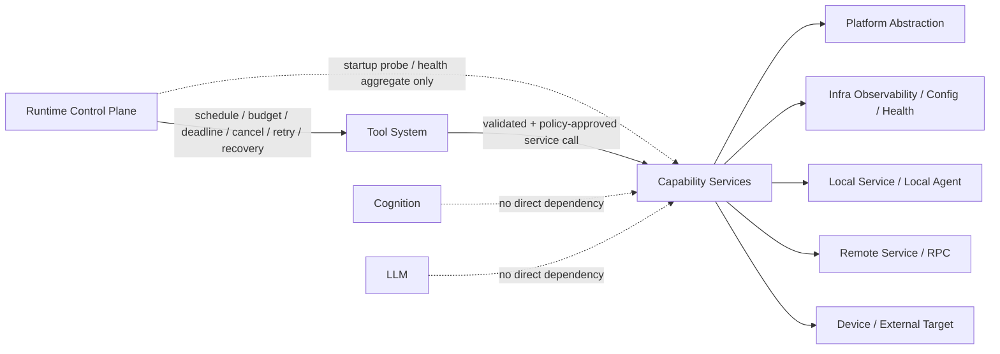
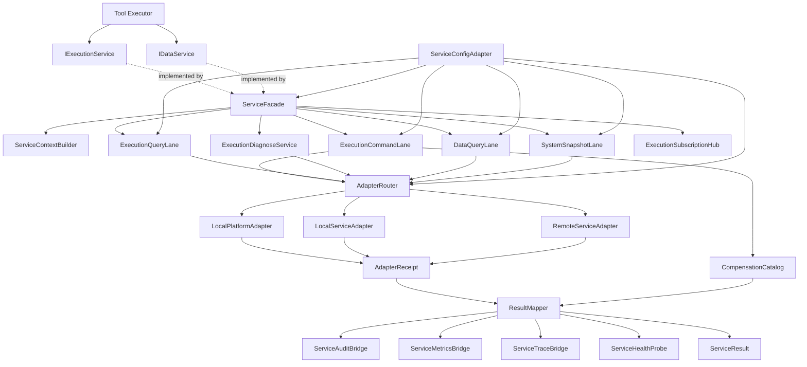
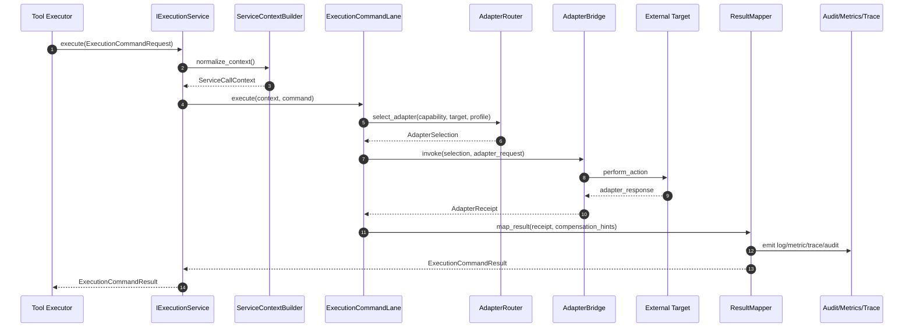
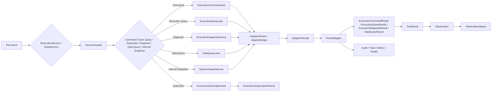
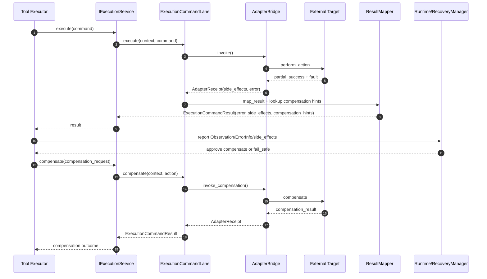

# DASALL Capability Services 子系统详细设计（Detailed Design）

版本：v1.0  
日期：2026-04-08  
阶段：Detailed Design  
适用模块：services/

## 1. 模块概览

### 1.1 目标与定位

Capability Services 属于 Layer 3（Capability Services Layer），是 services/ 的工程落点，用于把“工具动作意图”收敛为“稳定的服务语义调用”，并屏蔽外部执行目标、数据提供者、本地系统服务、远程业务服务与平台适配细节。

本子系统的设计目标是：

1. 为 tools 提供稳定、可治理、可裁剪的服务调用面，避免 tools 直接触达 platform、驱动、脚本执行器或远程业务端。
2. 在不改写 Runtime 主控权的前提下，把 Execution Control 收敛为 services 内部一级能力子域，稳定承接高风险动作的执行语义。
3. 在 contracts 已冻结对象基础上，建立可映射到 Build 的模块结构、接口语义、异常语义、测试门禁和演进路径。

来源依据：
1. DASSALL_Agent_architecture.md 3.4.5、3.5、5.5、7.2、7.4
2. DASALL_架构设计文档.md 4.10
3. DASALL_Engineering_Blueprint.md 3.9

### 1.2 边界与依赖方向

| 维度 | 内容 | 边界说明 |
|---|---|---|
| 上游主消费者 | tools | Tool 通过受治理链路调用 services，不直接触达 platform 或外部目标 |
| 上游次消费者 | runtime（受限） | 仅允许在启动自检、健康聚合、只读能力探测等场景使用抽象服务面；不允许 runtime 绕过 tools 直发高风险动作 |
| 下游依赖 | platform、infra、本地服务、远程服务 | services 只依赖抽象适配层、基础设施与外部执行端/数据端 |
| 同层协同 | knowledge、memory、multi_agent | 无直接实现依赖；只通过上层编排链路间接协作 |
| 禁止依赖 | cognition、llm、apps 具体实现 | services 不拥有认知、模型路由、产品入口逻辑 |

### 1.3 设计范围

纳入范围：
1. Capability Services 的职责边界、子组件拆分、接口语义、核心对象、主流程与异常流程。
2. Execution Service、Data Service、System Service 三个服务子域与 ServiceFacade、AdapterBridge 的工程落点。
3. 与 contracts、profiles、platform、infra 的对齐规则。
4. Design -> Build 映射、目录落盘建议、测试矩阵、质量门、风险与回退策略。

不纳入范围：
1. platform 具体驱动、协议、句柄与 HAL 实现细节。
2. Runtime 的确认、审批、熔断准入、补偿裁定与恢复调度逻辑。
3. tools 的 Policy Gate、Tool IR、Workflow Engine 细节。
4. 新增或改写 contracts 共享语义对象。
5. TaskService 的详细设计。架构 7.2 将 TaskService 列入 services/ 工程目录，但根据架构 3.5 对子系统职责的划分，Task 子系统的生命周期管理、状态机与调度属于 Runtime Control Plane（Layer 6）职责域，其工程落点在 runtime/ 而非 services/；services 仅在 Execution/Data 链路中透传 task 相关上下文标识（如 goal_id），不承担 Task 的创建、状态推进与终结语义。若后续架构版本将 TaskService 的部分查询能力显式下沉到 services/，需发起独立设计补充。

### 1.4 来源依据与现状证据

架构与治理依据：
1. docs/architecture/DASSALL_Agent_architecture.md
2. docs/architecture/DASALL_架构设计文档.md
3. docs/architecture/DASALL_Engineering_Blueprint.md
4. docs/adr/ADR-005-architecture-review-baseline.md
5. docs/adr/ADR-006-context-orchestrator-vs-prompt-composer.md
6. docs/adr/ADR-007-reflection-engine-vs-recovery-manager.md
7. docs/adr/ADR-008-agent-orchestrator-vs-multi-agent-coordinator.md
8. docs/ssot/InfraConcurrencyPolicy.md
9. docs/ssot/InfraIntegrationTopology.md
10. docs/development/DASALL_工程协作与编码规范.md

contracts 与实现现状证据：
1. services/CMakeLists.txt：当前仅构建静态库与占位源码。
2. services/src/placeholder.cpp：当前仅保留空实现以维持库非空。
3. tests/contract/smoke/InterfaceCatalogContractTest.cpp：services 只保留 IExecutionService、IDataService 两个接口候选。
4. contracts/include/boundary/InterfaceCatalog.h：IExecutionService、IDataService 当前处于 AwaitingSupportingContracts。
5. tests/mocks/include/MockExecutionService.h：tests/mocks 已收敛为扁平 include 根，仅存在最小 smoke/mock 级执行服务占位。
6. tests/CMakeLists.txt：unit/contract/integration 测试总入口已接线，可承接 services 后续测试落盘。

行业实践参考：
1. Microsoft Azure Architecture Center：CQRS pattern
2. Microsoft Azure Architecture Center：Compensating Transaction pattern
3. Microsoft Azure Architecture Center：Bulkhead pattern

---

## 2. 约束清单

### 2.1 Must / Should / Must-Not 约束表

| Constraint ID | 来源文档 | 类型 | 约束描述 | 影响范围 |
|---|---|---|---|---|
| CAP-C001 | DASSALL_Agent_architecture.md 3.4.5、5.5 | Must | Capability Services 必须封装执行控制、数据查询、业务服务与系统服务语义，为 Tool 提供稳定服务接口 | 子系统职责 |
| CAP-C002 | DASSALL_Agent_architecture.md 5.5.1 | Must | Tool 只调用 Execution Service，不直接接触驱动、脚本执行器或远程控制端 | 依赖方向 |
| CAP-C003 | DASALL_架构设计文档.md 4.10.3 + DASSALL_Agent_architecture.md 4.5/5.1/5.2 | Must | Runtime 持有调度、预算、deadline、取消、重试、恢复与全局停止/降级裁定权；Tool Policy Gate 持有单次调用的校验、权限与确认门控；services 只持有服务语义与后端选择权 | 边界职责 |
| CAP-C004 | DASSALL_Agent_architecture.md 3.7、7.4 | Must-Not | services 不依赖 cognition、llm，也不反向把 platform/infra 细节暴露给 tools | 模块依赖 |
| CAP-C005 | ADR-005 | Must | 在 supporting contracts 未成熟前，不得把 services 内部请求/结果对象提前冻结进 contracts | contracts 策略 |
| CAP-C006 | WP05-T011 / T012 | Must | IExecutionService、IDataService 当前只作为候选接口存在，结论为 Postpone/AwaitingSupportingContracts | 接口演进 |
| CAP-C007 | WP03-T006 / T008 | Must | services 必须消费 Observation / ObservationDigest / ErrorInfo / RuntimeBudget 的既有冻结语义，不得重定义这些共享对象 | 核心对象 |
| CAP-C008 | ADR-007 | Must-Not | services 不拥有失败语义最终裁定与恢复执行权；只能输出结构化失败事实、侧效应与补偿提示 | 异常语义 |
| CAP-C009 | DASSALL_Agent_architecture.md 8.5、8.7、8.8 | Must | 服务链路必须具备日志、指标、追踪、审计四类可观测性 | 可观测性 |
| CAP-C010 | DASSALL_Agent_architecture.md 7.5 | Must | Profile 只能裁剪能力、替换实现、调参治理，不能绕过 Runtime 主控链路与 Audit 链路 | 配置策略 |
| CAP-C011 | InfraConcurrencyPolicy.md | Should | 若 services 引入内部队列、worker pool 或订阅缓冲，需显式声明 overflow_policy、backpressure 与 lock order，并回链 SSOT | 并发设计 |
| CAP-C012 | InfraIntegrationTopology.md | Must | 新增核心链路后必须补至少 1 个 integration smoke 用例，且可被 ctest -N 发现 | 集成测试 |
| CAP-C013 | DASALL_工程协作与编码规范.md 3.6 | Must | 禁止吞错；边界失败必须映射为可观测结果，并可被日志/指标/审计感知 | 错误处理 |
| CAP-C014 | DASALL_工程协作与编码规范.md 3.7 | Should | 新增公共接口时应同步补 unit 或 contract 测试 | 测试策略 |
| CAP-C015 | Azure CQRS / Bulkhead / Compensating Transaction | Should | 命令与查询宜分车道，关键高风险执行与读路径宜隔离资源池，补偿步骤必须具备幂等与可恢复性 | 工业实践 |
| CAP-C016 | DASSALL_Agent_architecture.md 5.5.2 | Must | Execution Service 必须覆盖状态读取、动作执行、状态订阅、执行目标诊断、安全模式切换 | 子域职责 |
| CAP-C017 | DASALL_Engineering_Blueprint.md 3.9 | Must | services 子目录至少应能映射 execution/、data/、system/ 三个子域 | 工程结构 |
| CAP-C018 | WP05-T012 | Must-Not | 当前阶段不得新引入 ISystemService 作为共享 contracts 候选接口，避免无 supporting contracts 的边界扩张 | 接口收敛 |

### 2.2 约束抽取结论

Must：
1. services 是 Tool 与 platform/外部目标之间唯一稳定服务语义层。
2. Runtime 持有控制面；Tool 持有调用级校验、权限与确认门控；services 仅返回事实、状态、错误与补偿提示。
3. IExecutionService/IDataService 暂不进入共享 contracts，先在模块内收敛 supporting objects。
4. 可观测性、Profile 裁剪与测试门禁必须从设计阶段就显式落位。

Should：
1. Execution 命令路径与查询路径分车道。
2. 高风险执行、数据查询、系统快照使用隔离的资源池与熔断器。
3. 补偿动作模板幂等、可重放、可恢复。

Must-Not：
1. 不得把 Runtime 确认/审批/恢复主控下沉到 services。
2. 不得把 Observation、ErrorInfo、RuntimeBudget 等 contracts 重新本地化定义。
3. 不得在当前阶段额外扩张共享接口面。

---

## 3. 现状与缺口

### 3.1 当前实现状态

| 观察项 | 当前状态 | 证据 | 结论 |
|---|---|---|---|
| services 构建入口 | 已存在 | services/CMakeLists.txt | 已有独立静态库目标 `dasall_services` |
| services 实现骨架 | 占位 | services/src/placeholder.cpp | 尚无真实服务子域实现 |
| services include 布局 | 缺失 | services/include 目录当前不存在 | 尚无对外公共头文件与模块级接口布局 |
| 跨模块接口候选 | 已识别未准入 | contracts/include/boundary/InterfaceCatalog.h | IExecutionService、IDataService 已建 catalog，但 supporting contracts 未冻结 |
| smoke/mock 级执行服务 | 最小占位 | tests/mocks/include/MockExecutionService.h | 仅能支撑 smoke，不代表真实子系统设计已落地 |
| contract smoke 现状 | 已接线 | tests/contract/smoke/ContractSmokeTest.cpp | 当前只证明执行服务概念存在，并未验证真实边界、错误语义、补偿、可观测性 |
| services 单元/集成测试 | 缺失 | tests/ 下无 services 专项目录 | 尚未形成可验证闭环 |
| 详细设计文档 | 缺失 | docs/architecture/ 下当前无 services 专项详细设计 | 本文档补齐该设计空位 |

### 3.2 现状-目标差距表

| 目标能力 | 当前状态 | 差距描述 | 风险等级 | 优先级 |
|---|---|---|---|---|
| 清晰职责边界 | 仅有系统级描述 | 尚无 services 子系统级边界、输入输出、禁止事项 | High | P0 |
| Execution / Data / System 子域拆分 | 缺失 | 当前只有单库占位，未拆分服务子域与公共支撑组件 | High | P0 |
| 稳定模块内接口 | 缺失 | IExecutionService/IDataService 未形成模块内 supporting object 与 include 规范 | High | P0 |
| 异常与恢复链路 | 缺失 | 无服务级错误分类、侧效应表达、补偿提示与降级规则 | High | P0 |
| 可观测与审计闭环 | 缺失 | 未定义服务日志、指标、trace、audit 的字段与事件口径 | High | P0 |
| 配置与 Profile 策略 | 缺失 | 未定义 adapter 路由、timeout、queue、circuit、cache 的配置键与默认值 | Medium | P1 |
| 单元测试与集成测试 | 缺失 | 无 unit/failure/integration/profile 用例 | High | P0 |
| 兼容演进路径 | 缺失 | 未定义何时将接口升格到 contracts、如何保持向后兼容 | High | P1 |

### 3.3 风险冲突识别

| 冲突类型 | 描述 | 若不处理的后果 |
|---|---|---|
| 边界冲突 | 如果把确认、审批、熔断准入、补偿裁定下沉到 services，会与 Runtime/Tool 治理边界冲突 | 破坏 ADR-007 与总架构主控权分层 |
| 语义重复 | 如果让 services 直接返回 Observation/ObservationDigest，将把实现细节反向写入 contracts 共享对象 | 导致 contracts 漂移与跨模块返工 |
| 依赖反转 | 如果 tools 直接 include platform/adapter 细节，services 将失去存在意义 | 模块分层失效，Profile 裁剪困难 |
| 读写耦合 | 若执行动作和查询读路径共享同一资源池与错误策略，高风险命令会拖垮只读查询 | 形成级联失败与观测盲区 |
| 接口过早冻结 | 现在就把 IExecutionService/IDataService 推进 contracts，会冻结未成熟 supporting objects | 未来 Build 阶段返工成本高 |

---

## 4. 候选方案对比

### 4.1 候选方案描述

#### 方案 A：单体同步 ServiceFacade

设计思路：
1. 以单一 ServiceFacade 承接执行、查询、系统快照三类能力。
2. 所有动作与查询共用同一线程池、同一超时、同一错误路径。
3. AdapterBridge 只作为简单协议转发层。

组件结构：
1. ServiceFacade
2. AdapterBridge
3. Local/Remote/Platform Adapters

优点：
1. 初始实现成本最低。
2. 代码文件数最少，容易快速出最小可运行版本。

风险：
1. 高风险命令和只读查询无隔离，容易形成级联失败。
2. Execution/Data/System 语义难以收敛，后续拆分成本高。
3. 不利于补偿提示、审计口径和测试粒度的稳定落地。

#### 方案 B：分域分车道 ServiceFacade + Execution/Data/System + AdapterBridge

设计思路：
1. 以 ServiceFacade 作为统一入口，但内部拆分 ExecutionService、DataService、SystemService 三个子域。
2. Execution 子域内进一步拆分命令车道与查询车道，数据与系统查询路径隔离资源池与熔断器。
3. 通过 AdapterRouter 在 LocalPlatform / LocalService / RemoteService 三类后端间选择实现。
4. 通过 ResultMapper、CompensationCatalog、Observability Bridges 输出结构化事实，不接管 Runtime 的恢复裁定。

组件结构：
1. ServiceFacade
2. ExecutionCommandLane / ExecutionQueryLane / ExecutionSubscriptionHub / ExecutionDiagnoseService
3. DataQueryLane / DataProjectionCache
4. SystemSnapshotLane
5. AdapterRouter / AdapterBridge
6. ResultMapper / CompensationCatalog / ServiceAuditBridge / ServiceMetricsBridge / ServiceHealthProbe / ServiceConfigAdapter

优点：
1. 与架构中 Execution Control 收敛为一级子域的结论一致。
2. 通过 CQRS 思路和 Bulkhead 隔离降低高风险动作对只读路径的拖累。
3. 易于分阶段 Build，并便于单元、集成、失败注入测试。
4. 保持 IExecutionService / IDataService 的未来升级空间，但不提前冻结 supporting objects。

风险：
1. 组件比方案 A 多，初次落地需要更严格的目录与依赖治理。
2. 需要定义清晰的内部对象边界，否则 Execution/Data 仍可能重叠。

#### 方案 C：事件驱动 Saga 化 Services

设计思路：
1. 将所有执行、查询、补偿都建模为异步命令与事件流。
2. 通过事件总线、状态存储、物化视图与补偿工作流驱动 services。
3. 读写模型与订阅模型完全分离。

组件结构：
1. Command Bus / Event Bus
2. Execution Saga Worker
3. Data Projection Worker
4. Adapter Workers
5. Event Store / Projection Store

优点：
1. 扩展性最强，适合复杂异步编排与高并发场景。
2. 与补偿事务和事件重放天然契合。

风险：
1. 需要新的事件契约、状态对象、消息投递语义，明显超出当前 contracts 冻结边界。
2. 当前代码骨架完全不具备落地基础，Build 路径过长。
3. 易形成“设计过度领先实现”的风险。

### 4.2 候选方案对比矩阵

| 方案 | 架构一致性 | ADR/Contracts 一致性 | 工程复杂度 | 测试可验证性 | 版本可演进性 | 结论 |
|---|---|---|---|---|---|---|
| A 单体同步 | 中 | 中 | 低 | 低 | 低 | 淘汰 |
| B 分域分车道 | 高 | 高 | 中 | 高 | 高 | 采纳 |
| C 事件驱动 Saga 化 | 中 | 低 | 高 | 中 | 高 | 暂不采纳 |

### 4.3 行业方案调研摘要

1. CQRS 模式指出读写模型的性能、锁竞争、安全与演进节奏不同，适合把命令路径与查询路径分离；但若过度分离到独立事件存储，会显著增加复杂度。
2. Compensating Transaction 模式指出补偿步骤应被记录、幂等、可恢复，且不一定严格按原路径逆序执行；这与 services 输出补偿提示、由 Runtime/Tool 触发正式补偿的边界切分相吻合。
3. Bulkhead 模式强调不同依赖或消费者之间要隔离资源池，避免一个后端超时耗尽整个应用的连接池/线程池；这直接支持把 Execution 命令、Query、Data、System 路径分车道并配置不同熔断与背压策略。

---

## 5. 决策结论

### 5.1 最终选型

采纳方案 B：分域分车道的 Capability Services 架构。

### 5.2 选择依据

1. 与总架构一致：Execution Control 被显式收敛为 Capability Services 内一级子域，而不是独立顶层目录。
2. 与 ADR 一致：Runtime 继续持有准入/恢复裁定权，services 只输出服务事实与执行语义，不形成第二主控平面。
3. 与 contracts 冻结策略一致：IExecutionService/IDataService 先在 services 模块内收敛 supporting objects，后续再根据成熟度进入共享 contracts。
4. 与工程现状一致：当前只有 placeholder 和 smoke/mock，占位实现适合从分域骨架逐步落地，而不适合直接引入事件总线式重型方案。
5. 与测试策略一致：方案 B 可以自然拆分 unit、integration、failure、profile 四类测试面，并保留二值化 Gate。

### 5.3 放弃其他方案的理由

1. 放弃方案 A：无法满足风险隔离、可观测性与后续演进要求，且读写混杂将放大后续返工成本。
2. 放弃方案 C：需要额外事件契约、持久化与消息一致性设计，明显超出当前冻结边界和代码骨架承载能力。

### 5.4 与架构、ADR、contracts 的一致性说明

| 维度 | 一致性结论 |
|---|---|
| 架构一致性 | services 对上提供稳定服务语义，对下依赖 platform/infra/外部后端，保持 Layer 3 定位 |
| ADR 一致性 | 不争夺 Runtime 主控权，不接管 Reflection/Recovery，不引入第二套多 Agent 协调平面 |
| contracts 一致性 | 只消费 AgentRequest/GoalContract/Observation/ObservationDigest/ErrorInfo/RuntimeBudget 等已冻结语义，不反向增改 |
| 工程可实现性 | 直接可映射到 services/include、services/src、tests/unit/services、tests/integration/services |
| 测试可验证性 | 每个子域都有独立 unit 与 integration 切面，可建立 failure injection 与 profile 覆盖 |

---

## 6. 详细设计

### 6.1 职责边界

#### 6.1.1 子系统职责

1. 把 Tool 发起的服务调用收敛为稳定的执行、查询、订阅、诊断语义。
2. 把外部目标、平台接口、本地服务、远程服务封装在 AdapterBridge 之后。
3. 输出结构化服务结果、错误事实、侧效应摘要与补偿提示。
4. 提供服务级可观测性、配置、健康检查与能力裁剪。

#### 6.1.2 非职责

1. 不负责 Runtime 控制面中的调度、预算、deadline、取消、重试、恢复与最终补偿裁定，也不负责 Tool Policy Gate 的校验、权限与确认门控。
2. 不直接产出 Observation/ObservationDigest 作为自身所有权对象；这些对象仍由 tools/runtime/memory 链路消费和生产。
3. 不拥有平台驱动、句柄、协议与具体设备 I/O 实现。
4. 不承担 llm、cognition、memory 的语义治理职责。

#### 6.1.3 相邻模块依赖方向



控制面说明：
1. Runtime 是主动控制面 owner，不是被动“观察者”；它负责 Tool 调度、预算、deadline、取消、重试、恢复与全局失败收敛。
2. Runtime 允许在启动探针、readiness 聚合、只读健康探测场景直接读取 services；这类只读例外不构成高风险执行主链。
3. 任何用户可见的高风险副作用调用都必须经 Tool 的 Validator -> Policy Gate -> Executor 进入 IExecutionService，不允许 Runtime 绕过 Tool 直接下发高风险 Service 调用。

#### 6.1.4 单一控制矩阵（组件级）

判定术语：
1. `Owner`：唯一决策者，可以生成 allow/deny/route/recover 结论。
2. `Recheck`：只能对本层不变量再次校验，可拒绝非法输入，但不得替代 Owner 产生新的治理决策。
3. `Observe`：只报告事实与遥测，不改变控制结论。

| 控制点 | Validator | Policy Gate | Service | Adapter | RecoveryManager | 唯一决策者 | 说明 |
|---|---|---|---|---|---|---|---|
| 参数结构合法性、默认值注入、字段归一化 | Owner | Recheck | Recheck | No | No | Validator | Service 只能拒绝不满足 ServiceTypes 合同的不变量 |
| 权限、风险等级与确认门控 | Recheck | Owner | Recheck | No | No | Policy Gate | Service 只允许 recheck confirmation proof、caller domain 与 action class 是否一致 |
| 语义路由与等价后端选择 | No | Recheck | Owner | Recheck | No | Service | Policy Gate 只能约束允许的 target / route class，不直接选具体 adapter |
| 传输可达性与协议执行 | No | No | Recheck | Owner | No | Adapter | Service 只 recheck deadline、idempotency 与 route contract；不能替 Adapter 伪造 transport 成功 |
| 取消、停止与失败收敛 | No | No | Recheck | Recheck | Owner | RecoveryManager | Service/Adapter 只消费 cancel token 并回报当前执行状态 |
| 是否触发补偿 | No | Recheck | Recheck | No | Owner | RecoveryManager | Tool/Runtime 决定是否进入补偿；Service 只校验 source_execution_id、幂等键与动作语义 |
| 是否局部重试或进入全局 fallback | No | No | Recheck | Observe | Owner | RecoveryManager | Service 只能提供 retryable、route equivalence 与 side_effect 事实，不能自发重试高风险动作 |
| 订阅重同步与游标续传 | No | No | Owner | Recheck | Observe | Service | `resync_required` 由 Service/SubscriptionHub 统一给出；Adapter 只报告序号缺口或源端断流事实 |

#### 6.1.5 控制权矩阵（子系统级）

| 控制面能力 | Runtime | Tool | Service | 唯一 Owner | 约束 |
|---|---|---|---|---|---|
| 调度与执行顺序 | Owner | Support | No | Runtime | Tool 不自带第二套全局 scheduler；Service 不拥有主循环 |
| 校验 | No | Owner | Recheck | Tool | Tool 负责 ToolRequest/ToolIR 校验；Service 只校验 ServiceTypes 合同不变量 |
| 确认与审批门控 | Support | Owner | Recheck | Tool | Policy Gate 是唯一 allow/deny/require_confirmation 决策点；Service 只校验 proof 与 caller domain 一致性 |
| deadline / timeout | Owner | Support | Recheck | Runtime | Runtime 生成 deadline；Service 只能在不放宽上界的前提下切分局部 adapter timeout |
| 重试 | Owner | No | Recheck | Runtime | Service 只能返回 retryable 事实，不能自发重试高风险动作 |
| fallback / 降级裁定 | Owner | Support | Recheck | Runtime | 是否进入 fallback 由 Runtime 判定；Service 只允许在授权范围内做语义等价 route 选择 |
| 语义等价 route 选择 | No | Recheck | Owner | Service | 具体 adapter 选择由 Service/AdapterRouter 决定，但不得越过 Runtime 给定的 fallback envelope |
| 全局并发预算与取消传播 | Owner | Support | Recheck | Runtime | Runtime 控制全局并发与 cancel token；Service 只负责 lane-local backpressure |
| 补偿裁定 | Owner | Support | Recheck | Runtime | 是否补偿、补偿顺序与何时停止由 Runtime/RecoveryManager 决定 |
| 补偿动作执行 | No | No | Owner | Service | Service 是补偿动作的唯一执行面，但不是补偿是否发生的决策者 |

### 6.2 子组件清单

对外公开面冻结结论：
1. V1 仅公开三个头文件：ServiceTypes.h、IExecutionService.h、IDataService.h。
2. tools 只依赖 IExecutionService、IDataService 与 ServiceTypes 中定义的 supporting objects；不直接依赖 ServiceFacade 具体类。
3. ServiceFacade 是模块内部组合根，负责实现 IExecutionService 与 IDataService，并协调 SystemSnapshotLane、ExecutionSubscriptionHub、ServiceHealthProbe 等 internal-only 能力。
4. Subscription capability 以 cursor/batch 语义进入公共 ABI；ExecutionSubscriptionHub 仅作为内部实现。System Snapshot 与 Health Probe 暂不形成公共 ABI；只有出现稳定跨模块消费者时才单独发起新的 interface admission review。

| 子域 | 子组件 | 职责 | 对外可见性 |
|---|---|---|---|
| Boundary | IExecutionService | 对 tools 暴露 execution 命令、只读状态、状态订阅与诊断公共面 | 模块公共 |
| Boundary | IDataService | 对 tools 暴露 data query 与 capability catalog 公共面 | 模块公共 |
| Facade | ServiceFacade | 内部组合根，同时实现 IExecutionService / IDataService 并编排 execution/data/system 子域 | 模块内部 |
| Common | ServiceContextBuilder | 汇聚 request/session/trace/tool_call/goal/budget 等上下文 | 模块内部 |
| Execution | ExecutionCommandLane | 承接高风险/副作用动作，维护串行化、幂等键、目标级熔断与补偿提示 | 模块内部 |
| Execution | ExecutionQueryLane | 承接执行目标状态读取与只读查询 | 模块内部 |
| Execution | ExecutionSubscriptionHub | 管理内部状态订阅、快照刷新与 resync_required 标记 | 模块内部 |
| Execution | ExecutionDiagnoseService | 生成执行目标能力、连接与最近故障快照 | 模块内部 |
| Data | DataQueryLane | 承接业务数据、状态数据、目录数据的查询与投影构建 | 模块内部 |
| Data | DataProjectionCache | 缓存只读投影视图，降低重复查询成本 | 模块内部 |
| System | SystemSnapshotLane | 汇聚系统与本地服务状态快照，仅供内部编排和 health 使用。对齐 DASALL_Engineering_Blueprint.md §3.9 中 system/ 目录"系统信息与状态查询（资源占用、进程状态）"职责定义 | 模块内部 |
| Routing | AdapterRouter | 根据 RuntimePolicySnapshot 派生策略、capability、target、trust、availability 选择后端适配器 | 模块内部 |
| Routing | AdapterBridge | 统一封装 LocalPlatform / LocalService / RemoteService 三类适配器调用 | 模块内部 |
| Recovery Support | CompensationCatalog | 维护动作到补偿提示模板的映射，仅输出提示不执行最终补偿 | 模块内部 |
| Mapping | ResultMapper | 把 adapter receipt 映射为公共 result、错误分类与侧效应摘要 | 模块内部 |
| Observability | ServiceAuditBridge | 输出高风险动作前后审计事件 | 模块内部 |
| Observability | ServiceMetricsBridge | 输出命令/查询/熔断/缓存/订阅等指标 | 模块内部 |
| Observability | ServiceTraceBridge | 发射服务 span 与 adapter 子 span | 模块内部 |
| Ops | ServiceHealthProbe | 产出 readiness/degraded/circuit 状态，供 infra/health 聚合。偏差说明：架构 7.2 将 HealthService 列为 services 级组件；本设计将其收敛为模块内部 ServiceHealthProbe，原因是当前无稳定跨模块公共 ABI 消费者，仅 infra/health 以内部聚合方式消费健康状态。待出现稳定跨模块消费需求后，可发起独立 interface admission 评审将其升格为公共 ABI | 模块内部 |
| Ops | ServiceConfigAdapter | 从 RuntimePolicySnapshot 派生 ServicePolicyView，并统一下发 timeout/circuit/cache/queue 策略 | 模块内部 |

### 6.3 子组件输入/输出

| 子组件 | 输入 | 输出 | 语义说明 |
|---|---|---|---|
| IExecutionService | ServiceTypes 中 execution 请求对象 | ExecutionCommandResult / ExecutionQueryResult / ExecutionSubscriptionResult / ExecutionDiagnoseResult | 对 tools 暴露副作用命令、只读状态、状态订阅与诊断公共面；不暴露 hub 实现细节 |
| IDataService | ServiceTypes 中 data 请求对象 | DataQueryResult / DataCatalogResult | 对 tools 暴露只读查询与目录查询公共面 |
| ServiceFacade | IExecutionService / IDataService 调用 + internal snapshot 请求 | 公共 result + internal snapshot result | 统一入口；不做业务审批，只做编排、路由与结果聚合 |
| ServiceContextBuilder | AgentRequest / GoalContract / ToolRequest 元数据 | ServiceCallContext | 透传 request_id/session_id/trace_id/tool_call_id/goal_id/budget/deadline |
| ExecutionCommandLane | ExecutionCommandRequest / ExecutionCompensationRequest | ExecutionCommandResult | 命令路径；返回执行结果、侧效应、补偿提示、错误事实 |
| ExecutionQueryLane | ExecutionQueryRequest | ExecutionQueryResult | 只读状态查询；不产生副作用 |
| ExecutionSubscriptionHub | subscription cursor + refresh signal | event batch + resync_required 标记 | internal-only 订阅实现；overflow_policy 固定为单值 `drop_oldest` |
| ExecutionDiagnoseService | ExecutionDiagnoseRequest | ExecutionDiagnoseResult | 返回执行目标 reachability、能力与最近故障摘要 |
| DataQueryLane | DataQueryRequest | DataQueryResult | 查询业务数据与只读投影；按 freshness 决定是否允许返回缓存 |
| DataProjectionCache | data query key | cached projection snapshot | 仅服务只读路径；不会缓存副作用命令结果 |
| SystemSnapshotLane | internal snapshot query | internal system snapshot | 聚合 infra/health、platform 与本地 service registry 快照 |
| AdapterRouter | capability_id + target_id + ServicePolicyView + capability snapshot | AdapterSelection | 选择 local_platform / local_service / remote_service |
| AdapterBridge | AdapterSelection + adapter invocation | AdapterReceipt | 统一返回 transport outcome、payload、latency、error、side effects |
| CompensationCatalog | capability_id + action + version | compensation hints | 输出可选补偿动作模板、幂等要求和先后约束 |
| ResultMapper | AdapterReceipt + compensation hints | 公共 result 类型 + ErrorInfo | 统一错误分类、侧效应摘要、引用字段 |
| ServiceAuditBridge | 公共 request/result + action class | AuditEvent | 高风险动作前后审计 |
| ServiceMetricsBridge | runtime counters / latency / queue / cache stats | MetricSample | 供 infra/metrics 导出 |
| ServiceHealthProbe | circuit state / adapter readiness / queue stats | HealthSnapshot | 供 infra/health 使用 |

### 6.4 子组件依赖关系



依赖规则：
1. tools 只依赖 IExecutionService / IDataService 两个接口与 ServiceTypes；不直接依赖 ServiceFacade concrete type。
2. AdapterBridge 只能向下依赖 platform/infra 与外部服务 SDK，不允许向上依赖 tools/runtime。
3. SystemSnapshotLane 可消费 infra/health 与 platform 能力快照，但不直接接触 infra/exporter 内部实现。
4. DataProjectionCache 只能服务只读路径，不允许被 ExecutionCommandLane 作为副作用状态真值源。
5. ExecutionSubscriptionHub、SystemSnapshotLane、ServiceHealthProbe 属于 internal-only 对象，不进入模块公共 include 面。

#### AdapterSelection 与 route 输入契约

V1 设计收敛：
1. `AdapterSelection`、`CapabilitySnapshotView` 与 `FallbackEnvelope` 都保持 internal-only；它们不进入 ServiceTypes，也不新增 `services.*` profile schema。
2. AdapterRouter 是具体 adapter 选择的唯一 owner；Runtime 决定是否允许 fallback，Tool Policy Gate 只约束 caller domain 与 route class，Service 不接受 Tool 直接指定 `adapter_id`。
3. route 输入只能来自请求 target、模块内 capability snapshot、ServicePolicyView 和健康事实；任何来自 Tool 的 trust override、availability override 或 fallback hop 提示都视为越权输入。

| internal object | 关键字段 | owner | 来源 / 派生 | 边界约束 |
|---|---|---|---|---|
| `CapabilitySnapshotView` | `capability_id`、`capability_version`、`supported_actions`、`supported_queries`、`route_classes`、`preferred_locality` | ServiceConfigAdapter | BuildProfileManifest + adapter registration + runtime probe | 只表达 capability 能力事实，不承载审批或 fallback 裁定 |
| `AdapterSelection` | `route_kind`、`adapter_id`、`target_id`、`route_equivalence_class`、`fallback_hop`、`selected_reason`、`trust_class`、`availability_state` | AdapterRouter | 由 route 输入契约求值得到 | 只输出选择结果与理由，不直接执行 adapter |
| `FallbackEnvelope` | `requested_action_class`、`ordered_candidates`、`route_equivalence_class`、`allow_degrade`、`deny_reason_on_exhaustion` | Runtime + Tool Policy Gate | `degrade_policy.fallback_chain` + action class + policy decision | services 只能收紧，不可扩张候选链 |

| route 输入 | source of truth | owner | consumer | 禁止越权点 |
|---|---|---|---|---|
| `CapabilityTargetRef` | `Execution*Request` / `Data*Request` 中的 target 或 dataset 语义 | Tool Executor -> ServiceFacade | AdapterRouter | Tool 只能表达 capability/target 语义，不能附带具体 `adapter_id` |
| `CapabilitySnapshotView` | BuildProfileManifest、adapter registration、runtime probe | ServiceConfigAdapter | AdapterRouter、Execution/Data/System lanes | 不允许从 `target_id` 字符串推断隐藏 capability 或绕过 snapshot 校验 |
| `trust_class` | adapter registration 信任级别 + `caller_domain_allowlist` + action class 约束 | ServiceConfigAdapter + Tool Policy Gate | AdapterRouter | 不允许由 Tool 请求直接覆盖 trust tier，也不允许把 remote route 提升为 trusted-local |
| `availability_state` | ServiceHealthProbe、adapter probe、circuit state、timeout budget | ServiceHealthProbe | AdapterRouter | 缺失或低置信度 availability 只能 fail-closed，不能假定后端可达 |
| `FallbackEnvelope` | Runtime `degrade_policy.fallback_chain` + policy decision | Runtime | AdapterRouter | Service 只能消费 envelope，不能在本地追加 hop、跨出 `route_equivalence_class` 或放宽 `allow_degrade` |
| `local_platform_route_enabled` | `enabled_modules.platform_hal` -> `ServicePolicyView` | RuntimePolicySnapshot / ServiceConfigAdapter | AdapterRouter | 当 profile 禁用 platform HAL 时，不得回退到 LocalPlatformAdapter |

route 规则：
1. 若 `CapabilitySnapshotView` 不声明请求动作 / 查询可在候选 route_kind 上执行，AdapterRouter 必须 fail-closed 并返回 `CapabilityUnsupported` 或 `RouteUnavailable`，不得盲目尝试后端。
2. 高风险动作和 `safe_mode.*` 只允许在 `FallbackEnvelope.route_equivalence_class` 内做语义等价 fallback；若唯一可用候选超出 envelope，必须返回 `fallback_blocked`。
3. `availability_state` 只负责剔除不可用候选或在 envelope 内调整优先级，不能把未注册 route 或不受信 route 提升为可选路径。
4. `trust_class` 与 `caller_domain` 不一致、缺失或过期时，Router 必须拒绝选择 remote/local route，而不是尝试隐式降级。

### 6.5 公共 supporting objects 与 contracts 对齐关系

V1 公共 supporting objects 冻结清单：
1. ServiceTypes.h 仅包含以下对象：ServiceCallContext、CapabilityTargetRef、ServiceDataFreshness、ExecutionCommandRequest、ExecutionCompensationRequest、ExecutionQueryRequest、ExecutionSubscriptionRequest、ExecutionDiagnoseRequest、DataQueryRequest、DataCatalogRequest、ExecutionCommandResult、ExecutionQueryResult、ExecutionSubscriptionResult、ExecutionDiagnoseResult、DataQueryResult、DataCatalogResult。
2. 上述对象只允许依赖 STL 与既有冻结 contracts 类型 ResultCode、ErrorInfo、RuntimeBudget；不得额外引入新的共享 helper family。
3. 所有结构化载荷统一使用 `*_json` 序列化字符串字段，不在公共头文件中引入 JsonObject 或具体 JSON 库类型。这与 AgentResult 把结构化载荷收敛为 string ref 的冻结方向一致。
4. ExecutionSubscriptionRequest / ExecutionSubscriptionResult 进入 ServiceTypes.h；System Snapshot、Health Probe 相关对象继续保持 internal-only，不进入公共头文件。

| 核心对象 | 作用 | 与 contracts 的关系 | 边界约束 |
|---|---|---|---|
| ServiceCallContext | 统一服务调用上下文 | 消费 AgentRequest 的 request_id/session_id/trace_id，消费 GoalContract.goal_id，消费 RuntimeBudget 的引用或快照 | 只透传上下文，不新增 contracts 语义 |
| CapabilityTargetRef | 稳定表达 capability/target 二元定位 | 模块内公共 supporting object，不进入共享 contracts | 只做定位，不承载路由或健康事实 |
| ServiceDataFreshness | 表达 strict / allow_stale 读策略 | 与 capability_cache_policy.stale_read_allowed 对齐 | 不演化为新的 profile 顶层逻辑域 |
| ExecutionCommandRequest | 表达外部动作语义 | 由 ToolRequest/GoalContract/PolicyDecision 派生，不进入 contracts | 禁止直接嵌入 Observation/RecoveryOutcome |
| ExecutionCompensationRequest | 表达显式补偿动作 | 由 Runtime/Tool 授权后的补偿请求派生，不进入 contracts | 不得被当作自动回滚触发器 |
| ExecutionQueryRequest | 表达执行目标只读查询 | 由 ToolRequest 派生，允许 freshness/deadline 约束 | 不承载副作用控制字段 |
| ExecutionSubscriptionRequest | 表达状态订阅游标、窗口与续传语义 | 由 ToolRequest 派生，不进入 contracts | 不暴露线程、回调或 reactor 句柄 |
| ExecutionDiagnoseRequest | 表达执行目标诊断请求 | 由 ToolRequest 派生，不进入 contracts | 仅用于诊断，不改变目标状态 |
| DataQueryRequest | 表达业务/状态数据查询 | 由 ToolRequest 派生，可带 projection/filter | V1 仅定义读语义，不扩张到业务写操作 |
| DataCatalogRequest | 表达能力目录或数据目录查询 | 模块内公共 supporting object，不进入 contracts | 只做 discoverability，不承载运行控制 |
| ExecutionCommandResult | 服务层对副作用命令的统一结果 | 作为 ToolResult 构建输入，再间接进入 Observation | side_effects 与 compensation_hints 仅表达事实与建议 |
| ExecutionQueryResult | 服务层对执行状态查询的统一结果 | 作为 ToolResult 构建输入 | 只读结果，不承诺真值持久化 |
| ExecutionSubscriptionResult | 服务层对状态订阅的统一结果 | 作为 ToolResult 构建输入或供 Tool 维护 watcher 状态 | 只表达增量事件、续传游标与 `resync_required`，不暴露内部缓冲实现 |
| ExecutionDiagnoseResult | 服务层对诊断请求的统一结果 | 供 Tool/Runtime 生成可观测信息 | 不替代 infra diagnostics 导出 |
| DataQueryResult | 服务层对数据查询的统一结果 | 供 Tool 构建 ToolResult/Observation | 允许 from_cache 标记，但不得隐藏 stale 事实 |
| DataCatalogResult | 返回可见能力目录或数据视图目录 | 供 Tool 做 capability discoverability；不进入 contracts | 只做目录查询，不承载健康裁定 |
| AdapterReceipt | 统一适配器返回 | 作为 ErrorInfo、ToolResult、Observation 的上游事实来源，但本身不进入 contracts | 只表达 transport/result/latency/side_effects |
| ServicePolicyView | RuntimePolicySnapshot 的模块内派生视图 | 消费 profiles 已冻结逻辑域，但本身不进入 contracts | 只做内部派生，禁止反向写回 profiles |

核心分层规则：
1. services 只生产公共 result objects，不直接拥有 Observation/ObservationDigest 的最终结构化职责。
2. ErrorInfo.failure_type、retryable、safe_to_replan、details、source_ref 复用已冻结语义；services 只能填值，不可重定义。
3. RuntimeBudget 仅作为预算守卫引用进入 ServiceCallContext，不允许在 services 内新发明同类顶层预算维度。
4. 任何新增公共 supporting object 都必须先落入 ServiceTypes.h，并在 Phase 6 前完成一次模块内 admission review，之后才有资格讨论进入共享 contracts。

### 6.6 核心接口语义定义

接口冻结策略说明：
1. 以下接口先作为 services 模块内公共接口建议落盘，不直接放入 contracts。
2. 只有在 supporting objects 稳定后，IExecutionService/IDataService 才进入共享 contracts 评审。
3. Subscription capability 进入模块公共 ABI，但其 hub/buffer/lease 实现保持 internal-only；System 与 Health Probe 相关能力暂不进入共享目录。

建议对象：

```cpp
using SerializedJson = std::string;

enum class ServiceDataFreshness {
  strict,
  allow_stale,
};

struct CapabilityTargetRef {
  std::string capability_id;
  std::string target_id;
};

struct ServiceCallContext {
  std::string request_id;
  std::string session_id;
  std::string trace_id;
  std::string tool_call_id;
  std::string goal_id;
  std::optional<RuntimeBudget> budget_guard;
  uint64_t deadline_ms;
};

struct ExecutionCommandRequest {
  ServiceCallContext context;
  CapabilityTargetRef target;
  std::string action;
  SerializedJson arguments_json;
  std::optional<std::string> idempotency_key;
};

struct ExecutionCompensationRequest {
  ServiceCallContext context;
  CapabilityTargetRef target;
  std::string compensation_action;
  SerializedJson arguments_json;
  std::string source_execution_id;
  std::string reason_code;
};

struct ExecutionQueryRequest {
  ServiceCallContext context;
  CapabilityTargetRef target;
  std::string query_kind;
  ServiceDataFreshness freshness;
};

struct ExecutionSubscriptionRequest {
  ServiceCallContext context;
  CapabilityTargetRef target;
  std::string stream_kind;
  std::optional<std::string> cursor;
  uint32_t max_events;
};

struct ExecutionDiagnoseRequest {
  ServiceCallContext context;
  CapabilityTargetRef target;
  bool include_last_error;
};

struct ExecutionCommandResult {
  ResultCode code;
  std::string execution_id;
  SerializedJson payload_json;
  std::vector<std::string> side_effects;
  std::vector<std::string> compensation_hints;
  std::optional<ErrorInfo> error;
};

struct ExecutionQueryResult {
  ResultCode code;
  std::string state;
  SerializedJson snapshot_json;
  bool from_cache;
  std::optional<ErrorInfo> error;
};

struct ExecutionSubscriptionResult {
  ResultCode code;
  SerializedJson events_json;
  std::optional<std::string> next_cursor;
  bool resync_required;
  uint32_t dropped_count;
  std::optional<ErrorInfo> error;
};

struct ExecutionDiagnoseResult {
  ResultCode code;
  bool target_reachable;
  SerializedJson report_json;
  std::optional<ErrorInfo> error;
};

struct DataQueryRequest {
  ServiceCallContext context;
  std::string dataset;
  SerializedJson filters_json;
  std::string projection;
  ServiceDataFreshness freshness;
};

struct DataCatalogRequest {
  ServiceCallContext context;
  std::string target_class;
};

struct DataQueryResult {
  ResultCode code;
  SerializedJson rows_json;
  bool from_cache;
  std::optional<ErrorInfo> error;
};

struct DataCatalogResult {
  ResultCode code;
  SerializedJson catalog_json;
  std::optional<ErrorInfo> error;
};
```

建议接口：

```cpp
class IExecutionService {
 public:
  virtual ~IExecutionService() = default;
  virtual ExecutionCommandResult execute(const ExecutionCommandRequest& request) = 0;
  virtual ExecutionCommandResult compensate(const ExecutionCompensationRequest& request) = 0;
  virtual ExecutionQueryResult query_state(const ExecutionQueryRequest& request) = 0;
  virtual ExecutionSubscriptionResult subscribe(const ExecutionSubscriptionRequest& request) = 0;
  virtual ExecutionDiagnoseResult diagnose(const ExecutionDiagnoseRequest& request) = 0;
};

class IDataService {
 public:
  virtual ~IDataService() = default;
  virtual DataQueryResult query(const DataQueryRequest& request) = 0;
  virtual DataCatalogResult list_capabilities(const DataCatalogRequest& request) = 0;
};
```

接口语义约束：
1. `execute` 仅用于具有真实副作用的动作语义；任何会改变外部目标状态的调用不得经 `query` 进入。
2. `compensate` 不是自动回滚入口，而是受 Runtime/Tool 明确授权后执行的补偿动作入口。
3. `query_state` 与 `query` 必须是只读语义，允许缓存、快照或 stale-read 策略；不得偷偷触发隐式写入。
4. `list_capabilities` 只提供 discoverability 目录查询，不承载健康裁定、执行授权或路由强制。
5. `subscribe` 必须通过 cursor/batch 风格公共 ABI 暴露状态订阅能力；公共接口只返回增量事件、续传游标与 `resync_required`，不暴露线程、回调或 reactor 句柄。
6. `diagnose` 只返回执行目标/适配器可诊断状态，不替代 infra/diagnostics 的系统级导出能力。
7. 安全模式切换属于 `execute` 的受限 action taxonomy，例如 `safe_mode.enter` / `safe_mode.exit`；V1 不单独引入新的顶层接口方法，但该能力必须可经公共执行 ABI 到达。
8. `system snapshot` 与 `health probe` 不进入 V1 公共 ABI；它们保持 internal-only，待出现稳定跨模块消费者后再评估升格。
9. `payload_json`、`snapshot_json`、`events_json`、`rows_json`、`catalog_json` 等字段统一使用序列化字符串，是为了避免在公共头文件中冻结 JsonObject 或具体 JSON 库依赖。
10. 字段宽度约定：deadline 与时间戳字段统一使用 `uint64_t`，以承载长链路、跨时区与大间隔场景下的毫秒级精度；计数与窗口字段（如 `max_events`、`dropped_count`）使用 `uint32_t`，表达有限批次窗口，避免过度分配。

#### 6.6.1 补偿链与订阅/安全模式能力收口

| 能力 | V1 位置 | ABI 状态 | 归属实现 | 收口结论 |
|---|---|---|---|---|
| 执行动作 | `IExecutionService.execute` | 必须进入公共 ABI | ServiceFacade + ExecutionCommandLane | 所有高风险与副作用动作都必须经公共执行入口 |
| 补偿动作执行 | `IExecutionService.compensate` | 必须进入公共 ABI | ServiceFacade + ExecutionCommandLane | Service 是补偿动作唯一执行面；是否触发补偿由 Runtime/RecoveryManager 裁定 |
| 补偿提示生成 | `ExecutionCommandResult.compensation_hints` | 公共结果字段 | ResultMapper + CompensationCatalog | hints 对外可见，但 CompensationCatalog 本体保持 internal-only |
| 状态订阅 | `IExecutionService.subscribe` | 必须进入公共 ABI | ServiceFacade + ExecutionSubscriptionHub | 采用 cursor/batch 语义，满足架构要求的“状态订阅”能力覆盖 |
| 订阅缓冲、溢出与重同步 | ExecutionSubscriptionHub | 只能 internal-only | ExecutionSubscriptionHub | 公共 ABI 只暴露 `next_cursor` 与 `resync_required`，不暴露缓冲实现 |
| 安全模式切换 | `IExecutionService.execute` 的受限 action taxonomy | 必须通过公共 ABI 可达 | ExecutionCommandLane + AdapterRouter | V1 不单列 `set_safe_mode()`；使用受限 action class 保持高风险动作语义统一 |
| 系统快照 | SystemSnapshotLane | 只能 internal-only | SystemSnapshotLane | 当前无稳定跨模块消费者，不进入公共 ABI |
| 健康探针 | ServiceHealthProbe | 只能 internal-only | ServiceHealthProbe | 供 infra/health 聚合，不向 tools 暴露独立 ABI |

收口规则：
1. Tool Compensation Manager 只负责记录副作用、组织补偿计划和请求 Runtime/RecoveryManager 裁定，不直接替代 Service 执行补偿动作。
2. Runtime/RecoveryManager 只决定是否补偿、重试还是失败收敛，不直接绕过 IExecutionService 执行补偿动作。
3. Subscription capability 必须进入公共 ABI，是为了满足上位架构中 Execution Service 对“状态订阅”的能力范围要求；ExecutionSubscriptionHub 仍保持内部实现。
4. 安全模式切换必须可经公共执行 ABI 到达，但不单独膨胀为新的顶层接口，以避免把高风险动作族拆成多个并列控制面。

#### 高风险 action taxonomy 与确认 / recheck 映射

V1 设计收敛：
1. Tool Policy Gate 继续是 `allow` / `deny` / `require_confirmation` 的唯一 owner；services 只消费 internal-only 的执行准入事实，不在 ServiceTypes.h 中新增 confirmation proof 公共字段。
2. `require_confirmation` 动作集合固定为：`safe_mode.enter`、`safe_mode.exit`，以及 capability snapshot 明确标记 `requires_confirmation=true` 或 `risk_tier=high` 的副作用动作。
3. `safe_mode.enter` 与 `safe_mode.exit` 不允许被拆成新的顶层接口，也不允许通过语义不等价 fallback 绕开原始 action class。

| action class / family | 代表动作或判定来源 | require_confirmation | caller_domain 约束 | fallback / audit 约束 |
|---|---|---|---|---|
| `command.standard` | capability snapshot 标记为副作用动作，且 `risk_tier=normal` | 否 | 只允许来自 `execution_policy.allowed_tool_domains` 的 caller domain；Service 仅 recheck 透传值与上游决策一致 | 允许语义等价 route；执行前后写普通日志与 trace，是否写 audit 由 `audit_level` 与 capability policy 决定 |
| `command.high_risk` | capability snapshot 标记 `requires_confirmation=true` 或 `risk_tier=high` 的副作用动作 | 是 | caller domain 必须仍在 `execution_policy.allowed_tool_domains` 中，且与 Tool Policy Gate 评估时使用的 domain 完全一致 | 不允许无 `decision_ref` 的隐式放行；高风险动作前后必须写 audit |
| `safe_mode.enter` | 固定高风险 action；进入安全模式 | 是 | 仅允许被 Tool Policy Gate 放行后的受信 caller domain 调用；Service 不放宽 allowlist | 禁止语义不等价 fallback；必须记录 before/after audit，并保留 `decision_ref` |
| `safe_mode.exit` | 固定高风险 action；退出安全模式 | 是 | 同 `safe_mode.enter` | 同 `safe_mode.enter` |
| `compensate.*` | `IExecutionService.compensate` 下的补偿动作族 | 否；是否进入补偿由 Runtime/RecoveryManager 裁定 | caller domain 必须与原始执行记录或补偿授权记录一致；Service 只 recheck source execution 与 authorization ref | 必须携带 source execution / idempotency 事实；补偿请求和结果均写 audit |

| recheck 项 | 上游 owner / 来源 | Service 侧强制规则 | 失败结果 |
|---|---|---|---|
| action class 一致性 | Tool Policy Gate + capability snapshot | Service 必须验证请求 action 与上游判定出的 action class 一致，禁止把 `safe_mode.*` 或高风险动作降格为普通命令 | `PolicyDenied` |
| caller_domain allowlist | `execution_policy.allowed_tool_domains` | Service 只接受 allowlist 内 domain；若请求透传 domain 与上游决策记录不一致，必须拒绝 | `PolicyDenied` |
| require_confirmation 决策引用 | Tool Policy Gate `PolicyDecision` | 对 require_confirmation 动作，必须存在 `decision_ref`，且状态为已确认通过；缺失或状态不匹配时拒绝 | `PolicyDenied` |
| confirmation proof 绑定关系 | internal-only confirmation proof sideband | Service 只 recheck proof 是否绑定同一 action class、同一 `CapabilityTargetRef` 和同一 caller domain；proof 结构保持 internal-only，不进入公共 ABI | `PolicyDenied` |
| proof 新鲜度 | confirmation proof issue / expiry metadata | proof 必须在 request `deadline_ms` 约束内仍然有效；过期 proof 不得被复用到新的高风险动作请求 | `PolicyDenied` |
| 审计可追溯性 | ServiceAuditBridge + `audit_level` | 所有 require_confirmation 动作都必须能把 request/result 关联到 `decision_ref` 与 action class；缺失 audit 关联视为 Gate 不通过 | `PolicyDenied` 或 Ops Gate FAIL |

### 6.7 主流程时序

#### 6.7.1 主执行链路



#### 6.7.2 数据流图



### 6.8 异常与恢复时序

#### 6.8.1 异常语义分类

| ServiceErrorClass | 触发条件 | 建议映射到 ErrorInfo.failure_type | retryable | safe_to_replan | services 输出内容 |
|---|---|---|---|---|---|
| InvalidRequest | capability/action/argument 缺失或类型不合法 | validation | false | true | 错误详情、字段位置、拒绝原因 |
| CapabilityUnsupported | action/query 与 target capability snapshot 不匹配 | validation | false | true | capability snapshot、支持动作列表 |
| PolicyDenied | Tool Policy Gate 已给出 deny / require_confirmation 未满足，或 Service recheck 发现 confirmation proof、caller domain 与 action class 不一致 | policy | false | true | policy decision ref、proof mismatch、拒绝原因 |
| RouteUnavailable | 请求合法但当前无可用 adapter 路径 | runtime | true | true | route candidates、last health、fallback blocked reason |
| AdapterUnavailable | 后端不可达、连接池耗尽、超时 | provider | true | true | adapter id、timeout、last health |
| TargetBusy | 执行目标正在忙、存在租约冲突或串行门限 | provider | true | false | 当前占用信息、建议重试窗口 |
| PartialSideEffect | 动作部分成功，已产生副作用 | provider | false | false | side_effects、compensation_hints、evidence refs |
| DataStale | 只读快照过期且不允许 stale read | runtime | true | true | cache age、snapshot version |
| SubscriptionOverflow | 订阅缓冲溢出，需要重同步 | runtime | true | false | resync_required、last sequence、dropped_count |

#### 6.8.2 异常与补偿时序



恢复边界说明：
1. services 只负责提供 `compensation_hints` 与显式 `compensate` 入口，不负责决定是否补偿、何时补偿、补偿是否可跳过。
2. 若 `PartialSideEffect` 发生，services 必须返回可追溯 evidence refs、受影响 target、建议动作与幂等要求。
3. 若订阅路径溢出，services 不得静默丢消息，必须返回 `resync_required` 并触发调用方重新拉取快照。

### 6.9 配置 schema 对齐与默认策略

schema 对齐结论：
1. runtime_policy.yaml v1 中不新增 `services.*` 顶层逻辑域；Capability Services 只能消费现有 RuntimePolicySnapshot 与 infra 子域。
2. ServiceConfigAdapter 的唯一上游配置输入是 RuntimePolicySnapshot、BuildProfileManifest 与 adapter 运行时探针，输出模块内部 `ServicePolicyView`。
3. 若未来需要把新的 services 参数上升为 profile 资产，必须先修改 profiles 详细设计与 schema contract，再由 services 消费；禁止在 services 文档或代码中私自落 `services.*` 键。
4. 当前五档 profile 资产尚未冻结 `enabled_modules.services`；因此 V1 不通过 profile 直接启停 execution/data/system 子域，而是通过 execution_policy、capability_cache_policy、enabled_modules.platform_hal 和运行时健康事实派生允许/降级行为。

#### 6.9.1 RuntimePolicySnapshot 消费映射

| Snapshot 字段 | desktop_full / edge_balanced | 派生到 ServicePolicyView | 用途 | 对齐说明 |
|---|---|---|---|---|
| profile_meta.profile_id | desktop_full / edge_balanced | effective_profile_id | 打标签与默认路由选择 | 只读消费 |
| runtime_budget.worker_threads | 12 / 6 | lane worker upper bound | 派生命令/查询/数据 lane 并发上限 | 不新增平行线程池顶层域 |
| runtime_budget.max_latency_ms | 8000 / 7000 | request_deadline_ceiling_ms | 截断 request deadline | 不新发明预算维度 |
| timeout_policy.tool.timeout_ms | 2500 / 1800 | adapter_call_timeout_ms | adapter 调用超时 | 命令/查询共享上限，查询可再收紧 |
| timeout_policy.workflow.timeout_ms | 5000 / 4000 | orchestration_timeout_ms | ServiceFacade 端到端超时 | 对齐 workflow 预算 |
| timeout_policy.tool.circuit_breaker_threshold | 4 / 3 | adapter_failure_threshold | adapter 熔断阈值 | 重用既有 timeout_policy 域 |
| capability_cache_policy.expire_after_ms | 180000 / 120000 | data_cache_ttl_ms | DataProjectionCache TTL | 仅用于只读路径 |
| capability_cache_policy.stale_read_allowed | false / true | default_stale_read_policy | execution/data query 默认 freshness | 请求可收紧，不可放宽超出 profile 基线 |
| capability_cache_policy.failure_backoff_ms | 5000 / 3000 | resync_backoff_ms | stale/overflow 后的回读退避 | 仅内部派生 |
| degrade_policy.fallback_chain | lan.general -> local.small / local.small -> builtin_only | adapter_preference_order | route fallback 顺序 | 取代原 `services.adapter.preference_order` |
| degrade_policy.allow_budget_degrade | true / true | read_path_degrade_allowed | 查询降级与 stale read 候选 | 只影响只读路径 |
| execution_policy.requires_high_risk_confirmation | true / true | high_risk_confirmation_required | 供 Tool Policy Gate 生成确认门控；Service 只 recheck proof 与 action class 一致性 | services 只能收紧，不可放宽 |
| execution_policy.safe_mode_enabled | true / true | safe_mode_enabled | 供 Runtime/Tool 控制面约束高风险 route 与 safe mode action；Service 只做 invariant recheck | 不得由 services 覆写 |
| execution_policy.audit_level | full / standard | audit_level | ServiceAuditBridge 审计粒度 | 复用既有 execution_policy |
| execution_policy.allowed_tool_domains | builtin,mcp / builtin,mcp | caller_domain_allowlist | 供 Tool Registry/Policy Gate 判定 caller domain；Service 只 recheck 透传一致性 | 复用既有 execution_policy |
| enabled_modules.platform_hal | false / true | local_platform_route_enabled | 本地平台适配路径可用性 | 由 profile 显式控制 |
| enabled_modules.infra_observability | true / true | observability_bridge_enabled | metrics/trace/export 接线开关 | audit 仍受 execution_policy 约束 |
| infra.health.* / infra.metrics.* | 见各 profile 资产 | health_export_policy / metrics_export_policy | 与 infra health/metrics 组件对齐 | 通过 infra 子域消费，不在 services 重命名 |

#### 6.9.2 模块内固定策略与派生默认值

| 模块内策略 | 固定/派生值 | 作用域 | 说明 |
|---|---|---|---|
| command_queue.overflow_policy | reject | ExecutionCommandLane | 对齐 InfraConcurrencyPolicy，命令路径显式 backpressure |
| subscription_queue.overflow_policy | drop_oldest | ExecutionSubscriptionHub | 单值 overflow_policy；overflow 后另行置 `resync_required=true`。对标 InfraConcurrencyPolicy.md §5 中 metrics/tracing 队列的 lossy observability 策略（drop_oldest），而非 platform 通用队列的 reject 策略，因为订阅路径属于状态推送而非命令路径，溢出时保留最新事件并触发重同步优于直接拒绝 |
| subscription_resync_required | true | ExecutionSubscriptionHub 协议位 | 是协议标志，不是 overflow_policy 枚举 |
| command_lane_workers | `min(4, max(1, floor(worker_threads / 3)))` | ExecutionCommandLane | 从 runtime_budget.worker_threads 派生，预留至少 2 个 worker 给 runtime/infra |
| execution_query_lane_workers | `max(1, floor(worker_threads / 4))` | ExecutionQueryLane | 与命令路径隔离 |
| data_query_lane_workers | `max(1, floor(worker_threads / 4))` | DataQueryLane | 与 execution 路径隔离 |
| compensation_catalog_mode | static | CompensationCatalog | V1 采用静态注册，不新增 profile 键 |

配置策略：
1. 命令路径和查询路径的 timeout、circuit、queue 必须分离，但它们都从同一个 RuntimePolicySnapshot 派生，不能各自发明顶层 schema。
2. V1 不通过 profile 直接 enable/disable execution、data、system 子域；需要裁剪时，只能通过既有 execution_policy、capability_cache_policy、enabled_modules 与运行时健康事实派生。
3. 若 services 使用平台队列，默认遵循“显式 backpressure”策略；任何 `block` 选择都必须给出 bounded deadline 依据并回链 InfraConcurrencyPolicy。
4. 若后续确需把 lane worker、subscription queue 或 compensation catalog 配置上升为 profile 资产，必须先更新 profiles 的 runtime_policy schema 与对应 contract tests，再更新本设计文档。

### 6.10 可观测性（日志 / 指标 / 追踪 / 审计）

| 维度 | 必须输出内容 | 关键字段 | 说明 |
|---|---|---|---|
| 日志 | 命令开始/结束、适配器选择、超时、熔断、缓存命中、订阅溢出 | request_id、session_id、trace_id、tool_call_id、goal_id、capability_id、target_id、adapter_id | 结构化日志；错误不得吞没 |
| 指标 | 请求量、成功率、P95/P99、熔断次数、缓存命中率、订阅 overflow、补偿提示次数 | action、query_kind、adapter、result、profile | 供 infra/metrics 导出 |
| 追踪 | ServiceFacade span、lane span、adapter span、external target span | trace_id、span_id、parent_span_id | 用于串联 Tool -> Services -> Adapter -> External |
| 审计 | 高风险动作前后、补偿入口、模式降级、强制 fallback 拒绝 | actor/tool_call、capability、target、side_effects、decision_ref、result | 普通日志与审计分离存储 |

建议指标：
1. `services_execution_requests_total{action,target,result}`
2. `services_execution_latency_ms{action,adapter}`
3. `services_execution_circuit_open_total{target,adapter}`
4. `services_data_query_requests_total{query_kind,result,cache}`
5. `services_subscription_overflow_total{capability}`
6. `services_compensation_hint_total{action}`

建议审计事件：
1. `service.execution.requested`
2. `service.execution.completed`
3. `service.execution.partial_side_effect`
4. `service.execution.compensation_requested`
5. `service.execution.compensation_completed`
6. `service.route.fallback_blocked`

---

## 7. Design -> Build 映射（建议级）

### 7.1 关键设计结论映射表

| Design 结论 | 代码目标 | 测试目标 | 验收命令 | 备注 |
|---|---|---|---|---|
| 建立 services 模块公共 include 布局 | services/include/IExecutionService.h；services/include/IDataService.h；services/include/ServiceTypes.h | tests/unit/services/ServiceHeaderLayoutTest.cpp | `cmake --build build-ci --target dasall_services && ctest --test-dir build-ci -R ServiceHeaderLayoutTest --output-on-failure` | 先落模块内公共接口，不推进 contracts |
| 引入统一入口与上下文对象 | services/src/ServiceFacade.cpp；services/src/ServiceContextBuilder.cpp | tests/unit/services/ServiceFacadeTest.cpp | `cmake --build build-ci --target dasall_services && ctest --test-dir build-ci -R ServiceFacadeTest --output-on-failure` | 验证命令/查询分发与上下文透传 |
| 落地 Execution 命令车道 | services/src/execution/ExecutionCommandLane.cpp；services/src/execution/CompensationCatalog.cpp | tests/unit/services/execution/ExecutionCommandLaneTest.cpp | `cmake --build build-ci --target dasall_services && ctest --test-dir build-ci -R ExecutionCommandLaneTest --output-on-failure` | 验证串行化、幂等键、错误映射、补偿提示 |
| 落地 Execution 查询与订阅 | services/src/execution/ExecutionQueryLane.cpp；services/src/execution/ExecutionSubscriptionHub.cpp | tests/unit/services/execution/ExecutionQueryAndSubscriptionTest.cpp | `cmake --build build-ci --target dasall_services && ctest --test-dir build-ci -R ExecutionQueryAndSubscriptionTest --output-on-failure` | 覆盖 resync_required 语义 |
| 落地 Data 查询与缓存 | services/src/data/DataQueryLane.cpp；services/src/data/DataProjectionCache.cpp | tests/unit/services/data/DataQueryLaneTest.cpp | `cmake --build build-ci --target dasall_services && ctest --test-dir build-ci -R DataQueryLaneTest --output-on-failure` | 覆盖 stale read、cache hit/miss |
| 落地 System 快照子域 | services/src/system/SystemSnapshotLane.cpp | tests/unit/services/system/SystemSnapshotLaneTest.cpp | `cmake --build build-ci --target dasall_services && ctest --test-dir build-ci -R SystemSnapshotLaneTest --output-on-failure` | 保持模块内接口，不新增共享 contracts |
| 落地 Adapter 路由与桥接 | services/src/adapters/AdapterRouter.cpp；services/src/adapters/LocalPlatformAdapter.cpp；services/src/adapters/LocalServiceAdapter.cpp；services/src/adapters/RemoteServiceAdapter.cpp | tests/unit/services/adapters/AdapterRouterTest.cpp | `cmake --build build-ci --target dasall_services && ctest --test-dir build-ci -R AdapterRouterTest --output-on-failure` | 覆盖 profile、trust、availability 路由 |
| 落地可观测桥与健康探针 | services/src/bridges/ServiceAuditBridge.cpp；services/src/bridges/ServiceMetricsBridge.cpp；services/src/bridges/ServiceTraceBridge.cpp；services/src/ops/ServiceHealthProbe.cpp | tests/unit/services/ops/ServiceObservabilityTest.cpp | `cmake --build build-ci --target dasall_services && ctest --test-dir build-ci -R ServiceObservabilityTest --output-on-failure` | 验证日志/审计/指标/健康状态发射 |
| 建立 integration smoke 与 failure 注入 | tests/integration/services/CapabilityServicesSmokeIntegrationTest.cpp；tests/integration/services/CapabilityServicesFailureIntegrationTest.cpp | integration + failure 标签用例 | `ctest --test-dir build-ci --output-on-failure -R CapabilityServices.*IntegrationTest` | 用例名需收敛到 services 自身，标签仍必须满足 InfraIntegrationTopology |

### 7.2 当前无法直接映射项

| 设计项 | 当前不能直接进入 Build 的原因 | 后续动作 |
|---|---|---|
| IExecutionService / IDataService 进入共享 contracts | supporting objects 尚未冻结，WP05-T012 明确为 Postpone | 先完成模块内对象收敛，再发起新的 interface admission 评审 |
| ISystemService 共享接口 | 当前无架构锚点与 supporting contracts，属边界扩张 | 仅保留模块内实现；待真实跨模块消费者稳定后再评估 |
| 事件总线式服务编排 | 需要新增事件契约与状态存储设计，超出当前阶段范围 | 保留为未来版本演进方向，不纳入本轮 Build |

---

## 8. 实施计划与里程碑

### 8.1 目录与文件落盘建议

| 路径 | 建议内容 | 目的 |
|---|---|---|
| services/include/IExecutionService.h | Execution 子域公共接口 | 对工具层暴露稳定服务语义 |
| services/include/IDataService.h | Data 子域公共接口 | 对工具层暴露只读数据查询语义 |
| services/include/ServiceTypes.h | ServiceCallContext、请求/结果类型 | 收敛 supporting objects |
| services/src/ServiceFacade.cpp | 统一入口实现 | 分发至 execution/data/system 子域 |
| services/src/ServiceContextBuilder.cpp | 上下文装配 | 透传 ids、budget、deadline |
| services/src/execution/* | 命令、查询、订阅、诊断、补偿目录 | Execution 一级子域落地 |
| services/src/data/* | 查询与缓存 | Data 一级子域落地 |
| services/src/system/* | 系统快照与本地服务状态 | System 一级子域落地 |
| services/src/adapters/* | 路由与三类适配器实现 | 屏蔽后端差异 |
| services/src/bridges/* | 审计、指标、追踪桥 | 可观测与治理 |
| services/src/ops/* | 配置、健康、熔断辅助 | 运行治理 |
| tests/unit/services/** | 模块单元测试 | 验证对象与组件行为 |
| tests/integration/services/** | 集成与失败注入测试 | 验证真实链路、标签与 profile 差异 |

### 8.2 分阶段实施计划

| 阶段 | 目标 | 关键任务 | 完成判定 |
|---|---|---|---|
| Phase 1 | 建立骨架与公共接口 | 补齐 include 布局、ServiceTypes、ServiceFacade、空实现子域目录、CMake 接线 | `dasall_services` 可编译；新增头文件可 include；至少 1 个 unit smoke 通过 |
| Phase 2 | 落地 Execution 子域 | 实现命令/查询/订阅/诊断车道、AdapterRouter、CompensationCatalog | Execution 单元测试通过；高风险命令返回结构化错误与补偿提示 |
| Phase 3 | 落地 Data/System 子域 | 实现 DataQueryLane、ProjectionCache、SystemSnapshotLane | 查询链路 unit 测试通过；stale read / snapshot 语义可验证 |
| Phase 4 | 接入可观测与配置治理 | 实现 Audit/Metrics/Trace/Health/Config 桥；接 RuntimePolicySnapshot -> ServicePolicyView 派生 | 日志/审计/指标/trace 字段通过测试；health 可产出 degraded 状态 |
| Phase 5 | 集成与失败注入 | 增加 smoke/failure/profile integration，用例进入 tests/integration | `ctest -N` 可发现 integration；至少 1 个 `integration` 与 1 个 `integration;failure` 通过 |
| Phase 6 | 兼容评估与接口升格准备 | 评估 supporting objects 稳定度，准备 IExecutionService/IDataService admission | Interface admission checklist 满足；如不满足则明确 Blocked |

### 8.3 阶段阻塞项与解阻条件

| 阻塞项 | 影响阶段 | 解阻条件 |
|---|---|---|
| supporting objects 未收敛 | Phase 1、6 | ServiceTypes 中的请求/结果/上下文对象经评审稳定，且不与 contracts 对象职责重叠 |
| 后端适配器清单不明确 | Phase 2、3 | 平台/本地/远程三类 adapter 的 capability map 与 trust/availability 来源被 profile/config 明确 |
| RuntimePolicySnapshot -> ServicePolicyView 派生规则未固化 | Phase 4 | 当前文档 6.9 的映射与派生公式冻结，并由单元测试验证 worker/timeout/overflow 派生结果 |
| integration fixture 缺失 | Phase 5 | 至少有 1 组本地 loopback adapter 或 mock target 可用于集成回路 |
| 高风险动作语义清单未评审 | Phase 2、4 | execution action taxonomy 明确，并标出 require_confirmation 的动作集合 |

### 8.4 回退策略

| 场景 | 回退策略 |
|---|---|
| Execution 命令路径不稳定 | 回退到 query-only 与诊断-only 模式，禁用高风险动作 capability |
| AdapterRouter 决策不稳定 | 固定单一路由路径并关闭自动 fallback，优先保证语义一致性 |
| Data 缓存导致错误结果 | 关闭 stale read 与 cache，仅保留直连查询 |
| 订阅链路溢出严重 | 回退到 pull-based snapshot 模式，暂不开放 subscribe |
| 可观测桥异常 | 保留命令执行主链路，降级停用非关键 trace/metrics exporter，但 audit 不允许绕过 |

---

## 9. 测试与质量门

### 9.1 测试矩阵

| 测试类型 | 覆盖点 | 典型用例 | 完成判定 |
|---|---|---|---|
| 单元测试 | ServiceContextBuilder | IDs、deadline、budget 透传正确 | 正例与缺字段负例均通过 |
| 单元测试 | ExecutionCommandLane | 幂等键、串行化、错误分类、补偿提示 | 至少 1 个成功、1 个 partial side effect、1 个 invalid request |
| 单元测试 | ExecutionQueryLane | 只读状态查询与超时映射 | 查询不产生 side_effects |
| 单元测试 | DataQueryLane / Cache | cache hit/miss、stale read、projection 构建 | stale read 开关行为可二值判定 |
| 单元测试 | AdapterRouter | profile / trust / availability / preferred path 路由 | 给定输入时路由选择稳定 |
| 单元测试 | ServiceHealthProbe | circuit open、adapter down、queue overflow 的健康输出 | degraded/readiness 状态稳定可测 |
| 契约影响测试 | InterfaceCatalog / Smoke | 现有 IExecutionService/IDataService catalog 条目不被破坏 | 现有 contract smoke 全通过 |
| 集成测试 | CapabilityServices smoke | Tool -> IExecutionService / IDataService -> Adapter loopback -> result | `integration` 标签用例通过 |
| 集成测试 | failure injection | adapter timeout、partial side effect、subscription overflow | `integration;failure` 标签用例通过 |
| 集成测试 | profile 差异 | desktop_full 与 edge_balanced 路由/timeout/cache 差异 | `integration;profile` 标签用例通过 |
| 兼容性检查 | contracts 边界 | 本轮 Build 不修改已冻结 contracts 对象 | 现有 contract gates 不回退 |

### 9.2 契约测试影响点

1. 不修改 Observation、ObservationDigest、ErrorInfo、RuntimeBudget 的字段与语义。
2. 不修改 InterfaceCatalog 中 IExecutionService、IDataService 的 owner/readiness 定位，除非触发新的准入评审。
3. 若后续 Phase 6 推进接口升格，必须新增独立 contract tests，不在当前 Build 内夹带。

### 9.3 失败注入测试点

| 注入点 | 期望结果 |
|---|---|
| LocalPlatformAdapter 超时 | 返回 AdapterUnavailable，`retryable=true`，无副作用时不返回 compensation hints |
| RemoteServiceAdapter 部分成功 | 返回 PartialSideEffect，携带 `side_effects` 和 `compensation_hints` |
| Subscription queue overflow | 返回 `resync_required`，并递增 overflow metric |
| Circuit breaker open | 直接拒绝请求并返回 RouteUnavailable 或 AdapterUnavailable，不再进入后端 |
| Cache 过期 + allow_stale_read=false | 返回 DataStale，不返回过期数据 |
| Cache 过期 + allow_stale_read=true | 返回缓存结果并显式标记 `from_cache=true` |

### 9.4 Gate 建议清单

| Gate | 规则 | 二值判定 |
|---|---|---|
| D Gate | 文档已覆盖 12 章、边界/流程/Build/Test/兼容性完整 | 覆盖则 PASS，否则 FAIL |
| Policy Alignment Gate | `require_confirmation` 动作集合、`caller_domain_allowlist` 与 proof recheck 规则已冻结，且与 `execution_policy.requires_high_risk_confirmation` / `allowed_tool_domains` 对齐 | 对齐则 PASS，否则 FAIL |
| Route Contract Gate | `AdapterSelection` 字段、capability snapshot source、trust / availability owner 与 fallback envelope 已冻结，且未新增 `services.*` 顶层 schema | 对齐则 PASS，否则 FAIL |
| B Gate-1 | `dasall_services` 编译通过且不引入对 cognition/llm 的实现依赖 | 通过则 PASS，否则 FAIL |
| B Gate-2 | 新增 services unit tests 通过 | 全通过则 PASS，否则 FAIL |
| B Gate-3 | `ctest -N` 能发现 services integration 用例且标签合法 | 发现则 PASS，否则 FAIL |
| B Gate-4 | 至少 1 个 `integration` 与 1 个 `integration;failure` 用例通过 | 通过则 PASS，否则 FAIL |
| B Gate-5 | 现有 contract smoke 与 wp05 contract gate 不回退 | 无回退则 PASS，否则 FAIL |
| Ops Gate | 高风险动作请求与结果均有 audit 事件 | 事件齐全则 PASS，否则 FAIL |

---

## 10. 兼容性与演进评估（建议级）

### 10.1 Breaking Risk 评估

| 维度 | 风险等级 | 说明 |
|---|---|---|
| 已冻结 contracts 对象 | None | 本设计明确不改写 Observation / ErrorInfo / RuntimeBudget 等对象 |
| services 模块内部对象 | Low | 当前尚未公开冻结，可在模块内迭代 |
| IExecutionService / IDataService 未来升格 | Medium | supporting objects 若定义不稳，将影响未来共享接口签名 |
| adapter 路由策略 | Low | 路由差异可通过 profile 调整，不应影响上层语义接口 |
| 订阅与系统快照语义 | Medium | 当前仅模块内设计，后续若发现跨模块稳定消费需求，需谨慎扩展 |

### 10.2 兼容迁移路径与灰度策略

1. V1：仅在 services 模块内定义公共接口和 supporting objects，tools 通过模块头文件消费。
2. V1.1：先灰度启用 query-only、diagnose-only、system snapshot 路径，验证 route/health/metrics。
3. V1.2：再灰度启用低风险 action，要求 audit 与 failure injection 用例先通过。
4. V1.3：最后启用 require_confirmation 的高风险动作，并以 profile 白名单控制可见 capability。
5. V2 预备：当 supporting objects 和 integration evidence 稳定后，再提交 IExecutionService/IDataService 的 contracts 准入评审。

### 10.3 版本扩展预留点

1. 为 `AdapterRouter` 预留多后端权重/成本模型，但当前不进入共享 contracts。
2. 为 `DataQueryLane` 预留物化视图/分离读存储能力，但当前不引入独立 read store。
3. 为 `ExecutionSubscriptionHub` 预留事件序号、租约与 checkpoint 协同，但当前仅保留 resync 语义。
4. 为 `SystemSnapshotLane` 预留独立共享接口评估位，但仅在出现稳定跨模块消费者后再考虑升格。

---

## 11. 风险、阻塞与回退（建议级）

| 编号 | 风险/阻塞 | 级别 | 触发条件 | 影响 | 回退/缓解策略 |
|---|---|---|---|---|---|
| R1 | Execution 与 Data 语义边界混淆 | High | 把业务写操作同时塞入 DataService 与 ExecutionService | 接口收敛失败、测试语义不稳定 | V1 明确 DataService 只做读语义；任何副作用操作统一走 ExecutionService |
| R2 | supporting objects 过早冻结 | High | 在 contracts 中提前落 IExecutionService/IDataService | 后续签名返工与大范围 include 迁移 | 维持模块内公共接口，待 admission review 再升格 |
| R3 | 适配器自动 fallback 改变动作语义 | High | 高风险命令在不同语义后端间自动切换 | 造成不可预测副作用 | 命令路径只允许语义等价 fallback；否则直接失败并要求人工/Runtime 决策 |
| R4 | 订阅路径 silent drop | Medium | 事件缓冲满且未输出 resync_required | 状态漂移不可观测 | 强制 `overflow_policy=drop_oldest` 并单独返回 `resync_required=true`，同时记录 overflow 指标/日志 |
| R5 | 配置 schema 偏离 profiles | Medium | services 私自引入 `services.*` 顶层键或并行配置表 | 不同部署行为不一致，profiles contract 失效 | 只消费 RuntimePolicySnapshot 并在 ServiceConfigAdapter 内部派生 ServicePolicyView；新增 schema 先改 profiles contract |
| R6 | 缺少集成测试夹具 | Medium | 无 loopback adapter 或 mock target | 只能做 unit，不能验证真实链路 | 先实现 local loopback adapter 作为最小 integration fixture |
| R7 | 可观测桥失败影响主链路 | Medium | metrics/trace exporter 抛错或阻塞 | 放大执行失败面 | 审计必须保留，metrics/trace 可降级；exporter 故障不阻断主链路 |

---

## 12. 未决问题与后续任务

### 12.1 未决问题

1. V1 是否允许 `IDataService` 承接少量幂等写操作，还是严格保持 query-only？当前建议保持 query-only，待 action taxonomy 稳定后再评审。
2. `SystemSnapshotLane` 是否存在稳定跨模块消费者，足以支撑未来 ISystemService 准入？当前证据不足，建议维持模块内实现。
3. 高风险动作 taxonomy 是否由 services 自维护，还是由 tools/policy 配置统一下发？当前建议由 profile/config 下发，services 只消费。
4. `compensation_hints` 未来是否需要单独 contracts 对象？当前不建议，先以模块内结构稳定语义。

### 12.2 后续任务建议

1. 新增 services 子系统专项 TODO，按 Phase 1 到 Phase 6 拆分 Design/Build 双轨任务。
2. 补齐 services/include 与 src 子目录骨架，并移除 placeholder-only 状态。
3. 为 Execution 子域优先落一组 loopback adapter + integration smoke，用于缩短后续验证周期。
4. 若后续确需 profile 化新的 services 参数，先更新 profiles 的 runtime_policy schema、资产与 contract tests，再把新增字段接入 ServiceConfigAdapter。
5. 待 supporting objects 稳定后，发起 IExecutionService / IDataService 的 interface admission 评审，而不是直接进入 contracts 编码。
6. Phase 1 落盘新公共接口后，同步更新 tests/mocks/include/MockExecutionService.h 并新增 MockDataService，使其签名匹配 ServiceTypes.h 中的新请求/结果类型（当前 MockExecutionService 签名 `bool execute(const std::string&)` 与设计中 `ExecutionCommandResult execute(const ExecutionCommandRequest&)` 不兼容），确保后续 unit/integration 测试可直接复用 mock 层。