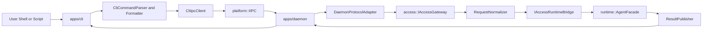
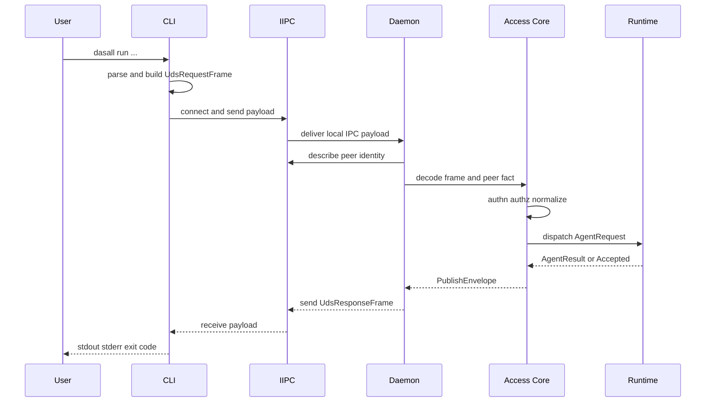

# DASALL CLI 本地控制面详细设计

文档版本：v1.0
日期：2026-04-17
状态：Draft

## 1. 模块概览

### 1.1 模块定位

本设计将“CLI 方案”收敛为一个单一模块视角下的本地控制面设计：模块名定义为“CLI 本地控制面”。

它覆盖的工程落点不是单独的 apps/cli，而是以下一条完整、本地且封闭的接入链：

1. apps/cli：纯客户端入口壳层，负责命令解析、用户交互、结果格式化、退出码映射。
2. apps/daemon：本地常驻守护入口壳层，负责 UDS 监听、生命周期、signal、装配。
3. access/ 共享 core：负责 daemon 入口侧协议适配、认证鉴权、归一化、Runtime bridge、结果发布。
4. platform IIPC：负责本地 IPC 抽象与 Linux UDS provider。

该模块不是新的业务子系统，也不是新的全局主控中心。它是 Layer 7 Product and Access Layer 在“本地 CLI 入口”场景下的一种具体交付形态。

### 1.2 设计目标

1. 将 CLI 明确冻结为纯客户端，不直接持有 Runtime 主状态机、预算、恢复或调度裁定权。
2. 将 daemon 明确冻结为本地 Access owner，承接 CLI 请求并驱动 Access -> Runtime 主链。
3. 复用已交付的 access、runtime、platform、infra、profiles 设计边界，不引入第二主控平面。
4. 给出可直接映射到 Build 的目录、接口、测试与阶段计划。
5. 保持 v1 简洁闭环：先交付 unary 和 accepted_async 两条路径，不把 streaming、远程控制面、公共 API 一次性做满。

### 1.3 模块边界

上游边界：

1. 用户 shell、脚本、CI、运维终端。
2. 本地 stdin、stdout、stderr、文件输入。

下游边界：

1. access/ 公共接口与 daemon adapter。
2. runtime/ AgentFacade 与 AgentOrchestrator 主链。
3. infra/config、infra/policy、infra/logging、infra/diagnostics、infra/health。
4. platform/IIPC 与 Linux UnixIpcProvider。
5. profiles 的 RuntimePolicySnapshot 与 ops_policy。

非目标：

1. 不设计远程 daemon、公共 HTTP/gRPC API 或跨主机控制面。
2. 不把 CLI 做成第二个 Runtime 入口直连模式。
3. 不在 v1 引入完整流式订阅、REPL、多路 attach 会话。
4. 不改写已冻结 ADR、SSOT 与 contracts 边界。

### 1.4 架构兼容目标与当前实现成熟度

| 维度 | 结论 | 说明 |
|---|---|---|
| 架构兼容目标 | Ready | CLI + daemon + local IPC 与 access/runtime/platform/infra 现有设计方向一致 |
| 当前实现成熟度 | Not Ready | apps/cli、apps/daemon 仍是 placeholder；daemon adapter、receipt、peer identity、health/diagnostics 闭环尚未落地 |

### 1.5 总体结构图

### 1.6 使用者视角速览

从最终使用者视角看，CLI 不是一个在本地直接执行 Agent 主链的单体程序，而是 DASALL 本地控制面的终端入口。它对外提供的能力可以收敛为六类：

1. 连通性探测：确认 daemon 是否在线、版本是否兼容、当前 readiness 是否满足执行前提。
2. 请求提交：把一次用户请求提交给 daemon，由 daemon 进入 Access -> Runtime 主链。
3. 异步轮询：对已经 accepted 的请求做状态查询，而不是依赖长连接常驻。
4. 取消控制：对仍在执行的请求发出取消动作。
5. 受控诊断：在策略允许时获取 health、queue、thread 等只读诊断结果。
6. 自解释能力：提供 help、version、稳定退出码和可脚本消费的 JSON 输出。

对使用者来说，CLI 的典型使用方式也分为三组：

1. 日常执行链：先 ping，再 run；如果请求异步受理，则用 status 跟踪，必要时用 cancel 中止。
2. 运维诊断链：先 ping 判断守护状态，再在授权前提下使用 diag health、diag queue、diag threads。
3. 脚本集成链：统一使用子命令模型，配合 --json、退出码和 request_id 做自动化调用。

需要特别说明的是：本设计已经冻结了命令族和通用交互方式，但 run 的业务参数形态、status 和 cancel 的精确参数名仍属于后续 Build 阶段需要继续冻结的内容。因此当前文档对“怎么用”的说明是能力级和命令级说明，不是最终 man page。

## 2. 约束清单

| Constraint ID | 来源文档 | 类型 | 约束描述 | 影响范围 |
|---|---|---|---|---|
| CLI-C001 | DASALL_Engineering_Blueprint.md 3.2 | Must | access/ 承载共享接入 core，apps/ 只承载入口壳层与装配面 | 组件拆分、目录布局 |
| CLI-C002 | DASALL_access子系统详细设计.md 1/2 | Must | Access 必须是 Access Channel 的唯一 owner，负责协议适配、认证鉴权、输入归一化和结果发布 | daemon adapter、请求链路 |
| CLI-C003 | DASALL_runtime子系统详细设计.md 2；ADR-008 | Must | Runtime 全局主控权只能由 AgentOrchestrator 持有，CLI/daemon 不得形成第二主控中心 | 生命周期、异常恢复 |
| CLI-C004 | DASALL_access子系统详细设计.md 2 | Must | Access 不得持有 Runtime 主状态机、预算、恢复或调度裁定 | daemon 组件职责 |
| CLI-C005 | DASALL_access子系统详细设计.md 2 | Must | Access -> Runtime 主链边界继续以 AgentRequest/AgentResult 为准，不把 UDS/CLI 私有对象写入 contracts | 核心对象、接口语义 |
| CLI-C006 | DASALL_access子系统详细设计.md 1295/1297 | Must | daemon 入口围绕 UdsRequestFrame、LocalPeerUidFact 建模，peer uid 事实必须可用于本地 trusted 判定 | IPC 对象、安全模型 |
| CLI-C007 | platform_linux_detailed_design.md 6.6/6.9 | Must | 本地 IPC 必须复用 IIPC 抽象与 UnixIpcProvider，不在 CLI/daemon 中直接固化 Linux syscall 细节 | 传输层、可移植性 |
| CLI-C008 | DASALL_profiles模块详细设计.md PRF-C013 | Must | Profile 只能作为 ConfigCenter 的 Profile 层输入，CLI 不得自建旁路语义配置体系 | 配置策略 |
| CLI-C009 | DASALL_profiles模块详细设计.md PRF-C004/PRF-C010 | Must-Not | Profile 不得绕过 Policy Gate、Audit 和 Runtime 主控链路，也不得诱导第二调度中心 | 命令面、override |
| CLI-C010 | DASALL_infrastructure子系统详细设计.md 184/211 | Must | 日志与审计关联字段必须保留 request_id、session_id、trace_id 等上下文 ID | 可观测性、诊断 |
| CLI-C011 | DASALL_infrastructure子系统详细设计.md 330-350 | Must | runtime_override 只能来自受鉴权控制路径，必须白名单、TTL、可审计、可回滚 | 特权命令、运维入口 |
| CLI-C012 | DASALL_infra_diagnostics模块详细设计.md 222-246 | Must | v1 diagnostics 只允许受控只读命令与本地快照导出，不允许远程导出与写操作 | diag 子命令 |
| CLI-C013 | DASALL_infra_health模块详细设计.md HLT-C014/HLT-C015 | Should | daemon 健康模型应区分 liveness/readiness/degraded，心跳超时要有显式升级路径 | ping、health、守护 |
| CLI-C014 | CLIG；kubectl conventions | Should | CLI 默认人类可读，提供子命令帮助、--json、stdout/stderr 分离、可判定 exit code | 命令设计、输出约定 |
| CLI-C015 | OWASP Authorization Cheat Sheet | Must | 默认拒绝、逐请求鉴权、不得因本地 peer 就天然无限信任 | AccessPolicyGate、命令授权 |
| CLI-C016 | systemd watchdog and socket activation pattern | Should | daemon 生命周期优先交给外部 supervisor 或 socket activation 管理，而不是绑进 Runtime 主链 | 部署与演进 |

### 2.1 约束抽取结论

1. Must：CLI 只能是客户端；daemon 只能是本地 Access owner；Runtime 主控只能在 daemon 内部链路中被调用。
2. Should：命令面遵循现代 CLI 约定，健康与守护分离，输出对人友好但机器可判定。
3. Must-Not：不把 UDS/peer identity/private framing 上抬到 contracts，不把 override/diagnostics 做成普通业务流量旁路。

## 3. 现状与缺口

| 设计目标 | 当前状态 | 差距描述 | 风险等级 | 修复优先级 |
|---|---|---|---|---|
| CLI 纯客户端入口可运行 | 已实现占位 | apps/cli/src/main.cpp 仅输出 placeholder，缺少命令解析、IIPC client、格式化与退出码映射 | High | P0 |
| daemon 入口可运行 | 已实现占位 | apps/daemon/src/main.cpp 仅输出 placeholder，缺少 UDS listener、signal、装配与 shutdown 排空 | High | P0 |
| daemon 侧 Access 主链闭环 | 缺失 | access/include 已有 IAccessGateway、IAccessRuntimeBridge、IProtocolAdapter，但 daemon adapter、normalizer、publisher、receipt 仍未形成主链 | High | P0 |
| 本地 IPC 抽象可用 | 部分实现 | IIPC 与 UnixIpcProvider 已存在，但当前只覆盖 listen/accept/connect/send/receive/close，缺少 peer identity 查询能力 | High | P0 |
| 本地 trusted 判定可落实 | 缺失 | access 详设要求 LocalPeerUidFact，但 platform 现有接口未暴露 peer uid/gid/pid 事实 | High | P0 |
| health 命令可提供正式快照 | 部分实现 | infra/health 接口与对象已冻结，运行实现仍未补齐 | Medium | P1 |
| diagnostics 命令可提供正式快照 | 部分实现 | infra/diagnostics 接口与对象已冻结，执行、导出、策略守门实现仍未补齐 | Medium | P1 |
| profile 驱动的 daemon 运行治理 | 部分实现 | profiles 详细设计已冻结，但 profile 资产当前仍以占位为主，socket/path/ops_policy 等真实值未形成稳定交付 | Medium | P1 |
| CLI 与 daemon 的构建依赖方向合理 | 不合理 | 当前 apps/cli 与 apps/daemon 都直接链接 dasall_runtime；CLI 纯客户端目标下应去掉 direct runtime 依赖 | Medium | P1 |
| async receipt 与断线恢复 | 缺失 | 现有代码无 receipt store、status/cancel 闭环，也没有请求去重或恢复查询 | Medium | P1 |

### 3.1 现状判断

当前结论应表述为：架构路径已清晰，工程骨架已具备，安全与运维关键支撑仍有缺口，因此本设计属于 architecture ready、implementation not ready。

## 4. 候选方案对比

| 方案名 | 架构匹配度 | ADR匹配度 | 工程复杂度 | 风险 | 结论 |
|---|---|---|---|---|---|
| 方案 A：独立 CLI 进程直接链接 access/runtime | 中 | 中 | 低 | 入口与主控边界容易下沉到 CLI，调试方便但运维、安全、会话恢复与多入口一致性较弱 | 淘汰；仅保留为未来 debug-only 诊断模式候选 |
| 方案 B：独立 CLI + 本地 daemon + UDS/IIPC 控制面 | 高 | 高 | 中 | 需要补 peer identity、receipt、daemon bootstrap，但最符合 access/runtime/platform/infra 已交付边界 | 采纳 |
| 方案 C：中心化 gateway 进程，CLI/daemon 都转发到单一代理 | 低 | 低 | 高 | 会把 gateway 升级为新的中心控制面，迫使 apps/cli、apps/daemon 二次跳转，违背蓝图“入口壳层”定位 | 淘汰 |

### 4.1 行业方案对比结论

1. Docker Engine 证明 client-daemon 分离适合本地控制面、权限边界与长生命周期任务承载。
2. kubectl 证明“子命令优先 + 默认人类可读 + -o/--json 稳定输出”是复杂控制面 CLI 的高可发现性形态。
3. CLIG 证明 stdout/stderr 分离、显式 help、稳定退出码与尽量少的隐式行为有利于脚本化与运维。
4. OWASP Authorization Cheat Sheet 证明“默认拒绝 + 逐请求鉴权 + 不信任输入侧 hint”比“本地进程默认可信”更适合 privileged 入口。
5. systemd watchdog 与 socket activation 模式说明 daemon 生命周期应和业务主链解耦，由专门 supervisor 管理。

## 5. 决策结论

### 5.1 最终选型

采纳方案 B：独立 CLI 进程 + 本地 daemon 常驻进程 + UDS/IIPC 控制面 + daemon 内部持有 Access -> Runtime 主链。

### 5.2 选型依据

1. 与 DASALL access 详设已明确的“双层工程落点”完全一致：access/ 承载共享 core，apps/cli 与 apps/daemon 仅承载入口壳层与装配。
2. 与 Runtime 单一主控 ADR 一致：只有 daemon 内的 Runtime 主链拥有生命周期与恢复裁定权。
3. 与 platform 已交付的 IIPC/UnixIpcProvider 一致：本地 IPC 无需新建 communication 顶层模块。
4. 与 infra/policy、infra/diagnostics、infra/health 的治理要求一致：特权、诊断、override 都可以在 daemon 侧集中 fail-closed。
5. 与行业实践一致：既保留 CLI 的可组合性，又把长生命周期、权限收口、健康与 receipts 放到 daemon。

### 5.3 放弃其他方案理由

1. 放弃方案 A：虽然 PoC 速度最快，但 CLI 直接链接 Runtime 容易把主控、预算、恢复、权限判断泄露到客户端进程，后续很难守住入口壳层边界。
2. 放弃方案 C：会人为制造一个新的集中化代理平面，使 gateway 既像入口又像控制中心，与 apps/* 入口壳层定位冲突。

### 5.4 范围冻结

纳入范围：

1. 本地控制面命令面。
2. CLI 与 daemon 的 IPC 契约。
3. daemon 侧 Access 主链、receipt、权限、健康与观测闭环。

排除范围：

1. 远程 daemon。
2. 公共 HTTP/gRPC 控制 API。
3. 完整 streaming attach 协议。
4. 复杂 REPL 与多会话 shell。

## 6. 详细设计

### 6.1 子组件与职责

| 子组件 | 落点建议 | 职责 |
|---|---|---|
| CLI Main | apps/cli/src/main.cpp | 进程入口、参数解析启动、错误出口、命令调度 |
| CliCommandParser | apps/cli/src/CliCommandParser.cpp | argv 解析、help、usage、基础参数校验 |
| CliRequestBuilder | apps/cli/src/CliRequestBuilder.cpp | 将子命令与 flags 组装为 UdsRequestFrame |
| CliIpcClient | apps/cli/src/CliIpcClient.cpp | connect、send、receive、timeout、版本校验、daemon 不可达判定 |
| CliOutputFormatter | apps/cli/src/CliOutputFormatter.cpp | 人类可读输出、--json 输出、stderr 诊断、exit code 映射 |
| Daemon Main | apps/daemon/src/main.cpp | daemon 生命周期、listener 建立、signal、shutdown 排空 |
| DaemonBootstrap | apps/daemon/src/DaemonBootstrap.cpp | 装配 IIPC、AccessGateway、RuntimeBridge、Infra、Profiles |
| DaemonProtocolAdapter | access/src/daemon/DaemonProtocolAdapter.cpp | 解码 UdsRequestFrame + LocalPeerUidFact，构造 InboundPacket |
| SubjectResolver | access/src/SubjectResolver.cpp | 解析 local peer、session hint、受控 actor 事实 |
| AuthenticatorChain | access/src/AuthenticatorChain.cpp | 基于 peer uid、受控凭证和策略输出认证结论 |
| AccessPolicyGate | access/src/AccessPolicyGate.cpp | 逐请求授权、override 与 diag 特权守门 |
| RequestNormalizer | access/src/RequestNormalizer.cpp | 将 InboundPacket 归一为 AgentRequest |
| DaemonRuntimeBridge | access/src/DaemonRuntimeBridge.cpp | 以统一接口调用 Runtime AgentFacade |
| ResultPublisher | access/src/ResultPublisher.cpp | 将 AgentResult 投影为 CLI 可消费结果对象 |
| ReceiptStore | access/src/daemon/ReceiptStore.cpp | accepted_async 收据保存、status/cancel 查询映射 |
| DaemonHealthService | access/src/daemon/DaemonHealthService.cpp | ping 与 health 特殊命令响应、readiness 汇总 |

### 6.2 输入输出与依赖关系

| 子组件 | 输入来源 | 输出去向 | 语义契约 |
|---|---|---|---|
| CliCommandParser | argv、stdin、TTY 状态 | CliParsedCommand | 仅做语法校验，不做授权裁定 |
| CliRequestBuilder | CliParsedCommand | UdsRequestFrame | 只写客户端意图，不构造 AgentRequest |
| CliIpcClient | UdsRequestFrame、socket path、deadline | UdsResponseFrame 或 transport error | 失败必须可判定，不做隐式重试 |
| DaemonProtocolAdapter | UdsRequestFrame、LocalPeerUidFact | InboundPacket | module-local 对象不进入 contracts |
| SubjectResolver | InboundPacket、peer uid、session hint | SubjectResolveOutcome | 本地 trusted 不是无限信任 |
| AuthenticatorChain | SubjectResolveOutcome、受控凭证 | AuthenticatedSubject 或 AccessError | challenge 仅保留给未来远程入口，本地入口默认明确 allow 或 deny |
| AccessPolicyGate | AuthenticatedSubject、command taxonomy、ops_policy | Allow、Deny、RequirePrivilegedPath | 默认拒绝未声明命令 |
| RequestNormalizer | InboundPacket | AgentRequest | 继续复用共享 contracts |
| DaemonRuntimeBridge | AgentRequest | AgentResult 或 AcceptedReceipt | Runtime 唯一主控 |
| ResultPublisher | AgentResult、PublishEnvelope | UdsResponseFrame | 输出给 CLI 的对象稳定、结果与错误分层 |
| ReceiptStore | request_id、receipt_ref、runtime task ref | StatusSnapshot、CancelResult | 只维护映射，不形成新任务系统 |

依赖方向冻结：

1. apps/cli 依赖 access public objects、platform IIPC、infra 通用接口，但不直接依赖 runtime 实现。
2. apps/daemon 依赖 access、runtime、platform、infra、profiles。
3. access/ 依赖 contracts、runtime 接口、platform 抽象、infra、profiles。
4. 任何命令都不得绕过 daemon 直连 Runtime。

### 6.3 核心对象与接口语义

#### 6.3.1 核心对象

| 核心对象 | 关键字段 | 约束 | 所有权 |
|---|---|---|---|
| CliParsedCommand | command、subcommand、args、stdin_mode、output_mode、deadline_ms | 仅表达客户端输入，不含授权结果 | apps/cli private |
| UdsRequestFrame | schema_version、client_version、command、args、request_id、trace_id、session_hint、idempotency_key、async_preference、output_mode、deadline_ms、payload | 必须可序列化为单个 IpcPayload；不得直接承载 AgentRequest 内部实现细节 | access daemon adapter module-local |
| LocalPeerUidFact | uid、gid、pid、transport_kind、socket_path | 来自平台 peer identity 查询；缺失即 fail-closed | access daemon adapter module-local |
| UdsResponseFrame | schema_version、request_id、trace_id、session_id、disposition、exit_code_hint、receipt_ref、agent_result、error_ref、warnings | disposition 仅允许 Completed、Accepted、Rejected | access daemon adapter module-local |
| DaemonReceiptRecord | receipt_ref、request_id、runtime_task_ref、status、created_at、expires_at | TTL 到期必须清理；不承载业务执行语义 | access daemon private |
| CliExitDecision | exit_code、stdout_plan、stderr_plan | exit_code 只允许有限集合 | apps/cli private |

#### 6.3.2 核心接口

| 核心接口 | 语义 | 前置条件 | 错误语义 |
|---|---|---|---|
| CliIpcClient::invoke(frame) -> ClientInvokeResult | 发送单次请求并等待单次响应 | socket path 已确定；frame schema_version 非空 | daemon 不可达、超时、协议不兼容、响应损坏 |
| IIPC::listen/accept/connect/send/receive/close | 提供本地 IPC 抽象 | handle 与 endpoint 一致 | AddressInUse、Timeout、PeerClosed、PayloadTooLarge |
| IIPC::describe_peer(handle) -> PeerIdentitySnapshot | 查询本地对等端身份事实 | handle 来自 accept；仅本地 UDS transport 支持 | Unsupported、NotFound、PeerClosed |
| IProtocolAdapter::decode(frame, peer) -> InboundPacket | 将 daemon 本地 IPC 事实折叠为入口统一 packet | peer identity 已获取 | ValidationRejected、UnsupportedCommand |
| IAccessGateway::submit(packet) -> GatewayOutcome | 执行 Access admission + normalize + dispatch | AccessGatewayState 为 Ready | ValidationRejected、AuthDenied、ShuttingDown |
| IAccessRuntimeBridge::dispatch(request) -> DispatchOutcome | 将 AgentRequest 交给 Runtime | request 已归一且通过授权 | Accepted、Completed、RuntimeError |
| ReceiptStore::lookup(receipt) -> ReceiptStatus | 查询 accepted_async 结果 | receipt 未过期 | NotFound、Expired |

#### 6.3.3 平台接口补口要求

本设计显式识别一个必须补齐的架构缺口：当前 IIPC 只有消息收发接口，没有 peer identity 查询接口，而 access 详设要求 daemon 入口基于 peer uid 做本地主体验证。

因此 v1 设计要求对 platform 增加一个加法型接口补口：

1. 在 platform public interface 中新增对等端身份查询能力，推荐形式为 IIPC 的 describe_peer(handle) 或等价扩展接口。
2. 返回对象为 platform private public object，例如 PeerIdentitySnapshot，字段至少包含 uid、gid、pid、transport_kind。
3. 该对象属于 platform module public interface，不进入 contracts。
4. 在此接口落地前，所有依赖 local trusted 的 privileged command 必须禁用或硬拒绝。

### 6.4 命令面与 CLI UX

#### 6.4.1 v1 命令面

| 命令 | 作用 | 默认路径 | 是否特权 |
|---|---|---|---|
| run | 提交一次 Agent 请求 | 同步等待 Completed；若显式 --async 则返回 receipt | 否 |
| status | 查询 receipt 当前状态 | 读 ReceiptStore 与 Runtime 状态映射 | 否 |
| cancel | 取消已接受的请求 | 通过 receipt 或 request_id 触发 cancel | 否，但需主体与目标匹配 |
| ping | 查询 daemon 存活、版本、schema、profile、readiness 摘要 | 轻量健康检查，不走 diagnostics | 否 |
| diag health | 触发 diagnostics 的 health.snapshot | 只读命令，受策略控制 | 是 |
| diag queue | 触发 diagnostics 的 queue.stats | 只读命令，受策略控制 | 是 |
| diag threads | 触发 diagnostics 的 thread.dump | 只读命令，受策略控制 | 是 |
| help | 显示顶层或子命令帮助 | 本地生成 | 否 |
| version | 显示 CLI 版本，并可对比 daemon 版本 | 本地或 ping 补全 | 否 |

#### 6.4.2 参数与输入约定

1. 默认采用子命令优先模型：dasall run、dasall status、dasall cancel、dasall diag health。
2. 默认输出为人类可读；传入 --json 时输出稳定 JSON 结构。
3. stdout 只承载结果；stderr 只承载错误、警告、进度和诊断提示。
4. --help、-h 在顶层和每个子命令都可用；无参数时输出 concise help。
5. 若命令需要 stdin 而 stdin 为 TTY 且用户未提供必要参数，CLI 可以提示；若 stdin 非 TTY 或传入 --no-input，则不得交互式提示。
6. 特权输入不得通过普通 flag 传入敏感秘密；如需额外凭证，应走 stdin、受控文件或 OS credential store。

#### 6.4.3 通用 flags

| Flag | 作用 | 约束 |
|---|---|---|
| --json | 输出稳定 JSON | 仅影响 CLI formatter，不改变 daemon 业务语义 |
| --timeout-ms | 客户端等待上限 | 不能突破 daemon/profile 允许的最大值 |
| --async | 明确要求 accepted_async | 仅对 run 有效 |
| --request-id | 显式指定 request_id | 主要用于重试与对账 |
| --session | 提供 session hint | 仅作 hint，不代表授权 |
| --trace-id | 显式指定 trace_id | 便于跨 CLI/daemon/runtime 追踪 |
| --socket | 覆盖本地 socket path | 仅允许开发或受控部署使用 |
| --quiet | 抑制非必要 stderr 信息 | 不影响 stdout 结果 |
| --no-input | 禁止交互式提示 | 脚本模式推荐 |

#### 6.4.4 退出码映射

| Exit Code | 含义 | 触发条件 |
|---|---|---|
| 0 | 成功 | Completed 成功；或 Accepted 且调用方接受 async 结果 |
| 2 | 参数错误 | CLI 语法错误、缺少必填参数、非法 flag |
| 3 | daemon 不可达 | connect 超时、socket 不存在、listener 不可用 |
| 4 | 认证或授权拒绝 | local peer 不可信、命令未授权、diag/override 被拒绝 |
| 5 | 执行业务失败 | Runtime 返回失败 AgentResult |
| 6 | 超时或取消 | 客户端超时、服务端取消、用户取消 |
| 7 | 协议或版本错误 | schema_version 不兼容、响应损坏、未知 disposition |

#### 6.4.5 典型使用方式

从使用方式上，可以把 CLI 理解为“一个本地控制终端”，而不是“一个本地运行时”。推荐用户心智如下：

1. 如果只是想确认系统是否可用，先用 ping，而不是直接 run。
2. 如果要发起一次任务，用 run；如果希望快速返回而不是阻塞等待，给 run 增加 --async。
3. 如果 run 返回了 receipt，就用 status 查询，而不是假设 CLI 会自动保持长连接。
4. 如果任务还在执行且需要停止，用 cancel；如果任务已经完成，cancel 应返回可判定而非模糊失败。
5. 如果要做运维诊断，用 diag 子命令族；它是受控能力，不等价于普通业务命令。

按命令族划分，推荐使用说明如下：

| 命令族 | 使用目的 | 推荐用法说明 | 输出预期 |
|---|---|---|---|
| ping | 先验检查 | 用于判断 daemon 是否在线、schema 是否兼容、readiness 是否满足执行前提 | 轻量摘要，适合人工与脚本 |
| run | 发起请求 | 用于提交一次用户任务；默认适合同步结果获取，显式 --async 适合长任务 | 成功结果、accepted receipt 或稳定错误 |
| status | 查询进度或终态 | 用于查询 accepted_async 请求；按 receipt_ref 或 request_id 定位 | InProgress、Completed 或 Failed 的稳定状态 |
| cancel | 中止任务 | 用于取消仍在执行的请求；必须与目标主体和任务匹配 | CancelRequested、Cancelled 或不可取消的明确状态 |
| diag health | 看健康快照 | 用于正式健康视图，而不是轻量存活探测 | 受控只读快照 |
| diag queue | 看队列状态 | 用于分析 daemon 内部排队与背压状态 | 受控只读快照 |
| diag threads | 看线程状态 | 用于分析守护线程执行态与阻塞线索 | 受控只读快照 |
| help | 看帮助 | 无参数或显式 help 都应可获取命令说明 | 本地生成的帮助信息 |
| version | 看版本 | 用于查看 CLI 本身版本，必要时补充 daemon 对比信息 | 版本与兼容提示 |

按典型场景划分，推荐交互顺序如下：

1. 交互式人工使用：ping -> run -> 视情况 status 或 cancel。
2. 自动化脚本使用：run --json 或 ping --json，配合退出码和 request_id 做判定。
3. 长任务使用：run --async -> status -> 如需停止则 cancel。
4. 故障排查使用：ping -> diag health -> diag queue 或 diag threads。

设计上明确不推荐以下使用方式：

1. 不推荐把 CLI 当成长期驻留进程或 REPL 替代品。
2. 不推荐假设 run 一定是同步阻塞到底；accepted_async 是正式路径之一。
3. 不推荐通过普通 flag 打开 override、远程导出或其他特权能力。
4. 不推荐绕过 ping 直接把 daemon unavailable 误判成业务失败。

### 6.5 主流程时序

#### 6.5.1 run happy path

1. CLI 解析子命令与输入，生成 request_id、trace_id、idempotency_key。
2. CliIpcClient 通过 socket path 建连并发送单个 UdsRequestFrame。
3. daemon accept 连接，查询 peer identity，构造 LocalPeerUidFact。
4. DaemonProtocolAdapter 生成 InboundPacket，交给共享 Access 主链。
5. SubjectResolver、AuthenticatorChain、AccessPolicyGate 完成主体解析与逐请求授权。
6. RequestNormalizer 归一化为 AgentRequest。
7. DaemonRuntimeBridge 调用 Runtime AgentFacade。
8. Runtime 返回 Completed 或 Accepted。
9. ResultPublisher 生成 UdsResponseFrame，回传 CLI。
10. CLI formatter 输出 stdout/stderr，并按 exit code 退出。

#### 6.5.2 status and cancel path

1. status 通过 receipt_ref 或 request_id 查询 ReceiptStore。
2. 若 receipt 仍在进行中，返回 InProgress + 最近更新时间。
3. 若已完成，返回最终 AgentResult 投影。
4. cancel 通过 receipt_ref 或 request_id 定位 Runtime 任务句柄。
5. 若任务已完成，返回不可取消但可判定状态；若仍在执行，则发起取消并返回 CancelRequested 或 Cancelled。

### 6.6 异常与恢复时序

| 异常分类 | 检测点 | 恢复动作 | 失败兜底 |
|---|---|---|---|
| CLI 参数非法 | CliCommandParser | 立即返回 help 片段与 exit 2 | 不建连、不发送 |
| daemon 不可达 | CliIpcClient connect | 返回 exit 3，并提示 ping 或启动 daemon | 不自动重试 |
| peer identity 缺失 | daemon accept 后 | fail-closed，拒绝所有需要主体判定的请求 | 返回 exit 4 |
| schema_version 不兼容 | daemon adapter decode | 返回明确协议错误与 daemon schema | exit 7 |
| 授权拒绝 | AccessPolicyGate | 返回拒绝原因、policy reference、request_id | exit 4 |
| Runtime Accepted | DaemonRuntimeBridge | 保存 receipt，返回 Accepted 响应 | CLI 输出 receipt 与 next command |
| Runtime 失败 | ResultPublisher | 投影为稳定错误对象 | exit 5 |
| 客户端超时 | CliIpcClient receive | 退出时保留 request_id；若服务端已受理可后续 status 查询 | exit 6 |
| 响应损坏 | CliOutputFormatter parse | 返回协议错误 | exit 7 |

恢复原则：

1. v1 不做隐藏式自动重试，避免重复提交与权限歧义。
2. 同一请求的重试依赖显式 request_id 或 idempotency_key。
3. daemon 不对 CLI 断连做业务级自动补偿，只保存 receipt 与最终结果窗口。
4. async receipt 是 v1 唯一认可的断线恢复路径。

### 6.7 配置策略

#### 6.7.1 daemon 语义配置

| 配置项 | 默认值 | 覆盖层级 | 说明 |
|---|---|---|---|
| access.daemon.socket_path | /tmp/dasall/control.sock | Profile/部署 | 本地控制面 socket 路径 |
| access.daemon.listen_backlog | 32 | Profile/部署 | daemon 监听 backlog |
| access.daemon.max_payload_bytes | 1048576 | Profile/部署 | 与 platform.linux.ipc.max_payload_bytes 对齐 |
| access.daemon.request_timeout_ms | 5000 | Profile/部署 | daemon 侧单请求处理上限 |
| access.daemon.shutdown_grace_ms | 3000 | Profile/部署 | 停机排空窗口 |
| access.daemon.receipt_ttl_sec | 3600 | Profile/部署 | accepted_async 收据保留时间 |
| access.daemon.trusted_local_subjects | [] | Profile/部署 | 本地主体 allowlist，空即全部走显式策略判定 |
| access.daemon.enable_diag_commands | false | Profile/部署 | 是否开放 diag 命令族 |
| access.daemon.enable_runtime_override | false | 部署/runtime override | 是否开放 override 类命令；默认关闭 |

#### 6.7.2 来自既有子系统的约束继承

1. timeout、budget、ops_policy、diagnostics allowed_commands 来自 profiles 与 infra/config 的受管层，不由 CLI 自行定义语义。
2. runtime_override 只能来自受鉴权 API、诊断入口或自动化测试通道，必须带 TTL 与 rollback 语义。
3. logging、diagnostics、health 的 enable 与导出策略必须遵循 infra 配置门，不能由 CLI 端普通 flag 打开。

#### 6.7.3 CLI 本地 UX 配置

CLI 允许存在少量本地 UX 配置，但只允许影响显示，不允许影响 daemon 语义：

| 配置项 | 默认值 | 允许来源 | 禁止事项 |
|---|---|---|---|
| cli.output.default_mode | human | flag、env、本地 XDG 文件 | 不得改变 daemon 返回结果语义 |
| cli.output.color | auto | NO_COLOR、TERM、flag | 不得进入 AgentRequest |
| cli.output.pager | auto | PAGER、flag | 仅影响本地展示 |
| cli.timeout.default_ms | 5000 | flag、本地 XDG 文件 | 不得突破 daemon/profile 上限 |

### 6.8 可观测性、健康与审计

#### 6.8.1 日志与追踪

| 观测面 | 设计结论 |
|---|---|
| request_id | 每次 CLI 调用必须生成；若用户显式传入则优先使用 |
| trace_id | CLI 可显式传入；未传入则 CLI 生成并要求 daemon 透传到 Runtime |
| session_id | 由 daemon 根据请求级生成或基于 session hint 关联 |
| stderr | 仅承载警告、错误、进度和下一步建议 |
| stdout | 仅承载业务结果或 JSON 输出 |
| 日志字段 | 至少包含 module、message、request_id、session_id、trace_id |

#### 6.8.2 审计点

以下动作必须进入审计：

1. diag 命令执行。
2. 特权取消或跨主体取消。
3. runtime_override 申请、应用、回滚。
4. 本地 trusted 但被策略拒绝的高风险命令。

#### 6.8.3 健康模型

daemon 健康输出分三层：

1. Liveness：进程存在、事件循环存活。
2. Readiness：AccessGatewayState == Ready，至少一个 daemon adapter 已注册，RuntimeBridge 可达。
3. Degraded：listener 存活但 diagnostics、metrics、receipt store、部分 provider 退化。

#### 6.8.4 ping 与 diag 的职责区分

1. ping：轻量命令，返回 daemon_version、schema_version、profile_id、readiness、request_id。
2. diag health：走 infra/diagnostics 与 infra/health 的正式快照链路，受策略控制。
3. ping 不等价于 diagnostics，不暴露 thread dump、queue stats 或日志导出。

### 6.9 安全与授权模型

1. 默认 fail-closed：socket 不存在、peer identity 缺失、策略查询失败、RuntimeBridge 不可达时全部拒绝。
2. 本地 trusted 不等于 unrestricted：peer uid 只提供本地主体事实，最终命令仍需经 AccessPolicyGate 与 ops_policy 判定。
3. session hint、trace hint、command args 都是不可信输入；只有 daemon 从 peer identity 和受控策略中得出的事实才可用于授权。
4. diagnostics 与 override 是独立命令域，不与 run/status/cancel 共用宽松授权路径。
5. 普通 CLI flag 不得开启 runtime_override、远程导出、审计旁路或禁用授权。

### 6.10 目录与文件落盘建议

| 目录 | 建议新增文件 | 说明 |
|---|---|---|
| apps/cli/src | CliCommandParser.cpp、CliRequestBuilder.cpp、CliIpcClient.cpp、CliOutputFormatter.cpp | CLI 私有语法、请求装配与输出格式化 |
| apps/daemon/src | DaemonBootstrap.cpp、DaemonLifecycle.cpp | daemon 生命周期与装配 |
| access/include | DaemonProtocolTypes.h、ReceiptStore.h | daemon 入口私有 public interface |
| access/src/daemon | DaemonProtocolAdapter.cpp、ReceiptStore.cpp、DaemonHealthService.cpp | daemon 入口主链实现 |
| access/src | SubjectResolver.cpp、AuthenticatorChain.cpp、AccessPolicyGate.cpp、RequestNormalizer.cpp、DaemonRuntimeBridge.cpp、ResultPublisher.cpp | 共享 access core 关键实现 |
| platform/include | IIPC.h 扩展 peer identity 查询接口 | 补齐 local trusted 的平台事实来源 |
| platform/src/linux | UnixIpcProvider.cpp 扩展 SO_PEERCRED 等效能力 | Linux UDS peer identity 实现 |
| tests/unit/access | DaemonProtocolAdapterTest.cpp、ReceiptStoreTest.cpp、AccessPolicyGateCliCommandTest.cpp | 单测 |
| tests/integration/access | CliDaemonPingIntegrationTest.cpp、CliRunHappyPathTest.cpp、CliAuthDenyIntegrationTest.cpp、CliAsyncReceiptIntegrationTest.cpp | 集成测试 |
| tests/contract/access | CliJsonOutputContractTest.cpp、CliExitCodeContractTest.cpp | 机器可读输出与退出码契约 |

## 7. Design -> Build 映射（建议级）

| Design结论 | Build目标 | 映射说明 | 代码目标 | 测试目标 | 验收命令 | 依赖/阻塞 |
|---|---|---|---|---|---|---|
| CLI 纯客户端化 | 重构 apps/cli 依赖方向 | 去掉 CLI 对 runtime 的 direct link，避免边界下沉 | apps/cli/CMakeLists.txt、apps/cli/src/* | unit：CliCommandParserTest、CliOutputFormatterTest | cmake --build build-ci --target dasall_cli && ctest --test-dir build-ci -R "CliCommandParserTest|CliOutputFormatterTest" --output-on-failure | 无 |
| daemon 本地主链装配 | 新增 daemon bootstrap 与 listener | 让 apps/daemon 成为本地 Access owner | apps/daemon/src/main.cpp、DaemonBootstrap.cpp | integration：CliDaemonPingIntegrationTest | cmake --build build-ci --target dasall_daemon && ctest --test-dir build-ci -R CliDaemonPingIntegrationTest --output-on-failure | 依赖 access 主链骨架 |
| daemon adapter 进入 access core | 新增 DaemonProtocolAdapter 与 ResultPublisher 闭环 | 保持 access 作为协议适配 owner | access/src/daemon/DaemonProtocolAdapter.cpp、ResultPublisher.cpp | unit：DaemonProtocolAdapterTest；integration：CliRunHappyPathTest | cmake --build build-ci --target dasall_access && ctest --test-dir build-ci -R "DaemonProtocolAdapterTest|CliRunHappyPathTest" --output-on-failure | 依赖 contracts、runtime bridge |
| local trusted 基于 peer identity | 对 IIPC 做加法型扩展 | 没有 peer identity 就无法安全做本地主体验证 | platform/include/IIPC.h、platform/src/linux/UnixIpcProvider.cpp | unit：UnixIpcProviderPeerIdentityTest | cmake --build build-ci --target dasall_platform && ctest --test-dir build-ci -R UnixIpcProviderPeerIdentityTest --output-on-failure | 当前平台接口缺口 |
| accepted_async 闭环 | 新增 ReceiptStore 与 status/cancel | 保证长任务与断线恢复 | access/src/daemon/ReceiptStore.cpp、apps/cli/src/CliRequestBuilder.cpp | integration：CliAsyncReceiptIntegrationTest、CliCancelIntegrationTest | cmake --build build-ci --target dasall_cli dasall_daemon && ctest --test-dir build-ci -R "CliAsyncReceiptIntegrationTest|CliCancelIntegrationTest" --output-on-failure | 依赖 Runtime cancel/query 能力 |
| diagnostics 命令受控开放 | 接 diagnostics/health 子域正式接口 | 让 diag 命令不是旁路脚本而是受控能力 | access/src/daemon/DaemonHealthService.cpp、apps/cli/src/CliCommandParser.cpp | integration：CliDiagHealthIntegrationTest、CliDiagDenyIntegrationTest | cmake --build build-ci --target dasall_cli dasall_daemon && ctest --test-dir build-ci -R "CliDiagHealthIntegrationTest|CliDiagDenyIntegrationTest" --output-on-failure | 依赖 infra/diagnostics、infra/health 实现 |
| CLI 机器可读输出稳定 | 冻结 --json 与 exit code 契约 | 保证脚本化能力和未来兼容性 | apps/cli/src/CliOutputFormatter.cpp | contract：CliJsonOutputContractTest、CliExitCodeContractTest | ctest --test-dir build-ci -R "CliJsonOutputContractTest|CliExitCodeContractTest" --output-on-failure | 依赖响应对象冻结 |
| 观测字段闭环 | 在 CLI、daemon、runtime 之间透传 request_id/trace_id | 让诊断与日志可对账 | apps/cli/src/*、access/src/* | integration：CliTracePropagationIntegrationTest | ctest --test-dir build-ci -R CliTracePropagationIntegrationTest --output-on-failure | 依赖 infra/logging/tracing |

## 8. 实施计划与里程碑

### 8.1 阶段计划

| 阶段 | 目标 | 关键动作 | 完成判定 | 风险 |
|---|---|---|---|---|
| M0 边界冻结 | 冻结 CLI 纯客户端和 daemon owner 方案 | 审定本设计、冻结命令面、冻结对象边界 | 文档评审通过，Build 任务拆解完成 | peer identity 补口未达成一致 |
| M1 传输与身份底座 | 让 daemon 能安全接收本地请求 | 扩展 IIPC peer identity、补 daemon listener、实现 ping | ping 正反例通过；peer identity 缺失时 fail-closed | platform 接口变更 |
| M2 unary 主链 | 跑通 run happy path | 补 daemon adapter、normalizer、runtime bridge、result publisher | run 返回 Completed；CLI 不直接依赖 runtime | access 主链实现量较大 |
| M3 async 闭环 | 跑通 accepted_async/status/cancel | 补 ReceiptStore、status、cancel、idempotency | accepted_async、status、cancel 用例通过 | Runtime 查询/取消接口准备度 |
| M4 运维与硬化 | 跑通 diag、健康、审计与兼容性门 | 接 diagnostics、health、JSON contract、trace propagation | 质量门通过；文档、契约、负例齐全 | infra 子域实现尚未完全落地 |

### 8.2 最小可交付切分

1. 首个最小可交付不是 run，而是 ping。因为它先验证 daemon 生命周期、socket path、版本与 readiness。
2. 第二个最小可交付是 run unary happy path，不包含 async 和 diag。
3. 第三个最小可交付是 accepted_async + status。
4. 第四个最小可交付才是 cancel 与 diag。

## 9. 测试与质量门

| 测试层级 | 覆盖范围 | 核心用例 | 验收方式 |
|---|---|---|---|
| Unit | CLI 解析与格式化 | help、--json、参数缺失、exit code 映射 | 定向单测通过 |
| Unit | daemon adapter | UdsRequestFrame 解码、非法字段拒绝、peer identity 缺失拒绝 | 定向单测通过 |
| Unit | ReceiptStore | 插入、查询、TTL 过期、重复 receipt | 定向单测通过 |
| Contract | CLI JSON 输出 | ping、run completed、accepted_async、deny、daemon unavailable 的 JSON 结构稳定 | 契约测试通过 |
| Contract | 退出码 | 0/2/3/4/5/6/7 映射稳定 | 契约测试通过 |
| Integration | ping | daemon up、daemon down、schema mismatch | 集成测试通过 |
| Integration | run | happy path、validation reject、auth deny、runtime fail | 集成测试通过 |
| Integration | async | accepted_async、status in progress、status completed、cancel success、cancel after complete | 集成测试通过 |
| Failure Injection | IPC | PeerClosed、PayloadTooLarge、超时、损坏响应 | 失败注入通过 |
| Compatibility | 构建与依赖 | CLI 无 direct runtime 依赖；daemon 与 access/runtime 正常链接 | 构建检查通过 |

建议质量门：

1. Gate-CLI-01：ping 正例与 daemon unavailable 负例同时通过。
2. Gate-CLI-02：run happy path、auth deny、validation reject 同时通过。
3. Gate-CLI-03：accepted_async/status/cancel 完整闭环通过。
4. Gate-CLI-04：request_id、trace_id 在 CLI、daemon、runtime 日志中可关联。
5. Gate-CLI-05：diag 命令在未授权时明确拒绝，在授权时只输出受控快照引用。
6. Gate-CLI-06：CLI target 不再 direct link dasall_runtime。

## 10. 兼容性与演进评估（建议级）

| breaking risk | 影响消费者 | 迁移路径 | 灰度策略 | 扩展预留 |
|---|---|---|---|---|
| Low | 终端用户与脚本 | v1 即冻结子命令名 run/status/cancel/ping/diag 与 --json 输出主键 | 先灰度 ping 与 run，再开放 async 与 diag | 预留更多子命令但保持命名加法扩展 |
| Medium | apps/cli 构建链 | 从 direct runtime link 迁移到 access/platform/infra 依赖 | 保留旧 placeholder 可执行直到新链路稳定 | 预留 debug-only direct mode，但不得替代正式路径 |
| Medium | platform IIPC 调用方 | 以加法方式扩展 peer identity 查询接口，不破坏现有 listen/accept/send/receive surface | 先只在 daemon 场景启用 describe_peer | 后续可扩展跨平台 PeerIdentitySnapshot |
| Low | diagnostics 与 health 消费方 | ping 与 diag 分离，不把轻量探针和正式快照混为一谈 | 先启用 ping，再逐步开放 diag 子命令 | 预留 log query 与更多只读 diagnostics 命令 |
| Low | 结果输出消费者 | 人类可读输出允许迭代；脚本必须使用 --json | 在文档与 help 中明确 --json 为稳定接口 | 预留 server-side display hint 与 custom columns |

### 10.1 版本演进原则

1. 命令名、flag、JSON 输出采用加法扩展优先。
2. 若未来引入 streaming、gRPC over UDS 或 socket activation，变更应局限在 IPC client/server adapter，不影响 CLI 命令面。
3. 未来可引入 --direct 诊断模式，但只能作为开发者开关，默认关闭，且不能绕过授权与审计。

## 11. 风险、阻塞与回退（建议级）

| 阻塞项 | 影响任务 | 解阻条件 | 最小解阻动作 | 回退策略 |
|---|---|---|---|---|
| IIPC 无 peer identity 查询能力 | M1-M4 | 冻结并实现平台 peer identity 查询接口 | 在 platform/include/IIPC.h 增加加法型接口并补 unit test | 在接口落地前禁用所有依赖 local trusted 的 privileged command，仅保留 ping |
| infra/health 实现未闭环 | M4 | health 实现目录与探针执行链落地 | 先以 ping 输出 readiness 摘要，不暴露正式 health.snapshot | diag health 延后，不阻塞 run/status |
| infra/diagnostics 实现未闭环 | M4 | DiagnosticsServiceFacade、CommandPolicyGuard、SnapshotAssembler 可运行 | 先冻结 diag 命令面和错误语义 | v1 可暂不开放 diag 子命令 |
| profiles 资产仍占位 | M1-M4 | 形成 socket path、ops_policy、timeout 等真实 profile 值 | 先在 deployment 层提供受管默认值 | 保守默认：禁用 diag 和 override |
| access daemon adapter 尚未实现 | M2-M4 | DaemonProtocolAdapter、RequestNormalizer、ResultPublisher 主链补齐 | 先交付 ping 与 run happy path | status/cancel/diag 延后 |
| Runtime 查询和取消接口准备度不明 | M3 | 明确 Runtime 查询/取消最小调用面 | 先只交付 accepted_async + status | cancel 延后，不阻塞 unary |

## 12. 未决问题与后续任务

未决问题：

1. platform 的 peer identity 能力最终是扩展 IIPC 还是引入独立 side-interface，需要在 platform 详细设计层补一条正式决策。
2. ping 的返回对象是否直接暴露 profile_id 与 build hash，需要和版本治理策略再对齐一次。
3. --json 的稳定输出是直接镜像 AgentResult，还是输出一个 CLI 投影对象，需要在契约测试前冻结。
4. v1 是否允许 CLI 在开发场景下尝试拉起 daemon，还是完全依赖外部 supervisor，需要结合部署策略决定。
5. diag 是否在 v1 就开放 log query artifact_ref，还是仅保留 health.snapshot、queue.stats、thread.dump 三个只读命令，需要和 infra/diagnostics 实现节奏对齐。

后续任务建议：

1. 先以本设计为输入，拆出 M0-M2 的原子 Build TODO，优先打通 ping 和 run unary。
2. 单独补一份 platform peer identity 补口设计或 TODO，避免 M1 因平台接口不清而反复返工。
3. 在 access 子系统 TODO 中新增 daemon adapter、receipt store、policy gate for cli command taxonomy 三个原子任务。
4. 在 apps/cli 与 apps/daemon 的 CMake 改造前，先冻结目标依赖方向与测试命名，避免后续命令模板漂移。
