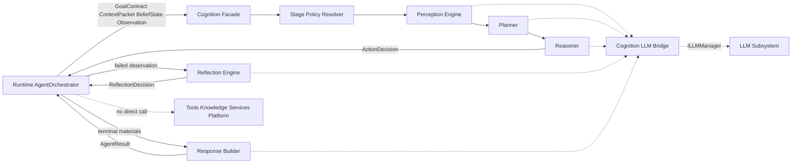
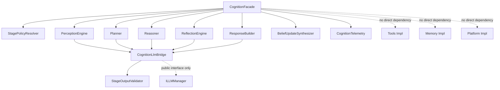
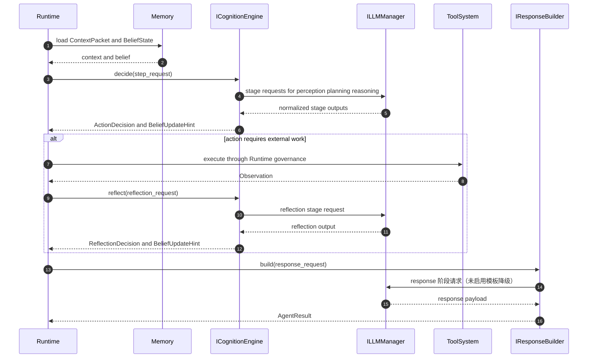
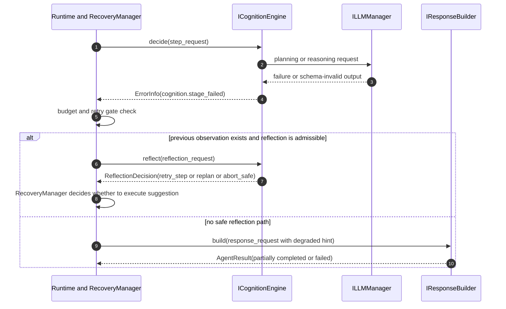
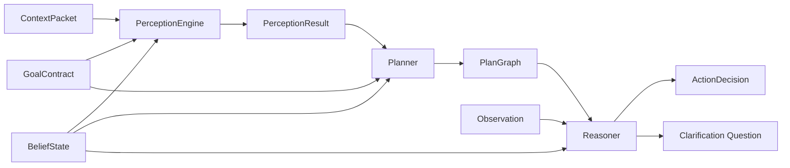
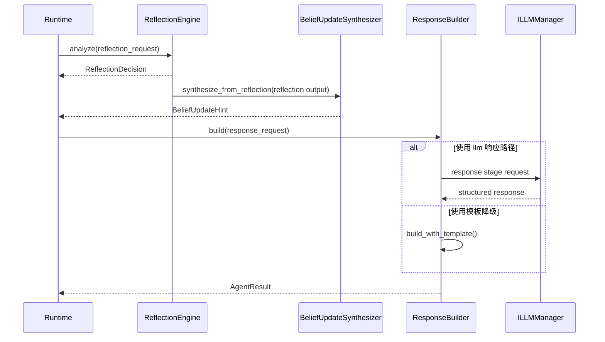
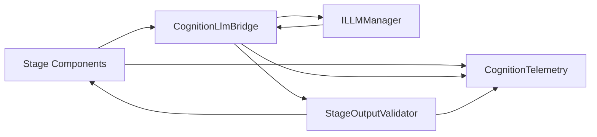

# DASALL 认知子系统详细设计

| 元数据 | 值 |
|---|---|
| 版本 | v1.1 |
| 状态 | 评审优化版 |
| 初版日期 | 2026-04-14 |
| 最近修订 | 2026-06-01 |
| 修订说明 | v1.0→v1.1：补充行业实践对齐、跨子系统交互契约精化、并发模型、上下文与预算感知、被否决方案归纳；扩充约束与风险。2026-05-15 追补 COG-TODO-039 ~ 042 后的当前工程状态与证据链入口。2026-06-01 追补 WP-COG-GAP-006 的 reflection / response v1 schema 冻结与 structured response authority。 |

本文档面向 DASALL 认知子系统的子系统级详细设计，目标是在不改写既有 ADR、SSOT 与共享契约冻结结论的前提下，为 cognition 模块提供可直接映射到 Build 的工程方案。

适用范围：DASALL Layer 5 Cognition Layer 对应工程目录 cognition/。  
主要依据：

1. docs/architecture/DASALL_Agent_architecture.md
2. docs/architecture/DASALL_Engineering_Blueprint.md
3. docs/adr/ADR-006-context-orchestrator-vs-prompt-composer.md
4. docs/adr/ADR-007-reflection-engine-vs-recovery-manager.md
5. docs/adr/ADR-008-agent-orchestrator-vs-multi-agent-coordinator.md
6. docs/architecture/DASALL_profiles模块详细设计.md
7. docs/architecture/DASALL_llm子系统详细设计.md
8. docs/architecture/DASALL_memory子系统详细设计.md
9. docs/architecture/DASALL_tools子系统详细设计.md
10. docs/architecture/DASALL_knowledge子系统详细设计.md
11. docs/architecture/DASALL_capability_services子系统详细设计.md
12. docs/architecture/DASALL_infrastructure子系统详细设计.md
13. docs/architecture/platform_linux_detailed_design.md
14. docs/todos/contracts/deliverables/WP05-T011-接口候选清单.md
15. docs/todos/contracts/deliverables/WP05-T012-接口准入评估单.md
16. contracts/include/boundary/InterfaceCatalog.h
17. cognition/CMakeLists.txt
18. cognition/src/placeholder.cpp
19. tests/unit/cognition/CMakeLists.txt
20. docs/todos/cognition/deliverables/COG-TODO-039-统一验收构建聚合与runtime-fixture收敛.md
21. docs/todos/cognition/deliverables/COG-TODO-040-response-bridge与fallback契约收敛.md
22. docs/todos/cognition/deliverables/COG-TODO-041-ReflectionActivePlan生产路径收敛.md
23. docs/todos/cognition/deliverables/COG-TODO-042-Gate-COG-12复验证据回写.md

## 1. 模块概览

### 1.1 角色定位

认知子系统位于 DASALL 的 Layer 5 Cognition Layer，是 Runtime 主控链路中的“语义决策面”，负责把已经完成语义装配的 ContextPacket、GoalContract、BeliefState、Observation 解释为：

1. 下一步动作意图。
2. 失败后的反思建议。
3. 最终用户结果的构造材料。

其职责不是控制线程、重试、超时、补偿或工具执行，而是把“该做什么”和“为什么这么做”表达清楚，并交由 Runtime 落地执行与裁定。

### 1.2 模块概览表

| 维度 | 结论 | 来源依据 |
|---|---|---|
| 架构层级 | cognition/ 对应 Layer 5 Cognition Layer | DASALL_Agent_architecture.md 3.4.3、5.8；DASALL_Engineering_Blueprint.md 3.4 |
| 核心职责 | Perception、Planner、Reasoner、Reflection、Response Builder 五段认知链路 | DASALL_Agent_architecture.md 4.3、5.8.1；DASALL_Engineering_Blueprint.md 3.4 |
| 上游直接调用者 | runtime/AgentOrchestrator | DASALL_Engineering_Blueprint.md 3.3、3.4、4.2 |
| 下游直接依赖 | llm 公共接口；infra 观测抽象 | DASALL_Engineering_Blueprint.md 3.4、3.5；DASALL_llm子系统详细设计.md 2.1 |
| 间接受益方 | tools、knowledge、memory、multi_agent 通过 Runtime 间接消费认知结论 | DASALL_Agent_architecture.md 3.3.1、6.2；DASALL_tools子系统详细设计.md 2.1 |
| 直接禁止依赖 | tools 实现、memory 实现、knowledge 实现、services 实现、platform 实现 | DASALL_Agent_architecture.md 5.8.3；DASALL_Engineering_Blueprint.md 4.2；platform_linux_detailed_design.md PLAT-LNX-C017 |
| 当前实现状态 | `cognition/include` 已形成 Runtime-facing 公共接口面，Facade、五段组件、LLM bridge、validator 与 telemetry 已落盘；`tests/unit/cognition` 与 `tests/integration/cognition` 已形成回归拓扑。`placeholder.cpp` 仅保留为早期 bootstrap 痕迹，不再代表当前状态 | cognition/include；cognition/src/CognitionFacade.cpp；tests/unit/cognition/CMakeLists.txt；tests/integration/cognition/CMakeLists.txt；COG-TODO-039 ~ 042 deliverables |

注：本文中凡提到 `placeholder.cpp`、空测试目录或 runtime smoke 早期绕行路径，均应理解为 2026-04-14 建模时的历史 baseline；截至 COG-TODO-042，当前工程事实以本仓库代码树与 039 ~ 042 交付物为准。

### 1.3 运行视图



### 1.4 本文交付边界

本文只覆盖 cognition 子系统设计，不扩张到以下范围：

1. 不重新设计共享契约字段表。
2. 不重写 Runtime 的主状态机、恢复器或调度器。
3. 不重写 llm、memory、tools、knowledge、services 的详细设计。
4. 不把 platform/infra 的实现细节拉入 cognition 内部。

### 1.5 术语约定

为降低后续评审中的表述漂移，本文统一采用以下术语：

| 术语 | 本文统一表述 | 说明 |
|---|---|---|
| shared contracts | 共享契约 | 指 contracts 层中已经冻结或受准入治理的共享对象与边界规则 |
| public surface / public interface | 公共接口面 | 指模块对上游暴露的稳定头文件面，不等同于共享契约 |
| module-local supporting types | 模块内支撑类型 | 指当前仅在 cognition 模块内公开、但尚未进入共享契约的对象 |
| stage | 阶段 | 指 Perception、Planner、Reasoner、Reflection、Response Builder 五段中的任一阶段 |
| facade | 门面 | 指对 Runtime 暴露的组合根与统一调用入口 |
| fallback | 降级路径 | 指模型不可用、输出不合法或预算受限时的受控回退路径 |
| terminal path | 终态输出路径 | 指 Runtime 已判定本轮进入结果构造与提交前的收敛阶段 |

## 2. 约束清单

### 2.1 Must

| ID | 约束 | 说明 | 来源依据 |
|---|---|---|---|
| COG-C001 | 必须保持 cognition 是语义决策面而非控制平面 | 输出建议与结果材料，不拥有全局调度、恢复执行、工具执行权 | DASALL_Agent_architecture.md 0.4、3.4.3、5.8.1 |
| COG-C002 | 必须覆盖五段认知链路 | Perception、Planner、Reasoner、Reflection、Response Builder 五段都要有可实现落点 | DASALL_Agent_architecture.md 4.3、5.8.1；DASALL_Engineering_Blueprint.md 3.4 |
| COG-C003 | Planner 与 Reasoner 必须读取 GoalContract 与 BeliefState | 不能只根据最近一轮 user_turn 决策 | DASALL_Agent_architecture.md 4.3；DASALL_Engineering_Blueprint.md 3.4 |
| COG-C004 | Reflection 只输出语义建议，恢复裁定仍归 Runtime | retry_step、replan、abort_safe 是建议，不是执行结果 | ADR-007 3.1、3.4、5.1 |
| COG-C005 | 上下文语义装配权仍归 memory/ContextOrchestrator | cognition 只能消费 ContextPacket，不自建第二上下文中心 | ADR-006 3.2、4、5；DASALL_memory子系统详细设计.md 2.1 |
| COG-C006 | Prompt 选择与消息装配仍归 llm | cognition 只提供 stage 语义和模型选择提示，不拼装最终消息 | ADR-006 3.3、5.3；DASALL_llm子系统详细设计.md 2.1 |
| COG-C007 | 工具与能力服务调用必须经 Runtime 收口 | cognition 不得绕过 Runtime 直调 tools/services | DASALL_tools子系统详细设计.md TOOL-C002、TOOL-C011；DASALL_capability_services子系统详细设计.md CAP-C004 |
| COG-C008 | profile 差异必须通过配置投影与 DI 落地 | cognition 不允许出现平台宏分支或 target_platform 条件流 | DASALL_profiles模块详细设计.md PRF-C009；platform_linux_detailed_design.md Gate-PLAT-05 |
| COG-C009 | 认知模块必须在五档 profile 中保持启用 | 可以降级实现，但不能关闭认知主链语义 | DASALL_profiles模块详细设计.md 605 行附近 |
| COG-C010 | 详细设计必须可映射到 Build 三件套 | 每个关键设计结论要给出代码目标、测试目标、验收命令 | 用户任务约束 4.5、4.6；既有 memory/llm/knowledge 详细设计模式 |
| COG-C011 | ActionDecision.decision_kind 必须与 Runtime FSM 状态转移建立显式映射 | 避免 Runtime 收到 ActionDecision 后无法精确路由下一状态 | 本文 6.14.1；DASALL_runtime子系统详细设计.md FSM ||
| COG-C012 | cognition 必须采用请求级无状态模型 | 不在 CognitionFacade 内持有跨请求可变共享状态 | 本文 6.15；并发安全与横向扩展需求 |
| COG-C013 | 错误回流链路必须终止于 Runtime，不反向通知 LLM | cognition 故障统一由 Runtime 路由处理 | 本文 6.14.3；DASALL_llm子系统详细设计.md 错误归一化 |

### 2.2 Should

| ID | 约束 | 说明 | 来源依据 |
|---|---|---|---|
| COG-S001 | 应采用模块内支撑类型承接未冻结对象 | PlanGraph、ReplanResult、ActionDecision 字段不应提前进入共享契约 | InterfaceCatalog.h；WP05-T011-接口候选清单.md；WP05-T012-接口准入评估单.md |
| COG-S002 | 应保留阶段化模型选择提示，而不是写死具体模型名 | cognition 只表达复杂度、推理深度、延迟/SLA 偏好 | DASALL_llm子系统详细设计.md 6.10、7 |
| COG-S003 | 应把模板降级、规则降级和 schema 校验显式化 | 避免把“降级行为”藏在单个组件内部 | DASALL_Agent_architecture.md 6.2；DASALL_llm子系统详细设计.md 7、9 |
| COG-S004 | 应建立单元测试、契约回归、集成测试、故障注入、profile 兼容性五类测试门 | 认知链条的风险主要来自边界漂移和阶段退化 | docs/development/DASALL_工程协作与编码规范.md 3.7；既有 llm/memory/knowledge 设计 |
| COG-S005 | 应把语义级观测与模型级观测分层 | cognition 只记录阶段、决策、置信度，不泄露 provider-private 字段 | DASALL_llm子系统详细设计.md 1547、1701；DASALL_infrastructure子系统详细设计.md 24、136 |
| COG-S006 | 应通过 StageModelHint 向 LLM 传递结构化的模型选择提示 | 包含 capability_tier、max_output_tokens、cost_sensitivity 等字段，而不是空洞的文字描述 | 本文 6.14.2；DASALL_llm子系统详细设计.md ModelRouter |
| COG-S007 | 应感知 token 预算消耗并动态调整认知策略 | 在预算紧张时自动收紧 PlanGraph 规模、倾向保守决策 | 本文 6.16；行业实践 Token Budget Aware Planning |
| COG-S008 | 应提供上下文充分性信号，通知 Runtime 是否需要触发 Memory 重装配 | 通过 ContextSufficiencySignal 而非直接拉 MemoryStore | 本文 6.14.5；ADR-006 一致 |
| COG-S009 | 应对每个阶段设置超时隔离，防止单阶段卡死拖垮全链 | 超时后返回 ErrorInfo，不允许无限等待 | 本文 6.15.3；Azure Bulkhead Pattern |
| COG-S010 | 应对 ActionDecision 携带完整可解释性字段 | 包含 rationale、confidence、candidate_scores，支持决策溯源 | 行业实践 Decision Explainability |

### 2.3 Must-Not

| ID | 禁止项 | 说明 | 来源依据 |
|---|---|---|---|
| COG-N001 | 不得直接依赖 tools、memory、knowledge、services、platform 的实现类 | 只能经 Runtime、共享契约或模块公共接口交互 | DASALL_Engineering_Blueprint.md 4.2；platform_linux_detailed_design.md PLAT-LNX-C017 |
| COG-N002 | 不得承担线程调度、超时控制、backoff、熔断、补偿执行 | 这些属于 Runtime/RecoveryManager | DASALL_Agent_architecture.md 5.8.3；ADR-007 3.2、3.3 |
| COG-N003 | 不得在 cognition 内做 PromptRegistry、PromptComposer、PromptPolicy 的工作 | 防止 Context 与 Prompt 双主控 | ADR-006 3.2、3.3、4 |
| COG-N004 | 不得输出 raw prompt、provider payload、reasoning_content 到共享契约 | 这些只能留在 llm 内部或受限诊断面 | DASALL_llm子系统详细设计.md 1547、1701 |
| COG-N005 | 不得把 PlanGraph、ReplanResult、ActionDecision 细节反向写入 contracts | 支撑契约尚未冻结 | InterfaceCatalog.h；WP05-T012-接口准入评估单.md |
| COG-N006 | 不得形成第二套 Orchestrator 或条件工作流执行器 | 认知内部可以有阶段协调器，但不能抢 Runtime 主控与 Workflow 权 | ADR-008 3.1、3.4；DASALL_tools子系统详细设计.md TOOL-C031 |
| COG-N007 | 不得直接向用户通道提交结果 | 最终提交权始终归 AgentOrchestrator / AccessGateway | ADR-008 3.2；AgentResult.h 注释 |
| COG-N008 | 不得直接向 Memory 发起 retrieve/write 请求 | 上下文获取通过 Runtime 传入的 ContextPacket；写回通过 BeliefUpdateHint 交 Runtime 提交 | ADR-006；本文 6.14.4、6.14.5 |
| COG-N009 | 不得在 CognitionLlmBridge 内自建重试或熔断逻辑 | LLM 调用的重试和降级由 LLM 子系统和 Runtime 分别管理 | 本文 6.14.3；ADR-007 |

## 3. 现状与缺口

### 3.1 现状-目标差距表

| 设计面 | 当前状态 | 目标状态 | 缺口判断 | 主要风险 | 来源依据 |
|---|---|---|---|---|---|
| 模块代码骨架 | `CognitionFacade`、`StagePolicyResolver`、Perception / Planner / Reasoner / Reflection / ResponseBuilder、LLM bridge、validator、telemetry 均已落盘；`placeholder.cpp` 只剩历史 bootstrap 痕迹 | 保持门面 + 五段组件 + 支撑桥接的稳定分层，并继续守住 ADR-006/007/008 边界 | 低 | 当前主要风险已转为 gate 收口与文档/warning hygiene，而非模块骨架缺失 | cognition/src；cognition/src/placeholder.cpp；COG-TODO-039 ~ 042 deliverables |
| 公共接口面 | `cognition/include` 已具备 `ICognitionEngine`、`IPlanner`、`IReasoner`、`IReflectionEngine`、`IResponseBuilder`、`CognitionTypes.h` 等 Runtime-facing 面；041 已把 `ReflectionRequest.active_plan` 以 additive 方式接入 façade 路径 | 保持面向 Runtime 的稳定公共接口面，并继续把未冻结支撑类型留在 module-local 范围 | 低 | 后续扩展仍需避免把 `PlanGraph`、`ActionDecision` 等支撑对象过早推入 shared contracts | cognition/include；COG-TODO-041 deliverable |
| 阶段组件 | 五段组件与门面主链已具备真实实现，且已有 schema、budget、degraded path、telemetry、structured output 等 focused 回归 | 保持五段组件可独立验证，并让 clean gate 继续覆盖 facade / runtime 交接 | 低 | 当前剩余缺口不在“有没有组件”，而在 repo-wide gate 仍被非 cognition owner 阻断 | cognition/src；tests/unit/cognition；COG-TODO-040 ~ 042 deliverables |
| 共享契约适配 | GoalContract、BeliefState、ContextPacket、Observation、ReflectionDecision、AgentResult 已冻结；ActionDecision 只有 tag | 认知内部正确复用已冻结对象，并以模块内类型承接未冻结字段 | 中 | 误把支撑对象写入 contracts | contracts/include/agent/GoalContract.h；BeliefState.h；ContextPacket.h；Observation.h；ReflectionDecision.h；AgentResult.h；ActionDecisionTag.h |
| 规划接口准入 | InterfaceCatalog 里 IPlanner 仍是 AwaitingSupportingContracts | 先落模块公共接口，再等待下一轮准入评审 | 中 | 过早共享化导致支撑契约返工 | InterfaceCatalog.h；WP05-T011；WP05-T012 |
| Response 路径 | `ResponseBuilder` 已落地，且 llm bridge 主路径已切到 `ResponseEnvelope` structured schema；模板路径继续作为显式 fallback | 形成终态结果构造路径并把 response_mode / fallback_used / omitted_details 一致映射到 AgentResult | 低 | 后续主要风险已转为 template 文案外置与 streaming response 未收口，而非缺少终态输出路径 | cognition/src/response/ResponseBuilder.cpp；tests/unit/cognition/ResponseBuilderTemplateFallbackTest.cpp；WP-COG-GAP-006 closeout |
| 单元测试 | `tests/unit/cognition/` 已覆盖 public surface、五段组件、schema validator、structured projection、telemetry、LLM bridge 与 degraded path；042 clean regex 中 cognition unit slice 继续通过 | 保持模块级回归稳定，并在后续 warning gate 提升时继续保持无语义回退 | 低 | 044 前仍有 cognition test init warning hygiene 待清理 | tests/unit/cognition/CMakeLists.txt；COG-TODO-042 deliverable |
| 集成测试 | `tests/integration/cognition/` 已具备 runtime interaction、profile compatibility、review regression、failure injection、structured output 等回归；`RuntimeCognitionLoopSmokeTest` 已通过 cognition 主链，不再绕过 cognition。042 复验显示 clean gate 的 contract / integration executable 仍被 repo-wide 非 cognition blocker 卡住 | 建立可在 clean gate 目录中完整执行的 runtime + cognition + contracts + integrations 路径 | 中 | 当前统一验收仍受 non-cognition executable 缺口与 access/daemon failures 阻断 | tests/unit/runtime/RuntimeCognitionLoopSmokeTest.cpp；tests/integration/cognition；COG-TODO-039 ~ 042 deliverables |
| 测试 mocks | `MockLLMManager`、`MockCognitionFixture` 与 runtime integration fixture 已落盘，可支撑 facade / integration / failure-injection 回归 | 继续维持 cognition-specific fixture 的最小合法初始化，并避免测试夹具漂移出真实 runtime policy 投影 | 低 | 044 之前仍有少量 `policy_snapshot` 初始化 warning 待收口 | tests/mocks/include；tests/fixtures/runtime/CognitionRuntimeIntegrationFixture.h；COG-TODO-040、044 |
| 观测面 | `CognitionTelemetry` 已冻结 stage fields、redaction 与 fail-open owner；2026-05-16 起 `CognitionRuntimeDependencies` 与 runtime composition 还会把 live audit/metrics/trace provider 注入 cognition，`ResponseBuilder` degraded path 也会显式发射 `response.degraded` | 继续保持语义级 observability 与 provider 级 observability 分层，并把 installed/qemu/L4 证据留在独立 gate | 低 | 不得把 live provider 接线外推为 installed / qemu production-ready | cognition/src/observability/CognitionTelemetry.cpp；tests/unit/cognition；tests/integration/cognition/CognitionProductionTelemetryIntegrationTest.cpp |
| Profile 投影 | profiles 文档要求 cognition 全档位必开，但 cognition 自身没有配置投影面 | 建立 CognitionConfigProjector，把 profile 运行策略投影到 cognition | 中 | 运行时差异被写死在代码里 | DASALL_profiles模块详细设计.md 571、605 |

### 3.2 关键差距结论

1. 截至 COG-TODO-042，当前核心缺口已不再是模块骨架或公共接口面缺失，而是 Gate-COG-12 仍被 repo-wide non-cognition blocker 与 043 / 044 的文档、warning hygiene 收口项卡住。
2. 当前首要风险不在“认知链路是否存在”，而在于跨文档仍沿用早期 placeholder baseline 作为当前事实，进而误导后续任务判断 gate 与代码现状。
3. 当前仍应继续避免的是：在补 gate 或补文档时，为追求速度把 `PlanGraph`、`ActionDecision`、ResponseBuilder 内部细节提前写入 shared contracts，或让 cognition 越界侵入 Prompt、Recovery、Tool execution 三条已冻结边界。

## 4. 候选方案对比

### 4.1 行业实践归纳

#### 4.1.1 认知架构与决策分层

| 归纳项 | 核心模式 | 对 cognition 的启示 | 归纳来源 |
|---|---|---|---|
| ReAct (Reason+Act) | 交替推理与动作，每步产出 Thought→Action→Observation 三元组 | Perception 与 Reasoner 必须显式分离；推理步骤必须可观测，不能只输出最终 action | Yao et al. 2023；LangChain ReAct Agent |
| Plan-and-Execute | 先一次性生成全局计划 DAG，再逐步执行节点；失败时触发增量 replan | Planner 与 Reasoner 分离；PlanGraph 必须支持增量修订（revision++），Reasoner 只消费不修改 | BabyAGI、LangGraph Plan-and-Execute |
| Reflexion / Self-Refine | 失败后进入显式反思循环，产出语义分析与改进建议，由外部控制器裁定是否重试 | ReflectionEngine 只输出 suggestion-only ReflectionDecision，恢复执行权归 Runtime/RecoveryManager | Shinn et al. 2023；ADR-007 2.2 |
| evaluator-optimizer 与 recovery 控制分层 | evaluator 负责质量评估与反思，optimizer 负责实际重试与恢复 | 反思只给语义建议，恢复执行不能在 cognition 内完成 | ADR-007 2.2 |
| central orchestrator 与 worker 分层 | 中心调度器负责全局协调与状态管理，worker 只负责局部计算 | cognition 可以提供 delegate 建议，但不成为第二 orchestrator | ADR-008 2.2 |

#### 4.1.2 结构化输出与 schema 可靠性

| 归纳项 | 核心模式 | 对 cognition 的启示 | 归纳来源 |
|---|---|---|---|
| Structured Output / JSON Mode | 模型侧强制输出符合 JSON Schema 的结构化响应，配合 schema 校验层做双重保障 | StageOutputValidator 必须对每个阶段定义显式 schema；schema 违例与 transport 故障必须分开处理 | OpenAI Structured Outputs；Anthropic Tool Use output schema |
| Schema Evolution & Backward Compatibility | 结构化输出 schema 需要版本化管理，新增字段用 optional + 默认值，删除字段走 deprecated 过渡 | PlanGraph、ActionDecision 等模块内类型的字段扩展应保持向后兼容，避免一轮新增字段导致旧测试全部失败 | gRPC proto evolution；OpenAPI schema versioning |
| Constrained Decoding + Retry | 首次解析失败后允许一次 schema-guided retry，而非直接放弃 | cognition 自身不做 retry，但可以在 StageOutputValidator 标记 retryable_schema_violation，由 CognitionFacade 或 Runtime 决策 | Guidance (Microsoft)；Outlines |

#### 4.1.3 上下文管理与预算感知

| 归纳项 | 核心模式 | 对 cognition 的启示 | 归纳来源 |
|---|---|---|---|
| MemGPT 虚拟分页 | Agent 自主决定何时 retrieve/archive memory，模拟操作系统分页机制 | cognition 消费 ContextPacket 时应能感知上下文是否充分；若不充分应通过信号通知 Runtime 触发 memory 重装配，而不是自己直拉 MemoryStore | Packer et al. 2023 (MemGPT) |
| Token Budget Aware Planning | 在规划阶段感知 token 预算剩余，动态调整计划复杂度（减少节点数、压缩上下文摘要） | Planner 应消费 budget_hint，在预算紧张时自动收紧 max_plan_nodes 和 estimated_complexity | AutoGPT budget management；Anthropic long-context guidelines |
| Context Freshness & Staleness Detection | 多轮对话中 Observation 可能滞后，需要显式标记 freshness 并在决策时权衡 | Reasoner 与 Reflection 应能区分 latest observation 与历史摘要，避免基于陈旧信息做关键决策 | LangChain MessageHistory；Azure AI Agent TTL patterns |

#### 4.1.4 容错与降级工程

| 归纳项 | 核心模式 | 对 cognition 的启示 | 归纳来源 |
|---|---|---|---|
| models、tools、knowledge、guardrails、logic 分层 | 按关注点分离，每层独立可降级可替换 | cognition 应专注 logic，不吞并 tools/knowledge/guardrails | ADR-007 2.2；DASALL_Agent_architecture.md 0.4 |
| Circuit Breaker for LLM Calls | 对外部 LLM 调用设置熔断器，连续失败 N 次后自动切换到降级路径（模板/规则） | CognitionLlmBridge 应配合 llm 子系统的熔断机制；cognition 侧只做 fail-fast 响应，不自建 breaker | Azure Circuit Breaker Pattern；Polly/Resilience4j |
| Bulkhead Isolation for Stages | 各阶段独立故障域，一个阶段超时或崩溃不拖垮其他阶段 | 五段认知链路应在门面层做阶段超时隔离；单阶段失败后门面可选择跳过（若策略允许）或立即返回 ErrorInfo | Azure Bulkhead Pattern；Hystrix |
| Graceful Degradation Chain | cloud → LAN → local → 模板 → 最小结果的渐进降级链 | Perception 允许规则降级、ResponseBuilder 允许模板降级、Planner 允许浅层计划压缩——三条降级链必须显式可配置 | DASALL_llm子系统详细设计.md 降级链；Netflix Zuul graceful degradation |

#### 4.1.5 可观测性一等公民

| 归纳项 | 核心模式 | 对 cognition 的启示 | 归纳来源 |
|---|---|---|---|
| Observability as Architecture Constraint | 日志/指标/trace/审计不是事后补充，而是架构约束——每个组件在设计阶段就必须定义观测面 | CognitionTelemetry 应在组件初始化时就注入，而非作为最后一步"补上去" | OpenTelemetry Agent Instrumentation；DASALL_tools子系统详细设计.md 观测一等公民模式 |
| Decision Explainability | Agent 的每一步决策必须可回溯——包括输入、候选、评分、最终选择与置信度 | ActionDecision 必须携带 rationale、confidence、candidate_scores；ReflectionDecision 必须携带 failure_hypothesis 与 relevant_observation_refs | Anthropic Constitutional AI tracing；LangSmith decision traces |
| Semantic vs Provider Observability | 语义层观测（阶段/决策/置信度）与 provider 层观测（token/latency/cost）必须分层，不能混在同一 sink | cognition 只记录语义级指标，不复制 llm provider 指标 | DASALL_infrastructure子系统详细设计.md 分层观测原则 |

### 4.2 候选方案

| 方案 | 设计思路 | 组件结构 | 优点 | 风险 | 与 DASALL 约束匹配度 |
|---|---|---|---|---|---|
| 方案 A：五段专用组件 + CognitionFacade + 模块内支撑类型 | 按 Perception、Planner、Reasoner、Reflection、ResponseBuilder 五段拆分；Runtime 仅依赖门面；未冻结对象留在 cognition/include 与 cognition/src | CognitionFacade、StagePolicyResolver、PerceptionEngine、Planner、Reasoner、BeliefUpdateSynthesizer、ReflectionEngine、ResponseBuilder、CognitionLlmBridge、StageOutputValidator、CognitionTelemetry | 边界清晰、与 ADR 一致、单元测试友好、支持分阶段 Build、支持 profile 化降级 | 支撑类型较多，初期文件数量上升 | 高 |
| 方案 B：单体 SinglePassCognitionEngine | 把感知、规划、推理、反思、回复构建折叠成单类，内部按 if/else 调 llm | SinglePassCognitionEngine、少量 helper | 落地快、早期文件少 | 责任混杂，无法清晰验证 Reflection/ResponseBuilder 边界，极易与 Prompt/Recovery/Tools 越界 | 低 |
| 方案 C：图驱动 Generic Cognitive Pipeline Engine | 在 cognition 内再造通用 Pipeline/Graph 执行器，以可配置节点执行五段链路 | PipelineEngine、NodeExecutor、StageRegistry、StageNodes | 扩展性强，后续新增 stage 成本低 | 容易形成第二流程引擎，职责与 Runtime/WorkflowEngine 重叠；对当前代码骨架过重 | 中 |

### 4.3 对比评分矩阵

| 方案 | 架构一致性 | ADR 边界一致性 | contracts 冻结一致性 | 工程可实现性 | 测试可验证性 | 版本可演进性 | 总评 |
|---|:---:|:---:|:---:|:---:|:---:|:---:|---|
| 方案 A | 5 | 5 | 5 | 4 | 5 | 5 | 最优 |
| 方案 B | 2 | 2 | 2 | 4 | 2 | 2 | 不推荐 |
| 方案 C | 3 | 3 | 4 | 2 | 3 | 4 | 可研究，不宜首版 |

评分说明：5 为最好，1 为最差。

## 5. 决策结论

### 5.1 最终选型

采用方案 A：五段专用组件 + CognitionFacade + 模块内支撑类型。

### 5.2 决策依据

1. 它是唯一同时满足“保留五段认知链路”与“不越过 ADR-006/007/008 边界”的方案。
2. 它能直接解释为何共享契约当前只冻结到 GoalContract、BeliefState、ContextPacket、Observation、ReflectionDecision、AgentResult，而没有把 PlanGraph、ReplanResult、ActionDecision 细节拉入 contracts。
3. 它允许 Runtime 只依赖清晰的 cognition 公共接口面，不需要知道 cognition 内部阶段实现，也不需要让 cognition 反向依赖 tools、memory、platform。
4. 它能自然映射到现有仓库的详细设计风格：先公共接口面，再支撑类型，再组件落地，再测试拓扑，再 Gate 收口。

### 5.3 放弃其他候选方案的原因

| 被放弃方案 | 放弃原因 |
|---|---|
| 方案 B | 会把 Perception、Planner、Reasoner、Reflection、ResponseBuilder 混成一个类，导致 Reflection/Recovery、Prompt/Context、Action/Execution 的边界全部弱化，不符合 ADR-006/007 和 tools/services 边界要求 |
| 方案 C | 当前 runtime、tools 已各自拥有状态机和 workflow 语义，再在 cognition 内引入 Generic Pipeline Engine 会造成“第二流程引擎”，复杂度高于当前交付阶段需要 |

### 5.4 一致性核对

| 核对面 | 结论 | 说明 |
|---|---|---|
| 架构一致性 | 通过 | 保留五段认知链路，Runtime 仍是主控，LLM 仍是支撑子系统 |
| ADR-006 一致性 | 通过 | cognition 只读 ContextPacket，不做 prompt 消息装配 |
| ADR-007 一致性 | 通过 | ReflectionEngine 输出 ReflectionDecision，Recovery 仍在 Runtime |
| ADR-008 一致性 | 通过 | cognition 可建议 delegate，但不拥有协同主控权 |
| contracts 冻结一致性 | 通过 | 已冻结对象只复用，不把 PlanGraph、ReplanResult、ActionDecision 的内部字段写入共享契约 |

## 6. 详细设计

### 6.1 职责边界

| 边界方向 | 允许内容 | 禁止内容 | 来源依据 |
|---|---|---|---|
| runtime -> cognition | GoalContract、ContextPacket、BeliefState、Observation、step mode、profile hints | runtime 内部 FSM、retry counters、circuit state 透传给认知决策 | DASALL_Agent_architecture.md 4.3、5.8；ADR-007 |
| cognition -> llm | stage 语义、结构化输出约束、model selection hints | raw prompt 资产管理、provider payload 暴露、消息治理裁定 | ADR-006；DASALL_llm子系统详细设计.md |
| cognition -> tools / knowledge / services | 无直接实现依赖；只能经 Runtime 间接生效 | 直调 ToolManager、KnowledgeService 实现、ExecutionService 实现 | DASALL_tools子系统详细设计.md TOOL-C002；DASALL_capability_services子系统详细设计.md CAP-C004 |
| cognition -> memory | 只消费 Runtime 传入的 ContextPacket、BeliefState | 自己拉 MemoryStore、自己重组历史和知识证据 | ADR-006；DASALL_memory子系统详细设计.md MEM-C009 |
| cognition -> infra | 使用 logging/metrics/tracing/audit 抽象写观测 | 在 cognition 内自行定义第二套观测协议 | DASALL_infrastructure子系统详细设计.md |

#### 6.1.1 RecoveryContextBoundary 系统回链

1. cognition 与 runtime 之间的 Recovery Context 边界，以 [../ssot/RecoveryContextBoundary.md](../ssot/RecoveryContextBoundary.md) 为单一真相来源；本节只说明 cognition 侧允许消费的事实，不再私自定义恢复执行上下文。
2. cognition 允许消费 `Observation`、`ErrorInfo`、`GoalContract`、`BeliefState`、budget hint、risk/latency hint 与阶段级 `deadline_ms` 提示；这些对象用于反思、重规划与响应构造的语义判断。
3. cognition 明确禁止直接消费 `retry budget` 原始值、retry counter、`idempotency` token、补偿句柄、`circuit` state、`RecoveryOutcome`、`rejection_reason`、`escalation_reason`、raw checkpoint blob 与 provider private payload。
4. 若 runtime 需要把恢复拒绝、升级或降级的结果反馈给 cognition，必须先投影为新的 `Observation` / `ErrorInfo` / 受控 `GoalContract` 事实；cognition 不接收 runtime 内部执行控制对象本身。

### 6.2 子组件清单与职责

| 组件 | 类型 | 职责 | 主要输入 | 主要输出 |
|---|---|---|---|---|
| CognitionFacade | 公共接口面 | 面向 Runtime 的组合根，协调 decide、reflect、build_response 三条调用面 | 请求对象、配置、子组件 | 决策结果、反思结果、响应结果 |
| StagePolicyResolver | 模块内组件 | 按 profile、step mode、risk/latency hint 决定启用哪些阶段与降级路径 | CognitionConfig、StageExecutionHints | StageExecutionPlan |
| PerceptionEngine | 阶段组件 | 从 GoalContract、ContextPacket、BeliefState 识别目标、实体、约束、歧义与澄清需求 | GoalContract、ContextPacket、BeliefState | PerceptionResult |
| Planner | 阶段组件 | 产出或修补 PlanGraph，不执行具体步骤 | GoalContract、PerceptionResult、BeliefState、ContextPacket | PlanGraph、ReplanResult |
| Reasoner | 阶段组件 | 基于 PlanGraph 与最新 Observation 选择下一步 ActionDecision | PlanGraph、Observation、BeliefState、ContextPacket | ActionDecision |
| BeliefUpdateSynthesizer | 模块内辅助组件 | 把 Perception、Reasoner、Reflection 的结论折叠为写回提示，供 Runtime 和 Memory 使用 | BeliefState、Observation、stage outputs | BeliefUpdateHint |
| ReflectionEngine | 阶段组件 | 分析失败语义，输出共享 ReflectionDecision | Observation、ErrorInfo、PlanGraph、BeliefState | ReflectionDecision |
| ResponseBuilder | 阶段组件 | 在终态输出路径上构造 AgentResult，不提交，只返回 | GoalContract、ContextPacket、BeliefState、Observation、terminal decision | AgentResult |
| CognitionLlmBridge | 内部适配桥 | 统一封装 cognition 到 llm 的调用映射，隔离阶段 schema 与 llm 公共接口 | stage request、model hints | normalized stage response |
| StageOutputValidator | 内部校验器 | 校验 llm 输出和阶段支撑对象的 schema、枚举与必填项 | llm normalized result、stage output | validation result、ErrorInfo |
| CognitionTelemetry | 内部观测桥 | 记录日志、指标、trace、审计事件 | stage context、decision result、failure info | observability events |

### 6.3 组件依赖关系



### 6.4 子组件输入输出与相邻模块依赖方向

| 组件 | 读取的共享契约 | 读取的模块内类型 | 依赖方向 | 不允许读取 |
|---|---|---|---|---|
| CognitionFacade | GoalContract、ContextPacket、BeliefState、Observation、ErrorInfo | CognitionConfig、StageExecutionHints | runtime -> cognition | ToolRequest、PromptComposeResult、RecoveryRequest |
| PerceptionEngine | GoalContract、ContextPacket、BeliefState | PerceptionRequest | cognition -> llm bridge | MemoryStore、PromptRegistry |
| Planner | GoalContract、ContextPacket、BeliefState、Observation | PlanGraph、ReplanResult | cognition -> llm bridge | ToolManager、KnowledgeService 实现 |
| Reasoner | ContextPacket、BeliefState、Observation | ActionDecision、ReasoningFrame | cognition -> llm bridge | Tool execution result 原始载荷解析逻辑 |
| ReflectionEngine | Observation、ErrorInfo、BeliefState、GoalContract | PlanGraph、ReflectionAnalysisFrame | cognition -> llm bridge | retry counters、checkpoint blob、backoff |
| ResponseBuilder | GoalContract、ContextPacket、BeliefState、Observation、AgentResult | ResponseBuildRequest、ResponseBuildPolicy | cognition -> llm bridge | AccessGateway、publish_result |
| BeliefUpdateSynthesizer | BeliefState、Observation | BeliefUpdateHint | cognition internal | Memory write transaction |
| CognitionLlmBridge | LLMRequest/LLMResponse 类公共接口 | StageModelHint、StageSchemaSpec | cognition -> llm 公共接口 | provider 内部实现 |

#### 6.4.1 ResponseBuilder 的 UnaryResponseContract 口径

`ResponseBuilder` 的 default unary 最终响应合同以 [../ssot/UnaryResponseContract.md](../ssot/UnaryResponseContract.md) 为单一真相来源，cognition 侧固定遵循以下规则：

1. mode 选择顺序固定为：`TemplatePreferred` / `prefer_template` -> `llm_bridge` -> `observation projection` -> `template_fallback` -> `unavailable`；其中 `llm fallback` 特指 llm bridge 失败或空 payload 后转入 `template_fallback`。
2. `llm_bridge` 与 `observation projection` 成功路径只能返回 `AgentResult(status=Completed)`；`template_fallback` 只能返回 `AgentResult(status=PartiallyCompleted)`，不得借由模板文本继续宣称 `Completed`。
3. `observation projection` 的当前 true integration 基线要求保留 `runtime unary integration completed:` 前缀，并把 redacted / clamped 的 observation payload 投影到 `response_text`。
4. `template_fallback` 的 summary seed 优先级固定为：`terminal_decision.response_outline.summary` -> `latest_observation.payload` -> `context_packet.current_goal_summary` -> `goal_contract.goal_description`；该路径必须显式携带 `fallback_used=true`。
5. `RuntimeUnaryIntegrationTest` 与 `CognitionRuntimeIntegrationTest` 共同锁定 `Completed` 成功路径；任何 cognition 内部模板降级、仅返回 draft、或无 payload 的 unavailable 路径，都只能作为降级/失败语义处理，不能当作 true integration pass。

### 6.5 核心对象与 contracts 对齐关系

#### 6.5.1 共享契约直接复用对象

| 对象 | 作用 | cognition 中的消费方式 | 设计约束 |
|---|---|---|---|
| GoalContract | 当前目标、成功判据、约束、预算摘要 | Perception、Planner、Reasoner、ResponseBuilder 都读取 | 不扩展 plan/execution 字段 |
| BeliefState | 事实、假设、前提、证据、置信度 | Planner、Reasoner、Reflection 作为结构化事实输入 | 不以 ContextPacket 摘要替代完整 BeliefState |
| ContextPacket | 已装配的语义上下文 | 全阶段统一读取 | 不新增 prompt/rendering 字段 |
| Observation | 最近执行或检索结果 | Reasoner 与 Reflection 分析依据 | 不把 digest 或 decision 回写到 Observation |
| ReflectionDecision | 反思建议 shared object | ReflectionEngine 唯一 shared 输出 | 不写 retry_after_ms、backoff_strategy |
| AgentResult | 终态统一输出 | ResponseBuilder 生成、Runtime 提交 | 不承载 plan graph、subtask 细节 |
| ErrorInfo / ResultCode | 失败语义统一出口 | 所有公共结果统一使用 | 不泄露 provider-private 明细 |

#### 6.5.2 模块内支撑类型

| 对象 | 范围 | 作用 | 为什么不进入共享契约 |
|---|---|---|---|
| CognitionConfig | cognition 公共接口面 | 认知模块运行参数与 profile 投影结果 | 仅被 cognition 消费，尚无跨模块稳定复用需求 |
| CognitionStepRequest | cognition 公共接口面 | runtime 调 cognition 决策的输入对象 | 仍在细化 BeliefState、计划修订号、步骤模式等支撑字段 |
| CognitionDecisionResult | cognition 公共接口面 | 决策结果对象，承接 ActionDecision 与 BeliefUpdateHint | ActionDecision 字段未冻结 |
| ReflectionRequest | cognition 公共接口面 | 反思输入对象，补足 PlanGraph、trace 等支撑数据 | Recovery 共享对象不应倒灌回 cognition |
| ResponseBuildRequest / ResponseBuildResult | cognition 公共接口面 | 终态结果构造输入输出 | 只服务 cognition 终态输出路径 |
| PerceptionResult | 模块内类型 | 感知阶段结构化结果 | 属于阶段内部对象，不是跨模块稳定交接对象 |
| PlanGraph / PlanNode / ReplanResult | 模块内公共类型 | 规划与重规划支撑对象 | InterfaceCatalog 明确仍处于 AwaitingSupportingContracts |
| ActionDecision | 模块内公共类型 | 认知动作意图对象 | 当前共享契约只有 ActionDecisionTag，没有字段表 |
| BeliefUpdateHint | 模块内公共类型 | cognition 到 runtime、memory 的写回提示 | 共享 BeliefState 补丁语义尚未冻结 |
| StageModelHint | 模块内类型 | 对 llm 的复杂度、SLA、推理深度提示 | 只对 cognition 与 llm 的组合面有意义 |

#### 6.5.3 模块内类型建议字段

| 对象 | 建议字段 | 约束说明 |
|---|---|---|
| PerceptionResult | intent_summary、task_type、entities、constraints_digest、ambiguities、clarification_questions、confidence | 不含执行路径、tool request、provider payload |
| PlanGraph | plan_id、revision、nodes、edges、open_questions、plan_rationale、estimated_complexity | 只表达语义计划，不含 runtime retry/backoff |
| PlanNode | node_id、objective、success_signal、action_kind_hint、depends_on、evidence_refs | 不写 deadline、lease、worker runtime state |
| ReplanResult | new_plan、replaced_node_ids、replan_reason、confidence | 不写 recovery counters |
| ActionDecision | decision_kind、selected_node_id、rationale、confidence、clarification_needed、clarification_question、tool_intent_hint、delegate_hint、response_outline、diagnostics | 不直接等于 ToolRequest，不包含 provider/tool execution 细节；`diagnostics` 只承载 cognition owner 内的低基数审计标记，例如 `budget_pressure_decision_path:*` |
| BeliefUpdateHint | confirmed_facts_delta、hypotheses_delta、assumptions_delta、evidence_refs_delta、confidence_hint、merge_mode | 只做建议，不自己写 memory |

### 6.6 核心接口语义定义

#### 6.6.1 面向 Runtime 的公共接口

为避免把决策、反思、终态输出混成一个模糊的 step()，本设计把 cognition 公共接口拆为 decide、reflect、build_response 三个明确入口。该拆分只发生在 cognition 模块公共接口面，不进入共享契约。

COG-TODO-001 评审结论：架构总览中的旧版 `ICognitionEngine::step()` 草图已收敛为历史参考，不再作为
Runtime caller fixture、CognitionFacade 或接口面 Build 的可执行口径。后续实现只允许落盘
`ICognitionEngine::decide()`、`ICognitionEngine::reflect()` 与 `IResponseBuilder::build()`；其中
`build_response` 表示终态构造路径语义，具体接口名保持 `IResponseBuilder::build()`，避免在
`ICognitionEngine` 上重新引入混合响应职责。对象装配由 `create_cognition_engine()` /
`create_response_builder()` 工厂完成，不再重新引入两阶段 `init()` 生命周期。

```cpp
class ICognitionEngine {
public:
  virtual ~ICognitionEngine() = default;
  virtual CognitionDecisionResult decide(const CognitionStepRequest& request) = 0;
  virtual CognitionReflectionResult reflect(const ReflectionRequest& request) = 0;
};

std::unique_ptr<ICognitionEngine> create_cognition_engine(
    const CognitionConfig& config = {});

class IResponseBuilder {
public:
  virtual ~IResponseBuilder() = default;
  virtual ResponseBuildResult build(const ResponseBuildRequest& request) = 0;
};

std::unique_ptr<IResponseBuilder> create_response_builder(
    const CognitionConfig& config = {});
```

#### 6.6.2 支撑请求与结果对象建议

```cpp
struct CognitionStepRequest {
  std::string caller_domain;
  std::string request_id;
  std::string trace_id;
  std::string profile_id;
  dasall::contracts::GoalContract goal_contract;
  dasall::contracts::ContextPacket context_packet;
  std::optional<dasall::contracts::BeliefState> belief_state;
  std::optional<dasall::contracts::Observation> latest_observation;
  StageExecutionHints execution_hints;
};

struct CognitionDecisionResult {
  dasall::contracts::ResultCode result_code;
  std::optional<ActionDecision> action_decision;
  std::optional<BeliefUpdateHint> belief_update_hint;
  std::optional<dasall::contracts::ErrorInfo> error_info;
};

struct ReflectionRequest {
  std::string caller_domain;
  std::string request_id;
  std::string trace_id;
  std::string profile_id;
  dasall::contracts::GoalContract goal_contract;
  std::optional<dasall::contracts::BeliefState> belief_state;
  dasall::contracts::Observation latest_observation;
  std::optional<PlanGraph> active_plan;
  StageExecutionHints execution_hints;
};

struct CognitionReflectionResult {
  dasall::contracts::ResultCode result_code;
  std::optional<dasall::contracts::ReflectionDecision> reflection_decision;
  std::optional<BeliefUpdateHint> belief_update_hint;
  std::optional<dasall::contracts::ErrorInfo> error_info;
};

struct ResponseBuildRequest {
  std::string caller_domain;
  std::string request_id;
  std::string trace_id;
  std::string profile_id;
  dasall::contracts::GoalContract goal_contract;
  dasall::contracts::ContextPacket context_packet;
  std::optional<dasall::contracts::BeliefState> belief_state;
  std::optional<dasall::contracts::Observation> latest_observation;
  std::optional<ActionDecision> terminal_decision;
  ResponseBuildHints build_hints;
};

struct ResponseBuildResult {
  dasall::contracts::ResultCode result_code;
  std::optional<dasall::contracts::AgentResult> agent_result;
  std::optional<dasall::contracts::ErrorInfo> error_info;
};
```

#### 6.6.3 阶段接口建议

```cpp
class IPlanner {
public:
  virtual ~IPlanner() = default;
  virtual plan::PlanGraph build_plan(const PlanningRequest& request) = 0;
  virtual plan::ReplanResult replan(const ReplanRequest& request) = 0;
};

class IReasoner {
public:
  virtual ~IReasoner() = default;
  virtual decision::ActionDecision decide(const ReasoningRequest& request) = 0;
};

class IReflectionEngine {
public:
  virtual ~IReflectionEngine() = default;
  virtual dasall::contracts::ReflectionDecision analyze(
      const ReflectionAnalysisRequest& request) = 0;
};
```

阶段 supporting request structs 保持与对应接口头同层落盘，继续停留在 cognition 模块公共接口面，
不把 `PlanningRequest` / `ReplanRequest` / `ReasoningRequest` /
`ReflectionAnalysisRequest` 提升到 shared contracts。

接口语义说明：

1. IPlanner、IReasoner、IReflectionEngine 虽然位于公共 include，但当前仍属于 cognition 模块公共接口面，不提升到 contracts。
2. Runtime 不直接消费 PlanGraph、ActionDecision 的共享 schema，而是通过 cognition 公共接口间接消费。
3. IResponseBuilder 单独存在，目的是把终态结果构造与迭代决策路径隔离，避免 decide 同时承担“下一步动作”和“最终输出”的双重责任。

### 6.6.4 组件级详细设计补充评估

如果后续目标是“依据设计内容直接拆出原子任务，而不是在拆任务时再次回到设计讨论”，则建议在当前文档基础上继续补齐组件级详细设计。现状可以支撑子系统级方向决策、Build 切分和阶段里程碑，但对组件级任务拆分仍存在三个不足：

1. 当前对子组件的输入输出说明已覆盖职责面，但尚未细化到字段级校验规则和内部状态约束。
2. 当前主流程与异常流程覆盖了系统级时序，但还没有把 Perception、Planner、Reasoner、Reflection、ResponseBuilder 各自的关键执行流拆开说明。
3. 当前测试矩阵已经能指导阶段 Gate，但还不足以直接导出“某个组件一项任务对应一组代码文件、一组测试和一个验收口”的任务包。

建议评估如下：

| 组件 | 是否建议新增独立详细设计小节 | 优先级 | 建议补充内容 | 对任务拆分的价值 |
|---|---|---|---|---|
| CognitionFacade | 是 | P0 | 门面职责、装配边界、调用顺序、错误回传规则、与 Runtime 的交互契约 | 直接决定门面、集成、smoke 任务边界 |
| StagePolicyResolver 与 CognitionConfigProjector | 是 | P0 | 配置投影字段、profile 差异、阶段启停与降级判定 | 可直接拆出 profile/config 原子任务 |
| PerceptionEngine | 是 | P0 | 输入槽位、歧义识别规则、澄清输出格式、规则降级条件、阶段时序 | 可直接拆出感知实现与测试任务 |
| Planner | 是 | P0 | PlanGraph、PlanNode、ReplanResult 的数据定义、合法性约束、build/replan 流程、失败语义 | 直接支撑规划对象与规划算法任务拆分 |
| Reasoner | 是 | P0 | ActionDecision 结构、决策分支、阈值策略、工具意图提示、澄清路径 | 直接支撑决策与阈值回归测试拆分 |
| ReflectionEngine | 是 | P0 | ReflectionAnalysisFrame、ReflectionDecision 映射规则、拒绝产生建议的条件、与 Recovery 的边界 | 直接支撑异常链路任务拆分 |
| ResponseBuilder | 是 | P0 | AgentResult 映射规则、结构化载荷策略、模板降级、终态输出数据流 | 直接支撑终态输出任务拆分 |
| CognitionLlmBridge 与 StageOutputValidator | 是 | P1 | 阶段 schema、llm 请求投影、返回归一化、字段校验与错误分类 | 适合拆成桥接与校验两类原子任务 |
| BeliefUpdateSynthesizer | 是 | P1（与 P0 主链闭环强耦合） | BeliefUpdateHint 结构、合并模式、事实与假设差异化处理 | 适合拆成写回提示与回归测试任务；本轮随 P0 一并补齐 |
| CognitionTelemetry | 是 | P1（为 M4 观测闭环提前补齐） | 事件字段、指标标签、trace span、审计触发条件 | 直接支撑 observability 与 smoke/integration 任务拆分 |

建议新增的小节模板统一为：

1. 职责。
2. 非职责边界。
3. 核心数据定义。
4. 公共/内部接口。
5. 关键执行流。
6. 失败与降级语义。
7. 测试与验收出口。

结论：如果文档的目标只停留在“认知子系统方向冻结”和“首轮里程碑切分”，当前深度已经足够；如果目标升级为“后续按组件直接拆出原子任务包”，则应继续补齐 P0 与关键 P1 支撑组件的独立详细设计小节。当前 6.13 已补齐 P0 组件组，并继续补齐 CognitionLlmBridge、StageOutputValidator、CognitionTelemetry 三个 P1 支撑组件；BeliefUpdateSynthesizer 则作为主链闭环所需组件一并收口到“反思与终态收敛组件组”，使设计内容能够直接映射到下一轮 Build 拆分。

### 6.7 主流程时序



主流程要求：

1. decide 只负责产生下一步意图，不执行外部动作。
2. reflect 只在 Runtime 已有 Observation/ErrorInfo 后触发。
3. build_response 只在 Runtime 判定进入终态输出路径时触发。
4. 若 llm 路径不可用，允许按配置进入模板或规则降级，但不允许静默吞掉失败。

### 6.8 异常与恢复时序



异常处理原则：

1. cognition 内部失败先返回 ErrorInfo，不在 cognition 内部做真实重试。
2. 若是外部 Observation 失败，则由 reflect 给出 shared ReflectionDecision；RecoveryManager 再裁定是否执行建议。
3. build_response 自身失败时，Runtime 应构造最小失败 AgentResult，但不能让 cognition 自己 publish。

### 6.9 异常语义与恢复路径

| 异常类型 | 触发点 | cognition 输出 | Runtime 后续动作 | 说明 |
|---|---|---|---|---|
| cognition.invalid_input | request 缺 GoalContract / ContextPacket / BeliefState 关键字段 | ErrorInfo + failed ResultCode | 立即失败，不重试 | 输入边界错误不是认知问题 |
| cognition.llm_unavailable | 阶段 llm 调用失败 | ErrorInfo | Runtime 决定降级或切换模型 | llm 降级路径裁定权仍在 llm/runtime |
| cognition.schema_violation | llm 输出不满足 stage schema | ErrorInfo + stage name | Runtime 可允许一次降级重投或转模板 | cognition 只做 schema 校验 |
| cognition.plan_build_failed | Planner 无法形成合法 PlanGraph | ErrorInfo | Runtime 可转 clarification 或 abort_safe | 不在 cognition 内自旋重试 |
| cognition.reasoning_conflict | Reasoner 无法在可行候选间收敛 | ActionDecision(kind=AskClarification) 或 ErrorInfo | Runtime 进入 WaitingClarify | 优先显式澄清，不隐式猜测 |
| cognition.reflection_failed | ReflectionEngine 无法形成有效 ReflectionDecision | ErrorInfo | RecoveryManager 直接按运行时默认策略处理 | 不把恢复权退回 cognition |
| cognition.response_degraded | ResponseBuilder 触发模板降级 | AgentResult(status=PartiallyCompleted) | Runtime 正常提交 | 允许服务降级但必须可观测 |

#### 6.9.1 恢复建议输入边界

为与 ADR-007 保持一致，cognition 只消费足以形成建议的诊断事实，不消费恢复执行事实。本节与 Runtime 的 [DASALL_runtime子系统详细设计.md](DASALL_runtime子系统详细设计.md) 中 6.11.1 保持一致，但从 cognition consumer 视角约束可见输入面。

| 输入 / 输出项 | cognition 可见性 | 使用方式 | 明确禁止事项 |
|---|---|---|---|
| `Observation`、`ObservationDigest`、`ErrorInfo`、Goal gap、belief invalidations | 可见 | 用于分析失败来源、目标偏差与假设失效 | 不得据此直接执行 retry / resume / degrade |
| 预算提示投影（如 token/latency/上下文预算紧张信号） | 可见，但仅限提示级 | 用于保守地产生 ask clarification、replan 或 abort_safe 建议 | 不得消费 retry counter、熔断状态、checkpoint 可恢复性等恢复执行事实 |
| `ReflectionDecision` | 仅输出 | 产出 suggestion-only 语义与 rationale/confidence/refs | 不得把建议伪装成已执行动作或恢复结果 |
| retry 次数、幂等 token、补偿句柄、熔断状态、checkpoint blob | 不可见 | 无 | 不得通过 stage request、Prompt、debug field 或 supporting type 侧路注入 |
| `RecoveryOutcome`、`rejection_reason`、`escalation_reason` | 不可见 | 无 | 后续若需要感知，只能等 Runtime 将其折叠为新的 Observation / ErrorInfo 事实 |

边界规则：

1. ReflectionEngine 的职责止于“形成建议”，不拥有恢复 admission 所需的完整上下文。
2. cognition 内部任何阶段都不得保存或累积恢复计数，避免形成第二控制面。
3. ResponseBuilder 的模板降级是终态输出降级，不属于恢复执行路径，不得与 RecoveryOutcome 混用。

### 6.10 配置项与默认策略

#### 6.10.1 建议配置键

| 配置键 | 默认值 | 作用 | 来源与约束 |
|---|---|---|---|
| cognition.enabled | true | profile 五档位固定开启 | DASALL_profiles模块详细设计.md |
| cognition.max_plan_nodes | 8 | 限制单轮 PlanGraph 规模 | 模块内约束，避免过重 DAG |
| cognition.max_plan_depth | 4 | 限制语义规划深度 | 模块内约束 |
| cognition.thresholds.ask_clarification | 0.45 | 决策置信度低于该值优先澄清 | architecture 4.3 自评信号 |
| cognition.thresholds.direct_response | 0.70 | 直接回复最低置信度 | 模块内约束 |
| cognition.thresholds.replan_hint | 0.50 | Reflection 给出 replan 的建议阈值 | ADR-007 一致 |
| cognition.perception.rule_fallback_enabled | true | llm 不可用时允许规则感知降级 | 工程可实现性要求 |
| cognition.response.template_fallback_enabled | true | response stage 支持模板降级 | 质量门要求 |
| cognition.response.templates.clarification | `I need more detail before I can complete this request. Current understanding: {summary}` | AskClarification 终态模板 | GAP-P1-E；保留单一 `{summary}` 占位符，便于 profile/品牌投影与后续本地化 |
| cognition.response.templates.safe_converge | `I am returning a safe degraded response while preserving the current goal state. {summary}` | ConvergeSafe 终态模板 | GAP-P1-E；不得在 ResponseBuilder 内回退为新的硬编码文案 |
| cognition.response.templates.fallback_failure | `I could not produce a validated final response. Best available summary: {summary}` | 无 terminal decision 或 generic degraded path 模板 | GAP-P1-E；占位符为空时仍沿用既有 seed fail-closed 约束 |
| cognition.reasoner.allow_delegate_hint | false | 首版默认不把多 Agent delegate 作为主路径 | ADR-008 风险收敛 |
| cognition.reasoner.candidate_weights.{tool_call,direct_response,clarification,converge_safe} | 1.00 | 对四类候选路径施加 profile bias；中性默认值不改变本地 heuristic 基线 | GAP-P1-D；后续离线校准 seam |
| cognition.observability.emit_stage_spans | true | 每阶段 trace span 开关 | infra 观测一致性 |
| cognition.observability.redact_context_payload | true | 禁止日志输出 raw context/prompt/provider private 字段 | ADR-006、llm 详细设计 |

#### 6.10.2 profile 默认投影策略

| Profile | 认知策略 | 说明 |
|---|---|---|
| desktop_full | 五段全开；planner/reflection 允许高 reasoning；response 优先 llm；reasoner 轻微上调 tool_call、轻微下调 direct_response | 面向完整开发与验证环境 |
| cloud_full | 五段全开；planning/response 都允许高质量 route；reasoner 默认与 desktop_full 同步偏向 tool_call | 云模型主路径 |
| edge_balanced | 五段逻辑保留；感知与 response 允许紧凑模式；plan 节点数收紧；reasoner 轻微偏向 direct_response / clarification / safe converge；response 模板文案改为 compact copy | 资源受限但仍保留语义完整性 |
| edge_minimal | 五段逻辑保留；Perception、Planner、Reasoner 可共享轻量模型档位；response 默认开启模板降级并投影最短 safe copy；reasoner 显式下调 tool_call、上调 direct_response / converge_safe | 不能关 cognition，只能降级实现 |
| factory_test | 五段逻辑保留；观测增强；response 可模板优先且文案携带 diagnostic summary-seed 提示；reasoner 偏向 clarification / safe converge 以利诊断 | 强调诊断与联调 |

### 6.11 可观测性设计

#### 6.11.1 日志

| 事件 | 级别 | 必填字段 |
|---|---|---|
| cognition_decide_started | INFO | request_id、goal_id、profile_id、trace_id |
| cognition_stage_completed | INFO | stage、latency_ms、decision_kind、confidence |
| cognition_stage_failed | WARN 或 ERROR | stage、failure_type、result_code、trace_id |
| cognition_clarification_requested | INFO | reason、confidence、open_question_count |
| cognition_response_degraded | WARN | fallback_mode、status、trace_id |

#### 6.11.2 指标

| 指标名 | 类型 | 标签 |
|---|---|---|
| cognition_stage_latency_ms | histogram | stage、profile、result（metrics provider 内归一为 `outcome`）；成功决策阶段追加 decision_kind |
| cognition_stage_total | counter | stage、profile、result（metrics provider 内归一为 `outcome`）；存在决策语义时追加 decision_kind |
| cognition_action_decision_total | counter | stage、profile、decision_kind、result（metrics provider 内归一为 `outcome`） |
| cognition_clarification_total | counter | reason |
| cognition_replan_suggestion_total | counter | reason |
| cognition_schema_violation_total | counter | stage |
| cognition_response_fallback_total | counter | fallback_mode |
| cognition_confidence_value | histogram | stage |

#### 6.11.2.1 stage_latency SLO

下表给出默认运行路径的 `cognition_stage_latency_ms` SLO；阈值以各 profile 的 `timeout_policy.llm.timeout_ms` 为 fail-safe 上限，并为 Runtime recovery / fallback 留出余量，不把 provider deadline 直接等同为用户可感知延迟目标。

| profile | llm timeout budget | p50 | p95 | p99 | 说明 |
|---|---:|---:|---:|---:|---|
| desktop_full | 30000 ms | <= 1500 ms | <= 4500 ms | <= 9000 ms | 桌面档允许更深推理，但 SLO 仍按交互延迟收紧，避免把大 timeout 当作常态吞吐目标 |
| edge_balanced | 2500 ms | <= 700 ms | <= 1400 ms | <= 2000 ms | 资源受限档保留语义完整性；p99 需留出约 20% 余量给 fallback / retry 裁定 |
| edge_minimal | 1800 ms | <= 500 ms | <= 1100 ms | <= 1500 ms | 最小档默认更积极降级；p99 必须低于轻量链路 deadline，避免挤占模板回退窗口 |

当 `request.execution_hints.low_latency_preferred == true` 时，按上表阈值再收紧 50%，与 `StagePolicyResolver::derive_deadline_ms()` 的半 deadline 策略保持一致。

#### 6.11.3 追踪

| Span | 属性 |
|---|---|
| cognition.decide | request_id、goal_id、profile_id、plan_revision |
| cognition.stage.perception | stage、model_hint_tier、latency_ms |
| cognition.stage.planning | stage、plan_node_count、open_question_count |
| cognition.stage.reasoning | decision_kind、confidence、requires_clarification |
| cognition.stage.reflection | decision_kind、relevant_observation_count |
| cognition.stage.response | response_mode、fallback_used、agent_result_status |

#### 6.11.4 审计

认知子系统不是副作用执行域，因此审计只覆盖语义转折点，而不是每次普通推理输出：

1. 输出 AbortSafe 建议。
2. 输出 clarification_needed 且影响用户交互路径。
3. ResponseBuilder 发生模板降级或部分完成。
4. 反思建议被 RecoveryManager 拒绝时的回链引用。

### 6.12 上下游与调用关系澄清

| 上下游关系 | 调用方向 | 对象边界 | 说明 |
|---|---|---|---|
| Runtime -> Cognition | 同步调用 | GoalContract、ContextPacket、BeliefState、Observation | 主调方始终是 Runtime |
| Cognition -> LLM | 同步或受控异步 | llm 公共接口 + 阶段提示 | cognition 不管理 provider 生命周期 |
| Runtime -> Tools | 同步或 workflow | ToolRequest/ToolResult | cognition 只给 ActionDecision |
| Runtime -> Memory | 同步 | ContextPacket、BeliefState load/writeback | cognition 不直接写 memory |
| Runtime -> Knowledge | 同步 | retrieval request/result | cognition 只通过 ContextPacket 间接消费证据 |
| Runtime -> ResponseBuilder | terminal 同步调用 | ResponseBuildRequest/AgentResult | 构造结果不等于提交结果 |

### 6.13 组件级详细设计

编排约定如下：

1. 仍保持“组件组”作为设计单元，不把每个类单独上升为顶级章节。
2. 每个组件卡片固定包含 7 项：职责、非职责边界、核心数据定义、公共/内部接口、关键执行流、失败与降级语义、测试与验收出口。
3. 每个组件组先给出调研学习结论，再进入设计卡片，确保后续 Build 拆分和测试命令有明确证据来源。
4. 当前已补齐 P0 组件组：CognitionFacade、StagePolicyResolver / CognitionConfigProjector、PerceptionEngine、Planner、Reasoner、ReflectionEngine、ResponseBuilder；并把与 P0 强耦合的 BeliefUpdateSynthesizer 一并补齐。本轮继续补齐 P1 支撑组件：CognitionLlmBridge、StageOutputValidator、CognitionTelemetry。
5. 本节不新增共享契约；ActionDecision、PlanGraph、ReplanResult、StageExecutionPlan、StageSchemaSpec 等对象继续保持模块内公共或模块内私有。

#### 6.13.1 门面与阶段策略组件组

调研学习结论：

1. Pipeline + Facade 是单 Agent 语义链路的常见工程落点，上游只依赖门面可以显著降低 Runtime 对内部阶段演进的耦合成本。
2. 渐进降级与多档 profile 实践要求“阶段启停、模型档位、模板回退”由单一策略组件裁定，不能散落在各阶段各自决策。
3. 结合 ADR-006、ADR-007、ADR-008，认知门面只能负责协调阶段，不能侵入 prompt 装配、恢复执行或多 Agent 主控。

##### CognitionFacade

1. 职责：作为 cognition 子系统唯一公共组合根，对 Runtime 暴露 decide、reflect、build_response 三个稳定入口；统一编排阶段顺序、请求相关标识、错误出口与可观测埋点。
2. 非职责边界：不持有 ContextPacket 装配权；不直调 ToolManager、MemoryStore、KnowledgeService 实现；不执行 retry/backoff/circuit breaker；不直接提交 AgentResult；不越级调用 RecoveryManager。
3. 核心数据定义：消费 CognitionConfig、CognitionStepRequest、ReflectionRequest、ResponseBuildRequest；输出 CognitionDecisionResult、CognitionReflectionResult、ResponseBuildResult；内部维护 StageExecutionPlan、StageExecutionTrace、CognitionFailureEnvelope、degrade reason codes。
4. 公共/内部接口：公共面保持 ICognitionEngine 与 IResponseBuilder；内部建议拆为 run_decision_pipeline()、run_reflection_pipeline()、run_response_pipeline()、emit_stage_observability()、finalize_failure_result()、merge_belief_update_hint() 等私有协作函数。
5. 关键执行流：decide 路径按“配置投影 -> 阶段策略解析 -> 感知 -> 规划 -> 推理 -> 写回提示综合 -> 结果收口”执行；reflect 路径按“阶段策略解析 -> 反思 -> 写回提示综合 -> 结果收口”执行；build_response 路径按“阶段策略解析 -> 响应构造 -> 模板降级裁定 -> AgentResult 收口”执行；三个入口共享 request_id、goal_id、trace_id 与 profile 标识。
6. 失败与降级语义：任一阶段失败都必须收敛为 ErrorInfo，不允许门面内部吞错；仅在 StagePolicyResolver 明确允许且阶段实现声明支持时进入规则或模板降级；门面可以返回澄清型 ActionDecision 或 PartiallyCompleted AgentResult，但不得自行执行恢复动作。
7. 测试与验收出口：建议单测为 tests/unit/cognition/CognitionFacadeFlowTest.cpp、tests/unit/cognition/CognitionFacadeDegradedModeTest.cpp、tests/unit/cognition/CognitionFacadeInvalidInputTest.cpp；集成出口为 tests/unit/runtime/RuntimeCognitionLoopSmokeTest.cpp；建议验收命令为 cmake --build build-ci --target dasall_unit_tests && ctest --test-dir build-ci -R "CognitionFacade(Flow|DegradedMode|InvalidInput)|RuntimeCognitionLoopSmoke" --output-on-failure。

##### StagePolicyResolver / CognitionConfigProjector

1. 职责：把应用装配层注入的配置、profile 差异和调用级 hints 收敛为 CognitionConfig 与 StageExecutionPlan，统一裁定五段链路的启停、模型档位、阈值和降级策略。
2. 非职责边界：不解析 profile 原始 yaml；不直接调用 llm；不决定 Runtime 是否允许恢复；不在阶段内部临时重写配置；不自行维护第二套预算体系。
3. 核心数据定义：围绕 CognitionConfig、StageExecutionHints、StageExecutionPlan、StagePolicySnapshot、StageModelHint、ResponseBuildHints 建模；其中 StageExecutionPlan 至少显式表达 enabled_stages、preferred_model_tier、fallback_mode、max_plan_nodes、max_plan_depth、clarification_threshold。
4. 公共/内部接口：内部建议具备 project_config()、resolve_decide_plan()、resolve_reflection_plan()、resolve_response_plan()、merge_profile_defaults()、derive_stage_model_hint()；对外只通过 CognitionFacade 间接消费，不额外暴露 shared contracts。
5. 关键执行流：初始化阶段由 CognitionConfigProjector 把 profile 默认值映射为 CognitionConfig；请求进入时由 StagePolicyResolver 结合 request kind、latest_observation、risk/latency hint 和 profile 档位，形成本次调用的 StageExecutionPlan；Perception、Planner、Reasoner、Reflection、ResponseBuilder 只消费解析后的计划，不自行判断 profile 分支。
6. 失败与降级语义：缺失关键配置或阶段路由未定义时必须 fail-closed；只有配置显式允许时，Perception 才能进入规则降级、ResponseBuilder 才能进入模板降级；edge_minimal 只能降级阶段实现，不能关闭认知语义主链。
7. 测试与验收出口：建议单测为 tests/unit/cognition/CognitionConfigProjectionTest.cpp、tests/unit/cognition/StagePolicyResolverTest.cpp、tests/unit/cognition/StagePolicyResolverProfileDiffTest.cpp；建议验收命令为 ctest --test-dir build-ci -R "(CognitionConfigProjection|StagePolicyResolver(ProfileDiff)?)Test" --output-on-failure。

#### 6.13.2 决策主链组件组

调研学习结论：

1. ReAct 类实践表明，意图抽取与单步动作选择必须显式分层，否则容易把“理解问题”和“决定动作”混为一个不可测试的黑盒。
2. Plan-and-Execute 类实践表明，长期目标分解应由 Planner 持有，单步动作选择应由 Reasoner 持有，两者分离才能控制上下文长度、回归粒度和重规划成本。
3. 结构化输出与澄清优先实践说明，歧义检测应尽早发生在感知或决策阶段之前，避免把不确定输入直接放大为错误的工具意图或错误回复。

##### PerceptionEngine

1. 职责：从 GoalContract、ContextPacket、BeliefState 中提取当前任务意图、关键实体、约束、歧义点和澄清问题，产出供 Planner/Reasoner 消费的结构化 PerceptionResult。
2. 非职责边界：不生成 PlanGraph；不选择下一步 ActionDecision；不拼装 prompt asset；不直接写回 Memory；不直接解释原始 ToolResult 载荷。
3. 核心数据定义：围绕 PerceptionRequest、PerceptionResult、EntityCandidate、ConstraintDigest、AmbiguityMarker、ClarificationCandidate 建模；PerceptionResult 至少包含 intent_summary、task_type、entities、constraints_digest、ambiguities、clarification_questions、confidence、requires_clarification。
4. 公共/内部接口：内部建议具备 perceive()、extract_entities()、detect_ambiguities()、derive_clarification_questions()、run_rule_fallback()、validate_perception_output()；公共面保持模块内阶段接口，不进入共享契约。
5. 关键执行流：先读取 GoalContract 的成功判据与约束，再结合 ContextPacket 和 BeliefState 抽取任务实体与前提；随后识别缺槽、冲突约束和高风险歧义；若 llm 可用则通过 CognitionLlmBridge 请求结构化提取，否则按配置进入规则降级；最后由 StageOutputValidator 收口为 PerceptionResult。
6. 失败与降级语义：输入边界不满足时返回 cognition.invalid_input；llm 不可用且 rule_fallback_enabled=true 时允许规则感知降级；若关键信息缺失但仍可安全澄清，则优先输出 clarification_questions 与低置信度结果，而不是直接伪造完整意图。
7. 测试与验收出口：建议单测为 tests/unit/cognition/PerceptionEngineTest.cpp、tests/unit/cognition/PerceptionBoundaryValidationTest.cpp、tests/unit/cognition/PerceptionClarificationRuleTest.cpp；建议验收命令为 ctest --test-dir build-ci -R "Perception(Engine|BoundaryValidation|ClarificationRule)Test" --output-on-failure。

##### Planner

1. 职责：把 GoalContract、PerceptionResult、BeliefState、ContextPacket 收敛为可执行的 PlanGraph，并在 Observation 失败或假设被推翻时输出 ReplanResult。
2. 非职责边界：不执行工具或 workflow；不持有 Runtime budget 裁定；不直接面向用户发起澄清；不生成 ToolRequest；不承担恢复执行控制。
3. 核心数据定义：围绕 PlanningRequest、ReplanRequest、PlanGraph、PlanNode、ReplanResult、OpenQuestionSet 建模；PlanGraph 至少包含 plan_id、revision、nodes、edges、open_questions、plan_rationale、estimated_complexity，且必须满足无环、节点上限与深度上限约束。
4. 公共/内部接口：公共面保持 IPlanner::build_plan() 与 IPlanner::replan()；内部建议拆为 derive_plan_mode()、build_direct_response_plan()、expand_goal_into_nodes()、validate_plan_graph()、merge_observation_into_replan()、compress_plan_when_budget_tight()。
5. 关键执行流：先根据 PerceptionResult 判断是否存在必须先澄清的 open questions；若任务可直接收敛，则生成单节点的终态计划；否则按 GoalContract 成功判据和 BeliefState 事实分解出步骤节点与依赖关系，并为每个节点标注 success_signal、action_kind_hint、evidence_refs；replan 时保持 plan_id 不变、revision 递增，并明确 replaced_node_ids 与 replan_reason。
6. 失败与降级语义：若图校验失败、超过 max_plan_nodes/max_plan_depth 或关键前提无法成立，则返回 cognition.plan_build_failed；预算紧张时允许把多节点压缩为浅层计划，但不得生成无 success_signal 或无依赖闭环的伪计划；需要澄清时优先回到 open_questions，而不是强行产出完整 DAG。
7. 测试与验收出口：建议单测为 tests/unit/cognition/PlannerPlanGraphTest.cpp、tests/unit/cognition/PlannerReplanTest.cpp、tests/unit/cognition/PlannerNodeBudgetTest.cpp；建议验收命令为 ctest --test-dir build-ci -R "Planner(PlanGraph|Replan|NodeBudget)Test" --output-on-failure。

##### Reasoner

1. 职责：基于 PlanGraph、BeliefState、ContextPacket 和最新 Observation 选择下一步 ActionDecision，决定是执行动作、直接回复、请求澄清、提示委派还是安全收敛。
2. 非职责边界：不生成 ToolRequest；不直接调用 tools；不自行修改 PlanGraph 结构；不直接执行 replan；不提交最终 AgentResult。
3. 核心数据定义：围绕 ReasoningRequest、ReasoningFrame、CandidateDecisionScore、ActionDecision、DecisionConfidenceBand 建模；ActionDecision 至少显式表达 decision_kind、selected_node_id、rationale、confidence、clarification_needed、clarification_question、tool_intent_hint、delegate_hint、response_outline、diagnostics，其中 diagnostics 只用于模块内审计与 explainability 标记，不扩张为共享 contracts。
4. 公共/内部接口：公共面保持 IReasoner::decide()；内部建议具备 score_candidates()、evaluate_clarification_need()、build_direct_response_decision()、build_delegate_hint()、project_response_outline()、validate_decision_thresholds()。
5. 关键执行流：先读取当前活动节点与 plan open questions；若 PerceptionResult 或 PlanGraph 显示信息不足，则优先走 AskClarification；否则结合 latest Observation、BeliefState 和 GoalContract 成功判据，对“执行当前节点”“直接回复”“提示委派”“终止收敛”等候选路径评分；原始 heuristic 分数在阈值裁定前必须经过 `reasoner.candidate_weights` 的 profile bias 校准，再按 clarification_threshold、direct_response_threshold、delegate gate 做裁定。当 `budget_utilization >= 0.8` 时，Reasoner 不再落入 ExecuteAction 路径，而是显式经 `DirectResponse` 或 `ConvergeSafe` 分支收口，并在 `ActionDecision.diagnostics` 记录 `budget_pressure_decision_path:<direct_response|converge_safe>` 供审计使用；输出的 ActionDecision 仍需包含 rationale 和 response_outline。
6. 失败与降级语义：候选分数冲突或 Observation 与计划前提严重矛盾时，优先返回 AskClarification 或 cognition.reasoning_conflict；llm 不可用时允许退化到规则式阈值决策，但只能输出保守动作，例如 clarification 或 direct_response，不得伪造复杂工具意图。
7. 测试与验收出口：建议单测为 tests/unit/cognition/ReasonerActionDecisionTest.cpp、tests/unit/cognition/ReasonerClarificationThresholdTest.cpp、tests/unit/cognition/ReasonerConflictResolutionTest.cpp、tests/unit/cognition/ReasonerCandidateWeightProjectionTest.cpp；建议验收命令为 ctest --test-dir build-ci -R "Reasoner(ActionDecision|ClarificationThreshold|ConflictResolution|CandidateWeightProjection)Test" --output-on-failure。

决策主链关键数据流如下：



#### 6.13.3 反思与终态收敛组件组

调研学习结论：

1. Reflexion / evaluator-optimizer 类实践强调，失败分析必须先形成 suggestion-only 语义，再交由控制平面裁定是否执行恢复动作，这与 ADR-007 完全一致。
2. 终态输出的工程规律是“宁可显式降级，也不能静默失败”，因此 ResponseBuilder 必须具备模板回退与最小失败结果构造能力。
3. 写回提示应只基于已验证的阶段输出与证据引用进行综合，不能把未经校验的推断直接写成共享信念。

##### ReflectionEngine

1. 职责：分析 Observation、ErrorInfo、PlanGraph、BeliefState 与 GoalContract 的偏差关系，生成 shared ReflectionDecision，显式表达 continue、retry_step、replan、abort_safe 等语义建议。
2. 非职责边界：不持有 retry counter、backoff、checkpoint admission；不直接调用 Planner 或 ToolManager；不越级执行恢复动作；不直接提交 RecoveryOutcome。
3. 核心数据定义：围绕 ReflectionAnalysisRequest、ReflectionAnalysisFrame、FailureHypothesis、AssumptionInvalidationSet、ReflectionDecision 建模；ReflectionAnalysisFrame 至少显式表达 failure_source、goal_gap、plan_node_status、belief_invalidations、recoverability_score、safety_risk。
4. 公共/内部接口：公共面保持 IReflectionEngine::analyze()；内部建议拆为 classify_failure_source()、evaluate_goal_gap()、detect_assumption_invalidations()、project_reflection_decision()、validate_reflection_contract()。
5. 关键执行流：先对 latest Observation 与 ErrorInfo 做失败分类，再对照当前计划节点 success_signal 和 GoalContract 成功判据评估是局部失配还是全局偏航；随后结合 BeliefState 判断关键假设是否被推翻，并在 retry_step、replan、abort_safe 之间做 suggestion-only 决策；最终把 rationale、confidence 与 relevant_observation_refs 写入 ReflectionDecision。
6. 失败与降级语义：若证据不足以安全判定且存在明显风险，应优先给出 abort_safe 或保守 ErrorInfo，而不是输出激进的 retry 建议；ReflectionEngine 自身失败时返回 cognition.reflection_failed，不得把恢复权回退给内部阶段逻辑。
7. 测试与验收出口：建议单测为 tests/unit/cognition/ReflectionEngineDecisionTest.cpp、tests/unit/cognition/ReflectionEngineBeliefInvalidationTest.cpp、tests/unit/cognition/ReflectionEngineConservativeAbortTest.cpp；建议验收命令为 ctest --test-dir build-ci -R "ReflectionEngine(Decision|BeliefInvalidation|ConservativeAbort)Test" --output-on-failure。

##### BeliefUpdateSynthesizer

1. 职责：把 PerceptionResult、ActionDecision、ReflectionDecision 与 latest Observation 中可验证的事实折叠为 BeliefUpdateHint，供 Runtime/Memory 后续写回。
2. 非职责边界：不直接写 MemoryStore；不重新解释共享 BeliefState schema；不替代 ReflectionEngine 或 Reasoner 做语义裁定；不生成未经证据支持的持久结论。
3. 核心数据定义：围绕 BeliefUpdateHint、FactDelta、HypothesisDelta、AssumptionDelta、EvidenceRefDelta、merge_mode 建模；BeliefUpdateHint 至少显式表达 confirmed_facts_delta、hypotheses_delta、assumptions_delta、evidence_refs_delta、confidence_hint、merge_mode。
4. 公共/内部接口：内部建议具备 synthesize_from_decide()、synthesize_from_reflection()、merge_deltas()、drop_unverified_delta()、normalize_evidence_refs()；公共面仍由 CognitionFacade 间接消费。
5. 关键执行流：从感知阶段提取已确认实体与约束，从决策阶段提取被选择节点与澄清缺口，从反思阶段提取被推翻假设和安全结论；随后按 evidence_refs 去重、按 confirmed/hypothesis/assumption 三类归档，并为 Runtime 提供 merge_mode 建议。
6. 失败与降级语义：缺失证据引用或阶段输出校验失败时，只能丢弃对应 delta，不得补造事实；综合过程失败时返回空 hint 或 ErrorInfo，但不能覆盖原始决策/反思结果。
7. 测试与验收出口：建议单测为 tests/unit/cognition/BeliefUpdateSynthesizerTest.cpp、tests/unit/cognition/BeliefUpdateMergeModeTest.cpp、tests/unit/cognition/BeliefUpdateEvidenceDedupTest.cpp；建议验收命令为 ctest --test-dir build-ci -R "BeliefUpdate(Synthesizer|MergeMode|EvidenceDedup)Test" --output-on-failure。

##### ResponseBuilder

1. 职责：在 Runtime 已判定进入终态输出路径后，把 GoalContract、ContextPacket、BeliefState、latest Observation 和 terminal decision 映射为共享 AgentResult，并保证模板降级和最小失败输出可用。
2. 非职责边界：不直接向用户通道提交结果；不替 Runtime 决定何时进入终态；不直接发起恢复；不暴露 raw prompt、provider payload 或 reasoning_content。
3. 核心数据定义：围绕 ResponseBuildRequest、ResponseBuildResult、ResponseBuildPolicy、ResponseEnvelope、AgentResult status/provenance 建模；ResponseEnvelope 至少显式表达 response_mode、summary_text、structured_sections、artifact_refs、omitted_details、fallback_used。
4. 公共/内部接口：公共面保持 IResponseBuilder::build()；内部建议拆为 select_response_mode()、build_with_llm_bridge()、build_with_template()、project_response_envelope()、project_agent_result_status()、redact_unsafe_fields()、clamp_output_size()。
5. 关键执行流：先根据 terminal_decision、goal completion 和 build_hints 选择 llm 生成或模板路径；若选择 llm，则通过 CognitionLlmBridge 请求 `schema://cognition/response/v1` 的结构化响应，依次执行 raw schema 校验、`ResponseEnvelope` typed projection 与 ResponseBuildResult invariant 校验；若进入模板路径，则按 `ActionDecisionKind::AskClarification -> clarification`、`ActionDecisionKind::ConvergeSafe -> safe_converge`、其余 -> `fallback_failure` 选择 `cognition.response.templates.*`，并只对单一 `{summary}` 占位符做替换；随后统一映射为 AgentResult，包括 status、summary、artifacts、error_info、completion signals，并附带 fallback_used、omitted_details 与 schema_version。
6. 失败与降级语义：llm 不可用、schema 违例、typed projection 失败或 response envelope invariant 不合法时，若 template_fallback_enabled=true 则退化为模板结果并把 AgentResult.status 置为 PartiallyCompleted 或 Failed；模板路径继续复用既有 summary seed 优先级（`terminal_decision.response_outline.summary -> latest_observation.payload -> context_packet.current_goal_summary -> goal_contract.goal_description`），seed 为空时保持 fail-closed；任何情况下都不得静默丢失失败信息，也不得把 bridge content 当未校验纯文本直接吞入最终 summary。
7. 测试与验收出口：建议单测为 tests/unit/cognition/ResponseBuilderAgentResultMappingTest.cpp、tests/unit/cognition/ResponseBuilderTemplateFallbackTest.cpp、tests/unit/cognition/ResponseBuilderRedactionTest.cpp、tests/unit/cognition/StageOutputValidatorResponseEnvelopeTest.cpp；建议验收命令为 ctest --test-dir build-ci -R "ResponseBuilder(AgentResultMapping|TemplateFallback|Redaction)Test|StageOutputValidatorResponseEnvelopeTest" --output-on-failure。

反思与终态收敛关键时序如下：



#### 6.13.4 桥接、校验与观测支撑组件组

调研学习结论：

1. LLM 子系统的 v1.1 收敛说明 PromptPipeline 只负责 select -> compose -> evaluate 编排，Adapter 调用以结果对象而非异常作为统一出口，因此 cognition 侧应保持“薄桥接、厚语义收口”的模式，只传阶段语义、schema 约束和模型提示，不接管 prompt、provider 生命周期与 catalog 刷新。
2. 结构化输出工程实践表明，模型调用映射与 schema/语义校验应拆成两个支撑组件：桥接层负责把阶段请求投影到 llm 公共接口并回收归一化结果，校验层负责字段、枚举、范围和阶段不变量检查，以便明确区分 transport/provider 故障与 schema 违例。
3. 语义级可观测最佳实践要求 cognition 只记录阶段、决策、置信度、降级与审计引用，不复制 llm provider 指标和 runtime 恢复审计；同时观测失败不能反向拖垮主决策链。

##### CognitionLlmBridge

1. 职责：作为 cognition 到 llm 的唯一内部桥接层，把 Perception、Planner、Reasoner、Reflection、ResponseBuilder 的阶段请求映射为 llm 公共调用对象，并把返回结果归一化为阶段可消费的结构化响应。
2. 非职责边界：不选择 prompt release；不装配最终 messages；不管理 provider lifecycle、adapter registry 或 catalog 刷新；不做阶段语义决策；不向上游暴露 raw provider payload 或 reasoning_content。
3. 核心数据定义：围绕 StageLlmCallRequest、StageLlmCallResult、StageModelHint、StageSchemaSpec、StageBudgetHint、LlmFailureProjection 建模；StageLlmCallRequest 至少显式表达 stage_name、task_type、schema_kind、model_hint、deadline_ms、structured_output_requirement、redaction_requirement；其中 stage_name 必须使用 `planning/execution/reflection/response` canonical key。
4. 公共/内部接口：内部建议具备 invoke_stage()、abandon_call()、build_llm_request()、derive_budget_hint()、normalize_llm_response()、project_llm_failure()；公共面仍通过各阶段组件间接消费，不单独提升为共享接口。
5. 关键执行流：阶段组件先构造 StageLlmCallRequest 与 StageSchemaSpec，桥接层再把阶段语义、schema 约束和预算提示投影到 llm 公共接口；调用 ILLMManager 后回收结果对象，剥离 provider-private 字段，形成 StageLlmCallResult，并把 response warnings、budget warnings 和 redaction 标记一并带给 StageOutputValidator。StageLlmCallResult 还必须保留从 normalized `LLMResponse` 提取的 `prompt_tokens`、`completion_tokens`、`finish_reason`，以及从 provider-neutral usage tag `usage:estimated_cost_usd=` 解析出的 `total_cost`，供 cognition telemetry 做 token / cost 归因而不扩张共享 `LLMResponse` contract。若归一化后的 `LLMResponse` 带有 `eval_status/release_scope` 审计元字段，桥接层还必须在进入上游阶段前识别 prompt release deny 语义，把 `prompt_retired` / `eval_blocked` 转成 `PolicyDenied`，而不是继续当作一般 `llm_unavailable` 或成功响应处理；若上游门面触发本地 deadline，则桥接层还必须允许按 `llm_call_id` 发起一次 best-effort `abandon_call(...)`，而不要求等待底层 cleanup 完成。
6. 失败与降级语义：provider 不可用、adapter failure、超时和空结果都必须映射为统一 ErrorInfo，而不是通过异常控制主流程；桥接层不做本地重试，只回传失败事实；若 llm 仅返回 warning 而未违反 schema，则 warning 透传给阶段结果，不在桥接层做二次裁剪。prompt release retired / eval blocked 属于 policy deny 语义，必须与 provider unavailable 分流，供 Runtime 做 fail-closed 或 policy-aware degrade 裁定。deadline 触发后的 abandon 是显式取消信号，而不是“保证 provider 已终止”的完成通知；对仍不可中断的同步 unary transport，late result 仍必须由 cognition 门面丢弃。
7. 测试与验收出口：建议单测为 tests/unit/cognition/CognitionLlmBridgeProjectionTest.cpp、tests/unit/cognition/CognitionLlmBridgePromptReleaseGuardTest.cpp、tests/unit/cognition/CognitionLlmBridgeErrorMappingTest.cpp、tests/unit/cognition/CognitionLlmBridgeBudgetHintTest.cpp；建议验收命令为 ctest --test-dir build-ci -R "CognitionLlmBridge(Projection|PromptReleaseGuard|ErrorMapping|BudgetHint)Test" --output-on-failure。

##### StageOutputValidator

1. 职责：对 CognitionLlmBridge 返回的归一化结果和阶段支撑对象执行统一 schema 校验与阶段不变量校验，确保只有合法的 PerceptionResult、PlanGraph、ActionDecision、ReflectionDecision、ResponseEnvelope 可以进入后续阶段或对外结果。
2. 非职责边界：不直接调用 llm；不做模型路由或 prompt 策略；不进行隐式语义修复；不直接提交 ErrorInfo 给 Runtime；不把原始 provider 输出重新暴露给阶段组件。
3. 核心数据定义：围绕 StageSchemaSpec、ValidationIssue、ValidationIssueSet、ValidationResult、SchemaPathRef、StageSemanticInvariant 建模；StageSchemaSpec 至少显式表达 required_fields、enum_constraints、numeric_bounds、list_constraints、stage_specific_invariants。
4. 公共/内部接口：内部建议具备 validate_stage_output()、validate_required_fields()、validate_enum_literals()、validate_numeric_bounds()、validate_plan_graph_invariants()、validate_action_decision_invariants()、validate_response_envelope()；公共面仍由各阶段组件或 CognitionFacade 间接调用。
5. 关键执行流：先执行通用字段校验，再执行阶段专有校验：Perception 阶段校验 ambiguity/clarification 一致性；Planner 阶段校验 DAG、节点引用、节点上限与深度上限；Reasoner 阶段校验 decision_kind 与 selected_node_id / clarification_question 的互斥关系；Reflection 阶段校验 decision_kind、confidence 与 relevant_observation_refs；Response 阶段校验 status、summary、omitted_details 与 artifact_refs 一致性。
6. 失败与降级语义：校验失败统一收敛为 cognition.schema_violation，并附带 stage name、field path、reason code；除显式允许的标准化步骤外，不允许静默补默认值或自动修正图结构；若阶段策略允许降级，则由上层阶段或门面根据 validation result 选择模板或规则路径，校验器本身不裁定降级。
7. 测试与验收出口：建议单测为 tests/unit/cognition/StageOutputValidatorSchemaTest.cpp、tests/unit/cognition/StageOutputValidatorPlanGraphInvariantTest.cpp、tests/unit/cognition/StageOutputValidatorResponseEnvelopeTest.cpp；建议验收命令为 ctest --test-dir build-ci -R "StageOutputValidator(Schema|PlanGraphInvariant|ResponseEnvelope)Test" --output-on-failure。

##### Structured Projection Authoritative Consumption（COG-FIX-004A）

1. 目标：把 LLM structured payload 从“bridge 成功后的辅助 diagnostics 证据”升级为 planning / execution typed object 的权威来源；当 structured projection 启用且 bridge 返回 schema-valid payload 时，`PlanGraph` / `ActionDecision` 的 source of truth 只能来自投影结果，本地 Planner / Reasoner 只保留显式 fallback 或 comparison diagnostics 角色。
2. 组件编排：`CognitionLlmBridge` 继续只负责 stage / task / schema / budget 投影与 provider-private redaction；`StageOutputValidator` 负责 raw payload schema 与投影后 object invariant 校验；新增的 `StageSchemaRegistry`、`PlanGraphStructuredProjector`、`ActionDecisionStructuredProjector` 分别冻结 schema baseline 与 typed projection；reflection / response 允许保留 stage-local typed projection helper，但必须统一经 `StructuredPayloadView` 读字段并按 bridge -> validator -> projector -> invariant validator -> diagnostics / telemetry 顺序编排，不能把 provider-private JSON 解析散落到业务分支。
3. schema baseline 冻结如下：

| schema / stage | typed target | 必填字段基线 | unknown field 策略 |
|---|---|---|---|
| `cognition.plan.v1` / `planning` | `plan::PlanGraph` | `schema_version`、`plan_id`、`revision`、`nodes`、`edges`、`plan_rationale`、`estimated_complexity`；其中 `nodes[].node_id`、`nodes[].objective`、`nodes[].success_signal`、`nodes[].action_kind_hint` 必填 | 首版 fail-closed；仅当字段名以 `x_` 开头且 `StageSchemaRegistry` 明确允许时放行 |
| `cognition.reasoning.v1` / `execution` | `decision::ActionDecision` | `schema_version`、`decision_kind`、`confidence`、`rationale`、`selected_node_id`、`tool_intent_hint`、`clarification_needed`、`clarification_question`、`response_outline`、`candidate_scores` | 首版 fail-closed；版本漂移、未知字段与类型错配统一进入 schema / projection failure |
| `cognition.reflection.v1` / `reflection` | `contracts::ReflectionDecision` | `schema_version`、`request_id`、`decision_kind`、`rationale`；可选 `goal_id`、`confidence`、`hint_ref`、`created_at`、`relevant_observation_refs`、`tags` | 首版 fail-closed；schema / projection / invariant failure 仅在 `degraded_path_allowed=true` 时退回本地 ReflectionEngine |
| `cognition.response.v1` / `response` | `ResponseEnvelope` | `schema_version`、`response_mode`、`summary_text`、`structured_sections`、`omitted_details`、`fallback_used` | 首版 fail-closed；schema / projection / invariant failure 仅在 `template_fallback_enabled=true` 时退回模板降级 |

4. fallback policy 必须由 `CognitionConfig` / `StageExecutionPlan` 驱动，不允许测试私有开关重写主链语义：

| profile | policy |
|---|---|
| `desktop_full`、`cloud_full` | structured projection required；schema / projection / invariant failure fail-fast 或进入 Runtime recovery，不允许静默本地覆盖 |
| `edge_balanced` | structured projection preferred；provider failure 可 local fallback；一旦投影成功即成为 authoritative source |
| `edge_minimal`、`factory_test` | 保留 local fallback / template preferred，但 focused tests 必须能显式开启 required mode 验证方案 A 主链 |

5. diagnostics / telemetry 必须显式区分 bridge、schema、projection 与 invariant 失败，至少保留 `structured_projection.required:<stage>`、`structured_projection.bridge_payload_valid:<stage>`、`structured_projection.projected_plan_graph`、`structured_projection.projected_action_decision`、`structured_projection.local_fallback:<stage>`、`structured_projection.schema_violation:<stage>`、`structured_projection.projection_failed:<stage>`、`structured_projection.invariant_failed:<stage>`，并补齐 `structured_projection_enabled`、`structured_projection_required`、`structured_schema_version`、`structured_projection_source`、`structured_projection_failure_code`、`projected_node_count`、`projected_candidate_count` 等字段。
6. 边界与安全要求：projector 不得重新暴露 redaction 前 payload；`evidence_refs` 不得携带 raw prompt、provider payload、reasoning trace 或 secret；`tool_intent_hint.argument_hints` 只能表达意图，不能成为工具参数 authority；`ReflectionEngine` 不因 structured output 获得恢复执行权；`CognitionFacade` 不得并行触发本地 Reasoner 与 LLM action projection 后择优。
7. 本设计冻结对应 `COG-FIX-004A-D01` ~ `COG-FIX-004A-D04`，Build 任务与 Gate 映射见 cognition 专项 TODO 的 structured projection 任务簇；未完成 Gate-COG-FIX004A-01 前，不进入 projector / Facade authoritative consumption 实施。

##### CognitionTelemetry

1. 职责：作为 cognition 的统一观测桥，收敛阶段级日志、指标、trace 与审计事件，保证 decide / reflect / build_response 三条路径上的事件字段、标签口径和 redaction 规则一致。
2. 非职责边界：不定义第二套观测协议；不记录 raw context、prompt、provider-private 字段；不替代 llm 子系统的 provider 级指标；不替代 runtime 的恢复准入审计；不阻塞主链结果返回。
3. 核心数据定义：围绕 StageTelemetryContext、DecisionTelemetryRecord、ReflectionTelemetryRecord、DegradeTelemetryRecord、AuditReferenceSet 建模；StageTelemetryContext 至少显式表达 request_id、goal_id、profile_id、stage、trace_id、model_hint_tier、fallback_used、result_code。
4. 公共/内部接口：内部建议具备 emit_stage_started()、emit_stage_completed()、emit_stage_failed()、emit_clarification_requested()、emit_response_degraded()、emit_reflection_rejected_reference()、redact_payload_fields()；公共面仍作为 CognitionFacade 的内部依赖组件。
5. 关键执行流：CognitionFacade 在每个入口构造统一的 StageTelemetryContext；各阶段在开始、完成、失败、降级时把必要字段送入 CognitionTelemetry；Telemetry 先执行 redaction，再统一转发到 infra 的日志、指标、trace、audit 抽象，并允许通过 owner 内部 sink seam 追加 build-ci/replay 这类测试期 recorder。`stage.completed` 事件除 `decision_kind` / `confidence` 外，还必须在 bridge usage 可用时携带 `prompt_tokens`、`completion_tokens`、`total_cost`、`finish_reason` 四个聚合字段；这些字段对齐 OpenTelemetry GenAI semconv 的 usage / finish reason 观测口径，并被视为可保留的低敏聚合值，redaction 只能裁剪 raw prompt、provider payload、reasoning trace 等敏感内容，不能剥离这些 usage/cost facts。该 recorder 只能消费 request / bridge payload / result 的结构化语义字段，不能绕过 redaction 直接落 raw prompt、provider-private payload 或恢复审计事实；request_id、trace_id、decision_kind、fallback_mode 等字段必须可贯通到 Runtime 与 LLM 侧的关联分析。
6. 失败与降级语义：任何日志/指标/trace/audit sink 故障都必须 fail-open，不得改变 CognitionDecisionResult、CognitionReflectionResult 或 ResponseBuildResult；若 redaction 失败，则应退化为只发最小字段集，而不是输出未裁剪敏感内容。
7. 测试与验收出口：owner 级单测为 tests/unit/cognition/CognitionTelemetryFieldsTest.cpp、tests/unit/cognition/CognitionTelemetryRedactionTest.cpp、tests/unit/cognition/CognitionTelemetryFailureIsolationTest.cpp、tests/unit/cognition/CognitionReplayRegressionTest.cpp；2026-05-16 另补 tests/integration/cognition/CognitionProductionTelemetryIntegrationTest.cpp，验证 live audit/metrics/trace provider 已不再停留于 no-op sink，且 `stage.completed` / `stage.failed` / `response.degraded` 在 production-style sink 上保持 redaction。Replay regression 额外固定 tests/data/cognition/replay/ 下的 golden trace 数据集，覆盖 decide / reflect / build 的 request、bridge payload、result 序列。建议验收命令为 ctest --test-dir build-ci -R "CognitionTelemetry(Fields|Redaction|FailureIsolation)Test|CognitionReplayRegressionTest|CognitionProductionTelemetryIntegrationTest" --output-on-failure。

桥接、校验与观测支撑链关键关系如下：



### 6.14 跨子系统交互契约精化

v1.0 已覆盖职责边界与依赖方向，但以下交互细节在跨模块集成时仍存在歧义，本节逐项精化。

#### 6.14.1 Runtime→Cognition：ActionDecision 到 FSM 转移映射

Runtime 的 AgentOrchestrator FSM 需要根据 ActionDecision.decision_kind 精确路由下一步状态转移。cognition 输出的 decision_kind 与 Runtime FSM 状态之间必须存在显式、无歧义的映射关系，否则集成时行为不可预期。

COG-TODO-003 评审结论：本映射必须直接使用 runtime 详设 §6.7.4 与
`runtime/include/fsm/StateTransitionTypes.h` 中的真实 RuntimeState / TransitionGuardFact 名称。旧版
`ExecutingAction`、`DelegateEvaluating`、`ErrorHandling` 不是当前 Runtime FSM 状态，不得作为
RuntimeCognitionLoopSmoke 或交互契约 fixture 的验收口径。

| ActionDecision.decision_kind | Runtime FSM 起点 | Runtime FSM 目标状态 | 必需 guard / 后续动作 | 说明 |
|---|---|---|---|---|
| ExecuteAction | Reasoning | ToolCalling | `ToolCallPlanned` + `BudgetAllowsToolCall`；Runtime 从 `ActionDecision.tool_intent_hint` 或等价字段构造 ToolRequest，交 ToolManager 执行 | cognition 只提供工具意图，不生成 ToolRequest，不提交外部执行 |
| DirectResponse | Reasoning | Responding | `DirectResponseReady`；Runtime 调 `IResponseBuilder.build()` 构造 AgentResult | 适用于简单问答、无需工具的场景 |
| AskClarification | Reasoning | WaitingClarify | `ClarificationNeeded` + `ProfileAllowsClarify`；Runtime 把 `clarification_question` 投递到 Access 层，等待用户补充 | 优先于猜测执行；confidence < clarification_threshold |
| ConvergeSafe | Reasoning | Responding | `DirectResponseReady`；Runtime 视为安全收敛，用已有结论调 ResponseBuilder | 适用于预算耗尽、plan 全部完成或无需继续执行的安全收敛 |
| NoDecision | Reasoning | Failed | `RecoveryRejected`；Runtime 视为 cognition 无法给出可执行建议，进入失败 / 降级链 | 与 Reasoner 自身 ErrorInfo 不同，这是"推理完成但无可行候选" |
| Future DelegateHint | Reasoning | 不启用 | 不启用；首版 ActionDecisionKind 不开放 delegate hint | 若后续开放，必须先由 COG-TODO-027 扩展交互契约和 Runtime FSM guard |

约束：

1. 本映射是 RuntimeCognitionLoopSmokeTest 与 CognitionRuntimeInteractionContractTest 的唯一设计口径，必须与 runtime 真实 FSM guard table 同步维护。
2. decision_kind 枚举只能在 cognition/include/decision/ActionDecision.h 定义，不进入共享契约，Runtime 通过 CognitionDecisionResult 的 tag 或 variant 消费。
3. 若后续新增 decision_kind，必须同步更新此映射表和 Runtime FSM 转移规则。
4. Runtime 可在 ToolCalling 后进入 WaitingExternal，并在 Observation 到达后进入 Reflecting；这属于 Runtime 外部执行生命周期，不改变 ActionDecision→FSM 的第一跳映射。

Runtime↔Cognition caller fixture 最小形状：

| Fixture 字段 | decide: CognitionStepRequest | reflect: ReflectionRequest | 说明 |
|---|---|---|---|
| `caller_domain` | `runtime.agent_orchestrator` | `runtime.agent_orchestrator` | 固定调用来源，禁止测试用例以匿名 caller 进入 cognition |
| `request_id` / `trace_id` | 必填 | 必填 | 贯穿 Runtime stage_trace、cognition diagnostics、tool / response 后续证据 |
| `profile_id` | 必填 | 必填 | 作为 StagePolicyResolver 与 profile route 投影输入 |
| `goal_contract` / `goal_id` | 必填 | 必填 | Runtime 负责把 AgentRequest 归一化为 GoalContract 或等价 goal_id 语义 |
| `context_packet` | 必填 | 必填 | Memory/ContextOrchestrator 已装配上下文，cognition 不重新 retrieve |
| `belief_state` | 必填 | 必填 | 缺失时 InputBoundaryValidator fail-fast，不退化为 recent-history only |
| `latest_observation` | 可选 | 必填 | decide 可处理首轮空 Observation；reflect 必须由 Runtime 提供外部结果 |
| `budget_context` | 建议必填 | 建议必填 | 用于 plan cap、direct response / clarification threshold 与超预算降级 |

RuntimeCognitionLoopSmokeTest 的最小断言：

1. decide fixture 必须从 Runtime caller 构造，不再使用 `MockLLMAdapter + MockTool` 直接串联冒烟。
2. ExecuteAction 决策必须使 Runtime 第一跳进入 `ToolCalling`，并携带 `ToolCallPlanned` / `BudgetAllowsToolCall` guard。
3. DirectResponse / ConvergeSafe 决策必须进入 `Responding`，并调用 `IResponseBuilder.build()` 构造 AgentResult。
4. AskClarification 决策必须进入 `WaitingClarify`，并写出可恢复的 pending action / checkpoint 语义。
5. NoDecision 或 unknown future decision_kind 必须 fail-fast 到 `Failed` / recovery rejected 语义，不得默默回退到工具执行。

#### 6.14.2 Cognition→LLM：StageModelHint 结构精化

v1.0 仅描述 cognition 传递"复杂度、推理深度、延迟/SLA 偏好"给 llm，但 StageModelHint 字段未定义，LLM 的 ModelRouter 无法据此做有效路由。

WP-COG-GAP-012 评审结论：`StageModelHint.stage_name` 与
`RuntimePolicySnapshot.model_profile.stage_routes` 必须使用同一组 llm canonical stage key：
`perception`、`planning`、`execution`、`reflection`、`response`。`reasoning`、`planner`、
`responder` 只能作为 cognition 组件名、task_type 或历史 profile-source alias，不得作为投影后
`StageModelHint.stage_name` / `stage_routes` key 出现。若需要兼容旧 profile 文件语法，归一化必须发生在
profile provider / projector 边界，不能藏在 bridge、profile gate 或测试 fixture 内。Perception
不再复用 `planning` stage；它有独立的 prompt release、schema 与 route key，避免“感知分类”与“计划生成”共用
同一条 llm stage 治理面。

建议 StageModelHint 结构：

```cpp
struct StageModelHint {
  std::string stage_name;          // llm canonical key: perception, planning, execution, reflection, response
  std::string task_type;           // cognition 语义任务：perception, plan, action_decision, failure_analysis, final_response
  ModelCapabilityTier capability_tier; // enum: lightweight, standard, advanced, reasoning_heavy
  uint32_t max_output_tokens;      // 阶段期望的最大输出 token 数
  uint32_t deadline_ms;            // 阶段超时硬限（0 表示使用 profile 默认）
  bool requires_structured_output; // 是否要求 JSON/structured mode
  bool requires_reasoning_trace;   // 是否需要 reasoning_content（仅 planning/reflection canonical stage 可能需要）
  float cost_sensitivity;          // 0.0（不关心成本）到 1.0（极度敏感）
  std::string preferred_provider;  // 空字符串表示不指定，由 llm ModelRouter 按策略选择
};

enum class ModelCapabilityTier : uint8_t {
  Lightweight = 0,   // 简单分类、实体提取、模板填充
  Standard = 1,      // 常规推理、短计划生成
  Advanced = 2,      // 复杂规划、多步推理
  ReasoningHeavy = 3 // 深度反思、复杂 replan
};
```

阶段默认映射建议：

| cognition 组件 | `StageModelHint.stage_name` / `stage_routes` key | `task_type` 建议 | 默认 capability_tier | 默认 requires_structured_output | 默认 requires_reasoning_trace |
|---|---|---|---|---|---|
| Perception | `perception` | `perception` | Lightweight / Standard | true | false |
| Planner | `planning` | `plan` / `replan` | Standard / Advanced | true | true（仅 advanced 计划） |
| Reasoner | `execution` | `action_decision` | Standard | true | false |
| ReflectionEngine | `reflection` | `failure_analysis` / `replan_advice` | Advanced / ReasoningHeavy | true | true |
| ResponseBuilder | `response` | `final_response` | Standard | true（`ResponseEnvelope` structured schema） | false |

约束：

1. StageModelHint 保持 cognition 模块内类型，不进入共享契约。
2. CognitionLlmBridge 负责把 StageModelHint 投影到 llm 公共接口的 LLMGenerateRequest 对应字段；`stage_name` 直接透传 canonical key，`task_type` 用于保留 cognition 组件语义。
3. llm 侧的 ModelRouter 有权忽略 hint 并按自有策略路由，hint 只是建议。
4. bridge / projector / profile compatibility test 不得私有维护 `reasoning -> execution` 或 `planner/responder -> planning/response` 映射表；唯一映射表以本节为准。Perception 现在直接使用 `perception` canonical stage，不再允许 `perception -> planning` 私有转换。

#### 6.14.3 Cognition 错误回流链路

v1.0 的 6.9 异常语义表缺少错误在 Cognition→Runtime→LLM 三方间的回流规则。以下明确：

| 错误类型 | cognition 输出 | Runtime 处理 | 回流到 LLM？ | 说明 |
|---|---|---|---|---|
| cognition.llm_unavailable | ErrorInfo(cognition.llm_unavailable, stage) | Runtime 检查 stage 降级策略；若允许则通知 cognition 走降级路径，否则进入 RecoveryManager | 否——LLM 子系统已自行处理 provider 不可用并返回统一错误；Runtime 不需要"回报 LLM" | 仅覆盖 provider/routing/timeout/fallback exhausted 等不可用类失败；不再吞并 prompt release policy deny |
| cognition.policy_denied | ErrorInfo(cognition.policy_denied, stage) | Runtime 按 policy fail-closed 处理，或依据 stage degrade policy 裁定是否走模板/规则降级；默认不做 provider retry | 否 | CognitionLlmBridge 需从归一化 `LLMResponse` 的 `eval_status/release_scope` 审计元字段识别 `prompt_retired` / `eval_blocked`，并与 unavailable 分流 |
| cognition.schema_violation | ErrorInfo(cognition.schema_violation, stage, field_path) | Runtime 可允许一次 schema-guided retry（通过重新调 decide 并附 retry_hint），否则走降级 | 否 | 这是 cognition 侧校验问题，不是 LLM 问题 |
| cognition.stage_timeout | ErrorInfo(cognition.stage_timeout, stage, elapsed_ms) | Runtime 从 StageExecutionPlan 检查是否有下一候选路径；否则进入 RecoveryManager | 否 | 超时裁定由门面层做；若该阶段经 `CognitionLlmBridge` 调 llm，则门面需按 `llm_call_id` 触发一次 best-effort `abandon_call(...)`，但不等待其完成 |
| cognition.budget_exhausted | ErrorInfo(cognition.budget_exhausted, remaining_budget) | Runtime 可触发 Memory 重装配（压缩 ContextPacket）后重新调 decide | 否 | 见 6.16 预算感知机制 |
| cognition.internal_error | ErrorInfo(cognition.internal_error, component) | Runtime 直接进入 RecoveryManager 或 abort_safe | 否 | 不可恢复的内部异常 |

原则：

1. cognition 不向 LLM 侧回报错误；CognitionLlmBridge 只做 fail-fast 上抛。
2. Runtime 是唯一的错误路由裁定者——它决定是重投、降级、恢复还是中止。
3. 所有 ErrorInfo 必须携带 stage、trace_id、request_id，保证可观测归因。

#### 6.14.4 BeliefUpdateHint 写回时序协议

v1.0 定义了 BeliefUpdateHint 结构但未明确写回时序，可能导致 Memory 丢失更新或冲突。

写回协议：

```text
1. 决策路径 (decide):
   CognitionFacade → produce BeliefUpdateHint
   → 附在 CognitionDecisionResult 中返回给 Runtime
   → Runtime 在 ActionDecision 执行前，把 hint 提交给 Memory 写回
   → Memory 按 merge_mode (append / replace_if_newer / merge_evidence) 处理

2. 反思路径 (reflect):
   CognitionFacade → produce BeliefUpdateHint
   → 附在 CognitionReflectionResult 中返回给 Runtime
   → Runtime 在处理 ReflectionDecision 建议前，把 hint 提交给 Memory 写回
   → 确保后续 retry/replan 能读到最新 belief

3. 终态路径 (build_response):
   ResponseBuilder 不产出 BeliefUpdateHint
   → 终态构造不应改变 belief
```

原子性约束：

1. BeliefUpdateHint 的写回时机由 Runtime 控制，不由 cognition 触发。
2. 单次 hint 内的所有 delta（facts、hypotheses、assumptions、evidence_refs）必须原子提交，不允许部分写入。
3. 若 Memory 写回失败，Runtime 应记录 audit 事件但不阻塞主链执行——belief 写回是 best-effort，不是 prerequisite。
4. 冲突消解策略由 Memory 的 FactRepository 负责，cognition 只提供 merge_mode 建议。

#### 6.14.5 Observation 新鲜度与上下文充分性信号

v1.0 未明确 cognition 如何判断输入数据的新鲜度和充分性。

新鲜度规则：

1. CognitionStepRequest 中的 latest_observation 是 Runtime 提供的最新一轮执行结果；cognition 不需要判断它是否过时——这由 Runtime 保证。
2. ContextPacket 中历史轮次的 Observation 可能是压缩摘要（由 Memory/CompressionCoordinator 处理）；cognition 应按以下规则处理：
   - 若当前决策所需信息在摘要中可获得，正常使用。
   - 若关键信息明显缺失（如 PerceptionResult.ambiguities 提示所需证据不在 ContextPacket 中），cognition 应在 ActionDecision 中给出 decision_kind=AskClarification 或在 BeliefUpdateHint 中标记 missing_evidence_refs。
3. cognition 不直接向 Memory 发起 retrieve 请求；若需要更多上下文，通过 CognitionDecisionResult 的信号通知 Runtime，由 Runtime 决定是否触发 Memory 重装配。

上下文充分性信号（新增到 CognitionDecisionResult）：

```cpp
struct ContextSufficiencySignal {
  bool context_sufficient = true;           // 上下文是否足够做出可靠决策
  float context_confidence = 1.0f;          // 0.0-1.0 表示对当前上下文完整度的置信
  std::vector<std::string> missing_evidence_hints;  // 缺失的证据类型提示
  bool recommend_context_reload = false;    // 建议 Runtime 触发 Memory 重装配
};
```

### 6.15 并发与线程安全模型

v1.0 未声明 cognition 的并发模型，可能导致实现阶段出现线程安全问题。

#### 6.15.1 设计决策

cognition 采用**请求级无状态 + 单请求串行阶段**模型：

1. CognitionFacade 不持有跨请求的可变共享状态——每次 decide / reflect / build_response 调用都是自包含的。
2. 单个请求内的阶段（Perception → Planner → Reasoner）按顺序串行执行，不做阶段间并行。
3. CognitionConfig 和 StagePolicyResolver 在初始化时装配完成，运行时为只读——天然线程安全。
4. CognitionTelemetry 的 emit 操作必须是线程安全的（委托给 infra 的线程安全 sink）。

#### 6.15.2 并发边界

| 场景 | 并发要求 | 设计约束 |
|---|---|---|
| 多个 Runtime 请求并发调用 CognitionFacade | 允许 | 每个请求独立使用各自的 StageExecutionPlan 和中间状态；不共享 PlanGraph 实例 |
| 单个请求内的阶段执行 | 串行 | Perception → Planner → Reasoner 顺序执行；不允许 Perception 和 Planner 并行 |
| CognitionConfig 热更新 | 不允许运行时热更新 | 配置变更需要重新创建 CognitionFacade 实例；运行中的请求使用旧配置完成 |
| CognitionLlmBridge 对 ILLMManager 的调用 | 由 LLM 子系统保证线程安全 | CognitionLlmBridge 不做额外同步 |
| CognitionTelemetry 日志写入 | 必须线程安全 | 委托给 infra 的线程安全日志/指标/trace sink |

#### 6.15.3 阶段超时隔离

为防止单阶段卡死拖垮整个认知链路，门面层在调用每个阶段时应遵守 StageExecutionPlan 中的 deadline_ms 约束：

1. 若阶段在 deadline_ms 内未返回，门面层中断等待并返回 cognition.stage_timeout。
2. 若超时阶段经 `CognitionLlmBridge` 触达 llm，则门面层应使用该阶段的 `llm_call_id` 异步发起一次 `abandon_call(...)`，并保持 timeout 返回路径不等待取消完成。
3. 超时不等于取消完成——底层 LLM 调用可能仍在进行中，尤其当 provider 仍是同步 unary transport 时只能 best-effort 接收 abandon 信号。
4. 超时后的阶段结果即使后续到达也应被丢弃，不得影响下一次请求。

### 6.16 上下文不足与预算感知机制

v1.0 的 cognition 对 token 预算消耗无可见性，可能基于不完整上下文做决策却无感知。

#### 6.16.1 预算信号注入

Runtime 在构造 CognitionStepRequest 时应注入预算上下文：

```cpp
struct BudgetContext {
  uint32_t total_budget_tokens;      // 本轮总预算
  uint32_t consumed_tokens;          // 已消耗 token 数
  uint32_t remaining_tokens;         // 剩余可用 token
  float budget_utilization;          // 0.0-1.0 利用率
  bool context_was_truncated;        // ContextPacket 是否经历了压缩/截断
  bool near_budget_limit;            // 是否接近预算上限（>80%）
};
```

扩展 CognitionStepRequest：

```cpp
struct CognitionStepRequest {
  // ... 现有字段 ...
  std::optional<BudgetContext> budget_context;  // 预算上下文
};
```

#### 6.16.2 预算感知决策规则

| 预算状态 | cognition 行为 | 说明 |
|---|---|---|
| budget_utilization < 0.5 | 正常执行全部阶段 | 充裕预算 |
| 0.5 ≤ budget_utilization < 0.8 | Planner 收紧 max_plan_nodes（降为默认值的 50%）；Reasoner 倾向更保守的候选评分 | 中等压力 |
| budget_utilization ≥ 0.8 | Planner 只允许 1-2 节点浅层计划；Reasoner 显式经 DirectResponse 或 ConvergeSafe 分支收口，并在 `ActionDecision.diagnostics` 写入 `budget_pressure_decision_path:*`；Reflection 只允许一次轮次 | 临近极限 |
| context_was_truncated = true | Perception 增加歧义检测权重；若 ambiguities 过多则优先 AskClarification | 上下文可能不完整 |
| near_budget_limit = true, 且已无可行候选 | 返回 ConvergeSafe + budget_exhausted ErrorInfo | 安全收敛 |

#### 6.16.3 与 Memory 的协同

1. cognition 不直接触发 Memory 重装配。
2. 若 cognition 发现 context_was_truncated + 关键信息缺失，通过 ContextSufficiencySignal.recommend_context_reload = true 通知 Runtime。
3. Runtime 收到信号后可决定是否触发 Memory/ContextOrchestrator 重新检索和装配，然后重新调 cognition.decide()。
4. 这种"请求-通知-重装配-重调"的模式保持了 cognition 的无状态性和 Memory 的主控权（ADR-006 一致）。

## 7. Design -> Build 映射（建议级）

### 7.1 映射表

| Design ID | 设计结论 | Build 目标 | 代码目标 | 测试目标 | 建议验收命令 | 备注 |
|---|---|---|---|---|---|---|
| COG-D01 | 建立 cognition 公共接口面与支撑类型 | 替换占位实现，形成面向 Runtime 的公共头文件 | cognition/include/ICognitionEngine.h；IResponseBuilder.h；CognitionConfig.h；CognitionTypes.h；plan/PlanGraph.h；decision/ActionDecision.h；belief/BeliefUpdateHint.h | tests/unit/cognition/InterfaceSurfaceTest.cpp | cmake --build build-ci --target dasall_cognition dasall_unit_tests && ctest --test-dir build-ci -R "CognitionInterfaceSurfaceTest" --output-on-failure | 不推进共享契约 |
| COG-D02 | 建立 CognitionConfigProjector 与 StagePolicyResolver | profile 投影与阶段开关统一收敛 | cognition/src/config/CognitionConfigProjector.cpp；cognition/src/StagePolicyResolver.cpp | tests/unit/cognition/CognitionConfigProjectionTest.cpp；StagePolicyResolverTest.cpp | cmake --build build-ci --target dasall_unit_tests && ctest --test-dir build-ci -R "(CognitionConfigProjection|StagePolicyResolver)Test" --output-on-failure | 不能在主流程写死 profile 分支 |
| COG-D03 | 落地 PerceptionEngine 与输入边界校验 | 建立感知阶段最小可用链路 | cognition/src/perception/PerceptionEngine.cpp；validation/InputBoundaryValidator.cpp | tests/unit/cognition/PerceptionEngineTest.cpp；PerceptionBoundaryValidationTest.cpp | ctest --test-dir build-ci -R "Perception(Engine|BoundaryValidation)Test" --output-on-failure | 支持规则降级 |
| COG-D04 | 落地 Planner 与 Replan 支撑类型 | 建立 PlanGraph 构建/重规划闭环 | cognition/src/planning/Planner.cpp；PlanGraphBuilder.cpp | tests/unit/cognition/PlannerPlanGraphTest.cpp；PlannerReplanTest.cpp | ctest --test-dir build-ci -R "Planner(PlanGraph|Replan)Test" --output-on-failure | 支撑类型保持模块内 |
| COG-D05 | 落地 Reasoner 与 ActionDecision 投影 | 建立决策主链与澄清阈值 | cognition/src/reasoning/Reasoner.cpp；DecisionProjector.cpp | tests/unit/cognition/ReasonerActionDecisionTest.cpp；ReasonerClarificationThresholdTest.cpp | ctest --test-dir build-ci -R "Reasoner(ActionDecision|ClarificationThreshold)Test" --output-on-failure | 不直接生成 ToolRequest |
| COG-D06 | 落地 BeliefUpdateSynthesizer 与 ReflectionEngine | 建立失败语义判断与写回提示 | cognition/src/belief/BeliefUpdateSynthesizer.cpp；cognition/src/reflection/ReflectionEngine.cpp | tests/unit/cognition/BeliefUpdateSynthesizerTest.cpp；ReflectionEngineDecisionTest.cpp | ctest --test-dir build-ci -R "(BeliefUpdateSynthesizer|ReflectionEngineDecision)Test" --output-on-failure | Reflection 只出建议 |
| COG-D07 | 落地 ResponseBuilder 与模板降级 | 建立终态结果构造路径 | cognition/src/response/ResponseBuilder.cpp | tests/unit/cognition/ResponseBuilderAgentResultMappingTest.cpp；ResponseBuilderTemplateFallbackTest.cpp | ctest --test-dir build-ci -R "ResponseBuilder(AgentResultMapping|TemplateFallback)Test" --output-on-failure | 不能直接提交结果 |
| COG-D08 | 落地 CognitionFacade、CognitionLlmBridge 与 StageOutputValidator | 串联 decide / reflect / build_response 并收口阶段 schema 校验 | cognition/src/CognitionFacade.cpp；cognition/src/llm/CognitionLlmBridge.cpp；cognition/src/validation/StageOutputValidator.cpp | tests/unit/cognition/CognitionFacadeFlowTest.cpp；tests/unit/cognition/CognitionLlmBridgeProjectionTest.cpp；tests/unit/cognition/StageOutputValidatorSchemaTest.cpp | cmake --build build-ci --target dasall_unit_tests && ctest --test-dir build-ci -R "(CognitionFacadeFlow|CognitionLlmBridgeProjection|StageOutputValidatorSchema)Test" --output-on-failure | 首版只做单智能体风格 cognition 路径 |
| COG-D09 | 落地 CognitionTelemetry 与 test mocks | 建立语义级日志、指标、trace 与测试支撑 | cognition/src/observability/CognitionTelemetry.cpp；tests/mocks/include/MockLLMManager.h；MockCognitionFixture.h | tests/unit/cognition/CognitionTelemetryFieldsTest.cpp；tests/unit/cognition/CognitionTelemetryRedactionTest.cpp；tests/unit/runtime/RuntimeCognitionLoopSmokeTest.cpp | cmake --build build-ci --target dasall_unit_tests && ctest --test-dir build-ci -R "(CognitionTelemetryFields|CognitionTelemetryRedaction|RuntimeCognitionLoopSmoke)Test" --output-on-failure | runtime smoke 从绕过 cognition 迁移为穿透 cognition |
| COG-D10 | 建立 integration、failure、profile gates | 收口主链路与退化路径验证 | tests/integration/cognition/CognitionRuntimeIntegrationTest.cpp；CognitionFailureInjectionIntegrationTest.cpp；CognitionProfileCompatibilityTest.cpp | integration + failure + profile | cmake --build build-ci --target dasall_integration_tests && ctest --test-dir build-ci -R "Cognition(Runtime|FailureInjection|ProfileCompatibility)IntegrationTest" --output-on-failure | 形成模块交付门 |
| COG-D11 | 落地 StageModelHint 结构与 BudgetContext 注入 | 实现 cognition→llm 模型提示投影和预算感知决策 | cognition/include/CognitionTypes.h（StageModelHint、BudgetContext、ContextSufficiencySignal）；cognition/src/llm/CognitionLlmBridge.cpp 投影逻辑 | tests/unit/cognition/StageModelHintProjectionTest.cpp；tests/unit/cognition/BudgetAwareDecisionTest.cpp | ctest --test-dir build-ci -R "(StageModelHintProjection|BudgetAwareDecision)Test" --output-on-failure | StageModelHint 可投影到 LLMGenerateRequest；BudgetContext 可影响 Planner 行为 |
| COG-D12 | 落地跨子系统交互契约验证测试 | 验证 6.14 定义的 ActionDecision→FSM 映射、错误回流链、BeliefUpdateHint 写回时序 | tests/integration/cognition/CognitionRuntimeInteractionContractTest.cpp | CognitionRuntimeInteractionContractTest | ctest --test-dir build-ci -R "CognitionRuntimeInteractionContractTest" --output-on-failure | Runtime→Cognition→LLM 三方交互闭环可验证 |

### 7.2 暂不可直接映射项

| 项目 | 当前原因 | 后续动作 |
|---|---|---|
| IPlanner 进入共享契约 | PlanGraph、ReplanResult 仍未冻结 | 先以 cognition 公共接口面形式落地，待运行一轮 Build 后再走准入评审 |
| 共享 ActionDecision 字段表 | contracts 当前只有 ActionDecisionTag | 先在 cognition/include/decision/ActionDecision.h 定义模块内公共类型 |
| 共享 BeliefPatch 对象 | BeliefState 增量写回语义尚未稳定 | 先使用 BeliefUpdateHint，交由 Runtime/Memory 收敛 |
| 流式 ResponseBuilder | llm 流式生命周期与 response 终态语义尚未与 cognition 收口 | 先统一单次响应 + 模板降级 |

## 8. 实施计划与里程碑

### 8.1 目录与文件落盘建议

```text
cognition/
  include/
    ICognitionEngine.h
    IResponseBuilder.h
    IPlanner.h
    IReasoner.h
    IReflectionEngine.h
    CognitionConfig.h
    CognitionTypes.h
    plan/
      PlanGraph.h
      ReplanResult.h
    decision/
      ActionDecision.h
    perception/
      PerceptionResult.h
    belief/
      BeliefUpdateHint.h
    response/
      ResponseBuildRequest.h
      ResponseBuildResult.h
  src/
    CognitionFacade.cpp
    StagePolicyResolver.cpp
    config/
      CognitionConfigProjector.cpp
    validation/
      InputBoundaryValidator.cpp
      StageOutputValidator.cpp
    llm/
      CognitionLlmBridge.cpp
    perception/
      PerceptionEngine.cpp
    planning/
      Planner.cpp
      PlanGraphBuilder.cpp
    reasoning/
      Reasoner.cpp
      DecisionProjector.cpp
    belief/
      BeliefUpdateSynthesizer.cpp
    reflection/
      ReflectionEngine.cpp
    response/
      ResponseBuilder.cpp
    observability/
      CognitionTelemetry.cpp
tests/
  unit/cognition/
  integration/cognition/
  mocks/include/
    MockLLMManager.h
    MockCognitionFixture.h
```

### 8.2 分阶段实施计划

| 里程碑 | 代码目标 | 测试目标 | 验收命令 | 完成判定 |
|---|---|---|---|---|
| COG-M1 接口面替换 placeholder | 公共头文件、支撑类型、CMake 接线、空实现门面 | CognitionInterfaceSurfaceTest | cmake --build build-ci --target dasall_cognition dasall_unit_tests && ctest --test-dir build-ci -R CognitionInterfaceSurfaceTest --output-on-failure | dasall_cognition 不再只编译 placeholder，tests/unit/cognition 不再是空目录 |
| COG-M2 决策主链最小闭环 | PerceptionEngine、Planner、Reasoner、StagePolicyResolver | PerceptionEngineTest、PlannerPlanGraphTest、ReasonerActionDecisionTest | ctest --test-dir build-ci -R "PerceptionEngineTest|PlannerPlanGraphTest|ReasonerActionDecisionTest" --output-on-failure | 给定 GoalContract+ContextPacket+BeliefState 能稳定产出 ActionDecision |
| COG-M3 反思与终态构造 | ReflectionEngine、BeliefUpdateSynthesizer、ResponseBuilder | ReflectionEngineDecisionTest、BeliefUpdateSynthesizerTest、ResponseBuilderAgentResultMappingTest | ctest --test-dir build-ci -R "ReflectionEngineDecisionTest|BeliefUpdateSynthesizerTest|ResponseBuilderAgentResultMappingTest" --output-on-failure | 外部失败 Observation 能得到 ReflectionDecision；终态输出路径能输出 AgentResult |
| COG-M4 facade/llm/observability 集成 | CognitionFacade、CognitionLlmBridge（含 StageModelHint 投影）、StageOutputValidator、CognitionTelemetry、BudgetContext 注入、ContextSufficiencySignal、mocks 补齐 | CognitionFacadeFlowTest、CognitionLlmBridgeProjectionTest、StageModelHintProjectionTest、StageOutputValidatorSchemaTest、BudgetAwareDecisionTest、RuntimeCognitionLoopSmokeTest、CognitionTelemetryFieldsTest | cmake --build build-ci --target dasall_unit_tests && ctest --test-dir build-ci -R "(CognitionFacadeFlow|CognitionLlmBridgeProjection|StageModelHintProjection|StageOutputValidatorSchema|BudgetAwareDecision|RuntimeCognitionLoopSmoke|CognitionTelemetryFields)Test" --output-on-failure | runtime smoke 不再绕过 cognition；StageModelHint 可投影到 LLM；预算感知生效 |
| COG-M5 integration 与 Gate 收口 | tests/integration/cognition、profile/failure 注入、跨子系统交互契约验证、deliverables 回写 | CognitionRuntimeIntegrationTest、CognitionFailureInjectionIntegrationTest、CognitionProfileCompatibilityTest、CognitionRuntimeInteractionContractTest | cmake --build build-ci --target dasall_integration_tests && ctest --test-dir build-ci -R "Cognition(Runtime|FailureInjection|ProfileCompatibility|RuntimeInteractionContract)(IntegrationTest|Test)" --output-on-failure | 单元、集成、契约回归、profile 兼容性、跨子系统交互契约五类门全部可运行 |

### 8.3 最小可交付切分建议

| Slice | 代码目标 | 测试目标 | 验收命令 | 完成判定 |
|---|---|---|---|---|
| Slice 1 | 公共头文件、CognitionConfig、StagePolicyResolver | CognitionInterfaceSurfaceTest、CognitionConfigProjectionTest | cmake --build build-ci --target dasall_cognition dasall_unit_tests && ctest --test-dir build-ci -R "CognitionInterfaceSurfaceTest|CognitionConfigProjectionTest" --output-on-failure | cognition 具备可依赖接口面 |
| Slice 2 | PerceptionEngine、Planner、Reasoner | PerceptionEngineTest、PlannerPlanGraphTest、ReasonerActionDecisionTest | ctest --test-dir build-ci -R "PerceptionEngineTest|PlannerPlanGraphTest|ReasonerActionDecisionTest" --output-on-failure | 认知决策链可独立运行 |
| Slice 3 | ReflectionEngine、BeliefUpdateSynthesizer、ResponseBuilder | ReflectionEngineDecisionTest、BeliefUpdateSynthesizerTest、ResponseBuilderTemplateFallbackTest | ctest --test-dir build-ci -R "ReflectionEngineDecisionTest|BeliefUpdateSynthesizerTest|ResponseBuilderTemplateFallbackTest" --output-on-failure | 失败收敛与终态输出闭环形成 |
| Slice 4 | CognitionFacade、CognitionLlmBridge、StageOutputValidator、integration tests | CognitionLlmBridgeProjectionTest、StageOutputValidatorSchemaTest、RuntimeCognitionLoopSmokeTest、CognitionRuntimeIntegrationTest | cmake --build build-ci --target dasall_unit_tests dasall_integration_tests && ctest --test-dir build-ci -R "(CognitionLlmBridgeProjection|StageOutputValidatorSchema|RuntimeCognitionLoopSmoke|CognitionRuntimeIntegration)Test" --output-on-failure | runtime 能通过 cognition 完成最小主链路 |

## 9. 测试与质量门

### 9.1 测试矩阵

| 测试层 | 覆盖对象 | 关键用例 | 通过标准 |
|---|---|---|---|
| 单元测试 | Perception、Planner、Reasoner、Reflection、ResponseBuilder、StagePolicyResolver、Validators | 合法输入、边界输入、schema 违例、阈值判断、模板降级 | 每个阶段至少 1 条成功路径和 1 条失败路径 |
| 契约回归 | GoalContract、BeliefState、ContextPacket、Observation、ReflectionDecision、AgentResult | 复用既有 contracts tests，确保 cognition 未推动共享 schema 漂移 | 相关契约测试全绿 |
| 集成测试 | runtime + cognition + llm + memory；runtime + cognition + tools；response 终态输出路径 | 决策、外部 observation、反思、终态输出 | 至少 1 条主成功链路可运行 |
| 故障注入 | llm unavailable、llm malformed output、missing belief state、contradictory observation、response fallback | 验证 cognition 不隐式吞错、不自行重试 | 失败结果可二值判定，且 ErrorInfo 完整 |
| profile 兼容性 | desktop_full、cloud_full、edge_balanced、edge_minimal、factory_test | 各档 profile 的阶段策略、降级路径、plan node cap 是否符合预期 | 5 档 profile 均有明确通过或拒绝结论 |

### 9.2 契约测试影响点

本设计不新增共享契约，但会直接依赖并回归以下契约测试：

1. tests/contract/agent/GoalContractFieldContractTest.cpp
2. tests/contract/agent/BeliefStateContractTest.cpp
3. tests/contract/context/ContextPacketFieldContractTest.cpp
4. tests/contract/observation/ObservationContractTest.cpp
5. tests/contract/checkpoint/ReflectionDecisionContractTest.cpp
6. tests/contract/agent/AgentResultContractTest.cpp
7. tests/contract/smoke/ContextPacketBoundaryContractTest.cpp
8. tests/contract/smoke/RecoveryBoundaryContractTest.cpp
9. tests/contract/e2e/MainFlowContractE2ETest.cpp

建议验收命令：

```bash
cmake --build build-ci --target dasall_contract_tests && \
ctest --test-dir build-ci -R "GoalContract|BeliefState|ContextPacket|Observation|ReflectionDecision|AgentResult|MainFlowContractE2E" --output-on-failure
```

### 9.3 失败注入测试点

| 测试点 | 注入方式 | 预期行为 |
|---|---|---|
| llm 调用失败 | MockLLMManager 返回 unavailable | cognition 返回 ErrorInfo，Runtime 决定走降级路径 |
| llm schema 非法 | 模拟字段缺失或枚举非法 | StageOutputValidator 拒绝，记录 schema_violation |
| 缺失 BeliefState | step request 不带 BeliefState | 输入边界校验失败；不得静默退化为 recent_history-only |
| 观察结果冲突 | latest Observation 与 BeliefState 冲突 | Reflection 建议 replan 或 clarification |
| response 阶段失败 | response llm 路径失败 | ResponseBuilder 切换模板降级或返回 failed result |

### 9.3.1 cognition 测试 fixture 设计口径（COG-TODO-004）

COG-TODO-004 评审结论：cognition 测试支撑必须以 cognition-facing seams 为核心，
不得继续把 runtime smoke、bridge projection、failure injection 或 profile gate 建在
`MockLLMAdapter + MockTool` 的旧旁路路径上。`MockLLMAdapter` 仍可服务 llm 子系统或 legacy
runtime smoke，但不能作为 COG-D09 / D10 / D12 的认知专项验收夹具。

| Fixture / 支撑对象 | 建议文件范围 | 职责 | 非职责边界 | 主要消费测试 |
|---|---|---|---|---|
| MockLLMManager | `tests/mocks/include/MockLLMManager.h` | 模拟 cognition 看到的 `ILLMManager` 级调用面；按 `StageModelHint.stage_name` 与 `task_type` 编排成功响应、schema-invalid 响应、provider unavailable、timeout、empty result；记录 canonical stage key、budget hint、structured output 要求和 provider-private 字段剥离结果 | 不模拟 PromptRegistry / PromptComposer；不暴露 provider adapter 私有字段；不维护第二套 `perception -> planning` 或 `reasoning -> execution` 映射 | `CognitionLlmBridgeProjectionTest`、`CognitionLlmBridgeErrorMappingTest`、`StageModelHintProjectionTest`、`CognitionFailureInjectionIntegrationTest`、`CognitionProfileCompatibilityTest` |
| MockCognitionFixture | `tests/mocks/include/MockCognitionFixture.h` | 构造 Runtime caller 形状的 `CognitionStepRequest`、`ReflectionRequest`、`ResponseBuildRequest`；固定 `caller_domain=runtime.agent_orchestrator`；提供 goal/context/belief/observation/budget 的最小合法样例；可脚本化 `ActionDecision` 与 `ResponseBuildResult`，并收集 Runtime FSM 期望 | 不替代 Runtime FSM；不构造 ToolRequest；不直接访问 MemoryStore / Tool / Knowledge 实现；不绕过 `ICognitionEngine` / `IResponseBuilder` 公共入口 | `RuntimeCognitionLoopSmokeTest`、`CognitionRuntimeIntegrationTest`、`CognitionRuntimeInteractionContractTest` |
| FailureProfileScenario | 可先作为 `MockCognitionFixture` 内部 helper，集成测试稳定后再独立文件 | 复用五类失败样例（llm unavailable、schema violation、missing belief、contradictory observation、response fallback）和五档 profile smoke 样例；保证 failure / profile gate 使用同一套 canonical stage key、caller fixture 与 ErrorInfo 断言 | 不把失败重试、恢复准入或 profile route 归一化藏进测试私有逻辑；不让测试修正 production schema | `CognitionFailureInjectionIntegrationTest`、`CognitionProfileCompatibilityTest`、`CognitionRuntimeInteractionContractTest` |

fixture 作用域约束：

1. unit/cognition 使用 `MockLLMManager` 验证 stage hint projection、错误投影、provider-private redaction、schema validation 与 telemetry redaction；不需要 Runtime FSM。
2. unit/runtime 使用 `MockCognitionFixture` 验证 Runtime caller handoff 与 ActionDecision→FSM 第一跳；不直接断言 LLM provider 行为。
3. integration/cognition 组合两类 fixture，覆盖 Runtime→Cognition→LLM happy path、failure injection、profile compatibility 与 interaction contract。
4. `MockResponseBuilderSupport` 不作为首版独立 seam；response builder 的测试支撑由 `MockCognitionFixture` 内部的 scripted response builder helper 承载，待 streaming 或多响应模式稳定后再拆出。
5. COG-B03 设计侧由本节解阻；真实 header 与 CMake / test discoverability 仍由 COG-TODO-024 / 025 落地。

### 9.4 质量门建议清单

| Gate | 条件 | 判定 |
|---|---|---|
| Gate-COG-01 | cognition placeholder 已退出主路径 | 通过 / 不通过 |
| Gate-COG-02 | 决策路径单测通过且无直接依赖越界 | 通过 / 不通过 |
| Gate-COG-03 | Reflection/ResponseBuilder 路径单测通过 | 通过 / 不通过 |
| Gate-COG-04 | RuntimeCognitionLoopSmokeTest 通过 | 通过 / 不通过 |
| Gate-COG-05 | 相关契约回归全绿 | 通过 / 不通过 |
| Gate-COG-06 | profile 兼容性覆盖 5 档 profile | 通过 / 不通过 |
| Gate-COG-07 | StageModelHint 可投影到 LLMGenerateRequest | 通过 / 不通过 |
| Gate-COG-08 | BudgetContext 注入后 Planner 行为符合预算感知规则 | 通过 / 不通过 |
| Gate-COG-09 | 跨子系统交互契约（ActionDecision→FSM、错误回流、BeliefUpdateHint 写回）验证通过 | 通过 / 不通过 |
| Gate-COG-10 | 可观测性字段完整且 redaction 正确（CognitionTelemetryRedactionTest 通过） | 通过 / 不通过 |

## 10. 兼容性与演进评估（建议级）

### 10.1 破坏性风险评估

| 面向 | 风险级别 | 说明 |
|---|---|---|
| 共享契约 | 无 | 本设计不新增或改写共享契约字段 |
| runtime 集成面 | 中 | 需要 Runtime 从 placeholder/bypass 模式接入 cognition 公共接口面 |
| tests/mocks | 低 | 主要是新增 mock 与 fixture，不破坏既有契约测试 |
| profile 行为 | 低 | cognition 全档位必开不变，仅补充内部降级策略 |
| 后续接口准入 | 中 | 若未来推动 IPlanner / ActionDecision shared admission，可能需要整理支撑类型 |

### 10.2 兼容迁移路径

1. 第一步：新增 cognition 公共接口面，但不改共享契约。
2. 第二步：让 Runtime 通过门面接入 cognition，继续保留原 smoke fixture 作为兜底。
3. 第三步：把 runtime smoke 从 MockLLMAdapter + MockTool 直连模式迁移为穿透 cognition。
4. 第四步：待 PlanGraph、ActionDecision 经过一轮真实 Build 与测试验证后，再评估是否进入共享契约准入流程。

### 10.3 灰度策略

| 阶段 | 灰度策略 |
|---|---|
| Phase 1 | 先在 desktop_full 和 factory_test 打开完整 cognition 门面测试路径 |
| Phase 2 | cloud_full 接入完整 llm-driven planning/reflection |
| Phase 3 | edge_balanced 接入紧凑规划与模板降级验证 |
| Phase 4 | edge_minimal 验证五段逻辑保留但轻量实现可运行 |

### 10.4 版本演进预留点

1. ActionDecision shared schema 准入。
2. PlanGraph/ReplanResult 支撑契约准入。
3. BeliefUpdateHint 到 shared BeliefPatch 的演进。
4. ResponseBuilder 流式终态输出路径。
5. skill-aware reasoning 与 multi-agent delegate hint 的受控开放。

## 11. 风险、阻塞与回退（建议级）

### 11.1 风险表

| Risk ID | 风险 | 等级 | 影响 | 缓解动作 |
|---|---|---|---|---|
| COG-R01 | cognition 侵入 prompt/message 组装 | High | 破坏 ADR-006 | 强制经 CognitionLlmBridge 只传 stage hints，不持有 PromptRegistry/Composer |
| COG-R02 | Reflection 与 Recovery 重新混淆 | High | 破坏 ADR-007，测试口径失真 | 反思接口只返回 ReflectionDecision，不返回 retry_after/backoff |
| COG-R03 | ActionDecision/PlanGraph 过早进入 shared contracts | High | contracts 返工，跨模块漂移 | 明确维持模块内公共类型 |
| COG-R04 | Runtime 因当前仍是 placeholder 而拖慢集成闭环 | Medium | 主链路 smoke 不成立 | 先用门面 smoke + mocks 并行推进 |
| COG-R05 | edge_minimal 下五段实现成本过高 | Medium | 资源档位无法稳定运行 | 允许逻辑五段保留、实现复用同一轻量模型或模板降级 |
| COG-R06 | 跨子系统交互契约歧义导致集成困难 | High | Runtime/Cognition/LLM 三方集成时错误处理链路踢皮球 | 依据 6.14 精化的交互契约编写集成用例；错误回流统一终止于 Runtime |
| COG-R07 | 阶段超时未隔离导致单阶段卡死全链 | Medium | 用户长时间无响应 | CognitionFacade 对每阶段施加 deadline_ms 隔离（6.15.3） |
| COG-R08 | token 预算不可见导致基于不完整上下文决策 | Medium | 决策质量不可预期 | 注入 BudgetContext，实现预算感知决策规则（6.16） |

### 11.2 阻塞项与解阻条件表

| Blocker ID | 阻塞项 | 当前影响 | 解阻条件 | 回退策略 |
|---|---|---|---|---|
| COG-B01 | ActionDecision、PlanGraph、ReplanResult 支撑契约未冻结 | IPlanner 与跨模块 schema 无法进入 shared admission | 保持模块内实现，并完成至少一轮真实集成测试证据 | 不走 contracts admission，只走 cognition 公共接口面 |
| COG-B02 | runtime/include 当前未落盘公共接口面 | runtime 无法正式依赖 cognition 门面 | 补齐 runtime 公共接口面或在 apps/ 装配层先做 DI 接线 | 暂用 runtime smoke fixture 作为过渡，不宣称主链可交付 |
| COG-B03 | tests/mocks 缺少 MockLLMManager 与 cognition fixture | 故障注入、集成测试无法高效编排；设计侧已由 COG-TODO-004 冻结 fixture 口径，真实 header 仍待 COG-TODO-024 | 新增 tests/mocks/include/MockLLMManager.h 与 MockCognitionFixture.h | 单元测试先用阶段级 fake object，集成测试后置 |
| COG-B04 | profile 到 cognition 的配置投影尚不存在 | edge/profile 兼容性无法验证 | 新增 CognitionConfigProjector 并在 profile tests 中使用 | 暂仅在 desktop_full 验证，不对其他 profile 宣称 ready |
| COG-B05 | ResponseBuilder streaming 与 llm streaming lifecycle 未收口 | terminal streaming 行为不稳定 | v1 保持单次响应 + 模板降级 | 不开启流式 response gate |

### 11.3 回退策略

| 场景 | 回退策略 |
|---|---|
| planning/reflection 模型路线不稳定 | 降级到相同门面下的轻量 route 或模板/规则降级 |
| response stage 失败 | ResponseBuilder 返回 PartiallyCompleted + 模板文本 |
| full runtime integration 被阻塞 | 先完成阶段单元测试和门面 smoke，不提前宣称主链闭环 |
| 支撑契约评审延期 | 模块内公共接口面继续保留，不阻塞 cognition 落地 |

## 12. 未决问题与后续任务

### 12.1 未决问题

| ID | 问题 | 当前建议 |
|---|---|---|
| COG-OQ01 | CognitionStepRequest 是否必须显式携带完整 BeliefState | 建议必须显式携带；仅 belief_state_summary 不足以满足 Planner/Reasoner 约束 |
| COG-OQ02 | ActionDecision 何时进入 shared contracts | 至少待 Runtime/Cognition/Tools 三方完成一轮真实 Build 与回归后再评估 |
| COG-OQ03 | Multi-agent delegate hint 是否进入 v1 | 首版默认关闭，只保留字段与测试占位 |
| COG-OQ04 | ResponseBuilder streaming 是否进入首轮里程碑 | 不进入；先做单次响应 + 模板降级 |
| COG-OQ05 | 是否需要独立 CognitionHealthProbe | 当前可先用 metrics/log/trace 汇聚，不单列 shared interface |
| COG-OQ06 | BudgetContext 是否应成为必填字段 | 建议首版为 optional；待 Runtime 预算管理稳定后升级为 required |
| COG-OQ07 | ContextSufficiencySignal 是否应触发自动重装配 | 建议只作为信号；Runtime 根据尝试次数和预算决定是否重装配，避免无限重装配循环 |
| COG-OQ08 | StageModelHint 中的 preferred_provider 是否应移除 | 建议保留但默认空字符串；仅在 profile 显式配置时使用，降低对具体 provider 的耦合 |
| COG-OQ09 | Cognition 是否需要 schema 版本化机制管理 PlanGraph/ActionDecision 演进 | 建议首版用 header comment 约定版本；待真实集成后评估是否需要正式 schema version 字段 |

### 12.2 后续原子任务建议

| 任务 ID | 任务描述 | 代码目标 | 测试目标 | 验收命令 | 完成判定 |
|---|---|---|---|---|---|
| COG-T001 | 新增 cognition 公共头文件与支撑类型 | ICognitionEngine.h、IResponseBuilder.h、CognitionConfig.h、PlanGraph.h、ActionDecision.h | CognitionInterfaceSurfaceTest | cmake --build build-ci --target dasall_cognition dasall_unit_tests && ctest --test-dir build-ci -R CognitionInterfaceSurfaceTest --output-on-failure | cognition 不再只有 placeholder |
| COG-T002 | 落地 StagePolicyResolver 与配置投影 | CognitionConfigProjector.cpp、StagePolicyResolver.cpp | CognitionConfigProjectionTest、StagePolicyResolverTest | ctest --test-dir build-ci -R "CognitionConfigProjectionTest|StagePolicyResolverTest" --output-on-failure | profile hints 能进入 cognition |
| COG-T003 | 落地 Perception/Planner/Reasoner 最小链 | PerceptionEngine.cpp、Planner.cpp、Reasoner.cpp | PerceptionEngineTest、PlannerPlanGraphTest、ReasonerActionDecisionTest | ctest --test-dir build-ci -R "PerceptionEngineTest|PlannerPlanGraphTest|ReasonerActionDecisionTest" --output-on-failure | 给定静态输入可得到稳定 ActionDecision |
| COG-T004 | 落地 Reflection/BeliefUpdate/ResponseBuilder | ReflectionEngine.cpp、BeliefUpdateSynthesizer.cpp、ResponseBuilder.cpp | ReflectionEngineDecisionTest、BeliefUpdateSynthesizerTest、ResponseBuilderTemplateFallbackTest | ctest --test-dir build-ci -R "ReflectionEngineDecisionTest|BeliefUpdateSynthesizerTest|ResponseBuilderTemplateFallbackTest" --output-on-failure | 失败反思与终态输出可运行 |
| COG-T005 | 打通 RuntimeCognitionLoopSmoke 与 integration | CognitionFacade.cpp、CognitionLlmBridge.cpp、StageOutputValidator.cpp、tests/integration/cognition/* | CognitionLlmBridgeProjectionTest、StageOutputValidatorSchemaTest、RuntimeCognitionLoopSmokeTest、CognitionRuntimeIntegrationTest | cmake --build build-ci --target dasall_unit_tests dasall_integration_tests && ctest --test-dir build-ci -R "(CognitionLlmBridgeProjection|StageOutputValidatorSchema|RuntimeCognitionLoopSmoke|CognitionRuntimeIntegration)Test" --output-on-failure | runtime 不再绕过 cognition |

## 13. 行业实践对齐

本章把 cognition 设计结论与行业主流 Agent 架构和 LLM 工程实践进行显式对齐，确保设计不是在真空中产出，而是有充分的行业证据支撑。

### 13.1 认知架构对齐

| 行业实践/框架 | 核心模式 | DASALL cognition 对齐方式 | 对齐程度 |
|---|---|---|---|
| ReAct (Yao et al. 2023) | Thought→Action→Observation 循环 | Perception→Planner→Reasoner 产出 ActionDecision；Observation 回流后进入 Reflection；与 ReAct 的"交替推理-行动"一致 | 高 |
| Plan-and-Execute (BabyAGI, LangGraph) | 分离计划与执行；增量 replan | Planner 持有 PlanGraph（DAG 形式），支持 revision++ 的增量 replan；执行由 Runtime 负责而非 cognition 内部 | 高 |
| Reflexion (Shinn et al. 2023) | 显式反思→suggestion→外部控制器裁定 | ReflectionEngine 输出 suggestion-only 的 ReflectionDecision；Recovery 裁定权归 Runtime/RecoveryManager（ADR-007） | 高 |
| AutoGPT / BabyAGI 自主循环 | Agent 自主决定下一步 | cognition 输出建议，执行与恢复控制归 Runtime；不采用完全自主模式以保持可控性 | 中（有意降低自主度以换取可控性） |
| Anthropic Claude tool_use | 模型输出结构化工具调用请求 | Reasoner 输出 ActionDecision.tool_intent_hint，但不生成 ToolRequest；由 Runtime 构造真实工具调用 | 高（分离意图与执行） |
| OpenAI Assistants | 中央编排器（Runs API）管理生命周期 | Runtime/AgentOrchestrator 是中央编排器；cognition 只是语义决策面，不做编排 | 高 |
| LangChain Agent Executor | 循环调用 LLM 直到终止条件 | 循环控制在 Runtime；cognition 每次只产出单步决策；避免 LangChain 的无限循环风险 | 高 |

### 13.2 结构化输出与 Schema 工程对齐

| 行业实践 | DASALL cognition 对齐方式 | 说明 |
|---|---|---|
| OpenAI Structured Outputs (JSON Schema mode) | StageOutputValidator 对每个阶段定义 StageSchemaSpec；强制校验后才允许进入下一阶段 | 分离 schema 校验和 transport 错误处理 |
| Anthropic Tool Use output schema | CognitionLlmBridge 投影阶段 schema 到 llm 请求；llm 子系统负责实际 schema 约束 | cognition 不直接操作 provider schema，只声明需求 |
| Guidance / Outlines constrained decoding | StageOutputValidator 标记 retryable_schema_violation；由门面层或 Runtime 决定是否重投 | cognition 不做自动重试 |
| gRPC proto evolution (optional + default) | PlanGraph、ActionDecision 等模块内类型新增字段用 optional + 默认值；保持向后兼容 | 避免支撑类型升级导致旧测试全毁 |
| Schema evolution / OpenAPI / gRPC | `StageSchemaRegistry` 冻结 `cognition.plan.v1`、`cognition.reasoning.v1` 的 version、required / optional 与 unknown field 策略 | schema drift 必须由 registry 与 focused tests 显式拦截，不能散落在 Facade 或 tests 私有常量 |
| Guardrails / authoritative typed projection | bridge valid payload 经 validator + projector 后成为 `PlanGraph` / `ActionDecision` 主链事实来源 | local Planner / Reasoner 只保留显式 fallback 或 comparison diagnostics，不允许与投影对象并行择优 |

补充冻结结论：structured projection 方案 A 已在 6.13.4 固定 owner、schema baseline、fallback policy、diagnostics 与安全边界；专项 TODO 中的 `COG-FIX-004A-DOC-001` 负责把该设计映射为 `COG-FIX-004A-BLD-001` ~ `012` 与 `Gate-COG-FIX004A-*` 执行任务。

### 13.3 容错与降级工程对齐

| 行业实践 | DASALL cognition 对齐方式 | 说明 |
|---|---|---|
| Azure Circuit Breaker | cognition 自身不建 breaker；CognitionLlmBridge 只做 fail-fast；LLM 子系统和 Runtime 分别管理熔断 | 遵循 COG-N009 |
| Azure Bulkhead Isolation | 门面层对每阶段施加 deadline_ms 超时隔离（6.15.3）；单阶段超时不拖垮全链 | 满足阶段级故障域隔离需求 |
| Netflix Zuul Graceful Degradation | Perception→规则降级、ResponseBuilder→模板降级、Planner→浅层计划压缩；三条降级链显式可配置 | 配合 profile 策略，edge_minimal 默认开启更积极的降级 |
| Compensating Transaction (Azure) | cognition 不承担补偿；BeliefUpdateHint 的写回是 best-effort，失败不阻塞主链 | 补偿责任在 Runtime/Tools |

### 13.4 上下文管理对齐

| 行业实践 | DASALL cognition 对齐方式 | 说明 |
|---|---|---|
| MemGPT 虚拟分页 / retrieve | cognition 不直接拉 Memory；通过 ContextSufficiencySignal 通知 Runtime 触发重装配 | 保持 ADR-006 一致（Memory 主控权不被侵入） |
| Token Budget Aware Planning | BudgetContext 注入 CognitionStepRequest；Planner/Reasoner 根据 budget_utilization 动态调整策略 | 6.16 章完整定义 |
| LangSmith / W&B Decision Tracing | CognitionTelemetry 记录每步 stage、decision_kind、confidence、rationale、candidate_scores | 支持决策可解释性与回溯 |

### 13.5 可观测性对齐

| 行业实践 | DASALL cognition 对齐方式 | 说明 |
|---|---|---|
| OpenTelemetry Agent Instrumentation | 每个阶段产出独立 trace span；字段契合 OpenTelemetry 语义约定 | 6.11.3 trace span 设计 |
| 语义 vs Provider 分层观测 | cognition 只记录语义层指标（stage/decision/confidence）；不复制 llm provider 层指标 | COG-S005 约束 |
| Anthropic Constitutional AI Tracing | ActionDecision 携带 rationale 和 confidence；ReflectionDecision 携带 failure_hypothesis | 支持事后审计与决策质量分析 |

## 14. 被否决方案归纳

本章汇总在设计过程中被考虑但最终否决的方案选项，记录否决理由以避免后续重复讨论。

### 14.1 架构级被否决方案

| 被否决方案 | 否决理由 | 相关约束 |
|---|---|---|
| 方案 B：单体 SinglePassCognitionEngine | 会把 Perception、Planner、Reasoner、Reflection、ResponseBuilder 混成一个类，导致 Reflection/Recovery、Prompt/Context、Action/Execution 的边界全部弱化，不符合 ADR-006/007 和 tools/services 边界要求 | COG-C001、COG-C002、COG-C004 |
| 方案 C：图驱动 Generic Cognitive Pipeline Engine | 当前 Runtime、Tools 已各自拥有状态机和 workflow 语义，再在 cognition 内引入 Generic Pipeline Engine 会造成"第二流程引擎"（违反 COG-N006），复杂度高于当前交付阶段需要 | COG-N006、ADR-008 |

### 14.2 组件级被否决方案

| 被否决方案 | 关联组件 | 否决理由 |
|---|---|---|
| cognition 内建 PromptComposer | CognitionLlmBridge | ADR-006 明确 prompt 选择与消息装配归 llm；cognition 侧只传 stage hints 和 schema 约束 |
| cognition 内建 RetryManager | CognitionLlmBridge / CognitionFacade | ADR-007 明确恢复执行权归 Runtime/RecoveryManager；cognition 内建重试会造成"第二恢复控制面" |
| cognition 直接拉 MemoryStore | PerceptionEngine / Planner | ADR-006 明确上下文装配权归 memory/ContextOrchestrator；cognition 直拉 Memory 会绕过预算管理和压缩策略 |
| ActionDecision 直接进入共享契约 | Reasoner / contracts | InterfaceCatalog 明确 IPlanner 仍处于 AwaitingSupportingContracts；支撑类型字段未稳定，过早进入共享契约会导致跨模块返工 |
| 多 Agent 委派作为 v1 默认路径 | Reasoner | ADR-008 约束多 Agent 协同主控权归 MultiAgentCoordinator；首版关闭 delegate hint 以收敛复杂度 |
| cognition 内建 CircuitBreaker | CognitionLlmBridge | LLM 子系统已自建 provider 级熔断机制；cognition 再建会造成双重熔断、恢复语义冲突 |
| ResponseBuilder 直接 publish 结果 | ResponseBuilder | COG-N007 禁止 cognition 直接向用户通道提交；最终提交权归 Runtime/AccessGateway |
| 阶段并行执行 | CognitionFacade | Perception→Planner→Reasoner 存在严格数据依赖；并行执行会引入复杂的同步问题且当前无性能瓶颈证据支撑 |

### 14.3 交互契约级被否决方案

| 被否决方案 | 否决理由 |
|---|---|
| cognition 直接向 LLM 回报错误 | 错误回流必须终止于 Runtime（COG-C013）；LLM 子系统的错误已在 adapter 层归一化 |
| BeliefUpdateHint 由 cognition 直接写入 Memory | 写回时序和原子性必须由 Runtime 控制（6.14.4）；cognition 直写会绕过冲突消解 |
| cognition 自主触发 Memory 重装配 | 上下文装配权归 memory/ContextOrchestrator（ADR-006）；cognition 只通过 ContextSufficiencySignal 建议 |
| StageModelHint 进入共享契约 | 只对 cognition←→llm 的交互面有意义，不具备跨模块复用价值 |
