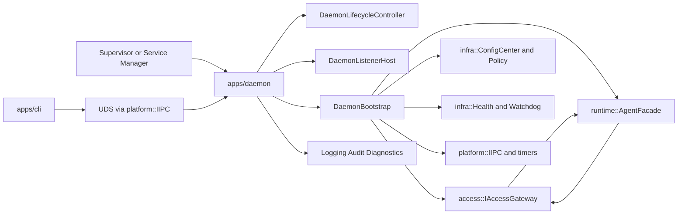
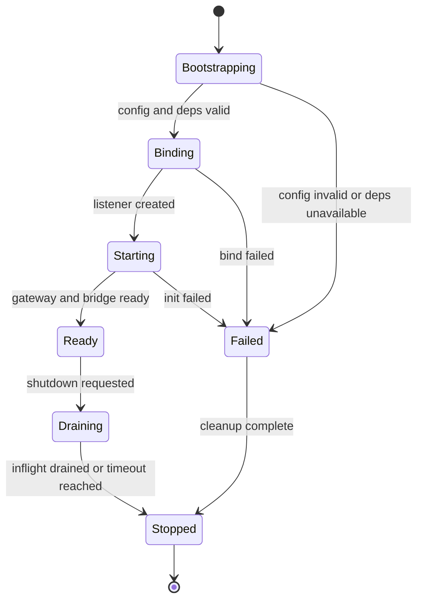
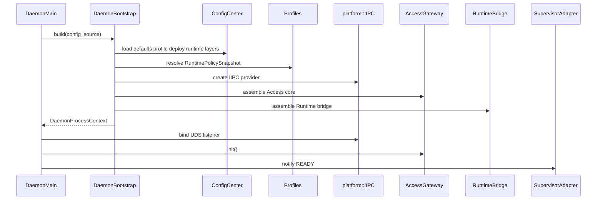

# DASALL daemon 本地控制面详细设计

文档版本：v1.0
日期：2026-04-17
状态：Draft

## 1. 模块概览

### 1.1 模块定位

本设计将 daemon 收敛为 DASALL 本地控制面的常驻服务进程。它的工程落点以 apps/daemon 为入口壳层，以 access/ 为共享接入核心，以 runtime/ 为全局主控平面，以 platform/IIPC 为本地 IPC 底座，以 infra/profiles 为治理与配置来源。

daemon 的职责不是“替 Runtime 再做一层编排”，而是把本地控制面所需的进程生命周期、监听绑定、主体识别、Access admission、Runtime 调用、结果发布、健康与诊断治理装配成一个稳定、长期运行、可观测、可运维的本地服务。

daemon 不是：

1. 不是第二个全局 Orchestrator。全局生命周期、主状态机、预算和恢复裁定权仍在 Runtime 内的 AgentOrchestrator。
2. 不是新的 gateway 中心化代理。它只承接本地控制面，不升级为所有入口的统一代理中枢。
3. 不是直接面向远程网络的公共 API 服务。v1 不承诺 HTTP/gRPC/TCP 远程控制面。
4. 不是上下文装配、Prompt 渲染、失败语义判定或工具执行的拥有者。

### 1.2 设计目标

1. 将 daemon 冻结为本地 Access owner，成为 CLI 进入 Access -> Runtime 主链的唯一常驻服务入口。
2. 在不破坏 ADR-006/007/008 的前提下，承接 UDS/IIPC、本地主体识别、策略守门、receipt 管理和健康诊断。
3. 交付一个适合长期驻留的 C++ 服务进程模型，包括启动、就绪、排空关闭、故障可见性和 supervisor 集成预留。
4. 让 daemon 的功能边界、配置来源、错误语义、可观测性和测试门禁可以直接映射到 Build。
5. 保持 v1 范围克制：先打通 unary + accepted_async，本地 UDS，ping/status/cancel/diag，只把 socket activation、streaming 和远程控制面作为后续演进项。

### 1.3 模块边界

上游输入：

1. apps/cli 通过本地 UDS/IIPC 发起请求。
2. 本地 supervisor 或 service manager 对 daemon 发起启动、停止、重载与健康探测。
3. 受控诊断入口与自动化测试通道。

下游依赖：

1. access/：共享 Access core、Admission pipeline、RequestNormalizer、Runtime bridge、ResultPublisher。
2. runtime/：AgentFacade、AgentOrchestrator 主链。
3. platform/：IIPC、UnixIpcProvider、线程/定时器/队列能力。
4. infra/：ConfigCenter、SecurityPolicyManager、Logging、Audit、Diagnostics、Health、Watchdog。
5. profiles/：RuntimePolicySnapshot、timeout_policy、ops_policy。

非目标：

1. 不设计远程 TCP/HTTP 控制面。
2. 不在 daemon 中加入第二套任务系统或第二套调度器。
3. 不在 v1 实现完整流式 attach/subscribe 协议。
4. 不在 v1 引入 systemd fd 继承式 socket activation 作为前置依赖。
5. 不改写 contracts、ADR 或相邻子系统已冻结的权责归属。

### 1.4 架构兼容目标与当前实现成熟度

| 维度 | 结论 | 说明 |
|---|---|---|
| 架构兼容目标 | Ready | daemon 作为本地 Access owner 与 access/runtime/platform/infra/profiles 现有设计完全兼容 |
| 当前实现成熟度 | Not Ready | apps/daemon 仍是 placeholder；Access daemon adapter、ReceiptStore、peer identity、health/diagnostics 闭环尚未落地 |

### 1.5 总体结构图

### 1.6 进程角色速览

从进程角色看，daemon 对外提供五组核心能力：

1. 本地控制面入口：持有 UDS listener，接受 CLI 或受控本地调用。
2. 请求治理：完成 peer identity 获取、主体识别、认证授权、Admission、幂等与背压。
3. 主链承接：把稳定请求交给 Runtime 并把统一结果回传客户端。
4. 异步结果管理：对 accepted_async 请求提供 receipt 存储、查询与取消映射。
5. 运维可见性：提供 ping、readiness、受控 diagnostics、审计和 watchdog 心跳。

对运维者的典型使用心智应是：daemon 是一个长期驻留、可探针、可排空、可受控诊断的本地服务，而不是“被 CLI 拉起后马上退出的辅助进程”。

## 2. 约束清单

| Constraint ID | 来源文档 | 类型 | 约束描述 | 影响范围 |
|---|---|---|---|---|
| DMD-C001 | DASALL_Engineering_Blueprint.md 3.2 | Must | apps/daemon 只负责进程生命周期、监听绑定、signal 处理和 daemon adapter 装配，不能复制 access core 主链 | 组件拆分、目录布局 |
| DMD-C002 | DASALL_access子系统详细设计.md ACC-C001/ACC-C002 | Must | Access 是 Access Channel 唯一 owner；daemon 必须通过共享 access core 承接认证、授权、归一化和结果发布 | 接入主链 |
| DMD-C003 | DASALL_runtime子系统详细设计.md RT-C001；ADR-008 | Must | Runtime 仍是全局主控；daemon 不得形成第二主循环、第二调度中心或第二恢复裁定点 | 进程模型、生命周期 |
| DMD-C004 | DASALL_access子系统详细设计.md ACC-C004 | Must-Not | daemon 不得持有 Runtime 主状态机、总预算、恢复执行权或最终 AgentResult 裁定权 | 权责边界 |
| DMD-C005 | DASALL_access子系统详细设计.md 1295/1297 | Must | daemon 入口围绕 UdsRequestFrame 与 LocalPeerUidFact 建模，并将本地 IPC 事实折叠为稳定 InboundPacket | 核心对象、adapter |
| DMD-C006 | platform_linux_detailed_design.md 6.6/6.9 | Must | daemon 的本地 IPC 必须复用 IIPC 与 UnixIpcProvider；不在业务层固化 Linux syscall | 传输层 |
| DMD-C007 | DASALL_access子系统详细设计.md 435；CLI 详设 6.3.3 | Must | daemon 对本地主体的 trusted 判定必须依赖 platform 暴露的 peer identity 事实；没有该事实时必须 fail-closed | 安全、授权 |
| DMD-C008 | DASALL_access子系统详细设计.md ACC-C005 | Must | Access -> Runtime 主链继续以 AgentRequest/AgentResult 为共享边界，daemon 私有 IPC 对象不得进入 contracts | 对象边界 |
| DMD-C009 | DASALL_infrastructure子系统详细设计.md 330-350 | Must | runtime_override 只能来自受鉴权控制路径，必须白名单、TTL、可审计、可回滚，daemon 不得接受普通流量热改 | 特权运维 |
| DMD-C010 | DASALL_infra_diagnostics模块详细设计.md 222-246 | Must | v1 diagnostics 只允许只读命令与本地快照导出，不允许远程导出与写操作 | diag 命令 |
| DMD-C011 | DASALL_infra_logging模块详细设计.md LOG-C002 | Must | daemon 相关日志必须携带 request_id、session_id、trace_id，并可按 trace/session 查询 | 可观测性 |
| DMD-C012 | DASALL_infra_health模块详细设计.md HLT-C014/HLT-C015 | Should | daemon 健康模型必须区分 liveness/readiness/degraded，并对心跳超时有显式升级路径 | 健康与 watchdog |
| DMD-C013 | DASALL_profiles模块详细设计.md PRF-C003/PRF-C013 | Must | daemon 运行治理必须通过 ConfigCenter 的 Profile 层与受管 override 落地，不得自建旁路配置体系 | 配置策略 |
| DMD-C014 | DASALL_profiles模块详细设计.md PRF-C004/PRF-C010 | Must-Not | profiles 只能启停能力与提供策略基线，不得借 daemon 形成第二调度中心或绕过 PolicyGate/Audit | 运行治理 |
| DMD-C015 | Docker dockerd reference | Should | daemon 应支持显式配置文件、结构化日志、配置校验、Unix socket 默认本地控制面和多 socket 预留，但应避免 flag 与配置文件冲突 | 配置、部署、运维 |
| DMD-C016 | Docker dockerd reference；systemd socket activation pattern | Should | daemon 生命周期应和外部 supervisor 解耦，v1 支持直接绑定，socket activation 保留为受控演进 | 启动模式 |
| DMD-C017 | OWASP Authorization Cheat Sheet | Must | 默认拒绝、逐请求鉴权、本地 trusted 也必须经过 operation taxonomy 和策略校验 | 授权路径 |
| DMD-C018 | DASALL_access子系统详细设计.md 6.15 | Must | daemon 优雅关闭必须进入 Draining，不再接收新请求，但允许 inflight 请求在超时窗口内排空 | 关闭流程 |

### 2.1 约束抽取结论

1. Must：daemon 是本地 Access owner，但不是全局主控；它必须依赖共享 access core、platform IPC、infra 治理与 Runtime 主链。
2. Should：daemon 应具备标准守护进程特征，包括结构化配置、结构化日志、健康探针、优雅关闭和 supervisor 集成预留。
3. Must-Not：daemon 不得自建控制平面语义、旁路授权路径、自由热更新配置或第二调度中心。

## 3. 现状与缺口

| 设计目标 | 当前状态 | 差距描述 | 风险等级 | 修复优先级 |
|---|---|---|---|---|
| daemon 进程入口可运行 | 已实现占位 | apps/daemon/src/main.cpp 仅输出 placeholder，缺少 listener、bootstrap、signal、shutdown 排空 | High | P0 |
| daemon 进程构建链合理 | 部分实现 | apps/daemon 已有目标，但当前仅链接 access/runtime/contracts/infra，daemon 监听所需的 platform surface 尚未进入显式依赖 | High | P0 |
| access 主链可被 daemon 消费 | 缺失 | access/CMakeLists.txt 仍只编译 placeholder.cpp，未接入 daemon adapter、normalizer、publisher、receipt 等实现 | High | P0 |
| access 可消费 platform IPC | 缺失 | dasall_access 当前未链接 dasall_platform，但 daemon adapter 和 peer identity 依赖 IIPC | High | P0 |
| 本地主体识别可落地 | 缺失 | IIPC 仅有 listen/accept/connect/send/receive/close，无 describe_peer 或等价接口 | High | P0 |
| UDS listener 可运行 | 部分实现 | UnixIpcProvider 已有骨架实现，但尚无 daemon 侧 listener host 和连接调度层 | High | P0 |
| ping 与 readiness 闭环 | 缺失 | 没有 DaemonHealthService、Readiness 汇总或 supervisor-ready 信号桥接 | High | P1 |
| receipt/status/cancel 闭环 | 缺失 | 现有代码无 ReceiptStore、状态查询映射、取消映射和 TTL 清理 | High | P1 |
| diag 只读入口 | 部分实现 | infra/diagnostics 接口已冻结，但 daemon 入口命令面与策略守门尚未实现 | Medium | P1 |
| profile 驱动的 daemon 配置 | 部分实现 | profiles 设计已冻结，但 socket path、ops_policy、diagnostics gate 等实际 profile 值仍是占位 | Medium | P1 |
| socket activation 兼容 | 缺失 | 当前 platform/IIPC 无预打开 fd 继承接口，apps/daemon 也没有 activated-listener 适配层 | Medium | P2 |
| watchdog 通知闭环 | 缺失 | infra/watchdog 和 daemon 进程心跳尚未接线，只有设计侧约束 | Medium | P2 |

### 3.1 现状判断

当前最准确的判断是：daemon 的架构位置已经清晰，但仓库只具备入口骨架和平台 IPC 底座，尚未形成一个长期驻留、可探针、可受控运维的服务进程闭环。

### 3.2 关键风险冲突识别

| 冲突类型 | 描述 | 影响 | 风险等级 |
|---|---|---|---|
| 权责冲突 | daemon 若直接持有任务状态机、恢复执行权或总预算，将和 Runtime 抢主控 | 破坏 ADR-008 与 Runtime 边界 | High |
| 安全冲突 | 若没有 peer identity 就默认信任本地请求 | 高风险越权入口 | High |
| 配置冲突 | 若 daemon 启动 flags 与 config file 对同一键重复配置但不报错，运行结果不可预测 | 运维不可控 | Medium |
| 入口冲突 | 若 daemon 同时承担 HTTP/gateway 统一代理角色，会把 apps/daemon 升级成中心平面 | 破坏蓝图 Layer 7 落点 | High |
| 并发冲突 | 若 listener/dispatch/receipt 清理没有显式锁顺序和背压策略 | 主链阻塞、死锁或内存膨胀 | Medium |
| 生命周期冲突 | 若 shutdown 时立即关闭 publisher 或 listener 资源，已受理请求结果丢失 | 影响可靠性和审计 | Medium |

## 4. 候选方案对比

本节只比较 daemon 的进程与启动模型，因为“采用独立 daemon 进程而不是 CLI 直连 Runtime”这一更高层决策，已经在讨论记录和 CLI 详设中完成冻结。

| 方案名 | 架构匹配度 | ADR 匹配度 | 工程复杂度 | 风险 | 结论 |
|---|---|---|---|---|---|
| 方案 A：直接绑定 UDS 的常驻 daemon | 高 | 高 | 中 | 需要补 peer identity、receipt、health 等能力，但不依赖额外平台机制 | 采纳，v1 正式方案 |
| 方案 B：socket-activated daemon | 高 | 高 | 高 | 符合 industry best practice，但当前 IIPC 无预打开 fd 继承接口，部署策略也未冻结 | 保留为 v2 演进 |
| 方案 C：gateway-centered 中心进程 | 低 | 低 | 高 | 会把 daemon 升级成统一代理平面，迫使其他入口二次跳转并稀释 Access 层边界 | 淘汰 |

### 4.1 行业实践提炼

1. Docker 的 dockerd 证明，client 与 daemon 分离、daemon 默认监听本地 Unix socket、以配置文件为主、允许 supervisor/systemd 集成，是长期运行控制面的成熟路径。
2. Docker 的配置实践说明，flags 与配置文件的冲突应显式失败，且应提供 validate 模式而不是“启动后才发现错误”。
3. systemd socket activation 与 watchdog 模式说明，守护进程生命周期和监听文件描述符可由外部 supervisor 管理，但前提是服务接口明确定义 ready、stopping 和 heartbeat 语义。
4. OWASP 授权基线说明，本地控制面同样需要逐请求授权，本地 socket 不等于可信根。

## 5. 决策结论

### 5.1 最终选型

采纳方案 A：直接绑定 UDS 的本地常驻 daemon，作为 DASALL v1 本地控制面的正式守护进程模型。

### 5.2 选型依据

1. 它与当前 access、runtime、platform、infra、profiles 已冻结边界完全一致。
2. 它不依赖当前仓库尚不存在的 activated listener/fd inheritance 能力。
3. 它保留了未来向 socket activation 演进的空间，但不把平台补口和部署约定变成 v1 前置阻塞。
4. 它最适合承接 unary + accepted_async、ping、diag、receipt/status/cancel 这组本地控制面需求。

### 5.3 放弃与延后理由

1. 放弃方案 C，因为它会制造新的中心化控制平面，违反 apps/daemon 作为入口壳层的定位。
2. 延后方案 B，不是因为方向错误，而是因为当前 platform/IIPC 缺少 activated listener surface，且部署/打包策略尚未冻结。

### 5.4 范围冻结

纳入范围：

1. 本地 UDS/IIPC 监听与连接处理。
2. daemon 入口命令 taxonomy 和 Access 主链装配。
3. health、diag、receipt、status、cancel、优雅关闭。
4. 配置、日志、审计、watchdog 的守护进程侧治理。

排除范围：

1. 远程控制面。
2. 完整 streaming/attach 协议。
3. activated fd 继承式 socket activation 的正式交付。
4. 多 daemon 多实例隔离运行的正式支持，只保留设计预留。

## 6. 详细设计

### 6.1 职责边界

daemon 负责：

1. 读取受管配置并完成启动期校验。
2. 建立本地 listener，接受 IIPC 连接并调度请求。
3. 为每个连接获取 peer identity，并将连接事实折叠为 daemon entry packet。
4. 装配并调用共享 access core，进入 Admission -> Normalize -> RuntimeBridge -> Publish 主链。
5. 管理 accepted_async 的 receipt 映射、查询与取消入口。
6. 汇总并暴露 liveness/readiness/degraded、ping 和只读 diagnostics 能力。
7. 执行优雅关闭、排空 inflight、释放 listener 和清理本地资源。

daemon 不负责：

1. 不持有 Runtime 主状态机和恢复执行权。
2. 不直接组装 ContextPacket、Prompt 或 provider payload。
3. 不直接执行 tools 或 services。
4. 不绕过 AccessPolicyGate 给任何命令开后门。
5. 不承诺远程 API、流式 attach 或浏览器面向能力。

### 6.2 子组件与职责

| 子组件 | 层级 | 落点建议 | 职责 |
|---|---|---|---|
| DaemonMain | apps/daemon | apps/daemon/src/main.cpp | 进程入口、参数接收、退出码、主生命周期驱动 |
| DaemonBootstrap | apps/daemon | apps/daemon/src/DaemonBootstrap.cpp | 读取配置、构造 dependencies、完成 init |
| DaemonLifecycleController | apps/daemon | apps/daemon/src/DaemonLifecycleController.cpp | 维护 Bootstrapping/Binding/Ready/Draining/Stopped 状态 |
| DaemonListenerHost | apps/daemon | apps/daemon/src/DaemonListenerHost.cpp | 建立 listener、accept loop、连接派发、close |
| DaemonSignalHandler | apps/daemon | apps/daemon/src/DaemonSignalHandler.cpp | SIGTERM/SIGINT/SIGHUP 等受控响应 |
| DaemonSupervisorAdapter | apps/daemon | apps/daemon/src/DaemonSupervisorAdapter.cpp | ready/stopping/watchdog 通知桥接，v1 可最小实现 |
| DaemonProtocolAdapter | access | access/src/daemon/DaemonProtocolAdapter.cpp | 将 UdsRequestFrame + LocalPeerUidFact 解码为 InboundPacket |
| SubjectResolver | access | access/src/SubjectResolver.cpp | 解析 peer uid/gid/pid 与 session hint 形成主体事实 |
| AuthenticatorChain | access | access/src/AuthenticatorChain.cpp | 认证、主体可信度与凭证验证 |
| AccessPolicyGate | access | access/src/AccessPolicyGate.cpp | 命令 taxonomy 授权、diag/override 特权守门 |
| AdmissionController | access | access/src/AdmissionController.cpp | 限流、并发上限、幂等窗口与背压 |
| RequestNormalizer | access | access/src/RequestNormalizer.cpp | 生成 AgentRequest 并做契约级校验 |
| DaemonRuntimeBridge | access | access/src/DaemonRuntimeBridge.cpp | 调用 Runtime AgentFacade |
| ResultPublisher | access | access/src/ResultPublisher.cpp | 将 AgentResult/Accepted 投影为 UdsResponseFrame |
| ReceiptStore | access | access/src/daemon/ReceiptStore.cpp | 保存 receipt_ref -> runtime task/status 映射 |
| DaemonHealthService | access | access/src/daemon/DaemonHealthService.cpp | 生成 ping/readiness/health 摘要 |

### 6.3 输入输出与依赖关系

| 子组件 | 输入来源 | 输出去向 | 语义契约 |
|---|---|---|---|
| DaemonBootstrap | ConfigCenter、Profile、CLI flags、deploy config | DaemonProcessContext | 启动前必须做结构化配置校验 |
| DaemonListenerHost | DaemonBootstrapConfig、IIPC | ListenerHandle、AcceptedConnection | v1 仅 direct bind UDS |
| DaemonProtocolAdapter | IpcPayload、PeerIdentitySnapshot | InboundPacket | 协议错误尽早拒绝，不进入 Runtime |
| AccessPolicyGate | command taxonomy、ops_policy、subject | Allow/Deny/RequirePrivilegedPath | 默认拒绝所有未声明命令 |
| DaemonRuntimeBridge | AgentRequest | AgentResult 或 AcceptedReceipt | Runtime 为唯一主控 |
| ResultPublisher | RuntimeOutcome、receipt | UdsResponseFrame | 输出稳定、错误分层 |
| ReceiptStore | receipt_ref、request_id、task ref | StatusResult、CancelResult | 只保存映射和 TTL，不实现业务任务系统 |
| DaemonHealthService | lifecycle state、listener health、gateway state、bridge health | PingSummary、ReadinessSummary | 轻量、无敏感内部细节 |
| DaemonSupervisorAdapter | lifecycle state、watchdog tick | OS/service manager signal | v1 不强依赖 systemd，但预留统一通知面 |

依赖方向冻结：

1. apps/daemon 只依赖 access、runtime、infra、profiles、platform，不直接依赖 cognition/llm/tools/memory/knowledge 实现。
2. access daemon 适配逻辑如进入共享 core，则 dasall_access 必须显式依赖 dasall_platform。
3. daemon 壳层不直接操作 Runtime 内部组件，只通过 AgentFacade/IAccessRuntimeBridge 接入。

### 6.4 核心对象与接口语义

#### 6.4.1 核心对象

| 核心对象 | 关键字段 | 约束 | 所有权 |
|---|---|---|---|
| DaemonBootstrapConfig | socket_path、listen_backlog、max_payload_bytes、dispatch_timeout_ms、shutdown_grace_ms、receipt_ttl_sec、startup_mode、diag_enabled、watchdog_enabled | 启动前完整校验；flags 与 config 冲突时拒绝启动 | apps/daemon private |
| DaemonProcessContext | lifecycle、listener、access_gateway、runtime_bridge、infra_handles、profile_snapshot | build 成功后只读；失败不返回半初始化对象 | apps/daemon private |
| DaemonLifecycleState | Bootstrapping、Binding、Starting、Ready、Draining、Stopped、Failed | Ready 前不接受业务请求 | apps/daemon private |
| PeerIdentitySnapshot | uid、gid、pid、transport_kind、socket_path | 只表达平台事实；不进入 contracts | platform public interface |
| UdsRequestFrame | schema_version、request_id、trace_id、session_hint、idempotency_key、command、args、payload、async_preference | module-local；必须单包可序列化 | access daemon private |
| UdsResponseFrame | schema_version、request_id、trace_id、session_id、disposition、exit_code_hint、receipt_ref、agent_result、error_ref | module-local；与 CLI 协议稳定对齐 | access daemon private |
| DaemonReceiptRecord | receipt_ref、request_id、runtime_task_ref、status、created_at、expires_at、owner_ref | TTL 到期清理；owner 校验不可省略 | access daemon private |
| DaemonReadinessSnapshot | lifecycle_state、gateway_ready、listener_ready、bridge_reachable、diag_state、degraded_reasons | 只输出二值和摘要，不暴露敏感内部字段 | access/apps private |

#### 6.4.2 核心接口

| 核心接口 | 语义 | 前置条件 | 错误语义 |
|---|---|---|---|
| DaemonBootstrap::build(config) -> DaemonProcessContext | 构造 daemon 全部运行依赖 | 配置已通过结构化校验 | ValidationError、DependencyUnavailable |
| DaemonLifecycleController::start() | 进入 Bootstrapping -> Binding -> Ready | build 成功 | BindFailed、InitFailed |
| DaemonLifecycleController::shutdown(timeout) | 进入 Draining 并排空 inflight | 当前非 Stopped | ShuttingDown、DrainTimeout |
| DaemonListenerHost::bind(endpoint) | 建立 UDS 监听 | socket_path 合法且未冲突 | AddressInUse、PermissionDenied |
| DaemonListenerHost::accept_loop() | 持续 accept 连接并派发 | lifecycle == Ready | PeerClosed、Timeout |
| IIPC::describe_peer(handle) -> PeerIdentitySnapshot | 获取本地对等端身份 | handle 来自 accept；仅本地 UDS transport 支持 | Unsupported、NotFound、PeerClosed |
| ReceiptStore::lookup(receipt_ref, owner) | 查询异步状态 | receipt 未过期且 owner 匹配 | NotFound、Expired、OwnerMismatch |
| ReceiptStore::cancel(receipt_ref, owner) | 发起取消映射 | task 仍存在且 owner 匹配 | NotFound、NotCancellable |

#### 6.4.3 平台接口补口要求

为了满足 daemon 详设和 access 详设中的 LocalPeerUidFact 要求，platform 需要补一个加法型接口补口：

1. 在 IIPC 上新增 describe_peer(handle) 或等价 side-interface，用于返回本地 UDS peer uid/gid/pid。
2. 返回对象命名建议为 PeerIdentitySnapshot，仅包含平台事实，不包含业务主体或授权结果。
3. 该对象位于 platform module public interface，不进入 contracts。
4. 在此能力完成前，所有需要 local trusted 判定的 privileged command 必须默认禁用或硬拒绝。

### 6.5 进程模型与生命周期

#### 6.5.1 生命周期状态机

状态语义：

| 状态 | 新请求行为 | 观测语义 |
|---|---|---|
| Bootstrapping | 拒绝 | STARTING |
| Binding | 拒绝 | STARTING |
| Starting | 仅保留内部初始化 | STARTING |
| Ready | 接受新请求 | READY |
| Draining | 拒绝新请求，仅排空 inflight | DEGRADED 或 STOPPING |
| Failed | 拒绝全部请求 | NOT_READY |
| Stopped | 无 listener | STOPPED |

#### 6.5.2 线程模型

daemon 采用“控制平面少线程 + 受控 worker”模型：

1. 一个主线程负责启动、关闭、signal 与状态推进。
2. 一个 listener 线程或事件循环负责 accept 连接。
3. N 个 dispatch worker 负责 decode、Admission、RuntimeBridge 等入口处理，N 受 profile/deploy 控制。
4. 一个定时器任务负责 receipt TTL 清理与 watchdog 心跳。

并发约束：

1. daemon 不得形成自己的业务 scheduler；dispatch worker 只处理入口与发布，不持有业务状态机。
2. 锁顺序必须显式冻结为：LifecycleState -> ConnectionRegistry -> ReceiptStore -> PublishQueue。
3. 不得在持锁状态下执行 socket write、JSON 序列化、诊断导出或审计写入。

### 6.6 启动与请求主流程

#### 6.6.1 启动主流程

启动规则：

1. 配置校验失败必须在 bind 前返回，daemon 不得进入半启动状态。
2. listener bind 成功但 AccessGateway 或 RuntimeBridge 未 ready 时，daemon 只能报告 STARTING/NOT_READY，不得接受业务请求。
3. v1 支持 direct bind 模式；activated listener 模式只保留接口预留，不作为正式启动路径。

#### 6.6.2 请求处理主流程

1. listener accept 连接。
2. 通过 IIPC::describe_peer 获取 PeerIdentitySnapshot。
3. 读取 IpcPayload，解码为 UdsRequestFrame。
4. DaemonProtocolAdapter 折叠为 InboundPacket。
5. SubjectResolver 和 AuthenticatorChain 完成主体识别与认证。
6. AccessPolicyGate 对命令 taxonomy、diag、override、cancel/status 做逐请求授权。
7. AdmissionController 执行限流、并发、幂等和背压检查。
8. RequestNormalizer 生成 AgentRequest。
9. DaemonRuntimeBridge 调用 Runtime。
10. ResultPublisher 生成 UdsResponseFrame。
11. 对于 accepted_async，请求结果同时写入 ReceiptStore。

### 6.7 安全与授权模型

#### 6.7.1 本地主体识别

daemon 的本地主体识别采用“平台事实优先，输入 hint 次之”的模型：

1. uid/gid/pid 只来自 platform peer identity 查询。
2. session_hint、trace_hint、command args 都是不可信输入，只能作为辅助关联信息。
3. 只有 SubjectResolver 将 PeerIdentitySnapshot 与受控配置、allowlist、凭证验证组合之后，才可形成 AuthenticatedSubject。

#### 6.7.2 授权原则

1. 默认拒绝：未声明命令、未知 taxonomy、策略系统不可达、peer identity 缺失时一律拒绝。
2. 本地 trusted 不等于 unrestricted：即使是本机 peer uid，也必须通过 AccessPolicyGate 与 ops_policy。
3. diag 和 override 必须走独立授权路径，不与 run/status/cancel 共享宽松路径。
4. 取消操作需要 owner 匹配；受控运维主体可在审计前提下走授权 override 路径。

#### 6.7.3 Socket 与权限面

v1 的 UDS 默认策略：

1. daemon 默认监听本地 Unix socket，不开放 TCP 监听。
2. socket_path 默认来自受管配置，不允许普通业务流量覆盖。
3. socket 文件权限、owner、group 应由 deployment/profile 配置控制，默认最小权限。
4. stale socket 检测和清理必须在 bind 前执行，但不得删除不属于当前 daemon 管辖的活动 socket。

### 6.8 receipt、status 与 cancel 设计

#### 6.8.1 accepted_async 语义

daemon 将 Runtime 的 accepted_async 结果投影为 receipt_ref。其作用是：

1. 解耦 CLI 的短生命周期与 Runtime 的长生命周期任务。
2. 允许 status 和 cancel 通过受控映射访问任务状态。
3. 为 dispatch timeout 但后端继续执行的情况提供补偿查询路径。

#### 6.8.2 ReceiptStore 约束

1. 只保存 receipt_ref -> request_id/runtime_task_ref/status/owner/ttl 映射。
2. 不保存业务主状态机，不成为第二任务系统。
3. TTL 到期清理必须可观测，并以审计或日志记录过期事实。
4. status/cancel 必须检查 owner 和策略，禁止 receipt 洩漏成为越权句柄。

### 6.9 健康、诊断与 watchdog

#### 6.9.1 ping 与 readiness

daemon 必须区分：

1. ping：轻量命令，返回 daemon_version、schema_version、profile_id、request_id、readiness 摘要。
2. readiness：来自 lifecycle + listener + gateway + runtime bridge 的聚合判断。
3. diagnostics：正式诊断链路，受策略控制，不与 ping 混用。

#### 6.9.2 daemon 健康维度

| 健康维度 | 判断依据 | 输出 |
|---|---|---|
| Liveness | 进程存活、主循环和监听线程未失活 | OK/FAIL |
| Readiness | listener 已绑定、AccessGateway Ready、RuntimeBridge reachable | READY/NOT_READY |
| Degraded | diagnostics、metrics、receipt 清理、部分 provider 退化 | DEGRADED |

#### 6.9.3 watchdog 设计

1. v1 通过统一 DaemonSupervisorAdapter 预留 READY、STOPPING、WATCHDOG 通知面。
2. 若没有外部 supervisor，watchdog 心跳仍可通过 infra/watchdog 和 health 记录内部状态，但不影响主流程。
3. watchdog 超时升级路径只输出事实和事件，不由 daemon 自行做恢复裁定。

### 6.10 配置策略

#### 6.10.1 配置来源

daemon 必须完全服从 ConfigCenter 四层模型：defaults、profile、deployment_override、runtime_override。

#### 6.10.2 daemon 配置项

| 配置项 | 默认值 | 覆盖层级 | 说明 |
|---|---|---|---|
| daemon.socket_path | /tmp/dasall/control.sock | Profile/部署 | 本地 UDS 路径 |
| daemon.listen_backlog | 32 | Profile/部署 | listener backlog |
| daemon.max_payload_bytes | 1048576 | Profile/部署 | 单消息最大尺寸 |
| daemon.dispatch_timeout_ms | 5000 | Profile/部署 | daemon 等待 RuntimeBridge 的上限 |
| daemon.shutdown_grace_ms | 3000 | Profile/部署 | Draining 排空窗口 |
| daemon.receipt_ttl_sec | 3600 | Profile/部署 | receipt TTL |
| daemon.accept_workers | 1 | Profile/部署 | accept 线程或事件循环数量 |
| daemon.dispatch_workers | 4 | Profile/部署 | dispatch worker 数量 |
| daemon.diag.enabled | false | Profile/部署 | 是否开放 diag 命令族 |
| daemon.override.enabled | false | 部署/runtime override | 是否允许 runtime_override 类命令 |
| daemon.watchdog.enabled | false | Profile/部署 | 是否启用 supervisor/watchdog 通知 |
| daemon.log.format | json | Profile/部署 | 建议采用结构化日志 |

#### 6.10.3 配置校验与冲突规则

借鉴 dockerd 的实践，daemon 配置遵循以下规则：

1. 配置文件是长期运行配置的首选来源，flags 主要用于开发、诊断和显式覆盖。
2. 同一键若同时出现在 flags 与配置文件中，且语义冲突，daemon 应拒绝启动而不是静默取其一。
3. daemon 应提供 validate-only 配置校验路径，允许在不启动 listener 的情况下验证配置结构与约束。
4. 允许 hot-reload 的键必须显式白名单化；listener/socket_path/startup_mode 等关键键在 v1 仅允许启动期生效。

#### 6.10.4 热重载矩阵

| 配置项类别 | v1 是否支持热重载 | 说明 |
|---|---|---|
| log level / log format | 是 | 不影响主链结构 |
| diag enable | 是 | 仍需策略 gating |
| watchdog enable | 是 | 只影响通知行为 |
| receipt_ttl_sec | 是，且只影响新清理周期 | 不回溯修改已过期记录 |
| socket_path / backlog / startup_mode | 否 | 需要重启 daemon |
| dispatch_workers | 否 | v1 不做动态线程池伸缩 |
| override enable | 是，但必须经过 runtime_override 与审计 | 高风险键，默认关闭 |

### 6.11 可观测性与审计

#### 6.11.1 结构化日志

daemon 相关日志字段至少包括：

1. timestamp
2. level
3. module
4. message
5. request_id
6. session_id
7. trace_id
8. daemon_state
9. connection_ref 或 receipt_ref（若适用）

#### 6.11.2 指标

建议最小指标集：

1. daemon_accept_total
2. daemon_accept_fail_total
3. daemon_inflight_requests
4. daemon_dispatch_latency_ms
5. daemon_receipt_active_count
6. daemon_receipt_expired_total
7. daemon_readiness_transition_total
8. daemon_diag_command_total
9. daemon_diag_command_denied_total
10. daemon_watchdog_missed_total

#### 6.11.3 审计事件

以下动作必须审计：

1. diag 命令执行或拒绝。
2. override 请求、应用和回滚。
3. 跨主体 cancel 尝试或 owner 不匹配。
4. peer identity 缺失导致的 fail-closed 拒绝。
5. shutdown 时 inflight abandoned 的清理行为。

### 6.12 异常与恢复时序

| 异常分类 | 检测点 | 恢复动作 | 失败兜底 |
|---|---|---|---|
| 配置非法 | Bootstrap 阶段 | 拒绝启动，输出结构化错误 | 退出并保持未绑定 |
| socket 地址冲突 | bind 阶段 | 若判定为 stale socket 且安全可清理则清理后重试一次；否则拒绝启动 | 进入 Failed |
| peer identity 缺失 | accept 后 | 直接 fail-closed，记录审计 | 请求拒绝，不影响 daemon 存活 |
| AccessGateway 未 ready | 请求入口 | 返回 ShuttingDown 或 NotReady | 客户端可重试 ping/status |
| RuntimeBridge 不可达 | dispatch 前 | 返回 bridge unavailable，并标记 readiness 降级 | 请求失败但守护进程继续运行 |
| dispatch 超时 | bridge 等待 | 若已 accepted 则写 receipt；否则返回 timeout | 由 status 路径补偿查询 |
| publish 失败 | response write | 记录 publish failure；若 request 已 accepted 则通过 receipt 查询补偿 | 不做隐式重放 |
| shutdown 超时 | Draining | 记录 abandoned inflight 并强制 close listener | 守护进程退出但留下审计证据 |

恢复原则：

1. daemon 只做局部、无业务语义的清理动作，如关闭连接、清理 receipt、释放 listener。
2. 所有涉及业务重试、replan、abort_safe 或恢复准入的动作仍归 Runtime。
3. daemon 不自动把失败的同步请求偷偷转成异步；只有 Runtime 明确返回 Accepted 才进入 receipt 路径。

### 6.13 目录与文件落盘建议

| 目录 | 建议新增文件 | 说明 |
|---|---|---|
| apps/daemon/src | DaemonBootstrap.cpp、DaemonLifecycleController.cpp、DaemonListenerHost.cpp、DaemonSignalHandler.cpp、DaemonSupervisorAdapter.cpp | daemon 进程壳层与生命周期 |
| access/src/daemon | DaemonProtocolAdapter.cpp、ReceiptStore.cpp、DaemonHealthService.cpp | daemon entry 专属 Access 组件 |
| access/src | SubjectResolver.cpp、AuthenticatorChain.cpp、AccessPolicyGate.cpp、AdmissionController.cpp、RequestNormalizer.cpp、DaemonRuntimeBridge.cpp、ResultPublisher.cpp | 共享接入主链 |
| access/include | DaemonProtocolTypes.h、ReceiptStore.h、DaemonHealthTypes.h | daemon 相关 public interface |
| platform/include | IIPC.h 扩展 describe_peer 或等价接口 | peer identity 补口 |
| platform/src/linux | UnixIpcProvider.cpp 扩展 peer identity 获取与 activated-listener 预留注释 | Linux UDS 实现 |
| tests/unit/apps/daemon | DaemonBootstrapTest.cpp、DaemonLifecycleControllerTest.cpp | daemon 壳层单测 |
| tests/unit/access | DaemonProtocolAdapterTest.cpp、ReceiptStoreTest.cpp、AccessPolicyGateDaemonCommandTest.cpp | Access daemon 相关单测 |
| tests/integration/access | DaemonPingIntegrationTest.cpp、DaemonGracefulShutdownIntegrationTest.cpp、DaemonReceiptFlowIntegrationTest.cpp | 守护进程集成测试 |

## 7. Design -> Build 映射（建议级）

| Design结论 | Build目标 | 映射说明 | 代码目标 | 测试目标 | 验收命令 | 依赖/阻塞 |
|---|---|---|---|---|---|---|
| daemon 成为真正常驻服务入口 | 实现 DaemonBootstrap 和 LifecycleController | 先把 placeholder main 替换为可启动可关闭的进程壳层 | apps/daemon/src/main.cpp、DaemonBootstrap.cpp、DaemonLifecycleController.cpp | unit：DaemonBootstrapTest、DaemonLifecycleControllerTest | cmake --build build-ci --target dasall_daemon && ctest --test-dir build-ci -R "DaemonBootstrapTest|DaemonLifecycleControllerTest" --output-on-failure | 无 |
| daemon 监听本地 UDS | 实现 DaemonListenerHost | 建立 direct bind listener 和 accept loop | apps/daemon/src/DaemonListenerHost.cpp | integration：DaemonPingIntegrationTest | cmake --build build-ci --target dasall_daemon && ctest --test-dir build-ci -R DaemonPingIntegrationTest --output-on-failure | 依赖 IIPC 可用 |
| daemon Access 主链闭环 | 补齐 DaemonProtocolAdapter、RequestNormalizer、ResultPublisher | 让 listener 进来的请求能进入共享 access core | access/src/daemon/DaemonProtocolAdapter.cpp、access/src/RequestNormalizer.cpp、access/src/ResultPublisher.cpp | unit：DaemonProtocolAdapterTest；integration：DaemonRequestFlowIntegrationTest | cmake --build build-ci --target dasall_access dasall_daemon && ctest --test-dir build-ci -R "DaemonProtocolAdapterTest|DaemonRequestFlowIntegrationTest" --output-on-failure | 依赖 access 骨架补齐 |
| peer identity 成为正式输入事实 | 扩展 IIPC describe_peer | 没有该能力就无法安全支持 local trusted 命令 | platform/include/IIPC.h、platform/src/linux/UnixIpcProvider.cpp | unit：UnixIpcProviderPeerIdentityTest | cmake --build build-ci --target dasall_platform && ctest --test-dir build-ci -R UnixIpcProviderPeerIdentityTest --output-on-failure | 当前平台接口缺口 |
| receipt/status/cancel 闭环 | 新增 ReceiptStore 和 cancel 映射 | 保证 accepted_async 与断线恢复 | access/src/daemon/ReceiptStore.cpp | unit：ReceiptStoreTest；integration：DaemonReceiptFlowIntegrationTest | cmake --build build-ci --target dasall_access dasall_daemon && ctest --test-dir build-ci -R "ReceiptStoreTest|DaemonReceiptFlowIntegrationTest" --output-on-failure | 依赖 Runtime cancel/query surface |
| ping/readiness/diag 正式化 | 新增 DaemonHealthService 与 diagnostics gate | 将健康与诊断从“约定”变成正式能力 | access/src/daemon/DaemonHealthService.cpp、apps/daemon/src/DaemonSupervisorAdapter.cpp | integration：DaemonReadinessIntegrationTest、DaemonDiagDenyIntegrationTest | cmake --build build-ci --target dasall_daemon && ctest --test-dir build-ci -R "DaemonReadinessIntegrationTest|DaemonDiagDenyIntegrationTest" --output-on-failure | 依赖 infra/health、infra/diagnostics |
| 优雅关闭排空 | 新增 Draining 和 shutdown gate | 保证关闭时不丢已受理结果 | apps/daemon/src/DaemonLifecycleController.cpp | integration：DaemonGracefulShutdownIntegrationTest | cmake --build build-ci --target dasall_daemon && ctest --test-dir build-ci -R DaemonGracefulShutdownIntegrationTest --output-on-failure | 依赖 ResultPublisher 保持可用 |
| 配置冲突显式失败 | 新增 daemon config validator | 借鉴 dockerd 的配置治理经验 | apps/daemon/src/DaemonConfigValidator.cpp | unit：DaemonConfigValidationTest | cmake --build build-ci --target dasall_daemon && ctest --test-dir build-ci -R DaemonConfigValidationTest --output-on-failure | 依赖 ConfigCenter 与配置 schema |

## 8. 实施计划与里程碑

| 阶段 | 目标 | 关键动作 | 完成判定 | 风险 |
|---|---|---|---|---|
| M0 设计冻结 | 冻结 daemon 角色、启动模式与边界 | 评审本文档，确认 v1 只做 direct bind、本地 UDS、unary + receipt | 文档评审通过 | peer identity 补口未达成一致 |
| M1 进程壳层可启动 | 替换 placeholder daemon main | 补 Bootstrap、Lifecycle、Listener、配置校验 | ping 能连通并返回 readiness 摘要 | access 主链尚未接上 |
| M2 Access daemon 主链闭环 | 让 daemon 可以处理业务请求 | 补 DaemonProtocolAdapter、RequestNormalizer、Publisher、Bridge | run happy path 与拒绝路径通过 | access/platform 依赖重构 |
| M3 receipt 与取消 | 跑通 accepted_async/status/cancel | 补 ReceiptStore、owner 校验、TTL 清理、cancel 映射 | receipt 流程定向用例通过 | Runtime cancel/query surface |
| M4 健康与运维硬化 | 完成 readiness、diag、audit、graceful shutdown | 接 health/diagnostics/watchdog 和 Draining | 质量门通过 | infra 子域实现尚未完全闭环 |

### 8.1 最小可交付切分

1. 第一个最小可交付是 daemon ping，而不是 run。它先验证进程壳层、listener、配置与 readiness。
2. 第二个最小可交付是业务 unary happy path。
3. 第三个最小可交付是 accepted_async + status。
4. 第四个最小可交付才是 cancel、diag 和 graceful shutdown 排空。

## 9. 测试与质量门

| 测试层级 | 覆盖范围 | 核心用例 | 验收方式 |
|---|---|---|---|
| Unit | daemon 配置与生命周期 | 配置冲突、非法 socket_path、Bootstrapping -> Ready -> Draining | 定向单测通过 |
| Unit | listener 与平台适配 | bind 成功、地址冲突、PeerClosed、PayloadTooLarge、describe_peer 缺失 | 定向单测通过 |
| Unit | daemon adapter | 非法 frame 拒绝、peer identity 缺失拒绝、未知命令拒绝 | 定向单测通过 |
| Unit | ReceiptStore | insert、lookup、owner mismatch、ttl expired、cancel state transition | 定向单测通过 |
| Integration | ping/readiness | daemon up、daemon down、bridge unavailable、not ready | 集成测试通过 |
| Integration | request flow | happy path、auth deny、validation reject、runtime failure | 集成测试通过 |
| Integration | async flow | accepted_async、status、cancel、publish failure 后补偿查询 | 集成测试通过 |
| Integration | graceful shutdown | draining 拒绝新请求、inflight 排空、超时 abandoned 审计 | 集成测试通过 |
| Failure Injection | IPC 与配置 | stale socket、bind conflict、peer identity unsupported、runtime bridge timeout | 失败注入通过 |
| Compatibility | 构建与链接 | apps/daemon 与 access 显式引入需要的 platform 依赖，且不引入无关上层实现依赖 | 构建检查通过 |

建议质量门：

1. Gate-DMD-01：ping 正例与 daemon unavailable 负例同时通过。
2. Gate-DMD-02：peer identity 缺失时请求 fail-closed。
3. Gate-DMD-03：run happy path、auth deny、validation reject 同时通过。
4. Gate-DMD-04：accepted_async/status/cancel 闭环通过。
5. Gate-DMD-05：graceful shutdown 时 inflight 排空或 abandoned 审计符合预期。
6. Gate-DMD-06：apps/daemon 和 dasall_access 的平台依赖方向与文档一致。

## 10. 兼容性与演进评估（建议级）

| breaking risk | 影响消费者 | 迁移路径 | 灰度策略 | 扩展预留 |
|---|---|---|---|---|
| Low | 本地 CLI 使用者 | v1 冻结 daemon 为本地 UDS 服务，CLI 通过 ping/run/status/cancel/diag 接入 | 先灰度 ping，再开放业务命令 | 预留更多 daemon 命令 taxonomy |
| Medium | platform IIPC 调用方 | 对 IIPC 做加法型 peer identity 扩展，不破坏现有六方法 surface | 先只在 daemon 场景使用 describe_peer | 后续扩展 activated-listener 和跨平台 peer identity |
| Medium | 部署与运维 | v1 采用 direct bind；v2 可迁移到 socket activation | direct bind 稳定后再引入 supervisor fd 继承 | 预留 SupervisorAdapter 与 startup_mode 枚举 |
| Low | health/diagnostics 消费方 | ping 与 diag 分离，先交付 ping，再逐步开放 diag | 通过 profile/deploy gate 灰度 diag 命令 | 预留更多只读 diagnostics 命令 |
| Medium | 多实例场景 | v1 不正式支持多 daemon 实例；若后续支持，必须显式隔离 socket_path、pidfile、data roots | 不作为 v1 默认能力 | 预留 multi-instance 配置校验 |

### 10.1 演进原则

1. daemon 的启动模式、socket activation、watchdog 桥接采用加法演进，不修改 v1 direct bind 语义。
2. 远程控制面如果未来引入，应作为 gateway 或独立入口，不应挤压 daemon 的本地控制面职责。
3. streaming 和 attach 协议应独立成 daemon 扩展子协议，不污染 v1 的 unary/receipt 简单闭环。

## 11. 风险、阻塞与回退（建议级）

| 阻塞项 | 影响任务 | 解阻条件 | 最小解阻动作 | 回退策略 |
|---|---|---|---|---|
| IIPC 无 peer identity 查询能力 | M1-M4 | platform 冻结并实现 describe_peer 或等价接口 | 先补 IIPC public interface 和 UnixIpcProvider 单测 | 在补口前禁用所有依赖 local trusted 的 privileged command，仅保留 ping 和最小受控请求 |
| dasall_access 未显式依赖 dasall_platform | M2-M4 | access 构建链接入 platform | 修改 access/CMakeLists.txt 并验证依赖方向 | 若短期无法落地，daemon 壳层临时持有 IIPC decode，但不作为长期设计 |
| infra/health 实现未闭环 | M4 | health 实现目录与探针链可运行 | 先以 ping 输出轻量 readiness | diag health 延后，不阻塞 unary |
| infra/diagnostics 实现未闭环 | M4 | DiagnosticsServiceFacade 与只读命令链可运行 | 先冻结 diag 命令面和权限语义 | v1 可以不开放 diag 命令 |
| profiles 资产仍占位 | M1-M4 | 形成 daemon.socket_path、ops_policy、diag gate 等真实值 | 先在 deployment 层提供保守默认值 | 默认禁用 diag、override、watchdog |
| Runtime cancel/query surface 未就绪 | M3 | 明确最小 cancel/status 调用面 | 先只交付 accepted_async + status | cancel 延后，不阻塞 unary |
| socket activation 未具备平台 surface | M4+ | activated listener 接口冻结 | 维持 v1 direct bind，不强推 supervisor fd 继承 | 将 socket activation 保持为 v2 预留 |

## 12. 未决问题与后续任务

未决问题：

1. peer identity 补口最终落在 IIPC 本体还是独立 side-interface，需要 platform 侧明确冻结。
2. daemon 与 infra/watchdog 的通知桥接是走 supervisor adapter 还是纯内部 health 事件，需要和 watchdog 设计再对齐一次。
3. daemon validate-only 配置校验的命令面是独立二进制参数、内部 admin 命令还是测试专用入口，需要工程规范化。
4. 多实例 daemon 是否进入 v2 路线图，需要部署层和 profiles 策略共同评审。
5. activated listener 若未来引入，是要求 IIPC 支持 fd import，还是由 apps/daemon 做 supervisor-specific 适配器，尚未冻结。

后续任务建议：

1. 以本文档为输入，先拆 M0-M2 的原子 TODO，优先补 apps/daemon 壳层、listener host 和 IIPC peer identity。
2. 单独补一份 platform peer identity 与 activated-listener 补口设计，避免 daemon 与 platform 两边同时返工。
3. 在 access 子系统 TODO 中增加 daemon adapter、receipt store、daemon health service 三个原子任务。
4. 在 daemon Build 前先冻结 apps/daemon 与 dasall_access 的 platform 依赖方向，避免实现阶段再讨论职责归属。
