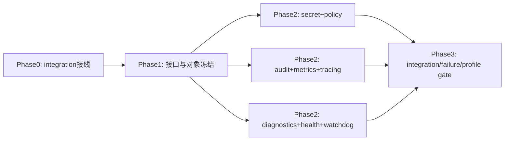

# DASALL Agent 基础设施域工程评审报告（2026-03-26）

评审范围：
1. 架构与蓝图：docs/architecture/DASSALL_Agent_architecture.md、docs/architecture/DASALL_Engineering_Blueprint.md
2. 子系统设计：docs/architecture/DASALL_infrastructure子系统详细设计.md
3. 组件设计：infra audit/config/diagnostics/health/logging/metrics/ota/plugin/policy/secret/tracing/watchdog 详细设计
4. 基础支撑：docs/architecture/DASALL_profiles模块详细设计.md、docs/architecture/platform_linux_detailed_design.md
5. TODO：15 份 infra/platform/profiles 专项 TODO
6. 补充：contracts 冻结计划、TODO 总表、验收报告

量化基线：
1. TODO 条目总数（按 XXX-TODO-### 行计）：458
2. Blocked 条目：53（11.6%）
3. 目标 TODO 文档总数：15
4. 含“代码目标+测试目标+验收命令”列的文档数：15（100%）
5. tests 顶层接线现状：已纳入 integration（tests/CMakeLists.txt）
6. infra 构建现状：已接入 tracing 模块最小真实源文件（infra/CMakeLists.txt）

---

# 1. 架构问题

结论：六大域在顶层架构中均有覆盖，但“Planning”作为独立可交付边界未在 infra 设计追溯中显式出现，表现为“认知内嵌规划”而非“规划子域契约化”。

| ID | 等级 | 类别 | 问题描述 | 证据 | 影响 | 修复建议 | Owner |
|----|------|------|----------|------|------|----------|-------|
| ARC-01 | P1 | 架构覆盖 | Planning 语义在顶层架构中存在，但在 infra 追溯链未以独立边界建模，跨域可观测规则对 Planning 阶段约束不够显式 | docs/architecture/DASSALL_Agent_architecture.md:1637, docs/architecture/DASSALL_Agent_architecture.md:1990, docs/architecture/DASALL_infrastructure子系统详细设计.md:24 | Planning 阶段故障定位和预算治理可能在跨域排障时被并入 Cognition 泛化处理 | 在 infra/tracing、infra/metrics 的 contracts 边界测试中增加 Planning stage 标签与预算观测项（不新增共享对象，仅补约束） | 架构组 + tracing/metrics 负责人 |
| ARC-02 | P2 | 职责漂移风险 | Infra 文档明确“非职责”，但多个组件 TODO 中仍存在“先实现后补设计”的冲动，需要更强门禁统一 | docs/architecture/DASALL_infrastructure子系统详细设计.md:35, docs/todos/DASALL_infrastructure_policy组件专项TODO.md:35 | 易出现越权实现与返工 | 统一执行“Blocked 先解阻”门禁，禁止绕过前置设计进入实现 | Infra PMO |

Step1 覆盖结论：
1. Cognition：覆盖（顶层明确）
2. Planning：覆盖但未独立契约化追溯（P1）
3. Memory：覆盖
4. Tool：覆盖
5. Runtime：覆盖
6. Infra：覆盖

---

# 2. 一致性问题

## 2.1 一致性检查表

| 检查项 | 核心问题 | 结果 | 证据 | 备注 |
|--------|----------|------|------|------|
| 子系统 -> 组件映射 | 是否有职责未落地 | 通过 | docs/architecture/DASALL_infrastructure子系统详细设计.md:46 | 12 个 infra 子域均有详细设计文档 |
| 组件 -> TODO 映射 | 是否存在设计未实现 | 通过 | 各组件 TODO 文档第 6 章任务表 | 映射存在，但大量 Not Started/Blocked |
| TODO -> Design 追溯 | 是否存在野任务 | 通过 | 各 TODO 表“来源依据/设计锚点”列 | 抽样未发现无锚点任务 |
| 命名一致性 | 名词/接口/模块命名是否统一 | 已修复 | docs/architecture/DASALL_infra_tracing模块详细设计.md:6, docs/todos/DASALL_infrastructure_tracing组件专项TODO.md:1 | tracer vs tracing 已统一为 tracing |
| Design -> Build 映射 | 是否有实现与测试入口 | 已修复 | infra/CMakeLists.txt:1, tests/CMakeLists.txt:1, tests/integration/CMakeLists.txt:1 | 构建入口已纳入 tracing 最小源文件，tests 顶层已接线 integration 且具备可发现 smoke 用例 |

## 2.2 额外输出

1. 缺失设计：已修复。跨组件 integration 拓扑与标签规范已集中收敛到仓库级单一真相文档 `docs/development/InfraIntegrationTopology.md`，并由任务 INF-PLAT-INT-001 统一执行。
2. 多余 TODO：未发现明显野任务或越界任务。
3. 不可实现设计（阻塞前提）：
- integration 顶层接线阻塞已解除，后续阻塞集中在组件对象模型冻结与桥接接口冻结
- secret/ota/policy 等接口实现依赖对象模型冻结（如 token 生命周期、schema 矩阵）

---

# 3. 子系统问题

| ID | 等级 | 类别 | 问题描述 | 证据 | 影响 | 修复建议 | Owner |
|----|------|------|----------|------|------|----------|-------|
| SUB-01 | P0 | 分层落地 | 子系统设计要求完整能力面，但当前 infra 构建仍是 placeholder-only | docs/architecture/DASALL_infrastructure子系统详细设计.md:75, infra/CMakeLists.txt:1 | 无法进入真实联调与门禁闭环 | Phase 0 先完成“真实源文件入图 + 占位退出条件” | infra 构建负责人 |
| SUB-02 | P0 | 测试门禁 | 子系统要求 unit/contract/integration/failure 注入，但顶层 tests 未接入 integration | docs/architecture/DASALL_infrastructure子系统详细设计.md:84, tests/CMakeLists.txt:1 | 所有 integration 相关验收无法闭环 | 新增仓库级 Integration Topology TODO（统一一次解阻） | 测试平台组 |
| SUB-03 | P1 | 错误传播与降级 | 文档中降级策略明确，但跨组件降级事件字段未形成统一断言模板 | docs/architecture/DASALL_infrastructure子系统详细设计.md:315 | 降级状态可观测一致性不足 | 提供 Infra 降级 contract 测试模板并复用到组件 | infra 质量组 |

建议重构边界：
1. 保持现有“Facade + 子域服务”边界，不改主分层。
2. 强化“跨组件门禁任务”与“组件内任务”分离，避免重复阻塞描述分散在 15 份 TODO。

---

# 4. 组件问题

| ID | 等级 | 类别 | 问题描述 | 证据 | 影响 | 修复建议 | Owner |
|----|------|------|----------|------|------|----------|-------|
| CMP-01 | P0 | 接口契约 | 多组件接口已在设计中定义，但代码未落盘（include 为空或骨架不足） | 例：docs/architecture/DASALL_infra_secret模块详细设计.md:103, docs/architecture/DASALL_infra_watchdog模块详细设计.md:81 | 下游无法稳定依赖抽象，联调被阻断 | 先做接口冻结里程碑（M1），后做实现里程碑（M2+） | 各组件负责人 |
| CMP-02 | P1 | 生命周期状态机 | OTA/secret/watchdog 设计中状态机明确，但跨组件状态协同仍依赖阻塞项解锁 | docs/architecture/DASALL_infra_OTA模块详细设计.md:111, docs/architecture/DASALL_infra_secret模块详细设计.md:519, docs/architecture/DASALL_infra_watchdog模块详细设计.md:265 | 状态跃迁测试无法全链跑通 | 在 Phase 1 先冻结状态对象与转移表，再推进集成测试 | OTA/Secret/Watchdog |
| CMP-03 | P1 | 所有权与内存安全 | Secret 明文生命周期（zeroize）方向正确，但尚未进入实现验证 | docs/architecture/DASALL_infra_secret模块详细设计.md:165, docs/architecture/DASALL_infra_secret模块详细设计.md:517 | 安全承诺停留在设计层 | 将 zeroize 测试纳入强制 gate | secret 负责人 |
| CMP-04 | P1 | 可替换性 | 插件、策略、导出器等均强调接口化，但真实适配层尚未入图 | docs/architecture/DASALL_infra_plugin模块详细设计.md, docs/todos/DASALL_infrastructure_plugin组件专项TODO.md:250 | 替换性设计难以被验证 | 优先落 I* 接口 + mock adapter + unit | plugin/policy 负责人 |

组件级可测试性缺口：
1. integration 发现性缺口（全组件共性）
2. failure injection 在文档中覆盖充分，但测试拓扑未统一接线
3. profile 差异回归测试缺乏仓库级标准模板

---

# 5. 并发问题

| ID | 等级 | 类别 | 问题描述 | 证据 | 影响 | 修复建议 | Owner |
|----|------|------|----------|------|------|----------|-------|
| CON-01 | P1 | 线程模型依赖 | watchdog/tracing 等并发语义依赖 platform 时钟/调度抽象冻结 | docs/architecture/DASALL_infra_watchdog模块详细设计.md:439, docs/architecture/platform_linux_detailed_design.md:61 | 并发实现可能反复返工 | Phase 0 先冻结 platform monotonic clock/scheduler 抽象 | platform + watchdog |
| CON-02 | P1 | 背压策略一致性 | 多组件存在 queue overflow 策略，但统一锁顺序与背压基线未集中定义 | docs/architecture/DASALL_infrastructure子系统详细设计.md:324, docs/architecture/DASALL_infra_watchdog模块详细设计.md:294 | 高负载下策略不一致导致可预期性下降 | 新增 InfraConcurrencyPolicy.md，统一 block/overrun_oldest 选择准则 | infra 架构组 |
| CON-03 | P2 | 死锁前置防护 | 文档强调异步与降级，但未看到跨组件锁顺序规约门禁 | 多组件设计 6.x 并发章节 | 潜在死锁风险后移到实现期暴露 | 在 unit 中加锁顺序断言与 TSAN pipeline（后续） | 质量工程组 |

必须新增并发测试场景：
1. watchdog 心跳风暴 + 事件总线不可用（降级路径）
2. audit 主写失败 + fallback 再失败（二级故障）
3. tracing force_flush 与 shutdown 并发调用
4. secret lease 过期回收与并发读取冲突
5. ota confirm timeout 与 rollback 并发触发

---

# 6. 扩展性问题

扩展性评分：3/5

评分依据：
1. 优势：组件设计普遍提供接口化、版本策略、迁移与回退表，扩展方向正确。
2. 短板：实现入口与 integration 门禁未打通，导致“可扩展”尚未从设计转化为可运行证据。

| ID | 等级 | 类别 | 问题描述 | 证据 | 影响 | 修复建议 | Owner |
|----|------|------|----------|------|------|----------|-------|
| EXT-01 | P1 | 插件化 | plugin 的 ABI/签名兼容矩阵仍是阻塞前提 | docs/todos/DASALL_infrastructure_plugin组件专项TODO.md:250 | 动态扩展能力无法实证 | 先冻结 ABI 兼容矩阵，再开装载路径 | plugin 负责人 |
| EXT-02 | P1 | 多 Provider | secret/ota 的 backend/provider 设计存在但多后端未入图 | docs/architecture/DASALL_infra_secret模块详细设计.md:461, docs/architecture/DASALL_infra_OTA模块详细设计.md:525 | Provider 切换风险后置 | 先落 mock/file 统一接口，KMS/远程适配后置 | secret/ota |
| EXT-03 | P2 | 版本迁移 | contracts 兼容策略清晰，但组件对迁移脚本/灰度证据模板不统一 | docs/todos/contracts-freeze/deliverables/DASALL_contracts交付验收报告-2026-03-23.md:372 | 演进成本增加 | 统一组件迁移模板并纳入 gate | 架构治理组 |

---

# 7. TODO 问题

## 7.1 合规性结论（核心）

1. 三件套结构完整率：100%（15/15 目标 TODO 文档均含“代码目标/测试目标/验收命令”列）
2. TODO 条目执行状态：Blocked 占比 11.6%（53/458），主要集中在 integration 拓扑与前置模型冻结
3. 追溯性：总体良好，未发现“无来源依据/无设计锚点”的野任务

## 7.2 不合格 TODO

不合格 TODO：无（按“三件套字段完整性”判定）。

## 7.3 缺失 TODO（设计有要求但无任务）

| ID | 等级 | 类别 | 问题描述 | 证据 | 影响 | 修复建议 | Owner |
|----|------|------|----------|------|------|----------|-------|
| TD-MIS-01 | P1 | 跨组件治理 | 缺少“仓库级 integration 顶层接线”单一主任务，当前分散在多个组件 Blocked 条目中 | docs/todos/DASALL_infrastructure子系统专项TODO.md:226, tests/CMakeLists.txt:1 | 重复阻塞、协同成本高 | 新增仓库级任务 INF-PLAT-INT-001，统一解阻后批量解除组件 Blocked | 测试平台组 |
| TD-MIS-02 | P1 | 并发策略 | 缺少跨组件统一锁顺序/背压策略任务 | 多组件仅局部描述 | 并发一致性风险 | 新增 INF-CONCUR-001 标准任务 | infra 架构组 |

## 7.4 建议新增 TODO（原子粒度，三件套）

| TODO ID | 任务描述 | 前置依赖 | 代码目标 | 测试目标 | 验收命令 | 优先级 |
|---------|----------|----------|----------|----------|----------|--------|
| INF-PLAT-INT-001 | 顶层接入 integration 子目录与标签规范 | 无 | tests/CMakeLists.txt 增加 add_subdirectory(integration) 与标签约定 | ctest -N 可发现 integration 用例 | cmake -S . -B build-ci -G Ninja && ctest --test-dir build-ci -N | High |
| INF-CONCUR-001 | 冻结并发背压与锁顺序规范 | INF-PLAT-INT-001 | docs/development 下新增并发规范文档，组件引用该规范 | 新增规范校验脚本或静态检查清单 | rg -n "overflow_policy|lock order|backpressure" docs | High |
| INF-GATE-UNIFY-001 | 统一 unit/contract/integration/failure gate 模板 | INF-PLAT-INT-001 | scripts/ci 新增 infra gate 聚合脚本 | Gate 脚本可一键执行并输出分类结果 | bash scripts/ci/infra_gate.sh | High |
| INF-NAME-001 | 统一 tracer/tracing 命名并回链 | 无 | 统一 docs/architecture 与 docs/todos 组件命名 | 命名一致性扫描通过 | rg -n "tracer|tracing" docs/architecture docs/todos | Medium |

## 7.5 Design -> Build 映射表（评审抽样）

| 设计项 | 组件 | TODO ID | 代码目标 | 测试目标 | 验收命令 |
|--------|------|---------|----------|----------|----------|
| 审计独立链路与兜底 | audit | AUD-TODO-009/010/011 | infra/src/audit/*.cpp | AuditServiceFallbackTest | cmake --build build-ci --target dasall_infra && ctest --test-dir build-ci -R AuditServiceFallbackTest |
| Secret 对象与接口冻结 | secret | SEC-TODO-001/002/003 | infra/include/secret/*.h | SecretTypeBoundaryTest/SecretInterfaceCompileTest | cmake --build build-ci --target dasall_infra && ctest --test-dir build-ci -R "SecretTypeBoundaryTest|SecretInterfaceCompileTest" |
| OTA 预检与验签解耦 | ota | OTA-TODO-006/007 | infra/src/ota/OTAPrecheckService.cpp, PackageVerifier.cpp | OTAPrecheckServiceTest/OTAPackageVerifierTest | ctest --test-dir build-ci -R "OTAPrecheckServiceTest|OTAPackageVerifierTest" |
| Watchdog 超时证据与审计闭环 | watchdog | WDG-TODO-005 | infra/src/watchdog/TimeoutEventPublisher.cpp, WatchdogAuditBridge.cpp | WatchdogTimeoutFlowIntegrationTest | ctest --test-dir build-ci -R WatchdogTimeoutFlowIntegrationTest |
| Policy 快照与回滚 | policy | POL-TODO-013/015 | infra/src/policy/PolicySnapshotStore.cpp, SecurityPolicyManager.cpp | unit + contract 组合 | ctest --test-dir build-ci --output-on-failure -L "unit|contract" |
| Profile 双平面治理 | profiles | PRF 系列任务 | profiles/*/profile.cmake, runtime_policy.yaml | profile 兼容性/发现性测试 | ctest --test-dir build-ci -L "unit|contract" |
| Platform 抽象能力切片 | platform_linux | PLAT 系列任务 | platform/include + platform/src/linux | 平台单测 + profile 兼容测试 | cmake --build build-ci --target dasall_platform |

---

# 8. 执行顺序

## 8.1 Phase 划分

| Phase | 目标 | 输入条件 | 输出/退出条件 | 关键任务 | 并行任务 |
|-------|------|----------|---------------|----------|----------|
| 0（阻塞清理） | 清除全局阻塞与命名漂移 | 当前文档与 TODO 基线齐备 | integration 顶层接线完成；命名统一；并发规范冻结 | INF-PLAT-INT-001, INF-NAME-001 | INF-CONCUR-001, INF-GATE-UNIFY-001 |
| 1（基础支撑） | 冻结跨组件接口与对象 | Phase 0 通过 | infra/platform/profiles 的核心接口与对象可编译且单测可发现 | INF-TODO-001~012, 平台与 profiles 接口冻结任务 | audit/config/metrics/tracing 的对象冻结并行 |
| 2（核心链路） | 打通 secret/policy/diagnostics/watchdog/ota 主链路 | Phase 1 通过 | 关键链路至少 unit+contract 全绿，部分 integration 可执行 | 各组件 M2/M3 主链路任务 | logging/metrics/tracing 桥接任务并行 |
| 3（增强与收口） | 完成 integration/failure/profile 回归与证据收口 | Phase 2 通过 | Gate 脚本稳定、关键路径验收通过、风险回退可执行 | 组件“回写质量门”任务 | 压测与灰度验证并行 |

## 8.2 依赖链

1. INF-PLAT-INT-001 -> 组件 integration 解阻（AUD/CFG/DIA/HLT/MET/OTA/POL/SEC/TRC/WDG）
2. Platform 抽象冻结 -> watchdog/tracing 并发实现
3. Secret 对象冻结 -> OTA 验签 trust anchor 接入
4. Policy schema 冻结 -> policy resolver/projector/manager 实现
5. Core 实现完成 -> integration/failure/profile gate

## 8.3 Critical Path

Critical Path：
1. Phase0 integration 顶层接线
2. Phase1 核心接口冻结（infra + platform + profiles）
3. Phase2 secret + ota + policy + watchdog 主链
4. Phase3 integration/failure gate 与证据收口

## 8.4 Parallel Lanes

1. Lane A：audit/logging/metrics/tracing 可观测链路
2. Lane B：secret/policy 安全与策略链路
3. Lane C：diagnostics/health/watchdog 运行健康链路
4. Lane D：ota/plugin 平台演进链路
5. Lane E：platform_linux/profiles 支撑链路

## 8.5 Mermaid 依赖图

---

# 9. 风险评估

| 风险类别 | 触发条件 | 影响 | 监控信号 | 缓解措施 |
|----------|----------|------|----------|----------|
| 架构风险 | 在阻塞未解时直接推进实现 | 边界漂移、返工 | Blocked 条目长期不降，跨组件接口反复改 | 执行 Phase Gate，Blocked 不可越过 |
| 并发风险 | platform 抽象未冻结即并发实现 | 死锁/竞态/假恢复 | timeout 抖动、队列积压、线程 lag 指标异常 | 先冻结时钟/调度抽象，补并发注入测试 |
| 工程风险 | tests 顶层 integration 继续缺失 | 集成验收长期不可执行 | ctest -N 无 integration 用例 | 先完成 INF-PLAT-INT-001 |
| 扩展风险 | ABI/schema 未冻结就扩展插件/策略/OTA | 兼容性破坏、灰度失败 | breaking 讨论频繁、回滚成本高 | 接口冻结优先，v1/v2 并存迁移策略 |

---

# 10. 结论

结论：不通过（当前不可进入“全面开发阶段”，仅可进入“按 Phase 0/1 的受控开发”）

量化依据：
1. 准入门槛“无 P0 未闭环问题”：不满足（infra placeholder-only、integration 顶层未接线）。
2. Design -> Component -> TODO -> Build/Test 可追溯：基本满足（映射完整），但 Build/Test 落地入口未完全满足。
3. TODO 三件套完整率 >=95%：满足（15/15 文档含三件套，100%）。
4. 可执行关键路径与验收命令集：部分满足（命令齐备，但受阻塞前置影响执行闭环）。

P0 问题：
1. SUB-01：infra 仍 placeholder-only，尚未进入真实能力入图。
2. SUB-02：tests 顶层未接入 integration，导致多组件关键任务长期 Blocked。
3. CMP-01：核心接口与对象尚未在代码层批量冻结落地。

P1 建议：
1. 建立仓库级 integration 解阻单任务，替代组件内重复阻塞描述。
2. 统一 tracer/tracing 命名。
3. 建立跨组件并发策略与 gate 模板。

P2 优化：
1. 将 profile 差异回归、failure injection 与灰度证据模板标准化。
2. 收敛组件迁移文档格式，提升扩展演进可控性。

最终准入建议：
1. 允许进入 Phase 0（阻塞清理）与 Phase 1（基础冻结）。
2. 禁止跳过 Phase Gate 直接进入 Phase 2/3。
