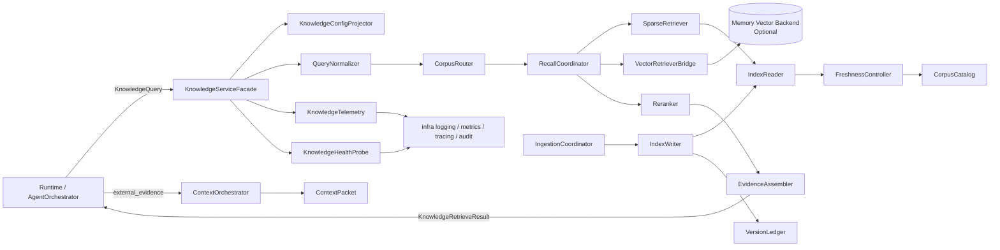
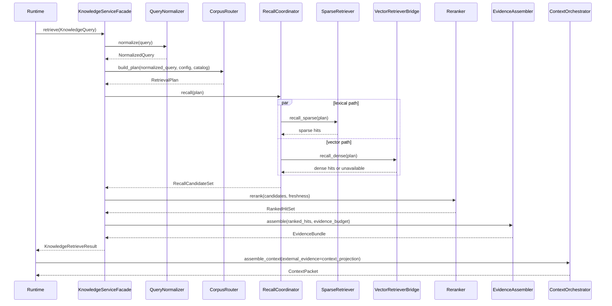
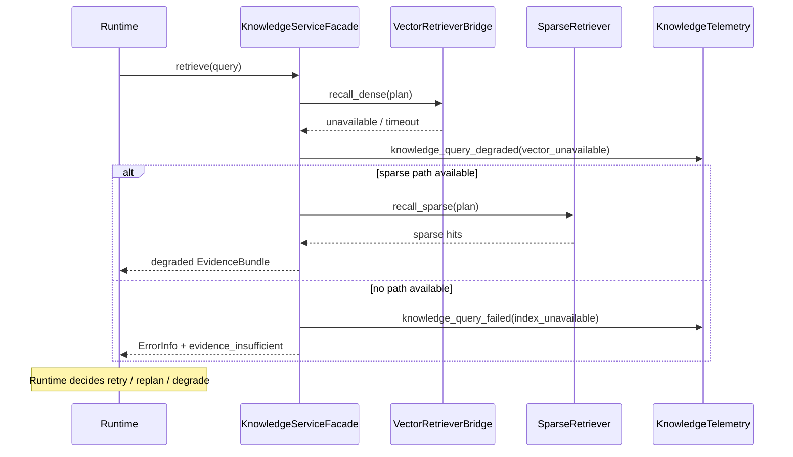
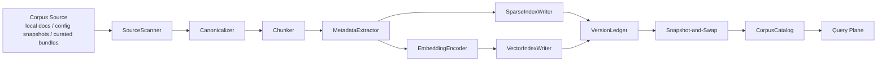
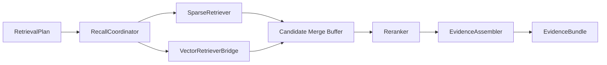
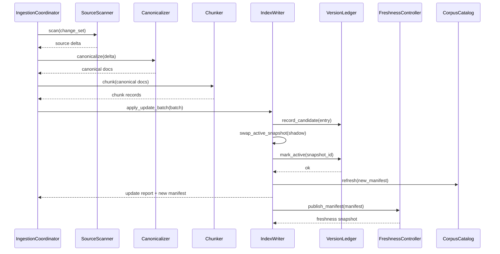

# DASALL Knowledge 子系统详细设计（Detailed Design）

版本：v1.1  
日期：2026-04-15  
阶段：Detailed Design  
适用模块：knowledge/

## 1. 模块概览

### 1.1 目标与定位

Knowledge 子系统是 DASALL 在 Layer 4 Execution & Collaboration Layer 的知识检索与证据组织落点，对应工程目录为 knowledge/。它的目标不是直接生成最终回答，也不是把检索逻辑隐藏成一条不受控的“第二认知链路”，而是在不改变 Runtime 主控权、Memory 上下文权和 LLM Prompt 装配权的前提下，提供以下六类稳定能力：

1. 对运行时发起的知识查询执行确定性的查询归一化、语料路由、召回、重排和证据组装。
2. 将原始检索命中压缩为可被 Runtime 和 ContextOrchestrator 消费的 EvidenceBundle，而不是暴露未治理的数据源对象。
3. 维护本地语料索引、版本账本、分块元数据和索引新鲜度状态，支持增量更新、触发更新和全量重建。
4. 在 `memory_vector` 启用时通过窄接口复用向量后端；在 `memory_vector` 关闭时保持 lexical-only 可运行，不把向量能力变成硬依赖。
5. 以日志、指标、追踪、审计和健康探针方式暴露知识链路状态，使检索失败、退化和索引漂移都可观测。
6. 为后续 Build 阶段提供可以直接落盘到 include/src/tests 的工程拆分，而不是停留在概念层。

Knowledge 子系统不是：

1. 最终回答生成器。最终回答构造仍归 Cognition/ResponseBuilder 和 LLM 子系统。
2. ContextPacket 生产者。ContextPacket 的语义装配权仍归 memory/ContextOrchestrator。
3. Prompt 组装器。Knowledge 不得生成 rendered prompt、final messages 或 provider payload。
4. 第二个 Memory。Knowledge 负责外部知识证据，不负责 Session/Turn/Summary/Fact/Experience 的持久化语义。
5. 恢复裁定器。Knowledge 只能报告证据不足、索引异常、检索退化，不决定 retry、replan、degrade 或 abort。
6. 独立搜索网关主控。它可以封装检索实现，但不拥有请求生命周期、用户交互和多 Agent 调度权。

来源依据：

1. `docs/architecture/DASALL_Agent_architecture.md` 第 4.2、4.6、5.3、5.9、6.2、7.4 节。
2. `docs/architecture/DASALL_架构设计文档.md` 第 4.9 节。
3. `docs/architecture/DASALL_Engineering_Blueprint.md` 第 3.8 节。
4. `docs/adr/ADR-005-architecture-review-baseline.md`。
5. `docs/adr/ADR-006-context-orchestrator-vs-prompt-composer.md`。
6. `docs/todos/contracts/deliverables/WP05-T011-接口候选清单.md` 与 `WP05-T012-接口准入评估单.md`。

### 1.2 边界定义

| 维度 | 内容 | 边界说明 |
|---|---|---|
| 上游主消费者 | runtime | Runtime 决定何时发起检索、是否把结果送入 ContextOrchestrator、是否在失败后重试或降级；Knowledge 不自启轮次 |
| 间接消费者 | memory、cognition | memory 只消费 Runtime 交接的 evidence projection；cognition 只通过 ContextPacket 或 Runtime 折叠结果消费知识证据 |
| 同层协作 | memory、tools、multi_agent | 允许通过 Runtime 主链路协作；不允许 Knowledge 直接调用 tools 执行器、也不允许 memory 直接依赖 Knowledge 实现类 |
| 下游依赖 | contracts、infra、可选 memory/vector backend、本地语料与索引库 | 共享错误与上下文投影复用 contracts；可观测与配置复用 infra；向量后端仅通过窄桥接接口复用 |
| 禁止依赖 | llm 实现、cognition 实现、apps 入口、runtime 恢复执行细节 | 防止 Knowledge 内部引入 LLM 重写/重排、形成第二上下文中心或抢占恢复控制 |

### 1.3 设计范围

纳入范围：

1. Knowledge 子系统的职责边界、输入输出、依赖方向与调用关系。
2. Runtime-facing 检索接口、module-local supporting types、查询平面、索引平面、证据组装平面和可观测平面。
3. 与 contracts、memory、profiles、infra 的对齐方式，以及对 `ContextPacket.retrieval_evidence` 的投影规则。
4. 异常语义、退化路径、并发策略、配置策略、测试矩阵和 Design -> Build 映射。
5. 目录落盘建议、实施里程碑、质量门、阻塞项与回退策略。

不纳入范围：

1. 改写已冻结 ADR/SSOT 结论。
2. 把 `KnowledgeQuery`、`EvidenceSlice`、`EvidenceBundle` 等 module-local 对象提前推进到 contracts。
3. 把 LLM 驱动的 query rewrite、response synthesis、prompt compression 内嵌到 Knowledge 模块。
4. 远程微服务化搜索平台、分布式索引集群和跨节点一致性协议的实现细节。
5. 将 Memory 的 Session/Fact/Experience 语义重新定义为 Knowledge 对象。

### 1.4 来源依据与现状证据

| 类别 | 证据 | 对本设计的直接约束 |
|---|---|---|
| 系统架构 | `docs/architecture/DASALL_Agent_architecture.md` 第 5.9 节 | Knowledge 的职责固定为查询理解、召回、重排、证据组装和索引新鲜度治理 |
| 工程蓝图 | `docs/architecture/DASALL_Engineering_Blueprint.md` 第 3.8 节 | knowledge/ 位于 Layer 4，依赖 contracts、memory（vector backend）、infra，不依赖 cognition/llm |
| 边界 ADR | `docs/adr/ADR-006-context-orchestrator-vs-prompt-composer.md` | Knowledge 不拥有 ContextPacket 和 Prompt 装配权，不能越界到上下文或消息渲染 |
| contracts 准入 | `contracts/include/boundary/InterfaceCatalog.h`、`WP05-T012-接口准入评估单.md` | `IKnowledgeService` 当前是 `AwaitingSupportingContracts`，接口必须先落在 knowledge/include |
| Context 投影 | `contracts/include/context/ContextPacket.h` | 当前共享证据投影面只有 `retrieval_evidence: vector<string>`，结构化证据仍需 module-local |
| profile 约束 | `docs/architecture/DASALL_profiles模块详细设计.md` 与 `profiles/*/runtime_policy.yaml` | 知识链路必须复用 `enabled_modules.knowledge`、`memory_vector`、`token_budget_policy`、`capability_cache_policy` |
| 工程现状 | `knowledge/include/`、`knowledge/src/{config,evidence,facade,health,index,ingest,query,rerank,retrieve}`、`tests/unit/knowledge/CMakeLists.txt` | 模块已形成 public include、检索/索引/观测主链和可编译测试入口，`placeholder.cpp` 仅剩骨架占位，不再代表主实现状态 |
| 交付现状 | `docs/todos/knowledge/DASALL_knowledge子系统专项TODO.md`、`docs/todos/knowledge/deliverables/KNO-TODO-001..033*.md`、`docs/worklog/DASALL_开发执行记录.md` | 知识子系统已具备专项 TODO、deliverables、worklog 与 Gate 证据链，设计与 Build 已进入闭环推进阶段 |

现状结论必须明确为两句话：

1. architecture ready：Knowledge 的系统级职责、层级位置和相邻边界已经在架构/蓝图/ADR 中明确。
2. implementation baseline landed：knowledge/ 已落盘 public headers、检索/索引/证据/观测主链、unit/integration 测试与专项交付证据；当前重点已从“占位实现”转向“质量门稳定、语义收敛与文档同步”。

## 2. 约束清单

### 2.1 Must / Should / Must-Not 约束表

| Constraint ID | 来源 | 类型 | 约束描述 | 影响范围 |
|---|---|---|---|---|
| KNO-C001 | `DASALL_Agent_architecture.md` 5.9；`DASALL_架构设计文档.md` 4.9 | Must | Knowledge 必须承担查询理解、召回、重排、证据组装和索引新鲜度治理 | 总体职责 |
| KNO-C002 | `DASALL_架构设计文档.md` 4.9.3 | Must | Knowledge 输出必须是受治理的 `RetrievalResult` / `EvidenceBundle` 语义，而不是原始数据源对象、数据库行或全文文件句柄 | 输出边界 |
| KNO-C003 | ADR-006；`ContextPacket.h` | Must-Not | Knowledge 不得生成 `ContextPacket`、`rendered_prompt`、`final_messages` 或 provider payload | memory/llm 边界 |
| KNO-C004 | `DASALL_Engineering_Blueprint.md` 3.8；`DASALL_llm子系统详细设计.md` 2.1 | Must-Not | Knowledge 不得依赖 llm 或 cognition 的实现类，也不得在内部调用 LLM 做 query rewrite、rerank 或 evidence synthesis | 依赖方向 |
| KNO-C005 | `InterfaceCatalog.h`；`WP05-T012-接口准入评估单.md` | Must | `IKnowledgeService` 先落在 knowledge/include，`KnowledgeQuery`/`KnowledgeRetrieveResult`/`EvidenceSlice` 等 supporting types 保持 module-local | contracts 策略 |
| KNO-C006 | `DASALL_memory子系统详细设计.md`；`InterfaceCatalog.h` | Must | Runtime 是 Knowledge 的首要消费者；Knowledge 结果必须先回到 Runtime，再由 Runtime 交给 ContextOrchestrator 或后续链路 | 调用关系 |
| KNO-C007 | `ContextPacket.h`；`WP03-T010-ContextPacket语义说明.md` | Must | v1 共享证据投影必须收敛到 `ContextPacket.retrieval_evidence` 的 `vector<string>`；结构化 `EvidenceSlice` 不得反向扩写 contracts | contracts 对齐 |
| KNO-C008 | `DASALL_Engineering_Blueprint.md` 3.8；`DASALL_profiles模块详细设计.md` | Must | 当 `enabled_modules.knowledge=true` 且 `memory_vector=false` 时，Knowledge 必须支持 lexical-only 退化模式，不得强依赖向量链路 | profile 兼容 |
| KNO-C009 | `DASALL_profiles模块详细设计.md` 5.1/6.6；`profiles/*/runtime_policy.yaml` | Must | Knowledge 只能消费既有的 `enabled_modules`、`runtime_budget`、`token_budget_policy`、`capability_cache_policy`、`degrade_policy` 等策略域，不新增 schema v1 顶层逻辑域 | 配置策略 |
| KNO-C010 | ADR-005 | Must-Not | 在 supporting contracts 未冻结前，不得把 `KnowledgeQuery`、`RetrievalPlan`、`EvidenceBundle` 等高频变化对象升格为共享 contracts | contracts 演进 |
| KNO-C011 | ADR-007 | Must-Not | Knowledge 可以报告证据不足、索引不可用、退化结果，但不能决定 retry、replan、degrade、abort_safe 或补偿执行 | 恢复边界 |
| KNO-C012 | ADR-008 | Must-Not | Knowledge 不得形成独立调度环、子任务分发中心或第二主循环 | 主控边界 |
| KNO-C013 | `InfraConcurrencyPolicy.md` | Must | 若引入缓存、更新队列或后台刷新，必须显式声明 overflow_policy、backpressure、lock order，且不得持 L2 锁执行 I/O | 并发设计 |
| KNO-C014 | `InfraIntegrationTopology.md` | Must | Knowledge 进入核心链路后，至少补齐 1 个 `integration` 标签的 smoke 用例，并可被 `ctest -N` 发现 | 集成测试 |
| KNO-C015 | `DASALL_工程协作与编码规范.md` 3.6/3.7 | Must | 模块边界不得吞错；新增 public interface 必须同步补 unit 或 integration 测试 | 错误处理、测试 |
| KNO-C016 | Azure Advanced RAG；Azure Hybrid Search；Haystack Retrievers | Should | 优先采用混合召回、元数据过滤、后召回重排、分层索引和增量更新，而不是单一路径检索 | 行业实践 |
| KNO-C017 | Azure Advanced RAG；LlamaIndex VectorStoreIndex | Should | 索引构建宜采用 ingestion pipeline、chunk metadata、批量写入、document versioning 和 selective refresh | 索引治理 |
| KNO-C018 | LlamaIndex Response Synthesizer | Should | 证据组装应与回答生成解耦，Knowledge 只输出 evidence，不承担 response synthesis | 回答边界 |
| KNO-C019 | OWASP LLM Top 10；Azure AI Content Safety | Must | `SourceScanner` 只接受 `CorpusCatalog` 中注册且 `trust_level ≥ Trusted` 的语料源；未注册或 quarantine 语料不得进入 ingest 管线，防止 corpus 投毒与间接 prompt injection | 语料安全 |

### 2.2 约束抽取结论

Must：

1. Knowledge 必须是 Runtime 可调用的受治理检索子系统，而不是直接通向 LLM 的隐式 RAG 插件。
2. 当前 contracts 只允许 Knowledge 投影到 `ContextPacket.retrieval_evidence` 和 `ErrorInfo`，不允许提前冻结 retrieval supporting objects。
3. Knowledge 必须在 vector 可用和 vector 不可用两种 profile 路径下都可工作。
4. 退化、异常、索引漂移和缓存过期都必须可观测，并通过 Runtime 决定是否继续主链路。

Should：

1. 混合召回优先于单一路径召回。
2. Ingestion 与 Query 两条平面应拆开，避免 KnowledgeService 演化为 God Object。
3. 新鲜度治理和证据预算治理应从第一轮 Build 就进入设计与测试，而不是实现后补票。

Must-Not：

1. 不把 Knowledge 做成 llm 内部子功能或 memory 内部子功能。
2. 不把 module-local retrieval 对象写入 contracts 层。
3. 不让 Knowledge 直接决定恢复、主控或最终回答。

## 3. 现状与缺口

### 3.1 当前实现状态

| 观察项 | 当前状态 | 证据 | 结论 |
|---|---|---|---|
| knowledge 构建入口 | 已存在 | `knowledge/CMakeLists.txt` | 已有 `dasall_knowledge` 静态库目标 |
| knowledge 源码实现 | 已落地 | `knowledge/src/{config,evidence,facade,health,index,ingest,query,rerank,retrieve}`、`knowledge/src/KnowledgeBuildSkeleton.cpp` | 已具备真实检索逻辑、索引治理与证据组装主链，`placeholder.cpp` 不再代表实现成熟度 |
| knowledge 公共头文件 | 已落地 | `knowledge/include/IKnowledgeService.h`、`knowledge/include/KnowledgeTypes.h`、`knowledge/include/KnowledgeErrors.h` | `IKnowledgeService` 与 module-local supporting types 已按模块边界落盘 |
| Query plane | 已落地 | `knowledge/src/query/`、`knowledge/src/retrieve/`、`knowledge/src/rerank/` | 已实现查询归一化、语料路由、sparse/dense recall 协调与重排组件 |
| Ingestion / Index plane | 已落地 | `knowledge/src/ingest/`、`knowledge/src/index/` | 已实现文档扫描、规范化、分块、索引读写、版本账本与 refresh 主链 |
| Vector backend bridge | 已落地 | `knowledge/include/retrieve/IVectorRecallStore.h`、`knowledge/src/retrieve/VectorRetrieverBridge.cpp` | 向量链路已通过窄接口桥接复用，不强绑 memory/llm 实现 |
| 可观测与健康 | 已落地 | `knowledge/src/health/KnowledgeTelemetry.cpp`、`knowledge/src/health/KnowledgeHealthProbe.cpp` | 检索退化、健康快照与观测桥已接线，后续重点转为质量门稳定 |
| unit tests | 已落地 | `tests/unit/knowledge/*.cpp`、`tests/unit/knowledge/CMakeLists.txt` | 已具备 query/router/retrieval/evidence/index/health 等单测矩阵，聚合健康需持续守护 |
| integration tests | 已落地 | `tests/integration/knowledge/*.cpp`、`tests/integration/knowledge/CMakeLists.txt` | 已具备 smoke、failure-degrade、profile、quality regression、refresh loop 等集成用例 |
| contracts 支撑对象 | 按设计保持 module-local | `knowledge/include/IKnowledgeService.h`、`knowledge/include/KnowledgeTypes.h` | supporting objects 未上升到 contracts，当前实现与模块边界约束一致 |
| 共享投影面 | 已存在 | `contracts/include/context/ContextPacket.h` | 当前唯一共享证据面是 `retrieval_evidence: vector<string>` |
| profile 开关 | 已存在 | `profiles/desktop_full/runtime_policy.yaml`、`edge_minimal/runtime_policy.yaml` | `knowledge` 与 `memory_vector` 已具备 enable/disable 基线 |
| 专项设计收敛 | 已落地 | `docs/todos/knowledge/DASALL_knowledge子系统专项TODO.md`、`docs/todos/knowledge/deliverables/*.md`、`docs/worklog/DASALL_开发执行记录.md` | 已形成专项 TODO、交付物、质量门与执行记录闭环 |

### 3.2 现状-目标差距表

| 目标能力 | 当前状态 | 关键差距 | 风险等级 | 优先级 |
|---|---|---|---|---|
| Runtime-facing 检索接口 | 已落地 | 重点转为 facade 语义收敛、错误映射与边界回归测试 | Medium | P0 |
| lexical 检索最小闭环 | 已落地 | 重点转为 retrieval regression gate、语言/过滤语义与快照稳定性 | Medium | P0 |
| vector/hybrid 检索 | bridge/seam 已落地，production 默认 lexical-only | concrete vector backend、production evidence 与 dense rollout 未闭合；hybrid 当前只保留为 future seam / degrade 设计 | Medium | P1 |
| 证据组装 | 已落地 | 重点转为 projection 预算、coverage notes 与跨模块投影一致性 | Medium | P1 |
| 索引新鲜度治理 | 已落地 | 重点转为 refresh loop 稳定性、聚合单测健康与回滚语义守护 | Medium | P1 |
| profile 兼容退化 | 已落地 | 需持续验证 lexical-only fallback 与 profile 投影一致性 | Medium | P1 |
| 异常和退化观测 | 已落地 | 需继续扩大 aggregate gate 稳定性和 CI 噪声隔离 | Medium | P1 |
| 单元测试门禁 | 已落地但聚合待稳 | 需持续保持知识单测聚合可编译、可发现、可复现 | High | P0 |
| 集成测试门禁 | 已落地 | 需持续把 smoke / degrade / quality regression 与聚合 CI 分层治理 | Medium | P0 |
| TODO / deliverables 证据 | 已落地 | 需保持 TODO、deliverable、worklog 与实现现状同步 | Low | P1 |

### 3.3 风险冲突识别

| 冲突类型 | 描述 | 若不处理的后果 |
|---|---|---|
| 边界冲突 | Knowledge 若直接装配 ContextPacket 或 Prompt，会与 ADR-006 冲突 | memory/llm/knowledge 三方职责混层 |
| 依赖冲突 | Knowledge 若内部调用 llm 进行 query rewrite/rerank，会破坏蓝图依赖方向 | 运行成本、测试和故障域不可控 |
| contracts 冲突 | 若把 `EvidenceSlice` 直接推进 contracts，会提前冻结尚未成熟的 supporting objects | 跨模块兼容成本放大 |
| 主控冲突 | 若 Knowledge 内部自带 orchestration/retry loop | 侵蚀 Runtime/RecoveryManager 职责 |
| 索引所有权冲突 | memory/vector backend 与 knowledge/query plane 的边界未收敛 | 后续 Build 接口可能反复修改 |
| profile 冲突 | 若 knowledge 强依赖 vector，会让 edge_minimal/factory_test 无法裁剪 | 破坏 Build + Runtime 双平面策略 |

### 3.4 现状结论

当前最合理的推进方式不是把 Knowledge 继续描述为“待实现模块”，而是在既有落地基线上继续做收口：

1. 以已落盘的 `knowledge/include` public surface 与 `knowledge/src/*` 主链为基础，持续收敛 facade 语义、错误映射与边界守卫。
2. 以 lexical-only production 基线 + hybrid seam tests 为基线，继续稳定 retrieval quality gate、refresh loop 与 profile compatibility。
3. 以 Runtime 主调 + evidence projection handoff 为既定边界，优先修复质量门、文档同步与聚合测试健康，而不是重开一轮 from-scratch 设计。
4. 2026-05-18 起，`memory_vector=true` 在 v1 production 中只表示 capability intent，不再自动推导为 `Hybrid` 默认模式；只有 concrete vector backend、package evidence 与 rollout 条件闭合后，production 口径才可升级。

## 4. 候选方案对比

### 4.1 行业方案调研摘要

| 参考方向 | 提炼出的稳定结论 | 对 DASALL Knowledge 的启发 |
|---|---|---|
| Azure Advanced RAG | 应把 ingestion、query processing、post-retrieval processing、evaluation 分层；支持 hierarchical indexes、query router、incremental updates、versioning | Knowledge 应拆成 Query Plane 与 Index Plane，并显式维护版本与新鲜度 |
| Azure Hybrid Search | 向量检索与全文检索可以并行执行，再由 RRF 等策略统一排序；metadata filter 和 post-filter 很关键 | Knowledge 应优先支持 lexical + vector 混合召回，同时保留过滤和后处理 |
| Haystack Retrievers | hybrid retrieval、metadata filtering、multi-query、sentence-window 是通用检索增强手段；db-side hybrid 与 pipeline-side hybrid 各有取舍 | DASALL 更适合先做 pipeline-side hybrid，以保留 profile 退化与可测试性 |
| LlamaIndex VectorStoreIndex | ingestion pipeline、metadata extraction、batch insert、document update/refresh 是索引工程化的核心 | Knowledge 需要独立的 IngestionCoordinator 和 IndexManager，而不是在 retrieve() 中临时拼装 |
| LlamaIndex Response Synthesizer | 检索后合成应是独立组件，且不必与 retriever 同域 | Knowledge 只输出 EvidenceBundle，不承担最终回答合成 |

### 4.1.1 RAG 框架系统级对标矩阵

| 维度 | LangChain RAG | LlamaIndex | Haystack | Vectara | Azure AI Search RAG | DASALL Knowledge |
|---|---|---|---|---|---|---|
| ingestion pipeline | Document Loader + Splitter + Embedder，可组合但非强制 pipeline | 内置 IngestionPipeline，支持 metadata extraction 与 batch insert | Indexing Pipeline + Preprocessor + DocumentStore | 全托管 upload → chunk → embed → index | 内置 Skillset + Indexer + Chunking Skill | IngestionCoordinator + SourceScanner + Canonicalizer + Chunker，显式 pipeline |
| hybrid retrieval | EnsembleRetriever（手动组合） | VectorStoreIndex + KeywordTableIndex 需手动 compose | Hybrid retrieval 原生支持（JoinDocuments node） | 内置混合检索（neural + keyword） | Hybrid Search 原生支持 + semantic ranking | RecallCoordinator 统一 sparse/dense 双 lane，pipeline-side hybrid |
| freshness / versioning | 无内置版本管理 | `document.doc_id` 支持 refresh/upsert | 无内置 versioning | 全托管更新 | Indexer run schedule + change tracking | VersionLedger + FreshnessController + snapshot-and-swap |
| evaluation / quality | 依赖 LangSmith 或 RAGAS 外部框架 | 内置 ResponseEvaluator / FaithfulnessEvaluator | Haystack evaluation module | Console analytics | Azure AI Evaluation SDK | golden set + MRR/NDCG@k/Recall@k 回归测试 |
| profile / 裁剪 | 无原生 profile 概念 | 运行时选型由应用层控制 | Pipeline DAG 可裁剪 | SaaS 无裁剪需求 | SKU tier 控制 | profile 驱动 lexical-only/hybrid/disabled 三态裁剪 |
| 恢复 / 退化 | 应用层自行处理 | 回退策略自行实现 | Pipeline 异常节点可旁路 | 全托管 HA | 服务级 SLA | 知识子系统报告退化，Runtime 裁定恢复（ADR-007） |
| observability | LangSmith callbacks | callback manager + 事件系统 | Pipeline tracing | Console dashboard | Azure Monitor integration | KnowledgeTelemetry 统一日志/指标/追踪/审计 |

**对标结论**：DASALL Knowledge 在 freshness/versioning 和 profile 裁剪方面比主流框架更完备（因嵌入式长稳需求驱动），但在 evaluation 工具链和 query rewrite 能力上刻意保持 llm-free 约束，需在后续版本中评估是否通过 Runtime 间接引入。

### 4.2 候选方案 A：单体单索引同步方案

设计思路：

1. 以单个 `KnowledgeManager` 同时承担 query normalize、召回、重排、证据组装、索引刷新。
2. 只维护一套索引结构，优先做最短调用链。
3. 所有检索流程都在同步调用栈中完成，不区分 query plane 和 index plane。

组件结构：

1. `KnowledgeManager`
2. `SingleRetriever`
3. `IndexStore`

优点：

1. 初始代码量最小。
2. 便于快速替换 placeholder 并打通最小 demo。

风险：

1. 极易演化为 God Object，后续很难稳定拆出索引治理和证据治理。
2. lexical-only、hybrid、freshness、degrade、observability 会被混在一起，测试颗粒度差。
3. 一旦引入 vector bridge、增量更新和 health probe，类职责会迅速失控。

与 DASALL 约束匹配度：中低。

### 4.3 候选方案 B：分层双平面检索管线方案

设计思路：

1. 对外仅暴露 Runtime-facing 的 `IKnowledgeService`；内部拆成 Query Plane、Index Plane、Observability Plane。
2. Query Plane 负责 `QueryNormalizer -> CorpusRouter -> RecallCoordinator -> Reranker -> EvidenceAssembler`。
3. Index Plane 负责 `IngestionCoordinator -> IndexWriter -> IndexReader -> FreshnessController -> CorpusCatalog`。
4. Runtime 主调检索，Knowledge 返回 `EvidenceBundle` 和 `context_projection`，由 Runtime 再交给 memory/ContextOrchestrator。
5. Vector 召回通过窄桥接接口接入 memory vector backend；当 vector 关闭或不可用时自动退化到 lexical-only。

组件结构：

1. `KnowledgeServiceFacade`
2. `QueryNormalizer`
3. `CorpusRouter`
4. `RecallCoordinator`
5. `SparseRetriever`
6. `VectorRetrieverBridge`
7. `Reranker`
8. `EvidenceAssembler`
9. `IngestionCoordinator`
10. `IndexReader`
11. `IndexWriter`
12. `FreshnessController`
13. `KnowledgeTelemetry` / `KnowledgeHealthProbe`

优点：

1. 与 Layer 4 职责、ADR-006 和 InterfaceCatalog 的 `Runtime -> IKnowledgeService` 边界一致。
2. lexical-only、hybrid、增量更新、退化观测都能独立实现和测试。
3. 不需要在当前阶段扩 shared contracts，就能完成模块级闭环。
4. 为后续 graph retrieval、domain-specific corpora、远程检索网关预留扩展点。

风险：

1. 初始组件数量比方案 A 多，需要更严格的目录与依赖治理。
2. `memory_vector` 的桥接接口若定义不清，会在 Build 期形成边界拉扯。

与 DASALL 约束匹配度：高。

### 4.4 候选方案 C：外部 Search Gateway 代理方案

设计思路：

1. Knowledge 只保留一个轻薄网关，把 query 转发给外部检索/RAG 服务。
2. 语料切分、索引、混合召回、重排和证据组装都交给外部系统。

组件结构：

1. `KnowledgeGatewayClient`
2. `RemoteSearchAdapter`
3. `ResponseProjector`

优点：

1. 若已有成熟搜索平台，可缩短首轮实现时间。
2. 向量、全文、重排、索引功能可以复用外部能力。

风险：

1. 不适合 DASALL 当前以本地静态库和 profile 裁剪为主的工程现实。
2. 边缘场景、离线场景和 `edge_minimal` 档位适配性差。
3. 观测、版本账本、新鲜度和回退策略会被大量外移，不利于 Runtime 统一治理。

与 DASALL 约束匹配度：中。

### 4.5 候选方案对比矩阵

| 方案 | 架构一致性 | ADR / contracts 一致性 | 工程复杂度 | 测试可验证性 | profile 可裁剪性 | 演进空间 | 结论 |
|---|---|---|---|---|---|---|---|
| A 单体单索引 | 中 | 中 | 低 | 低 | 低 | 中 | 淘汰 |
| B 分层双平面管线 | 高 | 高 | 中 | 高 | 高 | 高 | 采纳 |
| C 外部 Gateway 代理 | 中 | 中 | 中 | 中 | 低 | 中 | 暂不采纳 |

## 5. 决策结论

### 5.1 最终选型

采纳方案 B：分层双平面的 Knowledge 检索管线。

### 5.2 放弃其他候选方案的理由

1. 放弃方案 A，是因为它虽然最容易起步，但无法稳定承载 hybrid recall、index freshness、profile degrade、health probe 与 failure injection，后续拆分成本高于当前多建几个组件的成本。
2. 放弃方案 C，是因为当前仓库没有外部搜索网关的工程基础，且 DASALL 明确要求支持 desktop、edge、factory_test 等差异档位，纯外部代理会直接削弱本地自治和离线能力。

### 5.3 与架构、ADR、contracts 的一致性说明

| 基线 | 一致性结论 |
|---|---|
| `DASALL_Agent_architecture.md` 5.9 | 保持 Knowledge 只负责 query/retrieve/rerank/evidence/index freshness，不输出最终答案 |
| ADR-006 | 采用 Runtime 主调检索、Runtime 再把 evidence projection 交给 ContextOrchestrator 的方式，Knowledge 不拥有 ContextPacket 或 Prompt |
| `InterfaceCatalog.h` / `WP05-T012` | `IKnowledgeService` 保持在 knowledge/include，supporting types 不写入 contracts |
| `ContextPacket.h` | 结构化 `EvidenceSlice` 在模块内流转，跨模块只投影为 `retrieval_evidence: vector<string>` |
| `DASALL_profiles模块详细设计.md` | 复用现有 `knowledge`、`memory_vector`、`token_budget_policy`、`capability_cache_policy` 等键，不扩 schema v1 |
| `DASALL_memory子系统详细设计.md` | 避免 memory 直依赖 knowledge 实现；knowledge 结果经 Runtime 交接给 memory 的 external evidence 路径 |

### 5.4 决策摘要

本设计的核心选择不是“是否做 RAG”，而是“如何在 DASALL 的主控边界下做可裁剪、可测试、可退化的知识证据服务”。因此最终方案必须同时满足三个条件：

1. Runtime 能主导调用时机和失败裁定。
2. Knowledge 能在不引入 LLM 依赖的情况下完成确定性检索闭环。
3. Memory 与 LLM 只消费受治理结果，不反向感知检索内部结构。

## 6. 详细设计

### 6.1 职责边界

Knowledge 子系统的正职责：

1. 把 Runtime 给出的 `KnowledgeQuery` 归一化为可检索请求。
2. 基于 corpus metadata、profile 和 freshness 状态选择 lexical-only、dense-only 或 hybrid 路径。
3. 对候选结果执行去重、RRF merge、freshness 校正和 top-k 收敛。
4. 把命中结果压缩为 `EvidenceBundle`，并生成当前 contracts 能消费的 `context_projection`。
5. 维护语料版本账本、chunk metadata、索引构建和增量刷新。
6. 报告链路健康、新鲜度、退化状态和错误投影。

Knowledge 子系统的非职责：

1. 不做最终回答合成。
2. 不做 Prompt 模板填充或 provider payload 生成。
3. 不做 Session/Turn/Fact/Experience 写回。
4. 不做恢复策略裁定和多 Agent 编排。
5. 不直接调用 Tool 或外部副作用执行面。

### 6.2 总体结构



设计要点：

1. `KnowledgeServiceFacade` 是唯一 public 入口，避免 Runtime 直接拼装各子组件。
2. Query Plane 和 Index Plane 分离，防止 `retrieve()` 过程中临时承担索引更新。
3. Runtime 负责把 `context_projection` 交给 ContextOrchestrator，Knowledge 不直接生成 `ContextPacket`。
4. Vector backend 是可选桥接，而不是 Knowledge 的硬依赖。

### 6.3 子组件清单与组件职责

| 子组件 | 职责 | 输入 | 输出 | 直接依赖 |
|---|---|---|---|---|
| `KnowledgeServiceFacade` | 对外统一入口；串联 query/query-result 生命周期 | `KnowledgeQuery`、`KnowledgeConfigSnapshot` | `KnowledgeRetrieveResult` | 其余子组件 |
| `KnowledgeConfigProjector` | 将 Profile + infra config 投影为模块运行配置 | `RuntimePolicySnapshot`、deployment/runtime override | `KnowledgeConfigSnapshot` | profiles、infra/config |
| `QueryNormalizer` | 归一化 query text、domain tags、过滤条件和 stage hint | `KnowledgeQuery` | `NormalizedQuery` | alias dict、CorpusCatalog |
| `CorpusRouter` | 选择目标语料、检索模式和 recall 参数 | `NormalizedQuery`、`KnowledgeConfigSnapshot`、catalog freshness | `RetrievalPlan` | CorpusCatalog |
| `RecallCoordinator` | 驱动 lexical / vector 召回并统一收集候选 | `RetrievalPlan` | `RecallCandidateSet` | SparseRetriever、VectorRetrieverBridge |
| `SparseRetriever` | 执行关键词/BM25 类召回与 metadata filter | `RetrievalPlan` | `vector<RecallHit>` | IndexReader |
| `VectorRetrieverBridge` | 通过 Knowledge 自有窄接口访问向量后端，执行 dense recall | `RetrievalPlan` | `vector<RecallHit>` | `IQueryEncoder`、`IVectorRecallStore` |
| `Reranker` | 去重、RRF merge、freshness 修正、top-k 收敛 | `RecallCandidateSet` | `RankedHitSet` | FreshnessController |
| `EvidenceAssembler` | 组装 `EvidenceSlice`/`EvidenceBundle`，生成 `context_projection` | `RankedHitSet`、budget policy | `EvidenceBundle` | token budget projector |
| `CorpusCatalog` | 保存 corpus 描述、source trust、版本与路由元数据 | ingest report、health snapshot | `CorpusDescriptor`、route hints | IndexWriter |
| `IngestionCoordinator` | 驱动 source scan、canonicalize、chunk、embed、write | `CorpusChangeSet` | `IndexUpdateBatch` | IndexWriter、EmbeddingEncoder |
| `IndexReader` | 持有 active snapshot 的只读引用，提供 lexical search 和 manifest 查询 | `RetrievalPlan` | `vector<RecallHit>`、`IndexManifest` | active snapshot（lock-free 读） |
| `IndexWriter` | shadow build、apply batch、snapshot-and-swap 和 last-known-good 回退 | `IndexUpdateBatch` | `UpdateReport`、新 `IndexManifest` | local store / vector store、`VersionLedger` |
| `FreshnessController` | 判断索引是否 fresh/stale/rebuild-needed | manifest、update time、policy | `FreshnessSnapshot` | CorpusCatalog |
| `KnowledgeTelemetry` | 统一日志/指标/追踪/审计埋点 | request/result/update events | observability events | infra/logging/metrics/tracing/audit |
| `KnowledgeHealthProbe` | 输出健康状态和退化原因 | cache/index/backend state | `KnowledgeHealthSnapshot` | FreshnessController、IndexReader |

### 6.4 子组件依赖关系与上下游调用方向

| 调用方 | 被调用方 | 允许输入 | 允许输出 | 禁止事项 |
|---|---|---|---|---|
| Runtime | `IKnowledgeService::retrieve()` | `KnowledgeQuery` | `KnowledgeRetrieveResult` | 不直接拼装内部 recall/rerank 组件 |
| `KnowledgeServiceFacade` | `QueryNormalizer` | query text、tags、stage hint | `NormalizedQuery` | 不传入原始 `ContextPacket` 全对象 |
| `QueryNormalizer` | `CorpusRouter` | 标准化 query、filters | `RetrievalPlan` | 不内嵌 LLM query rewrite |
| `RecallCoordinator` | `SparseRetriever`/`VectorRetrieverBridge` | recall plan | `RecallHit` 列表 | 不在召回器内直接组装 EvidenceBundle |
| `Reranker` | `EvidenceAssembler` | 已排序命中 | `EvidenceBundle` | 不直接写 `ContextPacket` |
| Runtime | `IContextOrchestrator` | `context_projection` 或 `external_evidence` | `ContextPacket` | Knowledge 不得直接调用 memory 实现层 |
| Knowledge | infra | log/metric/trace/audit events | observability sink | 不依赖具体 exporter 实现 |

固定禁止关系：

1. `llm/*` 不得直接调用 `knowledge/*` 实现类。
2. `memory/*` 不得直接链接 `knowledge/*` 实现类；两者通过 Runtime 的 orchestration handoff 协作。
3. Knowledge 不得反调 `tools/*` 或 `services/*` 执行副作用路径。

### 6.5 核心对象与 contracts 对齐关系

| 核心对象 | 作用 | 与 shared contracts 的对齐关系 | 维持 module-local 的原因 | 未来升格条件 |
|---|---|---|---|---|
| `KnowledgeQuery` | Runtime 发起的知识查询描述 | 复用 `request_id`、`goal_id`、`tags` 等已冻结标识语义 | 请求/过滤/route supporting fields 尚未冻结 | 至少出现 2 个模块稳定消费且 supporting fields 收敛 |
| `RetrievalPlan` | Query Plane 内部路由与召回计划 | 不进入 contracts；仅内部实现使用 | 高度实现相关、易随索引技术变化 | 无 |
| `RecallHit` | lexical/vector 命中中间态 | 可引用 `source_id` / `citation_ref` 文本语义 | 分数结构和中间特征不稳定 | 无 |
| `EvidenceSlice` | 结构化证据片段 | 文本投影到 `ContextPacket.retrieval_evidence[n]` | 当前共享层只有 `vector<string>` 证据槽位 | Runtime / memory / multi_agent 共同复用后再评估 |
| `EvidenceBundle` | 对外检索结果主对象 | `error` 复用 `ErrorInfo`；`context_projection` 复用 `ContextPacket` 证据投影形态 | retrieval supporting contracts 未冻结 | 同上 |
| `KnowledgeRetrieveResult` | Runtime-facing 返回对象 | `ErrorInfo` 直接复用 shared contract；失败类别投影到 `ResultCodeCategory` | 结果状态、统计信息仍是模块内设计 | 当结果状态和值域稳定后 |
| `KnowledgeErrorCode` | 模块内部细粒度错误 | 最终映射到 `ErrorInfo.failure_type` 的 Validation/Policy/Provider/Runtime 四类 | shared error taxonomy 当前无 knowledge 专项域 | 待 contracts error taxonomy 扩展 |
| `IndexManifest` | 索引版本与健康信息 | 不进入 contracts | 运维与实现细节，不是跨模块稳定语义 | 无 |

当前 v1 对 shared contracts 的投影规则固定如下：

1. `EvidenceBundle.context_projection` 是写入 `ContextPacket.retrieval_evidence` 的唯一共享投影面。
2. `KnowledgeRetrieveResult.error` 复用 `dasall::contracts::ErrorInfo`。
3. `KnowledgeRetrieveResult` 不直接暴露 raw index handles、embedding vectors 或 provider-specific 信息。

### 6.6 核心接口语义定义

Knowledge v1 的 public interface 应保持小而稳，建议如下：

```cpp
enum class KnowledgeQueryKind {
  FactLookup,
  ProcedureLookup,
  DiagnosticContext,
  PolicyEvidence,
  MultiHop,
};

enum class RetrievalMode {
  LexicalOnly,
  DenseOnly,
  Hybrid,
};

enum class FreshnessState {
  Fresh,
  StaleAllowed,
  StaleRejected,
  Unknown,
};

struct KnowledgeQuery {
  std::string request_id;
  std::optional<std::string> session_id;
  std::optional<std::string> goal_id;
  std::string query_text;
  KnowledgeQueryKind query_kind = KnowledgeQueryKind::FactLookup;
  std::vector<std::string> domain_tags;
  std::vector<std::string> allowed_corpora;
  /// Reserved for future cognition/observation grounding; v1 not consumed.
  std::optional<std::string> latest_observation_digest_summary;
  /// Reserved for future belief-aware retrieval; v1 not consumed.
  std::optional<std::string> belief_state_summary;
  std::size_t top_k = 8;
  std::size_t max_context_projection_items = 6;
  bool allow_stale = false;
  /// Runtime / ContextOrchestrator 传入的证据 token 预算，0 表示由 Knowledge 自行派生。
  std::size_t retrieval_evidence_budget_hint = 0;
};

struct EvidenceSlice {
  std::string evidence_id;
  std::string snippet;
  std::string citation_ref;
  float confidence = 0.0f;
  FreshnessState freshness = FreshnessState::Unknown;
  std::vector<std::string> tags;
};

struct EvidenceBundle {
  std::vector<EvidenceSlice> slices;
  std::vector<std::string> context_projection;
  std::vector<std::string> omitted_sources;
  bool degraded = false;
  bool evidence_insufficient = false;
  std::string coverage_notes;
};

enum class TrustLevel {
  Trusted,
  Quarantined,
  Unregistered,
};

enum class AuthorityLevel {
  Normative,
  Reference,
  Advisory,
};

enum class SourceKind {
  File,
  ConfigSnapshot,
  CuratedBundle,
};

enum class SourceFormat {
  Markdown,
  Yaml,
  Text,
};

struct CorpusDescriptor {
  std::string corpus_id;
  std::string display_name;
  std::string source_uri;
  TrustLevel trust_level = TrustLevel::Trusted;
  AuthorityLevel authority_level = AuthorityLevel::Reference;
  SourceKind source_kind = SourceKind::File;
  std::vector<SourceFormat> allowed_formats{SourceFormat::Markdown};
  std::vector<std::string> include_globs;
  std::vector<std::string> exclude_globs;
  std::vector<RetrievalMode> supported_modes;
  std::string active_snapshot_id;
  std::int64_t last_updated_ms = 0;
  std::vector<std::string> tags;
  std::map<std::string, std::string> metadata;
};

struct KnowledgeRetrieveResult {
  bool ok = false;
  RetrievalMode mode = RetrievalMode::LexicalOnly;
  std::optional<EvidenceBundle> evidence;
  std::optional<dasall::contracts::ErrorInfo> error;
};

enum class RefreshStatus {
  Accepted,
  Busy,
  Failed,
};

struct RefreshResult {
  RefreshStatus status = RefreshStatus::Failed;
  std::string refresh_id;
  std::optional<dasall::contracts::ErrorInfo> error;
};

class IKnowledgeService {
public:
  virtual ~IKnowledgeService() = default;
  virtual bool init(const KnowledgeConfigSnapshot& config) = 0;
  virtual KnowledgeRetrieveResult retrieve(const KnowledgeQuery& query) = 0;
  virtual KnowledgeHealthSnapshot health_snapshot() const = 0;

  /// 触发索引刷新；Runtime 在感知语料变更或定时策略触发时调用。
  /// 异步执行；同一时刻只允许一个活跃 refresh，重复调用应返回 busy。
  virtual RefreshResult request_refresh(const CorpusChangeSet& changes) = 0;
};
```

接口语义规则：

1. `init()` 只接收已经投影好的 `KnowledgeConfigSnapshot`，不直接解析 profile YAML。
2. `retrieve()` 是 Knowledge 对 Runtime 的唯一同步读接口；v1 不暴露异步批量写入口。
3. `retrieve()` 必须是读路径幂等操作，不产生外部副作用。
4. `context_projection` 的条目顺序必须与 `slices` 的 relevance order 保持一致。
5. `health_snapshot()` 只读取缓存化状态，不在 getter 内执行 I/O。
6. `request_refresh()` 是写路径唯一入口；内部排队并异步执行，调用方通过 `health_snapshot()` 跟踪进度。
7. 若 `retrieval_evidence_budget_hint > 0`，`EvidenceAssembler` 应以该值作为 projection budget 上限；否则按 `KnowledgeConfigSnapshot` 中的 `evidence_budget_tokens` 自行派生。

#### 跨子系统数据流确认

Knowledge 与相邻子系统的数据流必须在设计阶段双向确认，避免 Build 期产生集成裂缝：

| 数据流方向 | 上游对象 | 下游消费者 | 消费入口 | 确认状态 |
|---|---|---|---|---|
| Runtime → Knowledge | `KnowledgeQuery`（Runtime 构建） | `KnowledgeServiceFacade::retrieve()` | module-local interface | 已确认：Runtime 主调 |
| Knowledge → Runtime | `KnowledgeRetrieveResult`（含 `context_projection`） | `AgentOrchestrator` 主循环 | `IKnowledgeService::retrieve()` 返回值 | 已确认 |
| Runtime → Memory | `context_projection` 或 `external_evidence` | `CandidateCollector.external_evidence` 透传字段 | Memory §6.12.2 `CandidateCollector` | 已确认：Memory 不直接依赖 Knowledge |
| Memory → LLM | `ContextPacket.retrieval_evidence` | `PromptComposer` via `PromptComposeRequest` | LLM §6.5.4 | 已确认：Knowledge 投影间接进入 LLM |
| Runtime → Knowledge (write) | `CorpusChangeSet` | `IKnowledgeService::request_refresh()` | module-local interface | 已确认：Runtime 触发 ingest |
| profiles → Knowledge | `RuntimePolicySnapshot` | `KnowledgeConfigProjector` | `init()` 参数 | 已确认：复用现有 profile 域 |

> **over-budget 协调**：当 `ContextPacket` 整体超出 `max_input_tokens` 时，`ContextOrchestrator` 有权裁剪 `retrieval_evidence` 条目——这是 Memory 子系统的职责（Memory §6.10.2）。Knowledge 的 `evidence_budget_tokens` 只是"建议上限"，不保证最终全部进入 prompt。

### 6.7 主流程时序



主流程说明：

1. Runtime 提供的 `KnowledgeQuery` 只包含检索必要投影，不传原始 prompt 或完整 SessionContext。
2. QueryNormalizer 只做确定性标准化，不做模型推理。
3. RecallCoordinator 在 profile 允许时并行启动 sparse/vector 两条路径；不允许时退化为单路径。
4. EvidenceAssembler 统一裁剪为 `EvidenceBundle`，并生成当前 contracts 可消费的 `context_projection`。
5. Runtime 再把 `context_projection` 交给 ContextOrchestrator，由 memory 负责最终上下文装配。

### 6.8 异常与恢复时序



异常处理原则：

1. 向量路径失败优先降级到 lexical-only，而不是直接中断主链路。
2. 所有路径都失败时，Knowledge 返回显式 `ErrorInfo` 和 `evidence_insufficient`，由 Runtime 选择后续动作。
3. Knowledge 只允许对本地可判定的幂等读失败做极小范围立即重试；不做跨层重试和恢复调度。

#### KnowledgeErrorCode → ErrorInfo 映射表

| KnowledgeErrorCode | 触发条件 | ErrorInfo.failure_type | ErrorInfo.source_ref | Knowledge 内部动作 | Runtime 可见语义 |
|---|---|---|---|---|---|
| `NotInitialized` | facade 未 init 或 lifecycle 异常 | `Runtime` | `knowledge::facade` | 拒绝请求，写 error log | `ok=false`；Runtime 决定是否延迟重试 |
| `Disabled` | `knowledge_enabled=false` | `Policy` | `knowledge::config` | 拒绝请求，不写 error log（合法路径） | `ok=false`；Runtime 知晓模块关闭 |
| `QueryValidationFailed` | query_text 空 / 非法参数 | `Validation` | `knowledge::normalizer` | 拒绝并返回详细 validation 原因 | `ok=false` + 原因字符串 |
| `NoCorpusAvailable` | CorpusRouter 无可用语料 | `Provider` | `knowledge::router` | 跳过召回，直接返回 evidence_insufficient | `ok=true, evidence_insufficient=true` |
| `IndexUnavailable` | active_snapshot 为空且不允许 stale | `Provider` | `knowledge::index_reader` | 返回空 evidence | `ok=false`；可建议 Runtime 触发 refresh |
| `IndexStaleRejected` | snapshot 过期且 `allow_stale=false` | `Policy` | `knowledge::freshness` | 拒绝返回过期结果 | `ok=false`；Runtime 可选择触发 refresh 或放宽 allow_stale |
| `VectorBackendUnavailable` | dense lane 超时、backend 不可达，或 required query encoder 不可用 | `Provider` | `knowledge::vector_bridge` | 退化到 lexical-only，标记 degraded | `ok=true, degraded=true` |
| `RecallTimeout` | 所有 lane 均超 deadline | `Runtime` | `knowledge::recall_coordinator` | 返回已收集的部分结果 | `ok=true, degraded=true` 或 `ok=false` |
| `EvidenceBudgetExhausted` | budget 不足以填充任何 slice | `Policy` | `knowledge::assembler` | 返回空 projection + evidence_insufficient | `ok=true, evidence_insufficient=true` |
| `RefreshBusy` | 已有活跃 refresh 在运行 | `Runtime` | `knowledge::ingest_worker` | 返回 `RefreshResult::Busy` | Runtime 稍后重试或忽略 |
| `RefreshFailed` | ingest/build/swap 任一步骤失败 | `Provider` | `knowledge::index_writer` | 保留 active snapshot 不变 | `RefreshResult::Failed` + 原因 |
| `InternalError` | 未预期异常 | `Runtime` | `knowledge::*` | 写 error log，返回 fail-closed | `ok=false`；Runtime 决定是否继续 |

映射规则：

1. Knowledge 不自创 `ErrorInfo.failure_type` 值；必须映射到 contracts 已有的 `Validation` / `Policy` / `Provider` / `Runtime` 四类。
2. `source_ref` 格式统一为 `knowledge::{component_name}`，便于 Runtime 和日志快速定位故障域。
3. 退化成功（`ok=true, degraded=true`）不写入 `ErrorInfo`；只通过 `KnowledgeRetrieveResult.evidence.degraded` 和 telemetry 上报。
4. `RefreshResult` 的 error 映射独立于 `KnowledgeRetrieveResult`，两者不共享同一 `ErrorInfo` 实例。

### 6.9 索引与数据流设计



索引面设计规则：

1. `SourceScanner` 只识别受信语料源，不直接暴露任意目录遍历入口给 Runtime。
2. `Canonicalizer` 负责把输入文档标准化为统一编码、清洗噪声、抽取 metadata，不执行 query 逻辑。
3. `Chunker` 采用 section/paragraph 为主、sentence-window 为辅的两级切分策略，保留 `chunk_id`、`parent_doc_id`、`adjacent_chunk_refs`。
4. `MetadataExtractor` 至少生成并写实 `corpus_id`、`source_uri`、`source_kind`、`source_format`、`version`、`updated_at_ms`、`tags`、`authority_level`、`language`；这些 provenance 字段不得只作为自由文本 metadata 悬空存在。
5. `VersionLedger` 维护 `source_hash`、`chunk_version`、`index_version` 和 `effective_at`，支持 selective refresh 与 last-known-good snapshot。
6. `Snapshot-and-Swap` 用于避免 query path 在 rebuild 过程中读取半成品索引。

#### Ingest 触发模型

Knowledge 自身不拥有定时器或独立调度循环（ADR-008），索引刷新的触发权归 Runtime：

| 触发方式 | 触发者 | 调用入口 | 频率/时机 | 说明 |
|---|---|---|---|---|
| 显式刷新 | Runtime / AgentOrchestrator | `IKnowledgeService::request_refresh(changes)` | 感知到语料变更时（如文件 watch、用户指令） | 推荐首选方式；`CorpusChangeSet` 由 Runtime 或外部 watcher 构建 |
| 定时策略刷新 | Runtime timer / scheduler | `IKnowledgeService::request_refresh({})` | 按 `catalog_refresh_interval_ms` 周期 | 当无外部 watcher 时的保底策略；空 `CorpusChangeSet` 表示全量扫描 |
| 首次启动 | `KnowledgeServiceFacade::init()` | 内部触发 `IngestionCoordinator` 初始化 build | 仅在 init 阶段 | 若本地无 active snapshot 则阻塞直到首批 build 完成或 timeout |

v1 production 当前收口为 manual control-plane seam：`dasall-cli knowledge refresh [--changed-source <path>]...` 通过 CLI parser / request builder 编码 repeated `changed_source` payload，经 daemon access route 直接调用 `IKnowledgeService::request_refresh(changes)`；当调用方提供 `changed_source` 时，daemon/access 将其映射到 `CorpusChangeSet.updated_sources`，未提供时保持 `request_refresh({})` 的 full-scan manual refresh 语义。该 seam 的 owner 仍是 Runtime/apps/daemon，Knowledge 不自建 file watcher、timer 或独立调度主循环。

`CorpusChangeSet` 构建规则：

1. Runtime 负责将文件 delta / config 变更映射为 `CorpusChangeSet`；Knowledge 不主动监听文件系统。
2. `SourceScanner` 只接受 `CorpusCatalog` 中 `trust_level ≥ Trusted` 的已注册源（KNO-C019）。
3. 若 `CorpusChangeSet` 为空，`IngestionCoordinator` 按 `CorpusCatalog` 做 full scan 与 selective refresh。
4. 同一时刻只允许一个活跃 refresh；`request_refresh()` 在已有 refresh 运行中时返回 `RefreshResult::Busy`。

执行时序：

```
Runtime -> IKnowledgeService::request_refresh(changes)
  -> KnowledgeServiceFacade 入队 IngestTask
    -> IngestWorker (background thread) 执行:
      -> IngestionCoordinator::build_update_batch(changes)
      -> IndexWriter::apply_update_batch(batch)
      -> VersionLedger::record_candidate() + mark_active()
      -> FreshnessController::evaluate() 更新 freshness
    -> 完成后更新 health snapshot; 下次 health_snapshot() 可见
```

#### Ingest 事务边界分层

对标 Memory 子系统的三级事务保证模型，Knowledge ingest 写路径同样需要分级原子性声明：

| 事务层级 | 包含操作 | 原子性保证 | 失败策略 |
|---|---|---|---|
| **核心事务**（must-succeed-or-rollback） | `IndexWriter::apply_update_batch()` + `VersionLedger::record_candidate()` + `swap_active_snapshot()` + `mark_active()` | 三步必须严格顺序；任一步失败则回滚全部，保留原 active snapshot | 回退 last-known-good；写审计事件 |
| **附属写入**（best-effort-after-core） | `CorpusCatalog::refresh(manifest)` + `FreshnessController::evaluate()` | 允许延迟成功；失败不影响已激活的 snapshot | 记录 warning，下次 query 时惰性刷新 |
| **旁路写入**（fire-and-forget） | vector backend upsert（若启用）、telemetry ingest 事件 | 不影响 lexical snapshot 的激活；失败只影响 dense lane 可用性 | 记录 warning，不回滚核心事务 |

关键规则：

1. **核心事务内不做 I/O**：sync swap 是指针切换而非磁盘复制；真正的磁盘 I/O（shadow build）在核心事务前完成。
2. **旁路写入不作为核心成功条件**：vector upsert 失败后，lexical-only 仍可服务，下次 refresh 时重试 vector 写入。
3. **日志/审计必须在核心事务外层完成**：不允许 telemetry 写入失败导致核心事务回滚。

### 6.10 配置项与默认策略

Knowledge 不新增 profile schema v1 顶层域，而是通过 `KnowledgeConfigProjector` 从现有快照派生模块配置：

本节只描述 `KnowledgeConfigProjector -> KnowledgeConfigSnapshot` 的本地派生规则。`RuntimePolicySnapshot` 的允许消费域与键语义以 [DASALL_profiles模块详细设计.md](DASALL_profiles模块详细设计.md) 的消费矩阵为准；Knowledge -> memory / `ContextPacket` 的证据投影链以 [../ssot/CrossModuleDataProjectionMatrix.md](../ssot/CrossModuleDataProjectionMatrix.md) 为准。

| 模块配置项 | 来源 | 默认/派生规则 | 说明 |
|---|---|---|---|
| `knowledge_enabled` | `enabled_modules.knowledge` | 直接映射 | false 时 Runtime 不应调用 Knowledge 主路径 |
| `vector_enabled` | `enabled_modules.memory_vector` | 直接映射 | true 仅表示 capability intent / future seam；false 时只能走 lexical-only |
| `retrieval_mode_default` | `knowledge_enabled` + `vector_enabled` | v1 production 默认固定 `LexicalOnly` | 不新增独立 profile 键；不得因 `vector_enabled=true` 自动宣称 `Hybrid` 默认已可用 |
| `evidence_budget_tokens` | `token_budget_policy.max_input_tokens`、`compression_threshold` | 建议 `min(max_input_tokens / 4, compression_threshold / 2)` | 保证证据预算不吞噬上下文主预算 |
| `max_context_projection_items` | 模块默认值 + `evidence_budget_tokens` | desktop/cloud 6-8，edge 4-6 | 由 projector 推导，不写回 profile |
| `catalog_refresh_interval_ms` | `capability_cache_policy.refresh_interval_ms` | 直接映射 | 用于 corpus catalog / index manifest 缓存 |
| `catalog_expire_after_ms` | `capability_cache_policy.expire_after_ms` | 直接映射 | 控制 stale catalog |
| `allow_stale_read` | `capability_cache_policy.stale_read_allowed` | 直接映射 | 仅允许读上次稳定索引快照 |
| `failure_backoff_ms` | `capability_cache_policy.failure_backoff_ms` | 直接映射 | 防止短周期重复刷新失败 |
| `request_deadline_ms` | `runtime_budget.max_latency_ms` | 建议 `clamp(max_latency_ms / 3, 300, 1500)` | 因 schema v1 无 `timeout_policy.knowledge`，需在模块内显式派生 |
| `allow_budget_degrade` | `degrade_policy.allow_budget_degrade` | 直接映射 | true 时可减少 top-k 或缩短 context projection |
| `max_parallel_recall` | `runtime_budget.worker_threads` | 建议 `min(2, max(1, worker_threads / 2))` | 控制单请求并行召回数量 |
| `sparse_recall_timeout_ms` | `request_deadline_ms` × 35% | 派生值，与 sparse lane 预算对齐 | sparse lane 独立超时；超时仅影响 sparse 命中，不拖垮 dense |
| `dense_recall_timeout_ms` | `request_deadline_ms` × 35% | 派生值，与 dense lane 预算对齐 | dense lane 独立超时；超时触发 lexical-only 退化 |
| `ingest_timeout_ms` | 模块默认值 | 建议 30000（desktop）/ 10000（edge） | refresh 单次执行超时保护 |

配置来源优先级（低→高）：

1. **profile schema 默认值**：由 `KnowledgeConfigProjector` 从 `RuntimePolicySnapshot` 派生。
2. **deployment override**：部署时环境覆盖（如 `knowledge.evidence_budget_tokens=512`）。
3. **runtime override**：`KnowledgeQuery` 中的请求级覆盖（如 `retrieval_evidence_budget_hint`、`allow_stale`）。

> `KnowledgeConfigProjector` 在 `init()` 时消费 profile + deployment override 生成 `KnowledgeConfigSnapshot`；请求级 override 在 `retrieve()` 入口处与 snapshot merge。

deadline 传播规则：

`request_deadline_ms` 必须在 facade 7 步流程中显式分配到每个阶段：

| 阶段 | 预算占比建议 | 超时行为 |
|---|---|---|
| normalize + route | 5% | 校验与路由属纯计算，几乎不可能超时 |
| sparse recall | 35% | 超时返回空 hits，标记 degraded |
| dense recall | 35% | 超时或 unavailable 返回 lane 失败，由 coordinator 决定退化 |
| rerank + evidence | 15% | 纯计算；若 candidate set 过大则先截断 |
| telemetry + wrap | 10% | 不可阻塞主返回；sink 写入超时则 drop |

`KnowledgeServiceFacade` 在 `retrieve()` 入口处根据 `request_deadline_ms` 计算 `absolute_deadline`（`now + deadline_ms`），并把剩余 budget 逐步传递到各子组件；任何阶段发现 `now >= absolute_deadline` 时立即 fail-fast 并返回已收集的部分结果。

profile 期望行为：

1. `desktop_full` / `cloud_full` / `edge_balanced`：默认开启 Knowledge；即使 `memory_vector=true`，当前 v1 production 默认仍为 lexical-only，vector 只保留 future hybrid seam 的 capability intent。
2. `edge_minimal` / `factory_test`：默认关闭 Knowledge；若后续按场景开启，也必须允许 lexical-only。
3. 若 `knowledge=true` 但 `memory_vector=false`，这是合法组合，不视为配置错误。

### 6.11 可观测性（日志 / 指标 / 追踪 / 审计）

#### 日志

建议日志事件：

1. `knowledge_query_started`
2. `knowledge_query_completed`
3. `knowledge_query_degraded`
4. `knowledge_query_failed`
5. `knowledge_ingest_applied`
6. `knowledge_rebuild_started`
7. `knowledge_rebuild_finished`
8. `knowledge_stale_snapshot_served`

必带字段：

1. `request_id`
2. `query_kind`
3. `retrieval_mode`
4. `corpus_count`
5. `result_count`
6. `degraded`
7. `profile_id`
8. `error_category`

#### 指标

建议指标：

1. `knowledge_retrieve_total{mode,outcome}`
2. `knowledge_retrieve_latency_ms`
3. `knowledge_sparse_hit_count`
4. `knowledge_vector_hit_count`
5. `knowledge_rerank_drop_total`
6. `knowledge_stale_read_total`
7. `knowledge_index_version_lag_seconds`
8. `knowledge_ingest_batch_total{outcome}`

约束：

1. 原始 query text 不得作为高基数 label。
2. `corpus_id` 仅允许进入审计/trace attrs，不默认进入 metric labels。

#### 追踪

建议 span：

1. `knowledge.retrieve`
2. `knowledge.normalize`
3. `knowledge.route`
4. `knowledge.recall.sparse`
5. `knowledge.recall.vector`
6. `knowledge.rerank`
7. `knowledge.evidence_build`
8. `knowledge.ingest`
9. `knowledge.rebuild`

#### 审计

必须审计事件：

1. 索引 rebuild 启动与完成
2. stale snapshot 被服务
3. corpus 版本切换
4. knowledge 因 profile disable 被拒绝调用
5. 关键语料源被禁用或失效

#### 可观测分阶段落地指引

| 阶段 | 最小可观测集 | 说明 |
|---|---|---|
| Phase K1（lexical-only 最小路径） | 3 指标 + 2 审计 | `knowledge_retrieve_total{mode,outcome}`、`knowledge_retrieve_latency_ms`、`knowledge_sparse_hit_count`；审计：`knowledge_query_started` + `knowledge_query_completed` |
| Phase K2（hybrid 增强） | +3 指标 + 1 审计 | `knowledge_vector_hit_count`、`knowledge_rerank_drop_total`、`knowledge_retrieve_total` 分别记录 hybrid 路径；审计：`knowledge_query_degraded` |
| Phase K3（索引治理） | +3 指标 + 3 审计 | `knowledge_index_version_lag_seconds`、`knowledge_ingest_batch_total{outcome}`、`knowledge_ingest_reject_total`；审计：`knowledge_rebuild_started/finished` + `knowledge_stale_snapshot_served` |
| Phase K4（完整观测） | +2 指标 + 完整 span 设置 | `knowledge_stale_read_total`、`knowledge_cache_drop_total`；全部 9 个 span 启用；全部 5 类审计事件覆盖 |

> Phase K1 必须包含最小 3 个指标和 2 个审计事件，否则不得通过 QG-K06 质量门。

### 6.12 并发与锁顺序

Knowledge v1 的并发策略需显式回链 `InfraConcurrencyPolicy.md`：

| 组件 | 并发对象 | 锁层级 / overflow_policy | 设计说明 |
|---|---|---|---|
| `KnowledgeServiceFacade` | 查询主路径 | 无内部请求队列；同步调用 | 避免一开始引入第二调度面 |
| `RecallCoordinator` | sparse/dense 双 lane | 无锁；按 `max_parallel_recall` 执行 hybrid 并行/串行 fallback，并在 lane timeout 后丢弃 late result | `max_parallel_recall ≥ 2` 时并行启动两条 lane；否则保留串行 fallback，但两种路径都保持独立 lane timeout |
| `IngestWorker` | 后台刷新线程 | L0 独占 ingest task slot | 同一时刻只允许一个 refresh；`request_refresh()` 重复调用返回 busy |
| `CorpusCatalog` | catalog cache / manifest map | L1 | 只保护元数据，不在持锁期间做磁盘或向量 I/O |
| `HotResultCache`（可选） | 最近查询结果缓存 | L2，若未来启用建议 `reject` | v1 可不实现；若实现，不允许阻塞主链路 |
| `IndexUpdateQueue` | ingest/update 任务队列 | L2，`block` | 版本顺序必须保留，且需有 drop/reject 计数以外的显式背压策略 |
| `VectorRetrieverBridge` | 向量 backend 句柄 | L3 I/O 句柄 | 不得在持有 L2 时调用 backend |

固定 lock order：

1. `L0 配置/重建状态 -> L1 目录与 manifest -> L2 队列/缓存状态`。
2. 任何文件、数据库、向量库 I/O 都必须在释放 L2 后执行。
3. snapshot-and-swap 使用“出锁后切换指针”的模式，不允许跨组件嵌套持锁。
4. `IngestWorker` 持有 L0 ingest slot 期间可按顺序获取 L1 和 L2，但不得在 swap 期间阻塞读路径；`IndexReader` 使用 `std::shared_ptr` + atomic swap 实现 lock-free 读。

#### Backpressure 决策矩阵

回链 `InfraConcurrencyPolicy.md` §5 要求，每个 queue/slot 必须显式声明 overflow_policy：

| 并发对象 | 容量 | 默认 overflow_policy | 可选 overflow_policy | 计数指标 |
|---|---|---|---|---|
| `IngestTask slot` | 1（单槽位） | `reject`（返回 Busy） | N/A | `knowledge_ingest_reject_total` |
| `IndexUpdateQueue` | configurable（建议 4） | `block`（版本顺序必保留） | `drop_oldest`（仅 non-critical metadata） | `knowledge_update_queue_depth`、`knowledge_update_queue_block_total` |
| `HotResultCache`（可选） | configurable（建议 64） | `reject`（新查询不入缓存） | `evict_lru` | `knowledge_cache_drop_total`、`knowledge_cache_hit_rate` |
| Telemetry sink buffer | configurable（建议 256） | `drop`（丢弃最早事件） | N/A | `knowledge_telemetry_drop_total` |

#### IndexReader 并发安全模型

`IndexReader` 的 snapshot-and-swap 是 Knowledge 读写分离的核心机制，其 C++ 内存模型保证必须显式声明：

1. **读路径**：`IndexReader::search_sparse()` 使用 `std::atomic_load(&active_snapshot_)` 获取 `std::shared_ptr<const IndexSnapshot>` 的副本，整个搜索在该副本上执行，无锁。
2. **写路径**：`IndexWriter::swap_active_snapshot()` 使用 `std::atomic_store(&reader_.active_snapshot_, new_snapshot)` 原子替换指针。
3. **内存序**：`std::memory_order_acquire`（读侧）与 `std::memory_order_release`（写侧）组合，保证新 snapshot 内容对读者可见。
4. **生命周期**：旧 snapshot 由 `shared_ptr` 引用计数自动回收；正在执行的 search 持有副本不受 swap 影响（MVCC 语义）。
5. **禁止**：不得在持有任何 L1/L2 锁的情况下调用 `atomic_store`；swap 必须在释放所有锁后执行。

### 6.13 组件级详细设计

本节用于把 6.3 至 6.12 的模块级结论细化为“可直接支撑原子任务拆分”的组件级设计卡片。本轮优先覆盖 KNO-D01 至 KNO-D05 直接关联的高风险、强边界、会直接影响 Build/Test/Gate 的核心组件组；`KnowledgeTelemetry`、`KnowledgeHealthProbe` 等观测组件留在下一轮细化。

收敛原则：

1. 只展开具有独立状态、独立编排逻辑或独立失败语义的组件。
2. 每个组件必须回答七个问题：职责、非职责边界、核心数据定义、公共/内部接口、关键执行流、失败与回退语义、测试与验收出口。
3. 组件卡片必须可直接映射到单一或一组原子 Build 任务，避免“一个任务跨多个组件边界”。
4. 组件级设计继续遵守当前 contracts 冻结边界：supporting types 保持 module-local，跨模块只投影到既有 `ContextPacket` 与 `ErrorInfo`。

#### 6.13.1 Facade 与查询编排组件组

调研学习结论：

1. 依据 Azure Advanced RAG 的 query preprocessing / query router 分层，查询归一化、语料路由和结果汇聚应拆分为独立职责，而不是揉进单个 retriever。
2. 依据 DASALL 当前 Runtime 主控边界，Knowledge 对外必须只有一个稳定 facade；否则 Runtime 会被迫感知内部组件图，后续任务拆分也会退化为“边实现边定边界”。
3. 依据 `InterfaceCatalog.h` 中 `IKnowledgeService` 的当前准入状态，public interface 只能停留在 knowledge/include，不应反向扩 shared contracts。

##### KnowledgeServiceFacade

1. **职责**：作为 Knowledge 子系统唯一的 runtime-facing 公共入口，统一完成 `init -> retrieve -> health_snapshot` 三条主链路的调度与编排；负责把查询路径、配置投影、索引状态检查、召回、重排、证据组装和错误映射收口为单一对外语义。
2. **非职责边界**：不直接维护 lexical 或 vector index；不承担 query 归一化细节；不直接执行 rerank 算法；不直接生成 `ContextPacket`；不决定 retry/replan/degrade 裁定；不直接发起 ingest/rebuild。
3. **核心数据定义**：
   - 消费：`KnowledgeQuery`、`RuntimePolicySnapshot` 投影出的 `KnowledgeConfigSnapshot`。
   - 产出：`KnowledgeRetrieveResult`、`KnowledgeHealthSnapshot`。
   - 内部状态：`LifecycleState`（Created -> Initialized -> Running -> Stopped）、只读 `KnowledgeConfigSnapshot`、active `IndexManifest` 引用。

`KnowledgeServiceDeps` 组合根注入定义：

```cpp
struct KnowledgeServiceDeps {
  std::unique_ptr<QueryNormalizer> normalizer;
  std::unique_ptr<CorpusRouter> router;
  std::unique_ptr<RecallCoordinator> recall_coordinator;
  std::unique_ptr<Reranker> reranker;
  std::unique_ptr<EvidenceAssembler> assembler;
  std::unique_ptr<IndexReader> index_reader;
  std::unique_ptr<IndexWriter> index_writer;
  std::unique_ptr<IngestionCoordinator> ingest_coordinator;
  std::unique_ptr<FreshnessController> freshness_controller;
  std::unique_ptr<CorpusCatalog> corpus_catalog;
  std::unique_ptr<VersionLedger> version_ledger;
  std::unique_ptr<KnowledgeTelemetry> telemetry;
  std::unique_ptr<KnowledgeHealthProbe> health_probe;
};
```

> 测试时使用 `MockXxx` 替换各 `unique_ptr` 即可注入 mock；不需要额外 DI 框架。

工厂函数与组装顺序：

```cpp
/// 生产组装入口，按照严格顺序创建组件并注入依赖。
std::unique_ptr<IKnowledgeService> create_knowledge_service(
    const KnowledgeConfigSnapshot& config,
    std::unique_ptr<IQueryEncoder> query_encoder = nullptr,
    std::unique_ptr<IVectorRecallStore> vector_store = nullptr);
```

组装步骤（固定顺序，不得调换）：

1. 创建 `VersionLedger`（无依赖）。
2. 创建 `IndexReader`（无依赖；初始 `active_snapshot_` 为空）。
3. 创建 `IndexWriter`（依赖 `IndexReader`、`VersionLedger`）。
4. 创建 `CorpusCatalog`（依赖 `IndexWriter` 的 manifest 通知）。
5. 创建 `FreshnessController`（无依赖；纯计算）。
6. 创建 `IngestionCoordinator` + `SourceScanner` + `Canonicalizer` + `Chunker`（依赖 `IndexWriter`）。
7. 创建 `QueryNormalizer`、`CorpusRouter`、`SparseRetriever`（依赖 `IndexReader`、`CorpusCatalog`）。
8. 创建 `VectorRetrieverBridge`（依赖 `IQueryEncoder`、`IVectorRecallStore`；若为 nullptr 则 lane 不可用）。
9. 创建 `RecallCoordinator`、`Reranker`、`EvidenceAssembler`。
10. 创建 `KnowledgeTelemetry`、`KnowledgeHealthProbe`。
11. 组装 `KnowledgeServiceDeps` 并构造 `KnowledgeServiceFacade`。
12. 调用 `facade->init(config)` 完成 lifecycle 转换。

> 组装顺序确保每个组件的依赖在构造时已就绪。测试时可跳过任意步骤并用 mock 替代。

4. **公共/内部接口**：

```cpp
class KnowledgeServiceFacade final : public IKnowledgeService {
public:
  explicit KnowledgeServiceFacade(KnowledgeServiceDeps deps);
  ~KnowledgeServiceFacade() override;

  bool init(const KnowledgeConfigSnapshot& config) override;
  KnowledgeRetrieveResult retrieve(const KnowledgeQuery& query) override;
  KnowledgeHealthSnapshot health_snapshot() const override;
  RefreshResult request_refresh(const CorpusChangeSet& changes) override;

private:
  NormalizedQuery normalize_query(const KnowledgeQuery& query) const;
  RetrievalPlan build_retrieval_plan(const NormalizedQuery& query) const;
  KnowledgeRetrieveResult fail_closed(
      const KnowledgeQuery& query,
      KnowledgeErrorCode error_code,
      std::string_view reason) const;
  /// 计算 absolute_deadline 并返回各阶段 budget。
  StageBudget compute_stage_budget(std::int64_t deadline_ms) const;

  LifecycleState lifecycle_state_ = LifecycleState::Created;
  KnowledgeConfigSnapshot config_;
  KnowledgeServiceDeps deps_;
};
```

5. **关键执行流**：
   1. 校验 lifecycle 与 `knowledge_enabled`。
   2. 根据 `request_deadline_ms` 计算 `absolute_deadline` 与 `StageBudget`（参见 §6.10 deadline 传播规则）。
   3. 调用 `QueryNormalizer` 生成 `NormalizedQuery`。
   4. 调用 `CorpusRouter` 生成 `RetrievalPlan`。
   5. 调用 `RecallCoordinator` 获取 `RecallCandidateSet`，传入 `stage_budget.recall_ms`。
   6. 调用 `Reranker` 生成 `RankedHitSet`。
   7. 调用 `EvidenceAssembler` 生成 `EvidenceBundle` 和 `context_projection`，使用 `retrieval_evidence_budget_hint`（若 >0）或配置派生值。
   8. 记录 `KnowledgeTelemetry` 事件并返回 `KnowledgeRetrieveResult`。
   9. 任何阶段发现 `now >= absolute_deadline` 时立即 fail-fast，返回已收集的部分结果并标记 `degraded=true`。
6. **失败与回退语义**：
   - 在未 `init`、`knowledge_enabled=false`、无可用 corpus、索引状态不满足且不允许 stale read 时必须 fail-closed。
   - 若 Hybrid 路径中单一召回 lane 失败，但另一路可用，则返回 `degraded=true` 的成功结果，而不是整体失败。
   - 不在 facade 内做跨层重试；所有恢复动作由 Runtime 决定。
7. **测试与验收出口**：推荐单测 `KnowledgeServiceFacadeSmokeTest.cpp`、`KnowledgeServiceFacadeFailurePathTest.cpp`、`KnowledgeServiceFacadeDegradedModeTest.cpp`；验收命令 `ctest --test-dir build-ci -R "KnowledgeServiceFacade.*Test" --output-on-failure`。

##### QueryNormalizer

1. **职责**：将 Runtime 提供的 `KnowledgeQuery` 归一化为确定性的 `NormalizedQuery`，统一处理 query text 清洗、domain tag 归并、过滤条件标准化、top-k 边界裁剪和 query kind 到 retrieval intent 的映射。
2. **非职责边界**：不调用 LLM 做 query rewrite；不决定最终语料选择；不读取底层索引；不承担结果排序和证据组装。
3. **核心数据定义**：

```cpp
struct NormalizedQuery {
  std::string request_id;
  std::string normalized_text;
  std::vector<std::string> lexical_terms;
  std::vector<std::string> domain_tags;
  std::vector<std::string> allowed_corpora;
  KnowledgeQueryKind query_kind = KnowledgeQueryKind::FactLookup;
  std::size_t top_k = 8;
  std::size_t max_context_projection_items = 6;
  bool prefer_exact_match = false;
  bool allow_stale = false;
  std::vector<std::string> warnings;
};
```

4. **公共/内部接口**：

```cpp
class QueryNormalizer {
public:
  explicit QueryNormalizer(const QueryNormalizePolicy& policy);
  NormalizeResult normalize(const KnowledgeQuery& query) const;

private:
  std::string canonicalize_text(std::string_view query_text) const;
  std::vector<std::string> derive_lexical_terms(std::string_view text) const;
  std::vector<std::string> normalize_tags(
      const std::vector<std::string>& tags) const;
};
```

5. **关键执行流**：
   1. 校验 `query_text` 非空且不全为空白字符。
   2. 做字符标准化、空白折叠、大小写/标点归一（保持原始语义，不做智能改写）。
   3. 归并 `domain_tags` 和 `allowed_corpora`，删除重复值。
   4. 根据 `KnowledgeQueryKind` 推导 `prefer_exact_match`、默认 top-k 与 projection item 上限。
   5. 若输入过长则按策略截断并写入 warning，而不是 silently 丢弃。
6. **失败与回退语义**：
   - 空 query 或全空白 query 返回 validation failure。
   - 输入超长时允许裁剪并继续，不直接失败；裁剪必须进入 warning。
   - 若 tags 非法或不在 allowlist 中，做显式过滤，不隐式扩大检索范围。
7. **测试与验收出口**：推荐单测 `QueryNormalizerTest.cpp`、`QueryNormalizerBoundaryTest.cpp`；验收命令 `ctest --test-dir build-ci -R "QueryNormalizer.*Test" --output-on-failure`。

##### CorpusRouter

1. **职责**：基于 `NormalizedQuery`、`KnowledgeConfigSnapshot`、`CorpusCatalog` 与当前新鲜度状态生成 `RetrievalPlan`，明确本次应搜索哪些 corpus、使用何种 retrieval mode、每条召回 lane 的 top-k、过滤约束和回退顺序。
2. **非职责边界**：不做具体召回；不直接访问向量后端；不做最终 rerank；不写索引 manifest。
3. **核心数据定义**：

```cpp
struct RetrievalPlan {
  RetrievalMode mode = RetrievalMode::LexicalOnly;
  std::vector<std::string> corpus_ids;
  std::size_t sparse_top_k = 0;
  std::size_t dense_top_k = 0;
  bool allow_partial_results = false;
  bool allow_stale_snapshot = false;
  std::size_t max_projection_items = 0;
  std::vector<std::string> route_reason_codes;
};
```

4. **公共/内部接口**：

```cpp
class CorpusRouter {
public:
  RetrievalPlan build_plan(
      const NormalizedQuery& query,
      const KnowledgeConfigSnapshot& config,
      const CorpusCatalogSnapshot& catalog,
      const FreshnessSnapshot& freshness) const;

private:
  RetrievalMode select_mode(
      const NormalizedQuery& query,
      const KnowledgeConfigSnapshot& config,
      const CorpusCatalogSnapshot& catalog) const;
};
```

5. **关键执行流**：
   1. 先按 `allowed_corpora`、`domain_tags` 和 `authority_level` 过滤候选语料。
   2. 再按 freshness 和 `allow_stale` 判定可否使用当前 snapshot。
   3. 在 `vector_enabled=true` 且 corpus 支持 vector 的前提下，依据 query kind 选择 `Hybrid` 或 `DenseOnly`；否则退化到 `LexicalOnly`。
   4. 根据 mode 分配 sparse/dense 的各自 top-k，并生成 `route_reason_codes`。
6. **失败与回退语义**：
   - 若无任何符合条件的 corpus，则返回 route unavailable 错误，不允许默认扫全库。
   - 若只有 stale corpus 且 `allow_stale=false`，必须拒绝检索。
   - 若 vector 路径不满足条件，但 lexical 路径可行，则必须显式退化而不是失败。
7. **测试与验收出口**：推荐单测 `CorpusRouterTest.cpp`、`CorpusRouterFreshnessPolicyTest.cpp`、`CorpusRouterModeSelectionTest.cpp`；验收命令 `ctest --test-dir build-ci -R "CorpusRouter.*Test" --output-on-failure`。

#### 6.13.2 召回、重排与证据组件组

调研学习结论：

1. 依据 Azure Hybrid Search 与 Haystack hybrid retrieval 的共识，sparse 与 dense 召回应并行或准并行执行，再由独立排序层融合，而不是在某一个 retriever 内部把排序和召回混成一体。
2. 依据 RAG 行业实践，metadata filter、freshness penalty、authority weighting 和 budget-aware evidence packing 必须在召回之后、回答生成之前完成。
3. 依据 DASALL 当前 contracts 边界，Knowledge 只能输出 `EvidenceBundle` 与 `context_projection`，因此结果投影必须单独建模。

召回与证据组内部数据流固定如下：



##### RecallCoordinator

1. **职责**：协调 sparse 与 vector 两条召回 lane 的执行、限时、部分结果接纳和 lane 级退化，生成统一的 `RecallCandidateSet`。
2. **非职责边界**：不做最终融合评分；不直接生成 `EvidenceBundle`；不更新索引；不拥有向量 backend 生命周期。
3. **核心数据定义**：

```cpp
struct RecallCandidateSet {
  std::vector<RecallHit> sparse_hits;
  std::vector<RecallHit> dense_hits;
  bool sparse_succeeded = false;
  bool dense_succeeded = false;
  bool degraded = false;
  std::vector<std::string> warnings;
};
```

4. **公共/内部接口**：

```cpp
class RecallCoordinator {
public:
  RecallCandidateSet recall(const RetrievalPlan& plan) const;

private:
  LaneResult run_sparse_lane(const RetrievalPlan& plan) const;
  LaneResult run_dense_lane(const RetrievalPlan& plan) const;
};
```

5. **关键执行流**：
   1. 若 `LexicalOnly`，只启动 sparse lane。
   2. 若 `Hybrid`，根据 `max_parallel_recall` 决定执行策略：
      - `max_parallel_recall >= 2`：使用 `std::async(std::launch::async, ...)` 并行发起两条 lane，各 lane 以 `stage_budget.recall_ms` 为 deadline；先返回的 lane 立即可用，超时 lane 标记 `degraded`。
      - `max_parallel_recall < 2`（v1 默认）：串行执行 sparse -> dense，但保留 lane 语义和独立超时。
   3. 收集各 lane 成功/失败状态并形成 `RecallCandidateSet`。
   4. 若仅单 lane 成功且 `allow_partial_results=true`，标记 `degraded=true` 并继续。
6. **失败与回退语义**：
   - 两条 lane 都失败时返回失败；只允许 facade 将其映射为 `ErrorInfo`。
   - Dense lane timeout / unavailable 时，不得拖垮 sparse lane 的正常返回。
   - 不在 coordinator 内对失败 lane 做多次隐式重试。
7. **测试与验收出口**：推荐单测 `RecallCoordinatorTest.cpp`、`RecallCoordinatorDegradedTest.cpp`；验收命令 `ctest --test-dir build-ci -R "RecallCoordinator.*Test" --output-on-failure`。

##### SparseRetriever

1. **职责**：基于 SQLite FTS5 lexical snapshot 执行关键词/BM25/FTS 类召回，并应用 corpus filter、metadata filter、language filter 和 sentence-window 邻域补齐策略。
2. **非职责边界**：不做混合融合；不访问 vector backend；不直接决定 freshness 策略；不生成最终 snippet 压缩文案。
3. **核心数据定义**：

```cpp
struct RecallHit {
  std::string corpus_id;
  std::string document_id;
  std::string chunk_id;
  float score = 0.0f;
  std::string raw_snippet;
  std::string citation_ref;
  std::int64_t updated_at = 0;
  std::vector<std::string> tags;
};
```

4. **公共/内部接口**：

```cpp
class SparseRetriever {
public:
  std::vector<RecallHit> retrieve(const RetrievalPlan& plan) const;

private:
  QueryExpression build_query_expression(const RetrievalPlan& plan) const;
  std::vector<RecallHit> expand_sentence_window(
      std::vector<RecallHit> hits) const;
};
```

5. **关键执行流**：
   1. 校验 active lexical snapshot 可读。
   2. 根据 `RetrievalPlan` 构建查询表达式和 filter。
   3. 执行 lexical search，获得原始 hit 列表。
   4. 按需要做 sentence-window 扩展，返回按 lexical score 排序的 raw hits。
  5. v1 `lexical_backend` 固定为 `sqlite_fts5`；`tokenizer_profile` 由 active snapshot manifest 声明，默认 `porter unicode61 remove_diacritics 1`，CJK/中英混合语料使用 `trigram`。
6. **失败与回退语义**：
   - 索引不可读或损坏时返回显式检索失败，不返回“空命中伪成功”。
   - 无匹配结果时返回空数组，这是合法成功态。
   - 任何 filter 冲突都应导致 0 命中，不允许自动放宽 filter。
7. **测试与验收出口**：推荐单测 `SparseRetrieverTest.cpp`、`SparseRetrieverFilterTest.cpp`、`SparseRetrieverSentenceWindowTest.cpp`；验收命令 `ctest --test-dir build-ci -R "SparseRetriever.*Test" --output-on-failure`。

##### VectorRetrieverBridge

1. **职责**：通过 Knowledge 自有 module-local ports 访问外部向量 recall 能力，执行 dense recall 并返回可直接进入 hybrid merge 的 `RecallHit`。
2. **非职责边界**：不拥有 embedding model 或 vector backend 生命周期；不做 ingest 写入；不做混合融合；不决定是否启用 vector 模式；不直接 include memory/llm concrete 头文件。
3. **核心数据定义**：
   - 消费：`RetrievalPlan` 中的 dense lane 参数、query text、corpus filter。
   - 产出：`vector<RecallHit>`、lane 级错误码与 warning。
   - 依赖状态：backend health snapshot、vector index availability、bridge config。

```cpp
enum class DenseQueryInputMode {
  TextOnly,
  EmbeddingRequired,
};

struct DenseQueryRequest {
  std::string query_text;
  std::vector<float> query_embedding;
  std::size_t top_k = 0;
};
```

查询时 embedding 编码策略：

```cpp
/// Knowledge 自有窄接口：将 query text 编码为向量。
/// 具体实现可由外部 adapter 注入，但 owner 不下沉到 llm 或 memory。
class IQueryEncoder {
public:
  virtual ~IQueryEncoder() = default;
  virtual std::vector<float> encode(std::string_view query_text) const = 0;
  virtual bool available() const = 0;
};
```

```cpp
/// Knowledge 自有 outbound port：执行 dense recall。
/// backend 私有命中结构必须在 adapter 内完成映射，不外泄到 Knowledge 核心。
class IVectorRecallStore {
public:
  virtual ~IVectorRecallStore() = default;
  virtual bool available() const = 0;
  virtual DenseQueryInputMode query_input_mode() const = 0;
  virtual std::vector<RecallHit> search(const DenseQueryRequest& request) const = 0;
};
```

> `IQueryEncoder` 与 `IVectorRecallStore` 都归 `knowledge/include/retrieve/` 所有，并保持 module-local。
> 外部模块只提供 adapter implementation；Knowledge 核心不直接依赖 memory vector public types 或未来的 llm/provider public types。
> 对 memory 当前 public adapter 而言，`query_input_mode() = TextOnly`；对未来只接受向量输入的 ANN / remote backend，`query_input_mode() = EmbeddingRequired`。

4. **公共/内部接口**：

```cpp
class VectorRetrieverBridge {
public:
  VectorRetrieverBridge(std::unique_ptr<IQueryEncoder> encoder,
                        std::unique_ptr<IVectorRecallStore> vector_store);
  LaneResult retrieve(const RetrievalPlan& plan) const;
  bool available() const;

private:
  DenseQueryRequest build_dense_query(const RetrievalPlan& plan) const;

  std::unique_ptr<IQueryEncoder> query_encoder_;
  std::unique_ptr<IVectorRecallStore> vector_store_;
};
```

5. **关键执行流**：
   1. 先检查 `vector_enabled`、`vector_store_` 与 `vector_store_->available()`。
   2. 从 `RetrievalPlan` 构建 `DenseQueryRequest`。
   3. 若 `query_input_mode() = EmbeddingRequired`，再检查 `query_encoder_` 与 `query_encoder_->available()`，并生成 `query_embedding`。
   4. 调用 `IVectorRecallStore::search()` 获取 `RecallHit` 列表。
   5. dense lane 失败只产生 lane 级失败或 warning，由 `RecallCoordinator` 统一裁定是否退化。
6. **失败与回退语义**：
   - `vector_store_` 缺失、backend unavailable / timeout，或 required encoder unavailable 时返回 `VectorBackendUnavailable` lane failure，由 `RecallCoordinator` 决定是否退化。
   - 不对 backend 做重试风暴式调用；仅允许单次 best-effort 读取。
   - 不允许在 vector 关闭时偷偷改走 sparse lane，也不允许在 Knowledge 核心内创建第二套本地向量 fallback；lane 选择属于 coordinator/router。
7. **测试与验收出口**：推荐单测 `VectorRetrieverBridgeTest.cpp`、`VectorRetrieverBridgeUnavailableTest.cpp`；验收命令 `ctest --test-dir build-ci -R "VectorRetrieverBridge.*Test" --output-on-failure`。

##### Reranker

1. **职责**：对 `RecallCandidateSet` 执行去重、RRF 融合、freshness penalty、authority weighting 和 top-k 收敛，生成最终 `RankedHitSet`。
2. **非职责边界**：不触发底层召回；不生成 `EvidenceBundle`；不更新 freshness snapshot；不做回答合成。
3. **核心数据定义**：

```cpp
struct RankedHit {
  RecallHit hit;
  float fused_score = 0.0f;
  bool stale = false;
  std::vector<std::string> score_reason_codes;
};

struct RankedHitSet {
  std::vector<RankedHit> hits;
  bool degraded = false;
};
```

4. **公共/内部接口**：

```cpp
class Reranker {
public:
  RankedHitSet rerank(
      const RecallCandidateSet& candidates,
      const FreshnessSnapshot& freshness,
      const RerankPolicy& policy) const;
};
```

5. **关键执行流**：
   1. 以 `chunk_id` 为主键去重。
   2. 对 sparse / dense 两路结果做 RRF (Reciprocal Rank Fusion)。

      RRF 公式：

      $$
      \text{score}(d) = \sum_{r \in \text{lanes}} \frac{1}{k + \text{rank}_r(d)}
      $$

      - $k$ 默认值 60（行业常用），可通过 `RerankPolicy.rrf_k` 配置，建议范围 $[1, 200]$。
      - 若某文档只出现在单一 lane，只计算其所在 lane 的分数。
      - 融合后分数归一化到 $[0, 1]$，供后续 penalty/boost 应用。
   3. 对 stale hit 施加 penalty，对高 authority corpus 施加 boost。
   4. 执行 cutoff 和 top-k 截断，输出 `RankedHitSet`。
6. **失败与回退语义**：
   - 若两路结果都为空，返回空 `RankedHitSet`，这是合法结果。
   - 若融合配置异常，回退为 lexical-first 排序，并记录 degraded 标志。
   - 作为纯计算组件，不应发起 I/O 或抛出业务异常。
7. **测试与验收出口**：推荐单测 `RerankerTest.cpp`、`HybridRrfMergeTest.cpp`、`RerankerFreshnessPenaltyTest.cpp`；验收命令 `ctest --test-dir build-ci -R "(Reranker|HybridRrfMerge).*Test" --output-on-failure`。

##### EvidenceAssembler

1. **职责**：把 `RankedHitSet` 收敛为面向 Runtime 的 `EvidenceBundle`，并生成符合当前 contracts 约束的 `context_projection`。
2. **非职责边界**：不做检索；不做最终排序；不直接写 `ContextPacket`；不压缩为最终回答。
3. **核心数据定义**：
   - 消费：`RankedHitSet`、`evidence_budget_tokens`、`max_context_projection_items`。
   - 产出：`EvidenceSlice`、`EvidenceBundle`。
   - 内部状态：无持久状态，纯函数式组装。

证据预算协调规则：

| 条件 | `evidence_budget_tokens` 来源 |
|---|---|
| `KnowledgeQuery.retrieval_evidence_budget_hint > 0` | 使用 hint 值（Runtime/ContextOrchestrator 传入） |
| `retrieval_evidence_budget_hint == 0` | 按 `KnowledgeConfigSnapshot.evidence_budget_tokens` 自行派生 |

Knowledge 只做结构化裁剪（按 slice 粒度截断）；最终的 token 级压缩和上下文窗口分配仍由 `ContextOrchestrator` 负责，避免两方独立计算产生冲突。

Token 估算策略：

1. v1 采用 `chars / 4` 的粗估公式（对英文 ~87% 精度，对中文 ~70% 精度），无需引入 tokenizer 依赖。
2. 若后续精度不满足需求，可通过 `EvidenceAssemblePolicy.token_estimator` 策略点注入 LLM 子系统提供的 `ITokenEstimator`（需经 Runtime 间接桥接，不直接依赖 llm 实现）。
3. 估算仅用于 budget 裁剪决策，不影响 `context_projection` 实际内容；ContextOrchestrator 做最终裁剪时使用精确 tokenizer。

`EvidenceSlice.confidence` 计算公式：

$$
\text{confidence} = \text{clamp}\left(\frac{\text{fused\_score}}{\text{max\_fused\_score}} \times (1 - \text{stale\_penalty}),\ 0,\ 1\right)
$$

- `fused_score`：Reranker 输出的融合分数。
- `max_fused_score`：当批所有 hit 中的最高 fused_score，用于归一化。
- `stale_penalty`：若 `hit.stale == true` 则为 `0.1`，否则为 `0`。
4. **公共/内部接口**：

```cpp
class EvidenceAssembler {
public:
  EvidenceBundle assemble(
      const RankedHitSet& hits,
      const EvidenceAssemblePolicy& policy) const;

private:
  std::string build_projection_line(const RankedHit& hit) const;
  EvidenceSlice build_slice(const RankedHit& hit) const;
};
```

5. **关键执行流**：
   1. 按 fused score 顺序迭代 ranked hits。
   2. 为每个 hit 生成 `EvidenceSlice`，保留 snippet、citation、confidence、freshness。
   3. 在 projection budget 内填充 `context_projection`；超出预算的来源写入 `omitted_sources`。
   4. 若无 hit 或所有 hit 都因预算被裁掉，则设置 `evidence_insufficient=true`。
6. **失败与回退语义**：
   - 单条 hit 数据不完整时丢弃该条并记录 warning，不得污染整个结果集。
   - 预算不足优先减少 projection，不优先破坏结构化 `slices`。
   - 不允许直接把 raw payload 或全文文档塞进 `context_projection`。
7. **测试与验收出口**：推荐单测 `EvidenceAssemblerTest.cpp`、`ContextProjectionMapperTest.cpp`、`EvidenceBudgetClampTest.cpp`；验收命令 `ctest --test-dir build-ci -R "(EvidenceAssembler|ContextProjectionMapper).*Test" --output-on-failure`。

#### 6.13.3 索引、新鲜度与更新组件组

调研学习结论：

1. 依据 Azure Advanced RAG 和 LlamaIndex ingestion pipeline 的实践，生产级 Knowledge 不能只有查询面，必须显式建模 source scan、chunk、metadata extraction、versioning、selective refresh 和 snapshot swap。
2. 依据 DASALL 的 profile 与长稳目标，索引更新必须与查询主路径解耦，不能让 `retrieve()` 临时承担 rebuild 责任。
3. 新鲜度治理必须显式可观测，不能依赖调用方猜测索引是否过期。

索引更新与切换时序固定如下：



##### IngestionCoordinator

1. **职责**：负责把 `CorpusChangeSet` 转换为可应用的 `IndexUpdateBatch`，统一编排 source scan、canonicalize、chunk、metadata extract、可选 embedding 生成和 batch 装配。
2. **非职责边界**：不直接执行 query；不持有 active snapshot；不决定 freshness state；不在成功后自行切换索引。
3. **核心数据定义**：

```cpp
struct CorpusChangeSet {
  std::vector<std::string> added_sources;
  std::vector<std::string> updated_sources;
  std::vector<std::string> removed_sources;
};

struct IndexUpdateBatch {
  std::string batch_id;
  std::vector<ChunkRecord> chunk_records;
  std::vector<std::string> removed_document_ids;
  std::vector<std::string> warnings;
};
```

4. **公共/内部接口**：

```cpp
class IngestionCoordinator {
public:
  IndexUpdateBatch build_update_batch(const CorpusChangeSet& change_set);

private:
  /// 以下私有方法为编排委托调用，不是内嵌实现：
  /// scan_and_canonicalize() 委托 SourceScanner + Canonicalizer；
  /// build_chunk_records() 委托 Chunker + MetadataExtractor。
  std::vector<CanonicalDocument> scan_and_canonicalize(
      const CorpusChangeSet& change_set) const;
  std::vector<ChunkRecord> build_chunk_records(
      const std::vector<CanonicalDocument>& docs) const;

  std::unique_ptr<SourceScanner> scanner_;
  std::unique_ptr<Canonicalizer> canonicalizer_;
  std::unique_ptr<Chunker> chunker_;
};
```

5. **关键执行流**：
   1. 识别新增/更新/删除源。
   2. 对新增和更新源做 canonicalize 与 metadata extraction。
   3. 生成 chunk records，并在 vector 启用时构建 embedding work items。
   4. 形成 `IndexUpdateBatch`，交由 `IndexWriter` 应用。
6. **失败与回退语义**：
   - 单个 source 失败应进入 batch warning 或 quarantine，不应默认中断整个 batch。
   - source hash 未变化的文档不得重复全量重建。
   - 不允许 ingest 失败后直接覆盖 active snapshot。
7. **测试与验收出口**：推荐单测 `IngestionCoordinatorTest.cpp`、`IngestionCoordinatorSelectiveRefreshTest.cpp`、`IngestionCoordinatorBadSourceTest.cpp`；验收命令 `ctest --test-dir build-ci -R "IngestionCoordinator.*Test" --output-on-failure`。

##### IndexReader

1. **职责**：持有 active SQLite FTS5 snapshot 的只读引用，提供 lexical search 和 manifest 查询；是查询路径的唯一索引入口。
2. **非职责边界**：不做 shadow build；不做 snapshot swap；不写版本账本；不触发 rebuild。
3. **核心数据定义**：

```cpp
struct IndexManifest {
  std::uint32_t format_version = 1;
  std::string lexical_backend = "sqlite_fts5";
  std::string tokenizer_profile;
  std::string snapshot_id;
  std::int64_t built_at = 0;
  std::int64_t effective_at = 0;
  std::size_t document_count = 0;
  std::size_t chunk_count = 0;
  bool vector_enabled = false;
};
```

4. **公共/内部接口**：

```cpp
class IndexReader {
public:
  std::vector<RecallHit> search_sparse(const RetrievalPlan& plan) const;
  std::optional<IndexManifest> current_manifest() const;

private:
  /// 由 IndexWriter::swap_active_snapshot() 通过 atomic swap 更新。
  std::shared_ptr<const IndexSnapshot> active_snapshot_;
};
```

5. **关键执行流**：
   1. 读取 `active_snapshot_`（lock-free，`std::shared_ptr` + `std::atomic`）。
  2. 在 SQLite FTS5 快照上执行 `MATCH` / BM25 查询与 metadata filter。
   3. 返回排序后的 `RecallHit` 列表。
6. **失败与回退语义**：
   - `active_snapshot_` 为空时返回显式索引不可用错误。
   - 搜索过程中若 snapshot 被 swap，当前读仍使用旧 snapshot（MVCC 语义），不会中断。
   - 不等待 rebuild 完成，不阻塞。
7. **测试与验收出口**：推荐单测 `IndexReaderTest.cpp`、`IndexReaderConcurrentSwapTest.cpp`；验收命令 `ctest --test-dir build-ci -R "IndexReader.*Test" --output-on-failure`。

##### IndexWriter

1. **职责**：管理 SQLite FTS5 shadow build、apply batch、snapshot-and-swap 和 last-known-good 回退；是索引写路径的唯一 owner。
2. **非职责边界**：不做 query normalize；不决定 freshness policy；不直接组装 `EvidenceBundle`；不主动扫描 source。
3. **核心数据定义**：
   - 消费：`IndexUpdateBatch`、`RebuildPlan`。
   - 产出：`UpdateReport`、`RebuildReport`、新 `IndexManifest`。
   - 内部状态：shadow build 工作区、last-known-good snapshot 引用。
4. **公共/内部接口**：

```cpp
class IndexWriter {
public:
  explicit IndexWriter(IndexReader& reader, VersionLedger& ledger);

  UpdateReport apply_update_batch(const IndexUpdateBatch& batch);
  RebuildReport rebuild_all(const RebuildPlan& plan);

private:
  ShadowIndex build_shadow_index(const IndexUpdateBatch& batch) const;
  void swap_active_snapshot(ShadowIndex shadow);

  IndexReader& reader_;
  VersionLedger& ledger_;
};
```

5. **关键执行流**：
   1. 校验 `IndexUpdateBatch` 与当前 manifest/ledger 的一致性。
  2. 在 shadow 空间构建或更新 SQLite FTS5 lexical snapshot，并按 manifest 写入 `tokenizer_profile`。
   3. 调用 `VersionLedger::record_candidate()` 记录新 snapshot entry。
   4. 通过 `swap_active_snapshot()` 原子切换 `IndexReader.active_snapshot_`。
   5. 调用 `VersionLedger::mark_active()` 并把前一 active 标记为 superseded。
   6. 通知 `CorpusCatalog` 刷新 route 信息。
   7. 保留上一份 last-known-good snapshot 以备回退。
6. **失败与回退语义**：
   - batch 校验失败、shadow build 失败或 swap 失败时不得污染 active snapshot。
   - 启动恢复时若检测到 manifest 不完整，必须回退 last-known-good，而不是假设当前 snapshot 可用。
   - `swap_active_snapshot()` 通过 `std::atomic_store` 更新 `IndexReader` 中的 shared_ptr，读路径不被阻塞。
7. **测试与验收出口**：推荐单测 `IndexWriterTest.cpp`、`IndexWriterSnapshotSwapTest.cpp`、`IndexWriterRecoveryTest.cpp`；验收命令 `ctest --test-dir build-ci -R "IndexWriter.*Test" --output-on-failure`。

##### Snapshot 生命周期一致性协议

`IndexWriter`、`VersionLedger`、`CorpusCatalog` 三者维护 snapshot 一致性的状态机固定如下：

```
[Shadow Build 完成]
    │
    ▼
VersionLedger::record_candidate(entry)   ── state: Pending
    │
    ▼
IndexWriter::swap_active_snapshot(shadow) ── atomic swap IndexReader.active_snapshot_
    │
    ▼
VersionLedger::mark_active(snapshot_id)  ── state: Active; 前一 active -> Superseded
    │
    ▼
CorpusCatalog::refresh(new_manifest)     ── 更新 route hints 与 freshness 缓存
```

一致性规则：

1. **三步必须按严格顺序执行**：先 ledger record → 再 swap → 再 ledger activate → 最后 catalog refresh。任何一步失败必须中止后续步骤。
2. **candidate 持久化是前提**：若 `record_candidate()` 失败，不得执行 swap，否则 swap 后无回退依据。
3. **swap 失败不污染 ledger**：若 swap 失败，candidate entry 保留 `Pending` 状态，不标记 `Active`。
4. **catalog refresh 失败非致命**：catalog 可在下次 query 时惰性刷新，但必须记录 warning。
5. **恢复时的验证**：启动或异常恢复时，遍历 ledger 找 `Active` entry，校验其 checksum 与实际 snapshot 一致；不一致则回退 `last_known_good()`。

##### FreshnessController

1. **职责**：根据 `IndexManifest`、时间戳、profile 投影和 query 级 `allow_stale` 计算 `FreshnessSnapshot`，并输出 query 准入、新鲜度状态和 rebuild 建议。
2. **非职责边界**：不触发 ingest；不直接切换 snapshot；不做结果排序；不修改 corpus catalog。
3. **核心数据定义**：

```cpp
struct FreshnessSnapshot {
  FreshnessState state = FreshnessState::Unknown;
  std::int64_t age_ms = 0;
  bool stale_read_allowed = false;
  bool rebuild_recommended = false;
  std::vector<std::string> reason_codes;
};
```

4. **公共/内部接口**：

```cpp
class FreshnessController {
public:
  FreshnessSnapshot evaluate(
      const std::optional<IndexManifest>& manifest,
      const KnowledgeConfigSnapshot& config,
      std::int64_t now_ms) const;
};
```

5. **关键执行流**：
   1. 读取当前 manifest；若缺失则直接进入 `Unknown` 或 `StaleRejected`。
   2. 计算 `age_ms`，与 `catalog_expire_after_ms`、`refresh_interval_ms` 和 query `allow_stale` 结合。
   3. 生成 `FreshnessSnapshot`，供 `CorpusRouter`、`Reranker`、`KnowledgeHealthProbe` 使用。
6. **失败与回退语义**：
   - 缺失 manifest 或时间戳非法时，不允许默认判为 fresh。
   - 仅当 profile 与 query 同时允许时，才允许 `StaleAllowed`。
   - controller 自身是纯计算组件，不发起 I/O，不触发 rebuild。
7. **测试与验收出口**：推荐单测 `FreshnessControllerTest.cpp`、`FreshnessControllerStalePolicyTest.cpp`；验收命令 `ctest --test-dir build-ci -R "FreshnessController.*Test" --output-on-failure`。

#### 6.13.4 观测、健康与版本治理组件组

调研学习结论：

1. 依据 DASALL 当前 Runtime 主控与 ADR-007/008 的边界，健康判断只能是“事实聚合 + 状态快照”，不能在 Knowledge 内偷渡恢复裁定或跨层重试。
2. 依据长稳系统的索引治理经验，`VersionLedger` 必须作为 snapshot-and-swap 的审计锚点和回退依据单独建模，而不能退化成 `IndexManager` 内部不可见状态。
3. 依据 observability quality gate 的要求，retrieve、ingest、swap、degrade 四类关键路径必须共用一套结构化事件字段，以便 unit、integration 和 worklog 证据回写共用。

##### KnowledgeTelemetry

1. **职责**：统一承接 Knowledge 子系统的结构化日志、指标、追踪和审计事件输出，覆盖 `retrieve`、`ingest`、`snapshot_swap`、`stale_read`、`degraded_return` 五类关键事件；保证跨组件事件字段、reason code 和结果语义一致。
2. **非职责边界**：不做健康聚合；不执行告警策略；不决定采样后的恢复动作；不持有索引、catalog 或 backend 句柄；不为了打点而改变主链路返回值。
3. **核心数据定义**：

```cpp
struct KnowledgeTelemetryEvent {
  std::string event_name;
  std::string request_id;
  std::string component;
  std::string snapshot_id;
  std::string result;
  bool degraded = false;
  std::int64_t latency_ms = 0;
  std::vector<std::string> reason_codes;
  std::vector<std::string> corpus_ids;
};
```

4. **公共/内部接口**：

```cpp
class KnowledgeTelemetry {
public:
  explicit KnowledgeTelemetry(TelemetrySinks sinks);

  void emit_retrieve_event(const KnowledgeTelemetryEvent& event) const;
  void emit_ingest_event(const KnowledgeTelemetryEvent& event) const;
  void emit_health_event(const KnowledgeTelemetryEvent& event) const;
  void emit_snapshot_swap_event(const KnowledgeTelemetryEvent& event) const;
};
```

5. **关键执行流**：
   1. 由 `KnowledgeServiceFacade`、`IngestionCoordinator`、`IndexWriter`、`KnowledgeHealthProbe` 构建基础事件。
   2. telemetry 统一补齐 `component`、`snapshot_id`、`result`、`reason_codes` 和 latency 字段。
   3. 按 sink 能力分别写入 logger、metrics registry 和 trace bridge。
   4. 对高频 debug 事件应用 rate limit，但不得丢弃 error/degraded/audit 事件。
6. **失败与回退语义**：
   - 任一 sink 写入失败不得阻断业务主路径，只允许记录 drop counter 和最小 fallback log。
   - 审计必需字段缺失时，事件必须标记 `result=invalid_telemetry_payload`，而不是静默吞掉。
   - 不允许在 telemetry 内部触发重试风暴或反向调用业务组件补数据。
7. **测试与验收出口**：推荐单测 `KnowledgeTelemetryTest.cpp`、`KnowledgeTelemetryFieldSetTest.cpp`、`KnowledgeTelemetryDegradeEventTest.cpp`；验收命令 `ctest --test-dir build-ci -R "KnowledgeTelemetry.*Test" --output-on-failure`。

##### KnowledgeHealthProbe

1. **职责**：聚合 lifecycle、manifest、新鲜度、vector backend、最近退化计数和 last-known-good 状态，形成 Runtime 可消费的 `KnowledgeHealthSnapshot`；为健康检查、诊断页和 gate 提供只读事实快照。
2. **非职责边界**：不触发 rebuild；不修改 `IndexWriter` 状态；不直接访问语料源；不决定是否对外熔断 Knowledge；不替 Runtime 做恢复裁定。
3. **核心数据定义**：

```cpp
struct KnowledgeHealthSnapshot {
  HealthState state = HealthState::Unknown;
  std::string active_snapshot_id;
  FreshnessState freshness_state = FreshnessState::Unknown;
  bool vector_backend_available = false;
  bool last_known_good_available = false;
  std::uint64_t degraded_return_count = 0;
  std::vector<std::string> reason_codes;
};
```

4. **公共/内部接口**：

```cpp
class KnowledgeHealthProbe {
public:
  explicit KnowledgeHealthProbe(HealthProbeDeps deps);

  KnowledgeHealthSnapshot collect() const;

private:
  HealthState classify_state(const KnowledgeHealthSnapshot& snapshot) const;
};
```

5. **关键执行流**：
   1. 从 `KnowledgeServiceFacade` 读取 lifecycle 和 enablement。
   2. 从 `IndexReader` 与 `VersionLedger` 读取 active / last-known-good snapshot 状态。
   3. 从 `FreshnessController` 读取 freshness 结果，从 `VectorRetrieverBridge` 读取 backend 可用性。
   4. 聚合最近退化计数与最近失败 reason code，输出 `KnowledgeHealthSnapshot`。
6. **失败与回退语义**：
   - 任一依赖源缺失或超时时，不得默认判定 `Healthy`，而应落到 `Degraded` 或 `Unknown`。
   - backend 不可用但 lexical-only 可运行时，应输出 `Degraded` 而不是 `Unhealthy`。
   - health probe 是只读聚合组件，不得在收集过程中触发索引切换或恢复逻辑。
7. **测试与验收出口**：推荐单测 `KnowledgeHealthProbeTest.cpp`、`KnowledgeHealthProbeDegradedStateTest.cpp`、`KnowledgeHealthProbeUnknownDependencyTest.cpp`；验收命令 `ctest --test-dir build-ci -R "KnowledgeHealthProbe.*Test" --output-on-failure`。

##### VersionLedger

1. **职责**：维护 snapshot 的 append-only 版本账本，记录 build、activate、rollback、supersede 事件与 lineage；为 `IndexWriter` 提供 last-known-good 选择、回退校验和审计证据。
2. **非职责边界**：不构建索引；不执行 swap；不读取查询请求；不感知 rerank/evidence 路径；不直接决定 freshness 结果。
3. **核心数据定义**：

```cpp
struct VersionLedgerEntry {
  std::string snapshot_id;
  std::string parent_snapshot_id;
  std::string batch_id;
  std::int64_t built_at = 0;
  std::int64_t activated_at = 0;
  SnapshotState state = SnapshotState::Pending;
  std::size_t document_count = 0;
  std::size_t chunk_count = 0;
  std::string checksum;
  bool rollback_eligible = false;
};
```

4. **公共/内部接口**：

```cpp
class VersionLedger {
public:
  bool record_candidate(const VersionLedgerEntry& entry);
  bool mark_active(std::string_view snapshot_id, std::int64_t activated_at);
  bool mark_superseded(std::string_view snapshot_id);
  std::optional<VersionLedgerEntry> last_known_good() const;
};
```

5. **关键执行流**：
   1. `IndexWriter` 在 shadow build 完成后先记录 candidate entry。
   2. swap 成功后调用 `mark_active()`，同时把前一 active entry 标记为 superseded 或 rollback target。
   3. `KnowledgeHealthProbe` 和恢复流程从 ledger 读取 last-known-good 与 lineage。
   4. 审计链路使用 ledger entry 对 manifest 与 batch 结果做交叉验证。
6. **失败与回退语义**：
   - candidate entry 持久化失败时不得继续激活新 snapshot；否则会失去回退依据。
   - ledger 读取失败时，查询面不得假定当前 snapshot 安全，只能依赖内存中的已知 active 引用并输出 degraded 事实。
   - ledger entry 校验和不匹配时，必须拒绝把该 snapshot 视为 last-known-good。
7. **测试与验收出口**：推荐单测 `VersionLedgerTest.cpp`、`VersionLedgerActivationTest.cpp`、`VersionLedgerRollbackEligibilityTest.cpp`；验收命令 `ctest --test-dir build-ci -R "VersionLedger.*Test" --output-on-failure`。

#### 6.13.5 Scanner / Chunker 组件组

调研学习结论：

1. 依据 Azure Advanced RAG 与 LlamaIndex ingestion pipeline 的经验，source discovery、canonicalization、chunking 必须拆分成确定性阶段，才能支撑 selective refresh、坏源隔离和 stable chunk id。
2. 依据 DASALL 当前 profile 与审计需求，scanner/chunker 路径必须保证“同一输入在同一策略下得到同一 document_id / chunk_id”，否则 `VersionLedger` 与 snapshot diff 将失真。
3. `MetadataExtractor` 与 `EmbeddingEncoder` 仍应保留为该组的内部策略点，本轮不单独提升为公共组件，以避免在 supporting contracts 仍未冻结时过度外溢接口面。

##### 首批 corpus 资产与 metadata/trust baseline（KNO-TODO-003）

1. v1 首批 corpus baseline 固定为四类真实仓库资产：architecture 设计文档、ADR、SSOT、profile runtime policy snapshots；它们共同覆盖 query/evidence/index 主链需要的权威文本来源。
2. `docs/todos/`、`docs/worklog/`、`docs/plans/`、`docs/development/` 以及 `docs/architecture/*评审报告*.md`、`*迁移影响清单*.md` 等高波动或非规范性文件不进入首批 baseline；这些资产保留给未来 `AuthorityLevel::Advisory` lane 单独评审。
3. `profiles/*/runtime_policy.yaml` 允许作为 Knowledge retrieval corpus 的证据来源，但这不改变 `KnowledgeConfigProjector -> KnowledgeConfigSnapshot` 对 profile 配置的唯一 owner 身份；retrieval 只消费其文本证据，不重写配置投影语义。

首批 corpus 目录面：

| `corpus_id` | `source_uri` | `include_globs` | `exclude_globs` | `source_kind` | `allowed_formats` | `authority_level` | `trust_level` | `supported_modes` | 说明 |
|---|---|---|---|---|---|---|---|---|---|
| `architecture_reference` | `docs/architecture/` | `DASALL_Agent_architecture.md`；`DASALL_Engineering_Blueprint.md`；`DASALL_*详细设计*.md`；`platform_linux_detailed_design.md` | `*评审报告*.md`；`*迁移影响清单*.md`；`DASALL_boundary治理与优化说明.md` | `File` | `Markdown` | `Reference` | `Trusted` | `LexicalOnly`、`Hybrid` | 子系统设计与蓝图的主 reference corpus |
| `adr_normative` | `docs/adr/` | `ADR-*.md` | — | `File` | `Markdown` | `Normative` | `Trusted` | `LexicalOnly`、`Hybrid` | 架构边界与 owner 约束的最高优先级文本来源 |
| `ssot_normative` | `docs/ssot/` | `*.md` | — | `File` | `Markdown` | `Normative` | `Trusted` | `LexicalOnly`、`Hybrid` | 跨模块投影、并发与 integration topology 的单一真相来源 |
| `profile_policy_normative` | `profiles/` | `*/runtime_policy.yaml` | — | `ConfigSnapshot` | `Yaml` | `Normative` | `Trusted` | `LexicalOnly` | 仅用于查询期引用 profile policy 文本；不替代 RuntimePolicySnapshot 消费链 |

`CorpusScanPlan` 最小对象面：

```cpp
struct CorpusScanPlan {
  std::string corpus_id;
  std::string root_uri;
  SourceKind source_kind = SourceKind::File;
  std::vector<std::string> include_globs;
  std::vector<std::string> exclude_globs;
  std::vector<SourceFormat> allowed_formats;
  bool full_scan = false;
};
```

v1 必填 typed 字段与 fallback 规则：

| 对象 | 必填 typed 字段 | 允许 fallback 的字段 | 规则 |
|---|---|---|---|
| `CorpusDescriptor` | `corpus_id`、`source_uri`、`trust_level`、`authority_level`、`source_kind`、`allowed_formats`、`include_globs`、`supported_modes` | `display_name`、`tags`、`metadata` | `metadata` 只承载扩展键，不能替代必填字段 |
| `SourceRecord` | `source_id`、`corpus_id`、`source_uri`、`content_hash`、`version`、`updated_at_ms`、`kind`、`format`、`authority_level` | `language`、`tags` | `language` 缺失时可回退为 `und` 并写 warning；其余缺失直接 quarantine |
| `CanonicalDocument` | `document_id`、`corpus_id`、`source_id`、`source_uri`、`canonical_text`、`source_hash`、`version`、`updated_at_ms`、`source_format`、`authority_level` | `title`、`language`、`tags` | `title` 可回退到文件名/一级标题；空正文不可回退 |
| `ChunkRecord` | `chunk_id`、`document_id`、`corpus_id`、`source_id`、`source_uri`、`chunk_text`、`citation_ref`、`version`、`updated_at_ms`、`authority_level` | `language`、`tags`、`adjacent_chunk_refs` | 必填 provenance 字段必须继承自 `CanonicalDocument`，不可在 chunk 阶段丢失 |

扩展 metadata keyspace 约束：

1. `CorpusDescriptor.metadata` 在 v1 必填 `baseline_class`、`owner_module`、`refresh_strategy`、`default_language`。
2. `CanonicalDocument.metadata` 对 markdown corpus 必填 `document_class`、`section_path`；对 profile snapshots 额外必填 `profile_name`、`policy_domain=runtime_policy`。
3. `ChunkRecord.metadata` 必须至少保留 `document_class` 与 `section_path`，以支撑 citation 与 router/tag filtering。

quarantine / fail-closed 规则：

| 触发条件 | 处置 | 说明 |
|---|---|---|
| source 不属于任何已注册 `corpus_id`，或其 corpus `trust_level < Trusted` | quarantine source | 防止任意目录遍历和未注册资产注入 |
| 文件格式不在 corpus `allowed_formats` 中 | quarantine source | v1 只接受 markdown 与 runtime policy yaml |
| `content_hash` / `version` / `updated_at_ms` / `authority_level` 无法生成 | quarantine source | provenance 不完整时不允许进入 canonicalize |
| canonicalize 后正文为空、markup/yaml flatten 失败 | quarantine source | 禁止生成半有效文档 |
| `ChunkPolicy` 非法或 Build 配置冲突 | fail-closed batch | 这是系统配置错误，不属于单源 quarantine |

格式级 canonicalize 规则：

1. markdown 文档保留 heading 层级、列表顺序与 code fence 文本；不做语义改写，只做换行、编码和 markup 展平。
2. `runtime_policy.yaml` 以稳定 key-path flatten 方式 canonicalize，例如 `runtime_budget.max_latency_ms=7000`；key 顺序按字典序固定，保证同一 snapshot 得到同一 `document_id` / `chunk_id`。

##### SourceScanner

1. **职责**：在给定 corpus 范围内枚举源文件或源记录，计算增量变化集，产出新增、更新、删除与 quarantine 四类 source delta，供 `IngestionCoordinator` 构造 `CorpusChangeSet`。
2. **非职责边界**：不解析正文；不做 canonicalize；不生成 chunk；不写索引或 ledger；不决定是否对坏源重试。
3. **核心数据定义**：

```cpp
struct SourceRecord {
  std::string source_id;
  std::string corpus_id;
  std::string source_uri;
  std::string content_hash;
  std::string version;
  std::int64_t updated_at_ms = 0;
  SourceKind kind = SourceKind::File;
  SourceFormat format = SourceFormat::Markdown;
  AuthorityLevel authority_level = AuthorityLevel::Reference;
  std::string language = "und";
  std::vector<std::string> tags;
};

struct SourceScanDelta {
  std::vector<SourceRecord> added;
  std::vector<SourceRecord> updated;
  std::vector<std::string> removed_source_ids;
  std::vector<std::string> quarantined_source_ids;
  bool full_scan = false;
};
```

4. **公共/内部接口**：

```cpp
class SourceScanner {
public:
  explicit SourceScanner(SourceScannerDeps deps);

  SourceScanDelta scan(const CorpusScanPlan& plan) const;

private:
  std::string compute_source_hash(const SourceDescriptor& source) const;
};
```

5. **关键执行流**：
   1. 读取 corpus scan plan 和上一轮 source inventory。
  2. 仅枚举 `include_globs` 命中的注册源，并在进入 diff 前应用 `exclude_globs`、`allowed_formats` 与 `trust_level` 过滤。
  3. 为每个候选源生成 `content_hash`、`version`、`updated_at_ms`、`format` 与可读性状态。
  4. 与上一轮 inventory 做 diff，产出 added / updated / removed 集合。
  5. 对不可读、权限不足、格式不允许、编码不可识别或 provenance 字段缺失的源写入 quarantine 列表。
6. **失败与回退语义**：
   - 单个源异常应进入 quarantine，不得导致整库扫描失败。
   - inventory 缺失时允许执行首轮全量扫描，但必须显式标记 `full_scan=true`。
  - 不允许因 hash/version 计算失败而静默把源当作未变化；必须进入 warning 或 quarantine。
7. **测试与验收出口**：推荐单测 `SourceScannerTest.cpp`、`SourceScannerDeltaDiffTest.cpp`、`SourceScannerQuarantineTest.cpp`；验收命令 `ctest --test-dir build-ci -R "SourceScanner.*Test" --output-on-failure`。

##### Canonicalizer

1. **职责**：把 `SourceRecord` 对应的原始内容规范化为稳定的 `CanonicalDocument`，统一处理编码清洗、markup 展平、title 与基础 metadata 提取、stable document id 生成。
2. **非职责边界**：不做 chunk 切分；不写索引；不生成 embedding；不决定文档是否进入 active snapshot；不替 scanner 做源级 diff。
3. **核心数据定义**：

```cpp
struct CanonicalDocument {
  std::string document_id;
  std::string corpus_id;
  std::string source_id;
  std::string source_uri;
  std::string title;
  std::string canonical_text;
  std::string source_hash;
  std::string version;
  std::int64_t updated_at_ms = 0;
  SourceFormat source_format = SourceFormat::Markdown;
  AuthorityLevel authority_level = AuthorityLevel::Reference;
  std::string language = "und";
  std::vector<std::string> tags;
  std::map<std::string, std::string> metadata;
};
```

4. **公共/内部接口**：

```cpp
class Canonicalizer {
public:
  explicit Canonicalizer(CanonicalizerPolicy policy);

  CanonicalizeResult canonicalize(const SourceRecord& source) const;

private:
  std::string normalize_markup(std::string_view raw_content) const;
  std::map<std::string, std::string> extract_metadata(
      std::string_view normalized_content) const;
};
```

5. **关键执行流**：
   1. 读取原始源内容并做编码与换行标准化。
  2. 按 `SourceFormat` 分派 canonicalize 策略：markdown 保留 heading/citation 锚点；runtime policy yaml 做稳定 key-path flatten。
  3. 提取 title、tags、基础 metadata，并补齐 `version`、`updated_at_ms`、`authority_level`、`language`。
   4. 输出 `CanonicalDocument`，供 `Chunker` 和 `VersionLedger` 计算后续差异。
6. **失败与回退语义**：
   - 原始内容不可解析或规范化失败时，该 source 进入 quarantine，不得生成半有效文档。
  - title/tags/language 提取失败时允许继续，但必须在结果中写 warning，并保留最小 fallback 集；若 provenance 必填字段缺失则直接 quarantine。
   - 不允许为了“提高召回率”擅自改写正文语义；canonicalize 只做表示归一，不做语义增强。
7. **测试与验收出口**：推荐单测 `CanonicalizerTest.cpp`、`CanonicalizerMarkupNormalizeTest.cpp`、`CanonicalizerMetadataFallbackTest.cpp`；验收命令 `ctest --test-dir build-ci -R "Canonicalizer.*Test" --output-on-failure`。

##### Chunker

1. **职责**：依据 `CanonicalDocument` 与 chunk policy 生成稳定的 `ChunkRecord` 序列，负责段落/章节边界优先切分、overlap 控制、token 估算、citation span 保留和 stable chunk id 生成。
2. **非职责边界**：不扫描源；不决定 active snapshot；不直接写 lexical/vector index；不发起 embedding backend 调用；不拼装 `EvidenceBundle`。
3. **核心数据定义**：

```cpp
struct ChunkRecord {
  std::string chunk_id;
  std::string document_id;
  std::string corpus_id;
  std::string source_id;
  std::string source_uri;
  std::string chunk_text;
  std::string version;
  std::int64_t updated_at_ms = 0;
  SourceFormat source_format = SourceFormat::Markdown;
  AuthorityLevel authority_level = AuthorityLevel::Reference;
  std::string language = "und";
  std::size_t token_estimate = 0;
  std::size_t span_begin = 0;
  std::size_t span_end = 0;
  std::string citation_ref;
  std::vector<std::string> tags;
  std::vector<std::string> adjacent_chunk_refs;
  std::map<std::string, std::string> metadata;
};
```

4. **公共/内部接口**：

```cpp
class Chunker {
public:
  explicit Chunker(ChunkPolicy policy);

  std::vector<ChunkRecord> chunk(const CanonicalDocument& document) const;

private:
  std::vector<TextSpan> split_into_spans(const CanonicalDocument& document) const;
  std::string build_chunk_id(
      const CanonicalDocument& document,
      const TextSpan& span) const;
};
```

5. **关键执行流**：
   1. 读取 `CanonicalDocument` 与 profile 投影出的 chunk policy。
   2. 优先按章节、标题、段落边界切分，超长段落再做强制 split。
  3. 为每个 span 生成 token estimate、citation ref、stable chunk id，并继承 `version`、`updated_at_ms`、`authority_level`、`language`、`tags` 与相邻重叠窗口。
   4. 输出 `ChunkRecord` 序列，供 `IngestionCoordinator` 组装 `IndexUpdateBatch`。
6. **失败与回退语义**：
   - 空正文文档返回空 chunk 列表并写 warning，这是合法结果。
   - 单段过长时允许强制切分，但必须保留 citation/span 连续性，不能直接截断丢尾。
  - chunk policy 非法或 provenance 继承字段丢失时应 fail-closed，拒绝写入 index update batch。
7. **测试与验收出口**：推荐单测 `ChunkerTest.cpp`、`ChunkerStableIdTest.cpp`、`ChunkerBoundaryFallbackTest.cpp`；验收命令 `ctest --test-dir build-ci -R "Chunker.*Test" --output-on-failure`。

#### 6.13.6 仍维持轻量收敛的辅助组件

##### KnowledgeConfigProjector

1. 唯一职责是把 `RuntimePolicySnapshot` 和 override 投影为 `KnowledgeConfigSnapshot`，不直接读取 YAML。
2. 必须复用现有 profile 域：`enabled_modules.knowledge`、`memory_vector`、`token_budget_policy`、`capability_cache_policy`、`degrade_policy`、`runtime_budget`。
3. 投影失败应 fail-closed，禁止默认启用知识或向量链路。
4. 推荐单测：`KnowledgeConfigProjectionTest.cpp`。

##### CorpusCatalog

1. 唯一职责是维护 corpus 描述、trust level、supported retrieval modes、active snapshot version 和 route tags。
2. 只暴露只读 snapshot，不允许查询路径写 catalog。
3. delta 应用失败时必须保留上一份 valid snapshot。
4. 推荐单测：`CorpusCatalogTest.cpp`、`CorpusCatalogDeltaApplyTest.cpp`。

`CorpusDescriptor` 结构定义（已在 §6.6 声明，此处列出逻辑 schema 以便于本地存储和建设 Build 任务）：

| 字段 | 类型 | 用途 | 索引/关键约束 |
|---|---|---|---|
| `corpus_id` | `string` | 语料唯一标识，Router 和 VersionLedger 的主键 | PK |
| `display_name` | `string` | 日志和审计可读名 | — |
| `source_uri` | `string` | 语料根路径或 URI | UNIQUE |
| `trust_level` | `TrustLevel` | 源信任级别（KNO-C019） | —，必须≥ Trusted 才允许 ingest |
| `authority_level` | `AuthorityLevel` | 语料权威等级（Normative / Reference / Advisory） | Router 可按最小 authority 过滤 |
| `source_kind` | `SourceKind` | 语料源类型（文件 / config snapshot / curated bundle） | SourceScanner canonicalize 路由键 |
| `allowed_formats` | `vector<SourceFormat>` | 该 corpus 允许 ingest 的格式白名单 | 不在白名单中的源直接 quarantine |
| `include_globs` | `vector<string>` | 允许扫描的相对路径模式 | 为空视为配置错误 |
| `exclude_globs` | `vector<string>` | 显式排除的相对路径模式 | 优先级高于 include |
| `supported_modes` | `vector<RetrievalMode>` | 支持的检索模式（LexicalOnly/DenseOnly/Hybrid） | — |
| `active_snapshot_id` | `string` | 当前活跃索引 snapshot | 与 VersionLedger Active 条目关联 |
| `last_updated_ms` | `int64` | 最后更新时间戳 | — |
| `tags` | `vector<string>` | 领域/分类标签，Router 用于匹配 | — |
| `metadata` | `map<string,string>` | 扩展 kv 元数据（v1 必填 `baseline_class`、`owner_module`、`refresh_strategy`、`default_language`） | 不得回填必填 typed 字段 |

`CorpusCatalogSnapshot` 接口：

```cpp
class CorpusCatalogSnapshot {
public:
  std::vector<CorpusDescriptor> list_all() const;
  std::optional<CorpusDescriptor> find_by_id(std::string_view corpus_id) const;
  std::vector<CorpusDescriptor> filter_by_tags(
      const std::vector<std::string>& tags) const;
  std::vector<CorpusDescriptor> filter_by_mode(RetrievalMode mode) const;
};
```

本轮仍不展开完整卡片的内部策略点：

1. `MetadataExtractor`
2. `EmbeddingEncoder`

原因：两者目前更适合作为 `Canonicalizer` / `IngestionCoordinator` 内部策略接口保留，待 vector ingest 与跨模块复用模式稳定后再决定是否提升为独立组件。

## 7. Design -> Build 映射（建议级）

| ID | Design 结论 | Build 目标 | 代码目标 | 测试目标 | 验收命令 | 备注 |
|---|---|---|---|---|---|---|
| KNO-D01 | 建立 Runtime-facing public surface | 补齐 knowledge/include 与最小 facade | `knowledge/include/IKnowledgeService.h`、`KnowledgeTypes.h`、`KnowledgeErrors.h`、`knowledge/src/facade/KnowledgeService.cpp` | `dasall_knowledge_interface_surface_unit_test` | `cmake --build build-ci --target dasall_knowledge && ctest --test-dir build-ci -R dasall_knowledge_interface_surface_unit_test --output-on-failure` | P0 |
| KNO-D02 | 打通 lexical-only 最小检索链 | 新增 QueryNormalizer、CorpusRouter、SparseRetriever、CorpusCatalog | `knowledge/src/query/*`、`knowledge/src/retrieve/SparseRetriever.cpp`、`knowledge/src/index/CorpusCatalog.cpp` | `dasall_query_normalizer_unit_test`、`dasall_corpus_router_unit_test`、`dasall_sparse_retriever_unit_test` | `ctest --test-dir build-ci -R "dasall_(query_normalizer|corpus_router|sparse_retriever)_unit_test" --output-on-failure` | P0 |
| KNO-D03 | 支持 hybrid/vector 可选增强 | 新增 VectorRetrieverBridge、RecallCoordinator、RRF merge | `knowledge/src/retrieve/VectorRetrieverBridge.cpp`、`RecallCoordinator.cpp`、`knowledge/src/rerank/RrfMerger.cpp` | `dasall_vector_retriever_bridge_unit_test`、`dasall_hybrid_recall_merger_unit_test` | `ctest --test-dir build-ci -R "dasall_(vector_retriever_bridge|hybrid_recall_merger)_unit_test" --output-on-failure` | P1 |
| KNO-D04 | 收敛 evidence 组装与 shared projection | 新增 Reranker、EvidenceAssembler、ContextProjectionMapper | `knowledge/src/rerank/Reranker.cpp`、`knowledge/src/evidence/EvidenceAssembler.cpp` | `dasall_reranker_unit_test`、`dasall_evidence_assembler_unit_test`、`dasall_context_projection_mapper_unit_test` | `ctest --test-dir build-ci -R "dasall_(reranker|evidence_assembler|context_projection_mapper)_unit_test" --output-on-failure` | P0 |
| KNO-D05 | 建立索引新鲜度与增量更新闭环 | 新增 IngestionCoordinator、SourceScanner、Canonicalizer、Chunker、IndexReader、IndexWriter、FreshnessController、VersionLedger | `knowledge/src/ingest/IngestionCoordinator.cpp`、`SourceScanner.cpp`、`Canonicalizer.cpp`、`Chunker.cpp`、`knowledge/src/index/IndexReader.cpp`、`IndexWriter.cpp`、`VersionLedger.cpp`、`knowledge/src/health/FreshnessController.cpp` | `dasall_index_reader_unit_test`、`dasall_index_writer_unit_test`、`dasall_ingestion_coordinator_unit_test`、`dasall_source_scanner_unit_test`、`dasall_canonicalizer_unit_test`、`dasall_chunker_unit_test`、`dasall_version_ledger_unit_test`、`dasall_freshness_controller_unit_test` | `ctest --test-dir build-ci -R "dasall_(index_reader|index_writer|ingestion_coordinator|source_scanner|canonicalizer|chunker|version_ledger|freshness_controller)_unit_test" --output-on-failure` | P1 |
| KNO-D06 | 可观测与健康状态必须可验证 | 新增 KnowledgeTelemetry、KnowledgeHealthProbe，并固定 retrieve/ingest/swap/degrade 审计字段 | `knowledge/src/observability/KnowledgeTelemetry.cpp`、`knowledge/src/health/KnowledgeHealthProbe.cpp` | `dasall_knowledge_health_probe_unit_test`、`dasall_knowledge_telemetry_unit_test`、`dasall_knowledge_observability_fields_unit_test` | `ctest --test-dir build-ci -R "dasall_(knowledge_health_probe|knowledge_telemetry|knowledge_observability_fields)_unit_test" --output-on-failure` | P1 |
| KNO-D07 | 集成路径与失败注入要闭环 | 新增 integration smoke / degrade / profile tests | `tests/integration/knowledge/*`、`tests/integration/CMakeLists.txt` | `dasall_knowledge_retrieval_smoke_integration_test`、`dasall_knowledge_failure_degrade_integration_test`、`dasall_knowledge_profile_compatibility_integration_test` | `ctest --test-dir build-ci -L integration --output-on-failure` | P0 |
| KNO-D08 | supporting contracts 维持 module-local | 暂不推进 shared contract 升格 | 无直接代码目标 | 在 design review 中保留 `InterfaceCatalog` 的 `AwaitingSupportingContracts` 结论 | 无 | 当前不可直接映射为 Build；需待多模块复用稳定后再评估 |

## 8. 实施计划与里程碑

### 8.1 目录与文件落盘建议

| 路径建议 | 作用 |
|---|---|
| `knowledge/include/IKnowledgeService.h` | Runtime-facing 检索抽象接口 |
| `knowledge/include/KnowledgeTypes.h` | `KnowledgeQuery`、`EvidenceSlice`、`EvidenceBundle` 等 module-local public types |
| `knowledge/include/KnowledgeErrors.h` | `KnowledgeErrorCode` 与 `ErrorInfo` 映射辅助 |
| `knowledge/include/query/QueryNormalizer.h` | 查询归一化接口 |
| `knowledge/include/query/CorpusRouter.h` | 语料路由接口 |
| `knowledge/include/retrieve/RecallCoordinator.h` | 召回协调器接口 |
| `knowledge/include/retrieve/SparseRetriever.h` | lexical 召回接口 |
| `knowledge/include/retrieve/VectorRetrieverBridge.h` | 向量召回桥接接口 |
| `knowledge/include/retrieve/IQueryEncoder.h` | 查询编码窄接口 |
| `knowledge/include/retrieve/IVectorRecallStore.h` | 向量召回存储窄接口 |
| `knowledge/include/rerank/Reranker.h` | 重排器接口 |
| `knowledge/include/evidence/EvidenceAssembler.h` | 证据组装接口 |
| `knowledge/include/index/IndexReader.h` | 索引只读接口 |
| `knowledge/include/index/IndexWriter.h` | 索引写入接口 |
| `knowledge/include/index/CorpusCatalog.h` | 语料目录接口 |
| `knowledge/include/index/VersionLedger.h` | 版本账本接口 |
| `knowledge/include/health/FreshnessController.h` | 新鲜度控制器接口 |
| `knowledge/include/health/KnowledgeHealthProbe.h` | 健康探针接口 |
| `knowledge/src/facade/KnowledgeService.cpp` | facade 组合根 |
| `knowledge/src/query/QueryNormalizer.cpp` | 查询标准化 |
| `knowledge/src/query/CorpusRouter.cpp` | 语料路由与模式选择 |
| `knowledge/src/retrieve/SparseRetriever.cpp` | lexical 召回 |
| `knowledge/src/retrieve/VectorRetrieverBridge.cpp` | 向量召回桥接 |
| `knowledge/src/retrieve/RecallCoordinator.cpp` | 并行召回协调 |
| `knowledge/src/rerank/Reranker.cpp` | RRF merge、freshness 修正 |
| `knowledge/src/evidence/EvidenceAssembler.cpp` | 证据组装与 context projection |
| `knowledge/src/index/CorpusCatalog.cpp` | 语料目录与路由元数据 |
| `knowledge/src/index/IndexReader.cpp` | 索引只读查询面（lock-free active snapshot 读取） |
| `knowledge/src/index/IndexWriter.cpp` | 索引写入面（shadow build、snapshot swap、last-known-good） |
| `knowledge/src/index/VersionLedger.cpp` | snapshot lineage、last-known-good 与 rollback 账本 |
| `knowledge/src/ingest/IngestionCoordinator.cpp` | source scan、canonicalize、chunk、embed、batch 装配 |
| `knowledge/src/ingest/SourceScanner.cpp` | 源枚举、delta diff、quarantine |
| `knowledge/src/ingest/Canonicalizer.cpp` | 原始内容规范化与基础 metadata 提取 |
| `knowledge/src/ingest/Chunker.cpp` | 稳定 chunk id、边界切分、overlap 控制 |
| `knowledge/src/health/KnowledgeHealthProbe.cpp` | 健康与退化状态输出 |
| `knowledge/src/observability/KnowledgeTelemetry.cpp` | 日志/指标/追踪/审计桥接 |
| `tests/unit/knowledge/*.cpp` | module-level unit tests |
| `tests/integration/knowledge/*.cpp` | smoke / failure / profile integration tests |
| `tests/mocks/include/MockKnowledgeService.h` | Runtime/Cognition 侧测试支撑 |
| `tests/mocks/include/MockQueryEncoder.h` | dense lane / degrade 测试支撑 |
| `tests/mocks/include/MockVectorRecallStore.h` | hybrid recall 与 degrade 测试支撑 |

### 8.2 分阶段实施计划

| 阶段 | 最小可交付目标 | 代码目标 | 测试目标 | 完成判定 |
|---|---|---|---|---|
| Phase K1 | lexical-only 最小读路径 | include surface、QueryNormalizer、CorpusRouter、SparseRetriever、EvidenceAssembler | unit + 1 个 retrieval smoke integration | Runtime 可调用 Knowledge 并得到非空 `context_projection` |
| Phase K2 | hybrid/vector 增强 | VectorRetrieverBridge、RecallCoordinator、RRF/Rerank | hybrid unit + profile compatibility integration | `knowledge=true && memory_vector=true` 时可走 hybrid；`memory_vector=false` 自动退 lexical-only |
| Phase K3 | 索引新鲜度治理 | IngestionCoordinator、SourceScanner、Canonicalizer、Chunker、IndexReader、IndexWriter、FreshnessController、VersionLedger | ingest/update/rebuild unit + failure injection | selective refresh、snapshot swap、stable chunk id、stale read 四条路径均可二值验证 |
| Phase K4 | 可观测与质量门收口 | KnowledgeTelemetry、KnowledgeHealthProbe、audit fields、integration registration | health/observability unit + integration discoverability | `ctest -N` 可发现 knowledge integration；retrieve/ingest/swap/degrade 四类关键字段齐全 |
| Phase K5 | TODO / deliverables / Gate 证据回写 | docs/todos/knowledge/ 与 deliverables | Gate 脚本或人工 Gate 检查 | 设计、测试、验收命令、结果摘要和风险都具备回写证据 |

### 8.3 里程碑完成判定

1. M1：Knowledge public surface 落盘，placeholder 退出主路径。
2. M2：lexical-only 主链可用，`desktop_full` 与 `edge_balanced` 可跑最小 smoke。
3. M3：hybrid + degrade 闭环成立，`knowledge=true && memory_vector=false` 组合通过兼容性测试。
4. M4：索引更新、stale read、rebuild 和 observability 全部可验证。
5. M5：TODO、deliverables、验收命令和 Gate 证据收口完成。

## 9. 测试与质量门

### 9.1 测试矩阵

| 设计面 | 单元测试 | 契约测试影响点 | 集成测试路径 | 失败注入点 | Gate 建议 |
|---|---|---|---|---|---|
| Public interface / config projection | `KnowledgeInterfaceSurface`、`KnowledgeConfigProjection` | 不新增 shared contracts；验证 `IKnowledgeService` 仍停留 module-local | Runtime -> Knowledge init/retrieve smoke | profile disable / invalid config | `unit` 必过 |
| lexical recall | `QueryNormalizer`、`CorpusRouter`、`SparseRetriever` | 影响 `ContextPacket.retrieval_evidence` 文本投影形态 | local corpus smoke | empty corpus / bad filter / query malformed | `unit + integration` 必过 |
| hybrid recall | `VectorRetrieverBridge`、`HybridRecallMerger`、`Reranker` | 不新增 contracts；验证 ErrorInfo 映射 | hybrid recall integration | vector backend unavailable / partial timeout | `integration;failure` 必过 |
| evidence assembly | `EvidenceAssembler`、`ContextProjectionMapper` | 复用 `ContextPacket` 的 `retrieval_evidence` 槽位 | retrieval -> context handoff integration | evidence budget exceeded / duplicate hits | `unit` 必过 |
| ingest / refresh / rebuild | `IndexReader`、`IndexWriter`、`IngestionCoordinator`、`FreshnessController` | 无 shared contracts 变更 | update/rebuild integration | version conflict / stale snapshot / swap failure | `integration;failure` 必过 |
| profile compatibility | `KnowledgeProfileProjection` | 影响 `enabled_modules.knowledge`、`memory_vector` 解释 | `desktop_full` / `edge_balanced` / `edge_minimal` compatibility integration | knowledge enabled but vector disabled | `integration;profile` 必过 |
| observability / health | `KnowledgeHealthProbe`、`KnowledgeObservabilityFields` | 影响 ErrorInfo 和审计字段完整性 | health probe integration | stale read / degraded mode / rebuild busy | `unit + integration` 必过 |
| retrieval quality regression | `RetrievalQualityRegressionTest` | 不变更 contracts；验证 MRR@10 / NDCG@10 / Recall@5 / Recall@10 与 hard-fail case 不低于基线 | golden set + retrieval quality integration | corpus 变更 / reranker config 变更 / index rebuild | `integration;quality` 必过 |

**检索质量回归测试补充说明（KNO-TODO-004 已冻结）**：

1. **golden set 文件格式**：v1 统一使用 `tests/integration/knowledge/golden/retrieval_quality_v1.yaml` 单文件 manifest，保持人可审阅、git diff 友好，并沿用仓库现有轻量 YAML 解析模式（标量 + map + list-of-scalars）；不引入 LangSmith、RAGAS 或额外 JSON/评估框架依赖。
2. **manifest 最小字段**：

```yaml
format_version: 1
dataset_id: knowledge_retrieval_quality_v1
retrieval_top_k: 10
aggregate_thresholds:
  min_mrr_at_10: 0.70
  min_ndcg_at_10: 0.82
  min_recall_at_5: 0.80
  min_recall_at_10: 0.90
  max_regression_pct: 5
baseline_metrics:
  mrr_at_10: 0.00
  ndcg_at_10: 0.00
  recall_at_5: 0.00
  recall_at_10: 0.00
coverage:
  min_total_cases: 30
  min_fact_lookup_cases: 10
  min_procedure_lookup_cases: 10
  min_diagnostic_context_cases: 10
  min_hard_fail_cases: 6
  min_architecture_reference_cases: 6
  min_adr_normative_cases: 8
  min_ssot_normative_cases: 8
  min_profile_policy_normative_cases: 4
context_metric_slots:
  enabled: false
  fields:
    - context_precision_reference
    - context_recall_reference
    - faithfulness_reference
cases:
  sample_case:
    query_kind: FactLookup
    query_text: "<query>"
    primary_corpus_id: adr_normative
    allowed_modes:
      - LexicalOnly
      - Hybrid
    expected_source_uris:
      - docs/adr/<doc>.md
      - docs/ssot/<doc>.md
    expected_chunk_refs:
      - <citation_ref>
    required_top_k: 5
    hard_fail: true
    min_recall_at_5: 1.0
    min_mrr_at_10: 1.0
    context_extensions:
      reference_answer: ""
      expected_claims:
        - "<claim>"
      supporting_chunk_refs:
        - <citation_ref>
```

3. **样本覆盖下限**：首批 dataset 至少 30 条；`FactLookup` / `ProcedureLookup` / `DiagnosticContext` 各至少 10 条；至少 6 条 `hard_fail=true` case，且每类 query kind 至少 2 条 hard-fail；按 `primary_corpus_id` 计数时，`architecture_reference >= 6`、`adr_normative >= 8`、`ssot_normative >= 8`、`profile_policy_normative >= 4`。样本命中多个 corpus 时允许额外标注，但覆盖统计只看 `primary_corpus_id`，避免双重计数美化结果。
4. **评估语义**：v1 retrieval quality gate 以 document/source 级为主，不把 answer synthesis 混入 Gate。`expected_source_uris` 按 relevance 递减排列；NDCG 使用该顺序生成隐式 gain（第 1 个=3、第 2 个=2、其余=1）；Recall 与 MRR 在 `source_uri` 去重后计算，避免同一文档多个 chunk 虚高指标。
5. **回归判定**：Gate fail 条件固定为任一 aggregate 指标低于绝对阈值，或低于 committed `baseline_metrics` 的 95%；任一 `hard_fail=true` case 若其首个 `expected_source_uri` 未进入 `required_top_k`，同样直接 fail。`allowed_modes` 不包含当前检索模式的 case 在该次运行中标记 skipped，但不得计入通过样本数。
6. **context-level 指标扩展槽位**：`context_metric_slots` 只冻结 schema，不作为 v1 硬门禁；`reference_answer`、`expected_claims`、`supporting_chunk_refs` 缺失时统一报告 `not_evaluated`。待 answer-level evaluator 就绪后，再决定是否把 `Context Precision` / `Context Recall` / `Faithfulness` 升格为 Gate。
7. **Build 映射**：归入 KNO-D07 集成测试阶段，`RetrievalQualityRegressionTest` 读取上述 manifest，先完成 source-level 指标 gate，再把 context-level 槽位作为诊断输出；KNO-TODO-030 落盘 golden 资产时必须同时写入 committed `baseline_metrics`。

### 9.2 契约测试影响点

当前阶段不建议新增 `tests/contract/knowledge/` 共享契约测试，因为 supporting contracts 尚未冻结；但必须覆盖以下三类现有契约影响点：

1. `ContextPacket.retrieval_evidence`：验证 `EvidenceBundle.context_projection` 生成的文本条目可直接进入该槽位。
2. `ErrorInfo`：验证 KnowledgeErrorCode 到 `ErrorInfo.failure_type/details/source_ref` 的映射完整且不吞错。
3. `InterfaceCatalog` / `WP05-T012`：在知识 supporting contracts 未冻结前，`IKnowledgeService` 的准入状态仍应维持 `AwaitingSupportingContracts`。

### 9.3 质量门建议清单

1. QG-K01：`dasall_knowledge` 编译通过，且不再仅由 placeholder 构成。
2. QG-K02：Knowledge public interface 变更必须同步至少 1 个 unit test。
3. QG-K03：`ctest -N` 必须能发现至少 1 个 `integration` 标签的 knowledge 用例。
4. QG-K04：`knowledge=true && memory_vector=false` 必须通过 lexical-only 兼容性测试。
5. QG-K05：vector backend 不可用时必须有可验证的 degrade 路径，而不是进程级失败。
6. QG-K06：关键日志/指标/追踪字段缺失时视为 Gate 失败。

## 10. 兼容性与演进评估（建议级）

### 10.1 Breaking risk 评估

| 维度 | 风险级别 | 说明 |
|---|---|---|
| shared contracts | None | 当前设计不要求改写既有 contracts，只使用既有 `ContextPacket` 和 `ErrorInfo` |
| Runtime / Memory 调用关系 | Low | 新增的是 module-local public surface，且由 Runtime 主调；memory 只消费 projection |
| profile schema | None | 复用现有 schema v1 顶层域，不新增顶层键 |
| 本地索引存储格式 | Medium | 新增 `IndexManifest` / snapshot / version ledger 可能引入本地格式演进问题 |
| vector backend bridge | Medium | 若 memory/vector 接口后续调整，bridge 需要同步演进 |

总体 breaking risk：Low。

### 10.2 兼容迁移路径与灰度策略

1. 第一阶段只上线 lexical-only 路径，并限定 `desktop_full` / `cloud_full` / `edge_balanced` 使用。
2. 第二阶段在 `memory_vector=true` 的档位上灰度 hybrid recall，保留 lexical-only 回退。
3. 第三阶段再打开 ingest/rebuild/stale snapshot 等治理能力，并在 health probe 稳定后扩大覆盖面。
4. `edge_minimal` 和 `factory_test` 默认保持 `knowledge=false`，直到 lexical-only 路径和资源消耗评估稳定后再单独决定是否开启。

### 10.3 后续版本扩展预留点

1. 结构化 `EvidenceSlice` 共享契约化：仅在 Runtime/Memory/MultiAgent 三方稳定复用后再评估。
2. graph / citation network retrieval：保留 `CorpusRouter` 和 `RetrievalMode` 的扩展槽位。
3. remote corpus gateway：作为 `VectorRetrieverBridge` 之外的另一类 retriever adapter，而不是重写 facade。
4. domain-specific reranker：在 `Reranker` 内部追加策略，不改 `IKnowledgeService` surface。
5. upstream query variants：未来可由 Runtime/Cognition 提供 `query_variants`，Knowledge 自身仍保持 llm-free。

### 10.4 索引本地格式版本化与迁移策略

Knowledge 子系统在本地存储层会产生三类持久化数据，必须在首版就建立格式版本化机制（对标 Memory 子系统的 schema migration 策略）：

| 本地数据类型 | 首版存储形式 | 版本标识 | 迁移方式 |
|---|---|---|---|
| lexical index snapshot | SQLite FTS5 snapshot（`format_version=1`，`lexical_backend=sqlite_fts5`） | `IndexManifest.format_version` | 格式不兼容时 rebuild；不支持 down migration |
| `VersionLedger` 账本 | JSON Lines / SQLite 表 | 文件头行 `{"ledger_format_version": 1}` | 向前兼容追加字段；尾部附加 checksum |
| `CorpusCatalog` 持久化 | JSON 文件 | `{"catalog_format_version": 1}` | 向前兼容追加字段；启动时校验版本号 |

迁移规则：

1. **不支持 down migration**：高版本格式写入后，旧版 Knowledge 不得读取（fail-closed）。
2. **lexical index 格式变更触发自动 rebuild**：`init()` 时检测 `format_version` 不匹配，自动触发全量 rebuild，读路径在 rebuild 完成前返回 `IndexUnavailable`。
3. **ledger / catalog 格式向前兼容**：新版本追加字段时，旧版本忽略未知字段并写 warning；结构性变更（删字段/改语义）则升版本号。
4. **启动时全量校验**：`init()` 必须在 active snapshot 读取前校验 ledger/catalog 的版本号与 checksum；不匹配时回退 last-known-good 并写审计。
5. **v1 tokenizer profile 进入 manifest**：默认 profile 为 `porter unicode61 remove_diacritics 1`；CJK / 中英混合语料允许 `trigram`；`tokenizer_profile` 或 FTS5 表结构发生破坏性变化时，同样按 lexical snapshot 格式升级处理。

profile schema v2 演进预留：

若后续 Knowledge 需要独立的 profile 顶层域（如 `knowledge_policy`），应通过 profile schema 版本 v2 的新增字段方式引入，而不是修改现有 v1 字段语义。`KnowledgeConfigProjector` 应同时支持 v1（派生方式）和 v2（直读方式），通过 schema 版本号自动选择。

## 11. 风险、阻塞与回退（建议级）

### 11.1 风险 / 阻塞表

| ID | 类型 | 描述 | 影响 | 解阻条件 | 回退策略 |
|---|---|---|---|---|---|
| KNO-B01 | Blocker | `IKnowledgeService` supporting contracts 未冻结 | 不能推进 shared contracts header | 保持 module-local public interface；待多模块复用稳定后再评审 admission | 不做 contracts 升格 |
| KNO-B02 | Blocker（已解） | `KNO-TODO-002` 已冻结 `IQueryEncoder` / `IVectorRecallStore` 为 Knowledge 自有 module-local ports，注入方向固定为 composition root -> Knowledge | `KNO-BLK-002` 可关闭；hybrid recall Build 可进入 port 实现期 | 保持 `knowledge/include/retrieve/` owner，不把 port 下沉到 memory/llm；dense lane 继续允许 unavailable/degraded | 若 concrete adapter 未就绪，继续用 mock/unavailable adapter 推进 RecallCoordinator、profile compatibility 与 failure/degrade 用例 |
| KNO-B03 | Blocker（已解） | `KNO-TODO-001` 已冻结 lexical 路线为 SQLite FTS5 + 共享 sqlite target + 显式 tokenizer profile | `KNO-BLK-001` 可关闭；lexical-only P0 可进入 Build | 保持 `SQLITE_ENABLE_FTS5=1` 的共享 sqlite target，并在 manifest 记录 `format_version` / `lexical_backend` / `tokenizer_profile` | 若共享 target 接线短期未就绪，只允许继续用 FTS5 测试夹具做 smoke，不重新打开多路线选型 |
| KNO-B04 | Blocker（已解） | `KNO-TODO-003` 已冻结首批 corpus baseline、`AuthorityLevel` / `SourceFormat` / glob 规则、必填 provenance 字段与 quarantine 条件 | `KNO-BLK-003` 可关闭；ingest/index Build 可进入真实资产接线期 | 保持首批 baseline 仅限 architecture / ADR / SSOT / profile policy snapshots；高波动工作文档继续排除在外 | 若真实资产接线短期未就绪，继续用同 schema 的测试 corpus fixtures，不重新打开 corpus 范围争论 |
| KNO-R05 | Risk | 证据预算推导过紧导致 recall 足够但投影过少 | 回答 grounding 变弱 | `KNO-TODO-004` 已冻结 golden set coverage、`Recall@5/10` 与 `MRR@10/NDCG@10` 阈值；Build 阶段用该基线调优 `evidence_budget_tokens` | 暂时回退到固定 top-k 投影 |
| KNO-R06 | Risk | stale read 被过度使用导致回答引用陈旧证据 | 事实新鲜度下降 | 健康探针和审计必须记录 stale serve 次数 | profile 层禁用 stale read |
| KNO-R07 | Risk | hybrid merge 过度偏向 dense 或 sparse | 结果排序不稳定 | `KNO-TODO-004` 已冻结 source-level quality baseline 与 `hard_fail` case；Build 阶段继续补 hybrid relevance regression | 先回退到 lexical-only |
| KNO-R08 | Risk | observability 字段不完整 | 退化问题难以追溯 | 在 Gate 中强校验日志/trace attrs | 先阻断上线，不接受“观测后补” |
| KNO-R09 | Risk | edge 设备 BM25 10k+ chunks 延迟超预算 | `edge_balanced` 下 lexical recall 可能超出 `request_deadline_ms` | `KNO-TODO-001` 已补 host-side 10k chunks PoC（文件库 `p99=0.7640ms`，内存库 `p99=0.9224ms`）；Phase K1 继续补 vendored sqlite / 目标机 smoke benchmark | 减小 top-k 或限制 corpus 规模；极端情况 `edge_minimal` 保持 `knowledge=false` |
| KNO-R10 | Risk | corpus 投毒或间接 prompt injection | 恶意语料进入 evidence 影响 LLM 推理 | `KNO-TODO-003` 已冻结 trust level、authority level、format allowlist 与 SourceScanner quarantine 规则；Build 阶段继续验证审计证据 | 拒绝未注册语料源；对 quarantine 语料做隔离审计 |

### 11.2 系统级回退基线

1. Profile 回退：将 `enabled_modules.knowledge=false`，主链路回退到 memory-only 上下文。
2. 检索回退：将 `retrieval_mode_default` 强制为 `LexicalOnly`，禁用 vector bridge。
3. 索引回退：切回 last-known-good snapshot，并记录审计事件。
4. 语义回退：Knowledge 返回 `evidence_insufficient=true`，由 Runtime 走澄清、低置信响应或继续无知识回答路径。

## 12. 未决问题与后续任务

### 12.1 未决问题

1. `IQueryEncoder` / `IVectorRecallStore` 的 owner 已冻结为 `knowledge/include/retrieve/`；剩余未决只在 concrete adapter 放置位置与 memory sqlite-vss backend 落地节奏，不再涉及 owner 重选。
2. 共享 sqlite target 仍需从 `memory/CMakeLists.txt` 的局部配方下沉到通用 third-party helper；这是接线问题，不再涉及 lexical engine 重选。
3. 首批 corpus source、authority/trust 规则、metadata 必填字段与 quarantine 条件已形成 SSOT；剩余未决仅在未来是否引入 `AuthorityLevel::Advisory` 的 working-doc corpus lane。
4. retrieval quality baseline、YAML manifest schema、aggregate thresholds 与 context-level 扩展槽位已形成 SSOT；剩余未决仅在未来何时把 `Context Precision` / `Context Recall` / `Faithfulness` 从 advisory 诊断升级为硬 Gate。
5. `EvidenceSlice` 是否需要在 runtime/memory/multi_agent 共同消费后升格为 shared contracts，当前仍应保持 module-local。
6. `edge_minimal` 是否在后续版本允许只读、本地、小语料的 lexical-only knowledge，需要单独性能评估。

### 12.2 后续任务建议

1. `KNO-TODO-001` 已完成：冻结 SQLite FTS5 lexical 路线、共享 sqlite target 接入方向、`IndexManifest` 关键字段与 host-side 10k chunks PoC。
2. `KNO-TODO-002` 已完成：冻结 vector bridge 窄接口（含 `IQueryEncoder` / `IVectorRecallStore`）owner、注入方向与 degrade 语义。
3. `KNO-TODO-003` 已完成：冻结首批 corpus baseline、metadata/trust SSOT、profile snapshot canonicalize 规则与 quarantine 条件。
4. `KNO-TODO-004` 已完成：冻结 `retrieval_quality_v1.yaml` manifest、样本覆盖下限、`MRR@10` / `NDCG@10` / `Recall@5` / `Recall@10` 阈值、`hard_fail` case 规则与 context-level 指标扩展槽位。
5. 在 001 ~ 004 全部完成后，可进入专项 TODO §6.2 ~ §6.7 的 Build；其中 030 的 quality regression Gate 不再受设计 blocker 限制，仅受 smoke/degrade 与 golden 资产落盘前置约束。


### 12.3 结论性说明

本设计的关键不在于把 Knowledge 做得“功能很多”，而在于把它收敛成一个边界清晰、证据导向、可退化、可验证的检索子系统。只要 Runtime 主调、Knowledge 产证据、Memory 组上下文、LLM 组消息这四条边界保持稳定，Knowledge 后续无论扩到 hybrid、graph、remote corpus 还是多语料路由，都不会破坏 DASALL 当前已经冻结的主链路治理结构。