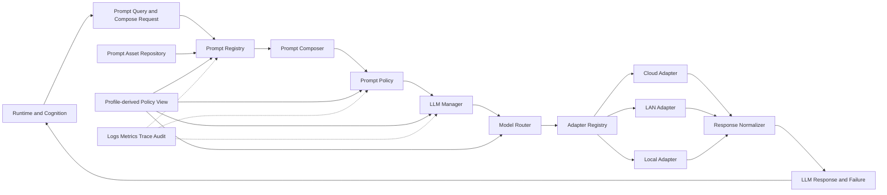
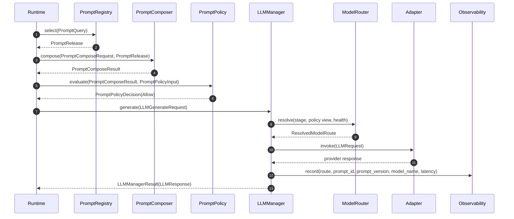
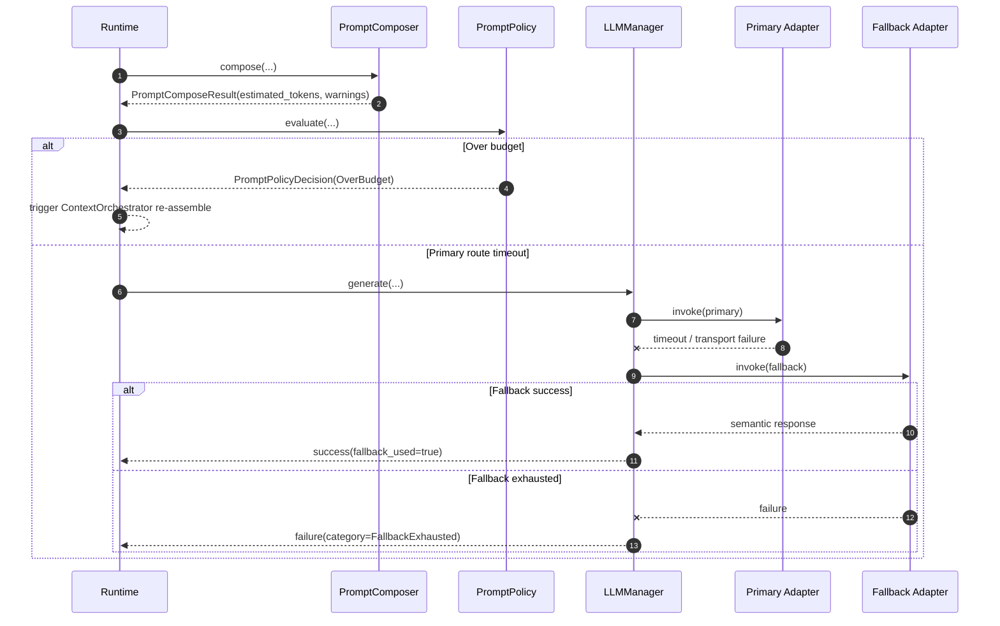
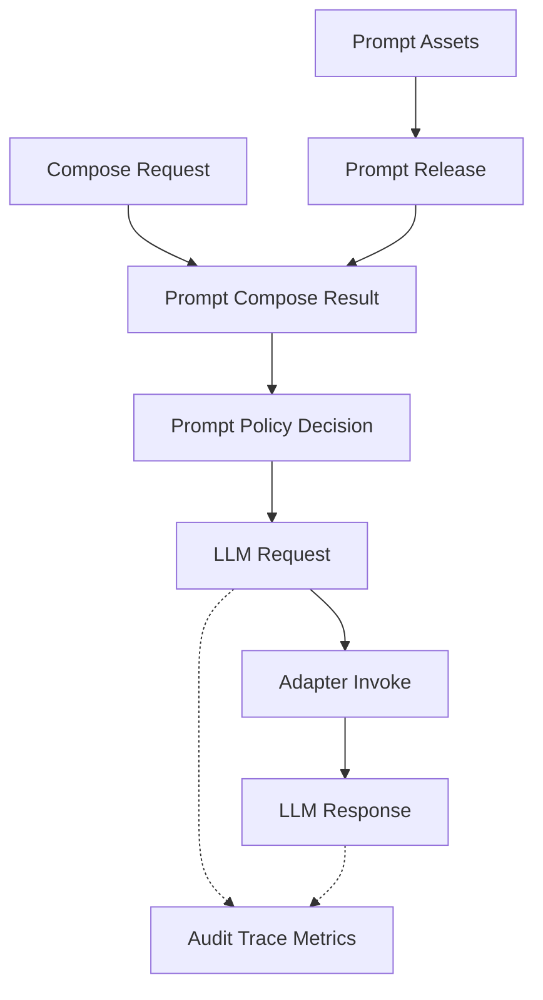

# DASALL LLM 子系统详细设计（Detailed Design）

版本：v1.1
日期：2026-04-10
阶段：Detailed Design
适用模块：llm/

## 1. 模块概览

### 1.1 目标与定位

LLM 子系统是 DASALL 在 Layer 5 支撑系统中的模型接入与 Prompt 治理落点，对应工程目录为 llm/。它的目标不是把大模型“包一层 SDK”，而是在不改变 Runtime 主控权、Memory 上下文主控权和 Tool/PolicyGate 执行主控权的前提下，提供以下四类稳定能力：

1. 屏蔽 Cloud / LAN / Local 模型部署位置与厂商协议差异。
2. 将 Prompt 资产从代码字符串中收敛为可版本化、可灰度、可回滚、可审计的正式资产链路。
3. 把阶段化模型路由、Prompt 选择、消息装配、发送前治理和语义输出归一化为可测试的组件责任链。
4. 为 Runtime 与 Cognition 提供统一、可降级、可观测的模型调用面。

LLM 子系统不是：

1. 上下文拥有者。ContextPacket 的生产与语义预算裁剪属于 memory/ContextOrchestrator。
2. 工具授权中心。工具是否可执行仍由 Tool Policy Gate 决定。
3. 失败恢复主控。恢复裁定与补偿准入仍归 runtime/RecoveryManager。
4. 第二套配置中心。运行策略由 profiles/infra/config 注入，llm 只消费生效后的策略视图。

来源依据：
1. DASSALL_Agent_architecture.md 3.3.1、4.2、4.7、5.4、6.2、7.2、7.5。
2. DASALL_Engineering_Blueprint.md 3.5、7、8。
3. ADR-005-architecture-review-baseline.md。
4. ADR-006-context-orchestrator-vs-prompt-composer.md。
5. WP05-T005、WP05-T010、WP05-T012 交付物。
6. DASALL_infrastructure子系统详细设计.md 中 ConfigCenter 四层来源与 override 契约（v1）。

### 1.2 边界定义

| 维度 | 内容 | 边界说明 |
|---|---|---|
| 上游主消费者 | runtime、cognition | Runtime 驱动调用时机，Cognition 消费 LLM 语义结果；两者只应依赖 llm 对外接口，不依赖具体 adapter 实现 |
| 上游相邻输入 | memory、profiles、infra/config | memory 通过 PromptComposeRequest 间接提供 ContextPacket 引用；profiles 提供 model_profile、prompt_policy、timeout_policy、degrade_policy；infra/config 提供端点、密钥与审计/监控开关 |
| 下游依赖 | Cloud/LAN/Local 模型服务、Prompt 资产源、infra observability | llm 向下适配 OpenAI-compatible、Ollama、local runtime 等 provider；向外发出 log/metric/trace/audit |
| 同层协作 | tools、services、knowledge | 只通过 Runtime 主链路间接协作，不直接反调 tools/services 实现 |
| 禁止依赖 | memory 实现细节、tools 实现细节、services 实现细节、apps 入口逻辑 | llm 不自行检索 memory，不直接决策工具是否可执行，不接管产品入口协议 |

### 1.3 设计范围

纳入范围：
1. LLM 子系统职责边界、组件拆分、输入输出、依赖方向。
2. Prompt Registry / Prompt Composer / Prompt Policy 三段治理模型的工程落点。
3. ModelRouter、LLMManager、adapter 层、资产层、观测层的职责与协作方式。
4. 模块内 supporting types、异常语义、恢复路径、配置面、测试面、Build 落点。
5. 与已冻结 contracts、profiles、infra、memory 的对齐策略。
6. Prompt 资产包形态、Provider 目录资产、外部装载、动态切换与角色化定制策略。

不纳入范围：
1. 改写已有 ADR 与 SSOT 结论。
2. 把 module-local supporting type 反向写入 contracts 共享对象。
3. Tool 执行策略、Recovery 准入策略、ContextPacket 生产策略本体。
4. provider SDK 的完整封装实现细节与第三方模型框架内部机制。
5. Prompt 远端分发通道本身的传输协议实现，例如 OTA/HTTP/SCP 客户端细节；这些能力仍归 infra/config/OTA。

### 1.4 现有工程信号

当前仓库已经给出以下真实信号：

1. llm/CMakeLists.txt 已存在独立静态库目标 dasall_llm，但当前只编译 src/placeholder.cpp，说明工程入口已预留、实现仍为空骨架。
2. contracts/include/llm/LLMRequest.h 与 LLMResponse.h 已冻结 provider-neutral 请求/响应面，且 tests/contract/llm/LLMRequestResponseContractTest.cpp 已建立边界测试基线。
3. contracts/include/prompt/PromptSpec.h、PromptRelease.h、PromptComposeRequest.h、PromptComposeResult.h 已冻结 Prompt 资产与装配对象。
4. profiles/include/RuntimePolicySnapshot.h 已存在 ModelProfile、PromptPolicy、DegradePolicy、TimeoutPolicy，说明 llm 的运行治理输入面已有现成上游。
5. tests/unit/llm/CMakeLists.txt 仍为占位，tests/integration/llm 目录尚不存在，说明 llm 目前没有模块级单测和集成门禁。
6. MockLLMAdapter 仍是基于字符串的脚手架 mock，而不是生产接口继承 mock，说明接口面尚未进入 Build 收口阶段。

基于这些信号，当前结论必须明确写成：

1. architecture ready：总体职责、Prompt 三段治理、路由原则与输出语义已明确。
2. implementation not ready：模块公共头、核心实现、单元测试、集成测试、流式句柄与健康探针均未落地。

---

## 2. 约束清单

### 2.1 Must / Should / Must-Not 约束表

| Constraint ID | 来源 | 类型 | 约束描述 | 影响范围 |
|---|---|---|---|---|
| LLM-C001 | DASSALL_Agent_architecture.md 5.4.1 | Must | llm 必须提供统一模型调用抽象，统一入口围绕 LLMRequest / LLMResponse 工作 | 接口、适配层 |
| LLM-C002 | DASSALL_Agent_architecture.md 5.4.2 | Must | 路由原则必须支持 Cloud -> LAN -> Local 降级链路，且按阶段/隐私/时延/复杂度做优先选择 | ModelRouter、配置 |
| LLM-C003 | DASSALL_Agent_architecture.md 5.4.3 | Must | LLM 输出只能收敛为 DirectResponse、ToolCallIntent、ClarificationRequest、ReplanSuggestion 等语义意图 | 结果归一化 |
| LLM-C004 | DASSALL_Agent_architecture.md 5.4.5-5.4.7 | Must | Prompt 必须是正式资产，并以 PromptRegistry / PromptComposer / PromptPolicy 三段治理链路落地 | Prompt 子域 |
| LLM-C005 | ADR-006 | Must | ContextOrchestrator 负责语义上下文，PromptComposer 负责消息装配；两者不得混层 | llm/memory 边界 |
| LLM-C006 | ADR-006 | Must-Not | llm 不得自行检索、压缩或重排 memory / knowledge 原始候选片段 | 组件职责 |
| LLM-C007 | DASSALL_Agent_architecture.md 5.2.11、5.4.6 | Must | Prompt 可影响模型可见工具描述，但不能越权启用工具；真实权限仍由 Tool Policy Gate 决定 | PromptPolicy、Tool 边界 |
| LLM-C008 | DASSALL_Agent_architecture.md 6.2、DASALL_架构设计文档.md 5.5 | Must | 如果渲染预算仍超限，llm 只能返回 over-budget/治理结论，由 Runtime 触发 ContextOrchestrator 重装配，不得自行二次语义裁剪 | over-budget 回流 |
| LLM-C009 | WP05-T010 | Must | LLMRequest / LLMResponse 只承载 provider-neutral handoff 与语义结果，不承载 provider raw payload、上下文 ownership 或执行控制字段 | contracts 对齐 |
| LLM-C010 | WP05-T005 | Must | PromptSpec / PromptRelease 只承载资产选择面与发布面，不回灌运行态上下文、消息结果或写回语义 | contracts 对齐 |
| LLM-C011 | WP05-T012、WP05-T011 | Must | 当前 shared interface admission 中仅 ILLMAdapter 具备 Admit 基线；其余 llm 公共接口在 supporting contracts 未成熟前保持 module-local | 接口准入 |
| LLM-C012 | DASALL_blueprint对当前contracts差异矩阵-2026-03-23.md | Must-Not | 不得假定独立 ModelRoute、PromptPolicyDecision、StreamHandle 已是共享 contracts 既成事实 | supporting objects |
| LLM-C013 | DASSALL_Agent_architecture.md 7.5、profiles 详细设计 | Must | llm 的模型路由、PromptPolicy、超时、降级必须来自 profile 生效策略或其投影视图，不得在模块内散落硬编码 | 配置策略 |
| LLM-C014 | InfraConcurrencyPolicy.md | Must | 如 llm 引入内部 queue / buffer / session table，必须显式声明 overflow_policy、backpressure 与 lock order，且不得持 L2 锁执行网络 I/O | 并发设计 |
| LLM-C015 | InfraIntegrationTopology.md | Must | llm 进入核心链路后，至少补齐 1 个 integration smoke 用例，并可被 ctest -N 发现 | 集成测试 |
| LLM-C016 | DASALL_工程协作与编码规范.md 3.6/3.7 | Must | 模块边界处不得吞错；新增公共接口必须同步补 unit 或 contract 测试 | 错误处理、测试 |
| LLM-C017 | docs/plans/DASALL_工程落地实现步骤指引.md 阶段 E | Must | 阶段 E 的 Build 收口至少覆盖 ILLMAdapter、LLMManager、ModelRouter、Prompt 三段与输出语义统一映射 | 实施范围 |
| LLM-C018 | docs/todos/contracts/deliverables/WP05-T001-子域推进顺序表.md | Should | llm Build 落地应沿用 Wave4 约束思路，只消费已冻结对象，不把缺失 supporting contracts 直接推进共享层 | 推进节奏 |
| LLM-C019 | DASSALL_Agent_architecture.md 5.4.5-5.4.7、DASALL_infrastructure子系统详细设计.md ConfigCenter 四层来源与 override 契约（v1） | Must | Prompt 内容必须以外部受管资产包存在，二进制只承载加载、校验、治理逻辑；Prompt 文本迭代不应以重新编译整个 DASALL 为前提 | 资产形态、发布 |
| LLM-C020 | DASALL_infrastructure子系统详细设计.md ConfigCenter 四层来源与 override 契约（v1） | Must | Prompt 的场景切换与资产切换只允许通过本地资产根、deployment override 或受信 runtime snapshot 完成，且必须具备来源校验、审计与回滚 | 动态切换 |
| LLM-C021 | DASSALL_Agent_architecture.md 5.4.7、WP05-T005 | Must | 角色化和人格化定制必须通过 Prompt 家族、版本和 module-local 选择维度实现，不得为不同角色复制一套 Prompt 三段实现，也不得把 persona 语义直接回写 shared contracts | 角色定制 |
| LLM-C022 | openclaw/openclaw models.providers、LiteLLM config.yaml、DASALL_infrastructure子系统详细设计.md ConfigCenter 四层来源与 override 契约（v1） | Must | Provider 连接信息、模型目录、协议族与能力标签必须以外部受管 Provider Catalog 资产表达；真实密钥只允许通过 secret ref、auth profile 或 infra secret 注入，不能把明文密钥写入受版本控制的 Provider 资产 | provider 资产、secret 边界 |
| LLM-C023 | openclaw/openclaw provider plugins、LiteLLM provider registration | Must | 必须区分 adapter family 与 provider instance：对 OpenAI-compatible、OpenAI Responses、Anthropic Messages 等已支持协议族，应允许仅通过 Provider Catalog + 密钥引用完成实例接入；只有协议族新增时才新增 adapter 代码 | 接入路径 |
| LLM-C024 | OpenRouter schema normalization、LiteLLM routing practices | Must | Provider 资产必须显式声明 api family、base_url、auth mode、模型列表、能力标签、限流/超时提示与来源版本；不支持的 provider 能力必须显式降级或拒绝，不得静默忽略 | 能力治理 |
| LLM-C025 | DeepSeek Models & Pricing、Token Usage、List Models、Context Caching 官方文档 | Must | Provider Catalog 中的模型条目必须显式承载 context length、默认/硬上限输出长度、计费维度、metadata source、effective_at 与 verification_state；`/models` 发现结果只能补充“可用性”，不能单独充当上下文与计费真相源 | 模型元数据治理 |
| LLM-C026 | DeepSeek `deepseek-chat` / `deepseek-reasoner` 官方说明 | Must | 同一 Provider 下的 thinking / non-thinking 模式必须建模为“同一 provider instance 下的多个 model entry”，并由 ModelRouter 按 stage、复杂度、SLA、预算、能力约束做可解释选择；不得把 chat / reasoner 切换写死在调用代码里 | 智能切换 |
| LLM-C027 | DeepSeek reasoning model 多轮对话说明 | Must | `reasoning_content` 属于 provider-private 辅助字段，不得进入 shared contracts、长期会话历史或下一轮请求输入；若需要审计或蒸馏，只能走显式治理与脱敏链路 | reasoning 边界 |
| LLM-C028 | DeepSeek 双模式实践、OpenRouter/LiteLLM 多模型路由实践 | Must | `deepseek-chat` / `deepseek-reasoner` 这类双模式设计必须上升为 vendor-neutral 的“模型挡位”抽象：同类 Provider 的 fast/quality、mini/pro、thinking/non-thinking 等多档模型，都应统一投影为 model tier traits，由同一 ModelRouter 评分，而不是为每个厂商重复写一套分支 | 通用抽象 |
| LLM-C029 | DASALL 可观测与 profile 治理边界 | Must | 在线模型挡位切换默认不得依赖额外一次 LLM 推理；主链路必须先使用显式信号、元数据和确定性评分完成选择。只有在业务本身要求二次尝试时，才允许把升级到更高挡位作为一次正常 fallback，而不是“让另一个 LLM 来决定该选哪个 LLM” | 可靠性、在线路径 |

### 2.2 约束抽取结论

Must：
1. llm 必须是“模型接入 + Prompt 治理”子系统，不是第二主控平面。
2. Prompt 三段治理必须完整存在，且与 ContextOrchestrator 严格分层。
3. llm 只能消费 contracts 已冻结对象；缺失 supporting object 先留在模块内。
4. llm 的降级、超时、Prompt allowlist、trusted sources 必须与 profiles 一致。
5. LLM 输出只表达意图，不表达可直接执行命令。
6. Prompt 正文必须外部化为受管资产包，而不是编译进 DASALL 二进制。
7. Prompt 资产切换、场景切换和角色定制必须走受管选择与覆盖链路，不能靠代码分支或复制组件实现。
8. Provider 实例配置、模型目录和能力标签必须外部化为 Provider Catalog 资产，真实密钥必须与 Provider 资产分层。
9. 只有当新厂商落在既有 adapter family 内时，才允许“只加配置不改代码”；协议族新增必须走 adapter Admit、测试和灰度流程。
10. 模型上下文长度、默认/硬上限输出、计费规则、cache 命中计费维度和元数据来源必须由 Provider Catalog 治理，不能散落在 adapter 常量或 profile 临时字典中。
11. `deepseek-chat` / `deepseek-reasoner` 之类双模式选择必须是策略驱动、可解释、可观测的路由决策，而不是黑盒猜测。
12. thinking mode 的私有推理字段不得直接进入 shared contracts、长期历史或下一轮请求负载。
13. DeepSeek 双模式只是“模型挡位”设计的一个实例；同类 Provider 的多档模型必须统一抽象到 vendor-neutral tier traits。
14. 在线挡位切换默认不依赖额外一次 LLM 推理，主路径必须保持可预测、可审计、可回放。

Should：
1. 优先使用 module-local supporting type 承接缺失对象，再评估是否升格为共享 contracts。
2. 优先做 unary 主链路，streaming 在 StreamHandle 未冻结前后置。
3. 单测、失败注入、集成测试应从第一轮 Build 就纳入，而不是实现后补票。

Must-Not：
1. 不把 ContextPacket ownership 拉回 llm。
2. 不把 PromptPolicyDecision、ModelRoute、StreamHandle 未冻结对象伪装成 shared contracts 既有能力。
3. 不让 PromptPolicy 替代 Tool Policy Gate、RecoveryManager 或 ContextOrchestrator。

---

## 3. 现状与缺口

### 3.1 当前实现状态

| 观察项 | 当前状态 | 证据 | 结论 |
|---|---|---|---|
| llm 模块构建入口 | 已存在 | llm/CMakeLists.txt | 已有独立静态库目标，但尚未形成真实实现 |
| llm 源码实现 | 占位 | llm/src/placeholder.cpp | 当前没有 LLMManager、ModelRouter、Prompt 三段或 adapter 实现 |
| llm 公共头文件 | 缺失 | llm/include 目录不存在 | 当前没有模块公共接口与 module-local supporting type 落点 |
| shared request/response contracts | 已冻结 | contracts/include/llm/LLMRequest.h、LLMResponse.h | provider-neutral 请求/响应基线已具备 |
| Prompt 资产与装配 contracts | 已冻结 | contracts/include/prompt/* | PromptSpec、PromptRelease、PromptComposeRequest、PromptComposeResult 已具备 |
| 独立 ModelRoute 共享对象 | 缺失 | DASALL_blueprint对当前contracts差异矩阵-2026-03-23.md | 当前只有 LLMRequest.model_route 字符串，没有独立共享对象 |
| PromptPolicyDecision 共享对象 | 缺失 | 同上差异矩阵 | 发送前治理决策仍未形成 shared object |
| StreamHandle 共享对象 | 缺失 | 同上差异矩阵 | streaming 生命周期对象未冻结 |
| shared interface admission | 部分具备 | WP05-T012、worklog 记录 #039 | 仅 ILLMAdapter 达到 Admit 基线，其他接口应留在 module-local |
| llm contract tests | 已存在 | tests/contract/llm/LLMRequestResponseContractTest.cpp | request/response 语义边界已有自动化基线 |
| prompt contract tests | 已存在 | tests/contract/prompt/* | Prompt 链路边界已有自动化基线 |
| Prompt 资产目录 | 缺失 | llm/assets/prompts 目录尚不存在 | 当前没有可被 PromptAssetRepository 直接消费的 baseline Prompt 包 |
| Prompt 包文件规范 | 缺失 | 仓库内无 manifest + Markdown 的 Prompt 包规范 | Prompt 文本无法以受管资产形式免重编译迭代 |
| Prompt 动态切换路径 | 上游基础具备、llm 侧缺失 | profiles/*/runtime_policy.yaml 已冻结 prompt_policy；infra ConfigCenter 已冻结四层 override；llm 尚无 PromptAssetRepository 实现 | 资产切换尚未形成端到端闭环 |
| Provider 资产目录 | 缺失 | llm/assets/providers 目录尚不存在 | 当前没有 baseline Provider Catalog，也没有“仅配置接入”入口 |
| Provider Catalog 规范 | 缺失 | 仓库内无 provider manifest/models yaml 规范 | 新增 OpenAI-compatible provider 仍会散落到代码或 deployment 临时配置 |
| Provider 凭据分层 | 上游能力具备、llm 侧缺失 | infra secret/config 已存在，但 llm 尚无 auth profile / secret ref 投影约定 | provider 资产与真实密钥尚未形成清晰边界 |
| 模型元数据治理 | 缺失 | 当前 models.yaml 仅覆盖能力示意，未冻结 pricing/source/effective_at/verification_state 结构 | 无法做上下文预算检查、成本估算和能力漂移治理 |
| thinking / non-thinking 选择策略 | 缺失 | 当前没有 deepseek-chat / deepseek-reasoner 的场景切换规则和观测字段 | 无法按复杂度、时延和预算智能切换双模式 |
| 通用模型挡位抽象 | 缺失 | 当前设计重点仍偏 DeepSeek 双模式，尚未把 fast/quality、mini/pro、thinking/non-thinking 统一抽象为 tier traits | 后续接入其它多挡位 Provider 时易重复建模 |
| 场景/角色选择维度 | 缺失 | 当前 PromptQuery 仅覆盖 stage/task_type/language/model_family/trusted_sources | 无法优雅支撑 scene/persona 定制 |
| llm unit tests | 缺失 | tests/unit/llm/CMakeLists.txt | 目前仅占位，无真实单测 |
| llm integration tests | 缺失 | tests/integration/ 目录无 llm 子目录 | 目前无核心链路 smoke / failure / profile 测试 |
| llm mocks | 脚手架级 | tests/mocks/include/MockLLMAdapter.h | 当前 mock 仅支持字符串调用，不反映真实接口面 |
| profiles 运行策略供给 | 已存在 | profiles/include/RuntimePolicySnapshot.h | model_profile、prompt_policy、degrade_policy、timeout_policy 已可复用 |

### 3.2 现状-目标差距表

| 目标能力 | 当前状态 | 关键差距 | 风险等级 | 优先级 |
|---|---|---|---|---|
| 统一 llm 公共接口层 | 缺失 | 没有 llm/include、没有 ILLMManager / IPrompt* 等模块接口 | High | P0 |
| Prompt 三段治理实现 | 缺失 | PromptRegistry / PromptComposer / PromptPolicy 尚无代码落点 | High | P0 |
| Prompt 资产包形态与加载器 | 缺失 | 没有 manifest + Markdown 包规范，也没有 PromptAssetRepository 解析器 | High | P0 |
| Provider 资产包形态与加载器 | 缺失 | 没有 Provider Catalog 规范，也没有 ProviderCatalogRepository 或等价加载器 | High | P0 |
| 配置式 provider 实例接入 | 缺失 | 对已支持协议族，尚不能只通过 provider asset + secret ref 新增 provider 实例 | High | P0 |
| 模型元数据治理 | 缺失 | 无统一 context/pricing/source/effective_at/verification_state 元数据结构 | High | P0 |
| reasoning mode 智能切换 | 缺失 | 没有面向复杂度/时延/成本的 model selection hint 与策略 | High | P0 |
| 场景动态切换 | 缺失 | 没有 scene-aware Prompt 选择输入，也没有受管切换闭环 | High | P0 |
| 角色与人格化定制 | 缺失 | 没有 persona-aware Prompt 选择输入与资产组织约定 | Medium | P1 |
| 模型路由与回退闭环 | 缺失 | 没有 ModelRouter、没有 adapter 选择和 fallback 执行器 | High | P0 |
| provider 适配层 | 缺失 | Cloud/LAN/Local adapter 全部不存在 | High | P0 |
| 发送前治理与 over-budget 回流 | 缺失 | 没有治理决策对象、没有回流路径实现 | High | P0 |
| 健康检查与可观测性 | 缺失 | health、metrics、trace、audit 未接线 | Medium | P1 |
| 模块级单元测试 | 缺失 | tests/unit/llm 仅占位 | High | P0 |
| 模块级集成测试 | 缺失 | tests/integration/llm 不存在 | High | P0 |
| 流式能力 | 阻塞 | StreamHandle 未冻结，stream_generate 无稳定生命周期设计 | Medium | P1 |
| 共享 supporting contracts 完整性 | 部分阻塞 | ModelRoute、PromptPolicyDecision、StreamHandle 缺失 | Medium | P1 |

### 3.3 风险冲突识别

| 冲突类型 | 描述 | 若不处理的后果 |
|---|---|---|
| 边界冲突 | PromptComposer 若主动拉取 memory / knowledge，会直接违反 ADR-006 | llm 与 memory 职责混层，后续 contracts 回退成本高 |
| 语义重复 | 若把 PromptPolicyDecision、ResolvedModelRoute 直接塞回 contracts，会提前冻结未成熟 supporting object | shared contracts 污染，后续兼容成本高 |
| 依赖反转 | 若 runtime 直接调用具体 Cloud/LAN/Local adapter | llm 子系统失去存在意义，profile 与降级策略散落 |
| 测试错位 | 只有 contracts 测试，没有 llm unit / integration | 设计正确但实现期无法验证真正行为闭环 |
| 流式误推进 | 在 StreamHandle 未冻结前强行落 streaming | 生命周期、取消、背压无法稳定，易形成隐藏线程问题 |
| 观测缺口 | 调用成功率、fallback、policy deny 不可观测 | 降级路径无法审计与调优 |

### 3.4 现状结论

当前 llm 子系统最合适的设计策略不是继续扩张 shared contracts，而是：

1. 以已冻结 contracts 为硬边界。
2. 在 llm/include 与 llm/src 内补齐 module-local supporting type、公共接口和实现。
3. 通过 Build 阶段逐步把“路由、治理、调用、观测、测试”闭环建立起来。

---

## 4. 候选方案对比

### 4.1 候选方案 A：Provider-Centric 单体适配方案

设计思路：
1. 每个 provider adapter 同时负责 Prompt 选择、消息装配、治理和调用。
2. LLMManager 只负责选 provider，不负责 Prompt 三段治理。
3. Prompt 资产按 provider 分散组织。

组件结构：
1. LLMManager。
2. CloudAdapter / LANAdapter / LocalAdapter。
3. Provider 内嵌 Prompt 模板与 policy 逻辑。

优点：
1. 初始代码量最少。
2. 对单一 provider 快速打通最简单。

风险：
1. 直接违背 ADR-006 对 PromptComposer 边界的裁定。
2. Prompt 版本、灰度、回滚和 trusted source 难统一治理。
3. 不同 provider 的 Prompt 与输出语义容易漂移，测试面被迫按 provider 分叉。
4. 过度耦合 provider 与 Prompt 资产，不利于 Cloud/LAN/Local 统一输出语义。

与 DASALL 约束匹配度：低。

### 4.2 候选方案 B：治理分层管线方案

设计思路：
1. 把 llm 子系统拆为 Prompt 资产选择、消息装配、发送前治理、模型路由、调用执行、结果归一化六段责任链。
2. Runtime 保持对调用时机和 over-budget 回流的主控；llm 仅执行 provider-neutral 到 provider-specific 的映射、治理和调用。
3. 缺失 supporting object 先留在 llm 模块内，以便不回写 contracts。

组件结构：
1. PromptRegistry。
2. PromptComposer。
3. PromptPolicy。
4. ModelRouter。
5. LLMManager。
6. AdapterRegistry + Cloud/LAN/Local adapters。
7. PromptAssetRepository。
8. ResponseNormalizer / ObservabilityBridge。

优点：
1. 与架构文档 5.4 和 ADR-006 高度一致。
2. Prompt 资产治理、模型降级、输出归一化都可独立测试。
3. 可在不改动 shared contracts 的前提下逐步补齐 module-local supporting type。
4. 有利于设计 -> Build 的原子拆分和质量门控制。

风险：
1. 组件较多，初期需要明确 module-local 类型边界。
2. 若 public interface 设计不收敛，容易出现过多小接口和调用面重复。
3. 流式能力在 StreamHandle 未冻结前只能先后置。

与 DASALL 约束匹配度：高。

### 4.3 候选方案 C：Gateway-First 统一网关方案

设计思路：
1. 引入一个单体 LLMGateway，把 PromptRegistry、PromptComposer、PromptPolicy、ModelRouter、Adapter 调用都收拢到同一个 orchestrator 类中。
2. 对外只暴露极少数入口，内部使用策略对象协作。
3. 通过一个大配置对象承载 route、prompt、policy、timeout、fallback。

组件结构：
1. LLMGateway。
2. PromptAssetStore。
3. ProviderAdapterSet。
4. Observability hooks。

优点：
1. 对外 API 最简单。
2. 第一阶段开发速度可能快于完全分层方案。

风险：
1. 容易把 Prompt 三段治理重新揉成单体类，形成新的“隐式主控”。
2. 单元测试粒度差，任何变化都需要网关级联测试。
3. 后续新增 prompt source、streaming、结构化输出策略时，网关类会迅速膨胀。

与 DASALL 约束匹配度：中。

### 4.4 候选方案对比矩阵

| 方案 | 架构一致性 | ADR / contracts 一致性 | 工程复杂度 | 测试可验证性 | 演进弹性 | 结论 |
|---|---|---|---|---|---|---|
| A Provider-Centric 单体适配 | 低 | 低 | 低 | 低 | 低 | 淘汰 |
| B 治理分层管线 | 高 | 高 | 中 | 高 | 高 | 采纳 |
| C Gateway-First 统一网关 | 中 | 中 | 中 | 中 | 中 | 不采纳 |

### 4.5 可借鉴行业结论

本任务不依赖新增外部协议结论，但可借鉴以下工程经验：

1. provider-neutral request / response handoff 应尽量薄，避免把厂商私有字段泄漏进共享对象；这一点已在 WP05-T010 中得到仓库内验证。
2. Prompt 资产必须与运行态请求对象分层；这一点已在 WP05-T005 中得到仓库内验证。
3. 运行时路由、Prompt 选择与发送前治理分层，有利于审计、灰度和回滚；这一点与 DASALL 架构文档和 Blueprint 一致。

---

## 5. 决策结论

### 5.1 最终选型

采纳方案 B：治理分层管线方案。

### 5.2 决策依据

1. 与架构一致：完全承接 DASSALL_Agent_architecture.md 5.4.5-5.4.7 的 Prompt 三段治理模型，以及 6.2 的调用顺序。
2. 与 ADR 一致：遵守 ADR-006 对 ContextOrchestrator 与 PromptComposer 的边界裁定，不让 llm 反向成为上下文拥有者。
3. 与 contracts 一致：继续使用已冻结的 LLMRequest / LLMResponse / PromptSpec / PromptRelease / PromptComposeRequest / PromptComposeResult，不把缺失 supporting object 强行推入 shared contracts。
4. 与工程现状一致：当前 llm 模块几乎空白，最适合从模块公共头、Prompt 三段、ModelRouter、LLMManager、adapter skeleton 逐步落地。
5. 与测试诉求一致：分层方案天然支持 unit、failure injection、integration smoke 分级推进。

### 5.3 放弃其他候选方案的理由

1. 放弃方案 A：它把 Prompt 与 provider 紧耦合，直接破坏 Prompt 版本治理、灰度与回滚能力，也与 ADR-006 相冲突。
2. 放弃方案 C：它虽然对外接口简单，但会把 route / prompt / policy / adapter / observability 重新揉成超级网关类，违背 DASALL 当前强调的边界稳定与可测试性。

### 5.4 决策冻结结论

本轮详细设计冻结以下结论：

1. llm 子系统采用“Prompt 治理链 + 模型路由链 + adapter 调用链”三段组合结构。
2. Runtime 仍负责调用时机、重装配回流和终态判定；llm 不接管主控权。
3. ContextPacket 仍由 memory 生产；PromptComposer 只消费其引用或消费由 Runtime 提供的 PromptComposeRequest。
4. PromptPolicy 只负责发送前治理，不做语义上下文裁剪，不做工具权限裁定。
5. ModelRoute、PromptPolicyDecision、StreamHandle 在当前阶段作为 module-local supporting type 或 deferred item 处理，不直接进入 shared contracts。
6. unary 主链路优先；streaming 作为 Phase 2 能力，在 supporting type 和测试夹具就绪后再收口。

---

## 6. 详细设计

### 6.1 子系统总体分层

LLM 子系统建议分为五层：

1. Public Interface Layer：运行时与相邻模块可见的 llm 公共接口，如 ILLMAdapter、ILLMManager、IPromptRegistry、IPromptComposer、IPromptPolicy。
2. Prompt Governance Layer：PromptRegistry、PromptComposer、PromptPolicy、PromptAssetRepository。
3. Invocation Control Layer：LLMManager、ModelRouter、AdapterRegistry（含 health aggregation 与调用执行治理协作点）。
4. Provider Adapter Layer：Cloud、LAN、Local 三类 concrete adapter。
5. Observability Layer：日志、指标、追踪、审计桥接。



### 6.2 组件清单与职责边界

| 组件 | 职责 | 主要输入 | 主要输出 | 依赖 | 明确非职责 |
|---|---|---|---|---|---|
| LLMManager | llm 对外统一调用入口；串联 PromptPolicy 之后的模型调用、fallback、观测与失败映射。内部包含 call execution 逻辑（计时、取消、错误分类），不再作为独立组件 | LLMGenerateRequest、profiles 投影视图 | LLMManagerResult | ModelRouter、AdapterRegistry、observability | 不做 ContextPacket 组装，不做工具授权 |
| ModelRouter | 基于 stage、model_profile、health、degrade_policy 解析本次调用主路与回退链 | stage、policy view、health snapshot | ResolvedModelRoute | profile policy view、AdapterRegistry health | 不直接调用 provider |
| PromptRegistry | 按 stage/task_type/language/model_family/trusted source 选定 PromptRelease | PromptQuery、PromptAssetRepository | PromptRegistryResult | PromptSpec、PromptRelease、trusted source snapshot | 不装配 messages |
| PromptComposer | 把 PromptRelease 与 PromptComposeRequest 映射为 provider-neutral messages | PromptComposeRequest、PromptRelease、ModelBudgetHint | PromptComposeResult | PromptRelease、模板槽位渲染器 | 不检索 memory、不改写 ContextPacket |
| PromptPolicy | 在发送前执行 allowlist、trusted source、tool visibility patch、redaction、渲染预算治理 | PromptComposeResult、PromptPolicyInput、PromptPolicy config | PromptPolicyDecision | profiles PromptPolicy、policy rules | 不拥有工具权限，不执行 provider 调用 |
| PromptAssetRepository | 统一读取本地 Prompt 资产与受治理的外部 Prompt 快照 | asset root、trusted external snapshot | Prompt asset catalog | filesystem、optional external prompt snapshot | 不做运行态选择 |
| AdapterRegistry | 管理 Cloud/LAN/Local adapters 生命周期、可用性、capability 标签与健康状态聚合。内部包含 health aggregation 逻辑（adapter probes、failure counters、熔断状态），不再作为独立组件 | bootstrap config、adapter probes | adapter handle / adapter list / health snapshot | concrete adapters、infra health hooks | 不做策略选择、不负责重试裁定 |
| ResponseNormalizer | 将 provider 回包归一化为 LLMResponse，并校验输出语义 | raw provider result / adapter-local result | LLMResponse | output mapping rules | 不保留 raw payload 到 contracts |
| TokenEstimator | 在调用前基于 tokenizer 或字符换算对输入 token 做预估，供 PromptPolicy over-budget 检查和 ModelRouter 上下文门禁使用 | composed messages text、model context_window | estimated_input_tokens | model metadata（context_window、换算系数）| 不做精确计费，精确计费以 provider usage 为准 |
| UsageAggregator | 归并 adapter 返回的 usage 字段（prompt_tokens、completion_tokens、prompt_cache_hit_tokens、prompt_cache_miss_tokens），计算真实成本并回写 observability | provider usage fragment、model pricing metadata | normalized usage record、cost estimate | ResponseNormalizer、Provider Catalog pricing | 不回写静态 catalog，不替代 observability bridge |

### 6.3 相邻模块依赖方向

1. runtime -> llm：只依赖 llm 公共接口和 contracts 共享对象；负责调用时机、回流与终态裁定。
2. memory -> llm：无实现依赖；通过 Runtime 组装的 PromptComposeRequest 间接提供 ContextPacket 引用。
3. profiles -> llm：提供生效后的 model_profile、prompt_policy、timeout_policy、degrade_policy 等策略视图。
4. infra -> llm：提供日志、指标、追踪、审计、配置与 secret 能力。
5. llm -> tools / services：无直接实现依赖；只通过 prompt visible_tools 摘要和 PolicyGate 结果间接感知。

### 6.4 核心对象与 contracts 对齐关系

#### 6.4.1 共享 contracts 对象

| 对象 | 来源 | 在 llm 中的角色 | 不允许承担 |
|---|---|---|---|
| LLMRequest | contracts/include/llm/LLMRequest.h | provider-neutral 调用对象；下发 adapter 的统一 handoff | provider raw payload、ContextPacket ownership、重试状态 |
| LLMResponse | contracts/include/llm/LLMResponse.h | provider-neutral 语义结果；回传 runtime/cognition | ErrorInfo ownership、执行控制字段 |
| PromptSpec | contracts/include/prompt/PromptSpec.h | PromptRegistry 选择面 | 发布状态、运行态请求控制 |
| PromptRelease | contracts/include/prompt/PromptRelease.h | Prompt 正式发布实例 | Context ownership、messages、write-back |
| PromptComposeRequest | contracts/include/prompt/PromptComposeRequest.h | PromptComposer 装配输入 | 第二份上下文 ownership |
| PromptComposeResult | contracts/include/prompt/PromptComposeResult.h | PromptComposer 装配结果，PromptPolicy 输入 | policy 决策结果、memory write-back |
| RuntimeBudget | contracts/include/checkpoint/RuntimeBudget.h | LLMRequest 中的预算提示输入 | llm 专属线程/队列实现细节 |

#### 6.4.2 模块内 supporting types

当前阶段以下对象不进入 shared contracts，而放在 llm/include 作为模块内 supporting type：

| 对象 | 建议位置 | 原因 | 未来演进 |
|---|---|---|---|
| PromptQuery | llm/include/prompt/PromptQuery.h | Blueprint 需要 PromptRegistry 输入，且 scene/persona/profile-aware 选择维度当前不适合冻结为 shared object | 若后续多个模块直接消费，再评估升格 |
| PromptAssetDescriptor | llm/src/prompt/PromptAssetDescriptor.h | 承载包级 manifest 元数据、来源、hash、scene/persona 选择标签，不适合进入 shared contracts | 保持仓储内私有或 module-local |
| ProviderDescriptor | llm/include/provider/ProviderDescriptor.h | 承载 provider instance 的 api family、base_url、auth_ref、headers、能力标签与 model catalog 摘要；属于 llm 内部治理对象 | 如未来多个子系统稳定复用，再评估升格 |
| ModelCatalogEntry | llm/include/provider/ModelCatalogEntry.h | 表达单模型的 context window、输出上限、计费维度、能力标签、metadata source 与 verification_state；属于 Provider Catalog 内部治理对象 | 若后续观测/调度跨模块稳定复用，再评估升格 |
| PromptPolicyDecision | llm/include/prompt/PromptPolicyDecision.h | 当前 shared contracts 缺失；发送前治理结果暂不跨模块共享 | 待 Wave4 supporting contracts 成熟后再评审 |
| ResolvedModelRoute | llm/include/route/ResolvedModelRoute.h | 当前 shared contracts 只有 model_route 字符串，不足以表达主路、fallback、streaming 标志 | 暂不升格 shared contracts |
| ModelSelectionHint | llm/include/route/ModelSelectionHint.h | 表达复杂度、时延、预算、工具需求、预计 token 等路由输入；用于 chat / reasoner 等模型档位切换 | 如上游多个模块稳定提供，再评估升格 |
| LLMGenerateRequest | llm/include/LLMGenerateRequest.h | 供 Runtime 调用 LLMManager 的模块公共对象，承载 PromptPolicy 后的调用上下文 | 保持 module-local |
| LLMManagerResult | llm/include/LLMManagerResult.h | 需要承载 LLMResponse 或 ErrorInfo/fallback 元数据，但不适合写回 shared contracts | 保持 module-local |
| AdapterCallResult | llm/src/adapters/AdapterCallResult.h | provider transport/protocol 层失败事实，只在 llm 内部消费 | 不进入 shared contracts |
| StreamSessionRef | llm/include/stream/StreamSessionRef.h | StreamHandle 共享对象尚未冻结，streaming 先使用 module-local 生命周期标识 | 未来可替换为稳定对象 |
| PromptRegistryResult | llm/include/prompt/PromptRegistryResult.h | PromptRegistry.select() 返回类型，承载选中的 PromptRelease 与审计元数据（v1.1 COMP-2） | 保持 module-local |
| LLMAdapterConfig | llm/include/LLMAdapterConfig.h | ILLMAdapter.init() 配置类型，承载 endpoint、auth_ref、capability tags 等（v1.1 COMP-3） | 保持 module-local |
| PromptPolicyInput | llm/include/prompt/PromptPolicyInput.h | IPromptPolicy.evaluate() 策略输入，承载 profile 投影的 allowlist、trusted sources、tool visibility（v1.1 COMP-4） | 保持 module-local |
| ModelBudgetHint | llm/include/prompt/ModelBudgetHint.h | IPromptComposer.compose() 模型预算提示，承载 context_window 与 max_output_tokens（v1.1 COMP-5） | 保持 module-local |
| PromptRegistryConfig | llm/include/prompt/PromptRegistryConfig.h | IPromptRegistry.init() 配置 | 保持 module-local |
| PromptComposerConfig | llm/include/prompt/PromptComposerConfig.h | IPromptComposer.init() 配置 | 保持 module-local |
| PromptPolicyConfig | llm/include/prompt/PromptPolicyConfig.h | IPromptPolicy.init() 配置 | 保持 module-local |
| PromptPipelineConfig | llm/include/prompt/PromptPipelineConfig.h | IPromptPipeline.init() 配置（v1.1 P0-1） | 保持 module-local |
| PromptPipelineResult | llm/include/prompt/PromptPipelineResult.h | IPromptPipeline.run() 返回类型（v1.1 P0-1） | 保持 module-local |
| TokenEstimate | llm/include/TokenEstimate.h | TokenEstimator 预估结果（v1.1 GAP-1） | 保持 module-local |
| NormalizedUsageRecord | llm/include/NormalizedUsageRecord.h | UsageAggregator 归并后的标准化用量记录（v1.1 GAP-2） | 保持 module-local |

#### 6.4.3 建议对象示意

```cpp
struct PromptQuery {
  std::string stage;
  std::string task_type;
  std::string language;
  std::string model_family;
  std::string scene_id;
  std::string persona_id;
  std::string profile_id;
  std::vector<std::string> available_tools;
  std::vector<std::string> trusted_sources;
};

struct PromptAssetDescriptor {
  std::string package_id;
  std::string source_uri;
  std::string content_hash;
  std::string trusted_source;
  std::string scene_id;
  std::string persona_id;
};

struct ProviderDescriptor {
  std::string provider_id;
  std::string adapter_family;
  std::string api_family;
  std::string base_url;
  std::string auth_ref;
  std::vector<std::string> header_refs;
  std::vector<std::string> capability_tags;
  std::string source_version;
};

struct ModelCatalogEntry {
  std::string provider_id;
  std::string model_id;
  std::string model_version;
  std::string tier_family;
  std::string latency_tier;
  std::string cost_tier;
  std::string reasoning_depth_tier;
  uint32_t context_window = 0;
  uint32_t default_max_output_tokens = 0;
  uint32_t max_output_tokens_hard_limit = 0;
  bool supports_tools = false;
  bool supports_reasoning = false;
  bool supports_visible_reasoning = false;
  bool supports_prompt_cache = false;
  double input_cache_hit_usd_per_1m = 0.0;
  double input_cache_miss_usd_per_1m = 0.0;
  double output_usd_per_1m = 0.0;
  std::string metadata_source_uri;
  std::string metadata_effective_at;
  std::string verification_state;
};

struct ResolvedModelRoute {
  std::string stage;
  std::string primary_route;
  std::vector<std::string> fallback_routes;
  bool streaming_enabled = false;
};

struct ModelSelectionHint {
  std::string stage;
  std::string task_type;
  std::string complexity_tier;
  std::string latency_sla_tier;
  std::string budget_tier;
  bool requires_tools = false;
  bool requires_reasoning = false;
  bool prefers_visible_reasoning = false;
  uint32_t estimated_input_tokens = 0;
  uint32_t target_output_tokens = 0;
  uint32_t previous_route_failures = 0;
};

enum class PromptPolicyDisposition {
  Allow = 0,
  Deny = 1,
  OverBudget = 2,
  RequireRecompose = 3,
};

struct PromptPolicyDecision {
  PromptPolicyDisposition disposition = PromptPolicyDisposition::Deny;
  std::vector<std::string> governed_messages;
  std::vector<std::string> redactions;
  std::vector<std::string> tool_visibility_patch;
  std::string reason;
};

enum class LLMFailureCategory {
  PromptAsset = 0,
  PromptGovernance = 1,
  Routing = 2,
  AdapterTransport = 3,
  ProviderProtocol = 4,
  FallbackExhausted = 5,
};

struct LLMManagerResult {
  dasall::contracts::ResultCode code;
  std::optional<dasall::contracts::LLMResponse> response;
  std::optional<dasall::contracts::ErrorInfo> error;
  std::string resolved_route;
  bool fallback_used = false;
};

// --- v1.1 新增类型（COMP-2/COMP-3/COMP-4 闭环 + PromptPipeline/TokenEstimator/UsageAggregator 配套） ---

/// COMP-2: PromptRegistry.select() 返回类型。
struct PromptRegistryResult {
  dasall::contracts::ResultCode code;
  std::optional<dasall::contracts::PromptRelease> release;
  std::string selected_prompt_id;
  std::string selected_version;
  std::string selection_reason;          // 审计用：命中规则概要
  std::vector<std::string> trusted_sources_matched;
};

/// COMP-3: ILLMAdapter.init() 配置类型。
struct LLMAdapterConfig {
  std::string adapter_id;
  std::string adapter_family;            // openai_compatible / ollama_native / local_runtime ...
  std::string base_url;
  std::string auth_ref;                  // secret://... 或 profile://...
  std::vector<std::string> header_refs;
  uint32_t timeout_ms = 30000;
  uint32_t max_retries = 1;
  std::vector<std::string> capability_tags;
};

/// COMP-4: IPromptPolicy.evaluate() 策略输入。
struct PromptPolicyInput {
  std::string profile_id;
  std::vector<std::string> allowed_prompt_releases;
  std::vector<std::string> trusted_sources;
  std::vector<std::string> tool_visibility_rules;
  uint32_t render_budget_tokens = 0;     // 0 表示不限
  std::string active_scene;
  std::string active_persona;
};

/// COMP-5 配套：PromptComposer 所需的模型预算提示。
struct ModelBudgetHint {
  uint32_t context_window = 0;
  uint32_t max_output_tokens = 0;
  uint32_t reserved_output_tokens = 0;   // 留给输出的预留量
};

/// PromptPipeline facade 配置。
struct PromptPipelineConfig {
  PromptRegistryConfig registry_config;
  PromptComposerConfig composer_config;
  PromptPolicyConfig policy_config;
};

/// PromptPipeline.run() 返回类型。
struct PromptPipelineResult {
  PromptPolicyDisposition disposition = PromptPolicyDisposition::Deny;
  std::optional<dasall::contracts::PromptComposeResult> compose_result;
  std::optional<PromptPolicyDecision> policy_decision;
  std::optional<PromptRegistryResult> registry_result;
  std::string reason;                    // 失败时的人可读原因
};

/// PromptRegistryConfig: PromptRegistry.init() 配置。
struct PromptRegistryConfig {
  std::string asset_root;
  std::vector<std::string> trusted_sources;
};

/// PromptComposerConfig: PromptComposer.init() 配置。
struct PromptComposerConfig {
  std::string template_engine;           // "simple_var" | 未来可扩展
  uint32_t max_few_shot_count = 5;
};

/// PromptPolicyConfig: PromptPolicy.init() 配置。
struct PromptPolicyConfig {
  std::vector<std::string> default_allowed_releases;
  std::vector<std::string> default_trusted_sources;
  bool deny_on_missing_allowlist = true; // allowlist 缺失时默认拒绝
};

/// TokenEstimator 配套类型。
struct TokenEstimate {
  uint32_t estimated_input_tokens = 0;
  uint32_t reserved_output_tokens = 0;
  uint32_t context_window = 0;
  bool over_budget = false;              // estimated_input + reserved_output > context_window
  double safety_margin = 0.05;           // 预估安全余量比例
};

/// UsageAggregator 归并后的标准化用量记录。
struct NormalizedUsageRecord {
  uint32_t prompt_tokens = 0;
  uint32_t completion_tokens = 0;
  uint32_t total_tokens = 0;
  uint32_t prompt_cache_hit_tokens = 0;
  uint32_t prompt_cache_miss_tokens = 0;
  double estimated_cost_usd = 0.0;
  std::string provider_id;
  std::string model_id;
  std::string pricing_ref;
};
```

设计说明：
1. 这些对象用于实现 llm 内部与模块公共接口语义，不改变 shared contracts。
2. LLMManagerResult 解决“LLMResponse 不拥有 ErrorInfo，但 runtime 需要可判定失败语义”的工程问题。
3. ResolvedModelRoute 解决“当前只有 model_route 字符串，无法表达回退链和 streaming 标志”的工程问题。
4. scene_id、persona_id、profile_id 等选择维度先留在 PromptQuery / PromptAssetDescriptor 中，避免在共享 contracts 尚未收敛前冻结新的 Prompt 资产语义。
5. ProviderDescriptor 用于表达“哪个 provider instance 绑定到哪个 adapter family、从哪里取密钥和模型目录”，这是配置式 provider 接入的关键支点，但当前不宜推入 shared contracts。
6. ModelCatalogEntry 用于承载上下文长度、输出上限、计费规则和能力校验状态，是成本治理、预算检查和智能路由的最小事实源。
7. ModelCatalogEntry 还应承载 `tier_family`、`latency_tier`、`cost_tier`、`reasoning_depth_tier` 这类 vendor-neutral 挡位属性，以便把 DeepSeek 双模式推广到其它同类型 Provider。
8. ModelSelectionHint 用于把“场景智能切换”收敛为显式输入，而不是让 adapter 或调用代码内部猜测用户意图。
9. thinking mode 的私有字段如 `reasoning_content` 只属于 provider-local 归一化范围，不进入 shared contracts。

### 6.5 模块公共接口语义定义

本节只定义建议的 llm 模块公共接口，不改变 shared contracts 结论。

#### 6.5.1 ILLMAdapter

定位：provider adapter SPI，对应 Cloud / LAN / Local 三类模型协议适配。

结论：
1. ILLMAdapter 继续沿用架构文档 5.4.1 的统一形态。
2. 由于当前 shared contracts 尚无 StreamHandle 独立对象，stream_generate 在 Build Phase 1 仅保留接口和 module-local 生命周期管理，不作为首轮验收门。
3. provider transport/protocol 失败事实不写回 shared contracts，而在 llm 模块内通过 AdapterCallResult 归一化后再映射给 LLMManagerResult。
4. **v1.1：错误传播方式冻结**（COMP-1 闭环）：generate() 返回 `AdapterCallResult` 而非 `LLMResponse`。原因：LLMResponse 属于 shared contracts，其中禁止承载 ErrorInfo ownership 字段；AdapterCallResult 作为 module-local 类型可同时承载成功响应与失败事实。adapter 实现不得抛异常作为错误传播方式。
5. **v1.1：transport 可测试性**：建议 adapter 内部通过可注入的 `ILLMTransport` 接口隔离网络 I/O（HTTP client / gRPC stub），使 adapter 单测可在无网络环境下运行。ILLMTransport 为 adapter 实现细节，不进入 llm 公共接口。

```cpp
class ILLMAdapter {
public:
  virtual ~ILLMAdapter() = default;
  virtual bool init(const LLMAdapterConfig& config) = 0;
  /// 返回 AdapterCallResult 而非 LLMResponse。
  /// 成功时 result.response 有值；失败时 result.error 有值。
  /// 不抛异常。
  virtual AdapterCallResult generate(
      const dasall::contracts::LLMRequest& request) = 0;
  virtual StreamSessionRef stream_generate(
      const dasall::contracts::LLMRequest& request,
      IStreamObserver* observer) = 0;
  virtual HealthStatus health_check() = 0;
};
```

#### 6.5.2 ILLMManager

定位：Runtime 访问 llm 的唯一统一入口。

语义要求：
1. 消费经过 PromptPolicy 治理后的调用输入。
2. 负责 route 解析、fallback、health 选择、adapter 调用和失败映射。
3. 返回可被 Runtime 直接判定成功/失败的结果，不吞错。

```cpp
class ILLMManager {
public:
  virtual ~ILLMManager() = default;
  virtual bool init(const LLMSubsystemConfig& config) = 0;
  virtual LLMManagerResult generate(const LLMGenerateRequest& request) = 0;
  virtual LLMManagerResult stream_generate(const LLMGenerateRequest& request,
                                           IStreamObserver* observer) = 0;
  virtual HealthStatus health_check() const = 0;
};
```

#### 6.5.3 IPromptRegistry

定位：Prompt 资产选择面。

语义要求：
1. 只根据 PromptQuery 和资产目录做选择，不读取原始 memory / knowledge 候选。
2. 返回 PromptRelease 与可追溯的选择元数据。
3. 允许接入 trusted external prompt snapshot，但前提是来源已经由上游治理标记为可信。

```cpp
class IPromptRegistry {
public:
  virtual ~IPromptRegistry() = default;
  virtual bool init(const PromptRegistryConfig& config) = 0;
  virtual PromptRegistryResult select(const PromptQuery& query) const = 0;
};
```

#### 6.5.4 IPromptComposer

定位：Prompt 消息装配面。

语义要求：
1. 消费 PromptComposeRequest 与已选择的 PromptRelease。
2. 输出 PromptComposeResult，不回写 memory，不改变 ContextPacket ownership。
3. 只能做渲染级裁剪与模板槽位映射，发现 provider 预算无法承载时应返回 warning / over-budget 信号。
4. **v1.1**（COMP-5 闭环）：compose() 需要知道目标模型的上下文窗口才能计算 estimated_tokens 和 over-budget warning，因此新增 `ModelBudgetHint` 输入参数。

```cpp
class IPromptComposer {
public:
  virtual ~IPromptComposer() = default;
  virtual bool init(const PromptComposerConfig& config) = 0;
  /// v1.1: 新增 budget_hint 参数，携带目标模型的 context_window 和
  ///       max_output_tokens，供 over-budget 预估使用。
  virtual dasall::contracts::PromptComposeResult compose(
      const dasall::contracts::PromptComposeRequest& request,
      const dasall::contracts::PromptRelease& release,
      const ModelBudgetHint& budget_hint) const = 0;
};
```

#### 6.5.5 IPromptPolicy

定位：发送前治理面。

语义要求：
1. 对 composed messages 执行 allowlist、trusted source、redaction、tool visibility patch、render-budget 检查。
2. 不替代 ContextOrchestrator 做语义裁剪。
3. 不替代 Tool Policy Gate 做真正权限裁定。

```cpp
class IPromptPolicy {
public:
  virtual ~IPromptPolicy() = default;
  virtual bool init(const PromptPolicyConfig& config) = 0;
  virtual PromptPolicyDecision evaluate(
      const dasall::contracts::PromptComposeResult& compose_result,
      const PromptPolicyInput& input) const = 0;
};
```

#### 6.5.6 IPromptPipeline（v1.1 新增 — P0-1 闭环）

定位：Prompt 三段治理的统一 facade，解决 Runtime 需要了解 PromptRegistry→Composer→Policy 调用顺序与错误处理的耦合问题。

设计动机：
1. §6.7.1 时序图中 Runtime 分步调用 4 个独立接口（Registry→Composer→Policy→LLMManager），导致 Runtime 硬编码了 llm 内部编排逻辑。
2. 若后续 Prompt 治理链扩展（如新增 preprocess、postprocess 步骤），Runtime 必须同步修改。
3. PromptPipeline facade 让 Runtime 可以选择"一步调用"还是"分步编排"：默认推荐一步调用，只在 Runtime 需要对中间结果做显式决策（如 over-budget 回流 ContextOrchestrator）时才拆开。

```cpp
/// Prompt 三段治理统一入口。
/// 封装 PromptRegistry → PromptComposer → PromptPolicy 的完整链路。
/// Runtime 默认通过此接口完成 Prompt 治理，无需了解内部步骤顺序。
class IPromptPipeline {
public:
  virtual ~IPromptPipeline() = default;
  virtual bool init(const PromptPipelineConfig& config) = 0;

  /// 一步执行 Prompt 三段：select → compose → evaluate。
  /// 返回 PromptPipelineResult，其中：
  ///   - disposition == Allow：governed_messages 可直接用于构建 LLMRequest
  ///   - disposition == OverBudget：Runtime 应回流 ContextOrchestrator 重装配
  ///   - disposition == Deny / RequireRecompose：Runtime 应按策略回退或安全失败
  virtual PromptPipelineResult run(
      const PromptQuery& query,
      const dasall::contracts::PromptComposeRequest& compose_request,
      const PromptPolicyInput& policy_input) const = 0;
};
```

语义要求：
1. run() 内部按固定顺序执行 select → compose → evaluate，不可调换顺序。
2. 任一步骤失败时立即终止并返回失败语义，不吞错、不跳步。
3. 若 PromptPolicy 返回 OverBudget，pipeline 必须原样透传给 Runtime，不做二次裁剪。
4. pipeline 实现仅编排三段组件，不新增治理逻辑、不访问 memory、不做模型调用。

与既有接口的关系：
1. Runtime **推荐**通过 `IPromptPipeline.run()` + `ILLMManager.generate()` 的两步模式完成完整调用。这使 llm 对 Runtime 暴露的**核心公共接口 ≤ 3 个**（IPromptPipeline、ILLMManager、health_check）。
2. Runtime **仍可**单独使用 IPromptRegistry、IPromptComposer、IPromptPolicy 做分步编排（例如 over-budget 后重新调用 ContextOrchestrator 再次 compose），但这属于高级用法，不是默认路径。
3. IPromptPipeline 不替代 ILLMManager；模型调用仍由 ILLMManager 负责。

禁止事项：
1. 不允许在 pipeline 内部发起模型调用。
2. 不允许在 pipeline 内部读取 memory 或调用 ContextOrchestrator。
3. 不允许绕过 PromptPolicy evaluate 直接产出 governed messages。

测试门建议：
1. 覆盖 select 失败时 pipeline 立即返回错误。
2. 覆盖 compose over-budget 时 pipeline 透传 OverBudget。
3. 覆盖 policy deny 时 pipeline 返回 Deny。
4. 覆盖正常三段全部通过后 pipeline 返回 Allow + governed messages。

### 6.6 目录与工程落点建议

```text
llm/
├── include/
│   ├── ILLMAdapter.h
│   ├── ILLMManager.h
│   ├── ILLMTransport.h          # adapter 内部 transport 抽象（测试用）
│   ├── LLMSubsystemConfig.h
│   ├── LLMAdapterConfig.h       # v1.1 COMP-3
│   ├── LLMGenerateRequest.h
│   ├── LLMManagerResult.h
│   ├── TokenEstimate.h           # v1.1 GAP-1
│   ├── NormalizedUsageRecord.h   # v1.1 GAP-2
│   ├── provider/
│   │   ├── ProviderDescriptor.h
│   │   └── ModelCatalogEntry.h
│   ├── prompt/
│   │   ├── IPromptRegistry.h
│   │   ├── IPromptComposer.h
│   │   ├── IPromptPolicy.h
│   │   ├── IPromptPipeline.h    # v1.1 P0-1
│   │   ├── PromptQuery.h
│   │   ├── PromptPolicyDecision.h
│   │   ├── PromptPolicyInput.h  # v1.1 COMP-4
│   │   ├── PromptRegistryResult.h  # v1.1 COMP-2
│   │   ├── ModelBudgetHint.h    # v1.1 COMP-5
│   │   ├── PromptRegistryConfig.h
│   │   ├── PromptComposerConfig.h
│   │   ├── PromptPolicyConfig.h
│   │   ├── PromptPipelineConfig.h  # v1.1
│   │   └── PromptPipelineResult.h  # v1.1
│   ├── route/
│   │   ├── ResolvedModelRoute.h
│   │   └── ModelSelectionHint.h
│   └── stream/
│       └── StreamSessionRef.h
├── src/
│   ├── LLMManager.cpp           # 含调用执行治理逻辑（v1.1 P2-1 合并）
│   ├── TokenEstimator.cpp       # v1.1 GAP-1
│   ├── UsageAggregator.cpp      # v1.1 GAP-2
│   ├── route/
│   │   ├── ModelRouter.cpp
│   │   └── AdapterRegistry.cpp  # 含健康快照治理逻辑（v1.1 P2-1 合并）
│   ├── prompt/
│   │   ├── PromptRegistry.cpp
│   │   ├── PromptComposer.cpp
│   │   ├── PromptPolicy.cpp
│   │   ├── PromptPipeline.cpp   # v1.1 P0-1
│   │   └── PromptAssetRepository.cpp
│   ├── adapters/
│   │   ├── OpenAICompatibleAdapter.cpp
│   │   ├── OllamaAdapter.cpp
│   │   └── LocalLLMAdapter.cpp
│   ├── execution/
│   │   └── ResponseNormalizer.cpp
│   └── observability/
│       ├── LLMTraceBridge.cpp
│       ├── LLMMetricsBridge.cpp
│       └── LLMAuditBridge.cpp
└── assets/
    ├── prompts/
    │   ├── planner/
    │   │   └── default/
    │   │       ├── manifest.yaml
    │   │       ├── system.md
    │   │       ├── task.md
    │   │       ├── policy_notes.md
    │   │       └── few_shots/
    │   └── responder/
    │     └── default/
    │       ├── manifest.yaml
    │       ├── system.md
    │       └── task.md
    └── providers/
      ├── catalog.yaml
      ├── openai/
      │   ├── manifest.yaml
      │   └── models.yaml
      └── deepseek/
        ├── manifest.yaml
        └── models.yaml
```

说明：
1. assets/prompts/ 仅作为第一阶段最小本地 Prompt 资产根；后续可通过 PromptAssetRepository 接入受治理的外部 prompt snapshot。
2. assets/providers/ 用于承载 Provider Catalog 基线，不保存真实密钥，只保存 provider instance、协议族、能力与模型目录等可审计元数据。
3. llm 不直接承担 MCP prompt discovery；如果后续引入外部 prompt snapshot，应由上游 Discovery/Cache 提供已治理输入。

#### 6.6.1 Prompt 资产包形态（v1）

本设计在 v1 阶段冻结如下 Prompt 资产包原则：Prompt 内容必须以“外部目录包”存在，而不是编译进 C++ 二进制。Markdown 继续作为作者友好的正文载体，但运行时真正消费的是由 PromptAssetRepository 解析后的结构化资产目录。

| 包内文件 | 角色 | 运行时映射 |
|---|---|---|
| manifest.yaml | 机器可读元数据 | 映射到 PromptSpec、PromptRelease 以及 module-local PromptAssetDescriptor |
| system.md | system_instructions 正文 | 映射到 PromptRelease.system_instructions |
| task.md | task_template 正文 | 映射到 PromptRelease.task_template |
| few_shots/*.md | few-shot 正文片段 | 由 PromptRelease.few_shot_refs 引用并在装配期解析 |
| policy_notes.md | 发送前策略注记 | 映射到 PromptRelease.policy_notes |

manifest.yaml 至少应包含以下字段：prompt_id、version、stage、eval_status、release_scope、output_schema_ref、trusted_source、tags。**v1.1 EXT-2 新增**：`schema_version`（当前固定为 `"1"`）和 `min_loader_version`（声明该包所需的最低 PromptAssetRepository 加载器版本，避免旧加载器误读新格式包）。若需要支持 scene_id、persona_id、profile_tags、package_id、content_hash、source_uri 等更强的运行时选择与审计信息，这些字段在 v1 先落到 PromptAssetDescriptor，而不是回写 shared contracts。

本节与 DASSALL_Agent_architecture.md 5.4.7 的回链关系如下：
1. PromptSpec 仍然表达稳定选择面。
2. PromptRelease 仍然表达版本化发布实例。
3. Markdown 只是作者态载体，不等同于 shared contracts，也不等同于最终下发给 provider 的 messages。

#### 6.6.1a Prompt 模板引擎选型与安全规范（v1.1 GAP-3 闭环）

§6.5.4 IPromptComposer 和 §6.2 组件清单中提到"模板槽位渲染器"作为 PromptComposer 的内部依赖，但未定义模板语法、安全边界和注入防护规则。v1.1 在此冻结以下结论。

**模板语法选型**

v1 阶段冻结为**简单变量替换**（simple_var），语法为 `{{variable_name}}`。理由：
1. DASALL 的 Prompt 模板不需要控制流（if/for/macro）；若模板需要条件逻辑，应由 PromptComposer 在代码层面处理，而不是在模板引擎内嵌入图灵完备语言。
2. 简单变量替换可在无第三方依赖的情况下实现，降低编译和安全审计成本。
3. 若后续确实需要更强的模板能力（如 Mustache partial / Jinja2 subset），可在 PromptComposerConfig 中通过 `template_engine` 字段切换，但新引擎必须经过安全评审后方可启用。

**渲染规则**

1. 变量名只允许 `[a-zA-Z0-9_]`，最大长度 64 字符。
2. 未匹配的 `{{variable_name}}` 在 v1 阶段保留原文不替换，并生成 composition_warning。
3. 嵌套渲染（渲染结果中再含 `{{...}}`）在 v1 阶段禁止，最多执行一轮替换。

**安全边界与注入防护**

1. **禁止代码执行**：模板引擎不得支持任何形式的代码执行（eval、exec、system call、lambda）。
2. **禁止外部 URL 获取**：模板引擎不得在渲染期发起网络请求或文件系统读取。
3. **输入转义**：变量值中的 `{{` 和 `}}` 必须被转义为字面文本，防止二次渲染注入。
4. **长度限制**：单个变量值渲染后长度不得超过可配置上限（默认 100K 字符），超限则截断并生成 warning。
5. **Prompt 注入缓解**：模板引擎本身不负责 Prompt 注入防御（这是 PromptPolicy 的职责），但必须确保渲染过程不引入新的注入面。

**可测试性**

1. 模板渲染器应被抽象为可注入接口（如 `ITemplateRenderer`），使 PromptComposer 单测可 mock 渲染器。
2. 渲染器自身的测试门应覆盖：正常替换、未匹配变量 warning、嵌套渲染被拒绝、超长值截断、特殊字符转义。

#### 6.6.2 免重编译迭代与资产装载顺序

为满足“Prompt 迭代优化不需要重新编译整个 DASALL”的目标，PromptAssetRepository 应按下列优先级装载资产：

1. 安装基线根：llm/assets/prompts/，随安装包分发，但不编进二进制。
2. deployment override 根：由部署包、文件拷贝或运维配置指定的覆盖目录，用于现场替换 Prompt 包。
3. trusted runtime snapshot cache：由可信下载、同步或 OTA 渠道落盘的快照缓存，仅在通过来源校验后进入 catalog。

Prompt 内容变更时，运行时应只刷新 Prompt catalog，而不触发整套系统重新编译。编译产物承担的是以下能力：
1. 包格式校验。
2. 内容 hash 与来源校验。
3. catalog 构建。
4. PromptRegistry / PromptComposer / PromptPolicy 的治理逻辑。

动态切换必须遵守 infra ConfigCenter 的四层覆盖原则：defaults、profile、deployment_override、runtime_override。对 llm 而言，runtime override 只允许切换 active prompt bundle、active scene、active persona、或 trusted snapshot 引用，不允许直接下发原始 prompt 文本、未签名 Markdown 内容或任意自由字典。

若 deployment override 或 trusted snapshot 校验失败，PromptAssetRepository 必须保留上一个 valid catalog，并向上游返回明确错误；不得写入半成品状态。

#### 6.6.3 场景切换与角色化定制

工作场景切换与角色化定制应通过“资产选择输入变化”实现，而不是通过复制 PromptRegistry / PromptComposer / PromptPolicy 三段实现来实现。v1 的设计结论如下：

1. stage 仍是第一选择维度。
2. task_type、language、model_family 是第二层选择维度。
3. scene_id、persona_id、profile_id 是 module-local 的第三层选择维度，用于表达运行场景、系统角色和部署档位差异。
4. prompt_release_id 若由 Runtime 显式指定，则优先级高于自动选择。

推荐的选择优先级为：
1. 显式 prompt_release_id。
2. active scene / persona selector。
3. profile 默认 selector。
4. 包内 default release。

角色化定制的工程表达方式建议为“Prompt 家族 + release 变体”，例如：
1. 同一 responder 语义下的 concise、explainer、operator 三个 persona 变体。
2. 同一 planner 语义下的 cloud_full、edge_minimal 两套场景化 release。

这些 persona 和 scene 差异首先通过 PromptQuery / PromptAssetDescriptor 落到 module-local 选择面，再由 PromptPolicy 继续执行 allowed_prompt_releases、trusted_sources 和 tool visibility 的最后门禁。因此，角色化定制不会改变 shared Prompt contracts，也不会引入第二套 Prompt 治理链。

#### 6.6.4 Provider 资产形态（v1）

成熟实践的共同点已经比较清楚：
1. openClaw 把 provider instance 作为 `models.providers.<provider_id>` 配置项管理，字段核心是 `api`、`baseUrl`、`apiKey`、`models`，并由 provider plugin 决定具体协议族与鉴权方式。
2. LiteLLM 把 provider 和 model deployment 放在 `config.yaml` 的 `model_list`、`credential_list`、`router_settings` 中，强调模型别名、密钥复用、fallback 与 routing。
3. 这些方案都证明：只要 adapter family 已经存在，新增一个 provider instance 本质上是“外部配置/资产实例化”问题，而不是“每次都改一遍模型调用代码”。

结合 DASALL 的编译式架构与 ConfigCenter 四层覆盖约束，v1 建议冻结如下 Provider 资产方案：Provider 资产采用“目录包 + 顶层索引”混合形态，而不是把所有 provider 实例塞进一个巨大 yaml，也不是把 provider endpoint 硬编码进 adapter。

| 文件 | 角色 | 运行时映射 |
|---|---|---|
| assets/providers/catalog.yaml | 顶层索引，声明启用 provider 包、覆盖顺序、默认 source version | 映射为 Provider Catalog 索引视图 |
| assets/providers/<provider>/manifest.yaml | provider instance 元数据 | 映射为 ProviderDescriptor 静态字段 |
| assets/providers/<provider>/models.yaml | 模型目录、能力标签、上下文窗口、输出 token 上限等 | 映射为 model catalog 与 capability snapshot |

manifest.yaml 至少应包含：`provider_id`、`display_name`、`adapter_family`、`api_family`、`base_url`、`auth_mode`、`auth_ref`、`header_refs`、`trusted_source`、`source_version`、`tags`。**v1.1 EXT-1 新增**：`schema_version`（当前固定为 `"1"`），用于向前兼容；加载器遇到未知 `schema_version` 时必须拒绝加载并记录审计事件，不得静默忽略新字段。其中 `auth_ref` 必须是 secret ref 或 auth profile id，例如 `secret://llm/providers/deepseek-prod`、`profile://openai/default`，而不是明文密钥。

models.yaml 至少应包含：`id`、`display_name`、`aliases`、`model_version`、`tier_family`、`latency_tier`、`cost_tier`、`reasoning_depth_tier`、`context_window`、`default_max_output_tokens`、`max_output_tokens_hard_limit`、`input_modalities`、`supports_tools`、`supports_streaming`、`supports_json_object`、`supports_json_schema`、`supports_reasoning`、`supports_visible_reasoning`、`supports_prompt_cache`、`supports_native_stream_usage`、`pricing`、`metadata_source_uri`、`metadata_effective_at`、`verification_state`、`feature_notes`、`response_private_fields`。这类信息属于 provider/model 能力目录，而不是 Prompt 资产，也不适合写回 shared contracts。

示例：

```yaml
# assets/providers/deepseek/manifest.yaml
schema_version: "1"                    # v1.1 EXT-1
provider_id: deepseek-prod
display_name: DeepSeek Production
adapter_family: openai_compatible
api_family: openai-completions
base_url: https://api.deepseek.com
auth_mode: bearer_api_key
auth_ref: secret://llm/providers/deepseek-prod
header_refs: []
trusted_source: profiles
source_version: 2026.04.10
tags: [cloud, external, deepseek]
```

```yaml
# assets/providers/deepseek/models.yaml
models:
  - id: deepseek-chat
    model_version: DeepSeek-V3.2
    reasoning_mode: non_thinking
    tier_family: default
    latency_tier: low
    cost_tier: low
    reasoning_depth_tier: standard
    display_name: DeepSeek Chat
    aliases: [deepseek/default]
    context_window: 131072
    default_max_output_tokens: 4096
    max_output_tokens_hard_limit: 8192
    input_modalities: [text]
    supports_tools: true
    supports_streaming: true
    supports_json_object: true
    supports_json_schema: false
    supports_reasoning: false
    supports_visible_reasoning: false
    supports_prompt_cache: true
    supports_native_stream_usage: false
    pricing_ref: deepseek-v3.2-official-2026-04-10
    metadata_source_uri: https://api-docs.deepseek.com/quick_start/pricing
    metadata_effective_at: 2026-04-10
    verification_state:
      tools: verified
      json_output: verified
      prompt_cache: verified
  - id: deepseek-reasoner
    model_version: DeepSeek-V3.2
    reasoning_mode: thinking
    tier_family: reasoning
    latency_tier: medium
    cost_tier: medium
    reasoning_depth_tier: deep
    display_name: DeepSeek Reasoner
    aliases: [deepseek/reasoning]
    context_window: 131072
    default_max_output_tokens: 32768
    max_output_tokens_hard_limit: 65536
    input_modalities: [text]
    supports_tools: true
    supports_streaming: true
    supports_json_object: true
    supports_json_schema: false
    supports_reasoning: true
    supports_visible_reasoning: true
    supports_prompt_cache: true
    supports_native_stream_usage: false
    response_private_fields: [reasoning_content]
    pricing_ref: deepseek-v3.2-official-2026-04-10
    metadata_source_uri: https://api-docs.deepseek.com/quick_start/pricing
    metadata_effective_at: 2026-04-10
    verification_state:
      visible_reasoning: verified
      tools: needs_integration_validation
      prompt_cache: verified
    feature_notes:
      - strip_reasoning_content_before_next_round
      - ignore_temperature_top_p_penalties_when_provider_disables_them
```

这个设计与 openClaw 的根本差异是：openClaw 倾向把 provider instance 直接折叠进用户配置；DASALL 则把 provider instance 视为“受管运行资产”，与 Prompt 包一样具备 baseline、deployment override、runtime snapshot 的覆盖链，但真实凭据永远留在 infra secret / auth profile 侧。

#### 6.6.5 配置式接入与代码式接入的边界

“在 yaml 里加一个 provider + key 就完成接入”只在一个前提下成立：该 provider 落在系统已经具备的 adapter family 里。openClaw 之所以能大量通过配置完成接入，本质上是因为它已经内置了 `openai-completions`、`openai-responses`、`anthropic-messages`、`google-generative-ai` 等 provider family/plugin。

对 DASALL，v1 明确区分两类路径：
1. 配置式接入：若新 provider 兼容 `openai_compatible`、`openai_responses`、`anthropic_messages`、`ollama_native` 等既有 adapter family，只需新增 Provider 包、secret ref、必要的 profile route 与 allowlist，即可完成实例接入，无需重编译整套 DASALL。
2. 代码式接入：若新 provider 引入新的协议族、鉴权方式、流式事件语义、健康检查语义或 usage 字段结构，则必须新增 adapter family、协议映射、ResponseNormalizer 分支与测试门禁，不能伪装成“只改 yaml”。

因此，DASALL 的 Provider 资产设计并不是反对 openClaw/LiteLLM 这种配置式接入，而是把它收敛为更严格的工程边界：
1. 外部 Provider 资产只负责实例化已有 family。
2. adapter family 仍是代码资产，需要 Admit、测试与灰度。
3. route、fallback、allowlist 是否启用，仍由 profile 生效策略决定，而不是由 Provider 包自作主张。

#### 6.6.6 DeepSeek 双模式建模与智能切换

对 DeepSeek 官方 API，`deepseek-chat` 与 `deepseek-reasoner` 不应被设计成两个 provider instance，而应建模为“同一 provider instance 下的两个 model entry”。官方文档给出的关键事实是：两者共享同一 base URL 和 128K context limit，但运行模式、默认/硬上限输出长度、推理深度、返回字段和计费层级不同。

因此，DASALL 的 v1 设计结论如下：
1. `deepseek-chat` 视为同一基础模型的 non-thinking tier，默认承担低时延、低成本、工具优先和结构化输出优先的调用。
2. `deepseek-reasoner` 视为 thinking tier，默认承担规划、诊断、跨文档综合、复杂冲突消解和高不确定性问题。
3. Thinking mode 的 `reasoning_content` 只属于 provider-local 辅助输出；LLMResponse 只承载归一化后的最终语义结果。若后续要做 reasoning distillation，必须另设治理链路，不能把原始 `reasoning_content` 直接进入长期 history。
4. DeepSeek 文档在不同页面对部分能力支持存在时间差，例如 reasoning guide 与 Tool Calls 页面曾对 thinking mode 的 tool support 有不同表述。因此 Provider Catalog 不应只用单一布尔值表达能力，而要同时记录 `verification_state`，并以集成测试结果决定某项能力是否真正进入可用路由。

进一步抽象后，这套设计不只适用于 DeepSeek。只要某个 Provider 在同一协议族下提供多个“质量/成本/时延/推理深度”档位，无论命名是 fast/quality、mini/pro、thinking/non-thinking，还是 general/reasoning，都可以统一映射到同一套 `ModelCatalogEntry + ModelSelectionHint + ModelRouter` 机制，而不需要为每个厂商再造一套专门的“双模式”逻辑。

建议冻结如下通用挡位语义：
1. `tier_family`：该模型属于 default、reasoning、economy、premium、tool_first 等哪一类功能档位。
2. `latency_tier`：low、medium、high，表达可接受时延等级。
3. `cost_tier`：low、medium、high，表达单位成本档位。
4. `reasoning_depth_tier`：shallow、standard、deep，表达可预期的推理深度。

这样做的好处是：
1. DeepSeek 双模式只是一个特例，不会把整个路由框架绑死在 DeepSeek 命名上。
2. 后续接入其它同类 Provider 时，只需补充模型元数据和验证状态，不需要复制新的策略引擎。
3. 上层 profile 和 observability 可以稳定围绕 tier traits 做治理，而不是围绕某个厂商的模型名写死规则。

建议的场景化切换基线如下：

| 场景信号 | 首选模型 | 路由理由 | 升级/降级条件 |
|---|---|---|---|
| responder、rewrite、extract、format_convert、tool-first workflow | deepseek-chat | 低时延、低成本、非思维模式更适合高吞吐交互 | 若上游显式标记 `requires_reasoning=true` 或 chat 已发生一次结构化失败，可升级到 reasoner |
| planner、replan、diagnosis、cross_doc_compare、root_cause_analysis | deepseek-reasoner | 多步推理、长输出和高 deliberation 需求更强 | 若 `latency_sla_tier=interactive` 或 `budget_tier=hard_cap`，可降级到 chat 或 fallback route |
| requires_tools 且当前 thinking-mode tool support 未完成集成验证 | deepseek-chat | 避免把未验证能力直接带入生产路径 | 待集成测试验证后再开放 reasoner + tools |
| estimated_input_tokens 接近 context 上限，且任务只是摘要/抽取 | deepseek-chat | 长上下文不必然需要 thinking tier | 若任务要求跨段推理或冲突消解，再提升到 reasoner |
| 上游显式指定 reasoning persona / quality tier | deepseek-reasoner | 让“深度推理”成为显式策略而不是隐式猜测 | 若预算或可用性不满足，记录降级原因并回退 |

这里的“智能切换”不是让模型自我决定是否升级，而是让 ModelRouter 依据显式的 `ModelSelectionHint` 做可解释评分：stage、task_type、复杂度、SLA、预算、工具需求、预计输入 token、目标输出长度、上一跳失败情况都应进入评分面，并把最终原因写入观测字段。

#### 6.6.7 挡位切换可靠性与是否需要额外 LLM 推理

挡位切换的可靠性不应建立在“再问一次 LLM 该选哪个 LLM”上，而应建立在可验证、可回放的确定性策略上。DASALL 在 v1 的设计结论是：在线主链路默认不增加额外一次 LLM 推理。

原因很直接：
1. 若先调用一个 LLM 再决定调用哪个 LLM，会额外增加时延、成本和失败面。
2. 元决策本身也会引入新的不稳定性，导致“谁来验证这个决定为什么正确”变得更难。
3. 当主链路已经有 stage、任务类型、预算、工具需求、上下文窗口、验证状态等显式信号时，再加一层 LLM 判断通常收益不如成本明显。

因此，v1 推荐如下在线切换路径：
1. Runtime 或上游模块先给出显式 `ModelSelectionHint`，包括 stage、复杂度、SLA、预算、工具需求和预计 token。
2. ModelRouter 读取 Provider Catalog 中的 tier traits、上下文限制、计费信息、verification_state 和 health snapshot。
3. ModelRouter 通过确定性规则或可审计评分函数选出 primary route，并同时给出 fallback routes。
4. 若 primary route 失败、超时、超预算或能力不满足，再按 degrade_policy 升级到更高挡位，或降级到更低成本挡位。

这里的“可靠”不是指它永远做出最优语义选择，而是指它满足工程上的四个可靠性条件：
1. 输入可解释：每次选择都能回溯到 stage、complexity_tier、budget_tier、estimated_input_tokens 等显式信号。
2. 规则可验证：可以用 unit/integration tests 验证在给定输入下是否选中了预期挡位。
3. 行为可观测：selection_reason_codes、reasoning_mode_effective、actual_cost_estimate_usd、fallback_used 都能进入日志和指标。
4. 结果可回退：即使首选挡位不理想，也能通过 failover/escalation 机制进入下一挡，而不是整条链路失控。

在此基础上，可以允许两种“非主链路”的高级用法，但都不应成为默认前提：
1. 离线策略调优：允许用 LLM 或人工分析历史调用数据，建议如何调整 profile 和 tier 规则，但这属于配置治理，不是在线请求路径。
2. 业务级二次尝试：若第一次调用已经得到结果但质量不够，可由上游业务显式触发“升级到高挡位重试”；这是一条正常业务 fallback，不是“先让 LLM 决定再调用 LLM”。

#### 6.6.8 模型元数据获取与使用

为了支撑上下文预算、计费估算和双模式路由，DASALL 需要把模型元数据的获取分成四层，而不是依赖某一个接口：
1. 文档基线：以 DeepSeek 官方 `Models & Pricing`、`Token Usage`、`Context Caching` 页面为主事实源，在 Provider Catalog 中冻结 `context_window`、输出上限、pricing ref、metadata_source_uri、metadata_effective_at。
2. 在线发现：调用 `GET /models` 只用于确认模型 id 是否仍然可用，因为该接口只提供基础可用性信息，不提供完整的上下文长度和计费表。
3. 能力验证：通过 adapter integration smoke、tool calling smoke、JSON output smoke 等测试，把结果回写为 `verification_state`，避免文档与真实行为漂移时静默出错。
4. 运行时回写：每次调用后从响应 `usage` 中读取实际 token 使用量；对 DeepSeek 还要读取 `prompt_cache_hit_tokens` 与 `prompt_cache_miss_tokens`，用于计算真实成本和缓存命中收益。

预调用阶段的使用方式应为：
1. 用官方 tokenizer 或等价估算器预估输入 token；DeepSeek 只提供离线 tokenizer 和经验字符换算，因此估算结果必须留有安全余量，真实结算以 API `usage` 为准。
2. 根据 `estimated_input_tokens + target_output_tokens <= context_window` 先做硬门禁，避免把明显超窗请求送进 adapter。
3. 根据模型定价和 `budget_tier` 估算成本上界，必要时把 reasoner 降级为 chat，或把输出长度上限收紧到 profile 允许范围。

回调后的使用方式应为：
1. 以实际 `usage` 字段覆盖预估值，记录 input/output/total tokens。
2. 若存在 `prompt_cache_hit_tokens` 与 `prompt_cache_miss_tokens`，则按各自计费维度计算真实成本，而不是简单把所有输入 token 乘同一个单价。
3. 将实际成本、缓存命中率、响应时延回写到观测面，为后续 profile 调优和 reasoner 开关提供证据。

因此，模型元数据的使用路径必须是：Provider Catalog 提供静态预算与能力事实，ModelRouter 提供预调用选择，adapter/observability 提供调用后修正，三者缺一不可。

### 6.7 主流程时序

#### 6.7.1 Unary 正常路径



关键约束：
1. PromptRegistry 与 PromptComposer 在 Runtime 编排下被调用，保证 llm 不成为第二主控。**v1.1 补充**：推荐通过 IPromptPipeline.run() 一步完成三段编排（P0-1），Runtime 只在 over-budget 回流等高级场景才拆步调用。
2. LLMRequest 只能在 PromptPolicy 允许后生成。
3. 观测字段至少包含 stage、model_route、prompt_id、prompt_version、latency_ms、error_type。
4. **v1.1 P1-2 闭环：model_route 时序澄清**：contracts 中 `PromptComposeRequest.model_route` 在 compose 阶段是 **optional 预路由提示**，而非必需依赖。标准流程中 ModelRouter 在 LLMManager.generate() 内部运行（步骤 8），晚于 compose（步骤 3）。若 Runtime 在 compose 前已知目标 route（例如显式指定或上一轮 fallback 后重试），可填充 model_route 以启用模型感知装配（如根据 context_window 调整 few-shot 数量）。若为空，PromptComposer 使用 `ModelBudgetHint` 中的通用预算做装配，不依赖具体 route。

#### 6.7.2 Over-Budget 与 Failover 路径



关键约束：
1. over-budget 不允许在 llm 内直接做二次语义裁剪。
2. fallback 只处理 provider route 失败，不处理 Prompt 治理失败。
3. fallback 是否允许由 degrade_policy 控制，不由 adapter 私自决定。

### 6.8 数据流与审计锚点



必须保留的审计锚点：
1. Prompt 链路：selected_prompt_id、selected_version、trusted_source、redactions、tool_visibility_patch。
2. Route 链路：stage、resolved_route、fallback_chain、fallback_used。
3. 调用链路：request_id、llm_call_id、model_name、finish_reason、latency_ms、input_tokens、output_tokens、total_tokens。

### 6.9 异常语义与恢复路径

#### 6.9.1 错误分类

| 分类 | 典型场景 | retryable | 是否允许 route failover | 推荐上游动作 |
|---|---|---|---|---|
| PromptAsset | Prompt 未找到、版本不存在、trusted source 不合法 | 否 | 否 | 失败收敛或切换 prompt release |
| PromptGovernance | allowlist deny、tool visibility patch 冲突、render over-budget | 否 | 否 | 重新装配、切换 prompt、或安全失败 |
| Routing | stage 未命中路由、目标 adapter 未注册、健康探针判定不可用 | 视情况 | 是 | 走 fallback 或进入降级链 |
| AdapterTransport | 超时、断连、HTTP 5xx、local runtime 不可达 | 是 | 是 | 同路重试受 timeout_policy 限制，之后走 fallback |
| ProviderProtocol | provider 返回不可解析载荷、结构化输出不匹配 | 否 | 视策略 | 可尝试 fallback；若重复失败则终止 |
| FallbackExhausted | Cloud/LAN/Local 链全部失败 | 否 | 否 | 交由 Runtime 统一失败收敛 |

#### 6.9.2 恢复策略原则

1. llm 只负责把失败分类、attempt trace 和 retryable hint 返回给 Runtime；不持有最终恢复裁定权。
2. Prompt 资产和治理失败不触发 provider failover，因为失败根因不在 provider 路径。
3. 传输类失败优先按 timeout_policy 的 retry budget 在同 route 内重试，再由 degrade_policy 决定是否切换 fallback。
4. provider 协议类失败默认不重复盲目重试；若 degrade_policy 显式允许，可尝试切换到 fallback 路由。
5. fallback exhausted 后，LLMManagerResult 必须带上 attempted routes、last failure category 和可观测原因。

### 6.10 配置项与默认策略

#### 6.10.1 配置域划分

| 配置域 | 来源 | 关键字段 | llm 消费方式 |
|---|---|---|---|
| model_profile | profiles ModelProfile | stage_routes、fallback_route、streaming_enabled | 由 ModelRouter 解析为 ResolvedModelRoute |
| prompt_policy | profiles PromptPolicy | allowed_prompt_releases、trusted_sources、tool_visibility_rules | 由 PromptPolicy 执行 allowlist / source trust / visibility patch |
| prompt asset sources | module-local config + infra/config | baseline_root、deployment_root、snapshot_cache_root、cache TTL、signature_required | 由 PromptAssetRepository 消费 |
| prompt selector overlay | module-local config / deployment_override / runtime_override | active_scene、active_persona、default_prompt_bundle | 由 LLMSubsystemConfig 投影并传递到 PromptQuery |
| provider catalog sources | module-local config + infra/config | baseline_root、deployment_root、snapshot_cache_root、signature_required、merge_mode | 由 Provider Catalog 加载器或 AdapterRegistry 初始化阶段消费 |
| model catalog metadata | Provider Catalog + doc snapshot | context_window、default_max_output_tokens、pricing_ref、metadata_source_uri、metadata_effective_at、verification_state | 由预算检查、ModelRouter 打分和 observability 消费 |
| model selection hints | Runtime/module-local + profiles | complexity_tier、latency_sla_tier、budget_tier、requires_tools、requires_reasoning、estimated_input_tokens、target_output_tokens | 由 ModelRouter 消费，用于 chat / reasoner 等模型档位切换 |
| provider auth profiles | infra/secret + auth profile store | auth_ref、header_refs、organization/project headers、tenant headers | 由 adapter init 与请求发送层解析 |
| usage feedback | adapter response usage | prompt_tokens、completion_tokens、total_tokens、prompt_cache_hit_tokens、prompt_cache_miss_tokens | 由 observability、成本估算和后续 profile 调优消费 |
| timeout_policy | profiles TimeoutPolicy | llm.timeout_ms、retry_budget、circuit_breaker_threshold | 由 LLMManager 内部调用执行治理逻辑执行 |
| degrade_policy | profiles DegradePolicy | fallback_chain、allow_model_failover、allow_budget_degrade | 控制 fallback 与预算超限后的策略 |
| adapter endpoints | infra/config + secret | cloud endpoint、LAN endpoint、local runtime path、auth refs | 由 concrete adapter init 消费 |
| prompt asset root | module-local config | assets/prompts path、cache TTL | 由 PromptAssetRepository 消费 |

#### 6.10.2 默认策略建议

| Profile | 路由建议 | Prompt 策略建议 | 降级建议 |
|---|---|---|---|
| desktop_full | Planning / Reflection 优先 Cloud，Response 可 Cloud 或 LAN | 允许完整 stable / canary PromptRelease；trusted_sources 包含 profiles、本地资产 | 允许 Cloud -> LAN -> Local，streaming 默认开启 |
| cloud_full | 全阶段优先 Cloud，LAN / Local 作回退 | Prompt allowlist 可更积极，支持灰度 release | 允许完整 failover |
| edge_balanced | Planning 优先 LAN，Response 优先 LAN 或 Local | 收缩 Prompt allowlist，强化 over-budget 约束 | 允许 LAN -> Local，Cloud 作为受限回退 |
| edge_minimal | 全阶段优先 Local | 只允许极小 Prompt allowlist，关闭复杂 few-shot | 关闭 Cloud 依赖，streaming 默认关闭 |
| factory_test | Local / LAN 优先，Cloud 可禁用 | 放宽 observability，可见性更高；Prompt 资产以诊断模板为主 | 以可诊断性优先，不放宽高风险工具授权 |

#### 6.10.3 配置约束

1. llm 不直接依赖 RuntimePolicySnapshot 全对象；建议在 init 时投影出 LLMSubsystemConfig，避免模块对 profiles 过度耦合。
2. allowed_prompt_releases 与 trusted_sources 缺失时，PromptPolicy 应拒绝发送，而不是默认放行。
3. 同一 stage 不允许配置空 primary route。
4. fallback route 必须是显式有序列表，不能依赖 provider 默认顺序。
5. runtime override 只允许切换 active prompt bundle、scene、persona 或 trusted snapshot 引用，不允许直接注入原始 prompt 正文。
6. prompt source 覆盖失效、过期或校验失败时，必须回退到上一份 valid catalog，并保留审计证据。
7. Provider 资产中不得保存真实 API key；只允许保存 secret ref、auth profile id 或 header ref。
8. runtime override 可切换 provider instance、base_url alias、model alias 或 snapshot 引用，但不能引入系统未 Admit 的新 api family。
9. 新增 provider 包若声明的能力标签与实际 adapter family 不匹配，系统必须拒绝加载并记录审计事件。
10. `GET /models` 返回的可用性结果不得直接覆盖 Provider Catalog 中的 context/pricing/effective_at 基线，除非经过显式验证与审计。
11. thinking mode 的私有字段如 `reasoning_content` 不得被持久化到长期 history、shared contracts 或下一轮请求；若调用栈需要调试，只能进入短期、受限、可审计的内部诊断通道。
12. ModelRouter 不得选择一个 `context_window` 或 `max_output_tokens_hard_limit` 明显不满足本次预算约束的模型；若只能降级，必须记录 selection reason 与降级原因。

#### 6.10.4 DeepSeek chat / reasoner 默认策略

结合官方资料和 DASALL 的 stage 化职责，建议先冻结如下默认策略：

1. `deepseek-chat` 作为默认 Cloud 基线模型，承担 responder、extractor、tool-first、低时延交互和常规结构化输出任务。
2. `deepseek-reasoner` 作为显式高质量档位，承担 planner、reflection、replan、复杂诊断、长链推理和跨段证据综合任务。
3. 当 `requires_reasoning=true`、`complexity_tier>=high`、`target_output_tokens` 明显超过 chat 默认上限，或 chat 路由已发生一次结构化失败时，可升级到 reasoner。
4. 当 `latency_sla_tier=interactive`、`budget_tier=hard_cap`、`requires_tools=true` 且 reasoner 的相关能力尚未验证时，应优先退回 chat。
5. 同一 profile 内是否允许这类升级/降级，仍由 `model_profile + degrade_policy + timeout_policy` 决定，而不是由 adapter 自主切换。

#### 6.10.5 通用模型挡位策略

把 DeepSeek 的双模式推广到其它同类 Provider 后，DASALL 对模型挡位的默认治理应保持 vendor-neutral：

1. profile 不直接写死某个厂商的双模式语义，而是优先声明目标 tier，例如 economy、default、reasoning、premium、tool_first。
2. ModelRouter 再把 tier 需求映射到当前 profile 允许的具体模型，例如 DeepSeek reasoner、其它厂商的 high-reasoning model，或本地的 premium route。
3. 若某个 Provider 没有对应 tier，则由 degrade_policy 决定是回退到相邻 tier，还是切换到其它 Provider。
4. 因此，DASALL 的“智能切换”本质上是基于显式信号的模型挡位选择，不是基于厂商名的硬编码分支。

### 6.11 并发与资源治理

并发策略建议：

1. llm 默认不自建无限队列，调用执行运行在 Runtime 预留的 LLM thread / pool 上。
2. 若后续引入 adapter session table、stream buffer 或 inflight registry，必须遵守 SSOT：明确 overflow_policy、拒绝策略、计数器与 lock order。
3. 在首轮 Build 中，优先采用“同步 unary + caller-owned thread”模式，避免 streaming 与内部队列把生命周期问题提前复杂化。

建议约束：

| 资源点 | 默认策略 | 原因 |
|---|---|---|
| active llm calls | bounded semaphore + reject | 避免无上限 inflight 请求压垮 provider 和本地线程池 |
| adapter health cache | lock-free read or short L1 lock | 只读热路径高频访问 |
| optional stream session table | bounded + reject new session | StreamHandle 未冻结前避免复杂背压模型 |
| metrics / trace emit | fire-and-forget 到 infra bridge，不在 adapter I/O 锁内执行 | 遵守“不持 L2 锁执行 I/O” |
| **Prompt asset catalog**（v1.1 CONC-1） | **immutable snapshot + `std::shared_ptr` atomic swap** | PromptAssetRepository 刷新时构建新 immutable catalog，通过 `std::atomic<std::shared_ptr<const PromptCatalog>>` swap 发布；读者拿到 shared_ptr 后在整个 select() 生命周期内持有一致快照，不阻塞刷新 |
| **Provider catalog**（v1.1 CONC-2） | **immutable snapshot + `std::shared_ptr` atomic swap** | 与 CONC-1 同理；Provider Catalog 加载器刷新时构建新快照并 atomic swap，ModelRouter 和 AdapterRegistry 读取快照时持有 shared_ptr |
| **adapter health snapshot**（v1.1 CONC-3） | **copy-on-write snapshot** | AdapterRegistry 内部 health aggregation 采用 copy-on-write：每次 health probe 回写时拷贝当前 snapshot、修改、再 atomic swap。ModelRouter 读取不加锁 |

v1.1 并发实现建议：
- bounded semaphore 建议优先复用 infra 提供的并发原语；若 infra 未提供，则使用 `std::counting_semaphore`（C++20）或 POSIX semaphore wrapper。
- immutable snapshot swap 建议统一采用 `std::atomic<std::shared_ptr<const T>>`（C++20 `std::atomic<shared_ptr>` 或自行实现 atomic load/store wrapper）。

Must-Not：
1. 不允许在持有 adapter/session 状态锁时执行网络 I/O。
2. 不允许通过 detach 线程逃避取消与超时治理。
3. 不允许将 streaming 作为首轮主验收路径。
4. v1.1：不允许 catalog 刷新产出半成品 snapshot；若解析失败必须保留上一份 valid snapshot。
5. v1.1：不允许读者在 select()/resolve() 过程中看到两个不同版本的 catalog 片段。

### 6.12 可观测性设计

#### 6.12.1 日志

最小日志字段：
1. request_id。
2. llm_call_id。
3. stage。
4. resolved_route。
5. model_name。
6. prompt_id。
7. prompt_version。
8. fallback_used。
9. latency_ms。
10. failure_category。
11. selection_reason_codes。
12. estimated_input_tokens。
13. prompt_cache_hit_tokens。
14. prompt_cache_miss_tokens。
15. actual_cost_estimate_usd。
16. reasoning_mode_requested。
17. reasoning_mode_effective。

#### 6.12.2 指标

建议指标：

| 指标名 | 说明 | 标签 |
|---|---|---|
| llm_calls_total | 总调用数 | stage、route、outcome |
| llm_call_latency_ms | 调用延迟 | stage、route、model_name |
| llm_fallback_total | fallback 次数 | stage、from_route、to_route |
| llm_model_selection_total | 模型档位选择次数 | stage、model_name、reasoning_mode、reason |
| llm_reasoning_escalation_total | 从 chat 升级到 reasoner 的次数 | stage、reason |
| prompt_policy_deny_total | 发送前拒绝次数 | reason、profile_id |
| prompt_compose_over_budget_total | over-budget 次数 | stage、profile_id |
| llm_adapter_timeout_total | adapter 超时次数 | adapter、route |
| llm_health_degraded_total | 健康降级次数 | adapter |
| llm_prompt_cache_hit_tokens_total | cache hit 输入 token 总量 | provider、model_name |
| llm_prompt_cache_miss_tokens_total | cache miss 输入 token 总量 | provider、model_name |
| llm_cost_estimate_usd_total | 估算成本累计 | provider、model_name、profile_id |

#### 6.12.3 Trace

建议 span 切分：
1. llm.prompt.select。
2. llm.prompt.compose。
3. llm.prompt.policy。
4. llm.route.resolve。
5. llm.adapter.invoke。
6. llm.response.normalize。

#### 6.12.4 Audit

建议审计事件聚焦以下场景：
1. Prompt trusted source 校验失败。
2. Prompt allowlist 拒绝。
3. fallback 触发且发生跨 provider domain 切换。
4. 高审计等级 profile 下的 prompt release 切换和灰度命中。
5. thinking mode 的 `reasoning_content` 被剥离或拒绝进入下一轮历史。
6. 模型元数据与官方文档基线或集成验证结果发生漂移。

### 6.13 与相邻子系统的协作要点

1. 与 memory：只通过 PromptComposeRequest 间接消费 ContextPacket，且 over-budget 时回到 Runtime，再由 ContextOrchestrator 重装配。
2. 与 tools：PromptPolicy 只治理 visible tools 的描述，不决定工具可执行性；真正授权仍在 Tool Policy Gate。
3. 与 infra：llm 必须复用 infra 的 log/metric/trace/audit/secret/config 能力，不建立旁路。
4. 与 profiles：llm 消费生效后的策略快照或投影视图，避免在模块内重新解释 profile 文件。
5. 与 tests/mocks：MockLLMAdapter 需升级为基于生产接口的 mock，但该动作属于 Build 任务，不写回 shared contracts。

### 6.14 新 Provider 接入流程

新 Provider 接入 llm 子系统时，必须沿“adapter family 准入 -> Provider Catalog 实例化 -> registry 纳管 -> route 生效 -> Prompt 链复用 -> 结果归一化 -> 测试与灰度”这条主路径推进，而不能通过 Runtime 直连 SDK 或在 Prompt 链路中嵌入 provider 私有逻辑。


建议按以下步骤接入：

1. 先做 family 准入判断，而不是默认新增 adapter。
若新 Provider 已兼容 OpenAI-compatible、OpenAI Responses、Anthropic Messages 或现有 LAN / Local 调用协议，优先复用已有 adapter family，并通过 Provider Catalog 扩展端点、认证引用、模型目录与 response_format。只有在协议握手、鉴权模型、请求载荷、流式语义、健康检查语义明显不同的情况下，才新增 concrete adapter。

2. 对已支持 family，优先走“配置式实例接入”而不是“代码式重复接入”。
若系统已具备对应 family，新增接入动作应首先表现为：新增 `assets/providers/<provider>/manifest.yaml` 与 `models.yaml`、配置 `auth_ref`、再更新 profile route / allowlist。也就是说，DASALL 对这类接入的目标体验应与 openClaw/LiteLLM 类似：增加 Provider 资产即可完成实例注册，而不是每次都改 adapter 代码。

对 DeepSeek V3.2 这类同一 endpoint 下的 thinking / non-thinking 双模式，接入时应表现为“一个 provider package + 两个 model entry”，而不是复制两个 provider package。真正需要切换的是模型档位，不是 provider 身份。

3. 新增 concrete adapter 时，必须同时冻结其可被资产实例化的边界。
新 Provider 的工程落点应位于 llm/src/adapters/，实现 init、generate、stream_generate、health_check 四个入口。adapter 只负责 provider 协议适配、请求投递、响应接收和本地错误采样，不负责 Prompt 选择、不负责上下文装配，也不把 provider raw payload 写回 shared contracts。

4. 将 adapter 纳入 AdapterRegistry 的统一注册与健康快照治理，而不是让上层直接持有实现类。
新增 Provider 后，必须在 AdapterRegistry 中注册 provider 标识、能力标签、部署类型、streaming 支持标记和健康探针接线。LLMManager 只能通过 registry 获取 adapter handle，健康状态也只能通过 AdapterRegistry 暴露的统一 snapshot 读取，避免 runtime 或其他模块绕过 llm 主链路直连 provider。

5. 更新 ModelRouter 与 profile 生效策略，确保新 Provider 真正可被选中。
仅仅“代码编译进来”并不代表新 Provider 已接入成功。必须同步更新 model_profile、degrade_policy 和必要的 timeout_policy，使 ModelRouter 能在具体 stage 上解析出主路、回退链和 streaming 标记。若 profile 未声明该 Provider，对应 route 不应被隐式启用。

6. 复用现有 Prompt 治理链，不把 provider 私有逻辑塞回 Prompt 链。
新 Provider 必须消费 PromptRegistry、PromptComposer、PromptPolicy 产出的既有结果。若新 Provider 需要特定 response_format、额外 schema hint 或消息 role 映射，应通过 PromptPolicyInput、LLMRequest 映射层或 adapter 内部转换解决，而不是让 PromptComposer 直接拥有 provider 私有分支，也不是回改 PromptSpec、PromptRelease、PromptComposeResult 的共享语义。

7. 在 llm 内部完成请求映射与结果归一化。
adapter 收到的是 provider-neutral 的 LLMRequest，内部可以转换为 provider-specific 请求格式；返回后必须经过 ResponseNormalizer 收敛为统一的 LLMResponse。映射时应保证 DirectResponse、ToolCallIntent、ClarificationRequest、ReplanSuggestion 四类语义分支不漂移，并把传输类失败归类到 AdapterTransport，把协议或载荷异常归类到 ProviderProtocol。

若目标模型是 reasoning mode，adapter/normalizer 还必须处理 provider-private 字段。例如 DeepSeek `deepseek-reasoner` 的 `reasoning_content` 可以在受限诊断面短期可见，但不能拼回下一轮输入消息，更不能穿透到 shared contracts。

8. 补齐观测、测试与灰度发布，不允许“只接资产不接门禁”。
新 Provider 至少需要补齐三类验证：adapter 协议映射与健康检查单测、LLMManager fallback 单测、1 个 integration smoke 或 fallback 用例。同时应把 route、prompt_id、prompt_version、model_name、latency_ms、failure_category、fallback_used 纳入统一观测字段。灰度发布建议先通过 profile allowlist 在 desktop_full 或 cloud_full 验证，再决定是否进入 edge_balanced 或 edge_minimal。

接入过程中的禁止事项如下：

1. 不允许让 Runtime 直接调用新 Provider SDK 或 HTTP client。
2. 不允许为新 Provider 复制一套 PromptRegistry / PromptComposer / PromptPolicy 分支实现。
3. 不允许把 provider 私有参数、raw response、会话句柄反向写入 shared contracts。
4. 不允许在 StreamHandle 未冻结前，把 streaming 作为新 Provider 接入的首轮验收前提。

新 Provider 接入与本文其他设计面的对应关系如下：

| 接入步骤 | 对应设计面 | 直接关联的 Build 项 |
|---|---|---|
| 实现 concrete adapter | 6.5.1、6.6 | LLM-D8 |
| registry 纳管与健康接线 | 6.2、6.6、6.12 | LLM-D7、LLM-D8、LLM-D9 |
| route 与 profile 生效 | 6.2、6.10 | LLM-D2、LLM-D3 |
| Prompt 链复用 | 6.2、6.5.3、6.5.4、6.5.5 | LLM-D4、LLM-D5、LLM-D6 |
| 结果归一化与失败映射 | 6.2、6.9 | LLM-D7 |
| 测试与灰度 | 8、9、10.3 | LLM-D8、LLM-D9 |

### 6.15 关键组件设计收敛

本节不把 llm 的每个内部类都扩张成独立组件文档，而是只对高风险、强边界、会直接影响 Build/Test/Gate 的组件做组件级设计收敛。原则如下：

1. 只收敛唯一 owner 组件，不为薄包装或纯数据对象重复造文档。
2. 收敛内容必须回答 authority boundary、输入输出、失败语义、禁止事项和测试门五个问题。
3. 若某组件只是编排已有组件、没有复杂内部状态机，则在子系统文档内做轻量收敛即可，不额外开独立模块文档。

#### 6.15.1 ModelRouter 组件设计收敛

定位：ModelRouter 是 llm 内部“模型挡位选择 + 主路/回退链展开 + profile 对齐”的唯一 owner。它不只是选 provider，更是唯一有权决定本次调用该落到哪个 model tier、是否允许升级到 reasoning 档、是否允许降级到 economy 档的组件。

权责边界冻结如下：
1. 唯一负责读取 `ModelSelectionHint`、`model_profile`、`degrade_policy`、`timeout_policy`、health snapshot 与 model catalog metadata，并生成 `ResolvedModelRoute`。
2. 唯一负责对 `tier_family`、`latency_tier`、`cost_tier`、`reasoning_depth_tier` 做统一评分；adapter、LLMManager 和上游 Runtime 都不得绕过它直接做模型挡位选择。
3. 唯一负责“升级到更高挡位”与“降级到更低挡位”的有序展开，但前提必须受 `degrade_policy` 和 profile allowlist 约束。

输入与输出冻结如下：
1. 输入最小集：`stage`、`task_type`、`ModelSelectionHint`、profile 派生的 route policy、health snapshot、Provider Catalog immutable snapshot。
2. 输出最小集：`ResolvedModelRoute.primary_route`、`fallback_routes`、`streaming_enabled`，以及内部可审计的 selection reason evidence。
3. 若实现期需要更细的评分证据，可新增 internal-only `SelectionScoreCard` / `SelectionReasonCode`，但不得把它们推入 shared contracts。

路由算法必须遵循固定顺序，而不是自由发挥：
1. 先做候选集装配：只纳入 profile 当前允许、health 未阻断、verification_state 未被标记为 blocked 的模型。
2. 再做硬过滤：上下文窗口不足、目标输出长度超过硬上限、工具能力不满足、reasoning 需求不满足、trusted source 或 allowlist 不满足时直接剔除。
3. 然后做确定性评分：综合 stage、complexity_tier、latency_sla_tier、budget_tier、requires_tools、requires_reasoning、previous_route_failures 与 cost tier 打分。
4. 最后展开 fallback chain：只允许在 `degrade_policy` 声明的相邻档位或显式 fallback route 内扩展，不允许私自追加新的 hop。

禁止事项：
1. 不允许为了选模型再发起一次额外 LLM 推理。
2. 不允许在组件内部写死 `deepseek-chat`、`deepseek-reasoner` 之外的厂商专有分支；必须消费 catalog 中的 tier traits。
3. 不允许越权修改 profile、health snapshot 或 provider metadata。
4. 不允许在候选集为空时静默选择一个“最像的模型”；必须 fail-closed 并留下 reason code。

测试门建议：
1. 覆盖 reasoning 档升级、interactive 场景降级、工具能力未验证时回退 chat、上下文超窗拒绝、fallback chain 展开顺序。
2. 覆盖同一输入重复调用时的稳定决策，确保没有隐藏随机性。
3. 覆盖 selection reason code 的完整性，保证每次降级/升级都能解释原因。

#### 6.15.2 Provider Catalog 加载器与模型元数据治理链设计收敛

定位：Provider Catalog 加载器是 provider/package manifest、models metadata、truth-source 分类与 overlay 合并规则的唯一 owner。它不只是一个 yaml 解析器，而是 llm 成本治理、上下文预算和能力真相源的守门组件。

权责边界冻结如下：
1. 唯一负责读取 `assets/providers/` 的 baseline、deployment override 与 trusted snapshot，并生成 immutable catalog snapshot。
2. 唯一负责判定哪些字段属于静态真相源，哪些字段只是运行态观测值。`context_window`、`default/max output`、pricing、metadata_source_uri、metadata_effective_at 不得由运行态 usage 或 `/models` 发现结果直接覆盖。
3. 唯一负责 feature-level `verification_state` 的聚合与解释，决定某项能力是 declared、verified、limited 还是 blocked。

元数据治理链必须显式分层：
1. 文档/签名资产层：提供 context、price、feature baseline，是静态主事实源。
2. 在线发现层：`GET /models` 只补 availability / existence，不补 price/context 真相。
3. 集成验证层：tool calling、json output、reasoning visibility、prompt cache 等能力是否可路由，必须由 smoke/integration 结果写回 verification_state。
4. 运行时 usage 层：只回写 token usage、cache hit/miss、latency、failure rate 等观测，不回写静态模型定义。

**v1.1 P1-1 闭环：Provider Catalog 装载层级与 infra/ConfigCenter 四层模型的显式映射**

为避免 Provider Catalog 加载器发展出独立于 infra/ConfigCenter 的平行配置管道，v1.1 冻结以下对齐关系：

| Provider Catalog 装载层 | 对应 ConfigCenter 层 | 说明 |
|---|---|---|
| 安装基线（assets/providers/） | defaults | 随安装包分发的 provider manifest + models，等价于 ConfigCenter 的系统默认值 |
| deployment override | deployment_override | 由部署包或运维配置指定的覆盖目录中的 provider 包，等价于 ConfigCenter 的部署覆盖层 |
| trusted runtime snapshot | runtime_override | 由可信下载或 OTA 渠道落盘的 provider snapshot，等价于 ConfigCenter 的运行时覆盖层 |
| profile 派生策略 | profile | model_profile、degrade_policy 等策略由 profiles 注入，Provider Catalog 不重复解释 |

关键约束：
1. Provider Catalog 加载器**不创建第五层**覆盖来源。所有合并规则必须可映射到 ConfigCenter 已定义的四层之一。
2. Provider Catalog 的 overlay 字段可覆盖性声明必须与 ConfigCenter 的 override 语义一致：只有显式标记为 mutable 的字段（auth_ref、base_url alias、activation flag、snapshot version）才可被上层覆盖。
3. Build 期如果 Provider Catalog 加载器需要自行读取文件路径或环境变量，必须通过 infra/ConfigCenter 提供的路径注入接口，不得旁路直读。

加载与合并规则冻结如下：
1. provider 的唯一键为 `provider_id`，模型的唯一键为 `provider_id + model_id`。
2. overlay 只允许覆盖显式声明可覆盖的字段，如 auth_ref、base_url alias、activation flag、trusted snapshot 版本；不得让 deployment override 静默改写 pricing 与 context baseline。
3. 任何缺少核心字段的模型条目，如 context_window、default_max_output_tokens、metadata_source_uri、metadata_effective_at，均不得进入 valid catalog。
4. 若单个 provider package 解析失败，加载器必须保留上一份 valid snapshot，不得产出半成品 catalog。

禁止事项：
1. 不允许把真实密钥、token、organization/project header 明文写回 catalog snapshot。
2. 不允许在 catalog 中混入 route policy、PromptPolicy 或 runtime-specific budget judgement。
3. 不允许用“最新在线返回”直接覆盖签名资产中的价格和上下文限制。

测试门建议：
1. 解析与 overlay：覆盖 baseline + deployment override + trusted snapshot 三层合并、回退和拒绝规则。
2. 真相源治理：覆盖 `/models` 只补 availability、price/context 不可被在线发现覆盖。
3. 漂移治理：覆盖 verification_state 从 declared 到 verified/limited/blocked 的切换及其对路由的影响。
4. usage 归并：覆盖 prompt_cache_hit_tokens / miss_tokens 的计费归并不反向污染静态 catalog。

#### 6.15.3 PromptPolicy 组件设计收敛

定位：PromptPolicy 是 PromptComposeResult 到 LLMRequest 之间的最后一道安全和治理边界门。它不是普通过滤器，而是 llm 内部唯一有权对 source trust、allowlist、tool visibility、redaction 和 render-budget 做最终裁定的组件。

权责边界冻结如下：
1. 唯一负责判定某个 PromptRelease 是否允许在当前 profile、trusted source 和 visible tools 条件下被发送。
2. 唯一负责把 compose 阶段的 estimated_tokens、warning、tool visibility patch 和 redaction 收敛成 `PromptPolicyDecision`。
3. 唯一负责 over-budget 的治理结论，但无权自行做二次语义裁剪；一旦 over-budget，只能返回 `OverBudget` 并回流 Runtime。

治理顺序必须固定：
1. 先验 trusted source。
2. 再验 allowed_prompt_releases 与 prompt bundle allowlist。
3. 再校验 tool visibility patch 是否与 Tool Policy Gate 预期一致。
4. 再执行 redaction 与敏感片段治理。
5. 最后检查 render budget 并产出 Allow / Deny / OverBudget / RequireRecompose。

禁止事项：
1. 不允许越权授予工具执行权限。
2. 不允许直接读取 memory 原始候选或重排 ContextPacket。
3. 不允许在 allowlist/trusted source 缺失时默认放行。
4. 不允许把 provider 私有参数混回 Prompt 选择或 PromptComposeResult 共享语义。

测试门建议：
1. 覆盖 trusted source 缺失 fail-closed。
2. 覆盖 allowlist deny、tool visibility mismatch、redaction 后长度变化、over-budget 回流。
3. 覆盖同一 prompt 在不同 profile 下的 Allow / Deny 差异，证明 policy 生效来自 profiles，而不是代码硬编码。

#### 6.15.4 ResponseNormalizer 组件设计收敛

定位：ResponseNormalizer 是 provider raw result 到 shared `LLMResponse` / `ErrorInfo` 语义的唯一收口点，也是 provider-private 字段剥离与失败分类的唯一 owner。

权责边界冻结如下：
1. 唯一负责把 provider-specific payload 解析为 DirectResponse、ToolCallIntent、ClarificationRequest、ReplanSuggestion 等 shared 语义。
2. 唯一负责 `reasoning_content`、provider trace id、raw usage fragment、临时调试字段等 provider-private 字段的保留/剥离策略。
3. 唯一负责 `AdapterTransport`、`ProviderProtocol`、`FallbackExhausted` 等失败分类的边界收敛。

归一化顺序必须固定：
1. 先验证 payload 结构是否完整，若基础字段缺失则直接归类为 `ProviderProtocol`。
2. 再提取最终回答内容、tool calls、finish reason 与 usage。
3. 若 provider 存在 private reasoning 字段，只允许进入短期受限诊断上下文，不得进入 shared contracts 或下一轮历史构建输入。
4. 最后把 usage/cost side-channel 交给 observability 或 usage aggregator，而不是把 cost 细节塞进 `LLMResponse`。

禁止事项：
1. 不允许把 raw payload 透传给 Runtime、Cognition 或 shared contracts。
2. 不允许在 malformed payload 场景下“猜测性修复”出一个 success response。
3. 不允许把 provider-private reasoning 内容直接附加到 assistant content。

测试门建议：
1. 覆盖正常 direct response、tool call、clarification、replan 四类语义映射。
2. 覆盖 reasoning_content 剥离、malformed payload fail-closed、usage 归并、unknown finish_reason 的审计记录。
3. 覆盖不同 Provider family 下相同 shared 语义输出的一致性断言。

#### 6.15.5 PromptRegistry 与 PromptAssetRepository 轻量设计收敛

这两个组件当前不需要各自再拆成独立模块文档，但必须在本详细设计内冻结以下关键结论：

1. PromptAssetRepository 是资产装载 owner，不是运行态选择 owner；它只负责 baseline / deployment override / trusted snapshot 的装载顺序、manifest 解析、hash/source 校验和 immutable catalog 构建。
2. PromptRegistry 是选择 owner，不是装配 owner；它只根据 `PromptQuery`、catalog metadata 与 trusted source 过滤选择 release，不做消息装配、不做 provider 私有分支。
3. 选择顺序必须保持稳定：显式 `prompt_release_id` > scene/persona/profile selector > default release。
4. Repository 若发现损坏或未信任资产，必须保留上一份 valid catalog；Registry 不得消费半成品资产视图。

测试门建议：
1. 覆盖 source overlay 顺序、坏包回退、scene/persona 命中、trusted source 过滤。
2. 覆盖同一输入在 catalog 不变化时的稳定选择结果。

#### 6.15.6 LLMManager 轻量设计收敛

LLMManager 当前更接近编排组件，而不是复杂状态机 owner，因此在子系统文档内做轻量收敛即可，无需再起一篇完整组件设计文档。但以下边界必须冻结：

1. 它是 Runtime 访问 llm 的唯一公共入口，但不是第二个 policy center；不得重解释 profile 或复制 PromptPolicy/ModelRouter 的权责。
2. 它的执行顺序必须固定为：接收经过治理的请求 -> 调用 ModelRouter -> 通过 AdapterRegistry 获取 adapter handle -> 执行调用（含计时、取消、错误分类，v1.1 P2-1 已合并进 LLMManager） -> 交给 ResponseNormalizer -> 交给 UsageAggregator（v1.1 GAP-2）-> 记录 observability -> 必要时按 degrade_policy 走 fallback。
3. 它不拥有 provider 私有知识，不做模型挡位评分，不解析 raw payload，不直接选择 prompt asset。
4. 除 stream placeholder 外，不应持有复杂长期会话状态；若未来出现 inflight table / session registry，必须另行补生命周期和并发设计。

测试门建议：
1. 覆盖 success、fallback、failure mapping、observability completeness。
2. 覆盖它是否严格遵守“只编排、不越权”的边界，例如 route 为空时失败而不是自行补 route，PromptPolicy deny 时不继续调用 adapter。


#### 6.15.7 TokenEstimator 轻量设计收敛（v1.1 GAP-1 闭环）

定位：TokenEstimator 是预调用阶段对输入 token 做预估的唯一工具组件。它不是精确计费器，精确计费以 provider 返回的 `usage` 为准。

权责边界冻结如下：
1. 接收 composed messages 文本（或 PromptComposeResult 中的消息列表），结合目标模型的 context_window 和 max_output_tokens，输出 `TokenEstimate`。
2. 预估方式在 v1 阶段允许以下两种：
   - **字符换算**：按固定比例（如 1 token ≈ 4 chars for English / 1.5 chars for Chinese）做粗略估算，附加可配置安全余量（默认 5%）。
   - **离线 tokenizer**：若可用（如 tiktoken-compatible library），则使用精确 tokenizer 计数。
3. 预估结果仅供 PromptPolicy over-budget 检查和 ModelRouter 上下文门禁使用，不作为计费依据。

消费者：
- PromptPolicy：在 evaluate() 前或内部调用 TokenEstimator，判断 estimated_input + reserved_output 是否超过 context_window。
- ModelRouter：在候选模型硬过滤阶段使用预估 token 数剔除上下文窗口不足的模型。

禁止事项：
1. 不允许 TokenEstimator 直接发起 provider 调用来获取精确 token 数。
2. 不允许用 TokenEstimate 覆盖 provider 返回的实际 usage。

测试门建议：
1. 覆盖短文本和长文本（接近 context_window 上限）的预估准确性在可接受范围（±20%）。
2. 覆盖 over_budget 标记在 estimated_input + reserved_output > context_window 时正确触发。
3. 覆盖安全余量配置生效。

#### 6.15.8 UsageAggregator 轻量设计收敛（v1.1 GAP-2 闭环）

定位：UsageAggregator 是 adapter 返回的 usage 字段到标准化用量记录（`NormalizedUsageRecord`）的唯一归并点，也是 DeepSeek prompt_cache_hit_tokens / prompt_cache_miss_tokens 等 provider 特有计费维度的归一化落点。

权责边界冻结如下：
1. 接收 ResponseNormalizer 传出的 raw usage fragment（包括 prompt_tokens、completion_tokens、total_tokens，以及 provider 特有字段如 prompt_cache_hit_tokens / prompt_cache_miss_tokens）。
2. 结合 Provider Catalog 中的 pricing metadata（input_cache_hit_usd_per_1m、input_cache_miss_usd_per_1m、output_usd_per_1m），计算本次调用的估算成本。
3. 输出 `NormalizedUsageRecord`，交给 observability bridge 记录。

禁止事项：
1. 不允许 UsageAggregator 回写静态 Provider Catalog。
2. 不允许用 aggregated usage 替代 observability bridge 的独立指标上报。
3. 不允许在 UsageAggregator 内部做 provider 调用。

测试门建议：
1. 覆盖标准 usage（无 cache）的 token 归并和成本计算。
2. 覆盖 DeepSeek 带 prompt_cache_hit/miss 的分价计费。
3. 覆盖 pricing metadata 缺失时的 graceful fallback（估算成本为 0，不阻塞主链路）。

---

## 7. Design -> Build 映射（建议级）

### 7.1 映射表

| Design ID | 设计结论 | 代码目标 | 测试目标 | 建议验收命令 | 备注 |
|---|---|---|---|---|---|
| LLM-D1 | 建立 llm 公共接口与 module-local supporting type | llm/include/ILLMAdapter.h；llm/include/ILLMManager.h；llm/include/prompt/IPromptRegistry.h；llm/include/prompt/IPromptComposer.h；llm/include/prompt/IPromptPolicy.h；**llm/include/prompt/IPromptPipeline.h**（v1.1 P0-1）；llm/include/LLMManagerResult.h；**llm/include/LLMAdapterConfig.h**（v1.1 COMP-3）；**llm/include/prompt/PromptRegistryResult.h**（v1.1 COMP-2）；**llm/include/prompt/PromptPolicyInput.h**（v1.1 COMP-4）；**llm/include/prompt/ModelBudgetHint.h**（v1.1 COMP-5）；**llm/include/TokenEstimate.h**（v1.1 GAP-1）；**llm/include/NormalizedUsageRecord.h**（v1.1 GAP-2） | tests/unit/llm/InterfaceSurfaceTest.cpp | cmake --build build-ci --target dasall_llm && ctest --test-dir build-ci -R LLMInterfaceSurfaceTest --output-on-failure | v1.1：ILLMAdapter.generate() 返回 AdapterCallResult（COMP-1）；IPromptPipeline 为 P0-1 闭环；新增 module-local types 见 §6.4.2/§6.4.3 |
| LLM-D2 | 建立 LLMSubsystemConfig 与 profile 投影视图 | llm/include/LLMSubsystemConfig.h；llm/src/LLMSubsystemConfig.cpp | tests/unit/llm/LLMSubsystemConfigProjectionTest.cpp | cmake --build build-ci --target dasall_unit_tests && ctest --test-dir build-ci -R LLMSubsystemConfigProjectionTest --output-on-failure | 不直接让 llm 持有 RuntimePolicySnapshot 全对象；需同时投影 prompt/provider asset roots、auth refs、model selection hints 与 active scene/persona |
| LLM-D3 | 落地 ModelRouter 与 ResolvedModelRoute | llm/include/route/ResolvedModelRoute.h；llm/src/route/ModelRouter.cpp | tests/unit/llm/ModelRouterPolicyTest.cpp；tests/unit/llm/ModelRouterFallbackTest.cpp；tests/unit/llm/ModelRouterReasoningModeSelectionTest.cpp | cmake --build build-ci --target dasall_unit_tests && ctest --test-dir build-ci -R "ModelRouter(Policy|Fallback|ReasoningModeSelection)Test" --output-on-failure | 先保持 module-local，不推动 shared ModelRoute；详见 6.15.1，需覆盖 deepseek-chat / deepseek-reasoner 选择 |
| LLM-D4 | 落地 PromptAssetRepository、Provider Catalog 加载器与 PromptRegistry | llm/src/prompt/PromptAssetRepository.cpp；llm/src/provider/ProviderCatalogRepository.cpp；llm/src/prompt/PromptRegistry.cpp | tests/unit/llm/PromptAssetPackageParseTest.cpp；tests/unit/llm/PromptSourceOverlayTest.cpp；tests/unit/llm/ProviderCatalogParseTest.cpp；tests/unit/llm/ProviderCatalogOverlayTest.cpp；tests/unit/llm/ProviderModelMetadataParseTest.cpp；tests/unit/llm/PromptRegistrySelectionTest.cpp；tests/unit/llm/PromptRegistryTrustSourceTest.cpp | cmake --build build-ci --target dasall_unit_tests && ctest --test-dir build-ci -R "(Prompt(AssetPackageParse|SourceOverlay|RegistrySelection|RegistryTrustSource)|ProviderCatalog(Parse|Overlay)|ProviderModelMetadataParse)Test" --output-on-failure | 资产根先用 llm/assets/prompts 与 llm/assets/providers，并补齐 manifest/models yaml、pricing/source/effective_at/verification_state 解析；详见 6.15.2 与 6.15.5 |
| LLM-D5 | 落地 PromptComposer 并打通 over-budget warning | llm/src/prompt/PromptComposer.cpp | tests/unit/llm/PromptComposerSlotMappingTest.cpp；tests/unit/llm/PromptComposerOverBudgetTest.cpp | cmake --build build-ci --target dasall_unit_tests && ctest --test-dir build-ci -R "PromptComposer(SlotMapping|OverBudget)Test" --output-on-failure | over-budget 只返回 warning / decision，不自行重裁剪语义 |
| LLM-D6 | 落地 PromptPolicy 与发送前治理 | llm/include/prompt/PromptPolicyDecision.h；llm/src/prompt/PromptPolicy.cpp | tests/unit/llm/PromptPolicyAllowlistTest.cpp；tests/unit/llm/PromptPolicyToolVisibilityTest.cpp | cmake --build build-ci --target dasall_unit_tests && ctest --test-dir build-ci -R "PromptPolicy(Allowlist|ToolVisibility)Test" --output-on-failure | PromptPolicyDecision 暂留 module-local；详见 6.15.3 |
| LLM-D7 | 落地 LLMManager（含 call execution）、AdapterRegistry（含 health aggregation）与 unary 主链路（v1.1 P2-1 合并） | llm/src/LLMManager.cpp；llm/src/route/AdapterRegistry.cpp；llm/src/execution/ResponseNormalizer.cpp；**llm/src/TokenEstimator.cpp**（v1.1 GAP-1）；**llm/src/UsageAggregator.cpp**（v1.1 GAP-2）；**llm/src/prompt/PromptPipeline.cpp**（v1.1 P0-1） | tests/unit/llm/LLMManagerSuccessPathTest.cpp；tests/unit/llm/LLMManagerFallbackTest.cpp；tests/unit/llm/LLMManagerFailureMappingTest.cpp；tests/unit/llm/ResponseNormalizerReasoningContentStripTest.cpp | cmake --build build-ci --target dasall_unit_tests && ctest --test-dir build-ci -R "(LLMManager(SuccessPath|Fallback|FailureMapping)Test|ResponseNormalizerReasoningContentStripTest)" --output-on-failure | 首轮只验 unary，并验证 thinking mode 私有字段不会泄露到 shared contracts；详见 6.15.4 与 6.15.6 |
| LLM-D8 | 落地 Cloud / LAN / Local adapter skeleton | llm/src/adapters/OpenAICompatibleAdapter.cpp；llm/src/adapters/OllamaAdapter.cpp；llm/src/adapters/LocalLLMAdapter.cpp | tests/unit/llm/AdapterHealthProbeTest.cpp；tests/unit/llm/AdapterProtocolMappingTest.cpp | cmake --build build-ci --target dasall_unit_tests && ctest --test-dir build-ci -R "Adapter(HealthProbe|ProtocolMapping)Test" --output-on-failure | provider-specific 细节只留在 llm 内部 |
| LLM-D9 | 接线 observability 与 integration smoke | llm/src/observability/*；tests/integration/llm/LLMSubsystemSmokeIntegrationTest.cpp；tests/integration/llm/DeepSeekDualModeSelectionIntegrationTest.cpp；tests/integration/llm/LLMFallbackIntegrationTest.cpp；tests/integration/llm/LLMPromptSourceSwitchIntegrationTest.cpp；tests/integration/llm/LLMPersonaSelectionIntegrationTest.cpp | integration smoke + failure + profile + prompt switch + dual mode selection | cmake --build build-ci --target dasall_integration_tests && ctest --test-dir build-ci -R "(LLM(Smoke|Fallback|PromptSourceSwitch|PersonaSelection)IntegrationTest|DeepSeekDualModeSelectionIntegrationTest)" --output-on-failure | 需遵守 InfraIntegrationTopology 标签规范，并验证场景/角色切换 |
| LLM-D10 | streaming 生命周期与 StreamSessionRef 占位 | llm/include/stream/StreamSessionRef.h；llm/src/stream/StreamSessionRegistry.cpp | tests/unit/llm/StreamSessionLifecycleTest.cpp | cmake --build build-ci --target dasall_unit_tests && ctest --test-dir build-ci -R StreamSessionLifecycleTest --output-on-failure | 建议延期到 unary 稳定后 |

### 7.2 暂不可直接映射项

| 项目 | 当前原因 | 后续动作 |
|---|---|---|
| shared ModelRoute | shared contracts 尚未冻结独立对象 | 先用 ResolvedModelRoute module-local 实现，后续若确有跨模块复用需求再评审 |
| shared PromptPolicyDecision | 当前差异矩阵明确缺失 | 先用 llm/include/prompt/PromptPolicyDecision.h 作为 module-local 类型 |
| shared StreamHandle | 生命周期、取消、背压语义未冻结 | unary 优先，streaming 后置 |
| ILLMManager / IPrompt* shared admission | supporting contracts 与调用语义尚未收口 | 先做 module-local 公共接口，后续按 T011/T012 流程评审 |

---

## 8. 实施计划与里程碑

### 8.1 目录与文件落盘建议

代码目录建议：
1. llm/include：模块公共接口与 supporting types。
2. llm/src：实现代码，按 prompt / route / adapters / execution / observability 分目录。
3. llm/assets/prompts：第一阶段最小 Prompt 资产根。
4. llm/assets/providers：第一阶段最小 Provider Catalog 资产根。

测试目录建议：
1. tests/unit/llm：模型路由、Prompt 治理、manager、adapter 单测。
2. tests/integration/llm：smoke、fallback、profile、failure 注入。
3. tests/mocks/include：升级 MockLLMAdapter，使其继承生产接口。

### 8.2 分阶段实施计划

| 里程碑 | 范围 | 关键产物 | 完成判定 |
|---|---|---|---|
| M1 接口与配置骨架 | ILLMAdapter、ILLMManager、IPrompt*、LLMSubsystemConfig、LLMManagerResult | llm/include 首版落盘；llm 单测入口可运行 | llm 静态库不再只依赖 placeholder；至少 2 个 unit tests 被 ctest 发现 |
| M2 Prompt 与 Provider 资产核心 | PromptAssetRepository、Provider Catalog 加载器、PromptRegistry、PromptComposer、PromptPolicy | Prompt 包解析器、Provider Catalog 解析器、模型元数据 schema、最小本地资产根与 scene/persona-aware 选择输入 | Prompt 包解析、Provider Catalog 解析、上下文/计费元数据解析、Prompt 选择、槽位装配、allowlist/over-budget 单测全部通过 |
| M3 路由与调用核心 | ModelRouter、AdapterRegistry、调用执行治理、ResponseNormalizer、LLMManager unary | unary 主链路、chat/reasoner 切换与 failover 闭环 | 至少 1 个成功路径单测 + 1 个 fallback 单测 + 1 个 reasoning mode 选择单测通过 |
| M4 Provider 适配与可观测 | Cloud/LAN/Local adapter skeleton、health probe、metrics/trace/audit bridge | adapter init / invoke / health 最小能力，观测字段接线 | LLM subsystem smoke integration test 可通过，且 log/metric/trace 字段完整 |
| M5 集成与质量门 | integration smoke、failure injection、profile compatibility、prompt source switching | tests/integration/llm/*、CI 命令收口 | ctest -N 可发现 llm integration tests，smoke + failure + prompt switch 至少各 1 个通过 |
| M6 Streaming（可选后续） | StreamSessionRef、stream_generate、observer 生命周期 | stream 会话管理与取消语义 | unary 路径稳定后再开启；stream 单测和失败注入通过 |

### 8.3 每阶段三件套建议

| 里程碑 | 代码目标 | 测试目标 | 验收命令 |
|---|---|---|---|
| M1 | llm/include 首版公共头与配置对象 | InterfaceSurfaceTest、LLMSubsystemConfigProjectionTest | cmake --build build-ci --target dasall_unit_tests && ctest --test-dir build-ci -R "LLMInterfaceSurfaceTest|LLMSubsystemConfigProjectionTest" --output-on-failure |
| M2 | PromptAssetRepository / Provider Catalog / PromptRegistry / Composer / Policy | PromptAssetPackageParse*、PromptSourceOverlay*、ProviderCatalogParse*、ProviderCatalogOverlay*、ProviderModelMetadataParse*、PromptRegistry*、PromptComposer*、PromptPolicy* | cmake --build build-ci --target dasall_unit_tests && ctest --test-dir build-ci -R "(Prompt(AssetPackageParse|SourceOverlay|Registry|Composer|Policy)|ProviderCatalog(Parse|Overlay)|ProviderModelMetadataParse)" --output-on-failure |
| M3 | ModelRouter、LLMManager、调用执行治理 | ModelRouter*、LLMManager*、ResponseNormalizerReasoningContentStripTest | cmake --build build-ci --target dasall_unit_tests && ctest --test-dir build-ci -R "(ModelRouter|LLMManager|ResponseNormalizerReasoningContentStripTest)" --output-on-failure |
| M4 | adapters + observability bridge | Adapter*、LLMSubsystemSmokeIntegrationTest | cmake --build build-ci --target dasall_integration_tests && ctest --test-dir build-ci -R "Adapter|LLMSubsystemSmokeIntegrationTest" --output-on-failure |
| M5 | integration + failure injection + prompt switch | DeepSeekDualModeSelectionIntegrationTest、LLMFallbackIntegrationTest、LLMProfileIntegrationTest、LLMPromptSourceSwitchIntegrationTest、LLMPersonaSelectionIntegrationTest | cmake --build build-ci --target dasall_integration_tests && ctest --test-dir build-ci -R "(LLM(Fallback|Profile|PromptSourceSwitch|PersonaSelection)IntegrationTest|DeepSeekDualModeSelectionIntegrationTest)" --output-on-failure |

### 8.4 完成判定

1. 只要 tests/unit/llm 仍是占位，llm Build 不可标记为 Done。
2. 只要 tests/integration/llm 尚未建立 smoke 用例，llm 不得声称进入核心链路可交付状态。
3. 只要 PromptPolicy、ModelRouter、LLMManager 任一缺位，阶段 E 不可判定完成。
4. streaming 不是 unary 阶段的完成前提，但若开启则必须具备独立测试门。

---

## 9. 测试与质量门

### 9.1 单元测试范围

| 测试对象 | 测试重点 |
|---|---|
| ModelRouter | stage 路由选择、fallback 链展开、健康状态过滤、profile 不一致拒绝 |
| PromptAssetRepository | manifest 解析、Markdown 正文加载、content hash、来源优先级、scene/persona 元数据提取 |
| Provider Catalog 加载器 | provider manifest/models 解析、secret ref 留白校验、来源优先级、api family、context/pricing/source/effective_at/verification_state 提取 |
| PromptRegistry | stage/task_type/language/scene/persona 选择、trusted source 过滤、版本命中 |
| PromptComposer | 模板槽位映射、warning 生成、estimated_tokens、over-budget 信号 |
| PromptPolicy | allowed_prompt_releases、trusted_sources、tool visibility patch、redaction、deny/allow/over-budget |
| LLMManager | unary 成功路径、fallback 路径、失败分类映射、chat/reasoner 升降级、观测埋点 |
| ResponseNormalizer | provider private 字段剥离、usage 归一化、thinking mode 结果收敛 |
| adapters | endpoint 初始化、请求映射、响应归一化、health probe |
| observability bridges | 关键字段是否完整透传到 log/metric/trace/audit |

### 9.2 契约测试影响点

当前 llm Build 不应修改以下 shared contracts 结构：

1. LLMRequest。
2. LLMResponse。
3. PromptSpec。
4. PromptRelease。
5. PromptComposeRequest。
6. PromptComposeResult。

因此 llm 子系统实施期间，契约测试要求为：

1. 现有 LLMRequestResponseContractTest 继续通过。
2. 现有 PromptComposeRequest / Result / PromptSpecRelease 契约测试继续通过。
3. 如确需新增 shared object，必须另起 contracts 任务与 contract test，不在 llm Build 中顺手修改。

### 9.3 集成测试路径

建议补齐以下 llm integration tests：

| 用例 | 标签 | 验证目标 |
|---|---|---|
| LLMSubsystemSmokeIntegrationTest | integration | Prompt 三段 + unary 调用 + 语义输出归一化主路径 |
| DeepSeekDualModeSelectionIntegrationTest | integration;profile | 同一 provider 下 chat / reasoner 双模式按复杂度、SLA、预算切换 |
| LLMFallbackIntegrationTest | integration;failure | Cloud 失败后切换到 LAN / Local |
| LLMProfileIntegrationTest | integration;profile | 不同 profile 下的 route / prompt allowlist / timeout 差异 |
| LLMPromptSourceSwitchIntegrationTest | integration;profile | 基线资产、deployment override、trusted snapshot 三层来源切换与回退 |
| LLMPersonaSelectionIntegrationTest | integration;profile | 同一 stage 下基于 scene/persona 的 Prompt 变体选择与审计锚点 |
| LLMGovernanceFailureIntegrationTest | integration;failure | Prompt allowlist deny、trusted source reject、over-budget 回流 |

### 9.4 失败注入测试点

| 注入点 | 预期行为 |
|---|---|
| primary adapter timeout | 同 route 重试受 timeout_policy 约束，之后按 degrade_policy 走 fallback |
| adapter not registered | Routing 失败立即可判定，不进入 provider 调用 |
| prompt source untrusted | PromptPolicyDecision = Deny，不做模型调用 |
| prompt snapshot 校验失败 | 保留上一份 valid catalog，拒绝切换到损坏或未信任资产 |
| prompt over budget | PromptPolicyDecision = OverBudget，回流 Runtime 重装配 |
| runtime prompt override 过期 | 自动回退到 deployment/profile 基线，不保留悬空 persona/scene 选择 |
| reasoning_content 被误回灌到下一轮请求 | 在发送前治理或 normalizer/history builder 处被剥离并记录审计事件 |
| provider payload malformed | ResponseNormalizer 归类为 ProviderProtocol，进入失败映射 |
| fallback exhausted | LLMManagerResult 失败，带 attempted routes 与最终失败分类 |

### 9.5 兼容性检查点

| 检查点 | 判定标准 |
|---|---|
| contracts 不回归 | 现有 contract tests 全绿 |
| 模块边界不漂移 | 不出现 llm 直接依赖 memory/tools/services 实现 |
| profiles 对齐 | llm 不新增旁路配置体系；route/prompt/timeout/degrade 均来自 policy view |
| 观测完整性 | 调用链日志含 prompt_id/version/model_name/route/latency/error_type |
| integration discoverability | ctest -N 能发现 llm integration tests |

### 9.6 Gate 建议清单

| Gate | 进入条件 | 通过标准 |
|---|---|---|
| D Gate | 文档、边界、Design -> Build 映射完成 | 本文档评审通过，原子任务可切分 |
| U Gate | M1-M4 代码提交前 | llm unit tests 全绿 |
| C Gate | 若涉及 shared contracts 变动 | 现有 llm/prompt contract tests 全绿 |
| I Gate | M4-M5 进入核心链路前 | 至少 1 个 llm smoke integration + 1 个 failure integration 全绿 |
| O Gate | 进入长期演进前 | 关键日志、指标、追踪、审计字段完整可观测 |

---

## 10. 兼容性与演进评估（建议级）

### 10.1 Breaking Risk 评估

| 项目 | 风险级别 | 原因 | 处理策略 |
|---|---|---|---|
| 仅新增 llm module-local 接口与实现 | None | 不改 shared contracts，不影响既有模块编译面 | 直接推进 |
| 新增 LLMSubsystemConfig / LLMManagerResult | Low | 仅为 llm 模块内公共类型 | 保持 module-local |
| 将 ResolvedModelRoute 升格为 shared ModelRoute | Medium | 涉及跨模块路由语义冻结 | 另起 contracts 任务评审 |
| 将 PromptPolicyDecision 升格为 shared object | Medium | 发送前治理结果尚未收敛到跨模块稳定语义 | 先 module-local，后评估 |
| 引入 streaming 生命周期对象 | Medium / High | 涉及取消、observer、backpressure、序列化与资源回收 | unary 后置推进 |
| 替换 MockLLMAdapter 为生产接口 mock | Low | 只影响 tests/mocks | 随 M1 推进 |

### 10.2 兼容迁移路径

1. 第一阶段只新增 llm/include 与 llm/src，不改 shared contracts。
2. 第二阶段如需共享 ModelRoute 或 PromptPolicyDecision，先补齐 Design 文档、contract tests、admission 评审，再决定是否升格。
3. streaming 采用“module-local placeholder -> 生命周期验证 -> 如有必要再冻结 shared handle”的渐进路线。
4. Prompt 资产形态先冻结为“manifest + Markdown 外部包”，角色与场景元数据先保留在 module-local 选择面；若后续出现稳定跨模块复用，再评估是否升格为 shared schema。

### 10.3 灰度策略

1. PromptRelease 灰度：依赖 allowed_prompt_releases 与 trusted_sources；先在 cloud_full / desktop_full 打开，再进入 edge_balanced。
2. Route 灰度：先 Local / Mock 路径稳定，再启用 Cloud / LAN adapter。
3. Prompt source 灰度：先使用安装基线资产，再开放 deployment override，最后引入 trusted runtime snapshot。
4. 角色与人格化灰度：先在 desktop_full / cloud_full 验证新 persona release，再下放到 edge_balanced / edge_minimal。
5. Observability 灰度：先日志和指标，再引入高审计等级下的 audit 事件。

### 10.4 预留扩展点

1. 新 provider adapter：只需实现 ILLMAdapter，并在 AdapterRegistry 注册。
2. 新 Prompt source：通过 PromptAssetRepository 扩展，不修改 PromptRegistry 选择语义。
3. 新 response format：通过 ResponseNormalizer 与 PromptPolicyInput 扩展，不改 PromptComposeResult 结构。
4. 新 route 策略：在 ModelRouter 内扩展 cost / latency / trust 维度，不修改 Runtime 主链路。
5. 新 scene / persona 变体：优先通过 Prompt 包 manifest 元数据与 PromptQuery module-local 选择面扩展，不直接修改 shared Prompt contracts。

---

## 11. 风险、阻塞与回退（建议级）

### 11.1 阻塞项与解阻条件表

| Blocker ID | 阻塞项 | 当前影响 | 解阻条件 | 回退策略 |
|---|---|---|---|---|
| LLM-BLK-001 | llm/include 缺失 | 无法建立模块公共接口与 unit tests | 建立 include 目录与最小接口骨架 | 保持 llm static lib 极小可编译，但不宣称进入阶段 E |
| LLM-BLK-002 | shared ModelRoute 缺失 | route 解释性对象无法跨模块共享 | 暂用 ResolvedModelRoute module-local | 保持 LLMRequest.model_route 字符串为跨模块最小锚点 |
| LLM-BLK-003 | PromptPolicyDecision shared object 缺失 | 发送前治理结果无法作为 shared contract 暴露 | 先用 llm/include/prompt/PromptPolicyDecision.h | 只在 llm 内部流转并记录观测字段 |
| LLM-BLK-004 | StreamHandle 缺失 | streaming 生命周期无法稳定冻结 | unary 先行，streaming 后置 | 保留 stream_generate 接口占位，不纳入首轮验收 |
| LLM-BLK-005 | tests/unit/llm 与 integration/llm 不存在 | 无法建立 llm 行为门禁 | 创建 unit/llm 与 integration/llm 目录并注册 CMake | 在测试未接线前，实施状态保持 In Progress |
| LLM-BLK-006 | Secret / endpoint 注入未接线 | Cloud / LAN adapter 无法真实调用 | 复用 infra/config 与 secret；先用 local/mock adapter 完成主链路 | Cloud / LAN adapter 先做 skeleton + mock integration |
| LLM-BLK-007 | VS Code CMake Tools 现状不稳定 | IDE 内构建发现性可能异常 | 继续以 build-ci 命令链验证 | 在文档与 worklog 中明确使用 build-ci 验收 |

### 11.2 主要风险表

| 风险 | 描述 | 等级 | 缓解措施 |
|---|---|---|---|
| Prompt/Context 混层 | PromptComposer 试图拥有上下文检索与裁剪权 | High | 严格以 ADR-006 为准，over-budget 回流 Runtime |
| 共享对象过早冻结 | 为了图省事把 ResolvedModelRoute / PromptPolicyDecision 推进 contracts | High | 先 module-local，另起 contracts 任务 |
| provider 细节外泄 | raw payload、vendor params 进入 shared contracts 或上层接口 | High | 统一由 ResponseNormalizer / adapter 内部消化 |
| 回退链无证据 | fallback 发生但无日志 / 指标 / trace | Medium | 将 route resolve、fallback、latency、error_type 设为必观测字段 |
| streaming 过早推进 | 生命周期与背压未定就接入主链路 | Medium | unary first，streaming deferred |

### 11.3 回退策略

1. 如果 PromptPolicyDecision 语义在实现中持续摇摆，回退到最小三态：Allow、Deny、OverBudget。
2. 如果 route 维度在实现期超出当前 contracts 能力，回退为 stage -> model_route string + fallback list 的 module-local 表达，不强行升格。
3. 如果 Cloud / LAN adapter 阻塞严重，回退到 Local / Mock adapter 完成阶段 E 的主链路与测试基线。
4. 如果 streaming 带来过多并发复杂度，回退到仅保留 unary + observer 接口占位，不在当前阶段实现流式执行。

---

## 12. 未决问题与后续任务

### 12.1 未决问题

| 问题 | 当前判断 | 建议后续动作 |
|---|---|---|
| 是否需要 shared ModelRoute | 当前不需要；module-local 即可满足 llm Build | 等 llm / runtime / observability 都出现跨模块复用需求后再评审 |
| 是否需要 shared PromptPolicyDecision | 当前不需要；治理结果主要在 llm 内部流转 | 待 llm、runtime、infra 对治理结果的共同消费稳定后再评审 |
| StreamHandle 应否进入 contracts | 当前不建议 | 先完成 unary，再单独做 streaming 生命周期设计 |
| Prompt 资产基线目录与覆盖顺序 | 当前建议为安装基线根 + deployment override 根 + trusted snapshot cache 三层 | 在 LLMSubsystemConfig 与 ConfigCenter 落地时冻结实际键名与默认路径 |
| Provider 资产基线目录与 secret ref 规范 | 当前建议为安装基线根 + deployment override 根 + trusted snapshot cache 三层，且密钥只走 auth_ref | 在 Provider Catalog 加载器与 infra secret 投影落地时冻结实际键名与引用语法 |
| 文档能力与集成验证不一致时谁是最终真相源 | 当前建议为“文档提供基线，集成验证决定是否进入可用路由” | 在 Provider Catalog verification_state 与 smoke 测试落地时冻结状态机 |
| scene_id / persona_id 是否进入 shared schema | 当前不建议；先保留 module-local selector | 待跨模块复用需求稳定后，再发起 profiles/contracts 评审 |
| ILLMManager / IPrompt* 是否进入 shared admission | 当前不建议 | 待 supporting contracts 成熟后按 T011/T012 流程推进 |

### 12.2 后续任务建议

后续 Build 任务已在 [docs/todos/llm/DASALL_llm子系统专项TODO.md](docs/todos/llm/DASALL_llm子系统专项TODO.md) 中按可执行原子粒度重写并落盘；本详细设计不再维护一套平行的旧 TODO 编号体系。

当前只保留高阶推进顺序，避免与专项 TODO 的编号和三件套定义重复漂移：

1. 先完成构建与测试骨架，建立 llm include 面、unit / integration discoverability 与生产接口 mock。
2. 再冻结 module-local 公共接口、supporting types、配置投影视图与 Prompt / Provider baseline 资产。
3. 随后推进 Prompt 三段治理、TokenEstimator、TemplateRenderer、PromptPipeline 与 unary 主链路。
4. 最后完成 ProviderConfig 投影、adapter skeleton、observability、profile / fallback / asset-only onboarding 集成验证。
5. streaming 生命周期与 shared supporting object admission 继续保持后置评审项，不并入首轮 Build 验收。

### 12.3 本文档交付结论

本详细设计的核心落点是：

1. 在不改写架构与 ADR 的前提下，把 llm 从“概念上存在”收敛为“可拆解、可实现、可测试、可回退”的工程结构。
2. 在 contracts 已冻结的基础上，把缺失 supporting object 留在模块内，而不是反向污染 shared contracts。
3. 给出 Prompt 资产与 Provider 资产两条并行的受管形态，并明确“配置式 provider 实例接入”与“代码式 adapter family 接入”的边界。
4. 把 `deepseek-chat` / `deepseek-reasoner` 收敛为同一 provider 下的双模型档位，并定义基于复杂度、SLA、预算和能力验证状态的可解释切换策略。
5. 给出模型上下文长度、输出上限、计费规则、cache hit/miss 计费和 runtime usage 回写的统一获取与消费路径。
6. 给出可直接进入 Build 的目录建议、原子任务、测试门禁和阻塞回退条件。

---

### 12.4 版本修订记录

| 版本 | 日期 | 修订内容 | 评审发现闭环 |
|---|---|---|---|
| v1.0 | 2026-04-10 | 初版发布 | — |
| v1.1 | 2026-04-10 | 设计评审收敛版。逐项闭合评审报告中 1 个 P0、9 个 P1、7 个 P2 发现 | 见下表 |

**v1.1 评审发现闭环对照表**

| 发现 ID | 等级 | 问题摘要 | 闭环措施 | 修改章节 |
|---|---|---|---|---|
| P0-1 | P0 | Runtime 编排 Prompt 三段的控制流未冻结为显式协议 | 新增 §6.5.6 IPromptPipeline facade，Runtime 对 llm 核心公共接口 ≤ 3 个 | §6.5.6、§6.7.1 约束 1 |
| P1-1 | P1 | Provider Catalog 加载器与 ConfigCenter 合并语义平行风险 | 在 §6.15.2 新增装载层级到 ConfigCenter 四层模型的显式映射表 | §6.15.2 |
| P1-2 | P1 | PromptComposeRequest.model_route 时序问题 | 在 §6.7.1 约束 4 冻结 model_route 为 optional 预路由提示 | §6.7.1 |
| COMP-1 | P1 | ILLMAdapter.generate() 错误传播方式未冻结 | generate() 返回 AdapterCallResult（不抛异常），在 §6.5.1 结论 4 冻结 | §6.5.1 |
| COMP-2 | P1 | PromptRegistryResult 类型定义缺失 | 在 §6.4.2 和 §6.4.3 补充定义 | §6.4.2、§6.4.3 |
| CONC-1 | P1 | PromptAssetRepository catalog 刷新并发 | 在 §6.11 冻结 immutable snapshot + shared_ptr atomic swap | §6.11 |
| CONC-2 | P1 | Provider Catalog 刷新并发 | 同 CONC-1 | §6.11 |
| GAP-1 | P1 | TokenEstimator 组件设计缺失 | 新增 §6.15.7 组件收敛、§6.2 组件行、§6.4.3 TokenEstimate 定义 | §6.2、§6.4.3、§6.15.7 |
| GAP-2 | P1 | UsageAggregator 设计缺位 | 新增 §6.15.8 组件收敛、§6.2 组件行、§6.4.3 NormalizedUsageRecord 定义 | §6.2、§6.4.3、§6.15.8 |
| GAP-3 | P1 | Prompt 模板引擎/槽位渲染器安全规范缺失 | 新增 §6.6.1a 模板引擎选型与安全规范 | §6.6.1a |
| P2-1 | P2 | 初始组件数量偏多 | 调用执行治理合并入 LLMManager、健康聚合合并入 AdapterRegistry | §6.2、§6.6、§6.15.6、§7.1 LLM-D7 |
| COMP-3 | P2 | LLMAdapterConfig 未定义 | 在 §6.4.2 和 §6.4.3 补充定义 | §6.4.2、§6.4.3 |
| COMP-4 | P2 | PromptPolicyInput 未定义 | 在 §6.4.2 和 §6.4.3 补充定义 | §6.4.2、§6.4.3 |
| COMP-5 | P2 | IPromptComposer.compose() 缺少模型上下文窗口输入 | compose() 新增 ModelBudgetHint 参数 | §6.5.4、§6.4.3 |
| CONC-3 | P2 | AdapterRegistry 健康快照更新竞态 | 采用 copy-on-write snapshot | §6.11 |
| EXT-1 | P2 | Provider Catalog schema 迁移规则 | manifest 新增 schema_version 字段 | §6.6.4 |
| EXT-2 | P2 | Prompt 包 manifest 的 min_loader_version | manifest 新增 schema_version 和 min_loader_version 字段 | §6.6.1 |

**专项 TODO 对齐说明**：
1. 原评审中关于 TODO 体系重写、任务拆分和三件套补齐的建议，已在 [docs/todos/llm/DASALL_llm子系统专项TODO.md](docs/todos/llm/DASALL_llm子系统专项TODO.md) 中落地。
2. v1.1 新增的 PromptPipeline、TokenEstimator、UsageAggregator、模板安全规范、调用执行治理、ProviderConfig 投影与 asset-only onboarding，均已具备显式 Build 任务与对应测试出口。
3. 后续若继续细化执行任务，应以专项 TODO 文档为唯一执行基线，而不是回滚到本节旧建议列表。
