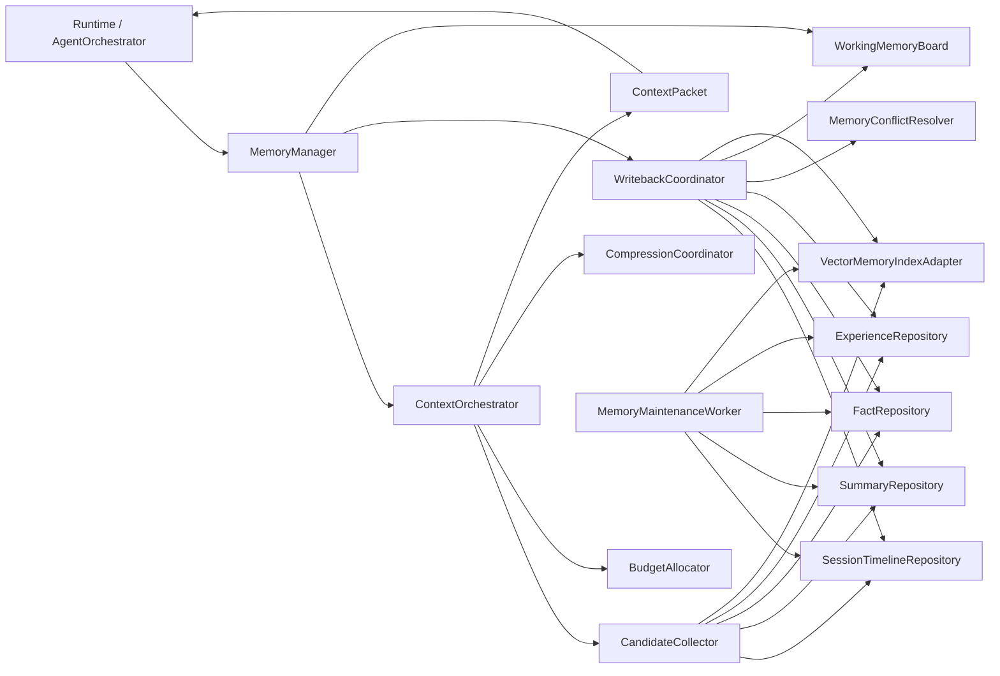
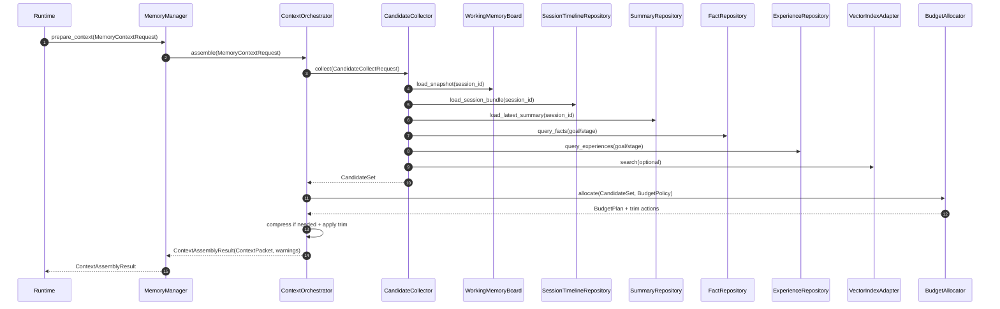
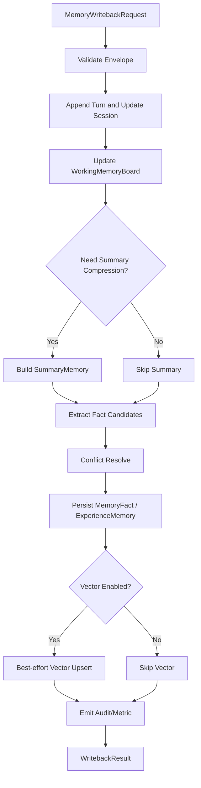
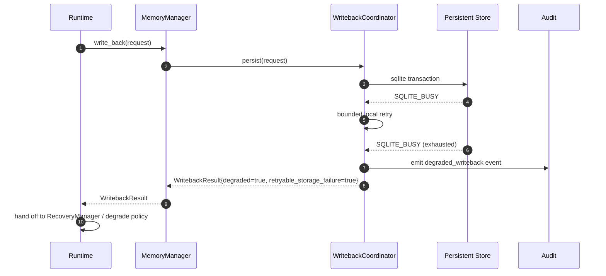
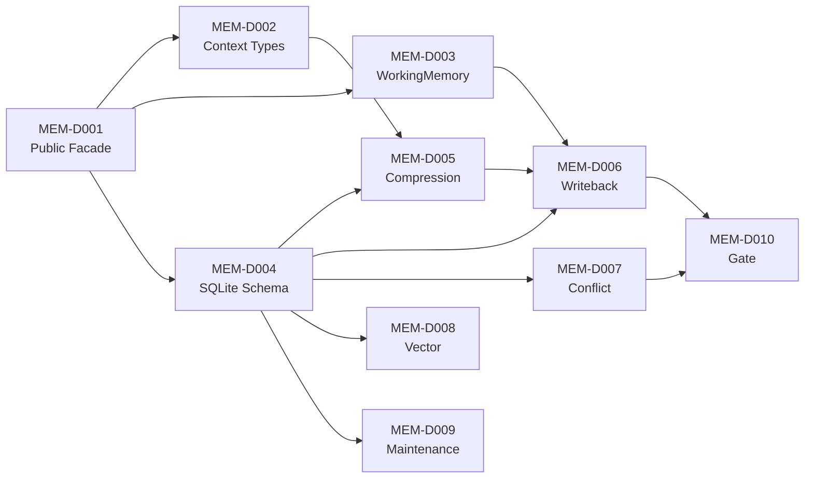

# DASALL Memory 子系统详细设计（Detailed Design）

版本：v1.0
日期：2026-04-14
阶段：Detailed Design
适用模块：memory/

## 1. 模块概览

### 1.1 目标与定位

Memory 子系统是 DASALL 在 Layer 4 Execution & Collaboration Layer 的记忆与语义上下文编排落点，对应工程目录为 memory/。它的目标不是把“聊天历史存一下”，而是在不改变 Runtime 主控权、LLM Prompt 装配权、Tool 执行治理权的前提下，提供以下五类稳定能力：

1. 管理 Working Memory、Short-Term Memory、Long-Term Memory、Vector Memory、Experience Memory 五层记忆结构。
2. 以 ContextOrchestrator 为主控点，向 Runtime 和 Cognition 提供已完成语义裁剪的 ContextPacket。
3. 接收回合结果、ObservationDigest、恢复结论和摘要候选，执行结构化写回、冲突检测与经验沉淀。
4. 在预算不足或历史过长时执行压缩、裁剪和分层保留，而不是把原始历史直接推给 llm。
5. 为后续 Build 阶段提供可实现、可测试、可演进的 memory/include、memory/src、tests/unit、tests/integration 落点。

Memory 子系统不是：

1. Prompt 渲染器。最终消息装配和 provider-specific payload 生成仍归 llm/PromptComposer 与 PromptPolicy。
2. 恢复裁定器。重试、降级、补偿准入与最终恢复执行仍归 runtime/RecoveryManager。
3. Tool 执行器。tools 只输出 Observation/ObservationDigest，memory 不拥有工具调度或副作用执行权。
4. Knowledge 主检索器。knowledge 负责检索与重排；memory 只消费外部证据切片或维护本地 VectorMemory backend。
5. 第二主循环。所有调用时机、等待态、终止条件与最终 AgentResult 权都归 runtime/AgentOrchestrator。

来源依据：

1. DASALL_Agent_architecture.md 3.3.1、4.2、4.6、5.3、6.2、7.2。
2. DASALL_Engineering_Blueprint.md 3.7、7.1、7.2、7.3、7.6。
3. ADR-005、ADR-006、ADR-007、ADR-008。
4. WP05-T006、WP05-T007、WP05-T012 交付物。

### 1.2 边界定义

| 维度 | 内容 | 边界说明 |
|---|---|---|
| 上游主调用者 | runtime | Runtime 负责调用 prepare_context、write_back、export_working_memory_snapshot 的时机；memory 不自行启动轮次处理 |
| 直接消费者 | runtime、cognition、llm | cognition 和 llm 只消费 ContextPacket 投影，不直接访问 memory 后端实现 |
| 同层相邻模块 | tools、knowledge、multi_agent | 只通过 runtime 主链路间接协作；不直连 tools 执行器，不依赖 knowledge 实现类，不参与 multi_agent 主控 |
| 下游依赖 | contracts、infra、可选 SQLite/向量 backend | 共享对象来自 contracts；配置、日志、指标、审计来自 infra；持久化 backend 为 memory 内部实现细节 |
| 禁止依赖 | llm 实现细节、tools 实现细节、services 执行实现、apps 协议入口 | 防止上下文权、执行权和产品入口职责混层 |

### 1.3 设计范围

纳入范围：

1. Memory 子系统职责边界、组件拆分、输入输出和依赖方向。
2. ContextOrchestrator、WorkingMemoryBoard、持久化仓储、写回管线、压缩管线、冲突检测、维护任务的工程落点。
3. module-local 公共接口与 supporting types 的设计，明确哪些放在 memory/include，哪些不进入 contracts。
4. 持久化模型、并发模型、异常语义、可观测性、配置策略、测试策略和 Build 映射。
5. 与 frozen contracts、ADR、profiles、infra、tools、llm 的对齐策略。

不纳入范围：

1. 改写已有 ADR 或 SSOT 结论。
2. 把 module-local supporting types 反向写回 contracts 共享语义对象。
3. knowledge 模块的检索排序算法本体。
4. llm Prompt 资产、Tool 执行链路、Recovery 执行逻辑。
5. 远程分布式 memory service、本地外之外的网络化数据库集群方案。

### 1.4 现有工程信号

当前仓库已经给出以下真实信号：

1. memory/CMakeLists.txt 已存在独立静态库目标 dasall_memory，但当前只编译 src/placeholder.cpp，说明工程入口已预留、实现仍为空骨架。
2. memory/ 当前没有 include/ 目录，说明 module public interface 尚未落位。
3. tests/unit/memory/CMakeLists.txt 仍为占位，tests/integration 目录下也没有 memory 子目录，说明模块级单测和集成门禁尚未建立。
4. contracts/include/memory/ 已冻结 Turn、Session、SummaryMemory、MemoryFact、ExperienceMemory 五类共享对象。
5. tests/contract/memory/ 已建立 TurnSessionSummaryMemoryContractTest 和 MemoryFactExperienceContractTest，说明 memory 共享对象边界已有自动化基线。
6. WP05-T012 已明确 IMemoryStore、IContextOrchestrator 当前不进入 contracts admission，意味着后续接口应先落在 memory/include，而不是误写到 contracts。
7. contracts/include/context/ 当前只有 ContextPacket 和 Guards，没有 ContextAssembleRequest/Result、CompressionRequest/Result，这些 supporting types 仍应保持 module-local。

基于这些信号，当前结论必须明确写成：

1. architecture ready：边界、五层记忆、ContextOrchestrator 所有权、共享对象基线已明确。
2. implementation not ready：memory 公共头、核心实现、持久化 backend、单测、集成测试、性能/故障门禁均未落地。

---

## 2. 约束清单

### 2.1 Must / Should / Must-Not 约束表

| Constraint ID | 来源 | 类型 | 约束描述 | 影响范围 |
|---|---|---|---|---|
| MEM-C001 | DASALL_Agent_architecture.md 4.6、5.3；Blueprint 3.7 | Must | memory 必须负责五层记忆与 ContextPacket 语义装配闭环，而不是只做聊天记录存储 | 总体职责 |
| MEM-C002 | ADR-006 | Must | ContextOrchestrator 归属 memory，拥有语义上下文装配权与语义预算裁剪权 | context 装配 |
| MEM-C003 | ADR-006 | Must-Not | memory 不得生成最终 messages、provider payload 或 rendered prompt | llm/memory 边界 |
| MEM-C004 | ADR-007 | Must | memory 可以持久化恢复结果、补偿结果和经验摘要，但不得决定 retry、replan、abort_safe 的最终执行 | recovery 边界 |
| MEM-C005 | ADR-008 | Must-Not | memory 不得形成独立主循环、用户交互通道或全局调度中心 | runtime/memory 边界 |
| MEM-C006 | Blueprint 3.7；架构 5.3.3 | Must | token 预算不足时必须优先保留 goal、constraints、latest_observation，不得优先裁掉安全边界 | 预算裁剪 |
| MEM-C007 | 架构 5.3.4；WP05-T007 | Must | 未确认假设不得写成稳定事实；Long-Term Memory 写入必须保留证据来源与置信度 | fact 写回 |
| MEM-C008 | 架构 5.3.7；WP05-T006/T007 | Must | 历史压缩必须保留 confirmed_facts；open_questions 和 pending_actions 不得在压缩时丢失，但可以通过 working memory 或 runtime checkpoint 保留，而不是强行扩 shared contracts | 压缩闭环 |
| MEM-C009 | Blueprint 3.7 | Must-Not | memory 不依赖 cognition/llm/tools 的具体实现类 | 依赖方向 |
| MEM-C010 | DASALL_tools子系统详细设计.md | Must | tools 只输出 Observation/ObservationDigest，由 runtime 交给 memory 写回；不允许 tools 直写 memory 持久层 | tools 边界 |
| MEM-C011 | WP05-T006 | Must | Turn、Session、SummaryMemory 只表达稳定存储面，不得吸收 SessionContext、Checkpoint、raw payload 字段 | shared contracts |
| MEM-C012 | WP05-T007 | Must | MemoryFact、ExperienceMemory 只表达事实与经验沉淀面，不得吸收 runtime 控制字段、provider 字段、checkpoint 字段 | shared contracts |
| MEM-C013 | WP05-T012 | Must | IMemoryStore、IMemoryManager、IContextOrchestrator 应先落在 memory/include，保持 module public interface，不进入 contracts admission | 接口落点 |
| MEM-C014 | DASALL_工程协作与编码规范.md 3.6/3.7 | Must | 模块边界错误必须显式上报；新增公共接口必须同步补 unit 或 integration 测试 | 错误处理、测试 |
| MEM-C015 | SQLite WAL 文档 | Must | 若选 SQLite WAL，必须接受“单 writer、多 reader、同主机、需要 checkpoint 管理”的约束 | 持久化方案 |
| MEM-C016 | SQLite WAL 文档 | Must | 使用 WAL 时需要声明 checkpoint 策略、reader gap、SQLITE_BUSY 处理与 SQLite 版本基线 | 运维与可靠性 |
| MEM-C017 | Azure Retry pattern | Should | 仅在仓储层对可判定幂等的本地存储错误做极小范围重试，避免 layered retry | 失败处理 |
| MEM-C018 | Azure Compensating Transaction pattern | Should | 写回与补偿记录应具备可追溯、可恢复、幂等执行的元数据，但补偿执行权不在 memory | 经验沉淀 |
| MEM-C019 | Blueprint 7.6 | Must | Memory 设计必须映射到单元测试、集成测试、契约测试和失败注入测试 | 测试规划 |
| MEM-C020 | 架构 5.3.2；Blueprint 3.7 | Should | 矢量索引能力默认可裁剪；在边缘低配 profile 下允许关闭 VectorMemory 而不影响 Session/Turn/Summary 基线 | profile 裁剪 |
| MEM-C021 | 架构 5.3.2；DASALL_llm子系统详细设计.md | Must-Not | ProgrammaticMemory 不能复制 llm/tools 的资产正文；当前阶段只允许保留稳定 asset ref 或标签，不复制 Prompt/Skill 本体 | 资产边界 |
| MEM-C022 | SQLite WAL 文档 2026-03-20 更新 | Must | 若 memory 采用 WAL 且存在多线程写入/检查点并发，SQLite 版本应至少为 3.51.3 或采用已回补修复版本 | 版本基线 |

### 2.2 约束抽取结论

Must：

1. Memory 必须是 ContextPacket 的语义供应方与写回闭环执行方，不是 prompt 渲染方。
2. 共享对象边界必须复用当前 frozen contracts，不能因为详细设计而回扩字段。
3. Module public interface 应落在 memory/include，而不是抢先进入 contracts。
4. 历史压缩、事实沉淀和经验沉淀必须保持证据链、置信度和可审计性。
5. Storage 方案必须与同机单 writer、多 reader、checkpoint 管理现实相匹配。

Should：

1. 优先采用单进程、本地 SQLite 逻辑主库 + 可选向量 sidecar 的收敛方案，而不是一开始拆远程化存储。
2. 优先建立 Session/Turn/Summary/WorkingMemory 主链路，再增量打开 Fact/Experience/Vector。
3. profile 差异优先通过配置与 feature flag 落地，而不是分叉两套 memory 实现。

Must-Not：

1. 不把 runtime 恢复字段、SessionContext 字段、provider 私有字段写入 memory 共享对象。
2. 不让 memory 直接执行 tool、recovery、prompt 相关逻辑。
3. 不把 ContextAssembleRequest/Result 等未冻结对象误写成 shared contracts 既成事实。

---

## 3. 现状与缺口

### 3.1 当前实现状态

| 观察项 | 当前状态 | 证据 | 结论 |
|---|---|---|---|
| memory 模块构建入口 | 已存在 | memory/CMakeLists.txt | 有独立静态库目标，但只维持空库可编译 |
| memory 源码实现 | 占位 | memory/src/placeholder.cpp | 当前没有真实 memory 子系统实现 |
| memory 公共头文件 | 缺失 | memory/ 目录现状 | IMemoryStore / IMemoryManager / IContextOrchestrator 尚未落位 |
| module-local supporting types | 缺失 | memory/include 不存在 | Context 装配、写回、查询 supporting types 尚未定义 |
| WorkingMemory 实现 | 缺失 | 无 working/ 目录 | 当前没有内存黑板或 snapshot 导出实现 |
| Session/Turn/Summary 持久化实现 | 缺失 | 无 sqlite/ repo 实现 | 短期记忆仍无真实 backend |
| Long-Term / Experience 写回实现 | 缺失 | 无 fact / experience repo 实现 | 事实冲突检测和经验沉淀尚未落地 |
| VectorMemory backend | 缺失 | 无 vector/ 目录 | 仅有架构建议，没有 backend 接入 |
| contract 对象 | 已冻结 | contracts/include/memory/* | Shared contract 基线可直接复用 |
| contract tests | 已存在 | tests/contract/memory/* | 共享对象边界已有自动化门禁 |
| unit tests | 占位 | tests/unit/memory/CMakeLists.txt | 当前没有模块级单测 |
| integration tests | 缺失 | tests/integration 无 memory 子目录 | 当前没有模块联动验证 |
| shared interface admission | Postpone | WP05-T012 | 接口需先放在 memory/include，不进入 contracts |
| ContextAssemble supporting objects | 缺失于 contracts | contracts/include/context 仅有 ContextPacket | 装配请求/结果必须先 module-local |

### 3.2 现状-目标差距表

| 目标能力 | 当前状态 | 关键差距 | 风险等级 | 优先级 |
|---|---|---|---|---|
| runtime 可调用的 memory 公共接口 | 缺失 | 没有 memory/include 公共接口 | High | P0 |
| WorkingMemory 黑板 | 缺失 | 没有 session-scoped in-memory board 和 snapshot 导出 | High | P0 |
| Session/Turn/Summary SQLite 持久化 | 缺失 | 没有 schema、repo、transaction 边界 | High | P0 |
| ContextOrchestrator 主路径 | 缺失 | 没有 candidate collector、budget allocator、compression pipeline | High | P0 |
| 写回闭环 | 缺失 | 没有 writeback coordinator、事实候选、经验候选 | High | P0 |
| 冲突检测 | 缺失 | 没有 evidence merge、supersede、audit 记录 | Medium | P1 |
| VectorMemory | 缺失 | 没有可裁剪向量 backend 或 fallback 方案 | Medium | P1 |
| 维护任务 | 缺失 | 没有 checkpoint、retention、compaction、rebuild | Medium | P1 |
| 失败路径治理 | 缺失 | 没有 SQLite BUSY、schema mismatch、disk full 的 module-level handling | High | P0 |
| observability | 缺失 | 没有 memory 级 log/metric/trace/audit | Medium | P1 |
| unit / integration gate | 缺失 | 设计无法自动回归 | High | P0 |

### 3.3 风险冲突识别

| 冲突类型 | 描述 | 若不处理的后果 |
|---|---|---|
| 边界冲突 | memory 若直接拼装 prompt message 或 provider payload，将违反 ADR-006 | llm 与 memory 双上下文主控点 |
| 语义冲突 | 为了保留 open_questions/pending_actions 而回扩 SummaryMemory 字段 | 破坏 contracts 冻结策略 |
| 依赖反转 | memory 若直接依赖 knowledge 实现类或 tools 执行器 | Layer 4 内部形成隐性环依赖 |
| 恢复越权 | memory 若自带大规模 retry / compensation 控制 | runtime/RecoveryManager 职责被侵蚀 |
| 存储冲突 | 若把多类持久层一开始拆成多个 ATTACH 数据库 | SQLite WAL 下跨库原子性与迁移复杂度上升 |
| 性能冲突 | 若无 reader gap 和 checkpoint 策略 | WAL 膨胀、读延迟恶化、边缘设备磁盘抖动 |

### 3.4 现状结论

当前 memory 最合适的推进方式不是继续扩 shared contracts，而是：

1. 以现有 contracts 为硬边界，在 memory/include 落 module public interface。
2. 先实现 WorkingMemory、Session/Turn/Summary 和 ContextOrchestrator 主链路。
3. 再增量打开 Fact/Experience/Vector/维护任务，并以 feature flag 和 profile 策略控制启用面。

---

## 4. 候选方案对比

### 4.1 行业实践信号

| 参考方向 | 提炼出的稳定结论 | 对 DASALL 的启发 |
|---|---|---|
| Azure Retry Pattern | 只在“完整理解失败上下文”的位置做重试，避免多层嵌套 retry；幂等性必须先被确认 | memory 只允许在仓储层对 SQLite BUSY 等可判定幂等错误做极小范围本地重试，超出即回报 runtime |
| Azure Compensating Transaction Pattern | 补偿信息必须可记录、可恢复、可续跑，但补偿执行权属于 orchestration/workflow 层 | memory 负责沉淀 ExperienceMemory 和补偿结果证据，不负责执行补偿 |
| SQLite WAL / Locking | WAL 适合同机单 writer、多 reader，读写并发依赖 checkpoint 管理；多数据库 ATTACH 在 WAL 下不具备强原子性 | 持久化宜收敛为单逻辑主库 + 单 writer 模型，避免一开始拆多库和多 writer |

#### 4.1.1 当代 Agent Memory 框架对标

下表从 **存储分层、上下文组装、遗忘/压缩、多 Agent 共享** 四个维度提炼主流开源/商业框架的核心设计选择，并与 DASALL memory 进行对照。

| 框架 | 存储分层 | 上下文组装 | 遗忘 / 压缩 | 多 Agent 共享 | DASALL 对照 |
|---|---|---|---|---|---|
| **MemGPT / Letta** (arXiv 2310.08560) | Main Context（有限窗口）+ Archival Storage（向量）+ Recall Storage（全文） | 虚拟分页：LLM 自主发出 `memory_search` / `archival_insert` 等 function call，由系统将结果插入 main context | 通过 `core_memory_replace` 显式覆写；archival 不主动删除 | 单 Agent 设计，共享需外部编排 | DASALL 的 WorkingMemory→SQLite→向量三层与 Main/Recall/Archival 同构；DASALL 的 ContextOrchestrator 类似 MemGPT 的 inner-loop，但由系统管控而非 LLM 自主调度 |
| **MemoryOS** (arXiv 2506.06326) | Short-term（recent buffer）→ Mid-term（structured index）→ Long-term（compressed archive） | 层次化检索：先 short-term 命中则跳过深层；mid-term 用结构化索引 + 摘要加速；long-term 用向量/关键词 | Mid→Long 自动压缩（摘要化）；引入"遗忘曲线"权重衰减 | 支持 agent_id 级隔离，共享通过 long-term 索引 | DASALL 的 Episodic/Semantic/Programmatic 三子层可分别对应 S/M/L；CompressionCoordinator 承担 Mid→Long 职能；DASALL 尚未引入遗忘曲线——列为 MEM-E02 演进项 |
| **CrewAI Memory** | Short-term + Long-term + Entity Memory + User Memory，4 种语义分区 | 统一 Memory 接口；search() 做复合评分（recency + relevance + importance） | 内置 consolidation（去重+合并）但无显式 TTL | Agent 间通过 shared long-term 空间协作 | DASALL 的 MemoryFact ≈ Entity Memory；Turn/Session ≈ Short-term；SummaryMemory ≈ Long-term。composite scoring 可在 CandidateCollector 中分阶段引入 |
| **LangGraph Memory** | Thread-level checkpointer（per-conversation state）+ cross-thread Store（长期 KV） | Checkpointer 自动注入最近 N 条 message；Store 需显式 get/put | 不内置压缩；Store 条目需应用层管理 TTL | Store 支持 namespace 隔离，multi-agent 通过 graph 拓扑共享 state | DASALL 的 Session/Turn 等价 Thread checkpointer；MemoryFact/ExperienceMemory 等价 Store；DASALL 比 LangGraph 多了压缩和冲突消解层 |

#### 4.1.2 对标结论

1. **三层存储是行业共识**——MemGPT、MemoryOS、CrewAI 均采用 short/mid/long 或等价分层，DASALL 的 WorkingMemory→SQLite→Vector 与之同构。
2. **上下文组装应由系统管控**——MemGPT 让 LLM 自决 function call 的做法带来不确定性；DASALL 选择 ContextOrchestrator 系统管控 + CandidateCollector 评分，与 CrewAI composite scoring 方向一致，更可控。
3. **压缩/遗忘是必选项**——MemoryOS 的遗忘曲线、CrewAI 的 consolidation 均证明长期记忆需主动治理。DASALL 当前以 CompressionCoordinator 覆盖摘要压缩，遗忘曲线权重衰减列入 MEM-E02。
4. **多 Agent 共享需显式边界**——所有框架均在 namespace/agent_id 级做隔离。DASALL 通过 `agent_id` 字段和 contracts 语义约束实现等价隔离，后续多 Agent 共享场景由 multi_agent 子系统编排。

### 4.2 候选方案 A：单体 MemoryManager 同步直连方案

设计思路：

1. 一个 MemoryManager 同时负责 WorkingMemory、SQLite 读写、Context 组装、摘要压缩、事实冲突、向量检索。
2. 所有流程都在同步调用栈中完成，不区分 facade、repo、pipeline。

组件结构：

1. MemoryManager
2. SqliteConnection
3. InMemoryCache

优点：

1. 代码量最少，最快能替换 placeholder。
2. 调试路径短，单线程场景容易跑通最小 demo。

风险：

1. 极易演化为 God Object，把 context、writeback、maintenance、fact conflict 全塞进一个类。
2. 无法稳定防守 ADR-006/007 边界，后续容易顺手把 llm/runtime 逻辑吸进来。
3. 单测粒度差，仓储、预算、压缩、冲突、降级很难拆开验证。
4. 一旦接入 VectorMemory 或 Maintenance，复杂度会指数上升。

与 DASALL 约束匹配度：低。

### 4.3 候选方案 B：分层仓储 + ContextOrchestrator + Writeback/Compression Pipeline 方案

设计思路：

1. 以 IMemoryManager 作为 runtime-facing facade，内部拆分 ContextOrchestrator、WorkingMemoryBoard、仓储层、写回层、维护层。
2. 持久层采用单 SQLite 逻辑主库承载 Session/Turn/Summary/Fact/Experience，VectorMemory 作为可选 sidecar 或同库扩展。
3. Context 装配、写回、压缩、维护分别走独立责任链，避免单一对象拥有过多职责。

组件结构：

1. IMemoryManager / MemoryManager
2. IContextOrchestrator / ContextOrchestrator
3. WorkingMemoryBoard
4. SessionTimelineRepository、SummaryRepository、FactRepository、ExperienceRepository
5. CompressionCoordinator、MemoryConflictResolver、VectorMemoryIndexAdapter、MemoryMaintenanceWorker

优点：

1. 最贴合 ADR-006，对“语义上下文权”和“消息装配权”做了清晰分层。
2. 与 frozen contracts 对齐，不需要回扩共享对象。
3. 可测试性最好，单元测试、集成测试和失败注入都能有明确边界。
4. 支持 profile 裁剪，VectorMemory、ExperienceMemory、维护线程都可以单独开关。
5. 适合当前单机 C++ 骨架，也为后续演进留出接口提升空间。

风险：

1. 前期类与 supporting types 数量多于方案 A。
2. 需要明确 module-local 类型边界，避免“为了省事直接进 contracts”。
3. 需要同步补齐 unit/integration gate，否则设计复杂度会失控。

与 DASALL 约束匹配度：高。

### 4.4 候选方案 C：事件总线驱动的异步 Memory Hub 方案

设计思路：

1. 以事件队列为核心，Context 装配、写回、压缩、向量索引全部异步化。
2. Memory 自带投影器、outbox、materializer、重试调度器。

组件结构：

1. MemoryEventBus
2. ProjectionWorkers
3. AsyncMaterializers
4. QueryReadModels

优点：

1. 理论上扩展性最好，天然适合高并发写回和后续分布式演进。
2. 读写分离做得最彻底。

风险：

1. 与当前单机 C++ skeleton 和尚未落地的 runtime 主链路不匹配。
2. 容易形成 memory 内部第二调度中心，侵蚀 runtime 主控边界。
3. 故障排查、测试夹具、时序一致性成本显著升高。
4. 当前 contracts supporting objects 尚不完整，异步投影会放大语义漂移风险。

与 DASALL 约束匹配度：中低。

### 4.5 候选方案对比矩阵

| 维度 | 方案 A | 方案 B | 方案 C |
|---|---|---|---|
| 起步成本 | 低 | 中 | 高 |
| 架构边界稳定性 | 低 | 高 | 中 |
| contracts 一致性 | 中低 | 高 | 中 |
| 工程可实现性 | 中 | 高 | 低 |
| 可测试性 | 低 | 高 | 中 |
| profile 裁剪友好度 | 低 | 高 | 中 |
| 与当前代码骨架匹配度 | 中 | 高 | 低 |
| 长期演进潜力 | 中 | 高 | 高 |

---

## 5. 决策结论

### 5.1 最终选型

选择方案 B：分层仓储 + ContextOrchestrator + Writeback/Compression Pipeline 方案。

进一步细化后的落地决策如下：

1. 公共接口以 memory/include 为落点，不把 IMemoryStore、IMemoryManager、IContextOrchestrator 提前推进 contracts。
2. WorkingMemory 采用进程内黑板 + runtime checkpoint 投影，不默认落 SQLite。
3. Short-Term、Long-Term、Experience 持久层默认收敛为单个 SQLite 逻辑主库 memory.db，以逻辑表分层而不是一开始拆多 ATTACH 数据库。
4. VectorMemory 采用可裁剪 backend，默认 desktop_full/cloud_full 可启用，edge_minimal 可关闭。
5. Vector 索引更新为 best-effort 后置步骤，不阻断核心 Session/Turn/Summary/Fact/Experience 提交。
6. 本地存储只允许 bounded local retry；跨轮恢复、降级和补偿仍由 runtime 决定。

### 5.2 放弃其他候选方案的理由

放弃方案 A：

1. 它把 Context 装配、压缩、持久化、冲突检测和维护任务混在一个类里，最容易在实现期越权侵入 llm/runtime。
2. 它不利于后续补齐失败注入和 profile 裁剪，也不适合当前 contracts-first 的推进顺序。

放弃方案 C：

1. 它需要 event/outbox/materializer 等一整套异步基础设施，超出当前 memory 详细设计应承接的范围。
2. 它会把 memory 推向“局部调度中心”，与 ADR-008 的全局主控约束存在天然张力。

### 5.3 与架构、ADR、contracts 的一致性说明

1. 与架构一致：Memory 仍是 Layer 4 的语义上下文与记忆闭环子系统，不接管 llm、tool、recovery。
2. 与 ADR-006 一致：ContextOrchestrator 只产出 ContextPacket，不生成最终 messages。
3. 与 ADR-007 一致：memory 只沉淀恢复/补偿结果，不裁定是否 retry 或 compensate。
4. 与 ADR-008 一致：memory 只服务 runtime 主循环，不形成独立调度中心。
5. 与 contracts 一致：Turn/Session/SummaryMemory/MemoryFact/ExperienceMemory 复用现有 shared objects；Context 装配 supporting types 保持 module-local。

---

## 6. 详细设计

### 6.1 职责边界

| 领域 | 归属 memory 的职责 | 不归属 memory 的职责 |
|---|---|---|
| Working Memory | 管理当前 session/task 的黑板槽位、TTL、snapshot 导出 | checkpoint 持久化与恢复准入裁定 |
| Session Timeline | 持久化 Session、Turn、SummaryMemory | SessionContext 运行态维护、FSM 控制 |
| Long-Term Facts | MemoryFact 冲突检测、证据引用、置信度阈值写回 | BeliefState 语义决策、事实真伪最终认知判断 |
| Experience | ExperienceMemory 经验条目沉淀与查询 | 补偿执行、恢复流程调度 |
| Context 装配 | 候选收集、压缩、预算分配、ContextPacket 生成 | Prompt 选择、Prompt 装配、Provider payload 生成 |
| Vector Backend | 本地索引存储、upsert、search adapter、rebuild | knowledge 侧检索策略、重排与查询理解 |
| Maintenance | retention、checkpoint、compaction、quarantine | 全局计划重排、用户确认等待 |

### 6.2 子系统结构与调用关系



结构说明：

1. MemoryManager 是 runtime-facing facade，统一生命周期、prepare_context、write_back 和维护入口。
2. ContextOrchestrator 只处理语义上下文装配，不直接做持久化写入。
3. WritebackCoordinator 负责把回合结果拆分为 Turn、Summary、Fact、Experience 的持久化动作。
4. WorkingMemoryBoard 保持进程内快速可变态，不与 Session/Checkpoint 混层。
5. MaintenanceWorker 处理 retention、WAL checkpoint、quarantine、索引重建，不参与主链路语义决策。

### 6.3 子组件清单与组件职责

| 组件 | 职责 | 输入 | 输出 | 依赖 | Must-Not |
|---|---|---|---|---|---|
| MemoryManager | runtime-facing facade；统一 prepare_context/write_back/export/maintenance | MemoryContextRequest、MemoryWritebackRequest、WorkingMemoryExportRequest、MaintenanceRequest | ContextAssemblyResult、WritebackResult、WorkingMemoryExportResult、MaintenanceReport | ContextOrchestrator、WritebackCoordinator、WorkingMemoryBoard、IMemoryStore | 不直接做 provider payload 装配 |
| ContextOrchestrator | 组装 ContextPacket；触发压缩和预算裁剪 | MemoryContextRequest、候选记忆切片 | ContextPacket、dropped_sections、warnings | CandidateCollector、BudgetAllocator、CompressionCoordinator | 不直接持久化 Turn/Fact |
| CandidateCollector | 从 WorkingMemory、Session/Turn、Summary、Fact、Experience、可选 Vector/外部证据收集候选项 | session_id、stage、预算提示、外部证据 | CandidateSet | 各仓储、WorkingMemory、Vector adapter | 不直接决定最终 ContextPacket |
| BudgetAllocator | 按 stage/risk/latency/token budget 进行分层分配 | CandidateSet、BudgetPolicy | BudgetPlan、trim actions | 配置策略 | 不读底层数据库 |
| CompressionCoordinator | 生成 SummaryMemory；将长历史压成结构化摘要 | CompressionInput、SummaryGenerationRequest | SummaryMemory、SummaryProjection、compression notes | IMemoryStore（summary surface）、ISummarizer（可选） | 不直接修改 Prompt 或 Checkpoint |
| WritebackCoordinator | 把回合结果拆分写回；协调核心持久化事务 | MemoryWritebackRequest | WritebackResult | 仓储层、ConflictResolver、WorkingMemoryBoard | 不拥有恢复裁定权 |
| WorkingMemoryBoard | 管理 session/task 内存黑板、TTL、pending slots、snapshot export | slot ops、snapshot request | WorkingMemorySnapshot、ephemeral context slices | 内存结构、clock | 不直接写 SQLite |
| SessionTimelineRepository | 持久化 Session、Turn；维护 session 索引 | Session/Turn | SessionLoadBundle、append/update result | SQLite backend | 不持有 runtime SessionContext |
| SummaryRepository | 持久化与查询 SummaryMemory | SummaryMemory、summary query | latest summary、history summary batch | SQLite backend | 不替代 ContextPacket |
| FactRepository | 持久化与查询 MemoryFact，支持 supersede 标记 | MemoryFact、FactQuery | FactQueryResult、upsert result | SQLite backend | 不记录 runtime/prompt 字段 |
| ExperienceRepository | 持久化与查询 ExperienceMemory | ExperienceMemory、ExperienceQuery | ExperienceQueryResult | SQLite backend | 不控制 compensation 执行 |
| MemoryConflictResolver | 检测事实冲突、归并证据、决定是否 supersede | FactCandidate、existing facts | ConflictResolutionPlan | FactRepository、规则策略 | 不新增 shared contract 字段 |
| VectorMemoryIndexAdapter | 可选索引写入/查询/rebuild | Vector documents、query | vector hits、health | SQLite-vss/sidecar backend | 不承担 knowledge 检索编排 |
| MemoryMaintenanceWorker | retention、WAL checkpoint、quarantine、rebuild | MaintenancePlan | audit/metrics/report | 仓储层、Vector adapter、infra hooks | 不阻塞主链路语义装配 |

> **设计决策注记**：上表中 SessionTimelineRepository、SummaryRepository、FactRepository、ExperienceRepository 为逻辑职责概念。在 §6.12.5 组件级详细设计中，这些逻辑仓储统一由 `SqliteMemoryStore` 一个实现类承载（理由见 §6.6 IMemoryStore 接口设计决策说明：单 SQLite 逻辑主库 + 事务原子性需求 + DI 友好性）。CandidateCollector / CompressionCoordinator / WritebackCoordinator / ConflictResolver 等内部消费方均通过 `IMemoryStore` 接口访问，不直接依赖独立 Repository 实例。

#### 6.3.1 CompressionCoordinator 摘要文本生成策略

Summary 压缩需要从原始 Turn 序列生成结构化摘要文本（summary_text、decisions_made、confirmed_facts、tool_outcomes），而约束 MEM-C009 禁止 memory 直接依赖 llm 实现类。本设计采用三阶段策略：

**阶段 1（Slice 1-2，当前优先）：结构化提取 + 模板拼接**

1. CompressionCoordinator 从 Turn 序列中提取结构化字段（tool_call_refs、observation_refs、user_input、agent_response），按规则拼接为 summary_text。
2. decisions_made、confirmed_facts、tool_outcomes 直接从 Turn 内容中按关键字或 tag 提取。
3. 不使用 LLM，压缩质量受限但不引入外部依赖，适合最小闭环验证。

**阶段 2（Slice 2+ 可选）：ISummarizer 抽象接口注入**

1. memory 定义 module-local 抽象接口 ISummarizer：

```cpp
class ISummarizer {
public:
  virtual ~ISummarizer() = default;
  virtual SummaryGenerationResult summarize(
      const SummaryGenerationRequest& request) = 0;
};
```

2. 工厂函数根据配置决定注入何种实现：
   - 无 LLM 可用时：注入 TemplateBasedSummarizer（阶段 1 的规则引擎）。
   - 有 LLM 可用时：注入 LLMBackedSummarizer，该实现通过 runtime 提供的回调或 service adapter 间接使用 LLM 能力，而 memory 编译依赖图中不出现 llm 模块。
3. runtime 在组装 MemoryManager 时，可将 LLM-backed summarizer 作为 ISummarizer 实现注入，从而解耦编译依赖和运行时能力。

**阶段 3（远期）：runtime 预生成摘要**

1. runtime 在 write_back 调用前先调用 LLM 生成摘要文本，通过 MemoryWritebackRequest.summary_candidates 直接传入已完成的 SummaryMemory 候选。
2. CompressionCoordinator 在此模式下只做 validation 和持久化，不做文本生成。

当前 Slice 1-2 优先采用阶段 1 策略，阶段 2 在 ContextOrchestrator 落地后按需引入。

#### 6.3.2 VectorMemory Embedding 生成策略

VectorMemoryIndexAdapter 在 upsert 和 search 时需要 embedding 向量。与 ISummarizer 对称，memory 模块定义 IEmbeddingAdapter 抽象接口，避免直接依赖具体 embedding 实现：

```cpp
class IEmbeddingAdapter {
public:
  virtual ~IEmbeddingAdapter() = default;
  virtual std::vector<float> embed(const std::string& text) = 0;
  virtual int dimension() const = 0;
};
```

注入策略：

1. **无 embedding 可用时**（edge_minimal / vector disabled）：VectorMemoryIndexAdapter 标记为 unavailable，所有操作 no-op。
2. **本地轻量 embedding**：注入基于 TF-IDF / BM25 的 SimpleLocalEmbeddingAdapter（memory 内部实现），维度和质量有限但无外部依赖。
3. **外部 embedding service**：runtime 在组装 MemoryManager 时注入 ExternalEmbeddingAdapter（通过 service adapter 间接使用 LLM/embedding API），memory 编译依赖图中不出现 embedding service 模块。

工厂函数根据 `VectorConfig.backend_type` 和可用的 IEmbeddingAdapter 决定创建哪种 VectorMemoryIndexAdapter 实现。

### 6.4 子组件依赖关系与上下游调用关系

| 调用关系 | 方向 | 语义 | 边界说明 |
|---|---|---|---|
| runtime -> memory | 主依赖 | prepare_context、write_back、export_working_memory_snapshot | memory 不决定调用时机 |
| memory -> contracts | 共享对象依赖 | ContextPacket、Turn、Session、SummaryMemory、MemoryFact、ExperienceMemory、ErrorInfo、ResultCode | 只能复用，不回改 |
| tools -> runtime -> memory | 间接输入 | ObservationDigest、tool refs、tool outcomes | tools 不直写 memory |
| knowledge/runtime -> memory | 间接输入 | retrieval_evidence 或 external evidence slice | memory 不依赖 knowledge 具体实现 |
| memory -> llm | 间接输出 | 仅通过 ContextPacket 被 PromptComposeRequest 消费 | 不传 messages |
| memory -> infra | 下游依赖 | config、log、metric、trace、audit、secretless path config | 仅消费观测与配置 |

### 6.5 核心对象与 contracts 对齐关系

#### 6.5.1 五层记忆与对象映射

| 记忆层 | Shared contract / 稳定对象 | module-local 对象 | 设计说明 |
|---|---|---|---|
| Working Memory | 无独立 shared object；与 runtime Checkpoint snapshot 对接 | WorkingMemorySnapshot、WorkingMemorySlot、PendingQuestionSet | WorkingMemory 是运行态黑板，不进入 contracts，导出时只给 runtime snapshot |
| Short-Term Memory | Session、Turn、SummaryMemory | SessionLoadBundle、RecentTurnWindow、SummaryProjection | 负责会话连续性和历史压缩 |
| Long-Term Memory（Semantic） | MemoryFact | FactCandidate、MemoryConflictRecord、FactQuery | 稳定事实面，必须带来源与置信度 |
| Experience Memory | ExperienceMemory | ExperienceCandidate、ExperienceQuery | 经验、失败恢复、重规划教训沉淀 |
| Vector Memory | 当前无 frozen shared object | VectorDocument、VectorHit、VectorIndexHealth | backend 细节保留在 memory 内部 |
| Programmatic Memory | 当前不新增 shared object | ProgrammaticMemoryRef | 当前阶段只保留 asset ref/tag，不复制 Prompt/Skill 本体 |

#### 6.5.1a 架构三子层到详细设计的收敛映射

架构 §5.3.2 将 Long-Term Memory 进一步细分为 Episodic（历史会话与任务摘要）、Semantic（稳定事实/外部知识索引）、Programmatic（Skill/Prompt 资产行为约束）三个认知子层。以下说明当前 frozen contracts 和详细设计如何覆盖这三个子层：

| 架构认知子层 | 对应 frozen contracts | 详细设计落点 | 收敛说明 |
|---|---|---|---|
| Episodic Memory（历史会话与任务摘要） | Session、Turn、SummaryMemory | SessionTimelineRepository、SummaryRepository、CompressionCoordinator | SummaryMemory 以结构化摘要（decisions_made、confirmed_facts、tool_outcomes）形式承载 Episodic 沉淀；Turn 保留原始回合索引 |
| Semantic Memory（稳定事实/外部知识索引） | MemoryFact | FactRepository、MemoryConflictResolver、VectorMemoryIndexAdapter | MemoryFact 承载经过置信度和证据链验证的稳定事实；VectorMemory 提供语义索引辅助检索 |
| Programmatic Memory（Skill/Prompt 资产行为约束） | 当前无 frozen shared object | 当前阶段不持久化 | 理由：Prompt/Skill 资产本体归 llm 模块 PromptAssetRepository 管理（见 DASALL_llm子系统详细设计.md §5），memory 当前阶段只允许保留 asset ref/tag 语义引用（ProgrammaticMemoryRef），不复制资产正文；待 llm 资产治理稳定并明确跨模块 lease 方案后再评估是否需要独立持久化 |

此映射确保架构期望的三子层在详细设计中有明确落点或明确推迟理由，不产生"无人认领"的空白地带。

#### 6.5.2 架构概念与当前 contracts 差异收敛

| 架构概念 | 架构期望 | 当前 frozen contracts / 现状 | 本设计收敛方式 |
|---|---|---|---|
| ContextAssembleRequest / Result | 架构文档建议存在 | contracts 尚未冻结 | 先定义为 memory/include/context/ 下的 module-local supporting types |
| CompressionRequest / Result | 架构文档建议存在 | contracts 尚未冻结 | 保持 module-local，不进入 contracts |
| SummaryMemory.open_questions / pending_actions | 架构期望压缩时保留 | SummaryMemory shared contract 不含这两个结构化字段 | open_questions 保留在 WorkingMemorySlot 并可投影到 summary_text；pending_actions 继续由 runtime Checkpoint 持有 |
| MemoryFact.conflicts_with | 架构草图建议字段 | 当前 MemoryFact 采用 superseded_by_fact_id + evidence/source refs | 冲突关系落在 MemoryConflictRecord 与 audit event，不回扩 shared object |
| SessionSnapshot | Blueprint 提及 | shared contract 未冻结 | 作为 module-local 查询结果对象存在，不进入 contracts |

#### 6.5.3 关键 module-local 类型

| 类型 | 主要字段 | 用途 | 是否进入 contracts |
|---|---|---|---|
| MemoryContextRequest | request_id、session_id、stage、goal_summary、constraints_summary、latest_observation_digest_summary、visible_tools、token_budget_hint、latency_budget_ms、external_evidence | runtime 发起上下文装配请求 | 否 |
| ContextAssemblyResult | result_code、context_packet、dropped_sections、compression_notes、warnings、degraded | prepare_context 的 facade 返回 | 否 |
| MemoryWritebackRequest | session_id、turn payload、tool refs、observation refs、summary candidates、fact candidates、experience candidates、side_effect_report_ref | runtime 发起写回请求 | 否 |
| WritebackResult | persisted_turn_id、summary_id、fact_ids、experience_ids、conflicts、warnings、degraded、retryable_storage_failure | 写回结果与降级信号 | 否 |
| WorkingMemoryExportRequest | session_id、export_reason、include_ephemeral_facts、evict_expired_before_export | runtime 通过 facade 请求导出 WorkingMemory snapshot | 否 |
| WorkingMemoryExportResult | result_code、snapshot、warnings、degraded | export facade 返回给 runtime 的导出结果 | 否 |
| SummaryGenerationRequest | session_id、source_turns、existing_summary、target_token_budget、strategy_hint | CompressionCoordinator 向 ISummarizer 发起结构化摘要生成请求 | 否 |
| SummaryGenerationResult | projection、warnings、fallback_used、degraded | ISummarizer 返回的结构化摘要结果 | 否 |
| SummaryProjection | summary_text、decisions_made、confirmed_facts、tool_outcomes、source_turn_ids、estimated_tokens | SummaryMemory 生成前的 module-local 中间投影对象 | 否 |
| WorkingMemorySnapshot | session_id、slot map、open_questions、ephemeral facts、ttl metadata | 与 runtime checkpoint 交汇 | 否 |

##### 6.5.3a WorkingMemory 导出 supporting objects

`WorkingMemoryExportRequest/Result` 的 owner 明确归 `IMemoryManager` facade，而不是 `IWorkingMemoryBoard`。`IWorkingMemoryBoard` 只负责生成 `WorkingMemorySnapshot`，导出 envelope 的字段、错误语义和对 runtime 的返回语义由 `MemoryManager` 统一承接。

| 类型 | 建议落点 | Owner / 调用方 | 字段说明 |
|---|---|---|---|
| `WorkingMemoryExportRequest` | `memory/include/working/WorkingMemoryExportRequest.h` | runtime 通过 `IMemoryManager::export_working_memory_snapshot()` 发起；`MemoryManager` 消费 | `session_id`：目标 session；`export_reason`：`checkpoint` / `shutdown` / `debug` 等导出原因；`include_ephemeral_facts`：是否携带瞬态事实；`evict_expired_before_export`：导出前是否主动清理 TTL 过期条目 |
| `WorkingMemoryExportResult` | `memory/include/working/WorkingMemoryExportResult.h` | `MemoryManager` 返回给 runtime；payload 由 `IWorkingMemoryBoard::export_snapshot()` 产生 | `result_code`：导出结果码；`snapshot`：导出的 `WorkingMemorySnapshot`；`warnings`：导出期间的降级或数据修正提示；`degraded`：是否以降级方式完成导出 |

补充语义：

1. `session_id` 不存在时不抛异常，返回空 `snapshot` 或空 slot 集合，并通过 `warnings` 标记 `session_not_found`。
2. `export_reason` 仅作为审计和后续策略分支依据，不改变 `WorkingMemoryBoard` 的所有权边界。
3. `WorkingMemoryBoard` 的 `export_snapshot()` 仍保持纯内存接口；是否携带 envelope 元数据由 `MemoryManager` 负责包装。

##### 6.5.3b Summary 生成 supporting objects

`SummaryGenerationRequest/Result` 与 `SummaryProjection` 作为 `ISummarizer` 和 `CompressionCoordinator` 的 supporting objects，均保持 module-local，不进入 shared contracts。`SummaryProjection` 是中间投影对象，`CompressionCoordinator` 负责将其归一化为最终 `SummaryMemory` 并通过 `IMemoryStore` 的 summary surface 执行持久化。

| 类型 | 建议落点 | Owner / 调用方 | 字段说明 |
|---|---|---|---|
| `SummaryGenerationRequest` | `memory/include/writeback/SummaryGenerationRequest.h` | `CompressionCoordinator` 向 `ISummarizer::summarize()` 发起调用 | `session_id`：摘要所属 session；`source_turns`：待压缩 Turn 序列；`existing_summary`：已有摘要，用于增量合并；`target_token_budget`：目标 token 上限；`strategy_hint`：`template` / `llm` / `auto` 等策略提示 |
| `SummaryProjection` | `memory/include/writeback/SummaryProjection.h` | `ISummarizer` 和 `CompressionCoordinator` 共享的 module-local 中间对象 | `summary_text`：摘要正文；`decisions_made`：结构化决策列表；`confirmed_facts`：结构化已确认事实；`tool_outcomes`：工具执行结果摘要；`source_turn_ids`：摘要覆盖的回合 ID；`estimated_tokens`：投影 token 估算 |
| `SummaryGenerationResult` | `memory/include/writeback/SummaryGenerationResult.h` | `ISummarizer` 返回给 `CompressionCoordinator` | `projection`：结构化摘要投影；`warnings`：生成过程告警；`fallback_used`：是否触发 fallback；`degraded`：是否以降级模式完成 |

补充语义：

1. `SummaryProjection` 只表达摘要生成的中间视图，不承载 `summary_id`、`created_at` 等持久化主键和审计元数据。
2. `CompressionCoordinator` 在接收 `SummaryGenerationResult` 后，负责把 `projection` 映射为 `SummaryMemory`，并决定是否与 `existing_summary` 执行增量合并。
3. `ISummarizer` 的失败语义通过 `SummaryGenerationResult.warnings` 和 `degraded` 反馈，不允许要求 memory 直接依赖 llm 模块具体实现。

### 6.6 核心接口语义定义

接口落点建议：memory/include/

1. IMemoryManager.h
2. IContextOrchestrator.h
3. IMemoryStore.h
4. IStoreTransaction.h
5. context/MemoryContextRequest.h
6. context/ContextAssemblyResult.h
7. writeback/MemoryWritebackRequest.h
8. writeback/WritebackResult.h
9. ISummarizer.h
10. writeback/SummaryGenerationRequest.h
11. writeback/SummaryGenerationResult.h
12. writeback/SummaryProjection.h
13. working/WorkingMemoryExportRequest.h
14. working/WorkingMemoryExportResult.h
15. working/WorkingMemorySnapshot.h
16. config/MemoryConfig.h
17. error/MemoryError.h

建议接口语义如下：

```cpp
class IMemoryManager {
public:
  virtual ~IMemoryManager() = default;
  virtual ResultCode init(const MemoryConfig& config) = 0;
  virtual void shutdown() = 0;
  virtual ContextAssemblyResult prepare_context(
      const MemoryContextRequest& request) = 0;
  virtual WritebackResult write_back(
      const MemoryWritebackRequest& request) = 0;
  virtual WorkingMemoryExportResult export_working_memory_snapshot(
      const WorkingMemoryExportRequest& request) = 0;
  virtual MaintenanceReport run_maintenance(
      const MaintenanceRequest& request) = 0;
};
```

init/shutdown 语义说明：

1. init 返回 ResultCode 而非 bool，以便把组装失败原因（schema mismatch、backend unavailable、config invalid）传递给调用方，与 DASALL 整体错误语义规范（contracts ResultCode / ErrorInfo）对齐。
2. shutdown 负责优雅关闭：停止 MaintenanceWorker → drain pending writes → 执行最终 WAL checkpoint → 关闭所有 SQLite 连接。
3. init 失败后不允许调用 prepare_context/write_back/export/maintenance；shutdown 后也不允许再调用任何方法。
4. 析构函数中若检测到未 shutdown，则以 best-effort 方式关闭并记录 warning 审计事件。
```

```cpp
class IContextOrchestrator {
public:
  virtual ~IContextOrchestrator() = default;
  virtual ContextAssemblyResult assemble(
      const MemoryContextRequest& request) = 0;
};
```

```cpp
class IMemoryStore {
public:
  virtual ~IMemoryStore() = default;

  // ─── 生命周期 ───
  virtual ResultCode open(const MemoryConfig& config) = 0;
  virtual void close() = 0;

  // ─── 事务控制 ───
  // 返回 RAII 事务对象；析构时若未 commit 则自动 rollback。
  // 只允许在 writer 连接上调用，一次只能有一个活跃事务。
  virtual std::unique_ptr<IStoreTransaction> begin_immediate() = 0;

  // ─── Session / Turn 操作 ───
  virtual SessionLoadBundle load_session_bundle(
      const SessionLoadRequest& request) = 0;
  virtual StoreResult create_session(
      const dasall::contracts::Session& session) = 0;
  virtual StoreResult append_turn(
      const dasall::contracts::Turn& turn) = 0;
  virtual StoreResult update_session_active(
      const std::string& session_id, int64_t last_active_at) = 0;

  // ─── Summary 操作 ───
  virtual StoreResult upsert_summary(
      const dasall::contracts::SummaryMemory& summary) = 0;
  virtual std::optional<dasall::contracts::SummaryMemory>
      load_latest_summary(const std::string& session_id) = 0;

  // ─── Fact 操作 ───
  virtual FactQueryResult query_facts(const FactQuery& query) = 0;
  virtual StoreResult insert_fact(
      const dasall::contracts::MemoryFact& fact) = 0;
  virtual StoreResult supersede_fact(
      const std::string& old_fact_id,
      const std::string& new_fact_id) = 0;

  // ─── Experience 操作 ───
  virtual ExperienceQueryResult query_experiences(
      const ExperienceQuery& query) = 0;
  virtual StoreResult insert_experience(
      const dasall::contracts::ExperienceMemory& experience) = 0;

  // ─── Maintenance 支持 ───
  virtual int64_t count_turns(const std::string& session_id) = 0;
  virtual StoreResult quarantine_record(
      const std::string& object_type,
      const std::string& object_id,
      const std::string& reason) = 0;
};

// RAII 事务对象接口
class IStoreTransaction {
public:
  virtual ~IStoreTransaction() = default;  // 析构时自动 rollback 未提交事务
  virtual ResultCode commit() = 0;
  virtual void rollback() = 0;
};
```

接口设计决策说明：

架构 §6.2/§6.3 按认知职责拆分了 SessionTimelineRepository、SummaryRepository、FactRepository、ExperienceRepository 五个独立仓储概念。在组件级详细设计阶段，考虑到以下因素将它们融合为单一 IMemoryStore 接口 + SqliteMemoryStore 实现：

1. **SQLite 单逻辑主库策略**：五类数据共享同一个 SQLite 数据库文件和连接池，拆分为独立 Repository 实例在连接管理和事务边界上反而增加复杂度。
2. **事务原子性需求**：Turn + Session + Summary 必须在同一事务中提交（§6.8.2a），分离 Repository 无法自然表达跨 Repository 事务。
3. **DI 友好性**：IMemoryStore 作为统一抽象，测试时只需 mock 一个接口。
4. **逻辑分区保留**：SqliteMemoryStore 内部仍按 Session/Turn/Summary/Fact/Experience 做方法分组和 row mapper 隔离，保持认知上的职责分区。

§6.2 组件关系图中的 SR/SM/FR/ER 箭头应理解为逻辑查询路径，实际运行时统一由 SqliteMemoryStore 承载。

接口语义约束：

1. IMemoryManager 是 runtime 唯一必选入口；runtime 默认不直接触碰底层 repo。
2. IContextOrchestrator 只处理 assemble，不处理持久化写入。
3. IMemoryStore 面向组合与测试开放，但不承载 working memory 生命周期。
4. 所有接口返回值都必须可判定成功/失败，不依赖隐式异常表达业务失败。
5. 这些接口属于 memory 模块 public surface，不属于 contracts admission 共享接口。

### 6.6.1 依赖注入与组装策略

MemoryManager 是所有内部组件（ContextOrchestrator、WritebackCoordinator、WorkingMemoryBoard、各仓储、MaintenanceWorker）的组合根。为避免构造函数膨胀为"连接一切"的 wiring point，采用以下策略：

1. **Constructor Injection**：MemoryManager 构造函数接收已构建好的组件接口指针（unique_ptr\<IContextOrchestrator\>、unique_ptr\<IMemoryStore\>、unique_ptr\<IWorkingMemoryBoard\> 等），而不是自己创建所有实现。
2. **工厂函数**：提供 `create_memory_manager(const MemoryConfig& config)` 工厂函数，负责根据配置创建所有实现并注入 MemoryManager。该工厂函数是唯一知道所有实现类的位置。
3. **测试友好**：单元测试可通过 constructor injection 注入 mock/stub，而不需要 mock 整个 MemoryManager。
4. **配置驱动**：工厂函数根据 MemoryConfig（包含 profile 差异）决定是否创建 VectorMemoryIndexAdapter、是否启用 MaintenanceWorker 等可选组件。

建议工厂签名：

```cpp
std::unique_ptr<IMemoryManager> create_memory_manager(
    const MemoryConfig& config,
    dasall::infra::IInfraServiceFacade& infra);
```

组装顺序：

1. 根据 config 创建 SQLite 连接（writer + reader pool）。
2. 创建 `SqliteMemoryStore`，由其统一承载 Session / Turn / Summary / Fact / Experience 的逻辑仓储 surface。
3. 创建 WorkingMemoryBoard。
4. 创建 CandidateCollector、BudgetAllocator、CompressionCoordinator（均注入 `IMemoryStore`；`CompressionCoordinator` 额外注入可选 `ISummarizer`）。
5. 创建 ContextOrchestrator（注入 CandidateCollector、BudgetAllocator、CompressionCoordinator）。
6. 创建 WritebackCoordinator、ConflictResolver。
7. 可选创建 VectorMemoryIndexAdapter、MaintenanceWorker（根据 config feature flag）。
8. 将上述全部注入 MemoryManager 构造函数。

### 6.7 存储与并发模型

#### 6.7.1 持久化模型

选择：单 SQLite 逻辑主库 + 可选 Vector sidecar。

理由：

1. 当前工程是单机 C++ 长运行体，优先需要低运维、可测试、易迁移的本地存储基线。
2. SQLite WAL 提供读写并发，但天然适合单 writer、多 reader，同机部署，符合当前 DASALL 主体形态。
3. SQLite WAL 对多 ATTACH 数据库的跨库原子性存在限制，因此不建议一开始把 Session/Fact/Experience 拆成多个数据库文件。

默认逻辑表建议：

| 表 | 主要内容 | 对应 shared contract |
|---|---|---|
| sessions | session_id、turn_ids、user_id、latest_summary_memory_ref、metadata_digest、timestamps、tags | Session |
| turns | turn_id、session_id、user_input、agent_response、tool refs、observation refs、summary ref、created_at、tags | Turn |
| summaries | summary_id、session_id、summary_text、source_turn_ids、decisions_made、confirmed_facts、tool_outcomes、created_at、tags | SummaryMemory |
| facts | fact_id、session_id、fact_text、source refs、confidence、type、validity、evidence_digest、superseded_by_fact_id、tags | MemoryFact |
| experiences | experience_id、session_id、lesson_summary、trigger_condition、recommended_action、source refs、effectiveness、risk_notes、expires_at、superseded_by_experience_id、tags | ExperienceMemory |
| schema_migrations | schema_version、applied_at、checksum | module-local |
| quarantined_records | object_type、object_id、reason、payload_digest、created_at | module-local |

VectorMemory：

1. 若 SQLite-vss 可用，优先复用同库扩展或 sidecar 索引库。
2. 若扩展不可用，则 VectorMemory 默认关闭，并由 Fact/Summary 文本回退到非向量模式；不阻断主链路。

#### 6.7.2 并发模型

| 维度 | 设计决策 | 原因 |
|---|---|---|
| 持久化 writer | 单 writer 序列化提交 | 贴合 SQLite 单 writer 特性，降低锁冲突 |
| 读连接 | 多 reader 只读连接 | 支撑 Context 装配并发读取 |
| WorkingMemory | 按 session 粒度加锁或分片锁 | 避免全局大锁 |
| Maintenance | 独立低优先级 worker | 避免 checkpoint/retention 阻塞主链路 |
| vector upsert | 后置 best-effort | 不让索引失败回滚核心回合持久化 |

并发约束：

1. 不允许在持有 WorkingMemory session 锁时执行 SQLite I/O。
2. 不允许在 writer 事务中做 embedding 计算或外部 RPC。
3. MaintenanceWorker 只做 PASSIVE checkpoint 或受控 FULL/RESTART checkpoint，不抢主链路 writer 控制。
4. Memory 自己不持有跨模块锁；跨模块只通过返回结果与 runtime 协调。

#### 6.7.2a 连接管理策略

SQLite 连接不是线程安全的（即使启用 SQLITE_THREADSAFE=1 的 serialized 模式，跨线程共享连接也会降低并发性能）。本设计采用以下连接管理策略：

| 连接类型 | 数量 | 生命周期 | 管理方式 |
|---|---|---|---|
| Writer 连接 | 1 | 进程启动时由工厂函数创建，持续整个 MemoryManager 生命周期；shutdown 时关闭 | 全局单例，WritebackCoordinator 和 MaintenanceWorker 通过序列化调度共享 |
| Reader 连接 | 1~N（默认 N=2） | 进程启动时创建，持续整个生命周期 | 小型 thread-local 池或 round-robin 池；CandidateCollector 的并发读取从池中借用 |
| Maintenance 连接 | 复用 Writer 或独立 1 | 同 Writer 生命周期 | MaintenanceWorker 的 checkpoint 操作需要在 writer 连接上执行（WAL checkpoint 语义要求） |

所有连接在创建时统一执行以下 PRAGMA：

```sql
PRAGMA journal_mode = WAL;
PRAGMA busy_timeout = 50;
PRAGMA foreign_keys = ON;
PRAGMA synchronous = NORMAL;
```

Reader 连接额外执行 `PRAGMA query_only = ON` 防止误写。

连接与锁的协调规则：

1. WorkingMemoryBoard 操作（纯内存）不持有任何 SQLite 连接。
2. CandidateCollector 读操作只借用 reader 连接，不触碰 writer。
3. WritebackCoordinator 独占 writer 连接完成事务后立即释放。
4. 在 shutdown 时，先等待活跃事务完成，再依次关闭 reader pool → writer 连接。

#### 6.7.2b Schema Migration 策略

SQLite schema 一旦落地，后续字段变更需要可控的迁移策略。本设计采用最小方案：

1. **版本号策略**：递增整数（1, 2, 3, ...），每次 schema 变更递增。
2. **Migration 文件格式**：纯 SQL up-only 文件，命名为 `V{version}__{description}.sql`，例如 `V001__initial_schema.sql`、`V002__add_fact_type_index.sql`。
3. **执行引擎**：SqliteSchemaMigrator 在 init 时读取 schema_migrations 表当前版本，按序执行尚未应用的 SQL 文件，检验 checksum 一致性。
4. **不支持 down migration**：回滚通过备份恢复或重建，不维护 reverse SQL，降低维护成本。
5. **首次创建与增量迁移统一**：V001 包含完整建表语句，后续版本为 ALTER/CREATE INDEX 等增量变更。
6. **校验规则**：若 schema_migrations 中记录的 checksum 与文件 checksum 不匹配，SqliteSchemaMigrator 拒绝启动并返回 SchemaMismatch 错误。

schema_migrations 表结构：

```sql
CREATE TABLE IF NOT EXISTS schema_migrations (
  version     INTEGER PRIMARY KEY,
  description TEXT    NOT NULL,
  checksum    TEXT    NOT NULL,
  applied_at  INTEGER NOT NULL  -- unix timestamp ms
);
```

#### 6.7.3 SQLite 策略默认值

| 配置项 | 默认值 | 说明 |
|---|---|---|
| journal_mode | WAL | 桌面与云优先；边缘可 fallback |
| synchronous | NORMAL | 主链路写回以性能优先；高可靠 profile 可升 FULL |
| wal_autocheckpoint_pages | 1000 | 默认桌面值；边缘 profile 可下调 |
| busy_timeout_ms | 50 | 只覆盖极短暂本地争用 |
| writer_retry_count | 2 | 仅本地仓储层幂等重试 |
| checkpoint_mode | PASSIVE | 默认不强阻塞读者 |
| sqlite_min_version | 3.51.3 | 避免已知 WAL-reset 修复缺失 |

### 6.8 主流程时序

#### 6.8.0 Runtime 端调用示例（伪代码）

以下伪代码展示 runtime/AgentOrchestrator 侧如何使用 IMemoryManager 接口串联完整生命周期：

```cpp
// ===== 1. 初始化 =====
auto memory = create_memory_manager(config, infra);
auto rc = memory->init(config);
if (rc != ResultCode::Ok) { /* 启动失败，abort */ }

// ===== 2. 主循环中的 Context 装配 =====
MemoryContextRequest ctx_req{
    .request_id = current_request_id,
    .session_id = session.session_id,
    .stage = "plan",
    .goal_summary = goal.summary(),
    .constraints_summary = policy.digest(),
    .latest_observation_digest_summary = obs_digest.summary(),
    .visible_tools = tool_registry.visible_tool_ids(),
    .token_budget_hint = runtime_budget.remaining_tokens(),
    .latency_budget_ms = 200,
    .external_evidence = knowledge_evidence
};
auto assemble_result = memory->prepare_context(ctx_req);
// assemble_result.context_packet → 交给 PromptComposer

// ===== 3. 收到工具结果后的写回 =====
MemoryWritebackRequest wb_req{
    .session_id = session.session_id,
    .turn = current_turn,
    .summary_candidate = std::nullopt,  // 由 memory 内部判断是否压缩
    .fact_candidates = extracted_facts,
    .experience_candidates = extracted_lessons
};
auto wb_result = memory->write_back(wb_req);
if (wb_result.retryable_storage_failure) {
    // 交由 RecoveryManager 决定是否重试
}

// ===== 4. Checkpoint 时导出 WorkingMemory =====
auto snapshot = memory->export_working_memory_snapshot({session.session_id});

// ===== 5. 优雅关闭 =====
memory->shutdown();
```

#### 6.8.1 Context 装配主流程



调用链说明：

1. MemoryManager 作为 facade 只做转发，不直接调用各仓储层；候选收集的具体编排归 CandidateCollector，在 ContextOrchestrator 内部调用。
2. CandidateCollector 根据 CandidateCollectRequest 中的 session_id、stage、goal_summary、budget_hint、external_evidence 决定向哪些仓储做查询以及查询条件。
3. BudgetAllocator 接收完整 CandidateSet 后按 stage/risk/latency/token budget 分配额度，返回 BudgetPlan 和需要裁剪的动作。
4. ContextOrchestrator 收到 BudgetPlan 后决定是否触发 CompressionCoordinator 压缩、执行 trim，最后组装 ContextPacket。

CandidateCollector 输入输出签名建议：

```cpp
struct CandidateCollectRequest {
  std::string session_id;
  std::string stage;
  std::string goal_summary;
  int token_budget_hint;
  std::vector<std::string> external_evidence;
};

struct CandidateSet {
  WorkingMemorySnapshot working_snapshot;
  SessionLoadBundle session_bundle;
  std::optional<dasall::contracts::SummaryMemory> latest_summary;
  std::vector<dasall::contracts::MemoryFact> relevant_facts;
  std::vector<dasall::contracts::ExperienceMemory> relevant_experiences;
  std::vector<VectorHit> vector_hits;  // empty if vector disabled
};

class CandidateCollector {
public:
  CandidateSet collect(const CandidateCollectRequest& request);
};
```

关键规则：

1. 装配顺序必须遵守：系统策略/安全边界 -> 当前目标/未完成状态 -> 最相关历史/知识片段 -> 一般历史。
2. 若超过预算，先触发 CompressionCoordinator，再做 trim；仍超预算则返回 degraded/warning，不在 memory 内自发重写 prompt。
3. ContextPacket 只包含语义槽位，不包含 rendered prompt 或 provider payload。

#### 6.8.2 写回主流程



关键规则：

1. Turn/Session/Summary/Fact/Experience 持久化是核心提交；vector upsert 不得反向破坏核心提交成功语义。
2. Fact/Experience 候选必须先过 contracts-level validation，再进入 repo。
3. 冲突事实不直接覆盖原事实，而是通过 supersede 或 conflict record + audit 留痕处理。

#### 6.8.2a 写回事务边界

写回流程涉及多种存储目标，不同目标的原子性保证不同。事务边界按以下层次划分：

| 层次 | 操作范围 | 原子性保证 | 失败语义 |
|---|---|---|---|
| **核心事务** | `Turn INSERT` + `Session UPDATE` + `SummaryMemory UPSERT`（如有压缩） | **单 SQLite 事务**——三者全部成功或全部回滚 | 返回 `retryable_storage_failure`，本轮 writeback 整体失败 |
| **附属写入** | `MemoryFact INSERT/supersede` + `ExperienceMemory INSERT` | best-effort append，在核心事务提交后执行 | 失败仅标记 `partial_writeback_warning`，核心数据不受影响 |
| **旁路写入** | Vector upsert（embedding 索引） | 完全 best-effort，允许异步/延迟 | 失败记录 `vector_upsert_failed` 指标，不影响任何持久化结果 |

设计理由：

1. Turn + Session + Summary 共享同一逻辑主库 writer 连接，天然可纳入单个 `BEGIN IMMEDIATE … COMMIT` 事务。
2. Fact/Experience 属于衍生数据，写入失败不应回滚已确认的对话记录；但需在 `WritebackResult` 中标记 `partial=true` 以便上层决策。
3. Vector 写入依赖外部 backend（如 FAISS/Hnswlib），无法参与 SQLite 事务，因此定位为旁路。

### 6.9 异常与恢复时序

#### 6.9.1 持久化暂态失败路径



异常语义原则：

1. 仓储层只对 SQLITE_BUSY、短暂 I/O 抖动等可判定幂等错误做极小范围重试。
2. 超出重试阈值后，memory 不再自作主张继续恢复，而是把 retryable_storage_failure 返回 runtime。
3. 若写回可降级为 WorkingMemory only，则必须明确返回 degraded=true，并记录审计事件。

#### 6.9.2 异常语义与处理表

| 错误域 | 典型触发点 | memory 内部动作 | runtime 可见语义 | 最终恢复拥有者 |
|---|---|---|---|---|
| StorageBusy | SQLite BUSY / lock contention | bounded local retry；失败后 degrade to warning | retryable_storage_failure | runtime |
| SchemaMismatch | schema 版本不兼容 | 拒绝启动或拒绝写入；发审计 | non-retryable init/write failure | runtime / deploy |
| ValidationRejected | Fact/Summary/Experience 不满足 guard | 丢弃候选并审计，不影响主链路 | partial_writeback_warning | memory 处理完毕 |
| ConflictDetected | 新旧事实冲突 | 生成 conflict plan 或 supersede 关系 | conflict_recorded_warning | memory 处理完毕 |
| BudgetOverflow | 候选内容超预算 | 先压缩再 trim；仍超则 degraded assemble | over_budget_warning | runtime 可决定重装配 |
| VectorBackendUnavailable | 扩展缺失/索引损坏 | 关闭 vector path，保持主链路继续 | vector_disabled_warning | runtime 仅感知告警 |
| DiskFull / IOError | 提交失败 | 若可仅保留 WorkingMemory 则降级，否则失败返回 | retryable 或 fatal storage failure | runtime |
| CorruptSummary | 读取 SummaryMemory 失败 | quarantine 记录，回退到 turns + working memory | summary_quarantined_warning | memory + maintenance |

### 6.10 配置项与默认策略

#### 6.10.1 配置域

| 配置组 | 关键项 | 默认值 | 说明 |
|---|---|---|---|
| storage | backend | sqlite | 主持久层 |
| storage | journal_mode | WAL | 默认同机长运行场景 |
| storage | wal_autocheckpoint_pages | 1000 | 桌面默认 |
| storage | busy_timeout_ms | 50 | 极短本地争用超时 |
| storage | sqlite_min_version | 3.51.3 | WAL 修复基线 |
| context | recent_turn_limit | 8 | 装配最近回合窗口 |
| context | compression_trigger_turns | 12 | 超出则触发 SummaryCompression |
| context | max_summary_candidates | 3 | 单轮最多取用摘要条数 |
| context | fact_confidence_floor | 80 | 低于该阈值默认不写长期事实 |
| experience | effectiveness_floor | 60 | 低于该阈值经验仅存但默认不召回 |
| vector | enabled | false | 默认关闭，按 profile 打开 |
| maintenance | retention_turns | 200 | 会话层保留窗口 |
| maintenance | quarantine_enabled | true | 损坏记录隔离 |

#### 6.10.1a MemoryConfig 结构体定义

以下结构体将 §6.10.1 配置表映射为 C++ 代码，落点建议为 `memory/include/config/MemoryConfig.h`：

```cpp
struct StorageConfig {
  std::string backend = "sqlite";         // "sqlite" | "memory" (仅测试)
  std::string db_path = "memory.db";      // SQLite 数据库文件路径
  std::string journal_mode = "WAL";
  std::string synchronous = "NORMAL";
  int wal_autocheckpoint_pages = 1000;
  int busy_timeout_ms = 50;
  int writer_retry_count = 2;
  std::string checkpoint_mode = "PASSIVE";
  int reader_pool_size = 2;
  std::string migrations_dir = "sql/memory/";  // migration SQL 文件目录
};

struct ContextConfig {
  int recent_turn_limit = 8;
  int compression_trigger_turns = 12;
  int max_summary_candidates = 3;
  int fact_confidence_floor = 80;
  double compression_trigger_ratio = 0.85;
};

struct ExperienceConfig {
  int effectiveness_floor = 60;
};

struct VectorConfig {
  bool enabled = false;
  std::string backend_type = "sqlite-vss";  // "sqlite-vss" | "hnswlib" | "none"
  int search_top_k = 5;
};

struct MaintenanceConfig {
  int retention_turns = 200;
  bool quarantine_enabled = true;
  int64_t quarantine_ttl_ms = 604800000;   // 7 days
  int64_t fact_ttl_ms = 0;                 // 0 = no auto cleanup
  int64_t experience_ttl_ms = 0;
  bool auto_schedule = false;              // true = 独立线程周期运行
  int schedule_interval_ms = 60000;        // auto_schedule=true 时的周期
};

struct MemoryConfig {
  StorageConfig storage;
  ContextConfig context;
  ExperienceConfig experience;
  VectorConfig vector;
  MaintenanceConfig maintenance;
};
```

说明：`MemoryConfig`、`BudgetPolicy` 与请求级 `token_budget_hint` 只是 memory 对 `RuntimePolicySnapshot` 的本地投影承载，不在本模块重新定义 profile 键语义。允许消费的域以 [DASALL_profiles模块详细设计.md](DASALL_profiles模块详细设计.md) 的消费矩阵为准；knowledge -> memory 的 `external_evidence` 投影链以 [../ssot/CrossModuleDataProjectionMatrix.md](../ssot/CrossModuleDataProjectionMatrix.md) 为准。

#### 6.10.2 按 stage 的默认语义预算分配

| Stage | 高优先级保留 | 中优先级 | 低优先级 |
|---|---|---|---|
| Planning | goal/constraints、安全边界、current task state | summary memory、confirmed facts | general history、经验条目 |
| Reasoning | latest_observation、goal/constraints、pending slot projection | summary、tool outcomes、retrieval evidence | general history、低置信经验 |
| Reflection | latest_observation、error digest、goal constraints | experience lessons、confirmed facts | general history |

#### 6.10.3 Profile 默认建议

| Profile | 持久化策略 | VectorMemory | 压缩强度 | 备注 |
|---|---|---|---|---|
| desktop_full | WAL + NORMAL + PASSIVE checkpoint | 开启 | 中 | 主打完整链路和观测 |
| cloud_full | WAL + NORMAL + PASSIVE checkpoint | 开启 | 中 | 更看重吞吐与完整能力 |
| edge_balanced | WAL + FULL 或更短 checkpoint 阈值 | 可选 | 高 | 控制磁盘抖动和上下文大小 |
| edge_minimal | WAL EXCLUSIVE 或 journal_mode=DELETE fallback | 关闭 | 很高 | 只保留 Session/Turn/Summary 主链路；journal_mode 为 profile 构建时静态配置（通过 profiles/edge_minimal/ 配置），不做运行时动态切换 |
| factory_test | WAL + FULL | 关闭或手动 | 低 | 优先可诊断性和证据留存 |

### 6.11 可观测性

#### 6.11.1 日志、指标、追踪、审计要求

| 类型 | 必要信号 | 字段要求 |
|---|---|---|
| Log | context assemble start/end、writeback start/end、degraded fallback、quarantine、maintenance result | request_id、session_id、stage、operation、result_code、degraded、store_backend |
| Metric | assembly latency、writeback latency、compression ratio、fact conflict total、sqlite busy total、checkpoint latency、vector disabled total | 带 profile、stage、store backend 标签 |
| Trace | spans: memory.prepare_context、memory.collect_candidates、memory.compress、memory.writeback、memory.sqlite_tx、memory.maintenance | 与 request_id/trace_id 对齐 |
| Audit | summary persisted、fact superseded、experience recorded、degraded writeback、schema migration、manual purge、vector rebuild | 必须保留 object id、reason、source refs |

#### 6.11.2 指标建议清单

1. memory_context_assemble_latency_ms
2. memory_writeback_latency_ms
3. memory_context_degraded_total
4. memory_sqlite_busy_total
5. memory_summary_compression_ratio
6. memory_fact_conflict_total
7. memory_quarantine_total
8. memory_wal_checkpoint_latency_ms
9. memory_vector_index_disabled_total
10. memory_working_snapshot_export_total

#### 6.11.3 审计边界

1. 审计中只记录 turn/summary/fact/experience 的稳定引用与原因，不记录 raw tool payload、rendered prompt、provider 私有字段。
2. 对被拒绝的事实候选、经验候选和损坏 summary，必须留下拒绝原因和来源引用。
3. Manual purge / rebuild / migration 必须有独立审计事件。

#### 6.11.4 可观测性分阶段落地指引

可观测性实现按 Build 交付节奏分两阶段：

**Phase 1（随 MEM-D001 ~ MEM-D006 交付）——最小可观测集**

- **核心指标（3 个）**：`memory_context_assemble_latency_ms`、`memory_writeback_latency_ms`、`memory_sqlite_busy_total`。这 3 个指标覆盖主链路延迟和主存储健康度，是 Slice 1 冒烟测试的必要数据源。
- **核心审计事件（2 个）**：`degraded_writeback`（发生降级写回时必须留痕）、`fact_superseded`（事实被新版本取代时记录旧/新 fact_id 及原因）。
- **实现方式**：通过 infra 提供的 `IMetricSink` / `IAuditSink` 接口注入，memory 组件只调用 sink 接口，不直接依赖具体后端。

**Phase 2（随 MEM-M5 维护迭代交付）——完整可观测集**

- 补齐 §6.11.2 清单中剩余 7 个指标。
- 补齐所有审计事件类型（summary persisted、experience recorded、schema migration、manual purge、vector rebuild）。
- 引入 Trace span 对齐 `request_id` / `trace_id`。

### 6.12 组件级详细设计

本节为 §6.3 子组件清单中的核心组件补充七要素详细设计（职责、非职责边界、核心数据定义、公共/内部接口、关键执行流、失败与回退语义、测试与验收出口），目的是让每个组件可直接映射为一个原子 Build 任务。

收敛原则：

1. 只收敛有独立状态或编排逻辑的组件，纯数据 struct 不在此展开。
2. 每个组件必须回答：权责边界、输入输出、失败语义、禁止事项、测试门。
3. 接口签名为建议级，Build 阶段允许在不违反语义约束的前提下调整参数名和返回类型细节。

#### 6.12.1 Facade 与生命周期组件

##### MemoryManager

1. **职责**：作为 memory 子系统唯一 runtime-facing 公共入口，统一 `prepare_context`、`write_back`、`export_working_memory_snapshot`、`run_maintenance` 四条主链路的调度与转发；管理 init/shutdown 生命周期和所有内部组件的组合根。
2. **非职责边界**：不直接操作 SQLite 连接或 SQL 语句；不做 ContextPacket 语义裁剪逻辑（归 ContextOrchestrator）；不做冲突检测逻辑（归 ConflictResolver）；不决定 retry/replan/abort（归 runtime RecoveryManager）；不生成 rendered prompt 或 provider payload。
3. **核心数据定义**：
   - 消费：`MemoryContextRequest`、`MemoryWritebackRequest`、`WorkingMemoryExportRequest`、`MaintenanceRequest`、`MemoryConfig`。
   - 产出：`ContextAssemblyResult`、`WritebackResult`、`WorkingMemoryExportResult`、`MaintenanceReport`。
   - 内部状态：`LifecycleState`（Created → Initialized → Running → ShuttingDown → Stopped），持有所有内部组件的 `unique_ptr`。
4. **公共/内部接口**：

```cpp
class MemoryManager final : public IMemoryManager {
public:
  explicit MemoryManager(MemoryManagerDeps deps);
  ~MemoryManager() override;

  ResultCode init(const MemoryConfig& config) override;
  void shutdown() override;
  ContextAssemblyResult prepare_context(
      const MemoryContextRequest& request) override;
  WritebackResult write_back(
      const MemoryWritebackRequest& request) override;
  WorkingMemoryExportResult export_working_memory_snapshot(
      const WorkingMemoryExportRequest& request) override;
  MaintenanceReport run_maintenance(
      const MaintenanceRequest& request) override;

private:
  void enforce_lifecycle(LifecycleState required) const;
  LifecycleState lifecycle_state_ = LifecycleState::Created;
  MemoryManagerDeps deps_;  // 持有所有注入组件
};

struct MemoryManagerDeps {
  std::unique_ptr<IContextOrchestrator> context_orchestrator;
  std::unique_ptr<WritebackCoordinator> writeback_coordinator;
  std::unique_ptr<IWorkingMemoryBoard> working_memory_board;  // 仅供 init/export/shutdown 路径使用，不承担 write_back owner
  std::unique_ptr<IMemoryStore> memory_store;
  std::unique_ptr<MemoryMaintenanceWorker> maintenance_worker;  // 可选
};
```

5. **关键执行流**：
   - `init`：校验 config → 调用 `memory_store->open(config)` → schema migration → 初始化 WorkingMemoryBoard → 启动可选 MaintenanceWorker → 切换到 Running 状态。
   - `prepare_context`：`enforce_lifecycle(Running)` → 转发至 `context_orchestrator->assemble(request)` → 返回 `ContextAssemblyResult`。
  - `write_back`：`enforce_lifecycle(Running)` → 转发至 `writeback_coordinator->persist(request)` → 直接返回 `WritebackResult`。WorkingMemoryBoard 更新的唯一 owner 为 `WritebackCoordinator`，MemoryManager 不再重复修改黑板状态；`working_memory_board` 依赖在该 facade 中仅用于 init/export/shutdown 等非 writeback mutation 场景。
  - `export_working_memory_snapshot`：`enforce_lifecycle(Running)` → 读取 `WorkingMemoryExportRequest` → 调用 `working_memory_board->export_snapshot(request.session_id)` 生成 `WorkingMemorySnapshot` → 由 `MemoryManager` 封装 `WorkingMemoryExportResult` 返回给 runtime。
   - `shutdown`：切换到 ShuttingDown → 停止 MaintenanceWorker → drain pending writes → 最终 WAL checkpoint → 关闭 SQLite 连接 → 切换到 Stopped。
6. **失败与回退语义**：`init` 失败返回具体 `ResultCode`（`SchemaMismatch`、`StorageUnavailable`、`ConfigInvalid`），不允许调用其他方法。`shutdown` 中若有活跃事务则等待超时后强制关闭，记录 warning 审计事件。析构函数中检测到未 shutdown 则 best-effort 关闭并记录 warning。任何主链路方法在非 Running 状态调用均返回 `RuntimeRetryExhausted` 语义错误。
7. **测试与验收出口**：推荐单测 `MemoryManagerLifecycleTest.cpp`（init/shutdown 状态机）、`MemoryManagerSmokeTest.cpp`（init→prepare_context→write_back→export→shutdown 最小闭环）；验收命令 `ctest --test-dir build-ci -R "MemoryManager(Lifecycle|Smoke)Test" --output-on-failure`。

#### 6.12.2 Context 装配组件组

##### ContextOrchestrator

1. **职责**：作为语义上下文装配的编排核心，协调 CandidateCollector、BudgetAllocator、CompressionCoordinator 三个子组件完成从候选收集→预算分配→压缩裁剪→ContextPacket 组装的完整管线。
2. **非职责边界**：不直接访问 SQLite 或任何仓储层（由 CandidateCollector 代理）；不持久化任何数据；不做 Prompt 渲染；不决定调用时机（由 runtime 通过 MemoryManager 触发）。
3. **核心数据定义**：
   - 消费：`MemoryContextRequest`（含 session_id、stage、goal_summary、constraints_summary、token_budget_hint、latency_budget_ms、external_evidence）。
   - 内部中间产物：`CandidateSet`、`BudgetPlan`、`CompressionInput`/`CompressionOutput`。
   - 产出：`ContextAssemblyResult`（含 `ContextPacket`、`dropped_sections`、`compression_notes`、`warnings`、`degraded`）。
4. **公共/内部接口**：

```cpp
class ContextOrchestrator final : public IContextOrchestrator {
public:
  ContextOrchestrator(
      std::unique_ptr<CandidateCollector> collector,
      std::unique_ptr<BudgetAllocator> allocator,
      std::unique_ptr<CompressionCoordinator> compressor);

  ContextAssemblyResult assemble(
      const MemoryContextRequest& request) override;

private:
  ContextPacket build_packet(
      const CandidateSet& candidates,
      const BudgetPlan& plan,
      const MemoryContextRequest& request);
  bool needs_compression(
      const CandidateSet& candidates, int token_budget_hint);

  std::unique_ptr<CandidateCollector> collector_;
  std::unique_ptr<BudgetAllocator> allocator_;
  std::unique_ptr<CompressionCoordinator> compressor_;
};
```

5. **关键执行流**（固定顺序，不自由发挥）：
   1. 调用 `collector_->collect(request)` 获取 `CandidateSet`。
   2. 判定是否需要压缩：若 `CandidateSet` 估算 token 超过 `token_budget_hint * compression_trigger_ratio`（默认 0.85），则进入步骤 3，否则跳至步骤 4。
   3. 调用 `compressor_->compress(CompressionInput{candidates, budget})` 生成 `SummaryMemory` 候选并更新 `CandidateSet`。
   4. 调用 `allocator_->allocate(candidates, BudgetPolicy)` 获取 `BudgetPlan`（含各槽位 token 额度和 trim actions）。
   5. 按 BudgetPlan 执行 trim：依据优先级从低到高裁剪（一般历史 → retrieval_evidence → summary_memory → 保留 goal/constraints/latest_observation）。
   6. 调用 `build_packet()` 将裁剪后的候选映射到 `ContextPacket` 的 10 个语义槽位。
   7. 若存在被裁剪内容，记录到 `dropped_sections` 和 `warnings`；若预算仍超，标记 `degraded=true`。
6. **失败与回退语义**：CandidateCollector 读取失败时降级为仅使用 WorkingMemory snapshot（返回 `degraded=true`）。CompressionCoordinator 失败时跳过压缩、直接用 recent turns 填充（记录 `compression_skipped` warning）。BudgetAllocator 不应失败（纯计算），若发生异常则使用均分默认策略。任何情况下 ContextOrchestrator 必须返回一个有效的 `ContextAssemblyResult`，即使只包含 `user_turn` 和 `current_goal_summary`。
7. **测试与验收出口**：推荐单测 `ContextOrchestratorTest.cpp`（正常路径 + over-budget 路径 + 压缩触发路径）、`ContextOrchestratorDegradedTest.cpp`（各子组件失败降级）；验收命令 `ctest --test-dir build-ci -R "ContextOrchestrator.*Test" --output-on-failure`。
8. **ContextPacket 槽位精确映射**：`build_packet()` 必须按以下表将 CandidateSet + BudgetPlan + MemoryContextRequest 映射到 ContextPacket 的 10 个语义槽位：

| ContextPacket 槽位 | 数据来源 | 映射逻辑 |
|---|---|---|
| `request_id` | `MemoryContextRequest.request_id` | 直接透传 |
| `user_turn` | `CandidateSet.session_bundle.recent_turns[0].user_input` | 取最新 Turn 的用户输入 |
| `current_goal_summary` | `MemoryContextRequest.goal_summary` | 直接透传；若为空则从 WorkingMemory goal slot 提取 |
| `recent_history` | `CandidateSet.session_bundle.recent_turns` | 按 BudgetPlan 中 recent_history slot 额度截断后，序列化为 `[role: content]` 字符串列表 |
| `summary_memory` | `CandidateSet.latest_summary.summary_text` | 若压缩产生了新 SummaryMemory 则用新的；否则用已有的；无则为 nullopt |
| `retrieval_evidence` | `CandidateSet.vector_hits` + `CandidateSet.external_evidence` | 合并向量检索结果和外部证据，按相关性排序截断 |
| `latest_observation_digest_summary` | `MemoryContextRequest.latest_observation_digest_summary` | 直接透传（由 runtime 在调用前填充） |
| `active_tools` | `MemoryContextRequest.visible_tools` | 直接透传（由 runtime 在调用前填充） |
| `policy_digest` | `MemoryContextRequest.constraints_summary` | 直接透传（由 runtime 在调用前填充） |
| `token_budget_report` | `BudgetPlan` | 将 BudgetPlan 按 "slot_name: allocated/used" 格式序列化 |
| `belief_state_summary` | `CandidateSet.relevant_facts` | 将有效 MemoryFact 列表投影为自然语言摘要："已确认事实：[fact_text (confidence%)]…"；若无事实则为 nullopt |

映射说明：
- `latest_observation_digest_summary`、`active_tools`、`policy_digest` 的原始数据不在 memory 内部产生，而是由 runtime 在 MemoryContextRequest 中传入，ContextOrchestrator 负责透传并纳入预算管控。
- `belief_state_summary` 的投影逻辑在 `build_packet()` 内部完成，将 MemoryFact 列表按 confidence_score 降序排列后拼接为简洁的文本投影，不是简单序列化。

##### CandidateCollector

1. **职责**：根据 `CandidateCollectRequest` 中的 session_id、stage、goal_summary 等条件，向 WorkingMemoryBoard 和各仓储层发起查询，收集并汇聚所有记忆候选项，返回统一的 `CandidateSet`。
2. **非职责边界**：不做 token 预算裁剪（归 BudgetAllocator）；不做压缩（归 CompressionCoordinator）；不做冲突检测（归 ConflictResolver）；不决定最终 ContextPacket 结构。
3. **核心数据定义**：

```cpp
struct CandidateCollectRequest {
  std::string session_id;
  std::string stage;                         // e.g. "plan", "act", "reflect"
  std::string goal_summary;
  int token_budget_hint = 4096;
  std::vector<std::string> external_evidence; // 来自 knowledge/runtime
};

struct CandidateSet {
  WorkingMemorySnapshot working_snapshot;
  SessionLoadBundle session_bundle;           // Session + recent Turns
  std::optional<SummaryMemory> latest_summary;
  std::vector<MemoryFact> relevant_facts;
  std::vector<ExperienceMemory> relevant_experiences;
  std::vector<VectorHit> vector_hits;         // 为空如果 vector 关闭
  std::vector<std::string> external_evidence; // 透传
  int estimated_total_tokens = 0;             // 粗略 token 估算
};
```

4. **公共/内部接口**：

```cpp
class CandidateCollector {
public:
  CandidateCollector(
      IWorkingMemoryBoard& working_board,
      IMemoryStore& store,
      VectorMemoryIndexAdapter* vector_adapter);  // nullable

  CandidateSet collect(const CandidateCollectRequest& request);

private:
  SessionLoadBundle load_session_context(const std::string& session_id);
  std::vector<MemoryFact> query_relevant_facts(
      const std::string& session_id, const std::string& goal_summary);
  std::vector<ExperienceMemory> query_relevant_experiences(
      const std::string& session_id, const std::string& stage);
  std::vector<VectorHit> search_vector(
      const std::string& goal_summary, int top_k);
  int estimate_tokens(const CandidateSet& set);
};
```

5. **关键执行流**：
   1. 从 WorkingMemoryBoard 加载当前 session 的 snapshot。
   2. 从 SessionTimelineRepository 加载 session 元信息 + 最近 N 条 Turn（N 由 `token_budget_hint` 推算，默认 recent_turn_window=10）。
   3. 从 SummaryRepository 加载最新 SummaryMemory（若存在）。
   4. 从 FactRepository 按 session_id + validity + confidence 阈值查询相关 MemoryFact。
   5. 从 ExperienceRepository 按 stage + applicable_domains 查询相关 ExperienceMemory。
   6. 若 VectorMemoryIndexAdapter 非空且 enabled，执行语义搜索获取 top-k VectorHit。
   7. 透传 `external_evidence`。
   8. 调用 `estimate_tokens()` 做粗略 token 估算。当前阶段采用 encoding-aware 字节估算：对 ASCII 字符按 `bytes / 4`、对 CJK / UTF-8 多字节字符按 `characters * 2` 计算后求和，并加 10% 安全余量。Build 阶段若引入 tiktoken 或等价 tokenizer 绑定则直接替换此估算函数。
6. **失败与回退语义**：各仓储查询为独立步骤，单个失败不阻断整体——WorkingMemory 失败则该槽位为空 snapshot；Session/Turn 加载失败则 session_bundle 为空（ContextOrchestrator 标记 degraded）；Fact/Experience/Vector 查询失败则对应列表为空。所有失败记录到 `CandidateSet` 中的 warning 字段。
7. **测试与验收出口**：推荐单测 `CandidateCollectorTest.cpp`（全量查询路径 + 各仓储独立失败降级）、`CandidateCollectorVectorOffTest.cpp`（vector 关闭路径）；验收命令 `ctest --test-dir build-ci -R "CandidateCollector.*Test" --output-on-failure`。

##### BudgetAllocator

1. **职责**：根据 `CandidateSet` 的估算 token 数和 `BudgetPolicy`（含 stage 预算、风险等级、延迟预算），为 ContextPacket 的各语义槽位分配 token 额度，生成 `BudgetPlan` 和需要执行的 trim actions。
2. **非职责边界**：不直接读取数据库；不执行压缩；不修改 CandidateSet 内容（只输出裁剪指令）；不生成最终 ContextPacket。
3. **核心数据定义**：

```cpp
struct BudgetPolicy {
  int total_token_budget;
  std::string stage;            // plan/act/reflect/degrade
  int risk_level = 0;           // 0=normal, 1=elevated, 2=high
  int latency_budget_ms = 0;    // 0=not constrained
};

struct SlotBudget {
  std::string slot_name;        // 对应 ContextPacket 槽位
  int token_limit;
  int priority;                 // 越高越不易被裁剪
};

struct TrimAction {
  std::string slot_name;
  std::string action;           // "truncate_tail", "drop", "compress_first"
  int target_tokens;
};

struct BudgetPlan {
  std::vector<SlotBudget> slot_budgets;
  std::vector<TrimAction> trim_actions;   // 为空如果未超预算
  bool over_budget = false;
};
```

4. **公共/内部接口**：

```cpp
class BudgetAllocator {
public:
  BudgetPlan allocate(
      const CandidateSet& candidates,
      const BudgetPolicy& policy);

private:
  std::vector<SlotBudget> compute_slot_budgets(
      const CandidateSet& candidates, const BudgetPolicy& policy);
  std::vector<TrimAction> compute_trim_actions(
      const std::vector<SlotBudget>& budgets, int total_estimated);
};
```

5. **关键执行流**：
   1. 按 §6.10.2 的 stage 默认预算分配比例确定各槽位基线额度（goal/constraints 30% → recent_history 25% → summary_memory 15% → facts/experience 15% → tools/evidence 10% → reserve 5%）。
   2. 根据 risk_level 调整：elevated 时增加 goal/constraints 占比；high 时进一步压缩 general history。
   3. 计算各槽位实际占用 vs 分配额度的差值。
   4. 若总估算超过 total_token_budget，按优先级从低到高生成 TrimAction（一般历史尾部截断 → evidence 裁剪 → summary 裁剪 → 最后才考虑 goal/constraints，但 goal/constraints 不可低于 min_reserved 阈值）。
   5. 若裁剪后仍超预算，标记 `over_budget=true`。
6. **失败与回退语义**：BudgetAllocator 是纯计算组件，不涉及 I/O，不应产生运行时异常。若输入的 CandidateSet 估算 token 为 0 或负值，使用均分默认策略。
7. **测试与验收出口**：推荐单测 `BudgetAllocatorTest.cpp`（各 stage 预算分配 + over-budget trim 生成 + risk_level 调整）；验收命令 `ctest --test-dir build-ci -R BudgetAllocatorTest --output-on-failure`。

##### CompressionCoordinator

1. **职责**：当历史 Turn 过长或 token 超预算时，从 Turn 序列生成结构化 `SummaryMemory`，提取 `decisions_made`、`confirmed_facts`、`tool_outcomes` 等高价值字段，并可选持久化摘要结果。
2. **非职责边界**：不直接修改 ContextPacket（归 ContextOrchestrator）；不直接修改 Checkpoint（归 runtime）；不做事实冲突检测（归 ConflictResolver）；不直接调用 LLM provider（通过 ISummarizer 抽象间接使用，见 §6.3.1）。
3. **核心数据定义**：

```cpp
struct CompressionInput {
  std::string session_id;
  std::vector<Turn> source_turns;           // 待压缩的 Turn 序列
  std::optional<SummaryMemory> existing_summary;  // 已有摘要（增量压缩）
  int target_token_budget;                  // 压缩后目标 token 数
};

struct CompressionOutput {
  SummaryMemory summary;                    // 生成的结构化摘要
  std::vector<std::string> compression_notes;  // 压缩过程注记
  bool compression_applied = false;         // 是否实际执行了压缩
};
```

4. **公共/内部接口**：

```cpp
class CompressionCoordinator {
public:
  explicit CompressionCoordinator(
  IMemoryStore& store,
      ISummarizer* summarizer);  // nullable, 阶段 1 无 LLM

  CompressionOutput compress(const CompressionInput& input);

private:
  SummaryMemory extract_structured_summary(
      const std::vector<Turn>& turns,
      const std::optional<SummaryMemory>& existing);
  std::vector<std::string> extract_decisions(const std::vector<Turn>& turns);
  std::vector<std::string> extract_confirmed_facts(const std::vector<Turn>& turns);
  std::vector<std::string> extract_tool_outcomes(const std::vector<Turn>& turns);
  std::string build_summary_text(
      const std::vector<Turn>& turns,
      const std::optional<SummaryMemory>& existing);

  IMemoryStore& store_;
  ISummarizer* summarizer_;  // nullable
};
```

`SummaryRepository` 在本节只保留为高层逻辑职责名，不再作为 `CompressionCoordinator` 的独立 port / constructor dependency。Build 阶段固定以 `IMemoryStore& store_` 承载 summary 持久化 surface，避免在实现层并存两套持久化注入口径。

5. **关键执行流**（按 §6.3.1 三阶段策略）：
   1. 检查是否有 ISummarizer 注入：有则使用 LLM-backed 摘要（阶段 2），否则使用模板拼接（阶段 1）。
   2. **模板拼接路径**（阶段 1）：遍历 source_turns，按 user_input → agent_response → tool_call_refs → observation_refs 提取结构化字段；从中抽取 `decisions_made`（含 "决定"/"选择"/"确定" 等关键词的句子）、`confirmed_facts`（含 "确认"/"证实" 等关键词）、`tool_outcomes`（从 tool_call_refs 关联的 observation 中提取）；拼接 `summary_text`（格式："[Turn N-M 摘要] 用户请求：...，执行工具：...，关键结论：..."）。
      > **已知局限**：阶段 1 的关键词匹配策略依赖中文特定词汇（"决定"/"确认" 等），precision 受限——无关键词但语义上属于决策的句子会漏提取，包含关键词但非决策的句子会误提取。此为 MVP 策略，测试锚点 CC-T03 应覆盖中文关键词误判/漏判边界。阶段 2 引入 ISummarizer 后可获得语义级提取质量（参见 MEM-E01）。
   3. **ISummarizer 路径**（阶段 2）：构造 `SummaryGenerationRequest` 交给 `summarizer_->summarize()`，获取结构化摘要结果。
  4. 若存在 `existing_summary`，执行增量合并：保留旧摘要的 `confirmed_facts` 和 `decisions_made`，追加新提取条目或 `SummaryGenerationResult.projection` 中的新条目，去重。
  5. 将模板路径或 `SummaryGenerationResult.projection` 统一映射为 `SummaryMemory` 对象（含 `summary_id`、`session_id`、`source_turn_ids`、`created_at`）。
  6. 若调用点要求 materialize latest summary，则通过 `IMemoryStore::upsert_summary()` 执行摘要持久化；`CompressionCoordinator` 不再依赖独立 `SummaryRepository` 实例。
  7. 记录 `compression_notes`（压缩比、覆盖 Turn 范围、策略类型）。
6. **失败与回退语义**：ISummarizer 调用失败时回退到模板拼接策略（记录 `summarizer_fallback` warning）。模板拼接本身不应失败（纯规则提取）；若 source_turns 为空则返回 `compression_applied=false`。提取出的 confirmed_facts 不得包含已被 supersede 的事实（由调用方在冲突检测后保证）。
7. **测试与验收出口**：推荐单测 `CompressionCoordinatorTest.cpp`（模板拼接路径 + 增量合并路径）、`CompressionCoordinatorSummarizerTest.cpp`（ISummarizer mock 路径 + fallback）；验收命令 `ctest --test-dir build-ci -R "CompressionCoordinator.*Test" --output-on-failure`。

#### 6.12.3 写回与冲突组件组

##### WritebackCoordinator

1. **职责**：接收 `MemoryWritebackRequest`，将回合结果拆分为 Turn、Session、SummaryMemory、MemoryFact、ExperienceMemory 的持久化动作，按 §6.8.2a 事务边界分层提交，协调冲突检测和 WorkingMemoryBoard 更新，返回 `WritebackResult`。
2. **非职责边界**：不拥有恢复裁定权（归 runtime RecoveryManager）；不做上下文装配（归 ContextOrchestrator）；不管理 SQLite 连接生命周期（归工厂函数和 MemoryManager）；不做向量索引写入决策（best-effort 后置）。
3. **核心数据定义**：

```cpp
struct MemoryWritebackRequest {
  std::string session_id;
  Turn turn;                                    // 当前回合记录
  std::optional<SummaryMemory> summary_candidate; // 摘要候选（若触发压缩）
  std::vector<FactCandidate> fact_candidates;   // 事实候选
  std::vector<ExperienceCandidate> experience_candidates;
  std::optional<std::string> side_effect_report_ref;
};

struct FactCandidate {
  MemoryFact fact;
  std::string extraction_source;    // "turn", "observation", "reflection"
};

struct ExperienceCandidate {
  ExperienceMemory experience;
  std::string extraction_source;
};

struct WritebackResult {
  ResultCode result_code;
  std::optional<std::string> persisted_turn_id;
  std::optional<std::string> summary_id;
  std::vector<std::string> fact_ids;
  std::vector<std::string> experience_ids;
  std::vector<ConflictRecord> conflicts;
  std::vector<std::string> warnings;
  bool degraded = false;
  bool partial = false;                   // fact/experience 部分写入失败
  bool retryable_storage_failure = false;
};
```

4. **公共/内部接口**：

```cpp
class WritebackCoordinator {
public:
  WritebackCoordinator(
      IMemoryStore& store,
      MemoryConflictResolver& conflict_resolver,
      IWorkingMemoryBoard& working_board,
      VectorMemoryIndexAdapter* vector_adapter);  // nullable

  WritebackResult persist(const MemoryWritebackRequest& request);

private:
  WritebackResult persist_core_transaction(
      const MemoryWritebackRequest& request);
  void persist_derived_data(
      const MemoryWritebackRequest& request,
      WritebackResult& result);
  void persist_vector_sidecar(
      const MemoryWritebackRequest& request);
  void update_working_board(
      const MemoryWritebackRequest& request,
      const WritebackResult& result);
};
```

5. **关键执行流**（严格按 §6.8.2a 事务边界分层）：
   1. **Validation 阶段**：校验 `MemoryWritebackRequest` 必填字段（session_id、turn.turn_id、turn.user_input）；fact_candidates 和 experience_candidates 分别过 contracts-level guard 校验。
   2. **核心事务**（单 SQLite 事务）：`BEGIN IMMEDIATE` → `INSERT INTO turns` → `UPDATE sessions`（追加 turn_id、更新 last_active_at） → 若有 summary_candidate 则 `UPSERT INTO summaries` → `COMMIT`。核心事务失败则整体回滚，返回 `retryable_storage_failure=true`。
   3. **附属写入**（best-effort，核心事务提交后）：对每个 fact_candidate 调用 `conflict_resolver.resolve()`，根据 `ConflictResolutionPlan` 执行 INSERT 或 supersede；对每个 experience_candidate 执行 INSERT。单个失败标记 `partial=true`，不影响已提交的核心数据。
   4. **旁路写入**（best-effort）：若 vector_adapter 非空，对新 Turn/Fact 执行 embedding upsert。失败仅记录指标。
  5. **WorkingMemoryBoard 更新（唯一 owner）**：由 `WritebackCoordinator` 在核心事务和附属写入完成后统一将本轮 Turn 信息更新到 working board 的相应槽位；`MemoryManager` 不再重复更新同一批槽位。
   6. **审计发射**：发射 `writeback_completed` 或 `degraded_writeback` 审计事件；若有 fact supersede 则发射 `fact_superseded` 事件。
6. **失败与回退语义**：核心事务 SQLITE_BUSY 采用 bounded local retry（最多 2 次，间隔由 busy_timeout 控制）；retry 耗尽后返回 `retryable_storage_failure=true`，由 runtime 决定是否重试。附属写入失败只标记 `partial=true` + warning，不回滚核心事务。vector 写入失败完全透明。所有错误均通过 `WritebackResult` 结构化返回，不使用异常。
7. **测试与验收出口**：推荐单测 `WritebackCoordinatorCoreTest.cpp`（Turn+Session+Summary 原子事务 + 回滚验证）、`WritebackCoordinatorPartialTest.cpp`（fact/experience 部分失败不影响核心）；集成测试 `MemoryWritebackIntegrationTest.cpp`（端到端含冲突解析和 vector）；验收命令 `ctest --test-dir build-ci -R "WritebackCoordinator.*Test|MemoryWritebackIntegrationTest" --output-on-failure`。

##### MemoryConflictResolver

1. **职责**：接收新的 `FactCandidate` 与数据库中已有的相关 MemoryFact，检测语义冲突，生成 `ConflictResolutionPlan`（supersede、reject、coexist），维护冲突证据链。
2. **非职责边界**：不直接写数据库（由 WritebackCoordinator 执行 plan）；不做最终认知判断（只做规则化冲突检测）；不扩展 MemoryFact shared contract 字段；不回修已冻结的旧事实文本（只标记 supersede 关系）。
3. **核心数据定义**：

```cpp
enum class ConflictAction {
  Accept,          // 无冲突，直接写入
  Supersede,       // 新事实取代旧事实
  Reject,          // 新事实被拒绝（置信度不足或证据不充分）
  Coexist,         // 两者共存（不同维度或不可判定）
};

struct ConflictRecord {
  std::string new_fact_id;
  std::string existing_fact_id;
  ConflictAction action;
  std::string reason;           // 人类可读原因
  int confidence_delta;         // 新旧置信度差
};

struct ConflictResolutionPlan {
  ConflictAction action;
  std::vector<ConflictRecord> conflict_records;
  std::optional<std::string> supersede_target_id;  // 若 action=Supersede
};
```

4. **公共/内部接口**：

```cpp
class MemoryConflictResolver {
public:
  explicit MemoryConflictResolver(IMemoryStore& store);

  ConflictResolutionPlan resolve(
      const FactCandidate& candidate,
      const std::string& session_id);

private:
  std::vector<MemoryFact> find_related_facts(
      const std::string& session_id,
      const std::string& fact_text);
  bool is_semantically_conflicting(
      const MemoryFact& existing, const FactCandidate& candidate);
  ConflictAction determine_action(
      const MemoryFact& existing, const FactCandidate& candidate);
};
```

5. **关键执行流**：
   1. 从 FactRepository 中查询同 session_id 下、validity 仍有效、且尚未被 supersede 的相关事实集合。
   2. 对查询结果中的每条事实与候选事实做语义冲突检测（v1 阶段采用 fact_type 匹配 + fact_text 关键词重叠度 + 时间矛盾检测；后续可引入向量相似度）。
   3. 若无冲突 → `Accept`。
   4. 若有冲突且新事实 confidence_score > 旧事实 confidence_score → `Supersede`（记录 supersede_target_id）。
   5. 若有冲突且新事实 confidence_score ≤ 旧事实 confidence_score → `Reject`（记录原因）。
   6. 若冲突不可判定（不同 fact_type 或证据不重叠）→ `Coexist`。
   7. 生成 ConflictResolutionPlan 和所有 ConflictRecord，由 WritebackCoordinator 执行。
6. **失败与回退语义**：FactRepository 查询失败时降级为 `Accept`（记录 `conflict_check_skipped` warning，允许新事实写入，避免阻塞写回主链路）。语义冲突检测为规则引擎，不涉及 I/O，不应失败。所有冲突记录均需可审计。
7. **测试与验收出口**：推荐单测 `MemoryConflictResolverTest.cpp`（Supersede/Reject/Coexist/Accept 四种路径 + 置信度比较边界）、`ConflictResolverDegradedTest.cpp`（仓储查询失败降级）；验收命令 `ctest --test-dir build-ci -R "MemoryConflictResolver.*Test|ConflictResolver.*Test" --output-on-failure`。

#### 6.12.4 WorkingMemory 黑板组件

##### WorkingMemoryBoard

1. **职责**：管理当前 session/task 的进程内快速可变态黑板，维护语义槽位（goal、constraints、open_questions、pending_actions、ephemeral facts）的 TTL 和更新，支持 snapshot 导出对接 runtime checkpoint。
2. **非职责边界**：不直接写 SQLite（纯内存结构）；不持有 Session/Checkpoint 的控制权（归 runtime）；不做 ContextPacket 组装（归 ContextOrchestrator）；不做冲突检测。
3. **核心数据定义**：

```cpp
struct WorkingMemorySlot {
  std::string key;
  std::string value;
  int64_t updated_at;            // unix timestamp ms
  int64_t ttl_ms;                // 0 = no TTL
  std::string source;            // "user", "agent", "tool", "reflection"
};

struct WorkingMemorySnapshot {
  std::string session_id;
  std::vector<WorkingMemorySlot> slots;
  std::vector<std::string> open_questions;
  std::vector<std::string> ephemeral_facts;
  int64_t snapshot_at;           // unix timestamp ms
};

struct PendingQuestionSet {
  std::vector<std::string> questions;
  std::string originating_turn_id;
};
```

4. **公共/内部接口**：

```cpp
class IWorkingMemoryBoard {
public:
  virtual ~IWorkingMemoryBoard() = default;
  virtual void set_slot(const std::string& session_id,
                        const WorkingMemorySlot& slot) = 0;
  virtual std::optional<WorkingMemorySlot> get_slot(
      const std::string& session_id,
      const std::string& key) const = 0;
  virtual void remove_slot(const std::string& session_id,
                           const std::string& key) = 0;
  virtual void clear_session(const std::string& session_id) = 0;
  virtual WorkingMemorySnapshot export_snapshot(
      const std::string& session_id) const = 0;
  virtual void restore_snapshot(
      const WorkingMemorySnapshot& snapshot) = 0;
  virtual void evict_expired(const std::string& session_id) = 0;
};

class WorkingMemoryBoard final : public IWorkingMemoryBoard {
  // 实现...
private:
  void evict_expired_slots(const std::string& session_id);
  // 按 session_id 分片的内存结构
  std::unordered_map<std::string, std::vector<WorkingMemorySlot>> sessions_;
  mutable std::shared_mutex mutex_;  // session 级读写锁
};
```

5. **关键执行流**：
   - `set_slot`：获取 session 写锁 → 查找 key → 存在则更新 value/updated_at/ttl_ms → 不存在则追加 → 若追加后 session slot 数超过 `max_slots_per_session`（默认 128），按 LRU（updated_at 最旧且 ttl_ms > 0 的优先）淘汰最旧条目 → 释放锁。
   - `export_snapshot`：获取 session 读锁 → 先 evict 过期 slots → 复制当前所有 slots + open_questions + ephemeral_facts → 填充 snapshot_at → 释放锁。
   - `restore_snapshot`：获取 session 写锁 → 清空当前 session 数据 → 从 snapshot 恢复所有 slots → 释放锁（由 runtime 在 checkpoint 恢复时调用）。
   - `evict_expired`：获取 session 写锁 → 遍历 slots → 移除 `ttl_ms > 0 && now - updated_at > ttl_ms` 的条目 → 释放锁。
   - **内存压力保护**：`max_slots_per_session = 128`（可配置）。当 slot 总数超过上限时，`set_slot` 在追加前主动淘汰。全局 session 数无硬性上限，但 `clear_session` 可由 MemoryManager 在 session 关闭时调用以回收内存。
6. **失败与回退语义**：纯内存操作，不涉及 I/O 失败。session_id 不存在时 `get_slot` 返回 `nullopt`，`export_snapshot` 返回空 snapshot。`restore_snapshot` 在数据格式不合法时跳过损坏条目并记录 warning。
7. **测试与验收出口**：推荐单测 `WorkingMemoryBoardTest.cpp`（set/get/remove/clear + TTL 过期 + 多 session 隔离）、`WorkingMemorySnapshotTest.cpp`（export/restore 往返一致性）、`WorkingMemoryBoardConcurrencyTest.cpp`（多线程读写安全）；验收命令 `ctest --test-dir build-ci -R "WorkingMemoryBoard.*Test|WorkingMemorySnapshot.*Test" --output-on-failure`。

#### 6.12.5 仓储层组件组

##### SqliteMemoryStore

1. **职责**：作为 `IMemoryStore` 的 SQLite 实现，统一管理 sessions、turns、summaries、facts、experiences 五张逻辑表的 CRUD 操作，封装 SQLite 连接管理（§6.7.2a）和 Schema Migration（§6.7.2b），对上层提供仓储级原子操作。
2. **非职责边界**：不做业务逻辑判断（冲突检测归 ConflictResolver，事务编排归 WritebackCoordinator）；不管理 WorkingMemory 黑板状态；不做 vector 索引管理；不直接暴露原始 SQLite connection handle 给外部组件。
3. **核心数据定义**：

```cpp
struct SessionLoadBundle {
  Session session;
  std::vector<Turn> recent_turns;    // 按 created_at 降序，最多 N 条
  int total_turn_count;
};

struct SessionLoadRequest {
  std::string session_id;
  int recent_turn_limit = 10;
};

struct StoreResult {
  bool ok;
  ResultCode result_code;
  std::optional<std::string> persisted_id;
  std::optional<std::string> error_message;
};

struct FactQuery {
  std::optional<std::string> session_id; // nullopt = 跨 session 查询（如用户偏好）
  std::optional<std::string> user_id;    // 跨 session 时按 user_id 隔离
  std::optional<std::string> fact_type;
  std::optional<int> min_confidence = 0;
  bool exclude_superseded = true;
  int limit = 50;
};

struct FactQueryResult {
  std::vector<MemoryFact> facts;
  int total_count;
};

struct ExperienceQuery {
  std::optional<std::string> session_id; // nullopt = 跨 session 查询
  std::optional<std::string> user_id;    // 跨 session 时按 user_id 隔离
  std::optional<std::string> stage;
  std::optional<std::vector<std::string>> applicable_domains;
  bool exclude_expired = true;
  int limit = 20;
};

struct ExperienceQueryResult {
  std::vector<ExperienceMemory> experiences;
  int total_count;
};
```

4. **公共/内部接口**：

```cpp
class SqliteMemoryStore final : public IMemoryStore {
public:
  explicit SqliteMemoryStore(SqliteConnectionPool pool);
  ~SqliteMemoryStore();

  // 生命周期
  ResultCode open(const MemoryConfig& config);
  void close();

  // Session/Turn 操作
  SessionLoadBundle load_session_bundle(
      const SessionLoadRequest& request) override;
  StoreResult create_session(const Session& session);
  StoreResult append_turn(const Turn& turn) override;
  StoreResult update_session_active(
      const std::string& session_id, int64_t last_active_at);

  // Summary 操作
  StoreResult upsert_summary(const SummaryMemory& summary) override;
  std::optional<SummaryMemory> load_latest_summary(
      const std::string& session_id);

  // Fact 操作
  FactQueryResult query_facts(const FactQuery& query) override;
  StoreResult insert_fact(const MemoryFact& fact);
  StoreResult supersede_fact(
      const std::string& old_fact_id,
      const std::string& new_fact_id);

  // Experience 操作
  ExperienceQueryResult query_experiences(
      const ExperienceQuery& query) override;
  StoreResult insert_experience(const ExperienceMemory& experience);

  // 事务支持
  SqliteTransaction begin_immediate();

  // Maintenance 支持
  int64_t count_turns(const std::string& session_id);
  StoreResult quarantine_record(
      const std::string& object_type,
      const std::string& object_id,
      const std::string& reason);

private:
  Session map_row_to_session(/* sqlite row */);
  Turn map_row_to_turn(/* sqlite row */);
  SummaryMemory map_row_to_summary(/* sqlite row */);
  MemoryFact map_row_to_fact(/* sqlite row */);
  ExperienceMemory map_row_to_experience(/* sqlite row */);

  SqliteConnectionPool pool_;
  std::unique_ptr<SqliteSchemaMigrator> migrator_;
};
```

5. **关键执行流**：
   - `open`：打开/创建 SQLite 数据库文件 → 执行 PRAGMA 设置（§6.7.2a） → 运行 `SqliteSchemaMigrator::migrate()` → 校验 schema_migrations checksum → 返回 ResultCode。
   - `load_session_bundle`：从 reader 连接读取 session 元信息 → 按 created_at DESC 查询最近 N 条 turns → 组装 `SessionLoadBundle`。
   - `append_turn`：通过 writer 连接执行 `INSERT INTO turns` → 更新 sessions 的 turn_ids → 返回 `StoreResult`。
   - `upsert_summary`：通过 writer 连接执行 `INSERT OR REPLACE INTO summaries`。
   - `supersede_fact`：通过 writer 连接更新旧 fact 的 `superseded_by_fact_id` 字段。
   - `begin_immediate`：在 writer 连接上执行 `BEGIN IMMEDIATE`，返回 RAII 事务对象（析构时若未 commit 则自动 rollback）。
   - Row mapping 统一由 private 方法完成，shared contract 的 optional 字段在 NULL 时映射为 `std::nullopt`。
6. **失败与回退语义**：`open` 阶段 schema_migrations checksum 不匹配返回 `SchemaMismatch`。所有写操作通过 `StoreResult` 返回成功/失败，不使用异常。reader 连接始终带 `PRAGMA query_only = ON`。SQLITE_BUSY 不在 store 层重试（由 WritebackCoordinator 根据 §6.8.2a 事务边界控制重试）。`close` 等待活跃事务完成后再关闭连接。
7. **测试与验收出口**：推荐单测 `SqliteMemoryStoreTest.cpp`（五张表 CRUD + row mapping 正确性）、`SchemaMigrationTest.cpp`（首次创建 + 增量 migration + checksum 校验失败）、`SqliteTransactionTest.cpp`（RAII rollback + BUSY 返回）；验收命令 `ctest --test-dir build-ci -R "SqliteMemoryStore.*Test|SchemaMigration.*Test|SqliteTransaction.*Test" --output-on-failure`。

##### SqliteSchemaMigrator

1. **职责**：在 `SqliteMemoryStore::open()` 阶段负责读取 `schema_migrations` 表当前版本，按序执行尚未应用的 SQL migration 文件，校验 checksum 一致性。
2. **非职责边界**：不负责数据迁移（只做 schema DDL）；不支持 down migration；不在运行时重新执行。
3. **核心数据定义**：

```cpp
struct MigrationFile {
  int version;
  std::string description;
  std::string sql_content;
  std::string checksum;         // SHA-256 hex of sql_content
};

struct MigrationStatus {
  int current_version;
  int target_version;
  bool up_to_date;
};
```

4. **公共/内部接口**：

```cpp
class SqliteSchemaMigrator {
public:
  explicit SqliteSchemaMigrator(
      const std::string& migrations_dir);  // SQL 文件目录

  ResultCode migrate(sqlite3* writer_conn);
  MigrationStatus status(sqlite3* reader_conn) const;

private:
  std::vector<MigrationFile> load_migration_files();
  ResultCode apply_migration(sqlite3* conn, const MigrationFile& file);
  bool verify_checksum(sqlite3* conn, int version,
                       const std::string& expected_checksum);
  void ensure_migrations_table(sqlite3* conn);
};
```

5. **关键执行流**：`ensure_migrations_table` → 读取已应用版本列表 → `load_migration_files` 扫描目录 → 按版本号升序逐个 `apply_migration`（每个 migration 在独立事务中执行） → 写入 schema_migrations 记录（version、description、checksum、applied_at）。
6. **失败与回退语义**：checksum 不匹配 → 拒绝启动，返回 `SchemaMismatch`。SQL 执行失败 → 该版本事务回滚，返回错误，不继续后续版本。migrations_dir 不存在或无文件 → 若当前版本为 0 则视为首次安装，否则返回配置错误。
7. **测试与验收出口**：推荐单测 `SchemaMigrationTest.cpp`（首次 V001 + 增量 V002 + checksum 篡改拒绝 + SQL 错误回滚）；验收命令 `ctest --test-dir build-ci -R SchemaMigrationTest --output-on-failure`。

#### 6.12.6 维护与可选组件

##### MemoryMaintenanceWorker

1. **职责**：执行 WAL checkpoint、Turn/Fact/Experience retention（过期清理）、quarantine 记录管理、可选 vector 索引 rebuild，以独立低优先级周期运行，不阻塞主链路。
2. **非职责边界**：不参与 Context 装配或写回主链路的语义决策；不拥有全局计划重排权（归 runtime）；不做用户确认等待；不在 maintenance 过程中持有 WorkingMemoryBoard 锁。
2a. **调度与线程模型**：MaintenanceWorker 支持两种运行模式，由 `MaintenanceConfig.auto_schedule` 控制：
   - **被动模式**（默认，`auto_schedule=false`）：不拥有线程。MemoryManager.run_maintenance() 由 runtime 或外部定时器显式调用时才执行。适合嵌入式或资源受限场景。
   - **主动模式**（`auto_schedule=true`）：在 init 阶段创建独立后台 `std::thread`，以 `schedule_interval_ms`（默认 60s）为周期通过 `std::condition_variable` 唤醒执行。shutdown 时先设置 `stopped_=true`，再 `notify_one()` 唤醒线程，等待 `join()`。
   - **Writer 连接复用**：maintenance checkpoint 操作需要在 writer 连接上执行（WAL checkpoint 语义要求）。主动模式下通过 mutex 与 WritebackCoordinator 序列化对 writer 连接的访问，同一时刻只有一方持有 writer。被动模式下因由 MemoryManager 单线程调度，无并发冲突。
3. **核心数据定义**：

```cpp
struct MaintenanceRequest {
  bool run_checkpoint = true;
  bool run_retention = true;
  bool run_quarantine_cleanup = true;
  bool run_vector_rebuild = false;  // 默认不触发
};

struct MaintenanceReport {
  bool checkpoint_executed = false;
  int checkpoint_wal_pages_remaining = 0;
  int turns_purged = 0;
  int facts_purged = 0;
  int experiences_purged = 0;
  int quarantine_cleaned = 0;
  bool vector_rebuild_executed = false;
  std::vector<std::string> warnings;
  int64_t duration_ms = 0;
};

struct RetentionPolicy {
  int max_turns_per_session = 1000;       // 超出则清理最旧
  int64_t fact_ttl_ms = 0;               // 0 = 不自动清理
  int64_t experience_ttl_ms = 0;         // 0 = 不自动清理
  int64_t quarantine_ttl_ms = 604800000; // 7 天
};
```

4. **公共/内部接口**：

```cpp
class MemoryMaintenanceWorker {
public:
  MemoryMaintenanceWorker(
      IMemoryStore& store,
      VectorMemoryIndexAdapter* vector_adapter,
      const RetentionPolicy& policy);

  MaintenanceReport execute(const MaintenanceRequest& request);
  void stop();  // 停止周期执行

private:
  void run_wal_checkpoint();
  int run_turn_retention(const std::string& session_id);
  int run_fact_retention();
  int run_experience_retention();
  int run_quarantine_cleanup();
  void run_vector_rebuild();

  IMemoryStore& store_;
  VectorMemoryIndexAdapter* vector_adapter_;
  RetentionPolicy policy_;
  std::atomic<bool> stopped_{false};
};
```

5. **关键执行流**：
   1. **WAL checkpoint**：在 writer 连接上执行 `PRAGMA wal_checkpoint(PASSIVE)`，记录剩余 WAL pages；若剩余过多（>wal_autocheckpoint_pages * 3）则记录 `checkpoint_starvation` warning。
   2. **Turn retention**：查询各 session 的 turn count，超过 `max_turns_per_session` 的从最旧开始删除（保留被 SummaryMemory 引用的 source_turn_ids）。
   3. **Fact retention**：删除 `valid_until < now` 且已被 supersede 的过期事实。
   4. **Experience retention**：删除 `expires_at < now` 且已被 supersede 的过期经验。
   5. **Quarantine cleanup**：删除 `created_at + quarantine_ttl_ms < now` 的隔离记录。
   6. **Vector rebuild**（可选）：调用 `vector_adapter->rebuild_index()`，仅在显式请求时执行。
   7. 汇总为 `MaintenanceReport`。
6. **失败与回退语义**：各 maintenance 子任务独立执行，单个失败不阻断其他子任务。checkpoint 执行在任何锁冲突时使用 PASSIVE 模式（不强阻塞读者）。retention 删除在事务中执行，失败则回滚本批次。所有操作结果记录到 `MaintenanceReport.warnings`。
7. **测试与验收出口**：推荐单测 `MemoryMaintenanceRetentionTest.cpp`（Turn/Fact/Experience 过期清理 + quarantine 清理）、`MemoryMaintenanceCheckpointTest.cpp`（checkpoint 执行 + starvation 检测）；集成测试 `MemoryMaintenanceIntegrationTest.cpp`（完整周期 + vector rebuild）；验收命令 `ctest --test-dir build-ci -R "MemoryMaintenance.*Test" --output-on-failure`。

##### VectorMemoryIndexAdapter

1. **职责**：为 memory 子系统提供可选的向量索引写入、语义搜索和索引健康管理能力，封装具体向量 backend（SQLite-vss 或 sidecar 索引库）的实现细节。
2. **非职责边界**：不承担 knowledge 模块的检索编排和重排逻辑；不做 embedding 计算（接收已计算的向量或使用外部 embedding adapter）；不参与核心事务（完全 best-effort）；不在索引不可用时阻断主链路。
3. **核心数据定义**：

```cpp
struct VectorDocument {
  std::string doc_id;               // 关联的 fact_id/turn_id/summary_id
  std::string doc_type;             // "fact", "turn", "summary"
  std::string text_content;         // 待索引文本
  std::vector<float> embedding;     // 预计算向量（若提供）
};

struct VectorHit {
  std::string doc_id;
  std::string doc_type;
  float score;                      // 相似度分数
  std::string text_snippet;         // 匹配文本片段
};

struct VectorIndexHealth {
  bool available = false;
  int indexed_doc_count = 0;
  int64_t last_rebuild_at = 0;
  std::string backend_type;         // "sqlite-vss", "hnswlib", "none"
};
```

4. **公共/内部接口**：

```cpp
class VectorMemoryIndexAdapter {
public:
  virtual ~VectorMemoryIndexAdapter() = default;
  virtual bool is_available() const = 0;
  virtual StoreResult upsert(const VectorDocument& doc) = 0;
  virtual std::vector<VectorHit> search(
      const std::string& query_text, int top_k) = 0;
  virtual VectorIndexHealth health() const = 0;
  virtual StoreResult rebuild_index() = 0;
};
```

5. **关键执行流**：
   - `upsert`：若无预计算 embedding，使用内置简单 TF-IDF 或配置的 embedding adapter 生成向量 → 写入底层索引 → 返回 `StoreResult`。
   - `search`：对 query_text 生成查询向量 → 在索引中执行 top-k 近邻搜索 → 返回 `VectorHit` 列表。
   - `rebuild_index`：全量扫描 facts/summaries 表 → 重建索引 → 更新 health 状态。
6. **失败与回退语义**：`is_available()` 返回 false 时所有操作直接返回空结果或 no-op，不抛异常。backend 初始化失败时降级为 unavailable 状态。所有接口均不阻断调用方链路。
7. **测试与验收出口**：推荐单测 `VectorMemoryAdapterTest.cpp`（upsert + search + rebuild + unavailable 降级）；验收命令 `ctest --test-dir build-ci -R VectorMemoryAdapterTest --output-on-failure`。

---

## 7. Design -> Build 映射（建议级）

| Design ID | 设计结论 | 代码目标 | 测试目标 | 前置依赖 | 建议验收命令 | 备注 |
|---|---|---|---|---|---|---|
| MEM-D001 | 建立 memory 模块 public facade + 工厂函数 | memory/include/IMemoryManager.h；memory/include/working/WorkingMemoryExport*.h；memory/src/MemoryManager.cpp；memory/src/MemoryManagerFactory.cpp | unit: MemoryInterfaceCompileTest | 无 | cmake --build build-ci --target dasall_memory dasall_unit_tests && ctest --test-dir build-ci -R MemoryInterfaceCompileTest --output-on-failure | 先替换 placeholder 主入口；包含 init/shutdown 生命周期与 export facade |
| MEM-D002 | 建立 ContextOrchestrator module-local supporting types | memory/include/IContextOrchestrator.h；memory/include/context/*；memory/src/context/* | unit: ContextOrchestratorBudgetTest | MEM-D001 | cmake --build build-ci --target dasall_memory dasall_unit_tests && ctest --test-dir build-ci -R ContextOrchestratorBudgetTest --output-on-failure | 不进入 contracts |
| MEM-D003 | 建立 WorkingMemory 黑板与 snapshot 导出 | memory/include/working/*；memory/src/working/* | unit: WorkingMemoryBoardTest | MEM-D001 | ctest --test-dir build-ci -R WorkingMemoryBoardTest --output-on-failure | 与 runtime checkpoint 对接 |
| MEM-D004 | 建立 SQLite schema、migration 与仓储层 | memory/src/store/sqlite/*；sql/V001__initial_schema.sql | unit: SqliteMemoryStoreTest、SchemaMigrationTest | MEM-D001 | ctest --test-dir build-ci -R "SqliteMemoryStoreTest\|SchemaMigrationTest" --output-on-failure | 单逻辑主库策略；含连接管理与 migration |
| MEM-D005 | 建立 SummaryCompression 主链路 | memory/src/writeback/CompressionCoordinator.cpp；memory/include/ISummarizer.h；memory/include/writeback/SummaryGeneration*.h；memory/include/writeback/SummaryProjection.h | unit: SummaryCompressionTest | MEM-D002、MEM-D004 | ctest --test-dir build-ci -R SummaryCompressionTest --output-on-failure | 阶段 1 采用模板拼接策略；需复用 SummaryMemory contracts guard，并通过 IMemoryStore 统一执行摘要持久化 |
| MEM-D006 | 建立 WritebackCoordinator | memory/include/writeback/*；memory/src/writeback/* | integration: MemoryWritebackIntegrationTest | MEM-D003、MEM-D004、MEM-D005 | cmake --build build-ci --target dasall_memory dasall_unit_tests && ctest --test-dir build-ci -R MemoryWritebackIntegrationTest --output-on-failure | 覆盖 Turn/Summary/Fact/Experience 写回 |
| MEM-D007 | 建立 Fact/Experience 冲突与 supersede 机制 | memory/src/conflict/*；memory/src/store/sqlite/* | unit: FactConflictResolverTest | MEM-D004 | ctest --test-dir build-ci -R FactConflictResolverTest --output-on-failure | 不回扩 MemoryFact shared fields |
| MEM-D008 | 建立 VectorMemory 可选 backend | memory/src/vector/*；memory/include/vector/* | integration: VectorMemoryAdapterTest | MEM-D004 | ctest --test-dir build-ci -R VectorMemoryAdapterTest --output-on-failure | 关闭时不影响主链路 |
| MEM-D009 | 建立 observability 与 maintenance | memory/src/maintenance/*；memory/src/observability/* | integration: MemoryMaintenanceIntegrationTest；failure: MemoryCheckpointBusyTest | MEM-D004 | ctest --test-dir build-ci -R "MemoryMaintenanceIntegrationTest\|MemoryCheckpointBusyTest" --output-on-failure | 覆盖 WAL checkpoint 与 quarantine |
| MEM-D010 | 建立 memory 集成门禁与故障注入 | tests/unit/memory/*；tests/integration/memory/* | unit/integration/failure/compatibility | MEM-D006、MEM-D007 | cmake --build build-ci --target dasall_unit_tests && ctest --test-dir build-ci -R "Memory.*Test\|TurnSessionSummaryMemoryContractTest\|MemoryFactExperienceContractTest" --output-on-failure | 把 contracts tests 与模块 tests 串联 |

#### 7.1 Design -> Build 关键路径 DAG



关键路径：D001 → D004 → D005 → D006 → D010。D002/D003 可与 D004 并行推进。D007/D008/D009 可在 D004 完成后并行推进。

#### 7.2 组件设计测试锚点与 Build 映射测试名称对照

§6.12 各组件的测试名称为组件级推荐，§7 MEM-D 表中的测试名称为 Build 任务级汇聚。对照关系如下：

| Build 任务 | Build 映射测试名称 | 对应组件测试锚点 |
|---|---|---|
| MEM-D001 | MemoryInterfaceCompileTest | MemoryManagerLifecycleTest + MemoryManagerSmokeTest |
| MEM-D002 | ContextOrchestratorBudgetTest | ContextOrchestratorTest + ContextOrchestratorDegradedTest |
| MEM-D003 | WorkingMemoryBoardTest | WorkingMemoryBoardTest + WorkingMemorySnapshotTest + WorkingMemoryBoardConcurrencyTest |
| MEM-D004 | SqliteMemoryStoreTest + SchemaMigrationTest | SqliteMemoryStoreTest + SchemaMigrationTest + SqliteTransactionTest |
| MEM-D005 | SummaryCompressionTest | CompressionCoordinatorTest + CompressionCoordinatorSummarizerTest |
| MEM-D006 | MemoryWritebackIntegrationTest | WritebackCoordinatorCoreTest + WritebackCoordinatorPartialTest |
| MEM-D007 | FactConflictResolverTest | MemoryConflictResolverTest + ConflictResolverDegradedTest |
| MEM-D008 | VectorMemoryAdapterTest | VectorMemoryAdapterTest |
| MEM-D009 | MemoryMaintenanceIntegrationTest + MemoryCheckpointBusyTest | MemoryMaintenanceRetentionTest + MemoryMaintenanceCheckpointTest |
| MEM-D010 | Memory.*Test + contract tests | 全部组件测试 + TurnSessionSummaryMemoryContractTest + MemoryFactExperienceContractTest |

Build 任务拆分时，应以 Build 映射测试为验收门，组件测试为单元粒度补充。

不可立即映射项：

1. ContextAssembleRequest / ContextAssembleResult / CompressionRequest / CompressionResult 的 shared contract 提升：当前 supporting objects 未冻结，只能先保持 module-local。
2. 远程向量数据库或分布式 memory service：超出当前单机 C++ skeleton 与本阶段范围。
3. ProgrammaticMemory 独立持久化对象：当前阶段只保留 asset ref/tag，不复制 llm/tools 资产正文。

---

## 8. 实施计划与里程碑

### 8.1 目录与文件落盘建议

建议目录结构：

```text
memory/
  include/
    IMemoryManager.h
    IContextOrchestrator.h
    IMemoryStore.h
    ISummarizer.h
    context/
      MemoryContextRequest.h
      ContextAssemblyResult.h
      MemoryBudgetPolicy.h
    writeback/
      MemoryWritebackRequest.h
      WritebackResult.h
      SummaryGenerationRequest.h
      SummaryGenerationResult.h
      SummaryProjection.h
    working/
      WorkingMemoryExportRequest.h
      WorkingMemoryExportResult.h
      WorkingMemorySnapshot.h
      IWorkingMemoryBoard.h
    error/
      MemoryError.h
    config/
      MemoryConfig.h
  src/
    MemoryManager.cpp
    context/
      ContextOrchestrator.cpp
      CandidateCollector.cpp
      BudgetAllocator.cpp
    working/
      WorkingMemoryBoard.cpp
    writeback/
      WritebackCoordinator.cpp
      CompressionCoordinator.cpp
    conflict/
      MemoryConflictResolver.cpp
    store/sqlite/
      SqliteMemoryStore.cpp
      SqliteSchemaMigrator.cpp
      RowMappers.cpp
    vector/
      SqliteVssVectorIndexAdapter.cpp
    maintenance/
      MemoryMaintenanceWorker.cpp
  tests/
    unit/memory/
    integration/memory/
```

### 8.2 分阶段实施计划

| 里程碑 | 代码目标 | 测试目标 | 验收命令 | 完成判定 |
|---|---|---|---|---|
| MEM-M1 接口与 supporting types 冻结 | 新增 IMemoryManager / IContextOrchestrator / supporting types，替换 placeholder 入口 | MemoryInterfaceCompileTest | cmake --build build-ci --target dasall_memory dasall_unit_tests && ctest --test-dir build-ci -R MemoryInterfaceCompileTest --output-on-failure | memory/include 齐备，dasall_memory 不再依赖 placeholder |
| MEM-M2 WorkingMemory + Session/Turn/Summary 主链路 | 新增 WorkingMemoryBoard、SQLite schema、SessionTimelineRepository、SummaryRepository | WorkingMemoryBoardTest、SqliteMemoryStoreTest | ctest --test-dir build-ci -R "WorkingMemoryBoardTest|SqliteMemoryStoreTest" --output-on-failure | 可完成 session load / turn append / summary load |
| MEM-M3 ContextOrchestrator 落地 | 新增 CandidateCollector、BudgetAllocator、ContextOrchestrator | ContextOrchestratorBudgetTest、MemoryContextAssembleIntegrationTest | ctest --test-dir build-ci -R "ContextOrchestratorBudgetTest|MemoryContextAssembleIntegrationTest" --output-on-failure | 能稳定输出 ContextPacket，支持 over-budget degrade |
| MEM-M4 Writeback / Fact / Experience 管线 | 新增 WritebackCoordinator、FactRepository、ExperienceRepository、ConflictResolver | MemoryWritebackIntegrationTest、FactConflictResolverTest | ctest --test-dir build-ci -R "MemoryWritebackIntegrationTest|FactConflictResolverTest" --output-on-failure | Turn/Summary/Fact/Experience 写回闭环可执行 |
| MEM-M5 Maintenance / Vector / Observability | 新增 MaintenanceWorker、Vector adapter、metrics/audit hooks | MemoryMaintenanceIntegrationTest、VectorMemoryAdapterTest | ctest --test-dir build-ci -R "MemoryMaintenanceIntegrationTest|VectorMemoryAdapterTest" --output-on-failure | checkpoint / quarantine / vector 可控且可裁剪 |
| MEM-M6 集成 Gate 与 profile 验证 | 补齐 tests/unit/memory、tests/integration/memory、failure injection | MemoryFailureInjectionTest、MemoryProfileCompatibilityTest | ctest --test-dir build-ci -R "Memory.*Test|TurnSessionSummaryMemoryContractTest|MemoryFactExperienceContractTest" --output-on-failure | 单元、集成、contracts、兼容性门全部可运行 |

### 8.3 最小可交付切分建议

1. Slice 1：WorkingMemory + Session/Turn/Summary。
代码目标：WorkingMemoryBoard、SqliteMemoryStore、MemoryManager 骨架、工厂函数。
测试目标：WorkingMemoryBoardTest、SqliteMemoryStoreTest、MemoryManagerSmokeTest、现有 memory contract tests 持续通过。
验收命令：cmake --build build-ci --target dasall_memory dasall_unit_tests dasall_contract_tests && ctest --test-dir build-ci -R "WorkingMemoryBoardTest|SqliteMemoryStoreTest|MemoryManagerSmokeTest|TurnSessionSummaryMemoryContractTest" --output-on-failure。
Smoke 覆盖：MemoryManagerSmokeTest 验证 init → prepare_context → write_back → export_working_memory_snapshot → shutdown 最小闭环。

2. Slice 2：ContextOrchestrator + 压缩。
代码目标：CandidateCollector、BudgetAllocator、CompressionCoordinator、ContextOrchestrator。
测试目标：ContextOrchestratorBudgetTest、MemoryContextAssembleIntegrationTest、ContextPacketFieldContractTest。
验收命令：ctest --test-dir build-ci -R "ContextOrchestratorBudgetTest|MemoryContextAssembleIntegrationTest|ContextPacketFieldContractTest" --output-on-failure。

3. Slice 3：Fact/Experience 写回与冲突处理。
代码目标：FactRepository、ExperienceRepository、MemoryConflictResolver、WritebackCoordinator。
测试目标：FactConflictResolverTest、MemoryWritebackIntegrationTest、MemoryFactExperienceContractTest。
验收命令：ctest --test-dir build-ci -R "FactConflictResolverTest|MemoryWritebackIntegrationTest|MemoryFactExperienceContractTest" --output-on-failure。

4. Slice 4：Maintenance / Vector / observability。
代码目标：MemoryMaintenanceWorker、Vector adapter、audit/metric hooks。
测试目标：MemoryCheckpointBusyTest、VectorMemoryAdapterTest、MemoryProfileCompatibilityTest。
验收命令：ctest --test-dir build-ci -R "MemoryCheckpointBusyTest|VectorMemoryAdapterTest|MemoryProfileCompatibilityTest" --output-on-failure。

---

## 9. 测试与质量门

### 9.1 测试矩阵

| 测试层 | 覆盖对象 | 关键用例 | 通过标准 |
|---|---|---|---|
| Unit | WorkingMemoryBoard、BudgetAllocator、CompressionCoordinator、ConflictResolver、SqliteMemoryStore | TTL 过期、stage 预算分配、summary 压缩、事实冲突、SQLite row mapping | 断言全通过，错误分类稳定 |
| Contract | Turn/Session/SummaryMemory、MemoryFact/ExperienceMemory、ContextPacket | 现有 contract test 持续全绿；无越权字段回归 | contracts tests 全绿 |
| Integration | MemoryManager、ContextOrchestrator、WritebackCoordinator 与 SQLite backend | context assemble 主路径、writeback 主路径、degraded path | 能按固定夹具稳定执行 |
| Failure Injection | SQLite BUSY、disk full、corrupt summary、vector off、schema mismatch | bounded retry、quarantine、degrade、fatal error mapping | 每类故障有明确可观测结果 |
| Compatibility | desktop_full、edge_balanced、edge_minimal | Vector 开关、checkpoint 策略、压缩阈值差异 | profile 行为与配置一致 |
| Maintenance | WAL checkpoint、retention、rebuild | checkpoint starvation 检测、quarantine cleanup、rebuild | maintenance 有审计和指标证据 |

### 9.2 契约测试影响点

1. 必须持续复用 TurnSessionSummaryMemoryContractTest。
2. 必须持续复用 MemoryFactExperienceContractTest。
3. ContextPacket 装配变化不得破坏 ContextPacketFieldContractTest。
4. 若 writeback 或 compression 引入新 supporting types，不允许绕过现有 shared contract guards。

### 9.3 集成测试路径

1. Runtime mock -> MemoryManager.prepare_context -> ContextPacket -> PromptComposeRequest 消费路径。
2. Runtime mock -> WritebackCoordinator -> Session/Turn/Summary/Fact/Experience 持久化路径。
3. Tool digest mock -> runtime -> memory 写回 -> 下一轮 context assemble 路径。
4. Recovery outcome mock -> ExperienceMemory 写回 -> 后续 reflection stage 召回路径。
5. Profile 切换 -> MemoryConfig 生效 -> assemble/writeback 行为变化路径。

### 9.4 失败注入测试点

1. SQLite BUSY 连续两次后是否正确上抛 retryable_storage_failure。
2. SummaryMemory 读取损坏后是否 quarantine 并回退到 recent turns + working memory。
3. Vector backend 缺失时是否只关闭向量路径而不影响 Session/Turn/Summary 主链路。
4. Disk full 时是否记录 degraded writeback 或 fatal storage failure，而不是静默吞错。
5. Schema mismatch 时是否拒绝启动并输出明确审计事件。

### 9.5 质量 Gate 建议

| Gate ID | 检查项 | 失败判定 |
|---|---|---|
| MEM-G1 | memory contract tests 全绿 | 任一 contract test 失败即阻断 |
| MEM-G2 | memory unit tests 全绿 | 任一 unit test 失败即阻断 |
| MEM-G3 | context assemble + writeback integration tests 全绿 | 任一主路径集成失败即阻断 |
| MEM-G4 | failure injection 用例全绿 | 任一故障路径缺少明确结果码、日志或审计即阻断 |
| MEM-G5 | profile compatibility smoke 全绿 | 任一 profile 行为与配置不一致即阻断 |
| MEM-G6 | placeholder 移除完成 | memory/src/placeholder.cpp 不再参与目标编译 |

---

## 10. 兼容性与演进评估（建议级）

### 10.1 breaking risk 评估

| 范围 | breaking risk | 说明 |
|---|---|---|
| shared contracts | None | 本设计不要求修改 Turn/Session/SummaryMemory/MemoryFact/ExperienceMemory/ContextPacket |
| runtime 调用面 | Low | 当前尚无真实消费者，实现期只需稳定 memory/include 接口 |
| 持久化 schema | Medium | 一旦 SQLite schema 落地，后续字段变更需要 migration 策略 |
| profile 配置 | Low | 主要是新增配置键，默认值可控 |
| vector backend | Low | 采用 feature flag，可默认关闭 |

### 10.2 兼容迁移路径与灰度策略

1. 第一阶段只启用 WorkingMemory + Session/Turn/Summary；Fact/Experience/Vector 默认关闭。
2. 第二阶段打开 Fact/Experience 写回，但仍将 vector path 保持关闭，先验证核心长记忆闭环。
3. 第三阶段仅在 desktop_full/cloud_full 灰度打开 VectorMemory。
4. 若后续要把 IMemoryStore / IContextOrchestrator 提升为更稳定的跨模块接口，必须等待 ContextAssembleRequest/Result、SessionSnapshot 等 supporting objects 收敛后再评估 admission。

### 10.3 扩展预留点

1. Vector backend 可从 SQLite-vss 扩展到本地独立索引 backend，但 facade 不变。
2. ProgrammaticMemory 后续若确需落地，应优先定义 asset ref/lease，而不是复制 Prompt/Skill 正文。
3. 若未来多进程或远程化场景出现，可把 IMemoryStore backend 从本地 SQLite 替换为 service adapter，但 ContextOrchestrator 和 WritebackCoordinator 责任不变。
4. 若 SummaryMemory 未来确需结构化承载 open_questions，必须走 contracts 评审和迁移窗口，而不是在本轮提前扩字段。

---

## 11. 风险、阻塞与回退（建议级）

### 11.1 风险清单

| 风险 | 等级 | 触发条件 | 缓解动作 |
|---|---|---|---|
| 上下文权回流到 llm | High | 为了省事在 memory 内直接拼 prompt message | code review checklist + interface 守卫 |
| recovery 越权 | High | 在 memory 内加入大规模 retry / compensation 执行 | bounded local retry 上限固定，超出即返回 runtime |
| WAL 膨胀 | Medium | 长读事务 + 无 reader gap + checkpoint 不执行 | MaintenanceWorker 指标 + checkpoint 策略 |
| schema 漂移 | Medium | 直接修改 SQLite 表而无 migration | schema_migrations + compatibility tests |
| vector 失败拖垮主链路 | Medium | vector upsert 与核心提交强绑定 | vector best-effort 后置 |

### 11.2 阻塞项与解阻条件表

| Blocker ID | 阻塞项 | 当前影响 | 解阻条件 | 回退策略 |
|---|---|---|---|---|
| MEM-B01 | ContextAssembleRequest/Result 尚未冻结为 shared contracts | 无法把 IContextOrchestrator 推入 contracts admission | 相关 supporting objects 在 runtime/memory 设计评审后稳定 | 保持 module-local supporting types |
| MEM-B02 | IMemoryStore / IContextOrchestrator 在 WP05-T012 中为 Postpone | 无法宣称其为 shared interface | supporting contracts 收敛并完成 admission 复评 | 先作为 memory/include public interface 使用 |
| MEM-B03 | Vector backend 选型未冻结 | VectorMemory 无法立即进入 Build 主路径 | 明确 SQLite-vss、sidecar 或关闭策略 | 默认关闭 VectorMemory |
| MEM-B04 | SQLite 版本基线未在工程依赖中锁定 | WAL 并发与 checkpoint 可靠性存在风险 | 工程侧明确 sqlite >= 3.51.3 或回补版本 | edge_minimal 回退到 DELETE journal 或禁用后台 checkpoint |
| MEM-B05 | profile 的 retention / compression / checkpoint 阈值未统一 | 默认参数可能与 edge profile 不匹配 | profiles 评审明确 memory 配置键 | 先使用 conservative default |
| MEM-B06 | knowledge -> memory 的外部证据投影实现尚未落地 | 若 runtime 未按统一规则投影，CandidateCollector 的 external evidence 会出现文本/结构化语义漂移 | 按 [../ssot/CrossModuleDataProjectionMatrix.md](../ssot/CrossModuleDataProjectionMatrix.md) 实现 v1 文本投影，并保留 structured evidence refs 于 knowledge/runtime invoke-scoped sidecar | 文档层已冻结 `external_evidence` 为 `std::vector<std::string>`；实现前不得私自扩 shape |
| MEM-B07 | ProgrammaticMemory 边界未细化 | 容易错误复制 Prompt/Skill 正文 | llm/tools 资产治理文档明确 asset ref 方案 | 当前阶段不落 ProgrammaticMemory 持久化 |

### 11.3 回退策略矩阵

| 场景 | 最小回退动作 | 保留能力 |
|---|---|---|
| Vector backend 不可用 | 关闭 vector path | Session/Turn/Summary/Fact/Experience 主链路继续 |
| Long-Term/Experience 写回不稳定 | 仅保留 Turn/Session/Summary + WorkingMemory | 上下文连续性继续 |
| WAL 策略不适配边缘设备 | 切换 journal_mode=DELETE 或 EXCLUSIVE WAL | 本地持久化仍可用 |
| Compression 质量不稳定 | 暂时关闭自动压缩，保留 recent turns + latest summary | Context 装配仍可用，但窗口更小 |

---

## 12. 未决问题与后续任务

### 12.1 未决问题

1. ContextAssembleRequest/Result 未来是否需要 shared contract 化，还是继续留在 memory/include 足够。
2. open_questions 是否需要在后续版本进入 SummaryMemory 结构化字段，还是继续停留在 WorkingMemoryProjection + summary_text。
3. VectorMemory 是否由 memory 单独负责全部 backend 生命周期，还是仅提供基础存储给 knowledge 调用。
4. ProgrammaticMemory 在 DASALL 中是否需要独立持久化对象，还是只保留 asset ref/tag 语义。
5. edge_minimal 场景下是否允许完全关闭 Long-Term/Experience，仅保留 Session/Turn/Summary。

### 12.2 后续任务建议

1. 新增 memory/include 公共接口和 supporting types，替换当前 placeholder。
2. 先落 WorkingMemory + Session/Turn/Summary SQLite 主链路，并建立 unit + contract + integration 基线。
3. 在主链路稳定后，再补 Fact/Experience/ConflictResolver。
4. 最后再引入 VectorMemory、MaintenanceWorker 和 profile 兼容测试。

### 12.3 演进项汇总（MEM-E 系列）

以下演进项在正文各处散落提及，集中汇总以便后续版本规划：

| 演进 ID | 描述 | 触发条件 | 依赖前置 | 首次提及 |
|---|---|---|---|---|
| MEM-E01 | ISummarizer LLM-backed 实现注入 | ContextOrchestrator 主链路稳定 + runtime 提供 LLM 回调 | MEM-D005 CompressionCoordinator 阶段 1 完成 | §6.3.1 阶段 2 |
| MEM-E02 | 引入遗忘曲线权重衰减（参考 MemoryOS） | Long-Term Memory 数据量增长到需要主动遗忘 | MEM-D007 Fact/Experience 仓储稳定 | §4.1.1 MemoryOS 对照 |
| MEM-E03 | CandidateCollector composite scoring（参考 CrewAI） | 候选评分需要超越简单 confidence 阈值 | MEM-D002 ContextOrchestrator 落地 | §4.1.1 CrewAI 对照 |
| MEM-E04 | IEmbeddingAdapter 外部 embedding service 注入 | VectorMemory 需要高质量语义搜索 | MEM-D008 VectorMemory 基线 | §6.3.2 |
| MEM-E05 | 跨 session 事实共享（user-level FactQuery） | 多 session 场景需要持久化用户偏好 | MEM-D007 Fact 仓储稳定 | §6.12.5 FactQuery |
| MEM-E06 | ProgrammaticMemory 独立持久化 | llm 资产治理稳定 + 明确跨模块 asset ref/lease 方案 | llm 子系统 PromptAssetRepository 冻结 | §6.5.1a |
| MEM-E07 | ContextAssembleRequest/Result 提升为 shared contracts | runtime/memory 接口在多子系统消费后稳定 | MEM-B01 解除 | §12.1 未决问题 1 |
| MEM-E08 | token 估算替换为 tiktoken 或等价 tokenizer 绑定 | Build 阶段需要精确 token 预算 | MEM-D002 BudgetAllocator 落地 | §6.12.2 CandidateCollector |
| MEM-E09 | MemoryConflictResolver 引入向量相似度辅助冲突检测 | keyword overlap 冲突检测 precision 不足 | MEM-D008 VectorMemory + MEM-D007 ConflictResolver | §6.12.3 |
