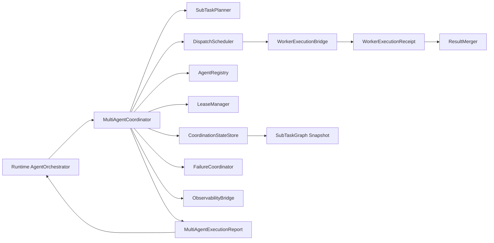
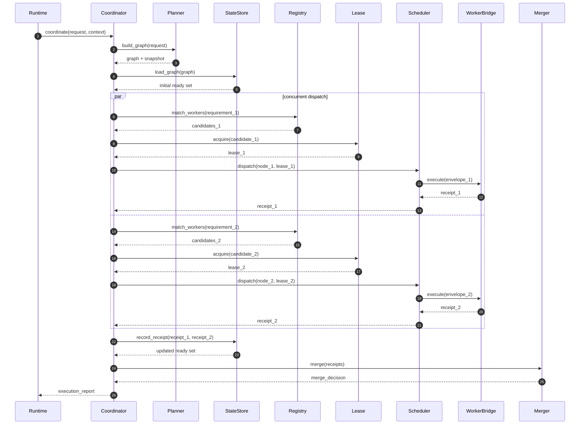
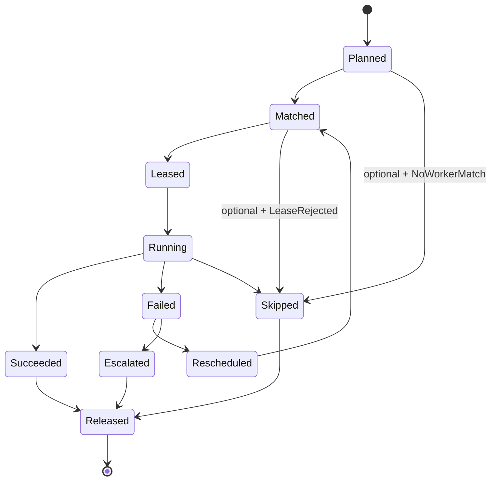
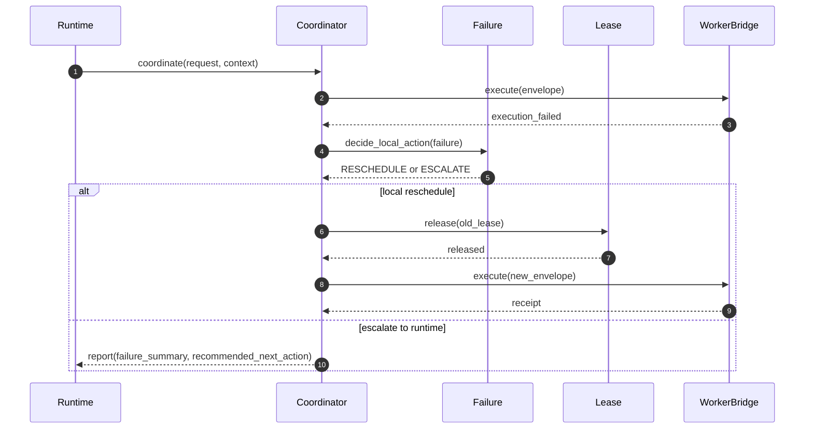

# DASALL Multi-Agent 子系统详细设计

版本：v1.0  
日期：2026-04-17  
阶段：Detailed Design  
适用模块：multi_agent/

本文档面向 DASALL Multi-Agent 子系统的子系统级详细设计，目标是在不改写既有架构、ADR、SSOT 与 contracts 冻结结论的前提下，为 multi_agent 模块提供可直接映射到 Build 的工程方案。

主要依据：

1. docs/architecture/DASALL_Agent_architecture.md
2. docs/architecture/DASALL_Engineering_Blueprint.md
3. docs/adr/ADR-005-architecture-review-baseline.md
4. docs/adr/ADR-006-context-orchestrator-vs-prompt-composer.md
5. docs/adr/ADR-007-reflection-engine-vs-recovery-manager.md
6. docs/adr/ADR-008-agent-orchestrator-vs-multi-agent-coordinator.md
7. docs/ssot/CrossModuleDataProjectionMatrix.md
8. docs/ssot/InfraConcurrencyPolicy.md
9. docs/architecture/DASALL_profiles模块详细设计.md
10. docs/architecture/DASALL_runtime子系统详细设计.md
11. docs/architecture/DASALL_cognition子系统详细设计.md
12. docs/architecture/DASALL_llm子系统详细设计.md
13. docs/architecture/DASALL_tools子系统详细设计.md
14. docs/architecture/DASALL_memory子系统详细设计.md
15. docs/architecture/DASALL_knowledge子系统详细设计.md
16. docs/architecture/DASALL_capability_services子系统详细设计.md
17. docs/todos/contracts/deliverables/WP04-T014-MultiAgentRequest语义说明.md
18. docs/todos/contracts/deliverables/WP04-T016-MultiAgentResult语义说明.md
19. docs/todos/contracts/deliverables/WP04-T018-WorkerTask语义说明.md
20. docs/todos/contracts/deliverables/WP04-T020-WorkerLease语义说明.md
21. docs/todos/contracts/deliverables/WP05-T008-任务子域对象定义.md
22. docs/development/DASALL_工程协作与编码规范.md
23. multi_agent/CMakeLists.txt
24. multi_agent/src/placeholder.cpp

---

## 1. 模块概览

### 1.1 目标与定位

Multi-Agent 子系统是 DASALL 在协同子域上的工程落点，对应目录为 multi_agent/。它的职责不是重新发明一套顶层 Runtime，也不是把工具调用、上下文装配、恢复裁定、用户交互塞进“协同引擎”，而是把 Runtime 已经决定要进入的协同阶段，收敛为一条可治理、可并发、可回收、可追踪的 Worker 编排链路。

Multi-Agent 的核心目标是：

1. 在 AgentOrchestrator 仍持有全局主控权的前提下，承接协同子域的子任务拆分、Worker 匹配、租约管理、结果汇聚与局部失败回收。
2. 严格复用已冻结共享对象：MultiAgentRequest、MultiAgentResult、WorkerTask、WorkerLease、SubTaskGraph，不把模块内部 supporting objects 反向写入 contracts。
3. 为 Runtime 提供一个可关闭、可限流、可降级的协同扩展点，使多 Agent 能力成为受控增强，而不是主链路前提。
4. 把协同过程中的黑板状态、重复劳动抑制、冲突仲裁、失败升级、观测与审计信号显式建模，避免把这些逻辑下沉成不可测试的隐式行为。
5. 为阶段化 Build 提供最小可交付切分，先打通“受控协同子域”，再逐步演进到更复杂的 Worker 形态和更强的自动仲裁策略。

Multi-Agent 不是：

1. 第二个 AgentOrchestrator。
2. Session、顶层 FSM、总预算、最终 AgentResult 的拥有者。
3. ContextPacket 的生产者。
4. Prompt 选择、消息装配与模型路由的拥有者。
5. Tool 执行、Service 执行语义和 Recovery 准入的拥有者。

当前状态必须明确写成两句话：

1. architecture ready：Multi-Agent 的职责边界、控制权、共享对象和协作模式已经在架构、ADR 与 contracts 中收敛。
2. implementation not ready：multi_agent/ 当前只有占位库，尚无公共头文件、协同组件、单元测试和集成测试。

### 1.2 边界与依赖方向

| 维度 | 结论 | 边界说明 | 来源依据 |
|---|---|---|---|
| 架构层级 | Worker 实例位于 Layer 4，调度权归 Layer 6 | Worker 运行在 Execution and Collaboration Layer，协同调度由 Agent Control Plane 驱动 | Agent architecture 4.8；Engineering Blueprint 3.10 |
| 上游直接调用者 | runtime/AgentOrchestrator | 只有 Runtime 可以决定是否进入 Multi-Agent 模式并装配 MultiAgentRequest | ADR-008 3.2、4 |
| 直接输出消费者 | runtime/AgentOrchestrator | Multi-Agent 回传协同结果、局部快照和观测材料，由 Runtime 再折叠为 Observation 或最终输出路径 | ADR-008 4、5.2；CrossModuleDataProjectionMatrix |
| 直接依赖 | contracts、infra、profiles 生效视图 | contracts 提供共享对象边界；infra 提供日志、追踪、指标、审计；profiles 提供预算、超时、降级与开关 | Architecture 6.11；profiles/runtime_policy.yaml |
| 间接依赖 | tools、services、memory、knowledge、llm、cognition | Worker 执行可能间接用到这些能力，但 Multi-Agent 不得直连其实现细节；统一经 WorkerExecutionBridge 或 Runtime 提供的受控入口中转 | ADR-006/007/008；各子系统详设 |
| 禁止依赖 | cognition 实现、llm 实现、memory 实现、platform 实现、runtime 实现细节 | 防止 multi_agent 越权侵入语义决策、上下文拥有权、模型治理或平台执行域 | Architecture 4.8、5.11；ADR-006/007/008 |
| 直接禁止事项 | 用户交互、最终响应提交、顶层 checkpoint resume 入口 | Multi-Agent 只能返回协同结果，不允许产生新的用户面出口或恢复入口 | ADR-008 3.3、5.4 |

### 1.3 设计范围

纳入范围：

1. Multi-Agent 子系统职责边界、子组件拆分、依赖方向和控制流。
2. AgentRegistry、SubTaskPlanner、LeaseManager、DispatchScheduler、ResultMerger、FailureCoordinator 等组件设计。
3. MultiAgentRequest、MultiAgentResult、WorkerTask、WorkerLease、SubTaskGraph 与 module-local supporting objects 的关系。
4. 主流程、异常恢复流程、黑板状态、重复劳动抑制与结果冲突处理策略。
5. 配置策略、可观测性、Design -> Build 映射、实施计划、测试矩阵、质量门、兼容性与回退路径。

不纳入范围：

1. 改写已冻结 ADR、SSOT 或 contracts 字段语义。
2. 重新设计 Runtime 主循环、RecoveryManager、ContextOrchestrator、PromptComposer、ModelRouter、ToolManager。
3. 重新定义 Worker 的完整认知链实现细节。
4. 让 multi_agent 直接承担平台执行或业务服务语义。
5. 把模块内部调度策略、候选评分算法、黑板版本控制规则提前升格为 shared contracts。

### 1.4 来源依据与现状证据

| 观察项 | 当前状态 | 证据 | 结论 |
|---|---|---|---|
| multi_agent 构建入口 | 已存在 | multi_agent/CMakeLists.txt | 已有静态库目标 dasall_multi_agent |
| multi_agent 源码实现 | 占位 | multi_agent/src/placeholder.cpp | 当前无真实协同实现 |
| multi_agent 公共头文件 | 缺失 | multi_agent/include 当前不存在 | 尚无模块稳定接口面 |
| 协同共享对象 | 已冻结 | contracts/include/agent/MultiAgentRequest.h、MultiAgentResult.h | 协同输入输出边界已就绪 |
| Worker 执行单元与租约对象 | 已冻结 | contracts/include/task/WorkerTask.h、WorkerLease.h | 执行单元与租约边界已就绪 |
| 协同子图快照 | 已冻结为最小对象 | contracts/include/task/TaskDomainContracts.h | SubTaskGraph 已存在，但仅是最小快照对象 |
| 顶层主控边界 | 已冻结 | ADR-008 | 不能形成第二主循环 |
| profile 开关 | 已存在 | profiles/*/runtime_policy.yaml | multi_agent 在 cloud_full、desktop_full 启用，在 edge_balanced、edge_minimal、factory_test 默认关闭 |

---

## 2. 约束清单

### 2.1 Must / Should / Must-Not 约束表

| Constraint ID | 来源文档 | 类型 | 约束描述 | 影响范围 |
|---|---|---|---|---|
| MA-C001 | ADR-008 3.2、3.3 | Must | MultiAgentCoordinator 只能拥有协同子域局部编排权，不拥有全局主循环、用户交互、总预算和最终 AgentResult 提交权 | 主控边界、流程 |
| MA-C002 | ADR-008 4、5.1 | Must | Multi-Agent 必须以 MultiAgentRequest 作为协同入口，禁止复用或伪装 AgentRequest | 接口、contracts、测试 |
| MA-C003 | ADR-008 5.2；WP04-T016 | Must | Multi-Agent 必须以 MultiAgentResult 表达协同结果，禁止混入最终 AgentResult 语义 | 接口、结果投影 |
| MA-C004 | Architecture 4.8、5.11 | Must | WorkerTask 拆分、SubTaskGraph 构建与局部 patch 由 Multi-Agent owner；SessionTask 和 StepTask 生命周期仍由 Runtime owner | 组件职责、流程 |
| MA-C005 | Architecture 4.8、6.11 | Must | Worker 必须具备独立上下文窗口、允许工具列表和租约时限 | Worker 模型、配置、测试 |
| MA-C006 | Architecture 6.11 | Must | AgentRegistry 必须按 capability、cost_class、max_concurrency、permission_domain 做能力匹配，不得写死 worker 路由 | AgentRegistry、配置 |
| MA-C007 | Architecture 6.11、6.12 | Must | Multi-Agent 必须具备 ResultMerger、冲突仲裁、重复劳动抑制与失败回收策略 | ResultMerger、FailureCoordinator |
| MA-C008 | ADR-008 5.4；WP04-T020 | Must | WorkerLease 只表达局部租约元数据，不得成为新的 checkpoint 或 resume 入口 | LeaseManager、恢复 |
| MA-C009 | ADR-006；Memory 详设 | Must | Multi-Agent 只能消费 Runtime 传入的 ContextPacket 或上下文引用，不得自建第二上下文中心 | Context 边界、Worker 执行 |
| MA-C010 | ADR-007；Runtime 详设 | Must | Multi-Agent 可以执行局部 RESCHEDULE、可选 SKIP 和失败汇报，但全局 REPLAN、ABORT_SAFE、补偿准入仍由 Runtime RecoveryManager 裁定 | 恢复路径、失败语义 |
| MA-C011 | CrossModuleDataProjectionMatrix | Must | Worker 输出与 Tool 输出最终都必须折叠为 Observation / ObservationDigest 路径，Multi-Agent 不得绕过 Runtime 直接写回 memory 或最终回复 | 数据投影、恢复、记忆写回 |
| MA-C012 | Engineering Blueprint 3.10 | Must | multi_agent 对外稳定接口应落在 multi_agent/include，不进入 contracts，除非后续出现明确跨模块共享准入 | 文件布局、接口冻结 |
| MA-C013 | 工程协作与编码规范 3.6、3.7 | Must | 模块边界失败必须可观测；新增公共接口必须同步至少一个 unit 或 contract 测试 | 测试、日志、错误处理 |
| MA-C014 | Architecture 6.11 | Must | 多 Agent 日志必须至少包含 trace_id、agent_id、task_id、worker_type、lease_id、parent_task_id | 可观测性、追踪、审计 |
| MA-C015 | profiles/runtime_policy.yaml | Must | Multi-Agent 必须复用 enabled_modules.multi_agent、runtime_budget、capability_cache_policy、timeout_policy、degrade_policy、execution_policy 等既有 profile 键 | 配置策略、兼容性 |
| MA-C016 | InfraConcurrencyPolicy | Must | 调度队列、租约表、黑板状态和去重缓存必须显式建模并发边界；不得持锁执行外部 I/O | 并发模型、可靠性 |
| MA-C017 | WP05-T008；TaskDomainContracts.h | Must | SubTaskGraph 在 contracts 中只保持最小快照对象；算法细节、边版本图、优先级和调度权重必须保持 module-local | 核心对象、contracts 策略 |
| MA-C018 | Runtime 详设；Engineering Blueprint 7 | Must | Multi-Agent Build 方案必须支持 unit、contract、integration、failure injection 和 profile compatibility 五类验证 | 测试矩阵、质量门 |
| MA-C019 | Architecture 4.8；ADR-008；本设计 6.13 | Must | Worker 角色差异化必须以 module-local WorkerRoleProfile 建模，至少分离领域专长、协作风格、推理风格和输出风格；任何角色画像都不得绕过 capability、permission_domain、allowed_tools 与 budget guard 的硬门禁 | AgentRegistry、角色路由、测试 |
| MA-S001 | Architecture 6.11 | Should | v1 以 Message Passing 为主路径，同时为 Shared Blackboard 和 Event Bus 预留可落地扩展点 | 通信机制、演进 |
| MA-S002 | Industry pattern；ADR-008 2.2 | Should | Worker 执行边界应通过 WorkerExecutionBridge 隔离，使协调器不感知具体工具链、模型链或平台实现 | 依赖治理、演进 |
| MA-S003 | profiles 与 Blueprint 5.2 | Should | Multi-Agent 应在 cloud_full、desktop_full 优先启用，edge_balanced 保持 compile-ready 但默认关闭 | 兼容性、灰度发布 |
| MA-S004 | Engineering Blueprint 7.2 | Should | 端到端测试应覆盖 Orchestrator-Worker 子任务分派与汇聚、禁用态降级和失败升级路径 | 测试与 Gate |
| MA-S005 | 本设计 6.13 | Should | 角色模型应支持“领域能力”和“风格偏好”双轴组合，例如安全审查员加怀疑风格、故障诊断员加追问风格，而不是只支持单一专家标签 | 角色演进、匹配策略 |
| MA-N001 | ADR-008；Architecture 4.8 | Must-Not | 不得形成第二个用户面入口、第二个 AgentOrchestrator 或独立产品主循环 | 架构一致性 |
| MA-N002 | ADR-006、ADR-007 | Must-Not | 不得自行承担 ContextPacket 装配、Prompt 选择、恢复执行裁定 | 边界治理 |
| MA-N003 | Capability Services 详设；Tools 详设 | Must-Not | 不得绕过 Runtime 或 Tool 治理链直连高风险执行能力、Service 实现或 Platform 实现 | 执行治理 |
| MA-N004 | WP04-T014/T016/T020；TaskDomainGuards.h | Must-Not | 不得把 session_id、global_fsm_state、checkpoint_ref、resume_token、agent_result、final_agent_response 等顶层字段混入协同对象 | contracts、测试 |
| MA-N005 | 本设计 6.13 | Must-Not | 不得把人格或风格角色实现成高权限捷径或自由提示词注入入口；角色风格不能覆盖 allowed_tools、permission_domain、worker_budget_guard 和确认门禁 | 安全治理、角色模型 |

### 2.2 约束抽取结论

Must：

1. Runtime 仍是唯一全局主控，Multi-Agent 只是协同子域控制器。
2. MultiAgentRequest、MultiAgentResult、WorkerTask、WorkerLease、SubTaskGraph 是当前唯一需要直接对齐的共享对象边界。
3. Multi-Agent 必须显式建模 Worker 能力匹配、租约管理、局部失败回收、结果仲裁和去重。
4. 所有协同结果最终都要回到 Runtime 主链路，不允许出现旁路写回和旁路回复。
5. profile、预算、超时、降级和观测都必须复用既有仓库规则，而不是自定义平行治理域。
6. 角色差异化必须保持为 module-local 角色画像，并服从 capability、permission、tool、budget 的硬约束。

Should：

1. 用清晰的内部组件拆分承接协同复杂度，避免一个巨型协调器对象。
2. 通过 WorkerExecutionBridge 隔离 Worker 具体运行形态，先保证协调闭环，再演进 Worker 智能度。
3. 以 cloud_full、desktop_full 为首批启用面，保留禁用态和降级态的可测试出口。
4. 角色模型应同时支持领域专长与风格偏好双轴组合，避免角色体系只剩“专家”一种维度。

Must-Not：

1. 不改写 ADR、SSOT 和 contracts 已冻结结论。
2. 不把内部策略对象反向推入 contracts。
3. 不让协同层越权承担 Context、Prompt、Recovery、Tool Execution 或 Platform 执行所有权。
4. 不把角色标签做成高权限捷径或自由人格扮演入口。

---

## 3. 现状与缺口

### 3.1 当前实现状态

| 设计目标 | 当前状态 | 差距描述 | 风险等级 | 修复优先级 |
|---|---|---|---|---|
| 模块公共接口面 | 缺失 | 无 multi_agent/include，Runtime 无法依赖稳定接口 | High | P0 |
| 协同入口协调器 | 缺失 | 无 IMultiAgentCoordinator 与实现 | High | P0 |
| AgentRegistry | 缺失 | 无 Worker 能力目录、匹配与评分逻辑 | High | P0 |
| SubTaskPlanner | 缺失 | 无 MultiAgentRequest -> SubTaskGraph 的模块实现 | High | P0 |
| LeaseManager | 缺失 | 无 WorkerLease 分配、续租、释放与回收逻辑 | High | P0 |
| DispatchScheduler | 缺失 | 无 ready queue、并发控制、去重和派发控制 | High | P0 |
| WorkerExecutionBridge | 缺失 | 无 Worker 实际执行边界，协同无法闭环 | High | P0 |
| ResultMerger | 缺失 | 无 merged_result、conflicts、worker_trace_refs 生成逻辑 | High | P0 |
| FailureCoordinator | 缺失 | 无 RESCHEDULE、SKIP、失败升级的本地实现 | High | P1 |
| 黑板状态与快照 | 缺失 | 无 SubTaskGraph 本地富模型、局部快照与去重缓存 | Medium | P1 |
| 可观测性 | 缺失 | 无 trace、metric、audit、debug replay 口径 | Medium | P1 |
| 单元测试 | 缺失 | tests/unit 下无 multi_agent 目录 | High | P0 |
| 集成测试 | 缺失 | tests/integration 下无 multi_agent 目录 | High | P0 |
| profile 兼容与禁用态 | 缺失 | 无 enabled_modules.multi_agent=false 的 no-op 路径验证 | Medium | P1 |

### 3.2 现状-目标差距表

| 设计目标 | 当前状态 | 差距描述 | 风险等级 | 修复优先级 |
|---|---|---|---|---|
| 受控协同入口 | 占位 | 当前仅有静态库空实现，无法被 Runtime 正确调用 | High | P0 |
| Worker 能力路由 | 缺失 | 当前没有 WorkerDescriptor、候选筛选、匹配评分、并发上限控制 | High | P0 |
| 局部任务图 | 仅有共享最小快照 | 缺少模块内富图模型、节点状态、依赖求解、局部 patch 机制 | High | P0 |
| 协同失败回收 | 缺失 | 仅有架构结论，无代码组件、错误域与升级规则 | High | P0 |
| 结果冲突仲裁 | 缺失 | 当前无法生成 conflicts 与 recommended_next_action | High | P0 |
| 禁用态降级 | 缺失 | 当前没有 profile 关闭时的透明绕行策略 | Medium | P1 |
| 观测回放能力 | 缺失 | trace_id、lease_id、worker_trace_refs 尚无落点 | Medium | P1 |
| 工程验证基线 | 缺失 | 没有 unit、integration、failure injection 与 compatibility Gate | High | P0 |

### 3.3 风险冲突识别

| 冲突类型 | 描述 | 若不收敛的后果 |
|---|---|---|
| 主控冲突 | 把子任务拆分、租约、结果汇聚重新写进 Runtime 主循环，或让 Multi-Agent 自己成为第二主控 | Runtime 膨胀成 God Object，或 multi_agent 与 runtime 形成双主控 |
| 语义重复 | 在 multi_agent 再定义 Context、Prompt、Recovery、Checkpoint 语义 | 破坏 ADR-006/007/008，放大跨模块返工 |
| contracts 污染 | 把内部调度策略、候选评分、黑板状态推进到 shared contracts | ABI 漂移、字段冻结过早、跨模块兼容性失控 |
| 依赖反转 | 让 multi_agent 直连 cognition/llm/memory/platform 实现 | Worker 形态与协同编排耦死，难以替换和测试 |
| 验证缺口 | 只写设计不写 unit / integration / disabled-mode 验证口径 | Build 阶段无法二值判定收敛完成 |

### 3.4 现状结论

当前最合理的推进方式不是把 Multi-Agent 再次吸回 Runtime，也不是直接上 Actor 型分布式调度框架，而是先在 multi_agent/ 建立受控协同子域：

1. 用最小公共接口稳定 Runtime -> Multi-Agent 的调用面。
2. 用 module-local supporting objects 承接 SubTask 图、调度、黑板、失败策略与 Worker 派发。
3. 先打通 v1 的 Orchestrator-Worker 闭环与禁用态降级，再逐步扩展 Pipeline 和 Debate 的丰富策略。

---

## 4. 候选方案对比

### 4.1 候选方案描述

#### 方案 A：Runtime 内聚协同细节

设计思路：

1. 让 AgentOrchestrator 同时承担 Worker 匹配、租约、局部图调度、结果合并和失败回收。
2. multi_agent/ 只保留极薄工具层或直接不落工程实现。

优点：

1. 初期代码文件更少。
2. 似乎最容易从占位库过渡。

风险：

1. 与 ADR-008 明确冲突。
2. Runtime 会同时拥有顶层主控和协同细节，快速膨胀为高耦合大对象。
3. 无法形成可替换、可测试的协同子域。

#### 方案 B：受控协同子域流水线

设计思路：

1. 在 multi_agent/ 中建立清晰的协同组件：Coordinator、Registry、Planner、Lease、Scheduler、Merger、Failure、Observability。
2. Runtime 只决定是否进入协同路径，并传入 MultiAgentRequest 与执行上下文。
3. Worker 具体执行通过 WorkerExecutionBridge 隔离，协调器不感知具体下游实现细节。
4. Shared Blackboard、Event Bus 以模块内受控形态落地，不越权为第二调度中心。

优点：

1. 与架构和 ADR 完全对齐。
2. 组件职责清晰，便于按阶段 Build。
3. 支持禁用态、限流、失败升级和局部重调度测试。
4. 便于把 Worker 从“简单执行单元”演进到“更完整的受控 Agent 实例”。

风险：

1. 初期组件数量较多。
2. 需要严格管理 public interface 和 module-local supporting types，防止接口扩张。

#### 方案 C：事件驱动型分布式协同引擎

设计思路：

1. 以 Event Bus、Actor Mailbox、持久化任务图为核心，Multi-Agent 作为独立调度平面长期运行。
2. Runtime 仅投递任务，协同域自行推进状态与恢复。

优点：

1. 并发和扩展能力最强。
2. 适合大规模长生命周期 Worker 群。

风险：

1. 很容易演化成第二个调度中心，与 ADR-008 冲突。
2. 当前仓库没有需要它的实现基础，也没有相应的持久化与运维基线。
3. 会把任务图、恢复、黑板状态和事件语义过早复杂化。

### 4.2 候选方案对比矩阵

| 方案名 | 架构匹配度 | ADR 匹配度 | 工程复杂度 | 风险 | 结论 |
|---|---|---|---|---|---|
| 方案 A：Runtime 内聚协同细节 | 低 | 低 | 中 | Runtime 过重、双职责混层、测试不可分 | 淘汰；违背 ADR-008 |
| 方案 B：受控协同子域流水线 | 高 | 高 | 中 | 需要补较多组件和接口，但边界清晰 | 保留；推荐采纳 |
| 方案 C：事件驱动型分布式协同引擎 | 中 | 低 | 高 | 第二调度中心、实现前置过重、恢复复杂化 | 淘汰；超出当前阶段需要 |

### 4.3 行业方案对齐结论

1. 方案 B 与 orchestrator-workers 模式一致：中心主控拥有全局裁定，协同子域只做任务拆解、委派与结果回收。
2. 方案 B 与 scheduler-agent-supervisor 模式一致：Scheduler 保留整体工作流裁定，Agent 执行步骤，恢复与超时由上层主管理。
3. 方案 B 对 DASALL 更关键的一点是：它把“控制权归属”和“实现落点”解耦，符合 ADR-008 的根本意图。

---

## 5. 决策结论

### 5.1 最终选型

最终采纳方案 B：受控协同子域流水线。

决策结论如下：

1. MultiAgentCoordinator 作为 multi_agent 模块内的协同子域协调器实现存在，但它是 Runtime 调用的受控组件，而不是新的顶层主循环。
2. multi_agent/ 内部采用“协调入口 + 子图规划 + 能力匹配 + 租约管理 + 派发调度 + 结果汇聚 + 失败回收 + 观测桥接”的组件化结构。
3. Worker 具体执行通过 WorkerExecutionBridge 隔离，使 Multi-Agent 只关心协同编排，不关心具体工具链和模型链如何运行。
4. Shared Blackboard 在 v1 作为 module-local CoordinationStateStore 的一部分落地；Event Bus 只承担状态发布和观测通知，不承担独立调度中心职责。

### 5.2 放弃其他候选方案的理由

| 被放弃方案 | 放弃原因 |
|---|---|
| 方案 A | 把协同细节写回 Runtime 会直接破坏 ADR-008，且会把 Runtime 从控制平面膨胀为控制平面加协同执行平面 |
| 方案 C | 需要独立任务图引擎、持久化、事件拓扑和恢复主管，当前工程既无需求也无基础，且高概率形成第二调度中心 |

### 5.3 一致性说明

| 一致性维度 | 说明 |
|---|---|
| 架构一致性 | 保持“调度权归 Layer 6、Worker 运行于 Layer 4”的分层口径 |
| ADR 一致性 | 严格遵守 ADR-008 的主控权边界，且不侵犯 ADR-006/007 |
| contracts 冻结策略一致性 | 只消费已冻结对象，新增 supporting objects 保持 module-local |
| 工程可实现性 | 目录、接口、测试、Build 三件套均可直接映射 |
| 测试可验证性 | 每个组件和关键流程均有 unit / integration / gate 对应出口 |
| 版本可演进性 | 通过 WorkerExecutionBridge、CoordinationStateStore 和策略接口保留 v2 扩展空间 |

---

## 6. 详细设计

### 6.1 职责边界

Multi-Agent 在主链路中的唯一职责是：在 Runtime 已经裁定进入协同路径之后，完成对子任务图、Worker、租约、黑板、结果和局部失败的治理。

职责边界如下：

1. 接收 Runtime 装配好的 MultiAgentRequest 与执行上下文。
2. 将 goal_fragment 与 plan_fragment 转换为内部子任务图模型，并投影为 contracts/SubTaskGraph 最小快照。
3. 根据 Worker 能力、并发阈值、权限域和成本等级匹配候选 Worker。
4. 分配和管理 WorkerLease，控制续租、释放和过期回收。
5. 派发 WorkerTask，收集 Worker 执行回执、观测事实和 trace 引用。
6. 汇聚子任务结果，产生 merged_result、conflicts、failure_summary 和 recommended_next_action。
7. 在局部失败下执行有限回收：RESCHEDULE、SKIP、失败升级；全局 REPLAN 和终止裁定回交 Runtime。

非职责边界如下：

1. 不决定是否进入 Multi-Agent 模式。
2. 不直接与用户交互。
3. 不拥有顶层 Session、TaskState、Checkpoint 和 AgentResult。
4. 不自行装配 ContextPacket、Prompt 或 LLM 请求。
5. 不直接执行高风险动作或替代 Tool 治理链。

#### 6.1.1 控制权归属矩阵

| 控制点 | Owner | Recheck | Observe | 说明 |
|---|---|---|---|---|
| 是否进入协同模式 | AgentOrchestrator | — | MultiAgentCoordinator | 只有 Runtime 裁定是否装配 MultiAgentRequest |
| 子图规划与拓扑选择 | MultiAgentCoordinator | — | ObservabilityBridge | SubTaskPlanner 受 Coordinator 委托执行 |
| Worker 候选匹配与角色路由 | AgentRegistry | DispatchScheduler | ObservabilityBridge | 硬门禁由 Registry 执行，Scheduler 复核并发槽位 |
| 租约分配、续租与回收 | LeaseManager | AgentOrchestrator（全局预算校验） | ObservabilityBridge | 局部租约由 LeaseManager 管理，全局预算由 Runtime 校验 |
| Worker 派发与并发控制 | DispatchScheduler | LeaseManager | ObservabilityBridge | 不得突破 runtime_budget.worker_threads |
| Worker 执行 | WorkerExecutionBridge | — | ObservabilityBridge | 对协调器屏蔽具体工具链/模型链 |
| 结果合并与冲突检测 | ResultMerger | — | ObservabilityBridge | 不做自动裁决，保留 conflicts |
| 局部失败回收 | FailureCoordinator | — | ObservabilityBridge | RESCHEDULE/SKIP 本地执行，ESCALATE 回交 Runtime |
| 全局 REPLAN / ABORT / 用户交互 | AgentOrchestrator | RecoveryManager | ObservabilityBridge | Multi-Agent 只提供建议，不裁定 |
| 配置投影与热更新 | ConfigProjection | — | ObservabilityBridge | 从 profile 生效视图派生，不新增治理域 |
| 可观测性产出 | ObservabilityBridge | — | infra/audit sink | fail-open，不阻断主链 |

### 6.2 总体组件结构



#### 6.2.1 组装根与 DI 说明

MultiAgentCoordinator 作为模块组装根（Composition Root），负责持有并串联所有内部组件。Runtime 不直接构造内部组件，而是通过工厂或注入方式获取 IMultiAgentCoordinator 实例。

组装顺序：

1. Runtime 根据 `enabled_modules.multi_agent` 决定注入 `MultiAgentCoordinator`（启用态）还是 `NullMultiAgentCoordinator`（禁用态）。
2. `MultiAgentCoordinator` 构造时接收以下依赖注入：`IAgentRegistry`、`ILeaseManager`、`IDispatchScheduler`、`IResultMerger`、`IFailureCoordinator`、`IObservabilityBridge`。
3. `SubTaskPlanner` 和 `CoordinationStateStore` 作为协调器内部实现细节，可由协调器自行构造或通过工厂注入。
4. `WorkerExecutionBridge` 通过 `IWorkerHost` 接口解耦具体执行形态，Runtime 负责注入 `LoopbackWorkerHost`（首版）或其他 host 实现。
5. `NullMultiAgentCoordinator` 不持有任何内部组件，直接返回 disabled report。

设计约束：

1. 所有内部组件通过接口注入，便于 unit test 中替换为 mock。
2. Runtime 只依赖 `IMultiAgentCoordinator`，不感知内部组件类型。
3. 组装根不引入服务定位器或全局单例。

### 6.3 子组件清单与组件职责

| 子组件 | 名称 + 职责 |
|---|---|
| MultiAgentCoordinator | 模块唯一公共入口；串联解析、规划、匹配、租约、派发、汇聚、失败回收和结果投影 |
| SubTaskPlanner | 把 MultiAgentRequest 转换为 module-local 子任务图模型，生成 ready set、依赖关系和局部 patch |
| CoordinationStateStore | 维护黑板状态、节点状态、去重缓存、等价任务索引和局部快照 |
| AgentRegistry | 管理 WorkerDescriptor、能力索引、并发上限、权限域和成本等级，提供候选匹配 |
| LeaseManager | 分配、续租、释放、过期回收 WorkerLease，并校验 lease deadline |
| DispatchScheduler | 根据 ready set、并发槽位、租约和去重规则派发 WorkerTask |
| WorkerExecutionBridge | 把 WorkerTask 与执行上下文交给具体 Worker Host；对协调器屏蔽工具链、模型链和平台细节 |
| ResultMerger | 汇聚 Worker 回执，生成 merged_result、conflicts、worker_trace_refs 和 merge diagnostics |
| FailureCoordinator | 把 dispatch、execution、merge 阶段的失败归一化为局部动作提议与升级建议 |
| ObservabilityBridge | 统一产生日志、指标、追踪和审计事实，并对接 Infra 观测域 |

### 6.4 子组件输入 / 输出

| 子组件 | 输入来源 | 输出去向 | 语义契约 |
|---|---|---|---|
| MultiAgentCoordinator | MultiAgentRequest、MultiAgentExecutionContext | MultiAgentExecutionReport | 不改变顶层请求语义，只生成协同子域结果 |
| SubTaskPlanner | goal_fragment、plan_fragment、collaboration_mode | InternalSubTaskGraph、SubTaskGraph snapshot | contracts/SubTaskGraph 只保留最小快照 |
| CoordinationStateStore | InternalSubTaskGraph、Worker 回执、merge 状态 | blackboard view、dedup hit、snapshot | 黑板是 module-local，不进入 contracts |
| AgentRegistry | WorkerRequirement、policy guard | WorkerCandidate 列表 | 匹配依据固定为 capability、cost_class、max_concurrency、permission_domain |
| LeaseManager | LeaseRequest、deadline policy | WorkerLease | 只输出租约元数据，不输出调度算法状态 |
| DispatchScheduler | ready set、WorkerCandidate、WorkerLease | WorkerDispatchEnvelope | 负责排队和并发控制，不负责最终结果裁定 |
| WorkerExecutionBridge | WorkerDispatchEnvelope | WorkerExecutionReceipt | 对协调器屏蔽具体执行实现，回执需包含 task_id、lease_id、result summary、trace ref、retryable |
| ResultMerger | WorkerExecutionReceipt 集合、blackboard view | MergeDecision | merged_result 与 conflicts 由此统一产生 |
| FailureCoordinator | ErrorInfo、WorkerExecutionReceipt、BudgetGuard | FailureActionProposal | 只提议动作，不裁定全局终态 |
| ObservabilityBridge | 全链路状态变化与错误 | log、metric、trace、audit facts | 字段必须满足 trace 和审计最小集合 |

### 6.5 子组件依赖关系

| 组件 | 允许依赖 | 禁止依赖 | 说明 |
|---|---|---|---|
| MultiAgentCoordinator | contracts、SubTaskPlanner、CoordinationStateStore、AgentRegistry、LeaseManager、DispatchScheduler、ResultMerger、FailureCoordinator、ObservabilityBridge | Runtime 实现细节、ToolManager 实现、ContextOrchestrator 实现 | 保持组合根角色 |
| SubTaskPlanner | contracts、module-local policy types | Prompt、LLM、Memory 实现 | 只做协同子图建模 |
| AgentRegistry | module-local WorkerDescriptor、profiles 生效视图 | Runtime 状态机、Platform 实现 | 只负责 Worker 匹配 |
| LeaseManager | WorkerLease、deadline policy | CheckpointManager 实现 | 只负责局部租约 |
| DispatchScheduler | CoordinationStateStore、LeaseManager、AgentRegistry | Final Result Builder | 只负责调度 |
| WorkerExecutionBridge | module-local bridge context、可选下游 public interface | 直接直连平台实现或用户面接口 | 用于隔离 Worker 运行形态 |
| ResultMerger | WorkerExecutionReceipt、blackboard view | RecoveryManager 实现 | 只负责结果与冲突 |
| FailureCoordinator | 错误域、policy snapshot | RecoveryManager 实现、Prompt 逻辑 | 只给出局部动作提议 |

### 6.6 核心对象与 contracts 对齐关系

| 核心对象 | 对象名、关键字段、约束 |
|---|---|
| Shared contract | MultiAgentRequest：parent_request_id、parent_task_id、goal_fragment、plan_fragment、collaboration_mode、worker_budget_guard、permission_guard、stop_conditions；不得含 user-facing、session、lease 内部字段 |
| Shared contract | MultiAgentResult：subtask_results、merged_result、recommended_next_action、conflicts、worker_trace_refs、failure_summary；不得含最终 AgentResult 字段 |
| Shared contract | WorkerTask：task_id、parent_task_id、lease_id、worker_type、allowed_tools、timeout_ms、idempotency_key；不得承载全局 FSM / checkpoint |
| Shared contract | WorkerLease：lease_id、worker_ref、deadline_at、renewal_deadline_at、release_reason；不得承载 merged_result、resume 语义 |
| Shared contract | SubTaskGraph：graph_id、root_task_id、task_ids、graph_revision；仅是协同子图最小快照 |
| Module-local public | MultiAgentExecutionContext：context_packet_ref、policy_snapshot_ref、trace_context、parent_checkpoint_ref、allowed_domains、worker_defaults；用于 Runtime 调用协同入口 |
| Module-local public | MultiAgentExecutionReport：multi_agent_result、graph_snapshot、emitted_observations、worker_receipts、released_leases、audit_refs；用于 Runtime 折叠结果与写回 |

MultiAgentExecutionContext 字段级约束：

| 字段 | Required/Optional | 说明 |
|---|---|---|
| context_packet_ref | Required | Runtime 传入的上下文引用，Worker 执行时裁剪使用 |
| policy_snapshot_ref | Required | profile 生效视图引用，用于预算、超时、降级策略 |
| trace_context | Required | Runtime 主 trace 上下文，协同 span 必须挂接其下 |
| parent_checkpoint_ref | Optional | Runtime 顶层 checkpoint 引用，用于局部快照归档 |
| allowed_domains | Optional | 显式约束 Worker 可访问的权限域集合 |
| worker_defaults | Optional | Worker 执行默认参数（超时、重试等） |

MultiAgentExecutionReport 字段级约束：

| 字段 | Required/Optional | 说明 |
|---|---|---|
| multi_agent_result | Required | 包含 merged_result、conflicts、recommended_next_action |
| graph_snapshot | Required | 协同子图最终状态快照 |
| emitted_observations | Required | Worker 执行过程中产出的观测事实列表 |
| worker_receipts | Optional | 完整 Worker 回执列表，Runtime 可按 lossy 规则裁剪 |
| released_leases | Optional | 已释放租约列表，仅用于审计和 Gate-MA-05 验证 |
| audit_refs | Optional | 审计事实引用，透传给 infra/audit sink |
| Module-local internal | WorkerDescriptor：worker_ref、capabilities、role_profile_refs、cost_class、max_concurrency、permission_domain、execution_mode、health_state |
| Module-local internal | WorkerRoleProfile：role_id、domain_tags、expertise_scope、collaboration_style、reasoning_style、response_style、risk_posture、evidence_policy、escalation_bias |
| Module-local internal | WorkerRoleRequirement：required_domains、preferred_styles、forbidden_styles、task_kind、minimum_evidence_level、risk_posture |
| Module-local internal | InternalSubTaskGraph：nodes、edges、node_state、dependency_count、priority、optional_flag、blackboard_key |
| Module-local internal | WorkerDispatchEnvelope：worker_task、worker_lease、selected_role_id、context_slice_ref、tool_guard、trace_span_ref |
| Module-local internal | WorkerExecutionReceipt：task_id、lease_id、role_id、result_summary、observation_refs、trace_ref、retryable、failure_reason、cost_usage |
| Module-local internal | MergeDecision：merged_result、conflicts、confidence_bucket、recommended_next_action |
| Module-local internal | RoleRoutingDecision：selected_role_id、fit_score、fallback_applied、denied_reasons |
| Module-local internal | FailureActionProposal：action_kind、retry_after_ms、escalation_needed、rollback_hint、reason_code |

说明：

1. Shared contract 只承载跨模块稳定最小视图。
2. MultiAgentExecutionContext 与 MultiAgentExecutionReport 作为 module-local public surface，允许 Runtime 与 Multi-Agent 稳定协作，但不进入 contracts。
3. InternalSubTaskGraph、WorkerDescriptor、WorkerRoleProfile 与 RoleRoutingDecision 等对象必须保持在 multi_agent 内部，避免过早冻结调度算法。

### 6.7 核心接口语义定义

| 核心接口 | 接口语义 | 前置条件 | 后置条件 | 错误语义 |
|---|---|---|---|---|
| IMultiAgentCoordinator::coordinate() | 接收协同请求并返回执行报告 | MultiAgentRequest required 字段已通过 guard；profile 已启用 multi_agent 或走 null path；执行上下文完整；Runtime 已校验全局预算允许进入协同 | 返回 MultiAgentExecutionReport；所有已分配租约都进入已释放或已转交 Runtime 的可追踪状态 | MA_E_INVALID_REQUEST、MA_E_DISABLED、MA_E_NO_WORKER_MATCH、MA_E_BUDGET_EXCEEDED、MA_E_INTERNAL_INVARIANT |
| IAgentRegistry::match_workers() | 基于 WorkerRequirement 和 WorkerRoleRequirement 返回排序后的候选 Worker | capability、permission_domain、max_parallelism 与角色约束已明确 | 返回候选列表、匹配评分说明和角色路由解释 | MA_E_NO_WORKER_MATCH、MA_E_POLICY_BLOCKED |
| ILeaseManager::acquire() | 为 WorkerTask 分配租约 | 候选 Worker 可用，deadline policy 合法 | 返回 WorkerLease，注册到租约表 | MA_E_LEASE_REJECTED、MA_E_BUDGET_EXCEEDED |
| IDispatchScheduler::dispatch_ready_set() | 派发当前 ready set | 图状态一致、租约可用、未超过并发阈值 | 返回一组 WorkerDispatchEnvelope 并更新节点状态 | MA_E_QUEUE_OVERFLOW、MA_E_DUPLICATE_SUBTASK |
| IWorkerExecutionBridge::execute() | 执行一个 WorkerDispatchEnvelope | allowed_tools、selected_role_id、context_slice、timeout 和 trace 已就绪 | 返回 WorkerExecutionReceipt，且必须带 task_id、lease_id、role_id 和 trace_ref | MA_E_DISPATCH_TIMEOUT、MA_E_WORKER_EXECUTION_FAILED |
| IResultMerger::merge() | 汇总所有完成节点的结果 | 至少有一个可见结果或失败信息 | 生成 merged_result、conflicts、recommended_next_action | MA_E_RESULT_CONFLICT、MA_E_RESULT_EMPTY |
| IFailureCoordinator::decide_local_action() | 归一化本地失败 | 错误源、预算快照、节点 optional_flag 已知 | 返回 RESCHEDULE、SKIP 或 ESCALATE 提议 | MA_E_RECOVERY_POLICY_INVALID |

建议错误域：

| 错误码 | 触发组件 | 语义 |
|---|---|---|
| MA_E_INVALID_REQUEST | MultiAgentCoordinator | 请求 required 字段缺失或不合法 |
| MA_E_DISABLED | MultiAgentCoordinator | profile 未启用 multi_agent，走 NullCoordinator |
| MA_E_NO_WORKER_MATCH | AgentRegistry | 无候选 Worker 满足硬门禁 |
| MA_E_POLICY_BLOCKED | AgentRegistry | permission_domain 或 allowed_tools 被策略拦截 |
| MA_E_LEASE_REJECTED | LeaseManager | 并发槽位耗尽或 deadline 非法 |
| MA_E_QUEUE_OVERFLOW | DispatchScheduler | 派发队列溢出 |
| MA_E_DUPLICATE_SUBTASK | DispatchScheduler | 等价任务已在 in-flight 中 |
| MA_E_DISPATCH_TIMEOUT | WorkerExecutionBridge | Worker Host 执行超时 |
| MA_E_WORKER_EXECUTION_FAILED | WorkerExecutionBridge | Worker 运行失败（非超时） |
| MA_E_INVALID_WORKER_OUTPUT | WorkerExecutionBridge / ResultMerger | Worker 回执格式不合法或字段缺失 |
| MA_E_RESULT_CONFLICT | ResultMerger | 多 Worker 结果存在不可自动消解的冲突 |
| MA_E_RESULT_EMPTY | ResultMerger | 无任何可用结果可合并 |
| MA_E_BUDGET_EXCEEDED | MultiAgentCoordinator / LeaseManager | 协同阶段总预算或单租约预算超限 |
| MA_E_GRAPH_BUILD_FAILED | SubTaskPlanner | 子图构建失败（输入缺失、环检测、fan-out 超限） |
| MA_E_STATE_CORRUPTION | CoordinationStateStore | 非法状态迁移、索引破损或 snapshot 不一致 |
| MA_E_RECOVERY_POLICY_INVALID | FailureCoordinator | 恢复策略配置缺失或不合法 |
| MA_E_INTERNAL_INVARIANT | 任意组件 | 内部不变式违反，fail-closed |

### 6.8 调用关系与数据流

#### 6.8.1 上下游调用关系

1. Runtime 构造 MultiAgentRequest 和 MultiAgentExecutionContext。
2. MultiAgentCoordinator 调用 SubTaskPlanner 生成内部子图和 contracts/SubTaskGraph 快照。
3. 调度阶段通过 AgentRegistry + LeaseManager + DispatchScheduler 选择并派发 Worker。
4. WorkerExecutionBridge 执行 WorkerTask，回传 WorkerExecutionReceipt 和观测事实。
5. ResultMerger 产出 merge 结果，FailureCoordinator 对失败给出局部动作提议。
6. MultiAgentCoordinator 返回 MultiAgentExecutionReport 给 Runtime。
7. Runtime 负责将 emitted_observations 写回 Memory，并将 multi_agent_result 折叠进后续认知或最终响应路径。

#### 6.8.2 主流程时序



说明：`par` 块表示当 ready set 包含多个独立节点时的并发派发窗口，受 `runtime_budget.worker_threads` 并发上限约束。Pipeline 模式下子节点为串行，不进入 `par` 块。

#### 6.8.3 协同子图与租约状态



状态说明：

1. Planned 代表子图已建好但未选择 Worker。
2. Matched 代表已得到 WorkerCandidate，但尚未占用租约槽位。
3. Leased 代表 WorkerLease 已建立。
4. Running 代表 Worker 已收到 dispatch。
5. Failed 代表节点执行失败，但未决定动作。
6. Rescheduled 代表本地重调度；Escalated 代表需要 Runtime 继续裁定。
7. Skipped 可从 Running（执行后判定可选跳过）或 Planned/Matched（NoWorkerMatch 时 optional 节点直接跳过）到达。

#### 6.8.4 数据投影与 Report 折叠规则

本节定义 multi_agent → Runtime 的跨模块数据投影线，按 CrossModuleDataProjectionMatrix 规范补入。

##### 投影线定义

| 维度 | 结论 |
|---|---|
| Source of Truth | MultiAgentCoordinator 产出的 MultiAgentExecutionReport |
| Projection Owner | MultiAgentCoordinator（产出侧）→ AgentOrchestrator（消费侧折叠） |
| 下游可见对象 | Observation（折叠后写回 Memory）、ObservationDigest（写回主链路上下文） |
| Lossy / Lossless 边界 | worker_receipts → Observation 折叠为 lossy（只保留 result_summary、trace_ref、failure_reason）；graph_snapshot → Observation 为 lossless 引用；audit_refs → 直接转发给 infra/audit sink |

##### Report → Observation 折叠规则

| Report 字段 | 折叠目标 | 折叠方式 | 说明 |
|---|---|---|---|
| multi_agent_result | Runtime 主链路 Observation | 直接嵌入 merged_result 和 recommended_next_action | lossless |
| graph_snapshot | Observation.metadata | 以 graph_id + graph_revision 引用 | lossless 引用 |
| emitted_observations | Memory 写回队列 | 逐条写入 RuntimeObservationBuffer | lossless |
| worker_receipts | Observation.evidence_refs | 每条折叠为 {task_id, role_id, result_summary_digest, trace_ref} | lossy，丢弃 cost_usage 和 observation_refs 细节 |
| released_leases | 不进入 Observation | 仅用于 LeaseManager 审计和 Gate-MA-05 验证 | 不投影 |
| audit_refs | infra/audit sink | 透传 audit fact ids | lossless 引用 |
| conflicts（来自 multi_agent_result） | Observation.conflicts | 直接嵌入 | lossless |

##### Owner 与消费者责任分工

| 责任 | Owner | 说明 |
|---|---|---|
| 产出 MultiAgentExecutionReport | MultiAgentCoordinator | 必须确保 report 字段完整且所有租约已释放 |
| 消费 Report 并折叠为 Observation | AgentOrchestrator | 折叠后写回 Memory 和主链路上下文，并决定后续认知路径 |
| 检验折叠完整性 | 集成测试 MultiAgentOrchestratorWorkerIntegrationTest | Runtime 收到 report 后必须产出可断言的 Observation |

##### SSOT 同步要求

当 multi_agent 实现上线时，必须在 CrossModuleDataProjectionMatrix.md 中新增第 4 条数据投影线，内容即为本节定义。在该数据线被正式收录之前，本节作为临时 SSOT。

### 6.9 异常与恢复时序

#### 6.9.1 异常恢复时序图



#### 6.9.2 失败恢复路径矩阵

| 异常类型 | 触发点 | 恢复动作 | 终态 |
|---|---|---|---|
| InvalidRequest | 协同入口 | fail-closed，直接返回 MA_E_INVALID_REQUEST | Escalated |
| NoWorkerMatch | AgentRegistry | optional 子任务可 SKIP；关键子任务返回 REPLAN 建议 | Skipped 或 Escalated |
| LeaseRejected | LeaseManager | 若仍在预算内且有备选 Worker，则 RESCHEDULE；否则升级 | Rescheduled 或 Escalated |
| DispatchTimeout | WorkerExecutionBridge | 同类 Worker 可短暂重调度一次；超预算后升级 | Rescheduled 或 Escalated |
| InvalidWorkerOutput | WorkerExecutionBridge / ResultMerger | 记为失败 Observation；若节点可选则 SKIP，否则升级 | Skipped 或 Escalated |
| MergeConflict | ResultMerger | 保留 conflicts，生成 recommended_next_action=escalate 或 verify | Succeeded with conflicts 或 Escalated |
| DuplicateSubtask | DispatchScheduler | 复用 in-flight receipt 或并入等待队列 | Running 或 Succeeded |
| SnapshotProjectionFailure | SnapshotProjector | 不阻断已完成结果返回，但必须记录审计与 degraded flag | Succeeded degraded |

恢复语义说明：

1. RESCHEDULE 是协同域本地动作，只允许在局部预算和租约允许时执行。
2. REPLAN 在 Multi-Agent 中只作为建议，不作为子系统内部自动重规划主循环。
3. ABORT_AND_ROLLBACK 的最终裁定仍归 Runtime；Multi-Agent 只能提供 rollback_hint 和失败摘要。

### 6.10 配置项与默认策略

| 配置项 | 默认策略 | 覆盖层级 | 使用方式 |
|---|---|---|---|
| enabled_modules.multi_agent | cloud_full/desktop_full=true，其余 profile 默认 false | profile -> deployment override -> runtime patch | Runtime 决定是否装配真实 Coordinator 或 NullCoordinator |
| runtime_budget.worker_threads | 作为协同全局并发上限的硬边界，不允许 Multi-Agent 突破 | profile 生效视图 | DispatchScheduler 计算最大 active leases |
| runtime_budget.max_latency_ms | 作为协同阶段总时延上限 | profile 生效视图 | 协同阶段超时后必须升级回 Runtime |
| runtime_budget.max_replan_count | 仅用于 Runtime 裁定全局 replan 次数 | profile 生效视图 | Multi-Agent 只读，不自行扣减 |
| capability_cache_policy.* | 作为 AgentRegistry 缓存刷新、过期和失效回退策略 | profile 生效视图 | AgentRegistry 维护 WorkerDescriptor 快照 |
| timeout_policy.tool / mcp / workflow | 作为 WorkerExecutionBridge 下游执行的默认时间边界 | profile 生效视图 | bridge 为 Worker 派发填充 timeout_ms |
| execution_policy.allowed_tool_domains | 约束 Worker allowed_tools 和 permission_domain | profile 生效视图 | 不允许 Worker 越权执行不可见工具域 |
| degrade_policy.allow_budget_degrade | 允许 Runtime 在资源紧张时退回单 Agent 或禁用协同 | profile 生效视图 | Multi-Agent 只感知 degraded 标记 |

配置原则：

1. 不新增 schema_version:1 顶层治理域。
2. 模块内部若需要衍生参数，只能通过 ConfigProjection 从既有 Snapshot 派生。
3. 禁用态必须有 NullCoordinator 实现，保证 Runtime 无需条件编译即可降级。

### 6.11 可观测性设计

#### 6.11.1 日志

必打日志点：

1. 协同入口接收。
2. 子图生成完成。
3. Worker 匹配成功与失败。
4. 租约分配、续租、释放、超时回收。
5. 派发、回执、重调度、跳过、升级。
6. merge 成功、冲突发现、结果为空。
7. 禁用态绕过与 degraded 路径触发。

最小字段集合：

1. trace_id
2. agent_id
3. parent_task_id
4. task_id
5. worker_type
6. lease_id
7. graph_id
8. action_kind
9. reason_code

#### 6.11.2 指标

建议指标：

1. multi_agent_requests_total
2. multi_agent_active_leases
3. multi_agent_dispatch_latency_ms
4. multi_agent_merge_latency_ms
5. multi_agent_conflicts_total
6. multi_agent_reschedule_total
7. multi_agent_skip_total
8. multi_agent_escalation_total
9. multi_agent_disabled_bypass_total

#### 6.11.3 追踪

追踪要求：

1. 协同入口 span 必须挂在 Runtime 主 trace 下。
2. 每个 WorkerTask 派发需要独立 child span。
3. merge、lease、registry match 和 failure action 需要独立 span event。
4. worker_trace_refs 需要可回溯到具体 receipt 和观测事实。

#### 6.11.4 审计

审计最小事实：

1. 协同模式。
2. Worker 选择依据摘要。
3. 权限域和 allowed_tools 摘要。
4. 失败动作与升级原因。
5. 是否进入 disabled / degraded 路径。

### 6.12 组件级详细设计卡片

本节按既有子系统详设统一采用 7 项卡片范式：职责、非职责边界、核心数据定义、公共/内部接口、关键执行流、失败与回退语义、测试与验收出口。

组件组概览：

| 组件组 | 包含组件 | 功能域 |
|---|---|---|
| 协调入口组 | MultiAgentCoordinator（6.12.1）、NullMultiAgentCoordinator（6.12.11） | 模块唯一入口、禁用态透明降级 |
| 子图与状态组 | SubTaskPlanner（6.12.7）、CoordinationStateStore（6.12.8） | 子图规划、黑板状态、快照投影 |
| 匹配与调度组 | AgentRegistry（6.12.2）、LeaseManager（6.12.3）、DispatchScheduler（6.12.4） | Worker 能力匹配、租约管理、并发派发 |
| 执行与汇聚组 | WorkerExecutionBridge（6.12.9）、ResultMerger（6.12.5）、FailureCoordinator（6.12.6） | Worker 执行隔离、结果合并、局部失败回收 |
| 观测组 | ObservabilityBridge（6.12.10） | 日志/指标/追踪/审计统一出口 |

补充原则如下：

1. 只对已经在组件清单和 Design -> Build 映射中独立存在的核心组件补卡，确保后续可以直接拆成代码、测试和验收任务。
2. WorkerRoleProfile、InternalSubTaskGraph、RoleRoutingDecision 等 supporting object 继续保持 module-local，不单独升级为组件卡片。
3. 设计吸收 industry pattern 中的 plan-and-execute 子图建模、blackboard 协同状态、bridge 隔离执行形态以及 observability-first 约束，但不引入第二主控或第二流程引擎。

#### 6.12.1 MultiAgentCoordinator

1. 职责：作为唯一公共入口，串联 coordinate -> plan -> match -> lease -> dispatch -> merge -> report 主链。
2. 非职责边界：不持有顶层 Session/FSM，不直接生成最终 AgentResult，不自行装配 ContextPacket。
3. 核心数据定义：消费 MultiAgentRequest、MultiAgentExecutionContext；输出 MultiAgentExecutionReport；内部维护协同调用级 correlation id。
4. 公共/内部接口：公共面保持 IMultiAgentCoordinator::coordinate()；内部拆为 run_planning_phase()、run_dispatch_phase()、run_merge_phase()、build_execution_report()。
5. 关键执行流：先校验请求，再生成子图，再循环 dispatch ready set，最后 merge 并构造 report。
6. 失败与回退语义：入口失败 fail-closed；局部节点失败交 FailureCoordinator；禁用态走 NullCoordinator。
7. 测试与验收出口：MultiAgentCoordinatorPipelineTest、MultiAgentCoordinatorFailurePathTest、MultiAgentDisabledModeTest；验收以返回 report 完整、租约释放完整、recommended_next_action 可断言为准。

#### 6.12.2 AgentRegistry

1. 职责：维护 WorkerDescriptor 与 WorkerRoleProfile 目录及能力匹配规则。
2. 非职责边界：不执行租约，不直接派发 Worker，不决定最终结果。
3. 核心数据定义：消费 WorkerRequirement、WorkerRoleRequirement、policy snapshot；输出 WorkerCandidate 列表；内部维护 capability index、role catalog 和 health snapshot。
4. 公共/内部接口：IAgentRegistry::match_workers()、refresh_snapshot()。
5. 关键执行流：先按 permission_domain、allowed_tools、health_state 和 capability 做硬过滤，再按 domain_tags、expertise_scope、collaboration_style、reasoning_style、cost_class、max_concurrency 排序。
6. 失败与回退语义：无候选时返回 MA_E_NO_WORKER_MATCH；缓存失效可回退到 stale snapshot，但必须打点；无精确角色匹配时只能在 policy 允许且硬门禁不变时回退到通用 Worker。
7. 测试与验收出口：AgentRegistryMatchTest、AgentRegistryRoleMatchTest、AgentRegistryPermissionDomainTest、AgentRegistryConcurrentReadTest。

#### 6.12.3 LeaseManager

1. 职责：分配、续租、释放和回收 WorkerLease。
2. 非职责边界：不决定 Worker 候选排序，不承担 checkpoint 持久化。
3. 核心数据定义：消费 LeaseRequest；输出 WorkerLease；内部维护 lease table、deadline wheel。
4. 公共/内部接口：acquire()、renew()、release()、reclaim_expired()。
5. 关键执行流：分配 lease_id，写入 deadline，运行结束或失败后释放。
6. 失败与回退语义：超过并发槽位或 deadline 非法时 fail-closed；不持锁执行外部回调。
7. 测试与验收出口：LeaseManagerLifecycleTest、LeaseManagerExpiryTest、LeaseManagerRenewalBoundaryTest。

#### 6.12.4 DispatchScheduler

1. 职责：基于 ready set、租约和去重规则调度 WorkerTask。
2. 非职责边界：不做结果合并，不做顶层重规划。
3. 核心数据定义：消费 InternalSubTaskGraph、WorkerCandidate、WorkerLease；输出 WorkerDispatchEnvelope。
4. 公共/内部接口：dispatch_ready_set()、coalesce_equivalent_task()、mark_receipt()。
5. 关键执行流：检测等价任务，限制 active count，然后按优先级派发。
6. 失败与回退语义：队列溢出或去重状态异常要显式上报；已 in-flight 的等价任务复用结果而非重复派发。
7. 测试与验收出口：DispatchSchedulerReadySetTest、DispatchSchedulerDedupTest、DispatchSchedulerConcurrencyTest。

#### 6.12.5 ResultMerger

1. 职责：按可信度、新鲜度、验证意见合并 Worker 输出，并保留 conflicts。
2. 非职责边界：不执行 Worker，不自行决定最终是否回复用户。
3. 核心数据定义：消费 WorkerExecutionReceipt 列表和 blackboard view；输出 MergeDecision 和 MultiAgentResult 关键字段。
4. 公共/内部接口：merge()、build_conflict_set()、derive_next_action()。
5. 关键执行流：先收集所有成功回执，再处理冲突组，最后生成 merged_result 和 recommended_next_action。
6. 失败与回退语义：全空结果返回 MA_E_RESULT_EMPTY；冲突不隐式吞掉，必须显式写入 conflicts。
7. 测试与验收出口：ResultMergerSuccessTest、ResultMergerConflictTest、ResultMergerEmptyResultTest。

#### 6.12.6 FailureCoordinator

1. 职责：把节点失败、租约失败、调度失败统一归一化为局部动作提议。
2. 非职责边界：不代替 Runtime RecoveryManager 做全局裁定。
3. 核心数据定义：消费错误域、预算快照、节点属性；输出 FailureActionProposal。
4. 公共/内部接口：decide_local_action()、should_reschedule()、should_skip()、build_escalation_reason()。
5. 关键执行流：先判定节点是否 optional，再判定是否可重调度，最后给出 escalate hint。
6. 失败与回退语义：策略缺失时保守升级；禁止隐式无限重试。
7. 测试与验收出口：FailureCoordinatorRescheduleTest、FailureCoordinatorSkipTest、FailureCoordinatorEscalationTest。

#### 6.12.7 SubTaskPlanner

1. 职责：把 MultiAgentRequest 的 goal_fragment、plan_fragment 和 collaboration_mode 收敛为 InternalSubTaskGraph，并同时生成对外可投影的 SubTaskGraph snapshot。
2. 非职责边界：不做 Worker 匹配、不分配租约、不直接调度 Worker、不合并结果，也不承担 Runtime 级 replan 或 Prompt/LLM 装配。
3. 核心数据定义：消费 MultiAgentRequest、SubTaskPlanningPolicy、budget and capability hints；输出 InternalSubTaskGraph、SubTaskGraph snapshot、PlanningDiagnostics；内部维护 node id allocator、dependency rules、equivalence key builder 和 lane annotations。
4. 公共/内部接口：公共面建议保持 build_graph()、patch_graph()、project_snapshot()；内部拆为 derive_collaboration_topology()、expand_goal_into_nodes()、validate_graph_invariants()、annotate_equivalence_and_priority()。
5. 关键执行流：先校验请求最小输入，再按 Orchestrator-Worker、Pipeline、Debate 模式选择拓扑模板；随后展开节点、依赖和 ready set，补齐 required_capabilities、optional 标记和 equivalence keys，最后做 DAG/扇出/深度校验并输出 snapshot。

   CollaborationMode → 内部拓扑映射：

   | contracts::CollaborationMode | 内部拓扑模板 | 节点关系 | 典型场景 |
   |---|---|---|---|
   | Unspecified | Orchestrator-Worker（默认） | 单层扇出，所有 Worker 并行 | 未明确协作模式时的安全默认 |
   | Sequential | Pipeline | 线性链，前驱完成后后继才进入 ready | 阶段式分析、串行审查 |
   | Concurrent | Orchestrator-Worker | 扇出并发，所有节点同时 ready | 多角度并行执行、并行采集 |
   | Handoff | Pipeline + 单向交接 | 前一节点结果作为后一节点输入 | 工作交接、流程传递 |
   | 未来扩展：Debate | Debate（对抗式双路） | 两组 Worker 并行输出 + 显式 conflict 收口 | 关键决策的多视角校验 |

   注：Debate 拓扑待 v2 补充，首版如果 CollaborationMode 实际语义与 Debate 匹配，暂回退为 Concurrent + 显式 conflicts。

   幂等键生成规则：

   1. `idempotency_key` 由 SubTaskPlanner 在展开节点时生成，算法为 `hash(parent_task_id + node_index + worker_type + goal_fragment_digest)`。
   2. 等价判定语义：两个 WorkerTask 等价当且仅当 `idempotency_key` 相同。
   3. `equivalence_index` 由 CoordinationStateStore 维护，命中时复用已有 receipt，不重复派发。
   4. 返工场景：若 patch_graph() 替换了未完成节点，新节点会获得新 idempotency_key，不与旧节点等价。

6. 失败与回退语义：输入缺失、拓扑不合法、图出现环或 fan-out 超预算时必须 fail-closed 返回 MA_E_GRAPH_BUILD_FAILED；仅在 policy 明确允许时回退为最小单节点图，不得静默放宽目标边界或生成无约束的自由子图。
7. 测试与验收出口：SubTaskPlannerGraphBuildTest、SubTaskPlannerModeProjectionTest、SubTaskSnapshotProjectorTest；验收以 graph 无环、节点依赖可拓扑排序、snapshot 字段齐全且 mode 投影可断言为准。

#### 6.12.8 CoordinationStateStore

1. 职责：维护协同请求级黑板状态，统一收口节点状态、回执索引、去重索引、局部快照和 merge 前视图。
2. 非职责边界：不直接决定调度优先级、不做最终结果仲裁、不承担 checkpoint 持久化，也不接管 Runtime 的全局状态机。
3. 核心数据定义：消费 InternalSubTaskGraph、lease transitions、WorkerExecutionReceipt、FailureActionProposal；输出 ready set view、blackboard view、dedup lookup result、graph snapshot refs；内部维护 node_state_map、receipt_index、equivalence_index、conflict buffer 和 event sequence。
4. 公共/内部接口：公共面建议保持 load_graph()、mark_dispatched()、record_receipt()、mark_failed()、build_ready_view()、build_merge_view()、export_snapshot()；内部拆为 advance_dependency_frontier()、lookup_equivalent_result()、append_state_event()、validate_state_transition()。
5. 关键执行流：加载子图后初始化 root ready set；派发时把节点标记为 in-flight 并绑定 lease；收到回执后更新节点状态、证据引用和依赖前沿，释放后继节点进入 ready；发生等价任务命中时优先复用已有 receipt/result refs 而非重复派发。
6. 失败与回退语义：非法状态迁移、索引破损或 snapshot 不一致时必须 fail-closed 返回 MA_E_STATE_CORRUPTION；仅允许回退到“最后一个一致快照”做观测与审计，不得把半更新状态暴露给调度器或合并器。

   Checkpoint 子域快照归档：

   1. CoordinationStateStore 通过 `export_snapshot()` 产出协同子域快照，包含 graph_id、graph_revision、node_state_map 和 released_leases 摘要。
   2. MultiAgentCoordinator 在构建 MultiAgentExecutionReport 时，将快照写入 `graph_snapshot` 字段。
   3. Runtime 的 CheckpointManager 将 `graph_snapshot` 作为协同子域数据纳入顶层 checkpoint，存储为子域 slot（key = `multi_agent_graph_snapshot`）。
   4. 恢复时 Runtime 负责决定是否重新进入协同路径；若重进，将快照通过 MultiAgentExecutionContext.parent_checkpoint_ref 回传，协调器可据此跳过已完成节点。
   5. MultiAgentCoordinator 不得自行成为 resume 入口；所有恢复入口必须经 Runtime 裁定，符合 ADR-008 §5.4。

   等价判定规则：

   1. `equivalence_index` 以 `idempotency_key` 为唯一键，命中则返回已有 receipt 的引用。
   2. 等价记录的有效期为当前协同请求生命周期；协同结束后整个索引随 CoordinationStateStore 一起释放。
   3. 若 dedup_cache LRU 淘汰导致等价记录丢失，最坏后果是重复派发一次，不影响正确性。

7. 测试与验收出口：CoordinationStateStoreSnapshotTest、CoordinationStateStoreDedupIndexTest、CoordinationStateStoreStateTransitionTest；验收以状态迁移单调、dedup 命中稳定、snapshot 与 ready set 一致且无脏读为准。

#### 6.12.9 WorkerExecutionBridge

1. 职责：把 WorkerDispatchEnvelope 和执行上下文投影到具体 Worker Host，并把运行结果归一化为 WorkerExecutionReceipt 与 Observation refs，对协调器屏蔽工具链、模型链和平台差异。
2. 非职责边界：不选择 Worker 候选、不分配租约、不做最终 merge、不直连用户通道，也不得绕过 Runtime 的确认门或 permission_domain / allowed_tools 的硬约束。
3. 核心数据定义：消费 WorkerDispatchEnvelope、WorkerExecutionContext、WorkerHostPolicy、RoleExecutionOverlay；输出 WorkerExecutionReceipt、emitted observations、trace refs；内部维护 host adapter registry、timeout projector、response normalizer 和 failure classifier。
4. 公共/内部接口：公共面保持 IWorkerExecutionBridge::execute()；内部拆为 prepare_execution_context()、apply_role_overlay()、invoke_worker_host()、normalize_receipt()、classify_execution_failure()。

   IWorkerHost 抽象接口：

   WorkerExecutionBridge 通过 `IWorkerHost` 接口解耦具体 Worker 运行形态。该接口定义如下：

   ```cpp
   // multi_agent/include/IWorkerHost.h
   namespace dasall::multi_agent {
   class IWorkerHost {
   public:
     virtual ~IWorkerHost() = default;
     /// 执行一个 Worker 派发包，返回执行回执。
     /// \pre envelope.worker_task 字段完整，timeout > 0。
     /// \post receipt 包含 task_id、lease_id、trace_ref。
     virtual WorkerExecutionReceipt execute(
       const WorkerDispatchEnvelope& envelope,
       const WorkerExecutionContext& context) = 0;
   };
   } // namespace dasall::multi_agent
   ```

   首版提供两个实现：

   | 实现 | 用途 | 说明 |
   |---|---|---|
   | LoopbackWorkerHost | 首版用于单进程 tool-oriented worker | 直接在当前进程内执行，适合 unit/integration test |
   | MockWorkerHost | 测试用 | 返回预设 receipt，用于协调器和调度器的 unit test |

   远程 / 跨进程 host 作为 v2 扩展预留，通过 `IWorkerHost` 接口透明替换。

5. 关键执行流：先校验 envelope、lease 和 timeout；再按 selected_role_id 与 policy 对 context slice、输出 schema、evidence threshold 和 tool overlay 做受控投影；随后调用 loopback 或 adapter host 执行，并把结果统一折叠为包含 task_id、lease_id、role_id、trace_ref 和 retryable 标记的 receipt。
6. 失败与回退语义：host timeout 必须映射为 MA_E_DISPATCH_TIMEOUT，非法输出映射为 MA_E_INVALID_WORKER_OUTPUT；bridge 不做隐式无限重试，只回传 retryable 元数据给 FailureCoordinator；角色 overlay 缺失时只能在 policy 明确允许下回退到基础 Worker 画像，且必须审计 fallback_applied。
7. 测试与验收出口：WorkerExecutionBridgeReceiptTest、WorkerExecutionBridgeTimeoutTest、WorkerExecutionBridgeRoleOverlayTest；验收以 receipt 字段完整、失败域清晰、role overlay 不突破硬权限、超时路径可二值断言为准。

#### 6.12.10 ObservabilityBridge

1. 职责：统一产生日志、指标、追踪和审计事实，覆盖 request 入口、子图生成、Worker 匹配、租约、派发、回执、merge、failure action 和 disabled / degraded 路径。
2. 非职责边界：不做业务决策、不定义第二套观测协议、不阻塞主链返回，也不复制 llm/provider 或 Runtime Recovery 的内部专有指标。
3. 核心数据定义：消费 MultiAgentTelemetryContext、RoleRoutingDecision、lease events、WorkerExecutionReceipt、FailureActionProposal、MergeDecision；输出 log records、metric labels、trace spans、audit facts；内部维护 redaction rules、event projector 和 minimal required field set。
4. 公共/内部接口：公共面建议保持 emit_request_started()、emit_graph_built()、emit_worker_matched()、emit_dispatch()、emit_receipt()、emit_merge_completed()、emit_failure_action()、emit_disabled_bypass()；内部拆为 project_metric_labels()、attach_trace_child_span()、redact_sensitive_fields()、build_audit_fact()。
5. 关键执行流：协同入口挂接到 Runtime 主 trace；graph build、registry match、dispatch、merge 和 failure action 分别记录 child span 或 span event；角色匹配与 fallback 行为额外形成 audit fact，并在 disabled / degraded 路径输出显式 bypass 事件。
6. 失败与回退语义：任一 sink 故障都必须 fail-open，不得影响协同结果；trace sink 不可用时降级为 log + counter；redaction 失败时只输出最小字段集，禁止把 raw context、role overlay 内部细节或敏感工具配置打入日志。
7. 测试与验收出口：MultiAgentObservabilityFieldTest、MultiAgentTracePropagationTest、MultiAgentAuditProjectionTest；验收以 trace_id、task_id、lease_id、worker_type、selected_role_id 或 denied_reasons 等关键字段在成功、失败和禁用态路径上均可观测为准。

   三桥分离说明：

   tools 和 services 子系统将可观测性拆分为 AuditBridge、MetricsBridge、TraceBridge 三个独立组件。multi_agent 在 v1 阶段选择合并为单一 ObservabilityBridge，原因如下：

   1. multi_agent 的观测事件数量少于 tools/services（约10 个事件点 vs 30+），单 bridge 的职责广度可控。
   2. 合并减少组件数量，降低首版 Build 复杂度。
   3. 内部已按 `project_metric_labels()`、`attach_trace_child_span()`、`build_audit_fact()` 做功能分离，fail-open 粒度仍然是 sink 级别：trace sink 失败不影响 audit 写入。
   4. 若 v2 观测事件数量显著增长或 sink 隔离需求加强，可拆分为 MultiAgentAuditBridge、MultiAgentMetricsBridge、MultiAgentTraceBridge，接口保持不变。

#### 6.12.11 NullMultiAgentCoordinator

1. 职责：在 `enabled_modules.multi_agent=false` 时作为 IMultiAgentCoordinator 的空实现，保证 Runtime 无需条件编译即可统一调用协同接口。
2. 非职责边界：不持有任何内部组件（无 Registry、Lease、Scheduler 等），不初始化子图，不分配租约，不派发 Worker。
3. 核心数据定义：消费 MultiAgentRequest、MultiAgentExecutionContext；输出固定的 disabled MultiAgentExecutionReport（multi_agent_result 为空，graph_snapshot 为空，emitted_observations 为空，audit_refs 包含 disabled bypass 审计事实）。
4. 公共/内部接口：实现 IMultiAgentCoordinator::coordinate()，内部无额外方法。
5. 关键执行流：直接返回 disabled report，不进入规划/调度/合并任何路径。若 ObservabilityBridge 可用，emit emit_disabled_bypass() 事件。
6. 失败与回退语义：NullCoordinator 本身不会失败；如果调用时传入了非法 request，仍然返回 disabled report（而非报错），由 Runtime 决定后续处理。
7. 测试与验收出口：MultiAgentDisabledModeTest、NullCoordinatorBehaviorTest；验收以“不触发任何派发/租约/merge 路径，返回空 report 且审计 bypass 事实可断言”为准。

### 6.13 专家 SubAgent 角色设计

本节虽然以“专家 SubAgent”命名，但 Worker 角色模型不应只局限于“专业领域专家”。更准确的设计目标是：在 Worker 侧建立一套可组合的角色画像，把“领域专长”与“风格差异”同时纳入治理，从而强化专业判断、专业执行和差异化协同，而不是放任自由人格扮演。

#### 6.13.1 设计目标

1. 支持不同领域的专家型 Worker，例如安全审查、合规核查、设备诊断、数据分析、运维执行。
2. 支持不同风格的角色差异，例如怀疑型、保守型、追问型、汇总型、编辑型、执行型。
3. 支持“领域专长 + 风格偏好”的组合角色，而不是把所有差异都压缩成一个 expert 标签。
4. 让角色差异成为 AgentRegistry 的受控匹配输入和 WorkerExecutionBridge 的受控执行配置，而不是新的主控中心或高权限捷径。

#### 6.13.2 角色维度模型

| 维度 | 典型字段 | 作用 | 硬约束 / 软约束 |
|---|---|---|---|
| 领域专长 | domain_tags、expertise_scope、minimum_evidence_level | 描述 Worker 擅长解决什么问题、需要什么证据门槛 | 软约束，用于候选排序和降级判断 |
| 协作风格 | collaboration_style | 描述该角色在协同中更适合 challenger、verifier、synthesizer 还是 operator | 软约束 |
| 推理风格 | reasoning_style | 描述该角色偏保守审查、假设驱动、清单驱动还是探索式推理 | 软约束 |
| 输出风格 | response_style | 描述该角色更适合证据优先、行动优先、摘要优先还是教学解释 | 软约束 |
| 风险姿态 | risk_posture、escalation_bias | 描述该角色在高风险任务下是更倾向升级、复核还是快速执行 | 半硬约束，受执行策略影响 |
| 执行边界 | permission_domain、allowed_tools、worker_budget_guard | 描述该角色在当前任务中能访问什么、能调用什么 | 硬约束 |

设计原则：

1. 领域专长回答“这个 Worker 擅长什么”。
2. 风格维度回答“这个 Worker 应该如何判断、如何协作、如何表达”。
3. 执行边界回答“这个 Worker 被允许做什么”。
4. 任何风格差异都只能影响排序、模板、证据阈值和结果呈现，不能改变硬权限。

#### 6.13.3 角色对象模型

建议在 multi_agent 内部采用以下对象关系：

1. WorkerDescriptor 描述 Worker 的基础能力与运行条件，一个 Worker 可以挂载多个 role_profile_refs。
2. WorkerRoleProfile 描述某个角色画像，例如“安全审查专家 + 怀疑风格”或“故障诊断专家 + 追问风格”。
3. WorkerRoleRequirement 描述当前子任务希望匹配到的角色要求，例如需要哪些 domain_tags、偏好何种 collaboration_style、禁止哪些风格。
4. RoleRoutingDecision 记录最终选中的角色、匹配得分、是否回退和被拒绝原因，用于观测与回放。

这种设计意味着：

1. 角色画像不进入 shared contracts，而是作为 AgentRegistry 和 WorkerExecutionBridge 的 module-local 支撑对象。
2. 同一个 Worker Host 可以暴露多个角色画像，避免为每一种风格都复制一套 Worker 进程或实现。
3. Runtime 不直接感知角色实现细节，只提供目标和约束，由 Multi-Agent 在本地完成角色路由。

#### 6.13.4 角色路由规则

角色路由建议采用“两层匹配”模型：

第一层，硬门禁过滤：

1. capability 必须满足任务所需能力。
2. permission_domain 必须满足安全域要求。
3. allowed_tools 必须与 execution_policy.allowed_tool_domains 一致。
4. health_state、max_concurrency、worker_budget_guard 必须满足运行条件。

第二层，软匹配排序：

1. 领域匹配：domain_tags 与 expertise_scope 的覆盖程度。
2. 风格匹配：collaboration_style、reasoning_style、response_style 与任务意图的契合度。
3. 风险匹配：risk_posture 是否与当前任务风险级别一致。
4. 成本与并发：cost_class、当前负载、预估时延。

回退规则建议如下：

1. 优先选择“领域精确匹配 + 风格精确匹配”。
2. 次选“领域精确匹配 + 风格兼容”。
3. 仅在 policy 明确允许时，回退到“同领域通用 Worker”或“同风格通用 Worker”。
4. 对高风险专业判断任务，默认禁止回退到无领域专长的通用 Worker。

#### 6.13.5 角色族建议清单

| 角色族 | 主要定位 | 典型风格 | 适用场景 | 典型协作模式 |
|---|---|---|---|---|
| 专家审查型 | 负责专业判断与规则校核 | 怀疑型、证据优先、保守升级 | 安全审查、合规审查、质量核查 | Debate、Orchestrator-Worker |
| 专家诊断型 | 负责问题归因与故障定位 | 假设驱动、追问型、步骤化分析 | 日志诊断、系统异常、设备故障 | Orchestrator-Worker、Pipeline |
| 专家执行型 | 负责受控执行和动作落地 | 行动优先、谨慎执行、确认优先 | 运维变更、脚本执行、恢复动作准备 | Orchestrator-Worker |
| 复核质疑型 | 负责反证、挑战和验证 | challenger、reviewer、严格证据门槛 | 对主结论做二次校验 | Debate |
| 汇总整编型 | 负责把多个 Worker 输出整理成统一材料 | synthesizer、editor、摘要优先 | 报告整编、候选方案归并 | Pipeline |

说明：

1. “专家型”是角色族中的一大类，但不是全部。
2. “性格/风格”在工程上不应理解为开放式人格模拟，而应理解为受控的协作与表达偏好。
3. 角色族的存在是为了增强判断与执行的稳定性，不是为了让系统表现出任意人格化行为。

#### 6.13.6 边界与治理要求

1. 角色画像只能影响候选排序、Worker 模板选择、证据阈值和输出样式，不能影响顶层权限。
2. 角色模板不得绕过 Runtime 的确认门、RecoveryManager 的裁定权和 Tool 的治理链。
3. 角色差异优先通过 WorkerExecutionBridge 中的模板、上下文裁剪、输出 schema 和 tool overlay 落地，不写入 shared contracts。
4. 对于关键专业任务，建议默认采用“双角色”模式，例如“专家审查型 + 复核质疑型”，再由 ResultMerger 汇聚。
5. 角色路由必须具备可解释性，至少能输出 selected_role_id、fit_score 或 denied_reasons，便于审计和回放。

### 6.14 并发模型与锁顺序

本节依据 InfraConcurrencyPolicy 的要求，对 multi_agent 模块内的并发边界做显式声明。

#### 6.14.1 线程模型

Multi-Agent 不自行拥有线程池，而是运行在 Runtime 的控制平面线程上。Worker 执行通过 WorkerExecutionBridge 委托到执行平面弹性线程池。模块内组件的并发访问模式如下：

| 组件 | 并发角色 | 访问模式 |
|---|---|---|
| MultiAgentCoordinator | 控制平面单线程入口 | 串行调用内部组件，不自行引入并发 |
| AgentRegistry | 控制平面读、后台刷新写 | 多 reader + 单 writer（snapshot refresh），读侧无锁 |
| CoordinationStateStore | 控制平面单线程写、merge 阶段读 | 单 writer + 多 reader，写入后发布不可变 view |
| LeaseManager | 控制平面写、deadline wheel tick | 单 writer，deadline tick 也在控制平面串行执行 |
| DispatchScheduler | 控制平面写 | 单 writer，派发与回执收集在同一控制平面线程 |
| WorkerExecutionBridge | 控制平面发起、执行平面回调 | 发起在控制平面，receipt 通过回调队列收回控制平面 |
| ResultMerger | 控制平面读 receipt 集合 | 纯函数式合并，不引入共享可变状态 |
| ObservabilityBridge | 任意线程 emit | emit 操作 lock-free 或单锁 enqueue；sink 写出在独立 I/O 线程 |

#### 6.14.2 锁顺序表

依据 InfraConcurrencyPolicy §7 锁分层规则，multi_agent 模块内的锁按以下顺序获取：

| 锁层级 | 锁名 | 持有者 | 用途 |
|---|---|---|---|
| L0 | config_mu | ConfigProjection | 保护 policy snapshot 的加载与热更新 |
| L1 | registry_mu | AgentRegistry | 保护 WorkerDescriptor snapshot 与 role catalog |
| L1 | lease_table_mu | LeaseManager | 保护 lease table 与 deadline wheel |
| L2 | state_mu | CoordinationStateStore | 保护节点状态、去重索引和 ready set |
| L2 | dispatch_queue_mu | DispatchScheduler | 保护派发队列和 in-flight 记录 |

固定顺序约束：

1. 允许的获取顺序只能是 L0 → L1 → L2，禁止从 L2 回取 L1 或 L0。
2. 不得在持有 L1 或 L2 时执行外部 I/O（包括日志格式化、网络调用、Worker 执行）。
3. ObservabilityBridge 的 emit 操作如果需要锁，归入 L3（I/O sink 锁），不得在持有 L2 时获取。
4. 跨组件协作统一采用"快照出锁后调用"模式：先在锁内复制 snapshot，释放锁后再调用下游。

#### 6.14.3 队列溢出策略

| 队列/缓冲区 | 组件 | overflow_policy | 上限依据 | 超限行为 |
|---|---|---|---|---|
| dispatch_queue | DispatchScheduler | reject | runtime_budget.worker_threads × 2 | 返回 MA_E_QUEUE_OVERFLOW，不丢弃已排队项 |
| receipt_buffer | WorkerExecutionBridge 回调收集 | block(with deadline) | 与 active leases 对齐 | 阻塞等待直到 runtime_budget.max_latency_ms，超时后 fail-closed |
| event_buffer | ObservabilityBridge | drop_oldest | 1024 条 | 丢弃最旧事件，递增 multi_agent_event_drop_total 计数器 |
| dedup_cache | CoordinationStateStore | evict_lru | graph 节点数 × 3 | LRU 淘汰最旧等价记录，不影响正确性（最多重复派发一次） |

#### 6.14.4 并发验证要求

1. 所有 unit test 必须在 ThreadSanitizer (TSan) 下通过。
2. AgentRegistryConcurrentReadTest 必须验证刷新期间读侧不阻塞。
3. LeaseManagerLifecycleTest 必须验证并发 acquire/release 不死锁。
4. 集成测试在 cloud_full profile 下应至少有一个多 Worker 并发派发用例。

---

## 7. Design -> Build 映射（建议级）

### 7.1 映射表

| Design 结论 | Build 目标 | 映射说明 | 代码目标 | 测试目标 | 验收命令 | 依赖/阻塞 |
|---|---|---|---|---|---|---|
| MA-D1：建立稳定公共接口面 | 新增 multi_agent/include 根与公共入口 | Runtime 需要稳定依赖面，且不能把接口推进 contracts | multi_agent/include/IMultiAgentCoordinator.h；multi_agent/include/IAgentRegistry.h；multi_agent/include/IResultMerger.h；multi_agent/include/IWorkerExecutionBridge.h；multi_agent/include/IWorkerHost.h；multi_agent/include/MultiAgentTypes.h | MultiAgentInterfaceSurfaceTest | cmake -S . -B build-ci -G Ninja && cmake --build build-ci --target dasall_multi_agent && ctest --test-dir build-ci -R MultiAgentInterfaceSurfaceTest --output-on-failure | 无前置阻塞；CMakeLists.txt 需补 target_link_libraries(dasall_multi_agent PUBLIC dasall_contracts dasall_infra) |
| MA-D2：建立协同入口与 NullCoordinator | 形成 enable/disable 双路径 | 支撑 profile 禁用态与 Runtime 透明降级 | multi_agent/src/coordinator/MultiAgentCoordinator.cpp；multi_agent/src/coordinator/NullMultiAgentCoordinator.cpp | MultiAgentDisabledModeTest；MultiAgentCoordinatorPipelineTest | cmake --build build-ci --target dasall_multi_agent && ctest --test-dir build-ci -R "MultiAgent(Coordinator|Disabled)" --output-on-failure | 依赖 D1 |
| MA-D3：落地子图规划与快照投影 | 建立 module-local 富图模型与 contracts 快照投影 | SubTaskGraph 只够跨模块快照，实际调度需要 richer graph | multi_agent/src/graph/SubTaskPlanner.cpp；multi_agent/src/graph/InternalSubTaskGraph.h；multi_agent/src/projection/SubTaskSnapshotProjector.cpp | SubTaskPlannerGraphBuildTest；SubTaskPlannerModeProjectionTest；SubTaskSnapshotProjectorTest | cmake --build build-ci --target dasall_multi_agent && ctest --test-dir build-ci -R "SubTask(Planner|Snapshot)" --output-on-failure | 依赖 D1 |
| MA-D4：建立 Worker 能力与角色目录 | 落地 AgentRegistry、WorkerDescriptor、WorkerRoleProfile 与 RoleMatchPolicy | 专家和风格差异不能只写在 prompt 或文档里，必须被 Registry 显式理解和测试 | multi_agent/include/WorkerRoleTypes.h；multi_agent/src/registry/AgentRegistry.cpp；multi_agent/src/registry/WorkerDescriptor.h；multi_agent/src/registry/WorkerRoleProfile.h；multi_agent/src/registry/RoleMatchPolicy.cpp | AgentRegistryMatchTest；AgentRegistryRoleMatchTest；WorkerRoleProfileTest；AgentRegistryConcurrentReadTest | cmake --build build-ci --target dasall_multi_agent && ctest --test-dir build-ci -R "(AgentRegistry|WorkerRoleProfile)" --output-on-failure | 依赖 D1；需要 profile snapshot 输入 |
| MA-D5：建立租约与调度闭环 | 落地 LeaseManager、DispatchScheduler | 租约、去重、ready set 与并发控制是协同核心；CoordinationStateStore 已在 D3 中随子图落地 | multi_agent/src/lease/LeaseManager.cpp；multi_agent/src/scheduler/DispatchScheduler.cpp | LeaseManagerLifecycleTest；LeaseManagerRenewalBoundaryTest；DispatchSchedulerReadySetTest；DispatchSchedulerDedupTest；DispatchSchedulerConcurrencyTest | cmake --build build-ci --target dasall_multi_agent && ctest --test-dir build-ci -R "(LeaseManager|DispatchScheduler)" --output-on-failure | 依赖 D3、D4 |
| MA-D6：建立 Worker 执行桥 | 落地 WorkerExecutionBridge 与最小 loopback/adapter 实现 | 不直接把工具链写进协调器，保留 Worker 演进空间 | multi_agent/src/worker/WorkerExecutionBridge.cpp；multi_agent/src/worker/LoopbackWorkerHost.cpp | WorkerExecutionBridgeReceiptTest；WorkerExecutionBridgeTimeoutTest；WorkerExecutionBridgeRoleOverlayTest | cmake --build build-ci --target dasall_multi_agent && ctest --test-dir build-ci -R WorkerExecutionBridge --output-on-failure | 依赖 Runtime 提供或 mock 可执行 worker host |
| MA-D7：建立结果汇聚与失败协调 | 落地 ResultMerger 与 FailureCoordinator | conflicts、recommended_next_action、局部 RESCHEDULE/SKIP 必须可测试 | multi_agent/src/merge/ResultMerger.cpp；multi_agent/src/recovery/FailureCoordinator.cpp | ResultMergerConflictTest；FailureCoordinatorEscalationTest | cmake --build build-ci --target dasall_multi_agent && ctest --test-dir build-ci -R "(ResultMerger|FailureCoordinator)" --output-on-failure | 依赖 D5、D6 |
| MA-D8：建立可观测性与调试出口 | 落地 ObservabilityBridge、错误域和 trace helpers | 无观测就无法排查 Worker 租约和重复劳动问题 | multi_agent/src/observability/MultiAgentObservabilityBridge.cpp；multi_agent/include/MultiAgentErrors.h | MultiAgentObservabilityFieldTest；MultiAgentTracePropagationTest；MultiAgentAuditProjectionTest | cmake --build build-ci --target dasall_multi_agent && ctest --test-dir build-ci -R "MultiAgent(Observability|Trace|Audit)" --output-on-failure | 依赖 D2~D7 |
| MA-D9：形成集成验证闭环 | 建立 Runtime -> Multi-Agent -> Worker Bridge 的集成测试 | 需要证明主链整合和禁用态都可判定 | tests/integration/multi_agent/MultiAgentOrchestratorWorkerIntegrationTest.cpp；tests/integration/multi_agent/MultiAgentDisabledByProfileIntegrationTest.cpp | 集成测试 2~3 个场景 | cmake --build build-ci --target dasall_integration_tests && ctest --test-dir build-ci -R MultiAgent --output-on-failure | 依赖 Runtime 测试夹具与 mocks |

### 7.2 暂无法直接映射项

| Design 结论 | 原因 | 后续动作 |
|---|---|---|
| Debate 模式自动冲突仲裁策略 | 需要更稳定的验证意见来源与可信度模型 | v2 再补 Auto-ArbitrationPolicy |
| 复杂 Worker 的完整 Agent 子循环 | 涉及 cognition、llm、memory 的更深集成边界 | 首版通过 WorkerExecutionBridge 隔离并先落 tool-oriented worker |
| 角色模板资产的统一治理 | 涉及模板、风格、证据阈值与 Worker host 的更细粒度边界 | v2 可评估 RoleTemplateRegistry，但首版先保持 module-local |
| 跨进程分布式 Worker 池 | 当前工程尚无对应部署、发现和恢复治理基线 | 保留 execution_mode 扩展位，后续结合 infra/plugin 或 access 扩展 |

---

## 8. 实施计划与里程碑

### 8.1 目录与文件落盘建议

```text
multi_agent/
  include/
    IMultiAgentCoordinator.h
    IAgentRegistry.h
    IResultMerger.h
    IWorkerExecutionBridge.h
    IWorkerHost.h
    MultiAgentTypes.h
    WorkerRoleTypes.h
    MultiAgentErrors.h
  src/
    coordinator/
      MultiAgentCoordinator.cpp
      NullMultiAgentCoordinator.cpp
    graph/
      SubTaskPlanner.cpp
      InternalSubTaskGraph.h
    state/
      CoordinationStateStore.cpp
    registry/
      AgentRegistry.cpp
      WorkerDescriptor.h
      WorkerRoleProfile.h
      RoleMatchPolicy.cpp
    lease/
      LeaseManager.cpp
    scheduler/
      DispatchScheduler.cpp
    worker/
      WorkerExecutionBridge.cpp
      LoopbackWorkerHost.cpp
    merge/
      ResultMerger.cpp
    recovery/
      FailureCoordinator.cpp
    observability/
      MultiAgentObservabilityBridge.cpp
    projection/
      SubTaskSnapshotProjector.cpp

tests/
  unit/
    multi_agent/
      CMakeLists.txt
      MultiAgentInterfaceSurfaceTest.cpp
      MultiAgentCoordinatorPipelineTest.cpp
      MultiAgentDisabledModeTest.cpp
      AgentRegistryMatchTest.cpp
      AgentRegistryRoleMatchTest.cpp
      AgentRegistryConcurrentReadTest.cpp
      WorkerRoleProfileTest.cpp
      SubTaskPlannerGraphBuildTest.cpp
      LeaseManagerLifecycleTest.cpp
      DispatchSchedulerDedupTest.cpp
      ResultMergerConflictTest.cpp
      FailureCoordinatorEscalationTest.cpp
      MultiAgentObservabilityFieldTest.cpp
  integration/
    multi_agent/
      CMakeLists.txt
      MultiAgentOrchestratorWorkerIntegrationTest.cpp
      MultiAgentRoleRoutingIntegrationTest.cpp
      MultiAgentDisabledByProfileIntegrationTest.cpp
      MultiAgentFailureEscalationIntegrationTest.cpp
```

### 8.2 分阶段实施计划

| ID | 状态 | 任务描述 | 输入依据 | 代码目标 | 测试目标 | 验收命令 | 完成判定 |
|---|---|---|---|---|---|---|---|
| MA-IMP-01 | Not Started | 新增公共接口与基础类型 | ADR-008、Blueprint 3.10、工程规范 | include/ 根与 Errors/Types（含 IWorkerHost.h） | Interface surface unit test | cmake --build build-ci --target dasall_multi_agent && ctest --test-dir build-ci -R MultiAgentInterfaceSurfaceTest --output-on-failure | Runtime 可依赖公共接口且编译通过；target_link_libraries 包含 dasall_contracts 和 dasall_infra |
| MA-IMP-02 | Not Started | 新增协调入口与禁用态实现 | profile 开关、Runtime 详设 | MultiAgentCoordinator、NullCoordinator | Disabled mode unit test | cmake --build build-ci --target dasall_multi_agent && ctest --test-dir build-ci -R "MultiAgent(Coordinator|Disabled)" --output-on-failure | enabled 和 disabled 路径都可二值断言 |
| MA-IMP-03 | Not Started | 补齐子图规划、黑板状态和快照投影 | WP05-T008、Architecture 6.13 | graph/、state/、projection/ | SubTaskPlanner、SubTaskPlannerModeProjection、SubTaskSnapshotProjector、CoordinationStateStore unit tests | cmake --build build-ci --target dasall_multi_agent && ctest --test-dir build-ci -R "(SubTask(Planner|Snapshot)|CoordinationStateStore)" --output-on-failure | 可从 request 生成 graph、state view 和 contracts snapshot |
| MA-IMP-04 | Not Started | 补齐 Worker 匹配、角色画像、租约和调度 | Architecture 6.11、profiles snapshot、本设计 6.13 | registry/、lease/、scheduler/、WorkerRoleTypes | AgentRegistry、AgentRegistryRoleMatch、WorkerRoleProfile、LeaseManager、LeaseManagerRenewalBoundary、DispatchSchedulerReadySet、DispatchScheduler tests | cmake --build build-ci --target dasall_multi_agent && ctest --test-dir build-ci -R "(AgentRegistry|WorkerRoleProfile|LeaseManager|DispatchScheduler)" --output-on-failure | 候选匹配、角色回退、并发控制、去重和租约闭环通过 |
| MA-IMP-05 | Not Started | 补齐 Worker 执行桥与结果汇聚 | Architecture 4.8、6.11、6.12 | worker/、merge/、recovery/ | WorkerExecutionBridge、ResultMerger、ResultMergerSuccess、FailureCoordinator、FailureCoordinatorReschedule、FailureCoordinatorSkip tests | cmake --build build-ci --target dasall_multi_agent && ctest --test-dir build-ci -R "(WorkerExecutionBridge|ResultMerger|FailureCoordinator)" --output-on-failure | 成功、冲突、失败升级和 role overlay 路径都可断言 |
| MA-IMP-06 | Not Started | 接入观测、集成测试与 profile 兼容验证 | infra 详设、Blueprint 7 | observability/、integration tests | observability unit tests、integration、failure injection、profile compatibility | cmake --build build-ci --target dasall_integration_tests && ctest --test-dir build-ci -R "MultiAgent(Observability|Trace|Audit)|MultiAgent" --output-on-failure | Runtime -> Multi-Agent -> Worker 整链通过，禁用态兼容，观测字段可回放 |

### 8.3 里程碑与完成判定

| 里程碑 | 范围 | 完成判定 |
|---|---|---|
| M1：接口冻结 | IMultiAgentCoordinator + 基础 supporting types | Runtime 端可编译依赖，contract 边界无新增污染 |
| M2：协同内核 | Planner + Registry + Role Routing + Lease + Scheduler | 能在 mock worker 下完成一次受控 dispatch，并能解释角色选择 |
| M3：结果与失败闭环 | Bridge + Merger + FailureCoordinator | success / conflict / reschedule / escalate 四类路径可测试 |
| M4：集成收敛 | Runtime 集成、disabled mode、profile 验证 | 至少 3 条集成用例通过，Gate 全绿 |

---

## 9. 测试与质量门

### 9.1 测试矩阵

| 测试类型 | 覆盖范围 | 关键用例 | 通过标准 |
|---|---|---|---|
| 单元测试 | 各组件独立行为 | AgentRegistry 匹配、角色路由、Lease 生命周期、Dedup、MergeConflict、FailureAction | 每个组件至少 1 个成功例和 1 个失败例 |
| 契约影响测试 | 共享对象与 guard 边界 | MultiAgentRequest、MultiAgentResult、WorkerTask、WorkerLease、SubTaskGraph 边界不被破坏 | 现有 contract tests 继续通过，且无越界字段回归 |
| 集成测试 | Runtime -> Multi-Agent -> WorkerBridge | Orchestrator-Worker 闭环、disabled mode bypass、failure escalation | end-to-end 路径可二值断言 |
| 失败注入测试 | Worker timeout、no match、lease reject、merge conflict | Local reschedule、skip、escalate、degraded snapshot | recommended_next_action 与 metrics/logs 可断言 |
| 兼容性测试 | profile 差异、禁用态、观测字段完整性 | cloud_full/desktop_full enable；edge_* disable；factory_test disable | 启用态运行正确，禁用态无越权调用 |

### 9.2 建议单元测试清单

1. MultiAgentInterfaceSurfaceTest
2. MultiAgentCoordinatorPipelineTest
3. MultiAgentCoordinatorFailurePathTest
4. MultiAgentDisabledModeTest
5. NullCoordinatorBehaviorTest
6. AgentRegistryMatchTest
7. AgentRegistryRoleMatchTest
8. AgentRegistryPermissionDomainTest
9. AgentRegistryConcurrentReadTest
10. WorkerRoleProfileTest
11. SubTaskPlannerGraphBuildTest
12. SubTaskPlannerModeProjectionTest
13. SubTaskSnapshotProjectorTest
14. CoordinationStateStoreSnapshotTest
15. CoordinationStateStoreDedupIndexTest
16. CoordinationStateStoreStateTransitionTest
17. LeaseManagerLifecycleTest
18. LeaseManagerExpiryTest
19. LeaseManagerRenewalBoundaryTest
20. DispatchSchedulerReadySetTest
21. DispatchSchedulerDedupTest
22. DispatchSchedulerConcurrencyTest
23. WorkerExecutionBridgeReceiptTest
24. WorkerExecutionBridgeTimeoutTest
25. WorkerExecutionBridgeRoleOverlayTest
26. ResultMergerSuccessTest
27. ResultMergerConflictTest
28. ResultMergerEmptyResultTest
29. FailureCoordinatorRescheduleTest
30. FailureCoordinatorSkipTest
31. FailureCoordinatorEscalationTest
32. MultiAgentObservabilityFieldTest
33. MultiAgentTracePropagationTest
34. MultiAgentAuditProjectionTest

### 9.3 集成测试路径

| 路径 | 目的 | 断言点 |
|---|---|---|
| Runtime + Multi-Agent + Mock Worker | 验证主链调用与结果折叠 | Runtime 收到 MultiAgentExecutionReport，产生 Observation 写回 |
| Runtime + Multi-Agent + role-routed workers | 验证领域专长与风格角色的选择与回退 | selected_role_id、fit_score、fallback_applied 可追踪 |
| Runtime + Multi-Agent disabled | 验证禁用态透明降级 | 不进入协同派发，主链继续单 Agent |
| Runtime + Multi-Agent + Timeout Worker | 验证本地重调度与升级 | 首次失败触发 RESCHEDULE，超预算后 escalation |
| Runtime + Multi-Agent + conflicting workers | 验证 conflicts 与 recommended_next_action | conflicts 非空，Runtime 可见 recommended_next_action |

### 9.4 质量门建议清单

| Gate ID | 质量门 | 二值标准 |
|---|---|---|
| Gate-MA-01 | 接口面完整 | multi_agent/include 至少包含 5 个稳定头文件且编译通过 |
| Gate-MA-02 | contracts 一致性 | 现有 MultiAgent/WorkerTask/WorkerLease/SubTaskGraph contract tests 全绿 |
| Gate-MA-03 | 禁用态正确 | enabled_modules.multi_agent=false 时不触发派发路径 |
| Gate-MA-04 | 子图构建正确 | 输入 request 后必定得到合法 graph snapshot 或显式错误 |
| Gate-MA-05 | 租约无泄漏 | 所有测试结束后 active lease 计数归零 |
| Gate-MA-06 | 去重有效 | 等价任务不会重复派发第二次 |
| Gate-MA-07 | 冲突可追踪 | merge conflict 必须产生 conflicts 和 trace refs |
| Gate-MA-08 | 失败升级正确 | 不可恢复失败必须回传 escalation，而非隐式吞错 |
| Gate-MA-09 | 观测字段完整 | 日志与追踪字段至少包含 trace_id、task_id、lease_id、worker_type |
| Gate-MA-10 | profile 兼容 | cloud_full、desktop_full 启用路径通过；edge_*、factory_test 禁用路径通过 |
| Gate-MA-11 | 角色路由可解释 | 专业或风格角色选择必须返回 selected_role_id 与匹配解释，且回退路径可复盘 |

---

## 10. 兼容性与演进评估（建议级）

### 10.1 breaking risk 评估

| breaking risk | 影响消费者 | 迁移路径 | 灰度策略 | 扩展预留 |
|---|---|---|---|---|
| Low | contracts 消费方 | 不新增 shared contract，只消费既有 MultiAgent/Worker 对象 | 无需额外迁移 | 未来可增 supporting objects，但不改既有 contracts |
| Medium | runtime | 需要新增 IMultiAgentCoordinator 依赖和 execution report 折叠逻辑 | 先接入 NullCoordinator，再接真实实现 | 预留 streaming worker、richer escalation hint |
| Low | profiles | 不改 schema_version:1，只复用既有键 | 直接消费现有 snapshot | 未来可通过派生投影补更细粒度策略 |
| Low | tools/services | 仅通过 WorkerExecutionBridge 间接受影响 | 首版用 mock/loopback host 收敛 | 可扩展为 richer worker host |

总体结论：

1. 对 contracts 的 breaking risk 为 None 到 Low，因为本设计不新增 shared shape。
2. 对 Runtime 的 breaking risk 为 Medium，因为会引入新的模块公共接口和协同调用路径。
3. 对 profile、tools、services 的 breaking risk 为 Low，因为采用现有生效视图和桥接抽象。

### 10.2 迁移路径与灰度策略

1. 第一步：接入 NullCoordinator，保证 Runtime 在所有 profile 下都有统一接口。
2. 第二步：仅在 cloud_full、desktop_full 开启真实协调器，并以 mock worker 先跑通集成测试。
3. 第三步：在 desktop_full 先灰度真实 worker bridge，观察 lease 泄漏、conflict 率和 escalation 率。
4. 第四步：若指标稳定，再在 cloud_full 开启更高并发上限。
5. edge_balanced 保持 compile-ready 但默认关闭，等资源预算和简化 Worker 形态成熟后再评估启用。

### 10.3 后续版本扩展预留点

1. Debate 模式自动裁决器。
2. Shared Blackboard 更丰富的结构化事实槽位。
3. WorkerExecutionBridge 的跨进程 / 远程 Worker 扩展。
4. Pipeline 模式中的阶段模板化和 lane 级 bulkhead 策略。
5. merge 策略中的来源可信度权重和验证意见插件化。

---

## 11. 风险、阻塞与回退（建议级）

| 阻塞项 | 影响任务 | 解阻条件 | 最小解阻动作 | 回退策略 |
|---|---|---|---|---|
| WorkerExecutionBridge 的首版运行形态尚未冻结 | MA-IMP-05、MA-IMP-06 | Runtime 与 Multi-Agent 对 bridge 输入输出达成一致 | 先定义 interface + mock/loopback host，不等待完整 worker agent | 若 bridge 未就绪，保持 NullCoordinator + disabled mode |
| 角色画像膨胀导致匹配不可解释 | MA-IMP-04、MA-IMP-06 | 角色模型只保留必要维度，并输出 RoleRoutingDecision | 先限制首版角色族数量，优先落地 3 到 5 个角色族 | 若角色路由复杂度失控，回退到“领域专长优先，风格仅作次级排序” |
| Runtime 对 MultiAgentExecutionReport 的折叠策略尚未编码 | MA-IMP-02、MA-IMP-06 | Runtime 接受 emitted_observations、graph_snapshot、result 的最小组合 | 先在设计和 mock 集成测试中固定 report shape | 若 Runtime 侧延后，实现 report 仅返回 MultiAgentResult + snapshot refs |
| ResultMerger 的冲突仲裁权重缺少业务级校准 | MA-IMP-05 | 明确 v1 只做显式 conflicts，不做强自动裁决 | 先输出 conflict set 和 recommended_next_action | 若冲突策略不稳定，默认 escalate |
| edge 资源面不支持默认启用协同 | MA-IMP-06 | worker_threads、memory、latency 预算评估完成 | 保持 edge_balanced、edge_minimal、factory_test 默认关闭 | 若资源压测不通过，继续限制为桌面/云配置 |
| 集成测试夹具不足 | MA-IMP-06 | 提供 mock worker host 与 runtime harness | 先写 unit tests 和最小 integration smoke | 若集成夹具未及时补齐，临时以 runtime side mock test 覆盖 |

风险说明：

1. 最大风险不是“功能不够全”，而是边界漂移导致 Runtime 与 Multi-Agent 再次抢主控。
2. 第二风险是 Worker 运行形态如果定义过深，会把 llm、memory、tools、cognition 过早卷入 multi_agent 直接依赖。
3. 第三风险是角色画像和风格画像无限膨胀，导致 AgentRegistry 的路由不可解释、不可测试。
4. 第四风险是没有禁用态与去重验证，会导致多 profile 行为不可预测。

回退总原则：

1. 任何阶段若真实协调器未稳定，必须可切回 NullCoordinator。
2. 任何阶段若 merge/conflict 策略不稳定，必须回退为“显式 conflict + Runtime 裁定”。
3. 任何阶段若 Worker 桥接未稳定，必须保留 mock/loopback host 作为最小闭环。
4. 任何阶段若角色路由不可解释，必须回退为“领域专长优先，风格次级排序”的最小模型。

---

## 12. 未决问题与后续任务

### 12.1 未决问题

1. WorkerExecutionBridge 首版是否仅支持 tool-oriented worker，还是允许受控的简化 agent worker，同时需要 Runtime 给出最终裁定。
2. MultiAgentExecutionReport 中 emitted_observations 与 worker_receipts 的暴露粒度是否需要进一步压缩，以减少 Runtime 折叠复杂度。
3. Debate 模式下的验证意见来源如何标准化，目前建议先不自动仲裁，只显式保留 conflicts。
4. edge_balanced 是否需要在后续版本开启轻量多 Agent，目前建议 compile-ready 但默认关闭。
5. 角色模板应落在 WorkerExecutionBridge 本地模板、独立 RoleTemplateRegistry，还是与 skill/prompt 资产进一步耦合，目前建议首版保持在 multi_agent module-local。

### 12.2 后续任务

1. 新增 docs/todos/multi_agent/ 原子 TODO，按 MA-IMP-01 ~ MA-IMP-06 拆分 Build 三件套。
2. 在 Runtime 详设后续收敛中补入 MultiAgentExecutionReport 折叠接口说明。
3. 为 WorkerExecutionBridge 定义最小 mock harness，避免集成测试阻塞在真实 Worker 落地之前。
4. 在 profile 兼容矩阵中补充“启用态 / 禁用态 / compile-ready”三级口径，避免架构支持被误写成现状启用。
5. 为首版角色族定义最小集合和命名规范，优先覆盖“专家审查型、专家诊断型、专家执行型、复核质疑型、汇总整编型”。

### 12.3 评审结论口径

本设计满足以下质量门问题的回答：

1. 严格遵守 ADR-008，不形成第二主控。
2. 与 contracts 冻结策略一致，只消费已冻结对象，不向 contracts 反写内部策略对象。
3. 具备可执行落地路径，能直接映射到 include、src、tests 和验收命令。
4. 测试和验收口径为二值可判定。
5. 已识别兼容性风险、禁用态路径和回退策略。
6. 已列出阻塞项、解阻条件和最小解阻动作。
7. Design -> Build 映射和三件套已完整给出，且区分了暂不可直接映射项。