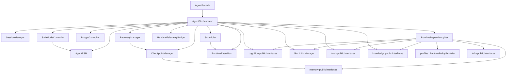
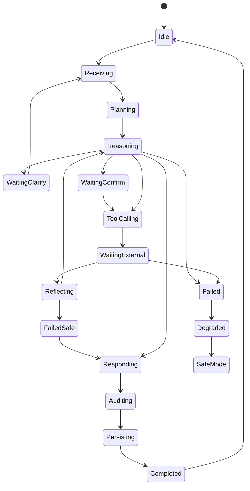
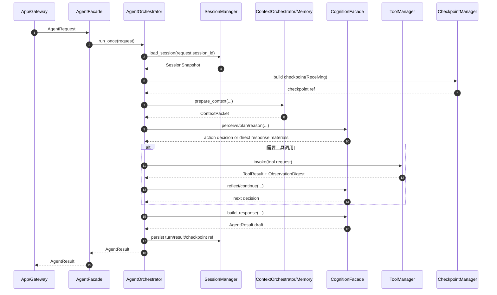
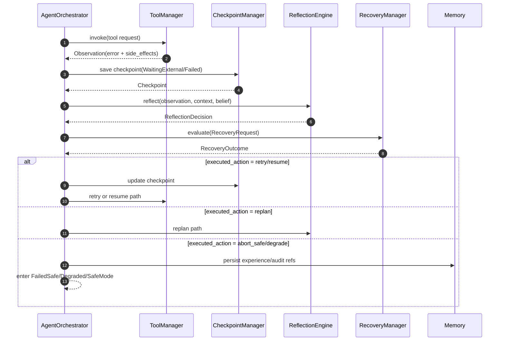

# DASALL Runtime 子系统详细设计

版本：v1.1
日期：2026-04-15
阶段：Detailed Design（评审优化后）
适用模块：runtime/

## 1. 模块概览

### 1.1 目标与定位

Runtime 子系统是 DASALL 在 Layer 6 Agent Control Plane 的工程落点，对应工程目录为 runtime/。它不是“又一个业务模块”，而是整个系统的全局主控平面，负责把已冻结的共享契约、相邻子系统的公共接口面与 profile 生效策略，收敛成一个可运行、可恢复、可验证、可演进的单 Agent 闭环。

Runtime 的核心目标是：

1. 持有单次请求的全局生命周期控制权，包括接收、规划、执行、等待、恢复、收敛与结果提交。
2. 通过显式状态机、预算控制、检查点、恢复准入和安全模式，保证主链路长期运行时的确定性与可恢复性。
3. 协调 cognition、llm、tools、memory、knowledge 与可选 multi_agent 能力，但不侵入这些子系统的内部职责。
4. 在不改写既有 ADR、SSOT 与 contracts 冻结结论的前提下，为阶段 J 的 Build 落地提供可直接映射的目录、接口、测试与 Gate 建议。

Runtime 不是：

1. 上下文拥有者。ContextPacket 的语义装配与语义预算裁剪归 memory/ContextOrchestrator。
2. Prompt 渲染器。Prompt 选择、消息装配与发送前治理归 llm/PromptRegistry、PromptComposer、PromptPolicy。
3. 失败语义解释器。失败归因与 retry_step、replan、abort_safe 等建议归 cognition/ReflectionEngine。
4. 工具执行器。Tool 治理与执行归 tools，服务语义调用归 services。
5. 第二套产品入口。`access/` 负责共享接入 core，`apps/*` 负责入口壳层与协议绑定；Runtime 只负责请求进入后的主控闭环。

### 1.2 设计结论摘要

本设计将 Runtime 收敛为“分层控制平面 + 显式 FSM + 预算/恢复/检查点三横切控制器”的方案，核心判断如下：

1. AgentOrchestrator 持有全局主控权，RecoveryManager 持有恢复执行权，MultiAgent 仅作为受控子域能力，不得形成第二主循环。
2. Runtime 仅消费已冻结共享对象与相邻模块公共接口；对于尚未冻结的 supporting objects，保留在模块内或通过相邻模块 module-local public interface 承接。
3. v1 主路径聚焦 unary 单 Agent 闭环；streaming、共享 ModelRoute、共享 PromptPolicyDecision 与共享 StreamHandle 不作为 runtime 阶段 J 的前置闭环内容。
4. 当前仓库 runtime 仍为占位库，因此本设计需同时解决“目标架构”与“现状骨架”之间的实施鸿沟。

### 1.3 边界与依赖方向

| 维度 | 内容 | 边界说明 | 来源依据 |
|---|---|---|---|
| 上游调用者 | apps/cli、apps/gateway、apps/daemon、apps/simulator（经 `access/` 公共接口接入） | 入口壳层只负责通道适配与装配，Access core 负责请求归一化，最终统一调用 Runtime | DASALL_Agent_architecture.md 3.4.1、4.2；DASALL_Engineering_Blueprint.md 3.2、3.3 |
| 直接下游 | cognition、llm、tools、memory、knowledge、infra | Runtime 负责调用时机、预算、防护与收敛；下游各子系统只负责各自专业域 | DASALL_Agent_architecture.md 4.2、5.1；ADR-006/007/008 |
| 间接下游 | services、platform | Runtime 不应直连高风险执行能力或平台细节；一般通过 tools -> services -> platform 间接协作 | DASALL_capability_services子系统详细设计.md 1.2；platform_linux_detailed_design.md 1.2 |
| 可选协同域 | multi_agent | 仅在 Runtime 判定进入协同模式时受控使用；阶段 J 默认作为可关闭扩展点 | ADR-008；profiles/*/runtime_policy.yaml |
| 禁止依赖 | llm provider 实现、memory backend 实现、tools executor 实现、platform 实现 | 防止 runtime 通过“省事直连”破坏分层与可替换性 | DASALL_Engineering_Blueprint.md 4.2；ADR-005 |

### 1.4 来源依据与现状证据

本设计的结论直接建立在以下已存在材料之上：

1. 系统架构与运行模型：docs/architecture/DASALL_Agent_architecture.md。
2. 工程目录、依赖规则与测试蓝图：docs/architecture/DASALL_Engineering_Blueprint.md。
3. 主控边界 ADR：docs/adr/ADR-006-context-orchestrator-vs-prompt-composer.md、docs/adr/ADR-007-reflection-engine-vs-recovery-manager.md、docs/adr/ADR-008-agent-orchestrator-vs-multi-agent-coordinator.md。
4. contracts 冻结交付：docs/todos/contracts/deliverables 下的 ContextPacket、Checkpoint、RuntimeBudget、ReflectionDecision、RecoveryRequest、RecoveryOutcome、MultiAgentRequest、MultiAgentResult、WorkerTask 等文档与头文件。
5. 相邻子系统详细设计：memory、llm、tools、knowledge、cognition、services、infra、profiles。
6. 当前工程骨架：runtime/CMakeLists.txt 与 runtime/src/placeholder.cpp。
7. 阶段顺序与 Gate：docs/plans/DASALL_工程落地实现步骤指引.md 阶段 J。

当前工程现状必须被明确写成两句话：

1. architecture ready：Runtime 的控制权、依赖方向、FSM、预算、检查点与恢复责任链已在架构与 ADR 层明确。
2. implementation not ready：runtime/ 当前只有占位库与 smoke 脚手架，核心组件、公共头文件、恢复链路与主流程测试均未落地。

## 2. 约束清单

### 2.1 Must / Should / Must-Not

| Constraint ID | 类型 | 约束描述 | 影响范围 | 来源依据 |
|---|---|---|---|---|
| RT-C001 | Must | AgentOrchestrator 必须拥有请求全局生命周期、主状态机、总预算、顶层 checkpoint 与最终 AgentResult 提交权 | 主控权 | ADR-008 3.2、3.4；DASALL_Agent_architecture.md 4.4、5.1 |
| RT-C002 | Must | RecoveryManager 必须拥有恢复动作准入与执行权，负责 retry、resume、degrade、abort_safe 和补偿协同 | 恢复链路 | ADR-007 3.3、3.4、4 |
| RT-C003 | Must | Runtime 只能消费 memory 提供的 ContextPacket，不能自建第二上下文装配中心 | context 边界 | ADR-006 3.2、4、6；DASALL_memory子系统详细设计.md MEM-C002 |
| RT-C004 | Must | Runtime 不得自行承担 Prompt 选择、消息装配或 provider payload 生成，只能通过 llm 公共接口发起模型调用 | llm 边界 | ADR-006 3.3、5.3；DASALL_llm子系统详细设计.md LLM-C004、LLM-C005 |
| RT-C005 | Must | ReflectionEngine 只给语义建议，Runtime 必须把 ReflectionDecision 与运行时预算、幂等性、副作用和熔断状态组合后再裁定 | 失败语义与恢复 | ADR-007 3.2、3.3、5 |
| RT-C006 | Must | Runtime 必须统一管理 Session、Task、FSM、Budget、Checkpoint、SafeMode 与用户交互唯一出口 | 生命周期 | DASALL_Agent_architecture.md 4.4、5.1、6.8 |
| RT-C007 | Must | Runtime 必须统一接入 MAX_TOOL_CALLS、MAX_REPLAN_COUNT、STEP_TIMEOUT_SECONDS、SESSION_TIMEOUT_SECONDS 等防护项 | 预算与防护 | DASALL_Agent_architecture.md 6.8.1；阶段 J 指引 |
| RT-C008 | Must | Runtime 必须在状态转移前后持久化最小恢复状态，并优先通过 Checkpoint + pending_action 做恢复，而不是无条件从头重跑 | checkpoint / resume | DASALL_Agent_architecture.md 3.8.3、6.10；WP03-T012/T013 |
| RT-C009 | Must | Runtime 必须复用 profiles 的 RuntimePolicySnapshot 生效视图，不新增 schema v1 顶层治理域 | 配置策略 | DASALL_profiles模块详细设计.md；profiles/include/RuntimePolicySnapshot.h |
| RT-C010 | Must | Runtime 详细设计必须保持单向依赖，不反向直连 platform、provider adapter、memory backend、tool executor 实现 | 依赖治理 | DASALL_Engineering_Blueprint.md 4.1、4.2 |
| RT-C011 | Must | 边界错误必须显式可观测，日志、指标、追踪、审计四类信号至少要能覆盖状态迁移、预算拒绝、恢复拒绝、safe mode 进入 | 可观测性 | DASALL_工程协作与编码规范.md 3.6；DASALL_infrastructure子系统详细设计.md INF-C001 |
| RT-C012 | Must | 阶段 J 的设计和 Build 映射必须以单 Agent 生产级闭环为目标，不把 multi_agent 作为首版必选前置 | 实施范围 | docs/plans/DASALL_工程落地实现步骤指引.md 阶段 J、阶段 L |
| RT-C013 | Should | 调度、恢复与异步执行应采用“控制平面少线程 + 执行平面弹性线程池”模型，并对队列背压与锁顺序显式建模 | 并发模型 | DASALL_Agent_architecture.md 6.5；InfraConcurrencyPolicy.md |
| RT-C014 | Should | Runtime 对外公共接口应保留在 runtime/include，不进入 contracts 共享层，除非后续出现明确跨模块稳定依赖面与 supporting contracts 基线 | 接口准入 | WP05-T011、WP05-T012；DASALL_boundary治理与优化说明.md |
| RT-C015 | Should | 单 Agent unary 主路径先于 streaming、多 Agent 和复杂 shared supporting objects 收敛，避免过早冻结未成熟对象 | 推进节奏 | docs/worklog/DASALL_开发执行记录.md 记录 #296 |
| RT-C016 | Must-Not | Runtime 不得把 PlanGraph、ActionDecision、PromptPolicyDecision、ResolvedModelRoute、StreamHandle 等未成熟 supporting objects 伪装成 shared contracts 既有事实 | contracts 冻结策略 | WP05-T012；llm worklog 阶段 J blocker |
| RT-C017 | Must-Not | Runtime 不得绕过 Tool Policy Gate、ExecutionService 或服务门面直接执行高风险动作 | 执行治理 | DASALL_tools子系统详细设计.md TOOL-C002、TOOL-C012；services 详细设计 CAP-C002 |
| RT-C018 | Must-Not | Runtime 不得在阶段 J 内引入第二调度中心、第二工作流引擎或内嵌多 Agent 协同主循环 | 架构一致性 | ADR-008；DASALL_Agent_architecture.md 6.11、6.12 |
| RT-C019 | Must | Runtime 必须为每个 Worker Ticket 绑定 CancellationToken，支持 step-level 超时取消传播 | 超时防护 | DASALL_Agent_architecture.md 6.8；timeout_policy 规范；行业实践（Temporal/Kubernetes cancellation pattern） |
| RT-C020 | Must | Runtime 在发起工具重试时必须复用原 retry_idempotency_token，在 replan 时必须生成新 token | 幂等安全 | ADR-007 3.3；RecoveryRequest.idempotency_and_side_effect_report；行业实践（Stripe idempotency keys） |
| RT-C021 | Should | Runtime 组件间获取多把锁时必须遵从声明的全局锁顺序，Recovery Handler Thread 仅持有只读快照 | 并发安全 | 行业实践（Lock ordering convention）；DASALL_Agent_architecture.md 6.5 线程模型 |
| RT-C022 | Should | Checkpoint 必须携带版本元数据（rt.schema_version / rt.fsm_state_enum_version），resume 时做兼容性校验 | 跨版本安全 | 行业实践（LangGraph checkpoint versioning、Temporal workflow versioning）；Checkpoint.tags 字段 |
| RT-C023 | Should | Runtime 必须定义独立错误码域 RT_E_*，所有组件的错误输出归入此域 | 可观测性 | 对标 Tools/Memory/LLM 各有独立错误域的实践；DASALL_infrastructure子系统详细设计.md INF-C001 |

### 2.2 约束抽取结论

Must：

1. Runtime 是唯一全局主控。
2. 恢复执行权在 Runtime，失败语义解释权不在 Runtime。
3. Context 所有权、Prompt 所有权、Tool 执行权、Service 执行语义权必须与相邻模块保持清晰分层。
4. Runtime 只能消费已冻结 contracts 与 module public interface，不得通过“实现直连”偷渡依赖。
5. 阶段 J 目标是单 Agent 可恢复闭环，而不是把 streaming、多 Agent、共享 supporting object admission 一起塞入首版。

Should：

1. 采用显式 FSM、检查点、预算快照、恢复准入与 SafeMode 组合控制。
2. 采用分层线程模型与队列背压策略，而非隐式异步。
3. 使用模块内支撑类型承接尚未冻结的运行态对象。

Must-Not：

1. 不改写 ADR/SSOT 结论。
2. 不把未成熟 supporting objects 反向写入 contracts。
3. 不把 Runtime 扩张为工具执行器、Prompt 渲染器或第二协同中心。

## 3. 现状与缺口

### 3.1 当前实现状态

| 观察项 | 当前状态 | 证据 | 结论 |
|---|---|---|---|
| runtime 构建入口 | 已存在 | runtime/CMakeLists.txt | 已有独立静态库目标 dasall_runtime |
| runtime 源码实现 | public skeleton | runtime/src/AgentFacade.cpp | 已有 fail-closed `AgentFacade` 骨架，但主控、状态机、恢复链路仍待后续任务落盘 |
| runtime 公共头文件 | 已存在 | runtime/include/{IAgent.h,AgentTypes.h,AgentFacade.h} | 上游 apps 已有稳定 runtime public surface 入口，可继续挂载 006~011 的显式接口 |
| runtime 单测 | 仅 smoke 脚手架 | tests/unit/runtime/RuntimeSmokeTest.cpp | 现有 smoke 仅验证 mock 串联，不代表真实 Runtime 闭环 |
| runtime 集成测试 | 缺失 | tests/integration 下无 runtime 子目录 | 无法验证真正的主循环与恢复行为 |
| contracts 依赖面 | 已存在 | contracts/include/{agent,context,observation,checkpoint,...} | 共享对象边界可直接复用 |
| llm 模块公共接口 | 已存在 | llm/include/ILLMManager.h、ILLMAdapter.h | llm 侧已有 module public interface，可作为 Runtime 依赖目标 |
| services 模块公共接口 | 已存在 | services/include/IExecutionService.h、IDataService.h | Runtime 一般通过 tools 间接使用，受限场景可用于自检/诊断 |
| memory / knowledge / tools 公共接口 | 尚未落地 | 当前无 memory/include、knowledge/include、tools/include | Runtime 设计需为这些端口预留接口位但不能假定其已完成 |
| profile 生效视图 | 已存在 | profiles/include/RuntimePolicySnapshot.h、RuntimePolicyProvider.h | Runtime 启动与运行治理可直接复用 |

### 3.2 现状-目标差距表

| 目标能力 | 当前状态 | 关键差距 | 风险等级 | 优先级 |
|---|---|---|---|---|
| AgentFacade 与对外调用面 | skeleton 已落位 | 当前只有 fail-closed facade，尚未接入 AgentOrchestrator 与 runtime-local gate | High | P0 |
| AgentOrchestrator 主循环 | 缺失 | 没有 request -> decide -> execute -> observe -> recover -> respond 闭环 | High | P0 |
| SessionManager | 缺失 | 没有会话快照装载、等待态恢复、turn 终结写回 | High | P0 |
| AgentFSM | 缺失 | 架构定义存在，代码中没有显式状态机与转移守卫 | High | P0 |
| Scheduler | 缺失 | 没有前台/恢复/后台任务优先级与 worker ticket 管理 | High | P1 |
| BudgetController | 缺失 | 未落地 max_turns、max_tool_calls、max_latency_ms、max_replan_count 扣减与拒绝 | High | P0 |
| RecoveryManager | 缺失 | 未实现 ReflectionDecision + RecoveryRequest -> RecoveryOutcome 的准入闭环 | High | P0 |
| CheckpointManager | 缺失 | 没有 checkpoint 写入、读取、resume plan 生成与版本校验 | High | P0 |
| Runtime observability | 缺失 | 没有状态迁移、预算拒绝、恢复拒绝、safe mode 事件口径 | Medium | P1 |
| unary 集成测试 | 缺失 | 没有 runtime + cognition + llm + tools + memory 的真实联动路径 | High | P0 |
| streaming 与 shared supporting object | 阻塞 | StreamHandle、ResolvedModelRoute、PromptPolicyDecision 尚未 shared admission | Medium | P1 |
| 多 Agent 正式集成 | 阻塞 | 阶段 L 先于 runtime 阶段 J 不成立，且 multi_agent 侧 supporting object 仍在演进 | Medium | P1 |

### 3.3 风险冲突识别

| 冲突类型 | 描述 | 若不处理的后果 |
|---|---|---|
| 边界冲突 | Runtime 直接重排上下文或直接渲染 Prompt | 破坏 ADR-006，形成第二上下文主控与第二 Prompt 主控 |
| 语义冲突 | Runtime 根据错误码直接决定 replan，而不消费 ReflectionDecision | 破坏 ADR-007，失败语义与恢复执行混层 |
| 依赖反转 | Runtime 直连 tool executor、provider adapter 或 memory backend | 破坏蓝图依赖规则，Profile 裁剪和替换能力失效 |
| 主控漂移 | Runtime 在阶段 J 内内嵌 multi_agent 协同引擎 | 破坏 ADR-008，形成第二主循环 |
| contracts 污染 | 为了“先跑起来”把 ActionDecision、PlanGraph、PromptPolicyDecision 等写入 shared contracts | 放大后续 ABI/语义返工成本 |
| 过度前置 | 把 streaming shared admission 当成 runtime 阶段 J 必备项 | 阻塞单 Agent 闭环，偏离阶段顺序 |

### 3.4 现状结论

当前最合理的推进方式不是扩张 contracts，也不是继续保留 placeholder，而是：

1. 先在 runtime/include 建立模块公共接口面和运行态 supporting types。
2. 先打通 unary 单 Agent 主循环、预算、恢复、检查点与 SafeMode 闭环。
3. 将 streaming、多 Agent 与 shared supporting object admission 作为后续受控演进项，而非阶段 J 前置条件。

## 4. 候选方案对比

### 4.1 候选方案描述

#### 方案 A：单体式 RuntimeManager

设计思路：

1. 以单一 RuntimeManager 同时承担主循环、FSM、会话、预算、恢复、检查点、事件和多 Agent 协同。
2. 所有下游调用都由该对象直接完成，使用大量条件分支区分阶段与模式。

优点：

1. 初始文件数最少。
2. 替换 placeholder 最快。

风险：

1. 极易演化为 God Object。
2. 状态转移、预算、恢复与检查点无法独立测试。
3. 一旦接入 SafeMode、等待态、Resume、多 Agent 扩展，复杂度呈指数增长。
4. 容易顺手侵入 Context、Prompt、Tool 与 Recovery 的相邻职责边界。

与 DASALL 约束匹配度：低。

#### 方案 B：分层控制平面方案

设计思路：

1. 以 AgentFacade 作为对外入口，AgentOrchestrator 作为全局主控。
2. 将状态推进、预算、会话、恢复、检查点和调度拆为显式组件，由 Orchestrator 组合使用。
3. 所有下游调用通过公共接口面和共享 contracts 完成，未成熟 supporting objects 保持模块内。
4. unary 单 Agent 先闭环；multi_agent、streaming、共享 supporting object admission 按阶段后置。

优点：

1. 与当前 ADR 和分层边界完全一致。
2. 预算、恢复、检查点、SafeMode 可独立测试和灰度落地。
3. 便于按阶段 J 的实施项分解 Build 目标。
4. 能将当前相邻模块“接口已就绪 / 未就绪”的现实差异显式吸收进设计。

风险：

1. 初期组件和 supporting type 数量较多。
2. 需要严格管理模块内接口，防止再次演化为隐藏耦合。

与 DASALL 约束匹配度：高。

#### 方案 C：Actor / Event-Sourced 主控方案

设计思路：

1. 将 Runtime 主链路建模为 Actor 邮箱、事件溯源日志与状态投影。
2. 所有状态转移通过事件日志驱动，恢复通过事件回放完成。

优点：

1. 异步与恢复模型理论上最完备。
2. 对多任务、事件回放与复杂诊断友好。

风险：

1. 远超当前 contracts、tools、memory、llm supporting object 的成熟度。
2. 需要新的共享事件与状态投影语义，明显超出阶段 J 范围。
3. 对当前仓库空骨架而言，Build 路径过长，验证成本高。

与 DASALL 约束匹配度：中。

### 4.2 候选方案对比矩阵

| 方案 | 架构一致性 | ADR/SSOT 一致性 | contracts 冻结一致性 | 工程可实现性 | 测试可验证性 | 版本可演进性 | 结论 |
|---|:---:|:---:|:---:|:---:|:---:|:---:|---|
| A 单体式 RuntimeManager | 2 | 2 | 2 | 4 | 2 | 2 | 淘汰 |
| B 分层控制平面 | 5 | 5 | 5 | 4 | 5 | 5 | 采纳 |
| C Actor / Event-Sourced | 3 | 4 | 3 | 2 | 3 | 4 | 暂不采纳 |

### 4.3 取舍依据

1. 本项目当前最大风险不是“组件不够多”，而是“边界串扰和 supporting object 过早冻结”。因此首选能够显式防守边界的方案 B。
2. services、tools、memory、knowledge 的详细设计都已把 Retry、Compensating Transaction、Bulkhead、lane 隔离等实践收敛为控制面与执行面分层，这与方案 B 最一致。
3. 方案 C 虽然在理论上更强，但会要求新的事件契约、状态存储与消费者矩阵，与当前阶段顺序明显不匹配。

## 5. 决策结论

### 5.1 最终选型

采纳方案 B：分层控制平面方案。

### 5.2 决策理由

1. 它是唯一同时满足 Runtime 全局主控、Recovery 准入、Checkpoint 最小恢复状态、Profile 生效视图接入与单 Agent 闭环要求的方案。
2. 它允许当前已存在的 llm::ILLMManager、services::IExecutionService / IDataService、profiles::RuntimePolicyProvider / RuntimePolicySnapshot 被直接纳入依赖图，同时为尚未落地的 memory / knowledge / tools 公共接口预留稳定端口位。
3. 它将阶段 J 与阶段 L、shared supporting object admission、streaming 生命周期等后置事项清晰隔离，避免“为了未来扩展而拖死当前主链路”。

### 5.3 放弃其他方案的原因

| 方案 | 放弃原因 |
|---|---|
| 方案 A | 会迅速形成 God Object，并削弱预算、恢复、检查点、SafeMode 的独立验证能力 |
| 方案 C | 超出当前支持对象冻结和仓库骨架能力，且会把阶段 J 变成新的 contracts/事件总线设计工程 |

### 5.4 与架构、ADR、contracts 的一致性说明

| 核对面 | 结论 | 说明 |
|---|---|---|
| 架构一致性 | 通过 | Runtime 继续作为唯一全局主控，不改变七层结构 |
| ADR-006 | 通过 | Runtime 只消费 ContextPacket 和 llm 调用面，不承担上下文装配或 Prompt 组装 |
| ADR-007 | 通过 | ReflectionDecision 只作输入建议，RecoveryOutcome 只作运行结果，最终执行权仍在 Runtime |
| ADR-008 | 通过 | MultiAgent 保持受控子域，不成为第二主控 |
| contracts 冻结一致性 | 通过 | 只复用既有共享对象；未成熟 supporting objects 保持 module-local |

## 6. 详细设计

### 6.1 职责边界

| 方向 | Runtime 允许做的事 | Runtime 禁止做的事 |
|---|---|---|
| 对 apps | 接收归一化请求、返回最终 AgentResult、维持等待态/恢复态 | 不承担入口协议解析、认证鉴权、网关会话协议 |
| 对 cognition | 传递 GoalContract、ContextPacket、BeliefState、Observation，接收 ActionDecision 类模块内结果与 ReflectionDecision | 不把认知阶段输出直接等价为执行动作或恢复结果 |
| 对 llm | 通过 ILLMManager 发起模型调用，消费统一结果、治理回流与健康状态 | 不自建 Prompt 资产、消息渲染或 provider adapter 直连 |
| 对 tools | 通过 IToolManager 发起受控工具调用、消费 ToolResult/ObservationDigest | 不绕过 PolicyGate 或 Executor 直发高风险动作 |
| 对 memory | 加载 session / turn / summary / checkpoint，消费 ContextPacket，提交写回指令 | 不自行重排历史、压缩上下文或直连底层存储 |
| 对 knowledge | 发起受控检索、接收 EvidenceBundle 投影结果 | 不在 Runtime 内重写检索算法或直接消费原始检索 backend |
| 对 multi_agent | 在 profile 与能力允许时触发协同子域请求 | 不在阶段 J 把 multi_agent 当作首版闭环硬依赖 |
| 对 infra | 发出日志、指标、trace、audit 和 health 信号 | 不重定义 infra contracts 或自建第二套可观测协议 |

### 6.2 子组件清单与职责

| 组件 | 类型 | 职责 | 主要输入 | 主要输出 |
|---|---|---|---|---|
| AgentFacade | module public | Runtime 对外唯一入口，封装初始化、单次处理、resume 与优雅停机 | AgentRequest、profile_id | AgentResult |
| AgentOrchestrator | 核心组件 | 驱动主循环、协调各控制器与下游端口、持有最终裁定权 | AgentRequest、RuntimeStateSnapshot | OrchestratorRunResult |
| SessionManager | 核心组件 | 加载/保存 Session、Turn、Checkpoint 关联状态，管理等待态恢复锚点 | request_id、session_id | SessionSnapshot、SessionPersistResult |
| AgentFSM | 核心组件 | 定义显式状态、转移守卫、终态与 safe mode 迁移 | StateTransitionRequest | StateTransitionOutcome |
| Scheduler | 核心组件 | 管理前台交互、恢复任务、后台维护任务的优先级与 ticket | SchedulerTicketRequest | SchedulerTicket |
| BudgetController | 核心组件 | 扣减和校验 RuntimeBudget / BudgetSnapshot，产出预算拒绝原因 | BudgetConsumeRequest | BudgetDecision |
| RecoveryManager | 核心组件 | 组合 ReflectionDecision、Checkpoint、BudgetSnapshot、幂等性报告，裁定并执行恢复动作 | RecoveryRequest | RecoveryOutcome |
| CheckpointManager | 核心组件 | 生成、校验、持久化和加载 Checkpoint，生成 ResumePlan | CheckpointBuildRequest | Checkpoint / ResumePlan |
| RuntimeEventBus | 内部支撑 | 在 Runtime 内部分发受控事件，隔离状态变更与观测/后台动作 | EventEnvelope | event delivery / handler result |
| SafeModeController | 内部支撑 | 负责 degraded / failed / safe mode 进入条件与退出条件收敛 | SafeModeTrigger | SafeModeDecision |
| RuntimeTelemetryBridge | 内部支撑 | 统一写日志、指标、追踪、审计 | transition / decision / error context | observability events |
| RuntimeDependencySet | 组合根 | 聚合 llm、memory、tools、knowledge、cognition、profiles、infra 等端口 | module public interfaces | orchestrator-ready dependency graph |

### 6.3 子组件输入 / 输出

| 子组件 | 输入来源 | 输出去向 | 语义说明 |
|---|---|---|---|
| AgentFacade | apps、simulator、daemon | AgentOrchestrator | 对外不暴露内部状态机与控制器细节 |
| AgentOrchestrator | AgentRequest、SessionSnapshot、RuntimePolicySnapshot | cognition / llm / tools / memory / knowledge / infra | 统一持有调用时机和终态提交权 |
| SessionManager | memory public interface、CheckpointManager | AgentOrchestrator | 输出会话快照与恢复锚点，不做上下文组装 |
| AgentFSM | AgentOrchestrator | AgentOrchestrator / RuntimeTelemetryBridge | 显式表达状态推进与拒绝原因 |
| Scheduler | AgentOrchestrator、RecoveryManager | tool worker / event bus / background jobs | 只负责排队和优先级，不解释失败语义 |
| BudgetController | RuntimePolicySnapshot.runtime_budget、BudgetSnapshot | AgentOrchestrator、RecoveryManager | 预算超限时只产出拒绝/降级建议，不直接执行恢复 |
| RecoveryManager | ReflectionDecision、Checkpoint、Observation、ErrorInfo、BudgetSnapshot | AgentOrchestrator、CheckpointManager、RuntimeTelemetryBridge | 输出 RecoveryOutcome，必要时请求补偿协同 |
| CheckpointManager | AgentFSM、SessionManager、RecoveryManager | memory persistence / AgentOrchestrator | 负责最小恢复状态的构建与恢复计划 |
| RuntimeEventBus | Orchestrator / background jobs | telemetry / maintenance handlers | 不跨模块承载业务控制语义 |
| SafeModeController | BudgetDecision、RecoveryOutcome、health signal | AgentFSM / AgentOrchestrator | 安全失败统一从 FailedSafe / Degraded / SafeMode 路径收敛 |

### 6.4 组件依赖关系



依赖约束：

1. Runtime 通过端口依赖下游，不 include 其实现细节。
2. Runtime 对 services 的依赖通常经 tools 间接完成，仅保留受限自检/诊断入口。
3. MultiAgent 相关端口默认可空实现或 disabled adapter，由 profile `enabled_modules.multi_agent` 控制启用。

### 6.5 核心对象与 contracts 对齐关系

| 对象 | 类型 | 对齐策略 | 说明 |
|---|---|---|---|
| AgentRequest | shared contract | 直接复用 | Runtime 外部入口基线对象 |
| GoalContract | shared contract | 直接复用 | 认知阶段输入锚点 |
| ContextPacket | shared contract | 直接复用 | 只消费，不修改 ownership |
| Observation / ObservationDigest | shared contract | 直接复用 | 执行结果与推理投影输入 |
| BeliefState | shared contract | 直接复用 | 认知输入与恢复参考 |
| RuntimeBudget / BudgetSnapshot | shared contract | 直接复用 | BudgetController 与 RecoveryManager 的预算基线 |
| Checkpoint | shared contract | 直接复用 | CheckpointManager 持久化与恢复的最小对象 |
| ReflectionDecision / RecoveryRequest / RecoveryOutcome | shared contract | 直接复用 | 失败语义与恢复执行边界 |
| MultiAgentRequest / MultiAgentResult / WorkerTask | shared contract | 直接复用，但阶段 J 默认作为可选扩展 | 不纳入首版闭环硬依赖 |
| RuntimeStateSnapshot | module-local | 新增于 runtime/include | 聚合 FSM、预算、会话、等待态、safe mode 的运行态投影，不进入 contracts |
| StateTransitionRequest / Outcome | module-local | 新增于 runtime/include/fsm | 表达状态机内部转移，不污染 shared contracts |
| OrchestratorRunResult | module-local | 新增于 runtime/include | 表达一次主循环的内部执行收敛结果 |
| ResumePlan | module-local | 新增于 runtime/include/checkpoint | Checkpoint 加载后生成的恢复行动计划 |
| SchedulerTicket / Request | module-local | 新增于 runtime/include/scheduling | 内部调度对象，不进入共享层 |
| RuntimeErrorCode | module-local | 新增于 runtime/include/RuntimeErrorCode.h | Runtime 错误码域，便于跨组件统一诊断 |

#### 6.5.1 CheckpointState 与 FSM 状态映射

contracts 冻结的 `CheckpointState` 枚举只有 7 个值（Unspecified / Running / Paused / WaitingConfirm / WaitingTool / Failed / Succeeded），而 Runtime FSM 有 17 个显式状态。两者之间必须建立显式映射，否则 checkpoint resume 时会产生语义偏移。

| CheckpointState | 对应 FSM 状态集合 | 映射语义 |
|---|---|---|
| Running | Receiving, Planning, Reasoning, ToolCalling, Reflecting, Responding, Auditing, Persisting | 正在执行中的活跃状态，checkpoint 可作增量快照 |
| Paused | WaitingClarify | 等待用户澄清，checkpoint 必须包含 pending_action |
| WaitingConfirm | WaitingConfirm | 等待高风险动作确认，checkpoint 必须包含 pending_action |
| WaitingTool | WaitingExternal | 等待异步工具/外部结果，checkpoint 必须包含 pending_action |
| Failed | Failed, FailedSafe, Degraded, SafeMode | 不可继续状态，checkpoint 仅作审计锚点 |
| Succeeded | Completed | 正常完成，checkpoint 作为终态存档 |
| Unspecified | Idle（无活跃请求时） | FSM 处于 Idle 时不应产生活跃 checkpoint |

映射规则约束：

1. CheckpointManager 构建 checkpoint 时，必须使用此映射表将当前 FSM 状态折叠为合法 CheckpointState。
2. 从 checkpoint 恢复时，ResumePlan 只能把 Paused / WaitingConfirm / WaitingTool / Running 映射回对应 FSM 状态；Failed 和 Succeeded 不允许 resume。
3. 若 FSM 新增状态，必须同步更新此映射表，否则 checkpoint 构建应显式 reject。

### 6.6 建议公共接口面

以下接口建议落在 runtime/include，保持 module public interface，而不是立即升格为 shared contracts：

1. IAgent
2. IAgentOrchestrator
3. ISessionManager
4. IAgentFsm
5. IScheduler
6. IBudgetController
7. IRecoveryManager
8. ICheckpointManager
9. IRuntimeEventBus
10. ISafeModeController

接口语义建议：

| 接口 | 核心方法建议 | 语义约束 |
|---|---|---|
| IAgent | init(...), handle(...), resume(...), stop(...) | 面向 apps 的唯一入口，不暴露内部组件 |
| IAgentOrchestrator | run_once(...), continue_from_checkpoint(... ) | 持有主循环与最终裁定权 |
| ISessionManager | load_session(...), persist_turn(...), persist_checkpoint_ref(...) | 不做上下文装配，只做会话与快照锚点管理 |
| IAgentFsm | transition(...), current_state(), can_enter(...) | 显式状态转移和守卫校验 |
| IScheduler | enqueue(...), acquire_worker(...), release_worker(...) | 优先级、背压与 ticket 管理 |
| IBudgetController | consume(...), snapshot(), can_replan(), can_call_tool() | 只做预算事实判断 |
| IRecoveryManager | evaluate(...), execute(... ) | 组合 RecoveryRequest，产出 RecoveryOutcome |
| ICheckpointManager | build_checkpoint(...), save(...), load(...), make_resume_plan(...) | 只管理 checkpoint 生命周期 |

### 6.7 状态机设计

#### 6.7.1 运行状态

首版 Runtime 状态机沿用架构基线，并对阶段 J 落地做如下收敛：

1. Idle
2. Receiving
3. Planning
4. Reasoning
5. WaitingClarify
6. WaitingConfirm
7. ToolCalling
8. WaitingExternal
9. Reflecting
10. FailedSafe
11. Responding
12. Auditing
13. Persisting
14. Completed
15. Failed
16. Degraded
17. SafeMode

#### 6.7.2 状态机落地原则

1. WaitingClarify、WaitingConfirm、WaitingExternal 必须是显式状态，不允许藏在布尔分支里。
2. FailedSafe 先于 Failed/Degraded/SafeMode，用于补偿和安全收敛。
3. Auditing 与 Persisting 作为终态前显式步骤，不能被省略为“顺手写一下日志”。
4. 任何状态进入前都必须有可追踪的状态转移原因和 checkpoint 策略。

#### 6.7.3 主状态迁移图



#### 6.7.4 状态转移守卫表

以下表显式列出每条合法转移的 guard 条件和 checkpoint 策略，实现时 AgentFSM 必须逐条编码。

| From | To | Guard 条件 | Checkpoint 策略 |
|---|---|---|---|
| Idle | Receiving | 新 AgentRequest 到达且 Facade 初始化完成 | 不写 checkpoint（Idle 无活跃请求） |
| Receiving | Planning | 请求参数校验通过、Session 加载成功、预算初始化完成 | 写 checkpoint（Running） |
| Planning | Reasoning | ContextPacket 装配完成 | 写 checkpoint（Running） |
| Reasoning | WaitingClarify | cognition 输出 clarification_needed 且 profile 允许 | 写 checkpoint（Paused），pending_action 必填 |
| WaitingClarify | Receiving | 用户澄清输入到达 | 更新 checkpoint（Running） |
| Reasoning | WaitingConfirm | cognition 输出高风险动作且 execution_policy.requires_high_risk_confirmation=true | 写 checkpoint（WaitingConfirm），pending_action 必填 |
| WaitingConfirm | ToolCalling | 用户确认通过 | 更新 checkpoint（Running） |
| Reasoning | ToolCalling | cognition 输出工具调用决策且 BudgetController.can_call_tool()=true | 写 checkpoint（Running） |
| ToolCalling | WaitingExternal | 工具调用已提交、等待异步结果 | 写 checkpoint（WaitingTool），pending_action 必填 |
| WaitingExternal | Reflecting | 工具结果到达（成功或失败） | 更新 checkpoint（Running） |
| Reflecting | Reasoning | ReflectionDecision=Continue 或 RecoveryOutcome=retry/replan 且预算允许 | 写 checkpoint（Running） |
| Reflecting | FailedSafe | RecoveryOutcome=abort_safe 或 degrade | 写 checkpoint（Failed） |
| Reasoning | Responding | cognition 输出直接响应材料、无需工具调用 | 写 checkpoint（Running） |
| FailedSafe | Responding | 安全失败收敛完成，需要输出降级结果 | 保持 checkpoint（Failed） |
| Responding | Auditing | 响应文本构建完成 | 不写新 checkpoint |
| Auditing | Persisting | 审计事件写入完成 | 不写新 checkpoint |
| Persisting | Completed | session/turn/checkpoint 持久化确认 | 写终态 checkpoint（Succeeded） |
| Completed | Idle | 结果已返回给 Facade | 清除活跃 checkpoint 引用 |
| Reasoning | Failed | 不可恢复错误且 RecoveryManager 拒绝所有恢复路径 | 写 checkpoint（Failed） |
| WaitingExternal | Failed | 工具超时且 RecoveryManager 拒绝重试 | 写 checkpoint（Failed） |
| Failed | Degraded | degrade_policy 允许降级运行 | 保持 checkpoint（Failed） |
| Degraded | SafeMode | 降级后仍不可恢复或 safe_mode_enabled=true 且触发条件满足 | 保持 checkpoint（Failed） |

非法转移兜底规则：

1. 任何不在表中的 from→to 组合必须被 AgentFSM.can_enter() 显式拒绝。
2. 拒绝时必须产出 TransitionRejectionReason（含 from_state、requested_to、violation_type）。
3. 拒绝事件必须对 RuntimeTelemetryBridge 可见。

#### 6.8.1 单 Agent unary 主流程



#### 6.8.2 异常与恢复时序



### 6.9 数据流设计


数据流原则：

1. 共享对象只在 contracts 冻结范围内穿透模块边界。
2. PlanGraph、ActionDecision、ResumePlan、StateTransitionOutcome 等运行态对象停留在模块内或相邻模块 public interface。
3. Runtime 不直接把 ToolResult payload 或 provider-private 字段塞回下一轮模型输入。

### 6.10 配置项与默认策略

Runtime 只消费已存在的 RuntimePolicySnapshot，不新增 profile schema v1 顶层字段。建议映射如下：

| 配置来源 | 关键字段 | Runtime 用途 | 默认策略 |
|---|---|---|---|
| runtime_budget | max_turns / max_tool_calls / max_latency_ms / max_replan_count / max_tokens | BudgetController 防护项 | 必填，缺失即启动失败 |
| runtime_budget | worker_threads | Scheduler / worker pool 大小 | 按 profile 生效值创建 |
| timeout_policy | llm/tool/mcp/workflow.timeout_ms | 各调用链 deadline | 子域各自使用，不做统一硬编码 |
| timeout_policy | retry_budget / circuit_breaker_threshold | RecoveryManager 准入与熔断输入 | 仅作运行时事实输入，不改写 ReflectionDecision |
| execution_policy | requires_high_risk_confirmation | WaitingConfirm 进入条件 | 默认 true |
| execution_policy | safe_mode_enabled | SafeModeController 启用开关 | 默认 true |
| execution_policy | allowed_tool_domains | Tool 调用前约束 | Runtime 只消费，不再解释工具治理细节 |
| degrade_policy | fallback_chain / allow_model_failover / allow_budget_degrade | 降级路径与预算退化开关 | 预算退化只在允许时生效 |
| ops_policy | log_level / trace_sample_ratio | RuntimeTelemetryBridge 初始化 | 无值则拒绝激活 profile snapshot |
| enabled_modules | multi_agent / knowledge / tools_mcp / memory_experience | 能力启停与依赖注入 | 禁用模块时使用 null adapter 或 fail-closed stub |

### 6.11 异常语义与恢复路径

| 异常类别 | 触发点 | Runtime 行为 | 恢复路径 |
|---|---|---|---|
| 输入无效 | AgentRequest guards 或入口归一化失败 | 直接返回失败结果，不进入主循环 | 无恢复，审计记录 |
| Session/Checkpoint 缺失 | SessionManager / CheckpointManager | 若可空启动则走新会话；否则 fail-safe | 记录缺失原因，必要时新建会话 |
| 上下文装配失败 | memory prepare_context 失败 | 不自建上下文；进入失败反思或直接安全失败 | 允许 degrade 到最小上下文仅当 memory 明确支持 |
| 预算超限 | BudgetController | 拒绝进入下一轮扩张，进入 degrade 或 safe failure | 由 RecoveryManager / Orchestrator 决定终止或降级 |
| 工具调用失败 | tools 返回 Observation.error | 进入 Reflection + Recovery 链路 | retry / replan / abort_safe |
| 模型治理拒绝 | llm 返回治理回流 | 作为可判定上游事实回到 Runtime | 可能触发 recompose、degrade 或 fallback model |
| Checkpoint 写入失败 | CheckpointManager | 视为高优先级运行风险 | 若 profile 允许则进入 degraded 模式；否则 safe fail |
| 熔断触发 | RecoveryManager / timeout policy | 进入降级或 safe mode | 基于 fallback_chain 或 abort_safe |

#### 6.11.1 Recovery Context 可见性边界表

为避免 ADR-007 在实现期被“建议权回流成执行权”，Runtime 必须把恢复链路所需上下文拆成“cognition 可见建议输入”和“runtime 独占执行事实”两层；后者只由 RecoveryManager / AgentOrchestrator 消费，不允许回流到 cognition 形成二次语义解释。

| 上下文项 | 生产者 | cognition 可见性 | runtime / recovery 可见性 | 约束 |
|---|---|---|---|---|
| `Observation`、`ObservationDigest`、`ErrorInfo`、`GoalContract`、`BeliefState`、plan node status | tools / llm / cognition / runtime | 可见 | 可见 | 作为 ReflectionEngine 的建议输入，也是 RecoveryManager 的事实输入 |
| `ReflectionDecision.{continue,retry_step,replan,abort_safe}`、`rationale`、`confidence`、`relevant_observation_refs` | cognition / ReflectionEngine | 仅输出 | 可见 | 只表达 suggestion-only 语义；不得在 Runtime 中被当成已执行动作 |
| `BudgetSnapshot`、`max_replan_count` 剩余量、deadline 剩余量 | BudgetController | 仅可接收预算提示投影，不可见原始恢复计数 | 独占 | Runtime 可以向 cognition 投影 budget hint，但恢复准入计数和拒绝原因不回流 |
| retry 次数、熔断状态、backoff 阶段、checkpoint 可恢复性 | RecoveryManager / CheckpointManager | 不可见 | 独占 | 这些是恢复执行事实，不属于 cognition 规划语义 |
| `idempotency_and_side_effect_report`、补偿可用性、`compensation_result_ref` | tools / runtime | 不可见 | 独占 | 幂等与补偿上下文只用于恢复准入和执行，不进入 ReflectionDecision |
| `RecoveryOutcome.{admit,reject,escalate}`、`rejection_reason`、`escalation_reason` | RecoveryManager | 不可见 | 输出事实 | 若后续阶段需要感知，只能通过新的 `Observation` / `ErrorInfo` 事实进入下一轮，而不是把 RecoveryOutcome 直接送回 cognition |
| policy rule id、secret、provider private payload、raw checkpoint blob | access / infra / llm / checkpoint backend | 不可见 | 受限可见 | 禁止进入 cognition，也不得出现在审计外泄字段中 |

Recovery Context 规则：

1. ReflectionEngine 只解释失败与给出建议，不持有 retry counter、熔断器状态、补偿句柄或 checkpoint admission。
2. RecoveryManager 必须基于本表中的 runtime 独占事实做 admit / reject / escalate 裁定，不能把裁定责任回退给 cognition。
3. 若后续需要系统级 SSOT，本表即为 Runtime 侧基线，不得与 cognition 或 access 文档产生相反解释。

#### 6.11.2 RecoveryContextBoundary 系统回链

1. Recovery Context 的系统级单一真相来源固定为 [../ssot/RecoveryContextBoundary.md](../ssot/RecoveryContextBoundary.md)；本节保留为 runtime 执行控制面的本地回链。
2. runtime 继续独占 `retry budget`、retry counter、`idempotency`、补偿句柄、`circuit` state、checkpoint recoverability 与 session / worker deadline 等执行控制事实；cognition 只允许接收预算提示、阶段级 `deadline_ms` 提示和投影后的 `Observation` / `ErrorInfo`。
3. `RecoveryOutcome`、`rejection_reason`、`escalation_reason`、`retry_idempotency_token` 与 raw checkpoint / provider private payload 等对象禁止直接回流到 cognition；若需要被下一轮认知使用，必须先转换为新的可审计事实。
4. `INT-TODO-007` 关闭的是系统级边界歧义；后续 `INT-TODO-017` 才负责把 `AgentOrchestrator` / `RecoveryManager::evaluate/apply` 的代码使用点对齐到这份 SSOT。

### 6.12 可观测性设计

| 类别 | 关键事件 / 指标 | 最小要求 |
|---|---|---|
| 日志 | request start/end、state transition、checkpoint save/load、budget reject、recovery reject、safe mode enter | 结构化字段至少含 request_id、session_id、trace_id、state |
| 指标 | runtime_loop_latency、runtime_turn_count、runtime_tool_calls_total、runtime_replan_total、checkpoint_save_failures_total、safe_mode_entries_total | 标签受 allowlist 控制，避免高基数 |
| 追踪 | orchestrator round span、tool call child span、llm call child span、checkpoint persist span、recovery evaluate span | 能关联 trace_id / parent span |
| 审计 | high-risk confirmation、recovery rejection、compensation approved/denied、safe failure result、profile generation used | 不可静默丢失 |

### 6.13 与相邻模块调用关系

| 相邻模块 | Runtime 发起调用 | Runtime 接收结果 | 依赖方向结论 |
|---|---|---|---|
| memory | load_session、prepare_context、write_back、load_checkpoint anchor | SessionSnapshot、ContextPacket、writeback result | Runtime -> memory public interface |
| cognition | perceive/plan/reason、reflect、build_response | module-local stage outputs、ReflectionDecision、AgentResult draft | Runtime -> cognition public interface |
| llm | generate / stream_generate（后置） | LLMManagerResult | Runtime -> llm::ILLMManager |
| tools | invoke / invoke_batch（预留） | ToolResult、ObservationDigest、error facts | Runtime -> tools public interface |
| knowledge | retrieve evidence | EvidenceBundle / projection | Runtime -> knowledge public interface |
| services | 仅限启动自检、诊断、只读探测等受限路径 | Service result facts | Runtime -> services limited use |
| multi_agent | delegate / merge / recall（后置） | MultiAgentResult | Runtime 主控调用，阶段 J 默认可关闭 |

RuntimeDependencySet 对上述调用面的唯一接缝约束如下：

1. `AgentOrchestrator`、`SessionManager`、`RecoveryManager` 等 runtime 组件只看到 module public interface 或 runtime-local seam，不允许看到任何下游实现类。
2. 当 profile 明确关闭某能力，或阶段 J 默认不启用该子域时，`RuntimeDependencySet` 必须注入 `null adapter`，让主循环通过显式 capability disabled 语义收敛，而不是通过空指针或缺省实现兜底。
3. 当相邻模块 public interface 尚未稳定、但 runtime 必须验证自身控制平面闭环时，`RuntimeDependencySet` 必须注入 `fail-closed stub`；stub 只能返回受审计的 unavailable / blocked 结果，不能伪造成功路径。
4. 只有当相邻模块已提供 public interface 且专项 blocker 明确解除时，`RuntimeDependencySet` 才允许绑定真实适配器进入 true integration 路径。
5. seam 的可切换权归 `RuntimeDependencySet` 与 profile 投影视图，不归 `AgentFacade`、`AgentOrchestrator` 或测试调用方临时分支判断。

### 6.14 线程模型与并发安全

架构基线定义了五类线程，本节将其细化为 Runtime 组件级的线程归属、锁顺序和快照语义，以弥补设计到实现之间的并发安全缺口。

#### 6.14.1 线程归属

| 线程名 | 归属组件 | 职责 | 生命周期 |
|---|---|---|---|
| Main Loop Thread | AgentOrchestrator | 驱动 FSM 推进、decision round、terminal round | 随 AgentFacade.init 创建，stop() 时 join |
| Recovery Handler Thread | RecoveryManager | 执行 retry 调度、补偿协同、checkpoint 恢复 | 随 DependencySet 创建，stop() 时 drain & join |
| Tool Worker Pool（N线程） | Scheduler | 执行 tool invoke、knowledge retrieve 等阻塞 I/O | 大小由 RuntimePolicySnapshot.runtime_budget.worker_threads 控制 |
| Event Dispatch Thread | RuntimeEventBus | 分发内部事件至 telemetry / maintenance handler | 单线程，随 DependencySet 创建 |
| Checkpoint Persist Thread | CheckpointManager | 异步持久化 checkpoint 和 session writeback | 单线程，checkpoint 写入与主循环解耦 |

#### 6.14.2 锁顺序与互斥规则

为防止死锁，所有组件在获取多把锁时必须遵从以下全序：

```
Lock acquisition order (lower number acquired first):
  L1: AgentFSM::state_mutex          (状态读写)
  L2: BudgetController::budget_mutex  (预算读写)
  L3: SessionManager::session_mutex   (会话快照读写)
  L4: CheckpointManager::ckpt_mutex   (checkpoint 构建/持久化)
  L5: Scheduler::queue_mutex          (调度队列读写)
  L6: RuntimeEventBus::dispatch_mutex (事件分发)
```

违反规则：

1. 若任何组件需要同时持有 L3 和 L1，必须先获取 L1 再获取 L3，不可反向。
2. Main Loop Thread 不得在持有 L4 的同时阻塞等待 Tool Worker Pool 返回。
3. Recovery Handler Thread 访问 FSM 状态和预算快照时，只能使用只读快照副本（copy-on-read），不可直接持有 L1 / L2。

#### 6.14.3 快照语义与可变访问规则

| 组件 | 主循环访问模式 | 其他线程访问模式 | 快照频率 |
|---|---|---|---|
| AgentFSM | 读写（Main Loop Thread 独占写） | 只读快照 | 每次状态转移后 |
| BudgetController | 读写（Main Loop Thread 独占写） | 只读快照 | 每次 consume() 后 |
| SessionManager | 读写（Main Loop Thread 驱动） | Checkpoint Persist Thread 只读 | 每轮 turn persist 后 |
| CheckpointManager | Main Loop Thread 构建，Persist Thread 写入 | Recovery Handler Thread 只读 load | 每次 checkpoint persist 后 |
| Scheduler | Main Loop Thread enqueue，Worker Pool dequeue | 背压信号只读 | 持续 |

#### 6.14.4 队列背压与溢出策略

| 队列 | 最大深度 | 溢出策略 | 监控指标 |
|---|---|---|---|
| Scheduler 前台队列 | 1（每次只处理 1 个活跃请求） | 拒绝新请求，返回 busy result | scheduler_queue_depth |
| Scheduler 恢复队列 | profile.max_replan_count | 超限时进入 FailedSafe | recovery_queue_depth |
| Scheduler 后台维护队列 | 16 | 丢弃最旧任务，记录 warning | maintenance_queue_drops |
| RuntimeEventBus 事件队列 | 256 | 丢弃非审计类事件，保留审计类不丢弃 | event_bus_drops |
| CheckpointManager 持久化队列 | 4 | 阻塞主循环（checkpoint 安全优先） | checkpoint_queue_depth |

### 6.15 错误码域与错误分类

Runtime 需要定义独立的错误码域 `RT_E_*`，落地于 `runtime/include/RuntimeErrorCode.h`，与 infra 的通用错误框架对齐但不依赖其他模块的错误枚举。

#### 6.15.1 错误码分类

| 类别 | 码段 | 典型错误码 | 语义 |
|---|---|---|---|
| 配置与初始化 | RT_E_1xx | RT_E_100_CONFIG_MISSING, RT_E_101_PROFILE_INVALID, RT_E_102_DEPENDENCY_UNAVAILABLE | DependencySet 或 PolicySnapshot 组装失败 |
| FSM 与状态转移 | RT_E_2xx | RT_E_200_ILLEGAL_TRANSITION, RT_E_201_GUARD_VIOLATED, RT_E_202_STATE_INCONSISTENT | AgentFSM 非法操作 |
| 预算与防护 | RT_E_3xx | RT_E_300_BUDGET_EXHAUSTED, RT_E_301_TURN_OVERRUN, RT_E_302_TOOL_CALL_OVERRUN, RT_E_303_LATENCY_OVERRUN, RT_E_304_REPLAN_OVERRUN | BudgetController 拒绝 |
| 会话与 Checkpoint | RT_E_4xx | RT_E_400_SESSION_NOT_FOUND, RT_E_401_SESSION_INCONSISTENT, RT_E_410_CHECKPOINT_CORRUPT, RT_E_411_CHECKPOINT_SAVE_FAILED, RT_E_412_RESUME_REJECTED | SessionManager / CheckpointManager 异常 |
| 恢复与安全 | RT_E_5xx | RT_E_500_RECOVERY_REJECTED, RT_E_501_RECOVERY_ESCALATED, RT_E_510_SAFE_MODE_ENTERED, RT_E_511_DEGRADE_ENTERED | RecoveryManager / SafeModeController 裁定 |
| 下游超时与通信 | RT_E_6xx | RT_E_600_LLM_TIMEOUT, RT_E_601_TOOL_TIMEOUT, RT_E_602_MEMORY_TIMEOUT, RT_E_603_KNOWLEDGE_TIMEOUT | 各端口调用超时 |

#### 6.15.2 错误码使用规则

1. 所有 RuntimeErrorCode 必须出现在 RuntimeTelemetryBridge 的结构化日志中。
2. 返回给 Facade 的 AgentResult 中仅携带最终收敛的 top-level 错误码，不暴露内部链路细节。
3. RecoveryOutcome.rejection_reason 和 escalation_reason 应引用对应 RT_E_* 码。

### 6.16 超时执行模型

架构要求 STEP_TIMEOUT_SECONDS 和 SESSION_TIMEOUT_SECONDS 作为必须在所有 Profile 中生效的防护项。本节明确它们与 BudgetController 五维预算的关系和执行归属。

#### 6.16.1 超时维度与执行归属

| 超时维度 | 来源 | 执行归属 | 取消机制 | 超限行为 |
|---|---|---|---|---|
| max_latency_ms（session 级） | RuntimeBudget.max_latency_ms | BudgetController（wall-clock 监控） | 向 AgentOrchestrator 发出 budget_exhausted signal | 进入预算超限恢复评估或 FailedSafe |
| step_timeout_seconds（单步级） | timeout_policy.tool.timeout_ms / llm.timeout_ms 等 | Scheduler（per-ticket deadline 计时器） | 向 Worker Thread 发出取消信号（cancellation token） | Tool / LLM 调用超时映射为 Observation.error，进入反思链路 |
| session_timeout_seconds（会话级） | timeout_policy.session_timeout_ms 或 AgentRequest.timeout_ms | Main Loop Thread deadline watchdog | 强制进入 FailedSafe 并写 checkpoint | 返回 AgentResult(status=Timeout) |

#### 6.16.2 取消令牌与超时传播

Runtime 为每次请求创建一个 `CancellationToken`（module-local 对象），其语义为：

1. 创建时绑定 session-level deadline。
2. 传递至 Scheduler 的每个 Worker Ticket。
3. Worker 在开始 I/O 前检查 token 状态；若已取消，则立即折叠为 Observation.error(RT_E_601_TOOL_TIMEOUT)。
4. LLM 调用前检查 token 状态；若已取消，折叠为 Observation.error(RT_E_600_LLM_TIMEOUT)。
5. 不替代 BudgetController 的 max_latency_ms 检查——两者独立生效，取先触发者。

### 6.17 幂等性追踪与补偿协同

ADR-007 要求 RecoveryRequest 携带 `IdempotencyAndSideEffectReport`，但当前设计未明确谁产生此报告。

#### 6.17.1 幂等性报告生产责任

| 报告生产者 | 职责 | 报告内容 |
|---|---|---|
| Tools 子系统 | 每次工具调用完成后填写 replay_safe / side_effects_present / idempotency_key | 基于 ToolResult.side_effects 和工具注册时的 idempotent 标注 |
| Services 子系统 | 若通过 IExecutionService 执行高风险动作，返回 idempotency_key | ServiceResult.idempotency_key |
| Runtime（AgentOrchestrator） | 在发起 RecoveryRequest 前，将上述工具/服务产出的幂等性事实汇聚为 IdempotencyAndSideEffectReport | 不自行判定——只做事实汇聚 |

#### 6.17.2 重试幂等性令牌

Runtime 在每次工具调用前生成 `retry_idempotency_token`（UUID），该令牌：

1. 随 ToolRequest 传递至 tools 子系统。
2. Tools 子系统在执行前使用此令牌做去重校验。
3. 若 RecoveryManager 决定 retry_step，Runtime 复用同一令牌重发，实现端到端幂等。
4. 若 RecoveryManager 决定 replan，Runtime 生成全新令牌。

#### 6.17.3 补偿追踪归属

| 场景 | 补偿追踪归属 | Runtime 角色 |
|---|---|---|
| 单工具调用失败 | Tools 的 CompensationLedger（invoke 级） | Runtime 不参与补偿细节，只触发 recovery 评估 |
| 多工具 workflow 部分失败 | Tools 的 WorkflowEngine + CompensationLedger | Runtime 向 Tools 发送 compensate_request，消费 compensation_result_ref |
| 跨 session 补偿 | 超出阶段 J 范围 | 预留 RecoveryOutcome.compensation_result_ref 字段，阶段 J 不实现 |

### 6.18 关联 ID 所有权与传播

| 关联 ID | 生产者 | 传播路径 | 持久化位置 |
|---|---|---|---|
| request_id | Access 层（AgentRequest.request_id） | Facade → Orchestrator → 所有下游调用 | AgentResult、Checkpoint、所有日志/指标/追踪 |
| session_id | Access 层或客户端（AgentRequest.session_id） | Facade → SessionManager → Checkpoint → 所有日志 | Session 持久化表、Checkpoint.request_id 相关性 |
| trace_id | Access 层（AgentRequest.trace_id） | Facade → RuntimeTelemetryBridge → 所有 span | 日志/追踪 exporter |
| turn_id | Runtime（SessionManager 在每轮 turn 开始时生成） | SessionManager → Checkpoint（作为 step_id 的一部分） → 审计 | Turn 持久化、Checkpoint.step_id |
| checkpoint_id | Runtime（CheckpointManager 在每次构建时生成） | CheckpointManager → Session → AgentResult.checkpoint_ref | Checkpoint 持久化、AgentResult |

规则：

1. Runtime 不生成 request_id / session_id / trace_id，只继承和传播。
2. Runtime 生成 turn_id 和 checkpoint_id（module-local 命名权）。
3. 若 Access 层未提供 trace_id，Runtime 在 Facade 层补生成，但记录 warning。

### 6.19 策略热更新行为

当 profile 在 turn 中途变更时（如通过 ConfigCenter live reload），Runtime 的行为必须明确：

| 策略域 | 热更新行为 | 原因 |
|---|---|---|
| runtime_budget | 当前 turn 内不生效；下一个新请求时才加载新 snapshot | 预算扣减过程中切换上限可能导致语义不一致 |
| timeout_policy | 当前 turn 内不生效；下一个新请求时才加载 | 超时 deadline 已在 turn 开始时绑定 |
| execution_policy | 可热生效（safe_mode_enabled、requires_high_risk_confirmation 等布尔开关） | 安全相关策略应尽快生效 |
| degrade_policy | 可热生效（fallback_chain 切换） | 降级路径切换不依赖 turn 级一致性 |
| ops_policy | 可热生效（log_level、trace_sample_ratio） | 可观测性调整无副作用 |
| enabled_modules | 当前 turn 内不生效 | 模块启停依赖 DependencySet 重组装 |

实现建议：

1. RuntimeDependencySet 持有一个 `AtomicPtr<RuntimePolicySnapshot>` 用于 safe-read。
2. 每次 Facade.handle() 入口处刷新 snapshot 引用；turn 执行过程中使用 pinned snapshot。
3. execution_policy / degrade_policy / ops_policy 的子集字段通过独立的 atomic flag 暴露给需要实时感知的组件。

### 6.20 Checkpoint 版本兼容性

为保证跨版本 resume 安全，Checkpoint 需携带版本元数据（module-local 扩展，不修改 shared contracts）。

#### 6.20.1 版本元数据方案

在 CheckpointManager 构建 checkpoint 时，通过 Checkpoint.tags 字段写入以下保留 key：

| Tag Key | 值示例 | 语义 |
|---|---|---|
| `rt.schema_version` | `"1"` | Runtime checkpoint 序列化格式版本 |
| `rt.fsm_state_enum_version` | `"1"` | FSM 状态枚举版本（若新增状态则递增） |
| `rt.budget_schema_version` | `"1"` | BudgetSnapshot 布局版本 |

#### 6.20.2 Resume 兼容性校验

1. CheckpointManager.load() 时检查 `rt.schema_version`：若大于当前 runtime 支持的最大版本，拒绝 resume 并返回 RT_E_412_RESUME_REJECTED。
2. CheckpointManager.make_resume_plan() 时检查 `rt.fsm_state_enum_version`：若不匹配，尝试映射；若映射失败，拒绝 resume。
3. 版本不兼容的 checkpoint 不删除，留作审计和人工恢复参考。

### 6.21 降级与安全模式细化

当前 SafeModeController 需要区分不同类型的触发源，以输出更精确的 SafeModeDecision。

#### 6.21.1 降级触发分类

| 触发类 | 描述 | 示例 | 对应处理 |
|---|---|---|---|
| PolicyForbidden | 策略层面禁止继续 | execution_policy 黑名单匹配、safe_mode_enabled 强制 | 进入 SafeMode，不尝试降级 |
| BudgetExhausted | 预算资源用尽 | max_turns 超限、max_latency_ms 超限 | 先尝试 degrade（如减少输出粒度），若不允许则 FailedSafe |
| RecoveryExhausted | 恢复路径用尽 | 所有 retry/replan 均被 RecoveryManager 拒绝 | 进入 FailedSafe |
| DependencyUnavailable | 关键下游不可用 | llm adapter 无响应、memory 连接丢失 | 根据 degrade_policy.fallback_chain 决定是否降级运行 |
| WatchdogTimeout | 主循环无响应 | Main Loop Thread 超过存活检测阈值 | 强制 SafeMode + 紧急 checkpoint |

#### 6.21.2 声明式降级链

SafeModeController 消费 `degrade_policy.fallback_chain`（在 RuntimePolicySnapshot 中已存在）作为降级路径声明，而非硬编码规则：

```
fallback_chain 示例：
  1. allow_model_failover → 切换到备选模型
  2. allow_budget_degrade → 降低输出质量/长度
  3. allow_tool_skip     → 跳过可选工具调用
  4. abort_safe           → 安全失败并输出已有材料
```

SafeModeController.evaluate_entry() 按链顺序尝试，直到找到可行降级路径或触底至 abort_safe。

### 6.22 技能路由交互点

工程蓝图在 runtime/ 组件表中列出了 SkillRouter，但 SkillRouter 的实际执行归属在 tools 子系统（因为它依赖 ToolRegistry 的 SkillSpec 与能力评分）。Runtime 不拥有 SkillRouter，但需要明确与其交互的时机。

| 交互点 | 时机 | 调用方向 | 语义 |
|---|---|---|---|
| cognition 输出后、工具调用前 | AgentOrchestrator 在 execution round 中 | Runtime → tools::ISkillRouter.select_skill(...) | 根据 ActionDecision 的意图、当前 ContextPacket 和 RuntimePolicySnapshot 选择 SkillProfile |
| SkillProfile 返回后 | AgentOrchestrator 路由到对应 lane | tools → Runtime（返回 SkillProfile） | SkillProfile 包含推荐工具集、Prompt hint、model tier hint |
| 无匹配 skill | AgentOrchestrator 回退到通用推理路径 | Runtime 内部决策 | 不强制要求 skill 匹配成功才能执行 |

说明：SkillRouter 在阶段 J 的首版中可以是 pass-through 实现（直接返回 cognition 的原始工具决策），在后续阶段再增强匹配算法。

### 6.23 请求间后台维护任务

Memory 有 checkpoint worker、Knowledge 有 index refresh、LLM 有 health probe——Runtime 也需要明确"两次请求之间 AgentOrchestrator 在做什么"。

| 后台任务 | 触发条件 | 执行线程 | 频率/策略 |
|---|---|---|---|
| Checkpoint 清理 | 上次清理距今超过 TTL | Checkpoint Persist Thread | 每 N 次 turn 或每 T 秒（profile 配置） |
| Session 过期检查 | idle session 超过 session_timeout_ms | Event Dispatch Thread | 定时触发 |
| 下游健康探测 | 系统空闲 | Event Dispatch Thread | 启动后 + 定时间隔 |
| Profile 刷新 | ConfigCenter 推送变更 | Event Dispatch Thread | 事件驱动 |
| Telemetry flush | 缓冲区满或定时 | Event Dispatch Thread | 定时或满 buffer |

约束：后台任务不得阻塞 Main Loop Thread；若下游健康探测发现关键依赖不可用，通过 RuntimeEventBus 通知 SafeModeController。

#### 6.23.1 HealthCadenceAndEventBoundary 系统回链

1. runtime 关于 health cadence / config / event publish 的系统级单一真相来源固定为 [../ssot/HealthCadenceAndEventBoundary.md](../ssot/HealthCadenceAndEventBoundary.md)。
2. runtime background health probe 只消费 `HealthConfigPolicy` 合成后的 `infra.health.*` cadence / timeout 投影，在启动时和空闲窗口以 non-blocking 方式触发；`AgentOrchestrator` 不得硬编码第二套 health cadence。
3. event publish sink 未冻结或暂不可用时，runtime 只接受 logging/metrics/local cache fallback，不把 event publish failure 直接升级成主状态机失败；`ops_policy.remote_diagnostics_enabled` 只影响 richer diagnostics sink，不改写 health probe cadence。
4. cognition health probe 继续采纳 metrics 聚合视图，不在 runtime 内新增独立 scheduler、独立 endpoint 或额外 event publish 通道。

### 6.24 组件级详细设计补强（用于任务拆分）

#### 6.24.1 评估结论

若目标只是完成子系统级架构评审，当前 6.1 到 6.23 已经足够；但若目标是后续直接据此拆成 Design / Build 原子任务，当前文档仍然缺少“组件级执行规格”。

具体缺口在于：

1. 现在已有组件清单、接口建议和总流程，但还缺少每个核心组件自身的输入边界、内部数据面和关键执行流。
2. 当前 Build 映射已经能拆到“组件名”，但还不能稳定拆到“先补哪些类型、接口、测试、再补哪些流程”。
3. 对阶段 J 来说，AgentFacade、AgentOrchestrator、SessionManager、AgentFSM、BudgetController、RecoveryManager、CheckpointManager 这 7 个组件应达到“可直接拆任务”的细度；Scheduler、SafeModeController、RuntimeEventBus、RuntimeTelemetryBridge、RuntimeDependencySet 可以保留轻量规格。

因此，结论是：

1. 需要新增组件级详细设计内容。
2. 但不需要所有组件一开始都写到同样深度。
3. 应采用“核心组件全量展开，支撑组件保持轻量”的分层写法，才能既支持任务拆分，又避免文档膨胀。

#### 6.24.2 组件细化优先级

| 优先级 | 组件 | 建议细化深度 | 原因 |
|---|---|---|---|
| P0 | AgentFacade | 全量 | 对外入口，决定 apps 与 runtime 的最小对接面 |
| P0 | AgentOrchestrator | 全量 | 持有主循环、调用顺序与最终裁定权 |
| P0 | SessionManager | 全量 | 会话/等待态/resume 锚点都依赖它 |
| P0 | AgentFSM | 全量 | 状态机是阶段 J 的 Gate 主体 |
| P0 | BudgetController | 全量 | 预算超限和降级是主链路硬防护 |
| P0 | RecoveryManager | 全量 | 恢复执行与 safe failure 收敛的关键组件 |
| P0 | CheckpointManager | 全量 | resume 与失败恢复可验证性的核心 |
| P1 | Scheduler | 中等 | 首版先支持有限调度语义即可 |
| P1 | SafeModeController | 中等 | 规则清楚即可，不必先做复杂状态机 |
| P1 | RuntimeEventBus | 轻量 | 首版主要用于内部解耦和观测挂接 |
| P1 | RuntimeTelemetryBridge | 轻量 | 重点是字段口径，不是复杂流程 |
| P1 | RuntimeDependencySet | 轻量 | 更偏组合根与装配，而非复杂业务逻辑 |

#### 6.24.3 AgentFacade

| 设计面 | 说明 |
|---|---|
| 核心职责 | 作为 Runtime 对 apps 的唯一门面，负责初始化依赖、接收单次请求、触发 resume、统一返回 AgentResult |
| 边界 | 可见上游是 apps；可见下游仅是 AgentOrchestrator 与 RuntimeDependencySet；不直接与 cognition/tools/llm 交互 |
| 输入数据 | AgentRequest、profile_id、可选 checkpoint_ref / resume token |
| 输出数据 | AgentResult、初始化结果、优雅停机结果 |
| 关键 module-local 对象 | AgentInitRequest、AgentInitResult、HandleOptions、ResumeHandleRequest |
| 建议接口 | `init(const AgentInitRequest&)`、`handle(const contracts::AgentRequest&)`、`resume(const ResumeHandleRequest&)`、`stop(std::uint32_t timeout_ms)` |
| 关键执行流 | 初始化时加载 RuntimePolicySnapshot 并构建 RuntimeDependencySet；处理请求时只做参数归一化和错误兜底，再委托 AgentOrchestrator；停机时驱动 flush / checkpoint / background stop |
| 失败语义 | init 失败不得部分激活；handle 失败必须返回标准 AgentResult；stop 失败必须至少留下审计与日志 |

##### 6.24.3.1 AgentFacade supporting types 口径

| 对象 | 角色 | 建议字段概要 | 约束与落盘位置 |
|---|---|---|---|
| `AgentInitRequest` | `AgentFacade::init()` 的组合根输入，承载启动期依赖与 profile 生效视图 | `runtime_instance_id`、`profile_id`、`policy_snapshot`、`dependency_set`、`boot_reason`、`cold_start` | 只允许携带 runtime-owned 初始化事实，不重复包装下游实现细节；后续 Build 落于 `runtime/include/AgentTypes.h`，由 `runtime/src/AgentFacade.cpp` 消费 |
| `AgentInitResult` | 初始化结果与 readiness 快照，给 apps / access 判断 runtime 是否可接单 | `accepted`、`runtime_instance_id`、`resolved_profile_id`、`degraded`、`health_summary`、`error_code`、`diagnostics` | 必须是 fail-closed 结果对象；若 `accepted=false`，不得留下部分激活的组合根；后续 Build 落于 `runtime/include/AgentTypes.h` |
| `HandleOptions` | `AgentFacade::handle()` 的调用期附加控制面输入 | `request_id`、`session_id`、`caller_id`、`entrypoint`、`checkpoint_ref`、`timeout_override_ms`、`trace_context` | 只承载 handle-scoped 元数据，不复制 `contracts::AgentRequest` 的业务载荷；允许空 `checkpoint_ref`，但不得直接携带 raw provider payload |
| `ResumeHandleRequest` | `AgentFacade::resume()` 的最小恢复输入，定位既有 waiting/checkpoint 执行实例 | `request_id`、`session_id`、`checkpoint_ref`、`resume_reason`、`resume_token`、`trace_context`、`override_options` | 只引用 checkpoint/session 锚点与恢复意图，不重新声明完整请求体；后续 Build 落于 `runtime/include/AgentTypes.h`，由 `SessionManager`/`CheckpointManager` 协同消费 |

这些 supporting types 进一步遵守以下规则：

1. `AgentInitRequest` 与 `AgentInitResult` 属于 boot-time 对象，不能复用到单次 turn handle/resume 路径。
2. `HandleOptions` 与 `ResumeHandleRequest` 都是 module-local public types，不进入 contracts；上游 apps 只通过 runtime public surface 使用它们。
3. `ResumeHandleRequest` 必须保持“引用既有执行实例”的语义，恢复所需的业务事实由 checkpoint、session 与 profile 投影视图补齐，而不是在入口再次传入整包请求。
4. `AgentFacade` 仅负责参数归一化、生命周期兜底与错误折叠；这些对象不得扩大成第二套编排上下文或下游端口适配层。

对应的最小顺序约束为：

1. `AgentInitRequest -> AgentInitResult` 只发生在 runtime 接单前的单次初始化路径。
2. `contracts::AgentRequest + HandleOptions -> AgentOrchestrator::run_once()` 构成 unary handle 入口。
3. `ResumeHandleRequest -> SessionManager::load_session()/CheckpointManager::make_resume_plan()` 构成 resume 入口，成功后才允许交给 `AgentOrchestrator::continue_from_checkpoint()`。

#### 6.24.4 AgentOrchestrator

| 设计面 | 说明 |
|---|---|
| 核心职责 | 驱动单次请求主循环，组合 SessionManager、AgentFSM、BudgetController、CheckpointManager、RecoveryManager 和下游能力端口，持有最终裁定权 |
| 边界 | 不直接持久化 session，不直接执行工具，不解释失败语义来源，不装配 Prompt 和 Context |
| 输入数据 | AgentRequest、SessionSnapshot、RuntimePolicySnapshot、RuntimeStateSnapshot |
| 输出数据 | OrchestratorRunResult、AgentResult draft commit decision、状态迁移事件 |
| 关键 module-local 对象 | OrchestratorRunContext、StepExecutionContext、DecisionEnvelope、TerminalPathDecision |
| 建议接口 | `run_once(const AgentRequest&)`、`continue_from_checkpoint(const ResumePlan&)`、`handle_waiting_state(...)` |
| 关键执行流 | load session -> enter Receiving -> checkpoint -> prepare context -> cognition decide -> optional tool path / reflection path -> response build -> auditing/persisting -> completed |
| 核心内部阶段 | preflight、main_loop、tool_round、recovery_round、terminalize |
| 失败语义 | 任何下游失败都先折叠为 Observation / ErrorInfo / governance result，再决定是 continue、recover、degrade 还是 safe fail |

##### 6.24.4.1 UnaryResponseContract 回链

default unary 主链的最终响应合同以 [../ssot/UnaryResponseContract.md](../ssot/UnaryResponseContract.md) 为唯一 SSOT；runtime 在该合同中的职责固定为：

1. `AgentOrchestrator` 保留最终 `AgentResult` 提交权，但对 `ResponseBuilder` 成功返回的 draft 只允许补齐 `request_id`、`trace_id`、`goal_id`、`checkpoint_ref`、`created_at` 等审计锚点，不得重写 `response_text` 与 `status` 的成功语义。
2. `Completed` 只允许对应 `llm_bridge` 或 `observation projection` 成功路径；如果 cognition 走 `llm fallback` / template fallback，runtime 必须保留 `PartiallyCompleted`，不能在 terminalize 阶段把它提升为 `Completed`。
3. true integration path 的成功合同由 `RuntimeUnaryIntegrationTest` 与 `CognitionRuntimeIntegrationTest` 共同守护：至少要求 `status=Completed`、`task_completed=true`、`response_text` 非空，且 publish 前已补齐 `goal_id` 与 `checkpoint_ref`。
4. `RuntimeUnaryFixtureIntegrationTest` 仍可验证 runtime-local terminal path，但它不是 default unary 最终响应合同的 owner；fixture path 不得覆盖 true integration 断言。

建议把 AgentOrchestrator 继续拆成以下 Build 粒度：

1. preflight：加载 profile、session、checkpoint 和预算初始快照。
2. decision round：context -> cognition -> next action。
3. execution round：tool / knowledge / llm 调用和结果折叠。
4. recovery round：reflection -> recovery evaluation -> outcome apply。
5. terminal round：response -> audit -> persist -> result return。

#### 6.24.5 SessionManager

| 设计面 | 说明 |
|---|---|
| 核心职责 | 管理 Session、Turn、Checkpoint 锚点与等待态元信息，向主循环提供可恢复的 SessionSnapshot |
| 边界 | 不拥有 ContextPacket 装配权；不拥有 FSM 推进权；不决定恢复动作 |
| 输入数据 | request_id、session_id、checkpoint_ref、AgentResult draft、turn facts |
| 输出数据 | SessionSnapshot、SessionPersistResult、ResumeSeed |
| 关键 module-local 对象 | SessionSnapshot、PendingInteractionState、TurnPersistPlan、ResumeSeed |
| 建议接口 | `load_session(...)`、`prepare_turn(...)`、`persist_turn(...)`、`bind_checkpoint_ref(...)`、`build_resume_seed(...)` |
| 关键执行流 | 根据 session_id 装载已有会话与 checkpoint anchor；在 turn 收敛后提交本轮结果、等待态或终态元数据；为 resume 构建最小恢复种子 |
| 失败语义 | 会话缺失可按配置走新建路径；会话不一致或 checkpoint 锚点损坏必须 fail-closed |

##### 6.24.5.1 SessionManager supporting types 口径

| 对象 | 角色 | 建议字段概要 | 约束与落盘位置 |
|---|---|---|---|
| `SessionSnapshot` | `SessionManager::load_session()` 的主输出，承载单次 turn 进入编排前的会话真值视图 | `session_id`、`request_id`、`turn_index`、`active_checkpoint_ref`、`fsm_state`、`budget_snapshot_ref`、`pending_interaction`、`last_result_summary` | 必须是 read-mostly 快照，不暴露底层存储句柄；后续 Build 落于 `runtime/include/session/SessionTypes.h` |
| `PendingInteractionState` | Waiting/confirm/clarify 等待态的最小恢复对象，挂在 `SessionSnapshot` 与 waiting checkpoint 上 | `interaction_kind`、`prompt_token`、`deadline_ms`、`blocking_reason`、`resume_channel`、`input_schema_hint` | 只描述等待态与恢复入口，不嵌入完整用户输入历史；允许空值表示当前无 pending interaction |
| `TurnPersistPlan` | `SessionManager::persist_turn()` 的 module-local 写回计划，收敛 turn 终态、checkpoint 锚点与审计摘要 | `session_id`、`request_id`、`turn_index`、`terminal_state`、`checkpoint_ref`、`writeback_mode`、`audit_summary`、`next_resume_seed_ref` | 作为持久化计划而不是存储结果；后续 Build 由 `runtime/src/session/SessionManager.cpp` 内部消费，不进入 contracts |
| `ResumeSeed` | `SessionManager::build_resume_seed()` 的最小恢复种子，供 resume/checkpoint 路径组装后续 `ResumePlan` | `session_id`、`request_id`、`checkpoint_ref`、`fsm_state`、`pending_interaction`、`policy_snapshot_ref`、`resume_reason` | 只能承载 runtime-owned 恢复事实，不复制完整 `AgentRequest` 或 raw payload；后续 Build 落于 `runtime/include/session/SessionTypes.h` |

这些 supporting types 进一步遵守以下规则：

1. `SessionSnapshot` 是运行前事实快照，`TurnPersistPlan` 是运行后写回计划，二者不复用同一对象以避免把读取态和写回态混层。
2. `PendingInteractionState` 必须可被 checkpoint 引用和 resume 路径复用，但它只保存等待态所需的最小恢复事实，不承担完整对话存档职责。
3. `ResumeSeed` 是 runtime-owned 恢复种子，不直接越过 `CheckpointManager` 生成 `ResumePlan`；resume compatibility 与 schema/version 校验仍由 checkpoint 侧裁定。
4. `SessionConsistencyReport` 保留为 SessionManager 内部 helper，不进入当前 public supporting types 口径。

对应的最小顺序约束为：

1. `load_session() -> SessionSnapshot` 发生在 `AgentOrchestrator` preflight 入口。
2. `prepare_turn()` 可以读取 `SessionSnapshot` 和 `PendingInteractionState`，但不能直接修改持久化存储。
3. `persist_turn() -> TurnPersistPlan` 发生在 terminal/waiting 收敛阶段，并在成功后更新 checkpoint anchor。
4. `build_resume_seed() -> ResumeSeed -> CheckpointManager::make_resume_plan()` 构成 resume 种子链，session 侧只负责提供最小恢复事实。

#### 6.24.6 AgentFSM

| 设计面 | 说明 |
|---|---|
| 核心职责 | 维护 Runtime 显式状态机、转移守卫与终态合法性 |
| 边界 | 不持有业务依赖；不直接调用 memory/cognition/tools；只表达状态事实与转移规则 |
| 输入数据 | StateTransitionRequest、current RuntimeStateSnapshot、guard facts |
| 输出数据 | StateTransitionOutcome、rejection reason、checkpoint hint |
| 关键 module-local 对象 | RuntimeState、StateTransitionRequest、StateTransitionOutcome、TransitionRejectionReason |
| 建议接口 | `current_state()`、`can_enter(...)`、`transition(...)`、`is_terminal(...)` |
| 关键执行流 | 校验来源状态 -> 校验 guard -> 生成目标状态 -> 输出 checkpoint hint 和 telemetry hint |
| 失败语义 | 非法转移必须显式返回 rejection reason，不允许隐式保持原状态 |

建议显式为以下状态对编写转移规则表：

1. Reasoning -> WaitingClarify / WaitingConfirm / ToolCalling / Responding。
2. WaitingExternal -> Reflecting / Failed。
3. Reflecting -> Reasoning / FailedSafe。
4. Failed -> Degraded -> SafeMode。

#### 6.24.7 BudgetController

| 设计面 | 说明 |
|---|---|
| 核心职责 | 管理 RuntimeBudget 五维上限与 BudgetSnapshot，输出预算准入和超限原因 |
| 边界 | 不直接执行降级或恢复，只提供事实判断和拒绝原因 |
| 输入数据 | RuntimeBudget、BudgetConsumeRequest、当前 BudgetSnapshot |
| 输出数据 | BudgetDecision、BudgetSnapshot |
| 关键 module-local 对象 | BudgetConsumeRequest、BudgetDecision、BudgetViolationClass |
| 建议接口 | `initialize(...)`、`consume(...)`、`snapshot()`、`can_continue()`、`can_replan()`、`can_call_tool()` |
| 关键执行流 | 初始化预算 -> 每轮/每次工具调用/每次重规划扣减 -> 若超限则产生明确 reject reason -> 交给 Orchestrator / RecoveryManager 使用 |
| 失败语义 | 不存在“预算异常恢复”；预算缺失或不一致属于配置/启动错误 |

建议预算扣减点最少固定为：

1. 每轮 reasoning 完成后扣减 `max_turns`。
2. 每次工具调用前预扣 `max_tool_calls`。
3. 每次进入 replan 路径前扣减 `max_replan_count`。
4. 每轮使用 wall-clock 更新 `max_latency_ms` 快照。

#### 6.24.8 RecoveryManager

| 设计面 | 说明 |
|---|---|
| 核心职责 | 组合 ReflectionDecision、Observation、ErrorInfo、Checkpoint、BudgetSnapshot、幂等性与 side-effect 事实，做恢复准入和执行 |
| 边界 | 不自己解释失败语义来源；不自己生成新计划；不直接写最终用户结果 |
| 输入数据 | RecoveryRequest、RuntimeStateSnapshot、Tool/Service 侧幂等性报告 |
| 输出数据 | RecoveryOutcome、可选 ResumePlan 更新、safe failure hint |
| 关键 module-local 对象 | RecoveryEvaluationContext、RecoveryAdmissionRecord、RecoveryExecutionPlan |
| 建议接口 | `evaluate(const RecoveryRequest&)`、`execute(const RecoveryExecutionPlan&)`、`apply(const RecoveryOutcome&)` |
| 关键执行流 | 读取 ReflectionDecision -> 校验预算/幂等性/副作用/熔断 -> 得出 admit / reject / escalate -> 执行 retry/resume/degrade/abort_safe -> 输出 RecoveryOutcome |
| 失败语义 | 若建议被拒绝，必须写 rejection_reason；若升级为 safe failure，必须留下 escalation_reason |

建议把恢复动作至少拆成四类原子任务：

1. retry_step admission。
2. replan admission。
3. abort_safe / degrade path。
4. checkpoint / compensation sidecar update。

#### 6.24.9 CheckpointManager

| 设计面 | 说明 |
|---|---|
| 核心职责 | 构建、校验、保存、读取 Checkpoint，并生成 ResumePlan |
| 边界 | 不自行推进状态机；不决定是否恢复；不把 checkpoint 膨胀成全量内存 dump |
| 输入数据 | StateTransitionOutcome、SessionSnapshot、pending action facts、retry count |
| 输出数据 | Checkpoint、CheckpointPersistResult、ResumePlan |
| 关键 module-local 对象 | CheckpointBuildRequest、CheckpointPersistResult、ResumePlan、CheckpointConsistencyReport |
| 建议接口 | `build_checkpoint(...)`、`save(...)`、`load(...)`、`validate(...)`、`make_resume_plan(...)` |
| 关键执行流 | 从运行态收集最小恢复事实 -> 构建 Checkpoint -> guards 校验 -> 持久化 -> 读取时生成 resume seed / plan |
| 失败语义 | 构建不合法 checkpoint 必须本地阻断；保存失败属于高优先级运行风险 |

CheckpointManager 的任务拆分建议优先顺序：

1. build + validate。
2. save + load。
3. resume plan synthesis。
4. 与 SessionManager / RecoveryManager 的联调。

#### 6.24.10 Scheduler

| 设计面 | 说明 |
|---|---|
| 核心职责 | 提供有限调度能力，区分前台交互、恢复任务与后台维护任务优先级 |
| 边界 | 不解释失败语义，不拥有工作流逻辑 |
| 输入数据 | SchedulerTicketRequest、worker budget、priority class |
| 输出数据 | SchedulerTicket、backpressure signal |
| 建议接口 | `enqueue(...)`、`acquire_worker(...)`、`release_worker(...)`、`backpressure_state()` |
| 关键执行流 | front-path 优先 -> recovery next -> maintenance low-priority |

#### 6.24.11 SafeModeController

| 设计面 | 说明 |
|---|---|
| 核心职责 | 统一收敛 degraded / failed / safe mode 进入与退出条件 |
| 边界 | 不持有业务主循环；只提供模式裁定和模式状态 |
| 输入数据 | BudgetDecision、RecoveryOutcome、health / watchdog signal |
| 输出数据 | SafeModeDecision、mode transition request |
| 建议接口 | `evaluate_entry(...)`、`evaluate_exit(...)`、`current_mode()` |
| 关键执行流 | 若出现不可恢复风险或强制 profile 策略，则推动进入 FailedSafe / Degraded / SafeMode |

#### 6.24.12 RuntimeEventBus / RuntimeTelemetryBridge / RuntimeDependencySet

这三个组件建议维持轻量设计，不必在当前文档中继续细化到与 P0 组件同等级别：

| 组件 | 需要保留的最小细化内容 | 不需要现在细化的内容 |
|---|---|---|
| RuntimeEventBus | 事件类型来源、订阅边界、是否同步/异步、是否允许背压 | 完整事件系统 DSL |
| RuntimeTelemetryBridge | 关键字段口径、日志/指标/trace/audit 对齐关系 | exporter 内部实现细节 |
| RuntimeDependencySet | 组合根职责、注入对象清单、fail-closed stub 策略 | 完整 DI 容器框架 |

##### 6.24.12.1 RuntimeDependencySet 与相邻模块 seam 口径

| 依赖域 | RuntimeDependencySet 注入形态 | 真实接线前置条件 | 未就绪时策略 | 文件落点 |
|---|---|---|---|---|
| llm | `llm::ILLMManager` 或等价 runtime-facing seam | llm public interface 已稳定且 profile 允许模型调用 | profile 禁用时用 `null adapter`；接口不匹配时 fail-closed | 后续 Build 落于 `runtime/include/RuntimeDependencySet.h`、`runtime/src/RuntimeDependencySet.cpp` |
| cognition | runtime-facing cognition public interface | cognition 子系统 public interface 已稳定 | 若仅验证 runtime-local 主循环，可用 fail-closed stub 返回 deterministic reject / reflection unavailable | 同上 |
| memory | runtime-facing session/context/checkpoint seam | memory 提供 session / context / checkpoint public interface | 未解阻前必须使用 fail-closed stub；不得直连 backend；若 profile 关闭 experience 扩展，可保留 `null adapter` 子口 | 同上 |
| tools | runtime-facing invoke seam | tools public interface 已稳定且当前 profile 开启 tool lane | profile 禁用工具时用 `null adapter`；接口未 ready 时用 fail-closed stub，返回 capability unavailable | 同上 |
| knowledge | runtime-facing retrieve seam | knowledge public interface 已稳定且当前 profile 开启 retrieve lane | profile 关闭检索时用 `null adapter`；接口未 ready 时用 fail-closed stub | 同上 |
| services | limited self-check / diagnose seam | 仅在启动自检、健康诊断、只读探测路径启用 | 默认 `null adapter`；禁止扩展成常规执行主路径 | 同上 |
| multi_agent | `MultiAgentGateway` 或等价 runtime-facing seam | 阶段 L 启动且 multi_agent public interface 稳定 | 阶段 J 默认 `null adapter`，不以 stub 冒充多 Agent ready | 同上 |

##### 6.24.12.2 default unary required / optional port matrix

为消除 `RuntimeDependencySet`、集成评审与后续 readiness surface 的歧义，default single-agent unary 的端口口径以 [../ssot/SingleAgentRuntimePortMatrix.md](../ssot/SingleAgentRuntimePortMatrix.md) 为唯一 SSOT，并在 runtime 侧固定为以下解释：

1. `memory`、`cognition`、`tools` 属于核心 `required` ports；缺任一项都必须在 init / preflight 阶段 fail-closed。
2. `knowledge`、`llm` 对“系统能否继续运行”是 `optional`，但对“是否可以声明 default unary ready”是 `required`；缺失时只能进入显式 `degraded`，不得继续宣称 default-ready。
3. `tools` 若被 profile 显式关闭，只能通过 runtime-owned `null adapter` 保持 seam 完整；调用方不得以 `nullptr` 绕过组合根语义。
4. `RuntimeDependencySet::has_live_unary_ports()` 只允许表达“核心 required ports 已具备”的最小判断，不能继续被解释为 default unary ready；default-ready 与 degraded-ready 需要在后续 Build 中拆成更细粒度的 readiness surface。

对应的 default unary matrix 摘要如下：

| 端口域 | 当前字段 | 模式 | 缺失时语义 | Gate 归属 |
|---|---|---|---|---|
| memory | `memory_manager` | `required` | fail-closed；不得绕过 ADR-006 的上下文装配权 | `Gate-INT-01`、`Gate-INT-06` |
| cognition | `cognition_engine`、`response_builder` | `required` | fail-closed；不得以 observation fallback 冒充完整 response path | `Gate-INT-01`、`Gate-INT-03` |
| tools | `tool_manager` | `required` | 原始端口缺失时 fail-closed；非默认 profile 才允许 `null adapter` | `Gate-INT-01`、`Gate-INT-06` |
| knowledge | `knowledge_service` | `optional` | 允许 `degraded`，但不满足 default-ready | `Gate-INT-01`、`Gate-INT-06` |
| llm | `llm_manager` | `optional` | 允许 `degraded` / fallback，但不满足 default-ready | `Gate-INT-01`、`Gate-INT-03`、`Gate-INT-06` |

RuntimeDependencySet 的组合根职责进一步固定为：

1. 持有 profile 投影视图和 enabled_modules 判定结果，统一决定 live adapter / null adapter / fail-closed stub 的装配。
2. 向 `AgentFacade` / `AgentOrchestrator` 暴露稳定的 runtime-owned dependency graph，而不是把每个测试或入口调用方都变成临时 DI 容器。
3. 对每个未就绪子域输出明确的 capability state，供 telemetry、safe mode 和 fixture integration 复用。
4. 不承担业务编排、状态推进或恢复裁定；它只负责依赖装配和 seam 选择。

对应的最小顺序约束为：

1. `AgentFacade::init()` 先读取 `RuntimePolicySnapshot` 与 enabled_modules，再构建 `RuntimeDependencySet`。
2. `RuntimeDependencySet` 构建完成前，`AgentOrchestrator` 不得开始 preflight。
3. runtime-local fixture gate 只能通过 `fail-closed stub` / `null adapter` 验证 runtime 自身控制平面，不得把其结果外推为 true integration ready。
4. true integration gate 只在相邻模块 public interface ready 且 blocker 清零后，允许把对应 seam 切换到真实适配器。

##### 6.24.12.3 RuntimeAppCompositionV1 回链

1. daemon / gateway app binary 的 runtime production composition 以 [../ssot/RuntimeAppCompositionV1.md](../ssot/RuntimeAppCompositionV1.md) 为唯一 SSOT；当前具体共享 helper 已收敛为 `apps/runtime_support::compose_minimal_live_dependency_set()`，由 `apps/daemon/src/main.cpp` 与 `apps/gateway/src/main.cpp` 调用，`main.cpp` 仍是 owner，helper 只是受控的 app-level composition root。
2. `SingleAgentRuntimePortMatrix` 只定义 required / optional / degraded 的端口口径；`apps/runtime_support` 负责把这些端口折叠成可执行的 `RuntimeDependencySet`，避免 daemon / gateway 各自复制一套 live wiring，也避免 Access entry 直接拼装 runtime internals。
3. `RuntimeLiveDependencyComposition` 只负责依赖装配与 seam 选择：按 `RuntimePolicySnapshot`、installed layout 与测试 override 组装 memory、llm、cognition、response、tools、multi_agent 等 required baseline，并以 knowledge 作为 optional degrade-ready 端口；它不是第二个 orchestrator、scheduler、recovery owner 或 access pipeline。
4. production helper 必须对 required live baseline fail-closed；测试可以通过 options 覆盖 readonly assets root 与 state root，但生产默认必须走 install layout owner 语义，而不是让 app binary 自行拼接临时路径或空 fallback。
5. `visible_tools`、`external_evidence`、multi-agent enablement 等只代表 app-level composition facts，不得被解释为 runtime 主链全部下游 production backend 已闭合；services facade、observability sink、installed knowledge asset、durable session/checkpoint 等仍需独立证据闭环。
6. daemon / gateway 不再允许以空 `RuntimeDependencySet`、隐藏 fallback 或 access health surface 冒充 production composition；若 `apps/runtime_support` 组合失败，app main 必须 fail-closed 并输出明确错误。
7. 该回链已经把问题从“owner 不明确 / 空 dependency set 基线”推进到“shared live composition helper 已固定”；后续任务重点转为 services backend、observability、durable state 与 installed/qemu/release 证据，而不是继续争论 composition owner。

#### 6.24.13 组件级设计到任务拆分的最小映射规则

为了让后续任务拆分稳定，建议对每个 P0 组件至少满足以下五项：

1. 组件职责与 Must-Not 边界已经能直接转成评审检查单。
2. 输入对象、输出对象、module-local supporting types 已明确。
3. 公共接口方法已经能直接转成头文件与测试入口。
4. 关键执行流已经能拆成 2 到 5 个原子 Build 任务。
5. 失败语义与验证方式已经有对应 unit / integration / failure injection 落点。

若缺任一项，组件级文档仍不足以直接进入任务拆分。

## 7. Design -> Build 映射（建议级）

| 设计结论 | 代码目标 | 测试目标 | 验收命令 | 备注 |
|---|---|---|---|---|
| 建立 runtime 公共入口与组合根 | runtime/include/IAgent.h、runtime/src/AgentFacade.cpp、runtime/src/AgentOrchestrator.cpp | tests/unit/runtime/AgentFacadeTest.cpp | cmake -S . -B build-ci -G Ninja && cmake --build build-ci --target dasall_runtime dasall_runtime_smoke_test | 先替换 placeholder，保持单入口 |
| 收敛 app-level live composition root | apps/runtime_support/include/RuntimeLiveDependencyComposition.h、apps/runtime_support/src/RuntimeLiveDependencyComposition.cpp、apps/daemon/src/main.cpp、apps/gateway/src/main.cpp | tests/integration/access/DaemonRuntimeLiveDependencyCompositionTest.cpp、tests/integration/access/GatewayRuntimeLiveDependencyCompositionTest.cpp | cmake --build build-ci --target dasall_integration_tests && ctest --test-dir build-ci -R "(DaemonRuntimeLiveDependencyCompositionTest|GatewayRuntimeLiveDependencyCompositionTest)" --output-on-failure | 固定 daemon/gateway 的 runtime dependency owner，避免空 dependency set 或重复 DI |
| 落地显式 FSM | runtime/include/fsm/IAgentFsm.h、runtime/src/fsm/AgentFsm.cpp | tests/unit/runtime/AgentFsmTest.cpp | cmake --build build-ci --target dasall_runtime_agent_fsm_unit_test && ctest --test-dir build-ci -R AgentFsmTest --output-on-failure | 覆盖 WaitingClarify/WaitingConfirm/FailedSafe |
| 落地 BudgetController | runtime/include/budget/IBudgetController.h、runtime/src/budget/BudgetController.cpp | tests/unit/runtime/BudgetControllerTest.cpp | cmake --build build-ci --target dasall_runtime_budget_unit_test && ctest --test-dir build-ci -R BudgetControllerTest --output-on-failure | 必测 max_turns/max_tool_calls/max_latency/max_replan |
| 落地 CheckpointManager | runtime/include/checkpoint/ICheckpointManager.h、runtime/src/checkpoint/CheckpointManager.cpp | tests/unit/runtime/CheckpointManagerTest.cpp | cmake --build build-ci --target dasall_runtime_checkpoint_unit_test && ctest --test-dir build-ci -R CheckpointManagerTest --output-on-failure | 对齐 Checkpoint guards 与 pending_action 规则 |
| 落地 RecoveryManager | runtime/include/recovery/IRecoveryManager.h、runtime/src/recovery/RecoveryManager.cpp | tests/unit/runtime/RecoveryManagerTest.cpp | cmake --build build-ci --target dasall_runtime_recovery_unit_test && ctest --test-dir build-ci -R RecoveryManagerTest --output-on-failure | 覆盖 retry/replan/abort_safe/degrade 决策 |
| 打通 unary 单 Agent 集成路径 | runtime/src/* + 相邻模块 public interface 适配 | tests/integration/agent_loop/RuntimeUnaryIntegrationTest.cpp | cmake --build build-ci --target dasall_integration_tests && ctest --test-dir build-ci -R RuntimeUnaryIntegrationTest --output-on-failure | 阶段 J 核心 Gate |
| 打通 checkpoint resume 路径 | runtime/checkpoint + session manager integration | tests/integration/agent_loop/RuntimeResumeIntegrationTest.cpp | cmake --build build-ci --target dasall_integration_tests && ctest --test-dir build-ci -R RuntimeResumeIntegrationTest --output-on-failure | 失败恢复链路可验证 |
| SafeMode 与可观测性接线 | runtime/src/telemetry/*、runtime/src/safety/* | tests/integration/agent_loop/RuntimeSafeModeIntegrationTest.cpp | cmake --build build-ci --target dasall_integration_tests && ctest --test-dir build-ci -R RuntimeSafeModeIntegrationTest --output-on-failure | 进入/退出条件二值可判定 |
| 落地 RuntimeErrorCode 与 CancellationToken | runtime/include/RuntimeErrorCode.h、runtime/include/CancellationToken.h | tests/unit/runtime/CancellationTokenTest.cpp | cmake --build build-ci --target dasall_runtime_cancellation_unit_test && ctest --test-dir build-ci -R CancellationTokenTest --output-on-failure | 所有 RT_E_* 码段与 cancel 语义覆盖 |
| 落地 CheckpointState↔FSM 映射与版本校验 | runtime/src/checkpoint/CheckpointStateMapper.cpp | tests/unit/runtime/CheckpointStateMapperTest.cpp | ctest --test-dir build-ci -R CheckpointStateMapperTest --output-on-failure | 覆盖 §6.5.1 所有映射规则 |
| 落地 FSM 转移守卫表 | runtime/src/fsm/TransitionGuardTable.cpp | tests/unit/runtime/TransitionGuardTableTest.cpp | ctest --test-dir build-ci -R TransitionGuardTableTest --output-on-failure | §6.7.4 全表覆盖 + 非法转移拒绝 |
| streaming 主链 | 暂不映射 | 暂不映射 | 暂无 | 原因：StreamHandle / shared supporting-object admission 未完成；待 contracts owner 解阻 |
| multi_agent 正式闭环 | 暂不映射为阶段 J 必做 | 暂不映射 | 暂无 | 原因：阶段顺序在 L，且 multi_agent supporting objects 仍演进中 |

## 8. 实施计划与里程碑

### 8.1 目录与文件落盘建议

```text
runtime/
├── include/
│   ├── IAgent.h
│   ├── AgentTypes.h
│   ├── fsm/
│   │   ├── IAgentFsm.h
│   │   └── StateTransitionTypes.h
│   ├── session/
│   │   ├── ISessionManager.h
│   │   └── SessionTypes.h
│   ├── budget/
│   │   ├── IBudgetController.h
│   │   └── BudgetDecision.h
│   ├── recovery/
│   │   ├── IRecoveryManager.h
│   │   └── ResumePlan.h
│   ├── checkpoint/
│   │   ├── ICheckpointManager.h
│   │   └── CheckpointBuildTypes.h
│   ├── scheduling/
│   │   ├── IScheduler.h
│   │   └── SchedulerTicket.h
│   ├── RuntimeErrorCode.h
│   └── CancellationToken.h
├── src/
│   ├── AgentFacade.cpp
│   ├── AgentOrchestrator.cpp
│   ├── fsm/
│   ├── session/
│   ├── budget/
│   ├── recovery/
│   ├── checkpoint/
│   ├── scheduling/
│   ├── telemetry/
│   └── safety/
└── CMakeLists.txt
```

##### 8.1.1 runtime 测试拓扑与 caller fixture

```text
tests/
├── unit/
│   └── runtime/
│       ├── CMakeLists.txt
│       ├── RuntimeControlPlaneSurfaceTest.cpp
│       ├── RuntimeSmokeTest.cpp
│       ├── AgentFsmTest.cpp
│       ├── BudgetControllerTest.cpp
│       ├── CheckpointManagerTest.cpp
│       └── ...
├── integration/
│   └── agent_loop/
│       ├── CMakeLists.txt
│       ├── RuntimeUnaryFixtureIntegrationTest.cpp
│       ├── RuntimeUnaryIntegrationTest.cpp
│       ├── RuntimeResumeIntegrationTest.cpp
│       ├── RuntimeSafeModeIntegrationTest.cpp
│       └── RuntimeHealthMaintenanceIntegrationTest.cpp
└── fixtures/
  └── runtime/
    ├── RuntimeCallerFixture.h
    ├── RuntimeDependencyFixture.h
    ├── RuntimeCheckpointFixture.h
    └── checkpoints/
```

测试拓扑与 caller fixture 的固定规则如下：

1. `tests/unit/runtime/` 只承载 runtime-owned 组件单测和 control-plane surface smoke；它验证 public surface、状态机、预算、checkpoint、恢复等 module-local 边界，不承担跨模块联调证明。
2. `RuntimeControlPlaneSurfaceTest` 是后续替代旧 `RuntimeSmokeTest` Gate 语义的目标入口；`RuntimeSmokeTest` 在 RT-TODO-025 完成前只保留 build-liveness 含义。
3. `tests/integration/agent_loop/` 必须显式分层：`RuntimeUnaryFixtureIntegrationTest` 属于 subsystem-local fixture gate，`RuntimeUnaryIntegrationTest` / `RuntimeResumeIntegrationTest` / `RuntimeSafeModeIntegrationTest` 属于真集成或带 blocker 的跨模块 gate。
4. `tests/fixtures/runtime/` 下的 caller fixture 只允许组装 `AgentFacade`、`AgentOrchestrator`、fail-closed stub、null adapter 和 deterministic checkpoint/session 资产；它不能伪造“真实 public interface 已 ready”的证据。
5. discoverability 必须以顶层 `ctest -N` 为准：runtime unit target、runtime integration target 与 runtime fixture 资产路径都要可被静态发现，而不是靠临时手工命令或散落在 smoke 里的隐式入口。

### 8.2 分阶段实施计划

| 阶段 | 目标 | 关键任务 | 完成判定 |
|---|---|---|---|
| J0 | runtime public surface 建立 | 新增 include 布局、AgentFacade、RuntimeDependencySet、替换 placeholder | `runtime/` 不再依赖 placeholder 维持空库可编译 |
| J1 | unary 主循环闭环 | AgentOrchestrator、SessionManager、AgentFSM、BudgetController 落地 | 单 Agent 请求可从 Receiving 走到 Completed |
| J2 | 恢复与检查点闭环 | CheckpointManager、RecoveryManager、FailedSafe / SafeMode 路径落地 | 工具失败后可根据 ReflectionDecision 进入 retry/replan/abort_safe 之一 |
| J3 | 跨模块联调 | 接 cognition、memory、llm、tools、knowledge 公共接口，完成 unary integration | 集成测试可跑通主流程与 resume |
| J4 | 可观测与 Gate 收口 | telemetry、health、safe mode、阶段 J Gate 证据回写 | 阶段 J Gate 两项均可二值判定为通过 |

### 8.3 阻塞项与解阻条件

| Blocker ID | 阻塞项 | 影响 | 解阻条件 |
|---|---|---|---|
| RT-BLK-001 | memory / tools / knowledge 公共接口尚未全部落盘 | Runtime 无法直接接真实端口 | 相邻模块至少提供 module public interface 与最小 mock/fixture |
| RT-BLK-002 | shared StreamHandle / PromptPolicyDecision / ResolvedModelRoute admission 未完成 | streaming 与部分治理回流不能进入 shared 基线 | contracts owner 完成 supporting-object 收口 |
| RT-BLK-003 | multi_agent 阶段顺序晚于 runtime | 多 Agent 正式闭环不能作为阶段 J 前置 | 阶段 L 开始后再接入正式协同端口 |
| RT-BLK-004 | 当前 runtime 单测仅 smoke 脚手架 | 无法覆盖 FSM / recovery / checkpoint 边界 | 建立 unit / integration 拓扑并注册到 tests/ |

### 8.4 回退策略

1. 若相邻模块接口未按期稳定，Runtime 优先使用 fail-closed stub + integration fixture，而不是直连实现。
2. 若 checkpoint / recovery 闭环无法在一轮内全部落地，优先保证 FailedSafe + audit + persist 能成立，再增量补 resume。
3. 若某项 supporting object admission 导致 shared contracts 演进不确定，Runtime 侧回退为 module-local handoff，不提前推动 shared ABI。

## 9. 测试与质量门

### 9.1 测试矩阵

| 测试层次 | 覆盖范围 | 目标 |
|---|---|---|
| unit | AgentFSM、BudgetController、CheckpointManager、RecoveryManager、SafeModeController、Scheduler、CancellationToken、CheckpointStateMapper、TransitionGuardTable | 验证状态转移、预算拒绝、checkpoint 规则、恢复裁定、调度背压、取消传播、CheckpointState 映射与转移守卫 |
| contract impact | Checkpoint / Recovery / RuntimeBudget / ContextPacket / AgentResult 相关 guards | 验证 Runtime 未破坏既有 shared contracts 边界 |
| integration | unary 主流程、tool failure -> reflect -> recover、checkpoint resume、safe mode 收敛、跨版本 resume 拒绝 | 验证阶段 J 核心闭环 |
| failure injection | llm timeout、tool partial side effect、checkpoint persist failure、budget overrun、profile forbid path、concurrent checkpoint write | 验证异常与恢复时序 |
| concurrency | 主循环 + Recovery Thread 并发 checkpoint 读写、Scheduler 队列背压溢出、CancellationToken 跨线程传播 | 验证并发安全设计 §6.14 |
| compatibility | desktop_full、edge_balanced、edge_minimal 至少三档 profile | 验证能力裁剪、budget 差异与 degrade 行为 |

#### 9.1.1 discoverability 与 fixture 边界规则

1. `tests/unit/runtime/CMakeLists.txt`、`tests/integration/agent_loop/CMakeLists.txt` 和顶层 `tests/integration/CMakeLists.txt` 必须共同提供 runtime discoverability；缺任何一处都不能视为 topology ready。
2. caller fixture 只服务 runtime-local gate 和 deterministic regression；fixture 资产必须集中在 `tests/fixtures/runtime/`，不允许散落到 production 目录伪装成运行时依赖。
3. subsystem-local fixture gate 与 true cross-module integration gate 的命名必须可从测试文件名直接区分，避免把 `RuntimeUnaryFixtureIntegrationTest` 误记成 `RuntimeUnaryIntegrationTest` 的替代证据。
4. 任何仍依赖 fail-closed stub 或 null adapter 的用例，都只能给出 runtime-local ready 结论，不能给出 true integration pass 结论。
5. 旧 smoke 用例在 RT-TODO-025 前必须继续保留，但其结论只能写入 build-liveness，不得出现在 Gate pass 证据表中。

### 9.2 关键单元测试建议

1. AgentFsmTest：覆盖所有显式状态与非法转移拒绝。
2. BudgetControllerTest：覆盖五维预算扣减、超限与 snapshot 一致性。
3. CheckpointManagerTest：覆盖 WaitingConfirm / WaitingTool / Paused 状态下 pending_action 必填规则。
4. RecoveryManagerTest：覆盖 ReflectionDecision 与 runtime constraints 冲突时的 rejection_reason 输出。
5. SchedulerTest：覆盖前台优先、恢复优先与后台任务背压。
6. TransitionGuardTableTest：覆盖 §6.7.4 所有合法转移的 guard 通过与拒绝；验证所有非法 from→to 组合被拒绝。
7. CheckpointStateMapperTest：覆盖 §6.5.1 所有 FSM→CheckpointState 映射；验证 Failed/Succeeded 拒绝 resume。
8. CancellationTokenTest：覆盖创建、传播、取消信号、跨线程可见性。
9. RuntimeErrorCodeTest：验证所有码段不重叠且与日志输出一致。

### 9.3 契约测试影响点

| 影响对象 | 需要验证的点 |
|---|---|
| RuntimeBudget | Runtime 不重解释 max_turns / max_replan_count 语义 |
| Checkpoint | Runtime 写入时满足必填字段、waiting state 规则与 boundary guards |
| RecoveryRequest / RecoveryOutcome | Runtime 按分层语义消费和产出，不把失败归因写回 Outcome |
| ContextPacket | Runtime 不在写回或重装配路径中引入 forbidden fields |
| MultiAgentRequest / Result | 若阶段 J 预留接口，必须保持“可选扩展”而非“强依赖” |

### 9.4 集成测试路径

1. 正常链路：AgentRequest -> ContextPacket -> cognition -> tools -> AgentResult。
2. 恢复链路：Tool failure -> ReflectionDecision -> RecoveryOutcome -> retry/replan/abort_safe。
3. Resume 链路：WaitingConfirm / WaitingTool checkpoint -> process restart -> resume。
4. Degrade 链路：budget overrun / llm failover denied -> FailedSafe / Degraded / SafeMode。

对上述路径，测试拓扑与 caller fixture 的落位必须进一步固定为：

| 路径 | 目标文件 | seam / fixture 规则 | 结论边界 |
|---|---|---|---|
| runtime control-plane surface | `tests/unit/runtime/RuntimeControlPlaneSurfaceTest.cpp` | 只验证 `AgentFacade`、`AgentOrchestrator` 和 runtime public surface 的 discoverability；允许 stub/null adapter | 只证明 runtime public surface ready |
| unary fixture 主链 | `tests/integration/agent_loop/RuntimeUnaryFixtureIntegrationTest.cpp` | caller fixture + fail-closed stub/null adapter；不得依赖真实跨模块端口 | 只证明 subsystem-local ready |
| unary 真集成主链 | `tests/integration/agent_loop/RuntimeUnaryIntegrationTest.cpp` | 必须绑定真实 public interface；若依赖未 ready 则保持 Blocked | 才能证明 true integration ready |
| resume / replay | `tests/integration/agent_loop/RuntimeResumeIntegrationTest.cpp`、`RuntimeCheckpointReplayRegressionTest.cpp` | runtime-owned checkpoint fixture 可用于 replay regression；真实持久化 round-trip 仍需看 blocker 状态 | 可证明 runtime-owned resume 语义，不自动等于真端口持久化 ready |
| safe mode / health | `tests/integration/agent_loop/RuntimeSafeModeIntegrationTest.cpp`、`RuntimeHealthMaintenanceIntegrationTest.cpp` | 可复用 caller fixture，但必须显式标注是 runtime-local 还是 true dependency unavailable 注入 | 只按测试实际 seam 选择给出结论 |

### 9.5 失败注入测试点

| 注入点 | 期望结果 |
|---|---|
| llm timeout | 进入恢复评估或 degrade，而非卡死主线程 |
| tool partial side effect | 进入 FailedSafe，并产出 compensation-related 审计线索 |
| checkpoint save failure | 进入高优先级运行风险路径，必要时 SafeMode |
| session load mismatch | 拒绝脏恢复并记录 rejection_reason |
| budget overrun | 预算拒绝可观测，且主循环停止继续扩张 |
| CancellationToken 在 tool invoke 中途触发 | Worker 折叠为 Observation.error(RT_E_601_TOOL_TIMEOUT)，不阻塞 Scheduler |
| checkpoint resume with incompatible schema_version | CheckpointManager 拒绝 resume 并返回 RT_E_412 |
| Recovery Thread 与 Main Loop Thread 同时写 checkpoint | 仅 Checkpoint Persist Thread 写入成功，Main Loop 不死锁 |
| profile hot-reload mid-turn 更新 runtime_budget | BudgetController 忽略本轮变更，下一请求才生效 |

### 9.6 Gate 建议清单

| Gate ID | Gate 内容 | 二值判定 |
|---|---|---|
| RT-GATE-01 | 主状态机全分支可覆盖 | 所有显式状态至少各有 1 条正向或异常测试覆盖 |
| RT-GATE-02 | 异常/超时可降级并安全收敛 | llm timeout、tool failure、budget overrun 均能进入可审计终态 |
| RT-GATE-03 | checkpoint save/load/resume 可验证 | 至少 1 条 resume integration 通过 |
| RT-GATE-04 | unary 单 Agent 主流程可运行 | 从请求进入到 AgentResult 返回集成通过 |
| RT-GATE-05 | Runtime 未破坏 contracts 边界 | 相关 contract tests 全通过 |
| RT-GATE-06 | FSM 转移守卫表全覆盖 | §6.7.4 所有合法与非法转移均有单测覆盖 |
| RT-GATE-07 | CheckpointState 映射一致 | §6.5.1 映射表的所有规则均有单测覆盖 |
| RT-GATE-08 | 并发安全无死锁 | 主循环 + Recovery Thread + Checkpoint Persist Thread 并发测试通过，无超时阻塞 |

## 10. 兼容性与演进评估（建议级）

### 10.1 Breaking Risk 评估

| 维度 | 风险级别 | 原因 |
|---|---|---|
| 现有 runtime 代码 ABI | Low | 当前仍为 placeholder，真实 ABI 尚未对外形成稳定依赖 |
| shared contracts | Low | 本设计明确不新增 shared 字段，不改写冻结对象 |
| 相邻模块 module public interface | Medium | memory / tools / knowledge 端口尚未全部稳定，Runtime 需与其同步演进 |
| llm streaming / shared supporting objects | Medium | 相关 supporting-object admission 未完成，若误前置会放大返工 |

### 10.2 兼容迁移路径

1. v1：只承诺 unary 单 Agent 主路径与恢复闭环。
2. v1.x：在不改 shared contracts 的前提下，增加 runtime module-local supporting types 和相邻模块端口适配。
3. v2 候选：在 contracts owner 明确 supporting-object admission 后，再推进 streaming、共享 route decision 和更细粒度协同能力。

### 10.3 灰度策略

1. 优先按 profile 灰度：desktop_full 先验证，再下沉到 edge_balanced / edge_minimal。
2. 优先按能力灰度：先 unary，再 safe mode，再 resume，再可选 multi_agent。
3. 新增恢复策略先以 feature flag 或 module-local config 开启，不直接改变默认 shared 语义。

### 10.4 预留扩展点

1. IMultiAgentGateway：阶段 L 接入正式协同子域。
2. IStreamObserver / StreamSessionRef 适配：等待 contracts 和 consumer matrix 收口后启用。
3. invoke_batch 调度：等待 tools 批量调用接口稳定后接入 Scheduler。
4. richer runtime diagnostics：等待 infra/diagnostics 与 `access/` 子系统及 `apps/gateway` 入口壳层联调后开放远程诊断路径。

## 11. 风险、阻塞与回退（建议级）

| ID | 类型 | 描述 | 影响 | 缓解 / 回退 |
|---|---|---|---|---|
| RT-RISK-01 | 风险 | 为了缩短工期把 Runtime 写成 God Object | 测试不可拆、边界漂移 | 强制按组件拆分和 unit target 拆分 |
| RT-RISK-02 | 风险 | 直接依赖下游实现而非接口 | Profile 裁剪、替换与 mock 失效 | 仅依赖 public interface，未就绪端口使用 stub |
| RT-RISK-03 | 风险 | 过早把 streaming / route decision 推进 shared contracts | shared ABI 返工 | 严格后置到 supporting-object admission 之后 |
| RT-RISK-04 | 风险 | checkpoint 语义与实现脱节 | resume 不可靠 | 先以 contract guards 和 unit tests 锁定语义 |
| RT-RISK-05 | 风险 | 并发组件无声明式锁顺序导致死锁 | 主循环卡死、checkpoint 丢失 | 实施 §6.14.2 锁顺序约定并在 code review 中强制检查 |
| RT-RISK-06 | 风险 | Checkpoint 跨版本 resume 时 schema 不兼容 | resume 静默恢复到错误状态 | 实施 §6.20 版本兼容性校验 |
| RT-RISK-07 | 风险 | 工具重试时未复用幂等令牌导致副作用重复 | 数据污染、补偿成本增大 | 实施 §6.17.2 retry_idempotency_token 机制 |
| RT-BLK-01 | 阻塞 | memory / tools / knowledge 公共端口未全部落位 | 无法完成真集成 | 先用 mock + fixture 跑 unary 主路径，待端口落位后替换 |
| RT-BLK-02 | 阻塞 | llm streaming supporting objects 未冻结 | 阶段 J streaming 不可验收 | 明确排除 streaming 出阶段 J 范围 |
| RT-BLK-03 | 阻塞 | multi_agent 阶段尚未开始 | 不能要求阶段 J 完成协同闭环 | 将多 Agent 设计保留为扩展点 |

## 12. 未决问题与后续任务

1. memory / knowledge / tools 的 Runtime-facing public interface 最终命名与最小方法集合仍需在相邻模块 Build 阶段落定。
2. llm 的 streaming 何时进入 runtime 阶段 J 之后的演进，取决于 StreamHandle、ResolvedModelRoute、PromptPolicyDecision 的 supporting-object / admission 收口结果。
3. Runtime 是否需要在阶段 J 内直接依赖 services 的只读自检接口，还是完全经 tools/infra 间接完成，需要在实施时根据具体自检场景裁定。
4. MultiAgentGateway 的接口落点与是否在 runtime/include 暴露，需要等待阶段 L 对协同子域的 module public interface 收敛。
5. 若后续需要 finer-grained runtime governance result code，应由 contracts owner 单独立项，不在 runtime 详细设计中擅自扩 shared ResultCode。

后续任务建议：

1. 新增 runtime 专项 TODO，按 J0-J4 拆出设计与 Build 三件套。
2. 先补 runtime/include 与 FSM/Budget/Checkpoint/Recovery 四类 unit tests，再替换现有 smoke-only 基线。
3. 在相邻模块 public interface 落位后，补齐 runtime unary integration 与 resume integration。

## 附录 A：v1.1 评审评估报告

### A.1 评估方法论

本次评估从四个维度对 v1.0 版 runtime 详细设计进行全面检查：

1. **架构/ADR/contracts 一致性**：逐项核对 runtime 设计结论与 architecture doc、ADR-005~008、contracts 头文件真值的对齐程度。
2. **相邻子系统对标**：横向对比 memory、tools、llm、cognition、infra 五个已交付子系统详细设计的设计模式与覆盖面，识别 runtime 应采纳但缺失的模式。
3. **行业实践调研**：参考 LangGraph（图结构 + checkpoint persistence）、AutoGen（agent team + state management）、CrewAI（budget/iteration/context window）、Temporal/Cadence（durable execution + compensation + saga）、Kubernetes controller pattern（reconciliation loop + cancellation）、Erlang/OTP（supervisor restart strategy）等主流 Agent/微服务编排框架的设计实践。
4. **工程可实施性**：评估设计是否足够支撑按组件直接拆分 Build 任务。

### A.2 评估结论矩阵

| 评估维度 | v1.0 原始评分(1-5) | 主要问题 | v1.1 改进后评分 |
|---|:---:|---|:---:|
| 架构一致性 | 4.5 | CheckpointState↔FSM 映射缺失；SkillRouter 交互未明确 | 5 |
| ADR 边界对齐 | 5 | 无问题 | 5 |
| contracts 真值对齐 | 4.5 | IdempotencyAndSideEffectReport 生产者未定义 | 5 |
| 并发安全模型 | 2 | 无线程归属、无锁顺序、无快照语义、无队列背压 | 4.5 |
| 错误码与可诊断性 | 2 | 无独立错误码域 | 4.5 |
| 超时执行模型 | 2 | STEP_TIMEOUT/SESSION_TIMEOUT 与 BudgetController 关系不明、无取消传播 | 4.5 |
| 幂等性追踪 | 1.5 | 谁生产 IdempotencyReport 不明、无 retry_idempotency_token | 4 |
| 关联 ID 所有权 | 2 | request_id/trace_id/turn_id 生产与传播未定义 | 5 |
| 策略热更新 | 1 | 完全未涉及 | 4 |
| Checkpoint 版本兼容 | 1 | 完全未涉及 | 4 |
| 降级模式细化 | 2.5 | 未区分触发类型、无声明式 fallback chain | 4.5 |
| 技能路由交互 | 1 | 蓝图列出 SkillRouter 但设计未提及 | 4 |
| 请求间后台维护 | 1 | 完全未涉及 | 4 |
| FSM 转移守卫 | 2.5 | 有状态图但无显式 guard table | 5 |
| 组件级任务拆分支撑 | 3.5 | §6.14 已补但缺工程基座 | 4.5 |
| 文档结构完整性 | 4.5 | 与相邻子系统对比有少量缺失 | 5 |
| **综合** | **2.8** | — | **4.5** |

### A.3 v1.0 发现的关键缺陷清单

以下按严重程度排序，每项标注修复状态：

| ID | 严重度 | 缺陷描述 | 发现来源 | v1.1 修复节 |
|---|---|---|---|---|
| DEF-01 | Critical | 无并发安全模型：线程归属不明、无锁顺序、Recovery Thread 可能死锁主循环 | 对标 memory(SQLite WAL)/tools(lane isolation) | §6.14 |
| DEF-02 | Critical | 无超时取消传播：WaitingExternal 超时时谁负责取消、如何传播取消信号不明 | 对标 Kubernetes cancellation token/Temporal activity timeout | §6.16 |
| DEF-03 | High | CheckpointState↔FSM 状态无显式映射：17 个 FSM 状态折叠为 7 个 CheckpointState 时语义歧义 | contracts 头文件 CheckpointState enum 与 FSM 对比 | §6.5.1 |
| DEF-04 | High | 无 FSM 状态转移守卫表：实现者只能从状态图猜测 guard 条件和 checkpoint 策略 | 对标行业最佳实践（显式 guard table） | §6.7.4 |
| DEF-05 | High | 无错误码域：Runtime 错误信息与 Tools/Memory/LLM 的错误域不交叉可识别 | 对标 tools/memory/llm 各有独立错误域 | §6.15 |
| DEF-06 | High | 幂等性报告生产者不明：RecoveryRequest 需要 IdempotencyAndSideEffectReport，但设计未说明谁填写 | contracts RecoveryRequest.h 真值与 ADR-007 | §6.17 |
| DEF-07 | Medium | 关联 ID 所有权不明：request_id/trace_id/turn_id/checkpoint_id 的生产者和传播链不清晰 | 对标 infra 的 InfraContext 设计 | §6.18 |
| DEF-08 | Medium | 策略热更新行为缺失：RuntimePolicySnapshot 可否 mid-turn 更新完全未定义 | 对标 memory(feature flags)/LLM(model route hot-switch) | §6.19 |
| DEF-09 | Medium | Checkpoint 无版本兼容性：跨版本 resume 无法校验 schema 匹配 | 对标 LangGraph checkpoint versioning/Temporal workflow versioning | §6.20 |
| DEF-10 | Medium | SafeModeController 不区分降级触发类型，硬编码规则 | 对标 LLM(model_failover vs budget_degrade 分离)/degrade_policy.fallback_chain | §6.21 |
| DEF-11 | Medium | SkillRouter 交互缺失：蓝图列出但设计无提及 | Engineering Blueprint §3.3 component table | §6.22 |
| DEF-12 | Low | 请求间后台维护未定义：Orchestrator 空闲时做什么不明 | 对标 memory(checkpoint worker)/knowledge(index refresh)/LLM(health probe) | §6.23 |

### A.4 行业实践对标分析

| 实践领域 | 行业参考 | DASALL Runtime v1.0 状态 | v1.1 改进 |
|---|---|---|---|
| **Durable Execution & Checkpointing** | Temporal/Cadence: workflow versioning, activity timeout, replay determinism; LangGraph: thread-based checkpoint persistence | Checkpoint 机制存在但无版本校验、无确定性回放保证 | §6.20 增加 schema versioning；§6.5.1 增加 CheckpointState 映射；§6.7.4 增加确定性 guard table |
| **Cancellation Token Pattern** | Go context.Context, C# CancellationToken, Kubernetes graceful termination, Temporal activity heartbeat/timeout | 完全缺失 | §6.16 增加 CancellationToken 语义和传播规则 |
| **Circuit Breaker & Bulkhead** | Netflix Hystrix, Resilience4j, Kubernetes pod disruption budget; Erlang/OTP supervisor restart strategy | RecoveryManager 隐含但不显式；无 lane 隔离 | §6.14 增加线程 lane 隔离和队列背压；§6.21 增加声明式 fallback chain |
| **Idempotency Key Pattern** | Stripe API idempotency-key, AWS Step Functions task token, Temporal activity ID | 完全缺失 | §6.17 增加 retry_idempotency_token 机制 |
| **Lock-Free / Lock-Ordered Concurrency** | Java synchronized ordering, C++ std::lock with ordering, Erlang process isolation | 完全缺失 | §6.14.2 声明全序锁规则 |
| **Budget/Iteration Control** | CrewAI max_iter/max_retry_limit/max_execution_time/max_rpm; AutoGen termination conditions | 已有五维预算，与行业最佳实践对齐良好 | 增强 §6.16 与五维预算的关系说明 |
| **Agent State Machine** | LangGraph graph nodes + edges; AutoGen team state; CrewAI process flow | 已有完整 FSM，与行业最佳实践对齐良好 | §6.7.4 增加显式 guard table 强化可实现性 |
| **Observability & Error Domain** | OpenTelemetry error code space, gRPC status codes, HTTP problem details (RFC 9457) | 可观测事件已定义但缺独立错误码域 | §6.15 增加 RT_E_* 码段 |
| **Configuration Hot-Reload** | Kubernetes ConfigMap watch, Spring Cloud Config refresh scope, Envoy xDS | 完全缺失 | §6.19 增加策略域分级热更新行为 |

### A.5 与相邻子系统设计模式对比

| 设计模式 | Memory | Tools | LLM | Cognition | Infra | Runtime v1.0 | Runtime v1.1 |
|---|:---:|:---:|:---:|:---:|:---:|:---:|:---:|
| Public Facade | ✅ | ✅ | ✅ | ✅ | ✅ | ✅ | ✅ |
| 错误码域 | ✅ | ✅ | ✅ | — | ✅ | ❌ | ✅ §6.15 |
| 线程/并发模型 | ✅ WAL | ✅ Lane | — | ✅ Stateless | — | ❌ | ✅ §6.14 |
| 锁顺序声明 | ✅ | ✅ | — | — | — | ❌ | ✅ §6.14.2 |
| 队列背压 | ✅ | ✅ | — | — | ✅ | ❌ | ✅ §6.14.4 |
| 后台维护任务 | ✅ Ckpt worker | ✅ MCP discovery | ✅ Health probe | — | ✅ | ❌ | ✅ §6.23 |
| 热更新行为 | ✅ Feature flag | — | ✅ Model switch | — | ✅ | ❌ | ✅ §6.19 |
| 版本兼容性 | — | ✅ Plugin ABI | ✅ Prompt version | — | ✅ | ❌ | ✅ §6.20 |
| 降级链声明 | — | ✅ Lane fallback | ✅ Model fallover | — | — | ⚠️ 隐含 | ✅ §6.21 |
| 补偿追踪 | ✅ Experience | ✅ CompensationLedger | — | — | — | ❌ | ✅ §6.17.3 |
| 幂等性令牌 | — | — | — | — | — | ❌ | ✅ §6.17.2 |
| 取消传播 | — | ✅ Lane timeout | ✅ Adapter timeout | — | — | ❌ | ✅ §6.16.2 |

### A.6 修改变更日志

| 版本 | 日期 | 变更摘要 |
|---|---|---|
| v1.0 | 2026-04-14 | 初始版本：12 章完整结构 + §6.14 组件级补强 |
| v1.1 | 2026-04-15 | 评审优化：新增 §6.5.1 CheckpointState↔FSM 映射、§6.7.4 状态转移守卫表、§6.14~6.23 (线程模型/错误码/超时执行/幂等性/关联ID/热更新/版本兼容/降级细化/技能路由/后台维护) 十大新增节；约束表新增 RT-C019~C023；风险表新增 RT-RISK-05~07；目录文件新增 RuntimeErrorCode.h/CancellationToken.h；附录 A 评审评估报告 |