# DASALL Tool 子系统详细设计（Detailed Design）

版本：v1.0  
日期：2026-04-13  
阶段：Detailed Design  
适用模块：tools/

## 1. 模块概览

### 1.1 目标与定位

Tool 子系统是 DASALL 在 Layer 4 Execution & Collaboration Layer 的工程落点，对应工程目录为 tools/。其职责不在于为 Runtime、Cognition、LLM 或 Services 再造一套控制平面，而在于把“上游给出的受控动作意图”收敛为“可治理、可路由、可执行、可审计、可写回”的工具执行链路。

Tool 子系统的核心目标是：

1. 在不改变 Runtime 主控权、RecoveryManager 恢复准入权、Memory 上下文拥有权和 LLM Prompt 治理边界的前提下，提供统一的工具治理与执行入口。
2. 显式分离 ToolRequest、ToolDescriptor、ToolIR、ToolResult、ObservationDigest 等对象层次，避免“模型意图”“执行计划”“执行结果”“推理摘要”混层。
3. 通过 ToolRegistry、Validator、PolicyGate、RouteSelector、Executor、ResultProjector 等稳定责任链，把 builtin、workflow、MCP 以及经 infra/plugin 激活的扩展通道统一治理。
4. 复用已有 contracts、profiles、services、infra 的冻结基线，以最小共享面推进 tools/ 实现，不把未成熟 supporting object 反向写回 contracts。
5. 把 infra/plugin 明确定义为额外 builtin tools、stdio MCP server bundles、skill bundles 的包治理与生命周期平面；tools 只消费“已激活插件”导出的扩展资产，不自建第二套插件治理。
6. 为后续 Skill 资产、外部 Skill importer、MCP 能力发现与混合路由预留演进点，但不把“架构支持”误表述为“当前实现已可用”。

Tool 子系统不是：

1. 用户请求入口；用户交互、轮次推进、预算扣减和状态机仍由 runtime/AgentOrchestrator 持有。
2. 上下文拥有者；ContextPacket 和语义预算归 memory/ContextOrchestrator。
3. 工具授权以外的全局策略中心；Prompt 可见性归 llm/PromptPolicy，恢复裁定归 runtime/RecoveryManager。
4. 直连 platform 或业务后端的捷径层；高风险动作、数据查询和系统状态访问必须继续走 services 提供的稳定门面。
5. 插件签名、ABI 兼容、装载/卸载与 safe mode 的治理平面；这些职责保留在 infra/plugin。

来源依据：

1. docs/architecture/DASALL_Agent_architecture.md 第 4.5、5.2、6.2、7.4 章。
2. docs/architecture/DASALL_Engineering_Blueprint.md 第 3.6、4、6、7 章。
3. docs/architecture/DASALL_架构设计文档.md 第 4.7 章。
4. docs/adr/ADR-005-architecture-review-baseline.md。
5. docs/adr/ADR-006-context-orchestrator-vs-prompt-composer.md。
6. docs/adr/ADR-007-reflection-engine-vs-recovery-manager.md。
7. docs/adr/ADR-008-agent-orchestrator-vs-multi-agent-coordinator.md。

### 1.2 边界与依赖方向

| 维度 | 内容 | 边界说明 |
|---|---|---|
| 直接上游调用者 | runtime | 只有 runtime/AgentOrchestrator 或其 worker scope 可以直接驱动 ToolManager；cognition/llm 只提供语义意图，不直接调用 tools 实现 |
| 上游意图来源 | cognition、llm | ToolCallIntent、ActionDecision 等上游语义必须先在 runtime 收敛为 ToolRequest，再进入 Tool 子系统 |
| 主要下游依赖 | services、infra、MCP servers | builtin/query/action 路径优先走 IExecutionService/IDataService；MCP 通过 IMCPAdapter 与外部 server 通信；日志/指标/追踪/审计走 infra |
| 扩展载体 | infra/plugin | 额外 builtin tool、stdio MCP server、skill bundle 等部署期扩展必须先通过 IPluginManager 完成 discover/validate/load，再由 tools 消费激活结果 |
| 间接消费者 | memory、cognition、runtime | Tool 子系统输出 ToolResult、Observation、ObservationDigest，由 runtime 负责写回 memory 和驱动后续推理/恢复 |
| 相邻协作模块 | profiles、multi_agent | profiles 提供运行时策略快照；multi_agent 只接受 runtime 主控下的协同请求，不接受 Tool 子系统直接夺权调度 |
| 禁止依赖 | cognition 实现、llm 实现、platform 实现、恢复实现 | tools 不得读取 Cognition 内部状态，不得直接调用 LLM provider，不得直连 platform/driver，不得自行裁定 retry/replan/abort |

术语约定：本文统一使用“路由”指代 route；“lane”保留英文，专指隔离的执行通道；MCP 作为协议缩写一律大写；“插件”用于通用概念，涉及模块路径、目录或类型名时保留 infra/plugin、PluginManifest、IPluginManager 等原始拼写。

### 1.3 设计范围

纳入范围：

1. Tool 子系统职责边界、子组件拆分、输入输出、依赖方向与核心对象。
2. Tool 治理链路：Registry、Validator、PolicyGate、RouteSelector、Executor、WorkflowEngine、ResultProjector、CompensationLedger。
3. Skill 资产运行时、外部 Skill importer、MCP capability discovery/cache/hybrid route，以及通过 infra/plugin 激活的扩展载荷的工具域落点。
4. 与 contracts、profiles、services、infra、runtime 的接口语义、异常语义、恢复路径和可观测性对齐。
5. Design -> Build 映射、目录落盘建议、实施里程碑、测试矩阵、质量门、风险与回退策略。

不纳入范围：

1. 改写已冻结 ADR/SSOT 结论。
2. 把 SkillSpec、MCPToolBinding、CapabilitySnapshot、ToolRouteDecision 等 module-local 对象直接升格为 contracts 共享对象。
3. Runtime 主循环、恢复裁定、确认审批、Checkpoint 管理的实现细节。
4. Memory 的 ContextPacket 生产策略、LLM 的 Prompt 选择策略本体。
5. Platform/HAL、本地/远程业务后端、本体执行器的实现细节。
6. infra/plugin 自身的签名、ABI、装载状态机与 safe mode 细节。

### 1.4 来源依据与现状证据

架构与治理依据：

1. docs/architecture/DASALL_Agent_architecture.md。
2. docs/architecture/DASALL_Engineering_Blueprint.md。
3. docs/architecture/DASALL_架构设计文档.md。
4. docs/architecture/DASALL_profiles模块详细设计.md。
5. docs/architecture/DASALL_capability_services子系统详细设计.md。
6. docs/architecture/DASALL_llm子系统详细设计.md。
7. docs/architecture/DASALL_infra_plugin模块详细设计.md。
8. docs/adr/ADR-005-architecture-review-baseline.md。
9. docs/adr/ADR-006-context-orchestrator-vs-prompt-composer.md。
10. docs/adr/ADR-007-reflection-engine-vs-recovery-manager.md。
11. docs/adr/ADR-008-agent-orchestrator-vs-multi-agent-coordinator.md。
12. docs/ssot/InfraConcurrencyPolicy.md。
13. docs/ssot/InfraIntegrationTopology.md。
14. docs/development/DASALL_工程协作与编码规范.md。

contracts 与工程现状证据：

1. contracts/include/tool/ToolRequest.h：ToolRequest 已冻结为执行面调用对象。
2. contracts/include/tool/ToolResult.h：ToolResult 已冻结为执行结果对象。
3. contracts/include/tool/ToolDescriptor.h：ToolDescriptor 已冻结为注册目录对象。
4. contracts/include/tool/ToolIR.h：ToolIR 已冻结为内部统一执行表示，并把 route 固定为 LocalTool、WorkflowEngine、MCPRemote 三态。
5. contracts/include/observation/ObservationDigest.h：ObservationDigest 五字段已冻结。
6. services/include/IExecutionService.h、services/include/IDataService.h：Tool 下游门面已具备模块级稳定 ABI，但 formal shared header placement 仍维持在 services/include。
7. tools/CMakeLists.txt：当前仅构建 dasall_tools 静态库并编译 src/placeholder.cpp。
8. tools/src/placeholder.cpp：当前仅用于维持库非空。
9. tests/unit/tools/CMakeLists.txt：当前仍为占位文件，说明 tools 单测尚未真正接线。
10. tests/contract/tool/ToolRequestContractTest.cpp、ToolResultContractTest.cpp、ToolDescriptorIRContractTest.cpp：当前只有共享契约边界测试，尚无模块行为测试。
11. profiles/include/RuntimePolicySnapshot.h：已经提供 runtime_budget、prompt_policy、capability_cache_policy、timeout_policy、execution_policy 等可复用策略快照。

行业实践参考：

1. Azure Bulkhead pattern：支持为 builtin、workflow、MCP 路径隔离资源池，避免单一路径故障拖垮整个工具执行面。
2. Azure Compensating Transaction pattern：支持对副作用链路记录补偿提示、保证幂等与可恢复，而不把补偿裁定直接下沉到 Tool 子系统。
3. MCP Architecture（2025-03-26）：强调 host 持有权限、生命周期和上下文聚合，client 与 server 维持 1:1 会话隔离；这与 DASALL “Runtime/Tool host 持治理权、MCP server 只暴露能力”的方向一致。

---

## 2. 约束清单

### 2.1 Must / Should / Must-Not 约束表

| Constraint ID | 来源 | 类型 | 约束描述 | 影响范围 |
|---|---|---|---|---|
| TOOL-C001 | DASALL_Agent_architecture.md 4.5、5.2 | Must | Tool 子系统必须以 Registry -> Validator -> Policy Gate -> Route -> Executor -> Audit -> Observation Digest 的治理链路落地 | 组件职责 |
| TOOL-C002 | DASALL_Agent_architecture.md 6.2、ADR-008 | Must | Tool 子系统的直接调用者必须是 runtime；llm/cognition 只能提供意图，不得绕过 runtime 直调 tools 实现 | 主控边界 |
| TOOL-C003 | ADR-006 | Must | Tool 子系统只输出 Observation/ObservationDigest，不拥有 ContextPacket 装配权，也不直接把原始工具结果塞回下一轮 prompt | memory/llm 边界 |
| TOOL-C004 | ADR-007 | Must | Tool 子系统可以输出 side_effects、compensation_hints、retryable facts，但不能决定是否重试、何时补偿、是否 replan | 恢复边界 |
| TOOL-C005 | ADR-008 | Must | AgentDelegation 不能在 Tool 子系统内生成第二主循环；任何多 Agent 协同都必须回到 runtime/AgentOrchestrator 统一裁定 | multi_agent 边界 |
| TOOL-C006 | contracts/include/tool/*.h | Must | ToolRequest、ToolResult、ToolDescriptor、ToolIR 是当前唯一已冻结的 tool 共享对象；新 supporting object 默认保持 module-local | contracts 策略 |
| TOOL-C007 | contracts/include/observation/ObservationDigest.h | Must | Tool 子系统必须产出符合五字段冻结语义的 ObservationDigest；不得把 payload/error/side_effects 等执行字段塞进 digest | 结果语义 |
| TOOL-C008 | DASALL_Agent_architecture.md 5.2.13 | Must | Function 与 MCP 的双路径选择必须经 ToolRoute 和策略决策，不能由 prompt 或 skill 正文直接决定 | 路由语义 |
| TOOL-C009 | DASALL_Agent_architecture.md 5.2.10-5.2.14 | Must-Not | IMCPAdapter、CapabilityCache、MCPToolBinding 等协议内部接口和对象不进入共享 contracts | MCP 边界 |
| TOOL-C010 | DASALL_Agent_architecture.md 5.2.14 | Must | 在 MCPAdapter、CapabilityDiscovery、CapabilityCache、ToolRoute、统一审计与恢复链路全部落地前，不得对外宣称 generic MCP 已可用 | 兼容声明 |
| TOOL-C011 | DASALL_Engineering_Blueprint.md 3.6、4.2 | Must | Tool 子系统实现依赖应优先收敛到 contracts、services、infra；不得反向依赖 cognition/llm/platform 实现 | 依赖方向 |
| TOOL-C012 | DASALL_capability_services子系统详细设计.md 1.2、10.2 | Must | 高风险动作、查询与系统诊断必须通过 IExecutionService/IDataService 等稳定服务面完成，不得从 tools 直连 platform 或 remote adapter | 下游门面 |
| TOOL-C013 | CAP-TODO-041 评审收敛 | Must-Not | 当前阶段不得把 IExecutionService/IDataService 从 services/include 迁入 contracts/include，也不得在 Tool 详设里假定其迁移已完成 | contracts 冻结策略 |
| TOOL-C014 | RuntimePolicySnapshot.h、profiles/runtime_policy.yaml | Must | Tool 运行治理必须复用现有 profile 键：max_tool_calls、tool_visibility_rules、capability_cache_policy、timeout_policy.tool/mcp/workflow、allowed_tool_domains 等 | 配置策略 |
| TOOL-C015 | DASALL_profiles模块详细设计.md 568-573 | Must | `tools_mcp`、`max_tool_calls`、`timeout_policy` 等键在 schema_version:1 中已冻结语义；Tool 实现只能消费，不得重解释 | profile 兼容性 |
| TOOL-C016 | InfraConcurrencyPolicy.md | Must | 若 Tool 引入队列、session pool、lane pool，必须显式声明 overflow_policy、backpressure 和 lock order，且不得持锁执行网络 I/O | 并发设计 |
| TOOL-C017 | InfraIntegrationTopology.md | Must | Tool 进入核心链路后至少补 1 条 integration smoke 用例，且必须可被 ctest -N 发现 | 集成测试 |
| TOOL-C018 | DASALL_工程协作与编码规范.md 3.6、3.7 | Must | 禁止吞错；新增模块公共接口时必须同步补 unit 或 contract 测试 | 错误处理、测试 |
| TOOL-C019 | DASALL_Agent_architecture.md 5.2.7 | Must-Not | 工具不能直接互调；跨工具协作只能通过 WorkflowEngine 编排 | 执行模型 |
| TOOL-C020 | DASALL_Agent_architecture.md 5.2.8 | Should | 所有副作用工具应声明幂等性、补偿能力和 side_effects 形态，补偿建议默认按 LIFO 生成，但允许 runtime 在更高优先级下改变顺序 | 补偿设计 |
| TOOL-C021 | Azure Bulkhead pattern | Should | builtin、workflow、MCP 至少应隔离 lane 级资源池或并发窗口，避免单一路径故障放大为全局工具执行面不可用 | 可靠性 |
| TOOL-C022 | MCP Architecture | Should | 每个 MCP server 保持 1:1 会话隔离，权限与生命周期由 Tool host 统一管理，server 不应获得全局上下文或跨 server 视图 | MCP 会话边界 |
| TOOL-C023 | DASALL_Agent_architecture.md 5.2.9、5.2.14 | Must-Not | SkillSpec、SkillRegistry、SkillRuntime、external skill importer 当前保持 module-local 或资产层对象，不得提前推进为 shared contracts | Skill 演进 |
| TOOL-C024 | build-validation.md、cmake-tools-preset-activation.md | Should | 验收命令优先以显式 build-ci configure/build/ctest 为基线；若 CMake Tools 预设已激活，可作为附加验证，不作为唯一 Gate 依据 | 验证路径 |
| TOOL-C025 | DASALL_infra_plugin模块详细设计.md 1.3、6.5、6.6 | Must | 额外 builtin tool、plugin 携带的 stdio MCP server、skill bundle 等部署期扩展必须先经过 infra/plugin discover/validate/load，再进入 tools | 扩展入口 |
| TOOL-C026 | DASALL_infra_plugin模块详细设计.md 6.5.1 | Must | PluginManifest.capabilities 只声明 generic capability token；ToolDescriptor、MCP binding、SkillSpec 等消费侧语义必须在插件激活后由 tools bridge/importer 解析 | plugin/tool 边界 |
| TOOL-C027 | DASALL_infra_plugin模块详细设计.md 6.5、6.7 | Must | plugin 激活不等于 capability 可见；plugin 导出的 stdio MCP server 与 skill bundle 仍需经过 ToolRegistry、CapabilityDiscovery、ToolPolicyGate、ToolRouteSelector | 扩展治理 |
| TOOL-C028 | DASALL_infra_plugin模块详细设计.md 2.1、6.7、6.8 | Must-Not | tools 不负责插件签名、ABI 兼容、load/unload 生命周期与 plugin safe mode 决策；这些职责保留在 infra/plugin | 生命周期边界 |
| TOOL-C029 | OpenAI parallel_tool_calls、Anthropic parallel tool use | Should | IToolManager 应预留批量调用入口 `invoke_batch()`，以支持 runtime 在单轮上下文中并行提交多个 ToolRequest；首版实现可内部串行，但接口层不得堵死并行优化空间 | 并行调用 |
| TOOL-C030 | ADR-006、DASALL_Agent_architecture.md 5.2 | Must | ResultProjector 必须采用规则化投影（截断、模板提取、结构化字段映射）产出 ObservationDigest；若后续需要 LLM 辅助摘要，必须回到 runtime 由 cognition/llm 处理，tools 内部禁止直接调用 LLM provider | 投影策略 |
| TOOL-C031 | DASALL_Agent_architecture.md 5.2.7、ADR-008 | Must | WorkflowEngine 首版只支持无条件无循环 DAG（Directed Acyclic Graph）；条件分支和动态图修改必须由 runtime/cognition 在上游决策后生成不同的 WorkflowPlan，不得在 WorkflowEngine 内部实现运行时条件逻辑或循环 | 执行模型 |
| TOOL-C032 | InfraConcurrencyPolicy.md、TOOL-C016 | Must | PluginExtensionBridge、ToolRegistry、CapabilityCache 等接受动态变更的组件必须显式声明并发安全策略；推荐采用 snapshot-and-swap 或 read-copy-update 保证读取一致性，正在执行的 tool call 基于调用时刻的 descriptor snapshot 完成，不受后续 unload/invalidation 影响 | 并发安全 |
| TOOL-C033 | ADR-007 | Must | CompensationLedger 采用 invoke-scoped 生命周期，不跨 invoke 持久化；补偿台账通过 ToolInvocationEnvelope 传递给 runtime 后，由 runtime 决定是否持久化到 checkpoint | 补偿生命周期 |

### 2.2 约束抽取结论

Must：

1. Tool 只持有调用级治理与执行收敛，不持有全局主控、上下文拥有权或恢复准入权。
2. 已冻结共享对象只有 ToolRequest、ToolResult、ToolDescriptor、ToolIR、ObservationDigest、ErrorInfo、RuntimeBudget 等；新增 supporting object 先留在 module-local。
3. MCP 只能作为协议接入层与动态能力源，不能演化成第二认知层或绕过治理链路的直连通道。
4. 运行治理必须直接复用 profiles 的现有键和值域，避免 tools 内部再定义一套平行配置。
5. Tool -> Services -> Adapter/Target 的依赖方向必须保持单向，不得回退为 Tool 直连平台或后端。
6. 部署期扩展统一经 infra/plugin 进入；tools 只消费已激活插件导出的工具域资产。

Should：

1. 采用 lane/bulkhead 隔离 builtin、workflow、MCP 的并发和故障域。
2. 对所有副作用路径记录补偿提示与 side_effects，但把最终执行权保留给 runtime。
3. Skill 外部方言先导入为内部资产，再进入 ToolRegistry/PolicyGate/WorkflowEngine。
4. 可随包分发的本地 stdio MCP server 优先作为 plugin payload，而不是让 tools 直接扫描任意命令目录。
5. IToolManager 预留批量调用入口 `invoke_batch()`，以适配 runtime 单轮并行提交多个 ToolRequest 的场景。

Must-Not：

1. 不改写 ToolIRRoute 的现有共享枚举去追求“设计更完美”。
2. 不把 ToolAdmissionDecision、ToolRouteDecision、CapabilitySnapshot、SkillSpec 等未成熟对象提前写入 contracts。
3. 不把 raw tool payload 直接暴露给 Reasoner 或 PromptComposer。
4. 不让 AgentDelegation category 在 tools 内部绕过 runtime 直接调起 MultiAgentCoordinator。
5. 不在 tools 内部重复实现 discover/validate/load/unload 级别的插件治理逻辑。
6. ResultProjector 不得在 tools 内部直接或间接调用 LLM provider 做摘要投影；若后续需要 LLM 辅助摘要，必须回到 runtime 由 cognition/llm 处理。
7. WorkflowEngine 不得在内部实现运行时条件分支、动态循环或运行时图结构修改；条件路径必须由 runtime/cognition 在上游决策后生成不同的 WorkflowPlan。
8. CompensationLedger 不得跨 invoke 持久化补偿台账；跨 invoke 的补偿记忆由 runtime 的 checkpoint 机制管理。

---

## 3. 现状与缺口

### 3.1 当前实现状态

| 观察项 | 当前状态 | 证据 | 结论 |
|---|---|---|---|
| tools 构建入口 | 已存在 | tools/CMakeLists.txt | 已有独立静态库目标 dasall_tools |
| tools 实现 | 占位 | tools/src/placeholder.cpp | 当前没有任何真实治理链、执行器或适配器实现 |
| tools 公共头文件 | 缺失 | tools/include 当前不存在 | 尚无 ITool、IToolManager、IPolicyGate、ICapabilityCache、IMCPAdapter 等落点 |
| plugin 治理平面 | 设计已存在，代码未落盘 | docs/architecture/DASALL_infra_plugin模块详细设计.md | infra/plugin 已具备 IPluginManager、Manifest、LoadResult 等设计基线，可作为 tools 扩展载体 |
| builtin/mcp 子目录 | 缺失 | tools/ 目录当前仅有 CMakeLists.txt 与 src/ | 蓝图建议的 builtin/、mcp/ 结构尚未建立 |
| Tool 共享契约 | 已冻结 | contracts/include/tool/*.h | ToolRequest/Result/Descriptor/IR 已具备共享语义基线 |
| ObservationDigest 契约 | 已冻结 | contracts/include/observation/ObservationDigest.h | Tool 结果摘要边界已具备 |
| services 门面 | 已就绪 | services/include/IExecutionService.h、IDataService.h | Tool 下游稳定门面可直接复用 |
| services 集成基线 | 已存在 | tests/integration/services/* | Tool->Services 的后端闭环已有相邻设计和测试夹具可借用 |
| tool 单元测试 | 缺失 | tests/unit/tools/CMakeLists.txt 仅为占位 | 当前无 InterfaceSurface、Registry、PolicyGate、RouteSelector、Workflow 等单测 |
| tool 集成测试 | 缺失 | tests/integration 下无 tools/ 目录 | 当前无 Tool -> Services / MCP / Workflow 集成路径 |
| tool 契约测试 | 部分存在 | tests/contract/tool/* | 仅覆盖共享对象边界，不覆盖模块行为 |
| Skill 运行时 | 已存在 | `tools/src/skills/SkillRegistry.cpp`、`tools/src/skills/SkillRuntime.cpp`、`tools/src/skills/ExternalSkillImporter.cpp`、`tools/src/skills/PluginSkillBundleImporter.cpp`，以及 `ToolSkillRuntimeIntegrationTest.cpp`、`ToolPluginSkillBundleIntegrationTest.cpp` 已形成闭环 | 当前已具备 normalized import -> register -> match -> instantiate -> source revoke 的自动化基线，external dialect 仍保持 feature flag 约束 |
| MCP 运行时 | 已存在 | `tools/src/mcp/CapabilityCache.cpp`、`CapabilityDiscovery.cpp`、`MCPAdapter.cpp`、`MCPLane.cpp`、`StdioMCPServerLauncher.cpp`、`StdioMCPTransport.cpp` 以及 `ToolMCPFallbackIntegrationTest.cpp`、`ToolPluginStdioMCPIntegrationTest.cpp` 已形成闭环 | hybrid stdio MCP 运行闭环已具备，但 generic MCP 对外 rollout 仍需单独评审 |
| plugin -> tools 扩展桥接 | 缺失 | 工作区无 PluginExtensionBridge、IToolPluginProvider 等生产代码 | 当前无法通过 infra/plugin 注入额外 builtin tool、stdio MCP、skill assets |
| ToolRoute 实现 | 缺失 | 工作区无 ToolRoute/RouteSelector 生产代码 | builtin 与 MCP 的混合路由尚未闭环 |
| PolicyGate 实现 | 缺失 | 工作区无 tools policy 生产代码 | 高风险确认、allowed_tool_domains、tool_visibility_rules 尚无执行面载体 |
| WorkflowEngine 实现 | 已存在 | tools/src/execution/WorkflowEngine.cpp；tests/unit/tools/WorkflowEngineTest.cpp | 已具备 DAG-only 拓扑调度、failure stop、delegation sidecar 与 workflow receipt 汇总能力 |
| 补偿台账 | 已存在 | tools/src/execution/CompensationLedger.cpp；tests/unit/tools/CompensationLedgerTest.cpp | 已能在 invoke-scoped 生命周期内汇总 side_effects、生成 LIFO compensation_hints，并保留 irreversible evidence |
| Profile 策略输入 | 已存在 | profiles/include/RuntimePolicySnapshot.h 与各 runtime_policy.yaml | Tool 可直接消费 max_tool_calls、tool/mcp/workflow timeout、capability cache policy 等现有键 |
| 设计收敛交付物 | Tool 专项缺失 | docs/todos/*deliverables 未见 Tool 专项项 | 当前没有 Tool 子系统自己的收敛证据与 Gate 快照 |

### 3.2 现状-目标差距表

| 目标能力 | 当前状态 | 关键缺口 | 风险等级 | 优先级 |
|---|---|---|---|---|
| 稳定公共 include 布局 | 缺失 | 无 tools/include，蓝图建议头文件未落位 | High | P0 |
| Tool 治理总入口 | 缺失 | 无 ToolManager、无 ToolInvocationEnvelope | High | P0 |
| Registry + Descriptor 目录面 | 缺失 | 无注册中心、无 builtin/MCP binding 目录 | High | P0 |
| Validator -> ToolIR 归一化 | 缺失 | 无 request 校验与 ToolIR 生成器 | High | P0 |
| PolicyGate fail-closed 准入 | 缺失 | 无 allowed_tool_domains、visibility、confirmation、risk tier 执行面 | High | P0 |
| 混合路由与 lane 隔离 | 缺失 | 无 ToolRoute、无 builtin/workflow/MCP resource partition | High | P0 |
| Builtin 执行与 services 桥接 | 缺失 | 无 Tool -> IExecutionService/IDataService 真实调用路径 | High | P0 |
| Workflow 编排 | 缺失 | 无 StepGraph、批次调度、失败收口逻辑 | High | P1 |
| MCP 发现、缓存、回退 | 部分存在 | handshake、snapshot、stale read、binding refresh、plugin `launch_spec_ref` 解析已落地；fallback integration gate 仍待实现 | High | P1 |
| plugin 扩展载体接线 | 缺失 | 无 active plugin import、plugin unload invalidation、plugin source traceability | High | P1 |
| Skill 资产运行时 | 已存在 | `SkillRegistry`、`SkillRuntime`、`ExternalSkillImporter`、`PluginSkillBundleImporter` 与两条 integration gate 已落地；剩余约束主要是 feature flag 和 profile/discoverability gate 收口 | Low | P2 |
| ResultProjector 与 Digest 写出 | 缺失 | 无 ToolResult -> Observation/ObservationDigest 投影逻辑 | High | P0 |
| 可观测与审计闭环 | 缺失 | 无 log/metric/trace/audit bridge | High | P0 |
| Unit / Integration Gate | 缺失 | tests/unit/tools 与 tests/integration/tools 为空 | High | P0 |
| Build discoverability | 缺失 | 无可发现的 tool unit/integration target/test | Medium | P1 |
| 批量调用（invoke_batch） | 缺失 | ToolManager 仅有单请求 invoke，缺少对 runtime 并行工具调用的批量入口 | Medium | P1 |
| MCP 传输层抽象 | 部分存在 | `IMCPTransport` 与 `StdioMCPTransport` 已落地，SSE / streamable-HTTP 仍未实现 | Medium | P1 |
| 动态变更并发安全 | 缺失 | ToolRegistry/PluginExtensionBridge 无 snapshot-and-swap 或 RCU 机制 | High | P1 |
| ToolConfigAdapter 热更新 | 缺失 | 无 snapshot version 指纹与 invoke-scoped 一致性保证 | Medium | P1 |

### 3.3 风险冲突识别

| 冲突类型 | 描述 | 若不处理的后果 |
|---|---|---|
| 边界冲突 | Tool 若直接做 retry/replan/compensate 决策，将与 RecoveryManager 职责重叠 | 破坏 ADR-007，恢复逻辑分散到多个模块 |
| 语义重复 | 若把 ToolRouteDecision、CapabilitySnapshot、SkillSpec 提前推进 contracts | 增大共享 ABI 回退成本，放大跨模块返工 |
| 依赖反转 | 若 tools 绕过 services 直连 platform 或远程适配器 | Execution & Collaboration 层失去抽象边界，Profile 裁剪与测试隔离困难 |
| 治理重复 | 若 tools 自建插件扫描、签名、装载逻辑而不复用 infra/plugin | 形成两套插件治理平面，签名/ABI/审计规则漂移 |
| 主控权漂移 | 若 AgentDelegation 在 tools 内部直接拉起多 Agent 协同 | 破坏 ADR-008，形成第二调度中心 |
| 结果面污染 | 若把 raw payload 直接回灌给 llm/memory | ContextPacket 与 ObservationDigest 边界失守，token 预算与推理稳定性下降 |
| 级联失败 | 若 builtin、workflow、MCP 共用单一线程池或会话池 | 单一路径阻塞可拖垮整个工具执行面 |
| 错误宣称兼容 | 在无 discovery/cache/recovery 闭环前宣称 generic MCP ready | 形成产品承诺与实现事实不一致 |

### 3.4 现状结论

当前对 Tool 子系统的判断应明确区分“架构已就绪”和“实现尚未就绪”两个维度：

1. 架构已就绪（architecture ready）：治理链结构、对象边界、MCP/Skill 演进方向、profiles 输入面都已在架构与相邻子系统中收敛。
2. 实现尚未就绪（implementation not ready）：tools/ 仍是占位库，公共头、执行链、路由、测试、观测、MCP/Skill 运行时均未落地。

---

## 4. 候选方案对比

### 4.1 正文保留策略与主方案描述

正文编排调整如下：

1. 正文只保留采纳方案 B 的完整描述，便于读者沿“现状缺口 -> 方案比较 -> 决策结论 -> 详细设计”主线连续阅读。
2. 未采纳的方案 A、方案 C 保留原始分析内容，但移动到文末附录，避免在主线章节中过度展开。
3. 对比矩阵仍在本章保留 A/B/C 三方案，确保决策证据链不丢失。

#### 方案 B：分层治理责任链 + 分 lane 执行域

设计思路：

1. 以 ToolManager 为唯一入口，但把 Registry、Validator、PolicyGate、RouteSelector、Executor、WorkflowEngine、ResultProjector、CompensationLedger 解耦为稳定责任链。
2. 以 builtin、workflow、MCP 三条 lane 隔离并发资源和失败域；路由决策只输出“走哪条 lane”，不直接掺入执行实现。
3. 通过 ToolConfigAdapter 把 RuntimePolicySnapshot 投影为 ToolPolicyView，避免 tools 直接解析 profile 文件。
4. Skill 与 MCP 先作为 module-local 资产/运行时子域落地；共享 contracts 继续保持最小面。

组件结构：

1. ToolManager。
2. ToolRegistry。
3. ToolValidator。
4. ToolPolicyGate。
5. ToolRouteSelector。
6. BuiltinExecutorLane / WorkflowEngine / MCPLane。
7. CapabilityDiscovery / CapabilityCache / MCPBindingRegistry。
8. ResultProjector / CompensationLedger。
9. SkillRegistry / SkillRuntime / ExternalSkillImporter。
10. ToolAuditBridge / ToolMetricsBridge / ToolTraceBridge / ToolHealthProbe。

优点：

1. 与总架构、ADR 和 contracts 冻结边界匹配度最高。
2. 易于把 Build 切成最小原子任务，并为单测、集成、失败注入提供自然切点。
3. 便于复用 services 的 facade 与 profiles 的策略快照，不需要再造平行配置和路由系统。
4. 能用 lane 隔离 builtin/workflow/MCP 的故障域，符合长期运行系统的工程规律。

风险：

1. 首次设计对象会更多，需要严格控制 module-local 与 shared 的边界。
2. 若 ToolInvocationEnvelope、ToolAdmissionDecision 等 supporting object 设计过重，仍可能产生“小共享对象膨胀”的风险。

### 4.2 候选方案对比矩阵

| 方案 | 架构一致性 | ADR/Contracts 一致性 | 工程复杂度 | 测试可验证性 | 版本可演进性 | 结论 |
|---|---|---|---|---|---|---|
| A 单体同步 | 中 | 中低 | 低 | 低 | 低 | 淘汰 |
| B 分层治理 + lane | 高 | 高 | 中 | 高 | 高 | 采纳 |
| C 事件驱动 Tool Bus | 中 | 低 | 高 | 中 | 高 | 暂不采纳 |

### 4.3 行业方案调研摘要

| 外部参考 | 核心结论 | 对 Tool 子系统的设计含义 |
|---|---|---|
| Azure Bulkhead pattern | 资源应按依赖或消费者隔离，防止级联失败 | builtin、workflow、MCP 至少应分 lane 或分并发窗口；MCP 故障不能拖垮 builtin 路径 |
| Azure Compensating Transaction pattern | 补偿需要记录 undo 信息、支持幂等、可恢复，且顺序不必严格逆序 | Tool 只输出 side_effects 与 compensation_hints；真正补偿执行仍由 runtime 决定何时、是否、按何顺序执行 |
| MCP Architecture | Host 管理权限、生命周期和上下文聚合；每个 client 与 server 维持隔离会话 | DASALL 的 Tool host 应统一管理 server 会话、能力协商和 consent；MCP server 不应获得全局对话或跨 server 视图 |

---

## 5. 决策结论

### 5.1 最终选型

采纳方案 B：分层治理责任链 + 分 lane 执行域，并显式以 infra/plugin 作为部署期扩展载体。

### 5.2 放弃其他方案的理由

1. 放弃方案 A，是因为它虽然容易起步，但会把 Registry、Policy、Route、Execution、Audit、Digest 混成一个不可测试的大类，极易在实现期越权侵入 runtime、memory、llm 或 services。
2. 放弃方案 C，是因为它要求新的消息总线、状态持久层和 saga 语义，而当前仓库与 contracts 并没有为 ToolBus 式设计提供稳定基础。当前若直接采用，会显著延长 Build 路径，并带来“架构先行过度”的风险。

### 5.3 与架构、ADR、contracts 的一致性

1. 与架构一致：方案 B 保持 ActionIntent/ToolRequest -> Validator -> PolicyGate -> Route -> Executor -> Audit -> ObservationDigest 的主链路，与总架构和蓝图一致。
2. 与 ADR-006 一致：Tool 只产出 ObservationDigest，不拥有 ContextPacket 与 prompt render 权。
3. 与 ADR-007 一致：Tool 只提供失败事实和补偿提示，RecoveryManager 才能做恢复准入与动作裁定。
4. 与 ADR-008 一致：AgentDelegation 只作为 Tool category 和 runtime recommendation 存在，不在 tools 内部直接拥有多 Agent 调度权。
5. 与 contracts 冻结策略一致：共享面继续只使用 ToolRequest/Result/Descriptor/IR、ObservationDigest、ErrorInfo、RuntimeBudget 等既有对象；新增 ToolAdmissionDecision、CapabilitySnapshot、SkillSpecAsset 等保持 module-local。
6. 与 infra/plugin 一致：部署期扩展的 discover/validate/load/unload 统一交给 infra/plugin；tools 只消费 active plugin set 与 consumer-local 导出资产。

### 5.4 当前阶段判断

1. 架构兼容目标：高。当前方案与 Skill、MCP、workflow、services、profiles 都有清晰衔接点。
2. 当前实现成熟度：低。当前仓库仍处于 placeholder 阶段，不能把本设计表述为“现状已具备完整 Tool Runtime”。

---

## 6. 详细设计

### 6.1 职责边界

Tool 子系统的边界裁定如下：

| 边界主题 | Tool 子系统负责 | Tool 子系统不负责 |
|---|---|---|
| 调用治理 | ToolRequest 校验、Policy 准入、路由选择、执行通道派发 | 决定本轮是否应该进入工具调用；该决策由 runtime 根据 cognition/llm 语义意图完成 |
| 执行落地 | builtin/workflow/MCP 执行收敛、ToolResult 构建 | 直接控制 platform/driver/remote service 本体实现 |
| 结果归一化 | ToolResult -> Observation/ObservationDigest 投影、事实与证据整理 | ContextPacket 装配、prompt render、模型消息裁剪 |
| 补偿支持 | side_effects 记录、compensation_hints 生成、受控 compensate 入口 | 是否补偿、何时补偿、是否跳过、是否升级为 replan |
| 多 Agent 代理 | 将 AgentDelegation 类工具调用收敛为 runtime 可判定的 delegate request | 直接持有 Worker 生命周期、租约与结果汇聚 |
| 扩展接线 | 消费 infra/plugin 激活后的 extension catalog，并注册为 builtin/MCP/skill 扩展源 | 插件签名校验、ABI 校验、装载/卸载、安全模式 |
| 配置治理 | 消费 RuntimePolicySnapshot 的 ToolPolicyView 投影 | 直接解析 profile yaml 或重定义 schema |

上下游与依赖模块调用关系总览：

| 调用方向 | 允许关系 | 禁止关系 |
|---|---|---|
| runtime -> tools | 允许。Runtime 使用 ToolManager 驱动 invoke/compensate | 禁止 runtime 绕过 ToolManager 直接调 builtin/MCP executor |
| tools -> services | 允许。Action/Query/Diagnose/Compensate 走 IExecutionService/IDataService | 禁止 tools 直连 platform 或 remote target |
| tools -> infra | 允许。日志、指标、追踪、审计、健康桥接 | 禁止 tools 反向依赖 infra 内部实现状态机 |
| tools -> infra/plugin | 允许。通过 IPluginManager、ActivePluginSet、LoadResult.handle_ref 消费已激活插件与卸载事件 | 禁止 tools 自行执行 discover/validate/load/unload 或直接触达 PluginRuntimeBridge |
| tools -> profiles | 允许通过 ToolConfigAdapter 消费 RuntimePolicySnapshot | 禁止 tools 解析 profile 原始文件 |
| tools -> memory | 默认不直接依赖实现；通过 runtime 或抽象 sink 交付 digest | 禁止 tools 自己持久化会话上下文或改写 WorkingMemory 语义 |
| tools -> llm/cognition | 禁止依赖实现 | Tool 不得直接发起模型调用或读取认知内部状态 |

### 6.2 子组件清单与组件职责

| 组件 | 职责 | 实现落点建议 |
|---|---|---|
| ToolManager | Tool 子系统唯一公共入口；串联治理链，返回 ToolInvocationEnvelope | tools/src/ToolManager.cpp |
| ToolRegistry | 维护 builtin descriptors、workflow descriptors、MCP bindings 与可见性元数据 | tools/src/registry/ToolRegistry.cpp |
| ToolValidator | 基于 ToolRequest + ToolDescriptor 做字段校验、默认值注入和 ToolIR 归一化 | tools/src/validation/ToolValidator.cpp |
| ToolPolicyGate | 基于 ToolIR、risk tier、allowed_tool_domains、confirmation facts 做 fail-closed 准入 | tools/src/policy/ToolPolicyGate.cpp |
| ToolRouteSelector | 根据 descriptor、profile view、capability snapshot、health 选择 builtin/workflow/MCP lane | tools/src/route/ToolRouteSelector.cpp |
| BuiltinExecutorLane | 承接本地高频、稳定、低时延能力，优先调用 services facade | tools/src/execution/BuiltinExecutorLane.cpp |
| WorkflowEngine | 负责 StepGraph 拓扑调度、批次执行和失败早停；不允许工具互调 | tools/src/execution/WorkflowEngine.cpp |
| MCPLane / IMCPAdapter | 承接 handshake、capability negotiation、remote invoke、错误映射 | tools/src/mcp/MCPAdapter.cpp |
| IMCPTransport | MCP 传输层抽象；隔离 stdio/SSE/streamable-HTTP 等协议细节，供 IMCPAdapter 选用 | tools/include/mcp/IMCPTransport.h; tools/src/mcp/StdioMCPTransport.cpp |
| CapabilityDiscovery | 周期性拉取 MCP tools/resources/prompts 并刷新快照 | tools/src/mcp/CapabilityDiscovery.cpp |
| CapabilityCache | 保存 server capability snapshot、TTL、health、stale-read metadata | tools/src/mcp/CapabilityCache.cpp |
| PluginExtensionBridge | 消费 infra/plugin 的 active plugin set，把插件导出的 builtin tool provider、stdio MCP launch spec、skill bundle 归一化后送入 ToolRegistry、CapabilityDiscovery、SkillRegistry | tools/src/bridge/PluginExtensionBridge.cpp |
| ResultProjector | 把 ToolResult 投影为 Observation、ObservationDigest、audit facts | tools/src/projection/ResultProjector.cpp |
| CompensationLedger | 记录 side_effects、生成 compensation_hints、保留 evidence refs | tools/src/execution/CompensationLedger.cpp |
| SkillRegistry | 在本地 normalized SkillSpec 资产上做 register/match | tools/src/skills/SkillRegistry.cpp |
| SkillRuntime | 根据 SkillSpec 实例化 workflow/tool allowlist/fallback plan | tools/src/skills/SkillRuntime.cpp |
| ExternalSkillImporter | 把外部 `.github/skills` / `.claude/skills` 方言转换为内部资产 | tools/src/skills/ExternalSkillImporter.cpp |
| ToolConfigAdapter | 把 RuntimePolicySnapshot 投影为 ToolPolicyView 和 ToolTimeoutView | tools/src/config/ToolConfigAdapter.cpp |
| ToolAuditBridge / ToolMetricsBridge / ToolTraceBridge | 对接 infra observability，并统一字段口径 | tools/src/ops/*.cpp |
| ToolHealthProbe | 报告 registry、lane、MCP session、cache freshness 健康态 | tools/src/ops/ToolHealthProbe.cpp |

#### 6.2.1 builtin tool 的源码放置约定

builtin tool 采用“工具包装层在 tools、真实执行语义在 services、OS 细节在 platform”的三层放置原则：

1. builtin tool 自身的 descriptor、参数约束、ToolIR 到服务请求的映射、结果投影前的工具级封装，放在 tools 的 builtin 内部实现目录，建议新增 `tools/src/builtin/` 作为一级子目录。
2. builtin tool 的注册入口统一收敛到 `tools/src/registry/BuiltinCatalog.cpp`，由 ToolRegistry 在启动时装配；不要把注册逻辑分散到 runtime、services 或 apps。
3. 若 builtin tool 需要模块内私有头文件，建议放在 `tools/src/builtin/<domain>/` 下，与实现一起保持 internal-only；只有需要成为模块公共 ABI 的接口才进入 `tools/include/`。
4. 带真实副作用的 builtin tool 不直接在 tools 中写 `fork/exec`、`popen` 或 shell 细节；tools 只构造 `ExecutionCommandRequest` 或其它 services 公共请求，并交给 BuiltinExecutorLane -> ToolServiceBridge -> IExecutionService。
5. 若需要新的本地命令执行后端、进程句柄管理、stdout/stderr 采集或超时杀进程逻辑，这些实现应放在 services 的 execution 子域，必要时继续下沉到 platform 进程抽象，而不是塞进 builtin tool 类本身。

#### 6.2.2 agent 专用 terminal builtin 示例

以“执行命令行工具并返回执行结果”的 agent 专用 terminal 为例，推荐分层如下：

1. tools 层：新增 `tools/src/builtin/terminal/AgentTerminalTool.cpp`，负责声明 ToolDescriptor、校验参数、把 ToolIR 映射为 terminal command 请求、限制可见字段，并将结果交回 ResultProjector。
2. tools 层：若需要内部头文件，可新增 `tools/src/builtin/terminal/AgentTerminalTool.h`；若后续需要被 tests 或其它 builtin 复用，可再评估是否进入 `tools/include/builtin/`，但首版不建议。
3. tools 层：在 `tools/src/registry/BuiltinCatalog.cpp` 中注册 `agent.terminal` 或等价 tool name，使其进入 ToolRegistry 的 builtin descriptor 目录面。
4. tools 层：在 `tools/src/bridge/ToolServiceBridge.cpp` 中完成 ToolIR 与 `ExecutionCommandRequest` 的映射，不把 services supporting object 暴露到 runtime/cognition。
5. services 层：在 execution 子域新增 terminal command handler，例如 `services/src/execution/TerminalCommandHandler.cpp` 或等价 provider，实现命令白名单、工作目录、环境变量裁剪、stdout/stderr 截断、超时与 side_effects/compensation_hints 生成。
6. platform 层：若现有 services 后端不足以安全拉起本地进程，再新增 platform 进程抽象与 Linux 实现；platform 只负责进程创建、管道采集、信号终止等 OS 细节，不承载 tool 名称、权限策略或 LLM 语义。

结论上，agent terminal 从“用户与 runtime 看起来”是 builtin tool，但从源码职责切分看，它不应该作为一个把命令执行细节全包在 tools 里的大类；正确做法是 tools 保留工具包装层，services 持有命令执行语义，platform 持有进程级 OS 细节。

### 6.3 子组件输入 / 输出 / 依赖关系

| 组件 | 输入 | 输出 | 主要依赖 |
|---|---|---|---|
| ToolManager | ToolRequest / span\<ToolRequest\>、ToolInvocationContext | ToolInvocationEnvelope / vector\<ToolInvocationEnvelope\> | Registry、Validator、PolicyGate、RouteSelector、ResultProjector |
| ToolRegistry | builtin descriptors、Skill bindings、MCP bindings | ToolDescriptor、binding views | module-local assets、CapabilityCache |
| ToolValidator | ToolRequest、ToolDescriptor | ToolIR、ValidationDiagnostics | ToolRequest/IR guards |
| ToolPolicyGate | ToolAdmissionRequest、ToolPolicyView | ToolAdmissionDecision | profiles view、confirmation facts |
| ToolRouteSelector | ToolIR、ToolDescriptor、CapabilitySnapshot、health | ToolRouteDecision | CapabilityCache、ToolHealthProbe |
| BuiltinExecutorLane | ToolIR、ToolExecutionContext | ToolResult | IExecutionService、IDataService |
| WorkflowEngine | WorkflowPlan、ToolExecutionContext | WorkflowReceipt、ToolResult | BuiltinExecutorLane、MCPLane |
| MCPLane | ToolIR、MCPBinding、session | ToolResult | IMCPAdapter、IMCPTransport、CapabilityCache |
| IMCPTransport | transport config、connect/send/receive 调用 | 字节流 / JSON-RPC message | OS I/O (stdio pipe / HTTP) |
| CapabilityDiscovery | MCP server specs、refresh tick | CapabilitySnapshot | IMCPAdapter |
| PluginExtensionBridge | ActivePluginSet、LoadResult.handle_ref、plugin export table | plugin builtin descriptors、MCPServerLaunchSpec views、SkillAssetRef views | IPluginManager、ToolRegistry、CapabilityDiscovery、SkillRegistry |
| ResultProjector | ToolResult、ToolDescriptor、execution facts | Observation、ObservationDigest、audit evidence | contracts/observation、infra bridges |
| CompensationLedger | ToolResult、side_effects、route facts | compensation_hints、ledger record | ResultProjector、services compensation metadata |
| SkillRegistry | SkillSpecAsset、intent key | SkillMatchResult | skills/specs assets |
| SkillRuntime | SkillMatchResult、ToolPolicyView | SkillInstance、WorkflowPlan | WorkflowEngine、ToolRegistry |

### 6.4 子组件依赖关系

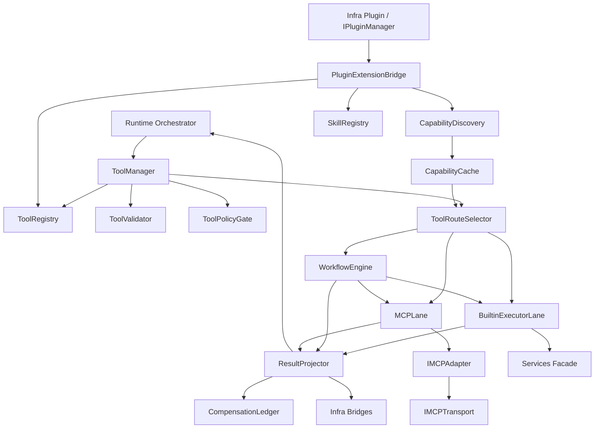

依赖原则：

1. ToolManager 只依赖接口和 module-local supporting type，不直接依赖某个具体 adapter/provider。
2. WorkflowEngine 只能通过 BuiltinExecutorLane 与 MCPLane 间接复用执行能力，不允许调用其它工具实例的内部方法。
3. CapabilityDiscovery 与 CapabilityCache 只服务于 MCP lane 和路由决策，不向 llm/prompt 暴露协议细节。
4. PluginExtensionBridge 只消费 infra/plugin 的 public result（catalog、active set、handle_ref/export table），不依赖签名校验、ABI 兼容、PluginRuntimeBridge 等内部细节。
5. plugin 激活只提供候选 extension source；ToolRegistry、CapabilityDiscovery、SkillRegistry 仍需各自做二次解析、可见性收敛与失效处理。

### 6.5 核心对象与 contracts 对齐关系

#### 6.5.1 共享对象与 module-local 对象分层

| 对象 | 层级 | 归属 | 用途 | 当前策略 |
|---|---|---|---|---|
| ToolRequest | shared contract | contracts | runtime 向 tools 发起一次工具调用的稳定对象 | 已冻结，直接复用 |
| ToolDescriptor | shared contract | contracts | ToolRegistry 对外登记能力目录面 | 已冻结，直接复用 |
| ToolIR | shared contract | contracts | Validator 生成的统一执行表示 | 已冻结，直接复用 |
| ToolResult | shared contract | contracts | executor 返回的执行结果面 | 已冻结，直接复用 |
| Observation | shared contract | contracts | runtime/memory/cognition 消费的观察对象 | 复用，不在 tools 本地重定义 |
| ObservationDigest | shared contract | contracts | 面向推理和写回的压缩摘要 | 已冻结，必须产出 |
| ErrorInfo | shared contract | contracts | 统一失败语义 | 已冻结，统一映射 |
| ToolInvocationContext | module-local public | tools/include | runtime/fixture 注入 caller/session/profile/trace/confirmation 等 invoke-scoped 调用上下文，不承载 BuildProfileManifest 或最终执行通道 | 首版保留 module public |
| ToolInvocationEnvelope | module-local public | tools/include | ToolManager 对 runtime 的统一返回值，承载 ToolResult、Observation、ObservationDigest 与路由事实 | 首版保留 module public |
| ToolAdmissionRequest / Decision | module-local internal | tools/src | PolicyGate 的输入输出 | 不进入 contracts |
| ToolPolicyView / ToolTimeoutView | module-local internal | tools/src | RuntimePolicySnapshot 的工具域投影 | 不进入 contracts |
| ToolRouteDecision | module-local internal | tools/src | builtin/workflow/MCP 的最终通道选择与原因 | 不进入 contracts |
| CapabilitySnapshot / CapabilityEntry | module-local internal | tools/src/mcp | MCP 能力缓存快照 | 不进入 contracts |
| ToolPluginExtensionCatalog / ToolPluginProviderRef | module-local public | tools/include/plugin | 已激活插件可导出的 builtin tool provider / stdio MCP server / skill bundle 目录视图 | 不进入 contracts |
| MCPServerLaunchSpec | module-local internal | tools/src/mcp | plugin 提供的 stdio MCP server command/args/env/cwd/health launch spec | 不进入 contracts |
| MCPToolBinding | module-local internal | tools/src/mcp | remote capability 到 internal tool 的映射 | 不进入 contracts |
| IMCPTransport | module-local public | tools/include/mcp | MCP 传输层抽象接口（stdio/SSE/streamable-HTTP），供 IMCPAdapter 选用 | 不进入 contracts |
| SkillSpecAsset / SkillInstance | module-local asset/runtime | tools/src + skills/ | Skill 资产与运行态实例 | 不进入 contracts |
| WorkflowPlan / WorkflowReceipt | module-local internal | tools/src/execution | 工作流执行计划与批次回执 | 不进入 contracts |
| CompensationRecord | module-local internal | tools/src/execution | side_effects 与补偿提示台账 | 不进入 contracts |

#### 6.5.1.1 runtime caller fixture 最小口径

为解阻 TOOL-BLK-002，当前冻结如下的 tests/design gate caller fixture 口径：

1. tools 侧的最小调用输入由 `ToolRequest`、`ToolInvocationContext` 和 ToolManager 本地依赖三部分组成，而不是把所有上游事实都压进同一个 context 聚合里。
2. `ToolInvocationContext` 只承载 invoke-scoped 的 caller/session/profile snapshot/trace/confirmation facts；它不承载 `BuildProfileManifest`、lane 开关、capability snapshot、executor/projector hook 或恢复控制语义。
3. `BuildProfileManifest` 由 ToolManager fixture / dependency injection 提供，用于 ToolConfigAdapter 的 enabled_modules 投影；它属于 build/config 视图，不属于每次 invoke 的 runtime context。
4. `ToolInvocationContext.caller_domain` 表示调用来源域，例如 `runtime.main`、`runtime.worker`；PolicyGate 当前使用的 requested execution domain 由 ToolManager 在验证完成后基于 `ToolIR.route` / descriptor category 映射为 `builtin`、`workflow`、`mcp`，而不是直接复用 `ToolInvocationContext.caller_domain`。
5. 该 fixture 只用于 tests/mocks 和 design gate，证明 tools 侧调用闭环可验证；它不等价于 runtime 生产主链已经完成稳定接线。

#### 6.5.2 AgentDelegation 的路由收敛策略

当前 ToolIRRoute 已冻结为 LocalTool、WorkflowEngine、MCPRemote 三态，因此首版不新增第四条 shared route。AgentDelegation 的设计收敛如下：

1. ToolDescriptor.category 可以是 AgentDelegation。
2. Validator 继续生成 ToolIR，并把该类请求路由到 WorkflowEngine。
3. WorkflowEngine 在遇到 delegation step 时不直接调起 multi_agent 实现，而是返回 module-local `delegate_request` sidecar 给 runtime。
4. runtime/AgentOrchestrator 再基于 ADR-008 决定是否进入 MultiAgentCoordinator。

这样可以保持 shared enum 不变，同时守住“全局主控权不在 tools 内”的边界。

#### 6.5.3 contracts 共享语义优化评估

结合 6.12 的组件级设计、shared contracts 现状以及 services/capability services 的既有 taxonomy，本轮评估结论是：Tool 子系统当前不应扩张 `ToolRequest`、`ToolDescriptor`、`ToolIR`、`ToolResult`、`ErrorInfo`、`ResultCode` 的共享面；最佳路径是把新增语义继续收敛到 module-local supporting object 与映射层，而不是把尚未稳定的治理字段反向写回 contracts。

| 候选语义 | 当前最佳归属 | 结论 | 评估理由 |
|---|---|---|---|
| `risk_tier`、confirmation proof 绑定、caller domain | `ToolInvocationContext`、`ToolAdmissionRequest/Decision`、`ToolPolicyView`、services action class / capability snapshot 体系 | 不进入 `ToolDescriptor` | 这组语义依赖 action class、target、safe mode、proof freshness 和 profile 投影，属于准入时态，而不是 registry 静态元数据。 |
| `RouteUnavailable`、`CapabilityUnsupported`、`PartialSideEffect` 等细粒度失败名 | `ToolRouteDecision`、`ToolInvocationEnvelope`、internal `ServiceErrorClass` / reason codes | 不扩张 shared `ResultCode` | runtime 与下游共享面真正稳定消费的是 `ErrorInfo.failure_type`、`retryable`、`safe_to_replan`、`source_ref`；细粒度原因码继续保留在 module-local envelope 与桥接层更稳妥。 |
| `evidence_refs`、`compensation_hints`、route facts | `ToolInvocationEnvelope`、`ToolFailureEnvelope`、`CompensationRecord`、observability bridges | 不进入 `ToolResult` | `ToolResult` 已冻结为最小执行结果面，只保留 `side_effects` 与主 `ErrorInfo`；补偿提示和多证据引用属于恢复/审计 supporting data，应通过 envelope 和 ledger 传递。 |
| `delegate_request`、delegation recommendation | `WorkflowReceipt` sidecar、runtime admission supporting object | 不进入 `ToolIRRoute` / `ToolRequest` | AgentDelegation 仍受 ADR-008 约束，只能作为 runtime recommendation；shared route 继续维持三态即可。 |

补充约束如下：

1. 文中出现的 `InvalidRequest`、`CapabilityUnsupported`、`RouteUnavailable`、`PartialSideEffect` 等名称，在首版实现中应视为 design-level reason class 或 module-local reason code，而不是自动等价为新的 shared `ResultCode` 枚举值。
2. shared contracts 继续只承载“跨模块 ABI 必须稳定消费”的最小事实：`ToolDescriptor` 提供静态目录面，`ToolResult` 提供最小执行结果面，`ErrorInfo` 提供统一失败分类；准入细节、路由原因和恢复线索都留在 tools/services 内部或 module public envelope。
3. 只有当某个字段同时满足“runtime/tools/services 至少两侧长期稳定消费”“无法由 `ToolInvocationContext`/`ToolInvocationEnvelope`/sidecar 无损承载”“已经需要 contract tests 断言其跨模块兼容”三项条件时，才进入下一轮 shared contract 升格评审。
4. 因此，当前真正需要优化的不是 shared contracts 本体，而是两类 module-local 收口对象：一是 `ToolAdmissionRequest/Decision` 的风险与确认绑定口径，二是 `ToolInvocationEnvelope` / `ToolFailureEnvelope` 的 reason codes、evidence refs、compensation handoff 口径。

#### 6.5.4 通过 infra/plugin 承载额外 builtin、stdio MCP、skills

deployment-time extension 的正式收敛策略如下：

1. infra/plugin 负责 discover/validate/load/unload；tools 不直接扫描 `plugins/` 或任意第三方目录。
2. 每个已激活插件向 tools 暴露的工具域载荷只允许三类或其组合：`builtin_tool_provider`、`mcp_server.stdio`、`skill_bundle`。
3. PluginManifest.capabilities 只声明 generic token，例如 `tool.provider`、`mcp.server.stdio`、`skill.bundle`；具体的 ToolDescriptor、MCP binding、SkillSpecAsset 不进入 PluginManifest，而是在插件激活后由 PluginExtensionBridge 解析。
4. builtin tool provider 需要导出 descriptor 与 factory/execute entry；PluginExtensionBridge 收敛后进入 ToolRegistry，并继续接受 ToolPolicyGate、ToolRouteSelector、ResultProjector 的统一治理。
5. stdio MCP 插件需要导出 `server_id`、`command`、`args`、`env`、`working_dir`、`trust_level`、binding template 等 launch spec；PluginExtensionBridge 生成 `MCPServerLaunchSpec`，再由 CapabilityDiscovery 和 IMCPAdapter 完成拉起、握手、缓存与调用。
6. skill bundle 插件需要导出 normalized `skills/specs`、`skills/prompts`、`skills/workflows`、`skills/evals`，或导出 external dialect ref 供 ExternalSkillImporter 归一化；SkillRegistry 不直接接受未归一化外部方言。
7. 插件装载成功不等于 capability 对 runtime 可见；可见性仍由 ToolRegistry、ToolPolicyGate、ToolRouteSelector 与 profile 共同决定。
8. 插件卸载时必须同步撤销对应 descriptor、binding、skill asset，并清理相关 stdio MCP session；tools 不直接做 unload 决策，只响应 infra/plugin 的状态变化。
9. v1 中插件路径优先承载可随包分发的本地 stdio MCP server；远程 socket MCP server 仍更适合由 deployment/profile 配置提供，而不是被强制插件化。

### 6.6 核心接口语义定义

以下接口建议落在 tools/include，作为模块公共接口而不是 shared contracts：

```cpp
class ITool {
public:
  virtual ~ITool() = default;
  virtual const dasall::contracts::ToolDescriptor& descriptor() const = 0;
  virtual dasall::contracts::ToolResult execute(
      const dasall::contracts::ToolIR& tool_ir,
      const ToolExecutionContext& context) = 0;
};

class IToolManager {
public:
  virtual ~IToolManager() = default;
  virtual ToolInvocationEnvelope invoke(
      const dasall::contracts::ToolRequest& request,
      const ToolInvocationContext& context) = 0;
  virtual std::vector<ToolInvocationEnvelope> invoke_batch(
      std::span<const dasall::contracts::ToolRequest> requests,
      const ToolInvocationContext& context) = 0;
  virtual ToolInvocationEnvelope compensate(
      const CompensationRequest& request,
      const ToolInvocationContext& context) = 0;
};

class IPolicyGate {
public:
  virtual ~IPolicyGate() = default;
  virtual ToolAdmissionDecision evaluate(
      const ToolAdmissionRequest& request,
      const ToolPolicyView& policy_view) = 0;
};

class ICapabilityCache {
public:
  virtual ~ICapabilityCache() = default;
  virtual std::optional<CapabilitySnapshot> snapshot(std::string_view server_id) const = 0;
  virtual void update(CapabilitySnapshot snapshot) = 0;
};

class IToolPluginProvider {
public:
  virtual ~IToolPluginProvider() = default;
  virtual ToolPluginExtensionCatalog describe_extensions() const = 0;
};
```

MCP 侧接口建议落在 tools/include/mcp/IMCPAdapter.h：

```cpp
class IMCPAdapter {
public:
  virtual ~IMCPAdapter() = default;
  virtual MCPServerSession ensure_session(const MCPServerSpec& spec) = 0;
  virtual CapabilitySnapshot list_capabilities(const MCPServerSession& session) = 0;
  virtual dasall::contracts::ToolResult invoke(
      const MCPServerSession& session,
      const MCPToolBinding& binding,
      const dasall::contracts::ToolIR& tool_ir) = 0;
};
```

接口语义约束：

1. `IToolManager::invoke()` 的稳定输入是 ToolRequest，而不是 provider-specific function-call payload。
2. `IToolManager::invoke_batch()` 用于 runtime 在单轮上下文中并行提交多个 ToolRequest（对应 OpenAI parallel_tool_calls / Anthropic parallel tool use）；首版实现可内部串行迭代调用 `invoke()`，但接口层预留并行优化空间，每个 request 独立经过完整治理链、独立产出 envelope，批次中单个 request 失败不影响其它 request 的执行。
3. `IPolicyGate::evaluate()` 必须 fail-closed；缺少 allowlist、confirmation facts 或 route proof 时默认拒绝。
4. `ICapabilityCache` 只暴露快照读取与更新，不暴露底层 store 实现细节。
5. `IMCPAdapter` 只承接协议协商、能力发现和远程调用；不拥有最终权限裁定和路由选择权。
6. `IToolPluginProvider` 是插件面向 tools 的专用导出接口；它不替代 IPluginManager，也不进入 shared contracts。

### 6.7 主流程时序

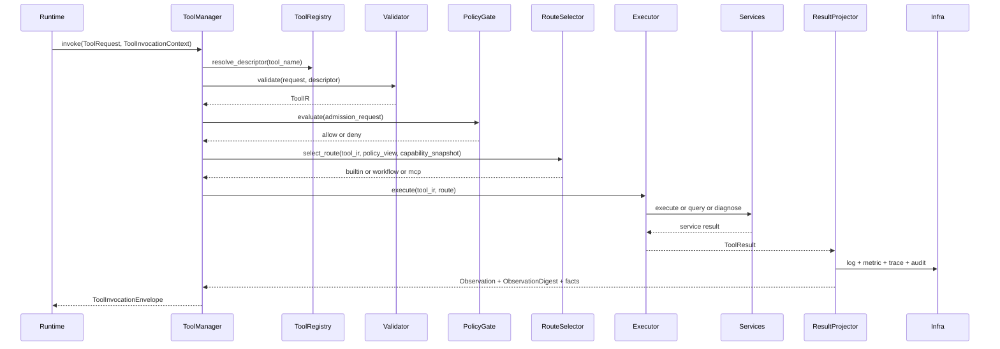

主流程分解：

1. runtime 把本轮语义意图收敛为 ToolRequest，并注入 ToolInvocationContext。
2. ToolRegistry 解析 `tool_name` 并返回 ToolDescriptor；若 descriptor 不存在，直接构造 `RouteUnavailable/CapabilityUnsupported` 风格 ErrorInfo 并 fail-closed。
3. ToolValidator 依据 ToolDescriptor 和 guards 把 ToolRequest 归一化为 ToolIR。
4. ToolPolicyGate 根据 `required_scopes`、risk tier、`execution_policy.allowed_tool_domains`、`prompt_policy.tool_visibility_rules` 的生效视图、confirmation fact 等做准入裁定。
5. ToolRouteSelector 结合 route hint、descriptor category、CapabilitySnapshot、server health、`tools_mcp` 开关，输出 builtin/workflow/MCP 的最终通道和原因码。
6. Executor 在各自 lane 内执行：
   - builtin：优先走 IExecutionService/IDataService；
  - workflow：按照 StepGraph 批次调用 builtin 或 MCP lane；
   - mcp：经 IMCPAdapter 与 server session 通讯。
7. ResultProjector 将 ToolResult 投影为 Observation 和 ObservationDigest，并把 `side_effects`、`evidence_refs`、`route_kind`、`latency` 等事实喂给 observability。
8. runtime 收到 ToolInvocationEnvelope 后，才决定如何写回 memory、是否继续推理、是否进入恢复链路。

### 6.8 异常与恢复时序

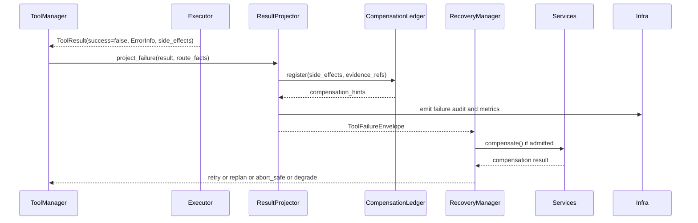

异常语义规则：

1. `InvalidRequest`、`PolicyDenied`、`RouteUnavailable`、`CapabilityUnsupported` 必须 fail-closed，且 `side_effects` 与 `compensation_hints` 为空。
2. 只有 `PartialSideEffect` 或显式存在可逆副作用时，CompensationLedger 才能输出非空 `compensation_hints`。
3. Tool 子系统返回的是“失败事实 + 建议”，而不是“已经决定重试/补偿”。
4. 若 runtime 允许补偿，补偿路径仍通过 ToolManager 的 `compensate()` 入口和 services 的 `compensate()` facade 执行，不允许直接绕过治理链回滚。
5. MCP session 异常必须映射为统一 ErrorInfo，并优先尝试最近可信 capability snapshot；若 snapshot 已过期且 profile 不允许 stale read，则直接拒绝该路由。

### 6.9 配置项与默认策略

Tool 子系统不直接维护独立配置文件，统一消费 profiles 提供的 RuntimePolicySnapshot。建议由 ToolConfigAdapter 收敛以下键：

| 键 | 来源 | 作用组件 | desktop_full 基线 | edge_minimal 基线 |
|---|---|---|---|---|
| enabled_modules.tools_builtin | profiles/*/runtime_policy.yaml | 决定 builtin lane 是否启用 | true | true |
| enabled_modules.tools_mcp | profiles/*/runtime_policy.yaml | 决定 MCP lane 是否启用 | true | false |
| enabled_modules.multi_agent | profiles/*/runtime_policy.yaml | 决定 delegation recommendation 是否允许进入多 Agent | true | false |
| runtime_budget.max_tool_calls | RuntimePolicySnapshot.runtime_budget | runtime 与 ToolManager 的工具调用上限 | 24 | 4 |
| prompt_policy.tool_visibility_rules | RuntimePolicySnapshot.prompt_policy | PolicyGate 的可见域收敛输入 | builtin:all, mcp:trusted | builtin:essential |
| capability_cache_policy.refresh_interval_ms | RuntimePolicySnapshot.capability_cache_policy | MCP 周期发现刷新间隔 | 30000 | 10000 |
| capability_cache_policy.expire_after_ms | RuntimePolicySnapshot.capability_cache_policy | 能力快照失效时间 | 180000 | 90000 |
| capability_cache_policy.stale_read_allowed | RuntimePolicySnapshot.capability_cache_policy | MCP 故障时是否允许读最近可信快照 | false | true |
| capability_cache_policy.failure_backoff_ms | RuntimePolicySnapshot.capability_cache_policy | 发现失败后的退避时间 | 5000 | 2000 |
| timeout_policy.tool.* | RuntimePolicySnapshot.timeout_policy.tool | builtin/action/query lane 的 timeout/retry/circuit breaker | 2500 / 1 / 4 | 1200 / 0 / 2 |
| timeout_policy.mcp.* | RuntimePolicySnapshot.timeout_policy.mcp | MCP lane 的 timeout/retry/circuit breaker | 2000 / 1 / 3 | 1000 / 0 / 1 |
| timeout_policy.workflow.* | RuntimePolicySnapshot.timeout_policy.workflow | WorkflowEngine 批次级 timeout/retry/circuit breaker | 5000 / 1 / 3 | 2500 / 0 / 2 |
| execution_policy.allowed_tool_domains | RuntimePolicySnapshot.execution_policy | PolicyGate 白名单域控制 | builtin,mcp | builtin |
| execution_policy.requires_high_risk_confirmation | RuntimePolicySnapshot.execution_policy | 高风险动作是否必须具备 confirmation fact | true | true |
| execution_policy.safe_mode_enabled | RuntimePolicySnapshot.execution_policy | 是否允许 safe mode 相关 action taxonomy | true | true |
| ops_policy.log_level / metrics_granularity / trace_sample_ratio | RuntimePolicySnapshot.ops_policy | observability 采样与字段粒度 | profile-specific | profile-specific |

补充约束：ToolConfigAdapter 只负责把 [DASALL_profiles模块详细设计.md](DASALL_profiles模块详细设计.md) 已冻结的键语义投影为 ToolPolicyView / ToolTimeoutView；本设计只说明 tools 本地如何消费这些投影视图，不再单独定义 profile 键的源语义。

默认策略：

1. 缺失 policy view 时默认 deny。
2. 缺失 capability snapshot 时 builtin 可继续，mcp fail-closed；只有在 `stale_read_allowed=true` 且缓存未超 `expire_after_ms` 时允许回退到最近可信快照。
3. Workflow 默认禁止隐式无限重试；重试预算继续来自 `timeout_policy.workflow.retry_budget`。
4. edge_minimal 保持 builtin-only 与低预算策略，不因 Tool 详设而放宽现有 profile 冻结结论。
5. 当 infra/plugin 进入 plugin safe mode、插件被卸载或信任等级降级时，PluginExtensionBridge 必须撤回对应扩展源；tools 不保留失效插件的残留 descriptor。

### 6.10 可观测性（日志 / 指标 / 追踪 / 审计）

| 类别 | 建议名称 | 核心字段 | 设计要求 |
|---|---|---|---|
| 结构化日志 | `tool.request.received` | request_id、tool_call_id、tool_name、category、caller_domain、plugin_id(optional) | 每次调用进入 ToolManager 即记录 |
| 结构化日志 | `tool.admission.denied` | tool_name、decision_reason、required_scopes、confirmation_required | fail-closed 原因必须可追踪 |
| 结构化日志 | `tool.route.selected` | route_kind、selection_reason_codes、server_id、plugin_id(optional)、stale_snapshot_used | 路由选择必须可解释 |
| 结构化日志 | `tool.execution.completed` | success、duration_ms、side_effect_count、digest_confidence、plugin_id(optional) | 完成态必须统一记录 |
| 指标 | `tool_request_total` | tool_name、category、route_kind、plugin_source、result | 调用总量 |
| 指标 | `tool_admission_denied_total` | tool_name、reason_code | 拒绝路径计数 |
| 指标 | `tool_execution_latency_ms` | tool_name、route_kind、plugin_source | 执行时延分布 |
| 指标 | `tool_partial_side_effect_total` | tool_name、route_kind | 部分副作用事件计数 |
| 指标 | `tool_mcp_stale_snapshot_total` | server_id | 使用 stale snapshot 的次数 |
| 指标 | `tool_workflow_step_failure_total` | workflow_id、step_id、failure_type | 工作流失败点 |
| 追踪 | span `tool.invoke` | request_id、tool_call_id、tool_name | ToolManager 根 span |
| 追踪 | span `tool.validate` / `tool.policy` / `tool.route` | reason codes、policy decision、route decision | 治理链阶段 span |
| 追踪 | span `tool.execute.builtin` / `tool.execute.mcp` / `tool.execute.workflow` | route_kind、target_id、latency | 各 lane 细分执行 span |
| 审计 | `tool.execution.requested` / `tool.execution.completed` / `tool.execution.failed` | request_id、tool_call_id、tool_name、plugin_id(optional)、side_effects、evidence_refs、error_source | 与 infra 审计桥接 |
| 审计 | `tool.compensation.suggested` / `tool.compensation.executed` | tool_call_id、compensation_action、decision_owner、result | 明确 suggestion 和 execution 是两个阶段 |

审计边界要求：

1. 审计 evidence 继续以 ToolResult / RecoveryOutcome 引用为主，不在 Tool 审计事件中嵌入完整 contracts 对象本体。
2. `reasoning_content`、prompt 文本、memory 原文等不属于 Tool observability 字段面。
3. 对高风险 action，必须同时具备 request、admission、route、execution、completion 五段可观测证据。

### 6.11 数据流图

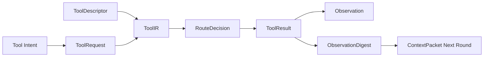

数据流说明：

1. `Tool Intent` 是上游语义，进入 tools 前必须先收敛为 ToolRequest。
2. ToolDescriptor 与 ToolRequest 在 Validator 阶段汇聚为 ToolIR。
3. RouteDecision 只描述走 builtin/workflow/MCP 哪一条路径及其原因，不携带执行结果。
4. ToolResult 是执行面结果，Observation/ObservationDigest 是推理与写回面结果。
5. ContextPacket 下一轮只消费 ObservationDigest，而不是原始 ToolResult。

### 6.12 组件级详细设计

本节用于把 6.2、6.3、6.5、6.6、6.7、6.8 的模块级结论细化为“可直接支撑原子任务拆分”的组件级设计卡片。

编排约定如下：

1. 仍保持“组件组”作为设计单元，不把每个类单独上升为顶级章节。
2. 每个组件卡片固定包含 7 项：职责、非职责边界、核心数据定义、公共/内部接口、关键执行流、失败与回退语义、测试与验收出口。
3. 每个组件组先给出调研学习结论，再进入设计卡片，确保后续 Build 拆分有明确证据来源。
4. 本节不新增 shared contracts；凡 `ToolAdmissionDecision`、`ToolRouteDecision`、`CapabilitySnapshot`、`SkillSpecAsset` 等 supporting object，仍保持 module-local。
5. 本节卡片是 7.1 阶段级 Design ID 的细化输入，后续 TODO 拆分应优先按“单个组件卡片或单张关键图”组织，而不是跨组混拆。

#### 6.12.1 治理链组件组

调研学习结论：

1. 基于 `contracts/include/tool/ToolRequest.h`、`ToolDescriptor.h`、`ToolIR.h` 的冻结语义，治理链的稳定共享输入输出已经明确，适合把 ToolManager、Registry、Validator、PolicyGate、RouteSelector 视为 5 个可独立交付的原子实现单元。
2. 基于 `docs/architecture/DASALL_Agent_architecture.md`、ADR-006、ADR-007、ADR-008 的边界约束，治理链必须保持“runtime 唯一调用者、tools 不掌上下文权、不掌恢复准入权、不形成第二主循环”。
3. 基于 `profiles/include/RuntimePolicySnapshot.h` 与各档 `runtime_policy.yaml`，PolicyGate 与 RouteSelector 的核心输入已经具备稳定上游，不需要 tools 自建平行配置面。

##### ToolManager

1. 职责：作为 Tool 子系统唯一公共入口，负责串联 `resolve -> validate -> admit -> route -> execute -> project` 主链路，并返回统一的 `ToolInvocationEnvelope`；同时提供批量调用入口 `invoke_batch()` 支持 runtime 单轮并行提交。
2. 非职责边界：不直接解析 profile 原始文件；不装配 `ContextPacket`；不决定 retry/replan/abort；不直接执行插件 discover/load；不直接持有 provider-specific function-call payload。
3. 核心数据定义：消费 `ToolRequest`、`ToolInvocationContext`；输出 `ToolInvocationEnvelope`；内部维护 request/tool_call correlation、route facts、projection evidence refs、compensation handoff refs。
4. 公共/内部接口：公共面保持 `IToolManager::invoke()`、`IToolManager::invoke_batch()`、`IToolManager::compensate()`；内部建议拆为 `run_invoke_pipeline()`、`run_compensation_pipeline()`、`dispatch_route()`、`project_and_emit()` 等私有协作函数。`invoke_batch()` 首版实现内部串行迭代调用 `run_invoke_pipeline()`，每个 request 独立经过完整治理链、独立产出 envelope。
5. 关键执行流：先向 ToolRegistry 解析 descriptor，再交 ToolValidator 生成 ToolIR，随后由 ToolPolicyGate 做 fail-closed 准入，再由 ToolRouteSelector 选择 lane，执行结束后统一走 ResultProjector 和 observability bridges。
6. 失败与回退语义：任一治理阶段失败都必须 fail-closed 返回统一 `ErrorInfo`；不在 ToolManager 内部做隐式重试；补偿只通过显式 `compensate()` 入口进入，不在失败主路径内偷偷回滚。`invoke_batch()` 中单个 request 失败不影响同批次其它 request 的执行，每个 envelope 独立携带成功或失败结果。
7. 测试与验收出口：推荐最小单测为 `ToolManagerPipelineTest.cpp`、`ToolManagerFailurePathTest.cpp`、`ToolManagerBatchInvokeTest.cpp`；验收以治理链 mock 闭环通过和失败原因码可二值断言为准，命令可收敛为 `ctest --test-dir build-ci -R "ToolManager(Pipeline|FailurePath|BatchInvoke)Test" --output-on-failure`。

##### ToolRegistry

1. 职责：维护 builtin、workflow、MCP、plugin-delivered 扩展源统一收敛后的目录面，并向上游暴露稳定的 descriptor / binding 查询结果。
2. 非职责边界：不做最终准入裁定；不直接执行 capability discovery；不处理插件签名、ABI 校验或装载；不向 llm/prompt 直接暴露 protocol-level capability details。
3. 核心数据定义：围绕 `ToolDescriptor`、builtin catalog entry、`MCPToolBinding` view、`ToolPluginExtensionCatalog`、registry revision/source ownership 建立 module-local 目录模型。
4. 公共/内部接口：内部建议具备 `resolve_descriptor()`、`list_descriptors()`、`register_builtin()`、`upsert_mcp_bindings()`、`apply_plugin_extension_delta()`、`revoke_source()`；对外只暴露 descriptor/binding view，不暴露底层 store 结构。
5. 关键执行流：启动时装配静态 builtin catalog；运行时接收 PluginExtensionBridge 的 delta 和 CapabilityDiscovery 的 binding 刷新；对同名来源执行 source-scoped reconcile，保持 descriptor lookup 结果可解释。
6. 失败与回退语义：非法动态导出必须被隔离，不能半注册；plugin unload 只撤销 source-owned descriptor/binding；MCP 快照失效不能误删静态 builtin 目录项。
7. 测试与验收出口：推荐单测为 `ToolRegistryTest.cpp`、`ToolRegistryReconcileTest.cpp`、`ToolRegistryUnloadInvalidationTest.cpp`、`ToolRegistryConcurrentReadTest.cpp`；验收标准是 descriptor/binding 增删改查与 source-scoped revoke 行为可自动断言。

ToolRegistry 并发读安全保证：

ToolRegistry 作为 PluginExtensionBridge 和 CapabilityDiscovery 的下游 delta 消费者，继承上文 "PluginExtensionBridge 与动态变更组件并发安全策略" 中的 snapshot-and-swap 模型：
- `resolve_descriptor()` 和 `list_descriptors()` 为纯读路径，通过 `std::shared_ptr<const DescriptorStore>` 原子访问当前快照，全程无锁。
- `upsert_mcp_bindings()` 和 `apply_plugin_extension_delta()` 为写路径，受 `registry_write_mutex` 保护，在独立副本上计算后原子发布。
- 读路径在写路径发布新快照前后均能稳定返回一致结果；不会出现半更新快照。

##### ToolValidator

1. 职责：把 `ToolRequest` 与 `ToolDescriptor` 收敛为可执行的 `ToolIR`，完成字段校验、默认值注入、归一化和 guard 复用。
2. 非职责边界：不做准入判定；不做最终路由选择；不解释业务 payload 语义；不承担 projection、audit 或 compensation 逻辑。
3. 核心数据定义：以 `ToolRequest`、`ToolDescriptor`、`ToolIR`、`ValidationDiagnostics` 为核心；默认 timeout/priority 只能来自 descriptor 或受控 policy projection，不允许隐式猜测。
4. 公共/内部接口：内部建议包括 `validate()`、`inject_defaults()`、`normalize_arguments()`、`derive_operation()`、`build_route_hint()`；共享 contracts guard 继续复用 `ToolRequestGuards` 与 `ToolIRGuards`。
5. 关键执行流：先校验 request 必填字段，再核对 invocation kind 与 descriptor category 的一致性，随后注入默认 timeout/priority，生成 normalized arguments 与 route hint，最后通过 ToolIR guard 收口。
6. 失败与回退语义：字段缺失或枚举非法返回 `InvalidRequest`/validation invariant 类错误；`ValidateOnly`、`DryRun` 必须保留为非执行态；除显式定义的默认值外不允许静默纠偏。
7. 测试与验收出口：推荐单测为 `ToolValidatorTest.cpp`、`ToolValidatorDefaultingTest.cpp`、`ToolValidatorDryRunTest.cpp`；验收需同时保持 `ToolRequestContractTest` 与 `ToolDescriptorIRContractTest` 全绿。

##### ToolPolicyGate

1. 职责：基于 `ToolPolicyView`、risk tier、required scopes、confirmation facts、safe mode 等输入做 fail-closed 准入决策，并输出可审计原因码。
2. 非职责边界：不做路由选择；不直接发起用户确认；不替 runtime 做恢复裁定；不解释插件 trust chain 或 ABI 兼容细节。
3. 核心数据定义：围绕 `ToolAdmissionRequest`、`ToolAdmissionDecision`、`ToolPolicyView`、`ToolTimeoutView`、confirmation fact set、decision reason codes 建模。
4. 公共/内部接口：公共面保留 `IPolicyGate::evaluate()`；内部建议拆为 `check_allowed_domain()`、`check_visibility()`、`check_safe_mode()`、`check_confirmation()`、`compose_decision()`。
5. 关键执行流：按“allowed domain -> visibility rules -> capability tier / safe mode -> required scopes / confirmation facts -> timeout budget projection”顺序求值；任何关键输入缺失都直接拒绝。
6. 失败与回退语义：缺失 profile projection、缺失 confirmation fact、safe mode 不允许或 capability tier 不匹配时一律 deny；不允许用“先执行后补审计”的方式绕开门控。
7. 测试与验收出口：推荐单测为 `ToolPolicyGateTest.cpp`、`ToolPolicyConfirmationTest.cpp`、`ToolPolicyProfileDiffTest.cpp`；验收要求拒绝原因码、fail-closed 行为和 profile 差异投影可二值断言。

##### ToolRouteSelector

1. 职责：在 descriptor、route hint、capability snapshot、health、profile switches 的共同约束下，做 builtin/workflow/MCP lane 的最终选择。
2. 非职责边界：不执行 tool；不解析 plugin export table；不管理 MCP session 生命周期；不生成 digest 或补偿记录。
3. 核心数据定义：围绕 `ToolRouteDecision`、`CapabilitySnapshot`、health snapshot、selection reason codes、stale snapshot flag 建模，继续保持 module-local。
4. 公共/内部接口：内部建议提供 `select_route()`、`score_builtin_candidate()`、`score_mcp_candidate()`、`select_workflow_route()`、`evaluate_stale_snapshot()`。
5. 关键执行流：优先识别 workflow / agent delegation，再评估 builtin 候选，其后在 `tools_mcp=true` 且存在可信 binding 时评估 MCP 候选；最终输出 route kind、reason codes 与 freshness 注记。
6. 失败与回退语义：只有在存在 binding 且 profile 允许 stale read 时，才允许使用最近可信快照；builtin 不可用时可以回退到 MCP，但前提是 RouteSelector 能给出充分 reason codes；否则返回 `RouteUnavailable`。
7. 测试与验收出口：推荐单测为 `ToolRouteSelectorTest.cpp`、`ToolRouteFallbackTest.cpp`、`ToolRouteHealthSwitchTest.cpp`；集成验收继续以 `ToolMCPFallbackIntegrationTest` 作为 route fallback 的最终验证出口。

治理链关键时序图如下：

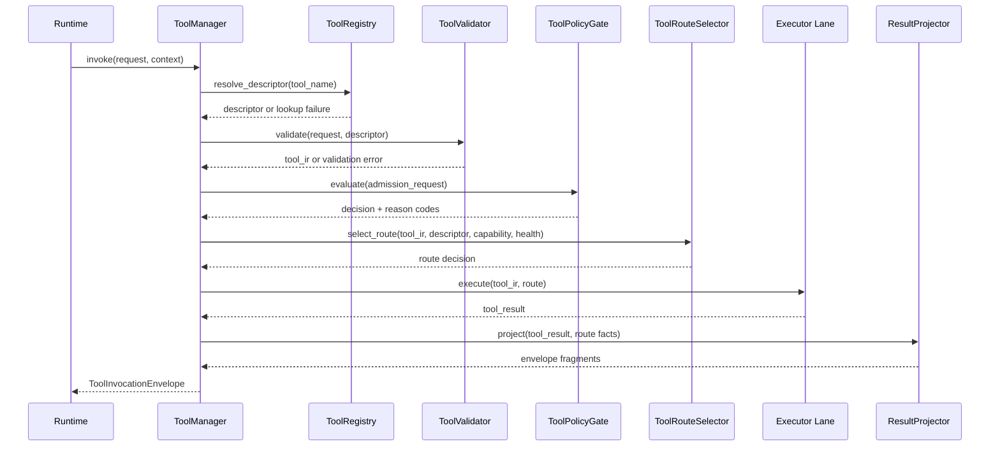

批量调用时序（invoke_batch）：

当 runtime 一次性提交多个 ToolRequest 时，ToolManager 按以下时序并发执行：

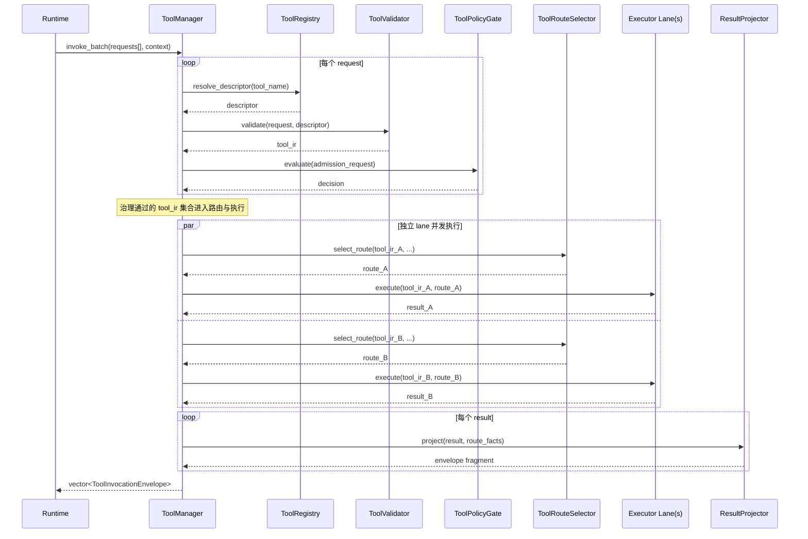

批量调用约束：
1. 各请求经过治理链（Registry → Validator → PolicyGate）后独立路由、独立执行；不同请求的 lane 调度之间无顺序依赖。
2. 单个请求的 PolicyGate deny 不影响同批次其他请求的执行——该请求自身返回 deny envelope，其余继续。
3. 所有结果在同一 `invoke_batch` 调用内同步收集后整体返回，不提供流式回调。
4. 并发度受 `RuntimePolicySnapshot.tools_max_parallel_invocations`（如有）或默认值约束。

ToolPolicyGate 决策流如下：

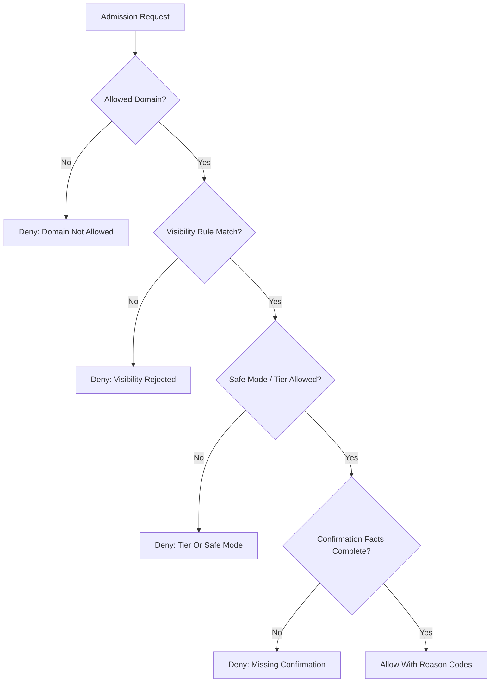

ToolRouteSelector 数据流如下：

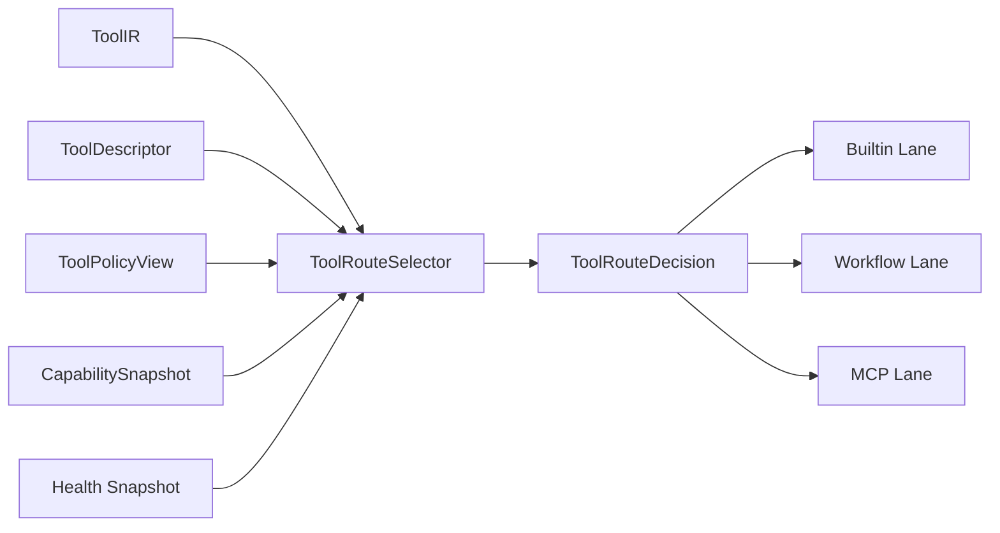

#### 6.12.2 执行与投影组件组

调研学习结论：

1. 基于 `services/include/IExecutionService.h`、`IDataService.h` 的现有稳定门面，BuiltinExecutorLane 可以保持“工具包装层在 tools、真实执行语义在 services、OS 细节在 platform”的分层，不必在 tools 内沉淀进程控制细节。
2. 基于 `contracts/include/observation/ObservationDigest.h` 的五字段冻结语义，ResultProjector 已经有足够稳定的上游/下游边界，可以作为独立的 projection 实现单元。
3. 基于 `docs/architecture/DASALL_Agent_architecture.md` 对 workflow 与补偿的裁定，WorkflowEngine 与 CompensationLedger 只能提供执行事实与补偿提示，不能越权成为第二主控平面。

##### BuiltinExecutorLane

1. 职责：承接 builtin route 的本地执行，完成 ToolIR 到 `IExecutionService` / `IDataService` 请求对象的映射，并生成统一 `ToolResult`。
2. 非职责边界：不直接做 `fork/exec`、pipe、signal 等 OS 细节；不重新解释 policy；不生成 ObservationDigest；不决定是否切换路由。
3. 核心数据定义：以 `ToolIR`、`ToolExecutionContext`、service request mapping、`ToolResult`、side effect metadata 为核心；必要时通过 `ToolServiceBridge` 隔离 services supporting object。
4. 公共/内部接口：内部建议具备 `execute()`、`dispatch_action()`、`dispatch_query()`、`dispatch_diagnose()`、`map_service_result()`；公共接口不需要对 runtime 暴露。
5. 关键执行流：根据 descriptor category 和 ToolIR operation 选择 `IExecutionService` 或 `IDataService`，构造服务请求并执行，再把服务回执映射回 `ToolResult`，保留 `side_effects` 与 evidence refs。
6. 失败与回退语义：service timeout、异常、partial side effect 都必须映射到统一 `ErrorInfo`；lane 内部不改路由、不自行重试；部分副作用必须原样写回，供 CompensationLedger 后续处理。
7. 测试与验收出口：推荐单测为 `BuiltinExecutorLaneTest.cpp`、`BuiltinExecutorLaneTimeoutTest.cpp`；集成验收继续以 `ToolServicesSmokeIntegrationTest` 为主出口。

##### WorkflowEngine

1. 职责：执行 `WorkflowPlan`，完成 StepGraph 拓扑排序、批次执行、失败早停、delegation sidecar 产出与 workflow receipt 汇总。
2. 非职责边界：不直接调用其它 tool 对象内部方法；不掌用户交互；不掌全局任务调度；不直接决定是否补偿或 replan；不在内部实现运行时条件分支、动态循环或运行时图结构修改。
3. 核心数据定义：围绕 `WorkflowPlan`、workflow step、batch execution window、`WorkflowReceipt`、delegation sidecar、per-step execution facts 建模。
4. 公共/内部接口：内部建议具备 `execute(plan, context)`、`build_batches()`、`dispatch_step()`、`collect_step_result()`、`finalize_receipt()`；执行依赖继续限定为 BuiltinExecutorLane 与 MCPLane。
5. 关键执行流：先对 StepGraph 做拓扑排序，再生成批次窗口；每个 step 仅通过 builtin 或 MCP lane 执行；任一 step 失败则停止下游依赖 step，并输出 workflow receipt、side effects 和 delegate request sidecar。
6. 失败与回退语义：不支持隐式循环或无限重试；失败早停后只输出事实和建议，不自行补偿；delegation step 只返回 recommendation，由 runtime 决定是否真的进入 multi_agent。
7. 测试与验收出口：推荐单测为 `WorkflowEngineTest.cpp`、`WorkflowDependencyOrderingTest.cpp`、`WorkflowCyclicRejectionTest.cpp`；集成验收继续以 `ToolWorkflowFailureIntegrationTest` 为主出口。

WorkflowEngine 图结构约束（v1）：

1. 首版 WorkflowEngine 只支持无条件无循环有向无环图（DAG）：step 之间只有数据依赖边，不允许条件边或回退边。
2. StepGraph 在 `build_batches()` 阶段必须做环检测（topological sort failure = reject）；若检测到环，则直接返回 `InvalidWorkflowPlan` 错误，不尝试"断环执行"。
3. step 之间的数据传递通过 WorkflowPlan 中预定义的 `step_output_mapping` 完成：上游 step 的 ToolResult.payload 中的指定字段被映射为下游 step 的 ToolIR.normalized_arguments 中的对应字段，不支持运行时动态映射。
4. 若需要条件分支（if-then-else）或循环（while/retry），应由 runtime/cognition 在上游决策后生成不同的 WorkflowPlan，再交给 WorkflowEngine 执行。WorkflowEngine 不内建解释器或表达式求值能力。
5. 同一批次内的无依赖 step 允许并行执行（受 lane pool 约束），但同一 step 不允许跨 lane 执行。
6. 后续版本如需支持条件边或有限循环，应通过 WorkflowPlan 的 schema 扩展（而非 WorkflowEngine 内部逻辑扩张）来实现，并经过独立的设计评审和约束追加。

WorkflowPlan / WorkflowReceipt internal schema（v1）：

| 对象 | 字段 | 类型/形态 | 约束 | 说明 |
|---|---|---|---|---|
| WorkflowPlan | `workflow_id` | string | 必填；invoke 内唯一 | 仅用于 workflow-scoped receipt、audit 与 evidence 关联，不进入 shared contracts。 |
| WorkflowPlan | `entry_step_ids` | string[] | 必填；每个 step id 必须存在且入度为 0 | 显式声明入口 step，避免 engine 依赖隐式首节点推断。 |
| WorkflowPlan | `steps` | WorkflowStep[] | 必填；至少 1 个 step | 描述 DAG 中全部 step；step 顺序不代表执行顺序。 |
| WorkflowPlan | `edges` | WorkflowEdge[] | 可空；仅允许 data dependency | 首版只允许无条件依赖边，不允许 branch/back edge。 |
| WorkflowPlan | `step_output_mapping` | WorkflowStepOutputBinding[] | 可空；引用的 source/target step 必须存在 | 声明上游 payload 到下游 normalized_arguments 的静态字段映射。 |
| WorkflowPlan | `delegation_policy` | WorkflowDelegationPolicy | 可空 | 只描述 recommendation 输出方式，不触发 multi-agent 主控。 |
| WorkflowPlan | `metadata` | map<string,string> | 可空；不得承载执行句柄 | 仅保留 workflow template/version/source 等静态事实。 |
| WorkflowStep | `step_id` | string | 必填；plan 内唯一 | 作为依赖边、映射、receipt 汇总的稳定锚点。 |
| WorkflowStep | `tool_ir` | ToolIR | 必填 | step 仍以共享 ToolIR 作为执行输入，不引入新的 shared object。 |
| WorkflowStep | `route_kind_hint` | enum(`builtin`,`mcp`,`workflow`) | 可空；不得覆盖 RouteSelector 最终决策 | 对 workflow step 的期望通道做静态提示，engine 最终仍以 ToolIR/descriptor 决定 lane。 |
| WorkflowStep | `step_kind` | enum(`tool`,`delegation`) | 必填 | `tool` 走 builtin/MCP 执行；`delegation` 只产出 sidecar recommendation。 |
| WorkflowStep | `depends_on` | string[] | 可空；不得包含自身；引用 step 必须存在 | 与 `edges` 保持一致的扁平依赖视图，便于 build_batches 做拓扑排序。 |
| WorkflowStep | `allow_partial_side_effect` | bool | 可空；默认 false | 仅声明该 step 允许将 partial side effect 事实继续交给 ledger，不等于自动补偿。 |
| WorkflowStep | `timeout_override_ms` | uint32 | 可空；不得突破 profile 上限 | 仅是 step 级预算缩紧，不允许扩张 profile timeout。 |
| WorkflowEdge | `from_step_id` / `to_step_id` | string | 必填；二者不同 | 仅表达先后依赖，不承载条件表达式。 |
| WorkflowEdge | `dependency_kind` | enum(`payload`,`ordering`) | 必填 | `payload` 需要配套 output mapping；`ordering` 只表示执行顺序约束。 |
| WorkflowStepOutputBinding | `source_step_id` | string | 必填 | 上游 step 必须成功并存在 payload，映射才生效。 |
| WorkflowStepOutputBinding | `source_json_pointer` | string | 必填 | 使用静态 JSON Pointer 选择上游 payload 字段，不支持表达式。 |
| WorkflowStepOutputBinding | `target_step_id` | string | 必填 | 目标 step 必须存在。 |
| WorkflowStepOutputBinding | `target_argument_key` | string | 必填 | 写入下游 ToolIR.normalized_arguments 的键名。 |
| WorkflowStepOutputBinding | `required` | bool | 可空；默认 true | required 映射缺失时视为 InvalidWorkflowPlan 或 step preflight failure。 |
| WorkflowDelegationPolicy | `mode` | enum(`disabled`,`recommend_only`) | 可空；默认 `disabled` | v1 仅允许 recommendation，不允许 tools 内部直连 multi_agent。 |
| WorkflowDelegationPolicy | `max_delegate_steps` | uint32 | 可空；默认 0 | 限制一个 workflow 中 delegation step 的数量，防止扩张成第二主循环。 |

WorkflowReceipt internal schema（v1）：

| 对象 | 字段 | 类型/形态 | 约束 | 说明 |
|---|---|---|---|---|
| WorkflowReceipt | `workflow_id` | string | 必填；与 WorkflowPlan 一致 | 作为 workflow-scoped 结果汇总主键。 |
| WorkflowReceipt | `status` | enum(`completed`,`failed`,`rejected`) | 必填 | `completed`=全部 step 成功；`failed`=执行中失败早停；`rejected`=plan schema/graph 不合法。 |
| WorkflowReceipt | `completed_step_ids` | string[] | 可空 | 已成功执行的 step。 |
| WorkflowReceipt | `skipped_step_ids` | string[] | 可空 | 因上游失败或早停而未执行的下游 step。 |
| WorkflowReceipt | `failed_step_id` | string | 可空；仅 `failed` 时允许 | 指向首个终止 workflow 的失败 step。 |
| WorkflowReceipt | `step_results` | WorkflowStepReceipt[] | 可空 | 记录每个已尝试 step 的执行事实。 |
| WorkflowReceipt | `compensation_hints` | ToolCompensationHint[] | 可空 | workflow-scoped ledger 聚合结果；由 runtime 决定是否持久化/执行。 |
| WorkflowReceipt | `evidence_refs` | string[] | 可空 | 汇总 step 级 evidence refs 与 graph rejection facts。 |
| WorkflowReceipt | `failure_digest` | ErrorInfo | 可空；`failed`/`rejected` 时允许 | 统一 workflow 主失败语义，不覆盖 step 原始 ToolResult.error。 |
| WorkflowReceipt | `delegation_sidecar` | WorkflowDelegationSidecar | 可空 | 只在 delegation step 命中时返回 recommendation。 |
| WorkflowStepReceipt | `step_id` | string | 必填 | 对应 WorkflowStep.step_id。 |
| WorkflowStepReceipt | `route_kind` | enum(`builtin`,`mcp`,`workflow`) | 必填 | 记录实际执行通道，用于 audit/trace/health 聚合。 |
| WorkflowStepReceipt | `result` | ToolResult | 必填 | 保留 step 级原始执行结果。 |
| WorkflowStepReceipt | `mapped_arguments` | string[] | 可空 | 记录由 output mapping 注入的目标参数键，便于调试 schema。 |
| WorkflowStepReceipt | `evidence_refs` | string[] | 可空 | step 级证据引用。 |
| WorkflowDelegationSidecar | `step_id` | string | 必填 | 触发 delegation recommendation 的 step。 |
| WorkflowDelegationSidecar | `delegate_target` | string | 必填 | 推荐交给 runtime 评估的 delegation target。 |
| WorkflowDelegationSidecar | `reason_code` | string | 必填 | 解释 delegation recommendation 来源；不直接驱动执行。 |
| WorkflowDelegationSidecar | `input_evidence_refs` | string[] | 可空 | 指向触发 delegation 的 step 结果或 workflow 事实。 |

补充 schema 约束：

1. `WorkflowPlan.steps[*].tool_ir.route=WorkflowEngine` 只用于标识“该请求进入 workflow lane”；step 内部真正执行的 `tool_ir.route` 必须在 `builtin` 或 `mcp` 之间显式可判定，delegation step 则不进入 executor。
2. `step_output_mapping` 只允许从成功 step 的结构化 payload 读取字段；若 payload 非结构化或 pointer 不存在，engine 必须把该 step 视为 preflight failure，而不是运行时猜测默认值。
3. `WorkflowReceipt.failure_digest` 负责 workflow 级统一失败事实，`WorkflowStepReceipt.result.error` 负责 step 级原始错误；两者必须可同时保留，避免 workflow 汇总覆盖底层 evidence。
4. workflow-scoped ledger 只在 `WorkflowReceipt.compensation_hints` 汇总 hints，不把 `CompensationRecord` 升格到 public/shared ABI。

Design -> Build 映射（TOOL-D8 / TOOL-TODO-027 收敛）：

| 设计项 | Build 落点 | 验证出口 |
|---|---|---|
| WorkflowPlan DAG-only schema | `tools/src/execution/WorkflowEngine.cpp` 内部 plan 校验与 batch 构建 | `WorkflowCyclicRejectionTest.cpp`、`ToolWorkflowFailureIntegrationTest.cpp` |
| step_output_mapping 静态字段映射 | `dispatch_step()` 前的参数注入逻辑 | `WorkflowEngineTest.cpp` |
| WorkflowReceipt / StepReceipt / delegation sidecar | workflow 执行收尾与 envelope 汇总 | `WorkflowEngineTest.cpp`、`ToolWorkflowFailureIntegrationTest.cpp` |
| workflow-scoped compensation_hints handoff | `tools/src/execution/CompensationLedger.cpp` + `WorkflowEngine.cpp` 汇总路径 | `CompensationLedgerTest.cpp`、`ToolWorkflowFailureIntegrationTest.cpp` |

##### ResultProjector

1. 职责：作为 `ToolResult -> Observation / ObservationDigest / audit facts` 的唯一投影出口，完成规则化摘要压缩、引用保留和 confidence 标注。
2. 非职责边界：不直接写 memory；不做 prompt render；不直接决定 recovery strategy；不在审计事件中嵌入完整 raw contracts 对象；不得在 tools 内部直接或间接调用 LLM provider 做摘要。
3. 核心数据定义：以 `ToolResult`、`Observation`、`ObservationDigest`、projection facts、evidence refs、digest confidence 为核心。
4. 公共/内部接口：内部建议拆为 `project_success()`、`project_failure()`、`build_digest()`、`build_observation()`、`build_audit_facts()`；公共面仍收敛在 ToolManager 的 envelope 产出路径中。
5. 关键执行流：读取 `ToolResult` 与 route facts，对 payload 做规则化摘要压缩，抽取 key facts 与 citations，写入 omitted details 和 confidence，再把 route/latency/side effects 传给 observability bridges。
6. 失败与回退语义：projection 本身失败时必须退化为最小 failure digest，而不是把 raw payload 直接泄漏到下游；大 payload 只能通过 `omitted_details` 暗示被裁剪的内容。
7. 测试与验收出口：推荐单测为 `ResultProjectorTest.cpp`、`ResultProjectorTruncationTest.cpp`、`ResultProjectorConfidenceTest.cpp`；集成验收继续以 `ToolObservabilityIntegrationTest` 为主出口。

ResultProjector 规则化投影策略（v1）：

首版 ResultProjector 采用纯规则化投影，不引入 LLM 辅助摘要，保证 tools 不产生对 llm/cognition 的隐藏依赖。具体策略如下：

1. `summary` 生成：
   - 若 ToolResult.payload 是结构化 JSON，提取顶层 `summary`/`message`/`description`/`result` 等约定键值作为 summary，截断至 `max_summary_chars`（默认 512）。
   - 若 ToolResult.payload 是纯文本，取前 `max_summary_chars` 字符并追加截断标记 `[truncated]`。
   - 若 ToolResult.success=false，summary 来自 `ErrorInfo.message` + `ErrorInfo.failure_type`。
2. `key_facts` 生成：
   - 从 ToolResult.payload 中提取结构化字段名-值对作为独立 fact 条目（例如 `"status": "completed"`、`"file_count": 42`）。
   - 对数组类型字段，取前 N 项（默认 5）并标注 `[N of M total]`。
   - 对嵌套对象只展开一层，深层结构以 `{...}` 省略。
   - 每条 fact 限 256 字符，超出截断。
3. `citations` 生成：
   - 从 ToolResult 提取 `evidence_refs`、`source_url`、`file_path` 等约定字段；
   - 补充 `tool_call_id`、`route_kind`、`server_id`（MCP 路径）等执行身份引用。
4. `omitted_details` 生成：
   - 当原始 payload 超过 `max_payload_projection_bytes`（默认 4096），记录 `"payload_bytes=N, projected_bytes=M, omitted_ratio=X%"`。
   - 当 key_facts 被截断时记录 `"total_fields=N, projected_fields=M"`。
5. `confidence` 计算：
   - 基础分 = 1.0（完整投影）。
   - 每项截断扣减因子：summary 截断 -0.1，key_facts 截断 -0.05/field，payload 超限 -0.15。
   - 下限 clamp 到 0.1（即使极度截断也不输出 0.0，保留"存在有效内容"的语义）。
   - confidence 只衡量摘要忠实性，不衡量工具执行成功率。
6. 若后续需要 LLM 辅助摘要以提升 digest 质量，正确路径是：runtime 收到 ToolInvocationEnvelope 后，把 Observation 交给 cognition/llm 做二次摘要，再写回 memory 的 ContextPacket。tools 内部始终只做规则化投影。

##### CompensationLedger

1. 职责：记录 `side_effects`、生成 `compensation_hints`、保留 evidence refs，为 runtime 的恢复链提供事实输入。
2. 非职责边界：不直接执行回滚；不决定是否补偿；不拥有 checkpoint 或会话持久化策略；不重写原始 ToolResult；不跨 invoke 持久化台账。
3. 核心数据定义：围绕 `CompensationRecord`、`side_effects`、`compensation_hints`、evidence refs、route facts、default LIFO ordering 建模。
4. 公共/内部接口：内部建议具备 `register()`、`lookup()`、`build_hints()`、`record_irreversible_effect()`；公共面只通过 ToolManager / runtime consumption 暴露 hints。
5. 关键执行流：接收 ToolResult 和 execution facts，筛选具备可逆性的 side effects，按默认 LIFO 生成 hints，并把 evidence refs 与 route facts 绑定到 ledger record。
6. 失败与回退语义：不可逆副作用只能留下 failure facts，不得伪造补偿建议；ledger 写入失败必须可观测，但不能覆盖原始失败语义；所有 hint 继续只是 suggestion，不是 execution verdict。
7. 测试与验收出口：推荐单测为 `CompensationLedgerTest.cpp`、`CompensationLifoHintTest.cpp`；集成验收继续与 `ToolWorkflowFailureIntegrationTest` 共同完成。

CompensationLedger 生命周期与持久化约束：

1. CompensationLedger 采用 invoke-scoped 生命周期：每次 `ToolManager::invoke()` 或 `invoke_batch()` 中的每个 request 独立创建 ledger scope，invoke 结束后 ledger 内容通过 `ToolInvocationEnvelope.compensation_hints` 传递给 runtime，tools 内部不保留跨 invoke 的台账状态。
2. runtime 收到 `compensation_hints` 后，由 RecoveryManager 决定是否将其持久化到 checkpoint、如何与其它 invoke 的 hints 汇聚、以及何时触发实际补偿。
3. WorkflowEngine 执行期间，同一 workflow 内的多个 step 共享一个 workflow-scoped ledger；workflow 结束后该 ledger 汇总到 WorkflowReceipt 中，再一次性传入 ToolInvocationEnvelope。
4. 不允许 tools 内部的任何组件通过 file/database/shared memory 等手段实现跨 invoke 的补偿台账持久化；这类需求统一由 runtime 层的 checkpoint 机制解决。

WorkflowEngine 关键时序图如下：

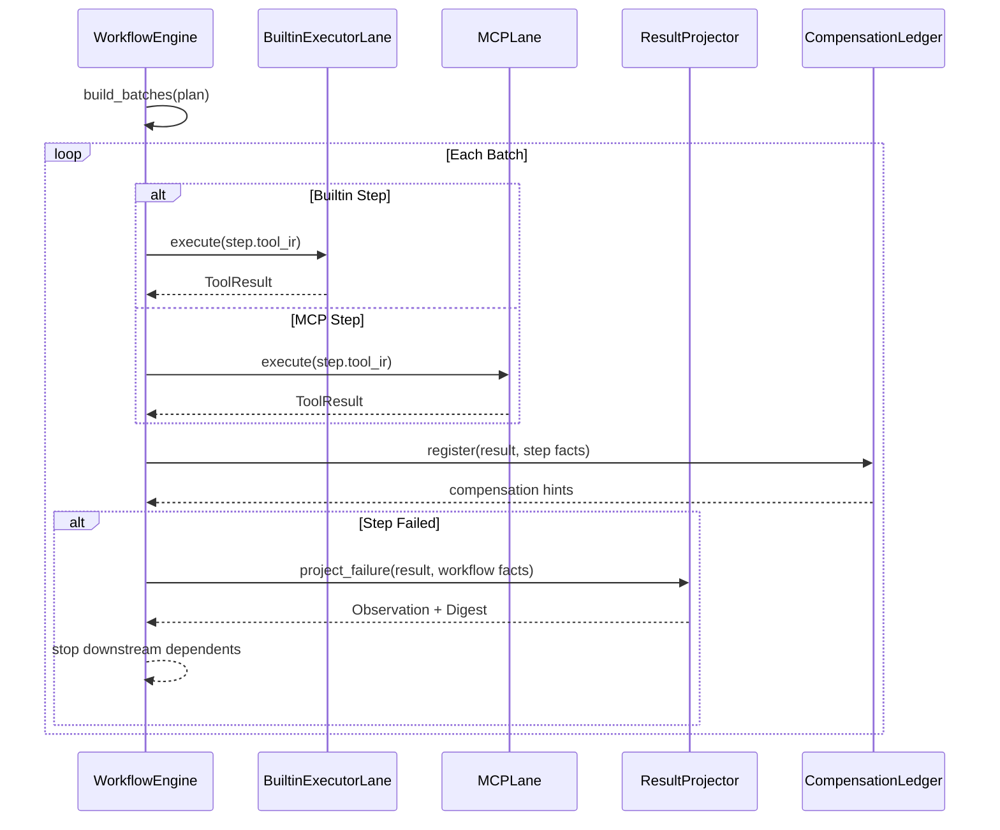

ResultProjector / CompensationLedger 数据流如下：

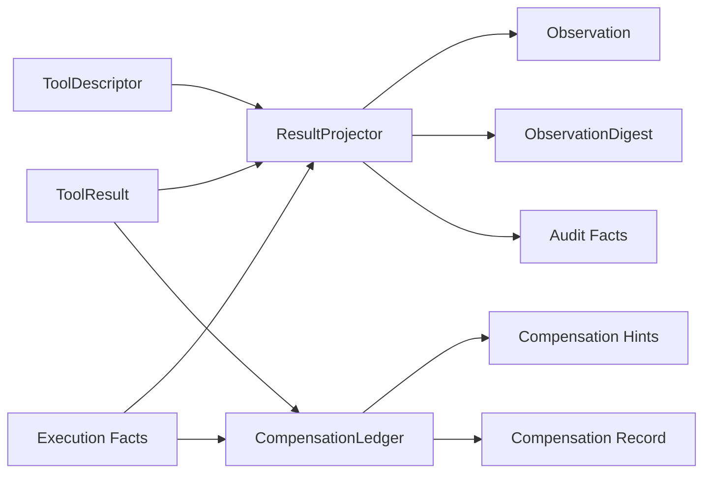

#### 6.12.3 MCP 运行时组件组

调研学习结论：

1. 基于 `docs/architecture/DASALL_Agent_architecture.md`、`DASALL_Engineering_Blueprint.md` 和 `DASALL_架构设计文档.md`，MCP 已被定义为 Tool System 与外部能力域之间的协议化接入层，但 `IMCPAdapter`、`CapabilityDiscovery`、`CapabilityCache` 仍必须保持 module-local。
2. 基于 `profiles/include/RuntimePolicySnapshot.h` 与 `runtime_policy.yaml`，MCP runtime 的 freshness、backoff、stale-read、timeout budget 已有稳定策略来源，适合直接映射为 cache / discovery 行为。
3. 基于 plugin 扩展边界，stdio MCP server 可由 plugin 提供 launch spec，但实际握手、session、capability snapshot 和 invoke 闭环仍由 tools/mcp 子域承担。

MCP 运行时核心对象建议保持如下分层：

| 对象 | 层级 | 作用 |
|---|---|---|
| `MCPServerSpec` | module-local public | 描述 server_id、endpoint/launch source、capabilities、trust_level、healthcheck |
| `MCPServerSession` | module-local internal | 表示已建立的会话句柄与 transport 上下文 |
| `CapabilitySnapshot` | module-local internal | 保存某个 server 的 tools/resources/prompts 快照与 freshness 元数据 |
| `MCPToolBinding` | module-local internal | 把 remote capability 映射到 internal tool name 与 schema expectation |
| `MCPServerLaunchSpec` | module-local internal | 描述 plugin-delivered stdio server 的 command/args/env/cwd/health launch 细节 |
| `IMCPTransport` | module-local public | 抽象 JSON-RPC 消息收发层，屏蔽 stdio/SSE/StreamableHTTP 等 transport 差异 |

MCP Transport 抽象层设计：

IMCPAdapter 依赖 `IMCPTransport` 抽象发送和接收 JSON-RPC 消息，不直接耦合某种具体 transport 实现。建议接口如下：

```cpp
class IMCPTransport {
public:
  virtual ~IMCPTransport() = default;
  virtual TransportConnectResult connect(const MCPServerSpec& spec) = 0;
  virtual void send(std::string_view json_rpc_message) = 0;
  virtual std::optional<std::string> receive(std::chrono::milliseconds timeout) = 0;
  virtual void close() = 0;
  virtual bool is_connected() const = 0;
};
```

落点建议为 `tools/include/mcp/IMCPTransport.h`，首版提供 `StdioMCPTransport` 实现（`tools/src/mcp/StdioMCPTransport.cpp`）；当后续需要支持 SSE 或 StreamableHTTP 时，只需新增 transport 实现，不影响 IMCPAdapter 与上游。

transport 分层约束：

1. IMCPTransport 只负责 raw JSON-RPC message 的发送与接收，不解释 MCP 协议语义（initialize、tools/list 等）。
2. MCP 协议语义（握手、能力协商、invoke）仍由 IMCPAdapter 在 IMCPTransport 之上实现。
3. StdioMCPTransport 负责进程拉起（fork/exec）、stdin/stdout pipe 管理、进程健康监控；进程终止时必须关闭 transport 并输出 evidence。
4. stdio MCP server 的进程 handle 由 StdioMCPTransport 持有，MCPLane 通过 IMCPAdapter 间接管理；进程 kill/restart 决策遵循 CapabilityDiscovery 的 refresh 逻辑和 plugin lifecycle 事件。
5. JSON 序列化/反序列化选型建议统一使用项目已有的 JSON 库（如 nlohmann/json），不在 transport 层引入额外序列化依赖。

##### MCPLane

1. 职责：承接已完成路由选择的远程调用，基于 binding、session 和 adapter 完成 invoke，并把协议结果统一映射为 `ToolResult`。
2. 非职责边界：不负责周期 discovery；不做最终 route 裁定；不解释 plugin manifest；不直接暴露 protocol payload 给 llm/prompt。
3. 核心数据定义：围绕 `ToolIR`、`MCPToolBinding`、`MCPServerSession`、`ToolResult`、route facts 建模。
4. 公共/内部接口：内部建议具备 `execute()`、`resolve_binding()`、`ensure_session_ready()`、`map_mcp_response()`；公共接口继续由 ToolManager 通过 route dispatch 间接消费。
5. 关键执行流：先根据 route decision 解析 binding，再调用 IMCPAdapter 确保 session 可用，随后发起 remote invoke，把返回结果映射为 ToolResult 并附带 server/trust/latency facts。
6. 失败与回退语义：transport、auth、protocol mapping 失败都必须收敛为统一 ErrorInfo；MCPLane 不自己改路由；是否使用 stale snapshot 已在 RouteSelector 决策中裁定。
7. 测试与验收出口：推荐单测为 `MCPLaneInvokeTest.cpp`；集成验收继续以 `ToolMCPFallbackIntegrationTest` 与 `ToolPluginStdioMCPIntegrationTest` 为主出口。

##### IMCPAdapter

1. 职责：抽象协议层握手、会话建立、能力发现与远程调用，把 transport/protocol 差异屏蔽在 tools/mcp 子域内部；在 IMCPTransport 提供的 raw JSON-RPC 通道之上实现 MCP 协议语义。
2. 非职责边界：不掌 registry；不掌 cache policy；不决定是否允许该能力暴露给 runtime；不进入 shared contracts；不直接管理 stdio 进程生命周期（委托给 IMCPTransport 实现）。
3. 核心数据定义：围绕 `MCPServerSpec`、`MCPServerSession`、`CapabilitySnapshot`、`MCPToolBinding`、protocol error mapping、`IMCPTransport` 实例引用建模。
4. 公共/内部接口：公共面延续 `ensure_session()`、`list_capabilities()`、`invoke()`；内部可细分为 `perform_handshake()`、`map_protocol_error()`、`select_transport()`。
5. 关键执行流：根据 `MCPServerSpec` 选择合适的 `IMCPTransport` 实现（stdio/SSE/StreamableHTTP），通过 transport 建立连接，完成 MCP initialize 握手并建立 session，然后支持按需列能力和执行 invoke，最终输出 `CapabilitySnapshot` 或 `ToolResult`。
6. 失败与回退语义：握手失败、broken pipe、auth 失败都必须映射为稳定 reason code；允许按 profile retry budget 做受控重试，但不允许无限 reconnect；若 transport 无法恢复，必须把 evidence 交回上游。
7. 测试与验收出口：推荐单测为 `MCPAdapterTest.cpp`、`MCPAdapterHandshakeFailureTest.cpp`、`MCPAdapterTransportSwitchTest.cpp`；集成验收继续依赖 `ToolMCPFallbackIntegrationTest`。

##### CapabilityDiscovery

1. 职责：周期性拉取 server 的 tools/resources/prompts 能力视图，并刷新 `CapabilityCache` 与相关 binding sources。
2. 非职责边界：不做最终 route 选择；不直接把 discovery 结果暴露给 llm；不替代 PluginExtensionBridge 管理 server source 生命周期。
3. 核心数据定义：围绕 refresh tick、`MCPServerSpec` 列表、`CapabilitySnapshot`、discovery evidence、backoff 状态建模。
4. 公共/内部接口：内部建议具备 `refresh_once()`、`schedule_refresh()`、`on_plugin_delta()`、`resolve_server_spec()`、`publish_snapshot()`。
5. 关键执行流：枚举 deployment/profile/plugin 提供的 server specs，逐个调用 IMCPAdapter 确保 session 和 list capabilities，把结果刷入 CapabilityCache，并通知 ToolRegistry / RouteSelector 可见的 binding 变化。
6. 失败与回退语义：单个 server discovery 失败不拖垮全局 refresh；失败后遵循 `failure_backoff_ms` 退避；在缓存未过期且 `stale_read_allowed=true` 时，保留最近可信 snapshot 供 route 决策。
7. 测试与验收出口：单测为 `CapabilityDiscoveryTest.cpp`、`StdioMCPServerLauncherTest.cpp`；集成验收已由 `ToolPluginStdioMCPIntegrationTest`、`ToolMCPFallbackIntegrationTest` 落地，覆盖 plugin-delivered stdio launch、route fallback、stale snapshot 与统一 ErrorInfo 映射。

##### CapabilityCache

1. 职责：维护 capability snapshot、freshness、health、last error 等元数据，为 RouteSelector 和 ToolRegistry 提供统一读取视图。
2. 非职责边界：不做持久化 ABI 承诺；不向 llm/prompt 暴露 protocol details；不绕过 RouteSelector 直接决定 capability 可见性。
3. 核心数据定义：围绕 `CapabilitySnapshot`、capability entry、fresh/stale/expired 状态、last_refresh_at、last_error、trust marker 建模。
4. 公共/内部接口：公共面延续 `snapshot(server_id)` 与 `update(snapshot)`；内部建议补 `invalidate(source)`、`mark_failed(server_id)`、`list_trusted()`。
5. 关键执行流：CapabilityDiscovery 写入 snapshot 后更新 freshness 和 last error；RouteSelector 按 server_id 读取，并结合 `expire_after_ms`、`stale_read_allowed` 决定是否可用。
6. 失败与回退语义：cache 过期且 profile 不允许 stale read 时必须 deny；cache 自身损坏必须触发 source invalidation 和 diagnostics evidence；不得把缓存缺失伪装成 capability empty。
7. 测试与验收出口：推荐单测为 `CapabilityCacheTest.cpp`、`CapabilityCacheStateTransitionTest.cpp`；验收标准是 fresh/stale/expired 的状态转移与 stale read 策略可自动断言。

##### MCP loopback fixture 与 plugin stdio launch 样本方案（TOOL-TODO-031 收敛）

为解开 Phase 4 的自动化验证阻塞，MCP loopback fixture 与 plugin stdio launch 样本在 v1 统一收敛为以下最小方案：

1. `tests/mocks/include/MCPLoopbackServerFixture.h` 作为 header-only fixture，沿用 `CapabilityServicesLoopbackFixture.h` 的测试夹具放置约定；它只服务 unit / integration gate，不进入 `tools/src/mcp/` 生产实现。
2. fixture 必须模拟 stdio transport 的最小 JSON-RPC 生命周期，并严格遵守 MCP 官方约束：`stdin`/`stdout` 只承载 UTF-8、newline-delimited 的 JSON-RPC message；`initialize` 必须是首个且非 batch 请求；server 只有在收到 `notifications/initialized` 后才进入正常 operation phase。
3. fixture 的最小脚本化闭环固定为 5 个阶段：
   - `initialize` request -> response
   - `notifications/initialized`
   - `tools/list`
   - `tools/call`
   - shutdown evidence（close stdin -> wait -> terminate escalation）
4. fixture 应暴露可编排 scenario 输入，而不是硬编码单一路径；首版建议使用 `MCPLoopbackScenario`、`MCPLoopbackFrame`、`MCPLoopbackExitMode` 等 internal supporting object 描述 request/response transcript、stderr log、transport close 时机和 exit reason。
5. plugin-delivered stdio server 不直接在 TODO 或 integration test 中内联命令行；统一通过 `bridge::MCPServerLaunchSpec.launch_spec_ref` 指向测试样本，再由后续 `StdioMCPServerLauncher` 在 034 中解析。031 只冻结样本 shape，不回滚 010 已落盘的 bridge ABI。
6. `launch_spec_ref` 的首版规范样本固定为 plugin-local、可重放、不可联网的 loopback server 资产，推荐 ID 形如 `launch://plugin.loopback/mcp.echo.v1`；样本 payload 至少包含 `command`、`args`、`env`、`working_dir`、`protocol_version`、`server_capabilities`、`tool_bindings`、`healthcheck_mode` 八类字段。

规范样本（v1，示意）如下：

```json
{
  "server_id": "mcp.echo.loopback",
  "transport": "stdio",
  "command": "tests/mocks/bin/mcp-loopback-server",
  "args": ["--scenario", "echo"],
  "env": {
    "MCP_PROTOCOL_VERSION": "2025-03-26"
  },
  "working_dir": "${workspaceFolder}",
  "protocol_version": "2025-03-26",
  "server_capabilities": {
    "tools": {
      "listChanged": false
    }
  },
  "tool_bindings": [
    {
      "internal_tool_name": "tool.remote.echo",
      "remote_tool_name": "echo"
    }
  ],
  "healthcheck_mode": "initialize_roundtrip"
}
```

7. `ToolMCPFallbackIntegrationTest` 复用同一 loopback fixture，验证 stale snapshot 选路、MCP lane 不健康时回退 builtin，以及 MCP protocol error -> ErrorInfo 的统一映射；`ToolPluginStdioMCPIntegrationTest` 在同一 fixture 之上额外验证 plugin-delivered `launch_spec_ref` -> launch sample -> stdio invoke，以及 unload 后 source-scoped revoke。
8. 该方案的目标是为 032~035 提供 deterministic test seam；两个 integration gate 现已落地，但这仍不自动等于 generic MCP 对外 ready，是否从 `tools_mcp=false` 调整为灰度开启仍需单独 rollout 评审。

MCP Runtime 关键时序图如下：

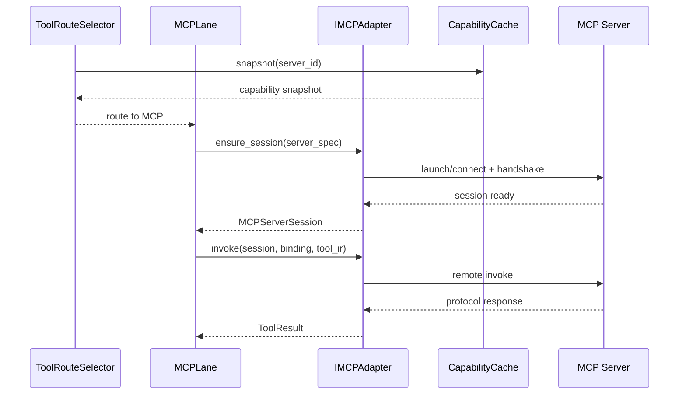

MCP Runtime 数据流如下：

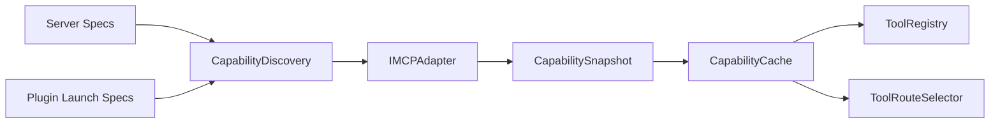

#### 6.12.4 插件扩展组件组

调研学习结论：

1. 基于 `docs/architecture/DASALL_infra_plugin模块详细设计.md`，plugin 组件负责 discover/validate/load/unload 和签名、ABI、safe mode 等治理平面；tools 只能消费激活结果，不能复制 plugin manager 职责。
2. 基于 6.5.4 的既有收敛结论，plugin 向 tools 暴露的工具域载荷只允许 `builtin_tool_provider`、`mcp_server.stdio`、`skill_bundle` 三类或其组合。
3. 基于 `IToolPluginProvider` 与 `ToolPluginExtensionCatalog` 的 module public 约束，consumer-specific 扩展语义应在 tools bridge/importer 内解析，不进入 shared contracts。

插件扩展核心载荷建议保持如下边界：

| 载荷 | 来源 | tools 侧消费方式 |
|---|---|---|
| `builtin_tool_provider` | plugin export table | 归一化为 descriptor + factory view，再进入 ToolRegistry |
| `mcp_server.stdio` | plugin export table | 归一化为 `MCPServerLaunchSpec`，再交 CapabilityDiscovery / IMCPAdapter |
| `skill_bundle` | plugin export table | 归一化为 `SkillSpecAsset` / asset refs，再交 SkillRegistry / ExternalSkillImporter |

##### PluginExtensionBridge

1. 职责：消费 `ActivePluginSet`、`LoadResult.handle_ref` 和 plugin export table，把 plugin-delivered builtin/MCP/skill 扩展归一化为 tools 子域可消费的 delta。
2. 非职责边界：不做 discover/validate/load/unload；不做签名和 ABI 校验；不决定 plugin safe mode；不把 plugin load success 等同于 capability visible。
3. 核心数据定义：围绕 `ToolPluginExtensionCatalog`、`ToolPluginProviderRef`、`MCPServerLaunchSpec`、skill asset refs、source traceability key、revocation delta 建模。
4. 公共/内部接口：内部建议具备 `rebuild_extension_catalog()`、`on_plugin_loaded()`、`on_plugin_unloaded()`、`emit_builtin_delta()`、`emit_mcp_delta()`、`emit_skill_delta()`；公共面继续通过 ToolRegistry / CapabilityDiscovery / SkillRegistry 间接消费。
5. 关键执行流：读取 active plugin set，逐个解析 tools-specific export table；对 builtin 导出发送 registry delta，对 stdio MCP 导出发送 discovery delta，对 skill bundle 导出发送 importer / registry delta；插件卸载时对三个子域做 source-scoped revoke。
6. 失败与回退语义：单个 plugin 的导出不合法时只隔离该 plugin，不拖垮全局 bridge；plugin safe mode 或 unload 事件必须即时撤回 source-owned descriptor、launch spec、skill asset；不得留下悬挂引用。
7. 测试与验收出口：推荐单测为 `PluginExtensionBridgeTest.cpp`、`PluginExtensionBridgeUnloadTest.cpp`、`PluginExtensionBridgeConcurrencyTest.cpp`；集成验收继续以 `ToolPluginStdioMCPIntegrationTest` 与 `ToolPluginSkillBundleIntegrationTest` 为主出口。

PluginExtensionBridge 与动态变更组件并发安全策略：

以下约束适用于 PluginExtensionBridge、ToolRegistry、CapabilityCache 等接受运行时动态变更的组件：

1. **snapshot-and-swap 一致性模型**：delta 应用采用 snapshot-and-swap 策略——先在独立副本上完成所有变更计算，再通过原子指针交换（`std::shared_ptr` + `std::atomic`）替换活跃视图。这保证 `resolve_descriptor()`、`snapshot()` 等读取操作永远返回一致快照，不会读到半更新状态。
2. **调用时刻快照绑定**：正在执行的 tool call 基于 `ToolManager::invoke()` 入口时刻获取的 descriptor snapshot 和 ToolPolicyView 完成全生命周期，不受途中 plugin unload/reload 或 capability refresh 影响。unload/invalidation 只影响下一次 `resolve_descriptor()` 的结果。
3. **delta 应用串行化**：`on_plugin_loaded()`、`on_plugin_unloaded()`、`apply_plugin_extension_delta()`、`upsert_mcp_bindings()` 等写路径在同一组件内必须串行执行（例如通过 mutex 或单线程 delta queue），避免多个 plugin 事件并发导致 catalog 不一致。
4. **Lock order 声明（TOOL-C016 落点）**：若多个组件需要跨组件级联更新（例如 PluginExtensionBridge -> ToolRegistry -> CapabilityDiscovery），lock order 固定为 `bridge_mutex -> registry_write_mutex -> cache_write_mutex`，不允许逆序获取锁。
5. **不持锁执行网络 I/O**：写锁只保护内存中的 catalog/descriptor/binding store；MCP server 握手、capability list 等网络调用必须在锁外完成，把结果作为 delta 提交。

PluginExtensionBridge 关键时序图如下：

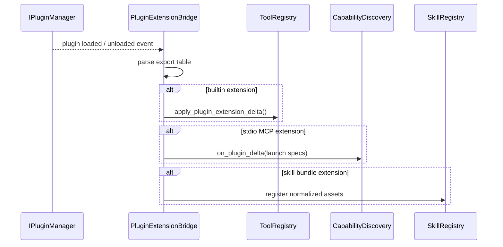

#### 6.12.5 Skill 运行时组件组

调研学习结论：

1. 基于 `docs/development/SKILLS学习研究.md`、`docs/LLM Agent学习.md` 与 `DASALL_Engineering_Blueprint.md`，DASALL Skill 是“面向系统运行时的任务级能力资产”，其核心对象是 `SkillSpec`、`SkillRegistry`、`SkillRuntime`、`SkillInstance`。
2. 基于 `DASALL_Agent_architecture.md` 对外部 Skill 的兼容判断，`.github/skills`、`.claude/skills` 等外部方言必须先经 importer 归一化，才能进入 SkillRegistry。
3. 基于 tools 与 workflow 的边界，SkillRuntime 负责实例化和生成 `WorkflowPlan`，但 Skill 本身不直接执行工具调用。

Skill 运行时核心对象建议保持如下分层：

| 对象 | 层级 | 作用 |
|---|---|---|
| `SkillSpecAsset` | module-local asset | 描述 intent patterns、allowed tools、workflow template、prompt bundle、fallback strategy |
| `SkillMatchResult` | module-local internal | 表示 registry 基于意图、标签、profile 得出的匹配结果 |
| `SkillInstance` | module-local runtime | 表示某次请求上的具体 skill 实例，绑定 workflow/tool allowlist/context refs |
| `WorkflowPlan` | module-local internal | 由 SkillRuntime 产出的执行计划，继续交给 WorkflowEngine |

##### SkillRegistry

1. 职责：对 normalized `SkillSpecAsset` 做 register/match/revoke，向上游返回稳定的 `SkillMatchResult`。
2. 非职责边界：不解析外部方言；不直接执行工具；不直接渲染 prompt；不决定 route 或补偿。
3. 核心数据定义：围绕 `SkillSpecAsset`、skill index、intent pattern、`SkillMatchResult`、source ownership/version fingerprint 建模。
4. 公共/内部接口：内部建议具备 `register_asset()`、`match_intent()`、`revoke_source()`、`list_assets()`；公共面仍保持 module-local，不进入 shared contracts。
5. 关键执行流：接收内部 `skills/specs/` 与 plugin/importer 归一化后的资产，建立按 intent pattern、tags、profile constraints 的索引，再按请求语义返回最佳匹配或空结果。
6. 失败与回退语义：非法或不完整资产必须被隔离；空匹配不是错误，只表示当前无合适 skill；不允许在 registry 内部做模糊降级执行。
7. 测试与验收出口：推荐单测为 `SkillRegistryTest.cpp`、`SkillRegistryPriorityTest.cpp`；验收标准是 register/match/revoke 的索引一致性可自动断言。
8. 当前 Build 基线已在 `tools/src/skills/SkillRegistry.cpp` 落地 `register_asset()`、`match_intent()`、`revoke_source()`、`list_assets()` 四个入口，采用 source-scoped snapshot-and-swap 发布与稳定 tie-break；registry 仍只接受 normalized asset，不旁路解析 external dialect。

##### SkillRuntime

1. 职责：根据 `SkillMatchResult` 和 `ToolPolicyView` 实例化 `SkillInstance`，生成 workflow/tool allowlist/fallback plan，并把执行责任交给 WorkflowEngine。
2. 非职责边界：不直接执行 workflow；不做最终路由；不解析外部 Skill 目录；不替 runtime 做用户交互或全局调度。
3. 核心数据定义：围绕 `SkillInstance`、workflow template ref、tool allowlist、prompt bundle ref、fallback strategy、eval suite ref 建模。
4. 公共/内部接口：内部建议具备 `instantiate()`、`bind_workflow_template()`、`build_tool_allowlist()`、`release_instance()`。
5. 关键执行流：先基于 match result 和 profile 过滤出允许工具集，再绑定 workflow template、prompt bundle 和 fallback strategy，最后生成 `SkillInstance` 与 `WorkflowPlan` 交给 WorkflowEngine。
6. 失败与回退语义：若 skill 所需工具被 policy 拒绝，SkillRuntime 只能按 fallback strategy 降级或拒绝实例化；缺失 workflow template 时不能临时拼装执行计划。
7. 测试与验收出口：推荐单测为 `SkillRuntimeInstantiateTest.cpp`；集成验收继续以 `ToolSkillRuntimeIntegrationTest` 为主出口。
8. 当前 Build 基线已在 `tools/src/skills/SkillRuntime.h`、`tools/src/skills/SkillRuntime.cpp` 落地 `instantiate()`、`bind_workflow_template()`、`build_tool_allowlist()`、`release_instance()` 四个入口；runtime 目前只消费 normalized `SkillSpecAsset` 与 internal workflow sample，通过 module-local YAML 绑定器生成 `WorkflowPlan`，仍不旁路 external importer 或 workflow 执行职责。
9. 040 已用 `tests/integration/tools/ToolSkillRuntimeIntegrationTest.cpp` 验证 internal bundle import -> register -> match -> instantiate -> release 的 integration 闭环，确保 runtime 继续只消费 normalized asset，不在集成路径上旁路 importer 或 registry。

##### ExternalSkillImporter

1. 职责：把 `.github/skills`、`.claude/skills` 等外部方言转换为内部 `SkillSpecAsset`、prompt/workflow asset refs，并输出 import diagnostics。
2. 非职责边界：不直接注册到 runtime；不执行工具；不宣称产品级兼容；不绕过 SkillRegistry 的归一化入口。
3. 核心数据定义：围绕 raw frontmatter、description、asset refs、normalized `SkillSpecAsset`、import diagnostics、feature flag 状态建模。
4. 公共/内部接口：内部建议具备 `import_directory()`、`parse_frontmatter()`、`normalize_assets()`、`emit_diagnostics()`。
5. 关键执行流：扫描外部 skill 目录，解析 frontmatter 和描述字段，抽取 prompt/workflow/references 资产，归一化为内部 SkillSpecAsset，再把结果交给 SkillRegistry 或 PluginExtensionBridge。
6. 失败与回退语义：格式错误、字段缺失或资产不完整时必须 quarantine 并输出 diagnostics；当 importer feature flag 关闭时，系统继续只支持内部 `skills/specs/` 资产。
7. 测试与验收出口：推荐单测为 `ExternalSkillImporterTest.cpp`、`ExternalSkillDialectRegressionTest.cpp`；集成验收继续以 `ToolPluginSkillBundleIntegrationTest` 为主出口。
8. 当前 Build 基线已在 `tools/src/skills/ExternalSkillImporter.cpp`、`tools/src/skills/PluginSkillBundleImporter.cpp` 落地 external dialect frontmatter 解析、supporting workflow/eval 归一化、diagnostics quarantine 与 plugin bundle 导入；其中 external dialect 仍受 module-local `external_skill_import_enabled` 保护，plugin-delivered normalized internal bundle 只返回 `SkillSpecAsset`，不在 importer 内直接注册或执行。
9. 040 已用 `tests/integration/tools/ToolPluginSkillBundleIntegrationTest.cpp` 验证 plugin skill bundle delta -> feature flag gate -> import -> register -> unload revoke 的闭环，确保 plugin source lifecycle 继续通过 `PluginExtensionBridge` 和 `SkillRegistry::revoke_source()` 显式衔接，而不是隐式耦合。

Skill 运行时数据流如下：

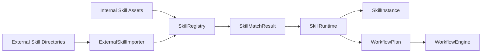

##### Skill 资产基线（TOOL-TODO-036）

1. internal normalized 资产根固定为 `skills/specs/`、`skills/workflows/`、`skills/evals/`；首个 canonical sample 固定为 `runtime-incident-triage.skill.yaml`、`runtime-incident-triage.workflow.yaml`、`runtime-incident-triage.eval.yaml`，用于后续 037~040 的 register / instantiate / import / integration 回归。
2. external dialect fixture 固定为 `skills/external_dialects/claude/runtime-incident/` 与 `skills/external_dialects/github/runtime-incident/`，两者都以 `SKILL.md` 为入口，并通过相对路径引用同目录下的 `workflow.yaml`、`eval.yaml` 与 `reference.md` supporting files。
3. external importer 的开关在 v1 保持 module-local `external_skill_import_enabled`，由 importer 依赖注入或测试夹具显式提供，默认关闭；本轮不新增 `RuntimePolicySnapshot`、`BuildProfileManifest` 或 profile YAML 的顶层 schema。
4. GitHub-style sample 只冻结本仓库当前采用的 `SKILL.md + YAML frontmatter` 子集，以及 `tool-allowlist`、`workflow-template`、`eval-suite` 这类 importer-local sample keys；这不等于承诺兼容任意外部 GitHub Agent skill 方言。
5. Claude-style sample 对齐官方 `SKILL.md + YAML frontmatter + supporting files` 目录布局；其中 `workflow`、`eval_suite` 仅作为 DASALL importer fixture 扩展键存在，不改变上游工具的公开规范。
6. 上述样本的目标是为 039 的 `parse_frontmatter()`、`normalize_assets()` 与 040 的 plugin skill bundle integration 提供 deterministic fixture；在 importer feature flag 未显式打开前，runtime 继续只消费 internal `skills/specs/` 资产。

#### 6.12.6 配置投影、健康与观测桥接组件

调研学习结论：

1. 基于 `RuntimePolicySnapshot` 及其现有 unit / contract 验证，ToolConfigAdapter 已有稳定的上游策略快照来源，适合作为 projection-only 组件，而不是新的 policy brain。
2. 基于 tools 的 observability 约束和 infra 的健康/审计桥接模式，ToolHealthProbe 与三类 bridge 更适合表格式说明，不需要完整时序图。

| 组件 | 职责 | 非职责边界 | 核心数据定义 | 公共/内部接口 | 关键执行流 | 失败与回退语义 | 测试与验收出口 |
|---|---|---|---|---|---|---|---|
| ToolConfigAdapter | 把 `RuntimePolicySnapshot` 投影为 `ToolPolicyView`、`ToolTimeoutView`、lane 预算视图 | 不直接解析 profile yaml；不做 admission 决策；不重定义 schema | `ToolPolicyView`、`ToolTimeoutView`、tool/mcp/workflow timeout budget、visibility/domain projection、snapshot version fingerprint | 内部建议 `build_policy_view()`、`build_timeout_view()`、`project_enabled_modules()`、`is_snapshot_current()` | 读取 active snapshot，提取 tools 相关键，投影为治理链可消费的轻量视图；通过 snapshot version fingerprint 判断缓存是否需要 invalidation | snapshot 缺失或字段不完整时返回 deny-oriented 视图，禁止默认放宽策略 | 推荐单测 `ToolConfigAdapterTest.cpp`、`ToolPolicyProfileDiffTest.cpp`、`ToolConfigAdapterHotUpdateTest.cpp`；验收要求 profile 差异投影和热更新行为可自动断言 |

ToolConfigAdapter 策略投影缓存与热更新约束：

1. ToolPolicyView 投影采用 per-snapshot-version 缓存策略：ToolConfigAdapter 在首次 `build_policy_view()` 时基于 `RuntimePolicySnapshot.version` 构建 ToolPolicyView 并缓存，后续调用如果 snapshot version 未变则直接返回缓存视图，避免每次 invoke 都做一次完整投影。
2. 当 profiles 在运行时热更新（例如从 `desktop_full` 切换到 `edge_minimal`，或动态调整 `max_tool_calls`）时，RuntimePolicySnapshot 的 version 变更触发缓存 invalidation，下一次 `build_policy_view()` 重新投影。
3. 热更新对进行中 tool call 的影响：已经进入 `run_invoke_pipeline()` 的 tool call 基于调用入口时刻的 ToolPolicyView snapshot 完成全生命周期，不受途中策略变化影响；热更新只影响下一次 invoke 的准入、路由和超时投影。
4. 该策略保证了 PolicyGate 和 RouteSelector 在单次 invoke 全程中看到一致的策略视图，避免"准入时 allowed 但执行时 timeout 已变"的不一致窗口。

| ToolHealthProbe | 汇总 registry revision、lane 容量、MCP session、cache freshness 等健康视图，供 RouteSelector 与 ops 使用 | 不拥有独立公共 ABI；不直接触发恢复；不直接写 health store | health snapshot、registry stats、lane saturation、MCP freshness marker | 内部建议 `collect_registry_health()`、`collect_lane_health()`、`collect_mcp_health()` | 周期或按需采样各子域状态，生成统一 health snapshot 给 RouteSelector/ops | 任一子域采样失败时保守标记 degraded，而不是伪造 healthy | 推荐单测 `ToolHealthProbeTest.cpp`；验收以 route health switch 行为和 health snapshot 字段完整性为准 |
| ToolAuditBridge | 统一 `tool.execution.*`、`tool.compensation.*` 审计事件字段口径并写入 infra/audit | 不嵌入完整 raw payload；不决定审计策略；不替代 ResultProjector | audit event payload、reason codes、evidence refs、plugin/source marker | 内部建议 `emit_requested()`、`emit_completed()`、`emit_failed()`、`emit_compensation()` | 从 ToolManager / ResultProjector / CompensationLedger 接收事实，拼装结构化审计事件并写 infra | 审计写出失败必须可观测并回传 evidence gap，但不能吞掉主执行结果 | 推荐集成测试 `ToolObservabilityIntegrationTest.cpp`；验收要求关键事件齐备 |
| ToolMetricsBridge | 输出请求量、拒绝量、时延、stale snapshot、workflow failure 等统一指标 | 不掌业务含义；不直接暴露 provider 私有标签；不重算主链语义 | metric name、dimension set、route kind、plugin source、error code | 内部建议 `emit_counter()`、`emit_histogram()`、`emit_route_metrics()` | 从治理链与执行链收集 facts，按统一维度写 metrics backend | metrics backend 不可用时允许降级为 no-op，但必须记录一次 diagnostics 事件 | 推荐单测 `ToolMetricsBridgeTest.cpp`；集成验收并入 `ToolObservabilityIntegrationTest` |
| ToolTraceBridge | 建立 `tool.invoke` 到 lane / services / adapter 的父子 span 关系 | 不自己决定采样率；不持久化 trace store；不重排业务顺序 | root span id、child span attributes、route facts、error status | 内部建议 `start_root_span()`、`start_stage_span()`、`finish_with_status()` | 在 ToolManager、PolicyGate、RouteSelector、lane execute 等阶段插入 span，并与 services / adapter trace 关联 | trace backend 失败时允许静默降级为 no-op，但不得影响主链；错误状态必须仍通过日志/metrics 可见 | 推荐集成测试 `ToolObservabilityIntegrationTest.cpp`；验收要求父子 span 结构稳定 |

---

## 7. Design -> Build 映射（建议级）

### 7.1 映射表

说明：考虑到当前工作区 CMake Tools 预设可能未激活，以下验收命令默认采用显式 build-ci 路径。

| Design ID | 设计结论 | 代码目标 | 测试目标 | 验收命令 |
|---|---|---|---|---|
| TOOL-D1 | 建立 tools/include 公共接口根与最小 header layout | tools/include/ITool.h；tools/include/IToolManager.h；tools/include/IPolicyGate.h；tools/include/ICapabilityCache.h；tools/include/mcp/IMCPAdapter.h；tools/include/mcp/IMCPTransport.h；tools/CMakeLists.txt | tests/unit/tools/ToolInterfaceSurfaceTest.cpp | `cmake -S . -B build-ci -G Ninja && cmake --build build-ci --target dasall_tool_interface_surface_unit_test && ctest --test-dir build-ci -R ToolInterfaceSurfaceTest --output-on-failure` |
| TOOL-D2 | 落 ToolRegistry、PluginExtensionBridge 与 descriptor/binding 目录面 | tools/src/registry/ToolRegistry.cpp；tools/src/registry/BuiltinCatalog.cpp；tools/src/registry/MCPBindingRegistry.cpp；tools/src/bridge/PluginExtensionBridge.cpp；tools/include/plugin/IToolPluginProvider.h | tests/unit/tools/ToolRegistryTest.cpp；tests/unit/tools/PluginExtensionBridgeTest.cpp；保留 tests/contract/tool/ToolDescriptorIRContractTest.cpp 全绿 | `cmake -S . -B build-ci -G Ninja && cmake --build build-ci --target dasall_tool_registry_unit_test dasall_plugin_extension_bridge_unit_test dasall_contract_tests && ctest --test-dir build-ci -R "ToolRegistryTest|PluginExtensionBridgeTest|ToolDescriptorIRContractTest" --output-on-failure` |
| TOOL-D3 | 落 ToolValidator，把 ToolRequest 收敛到 ToolIR | tools/src/validation/ToolValidator.cpp | tests/unit/tools/ToolValidatorTest.cpp；tests/contract/tool/ToolRequestContractTest.cpp | `cmake -S . -B build-ci -G Ninja && cmake --build build-ci --target dasall_tool_validator_unit_test dasall_contract_tests && ctest --test-dir build-ci -R "ToolValidatorTest|ToolRequestContractTest" --output-on-failure` |
| TOOL-D4 | 落 ToolPolicyGate，按 fail-closed 处理 visibility/domain/confirmation | tools/src/policy/ToolPolicyGate.cpp；tools/src/config/ToolConfigAdapter.cpp | tests/unit/tools/ToolPolicyGateTest.cpp；tests/unit/tools/ToolPolicyProfileDiffTest.cpp | `cmake -S . -B build-ci -G Ninja && cmake --build build-ci --target dasall_tool_policy_gate_unit_test dasall_tool_policy_profile_diff_unit_test && ctest --test-dir build-ci -R "ToolPolicy(Gate|ProfileDiff)Test" --output-on-failure` |
| TOOL-D5 | 落 ToolRouteSelector 与 builtin/workflow/MCP lane 隔离 | tools/src/route/ToolRouteSelector.cpp；tools/src/execution/ExecutorLanePool.cpp | tests/unit/tools/ToolRouteSelectorTest.cpp；tests/unit/tools/ToolRouteFallbackTest.cpp | `cmake -S . -B build-ci -G Ninja && cmake --build build-ci --target dasall_tool_route_selector_unit_test dasall_tool_route_fallback_unit_test && ctest --test-dir build-ci -R "ToolRoute(Selector|Fallback)Test" --output-on-failure` |
| TOOL-D6 | 打通 builtin lane 到 IExecutionService/IDataService | tools/src/execution/BuiltinExecutorLane.cpp；tools/src/bridge/ToolServiceBridge.cpp | tests/unit/tools/BuiltinExecutorLaneTest.cpp；tests/integration/tools/ToolServicesSmokeIntegrationTest.cpp | `cmake -S . -B build-ci -G Ninja && cmake --build build-ci --target dasall_builtin_executor_lane_unit_test dasall_tool_services_smoke_integration_test && ctest --test-dir build-ci -R "BuiltinExecutorLaneTest|ToolServicesSmokeIntegrationTest" --output-on-failure` |
| TOOL-D7 | 落 ResultProjector 与 observability bridges | tools/src/projection/ResultProjector.cpp；tools/src/ops/ToolAuditBridge.cpp；tools/src/ops/ToolMetricsBridge.cpp；tools/src/ops/ToolTraceBridge.cpp | tests/unit/tools/ResultProjectorTest.cpp；tests/integration/tools/ToolObservabilityIntegrationTest.cpp | `cmake -S . -B build-ci -G Ninja && cmake --build build-ci --target dasall_result_projector_unit_test dasall_tool_observability_integration_test && ctest --test-dir build-ci -R "ResultProjectorTest|ToolObservabilityIntegrationTest" --output-on-failure` |
| TOOL-D8 | 落 WorkflowEngine 与 CompensationLedger | tools/src/execution/WorkflowEngine.cpp；tools/src/execution/CompensationLedger.cpp | tests/unit/tools/WorkflowEngineTest.cpp；tests/integration/tools/ToolWorkflowFailureIntegrationTest.cpp | `cmake -S . -B build-ci -G Ninja && cmake --build build-ci --target dasall_workflow_engine_unit_test dasall_tool_workflow_failure_integration_test && ctest --test-dir build-ci -R "WorkflowEngineTest|ToolWorkflowFailureIntegrationTest" --output-on-failure` |
| TOOL-D9 | 落 IMCPAdapter、IMCPTransport、CapabilityDiscovery、CapabilityCache 与 stdio MCP hybrid route | tools/src/mcp/MCPAdapter.cpp；tools/src/mcp/StdioMCPTransport.cpp；tools/src/mcp/CapabilityDiscovery.cpp；tools/src/mcp/CapabilityCache.cpp；tools/src/mcp/StdioMCPServerLauncher.cpp；tools/include/mcp/IMCPTransport.h | tests/unit/tools/MCPAdapterTest.cpp；tests/unit/tools/MCPAdapterTransportSwitchTest.cpp；tests/unit/tools/CapabilityCacheTest.cpp；tests/unit/tools/CapabilityDiscoveryTest.cpp；tests/unit/tools/StdioMCPServerLauncherTest.cpp；tests/integration/tools/ToolMCPFallbackIntegrationTest.cpp；tests/integration/tools/ToolPluginStdioMCPIntegrationTest.cpp | `cmake -S . -B build-ci -G Ninja && cmake --build build-ci --target dasall_mcp_adapter_unit_test dasall_capability_cache_unit_test dasall_capability_discovery_unit_test dasall_stdio_mcp_server_launcher_unit_test dasall_tool_mcp_fallback_integration_test dasall_tool_plugin_stdio_mcp_integration_test && ctest --test-dir build-ci -R "(MCPAdapter|CapabilityCache|CapabilityDiscovery|StdioMCPServerLauncher)Test|ToolMCPFallbackIntegrationTest|ToolPluginStdioMCPIntegrationTest" --output-on-failure` |
| TOOL-D10 | 落 SkillRegistry、SkillRuntime、Plugin skill bundle 接线与 ExternalSkillImporter | tools/src/skills/SkillRegistry.cpp；tools/src/skills/SkillRuntime.cpp；tools/src/skills/ExternalSkillImporter.cpp；tools/src/skills/PluginSkillBundleImporter.cpp；skills/specs/* | tests/unit/tools/SkillRegistryTest.cpp；tests/unit/tools/ExternalSkillImporterTest.cpp；tests/integration/tools/ToolSkillRuntimeIntegrationTest.cpp；tests/integration/tools/ToolPluginSkillBundleIntegrationTest.cpp | `cmake -S . -B build-ci -G Ninja && cmake --build build-ci --target dasall_skill_registry_unit_test dasall_external_skill_importer_unit_test dasall_tool_skill_runtime_integration_test dasall_tool_plugin_skill_bundle_integration_test && ctest --test-dir build-ci -R "SkillRegistryTest|ExternalSkillImporterTest|ToolSkillRuntimeIntegrationTest|ToolPluginSkillBundleIntegrationTest" --output-on-failure` |
| TOOL-D11 | 收口 tests/unit/tools 与 tests/integration/tools 的 discoverability 和聚合 Gate | tests/unit/tools/CMakeLists.txt；tests/integration/tools/CMakeLists.txt；tests/unit/CMakeLists.txt；tests/integration/CMakeLists.txt | `ctest -N` 能发现 tools 相关用例；聚合 target 可运行 | `cmake -S . -B build-ci -G Ninja && cmake --build build-ci --target dasall_unit_tests dasall_integration_tests && ctest --test-dir build-ci -N -R "Tool|tools" && ctest --test-dir build-ci --output-on-failure -L unit && ctest --test-dir build-ci --output-on-failure -L integration` |

### 7.2 当前不可直接映射项

| 项目 | 当前原因 | 后续动作 |
|---|---|---|
| generic MCP ready 对外宣称 | TOOL-D9 与 Gate-TOOL-07 已落地，但 rollout / 兼容承诺仍未单独评审 | 继续维持 implementation available but rollout pending 的口径，待发布评审决定 |
| 外部 Skill 方言产品级兼容 | 当前没有 importer、normalized asset、评测链路 | 完成 TOOL-D10，并补 external dialect regression suite |
| ToolAdmissionDecision / ToolRouteDecision 升格 shared contracts | supporting objects 尚未在 runtime/tools/services 间闭合 | 保持 module-local，待 admission review 再决定 |

---

## 8. 实施计划与里程碑

### 8.1 目录与文件落盘建议

```text
tools/
├── include/
│   ├── ITool.h
│   ├── IToolManager.h
│   ├── IPolicyGate.h
│   ├── ICapabilityCache.h
│   ├── ToolInvocationContext.h
│   ├── ToolInvocationEnvelope.h
│   ├── plugin/
│   │   └── IToolPluginProvider.h
│   └── mcp/
│       ├── IMCPAdapter.h
│       └── IMCPTransport.h
├── src/
│   ├── ToolManager.cpp
│   ├── registry/
│   ├── validation/
│   ├── policy/
│   ├── route/
│   ├── execution/
│   ├── bridge/
│   ├── projection/
│   ├── mcp/
│   ├── skills/
│   ├── ops/
│   └── config/
├── CMakeLists.txt
│
skills/
├── specs/
├── prompts/
├── workflows/
└── evals/

tests/
├── unit/
│   └── tools/
├── integration/
│   └── tools/
└── contract/
    └── tool/
```

部署期插件包建议布局：

```text
plugins/
└── <plugin_id>/
  ├── manifest.json
  ├── lib/
  └── exports/
    ├── tools/
    ├── mcp/
    │   └── stdio/
    └── skills/
```

目录约束：

1. `skills/` 继续作为资产根；Tool 运行时代码放在 `tools/src/skills/`，避免把资产与执行逻辑混在同一目录。
2. `tools/include/` 只放模块公共接口与轻量 supporting type；route/policy/cache 等复杂 supporting object 尽量保持在 `tools/src/`。
3. `tests/contract/tool/` 继续只验证 shared contracts；module-local 行为放 unit/integration，不把内部对象误做成契约测试对象。
4. `plugins/` 是部署产物根而不是 shared contracts 根；plugin manifest 保持 generic，consumer-specific 语义落在 `exports/` 下并由 tools/bridge 解析。

### 8.2 分阶段实施计划

| 阶段 | 范围 | 最小可交付 | 完成判定 |
|---|---|---|---|
| Phase 0 | 头文件布局与入口骨架 | ITool/IToolManager/IPolicyGate/ICapabilityCache/IMCPAdapter 头文件 + ToolManager 占位实现 | tools/include 完整存在，ToolInterfaceSurfaceTest 可编译通过 |
| Phase 1 | Registry + Validator + PolicyGate + Route + PluginExtensionBridge skeleton | Tool 治理链前半段闭合，并能接入 active plugin set | ToolRequest/Descriptor/IR shared contract tests 保持全绿，Policy/Route/PluginExtensionBridge 单测通过 |
| Phase 2 | builtin lane + services bridge + result projector | Tool -> Services -> ToolResult -> ObservationDigest 最小闭环 | ToolServicesSmokeIntegrationTest 通过，Digest 字段可二值断言 |
| Phase 3 | workflow + compensation ledger | 跨工具步骤编排、失败早停、compensation_hints 生成 | WorkflowEngineTest 与 ToolWorkflowFailureIntegrationTest 通过 |
| Phase 4 | MCP discovery/cache/hybrid route + plugin-delivered stdio launch | server handshake、capability snapshot、stale read fallback、plugin stdio MCP invoke | MCPAdapter/CapabilityCache 单测通过，ToolMCPFallbackIntegrationTest 与 ToolPluginStdioMCPIntegrationTest 通过 |
| Phase 5 | Skill runtime + plugin skill bundle + external importer | normalized SkillSpec 读取、match、instantiate、workflow bind | SkillRegistry/Importer 单测与 ToolSkillRuntimeIntegrationTest、ToolPluginSkillBundleIntegrationTest 通过 |
| Phase 6 | Gate 收口与 profile 验证 | discoverability、desktop vs edge profile diff、observability 完整性 | tools unit/integration tests 被 ctest -N 发现，Profile/Observability Gate 通过 |

### 8.3 阻塞项、解阻条件与回退策略（建议级）

| 阻塞项 | 影响阶段 | 解阻条件 | 最小解阻动作 | 回退策略 |
|---|---|---|---|---|
| runtime 生产 caller 尚未冻结（tools-side fixture 已定义） | Phase 0-2 | runtime 能以 ToolRequest 调用 ToolManager，或沿用 6.5.1.1 的 caller fixture 完成 tools-side 验证 | 以 `ToolInvocationContext` + ToolManager 本地依赖注入组成 caller fixture，`BuildProfileManifest` 不进入 context | 保持 tools 仅由测试夹具调用，不提前接 runtime 生产链 |
| MCP loopback server / plugin stdio launch 样本待 Build 落地（031 已补齐方案） | Phase 4 | 6.12.3 中定义的最小握手/列表/调用 fixture 与 launch sample 能落到 tests/mocks / integration | 在 tests/mocks 增加 `MCPLoopbackServerFixture.h`，并以 `launch_spec_ref` 指向 loopback sample | 若 Build 未就绪，暂时禁用 `tools_mcp` 路径，只验证 builtin/workflow |
| 外部 Skill 规范样本缺失（已由 TOOL-TODO-036 解阻） | Phase 5 | `skills/specs/`、`skills/workflows/`、`skills/evals/` 与 external dialect fixture 已落盘，且 module-local importer flag 边界明确 | 保持 036 冻结的 sample shape 与 module-local feature flag，继续推进 037~040 Build 落地 | 若外部 importer 不稳定，保持只支持内部 `skills/specs/` |
| services result 语义后续调整 | Phase 2-4 | Execution/Data 公共对象与 ResultMapper 字段保持稳定 | 以 ToolServiceBridge 做 module-local 映射层，不直接耦合 adapter receipt 细节 | 若 services 变更，先改 bridge，不回滚 Tool shared contracts |
| CMake Tools 预设未激活 | 全阶段验证 | build-ci configure/build/ctest 能稳定执行 | 统一使用显式 build-ci 验收链 | IDE target/test 列表异常不改变 Gate 结论 |
| tools 与 infra/plugin 间 extension ABI 缺失 | Phase 1/4/5 | 冻结 IToolPluginProvider 与 ToolPluginExtensionCatalog 最小语义 | 先补 PluginExtensionBridge 单测，再接 builtin/MCP/skill 扩展源 | 暂以静态注册、仓内 `skills/specs/`、非 plugin MCP 配置继续推进 |

---

## 9. 测试与质量门

### 9.1 测试矩阵

| 测试类型 | 覆盖范围 | 关键用例 | 二值验收标准 |
|---|---|---|---|
| 单元测试 | 公共接口与组件行为 | ToolInterfaceSurfaceTest、ToolRegistryTest、PluginExtensionBridgeTest、ToolValidatorTest、ToolPolicyGateTest、ToolRouteSelectorTest、BuiltinExecutorLaneTest、WorkflowEngineTest、CapabilityCacheTest、SkillRegistryTest、ExternalSkillImporterTest、ResultProjectorTest | 每条用例通过，且无 discoverability 缺口 |
| 契约测试 | shared tool contracts 稳定性 | ToolRequestContractTest、ToolResultContractTest、ToolDescriptorIRContractTest | 既有 contract tests 全绿，无字段语义回退 |
| 集成测试 | Tool -> Services / MCP / Workflow / Plugin 联动 | ToolServicesSmokeIntegrationTest、ToolMCPFallbackIntegrationTest、ToolPluginStdioMCPIntegrationTest、ToolWorkflowFailureIntegrationTest、ToolObservabilityIntegrationTest、ToolSkillRuntimeIntegrationTest、ToolPluginSkillBundleIntegrationTest、ToolProfileIntegrationTest | 指定路径全部通过，关键字段可二值断言 |
| 失败注入测试 | validation/policy/route/provider failure | InvalidRequest、PolicyDenied、RouteUnavailable、plugin unload invalidation、MCP handshake fail、stale cache fallback、PartialSideEffect、workflow timeout | 每种失败都能映射成确定的 ErrorInfo / audit / metrics 结果 |
| 兼容性检查 | profile、discoverability、边界守卫 | desktop_full vs edge_minimal profile diff、ctest -N discoverability、services include boundary、generic MCP readiness guard | 配置差异与 discoverability 可被自动验证，且未错误宣称兼容 |

### 9.2 质量门建议清单

| Gate ID | Gate 内容 | 判定标准 | 建议命令 |
|---|---|---|---|
| Gate-TOOL-01 | 文档与边界门 | 本文档评审通过，Must/Must-Not 与架构/ADR/contracts 对齐 | 文档评审 |
| Gate-TOOL-02 | Header Layout 门 | tools/include 可被稳定 include，且无跨模块相对路径 include | `cmake --build build-ci --target dasall_tool_interface_surface_unit_test && ctest --test-dir build-ci -R ToolInterfaceSurfaceTest --output-on-failure` |
| Gate-TOOL-03 | Shared Contract 守卫门 | ToolRequest/Result/Descriptor/IR 三组 contract tests 继续全绿 | `cmake --build build-ci --target dasall_contract_tests && ctest --test-dir build-ci -R "Tool(Request|Result|DescriptorIR)ContractTest" --output-on-failure` |
| Gate-TOOL-04 | Governance Core 门 | Registry/Validator/PolicyGate/Route/PluginExtensionBridge 单测通过且 fail-closed 行为稳定 | `ctest --test-dir build-ci -R "Tool(Registry|Validator|PolicyGate|Route).*Test|PluginExtensionBridgeTest" --output-on-failure` |
| Gate-TOOL-05 | Services Smoke 门 | Tool -> Services -> Result -> Digest 最小闭环通过 | `ctest --test-dir build-ci -R ToolServicesSmokeIntegrationTest --output-on-failure` |
| Gate-TOOL-06 | Workflow Failure 门 | 跨工具编排失败后能输出固定 ErrorInfo 与 compensation_hints | `ctest --test-dir build-ci -R ToolWorkflowFailureIntegrationTest --output-on-failure` |
| Gate-TOOL-07 | MCP Hybrid 门 | stale snapshot、capability cache、plugin-delivered stdio launch、route fallback 行为符合 profile 策略 | `ctest --test-dir build-ci -R "ToolMCPFallbackIntegrationTest|ToolPluginStdioMCPIntegrationTest" --output-on-failure` |
| Gate-TOOL-08 | Observability 门 | log/metric/trace/audit 字段完整且可断言 | `ctest --test-dir build-ci -R ToolObservabilityIntegrationTest --output-on-failure` |
| Gate-TOOL-09 | Profile Compatibility 门 | desktop_full 与 edge_minimal 的 tool/mcp/workflow timeout、visibility、allowed domains 差异正确投影 | `ctest --test-dir build-ci -R ToolProfileIntegrationTest --output-on-failure` |
| Gate-TOOL-10 | Discoverability 门 | tools unit/integration 测试能被 ctest -N 发现 | `ctest --test-dir build-ci -N -R "Tool|tools"` |

### 9.3 当前基线判断

以当前仓库状态看，Gate-TOOL-03 继续由 shared tool contracts 托底，Gate-TOOL-04 ~ Gate-TOOL-10 均已有自动化 gate 覆盖：Gate-TOOL-09 由 `ToolProfileIntegrationTest` 验证 desktop_full 与 edge_minimal 的 timeout、allowed domains、visibility 与 stale-read 差异投影，Gate-TOOL-10 由 build-ci `ctest -N` 的 tools unit/integration discoverability 证据托底。历史 `DartConfiguration.tcl` 噪声仍只出现在开发期 CMake Tools 输出，不影响正式 Gate 结论。

---

## 10. 兼容性与演进评估（建议级）

### 10.1 Breaking Risk 评估

| 评估对象 | Breaking Risk | 说明 |
|---|---|---|
| 现有 shared contracts | Low | 本设计不要求改写 ToolRequest/Result/Descriptor/IR、ObservationDigest、ErrorInfo |
| tools/include 新公共接口 | Medium | 将新增模块公共接口，但当前尚无稳定外部 consumer，风险可控 |
| tools <-> infra/plugin extension ABI | Medium | IToolPluginProvider 与 ToolPluginExtensionCatalog 是新增 module public ABI，需要先以最小面冻结 |
| services include 布局 | Low | 本设计明确继续消费 services/include，不推动迁移 |
| profile schema | Low | 只复用既有键，不追加 schema_version:1 的强制新键 |
| generic MCP 对外兼容 | Medium | 若在闭环完成前误宣称 ready，风险高；只要保持“architecture ready / implementation not ready”表述即可受控 |
| 外部 Skill 方言兼容 | Medium | importer 引入后才会暴露新兼容面，当前仍维持内部资产优先 |

整体判断：

1. shared-contract 破坏风险：Low。
2. 实现落地与跨模块接线风险：Medium。
3. 结论：当前设计适合进入分阶段 Build，但不适合一次性并行铺开所有高级能力。

### 10.2 兼容迁移路径与灰度策略

| 演进主题 | 迁移路径 | 灰度策略 |
|---|---|---|
| builtin 基础治理链 | 先在 desktop_full、factory_test 完成 builtin-only 闭环，再引入 plugin-delivered builtin provider | 先不开 MCP 和 external skill importer |
| workflow 能力 | 在 builtin 闭环稳定后再引入 WorkflowEngine | 先限制为单批次串行或小规模批次并发 |
| MCP 能力 | 先在 desktop_full/cloud_full 打开 `tools_mcp=true`，edge_minimal 保持 false | 先接单个 loopback server，再接 plugin-delivered stdio server，远程 socket server 继续走 deployment config |
| stale snapshot 回退 | 先在 edge_minimal 验证 `stale_read_allowed=true`，desktop_full 保持更严格策略 | 通过 ToolProfileIntegrationTest 固定差异 |
| external skill importer | 先只支持内部 normalized assets，再引入 plugin-delivered skill bundle，最后引入 `.github/skills` / `.claude/skills` 方言 | importer 默认 behind module-local feature flag，且不新增 profile schema |

### 10.3 后续版本扩展预留点

1. ToolRouteSelector 的评分器预留多维权重扩展点，用于接入成本、信任级、可用性、side-effect risk 的细化打分。
2. CapabilityCache 预留持久化 backend 切换点，但不预设必须落 memory/。
3. SkillRuntime 预留多 dialect importer，保持“外部方言 -> 内部资产”转换层可插拔。
4. ToolHealthProbe 预留与 infra/health 更深层聚合的桥接点，但不在 v1 直接扩 shared health ABI。
5. AgentDelegation 预留升级为更明确 supporting object 的可能，但前提是 runtime/multi_agent admission 完成。

---

## 11. 风险、阻塞与回退（建议级）

### 11.1 阻塞项与解阻条件表

| Blocker ID | 阻塞项 | 当前影响 | 解阻条件 | 回退策略 |
|---|---|---|---|---|
| TOOL-BLK-001 | tools/include 完全缺失 | Phase 0 之前无法形成模块公共接口与单测入口 | 完成 TOOL-D1 | 暂以 src 内部类和测试夹具推进，避免过早接生产调用面 |
| TOOL-BLK-002 | runtime 生产 caller 尚未冻结（023 已定义 tools-side fixture） | runtime 生产主链仍无法直接接 tools，但 tools 侧单测/设计 gate 已可继续 | runtime 能发起 ToolRequest，或沿用 6.5.1.1 的 caller fixture 验证 tools-side 闭环 | 在 tests/mocks 中构造 ToolInvocationContext，并由 ToolManager 本地依赖注入补充 BuildProfileManifest / capability / executor hooks |
| TOOL-BLK-003 | tests/integration/tools 拓扑缺失（已由 TOOL-TODO-024 解阻） | tools integration discoverability 已恢复，不再阻塞 MCP / skill integration gate | 保持顶层 integration 接线与 `ctest -N` 可发现性 | 若 discoverability 回退，先修复 tests/integration/tools 拓扑 |
| TOOL-BLK-004 | MCP loopback / plugin stdio launch 样本方案缺失（已由 TOOL-TODO-031 解阻） | 032~035 现已具备统一 fixture / sample 设计锚点，只剩 Build 落地与测试注册 | 按 6.12.3 中的 `MCPLoopbackServerFixture` + `launch_spec_ref` 样本方案实现 MCP 子域代码 | 在 Build 未落地前继续保持 `tools_mcp=false` 的 builtin/workflow rollout |
| TOOL-BLK-005 | external skill 样本与归一化资产缺失（已由 TOOL-TODO-036 解阻） | 037~040 现已具备统一 internal/external sample 与 feature flag 设计锚点，只剩 Build 落地与集成验证 | 保持 `skills/specs/`、`skills/workflows/`、`skills/evals/` 与 `skills/external_dialects/*` sample shape，不把 importer flag 提升为 profile schema | 在 039/040 落地前继续只默认支持 internal `skills/specs/`，外部 importer 保持关闭 |
| TOOL-BLK-006 | CMake Tools 预设可能未激活 | IDE 内 target/test 可能为空，影响 discoverability 观察 | 显式 build-ci configure/build/ctest 路径跑通 | 以显式命令链作为唯一 Gate 基线 |

### 11.2 风险与回退策略

| 风险 | 级别 | 触发方式 | 缓解措施 | 回退策略 |
|---|---|---|---|---|
| PolicyGate 越权吸收 runtime 恢复语义 | High | 在 ToolPolicyGate 中增加 retry/replan/abort 裁定字段 | 明确只输出 admission decision 与 reason codes | 立即回滚相关字段到 module-local note，不进入 public ABI |
| CapabilityCache 演化成共享 contracts | High | 为“方便别的模块调用”把 snapshot 对象推进 contracts | 严格保持 cache objects internal-only | 保持 tools 内部 adapter/repository 边界，不改 contracts |
| plugin 接线越权侵入 infra/plugin 内部 | High | 为了方便拿到更多状态而直接依赖 PluginRuntimeBridge/签名报告内部对象 | 只允许依赖 IPluginManager、ActivePluginSet、handle_ref/export table | 若发现越权，回退到 PluginExtensionBridge 最小接口并关闭动态扩展路径 |
| WorkflowEngine 范围膨胀为 orchestration center | High | 在 workflow 内部加入全局状态机、用户交互或 worker 调度 | 把 delegation 只收敛为 runtime recommendation | 遇到越权设计时回退到 builtin-only + minimal workflow |
| Raw payload 未被 digest 就回灌 | High | 为追求调试方便直接把 payload 写入推理输入 | 强制 ResultProjector 统一产出 ObservationDigest | 若发现回灌漂移，先禁用该调用链写回，仅保留 audit |
| builtin/workflow/MCP 共用单一资源池 | Medium | 以“快速打通路径”为由只建一套线程池/会话池 | RouteSelector + lane pool 明确隔离 | 回退到 builtin-only，禁用 MCP/workflow 并恢复单路稳定性 |
| generic MCP 兼容被过早宣称 | Medium | 文档或发布材料把架构支持写成现状支持 | 在 Gate-TOOL-07 完成前统一标注 implementation not ready | 移除兼容声明，恢复到 architecture target 表述 |
| PluginExtensionBridge / ToolRegistry 并发更新导致悬挂引用 | High | plugin 连续 load/unload 事件与正在执行的 tool invoke 交叉 | 采用 snapshot-and-swap 模型，invoke 绑定入口时刻快照，delta 写路径串行化 | 若并发模型实现复杂度过高，回退到全局 delta queue + 单线程 apply |
| ResultProjector 规则化投影精度不足 | Medium | 纯规则截断导致 key facts 丢失关键信息 | 以充分的 unit test 覆盖主要 payload 模式，保留 confidence deduction 机制 | 在 v2 引入可选的 LLM-assisted projection（须经 ADR-006 重新评审） |
| invoke_batch 并发度失控 | Medium | 大量并行请求压垮 services 层或 MCP server | 由 RuntimePolicySnapshot.tools_max_parallel_invocations 限制并发上限 | 若 policy 投影缺失，回退到串行执行全部请求 |
| IMCPTransport 传输层实现不完整 | Low | v1 仅实现 StdioMCPTransport，SSE/streamable-HTTP 延后 | 在 IMCPTransport 接口设计中预留扩展点，StdioMCPTransport 作为参考实现 | 回退到 v0 的硬编码 stdio 路径，待传输层稳定后再迁移 |

---

## 12. 未决问题与后续任务

### 12.1 未决问题

| ID | 未决问题 | 当前建议 |
|---|---|---|
| TOOL-OPEN-01 | IToolManager、IMCPAdapter 是否需要进入 InterfaceCatalog 做 shared admission？ | 当前不需要；023 已把 caller fixture 固定为 module-local `ToolInvocationContext` + ToolManager 本地依赖，待 runtime 生产 caller 与 requested-domain supporting object 稳定后再评审 |
| TOOL-OPEN-02 | CapabilitySnapshot 是否应持久化到独立 store，还是只保存在进程内缓存？ | v1 先做进程内缓存；只有在跨重启恢复成为显式需求后再评审持久化 |
| TOOL-OPEN-03 | AgentDelegation recommendation 的 module-local supporting object 形状是否应在 runtime 和 tools 间共享？ | 先保持 module-local sidecar，由 runtime fixture 验证；不提前进入 contracts |
| TOOL-OPEN-04 | external skill 资产的 canonical root 是否固定为顶层 skills/？ | 当前建议固定为顶层 skills/，external dialect 只作为 importer 输入，不直接成为运行时 canonical layout |
| TOOL-OPEN-05 | ToolHealthProbe 是否需要独立公共接口？ | v1 不建议；先作为 ops/internal 组件，由 infra/health 集成测试验证 |
| TOOL-OPEN-06 | builtin 只读查询是否允许绕过 IDataService 直接访问本地文件/缓存？ | 生产路径不建议；除非该能力明确被定义为 module-local diagnostics helper，并有边界测试保护 |
| TOOL-OPEN-07 | plugin-delivered stdio MCP server 是否需要独立沙箱/资源限额键？ | v1 先复用 `infra.plugin.*` 与 `timeout_policy.mcp.*`；独立限额键待实测后评审 |

### 12.2 后续任务建议

1. TOOL-NEXT-01：完成 TOOL-D1，建立 tools/include 与 ToolInterfaceSurfaceTest（含 IMCPTransport.h）。
2. TOOL-NEXT-02：完成 TOOL-D2 ~ TOOL-D5，先闭合治理链前半段与 PluginExtensionBridge skeleton，并保持 shared contract tests 全绿。ToolRegistry 须实现 snapshot-and-swap 并发模型。
3. TOOL-NEXT-03：完成 TOOL-D6 ~ TOOL-D7，打通 Tool -> Services -> Digest/Observability 最小闭环。ResultProjector 须实现规则化投影策略，并通过 ResultProjectorConfidenceTest 验收。
4. TOOL-NEXT-04：完成 TOOL-D8，补齐 workflow 失败收口与 compensation_hints 的 failure injection 测试。WorkflowEngine 须通过 WorkflowCyclicRejectionTest 确认 DAG-only 约束。CompensationLedger 须遵守 invoke-scoped 生命周期。
5. TOOL-NEXT-05：完成 TOOL-D9，在 desktop_full 上灰度 plugin-delivered stdio MCP discovery/cache/fallback。须落地 IMCPTransport 与 StdioMCPTransport，并通过 MCPAdapterTransportSwitchTest 验收。
6. TOOL-NEXT-06：完成 TOOL-D10，并把 plugin skill bundle 与外部 Skill importer 保持在 feature flag 后。
7. TOOL-NEXT-07：完成 TOOL-D11，把 tools unit/integration discoverability 固化为 Gate。
8. TOOL-NEXT-08：补齐 ToolManager invoke_batch 实现与 ToolManagerBatchInvokeTest 验收，确认单请求 deny 不阻断同批次其他请求。
9. TOOL-NEXT-09：补齐 PluginExtensionBridge 并发安全实现与 PluginExtensionBridgeConcurrencyTest 验收，验证 load/unload 与 invoke 交叉下无悬挂引用。
10. TOOL-NEXT-10：补齐 ToolConfigAdapter 热更新实现与 ToolConfigAdapterHotUpdateTest 验收，确认 invoke-scoped snapshot 一致性。

---

## 13. 行业实践对齐追记

本节记录本设计在评审优化后与主流行业实践的对齐关系，供后续 Build 阶段实现者参考。

| 优化项 | 对齐的行业实践 | 对齐说明 |
|---|---|---|
| invoke_batch 批量调用 | OpenAI `parallel_tool_calls`（2024-10）；Anthropic batch tool use | runtime 可一次提交多个 ToolRequest，ToolManager 并发执行并整体返回，与 OpenAI 单轮多 tool_call 语义对齐。单请求 deny 不阻断同批次其他请求。 |
| IMCPTransport 传输层抽象 | MCP 2025-03-26 三传输层（stdio / SSE / streamable-HTTP） | 提取 `IMCPTransport` 接口隔离协议细节，v1 落地 StdioMCPTransport，为后续 SSE/streamable-HTTP 预留扩展点。与 MCP 规范 "transport is pluggable" 原则一致。 |
| WorkflowEngine DAG-only 约束 | LangGraph 图结构约束；Azure Durable Functions 编排限制 | 拒绝 cyclic / conditional / loop 结构，保持可预测的批次拓扑排序执行。与 LangGraph "graph must be acyclic for deterministic execution" 原则对齐。 |
| ResultProjector 规则化投影 | Anthropic tool_result 结构化输出；OpenAI strict mode | 纯规则截断/提取，不引入 LLM-in-the-loop，保证投影延迟可控、结果可复现。与 Anthropic "tool results should be deterministic and inspectable" 理念一致。 |
| ToolConfigAdapter 热更新 | Kubernetes ConfigMap rolling update；Azure App Configuration versioned snapshot | snapshot version 指纹 + invoke-scoped 绑定，保证执行期配置不变，下次调用生效新策略。与 K8s "config changes do not affect running pods until restart" 模型对齐。 |
| snapshot-and-swap 并发模型 | RCU (Read-Copy-Update)；Java CopyOnWriteArrayList | delta 写路径串行化 + 原子指针发布，读路径全程无锁。与 RCU "readers never block, writers serialize" 经典模式对齐。 |
| CompensationLedger invoke-scoped | Azure Compensating Transaction 模式；Saga 模式 | 台账随 invoke 创建/销毁，多步 workflow 在 WorkflowReceipt 内维护 workflow-scoped 合并台账。与 Azure "compensation scope = transaction scope" 原则一致。 |

---

## 14. 附录：未采纳备选方案

### 14.1 方案 A：单体同步 ToolManager

设计思路：

1. 用单一 ToolManager 同时承担注册、校验、权限判断、路由、执行、结果投影和审计。
2. builtin、workflow、MCP 全部共用同一线程池和错误收口路径。
3. Skill 与 MCP 先以简单 if/else 形式接入，尽快形成“能跑起来”的最小实现。

组件结构：

1. ToolManager。
2. Static Registry。
3. Local Executor。
4. MCP Call Helper。

优点：

1. 首次编码成本最低。
2. 文件数最少，容易快速构出 smoke demo。

风险：

1. Policy、Route、Executor、ResultProjector 混在一起，后续拆分成本高。
2. 任何一条路径阻塞都会拖垮全局，难以做 bulkhead 隔离。
3. 很容易把 Runtime/Recovery/Skill/MCP 的边界职责一并收纳到单体类，违反 ADR。

### 14.2 方案 C：事件驱动 Tool Bus / Saga 优先

设计思路：

1. 把所有工具调用、工作流、补偿和写回都统一建模为异步 command/event 流。
2. ToolBus 驱动执行器 worker，所有 ToolResult 都变成事件流并进入补偿 saga。
3. MCP discovery、Skill importer、workflow 都统一接入同一事件总线。

组件结构：

1. ToolBus。
2. Command Dispatcher。
3. Event Store。
4. Execution Workers。
5. Compensation Saga。

优点：

1. 理论扩展性最强，适合长流程和高并发异步环境。
2. 对复杂补偿和事件重放天然友好。

风险：

1. 需要引入新的消息对象、状态存储、重放语义，明显超出当前 contracts 和代码基线。
2. 当前 tools/ 占位骨架完全不具备承接能力，Build 路径过长。
3. 易把 Tool 子系统做成第二个 runtime control plane。
