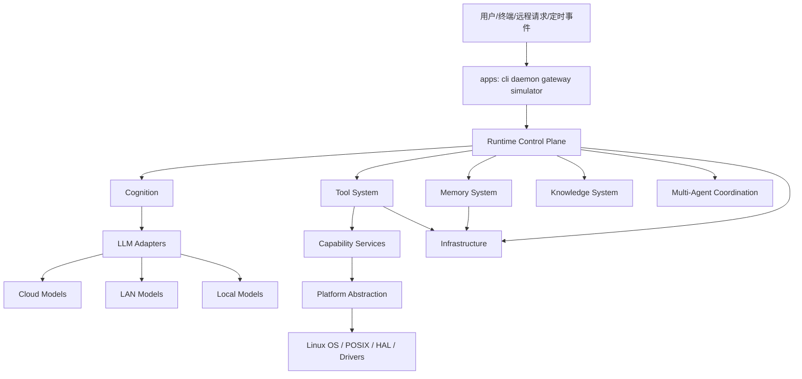
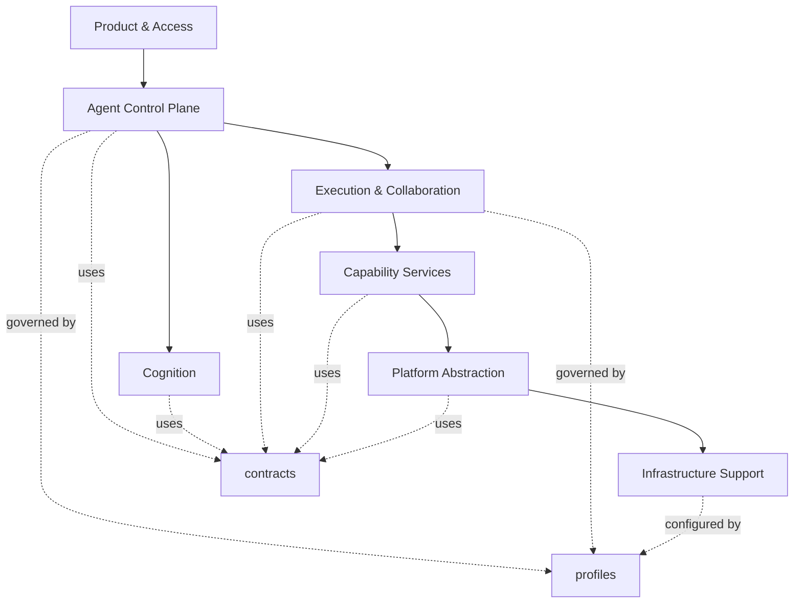
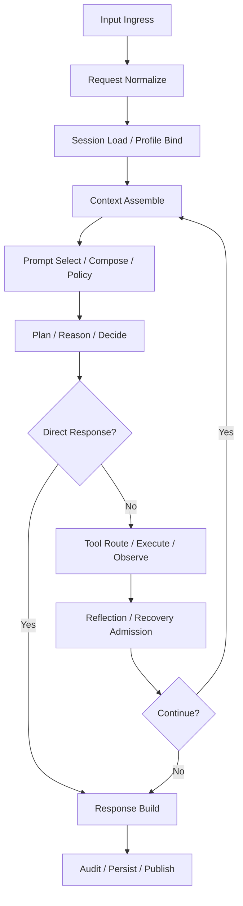

# DASALL 架构设计文档

## 文档信息

- 项目名称：DASALL Agent
- 版本：v2.0
- 日期：2026-03-28
- 文档负责人：架构组 / Agent 系统设计负责人
- 主要读者：架构师、开发团队、测试团队、平台团队、运维团队
- 文档状态：评审稿

## 目录

1. 引言
2. 背景与目标
3. 系统概览
4. 核心模块设计
5. Agent 模块设计
6. 接口设计
7. 构建与依赖管理
8. 跨平台兼容性
9. 安全与权限
10. 可观测性
11. 测试策略
12. 性能与资源分析
13. 部署与运维
14. 风险与替代方案
15. 合规与许可证
16. 附录

## 1. 引言

### 1.1 文档目的

本文档用于给出 DASALL Agent 系统的统一总架构设计基线，作为后续子系统详细设计、Build 落地、测试门禁和跨团队协作的统一依据。本文档不是某一子系统的实现说明，也不是原子任务拆解清单，而是回答以下问题：

1. DASALL 的整体系统边界、分层和控制权如何定义。
2. 各子系统、组件和共享契约如何划分与协作。
3. 已交付的 profiles、platform/linux、infrastructure 等详细设计如何回链到总架构。
4. 后续尚未展开的子系统详细设计应基于什么约束、接口和演进方向继续推进。

### 1.2 文档范围

本文档覆盖以下范围：

1. DASALL Agent 的总体分层架构、运行模型和工程映射。
2. contracts、runtime、cognition、llm、tools、memory、knowledge、services、multi_agent、platform、infra、profiles 等核心子系统。
3. CLI、daemon、gateway、simulator 等产品入口与接入形态。
4. 构建、测试、部署、运维、安全、可观测性、性能和演进约束。

本文档不展开以下实现细节：

1. 单个子系统内部类图、字段级 API 和逐文件设计。
2. 具体第三方库接入代码和板级驱动实现。
3. 原子开发任务与提交计划。

### 1.3 评审输入与依据

本文档综合以下已有材料形成：

1. 原始总架构文档中的分层、运行模型、工程蓝图与 ADR 基线。
2. 已交付详细设计中的冻结约束和 Design -> Build 映射。
3. SSOT 中已经冻结的并发策略与集成测试拓扑。
4. 当前仓库的实际目录、CMake 组织与测试入口。
5. C++/Agent 成熟实践中的可复用工程规律。

### 1.4 设计原则

本轮架构重构后的设计原则如下：

1. 控制权先于能力堆叠：Runtime 必须是主控平面，模型、工具、记忆、协同都是受控能力域。
2. 契约先于实现：跨模块共享对象和边界先冻结，再进入并行编码。
3. 治理先于直连：Prompt、Tool、MCP、恢复、诊断、升级都必须经过策略和审计链路。
4. 跨平台一致性优先：同一主流程跨 x86/ARM 复用，通过 Profile、Adapter 和平台能力表差异化。
5. 资源与故障可判定：预算、超时、熔断、降级、回滚和 LKG 必须是显式对象，而不是隐式分支。
6. 详细设计可追溯：总架构文档必须为子系统详细设计提供稳定上位约束和回链关系。

## 2. 背景与目标

### 2.1 项目背景

DASALL 面向跨平台 C++ Agent 系统的工程化落地，目标部署形态覆盖桌面、边缘、局域网、云协同和工厂测试场景。与仅做对话或单轮工具调用的简单 Agent 不同，DASALL 需要同时处理以下问题：

1. 多轮任务执行中的状态机推进、预算控制和恢复收敛。
2. 工具、MCP、记忆、知识检索和多 Agent 协同的统一编排。
3. Linux 平台能力与 ARM/x86 差异下的一致工程抽象。
4. 长时间运行、诊断、升级、安全、审计和可观测性的系统级约束。

旧版总架构文档内容丰富，但存在两个问题：

1. 章节结构与新的标准模板不一致，难以直接作为统一交付物。
2. 已交付子系统详细设计中的部分冻结结论，尚未被上提为总架构级基线。

因此需要形成一份新的、模板化且专业完整的总架构文档，既吸收旧文档内容，也显式吸收 ADR、SSOT 和已交付详细设计的架构约束。

### 2.2 业务与工程目标

系统总体目标如下：

1. 提供统一的 Agent 主控框架，支撑从接入、认知、执行到结果发布的完整闭环。
2. 支撑工具调用、知识检索、多 Agent 协同、外部执行控制与长期记忆沉淀。
3. 在桌面、边缘、工厂测试等场景下通过 Profile 实现同一主流程的能力裁剪。
4. 保证系统具备可测试、可观测、可恢复、可审计、可升级和可维护特性。

### 2.3 非功能目标

系统非功能目标定义如下：

1. 可维护性：模块边界清晰，详细设计可独立推进，公共契约不随实现漂移。
2. 可靠性：关键链路具备超时、重试、熔断、Checkpoint 和补偿能力。
3. 安全性：高风险动作必须被策略门控、确认和审计。
4. 可观测性：Logs、Metrics、Traces、Audit、Health 形成闭环。
5. 跨平台性：Linux 优先实现，兼顾 x86_64、aarch64、armv7/8 的演进路径。
6. 资源适配性：支持从 desktop_full 到 edge_minimal 的不同预算档位。

### 2.4 架构约束

系统当前必须遵守的硬约束如下：

1. contracts 共享对象默认保持向后兼容，破坏式修改必须经评审。
2. ContextOrchestrator、PromptComposer、ReflectionEngine、RecoveryManager、AgentOrchestrator、MultiAgentCoordinator 的边界以 ADR 为准。
3. 平台层和基础设施层不能反向依赖认知、业务或主控实现。
4. 当前仓库仍处于脚手架向实现过渡阶段，总架构必须兼容“先冻结、后落地”的推进方式。
5. 运行时能力必须遵循显式预算和停止条件，不能依赖隐式无限循环。

### 2.5 外部成熟实践吸收结论

本轮总架构设计吸收的成熟实践结论如下：

1. Agent 复杂度必须按需增加，优先采用简单、可组合的工作流和显式控制流，而不是一开始构建高度隐式的自治系统。
2. Orchestrator-workers 模式是复杂多文件、多步骤任务的稳定模式，但顶层编排权必须唯一。
3. Agent 需要从环境反馈中获得 ground truth，并通过检查点、停止条件和 guardrails 保持可控。
4. C++ 工程接口必须显式、强类型、资源自动管理、边界清晰，并避免隐藏依赖和循环库关系。
5. 并发设计应优先使用任务视角、RAII 锁管理、确定的锁顺序和最小共享写数据。
6. 可观测性必须统一 logs、metrics、traces 的上下文关联，而不是将日志当作唯一诊断手段。

## 3. 系统概览

### 3.1 系统定位

DASALL 是一个跨平台 C++ Agent 操作系统式框架，其定位不是单一产品，而是面向多入口、多部署形态的 Agent 运行底座。它由以下三个平面组成：

1. 产品接入平面：CLI、daemon、gateway、simulator 等应用入口。
2. Agent 控制平面：Runtime 主循环、预算、状态机、恢复、协同裁定。
3. 能力执行平面：LLM、Tools、Memory、Knowledge、Services、Platform、Infra。

### 3.2 系统上下文



### 3.3 架构风格

系统采用“分层架构 + 契约驱动 + 策略治理 + 事件/状态机控制”的组合风格，但其目标不是把系统描述得更抽象，而是让 Agent 从可用走向可控、可恢复和可演进。核心设计理念如下：

1. 分层解耦：控制、认知、执行、能力服务、平台抽象与基础设施分离，避免跨层耦合和隐式直连。
2. 契约驱动：先冻结 AgentRequest、GoalContract、Observation、Checkpoint、AgentResult 等共享对象，再进入模块并行实现。
3. 治理优先：Prompt 注入、工具执行、MCP 接入、恢复动作和诊断导出都必须经过策略门控和审计链路。
4. 运行可恢复：状态机、Checkpoint、补偿动作、失败收敛和 Resume 作为一等能力设计，而不是异常分支补丁。
5. 跨平台一致：x86 与 ARM 平台复用同一主流程，仅通过 Profile、Adapter 和 CapabilityRegistry 差异化。
6. 简单优先：优先采用可组合工作流和显式控制流，只在复杂任务场景下引入 orchestrator-workers、多 Agent 和高级恢复策略。

### 3.4 总体分层设计

系统采用七层逻辑分层，并以 contracts 与 profiles 作为跨层基础设施：

| 层级 | 名称 | 核心职责 | 主要工程落点 |
|---|---|---|---|
| Layer 7 | Product & Access Layer | 接收 CLI/HTTP/WebSocket/MQTT/定时事件，规范化请求并发布结果 | access/、apps/ |
| Layer 6 | Agent Control Plane | 主循环、FSM、预算、恢复、协同调度、Checkpoint | runtime/ |
| Layer 5 | Cognition Layer | 感知、规划、推理、反思、响应生成 | cognition/、llm/ |
| Layer 4 | Execution & Collaboration Layer | Tool、Memory、Knowledge、Multi-Agent Worker 协作 | tools/、memory/、knowledge/、multi_agent/ |
| Layer 3 | Capability Services Layer | 外部执行控制、业务服务、数据服务与统一能力封装 | services/ |
| Layer 2 | Platform Abstraction Layer | Linux/POSIX/HAL/线程/队列/文件/网络/IPC 抽象 | platform/ |
| Layer 1 | Infrastructure Layer | 配置、日志、审计、指标、追踪、健康、插件、OTA、安全 | infra/ |

跨层基础：

1. contracts/：共享对象、错误语义、任务/事件/工具/记忆/观察契约。
2. profiles/：Build 裁剪和 Runtime 策略的统一档位管理。

### 3.5 分层调用图



为了让分层视图可以直接映射到实现，本架构同时冻结一条运行时调用链，用于约束主流程中的治理顺序与模块归属：

1. Ingress Request -> Access Gateway / Request Normalizer。
2. Agent Orchestrator -> Session Load / Profile Bind / Budget Init。
3. Skill Router -> Context Orchestrator。
4. Prompt Registry / Prompt Composer / Prompt Policy。
5. Planner / Reasoner / ReflectionEngine。
6. Tool Route -> Tool Registry / Policy Gate / Executor 或 MCP Adapter。
7. Observation Digest -> Memory Writeback / Experience Writeback。
8. Response Builder -> Audit / Persist / Publish。

这条调用链表达的是控制顺序和治理归属，而不是线程或进程必须一一对应。任何部署形态都必须保持该逻辑顺序，禁止出现模型直连工具、工具绕过 Runtime、平台层直接承接业务主控等逆向设计。

### 3.6 子系统划分

本架构文档统一定义以下核心子系统：

1. Contracts 子系统。
2. Profiles 子系统。
3. Access 子系统。
4. Runtime 子系统。
5. Cognition 子系统。
6. LLM 子系统。
7. Tool 子系统。
8. Memory 子系统。
9. Knowledge 子系统。
10. Capability Services 子系统。
11. Multi-Agent 子系统。
12. Platform 子系统。
13. Infrastructure 子系统。

此外，总架构还必须显式识别以下跨域能力，它们不一定独立成顶层目录，但在详细设计中必须有稳定归属：

1. Execution Control：统一承接外部执行目标控制和高风险动作语义；在工程归属上不再单列为独立顶层目录，而是作为 Capability Services 子系统中的一级能力子域，由 Runtime 持有准入与停止条件，services 持有执行语义与稳定服务接口，platform 持有具体平台/协议适配。
2. Communication：统一识别 Access、Service、Field、LLM 四类通信通道，但不单列为独立顶层工程目录，也不形成第二套通信主控平面。其承接关系固定为：Access Channel 归 Access 子系统，负责产品入口协议适配与结果发布；LLM Channel 归 LLM 子系统，负责 Cloud/LAN/Local provider 协议适配、路由与发送前治理；Service Channel 由 Capability Services 子系统持有命令、查询、订阅等服务语义边界，由 Platform 子系统持有 IPC/网络传输与句柄事实；Field Channel 归 Platform 子系统及后续 HAL 子域，负责 UART/GPIO/I2C/SPI/CAN 等现场 I/O 与驱动接入。Runtime 只持有调用顺序、deadline、取消、降级和背压治理，不新增 communication/ 形式的独立模块。
3. Task：统一承接异步任务生命周期、租约、取消、重试和等待态管理。

Task owner 矩阵按以下口径冻结：

| Task 控制点 | Runtime | Multi-Agent | Services | Contracts | 唯一 Owner | 说明 |
|---|---|---|---|---|---|---|
| SessionTask / StepTask 生命周期推进、等待态与终止条件 | Owner | Support | No | Freeze | Runtime | 包括 created/running/waiting/completed、cancel/retry/timeout/resume 准入 |
| WorkerTask 拆分、SubTaskGraph 构建与局部 patch | Support | Owner | No | Freeze | Multi-Agent | 仅协同子图；不得改写顶层 Session/FSM 主控 |
| WorkerLease 分配、续租与回收 | Recheck | Owner | No | Freeze | Multi-Agent | Runtime 只校验全局预算、并发阈值和 stop condition |
| 执行事实、进度事件与 side-effect 回报 | Observe | Support | Owner | No | Services | 只报告 execution facts / progress，不推进顶层 TaskState |
| TaskRequest、TaskState、WorkerLease、SubTaskGraph 共享边界 | Consume | Consume | Consume | Owner | Contracts | contracts 负责字段语义、命名稳定性与兼容性冻结 |

这三个子域是最容易在实现阶段被“下沉消失”的部分，因此在本版总架构中明确保留为 Runtime、Services、Platform、Multi-Agent 详细设计的上位约束。

其中需要特别说明的是：原始架构文档中的“Execution Control 子系统”在本版整理中并未删除，而是采用“Capability Services 顶层子系统 + Execution Control 一级子域”的表达方式收敛。这样做的目的是让目录命名与工程落点保持一致，同时保留 Execution Control 作为高风险执行能力域的架构可见性。

同样地，原始架构文档中的“Task 子系统”在本版整理中也并非被删除，而是改写为跨域能力表达：当前工程并不存在独立的 task/ 顶层目录，任务的生命周期推进、等待态、取消、重试、租约、超时与队列治理本质上属于 Runtime Control Plane；WorkerTask、WorkerLease、SubTaskGraph 等对象则由 Multi-Agent、Tool 和 services 场景按需消费。只有当 Task 在工程上形成独立目录、稳定接口和详细设计闭环时，才适合重新提升为顶层工程子系统。

### 3.7 技术选型与理由

| 类别 | 当前选型 | 理由 | 备选/备注 |
|---|---|---|---|
| 语言标准 | C++20 | 满足现代 C++ 接口、并发和类型系统要求 | 不降级到 C++17 |
| 构建系统 | CMake 3.16+ | 与当前仓库组织一致，跨平台友好 | 未来可补充 Presets |
| 构建生成器 | Ninja 优先 | CI 和本地构建速度稳定 | Make/IDE 生成器可兼容 |
| 第三方解析策略 | submodule > local cache > FetchContent | 保持离线和可重复配置优先 | 当前由 cmake/DASALLThirdParty.cmake 管理 |
| 测试框架 | CTest 统一入口 | 已具备 unit/contract/integration 标签化执行能力 | 测试框架实现细节后续细化 |
| 观测语义 | Logs + Metrics + Traces + Audit | 支撑长期运行、故障诊断和合规要求 | OTel 作为目标语义参考 |
| 部署形态 | desktop/cloud/LAN/edge/factory profile | 与资源约束和产品形态匹配 | 由 profiles 管理 |

### 3.8 系统边界

系统边界定义如下：

1. DASALL 负责请求接入、认知决策、能力编排、运行控制和结果发布。
2. DASALL 不直接把 LLM 视为主控制器，模型只输出认知意图和结构化结果。
3. DASALL 通过 services/platform 与外部系统、系统资源和驱动交互，而不是跨层直连。
4. 外部模型、知识库、执行目标、插件包、升级包、远程诊断端都属于外部依赖域。

在上述边界之下，还需要冻结一组跨模块共享的核心契约，避免各子系统重复发明输入输出对象：

1. AgentRequest：统一入口对象，包含 request_id、session_id、actor、trace_context 和附件。
2. GoalContract：冻结目标、成功判据、约束、预算和审批策略，避免模块从自然语言中反复猜测。
3. Observation：统一折叠工具结果、检索结果、人工反馈和子 Agent 输出。
4. ErrorInfo：统一表达 failure_type、retryable、safe_to_replan、details、source。
5. Checkpoint：统一表达当前状态、step_id、working_memory_snapshot、retry_counters、pending_action。
6. ContextPacket：统一表达 user_turn、recent_history、summary_memory、retrieval_evidence、active_tools、policy_digest、token_budget_report。
7. PolicyDecision、ReflectionDecision、CompensationAction：分别承载策略裁定、失败语义建议和补偿动作语义。

总架构级要求是：主流程和异常流程必须使用同一套契约；Multi-Agent 输出和 Tool 输出必须最终汇聚为统一 Observation 和 AgentResult；任何 provider payload、rendered prompt、Linux FD 或驱动句柄都不得直接泄漏进 contracts。

## 4. 核心模块设计

### 4.1 Contracts 子系统

#### 4.1.1 目标与职责

contracts 是 DASALL 的共享语义基线，负责冻结跨模块共享对象、错误语义和接口边界。其核心目标是避免“每个子系统定义自己的一套请求/结果/错误/状态对象”。

#### 4.1.2 核心对象分组

| 对象域 | 核心对象 |
|---|---|
| 请求与结果 | AgentRequest、AgentResult、GoalContract |
| 观察与错误 | Observation、ObservationDigest、ErrorInfo、ResultCode |
| 记忆与上下文 | ContextPacket、BeliefState、Session、Turn |
| 任务与协同 | TaskRequest、TaskState、WorkerTask、WorkerLease、SubTaskGraph、MultiAgentRequest、MultiAgentResult |
| 恢复与检查点 | Checkpoint、ResumeToken、ReflectionDecision、RecoveryOutcome、CompensationAction |
| 工具与策略 | ToolRequest、ToolResult、PolicyDecision、PromptComposeRequest、PromptComposeResult |

#### 4.1.3 架构级约束

1. contracts 只表达共享语义，不承载平台私有或实现私有细节。
2. 不允许把 provider payload、rendered prompt、Linux FD、驱动句柄等实现对象写入 contracts。
3. 任何 breaking change 默认禁止，除非评审明确接受并同步所有依赖方。
4. 多 Agent 子任务对象必须与顶层 Session/FSM 语义分层。

#### 4.1.4 对后续详细设计的输入

contracts 子系统详细设计必须至少继续冻结以下内容：

1. 核心对象字段级语义。
2. 错误码域与通用 ResultCode 映射规则。
3. 事件、检查点、恢复、任务图与审计引用的一致命名。
4. TaskRequest、TaskState、WorkerLease、SubTaskGraph 的共享边界与版本演进规则。

### 4.2 Profiles 子系统

#### 4.2.1 目标与职责

profiles 不是简单的编译宏集合，而是 DASALL 的双平面治理机制：

1. Build 平面：决定模块启停、适配器选择、测试标签和构建矩阵。
2. Runtime 平面：决定模型路线、Prompt 策略、工具可见性、能力缓存、预算、降级和运维策略。

#### 4.2.2 核心组件

| 组件 | 职责 |
|---|---|
| ProfileCatalog | 管理 ProfileDescriptor 和资产发现 |
| BuildProfileResolver | 生成 BuildProfileManifest 和模块启停矩阵 |
| RuntimePolicyProvider | 生成不可变 RuntimePolicySnapshot |
| ProfileOverlayComposer | 合并 Profile、部署和运行时 override |
| ProfileCompatibilityValidator | 校验平台、模块、适配器和 schema 一致性 |
| LastKnownGoodStore | 保存最近一次通过校验的快照 |
| ProfileTelemetryAdapter | 输出 profile 激活/拒绝/回退相关观测事件 |

#### 4.2.3 架构级冻结结论

1. Profile 采用“集中式 Profile Catalog + 双阶段解析”方案。
2. enabled_modules 为唯一稳定真源，adapter 能力由 BuildResolver 派生，不单独让 YAML 持有第二套命名表。
3. 覆盖层固定为 defaults < profile < deployment_override < runtime_override。
4. override 输入必须是带来源、作用域、TTL、base_version 的 typed patch，而不是自由字典。
5. 运行时覆盖只能收紧高风险策略，不得放宽确认门槛和审计等级。

#### 4.2.4 参考档位

| Profile | 主要意图 |
|---|---|
| desktop_full | 完整能力、多模型路由、完整观测、多 Agent 开启 |
| cloud_full | 云模型优先、完整能力、运维增强 |
| edge_balanced | LAN 主路、云回退、受控工具并发 |
| edge_minimal | 本地轻量模型、精简工具、最小观测 |
| factory_test | 诊断增强、执行链路保留、审计增强 |

#### 4.2.5 对后续详细设计的输入

profiles 详细设计应继续以已交付文档为准，并作为以下章节的来源：

1. 构建矩阵与档位策略。
2. runtime_policy.yaml 的 schema_version 与逻辑域。
3. LKG 回退和 overlay 准入机制。

### 4.3 Access 子系统

#### 4.3.1 职责

Access 子系统负责所有产品入口的统一接入与出站发布：

1. 接收 CLI、daemon、gateway、simulator 等不同入口的请求。
2. 执行协议转换、认证鉴权、幂等和输入归一化。
3. 生成 request_id、session_id、trace_id。
4. 将入口数据统一折叠为 AgentRequest。
5. 工程上由 `access/` 承载共享 access core，由 `apps/*` 承载入口壳层与装配。

#### 4.3.2 核心组件

| 组件 | 职责 |
|---|---|
| ProtocolAdapter | 处理不同入口协议适配 |
| AuthMiddleware | 认证、鉴权、角色判定 |
| RequestNormalizer | 入站请求归一化 |
| StreamGateway | 流式响应和发布 |
| AccessGatewayFacade | 对 Runtime 暴露统一入口 |

#### 4.3.3 关键约束

1. Access 只做接入和发布，不持有主控状态机。
2. 用户态和远程态的权限差异必须在 Access 侧形成初始主体信息。
3. 任何产品入口都不能绕过 Runtime 主控直接触发底层执行。
4. Access 是 Access Channel 的唯一 owner，不承接 Service Channel、Field Channel 或 LLM Channel 的内部传输协议职责。

### 4.4 Runtime 子系统

#### 4.4.1 目标与职责

Runtime 是 DASALL 的 Agent Control Plane，是整个系统的唯一主控中心，负责：

1. Agent 主循环和 FSM 状态推进。
2. Session、Task、Budget、StopCondition 管理。
3. Cognition、Tool、Memory、Knowledge、Multi-Agent 的编排顺序。
4. Timeout、Retry、Circuit Breaker、Degrade、Checkpoint、Recovery。
5. Human-in-the-loop 场景下的澄清和确认等待态。

#### 4.4.2 核心组件

| 组件 | 职责 |
|---|---|
| AgentOrchestrator | 顶层请求生命周期控制 |
| SessionManager | 会话加载、恢复、持久化 |
| Scheduler | 主循环调度和事件驱动 |
| BudgetController | 回合、工具、时延、token、并发预算 |
| CheckpointManager | 顶层检查点与恢复入口 |
| RecoveryManager | 恢复准入裁定、顺序编排与失败收敛 |
| RuntimeEventBus | 事件总线与状态推进 |

#### 4.4.3 架构级冻结结论

1. AgentOrchestrator 拥有全局请求生命周期和最终输出权。
2. RecoveryManager 拥有恢复准入、顺序、停止与失败收敛裁定权；具体补偿动作仍经 Tool/Service 受控链路执行。
3. Runtime 是多 Agent 模式的进入/退出裁定者，任何 Worker 不直接面向用户。
4. Runtime 不直接承担 LLM 消息装配，也不直接承担平台私有能力实现。
5. Runtime 是 SessionTask / StepTask 生命周期、等待态、取消、超时、重试与 resume 准入的唯一 owner。

#### 4.4.4 设计基线

Runtime 需要显式维护以下对象：

1. RuntimeBudget。
2. StopConditions。
3. RuntimeState。
4. CheckpointRef。
5. RecoveryOutcome。

#### 4.4.5 对后续详细设计的输入

runtime 详细设计必须以上述控制权边界为基线，避免出现第二个顶层 orchestrator 或认知/恢复双重拍板。

### 4.5 Cognition 子系统

#### 4.5.1 目标与职责

Cognition 负责“理解、规划、决策、反思、生成”五段认知链路，是 Runtime 的受控认知引擎，而不是系统主控者。

#### 4.5.2 核心组件

| 组件 | 职责 |
|---|---|
| PerceptionEngine | 提取意图、约束、目标 |
| Planner | 生成计划图和依赖关系 |
| Reasoner | 基于上下文和观察决定下一步动作 |
| ReflectionEngine | 失败归因和策略建议 |
| ResponseBuilder | 生成用户回复和结构化结果 |

#### 4.5.3 架构级冻结结论

1. Cognition 只消费 ContextPacket 与 Observation，不直接接触 Tool Executor 或平台句柄。
2. ReflectionEngine 只输出语义级建议，不直接执行 retry、resume、compensation。
3. Planner/Reasoner 必须基于 GoalContract、BeliefState 和 Observation，而不是只看最近输入。
4. Cognition 输出必须包含 confidence、clarification_needed、replan_hint、skill_switch_hint 等自评信号。

### 4.6 LLM 子系统

#### 4.6.1 目标与职责

LLM 子系统负责屏蔽模型部署位置和厂商协议差异，并提供统一的 Prompt 资产选择、消息装配和模型调用接口。

#### 4.6.2 核心组件

| 组件 | 职责 |
|---|---|
| LLMManager | 模型调度和统一入口 |
| ModelRouter | stage -> model_route 决策 |
| PromptRegistry | PromptSpec / PromptRelease 管理 |
| PromptComposer | 消息装配 |
| PromptPolicy | 发送前治理 |
| Cloud/LAN/Local Adapter | 不同模型路径的协议适配 |

#### 4.6.3 架构级冻结结论

1. ContextOrchestrator 负责语义上下文编排，PromptComposer 负责模型消息装配。
2. PromptPolicy 只做发送前治理，不负责检索、排序和二次上下文主控。
3. LLM 输出统一映射为 direct response、tool intent、clarification、replan suggestion 四类语义结果。
4. ModelRoute 必须显式记录 stage、主路、fallback 和 streaming 策略。
5. LLM 子系统是 LLM Channel 的唯一 owner；provider 协议适配、流式/非流式调用与 Cloud/LAN/Local 端点差异都在 llm 内部收敛，Runtime 不直连 provider SDK。

### 4.7 Tool 子系统

#### 4.7.1 目标与职责

Tool 子系统负责把认知输出的动作意图转化为可治理、可执行、可补偿、可审计的工具执行链路。

#### 4.7.2 核心组件

| 组件 | 职责 |
|---|---|
| ToolRegistry | 工具定义、schema、版本、风险分级 |
| Validator | 参数和输入校验 |
| PolicyGate | 权限、风险和确认门控 |
| ToolExecutor | 工具落地执行 |
| WorkflowEngine | 跨工具编排 |
| CompensationManager | 补偿计划编排、结果记录和 Runtime 裁定请求桥接 |
| ToolAudit | 执行前后审计 |
| MCPAdapter | 远程能力发现和协议桥接 |
| CapabilityDiscovery / Cache | 动态能力快照发现和缓存 |

#### 4.7.3 架构级冻结结论

1. Tool Schema、Function Calling、Tool IR 三层必须分离。
2. 工具调用必须经过 Validator -> PolicyGate -> Executor -> Audit 完整链路。
3. 所有带副作用工具必须定义幂等性和补偿语义。
4. MCP 是能力接入协议层，而不是第二套认知系统。
5. Function Calling 与 MCP 采用混合路由，选择由 ToolRoute 和策略决定。
6. CompensationManager 只组织补偿计划并请求 Runtime/RecoveryManager 裁定，不得绕过 services 直接执行补偿动作。

#### 4.7.4 Skill 与 MCP 兼容性冻结结论

1. Skill 和 MCP 都归属于 Tool 子系统治理域，不得形成第二套主控平面。
2. DASALL 支持构建与 Claude / GitHub Copilot 类似的任务级 Skill 资产能力，但外部 Skill 包只可作为导入方言；其 `.github/skills/`、`.claude/skills/` 等格式必须先归一化为内部 SkillSpec，才能进入 SkillRouter、ToolRegistry、PromptRegistry 和 PolicyGate 治理链路。
3. 因此，总架构冻结的是兼容演进目标，而不是当前代码基线已直接兼容外部 Skill 包的承诺。
4. MCP 的公共产品面始终是内部 Tool Schema、ToolResult 和 ErrorInfo；MCP 协议细节收口在 MCPAdapter、CapabilityDiscovery / Cache 和 ToolRoute 内部。
5. 总架构接受通用 MCP server 作为能力来源，但前提是完成 discovery、binding、缓存、健康检查、错误映射和混合路由闭环；在该闭环未落地前，不应对外宣称 generic MCP 已直接可用。
6. 后续详细设计与 Build 落地至少应补齐：external skill importer、frontmatter 与 description mapping、SkillRegistry、SkillRuntime、MCPToolBinding、CapabilityDiscovery、CapabilityCache、ToolRoute、统一审计与恢复收敛。
7. 若当前仓库实现仍以占位骨架为主，则评审结论应明确标记为“架构 ready / 实现 not ready”，避免将设计上限误写为已交付能力。

### 4.8 Memory 子系统

#### 4.8.1 目标与职责

Memory 子系统负责记忆分层、上下文装配、历史压缩、事实写回和经验沉淀。

#### 4.8.2 核心组件

| 组件 | 职责 |
|---|---|
| WorkingMemory | 当前任务黑板 |
| SessionStore | 会话与 turn 历史 |
| SummaryMemory | 摘要与压缩结论 |
| LongTermMemory | 长期事实和偏好 |
| ExperienceMemory | 失败、恢复、经验沉淀 |
| ContextOrchestrator | 语义上下文编排 |
| CompressionEngine | 历史压缩和预算裁剪 |

#### 4.8.3 架构级冻结结论

1. Memory 负责 ContextPacket 生产，不生产 provider-specific messages。
2. ContextPacket 只承载语义上下文，不承载最终消息层字段。
3. SummaryMemory 必须保留 confirmed_facts、open_questions、pending_actions，而不是只压缩聊天文本。
4. 任何新事实写回都必须显式处理冲突和置信度。

### 4.9 Knowledge 子系统

#### 4.9.1 目标与职责

Knowledge 子系统负责检索、重排、证据组装和索引新鲜度治理，为 Cognition 和 ContextOrchestrator 提供可信证据，而不是直接输出最终回答。

#### 4.9.2 核心组件

| 组件 | 职责 |
|---|---|
| Retriever | 召回候选知识 |
| Reranker | 相关性重排 |
| EvidenceBuilder | 证据包组装 |
| IndexManager | 索引构建与新鲜度管理 |

#### 4.9.3 关键约束

1. Knowledge 输出必须是 RetrievalResult 或 EvidenceBundle，而不是未治理的原始数据源对象。
2. 检索失败不应直接导致系统崩溃，而应进入“证据不足”语义分支。

### 4.10 Capability Services 子系统

#### 4.10.1 目标与职责

services 子系统负责承接 Tool 子系统背后的统一能力服务，屏蔽外部执行控制、业务服务、系统服务和数据服务的实际实现。

本节对应原始架构中的 Capability Services Layer。原始文档单列的 Execution Control 子系统，在本版中收敛为 services 内部最关键的一级能力子域，用于承接外部执行目标控制和高风险动作落地。

#### 4.10.2 核心组件

| 组件 | 职责 |
|---|---|
| IExecutionService | 对 Tool 暴露 execute/query_state/subscribe/diagnose 公共 ABI |
| IDataService | 对 Tool 暴露 data query 与 capability catalog 公共 ABI |
| ServiceFacade | services 内部组合根，实现 IExecutionService / IDataService |
| AdapterBridge | 对接平台、远程服务和本地服务 |

#### 4.10.3 与原始 Execution Control 的关系

Capability Services 与原始 Execution Control 的关系需要按“能力域”与“工程模块”两层来理解：

| 原始文档术语 | 本版归属 | 澄清 |
|---|---|---|
| Execution Control 子系统 | services 内一级能力子域 | 保留外部执行控制语义，但不再以独立顶层目录表达 |
| Execution Service | services/ 核心组件 | 统一暴露 execute/query/subscribe/diagnose 等执行能力入口 |
| Device Service / 本地执行器 / 远程执行代理 | AdapterBridge 后端实现 | 只是执行目标适配形态，不改变上层语义边界 |

这一定义下，控制权切分固定如下：

1. Runtime 持有调度、预算、deadline、取消、重试、恢复、全局停止/降级与补偿裁定权。
2. Tool 持有单次调用的校验、权限与确认门控，并把动作意图变成受治理的服务调用。
3. services 负责把统一动作语义映射为稳定服务接口，并选择本地、远程或平台适配后端。
4. platform 只负责 OS、驱动、协议和句柄层事实，不拥有业务级确认、审批或恢复裁定。
5. Infra 负责对高风险动作提供审计、日志、指标和诊断支撑。

因此，Execution Control 不是与 Capability Services 平级的第二套主控或第二个 services，而是 Capability Services 内最需要被显式命名保留的高风险能力子域。

#### 4.10.4 关键约束

1. Tool 不直接触达 platform 和驱动。
2. services 不拥有 Runtime 状态机和认知决策权。
3. 高风险动作的真实执行必须通过 IExecutionService 公共 ABI 与审计链路进入 services；ServiceFacade 保持内部实现。
4. Confirmation、审批、熔断准入和停止条件由 Runtime/Tool 治理链路持有，不下沉到 services。
5. services 可以对外提供执行、查询、订阅和诊断接口，但不得演化为独立主控平面。
6. Service Channel 采用“services 持服务语义、platform 持传输事实”的分层；消息 framing、命令/查询/订阅语义和资源编目不下沉到 platform。
7. services 只报告执行事实、进度事件和 side-effect 结果，不推进顶层 TaskState，也不拥有 task master。

#### 4.10.5 单一控制矩阵（组件级）

以下矩阵是总架构冻结口径；runtime、tools、services 详细设计只能细化，不得改写唯一 owner 或把 owner 拆成多个并列决策者。

| 控制点 | Validator | Policy Gate | Service | Adapter | RecoveryManager | 唯一决策者 | 说明 |
|---|---|---|---|---|---|---|---|
| 参数结构合法性、默认值注入、字段归一化 | Owner | Recheck | Recheck | No | No | Validator | Service 只能拒绝不满足 ServiceTypes 合同的不变量 |
| 权限、风险等级与确认门控 | Recheck | Owner | Recheck | No | No | Policy Gate | Service 只允许 recheck confirmation proof、caller domain 与 action class 是否一致 |
| 语义路由与等价后端选择 | No | Recheck | Owner | Recheck | No | Service | Policy Gate 只能约束允许的 target / route class，不直接选具体 adapter |
| 传输可达性与协议执行 | No | No | Recheck | Owner | No | Adapter | Service 只 recheck deadline、idempotency 与 route contract；不能替 Adapter 伪造 transport 成功 |
| 取消、停止与失败收敛 | No | No | Recheck | Recheck | Owner | RecoveryManager | Service/Adapter 只消费 cancel token 并回报当前执行状态 |
| 是否触发补偿 | No | Recheck | Recheck | No | Owner | RecoveryManager | Tool/Runtime 决定是否进入补偿；Service 只校验 source_execution_id、幂等键与动作语义 |
| 是否局部重试或进入全局 fallback | No | No | Recheck | Observe | Owner | RecoveryManager | Service 只能提供 retryable、route equivalence 与 side_effect 事实，不能自发重试高风险动作 |
| 订阅重同步与游标续传 | No | No | Owner | Recheck | Observe | Service | resync_required 由 Service/SubscriptionHub 统一给出；Adapter 只报告序号缺口或源端断流事实 |

#### 4.10.6 控制权矩阵（子系统级）

| 控制面能力 | Runtime | Tool | Service | 唯一 Owner | 约束 |
|---|---|---|---|---|---|
| 调度与执行顺序 | Owner | Support | No | Runtime | Tool 不自带第二套全局 scheduler；Service 不拥有主循环 |
| 校验 | No | Owner | Recheck | Tool | Tool 负责 ToolRequest/ToolIR 校验；Service 只校验 ServiceTypes 合同不变量 |
| 确认与审批门控 | Support | Owner | Recheck | Tool | Policy Gate 是唯一 allow/deny/require_confirmation 决策点；Service 只校验 proof 与 caller domain 一致性 |
| deadline / timeout | Owner | Support | Recheck | Runtime | Runtime 生成 deadline；Service 只能在不放宽上界的前提下切分局部 adapter timeout |
| 重试 | Owner | No | Recheck | Runtime | Service 只能返回 retryable 事实，不能自发重试高风险动作 |
| fallback / 降级裁定 | Owner | Support | Recheck | Runtime | 是否进入 fallback 由 Runtime 判定；Service 只允许在授权范围内做语义等价 route 选择 |
| 语义等价 route 选择 | No | Recheck | Owner | Service | 具体 adapter 选择由 Service/AdapterRouter 决定，但不得越过 Runtime 给定的 fallback envelope |
| 全局并发预算与取消传播 | Owner | Support | Recheck | Runtime | Runtime 控制全局并发与 cancel token；Service 只负责 lane-local backpressure |
| 补偿裁定 | Owner | Support | Recheck | Runtime | 是否补偿、补偿顺序与何时停止由 Runtime/RecoveryManager 决定 |
| 补偿动作执行 | No | No | Owner | Service | Service 是补偿动作的唯一执行面，但不是补偿是否发生的决策者 |

### 4.11 Multi-Agent 子系统

#### 4.11.1 目标与职责

Multi-Agent 子系统负责协同子域编排与 Worker 管理，用于在复杂任务下把一个顶层目标拆解为多个受控子任务。

#### 4.11.2 核心组件

| 组件 | 职责 |
|---|---|
| MultiAgentCoordinator | 子任务图编排和结果汇聚 |
| AgentRegistry | Worker 能力匹配 |
| ResultMerger | 合并多 Worker 输出 |
| WorkerAgent | 受租约控制的执行单元 |
| LeaseManager | WorkerTask / WorkerLease 管理 |

#### 4.11.3 架构级冻结结论

1. AgentOrchestrator 拥有全局任务生命周期和最终响应权。
2. MultiAgentCoordinator 只拥有协同子图的局部编排权。
3. WorkerTask 与顶层 Session/FSM/Checkpoint 语义必须分层。
4. MultiAgentCoordinator 的返回值是协同结果，不是最终 AgentResult。
5. SubTaskGraph 与 WorkerLease 归 Multi-Agent 子域 owner；其创建、分配、续租与回收受 Runtime 全局预算和 stop condition 约束。

### 4.12 Platform 子系统

#### 4.12.1 目标与职责

platform 子系统负责 Linux/POSIX/HAL 抽象和跨平台能力切片，实现对线程、队列、定时器、文件、网络、IPC 和 HAL 的统一封装。

#### 4.12.2 核心组件

| 组件 | 职责 |
|---|---|
| LinuxPlatformFactory | 统一平台装配和能力探测 |
| CapabilityRegistry | 平台能力集和降级状态记录 |
| PosixThreadProvider | 线程能力封装 |
| PosixTimerProvider | 定时器能力封装 |
| BlockingQueueProvider | 平台队列基元 |
| LinuxFileSystemProvider | 文件系统能力 |
| LinuxNetworkProvider | 网络能力 |
| UnixIpcProvider | 本地 IPC 能力 |
| HalAvailabilityBridge | HAL 可用性桥接 |
| PlatformHealthCollector | 平台健康快照 |

#### 4.12.3 架构级冻结结论

1. 采用“能力切片适配器 + LinuxPlatformFactory + CapabilityRegistry”方案。
2. platform/linux 只提供平台事实和句柄语义，不做业务级重试与恢复裁定。
3. epoll -> poll/select fallback 只允许在初始化阶段触发，不允许运行期隐式切后端。
4. HAL 首版只冻结 availability probe，不冻结完整 GPIO/UART/I2C/SPI/CAN 驱动接口。
5. 平台配置只消费 Boot 合并后的 PlatformInitConfig，不自行解析 profile 文件。
6. Platform 是 Field Channel 与 Service Channel 底层传输事实的 owner，负责 network/IPC/HAL/I/O provider；但不拥有业务命令路由、审批、会话状态或恢复裁定。

### 4.13 Infrastructure 子系统

#### 4.13.1 目标与职责

Infrastructure 子系统是 DASALL 的系统治理底座，负责日志、审计、指标、追踪、配置、密钥、安全策略、健康检查、诊断、插件和 OTA。

#### 4.13.2 核心组件

| 组件 | 职责 |
|---|---|
| InfraServiceFacade | 生命周期统一入口 |
| LoggingService | 结构化日志 |
| AuditService | 审计记录和导出 |
| TracingService | 追踪上下文与 span |
| MetricsService | 指标采集和导出 |
| ConfigCenter | 四层配置合并与热更新 |
| SecretManager | 密钥和凭证治理 |
| SecurityPolicyManager | 策略快照与回滚 |
| DiagnosticsService | 诊断命令与证据快照 |
| HealthMonitor | liveness/readiness/degraded 判定 |
| WatchdogAgent | 心跳和超时监测 |
| OTAManager | 升级和回滚 |
| PluginManager | 插件发现、校验、装载 |

#### 4.13.3 架构级冻结结论

1. 采用“分层异步基础设施”方案，而不是单块 God Service。
2. AuditService、PluginManager、SecurityPolicyManager、DiagnosticsService 应作为优先独立组件。
3. ConfigCenter 四层来源固定为 defaults、profile、deployment_override、runtime_override。
4. 审计事件不可静默丢失，失败必须可观测。
5. 对 profiles 侧暴露的观测 sink v1 仅冻结 ILogger 和 IAuditLogger。

### 4.14 子系统与详细设计关联

总架构与已交付详细设计的关联如下：

| 子系统/模块 | 当前详细设计状态 | 在本总架构中的作用 |
|---|---|---|
| profiles | 已交付 | 提供 Build/Runtime 双平面治理基线 |
| llm | 已交付 | 提供 LLM Channel 的 provider 协议适配、模型路由、Prompt 治理与统一调用基线 |
| capability services | 已交付 | 提供 Service Channel 的服务语义、AdapterBridge 与执行/查询/订阅边界基线 |
| platform/linux | 已交付 | 提供 Linux 平台抽象、能力切片与 HAL 探测基线 |
| infrastructure | 已交付 | 提供系统治理、配置、审计、诊断、插件、OTA 基线 |
| infra 子组件专项设计 | 已交付多份 | 作为 infrastructure 子域实现展开依据 |
| access | 已交付 | 承接 Access Channel 的入口协议适配、认证鉴权、归一化与结果发布详细设计，详见 [DASALL_access子系统详细设计.md](DASALL_access子系统详细设计.md) |
| 其余子系统 | 待展开 | 以本总架构的边界、对象和章节为设计输入 |

就 Communication 这一跨域能力而言，当前并不存在也不应新增独立的“Communication 子系统详细设计”文档。已交付设计中的承接关系为：Access 子系统详细设计负责 Access Channel；LLM 子系统详细设计负责 LLM Channel；Capability Services 子系统详细设计负责 Service Channel 的服务语义；platform/linux 详细设计负责 network/IPC provider，并为 Field Channel 提供 HAL bridge 基线。当前尚未完全覆盖的部分主要集中在 UART/GPIO/I2C/SPI/CAN 等完整现场总线与驱动语义，仍待后续 platform/arm/hal 详细设计展开，目前仅冻结到能力探测和受控接入边界。

## 5. Agent 模块设计

### 5.1 Agent 运行闭环

DASALL Agent 的标准运行闭环如下：



### 5.2 Agent 组件协作

Agent 组件协作不能只理解为模块列表，而应理解为谁拥有控制权、谁输出什么、谁依赖什么。核心协作关系如下：

| 模块 | 职责 | 输入 | 输出 | 关键依赖 |
|---|---|---|---|---|
| AgentFacade | 对外统一暴露 handle_input / resume / stop | AgentRequest | AgentResult | AgentOrchestrator |
| AgentOrchestrator | 顶层请求生命周期和最终输出权 | AgentRequest, RuntimeEvent | RuntimeDecision, AgentResult | SessionManager, Scheduler |
| SessionManager | 会话生命周期和恢复 | Request, Event | SessionContext | Memory |
| SkillRouter | 基于目标和上下文选择 SkillProfile | AgentRequest, SessionContext | SkillProfile | Policy, Memory |
| ContextOrchestrator | 检索、筛选、压缩、预算裁剪和上下文装配 | ContextAssembleRequest | ContextAssembleResult | Memory, Knowledge |
| Planner | 生成任务计划图 | GoalContract, ContextPacket | PlanGraph | LLM |
| Reasoner | 决定下一步动作 | PlanGraph, Observation | ActionDecision | LLM |
| ReflectionEngine | 分析失败语义并给出建议 | Observation, ErrorInfo | ReflectionDecision | Planner |
| PromptRegistry / Composer / Policy | Prompt 资产选择、消息装配、发送前治理 | PromptQuery, ContextPacket | PromptComposeResult, PromptPolicyDecision | Profile, Config |
| ToolManager | 工具治理与执行 | ToolCallIntent | ToolResult | Registry, PolicyGate, Executor |
| CapabilityDiscovery / Cache | MCP tools/resources/prompts 发现与缓存 | MCPServerSpec | CapabilitySnapshot | MCP Adapter |
| MultiAgentCoordinator | 子任务图编排、Worker 租约与结果汇聚 | Goal, Plan | SubTaskResult | AgentRegistry |
| ResponseBuilder | 汇总结果并生成最终回复 | Context, Plan, Observation | AgentResult | Template / LLM |

这里有三个必须坚持的控制边界：

1. AgentOrchestrator 拥有顶层主循环、用户交互和最终输出权。
2. MultiAgentCoordinator 只拥有协同子域编排权，不拥有第二套顶层主控权。
3. ContextOrchestrator 负责语义上下文编排，PromptComposer 负责模型消息装配，两者不得混用。

### 5.3 状态机设计

系统核心状态机定义如下：

| 状态 | 说明 |
|---|---|
| Idle | 空闲态 |
| Receiving | 接收和归一化请求 |
| Planning | 目标抽取与建图 |
| Reasoning | 认知推理 |
| WaitingClarify | 等待用户澄清 |
| WaitingConfirm | 等待高风险确认 |
| ToolCalling | 工具或服务调用中 |
| WaitingExternal | 等待外部结果 |
| Reflecting | 对观察结果进行反思 |
| FailedSafe | 安全收敛与补偿 |
| Responding | 构造回复 |
| Auditing | 审计记录 |
| Persisting | 结果持久化 |
| Completed | 已完成 |
| Failed | 失败终态 |
| Degraded | 降级运行态 |
| SafeMode | 安全模式 |

主状态迁移基线如下：

1. Idle -> Receiving -> Planning -> Reasoning。
2. Reasoning -> WaitingClarify -> Receiving。
3. Reasoning -> WaitingConfirm -> ToolCalling。
4. Reasoning -> Responding。
5. Reasoning -> ToolCalling -> WaitingExternal -> Reflecting -> Reasoning。
6. Reflecting -> FailedSafe -> Responding。
7. Responding -> Auditing -> Persisting -> Completed。
8. 任意状态 -> Failed -> Degraded -> SafeMode。

状态机必须满足以下架构约束：

1. WaitingClarify 和 WaitingConfirm 是显式状态，不允许隐藏在某个模块内部阻塞等待。
2. FailedSafe 是强制安全收敛态，用于补偿和安全失败构造，禁止直接跳回运行态。
3. 审计必须是显式终态前步骤，而不是由各模块顺手附带。
4. 每次关键状态转移前后都要支持 Checkpoint 持久化，至少覆盖 MAX_TOOL_CALLS、MAX_REPLAN_COUNT、STEP_TIMEOUT_SECONDS 和 SESSION_TIMEOUT_SECONDS 等防护项。

### 5.4 人机协同设计

Human-in-the-loop 是系统一等能力，而不是异常旁路。必须显式支持：

1. Clarification：目标不明确时进入 WaitingClarify。
2. Confirmation：高风险动作前进入 WaitingConfirm。
3. Checkpoint Review：关键阶段可请求人工确认后继续。

约束如下：

1. 人工确认必须带上下文摘要、目标、风险说明和待执行动作。
2. 未确认时不允许 Runtime 静默推进到真实副作用执行。
3. 人工交互仍由顶层 AgentOrchestrator 统一对外发布。

### 5.5 上下文与 Prompt 边界

Agent 侧最关键的架构边界之一是上下文编排与消息装配分离：

1. ContextOrchestrator 决定“哪些语义信息进入本轮上下文”。
2. PromptComposer 决定“这些语义信息如何映射为模型消息”。
3. PromptPolicy 决定“消息是否允许下发以及需要怎样的裁剪和脱敏”。

这样做的收益是：

1. 上下文预算和渲染预算分开治理。
2. Memory 不侵入 provider-specific 消息格式。
3. LLM 不反向成为上下文拥有者。

### 5.6 反思与恢复边界

Agent 失败处理采用认知建议与运行时裁定双层模型：

1. ReflectionEngine 分析失败语义并给出 retry_step、replan、abort_safe 等建议。
2. RecoveryManager 根据预算、幂等性、熔断和副作用约束决定是否准入并执行恢复动作。

这样可以避免：

1. 模型直接驱动副作用重放。
2. Runtime 在缺乏语义理解的情况下盲目扩大重试。

### 5.7 多 Agent 协同模型

多 Agent 协同采用受控 orchestrator-workers 模式：

1. 顶层 Orchestrator 决定是否进入多 Agent 模式。
2. MultiAgentCoordinator 构建 SubTaskGraph、分配 WorkerLease、合并结果。
3. WorkerAgent 不直接形成最终用户输出。

推荐支持三种协作模式：

1. Orchestrator-Worker：默认模式。
2. Pipeline：线性加工型任务。
3. Debate：评审/验证型任务，默认不作为通用路径。

协同时还必须冻结以下机制：

1. AgentRegistry 按 capability、cost_class、max_concurrency、permission_domain 匹配 Worker。
2. WorkerTask 必须带 lease_id、parent_task_id、idempotency_key 和 timeout。
3. ResultMerger 必须按来源可信度、时间新鲜度和验证意见合并结果，并显式保留 conflicts 字段。
4. Multi-Agent 日志必须至少携带 trace_id、agent_id、task_id、worker_type、lease_id、parent_task_id。
5. 失败处理至少支持 RESCHEDULE、REPLAN、SKIP、ABORT_AND_ROLLBACK 四类动作。

总架构默认单 Agent 为主路径，多 Agent 只在复杂任务和明确收益场景下启用，避免把系统一开始推向高复杂度协同。

### 5.8 并发模型

Agent 运行采用“控制平面少线程 + 执行平面线程池 + 事件驱动”的混合模型：

1. 控制线程负责状态机推进和恢复决策。
2. LLM 调用与 Tool 执行通过受控线程池隔离。
3. 大对象通过句柄或共享缓存传递，避免跨线程复制。
4. 取消、超时和 deadline 贯穿 LLM、Tool 和 Worker 路径。

推荐的线程划分如下：

1. Main Thread：初始化、配置加载、信号处理和优雅退出。
2. Orchestrator Thread：推进状态机、处理恢复与重试。
3. LLM Thread 或小型模型池：执行模型调用和流式聚合。
4. Tool Worker Pool：执行工具和工作流节点，返回 Observation。
5. Field IO Thread：处理时序敏感的外设或阻塞 I/O。
6. Event Dispatch Thread：事件路由和背压控制。
7. Monitor Thread：watchdog、health 和熔断信号上报。

通信和并发治理要求如下：

1. 控制消息统一走 Event Bus，不共享裸可变对象。
2. 执行请求通过 JobQueue 投递，队列必须有长度上限、拒绝策略和监控指标。
3. 大对象传句柄或共享缓存索引，不跨线程大规模复制。
4. 锁顺序、overflow_policy 和 backpressure 必须遵守并发 SSOT 约束。
5. 禁止通过 detach 线程逃避生命周期治理，取消与超时必须可回传主控。

### 5.9 停止条件与收敛条件

每个 Agent 会话必须显式绑定停止条件：

1. max_rounds。
2. max_tool_calls。
3. max_replan_count。
4. max_latency_ms。
5. 达成 GoalContract 的成功条件。
6. 进入 FailedSafe / SafeMode 的失败收敛条件。

除上述静态阈值外，还必须定义动态收敛条件：

1. 预算耗尽且无安全降级路径时终止。
2. 连续重复 Observation 或重复子计划时终止，防止主循环抖动。
3. 高风险动作未获确认时停留在等待态，不得静默继续。
4. 进入证据不足、能力不可用、策略禁止等不可恢复状态时，转入可解释失败输出，而不是继续盲试。

## 6. 接口设计

### 6.1 核心内部接口分层

系统接口分为四类：

1. 对外产品接口：CLI、HTTP、WebSocket、任务入口。
2. 跨子系统抽象接口：IAgent、IAgentOrchestrator、ILLMAdapter、IToolManager、IMemoryStore 等。
3. contracts 共享对象：请求、结果、上下文、观察、错误、策略、检查点。
4. 平台和基础设施接口：IThread、IQueue、ILogger、IAuditLogger、IConfigCenter 等。

### 6.2 核心契约接口

#### 6.2.1 AgentRequest

| 字段 | 说明 |
|---|---|
| request_id | 请求唯一标识 |
| session_id | 会话唯一标识 |
| user_id / actor_id | 请求主体 |
| input_type | 输入来源类型 |
| input_text / payload | 原始输入 |
| attachments | 附件和上下文 |
| trace_context | 追踪上下文 |

#### 6.2.2 GoalContract

| 字段 | 说明 |
|---|---|
| goal_id | 目标标识 |
| objective | 目标描述 |
| success_criteria | 成功条件 |
| constraints | 约束集合 |
| budget_policy | 预算约束 |
| approval_policy | 审批和确认要求 |

#### 6.2.3 Observation

| 字段 | 说明 |
|---|---|
| source | 来源模块/工具/worker |
| success | 是否成功 |
| payload | 结构化结果 |
| error | 错误信息 |
| side_effects | 副作用摘要 |
| evidence_refs | 证据引用 |

#### 6.2.4 ContextPacket

ContextPacket 至少包含以下逻辑槽位：

1. user_turn。
2. current_goal / goal_digest。
3. recent_history。
4. summary_memory。
5. retrieval_evidence。
6. latest_observation_digest。
7. active_tools / visible_capabilities。
8. policy_digest。
9. token_budget_report。
10. belief_state。

### 6.3 子系统抽象接口

建议冻结的核心抽象接口如下，且这些接口应优先通过抽象类或 Pimpl 隔离实现细节，避免 ABI 在模块边界泄漏：

| 接口 | 作用 |
|---|---|
| IAgent | 对外统一 Agent 接口 |
| IAgentOrchestrator | 顶层主控接口 |
| ICognitionEngine | 认知链路执行接口 |
| IPlanner | 计划构建与重规划 |
| ITool / IToolManager | 工具定义与管理 |
| IMemoryStore | 会话、检索和事实写回 |
| IKnowledgeService | 检索与证据生成 |
| IInfrastructureService | Infra 统一入口 |
| IConfigCenter | 配置四层合并 |
| IPluginManager | 插件治理 |
| IThread / ITimer / IQueue / IFileSystem / INetwork / IIPC | 平台基础接口 |

关键接口草图建议如下：

```cpp
class IAgent {
public:
  virtual ~IAgent() = default;
  virtual bool init(const AgentInitConfig& config) = 0;
  virtual AgentResult handle_input(const AgentRequest& request) = 0;
  virtual AgentResult resume(const ResumeToken& token) = 0;
  virtual bool stop() = 0;
};

class IAgentOrchestrator {
public:
  virtual ~IAgentOrchestrator() = default;
  virtual AgentResult process(const AgentRequest& request) = 0;
  virtual RuntimeDecision step(const RuntimeEvent& event) = 0;
  virtual bool checkpoint(const std::string& session_id) = 0;
};

class IToolManager {
public:
  virtual ~IToolManager() = default;
  virtual bool register_tool(std::shared_ptr<ITool> tool) = 0;
  virtual ToolResult execute_tool(const ToolRequest& request) = 0;
  virtual std::vector<ToolDescriptor> list_tools() const = 0;
};

class IMemoryStore {
public:
  virtual ~IMemoryStore() = default;
  virtual SessionSnapshot load_session(const std::string& session_id) = 0;
  virtual bool save_turn(const TurnRecord& record) = 0;
  virtual RetrievalResult search(const RetrievalQuery& query) = 0;
  virtual bool write_fact(const FactRecord& record) = 0;
};
```

这些接口的总架构约束是：上层依赖抽象，不依赖具体实现；Cognition 只依赖 contracts 和抽象接口；Platform 与 Infrastructure 不反向依赖业务层；高风险动作的最终执行权不在接口调用发起方，而在治理链路后端。

### 6.4 对外接口

#### 6.4.1 CLI 接口

CLI 面向本地开发、调试、工厂测试和离线执行，要求：

1. 支持同步请求和异步任务提交。
2. 支持 profile 指定、诊断输出和审计标识注入。
3. 高风险动作需显式确认。

#### 6.4.2 Gateway 接口

Gateway 面向远程接入，要求：

1. 支持 HTTP/WebSocket 等入口。
2. 支持主体认证、角色鉴权和限流。
3. 将外部请求统一转换为 AgentRequest。

### 6.5 错误接口设计

错误接口采用“领域私有错误码 + contracts 通用映射”的方式：

1. 各子系统可持有私有错误域，如 PRF_E_*、INF_E_*、PLAT_E_*。
2. 对外统一映射到 ResultCode + ErrorInfo。
3. ErrorInfo 必须至少包含 failure_type、retryable、safe_to_replan、details、source。

### 6.6 版本与兼容策略

接口与契约版本治理规则如下：

1. schema_version 必须显式声明。
2. 共享契约优先追加字段，不重解释旧字段语义。
3. provider 私有对象不参与 contracts 版本兼容承诺。
4. Prompt、Profile、Plugin、OTA 资产都必须支持版本化和回滚。

## 7. 构建与依赖管理

### 7.1 当前构建组织

当前仓库采用单仓 CMake 组织方式，顶层模块统一由根 CMakeLists.txt 纳管，模块按目录划分为 contracts、runtime、cognition、llm、tools、memory、knowledge、services、multi_agent、platform、infra、profiles、apps、tests。

### 7.2 构建原则

1. 使用 C++20，关闭编译器扩展。
2. 公共编译选项通过 dasall_build_options 注入。
3. 平台宏由 CMAKE_SYSTEM_PROCESSOR 和平台条件自动推导。
4. 测试默认开启，并通过 CTest 分类执行。

### 7.3 依赖解析策略

当前第三方依赖解析优先级为：

1. submodule。
2. local cache。
3. FetchContent。

这一策略的目的在于：

1. 离线和可重复构建优先。
2. 避免在 configure 阶段默认联网拉取依赖。
3. 为 CI、开发机和受限环境提供统一行为。

### 7.4 模块构建映射

| 目录 | 构建角色 |
|---|---|
| contracts/ | 共享契约库 |
| runtime/ | 控制平面库 |
| cognition/ | 认知引擎库 |
| llm/ | 模型适配和 Prompt 治理库 |
| tools/ | 工具治理库 |
| memory/ | 记忆和上下文库 |
| knowledge/ | 检索服务库 |
| services/ | 能力服务库 |
| multi_agent/ | 多 Agent 协同库 |
| platform/ | 平台抽象库 |
| infra/ | 基础设施库 |
| profiles/ | Profile 与策略库 |
| access/ | Access 子系统共享接入 core |
| apps/ | 可执行入口壳层 |
| tests/ | 测试目标和 gate |

### 7.5 Build Profile 设计

Build Profile 不是简单的编译宏集合，而是 DASALL 实现跨平台复用、能力裁剪和运行治理的核心机制。每个 Profile 至少应冻结以下内容：

1. target_platform：x86_64 desktop、aarch64、armv7/8 等目标平台。
2. enabled_modules：启用的子系统、工具集、插件集和观测能力。
3. runtime_budget：线程数、内存水位、上下文窗口、工具并发、模型超时等预算。
4. model_route：不同阶段优先使用的模型、回退链路和 streaming 模式。
5. execution_policy：执行权限、确认门槛、安全模式和审计等级。
6. ops_policy：日志等级、监控粒度、远程诊断开关和升级策略。

因此 Build Profile 必须覆盖两层：

1. 编译裁剪：模块启停、adapter 选择、测试标签、导出能力。
2. 运行治理：模型、Prompt、能力缓存、预算、降级、审计和诊断策略。

建议进一步固化以下运行策略域：

1. model_profile：定义 perception、planner、reflection、response 等 stage 的 model_route 和 fallback_chain。
2. token_budget_policy：定义各阶段 max_input_tokens、max_output_tokens、history_budget、compression_threshold。
3. prompt_policy：定义 allowed_prompt_releases、trusted_prompt_sources、prompt_redaction_rules、tool_visibility_rules。
4. capability_cache_policy：定义 refresh_interval、expire_after、stale_read_allowed、failure_backoff。
5. degrade_policy：定义模型不可用、MCP 不可用、预算超限时的回退路径和收敛策略。
6. timeout_policy：定义 LLM、Tool、MCP、Workflow 的超时、重试和熔断阈值。

必须遵守以下约束：

1. 同一 contracts 层对象在不同 Profile 中保持一致，禁止因裁剪导致接口漂移。
2. Profile 只能裁剪能力和替换实现，不能绕过 PolicyGate、Audit 和 Runtime 主控链路。
3. 新平台优先补 Platform Adapter 和 Profile，而不是分叉一套新的 Agent 主流程。
4. Profile 差异必须通过配置、注册表和依赖注入落地，避免在主循环中散落平台分支。

### 7.6 测试目标与 Gate

当前测试入口已按三类组织：

1. dasall_unit_tests。
2. dasall_contract_tests。
3. dasall_integration_tests。

并已存在工作包 gate 目标，说明仓库测试体系已经朝“设计冻结 -> 契约测试 -> gate 收口”的方式演进。总架构文档应继续保持这一原则，而不是回到“先写实现、后补测试”的模式。

在门禁层面还应继续补齐以下绑定关系：

1. contracts 变更必须触发 contract tests，验证 schema、错误码、事件格式和命名稳定性。
2. 所有带副作用的 Tool、Recovery 和 Compensation 路径必须具备 failure injection tests。
3. Profiles 差异必须具备跨档位集成 smoke 测试，验证 Build 和 Runtime 双平面裁剪一致性。
4. Platform 和 Infrastructure 的 fallback、LKG、policy rollback、audit fail 等路径必须有集成断言，而不只靠日志人工判断。

### 7.7 后续构建演进建议

1. 在保持当前 CMake 单仓组织不变的前提下，补充 CMakePresets 或 profile 预设入口。
2. 继续把 Design -> Build 映射固化为子系统详细设计和测试 gate。
3. 第三方依赖尽量通过稳定缓存和子模块管理，避免把联网配置当默认路径。

## 8. 跨平台兼容性

### 8.1 当前平台策略

当前架构以 Linux 为统一运行时基线，优先支持：

1. x86_64 desktop / workstation。
2. aarch64 / armv7/armv8 edge 设备。
3. factory_test 和 simulator 等受控场景。

### 8.2 平台适配原则

1. 主流程不因平台分叉。
2. 差异通过 platform adapter、profile 和 capability set 管理。
3. Linux/POSIX 原语统一封装在 platform 子系统内。
4. HAL 作为平台子域桥接能力，而不是上层直接依赖的对象集合。
5. platform/linux 只提供平台事实和句柄语义，不做业务级重试、补偿和恢复裁定。

本版总架构冻结 platform/linux 详细设计中的三项核心结论：

1. 采用“能力切片适配器 + LinuxPlatformFactory + CapabilityRegistry”方案。
2. epoll 到 poll/select 的 fallback 只允许在初始化阶段触发，不允许运行期隐式切后端。
3. HAL 首版只冻结 availability probe，不冻结完整 GPIO/UART/I2C/SPI/CAN 驱动语义，避免过早把板级差异写进 contracts。

建议在平台详细设计中继续固定以下关键对象：PlatformInitConfig、PlatformCapabilitySet、PlatformError，以及 IThread、ITimer、IQueue、IFileSystem、INetwork、IIPC 等抽象接口。

### 8.3 文件系统兼容

1. 路径处理必须统一经文件系统抽象层完成。
2. 原子写入、临时文件后缀、权限和根前缀由平台配置管理。
3. 未来若扩展非 Linux 平台，应继续保持路径与编码语义不泄漏到上层。

### 8.4 网络与 IPC 兼容

1. LinuxNetworkProvider 和 UnixIpcProvider 屏蔽底层 socket/UDS 细节。
2. 任何连接超时、peer disconnect、payload 超限都必须映射为可判定平台错误。
3. 后端 fallback 只允许发生在初始化阶段，运行期不做隐式重路由。

### 8.5 并发与时间语义兼容

1. 线程、定时器、队列均由平台抽象层封装。
2. 平台层只暴露 deadline、timeout、drift 等事实，不拥有业务级恢复决策。
3. 锁顺序、overflow_policy 和 backpressure 必须遵守统一 SSOT 约束。

### 8.6 ABI 与接口稳定性

1. 需要稳定边界的库优先通过抽象接口或 Pimpl 隔离实现细节。
2. 模板和运行时多态的混用必须注意边界稳定性，避免不必要的 ABI 扩散。
3. 平台和插件边界应优先设计为稳定、低暴露的抽象接口。

### 8.7 Profile 与跨平台关系

1. Profile 决定是否要求 HAL、是否允许某些 adapter、是否启用重型观测能力。
2. 平台不根据业务语义自发切换能力；最终能力差异由 Profile 和 CapabilityRegistry 共同收敛。

## 9. 安全与权限

### 9.1 安全目标

安全设计目标如下：

1. 防止模型输出直接驱动高风险副作用。
2. 防止未授权主体通过接入层、配置层、诊断层或插件层越权。
3. 防止敏感配置、凭证、诊断快照和审计记录泄漏。
4. 保证安全策略可以版本化、审计和回滚。

### 9.2 权限分层

安全权限分为四层：

1. Access 层主体权限：用户、服务、工厂测试、运维、诊断主体。
2. Tool 层风险权限：只读、低风险动作、高风险动作。
3. Config/Diagnostics 运维权限：部署覆盖、运行时覆盖、诊断命令、远程导出。
4. Platform/Service 执行权限：是否允许真实系统副作用。

### 9.3 工具安全治理

1. 高风险工具默认 require_confirmation。
2. Tool PolicyGate 是权限和风险准入的唯一执行点。
3. Prompt 不承担真实权限控制，只影响模型行为表达。
4. 所有副作用工具都必须留痕到审计。

### 9.4 配置与策略安全

1. runtime_override 只能来自受控、受鉴权的入口。
2. 关键安全键只能收紧不能放宽。
3. SecurityPolicyManager 负责策略快照、版本和回滚。
4. ConfigCenter 必须先校验来源和结构，再交由具体模块做语义接受。

### 9.5 密钥与敏感数据治理

1. SecretManager 负责凭证生命周期，明文不落盘。
2. 日志、诊断、审计必须经过脱敏规则处理。
3. 远程诊断和导出必须受策略和主体约束。

### 9.6 插件与 OTA 安全

1. 插件必须通过签名、来源和兼容性校验。
2. OTA 升级必须经过 precheck、校验和 rollback 机制。
3. 插件和 OTA 都属于高审计密度领域。

## 10. 可观测性

### 10.1 可观测性目标

系统可观测性目标不是“多打日志”，而是保证在不重新改代码的前提下，能够回答以下问题：

1. 当前请求经历了哪些阶段和哪些能力调用。
2. 为什么系统选择了某个模型、工具或恢复动作。
3. 当前失败发生在什么层、是否已产生副作用、是否已补偿。
4. 长期运行中是否出现预算积压、资源泄漏或能力退化。

### 10.2 信号模型

系统采用四类观测信号：

1. Logs：结构化事件日志。
2. Metrics：聚合计数、延迟、资源水位。
3. Traces：请求到子能力的链路跟踪。
4. Audit：高风险动作、策略变更、升级、诊断、补偿等证据记录。

### 10.3 关键观测维度

所有关键链路至少应携带以下关联字段：

1. request_id。
2. session_id。
3. trace_id / span_id。
4. task_id / parent_task_id。
5. worker_type / lease_id。
6. profile_id / effective_profile_id。

### 10.4 分层观测重点

| 层级 | 重点观测内容 |
|---|---|
| Access | 请求量、鉴权失败、入口延迟、流式发布错误 |
| Runtime | 状态转移、预算耗尽、重试、熔断、checkpoint |
| Cognition / LLM | model_route、prompt_id、版本、延迟、错误类型 |
| Tools / Services | 工具成功率、补偿、外部动作失败、能力路由 |
| Memory / Knowledge | 检索召回、压缩比例、上下文裁剪、事实冲突 |
| Platform | queue depth、timer drift、FD 使用、连接失败 |
| Infra | audit fail、policy reload、plugin load、ota rollback |

### 10.5 审计设计原则

1. 审计不可静默丢失。
2. 审计与普通日志分通道治理。
3. 审计事件必须带 actor、action、target、outcome、evidence_ref。
4. 高风险动作、恢复补偿、升级、诊断、策略变更都必须审计。

### 10.6 可视化与告警

建议建立以下告警维度：

1. Runtime 状态异常停留。
2. 工具失败率或补偿失败率异常。
3. 审计写入失败。
4. health degraded 持续超阈值。
5. OTA rollback 或 plugin load fail 超阈值。

## 11. 测试策略

### 11.1 测试分层

测试分为六层：

1. Unit：验证局部对象和接口语义。
2. Contract：验证共享契约、schema、错误码和稳定命名。
3. Integration：验证跨模块主路径和能力协作。
4. Failure Injection：验证超时、断连、容量耗尽、fallback 和回滚。
5. End-to-End：验证典型任务闭环。
6. Long-Run / Soak：验证长期运行稳定性和资源趋势。

### 11.2 测试与架构的绑定原则

1. 共享契约一旦冻结，必须有 contract tests 对应。
2. 所有带副作用的工具和恢复链路必须有 failure injection tests。
3. Profile 差异必须有跨档位集成 smoke 测试。
4. Platform 和 Infra 的降级路径必须有集成断言，而不只靠日志人工判断。

### 11.3 当前测试入口与目标

当前仓库测试入口已划分为：

1. unit。
2. contract。
3. integration。

并已具备 dasall_unit_tests、dasall_contract_tests、dasall_integration_tests 等统一目标，这与总架构强调的“设计冻结 -> 自动化门禁 -> 阶段收口”完全一致。

### 11.4 子系统测试重点

| 子系统 | 测试重点 |
|---|---|
| contracts | schema、错误映射、命名稳定性、兼容性 |
| profiles | profile 发现、矩阵校验、LKG 回退、override 准入 |
| runtime | 状态机、停止条件、checkpoint、恢复准入 |
| cognition/llm | 决策语义、自评信号、prompt 选择和 over_budget 回流 |
| tools | Validator、PolicyGate、Executor、补偿和 MCP 路由 |
| memory | context assemble、compression、事实冲突和写回 |
| multi_agent | 子任务图、租约、合并、局部失败升级 |
| platform | capability probe、fallback、timeout、resource exhausted |
| infra | audit、policy、plugin、ota、diagnostics、health |

### 11.5 Gate 策略

建议继续坚持以下 gate 规则：

1. contract tests 是共享契约变更的前置门。
2. integration tests 是核心链路进入阶段性完成的前置门。
3. 若某子系统进入主链路，必须至少补一个 integration smoke 用例。
4. build-ci 中的测试发现性必须可由 ctest -N 验证。

## 12. 性能与资源分析

### 12.1 性能目标

性能目标不追求单一极值，而追求在不同 Profile 下稳定满足预算：

1. 控制链路延迟可控。
2. 工具和模型并发不压垮主控线程。
3. 上下文装配与压缩成本受预算控制。
4. 低配 edge 档位可通过裁剪维持基本可用性。

### 12.2 关键性能面

1. Runtime 主循环延迟。
2. LLM 往返时间与 fallback 切换代价。
3. Tool / MCP 路由、执行和摘要开销。
4. Memory 检索与压缩成本。
5. Queue、线程池和事件积压。
6. 观测和审计对主链路的附加成本。

### 12.3 资源预算模型

系统资源预算至少包括：

1. max_rounds。
2. max_tool_calls。
3. max_tokens。
4. max_latency_ms。
5. worker_threads。
6. max_memory_mb。
7. max_replan_count。

### 12.4 架构级性能策略

1. 控制线程不做重 IO。
2. 大结果对象不在主控线程长期驻留。
3. 历史上下文优先压缩，不让 token 膨胀无上限增长。
4. 高频能力走本地函数或缓存路径，动态扩展能力走 MCP。
5. 队列必须有边界、可观测计数和明确 overflow_policy。

### 12.5 资源受限场景策略

edge_minimal 和 factory_test 这类场景应优先采取：

1. 收缩可见工具集。
2. 限制多 Agent 并发。
3. 降低 tracing 和 diagnostics 的导出强度。
4. 优先本地/LAN 模型，减少云路由依赖。

## 13. 部署与运维

### 13.1 部署形态

系统建议支持以下部署形态：

1. Desktop-Standalone：桌面完整运行。
2. Cloud-Preferred：云模型优先。
3. LAN-Preferred：局域网模型优先。
4. Edge-Standalone：边缘本地轻量运行。
5. Factory-Test：产测/诊断优先。

### 13.2 启动流程

标准启动流程如下：

1. Infra Init。
2. Config Load。
3. Profile Bind / Strategy Inject。
4. Platform Init。
5. Service Init。
6. Memory / Prompt / Capability Cache Warmup。
7. Tool Registry Init。
8. LLM Adapter Init。
9. Runtime Init。
10. Access Gateway Start。
11. Health Check。
12. Ready。

### 13.3 运维能力

运维侧必须具备以下能力：

1. 结构化日志抓取和按 trace/session 检索。
2. 健康快照和 degraded 状态查询。
3. 受控运行时 override。
4. 诊断命令和证据导出。
5. 插件和 OTA 生命周期管理。

### 13.4 升级与回滚

1. 升级必须有 precheck、verify、apply、postcheck、rollback 流程。
2. 升级包和插件包都必须有签名和兼容性检查。
3. 失败后必须可回退到上一稳定版本或 LKG 配置。

### 13.5 长期运行治理

系统长期运行治理重点如下：

1. 周期性内存水位、句柄、线程和队列检查。
2. 周期性摘要整理和历史压缩。
3. 异常累计超阈值时的降级或重启策略。
4. 审计、诊断和故障证据的可导出性。

## 14. 风险与替代方案

### 14.1 主要风险

| 风险 | 影响 | 缓解措施 |
|---|---|---|
| contracts 未持续收敛 | 子系统设计漂移、返工 | 继续以 contract gate 作为前置门 |
| Runtime 与协同边界再次模糊 | 出现双主控点 | 严格遵循 ADR-008 和接口冻结 |
| Prompt/Context 边界回退混乱 | llm/memory 互相侵入 | 严格区分语义预算与渲染预算 |
| 平台 fallback 语义漂移 | 难以诊断隐式行为 | 仅允许冻结矩阵内 fallback |
| 审计/诊断能力后补 | 高风险行为不可追溯 | 继续把 infra 当作主架构组成部分 |
| 多 Agent 过早复杂化 | 成本和错误放大 | 单 Agent 为默认路径，多 Agent 按需启用 |

### 14.2 本轮未采纳方案

本轮明确不采纳以下替代方案：

1. 把 LLM 作为顶层控制器，Runtime 仅做结果转发。
2. 让 ContextOrchestrator 和 PromptComposer 混为一体。
3. 让 ReflectionEngine 或 MultiAgentCoordinator 直接越权执行恢复和最终输出。
4. 让 platform 或 infra 直接承接业务级控制流。
5. 为不同平台分叉独立主流程代码线。

### 14.3 演进性风险

后续需要持续关注的演进性风险包括：

1. contracts 版本增多后的兼容维护成本。
2. 插件和 OTA 带来的 ABI 和策略治理复杂度。
3. 多 Agent 结果合并和冲突仲裁算法复杂度增长。
4. 观测信号爆炸造成的存储和标签高基数问题。

## 15. 合规与许可证

### 15.1 合规要求

系统在工程和交付上应满足以下合规要求：

1. 审计事件可保留、可导出、可追溯。
2. 配置、密钥和诊断快照遵守最小暴露原则。
3. 第三方依赖来源可追踪、版本可审计。
4. 升级包和插件包具备校验与来源证明能力。

### 15.2 许可证治理原则

1. third_party 依赖必须记录版本和来源。
2. 新引入依赖应优先选择许可证清晰、适合商用和长期维护的项目。
3. 不把许可证风险后移到发布阶段才处理。

### 15.3 建议的许可证清单治理方式

建议后续在交付流程中补齐：

1. 第三方组件清单。
2. 许可证类型。
3. 版本与来源仓库。
4. 特殊义务说明。

## 16. 附录

### 16.1 术语表

| 术语 | 含义 |
|---|---|
| Agent Control Plane | Runtime 层在架构视角下的名称，负责主控和治理 |
| ContextPacket | 面向认知和模型层共享消费的语义上下文对象 |
| PromptRelease | 可发布、可回滚的 Prompt 资产版本 |
| ReflectionDecision | 失败语义分析后的建议对象 |
| RecoveryOutcome | 恢复动作执行结果对象 |
| MultiAgentRequest | 多 Agent 协同子域请求，不等同于顶层 AgentRequest |
| LKG | Last Known Good，最近一次通过校验的稳定快照 |

### 16.2 已交付详细设计关联矩阵

| 文档 | 关联章节 | 本总架构中的定位 |
|---|---|---|
| DASALL_profiles模块详细设计 | 4.2、7、8、11、13 | Profile 双平面治理、overlay 与 LKG 基线 |
| platform_linux_detailed_design | 4.12、8、11、12、13 | Linux 平台抽象、能力切片、fallback 和 HAL 探测基线 |
| DASALL_infrastructure子系统详细设计 | 4.13、9、10、11、13、15 | 配置、安全、观测、诊断、插件、OTA 基线 |
| DASALL_infra_* 专项详细设计 | 4.13、10、13 | infrastructure 子组件展开依据 |

### 16.2.1 Contracts 交付资产导航

| 层级 | 文档路径 | 作用 |
|---|---|---|
| 设计 | [docs/architecture/DASALL_contracts目录设计说明.md](docs/architecture/DASALL_contracts目录设计说明.md) | contracts 目录、对象域和边界定义 |
| 计划 | [docs/plans/DASALL_contracts冻结实施计划.md](docs/plans/DASALL_contracts冻结实施计划.md) | contracts 冻结推进顺序和里程碑 |
| TODO 总表 | [docs/todos/contracts/DASALL_contracts冻结TODO总表.md](docs/todos/contracts/DASALL_contracts冻结TODO总表.md) | contracts 冻结任务总入口 |
| TODO 分包 | [docs/todos/contracts](docs/todos/contracts) | WP-01 ~ WP-05 分包 TODO 任务集合 |
| 交付物 | [docs/todos/contracts/deliverables](docs/todos/contracts/deliverables) | contracts 冻结过程资产与验收材料 |
| 整改 | [docs/todos/contracts/DASALL_contracts验收整改TODO.md](docs/todos/contracts/DASALL_contracts验收整改TODO.md) | 验收后整改闭环任务 |

### 16.2.2 Platform Linux 交付资产导航

| 层级 | 文档路径 | 作用 |
|---|---|---|
| 设计 | [docs/architecture/platform_linux_detailed_design.md](docs/architecture/platform_linux_detailed_design.md) | Linux 平台抽象、能力切片、HAL availability 基线 |
| TODO | [docs/todos/platform/DASALL_platform_linux组件专项TODO.md](docs/todos/platform/DASALL_platform_linux组件专项TODO.md) | Platform Linux 组件落地任务入口 |
| 交付物总目录 | [docs/todos/platform](docs/todos/platform) | Platform Linux 设计收敛交付集合 |
| 交付物 | [docs/todos/platform/PLAT-LNX-TODO-001-PlatformInitConfig设计收敛.md](docs/todos/platform/PLAT-LNX-TODO-001-PlatformInitConfig设计收敛.md) | 平台初始化配置对象收敛 |
| 交付物 | [docs/todos/platform/PLAT-LNX-TODO-002-LinuxPlatformCapabilities设计收敛.md](docs/todos/platform/PLAT-LNX-TODO-002-LinuxPlatformCapabilities设计收敛.md) | 平台能力集合对象收敛 |
| 交付物 | [docs/todos/platform/PLAT-LNX-TODO-003-PlatformError设计收敛.md](docs/todos/platform/PLAT-LNX-TODO-003-PlatformError设计收敛.md) | 平台错误语义收敛 |
| 交付物 | [docs/todos/platform/PLAT-LNX-TODO-004-IThread设计收敛.md](docs/todos/platform/PLAT-LNX-TODO-004-IThread设计收敛.md) | 线程抽象接口收敛 |
| 交付物 | [docs/todos/platform/PLAT-LNX-TODO-005-ITimer设计收敛.md](docs/todos/platform/PLAT-LNX-TODO-005-ITimer设计收敛.md) | 定时器抽象接口收敛 |
| 交付物 | [docs/todos/platform/PLAT-LNX-TODO-006-IQueue设计收敛.md](docs/todos/platform/PLAT-LNX-TODO-006-IQueue设计收敛.md) | 队列抽象接口收敛 |

### 16.2.3 Infrastructure 交付资产导航

| 层级 | 文档路径 | 作用 |
|---|---|---|
| 子系统设计 | [docs/architecture/DASALL_infrastructure子系统详细设计.md](docs/architecture/DASALL_infrastructure子系统详细设计.md) | Infrastructure 子系统总体设计基线 |
| 工程评审 | [docs/architecture/DASALL_infrastructure子系统工程评审报告-2026-03-26.md](docs/architecture/DASALL_infrastructure子系统工程评审报告-2026-03-26.md) | 子系统级评审结论与整改输入 |
| 组件设计 | [docs/architecture/DASALL_infra_audit模块详细设计.md](docs/architecture/DASALL_infra_audit模块详细设计.md) | Audit 组件设计 |
| 组件设计 | [docs/architecture/DASALL_infra_config模块详细设计方案.md](docs/architecture/DASALL_infra_config模块详细设计方案.md) | Config 组件设计 |
| 组件设计 | [docs/architecture/DASALL_infra_diagnostics模块详细设计.md](docs/architecture/DASALL_infra_diagnostics模块详细设计.md) | Diagnostics 组件设计 |
| 组件设计 | [docs/architecture/DASALL_infra_health模块详细设计.md](docs/architecture/DASALL_infra_health模块详细设计.md) | Health 组件设计 |
| 组件设计 | [docs/architecture/DASALL_infra_logging模块详细设计.md](docs/architecture/DASALL_infra_logging模块详细设计.md) | Logging 组件设计 |
| 组件设计 | [docs/architecture/DASALL_infra_metrics模块详细设计.md](docs/architecture/DASALL_infra_metrics模块详细设计.md) | Metrics 组件设计 |
| 组件设计 | [docs/architecture/DASALL_infra_OTA模块详细设计.md](docs/architecture/DASALL_infra_OTA模块详细设计.md) | OTA 组件设计 |
| 组件设计 | [docs/architecture/DASALL_infra_plugin模块详细设计.md](docs/architecture/DASALL_infra_plugin模块详细设计.md) | Plugin 组件设计 |
| 组件设计 | [docs/architecture/DASALL_infra_policy模块详细设计.md](docs/architecture/DASALL_infra_policy模块详细设计.md) | Policy 组件设计 |
| 组件设计 | [docs/architecture/DASALL_infra_secret模块详细设计.md](docs/architecture/DASALL_infra_secret模块详细设计.md) | Secret 组件设计 |
| 组件设计 | [docs/architecture/DASALL_infra_tracing模块详细设计.md](docs/architecture/DASALL_infra_tracing模块详细设计.md) | Tracing 组件设计 |
| 组件设计 | [docs/architecture/DASALL_infra_watchdog模块详细设计.md](docs/architecture/DASALL_infra_watchdog模块详细设计.md) | Watchdog 组件设计 |
| TODO 总表 | [docs/todos/infrastructure/DASALL_infrastructure子系统专项TODO.md](docs/todos/infrastructure/DASALL_infrastructure子系统专项TODO.md) | Infrastructure 子系统任务总入口 |
| TODO | [docs/todos/infrastructure/DASALL_infrastructure_audit组件专项TODO.md](docs/todos/infrastructure/DASALL_infrastructure_audit组件专项TODO.md) | Audit 组件任务 |
| TODO | [docs/todos/infrastructure/DASALL_infrastructure_config组件专项TODO.md](docs/todos/infrastructure/DASALL_infrastructure_config组件专项TODO.md) | Config 组件任务 |
| TODO | [docs/todos/infrastructure/DASALL_infrastructure_diagnostics组件专项TODO.md](docs/todos/infrastructure/DASALL_infrastructure_diagnostics组件专项TODO.md) | Diagnostics 组件任务 |
| TODO | [docs/todos/infrastructure/DASALL_infrastructure_health组件专项TODO.md](docs/todos/infrastructure/DASALL_infrastructure_health组件专项TODO.md) | Health 组件任务 |
| TODO | [docs/todos/infrastructure/DASALL_infrastructure_logging组件专项TODO.md](docs/todos/infrastructure/DASALL_infrastructure_logging组件专项TODO.md) | Logging 组件任务 |
| TODO | [docs/todos/infrastructure/DASALL_infrastructure_metrics组件专项TODO.md](docs/todos/infrastructure/DASALL_infrastructure_metrics组件专项TODO.md) | Metrics 组件任务 |
| TODO | [docs/todos/infrastructure/DASALL_infrastructure_ota组件专项TODO.md](docs/todos/infrastructure/DASALL_infrastructure_ota组件专项TODO.md) | OTA 组件任务 |
| TODO | [docs/todos/infrastructure/DASALL_infrastructure_plugin组件专项TODO.md](docs/todos/infrastructure/DASALL_infrastructure_plugin组件专项TODO.md) | Plugin 组件任务 |
| TODO | [docs/todos/infrastructure/DASALL_infrastructure_policy组件专项TODO.md](docs/todos/infrastructure/DASALL_infrastructure_policy组件专项TODO.md) | Policy 组件任务 |
| TODO | [docs/todos/infrastructure/DASALL_infrastructure_secret组件专项TODO.md](docs/todos/infrastructure/DASALL_infrastructure_secret组件专项TODO.md) | Secret 组件任务 |
| TODO | [docs/todos/infrastructure/DASALL_infrastructure_tracing组件专项TODO.md](docs/todos/infrastructure/DASALL_infrastructure_tracing组件专项TODO.md) | Tracing 组件任务 |
| TODO | [docs/todos/infrastructure/DASALL_infrastructure_watchdog组件专项TODO.md](docs/todos/infrastructure/DASALL_infrastructure_watchdog组件专项TODO.md) | Watchdog 组件任务 |

### 16.2.4 Profiles 交付资产导航

| 层级 | 文档路径 | 作用 |
|---|---|---|
| 设计 | [docs/architecture/DASALL_profiles模块详细设计.md](docs/architecture/DASALL_profiles模块详细设计.md) | Profile Catalog、Build/Runtime 双平面治理基线 |
| TODO | [docs/todos/profiles/DASALL_profiles子系统专项TODO.md](docs/todos/profiles/DASALL_profiles子系统专项TODO.md) | Profiles 子系统落地任务入口 |

### 16.2.5 从总架构深入细节的推荐阅读路径

为便于后续评审、实现和回归，建议固定按以下路径阅读和追溯：

1. 总架构章节（本文件 4.* / 5.* / 7.* / 11.*）确认边界和治理约束。
2. 对应子系统详细设计（contracts/platform/infrastructure/profiles）确认组件边界与对象语义。
3. 对应 TODO 总表与组件专项 TODO 确认 Design -> Build 任务映射。
4. 对应 deliverables 目录核对冻结证据、评审纪要和验收材料。
5. 进入代码与测试目标前，先用 TODO 三件套（代码目标、测试目标、验收命令）完成可执行性检查。

附录约束：新增或变更交付资产时，必须同步更新本节导航表，确保总架构始终保持“可一跳追溯”。

### 16.3 ADR 关联矩阵

| ADR | 本文中的落点 |
|---|---|
| ADR-005 | 2.4、4.1、11、14 |
| ADR-006 | 4.6、5.5、6.2 |
| ADR-007 | 4.4、4.5、5.6、6.5 |
| ADR-008 | 4.11、5.7、6.2 |

### 16.4 关键 ADR 摘要

本轮总架构冻结以下关键裁决，作为后续详细设计和实现不得逆转的边界：

1. ADR-005：先冻结 contracts 与 Runtime 主控边界，再展开模块详细设计，避免边界漂移和返工。
2. ADR-006：ContextOrchestrator 负责语义上下文编排，PromptComposer 负责模型消息装配，前者归属 memory，后者归属 llm。
3. ADR-007：ReflectionEngine 负责失败语义判断，RecoveryManager 负责恢复准入与执行，前者归属 cognition，后者归属 runtime。
4. ADR-008：AgentOrchestrator 负责全局主控，MultiAgentCoordinator 负责协同子域编排，不存在第二个顶层 orchestrator。

此外，总架构还继续沿用以下基础裁决：

1. Agent Runtime 采用状态机加事件驱动模型，而不是纯同步串行流程。
2. Tool 必须经过 Validator -> PolicyGate -> Executor -> Audit 完整治理链路，禁止模型直调高风险执行能力。
3. LLM 通过统一适配层和 ModelRoute 对外暴露，禁止业务层绑定单一供应商 SDK。
4. Memory 采用 Working、Short-Term、Long-Term、Experience 等分层记忆模型，而不是单一聊天历史。

### 16.5 主控制流伪代码

```cpp
AgentResult AgentOrchestrator::process(const AgentRequest& request) {
  auto session = session_manager_.load_or_create(request.session_id);
  auto runtime_policy = profile_manager_.resolve_runtime_policy(session.profile_id);

  fsm_.transition(State::Receiving);

  auto skill = skill_router_.match(request, session, runtime_policy);
  auto context_result = context_orchestrator_.assemble({
    .stage = Stage::Planning,
    .goal_contract = extract_goal(request),
    .session_summary = session.summary,
    .candidate_memories = memory_manager_.collect_candidates(session.id),
    .budget = runtime_policy.token_budget_policy
  });

  auto prompt_spec = prompt_registry_.select(Stage::Planning,
                         skill,
                         runtime_policy.model_profile);
  auto prompt_bundle = prompt_composer_.compose({
    .stage = Stage::Planning,
    .task_type = skill.task_type,
    .context_packet = context_result.context_packet,
    .visible_tools = tool_manager_.list_visible_tools(session.id),
    .model_route = runtime_policy.model_profile
  });
  auto prompt_decision = prompt_policy_.apply(prompt_bundle,
                        runtime_policy.prompt_policy);

  auto plan = planner_.build_plan(extract_goal(request), context_result.context_packet);
  fsm_.transition(State::Reasoning);

  Observation latest{};

  for (uint32_t round = 0; round < budget_.max_rounds; ++round) {
    auto llm_response = llm_manager_.generate({
      .messages = prompt_decision.messages,
      .model_route = runtime_policy.model_profile,
      .timeout_policy = runtime_policy.timeout_policy
    });
    auto decision = reasoner_.decide(plan,
                     context_result.context_packet,
                     latest,
                     llm_response);

    if (decision.type == ActionType::DirectResponse) {
      fsm_.transition(State::Responding);
      auto result = response_builder_.build(context_result.context_packet,
                          plan,
                          latest,
                          decision);
      persist_and_finish(session, result);
      return result;
    }

    if (decision.type == ActionType::ToolCall) {
      fsm_.transition(State::ToolCalling);
      auto route = tool_router_.select(decision.tool_request,
                       runtime_policy.capability_cache_policy);
      auto capability = capability_cache_.resolve(route);
      auto tool_result = tool_manager_.execute_tool(decision.tool_request,
                              route,
                              capability,
                              runtime_policy.timeout_policy);
      latest = observation_builder_.from_tool_result(tool_result);
      memory_manager_.write_observation(session.id, latest);
      memory_manager_.write_digest(session.id,
                     observation_digest_.build(tool_result));
      fsm_.transition(State::Reflecting);

      auto reflection = reflection_engine_.analyze(plan, latest);
      if (reflection.need_replan) {
        plan = planner_.replan(plan, latest).new_plan;
      }
      context_result = context_orchestrator_.assemble({
        .stage = Stage::Reasoning,
        .goal_contract = extract_goal(request),
        .session_summary = memory_manager_.load_summary(session.id),
        .candidate_memories = memory_manager_.collect_candidates(session.id),
        .budget = runtime_policy.token_budget_policy
      });
      fsm_.transition(State::Reasoning);
      continue;
    }

    return fail_with_budget_or_policy(decision);
  }

  return build_round_limit_result();
}
```

### 16.6 工程结构映射

```text
DASALL-Agent/
├── access/              # Access 子系统共享接入 core
├── apps/                # 产品入口壳层
├── contracts/           # 共享契约层
├── runtime/             # 控制平面
├── cognition/           # 认知链路
├── llm/                 # 模型与 Prompt 治理
├── tools/               # 工具治理和执行
├── memory/              # 记忆和上下文装配
├── knowledge/           # 检索和证据
├── services/            # 能力服务封装
├── multi_agent/         # 协同子域
├── platform/            # Linux/HAL 抽象
├── infra/               # 系统治理底座
├── profiles/            # 档位与运行策略
├── tests/               # unit/contract/integration
└── docs/                # 架构、ADR、SSOT、设计文档
```

### 16.7 后续详细设计建议顺序

建议尚未交付详细设计的子系统继续按以下顺序推进：

1. contracts 收口与字段级冻结。
2. runtime 主循环、状态机和恢复接口细化。
3. cognition / llm 边界与 Prompt 资产治理细化。
4. tools / memory / knowledge 协作接口细化。
5. services / multi_agent 落地细化。

### 16.8 参考资料

本轮设计主要参考以下材料形成总结性结论：

1. 仓库内原始总架构、ADR、SSOT 和已交付详细设计文档。
2. 面向 Agent 的 workflow、orchestrator-workers、显式停止条件和工具接口治理实践。
3. 面向现代 C++ 的显式接口、RAII、强类型、并发安全和无环库依赖原则。
4. 面向可观测性的 logs、metrics、traces 关联与端到端链路分析原则。