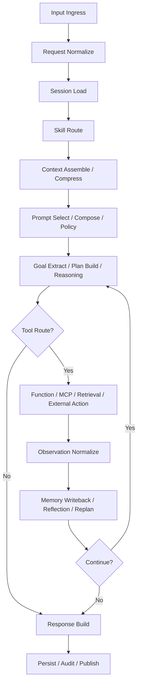
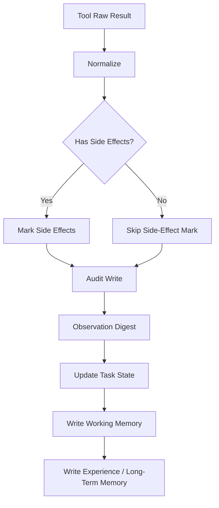
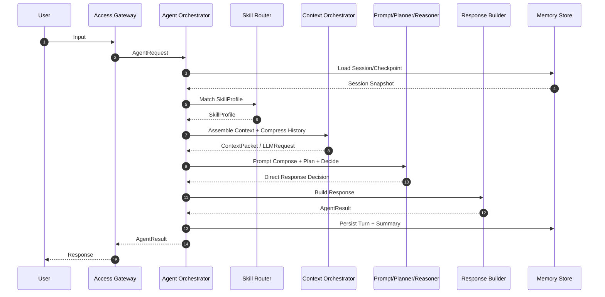
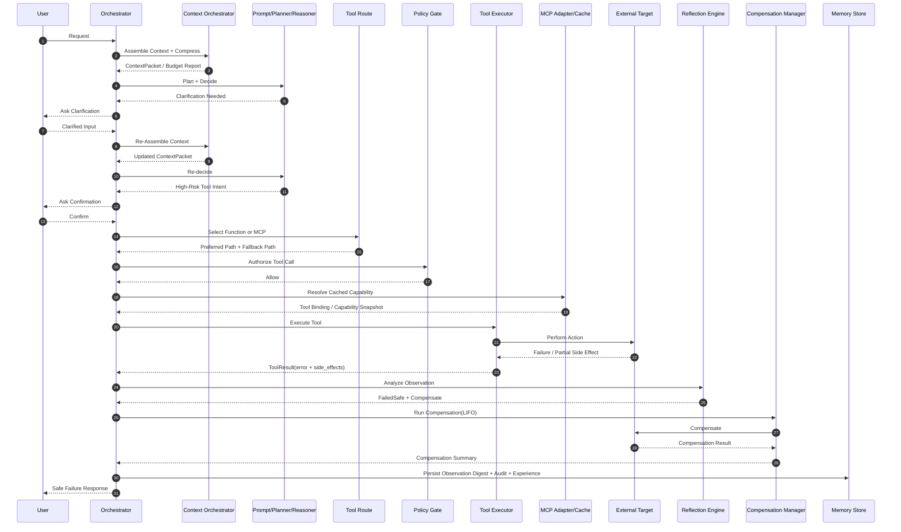
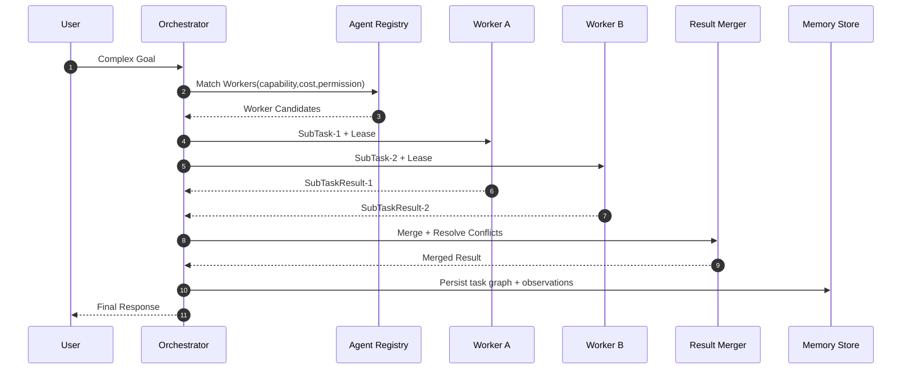
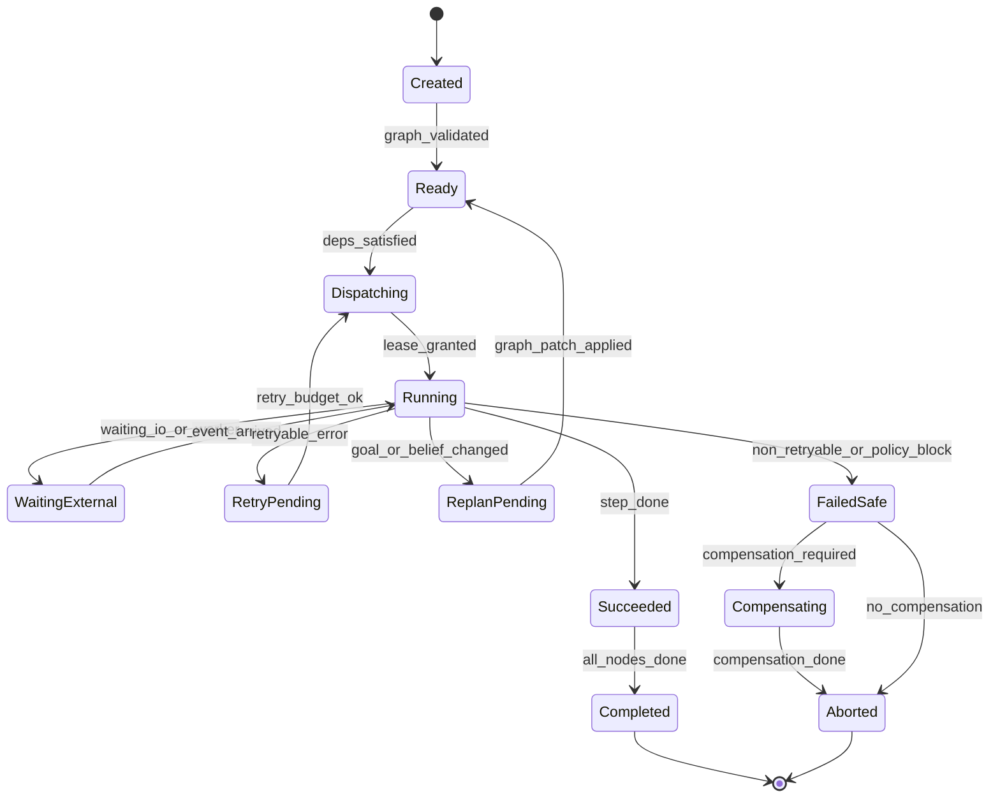

# DASALL Agent 架构设计文档

## 0. 文档信息

### 0.1 文档定位

本文档是 DASALL Agent 的系统级架构设计文档，用于指导后续分层设计、模块设计、接口设计、工程实现和架构评审。本文档的目标不是解释 Agent 概念，而是定义一套可在 x86 桌面平台与 ARM 嵌入式平台长期运行、可维护、可演进、可裁剪、可定制的工程化 Agent 软件架构。

### 0.2 设计目标

本文档要解决的核心问题如下：

1. DASALL Agent 的系统边界和分层结构是什么。
2. 各子系统如何解耦，职责如何划分。
3. 系统如何在跨平台与资源约束并存的条件下实现稳定运行、工具治理、知识增强和外部执行控制。
4. 后续 C/C++ 模块、目录、接口、线程和运维设计如何沿该架构继续展开。

### 0.3 适用范围

本文档适用于以下场景：

1. x86 桌面或工作站平台上的 Agent Runtime。
2. ARM Embedded Linux 设备和边缘节点上的 Agent Runtime。
3. 单 Agent 和多 Agent 协作系统。
4. 云端 LLM、局域网 LLM、本地 LLM 混合部署场景。
5. 需要 Tool Calling、知识库、外部执行控制、长期运行的复杂 Agent 系统。

### 0.4 设计原则

1. 控制与认知分离：LLM 参与推理，不掌控系统主流程。
2. 认知与执行分离：高风险动作和外部副作用必须经过受控执行层。
3. 平台与业务分离：驱动、OS、协议差异不能污染 Agent 主体逻辑。
4. 契约优先：先定义模块边界、数据契约和错误语义，再实现功能。
5. 可裁剪、可定制：系统必须支持按平台能力、部署形态、资源预算关闭模块、替换实现和调整策略。
6. 可观测：系统必须具备日志、trace、metric、audit 四类观测能力。
7. 可恢复：所有关键链路必须支持超时、重试、回退、降级或恢复。

## 目录

- [DASALL Agent 架构设计文档](#dasall-agent-架构设计文档)
  - [0. 文档信息](#0-文档信息)
    - [0.1 文档定位](#01-文档定位)
    - [0.2 设计目标](#02-设计目标)
    - [0.3 适用范围](#03-适用范围)
    - [0.4 设计原则](#04-设计原则)
  - [目录](#目录)
  - [1. 项目概述](#1-项目概述)
    - [1.1 项目简介](#11-项目简介)
    - [1.2 系统目标](#12-系统目标)
    - [1.3 使用场景](#13-使用场景)
    - [1.4 系统边界](#14-系统边界)
    - [1.5 用户与相关角色](#15-用户与相关角色)
  - [2. 系统背景与目标](#2-系统背景与目标)
    - [2.1 技术背景](#21-技术背景)
    - [2.2 功能需求](#22-功能需求)
    - [2.3 非功能需求](#23-非功能需求)
    - [2.4 系统约束](#24-系统约束)
    - [2.5 架构驱动因素](#25-架构驱动因素)
  - [3. 系统总体架构](#3-系统总体架构)
    - [3.0 系统架构设计理念](#30-系统架构设计理念)
    - [3.1 系统上下文图](#31-系统上下文图)
    - [3.2 总体分层结构](#32-总体分层结构)
    - [3.3 分层架构图](#33-分层架构图)
      - [3.3.1 运行时调用链与工程落点](#331-运行时调用链与工程落点)
    - [3.4 各层职责](#34-各层职责)
      - [3.4.1 Product \& Access Layer](#341-product--access-layer)
      - [3.4.2 Agent Control Plane](#342-agent-control-plane)
      - [3.4.3 Cognition Layer](#343-cognition-layer)
      - [3.4.4 Execution \& Collaboration Layer](#344-execution--collaboration-layer)
      - [3.4.5 Capability Services Layer](#345-capability-services-layer)
      - [3.4.6 Platform Abstraction Layer](#346-platform-abstraction-layer)
      - [3.4.7 Infrastructure Layer](#347-infrastructure-layer)
    - [3.5 子系统划分](#35-子系统划分)
    - [3.6 外部系统接口](#36-外部系统接口)
    - [3.7 依赖原则](#37-依赖原则)
    - [3.8 核心契约层](#38-核心契约层)
      - [3.8.1 请求与结果契约](#381-请求与结果契约)
      - [3.8.2 观察与错误契约](#382-观察与错误契约)
      - [3.8.3 检查点与恢复契约](#383-检查点与恢复契约)
      - [3.8.4 契约映射原则](#384-契约映射原则)
      - [3.8.5 契约落地建议](#385-契约落地建议)
  - [4. Agent 智能架构](#4-agent-智能架构)
    - [4.1 Agent 架构概览](#41-agent-架构概览)
    - [4.2 核心模块职责、输入、输出、依赖](#42-核心模块职责输入输出依赖)
    - [4.3 Cognition Layer](#43-cognition-layer)
    - [4.4 Runtime Layer](#44-runtime-layer)
    - [4.5 Tool System](#45-tool-system)
    - [4.6 Memory System](#46-memory-system)
    - [4.7 LLM Adapter](#47-llm-adapter)
    - [4.8 Multi-Agent 架构](#48-multi-agent-架构)
    - [4.9 关键设计模式与使用原因](#49-关键设计模式与使用原因)
  - [5. 关键子系统设计](#5-关键子系统设计)
    - [5.1 Runtime 子系统](#51-runtime-子系统)
      - [5.1.1 职责](#511-职责)
      - [5.1.2 关键组件](#512-关键组件)
      - [5.1.3 关键数据结构](#513-关键数据结构)
    - [5.2 Tool 子系统](#52-tool-子系统)
      - [5.2.1 结构](#521-结构)
      - [5.2.2 接口](#522-接口)
      - [5.2.3 Tool 分类](#523-tool-分类)
      - [5.2.4 扩展方式](#524-扩展方式)
      - [5.2.5 Tool Schema、Function Calling 与 Tool IR](#525-tool-schemafunction-calling-与-tool-ir)
      - [5.2.6 Observation Digest](#526-observation-digest)
      - [5.2.7 工作流与跨工具协作](#527-工作流与跨工具协作)
      - [5.2.8 补偿与回滚](#528-补偿与回滚)
      - [5.2.9 Skill 资产](#529-skill-资产)
      - [5.2.10 MCP 能力接入](#5210-mcp-能力接入)
      - [5.2.11 提示治理与工具治理的关系](#5211-提示治理与工具治理的关系)
      - [5.2.12 MCP 能力发现与能力缓存](#5212-mcp-能力发现与能力缓存)
      - [5.2.13 Function Calling 与 MCP 混合执行策略](#5213-function-calling-与-mcp-混合执行策略)
      - [5.2.14 Skills 与 MCP 兼容性评估](#5214-skills-与-mcp-兼容性评估)
    - [5.3 Memory 子系统](#53-memory-子系统)
      - [5.3.1 职责](#531-职责)
      - [5.3.2 存储建议](#532-存储建议)
      - [5.3.3 Context Orchestrator 装配规则](#533-context-orchestrator-装配规则)
      - [5.3.4 冲突处理与置信度](#534-冲突处理与置信度)
      - [5.3.5 写回与经验学习](#535-写回与经验学习)
      - [5.3.6 Session Store 关键对象](#536-session-store-关键对象)
      - [5.3.7 Context Orchestrator 与历史压缩闭环](#537-context-orchestrator-与历史压缩闭环)
    - [5.4 LLM 子系统](#54-llm-子系统)
      - [5.4.1 统一接口](#541-统一接口)
      - [5.4.2 路由原则](#542-路由原则)
      - [5.4.3 输出语义](#543-输出语义)
      - [5.4.4 Model Route](#544-model-route)
      - [5.4.5 Prompt 治理](#545-prompt-治理)
      - [5.4.6 Prompt 选择与装配](#546-prompt-选择与装配)
      - [5.4.7 Prompt 三段治理模型](#547-prompt-三段治理模型)
    - [5.5 Execution Control 子系统](#55-execution-control-子系统)
      - [5.5.1 设计原则](#551-设计原则)
      - [5.5.2 能力范围](#552-能力范围)
      - [5.5.3 风险治理](#553-风险治理)
    - [5.6 Communication 子系统](#56-communication-子系统)
    - [5.7 Access 子系统](#57-access-子系统)
      - [5.7.1 职责](#571-职责)
      - [5.7.2 关键组件](#572-关键组件)
      - [5.7.3 关键接口（建议）](#573-关键接口建议)
    - [5.8 Cognition 子系统](#58-cognition-子系统)
      - [5.8.1 职责](#581-职责)
      - [5.8.2 关键组件](#582-关键组件)
      - [5.8.3 边界约束](#583-边界约束)
      - [5.8.4 关键接口（建议）](#584-关键接口建议)
    - [5.9 Knowledge 子系统](#59-knowledge-子系统)
      - [5.9.1 职责](#591-职责)
      - [5.9.2 关键组件](#592-关键组件)
      - [5.9.3 关键接口（建议）](#593-关键接口建议)
    - [5.10 Infrastructure 子系统](#510-infrastructure-子系统)
      - [5.10.1 职责](#5101-职责)
      - [5.10.2 关键组件](#5102-关键组件)
      - [5.10.3 关键接口（建议）](#5103-关键接口建议)
    - [5.11 Task 子系统](#511-task-子系统)
      - [5.11.1 职责](#5111-职责)
      - [5.11.2 生命周期状态（建议）](#5112-生命周期状态建议)
      - [5.11.3 关键接口（建议）](#5113-关键接口建议)
  - [6. 系统运行模型](#6-系统运行模型)
    - [6.1 Agent 执行流程](#61-agent-执行流程)
    - [6.2 详细运行步骤](#62-详细运行步骤)
    - [6.3 LLM 何时触发工具调用](#63-llm-何时触发工具调用)
    - [6.4 工具结果处理](#64-工具结果处理)
    - [6.5 线程模型](#65-线程模型)
      - [6.5.1 线程划分](#651-线程划分)
      - [6.5.2 各线程职责](#652-各线程职责)
      - [6.5.3 通信方式](#653-通信方式)
    - [6.6 事件系统](#66-事件系统)
    - [6.7 消息通信](#67-消息通信)
    - [6.8 Agent 状态机](#68-agent-状态机)
    - [6.8.1 主循环控制要求](#681-主循环控制要求)
    - [6.8.2 运行时序要求](#682-运行时序要求)
    - [6.9 调度策略](#69-调度策略)
    - [6.10 中断恢复设计](#610-中断恢复设计)
    - [6.11 多 Agent 协同机制](#611-多-agent-协同机制)
    - [6.12 多 Agent 失败策略](#612-多-agent-失败策略)
    - [6.13 运行模式补充说明](#613-运行模式补充说明)
      - [6.13.1 任务模型](#6131-任务模型)
      - [6.13.2 事件驱动机制](#6132-事件驱动机制)
      - [6.13.3 消息队列模型](#6133-消息队列模型)
      - [6.13.4 Reactor / Actor / Pipeline 选型](#6134-reactor--actor--pipeline-选型)
  - [7. 工程架构设计](#7-工程架构设计)
    - [7.1 项目目录结构](#71-项目目录结构)
    - [7.2 各目录职责](#72-各目录职责)
    - [7.3 C++ 核心接口](#73-c-核心接口)
      - [7.3.1 Agent 接口](#731-agent-接口)
      - [7.3.2 Orchestrator 接口](#732-orchestrator-接口)
      - [7.3.3 Planner 接口](#733-planner-接口)
      - [7.3.4 Tool 接口](#734-tool-接口)
      - [7.3.5 Memory 接口](#735-memory-接口)
    - [7.4 模块依赖规则](#74-模块依赖规则)
    - [7.5 Build Profile 设计](#75-build-profile-设计)
      - [7.5.1 运行策略配置化](#751-运行策略配置化)
    - [7.6 测试架构](#76-测试架构)
  - [8. 非功能设计](#8-非功能设计)
    - [8.1 性能设计](#81-性能设计)
    - [8.2 内存管理](#82-内存管理)
    - [8.3 可靠性设计](#83-可靠性设计)
    - [8.4 容错机制](#84-容错机制)
    - [8.5 日志系统](#85-日志系统)
    - [8.6 配置系统](#86-配置系统)
    - [8.7 监控系统](#87-监控系统)
    - [8.8 安全设计](#88-安全设计)
    - [8.9 OTA 升级](#89-ota-升级)
    - [8.10 可维护性设计](#810-可维护性设计)
  - [9. 部署与运维](#9-部署与运维)
    - [9.1 部署架构](#91-部署架构)
    - [9.2 启动流程](#92-启动流程)
    - [9.3 升级机制](#93-升级机制)
    - [9.4 日志采集](#94-日志采集)
    - [9.5 故障诊断](#95-故障诊断)
    - [9.6 长期运行治理](#96-长期运行治理)
  - [10. 架构决策记录](#10-架构决策记录)
    - [ADR-001 Agent Runtime 采用状态机 + 事件驱动模型](#adr-001-agent-runtime-采用状态机--事件驱动模型)
    - [ADR-002 Tool 必须经过治理层，不允许 LLM 直调高风险执行能力](#adr-002-tool-必须经过治理层不允许-llm-直调高风险执行能力)
    - [ADR-003 LLM 适配层统一抽象并支持路由](#adr-003-llm-适配层统一抽象并支持路由)
    - [ADR-004 Memory 采用多层记忆而不是单一聊天历史](#adr-004-memory-采用多层记忆而不是单一聊天历史)
    - [ADR-005 当前架构评审结论：先冻结契约与主控边界，再展开模块设计](#adr-005-当前架构评审结论先冻结契约与主控边界再展开模块设计)
    - [ADR-006 ContextOrchestrator 负责语义上下文，PromptComposer 负责消息装配](#adr-006-contextorchestrator-负责语义上下文promptcomposer-负责消息装配)
    - [ADR-007 ReflectionEngine 负责失败语义判断，RecoveryManager 负责恢复执行](#adr-007-reflectionengine-负责失败语义判断recoverymanager-负责恢复执行)
    - [ADR-008 AgentOrchestrator 负责全局主控，MultiAgentCoordinator 负责协同子域编排](#adr-008-agentorchestrator-负责全局主控multiagentcoordinator-负责协同子域编排)
  - [11. 附录](#11-附录)
    - [11.1 主控制流伪代码](#111-主控制流伪代码)
    - [11.2 后续建议拆分的详细文档](#112-后续建议拆分的详细文档)

---

## 1. 项目概述

### 1.1 项目简介

DASALL 是一套面向 x86 桌面平台、ARM 嵌入式设备和边缘节点的通用 Agent 软件系统。它不是单次大模型调用的封装层，而是一个完整的 Agent Runtime：能够接收用户输入、组织上下文、执行推理、调用工具、访问知识、触发外部执行、完成任务，并持续管理会话、状态和故障恢复。

### 1.2 系统目标

系统目标如下：

1. 支持云端、局域网、本地三类 LLM 的统一接入与调度。
2. 支持工具调用、知识检索、外部执行控制、任务执行和多轮对话。
3. 支持可长期运行的 Session、Task、Memory 和 Runtime 状态管理。
4. 支持单 Agent 起步，并平滑扩展到多 Agent 协作。
5. 支持跨平台工程化部署所需的日志、监控、配置、升级和故障治理机制。

### 1.3 使用场景

1. 用户通过桌面端、终端节点、文本、语音或远程接口下达任务。
2. Agent 根据上下文和知识完成问答、查询、执行或外部控制。
3. Agent 在云端不可达时自动切换到局域网或本地模型。
4. Agent 可持续运行在桌面终端、网关或边缘节点上，统一编排多种能力。

### 1.4 系统边界

系统负责：

1. Agent Runtime、状态机、上下文治理、模型路由、工具治理。
2. 知识检索编排、任务调度、执行服务编排、事件通信。
3. 日志、配置、监控、审计、OTA、插件扩展和故障恢复。

系统不负责：

1. 芯片驱动和底层硬件驱动本体实现。
2. 第三方 LLM 的训练和推理框架内部实现。
3. 外部业务系统的完整生命周期管理。
4. 企业级 IAM、CMDB 等外部平台的职责。

### 1.5 用户与相关角色

1. 终端用户：与 Agent 交互并触发任务。
2. 平台与应用开发者：扩展工具、执行服务和业务逻辑。
3. 平台运维人员：部署、诊断、监控、升级系统。
4. 架构与研发团队：维护模块边界、接口稳定性和演进路线。

---

## 2. 系统背景与目标

### 2.1 技术背景

DASALL 是一个通用的跨平台 Agent，但不同平台档位对架构提出的约束并不相同：

1. 在 x86 桌面或工作站上，系统可以启用更完整的模型路由、调试观测和插件能力。
2. 在 ARM 嵌入式设备上，资源预算更严格，不能无限堆上下文、线程和外部依赖。
3. 外部动作可能具有真实副作用，错误决策会影响终端安全、业务状态和系统稳定，因此执行链路必须受控。
4. 网络质量和部署环境差异较大，云模型不能作为唯一依赖，必须支持局域网和本地模型回退。
5. 系统是长期运行体，不是短时脚本，必须关注泄漏、累积错误、恢复能力以及不同平台下的一致行为。
6. 单纯用 prompt 驱动的 Agent 无法满足工程级控制要求，必须引入 Runtime 控制平面，并通过 profile 机制完成能力裁剪与定制。

### 2.2 功能需求

1. 用户输入处理。
2. 多轮对话与上下文管理。
3. LLM 推理与计划生成。
4. Tool Calling。
5. 外部执行控制。
6. 数据查询和知识库检索。
7. 任务执行与异步任务管理。
8. 多 Agent 协同。
9. 长期记忆与经验沉淀。
10. 运行状态监控与故障诊断。

### 2.3 非功能需求

1. 高可靠。
2. 低资源占用。
3. 可扩展。
4. 可维护。
5. 可升级。
6. 长期稳定运行。
7. 具备安全控制和审计能力。

### 2.4 系统约束

在当前阶段，架构按“公共抽象 + 平台 Profile”的方式进行设计：

1. OS 基线：优先支持 Linux 系平台，覆盖 x86 桌面/工作站 Linux 与 ARM Embedded Linux。
2. 语言基线：C++17 及以上，必要时保留 C 接口，跨平台差异统一收敛到 Platform Abstraction Layer。
3. 平台基线：至少覆盖 x86_64 高资源平台与 ARM Cortex-A53/A55 级别资源受限平台。
4. 内存基线：嵌入式档位按 512MB 至 2GB 设计，桌面档位可启用更高并发和更完整能力集。
5. 存储基线：eMMC、SSD 或桌面本地磁盘，本地轻量数据库可用。
6. 网络基线：以太网或 Wi-Fi 可用，但必须接受不同平台下带宽、时延和稳定性差异。
7. 运行基线：所有能力都必须声明资源成本、依赖条件和可关闭性，以支持 profile 裁剪。

### 2.5 架构驱动因素

以下因素直接决定 DASALL 不能采用简单脚本式 Agent 架构：

1. 高风险执行能力必须有安全约束和审计。
2. LLM 输出不可靠，不能直接作为执行指令。
3. 长时间任务需要 checkpoint 和 resume 能力。
4. 多模型、多工具、多服务共存，需要统一路由和治理。
5. 不同平台档位必须执行预算化运行、能力裁剪和依赖收敛。

---

## 3. 系统总体架构

### 3.0 系统架构设计理念

系统总体架构采用“分层 + 契约 + 治理”的工程理念，核心是让 Agent 从可用走向可控、可维护、可演进：

1. 分层解耦：控制、认知、执行、能力服务、平台抽象与基础设施分离，避免跨层耦合。
2. 契约驱动：先冻结 AgentRequest、GoalContract、Observation、AgentResult 等核心对象，再实现模块。
3. 治理优先：工具调用、Prompt 注入、外部执行和恢复流程都必须经过策略门控。
4. 运行可恢复：状态机、Checkpoint、补偿动作与失败收敛作为一等能力设计。
5. 跨平台一致：x86 与 ARM 平台复用同一主流程，仅通过 Profile、Adapter 和依赖注入差异化。

### 3.1 系统上下文图

```text
User / App / Remote API / Terminal Event
                |
                v
        DASALL Agent System
                |
    +-----------+-----------+
    |           |           |
    v           v           v
 Cloud LLM    LAN LLM    Local LLM
                |
                v
 Knowledge / Capability Services（含 Execution Control）
                |
                v
   OS / Middleware / System Runtime / Drivers
```

### 3.2 总体分层结构

```text
Layer 7  Product & Access Layer
Layer 6  Agent Control Plane（工程实体：Runtime Layer）
Layer 5  Cognition Layer
Layer 4  Execution & Collaboration Layer
Layer 3  Capability Services Layer
Layer 2  Platform Abstraction Layer
Layer 1  Infrastructure Layer
```

### 3.3 分层架构图

```text
User / Terminal Event / Remote Command / Schedule
                    |
                    v
            Product & Access Layer
                    |
                    v
      Agent Control Plane（Runtime Layer）
  (Session / FSM / Scheduler / Recovery /
   Multi-Agent Coordinator / Budget Controller)
                    |
                    v
              Cognition Layer
 (Perception / Planner / Reasoner / Reflection / Response Builder)
                    |
        +-----------+------------+
        |                        |
        v                        v
   Memory System            Tool System
        |                        |
        +-----------+------------+
                    |
                    v
     Knowledge / Task / Multi-Agent Workers
                    |
                    v
          Execution Services / Data Services
                    |
                    v
      Platform Abstraction / OS / System Runtime / IPC
                    |
                    v
          Hardware / Local Service / Cloud
```

> **说明：** Multi-Agent Coordinator 的调度逻辑由 Agent Control Plane 驱动（图中括号内），Worker Agent 实例则作为能力实体运行在 Execution & Collaboration Layer，并由 Agent Registry 管理。两者不在同一层。

#### 3.3.1 运行时调用链与工程落点

2.0 在保留分层架构图的同时，还需要一张能直接映射工程实现的“运行时调用链视图”。其目的不是把系统固化为单一进程结构，而是明确任一部署形态下都必须保持的逻辑顺序、治理边界和模块归属。

```text
Ingress Request
  -> Access Gateway / Request Normalizer
  -> Agent Orchestrator
  -> Skill Router
  -> Prompt Registry / Prompt Composer / Prompt Policy
  -> Context Orchestrator
  -> LLM Manager
  -> Tool Decision
  -> Tool Registry / Policy Gate / Executor
  -> Execution Service or MCP Adapter
  -> Observation Digest / Memory Writeback
  -> Response Builder
  -> Audit / Persist / Publish
```

建议工程落点如下：

1. Access Gateway、Request Normalizer：归属 Product & Access Layer，对应 access 或 apps/gateway 模块。
2. Agent Orchestrator、Skill Router、Context Orchestrator：归属 Agent Control Plane，对应 runtime 模块。
3. Prompt Registry / Composer / Policy、LLM Manager：分别归属 LLM 子系统与认知支撑资产层，可落在 llm 与 prompt 资产模块。
4. Tool Registry、Policy Gate、Executor、MCP Adapter：归属 Tool 子系统，对应 tools 模块。
5. Memory Store、Summary Store、Experience Store：归属 Memory 子系统，对应 memory 模块。
6. Execution Service、Data Service：归属 Capability Services Layer，对应 services 模块。

该视图强调的是“谁先于谁、谁治理谁、谁对谁可见”，而不是要求所有节点必须以一一对应的线程或进程边界存在。

### 3.4 各层职责

#### 3.4.1 Product & Access Layer

1. 接收 CLI、HTTP、WebSocket、MQTT、串口、定时任务和终端事件。
2. 完成协议转换、认证、鉴权、输入规范化。
3. 创建 request_id、session_id、trace_id 等控制字段。
4. 形成统一 AgentRequest 并交给 Runtime。

#### 3.4.2 Agent Control Plane

1. 驱动 Agent 主循环。
2. 管理 Session、Task、状态机、预算和调度。
3. 控制认知、工具、记忆、知识的调用顺序。
4. 负责超时、重试、熔断、降级、checkpoint 和恢复。
5. 承载 Multi-Agent Coordinator 的调度职责：拆分子任务、派发 Worker、汇聚结果、执行失败回收。Worker Agent 实例本身运行于 Execution & Collaboration Layer，但其**调度权**归属本层。

#### 3.4.3 Cognition Layer

1. 负责意图理解和任务目标抽取（Perception）。
2. 负责计划生成和下一步动作决策（Planner / Reasoner）。
3. 负责失败反思和重规划（Reflection）。
4. 负责汇总上下文并生成最终答复（Response Builder）。

> 本层详细职责、边界约束和自评信号定义见 [4.3 Cognition Layer](#43-cognition-layer)。

#### 3.4.4 Execution & Collaboration Layer

1. Tool System：统一工具治理和执行。
2. Memory System：上下文构建、记忆存取和写回。
3. Knowledge System：知识检索和证据组织。
4. Multi-Agent Workers：由 Agent Registry 管理的 Worker Agent 实例，接受 Agent Control Plane 中 Multi-Agent Coordinator 的调度指令，执行子任务并回传结果。

#### 3.4.5 Capability Services Layer

1. 封装外部执行控制、数据查询、业务服务和系统服务。
2. 为 Tool 提供稳定的服务接口，而不是让 Tool 直接碰驱动或外部执行端。
3. 负责执行动作语义、业务服务语义和系统服务语义统一。

> 对齐说明：本层是当前工程中 services 模块的架构表达。后续整理版文档中，原始文档单列的“Execution Control 子系统”被收敛为 Capability Services Layer 内的一级能力子域，而不是与 Capability Services Layer 平级的第二套服务层。

#### 3.4.6 Platform Abstraction Layer

1. 抽象线程、锁、队列、定时器、文件、网络、IPC。
2. 抽象串口、GPIO、I2C、SPI、CAN 等硬件访问接口。
3. 隔离 x86 桌面 Linux、ARM Embedded Linux、模拟环境和第三方 SDK 差异。

#### 3.4.7 Infrastructure Layer

1. 日志、trace、metrics、audit。
2. 配置、密钥、安全策略。
3. OTA、插件、诊断和运维支持。

### 3.5 子系统划分

系统划分为十一个核心子系统：

1. Access 子系统。
2. Runtime 子系统。
3. Cognition 子系统。
4. LLM 子系统。
5. Tool 子系统。
6. Memory 子系统。
7. Knowledge 子系统。
8. Capability Services 子系统（Execution Control 为其关键子域，含 Execution Service、Data Service）。
9. Communication 子系统。
10. Task 子系统。
11. Infrastructure 子系统。

### 3.6 外部系统接口

| 外部系统 | 接口形态 | 方向 | 说明 |
|---|---|---|---|
| 云端 LLM 服务 | HTTPS/gRPC/OpenAI-compatible | 出站 | 复杂推理主路径 |
| 局域网模型服务 | HTTP/gRPC | 出站 | 私有化或低时延模型 |
| 本地模型服务 | IPC/HTTP/共享库 | 本地 | 离线推理和轻量任务 |
| 数据库/知识库 | SQLite/HTTP/本地索引 | 双向 | 业务查询和知识检索 |
| 执行控制服务 | IPC/RPC/驱动服务 | 双向 | 执行目标状态查询和动作执行 |
| 上位机/客户端 | HTTP/WebSocket/MQTT | 入站 | 用户交互和结果回传 |

### 3.7 依赖原则

1. 上层仅依赖下层抽象，不依赖下层具体实现。
2. Cognition 不依赖底层驱动和数据库 SDK。
3. Tool 不依赖 LLM 实现。
4. Platform 和 Infra 不反向依赖 Agent 业务模块。

### 3.8 核心契约层

在 Runtime、Memory、Tool 和 Multi-Agent 之间，必须冻结一组跨模块共享的核心对象。否则每个子系统都会定义自己的输入输出，最终导致编排层无法稳定工作。

#### 3.8.1 请求与结果契约

系统至少需要统一以下对象：

1. AgentRequest：统一入口，请求、会话、用户、trace 和附件信息都从这里进入。
2. AgentResult：统一出口，除了文本回复，还必须包含最终状态、结构化产物和审计引用。
3. GoalContract：冻结任务目标、成功判据、约束、预算和审批策略，避免后续模块从自然语言中反复猜测。

#### 3.8.2 观察与错误契约

系统必须把工具结果、检索结果、人工反馈、子 Agent 输出统一折叠为 Observation，并定义 ErrorInfo：

1. ErrorInfo 至少包含 failure_type、retryable、safe_to_replan、details。
2. Observation 至少包含 source、success、payload、error、side_effects。
3. BeliefState 必须显式区分 confirmed_facts、hypotheses、assumptions、evidence_refs、confidence。

#### 3.8.3 检查点与恢复契约

Checkpoint 必须至少记录以下信息：

1. 当前状态。
2. 当前步骤或 step_id。
3. working_memory_snapshot。
4. retry_counters。
5. pending_action。

其作用不是简单断点续跑，而是明确哪些动作已产生副作用、哪些动作仍在等待确认、哪些状态可以安全重放。

#### 3.8.4 契约映射原则

1. 图上的每个阶段都必须能映射到一个明确对象，而不是只停留在流程描述。
2. 主流程和异常流程都必须使用同一套契约。
3. Multi-Agent 输出和 Tool 输出必须最终汇聚成统一 Observation 和 AgentResult。

#### 3.8.5 契约落地建议

为避免后续详细设计中对象漂移，建议在 contracts 层继续冻结以下对象：

1. ContextPacket：承载 user_turn、recent_history、summary_memory、retrieval_evidence、active_tools、policy_digest、token_budget_report。
2. Session 与 Turn：承载跨轮会话记录、工具轨迹和最终回复。
3. PolicyDecision：统一表达 allow、deny、require_confirmation 三类决策。
4. ReflectionDecision：统一表达 continue、retry_step、replan、abort_safe 四类反思结论。
5. CompensationAction：统一表达副作用补偿动作。

---

## 4. Agent 智能架构

### 4.1 Agent 架构概览

```text
Agent Facade
    |
    v
Agent Orchestrator
    |
    +-- Session Manager
    +-- Skill Router
    +-- Context Orchestrator
    +-- Planner
    +-- Reasoner
    +-- Reflection Engine
    +-- Response Builder
    +-- LLM Manager
    +-- Prompt Registry
    +-- Prompt Composer
    +-- Prompt Policy
    +-- Tool Manager
    +-- Capability Discovery
    +-- Capability Cache
    +-- Memory Manager
    +-- Knowledge Manager
    +-- Task Manager
    +-- Event Bus
    +-- Multi-Agent Coordinator
```

### 4.2 核心模块职责、输入、输出、依赖

| 模块 | 职责 | 输入 | 输出 | 依赖 |
|---|---|---|---|---|
| Agent Facade | 对外统一暴露接口 | AgentRequest | AgentResult | Orchestrator |
| Session Manager | 会话生命周期与恢复 | Request, Event | SessionContext | Memory |
| Skill Router | 根据目标和上下文选择 SkillProfile | AgentRequest, SessionContext | SkillProfile | Policy, Memory |
| Context Orchestrator | 统一负责上下文装配、预算裁剪、历史压缩与消息组装 | ContextAssembleRequest | ContextAssembleResult | Memory, Tool, Knowledge, Prompt |
| Planner | 生成任务计划图 | Goal, Context | PlanGraph | LLM |
| Reasoner | 决定下一步动作 | PlanGraph, Observation | ActionDecision | LLM |
| Reflection Engine | 失败归因和重规划 | Observation, Error | ReflectionDecision | Planner |
| Response Builder | 汇总结果并生成输出 | Context, Plan, Result | AgentResult | LLM/Template |
| LLM Manager | 调度不同 LLM 适配器 | LLMRequest | LLMResponse | Model Router |
| Prompt Registry | 管理 PromptSpec/PromptRelease/来源元数据 | PromptQuery | PromptSpec | Store, MCP |
| Prompt Composer | 拼装多段 system messages | PromptComposeRequest | PromptComposeResult | Policy |
| Prompt Policy | 管理 Prompt 信任、裁剪和注入策略 | PromptComposeResult, Budget | PromptPolicyDecision | Config |
| Tool Manager | 统一工具治理与执行 | ToolCallIntent | ToolResult | Registry, Policy, Executor |
| Capability Discovery | 发现 MCP tools/resources/prompts | MCPServerSpec | CapabilitySnapshot | MCP Adapter |
| Capability Cache | 缓存能力快照和健康状态 | CapabilitySnapshot | CapabilitySnapshot | Store |
| Memory Manager | 管理工作、短期、长期记忆 | Read/Write Request | MemoryRecord | Store |
| Knowledge Manager | 执行检索和重排 | Query | RetrievalResult | Index, Embedder |
| Task Manager | 异步任务生命周期管理 | TaskRequest | TaskState | Event Bus |
| Event Bus | 异步事件通信 | Event | Delivery | Queue |
| Multi-Agent Coordinator | 子任务拆分与结果合并 | Goal, Plan | SubTaskResult | Agent Registry |

> 说明：Context Manager 不再作为独立一级模块存在，其“拉取候选上下文、形成 ContextPacket”的职责并入 Context Orchestrator，避免在运行链路中出现两个上下文主控点。

### 4.3 Cognition Layer

认知层包含五个核心能力：

1. Perception：抽取意图、实体、约束和目标。
2. Planner：把目标拆成可执行步骤和依赖关系。
3. Reasoner：根据计划和观察结果决定下一步动作。
4. Reflection：分析执行结果、失败原因和偏航风险。
5. Response Builder：构造最终回复和结构化结果。

认知层还应显式输出自评信号，用于 Runtime 判断是否需要澄清、降级或重规划。最低要求包括：

1. 当前决策 confidence。
2. 是否存在高不确定性 assumptions。
3. 是否需要 clarification。
4. 是否建议 retry_step、replan 或 abort_safe。

边界约束：

1. 认知层只能操作 ContextPacket 和 Observation，不直接访问底层执行目标。
2. 认知层产生的是动作意图，不是底层执行指令。
3. 认知层不直接管理线程、队列和重试逻辑。
4. Planner 和 Reasoner 必须读取 GoalContract 与 BeliefState，而不是仅靠最近一轮用户输入做决策。
5. Reflection 除了判断继续或终止，还必须能给出重试、重规划、切换 Skill、进入安全失败等显式决策。

### 4.4 Runtime Layer

Runtime Layer 是第 3 章 Layer 6 **Agent Control Plane** 在工程实现侧的对应实体，两者同义：Agent Control Plane 是架构分层术语，Runtime Layer 是工程模块术语。本层负责把 Agent 从“会推理”变成“能稳定运行”。它承担：

1. Session 管理。
2. 状态机管理。
3. 调度、超时、重试、限流、熔断。
4. 预算控制、profile 裁剪和回退策略。
5. checkpoint、resume 和降级运行。

### 4.5 Tool System

> 本节为 Agent 智能架构视角下的 Tool System 能力概览，聚焦其与 Cognition/Runtime 的协作关系。接口、Schema 分层、Workflow、Skill、MCP 等工程设计详见 [5.2 Tool 子系统](#52-tool-子系统)。

Tool System 在 Agent 循环中的职责是：接收 Cognition 产生的动作意图，在经过 Validator → Policy Gate → Executor 的治理链路后落地执行，并将结果归一化为 Observation 回传。其核心组件包括：

1. Tool Registry：维护工具 schema、版本、超时、风险等级和权限要求。
2. Validator：参数校验、归一化和默认值注入。
3. Policy Gate：权限判断、风险控制和确认门控。
4. Tool Executor：执行工具或工作流。
5. Workflow Engine：执行跨工具编排。
6. Compensation Manager：组织补偿计划、记录副作用并请求 Runtime 裁定。
7. Tool Audit：记录执行前后状态和副作用。

关键边界约束：

1. 工具不能直接互调。
2. 工具不能直接访问 Cognition 内部状态。
3. 所有副作用工具必须定义幂等性和补偿语义。

### 4.6 Memory System

> 本节为 Agent 智能架构视角下的 Memory System 能力概览，聚焦其与 Cognition/Runtime 的协作关系。Context Orchestrator 装配规则、冲突处理、写回策略和 Session 对象设计详见 [5.3 Memory 子系统](#53-memory-子系统)。

Memory 系统在 Agent 循环中负责向 Cognition 提供已组装好的 ContextPacket，并将执行结果和经验摘要回写。它采用分层设计：

1. Working Memory：当前任务黑板，供本轮推理和工具工作流共享状态。
2. Short-Term Memory：最近对话与最近观察，用于多轮上下文延续。
3. Long-Term Memory：偏好、事实、终端画像，跨 Session 持久化。
4. Vector Memory：知识向量索引，用于语义检索和证据召回。
5. Experience Memory：经验、故障和策略沉淀，用于后续重规划和降级决策。

### 4.7 LLM Adapter

> 本节为 Agent 智能架构视角下的 LLM 接入概览，聚焦其与 Cognition 的协作边界。路由原则、Prompt 治理、Model Route 和统一接口详见 [5.4 LLM 子系统](#54-llm-子系统)。

LLM 适配层的职责是屏蔽模型差异，让 Cognition 各阶段均通过统一接口调用模型，不感知部署位置或厂商协议。它需同时支持：

1. 云端模型。
2. 局域网模型。
3. 本地模型。

上层通过统一接口调用，不感知模型部署位置或厂商差异。

### 4.8 Multi-Agent 架构

> 本节描述 Multi-Agent 在 Agent 智能架构中的协作模式和约束。Multi-Agent Coordinator 的调度职责归属 Agent Control Plane（见 [3.4.2](#342-agent-control-plane)）；Worker Agent 实例作为能力实体运行于 Execution & Collaboration Layer（见 [3.4.4](#344-execution--collaboration-layer)）；协同机制、失败策略和日志要求详见 [6.11](#611-多-agent-协同机制) 和 [6.12](#612-多-agent-失败策略)。

多 Agent 是协调层能力，不是主链路前提。Multi-Agent Coordinator 运行于 Runtime（Agent Control Plane），负责：

1. 拆分大任务为子任务。
2. 从 Agent Registry 匹配合适的 Worker Agent。
3. 汇聚结果并做冲突仲裁。
4. 保证 Worker 不越过主 Runtime 的预算和权限边界。

推荐支持三种基本协作模式：

1. Orchestrator-Worker：最常用，主 Agent 负责规划与汇总，Worker 负责执行。
2. Pipeline：适合解析、草稿、审校、格式化等线性加工链。
3. Debate：适合批判、验证、裁决类场景，但不应作为默认模式。

多 Agent 运行约束如下：

1. 子 Agent 必须具有独立上下文窗口、允许工具列表和租约时限。
2. 子 Agent 不直接与用户交互，所有用户面交互统一回到 Orchestrator。
3. 子 Agent 的输出若不符合约定格式，统一视为失败 Observation。
4. 多 Agent 协作必须有 Result Merger、冲突仲裁和失败回收策略。
5. Multi-Agent Coordinator 必须依赖 Agent Registry 做能力匹配，而不是写死 worker 路由逻辑。

### 4.9 关键设计模式与使用原因

为保证模块边界稳定、运行逻辑清晰、平台差异可控，建议采用以下设计模式：

| 设计模式 | 主要落点 | 使用原因 |
|---|---|---|
| Facade | Agent Facade、Tool Manager Facade | 对外收敛接口复杂度，避免上层直接感知子模块细节。 |
| Adapter | LLM Adapter、MCP Adapter、Platform Adapter、Protocol Adapter | 屏蔽异构协议和平台差异，降低替换成本。 |
| Observer | Event Bus、Monitor、Audit、Task State Listener | 解耦状态变化与后续动作，支持异步扩展和观测。 |
| State | Agent FSM、TaskState 生命周期 | 显式建模等待、执行、失败、安全收敛等状态，减少隐式分支。 |
| Factory | ToolFactory、AdapterFactory、SkillFactory | 按 profile、能力和版本动态创建实现，避免条件分支扩散。 |
| Dependency Injection | Runtime 装配层、Profile Bootstrap、模块注册中心 | 把依赖选择从业务逻辑中抽离，实现可测试、可替换、可裁剪。 |
| Strategy | Tool Route、Model Route、Prompt Policy、Retry Policy | 运行时切换策略，支持成本、风险、时延等多目标权衡。 |
| Pipeline | Observation 处理链、Prompt 组装链、工具治理链 | 形成稳定的阶段化处理，便于插拔校验、审计和压缩步骤。 |

模式选型约束：

1. Facade 仅用于收敛入口，不承载复杂业务决策。
2. Adapter 只做协议和语义映射，不承载策略治理。
3. Observer 事件处理必须幂等，避免重复消费造成副作用。
4. DI 容器只负责装配，不应成为运行时全局状态黑箱。

---

## 5. 关键子系统设计

### 5.1 Runtime 子系统

#### 5.1.1 职责

1. 驱动 Agent 主循环。
2. 管理 Session、Task 和状态机。
3. 执行预算控制、重试、超时和恢复。
4. 协调 Cognition、Tool、Memory、Knowledge 和 Multi-Agent。

#### 5.1.2 关键组件

1. Agent Orchestrator。
2. Session Manager。
3. FSM。
4. Scheduler。
5. Budget Controller。
6. Recovery Manager。
7. Checkpoint Manager。

#### 5.1.3 关键数据结构

```cpp
struct AgentRequest {
    std::string request_id;
    std::string session_id;
    std::string user_id;
    InputType input_type;
    std::string input_text;
    JsonObject attachments;
    TraceContext trace;
};

struct RuntimeBudget {
    uint32_t max_rounds;
    uint32_t max_tool_calls;
    uint32_t max_latency_ms;
    uint32_t max_tokens;
    uint32_t max_cpu_ms;
    uint32_t max_power_cost;
};

struct AgentResult {
    ResultCode code;
    std::string response_text;
    JsonObject structured_payload;
    bool task_completed;
    ErrorInfo error;
};
```

### 5.2 Tool 子系统

#### 5.2.1 结构

```text
Tool Manager
  -> Tool Registry
  -> Validator
  -> Policy Gate
  -> Executor
  -> Workflow Engine
  -> Compensation Manager
```

#### 5.2.2 接口

```cpp
class ITool {
public:
    virtual ~ITool() = default;
    virtual std::string name() const = 0;
    virtual ToolDescriptor descriptor() const = 0;
    virtual ValidationResult validate(const ToolRequest& request) = 0;
    virtual ToolResult execute(const ToolRequest& request) = 0;
    virtual CompensationResult compensate(const ToolRequest& request,
                                          const ToolResult& result) = 0;
};
```

#### 5.2.3 Tool 分类

1. Information Tool：只读查询。
2. Action Tool：外部动作、系统动作。
3. Workflow Tool：复合流程。
4. Agent Tool：代理间协作。
5. Diagnostic Tool：诊断与状态查询。

#### 5.2.4 扩展方式

1. 静态编译注册。
2. 配置驱动注册。
3. 插件注册。
4. MCP 远程能力注册。

#### 5.2.5 Tool Schema、Function Calling 与 Tool IR

Tool 子系统必须显式区分三层对象：

1. Tool Schema：描述工具语义、参数结构、风险等级、超时和补偿能力。
2. Function Calling：模型输出的结构化调用意图，不等于真实执行。
3. Tool IR：内部统一执行表示，用于把不同模型或协议的调用请求折叠成统一对象。

关键约束如下：

1. Function Calling 解决的是模型到执行层之间的结构化接口，不是权限系统。
2. Tool IR 是 Runtime、Validator、Executor、Audit 共同消费的内部对象。
3. 所有模型输出都必须先归一化成 Tool IR，才能进入真实执行链路。

#### 5.2.6 Observation Digest

工具和工作流原始结果往往适合程序消费，不适合直接回灌给下一轮推理。因此 Tool 子系统必须提供 Observation Digest：

1. summary：压缩后的短摘要。
2. key_facts：保留高价值事实。
3. citations：指向原始证据或结果引用。
4. omitted_details：明确哪些细节被裁剪。
5. confidence：对当前摘要可信度做显式标注。

Observation Digest 是 Context Orchestrator 的标准输入之一，不应让 Reasoner 直接处理未经治理的大块原始工具输出。

#### 5.2.7 工作流与跨工具协作

跨工具执行必须由 Workflow Engine 负责，而不是让工具直接互调。推荐约束如下：

1. 工作流以 StepGraph 表示依赖图。
2. 并行只能发生在同一拓扑批次内，不能破坏依赖关系。
3. 每个步骤结果必须写入 Working Memory 黑板，供后续步骤读取。
4. 任一步骤失败后，交由 Runtime 判断局部重试、全局重规划还是失败收敛。

#### 5.2.8 补偿与回滚

所有带副作用的工具必须定义补偿策略。Compensation Manager 至少承担：

1. 注册副作用和候选补偿动作。
2. 生成补偿计划，并把是否补偿、补偿顺序与何时停止交由 Runtime/RecoveryManager 裁定。
3. 默认按 LIFO 生成建议顺序；补偿获批后，仍需通过统一的 Execution Service / Tool 服务入口执行受控补偿，而不是绕过 services 直接回滚。
4. 对补偿失败单独上报高优先级审计事件。
5. 把补偿结果回写 Experience Memory，供后续策略优化。

#### 5.2.9 Skill 资产

Skill 是任务级复用资产，不是 Tool，也不是 Agent。其作用是把某类任务常用的 Prompt、Tool、Workflow、输入输出契约和降级策略封装起来。

Skill 至少应包含：

1. intent_patterns。
2. input_contract。
3. allowed_tools。
4. workflow_template。
5. prompt_bundle。
6. fallback_strategy。
7. eval_suite_ref。

在架构落点上，Skill 属于 Tool 子系统中的任务级编排资产，运行时由 Planner 或 Reasoner 选择并实例化，但不得绕过 Tool Registry、Policy Gate 和 Executor。

Skill 子系统继续细化时，建议至少定义：

1. SkillSpec：静态定义 skill_id、version、intent_patterns、allowed_tools、workflow_template、prompt_bundle、fallback_strategy。
2. SkillInstance：运行时实例，绑定本次请求下的工具范围、上下文和工作流实例。
3. SkillRegistry：负责注册和匹配。
4. SkillRuntime：负责实例化和生命周期控制。

#### 5.2.10 MCP 能力接入

MCP 在 DASALL 中的定位是“协议化能力接入层”，位于 Tool System 与外部能力域之间，而不是独立的认知层。

MCP 接入要求如下：

1. MCP Server 暴露远程能力。
2. MCP Adapter 负责发现、握手、健康检查和协议转换。
3. 远程能力必须先映射为 MCPToolBinding，再注册到 Tool Registry。
4. 对模型可见的是内部工具语义，不是 MCP 协议细节。
5. MCP 失败必须统一映射为标准 ErrorInfo，并参与重试、降级和重规划。

MCP 详细设计时，建议明确以下对象：

1. MCPServerSpec：描述 server_id、endpoint、capabilities、auth_mode、healthcheck、trust_level。
2. MCPToolBinding：描述 remote_name 到 internal_tool_name 的映射、schema_ref、timeout_seconds、risk_level。
3. MCP Adapter：负责 server discovery、握手、健康检查、能力缓存和协议转换。

#### 5.2.11 提示治理与工具治理的关系

Prompt 可以影响工具选择倾向，但不能承担真实权限控制。系统必须坚持以下边界：

1. Prompt 决定行为风格和结构化输出偏好。
2. Policy Gate 决定工具是否真的允许执行。
3. Skill 决定该类任务通常如何组织 Prompt、Tool 和 Workflow。
4. Tool Registry 决定哪些能力最终可见、可用、可审计。

#### 5.2.12 MCP 能力发现与能力缓存

2.0 不应把 MCP 仅视为“远程调用通道”，还应把它视为动态能力发现域。为保证动态能力接入与长期运行稳定性，Tool 子系统应增加 Capability Discovery 与 Capability Cache 两个组件：

1. Capability Discovery：负责周期性拉取 MCP tools、resources、prompts，并转化为内部统一对象。
2. Capability Cache：负责缓存能力快照、来源元数据、版本、TTL、健康状态和上次同步时间。
3. Cache 失效不能直接导致能力全集消失；在 MCP 短时故障时，应优先回退到最近一次可信快照。
4. 新能力进入缓存后，必须经过 Tool Registry 与 Prompt Registry 的治理链路，不能直接暴露给模型。

建议至少固定以下对象：

1. CapabilitySnapshot：描述某次拉取到的 tools/resources/prompts 全量快照。
2. CapabilityEntry：描述单个能力项的类型、来源、版本、TTL、trust_level、health_status。
3. CapabilityCachePolicy：描述 refresh_interval、expire_after、failure_backoff、stale_read_allowed。

#### 5.2.13 Function Calling 与 MCP 混合执行策略

2.0 应明确采用“能力发现走 MCP、执行落地走混合路由”的策略，而不是在 Function Calling 与 MCP 之间二选一。

推荐路由原则如下：

1. 高性能、本地、稳定且高频的能力优先走 Function Calling。
2. 动态扩展、第三方接入、资源读取、远程能力优先走 MCP。
3. 同一能力若同时存在本地 Function 与远程 MCP 版本，应由 Tool Route 根据 latency、trust_level、availability、side_effect_risk 做选择。
4. 对模型暴露的是统一 Tool Schema，不暴露底层是 Function 还是 MCP。

建议增加 ToolRoute 对象，至少包含：

1. preferred_path：function 或 mcp。
2. fallback_path：主路径失败时的回退路径。
3. selection_policy：按 cost、latency、trust、availability 做决策。
4. visibility_policy：决定该能力是否对模型可见、以何种描述可见。

#### 5.2.14 Skills 与 MCP 兼容性评估

从当前架构设计与仓库实现状态看，Skills 与 MCP 必须分别回答两个问题：一是架构是否支持，二是当前代码基线是否已经达到直接兼容。

对 Skills 的正式判断如下：

| 维度 | 评估 |
|---|---|
| 架构支持度 | 高。Skill 已被定义为任务级资产，具备 intent_patterns、allowed_tools、workflow_template、prompt_bundle、fallback_strategy、eval_suite_ref 等核心面，并预留 SkillSpec、SkillInstance、SkillRegistry、SkillRuntime 四类对象。 |
| 与 Claude / GitHub Copilot Skills 的关系 | 可对齐，但不是同一层抽象。Claude / GitHub Copilot 风格 Skill 更偏发现与加载方言，核心是目录结构、frontmatter、description 触发和渐进资源加载；DASALL 内部 Skill 更偏运行时治理资产，核心是匹配、实例化、权限收口、执行治理和评测发布。 |
| 当前兼容性结论 | 当前不能直接宣称兼容使用外部 Skill 包。外部 `.github/skills/<name>/`、`.claude/skills/<name>/` 等目录必须先通过 importer 归一化为内部 SkillSpec、PromptBundle、AssetRef，再进入 SkillRegistry。 |
| 当前实现成熟度 | 低到中低。当前仓库仍缺少外部 Skill importer、frontmatter 解析、description 驱动发现、SkillRegistry、SkillRuntime、发布与回归评测链路，尚不足以达到 Claude 或 GitHub Copilot 那种产品级 Skill 运行时。 |

对 Skills 的冻结约束如下：

1. 外部 Skill 包不得直接绕过 Tool Registry、Prompt Registry、Policy Gate 和审计链路。
2. frontmatter、name、description 只属于发现面，不得直接等同于运行时授权面。
3. 允许兼容多种外部 Skill 方言，但内部运行时只接受统一 SkillSpec。

对 MCP 的正式判断如下：

| 维度 | 评估 |
|---|---|
| 架构支持度 | 高。MCP 已被定义为 Tool System 与外部能力域之间的协议化接入层，并配套 MCPToolBinding、CapabilityDiscovery、CapabilityCache、混合路由与标准 ErrorInfo 映射。 |
| 与通用 MCP 的关系 | 总体兼容方向明确。通用 MCP server 可以作为外部能力源接入，但必须先被 MCP Adapter 发现、握手、健康检查、缓存并映射为内部 Tool Schema。 |
| 当前兼容性结论 | 当前不能直接宣称 generic MCP 已可用。Capability discovery、binding、ToolRoute、统一路由与失败收敛链路尚未形成完整实现闭环。 |
| 当前实现成熟度 | 低。当前代码基线中 Tool 子系统实现仍明显不足，尚不具备对通用 MCP server 的稳定接入、缓存回退、统一错误映射和治理审计能力。 |

对 MCP 的冻结约束如下：

1. 模型可见面始终是统一 Tool Schema，不直接暴露 MCP 协议细节。
2. IMCPAdapter、CapabilityCache 等协议内部接口不进入共享 contracts catalog；对外稳定面保持 ToolRequest、ToolResult、ErrorInfo 等共享对象。
3. 同一能力的 function 与 MCP 双路径选择必须经 ToolRoute 和策略决策，不能由 prompt 或 skill 正文直接决定最终执行通道。
4. 只有在 MCPAdapter、CapabilityDiscovery、CapabilityCache、ToolRoute 和统一审计、恢复链路全部落地后，才能对外宣称通用 MCP 兼容。

综上，DASALL 在架构层已经为 Skills 与 MCP 预留出较强的兼容与演进空间，但当前代码基线仍处于接口与治理模型冻结阶段；本设计可以承诺兼容目标和边界，不能把该目标表述为现状即插即用能力。

### 5.3 Memory 子系统

#### 5.3.1 职责

1. 保存和读取会话记忆。
2. 维护 Working Memory 黑板。
3. 生成长期摘要。
4. 构建用于推理的 ContextPacket。
5. 管理写回、检索和裁剪策略。

#### 5.3.2 存储建议

1. Working Memory：内存 KV + checkpoint。
2. Short-Term Memory：SQLite 或轻量 KV。
3. Long-Term Memory：结构化 SQLite 或嵌入式数据库。
4. Vector Memory：FAISS、SQLite-vss 或边缘向量索引。
5. Experience Memory：结构化事件存储 + 摘要索引。

从学习文档视角进一步细化，Long-Term Memory 在实现上可继续拆为：

1. Episodic Memory：历史会话和历史任务摘要。
2. Semantic Memory：稳定知识、外部知识索引和长期事实。
3. Programmatic Memory：固化能力资产，主要体现为 Skill、Prompt 资产和模型侧程序化行为约束。

#### 5.3.3 Context Orchestrator 装配规则

1. 先放系统策略和安全边界。
2. 再放当前目标和未完成任务状态。
3. 再放最相关历史和知识片段。
4. 最后才放一般性历史内容。
5. token 不足时优先保留 goal、constraints、latest_observation。

#### 5.3.4 冲突处理与置信度

Memory 不能把所有内容都当作稳定事实保存。系统必须显式区分：

1. 已确认事实。
2. 当前假设。
3. 推理前提。
4. 证据引用。
5. 事实置信度。

Long-Term Memory 写入时必须执行冲突检测，新的事实若与既有事实冲突，应保留证据来源和置信度，而不是直接覆盖。

#### 5.3.5 写回与经验学习

1. Working Memory 中的高价值结论可回灌到 Long-Term Memory。
2. 失败恢复、补偿结果和重规划结论写入 Experience Memory。
3. Summary Memory 应记录 decisions_made、confirmed_facts、tool_outcomes，而不是只压缩聊天文本。

#### 5.3.6 Session Store 关键对象

Memory 子系统详细设计时，建议至少固定以下对象：

1. Turn：包含 user_input、tool_calls、observations、agent_response、timestamp。
2. Session：包含 session_id、turns、created_at、last_active、metadata。
3. SummaryMemory：包含 current_goals、decisions_made、confirmed_facts、constraints、open_questions、tool_outcomes。
4. MemoryFact：包含 content、source、confidence、last_verified_at、conflicts_with。

#### 5.3.7 Context Orchestrator 与历史压缩闭环

2.0 中的 Context Builder 应进一步上升为 Context Orchestrator。前者偏静态拼装规则，后者负责“检索、筛选、压缩、预算裁剪、回写摘要”的完整闭环。

Context Orchestrator 至少承担：

1. 根据 stage、task_type、current_goal、available_tools 决定上下文装配策略。
2. 从 Working Memory、Summary Memory、Long-Term Memory、Knowledge Service 拉取候选片段。
3. 按 token_budget、risk_level、latency_budget 执行分层裁剪。
4. 在历史过长时触发压缩，把可丢弃细节沉淀为 Summary Memory。
5. 把本轮 Observation Digest、决策结果和确认事实回写 Memory，形成下一轮更高质量输入。

建议至少定义以下对象：

1. ContextAssembleRequest：包含 stage、goal_contract、session_summary、candidate_memories、budget。
2. ContextAssembleResult：包含 context_packet、dropped_items、compression_notes、error。
3. CompressionRequest：包含 raw_turns、summary_target、reserved_facts、token_budget。
4. CompressionResult：包含 summary_delta、retained_facts、omitted_ranges、confidence。

运行约束如下：

1. 历史压缩必须保留 confirmed_facts、open_questions、pending_actions。
2. 压缩结果必须带 evidence 或来源范围，避免摘要漂移。
3. 任一阶段不得把未确认假设写成稳定事实。
4. 当 token 预算不足时，优先裁剪冗余历史，不优先裁剪当前目标与安全边界。

### 5.4 LLM 子系统

#### 5.4.1 统一接口

```cpp
class ILLMAdapter {
public:
    virtual ~ILLMAdapter() = default;
    virtual bool init(const LLMAdapterConfig& config) = 0;
    virtual LLMResponse generate(const LLMRequest& request) = 0;
    virtual StreamHandle stream_generate(const LLMRequest& request,
                                         IStreamObserver* observer) = 0;
    virtual HealthStatus health_check() = 0;
};
```

#### 5.4.2 路由原则

1. 复杂推理优先云端模型。
2. 隐私数据优先局域网或本地模型。
3. 低时延场景优先局域网模型。
4. 简单抽取或分类优先本地小模型。
5. 默认降级链路为 Cloud -> LAN -> Local。

#### 5.4.3 输出语义

LLM 输出统一映射为：

1. Direct Response。
2. Tool Call Intent。
3. Clarification Request。
4. Replan Suggestion。

LLM 输出只是“意图”，不是可直接执行的命令。

#### 5.4.4 Model Route

系统应显式维护 ModelRoute，把不同认知阶段映射到不同模型和提示词版本，例如：

1. perception：稳定、低成本模型优先。
2. planner 和 reflection：能力更强的模型优先。
3. response：可根据输出风格和时延要求选择不同模型。

ModelRoute 至少包含 stage、model_name、prompt_version、fallback_model 四类信息。

#### 5.4.5 Prompt 治理

Prompt 必须被视为正式资产，而不是散落在代码里的长字符串。建议引入 PromptSpec 和 PromptRelease 两层对象，至少覆盖：

1. system_instructions。
2. task_template。
3. output_schema。
4. few_shots。
5. policy_notes。

Prompt 治理流程应为：设计、离线评测、灰度发布、线上观测、稳定晋升或回滚。模型调用日志必须记录 stage、model_name、prompt_id、prompt_version、tool_decision、latency_ms、error_type。

#### 5.4.6 Prompt 选择与装配

Prompt Registry 与 Prompt Composer 各负一端：

1. Prompt Registry 负责根据 stage、task_type、language、risk_tolerance、product_surface、available_tools、model_name 选择 PromptSpec，并返回对应 PromptRelease。
2. Prompt Composer 负责根据 ContextPacket（含 Observation Digest）、预算和策略摘要，以 PromptComposeRequest 形式驱动消息装配，产出 PromptComposeResult。

架构上必须坚持：

1. 阶段隔离，不同认知阶段不共用万能 Prompt。
2. 变量注入，而不是手工字符串拼接。
3. 权限与资源边界不由 Prompt 兜底，而由 Policy Gate 执行。

#### 5.4.7 Prompt 三段治理模型

为把 V1 中可复用的 Prompt 工程经验纳入 2.0，同时保持契约化与可治理性，建议在 LLM 子系统中显式引入 Prompt Registry、Prompt Composer、Prompt Policy 三段模型：

1. Prompt Registry：管理 PromptSpec、PromptRelease、适用 stage、版本、评测状态、信任来源。
2. Prompt Composer：按 stage、task_type、context_packet、tool_visibility 组装最终 messages。
3. Prompt Policy：在发送前执行裁剪、注入限制、来源过滤、长度约束和敏感能力屏蔽。

三者的边界必须清晰：

1. Registry 负责“有哪些 Prompt 资产可用”。
2. Composer 负责“当前请求应如何装配”。
3. Policy 负责“装配后的 Prompt 是否允许下发给模型”。

建议最少定义：

1. PromptSpec：描述 prompt_id、stage、template_slots、tool_hints、output_schema_ref。
2. PromptRelease：描述 version、eval_status、release_scope、rollback_from。
3. PromptComposeRequest：描述 stage、task_type、context_packet、visible_tools、model_route。
4. PromptComposeResult：描述 messages、selected_prompt_id、selected_version、pruned_sections。
5. PromptPolicyDecision：描述 allowed、redactions、tool_visibility_patch、reason。

关键治理约束：

1. 外部导入 Prompt 资产必须经过来源校验，不能直接进入生产路由。
2. Prompt Policy 可影响模型可见工具描述，但不能越权启用工具。
3. Prompt 版本升级必须具备灰度与回滚能力。
4. 审计日志必须能追踪 prompt_id、version、policy_patch、model_name。

### 5.5 Execution Control 子系统

Execution Control 子系统是对外部执行目标的统一控制层。对于带硬件或外设的产品形态，它可以落到 Device Service；对于桌面或纯软件形态，它也可以落到本地系统服务、业务执行器或远程执行代理。因此本节中的“设备”示例应理解为外部执行目标的一种典型实例，而不是系统唯一的执行对象。

对齐说明：在后续整理版总架构中，本节不再表示一个独立顶层工程目录，而表示 Capability Services Layer 内的一级能力子域。其工程落点仍是 services 模块，负责统一承接外部执行目标控制和高风险动作语义；Runtime 负责调度、预算、deadline、取消、重试、恢复、全局停止/降级与补偿裁定，Tool Policy Gate 负责单次调用的校验、权限与确认门控，services 负责执行语义与等价后端选择，Platform 负责具体协议、驱动和句柄适配。

#### 5.5.1 设计原则

1. Execution Service 对上暴露统一执行动作语义。
2. Tool 只调用 Execution Service，不直接接触驱动、脚本执行器或远程控制端。
3. Platform 层负责具体设备协议、系统接口或执行代理的适配与交互。
4. 高风险动作必须进入受控执行通道。

#### 5.5.2 能力范围

1. 执行目标状态读取。
2. 动作执行。
3. 状态订阅。
4. 执行目标诊断。
5. 安全模式切换。

其中，安全模式切换通过统一执行 ABI 中的受限 action taxonomy 暴露，不再单列为第二套顶层控制接口。

#### 5.5.3 风险治理

1. 危险动作必须 requiring confirmation。
2. 关键动作必须串行执行。
3. 连续失败触发熔断。
4. 所有关键动作执行前后都写审计。
5. 是否补偿、是否重试以及何时停止由 Runtime/RecoveryManager 裁定；Execution Service 只执行已授权补偿动作。

### 5.6 Communication 子系统

1. Access Channel：HTTP、WebSocket、MQTT、CLI、串口。
2. Service Channel：进程内接口、IPC、RPC。
3. Field Channel：UART、GPIO、I2C、SPI、CAN、Modbus 等现场接口。
4. LLM Channel：HTTP、gRPC、本地推理 API。

### 5.7 Access 子系统

#### 5.7.1 职责

1. 统一接收 CLI/HTTP/WebSocket/MQTT/串口/定时任务等入口流量。
2. 执行协议转换、输入归一化、认证鉴权和幂等校验。
3. 生成 request_id、session_id、trace_id 并构造 AgentRequest。
4. 管理同步请求、异步任务提交和流式响应出口。

#### 5.7.2 关键组件

1. Protocol Adapter。
2. AuthN/AuthZ Middleware。
3. Request Normalizer。
4. Stream Gateway。

#### 5.7.3 关键接口（建议）

```cpp
struct AccessNormalizeRequest {
  InboundPacket packet;
};

struct AccessNormalizeResult {
  ResultCode code;
  AgentRequest request;
  ErrorInfo error;
};

struct AccessPublishRequest {
  AgentResult result;
};

struct AccessPublishResult {
  ResultCode code;
  ErrorInfo error;
};

class IAccessGateway {
public:
  virtual ~IAccessGateway() = default;
  virtual bool init(const AccessGatewayConfig& config) = 0;
  virtual AccessNormalizeResult normalize(const AccessNormalizeRequest& request) = 0;
  virtual AccessPublishResult publish_result(const AccessPublishRequest& request) = 0;
};
```

### 5.8 Cognition 子系统

#### 5.8.1 职责

1. 执行 Perception、Planner、Reasoner、Reflection、Response Builder 五段认知链路。
2. 输出可执行意图（ActionDecision），不直接执行外部动作。
3. 输出显式自评信号（confidence、clarification_needed、replan_hint）。

#### 5.8.2 关键组件

1. Perception Engine。
2. Planner。
3. Reasoner。
4. Reflection Engine。
5. Response Builder。

#### 5.8.3 边界约束

1. 仅消费 ContextPacket 与 Observation，不直接依赖底层驱动或执行端。
2. 不承担线程调度、超时控制和重试策略，这些由 Runtime 负责。

#### 5.8.4 关键接口（建议）

```cpp
struct CognitionStepRequest {
  GoalContract goal;
  ContextPacket context;
  Observation latest_observation;
};

struct CognitionStepResult {
  ResultCode code;
  ActionDecision action;
  ReflectionDecision reflection;
  ErrorInfo error;
};

class ICognitionEngine {
public:
  virtual ~ICognitionEngine() = default;
  virtual bool init(const CognitionConfig& config) = 0;
  virtual CognitionStepResult step(const CognitionStepRequest& request) = 0;
};
```

### 5.9 Knowledge 子系统

#### 5.9.1 职责

1. 负责查询理解、检索召回、重排和证据组装。
2. 把检索原始结果压缩为可被 Cognition 消费的证据包。
3. 维护知识索引新鲜度和一致性策略。

#### 5.9.2 关键组件

1. Retriever。
2. Reranker。
3. Evidence Builder。
4. Index Manager。

#### 5.9.3 关键接口（建议）

```cpp
struct KnowledgeRetrieveRequest {
  RetrievalQuery query;
};

struct KnowledgeRetrieveResult {
  ResultCode code;
  RetrievalResult retrieval;
  ErrorInfo error;
};

class IKnowledgeService {
public:
  virtual ~IKnowledgeService() = default;
  virtual bool init(const KnowledgeConfig& config) = 0;
  virtual KnowledgeRetrieveResult retrieve(const KnowledgeRetrieveRequest& request) = 0;
};
```

### 5.10 Infrastructure 子系统

#### 5.10.1 职责

1. 提供日志、trace、metrics、audit 四类观测能力。
2. 提供配置、密钥、安全策略、诊断与运维支持。
3. 提供升级、插件、健康检查和基础守护能力。

#### 5.10.2 关键组件

1. Logger/Tracer/Metrics Exporter。
2. Config Center。
3. Secret Manager。
4. Health Monitor 与 Watchdog。
5. OTA/Plugin Manager。

#### 5.10.3 关键接口（建议）

```cpp
struct InfraCommandRequest {
  std::string command;
  JsonObject payload;
};

struct InfraCommandResult {
  ResultCode code;
  JsonObject data;
  ErrorInfo error;
};

class IInfrastructureService {
public:
  virtual ~IInfrastructureService() = default;
  virtual bool init(const InfrastructureConfig& config) = 0;
  virtual InfraCommandResult execute(const InfraCommandRequest& request) = 0;
};
```

### 5.11 Task 子系统

#### 5.11.1 职责

1. 管理异步任务生命周期：创建、排队、运行、暂停、恢复、终止。
2. 统一管理任务租约、超时、重试和取消语义。
3. 把任务状态变更以事件形式投递给 Runtime/Event Bus。

#### 5.11.2 生命周期状态（建议）

`CREATED -> QUEUED -> RUNNING -> WAITING -> COMPLETED`

异常分支：

`RUNNING -> RETRYING -> RUNNING`

`RUNNING/WAITING -> FAILED | CANCELLED | TIMEOUT`

#### 5.11.3 关键接口（建议）

```cpp
struct TaskSubmitRequest {
  TaskRequest task;
};

struct TaskSubmitResult {
  ResultCode code;
  TaskId task_id;
  ErrorInfo error;
};

struct TaskQueryRequest {
  TaskId task_id;
};

struct TaskQueryResult {
  ResultCode code;
  TaskState state;
  ErrorInfo error;
};

struct TaskControlRequest {
  TaskId task_id;
};

struct TaskControlResult {
  ResultCode code;
  ErrorInfo error;
};

class ITaskManager {
public:
  virtual ~ITaskManager() = default;
  virtual bool init(const TaskManagerConfig& config) = 0;
  virtual TaskSubmitResult submit(const TaskSubmitRequest& request) = 0;
  virtual TaskQueryResult query(const TaskQueryRequest& request) const = 0;
  virtual TaskControlResult cancel(const TaskControlRequest& request) = 0;
};
```

> 说明：当前工程目录可先将 Task Manager 实现在 runtime 模块内，后续根据复杂度再独立为 task 目录。

---

## 6. 系统运行模型

### 6.1 Agent 执行流程

```text
Input Ingress
 -> Request Normalize
 -> Session Load
 -> Skill Route
 -> Context Assemble / Compress
 -> Prompt Select / Compose / Policy Check
 -> Goal Extract / Plan Build / Reasoning
 -> Tool Route or Direct Response
 -> Function Call / MCP Execution / Retrieval / External Action
 -> Observation Normalize
 -> Memory Writeback / Reflection / Replan
 -> Response Build
 -> Persist / Audit / Publish
```



### 6.2 详细运行步骤

1. Access Gateway 接收输入，创建 AgentRequest。
2. Session Manager 加载会话状态、最近 checkpoint 和当前 Profile 运行策略。
3. Skill Router 基于目标、会话态和策略域选择 SkillProfile。
4. Context Orchestrator 拉取 Memory/Knowledge 候选片段，执行预算裁剪与历史压缩，形成 ContextPacket。
5. Prompt Registry / Composer / Policy 选择 PromptRelease、完成消息装配，并对模型可见工具和内容做策略修补。
6. Planner 和 Reasoner 基于 GoalContract、BeliefState 与 LLM 输出生成动作意图。
7. 若无需工具，直接进入 Response Builder。
8. 若需要工具，先由 Tool Route 决定走本地 Function 还是 MCP，再进入 Tool Manager 治理链路。
9. Tool 或 MCP 结果被标准化为 Observation Digest，并写回 Working Memory、Summary Memory 或 Experience Memory。
10. Reflection Engine 判断是否需要重试、重规划、切换 Skill 或安全收敛。
11. Runtime 在满足终止条件后生成最终输出并持久化。

在复杂任务中，步骤 4 到步骤 10 之间还需要显式维护 GoalContract、BeliefState 和 Checkpoint，避免系统把瞬时推测误当作稳定事实，或在重启后盲目重放带副作用步骤。

另外，Capability Discovery 与 Capability Cache 不直接出现在每一轮主循环中，但它们为步骤 5 和步骤 8 提供前置支撑：一方面向 Prompt Registry 暴露受治理的 prompts/resources，另一方面为 Tool Route 和 Tool Registry 提供最新或可回退的能力快照。

如果任务包含澄清或确认，则主循环必须显式进入等待态，而不是由某个模块内部阻塞等待输入。

### 6.3 LLM 何时触发工具调用

工具调用触发条件：

1. 当前问题需要外部事实。
2. 当前步骤属于执行型步骤。
3. 回答前必须验证执行目标或数据状态。
4. 当前任务要求实际动作落地。

禁止或中止条件：

1. 风险级别超出授权。
2. 当前预算不足。
3. 执行目标状态不允许执行。
4. 当前系统进入 Degraded 或 SafeMode。

### 6.4 工具结果处理

工具结果必须经历四个阶段：

1. 原始结果归一化。
2. 副作用标记和审计写入。
3. 面向 LLM 的摘要压缩。
4. 写入任务状态、工作记忆和长期经验。



### 6.5 线程模型

推荐线程模型如下：

1. Main Thread：初始化、配置、信号处理。
2. Orchestrator Thread：驱动状态机和会话调度。
3. LLM Thread：模型调用和流式处理。
4. Tool Worker Pool：执行工具和工作流。
5. Field IO Thread：时序敏感的外设或现场动作。
6. Event Dispatch Thread：事件分发。
7. Monitor Thread：watchdog 和健康检查。

线程数量必须按平台 profile、资源预算和部署形态可裁剪。

#### 6.5.1 线程划分

推荐采用“控制平面少线程 + 执行平面可伸缩线程池”的划分：

1. 控制平面固定线程：Main、Orchestrator、Event Dispatch、Monitor。
2. 模型平面独立线程：LLM Thread（可按模型并发扩展为小池）。
3. 执行平面弹性线程：Tool Worker Pool、Field IO Thread。
4. 后台治理线程：Summary、Index、Archive 等低优先级维护任务。

#### 6.5.2 各线程职责

1. Main Thread：进程生命周期、配置加载、信号处理、优雅退出。
2. Orchestrator Thread：推进状态机、驱动主循环、处理恢复与重试。
3. LLM Thread：执行模型调用、流式输出聚合、超时与取消。
4. Tool Worker Pool：执行工具与工作流节点，返回 Observation。
5. Field IO Thread：处理外设时序与阻塞 I/O，隔离主流程抖动。
6. Event Dispatch Thread：事件分发、订阅路由、背压控制。
7. Monitor Thread：健康检查、watchdog、熔断信号上报。

#### 6.5.3 通信方式

1. 控制消息：统一走 Event Bus（不共享可变对象）。
2. 执行请求：Orchestrator 向 Tool Worker Pool 投递 JobQueue。
3. 大对象传递：传句柄或索引，实体放共享缓存区，避免跨线程拷贝。
4. 状态同步：通过 Working Memory 黑板和原子状态快照，不做裸共享写。
5. 取消与超时：使用 CancelToken + Deadline 贯穿 LLM 与 Tool 调用链。

### 6.6 事件系统

典型事件类型：

1. USER_INPUT。
2. SESSION_STARTED。
3. PLAN_CREATED。
4. LLM_REQUESTED。
5. LLM_RESPONDED。
6. TOOL_REQUESTED。
7. TOOL_RESULT_READY。
8. TARGET_STATE_CHANGED。
9. TASK_TIMEOUT。
10. AGENT_STATE_CHANGED。
11. ERROR_RAISED。
12. CHECKPOINT_SAVED。

事件信封建议如下：

```cpp
struct EventEnvelope {
    EventType type;
    std::string event_id;
    std::string source;
    std::string session_id;
    std::string task_id;
    uint64_t timestamp_ms;
    JsonObject payload;
    TraceContext trace;
};
```

### 6.7 消息通信

1. 控制消息走 Event Bus。
2. 短路径局部调用可走同步接口。
3. 大对象不跨线程复制，使用句柄或共享缓存索引。
4. 跨线程共享状态必须通过受控队列或 Working Memory 黑板管理。

### 6.8 Agent 状态机

核心状态：

1. Idle。
2. Receiving。
3. Planning。
4. Reasoning。
5. WaitingClarify：等待用户补充信息。
6. WaitingConfirm：等待高风险动作确认。
7. ToolCalling。
8. WaitingExternal。
9. Reflecting。
10. FailedSafe：失败收敛与补偿。
11. Responding。
12. Auditing。
13. Persisting。
14. Completed。
15. Failed。
16. Degraded。
17. SafeMode。

主状态迁移：

```text
Idle -> Receiving -> Planning -> Reasoning
Reasoning -> WaitingClarify -> Receiving
Reasoning -> WaitingConfirm -> ToolCalling
Reasoning -> Responding
Reasoning -> ToolCalling -> WaitingExternal -> Reflecting -> Reasoning
Reflecting -> FailedSafe -> Responding
Reflecting -> Responding
Responding -> Auditing -> Persisting -> Completed -> Idle
Any -> Failed -> Degraded -> SafeMode
```

状态机设计必须满足以下学习文档约束：

1. 等待澄清和等待确认是显式状态，不是隐藏分支。
2. 安全失败必须先进入 FailedSafe，为补偿和安全收敛留出口。
3. 审计应作为显式终态前步骤，而不是隐式附带动作。

### 6.8.1 主循环控制要求

Runtime 主循环必须统一接入以下防护项：

1. MAX_TOOL_CALLS。
2. MAX_REPLAN_COUNT。
3. STEP_TIMEOUT_SECONDS。
4. SESSION_TIMEOUT_SECONDS。
5. 每次状态转移前的 checkpoint 持久化。

### 6.8.2 运行时序要求

本节已给出三类基线时序图，用于统一实现与评审口径；实现规格阶段应在此基础上继续补充异常分支、超时重试和回滚细节。最低要求仍包括：

1. 单 Agent 最小时序图。
2. 包含澄清、确认、工具执行、反思和补偿的完整时序图。
3. 多 Agent 的 Orchestrator-Worker 协同时序图。

单 Agent 最小时序图：



含澄清、确认、工具执行、反思与补偿的完整时序图：



多 Agent（Orchestrator-Worker）协同时序图：



### 6.9 调度策略

1. 用户前台交互优先级最高。
2. 执行安全事件高于普通检索任务。
3. 摘要整理、索引更新、经验整理为低优先级后台任务。
4. 多 Agent 子任务必须受全局预算和并发阈值控制。

### 6.10 中断恢复设计

系统必须支持以下中断恢复场景：

1. 等待用户澄清。
2. 等待高风险动作确认。
3. 等待异步工具或子 Agent 返回。
4. 外部动作已产生部分副作用但主流程中断。

恢复时必须优先读取 Checkpoint 和 pending_action，而不是简单从头开始执行。

### 6.11 多 Agent 协同机制

多 Agent 协同建议同时支持三种通信机制：

1. Message Passing：适合结构化任务分派和结果回传。
2. Shared Blackboard：适合子任务结果之间高度耦合的场景。
3. Event Bus：适合松耦合广播和状态推进。

Orchestrator 必须维护 Agent Registry、Worker 租约、Result Merger 和失败回收策略，避免重复派发、结果冲突和子任务失控。

其中：

1. Agent Registry 负责按 capability、cost_class、max_concurrency、permission_domain 匹配候选 Worker。
2. Result Merger 负责按来源可信度、时间新鲜度、验证意见合并结果，并保留 conflicts 字段。
3. 多 Agent 日志必须至少包含 trace_id、agent_id、task_id、worker_type、lease_id、parent_task_id，便于分布式追踪和回放。

### 6.12 多 Agent 失败策略

多 Agent 体系必须至少支持以下失败处理动作：

1. RESCHEDULE：同类 Worker 短暂失败时重新调度。
2. REPLAN：关键子任务失败时整体重规划。
3. SKIP：非关键可选子任务失败时降级跳过。
4. ABORT_AND_ROLLBACK：无法恢复时终止并执行补偿。

除此之外，Orchestrator 还应抑制重复劳动：同一租约下若已有等价任务在执行，应复用结果或合并等待，而不是再次派发。

### 6.13 运行模式补充说明

#### 6.13.1 任务模型

系统任务模型建议采用“会话任务 + 子任务图”双层结构：

1. SessionTask：对应一次用户目标闭环，包含目标、约束、预算和终止条件。
2. StepTask：SessionTask 下的步骤任务，可串行或并行。
3. WorkerTask：多 Agent 或工具侧执行单元，带租约、重试和幂等键。
4. TaskGraph：以 DAG 表示依赖关系，支持重规划后局部替换。

TaskGraph 状态转移图如下：



状态语义约束：

1. `ReplanPending` 仅允许局部替换未完成节点，不回滚已确认成功节点。
2. `RetryPending` 必须受重试预算和幂等键约束，避免重复副作用。
3. `FailedSafe` 是强制安全收敛态，禁止直接跳回 `Running`。

任务状态必须和状态机联动，禁止出现“任务完成但状态未收敛”或“状态完成但任务仍有未决副作用”的不一致。

#### 6.13.2 事件驱动机制

系统采用事件驱动推进主循环与跨模块协作：

1. 触发源包括用户输入、工具结果、外部状态变化、超时、确认回执。
2. 事件只表达事实，不直接承载复杂业务决策。
3. 事件处理器幂等且可重放，支持故障恢复和审计回溯。
4. 关键状态转移前后都要发出事件，保证可观测闭环。

#### 6.13.3 消息队列模型

建议至少拆分三类队列，避免控制和执行互相阻塞：

1. ControlQueue：状态推进、会话控制、恢复控制（高优先级、低延迟）。
2. ExecutionQueue：工具执行和外部动作（可并发、可重试、可背压）。
3. BackgroundQueue：摘要压缩、索引更新、经验整理（低优先级）。

队列治理要求：

1. 每类队列都需要长度上限、拒绝策略和监控指标。
2. 高风险动作消息必须携带审批上下文和审计字段。
3. 队列积压超过阈值时触发降级策略，而不是无限堆积。

#### 6.13.4 Reactor / Actor / Pipeline 选型

系统不建议采用纯单一并发范式，而采用混合模型：

1. Reactor：用于网络 I/O 和事件多路复用（Access、通信层）。
2. Actor：用于多 Agent Worker 隔离、租约控制和故障边界管理。
3. Pipeline：用于 Prompt 治理、工具治理、Observation 处理等阶段化链路。

推荐组合为“Control Plane = Event + State，I/O = Reactor，Worker 协同 = Actor，治理链路 = Pipeline”。该组合可以在复杂度、隔离性和性能之间取得更稳健平衡。

---

## 7. 工程架构设计

### 7.1 项目目录结构

```text
DASALL-Agent/
├── apps/
│   ├── cli/
│   ├── daemon/
│   ├── gateway/
│   └── simulator/
├── contracts/
├── runtime/
├── cognition/
├── llm/
├── tools/
├── memory/
├── knowledge/
├── services/
├── multi_agent/
├── platform/
├── infra/
├── profiles/
├── third_party/
├── tests/
├── docs/
├── cmake/
└── scripts/
```

### 7.2 各目录职责

1. apps：产品入口和运行壳层。
2. contracts：跨模块稳定契约。
3. runtime：控制平面和状态机。
4. cognition：感知、规划、推理、反思。
5. llm：模型适配与路由。
6. tools：工具治理与执行。
7. memory：记忆、摘要和上下文治理。
8. knowledge：RAG、索引和检索。
9. services：Capability Services 的工程落点，承接 Execution Control、设备与业务服务封装。
10. multi_agent：多 Agent 协调。
11. platform：平台与外设适配。
12. infra：日志、配置、监控、安全、OTA、插件。
13. profiles：按平台、档位和部署形态裁剪配置。
14. tests：单元、集成、契约、e2e、压力测试。
15. skills：如将 Skill 作为独立资产治理，可单列目录存放 SkillSpec、PromptBundle 和评测资产；如果不单列，也应落在 tools 或 assets 子目录下。

### 7.3 C++ 核心接口

#### 7.3.1 Agent 接口

```cpp
class IAgent {
public:
    virtual ~IAgent() = default;
    virtual bool init(const AgentInitConfig& config) = 0;
    virtual AgentResult handle_input(const AgentRequest& request) = 0;
    virtual AgentResult resume(const ResumeToken& token) = 0;
    virtual bool stop() = 0;
    virtual HealthStatus health_check() const = 0;
};
```

#### 7.3.2 Orchestrator 接口

```cpp
class IAgentOrchestrator {
public:
    virtual ~IAgentOrchestrator() = default;
    virtual AgentResult process(const AgentRequest& request) = 0;
    virtual RuntimeDecision step(const RuntimeEvent& event) = 0;
    virtual bool checkpoint(const std::string& session_id) = 0;
};
```

#### 7.3.3 Planner 接口

```cpp
class IPlanner {
public:
    virtual ~IPlanner() = default;
    virtual PlanGraph build_plan(const GoalContract& goal,
                                 const ContextPacket& context) = 0;
    virtual ReplanResult replan(const PlanGraph& old_plan,
                                const Observation& observation) = 0;
};
```

#### 7.3.4 Tool 接口

```cpp
class IToolManager {
public:
    virtual ~IToolManager() = default;
    virtual bool register_tool(std::shared_ptr<ITool> tool) = 0;
    virtual ToolResult execute_tool(const ToolRequest& request) = 0;
    virtual std::vector<ToolDescriptor> list_tools() const = 0;
};
```

#### 7.3.5 Memory 接口

```cpp
class IMemoryStore {
public:
    virtual ~IMemoryStore() = default;
    virtual SessionSnapshot load_session(const std::string& session_id) = 0;
    virtual bool save_turn(const TurnRecord& record) = 0;
    virtual RetrievalResult search(const RetrievalQuery& query) = 0;
    virtual bool write_fact(const FactRecord& record) = 0;
};
```

### 7.4 模块依赖规则

1. contracts 不依赖任何业务模块。
2. runtime 可以依赖 llm、tools、memory、services 抽象。
3. cognition 只能依赖 contracts 和抽象接口。
4. tools 不依赖 cognition 实现。
5. services 不依赖 llm 和 cognition。
6. platform 不依赖上层业务模块。

### 7.5 Build Profile 设计

Build Profile 不是简单的编译宏集合，而是 DASALL 实现跨平台复用、灵活裁剪和按场景定制的核心机制。每个 Profile 至少应冻结以下内容：

1. target_platform：x86_64 desktop 或 ARM embedded 等目标平台。
2. enabled_modules：启用的子系统、工具集、插件集和观测能力。
3. runtime_budget：线程数、内存水位、上下文窗口、工具并发、模型超时等预算。
4. model_route：不同阶段优先使用的模型、回退链路和是否允许云端依赖。
5. execution_policy：执行权限、确认门槛、安全模式和审计等级。
6. ops_policy：日志等级、监控粒度、远程诊断开关和升级策略。

建议至少定义以下参考档位：

1. desktop_full：面向 x86 桌面或工作站，启用完整调试、观测、插件和多 Agent 能力。
2. cloud_full：云模型优先，能力完整，适合高资源桌面或边缘服务器。
3. edge_balanced：面向 ARM 嵌入式平台，局域网模型优先，云端回退，控制并发和上下文预算。
4. edge_minimal：本地轻量模型 + 精简工具链，只保留关键执行链路和必要观测能力。
5. factory_test：诊断、执行链路、联调优先，适合产测和现场调试。

Profile 定制必须遵循以下约束：

1. 同一 contracts 层对象在不同 Profile 中保持一致，避免因裁剪导致接口漂移。
2. Profile 只能裁剪能力和替换实现，不能绕过 Policy Gate、Audit 和 Runtime 主控链路。
3. 新平台接入时优先补 Platform Adapter 和 Profile，而不是分叉一套新的 Agent 主流程。
4. Profile 差异必须通过配置、注册表和依赖注入落地，避免在主流程中散落平台分支。

#### 7.5.1 运行策略配置化

随着 2.0 引入 Prompt Registry / Composer / Policy、Capability Discovery / Cache、Context Orchestrator 等组件，Profile 不仅要冻结“启用哪些模块”，还要冻结“这些模块按什么运行策略工作”。

建议每个 Profile 至少补充以下策略域：

1. model_profile：定义各 stage 使用的 model_route、fallback_chain、streaming_mode。
2. token_budget_policy：定义不同 stage 的 max_input_tokens、max_output_tokens、history_budget、compression_threshold。
3. prompt_policy：定义 allowed_prompt_releases、trusted_prompt_sources、prompt_redaction_rules、tool_visibility_rules。
4. capability_cache_policy：定义 refresh_interval、expire_after、stale_read_allowed、failure_backoff。
5. degrade_policy：定义模型不可用、MCP 不可用、预算超限时的回退路径与收敛策略。
6. timeout_policy：定义 LLM、Tool、MCP、Workflow 的超时、重试和熔断阈值。

推荐配置原则如下：

1. desktop_full 可采用更激进的多模型路由和更长上下文窗口。
2. edge_balanced 应提高压缩强度，限制并发工具数，并优先使用缓存能力快照。
3. edge_minimal 应冻结少量可信 PromptRelease、收缩可见工具集，并关闭高成本检索链路。
4. factory_test 可放宽诊断与审计可见性，但不得放宽高风险执行确认门槛。

这意味着 Profile 在工程上应同时覆盖“编译裁剪 + 运行治理”两层：

1. 编译裁剪决定哪些模块、工具、适配器被构建进系统。
2. 运行治理决定模型、Prompt、上下文、缓存和降级策略如何在该 Profile 下被执行。

只有把运行策略显式配置化，前文新增的 Prompt 治理、能力缓存、上下文压缩和混合执行策略，才能在不同平台与资源档位中稳定复用，而不是退化成写死在代码里的隐式分支。

### 7.6 测试架构

1. 单元测试：模块级行为验证。
2. 集成测试：LLM、Tool、Memory、Runtime 联动。
3. 契约测试：schema、错误码、事件格式稳定性。
4. 端到端测试：真实任务流程。
5. 长稳测试：长期运行、恢复和资源泄漏。

---

## 8. 非功能设计

### 8.1 性能设计

1. 控制线程不执行重 IO。
2. 工具、检索、外部执行控制采用异步工作线程隔离。
3. 上下文必须做预算裁剪和摘要压缩。
4. 检索采用分阶段召回，避免高成本全量查询。

### 8.2 内存管理

1. Working Memory 采用生命周期管理。
2. 大结果不长期驻留内存。
3. 日志、流式输出使用环形缓冲。
4. 长时间运行场景必须监控内存水位和泄漏趋势。

### 8.3 可靠性设计

1. 关键线程必须接入 watchdog。
2. 外部依赖必须具备超时、重试、熔断和回退。
3. Session 和 Task 必须支持 checkpoint。
4. 关键动作前后都必须审计。

### 8.4 容错机制

按故障域分层处理：

1. LLM 故障：切换模型或降级为模板流程。
2. Tool 故障：重试、替代工具、澄清、终止。
3. Execution Target 故障：熔断、补偿、切换安全模式。
4. Memory 故障：降级为短期上下文模式。
5. Knowledge 故障：回答时明确证据不足。

### 8.5 日志系统

日志要求：

1. 结构化。
2. 带 request_id、session_id、trace_id。
3. 支持 INFO、WARN、ERROR、AUDIT。
4. 支持本地落盘和远程抓取。

### 8.6 配置系统

配置分四层：

1. 默认配置。
2. Profile 配置。
3. 部署配置。
4. 运行时覆盖配置。

### 8.7 监控系统

建议监控以下指标：

1. 平均响应时延和 P95/P99。
2. LLM 成功率和平均耗时。
3. Tool 成功率和失败分布。
4. 线程队列积压。
5. 内存峰值和水位。
6. 外部动作失败率。

### 8.8 安全设计

1. 工具按角色和风险等级授权。
2. 高风险动作要求确认。
3. 凭证与敏感配置分离存储。
4. 审计日志必须独立保存并可导出。

### 8.9 OTA 升级

1. 支持 A/B 或回滚升级。
2. 升级前执行健康检查和资源检查。
3. 工具配置、模型路由、策略配置支持独立升级。
4. 升级失败自动回滚。

### 8.10 可维护性设计

1. 模块边界稳定，接口先行。
2. 策略可配置，不硬编码在流程里。
3. 架构关键决策通过 ADR 留痕。
4. 子系统必须可独立测试和替换。

---

## 9. 部署与运维

### 9.1 部署架构

建议支持以下部署形态：

1. Desktop-Standalone：桌面侧 Runtime + 完整本地/局域网/云模型调度能力。
2. Cloud-Preferred：节点侧 Runtime + 云模型主路径。
3. LAN-Preferred：节点侧 Runtime + 局域网模型主路径。
4. Edge-Standalone：节点侧 Runtime + 本地轻量模型。

### 9.2 启动流程

```text
Boot
 -> Infra Init
 -> Config Load
 -> Profile Bind / Strategy Inject
 -> Platform Init
 -> Service Init
 -> Memory Store Init
 -> Prompt Registry Init
 -> MCP Adapter Init
 -> Capability Discovery Init
 -> Capability Cache Warmup
 -> Tool Registry Init
 -> LLM Adapter Init
 -> Runtime Init
 -> Access Gateway Start
 -> Health Check
 -> Ready
```

启动阶段还应满足以下要求：

1. Profile Bind / Strategy Inject 必须把 model_profile、token_budget_policy、prompt_policy、capability_cache_policy、degrade_policy、timeout_policy 注入 Runtime、LLM、Tool、Memory 等子系统。
2. Capability Cache Warmup 失败时，不应阻止系统启动，但必须把系统标记为 degraded-capability 状态，并记录可回退快照来源。
3. Prompt Registry 与 Tool Registry 的初始化必须在 Capability Discovery 初次同步后做一次治理收敛，避免外部发现能力绕过内部注册表。

### 9.3 升级机制

1. 升级包校验。
2. 健康检查和资源检查。
3. 灰度启用新配置或新模块。
4. 失败回滚。
5. 升级后执行自检。

### 9.4 日志采集

1. 本地滚动日志。
2. 关键审计日志独立存储。
3. 支持故障快照导出。
4. 支持按 session 或 trace 拉取诊断日志。

### 9.5 故障诊断

最低诊断能力包括：

1. 线程状态。
2. 队列积压情况。
3. 最近错误码统计。
4. 工具失败明细。
5. 模型和服务健康状态。
6. 外设或现场通信链路状态。

### 9.6 长期运行治理

1. 周期性内存水位检查。
2. 周期性句柄和线程健康检查。
3. 长时间任务超时清理。
4. 周期性摘要整理和历史压缩。
5. 异常累计超阈值触发降级或重启策略。

---

## 10. 架构决策记录

### ADR-001 Agent Runtime 采用状态机 + 事件驱动模型

Context：Agent 流程存在多轮推理、工具调用、异步任务和恢复需求。

Decision：采用 FSM + Event Bus + Scheduler 的混合运行模型。

Alternatives：

1. 纯同步串行流程。
2. 纯 Actor 模型。
3. 纯 Reactor 模型。

Consequences：

1. 流程显式、易于恢复和诊断。
2. 需要维护事件一致性和状态复杂度。

### ADR-002 Tool 必须经过治理层，不允许 LLM 直调高风险执行能力

Context：高风险执行动作具备副作用，模型输出不可靠。

Decision：所有工具调用必须经过 Validator、Policy Gate、Executor 和 Audit。

Alternatives：

1. LLM 直接控制执行服务。
2. 只做简单函数映射，不做权限治理。

Consequences：

1. 安全性和可控性显著提升。
2. 执行链路更长，但这是必要的工程成本。

### ADR-003 LLM 适配层统一抽象并支持路由

Context：系统必须同时支持云端、局域网和本地模型。

Decision：上层统一依赖 ILLMAdapter 和 Model Router。

Alternatives：

1. 业务层直接对接不同厂商 SDK。
2. 固定绑定单一模型供应商。

Consequences：

1. 模型替换成本显著下降。
2. 需要维护路由策略和适配器行为一致性。

### ADR-004 Memory 采用多层记忆而不是单一聊天历史

Context：任务型 Agent 需要长期状态、历史结论和经验沉淀。

Decision：采用 Working、Short-Term、Long-Term、Vector、Experience 五层记忆模型。

Alternatives：

1. 只保留最近聊天历史。
2. 只使用向量库。

Consequences：

1. 可支撑长期运行和任务连续性。
2. 需要更复杂的写回与治理策略。

### ADR-005 当前架构评审结论：先冻结契约与主控边界，再展开模块设计

Context：当前总体架构和工程蓝图已经较完整，但仓库实现状态仍以脚手架和占位实现为主，若直接并行展开模块设计与编码，存在接口漂移、边界重叠和主控链路返工风险。

Decision：正式接受当前总体架构方向，但附带落地前置条件。下一阶段优先冻结 contracts、runtime 主控边界和关键职责划分 ADR，再进入逐模块详细设计。

Alternatives：

1. 直接按当前蓝图并行展开各模块详细设计。
2. 先补功能实现，再回头统一接口与边界。

Consequences：

1. 能显著降低跨模块返工风险，并为测试和 Mock 建立稳定依赖面。
2. 会延后部分功能编码启动时间，但这是必要的工程控制成本。

### ADR-006 ContextOrchestrator 负责语义上下文，PromptComposer 负责消息装配

Context：当前架构同时定义了 Context Orchestrator 与 Prompt Composer，但如果不明确边界，memory 与 llm 子系统会在上下文筛选、预算裁剪和最终消息装配上出现职责重叠。

Decision：ContextOrchestrator 归属 memory 子系统，负责检索、筛选、压缩和预算分配，产出 ContextPacket。PromptComposer 归属 llm 子系统，负责将 PromptRelease 与 ContextPacket 装配成模型可消费的 messages。两者严格分层，互不替代。

Alternatives：

1. 由 ContextOrchestrator 同时负责上下文编排与最终消息装配。
2. 由 PromptComposer 同时负责上下文拉取、排序和消息装配。

Consequences：

1. 能稳定区分语义预算与渲染预算，降低 contracts 返工风险。
2. 需要额外设计 over_budget 回流机制和更清晰的中间契约对象。

### ADR-007 ReflectionEngine 负责失败语义判断，RecoveryManager 负责恢复执行

Context：当前架构同时定义了 ReflectionEngine 与 RecoveryManager，但如果不明确边界，cognition 与 runtime 会在失败归因、重试、重规划、补偿和恢复控制上出现职责重叠。

Decision：ReflectionEngine 归属 cognition 子系统，负责分析 Observation 与 ErrorInfo，输出 retry_step、replan、abort_safe 等语义级建议。RecoveryManager 归属 runtime 子系统，负责结合预算、幂等性、熔断状态、checkpoint 与副作用信息，对这些建议进行准入裁定并执行具体恢复动作。两者严格分层，互不替代。

Alternatives：

1. 由 ReflectionEngine 同时负责失败分析与恢复执行。
2. 由 RecoveryManager 同时负责错误分析与恢复执行。

Consequences：

1. 能稳定区分失败语义判断与恢复控制执行，降低 runtime/cognition/contracts 三方返工风险。
2. 需要补充 ReflectionDecision 与 RecoveryOutcome 的分层契约，以及反思建议被拒绝时的审计链路。

### ADR-008 AgentOrchestrator 负责全局主控，MultiAgentCoordinator 负责协同子域编排

Context：当前架构同时定义了 AgentOrchestrator 与 MultiAgentCoordinator，但如果不明确边界，runtime 与 multi_agent 会在主循环、调度权、子任务协同、预算控制和最终输出权上出现职责重叠。

Decision：AgentOrchestrator 归属 runtime 子系统，拥有整个请求的主循环、主状态机、全局预算、顶层 checkpoint、用户交互和最终 AgentResult 控制权。MultiAgentCoordinator 是受 AgentOrchestrator 调用的协同子域控制器，负责子任务拆分、Worker 匹配、租约、结果汇聚与局部失败回收。它可以实现于 multi_agent 模块，但不拥有第二套顶层主控权。

Alternatives：

1. 由 AgentOrchestrator 同时承担全部多 Agent 协同细节。
2. 由 MultiAgentCoordinator 升级为第二个顶层 Orchestrator。

Consequences：

1. 能稳定区分全局主控与协同子域编排，降低 runtime/multi_agent/contracts 三方返工风险。
2. 需要补充 MultiAgentRequest、MultiAgentResult、WorkerLease 与子任务图快照等中间契约对象。

---

## 11. 附录

### 11.1 主控制流伪代码

```cpp
AgentResult AgentOrchestrator::process(const AgentRequest& request) {
    auto session = session_manager_.load_or_create(request.session_id);
  auto runtime_policy = profile_manager_.resolve_runtime_policy(session.profile_id);

    fsm_.transition(State::Receiving);

  auto skill = skill_router_.match(request, session, runtime_policy);
  auto context_result = context_orchestrator_.assemble({
    .stage = Stage::Planning,
    .goal_contract = extract_goal(request),
    .session_summary = session.summary,
    .candidate_memories = memory_manager_.collect_candidates(session.id),
    .budget = runtime_policy.token_budget_policy
  });

  auto prompt_spec = prompt_registry_.select(Stage::Planning,
                         skill,
                         runtime_policy.model_profile);
  auto prompt_bundle = prompt_composer_.compose({
    .stage = Stage::Planning,
    .task_type = skill.task_type,
    .context_packet = context_result.context_packet,
    .visible_tools = tool_manager_.list_visible_tools(session.id),
    .model_route = runtime_policy.model_profile
  });
  auto prompt_decision = prompt_policy_.apply(prompt_bundle,
                        runtime_policy.prompt_policy);

  auto plan = planner_.build_plan(extract_goal(request), context_result.context_packet);
    fsm_.transition(State::Reasoning);

    Observation latest{};

    for (uint32_t round = 0; round < budget_.max_rounds; ++round) {
    auto llm_response = llm_manager_.generate({
      .messages = prompt_decision.messages,
      .model_route = runtime_policy.model_profile,
      .timeout_policy = runtime_policy.timeout_policy
    });
    auto decision = reasoner_.decide(plan,
                     context_result.context_packet,
                     latest,
                     llm_response);

        if (decision.type == ActionType::DirectResponse) {
            fsm_.transition(State::Responding);
      auto result = response_builder_.build(context_result.context_packet,
                          plan,
                          latest,
                          decision);
            persist_and_finish(session, result);
            return result;
        }

        if (decision.type == ActionType::ToolCall) {
            fsm_.transition(State::ToolCalling);
      auto route = tool_router_.select(decision.tool_request,
                       runtime_policy.capability_cache_policy);
      auto capability = capability_cache_.resolve(route);
      auto tool_result = tool_manager_.execute_tool(decision.tool_request,
                              route,
                              capability,
                              runtime_policy.timeout_policy);
      latest = observation_builder_.from_tool_result(tool_result);
      memory_manager_.write_observation(session.id, latest);
      memory_manager_.write_digest(session.id,
                     observation_digest_.build(tool_result));
            fsm_.transition(State::Reflecting);

            auto reflection = reflection_engine_.analyze(plan, latest);
            if (reflection.need_replan) {
                plan = planner_.replan(plan, latest).new_plan;
            }
      context_result = context_orchestrator_.assemble({
        .stage = Stage::Reasoning,
        .goal_contract = extract_goal(request),
        .session_summary = memory_manager_.load_summary(session.id),
        .candidate_memories = memory_manager_.collect_candidates(session.id),
        .budget = runtime_policy.token_budget_policy
      });
            fsm_.transition(State::Reasoning);
            continue;
        }

        return fail_with_budget_or_policy(decision);
    }

    return build_round_limit_result();
}
```

### 11.2 后续建议拆分的详细文档

1. runtime_architecture.md。
2. tool_protocol.md。
3. memory_architecture.md。
4. device_control_architecture.md。
5. deployment_and_operations.md。
