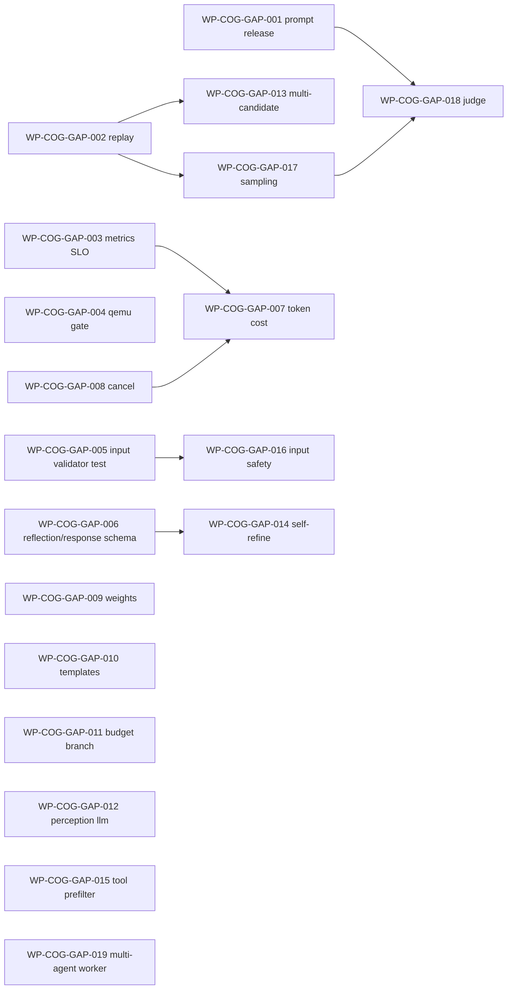

# COG-EVAL-2026-05-31 cognition 子系统落地评估与生产级缺口治理任务规划

状态：Draft
日期：2026-05-31
来源：用户专项评估请求
评估范围：[docs/architecture/DASALL_Agent_architecture.md](../architecture/DASALL_Agent_architecture.md)、[docs/architecture/DASALL_cognition子系统详细设计.md](../architecture/DASALL_cognition子系统详细设计.md)、[cognition/](../../cognition/)（include 686 行 + src 9053 行 + 51 文件）、[tests/unit/cognition/CMakeLists.txt](../../tests/unit/cognition/CMakeLists.txt)、[tests/integration/cognition/CMakeLists.txt](../../tests/integration/cognition/CMakeLists.txt)
评估方法：以实际落地代码为核心判据，结合架构与详设硬约束、行业最佳实践（OpenAI Agents SDK / LangGraph / Reflexion / Self-Refine / DSPy / Letta / Outlines / OpenTelemetry semconv）做对账。

---

## 0. 文档定位与读者

1. 给项目治理与里程碑评审提供一份对 cognition 子系统**生产级达成度**的可追溯结论。
2. 给后续 work package（WP-COG-GAP-*）提供可执行的拆分基线与排序依据。
3. 任何条目都必须能回链到代码文件:行 或 文档章节;凡当前判定不确定的，标注 `待验证` 而非自圆其说。

---

## 1. 评估结论摘要

| 维度 | 现状 | 结论 |
|---|---|---|
| 子系统骨架（5 阶段 + 3 入口 + 投影/校验/遥测/策略投影/LLM 桥） | 编译可跑、测试齐备 | **结构层达成度高（约 70%）** |
| 与 ADR-006 / ADR-007 / ADR-008 owner 边界 | 严格遵守：cognition/src 内 `grep ToolManager / MemoryStore / KnowledgeService / PromptRegistry / PromptComposer` 全部为空；`ILLMManager` 仅出现在 [CognitionDependencies.h](../../cognition/include/CognitionDependencies.h) 与 [CognitionLlmBridge.h](../../cognition/src/llm/CognitionLlmBridge.h) | **边界合规** |
| contracts 不被 cognition 侵入 | PlanGraph / ActionDecision 留在 [cognition/include/](../../cognition/include/)；contracts 仅留 `ReflectionDecision` 与 `ActionDecisionTag` | **契约纪律 OK** |
| Schema baseline `cognition.plan.v1` / `cognition.reasoning.v1` | 已冻结，见 [StageSchemaRegistry.cpp](../../cognition/src/validation/StageSchemaRegistry.cpp#L8) / [StageSchemaRegistry.cpp](../../cognition/src/validation/StageSchemaRegistry.cpp#L64) | **达成** |
| Schema baseline `cognition.reflection.v1` / `cognition.response.v1` | 已冻结，见 [StageSchemaRegistry.cpp](../../cognition/src/validation/StageSchemaRegistry.cpp) 与 [ResponseBuilder.cpp](../../cognition/src/response/ResponseBuilder.cpp) 的 structured envelope 消费路径 | **达成（2026-06-01）** |
| 五档 profile 兼容性 + 预算感知 + 模板/规则降级 | `CognitionProfileCompatibilityTest` / `BudgetAwareDecisionTest` / `CognitionFacadeDegradedModeTest` 均存在 | **达成** |
| 业务链贯通（Runtime ↔ Cognition ↔ LLM ↔ Memory ↔ Response） | 决策/反思/响应三链路 + 5 类失败注入均有集成测 | **可贯通，但深度有限** |
| 真实落地 vs 桩 | 无空跑/伪实现；但 perception / reasoner / reflection 仍属"启发式骨架"，**深度不足** | **无虚假，但语义薄** |
| 距离生产级 | 仍欠 prompt-eval 闭环、可重放、嵌入式 gate、生产 SLO、token 成本归因、入口安全 | **未到生产级** |

总体结论：cognition 已完成**架构/接口/治理面**的真实落地（骨架层），**语义面与生产治理面**仍有显著缺口；GA 前必须收敛 P0 项。

---

## 2. DASALL 整体架构目标 vs Cognition 落地（条目级对账）

| 架构原则 / 目标 | 落地证据 | 结论 |
|---|---|---|
| 控制与认知分离 | [CognitionFacade.cpp](../../cognition/src/CognitionFacade.cpp) 仅产出建议；不调 ToolManager / MemoryStore | 达成 |
| 认知与执行分离 | `ActionDecision.tool_intent_hint` 仅为提示，无完整工具参数 | 达成 |
| 平台与业务分离 | cognition/src 无 profile 相关 `#ifdef` 分支 | 达成 |
| 契约优先 | PlanGraph / ActionDecision / BeliefUpdateHint 留在 cognition/include | 达成 |
| 可裁剪可定制 | [StagePolicyResolver.cpp](../../cognition/src/StagePolicyResolver.cpp) + [CognitionConfigProjector.cpp](../../cognition/src/config/CognitionConfigProjector.cpp) 走 profile 投影 | 达成 |
| 可观测（log/trace/metric/audit） | [CognitionTelemetry.cpp](../../cognition/src/observability/CognitionTelemetry.cpp) 覆盖 stage_started / completed / failed / clarification / response_degraded；redaction 默认开 | 基本达成；**生产 sink live 验证 + token/cost 归因 待补** |
| 可恢复（超时/重试/回退/降级/恢复） | `run_stage_with_deadline` 给每个 stage 加 deadline；模板/规则降级；Reflection 出 `ReflectionDecision` 由 Runtime 裁定 | 达成；deadline 触发后**底层 LLM 无 cancel 通道**（token 仍会被烧），见 [CognitionFacade.cpp](../../cognition/src/CognitionFacade.cpp#L57) `run_stage_with_deadline` |
| 跨平台/资源裁剪 | 五档 profile 都开 cognition；StagePolicyResolver 走 budget 投影 | **未做嵌入式实测 gate**：无 `cognition_qemu_or_arm_smoke`，与 access / infra / runtime 风格不一致 |

**普遍性架构缺口**：cognition 未感知 LLM 子系统的 prompt release 状态（eval=blocked / retired），所有 prompt 治理失败都笼统降为 `cognition.llm_unavailable`，对 Runtime 降级裁定不利。生产级建议把"prompt release 失效"映射成 `cognition.policy_denied`。

---

## 3. Cognition 详细设计 vs 实际代码（差距矩阵）

下表只列**有差距/有风险**的条目；全部 223 项可验证要求清单见 [docs/architecture/DASALL_cognition子系统详细设计.md](../architecture/DASALL_cognition子系统详细设计.md)。

### 3.1 已完整落地（抽样）

- 三入口 `decide / reflect / build`：[CognitionFacade.cpp](../../cognition/src/CognitionFacade.cpp)。
- canonical stage key（planning/execution/reflection/response）：[CognitionFacade.cpp](../../cognition/src/CognitionFacade.cpp#L429)、[CognitionFacade.cpp](../../cognition/src/CognitionFacade.cpp#L480)、[CognitionFacade.cpp](../../cognition/src/CognitionFacade.cpp#L822)。
- ContextSufficiencySignal.recommend_context_reload 真实写入：[CognitionFacade.cpp](../../cognition/src/CognitionFacade.cpp#L585)、[CognitionFacade.cpp](../../cognition/src/CognitionFacade.cpp#L1080)。
- 结构化投影方案 A：[ActionDecisionStructuredProjector.cpp](../../cognition/src/projection/ActionDecisionStructuredProjector.cpp)、[PlanGraphStructuredProjector.cpp](../../cognition/src/projection/PlanGraphStructuredProjector.cpp)、[StageOutputValidator.cpp](../../cognition/src/validation/StageOutputValidator.cpp)。
- Reflection 通过 LLM 桥：由 [CognitionFacade.cpp](../../cognition/src/CognitionFacade.cpp#L1647) `consume_reflection_bridge_stage` 调用，本地兜底由 ReflectionEngine 持有。

### 3.2 真实存在但深度不足（"非虚假，但启发式过浅"）

| 设计 ID | 现状 | 风险 | 关联缺口 |
|---|---|---|---|
| COG-V-MB002 / COG-V-CFG007（Perception） | [PerceptionEngine.cpp](../../cognition/src/perception/PerceptionEngine.cpp)、[CognitionFacade.cpp](../../cognition/src/CognitionFacade.cpp)、[StageSchemaRegistry.cpp](../../cognition/src/validation/StageSchemaRegistry.cpp) 与 [StageOutputValidator.cpp](../../cognition/src/validation/StageOutputValidator.cpp) 已形成 canonical perception dual-path：structured perception 经 raw schema + typed projection + invariant 校验后可成为 authoritative source，并与规则结果做 conflict / clarification 比对 | 更高层 installed/qemu 证据待补；`edge_minimal` 继续依赖规则兜底 | 已完成（WP-COG-GAP-012） |
| COG-V-SUP005（Reasoner 决策评分） | [Reasoner.cpp](../../cognition/src/reasoning/Reasoner.cpp) 硬编码权重 0.30/0.35/0.20 | 无校准、无随回归 telemetry 调权 | GAP-P1-D |
| Reflection 假设失效 / 失败归因 | [ReflectionEngine.cpp](../../cognition/src/reflection/ReflectionEngine.cpp) 关键词字符串匹配；LLM 桥仅"加强"，主路径仍规则 | 失败归因解释力弱；abort_safe 偏保守 | GAP-P2-C |
| Response template fallback 文案 | [ResponseBuilder.cpp](../../cognition/src/response/ResponseBuilder.cpp) 模板字面量内嵌 | 不便多语言/品牌化 | GAP-P1-E |
| `cognition.reflection.v1` schema | [StageSchemaRegistry.cpp](../../cognition/src/validation/StageSchemaRegistry.cpp) 已冻结 reflection schema；[CognitionFacade.cpp](../../cognition/src/CognitionFacade.cpp) 反思桥成功路径现在以 raw schema + typed projection + invariant 校验后的 payload 为 authoritative source | schema / projection / invariant failure 可观测且仅在 `degraded_path_allowed=true` 时退回本地 ReflectionEngine | 已完成（WP-COG-GAP-006） |
| `cognition.response.v1` schema | [ResponseBuilder.cpp](../../cognition/src/response/ResponseBuilder.cpp) 已切到 `JsonObject` + structured envelope；bridge/raw payload/ResponseBuildResult 三层统一校验 `fallback_used` 与 `AgentResult.status` | response 阶段已具备 schema 驱动校验，不再把 bridge content 当纯文本 summary 直接吞入 | 已完成（WP-COG-GAP-006） |
| COG-V-TEST015（InputBoundaryValidatorTest） | tests CMake 中**未独立挂出**该单测 | 字段缺失拒绝路径回归覆盖率不高 | GAP-P0-E |

### 3.3 设计声明但代码层未显性兑现

| 设计要求 | 现状 | 缺口 | 关联缺口 |
|---|---|---|---|
| BudgetContext 三档行为分级（COG-V-BUD002–4） | Planner 有 node cap 收紧；0.8 阈值"必须优先 ConvergeSafe"未在 Reasoner 显式分支呈现 | 决策路径在审计中无可量化字段 | GAP-P1-F |
| 取消语义（COG-V-ISO003 / 004） | `run_stage_with_deadline` 用 `std::async` + `wait_for`；超时后**不取消**底层 future | LLM token 仍可能被烧 | GAP-P1-C |
| 阶段 metric 标签（COG-V-METRIC002） | `CognitionTelemetry` 以 log / audit 形式发出 | metric name 是否真被 metrics sink 收下 待验证 | GAP-P0-C |
| Production telemetry / production logging（§6.11.5 + §13） | `CognitionProductionTelemetryIntegrationTest` / `CognitionProductionLoggingIntegrationTest` 已存在 | OK；嵌入式 gate 未对齐 | GAP-P0-D |

### 3.4 未发现虚假实现（验证证据）

- `grep -rn "ToolManager\|MemoryStore\|KnowledgeService\|PromptRegistry\|PromptComposer" cognition/` 命中数为 0。
- `ILLMManager` 仅出现在桥与依赖头：[CognitionDependencies.h](../../cognition/include/CognitionDependencies.h)、[CognitionLlmBridge.h](../../cognition/src/llm/CognitionLlmBridge.h)、[CognitionLlmBridge.cpp](../../cognition/src/llm/CognitionLlmBridge.cpp#L270)。
- LLM 桥真实接 `ILLMManager::generate / stream_generate`，不是空跑。
- 抽样 24 个测试目标，23 个能在 tests CMake 中定位；唯一缺失的 `InputBoundaryValidatorTest` 已列入 GAP-P0-E。

---

## 4. 业务链 / 功能链贯通性

| 业务链 | 路径 | 状态 | 证据 |
|---|---|---|---|
| 主成功链 | Runtime → decide → (Plan/Reason via LLM Bridge) → Runtime tool exec → reflect → build | 贯通 | `CognitionRuntimeIntegrationTest`、`RuntimeCognitionLoopSmokeTest` |
| 澄清链 | decide → AskClarification → Runtime WaitingClarify → 用户补充 | 贯通 | `ReasonerClarificationThresholdTest`、`make_clarification_fallback` |
| 重规划链 | reflect → ReflectionDecision::Replan → Runtime 触发 Planner replan | 贯通 | `PlannerReplanTest` + Facade reflection 桥路径 |
| LLM 不可用降级链 | bridge 失败 → rule_fallback / template_fallback → `fallback_used=true` | 贯通 | `CognitionFacadeDegradedModeTest`、`ResponseBuilderTemplateFallbackTest` |
| 失败注入链（5 类） | llm unavailable / schema violation / missing belief / contradictory observation / response fallback | 贯通 | `CognitionFailureInjectionIntegrationTest` |
| 观测链 | Cognition emit → infra sink | 代码贯通；**生产 sink live 待核** | `CognitionProductionTelemetryIntegrationTest` |
| Memory 回写链 | Cognition `BeliefUpdateHint` → Runtime → Memory writeback | 接口贯通；**Memory 端原子性 / 冲突消解契约测**未落 cognition 仓 | 跨子系统协同缺口 |
| 多 Agent / WorkerTask | Multi-Agent owner | **未在 cognition 仓内验证**；属合规推迟 | 后续阶段任务 |
| 嵌入式 / ARM | 仅 ProfileCompatibility | **未做 qemu gate** | GAP-P0-D |

---

## 5. 行业最佳实践对照

| 维度 | 行业主流（2025/2026） | DASALL Cognition 现状 | 评价 / 行动 |
|---|---|---|---|
| Pipeline 形态 | ReAct / Plan-and-Solve / LangGraph 多以**有状态图** + 工具路由 | 线性五段 + Reflection 重规划 | 设计简洁；复杂任务上限低，建议引入多 plan candidate（GAP-P2-D） |
| 结构化输出 | OpenAI JSON mode / Anthropic tool_use / Outlines / Instructor | 自研 `StageSchemaSpec` + 投影 + 投影后 invariant 校验 | 方向正确；建议 schema 直送 provider JSON mode（GAP-P1-A 配套） |
| Prompt 治理 | LangSmith / Promptfoo / DSPy 做版本+评估+回归 | Prompt 由 LLM 子系统 owner；**release 状态不回流 cognition** | **GA 硬缺口**（GAP-P0-A） |
| 工具选择 | function calling 直接产 tool_call args | Cognition 仅产 `tool_intent_hint` | 与 ADR-002 一致；缺**工具候选预筛**（GAP-P2-E） |
| 反思 / 自我修复 | Reflexion / Self-Refine / Critic-of-Critic | 单轮 reflection + Runtime replan | 推理错误兜底弱（GAP-P2-C） |
| 内存与上下文 | Mem0 / Letta / GraphRAG | ContextOrchestrator 由 Memory owner | 架构对齐 |
| 评估 | LLM-as-judge / golden trace / replay | 仅契约 + 单测 + 失败注入 | **缺 replay & golden trace**（GAP-P0-B） |
| 性能 / SLO | p50/p95/p99 stage_latency、token cost per task | stage_latency_ms histogram 已声明 | **未发布 SLO 阈值**；token 成本未在 cognition metric（GAP-P1-B） |
| 安全 | Prompt-injection / PII redaction / output safety | 输出 redaction 完善；**输入侧无 PII / injection 检测** | 入口扫描信号待补（GAP-P3-A） |
| 可重放 | replay harness + deterministic seed | 无 | GA 硬缺口（GAP-P0-B） |
| 设备就绪 | ARM 嵌入式跑通 + qemu CI gate | 仅 ProfileCompatibility | **GAP-P0-D** |

---

## 6. 距离生产级交付的核心缺口（按优先级聚类）

### P0（GA blocker）

- **GAP-P0-A**：Prompt release 状态回流。`CognitionLlmBridge` 必须识别 LLM 侧 release/eval 信号，把 `prompt_retired / eval_blocked` 映射为 `cognition.policy_denied`，与 `cognition.llm_unavailable` 区分。
- **GAP-P0-B**：可重放 / Golden Trace。把 `CognitionStepRequest` + 投影后 LLM 输出 + `CognitionDecisionResult` 落盘为 replay 数据集；CI 增加 `CognitionReplayRegressionTest`。
- **GAP-P0-C**：生产 sink live 验证。抽查 `cognition_stage_latency_ms` / `cognition_stage_total` / `cognition_action_decision_total` 是否真正被 metrics provider 持有；发布 stage_latency 的 SLO 表（p95/p99）。
- **GAP-P0-D**：嵌入式 gate。补 `cognition_qemu_or_arm_smoke`，对齐 access / infra / runtime 的 qemu gate 模式；最小验证 edge_minimal profile 在 ARM 上的 decide+build。
- **GAP-P0-E**：`InputBoundaryValidatorTest` 单测独立化（详设 COG-V-TEST015）。

### P1（生产稳定性）

- **GAP-P1-A**：冻结 `cognition.reflection.v1` 与 `cognition.response.v1` schema，把现有 diagnostics 字符串判定升级为 schema 驱动。
- **GAP-P1-B**：Token / cost / finish_reason 注入 `CognitionTelemetry`，做预算消耗归因（不止依赖 BudgetContext 输入）。
- **GAP-P1-C**：超时取消传递。在 LlmBridge 增加 `abandon_call(call_id)`，Facade deadline 触发时调用一次，避免 token 泄漏。
- **GAP-P1-D**：Reasoner 决策权重 0.30/0.35/0.20 进 `CognitionConfig`，配合 profile 投影；预留离线校准接口。
- **GAP-P1-E**：Response template fallback 文案外置到 profile / skill 配置，去掉 [ResponseBuilder.cpp](../../cognition/src/response/ResponseBuilder.cpp) 内字面量。
- **GAP-P1-F**：BudgetContext ≥ 0.8 强制 ConvergeSafe / DirectResponse 的**显式分支**，并在审计写 `budget_pressure_decision_path` 字段。

### P2（认知质量与扩展）

- **GAP-P2-A（已完成，2026-06-01）**：Perception canonical stage、`cognition.perception.v1` schema、`perception.llm_enabled` profile 投影与“LLM 意图分类 + 规则冗余校验”双路径已由 WP-COG-GAP-012 收口；保留规则做 ARM/factory 兜底，并在结果分歧时升级 clarification。
- **GAP-P2-B**：多候选 Plan。Planner 支持产生 N=2~3 plan candidate，Reasoner 用 budget+confidence 排序。
- **GAP-P2-C**：Reflection 多轮。对推理错误（非工具错误）开放 1 次 self-refine 循环，预算封顶。
- **GAP-P2-D**：（与 GAP-P2-B 协同）引入 plan-candidate 评估器（self-consistency vote），不破坏 ADR-007/008 边界。
- **GAP-P2-E**：Tool 候选预筛。Reasoner 收到 ToolDescriptor 列表后做 top-K（embedding/规则）过滤，下发给 Runtime 时仅给候选集合。

### P3（运营 / 演进 / 安全）

- **GAP-P3-A**：入口 PII / injection 扫描信号传入 `CognitionStepRequest.execution_hints`，cognition 显式拒绝高危输入；与 Memory ContextOrchestrator 协议对齐。
- **GAP-P3-B**：失败语料采样 + 离线人评，回喂 prompt 库与决策权重。
- **GAP-P3-C**：LLM-as-judge 自动评测主成功链回归。
- **GAP-P3-D**：多 Agent worker 内嵌 cognition 的隔离 / 延迟基准。

---

## 7. 任务拆分与规划（WP-COG-GAP-*）

任务命名规范遵循仓库现有 [docs/todos/cognition/deliverables/](../todos/cognition/deliverables/) 风格；每条任务三件套：**代码目标 / 测试目标 / 验收命令**，可直接进入 Design→Build 双轨。每条任务都配置阻塞依赖与解阻条件，避免内部死锁。

### 7.1 P0 任务（GA 前必须收敛）

#### WP-COG-GAP-001 Prompt release 状态回流（GAP-P0-A）

- **代码目标**
  - 在 [CognitionLlmBridge.cpp](../../cognition/src/llm/CognitionLlmBridge.cpp) 增加 release 状态识别：从 `LLMResponse` 的 release/eval 元字段（与 LLM 子系统对齐字段名）映射到 `ResultCode::PolicyDenied`。
  - 错误归一化中区分 `cognition.policy_denied`（prompt 退役/评估封禁）与 `cognition.llm_unavailable`（连接/超时）。
- **测试目标**
  - 新增 `CognitionLlmBridgePromptReleaseGuardTest`，覆盖 `prompt_retired / eval_blocked` 两种语义。
  - 扩展 `CognitionLlmBridgeErrorMappingTest`，断言 unavailable 与 policy_denied 不互相吞错。
- **验收命令**
  - `cmake --build build-ci --target dasall_cognition dasall_unit_tests`
  - `ctest --test-dir build-ci -R "CognitionLlmBridgePromptReleaseGuardTest|CognitionLlmBridgeErrorMappingTest" --output-on-failure`
- **阻塞 / 解阻**：已解阻。LLM 子系统的 `eval_status/release_scope` 命名已在 `PromptRelease` / `LLMResponse` 审计四元组中对齐，可直接实施。

**Closeout（2026-05-31）**

- 状态：代码切片与 focused regression 已闭合；聚合 `dasall_unit_tests` 验收仍受 repo 现有 infra baseline 阻断。
- 设计回链：
  - [docs/architecture/DASALL_llm子系统详细设计.md](../architecture/DASALL_llm子系统详细设计.md) 已冻结 `LLMResponse` 的 `prompt_id/prompt_version/eval_status/release_scope` 四元审计锚点。
  - [docs/architecture/DASALL_cognition子系统详细设计.md](../architecture/DASALL_cognition子系统详细设计.md) 已补充 `CognitionLlmBridge` 对 `prompt_retired` / `eval_blocked` 的 `PolicyDenied` 映射与验收出口。
- 代码结果：
  - `contracts/include/llm/LLMResponse.h`、`contracts/include/llm/LLMBoundaryGuards.h`、`llm/src/LLMManager.cpp` 与 `llm/src/execution/ResponseNormalizer.*` 已把 prompt release 审计元字段从 llm 归一化链路带回共享响应。
  - `cognition/src/llm/CognitionLlmBridge.cpp` 成功路径现在会把 `Deprecated` / `retired` / `blocked` 语义映射为 `ResultCode::PolicyDenied`，并保留 `prompt_retired` / `eval_blocked` diagnostics。
  - 已新增 `tests/unit/cognition/CognitionLlmBridgePromptReleaseGuardTest.cpp`，并扩展 `CognitionLlmBridgeErrorMappingTest.cpp` / `CognitionLlmBridgeProjectionTest.cpp`，防止 `policy_denied` 与 `llm_unavailable` 互相吞错。
- 验证结果：
  - `RunCtest_CMakeTools(tests=["CognitionLlmBridgePromptReleaseGuardTest","CognitionLlmBridgeErrorMappingTest"])`：通过，`100% tests passed, 0 tests failed out of 2`。
  - `cmake --build build-ci --target dasall_cognition dasall_unit_tests`：`dasall_cognition` 与本轮 touched bridge/llm test slice 构建通过，但聚合 `dasall_unit_tests` 在 repo 现有 infra baseline 处失败；复核显示 `MetricsConfigMergeTest` 在活动 build tree 同样失败，另有 `build-ci` 下 `SecretManagerLiveCompositionTest` 缺失 executable 的既有构建树问题。

#### WP-COG-GAP-002 可重放 Golden Trace（GAP-P0-B）

- **代码目标**
  - 在 cognition 内引入轻量 trace recorder（仅在 build-ci/replay profile 启用），把 `CognitionStepRequest`、桥后 LLM 投影 payload、`CognitionDecisionResult` 序列化到 `tests/data/cognition/replay/`。
  - Recorder 不入主路径，必须经 DI 注入；redaction 复用 `CognitionTelemetry` redactor。
- **测试目标**
  - 新增 `CognitionReplayRegressionTest`（unit 或 integration）：读取 golden 集，跑 `decide()` / `reflect()` / `build()`，对照预期结构化字段断言（不比 LLM 文本）。
- **验收命令**
  - `cmake --build build-ci --target dasall_unit_tests`
  - `ctest --test-dir build-ci -R "CognitionReplayRegressionTest" --output-on-failure`
- **阻塞 / 解阻**：需先固定 redaction 输出格式（已就绪）；与 GAP-P1-B 字段共享。

**Closeout（2026-05-31）**

- 状态：已完成（replay recorder、golden 数据集与 build-tree/build-ci focused regression 已闭合；聚合 `dasall_unit_tests` 验收仍受 repo 既有 runtime/memory baseline 阻断）。
- 设计回链：
  - [docs/architecture/DASALL_cognition子系统详细设计.md](../architecture/DASALL_cognition子系统详细设计.md) 已在 `CognitionTelemetry` 组件卡片补充 redaction-before-dispatch 与 owner 内部 sink seam 约束，明确 replay recorder 只能消费 request / bridge payload / result 的结构化语义字段。
  - replay golden 继续遵守 cognition 与 llm 的观测分层：不复制 raw prompt、provider-private payload 或 runtime 恢复审计事实。
- 代码结果：
  - `cognition/include/CognitionDependencies.h` 与 `cognition/src/observability/CognitionTelemetry.cpp` 已支持可选 `ICognitionTelemetrySink` 注入，并把 live sink 与自定义 sink 组合为 redaction 后的 fan-out 路径。
  - 新增 `cognition/src/observability/CognitionReplayTraceRecorder.h`，以 header-only recorder 形式在 `profile_id == build-ci/replay` 时落盘 replay trace。
  - `cognition/src/CognitionFacade.cpp` 与 `cognition/src/response/ResponseBuilder.cpp` 已发射 `replay.trace.decide.*`、`replay.trace.reflect.*`、`replay.trace.build.*` 事件，并在 bridge 成功时补齐 planning / execution payload trace。
  - 新增 `tests/unit/cognition/CognitionReplayRegressionTest.cpp`，更新 `tests/unit/cognition/CMakeLists.txt`，并在 `tests/data/cognition/replay/` 固定 11 个 golden trace 文件，覆盖 decide direct、decide planning fallback、reflect continue、build observation projection 四个场景。
  - `tests/unit/cognition/CognitionTelemetryFieldsTest.cpp` 已补 replay sink 注入回归，防止 redaction 与 fan-out 顺序回退。
- 验证结果：
  - `Build_CMakeTools(buildTargets=["dasall_cognition_replay_regression_unit_test"])`：通过。
  - `RunCtest_CMakeTools(tests=["CognitionReplayRegressionTest"])`：通过，`100% tests passed, 0 tests failed out of 1`。
  - `ctest --test-dir build-ci -R "CognitionReplayRegressionTest|CognitionTelemetryFieldsTest" --output-on-failure`：通过，`100% tests passed, 0 tests failed out of 2`。
  - `cmake --build build-ci --target dasall_unit_tests`：本轮 touched cognition slice 已完成重编译，但聚合命令仍命中 repo 既有 baseline：`RuntimeOwnerLoggingTest` / `RuntimeLoggingBridgeTest` 缺失 executable，`RuntimeCognitionLoopSmokeTest` 失败，且 memory 侧仍有 discoverability 缺口；这些红灯不由本轮 replay/golden 变更引入。
- 结果：
  - cognition 现在具备可重放 golden trace 回归，能够稳定锁定 decide / reflect / build 主链的 request、bridge payload、result 序列，不再依赖人工比对临时输出。
  - replay recorder 复用既有 telemetry redaction 与 DI seam，没有在主链引入新的 owner 越界依赖或旁路落盘逻辑。
  - `WP-COG-GAP-002` 的代码与 focused regression 已闭合；若后续需要把该任务升级为 repo-wide aggregate green gate，需先独立清理 runtime / memory 既有 baseline。

#### WP-COG-GAP-003 生产 metric live 验证 + SLO 表（GAP-P0-C）

- **代码目标**
  - 检查 `cognition_stage_latency_ms`、`cognition_stage_total`、`cognition_action_decision_total` 是否注册到 metrics provider；如缺失则在 [CognitionTelemetry.cpp](../../cognition/src/observability/CognitionTelemetry.cpp) 完成注册。
  - 在 [docs/architecture/DASALL_cognition子系统详细设计.md](../architecture/DASALL_cognition子系统详细设计.md) §6.11 追加 SLO 表：p50/p95/p99 stage_latency 阈值（按 desktop_full / edge_balanced / edge_minimal 三档）。
- **测试目标**
  - 扩展 `CognitionProductionTelemetryIntegrationTest`：断言 metrics registry 中三个 metric name 真实存在并带规范标签 `stage,result,decision_kind,profile`。
- **验收命令**
  - `ctest --test-dir build-ci -R "CognitionProductionTelemetryIntegrationTest" --output-on-failure`
- **阻塞 / 解阻**：依赖 infra metrics provider 已就位（已就绪）。

**Closeout（2026-06-01）**

- 状态：已完成（semantic metric live registration、focused telemetry integration regression 与 §6.11 SLO 文档已闭合）。
- 设计回链：
  - [docs/architecture/DASALL_cognition子系统详细设计.md](../architecture/DASALL_cognition子系统详细设计.md) §6.11 现已明确 `cognition_stage_latency_ms`、`cognition_stage_total`、`cognition_action_decision_total` 的 live metric 口径，并补齐 desktop_full / edge_balanced / edge_minimal 三档 stage_latency SLO。
  - 为保持 infra metrics schema 单一事实源，任务文案里的 `result` 维度在 provider 内继续沿用 canonical `outcome` 标签名，不再分叉出第二套 label key。
- 代码结果：
  - 更新 [infra/include/metrics/MetricTypes.h](../../infra/include/metrics/MetricTypes.h)、[infra/src/metrics/CardinalityGuard.cpp](../../infra/src/metrics/CardinalityGuard.cpp) 与 [infra/src/metrics/MetricsConfigPolicy.cpp](../../infra/src/metrics/MetricsConfigPolicy.cpp)，把 `decision_kind` 纳入 metrics allowlist、归一化与 series signature，保证 semantic metric 标签不会被 provider 丢弃。
  - 更新 [cognition/src/observability/CognitionTelemetry.h](../../cognition/src/observability/CognitionTelemetry.h) 与 [cognition/src/observability/CognitionTelemetry.cpp](../../cognition/src/observability/CognitionTelemetry.cpp)，让 telemetry sink 按 counter / histogram 注册真实 instrument，并发射 `cognition_stage_latency_ms`、`cognition_stage_total`、`cognition_action_decision_total` 三个 semantic metric。
  - 更新 [cognition/src/CognitionFacade.cpp](../../cognition/src/CognitionFacade.cpp) 与 [cognition/src/response/ResponseBuilder.cpp](../../cognition/src/response/ResponseBuilder.cpp)，在 completed / failed / degraded 发射前捕获 `latency_ms`，使 stage latency histogram 不再只有声明没有 live 样本。
  - 更新 [tests/integration/cognition/CognitionProductionTelemetryIntegrationTest.cpp](../../tests/integration/cognition/CognitionProductionTelemetryIntegrationTest.cpp)，断言 metrics registry 真实注册三个 metric name，并验证 `stage/profile/result(outcome)/decision_kind` 标签在 success、failure、degraded 三条路径上可见。
- 验证结果：
  - `Build_CMakeTools(buildTargets=["dasall_cognition_production_telemetry_integration_test"])`：通过。
  - `RunCtest_CMakeTools(tests=["CognitionProductionTelemetryIntegrationTest"])`：通过；`100% tests passed, 0 tests failed out of 1`。
- 结果：
  - cognition 的 live metrics provider 现在会真实持有 `cognition_stage_latency_ms`、`cognition_stage_total`、`cognition_action_decision_total`，不再只停留在详细设计表格和 generic event counter。
  - `WP-COG-GAP-003` 已为后续 token / cost / finish_reason 归因提供稳定指标底座；新增 SLO 阈值也与现有 profile timeout/degrade 预算保持一致，没有引入第二套 owner 口径。

#### WP-COG-GAP-004 cognition 嵌入式 / qemu gate（GAP-P0-D）

- **代码目标**
  - 新增 `scripts/packaging/run_local_qemu_cognition_gate.sh`（参考 access/infra 现有脚本），在 ARM qemu 镜像里跑 edge_minimal profile 下 cognition 的 decide+build smoke。
  - CI 增加 `cognition_qemu_or_arm_smoke` task。
- **测试目标**
  - 新增 `CognitionEdgeMinimalSmokeTest`（installed 形态），断言三入口在 ARM 镜像内可达预期 ResultCode。
- **验收命令**
  - `sh scripts/packaging/run_local_qemu_cognition_gate.sh`
- **阻塞 / 解阻**：依赖 packaging / qemu 镜像基线（已就绪），需要复用 RTSUP-FIX-005 的 qemu 基础设施。

#### WP-COG-GAP-005 InputBoundaryValidatorTest 独立化（GAP-P0-E）

- **代码目标**：无（仅测试）。
- **测试目标**
  - 在 [tests/unit/cognition/](../../tests/unit/cognition/) 新增 `InputBoundaryValidatorTest.cpp`，覆盖缺 GoalContract / ContextPacket / BeliefState 三类场景。
  - 在 [tests/unit/cognition/CMakeLists.txt](../../tests/unit/cognition/CMakeLists.txt) 注册。
- **验收命令**
  - `ctest --test-dir build-ci -R "InputBoundaryValidatorTest" --output-on-failure`
- **阻塞 / 解阻**：无。

### 7.2 P1 任务（生产稳定性）

#### WP-COG-GAP-006 reflection.v1 / response.v1 schema 冻结（GAP-P1-A）

- **代码目标**
  - 在 [StageSchemaRegistry.cpp](../../cognition/src/validation/StageSchemaRegistry.cpp) 追加 `kReflectionSchema`（schema_version `cognition.reflection.v1`）与 `kResponseSchema`（`cognition.response.v1`）。
  - Facade reflection / response 路径切到结构化校验，replace diagnostics 字符串匹配。
- **测试目标**
  - 新增 `StageOutputValidatorReflectionInvariantTest`、`StageOutputValidatorResponseEnvelopeTest` 扩展。
  - 集成测：`CognitionReflectionStructuredOutputIntegrationTest`。
- **验收命令**
  - `ctest --test-dir build-ci -R "StageOutputValidatorReflection|CognitionReflectionStructured" --output-on-failure`
- **阻塞 / 解阻**：依赖 reflection 桥已存在（已就绪）。

**Closeout（2026-06-01）**

- 状态：已完成（reflection / response v1 schema freeze、authoritative structured consumption 与 focused regression 已闭合）。
- 设计回链：
  - [docs/architecture/DASALL_cognition子系统详细设计.md](../architecture/DASALL_cognition子系统详细设计.md) 已补 reflection / response 的 schema baseline、structured output authority 与 ResponseBuilder structured envelope 约束。
  - 外部 Structured Outputs 口径继续对齐 OpenAI JSON mode：schema 违例、typed projection 失败与 provider failure 仍分层处理，fallback 仅由 cognition owner policy 决定。
- 代码结果：
  - 更新 [cognition/src/validation/StageSchemaRegistry.h](../../cognition/src/validation/StageSchemaRegistry.h)、[cognition/src/validation/StageSchemaRegistry.cpp](../../cognition/src/validation/StageSchemaRegistry.cpp) 与 [tests/unit/cognition/StageSchemaRegistryTest.cpp](../../tests/unit/cognition/StageSchemaRegistryTest.cpp)，冻结 `cognition.reflection.v1` / `cognition.response.v1` raw schema baseline。
  - 更新 [cognition/src/validation/StageOutputValidator.h](../../cognition/src/validation/StageOutputValidator.h)、[cognition/src/validation/StageOutputValidator.cpp](../../cognition/src/validation/StageOutputValidator.cpp)、[tests/unit/cognition/StageOutputValidatorReflectionInvariantTest.cpp](../../tests/unit/cognition/StageOutputValidatorReflectionInvariantTest.cpp) 与 [tests/unit/cognition/StageOutputValidatorResponseEnvelopeTest.cpp](../../tests/unit/cognition/StageOutputValidatorResponseEnvelopeTest.cpp)，补 reflection typed invariant 与 response envelope invariant 校验。
  - 更新 [cognition/src/CognitionFacade.cpp](../../cognition/src/CognitionFacade.cpp)，让 reflection 桥成功路径切到 `schema://cognition/reflection/v1`，并在 raw schema -> typed projection -> invariant 校验通过后把 bridge payload 作为 `ReflectionDecision` 的 authoritative source；仅在 `degraded_path_allowed=true` 时退回本地 ReflectionEngine。
  - 更新 [cognition/src/response/ResponseBuilder.cpp](../../cognition/src/response/ResponseBuilder.cpp)，把 response 桥请求切到 `JsonObject` + `schema://cognition/response/v1`，将 structured payload 投影为 `ResponseEnvelope`，并在 bridge/raw payload/ResponseBuildResult 三层统一校验 `fallback_used` 与 `AgentResult.status` 一致性。
  - 新增 [tests/integration/cognition/CognitionReflectionStructuredOutputIntegrationTest.cpp](../../tests/integration/cognition/CognitionReflectionStructuredOutputIntegrationTest.cpp)，并更新 [tests/integration/cognition/CMakeLists.txt](../../tests/integration/cognition/CMakeLists.txt)、[tests/unit/cognition/ResponseBuilderTemplateFallbackTest.cpp](../../tests/unit/cognition/ResponseBuilderTemplateFallbackTest.cpp)、[tests/unit/cognition/CognitionFacadeFlowTest.cpp](../../tests/unit/cognition/CognitionFacadeFlowTest.cpp) 与 [tests/unit/cognition/CMakeLists.txt](../../tests/unit/cognition/CMakeLists.txt)，固定 reflection authoritative consumption 与 response structured envelope 主路径回归。
- 验证结果：
  - `cmake --build build-ci --target dasall_stage_output_validator_reflection_invariant_unit_test dasall_cognition_reflection_structured_output_integration_test dasall_stage_output_validator_response_envelope_unit_test dasall_response_builder_template_fallback_unit_test dasall_cognition_facade_flow_unit_test`：通过。
  - `ctest --test-dir build-ci -R "^(StageOutputValidatorReflectionInvariantTest|CognitionReflectionStructuredOutputIntegrationTest|StageOutputValidatorResponseEnvelopeTest|ResponseBuilderTemplateFallbackTest|CognitionFacadeFlowTest)$" --output-on-failure`：通过；`100% tests passed, 0 tests failed out of 5`。
- 结果：
  - reflection 桥 payload 现在不再只是 diagnostics 辅助证据，而是经过 schema / projection / invariant 校验后的权威 `ReflectionDecision` 来源。
  - response 阶段不再把 bridge 内容当纯文本 summary 直吞，`ResponseEnvelope` 已具备 schema version、structured sections、omitted details 与 fallback consistency 约束。
  - `WP-COG-GAP-006` 的代码、设计回链与 focused regression 已闭合；后续 `WP-COG-GAP-007` / `WP-COG-GAP-010` 可直接建立在这套 structured response contract 上。

#### WP-COG-GAP-007 Token / cost / finish_reason 注入 telemetry（GAP-P1-B）

- **代码目标**
  - 在 `StageLlmCallResult` 内补 `prompt_tokens / completion_tokens / total_cost / finish_reason`（来自 LLM 子系统 normalized response）。
  - `CognitionTelemetry.emit_stage_completed` 增加 token/cost 字段；redaction 不剥离这类聚合数值。
- **测试目标**
  - 扩展 `CognitionTelemetryFieldsTest`：断言 token/cost/finish_reason 字段存在；redaction 不影响。
- **验收命令**
  - `ctest --test-dir build-ci -R "CognitionTelemetryFieldsTest" --output-on-failure`
- **阻塞 / 解阻**：已解阻。LLM 子系统当前 normalized response 已暴露 `input_tokens` / `output_tokens` / `finish_reason`，并通过 provider-neutral tag `usage:estimated_cost_usd=` 保留成本锚点，cognition 可直接消费而无需新增 BLOCK 任务。

**Closeout（2026-06-01）**

- 状态：已完成（bridge usage/cost 透传、completed telemetry 字段补齐与 focused regression 已闭合）。
- 设计回链：
  - [docs/architecture/DASALL_cognition子系统详细设计.md](../architecture/DASALL_cognition子系统详细设计.md) 已回写 `StageLlmCallResult` 的 `prompt_tokens / completion_tokens / total_cost / finish_reason` 口径，并明确 `stage.completed` telemetry 保留这些低敏聚合字段。
  - 本轮沿用 LLM owner 已冻结的 normalized response 事实：token / finish_reason 直接取自 `LLMResponse`，`total_cost` 取自 provider-neutral usage tag `usage:estimated_cost_usd=`，未扩张共享 `LLMResponse` contract。
- 代码结果：
  - 更新 [cognition/src/llm/CognitionLlmBridge.h](../../cognition/src/llm/CognitionLlmBridge.h) 与 [cognition/src/llm/CognitionLlmBridge.cpp](../../cognition/src/llm/CognitionLlmBridge.cpp)，让 `StageLlmCallResult` 保留 `prompt_tokens`、`completion_tokens`、`total_cost`、`finish_reason`，并把这些事实写入 bridge diagnostics 供 owner 内部 telemetry 汇总。
  - 更新 [cognition/src/CognitionFacade.cpp](../../cognition/src/CognitionFacade.cpp)、[cognition/src/observability/CognitionTelemetry.h](../../cognition/src/observability/CognitionTelemetry.h) 与 [cognition/src/observability/CognitionTelemetry.cpp](../../cognition/src/observability/CognitionTelemetry.cpp)，让 `stage.completed` 事件在 bridge usage 可用时发射 token/cost/finish_reason 字段，同时保持 metric labels 不引入高基数 usage 值。
  - 更新 [tests/unit/cognition/CognitionLlmBridgeProjectionTest.cpp](../../tests/unit/cognition/CognitionLlmBridgeProjectionTest.cpp) 与 [tests/unit/cognition/CognitionTelemetryFieldsTest.cpp](../../tests/unit/cognition/CognitionTelemetryFieldsTest.cpp)，固定 bridge 字段透传、completed telemetry 字段存在，以及 redaction 不剥离这些聚合值。
- 验证结果：
  - `Build_CMakeTools(buildTargets=["dasall_cognition_llm_bridge_projection_unit_test","dasall_cognition_telemetry_fields_unit_test"])`：通过。
  - `RunCtest_CMakeTools(tests=["CognitionLlmBridgeProjectionTest","CognitionTelemetryFieldsTest"])`：通过；`100% tests passed, 0 tests failed out of 2`。
- 结果：
  - cognition 现在能在不突破 llm/shared contract 边界的前提下，把 prompt/completion tokens、estimated cost 与 finish_reason 从 bridge 成功路径带入 `stage.completed` telemetry。
  - redaction 继续只裁剪 raw prompt / provider payload / reasoning trace 等敏感内容，不会把 token/cost/finish_reason 这类聚合归因字段误删。

#### WP-COG-GAP-008 deadline 触发时 LLM cancel 通道（GAP-P1-C）

- **代码目标**
  - 在 [CognitionLlmBridge](../../cognition/src/llm/CognitionLlmBridge.h) 暴露 `abandon_call(call_id)`，由 LLM 子系统提供底层实现。
  - [CognitionFacade.cpp](../../cognition/src/CognitionFacade.cpp) `run_stage_with_deadline` 超时分支调用一次 abandon。
- **测试目标**
  - 新增 `CognitionFacadeDeadlineCancelPropagationTest`：mock LLM 验证 abandon_call 被调用且不阻塞。
- **验收命令**
  - `ctest --test-dir build-ci -R "CognitionFacadeDeadlineCancelPropagationTest" --output-on-failure`
- **阻塞 / 解阻**：依赖 LLM 子系统接口扩展（先冻结 LLM 侧 API）。

**Closeout（2026-06-01）**

- 状态：已完成（llm abandon SPI、cognition deadline cancel propagation 与 focused regression 已闭合）。
- 设计回链：
  - [docs/architecture/DASALL_llm子系统详细设计.md](../architecture/DASALL_llm子系统详细设计.md) 现已把 `ILLMManager::abandon_call(llm_call_id)` 冻结为 best-effort 的显式取消入口，要求快速返回且不等待 provider cleanup。
  - [docs/architecture/DASALL_cognition子系统详细设计.md](../architecture/DASALL_cognition子系统详细设计.md) 已补 `CognitionLlmBridge::abandon_call(...)` 与门面层 `deadline -> abandon_call` 的异步传播语义，明确 timeout 返回不等于 provider 已完成取消。
  - 外部参考：MDN `AbortController` 明确取消信号应作为显式异步 abort 通道，可用于 request、response body consumption 与 streams；本轮据此保持 cognition timeout 路径“发信号但不等待 cleanup”语义。
- 代码结果：
  - 更新 [llm/include/ILLMManager.h](../../llm/include/ILLMManager.h)、[llm/src/LLMManager.h](../../llm/src/LLMManager.h) 与 [llm/src/LLMManager.cpp](../../llm/src/LLMManager.cpp)，新增 `abandon_call(std::string_view llm_call_id)`；当前实现优先按 `llm_call_id` 或可推导的 `session_id` 向 `StreamSessionRegistry` 发起 best-effort cancel，未命中时快速返回 false。
  - 更新 [cognition/src/llm/CognitionLlmBridge.h](../../cognition/src/llm/CognitionLlmBridge.h)、[cognition/src/llm/CognitionLlmBridge.cpp](../../cognition/src/llm/CognitionLlmBridge.cpp) 与 [cognition/src/CognitionFacade.cpp](../../cognition/src/CognitionFacade.cpp)，让 bridge 暴露 `abandon_call(...)`，并让 `run_stage_with_deadline` 在 llm bridge 超时时异步触发一次 abandon，而不阻塞 timeout 返回路径。
  - 更新 [tests/mocks/include/MockLLMManager.h](../../tests/mocks/include/MockLLMManager.h)、[tests/unit/llm/InterfaceSurfaceTest.cpp](../../tests/unit/llm/InterfaceSurfaceTest.cpp)、[apps/runtime_support/src/RuntimeLiveDependencyComposition.cpp](../../apps/runtime_support/src/RuntimeLiveDependencyComposition.cpp) 与 [tests/unit/cognition/CMakeLists.txt](../../tests/unit/cognition/CMakeLists.txt)，补齐新 SPI 的 mock / surface / scripted manager / test registration。
  - 新增 [tests/unit/cognition/CognitionFacadeDeadlineCancelPropagationTest.cpp](../../tests/unit/cognition/CognitionFacadeDeadlineCancelPropagationTest.cpp)，固定 timeout 触发 `abandon_call` 且不等待 abandon 完成的回归。
- 验证结果：
  - `Build_CMakeTools(buildTargets=["dasall_cognition_facade_deadline_cancel_propagation_unit_test","dasall_llm_interface_surface_unit_test"])`：通过。
  - `RunCtest_CMakeTools(tests=["CognitionFacadeDeadlineCancelPropagationTest","LLMInterfaceSurfaceTest"])`：通过；`100% tests passed, 0 tests failed out of 2`。
  - `Build_CMakeTools(buildTargets=["dasall_apps_runtime_support"])`：通过；`ninja: no work to do.`。
- 结果：
  - cognition 现在在 llm bridge deadline 触发后会显式发出一次 abandon 信号，而不是仅仅 detach 本地等待线程。
  - cancel 传播路径保持 non-blocking；即使底层 abandon 需要更久完成，timeout 返回仍不会被拖住。
  - 对仍不可中断的同步 unary provider，`abandon_call(...)` 当前仍是 best-effort seam，不把“已发取消”误表述为“provider 已停止计费/生成”。

#### WP-COG-GAP-009 Reasoner 权重外置（GAP-P1-D）

- **代码目标**
  - 在 [CognitionConfig.h](../../cognition/include/CognitionConfig.h) 增加 `reasoner.candidate_weights`（DirectResponse / ToolCall / Clarification / ConvergeSafe 等条目）。
  - [Reasoner.cpp](../../cognition/src/reasoning/Reasoner.cpp) 读取配置；profile 投影补默认值表。
- **测试目标**
  - 新增 `ReasonerCandidateWeightProjectionTest`，断言 profile 差异生效；同输入不同 weight 得不同决策。
- **验收命令**
  - `ctest --test-dir build-ci -R "ReasonerCandidateWeight" --output-on-failure`
- **阻塞 / 解阻**：无。

**Closeout（2026-06-01）**

- 状态：已完成（reasoner candidate weight 配置面、profile 投影、focused regression 与文档回链已闭合）。
- 设计回链：
  - [docs/architecture/DASALL_cognition子系统详细设计.md](../architecture/DASALL_cognition子系统详细设计.md) §6.10 已补 `cognition.reasoner.candidate_weights.{tool_call,direct_response,clarification,converge_safe}` 的中性默认值与 profile 倾向说明。
  - 同文档 §6.13.2 已补 reasoner 在阈值裁定前必须先经过 `reasoner.candidate_weights` 做 profile bias 校准，并把 `ReasonerCandidateWeightProjectionTest` 纳入建议验收出口。
- 代码结果：
  - 更新 [cognition/include/CognitionConfig.h](../../cognition/include/CognitionConfig.h)，在 `CognitionReasonerPolicy` 下新增 `candidate_weights`，把 tool_call / direct_response / clarification / converge_safe 四类候选权重显式外置，默认保持 `1.00` 中性值。
  - 更新 [cognition/src/config/CognitionConfigProjector.cpp](../../cognition/src/config/CognitionConfigProjector.cpp)，为 desktop_full / cloud_full / edge_balanced / edge_minimal / factory_test 五档 profile 投影不同的 reasoner candidate weight 表。
  - 更新 [cognition/src/reasoning/Reasoner.cpp](../../cognition/src/reasoning/Reasoner.cpp)，让 `score_candidates()` 在现有 heuristic 分数之上统一乘以配置权重，再进入既有 threshold / fallback 决策路径。
  - 新增 [tests/unit/cognition/ReasonerCandidateWeightProjectionTest.cpp](../../tests/unit/cognition/ReasonerCandidateWeightProjectionTest.cpp)，并更新 [tests/unit/cognition/CMakeLists.txt](../../tests/unit/cognition/CMakeLists.txt) 与 [tests/unit/cognition/CognitionInterfaceSurfaceTest.cpp](../../tests/unit/cognition/CognitionInterfaceSurfaceTest.cpp)，固定 profile 差异投影与 `CognitionConfig{}` 中性默认值。
- 验证结果：
  - `Build_CMakeTools(buildTargets=["dasall_reasoner_action_decision_unit_test","dasall_reasoner_clarification_threshold_unit_test","dasall_reasoner_conflict_resolution_unit_test"])`：通过。
  - `RunCtest_CMakeTools(tests=["ReasonerActionDecisionTest","ReasonerClarificationThresholdTest","ReasonerConflictResolutionTest"])`：通过；`100% tests passed, 0 tests failed out of 3`。
  - `Build_CMakeTools(buildTargets=["dasall_reasoner_candidate_weight_projection_unit_test","dasall_cognition_interface_surface_unit_test"])`：通过。
  - `RunCtest_CMakeTools(tests=["ReasonerCandidateWeightProjectionTest","CognitionInterfaceSurfaceTest"])`：通过；`100% tests passed, 0 tests failed out of 2`。
- 结果：
  - reasoner 现在不再把候选偏置硬编码死在实现里；同一条边界输入会在不同 profile 投影下从 `ExecuteAction` 与 `DirectResponse` 之间稳定分流。
  - `CognitionConfig{}` 仍保持中性默认值，profile 投影才负责把设备/成本倾向注入 reasoner，为后续离线校准保留单一 seam。

#### WP-COG-GAP-010 Response template 文案外置（GAP-P1-E）

- **代码目标**
  - 在 `CognitionConfig.response.templates` 引入 `clarification / safe_converge / fallback_failure` 三类模板槽；profile 投影提供默认值。
  - [ResponseBuilder.cpp](../../cognition/src/response/ResponseBuilder.cpp) 移除字面量。
- **测试目标**
  - 扩展 `ResponseBuilderTemplateFallbackTest`，覆盖配置覆盖与 profile 差异。
- **验收命令**
  - `ctest --test-dir build-ci -R "ResponseBuilderTemplateFallbackTest" --output-on-failure`
- **阻塞 / 解阻**：无。

**Closeout（2026-06-01）**

- 状态：已完成（response template 配置面、profile 默认投影、focused regression 与文档回链已闭合）。
- 设计回链：
  - [docs/architecture/DASALL_cognition子系统详细设计.md](../architecture/DASALL_cognition子系统详细设计.md) §6.10 现已冻结 `cognition.response.templates.{clarification,safe_converge,fallback_failure}` 三类模板槽，并明确保留单一 `{summary}` 占位符 seam。
  - 同文档 ResponseBuilder 章节已补模板选择语义：`AskClarification -> clarification`、`ConvergeSafe -> safe_converge`、generic degraded path -> `fallback_failure`；summary seed 优先级与 fail-closed 约束保持不变。
  - 外部参考继续采用 ICU MessageFormat 的消息单元原则：用户可见文案应以单条消息模板承载可替换参数，而不是在代码里拼接片段；本轮据此只引入轻量 `{summary}` 占位符，不额外扩张完整模板引擎。
- 代码结果：
  - 更新 [cognition/include/CognitionConfig.h](../../cognition/include/CognitionConfig.h)，新增 `CognitionResponseTemplates`，把 clarification / safe_converge / fallback_failure 三类终态模板挂入 `CognitionConfig.response.templates`。
  - 更新 [cognition/src/config/CognitionConfigProjector.cpp](../../cognition/src/config/CognitionConfigProjector.cpp)，为 desktop_full / cloud_full / edge_balanced / edge_minimal / factory_test 五档 profile 投影不同的 response fallback copy。
  - 更新 [cognition/src/response/ResponseBuilder.cpp](../../cognition/src/response/ResponseBuilder.cpp)，让模板 fallback 依据 terminal decision 选择配置化模板，并执行 `{summary}` 占位符替换；ResponseBuilder 不再持有固定 fallback 文案字面量，只保留既有 seed 缺失错误文案与 diagnostics。
  - 更新 [tests/unit/cognition/ResponseBuilderTemplateFallbackTest.cpp](../../tests/unit/cognition/ResponseBuilderTemplateFallbackTest.cpp)、[tests/unit/cognition/CognitionConfigProjectionTest.cpp](../../tests/unit/cognition/CognitionConfigProjectionTest.cpp) 与 [tests/unit/cognition/CognitionInterfaceSurfaceTest.cpp](../../tests/unit/cognition/CognitionInterfaceSurfaceTest.cpp)，固定配置覆盖、profile-shaped template copy 差异，以及公共配置面的 placeholder seam。
- 验证结果：
  - `Build_CMakeTools(buildTargets=["dasall_cognition_config_projection_unit_test","dasall_cognition_interface_surface_unit_test","dasall_response_builder_template_fallback_unit_test"])`：通过。
  - `RunCtest_CMakeTools(tests=["CognitionConfigProjectionTest","CognitionInterfaceSurfaceTest","ResponseBuilderTemplateFallbackTest"])`：通过；`100% tests passed, 0 tests failed out of 3`。
- 结果：
  - ResponseBuilder 的用户可见 fallback 文案现在完全由配置与 profile 投影驱动，后续本地化、品牌化或 installed/profile 差异不再需要改 response 代码。
  - 这轮改动没有放宽 response fallback 的 owner 边界；status、fallback_used、summary seed 优先级与 structured envelope 校验仍保持现有 contract。

#### WP-COG-GAP-011 BudgetContext ≥0.8 显式分支（GAP-P1-F）

- **代码目标**
  - 在 [Reasoner.cpp](../../cognition/src/reasoning/Reasoner.cpp) 增加显式分支：`budget_utilization >= 0.8` 时优先 DirectResponse / ConvergeSafe，并在 ActionDecision.diagnostics 写 `budget_pressure_decision_path`。
- **测试目标**
  - 扩展 `BudgetAwareDecisionTest`：断言 ≥0.8 必走显式分支；diagnostics 含字段。
- **验收命令**
  - `ctest --test-dir build-ci -R "BudgetAwareDecisionTest" --output-on-failure`
- **阻塞 / 解阻**：无。

**Closeout（2026-06-01）**

- 状态：已完成（ActionDecision diagnostics seam、Reasoner 高预算显式分支、focused regression 与文档回链已闭合）。
- 设计回链：
  - [docs/architecture/DASALL_cognition子系统详细设计.md](../architecture/DASALL_cognition子系统详细设计.md) 现已把 `ActionDecision.diagnostics` 明确为 cognition owner 内的低基数审计字段，并在 §6.13.2 / §6.16.2 冻结 `budget_pressure_decision_path:<direct_response|converge_safe>` 的高预算显式分支语义。
  - 本轮保持模块边界不变：`diagnostics` 仅停留在 cognition module-local `ActionDecision`，没有把 budget audit 事实扩张进 shared contracts 或 Runtime 工具执行权。
- 代码结果：
  - 更新 [cognition/include/decision/ActionDecision.h](../../cognition/include/decision/ActionDecision.h) 与 [tests/unit/cognition/CognitionInterfaceSurfaceTest.cpp](../../tests/unit/cognition/CognitionInterfaceSurfaceTest.cpp)，为 `ActionDecision` 新增模块内 `diagnostics` 字段并固定公共类型面。
  - 更新 [cognition/src/reasoning/DecisionProjector.cpp](../../cognition/src/reasoning/DecisionProjector.cpp) 与 [cognition/src/reasoning/Reasoner.cpp](../../cognition/src/reasoning/Reasoner.cpp)，让 `budget_utilization >= 0.8` 在澄清门之后显式经 `DirectResponse` / `ConvergeSafe` 收口，不再落回 `ExecuteAction`，并把实际路径写入 `budget_pressure_decision_path:*` diagnostics。
  - 更新 [tests/unit/cognition/BudgetAwareDecisionTest.cpp](../../tests/unit/cognition/BudgetAwareDecisionTest.cpp)，新增高预算 `ConvergeSafe` / `DirectResponse` 正例与 `<0.8` 负例，确保显式分支和审计字段都可二值验证。
- 验证结果：
  - `Build_CMakeTools(buildTargets=["dasall_budget_aware_decision_unit_test"])`：通过。
  - `RunCtest_CMakeTools(tests=["BudgetAwareDecisionTest"])`：通过；`100% tests passed, 0 tests failed out of 1`。
  - `Build_CMakeTools(buildTargets=["dasall_reasoner_action_decision_unit_test","dasall_reasoner_conflict_resolution_unit_test","dasall_cognition_interface_surface_unit_test"])`：通过。
  - `RunCtest_CMakeTools(tests=["ReasonerActionDecisionTest","ReasonerConflictResolutionTest","CognitionInterfaceSurfaceTest"])`：通过；`100% tests passed, 0 tests failed out of 3`。
- 结果：
  - `budget_utilization >= 0.8` 的请求现在不会再静默滑回 `ExecuteAction`；决策路径在 cognition owner 内被显式收敛为 `DirectResponse` 或 `ConvergeSafe`，且可通过 `ActionDecision.diagnostics` 直接审计。
  - `<0.8` 的预算压力仍保持既有启发式执行路径，不会误写高预算显式分支诊断字段。

### 7.3 P2 任务（认知质量与扩展）

#### WP-COG-GAP-012 Perception LLM 升级（GAP-P2-A）

- **代码目标**
  - 在详设追加 canonical stage `perception`（schema `cognition.perception.v1`）。
  - PerceptionEngine 走"LLM 意图分类 + 规则冗余校验"双路径；规则结果与 LLM 分歧 → AskClarification。
  - StagePolicyResolver 暴露 `perception.llm_enabled`，profile 投影提供默认。
- **测试目标**
  - `PerceptionLlmDualPathTest`、`StageOutputValidatorPerceptionInvariantTest`、`CognitionPerceptionStructuredOutputIntegrationTest`。
- **验收命令**
  - `ctest --test-dir build-ci -R "PerceptionLlm|PerceptionInvariant|CognitionPerceptionStructured" --output-on-failure`
- **阻塞 / 解阻**：已解阻。2026-06-01 已完成前置 BLOCK 原子任务“LLM 子系统支持新 stage canonical key”，shared prompt stage、llm prompt pipeline、baseline prompt 资产与 profile `model_profile.perception` route 已闭合，WP-COG-GAP-012 本体可继续实施。

**BLOCK Closeout（2026-06-01）**

- 状态：已完成（canonical perception stage blocker 已闭合；WP-COG-GAP-012 从 blocked 转为可执行）。
- 设计回链：
  - [docs/architecture/DASALL_cognition子系统详细设计.md](../architecture/DASALL_cognition子系统详细设计.md) §6.14.2 已把 llm canonical stage key 集合扩展为 `perception` / `planning` / `execution` / `reflection` / `response`，并移除旧的 `perception -> planning` 私有转换约束。
  - [docs/architecture/DASALL_llm子系统详细设计.md](../architecture/DASALL_llm子系统详细设计.md) §6.10.3 已同步冻结新的 canonical stage 集合，明确 `perception` 具备独立 prompt release、route 与 schema 治理面。
- 代码结果：
  - 更新 [contracts/include/prompt/PromptComposeRequest.h](../../contracts/include/prompt/PromptComposeRequest.h)、[contracts/include/prompt/PromptComposeRequestGuards.h](../../contracts/include/prompt/PromptComposeRequestGuards.h) 与 [contracts/include/prompt/PromptReleaseGuards.h](../../contracts/include/prompt/PromptReleaseGuards.h)，把 shared `CompositionStage` 与 prompt boundary guard 全面放宽到 `Perception`。
  - 更新 [llm/src/LLMManager.cpp](../../llm/src/LLMManager.cpp)、[llm/src/prompt/PromptAssetRepository.cpp](../../llm/src/prompt/PromptAssetRepository.cpp)、[llm/src/prompt/PromptRegistry.cpp](../../llm/src/prompt/PromptRegistry.cpp) 与 [llm/src/prompt/PromptComposer.cpp](../../llm/src/prompt/PromptComposer.cpp)，让 stage 归一化、manifest 解析、registry 查询与模板渲染都接受 `perception`。
  - 新增 [llm/assets/prompts/perception/default/manifest.yaml](../../llm/assets/prompts/perception/default/manifest.yaml)、[llm/assets/prompts/perception/default/system.md](../../llm/assets/prompts/perception/default/system.md) 与 [llm/assets/prompts/perception/default/task.md](../../llm/assets/prompts/perception/default/task.md)，提供 baseline perception prompt release。
  - 更新 [profiles/src/RuntimePolicyProvider.cpp](../../profiles/src/RuntimePolicyProvider.cpp) 与五档 profile runtime policy，把 `model_profile.perception` 作为必需 canonical route 投影进 `stage_routes`。
  - 更新 [tests/contract/prompt/PromptComposeRequestContractTest.cpp](../../tests/contract/prompt/PromptComposeRequestContractTest.cpp)、[tests/contract/prompt/PromptSpecReleaseContractTest.cpp](../../tests/contract/prompt/PromptSpecReleaseContractTest.cpp)、[tests/unit/llm/PromptAssetPackageParseTest.cpp](../../tests/unit/llm/PromptAssetPackageParseTest.cpp)、[tests/unit/llm/PromptRegistrySelectionTest.cpp](../../tests/unit/llm/PromptRegistrySelectionTest.cpp) 与 [tests/integration/agent_loop/RuntimeProfileCompatibilityTest.cpp](../../tests/integration/agent_loop/RuntimeProfileCompatibilityTest.cpp)，为 shared enum、baseline perception prompt、selection path 与真实 profile route 增加 focused regression。
- 验证结果：
  - `cmake --build build/vscode-linux-ninja --target dasall_contract_prompt_compose_request_test dasall_contract_prompt_spec_release_test dasall_prompt_registry_selection_unit_test dasall_prompt_asset_package_parse_unit_test dasall_runtime_profile_compatibility_integration_test`：通过。
  - `ctest --test-dir build/vscode-linux-ninja --output-on-failure -R 'PromptComposeRequestContractTest|PromptSpecReleaseContractTest|PromptRegistrySelectionTest|PromptAssetPackageParseTest|RuntimeProfileCompatibilityTest'`：通过；`100% tests passed, 0 tests failed out of 5`。
- 结果：
  - `perception` 现在已经成为 shared prompt / llm / profile 三侧一致承认的 canonical stage key，WP-COG-GAP-012 不再受 taxonomy blocker 卡住。
  - 本轮仅做 unblock：五档 perception route 当前与 planning route 对齐；`perception.llm_enabled`、structured schema `cognition.perception.v1` 与 dual-path 行为仍由 WP-COG-GAP-012 主任务继续完成。

**Closeout（2026-06-01）**

- 状态：已完成（canonical perception stage、profile projection、schema/validator、Facade dual-path、replay/broader regression 已闭合）。
- 设计回链：
  - [docs/architecture/DASALL_cognition子系统详细设计.md](../architecture/DASALL_cognition子系统详细设计.md) 已补齐 `cognition.perception.v1`、`cognition.perception.llm_enabled`、LLM/rule 分歧升级 clarification 与 perception validator 的 authoritative 语义。
  - `perception` 继续遵守 ADR-006 / ADR-007 / ADR-008：cognition 只产 perception/result/clarification 建议，不回收 Memory、Recovery 或 ToolRequest owner 权限。
- 代码结果：
  - 更新 [cognition/include/CognitionConfig.h](../../cognition/include/CognitionConfig.h)、[cognition/src/config/CognitionConfigProjector.cpp](../../cognition/src/config/CognitionConfigProjector.cpp)、[cognition/src/StagePolicyResolver.h](../../cognition/src/StagePolicyResolver.h) 与 [cognition/src/StagePolicyResolver.cpp](../../cognition/src/StagePolicyResolver.cpp)，把 canonical perception stage、`perception.llm_enabled` 与 `enabled_stages` 的 profile 差异投影进决策计划。
  - 更新 [cognition/src/validation/StageSchemaRegistry.h](../../cognition/src/validation/StageSchemaRegistry.h)、[cognition/src/validation/StageSchemaRegistry.cpp](../../cognition/src/validation/StageSchemaRegistry.cpp)、[cognition/src/validation/StageOutputValidator.h](../../cognition/src/validation/StageOutputValidator.h) 与 [cognition/src/validation/StageOutputValidator.cpp](../../cognition/src/validation/StageOutputValidator.cpp)，冻结 `cognition.perception.v1` raw schema，并把 ambiguity / clarification / entity invariant 固化为 typed validator。
  - 更新 [cognition/src/CognitionFacade.cpp](../../cognition/src/CognitionFacade.cpp)、[tests/mocks/include/MockCognitionFixture.h](../../tests/mocks/include/MockCognitionFixture.h) 与 [tests/fixtures/runtime/CognitionRuntimeIntegrationFixture.h](../../tests/fixtures/runtime/CognitionRuntimeIntegrationFixture.h)，接通 structured perception bridge、LLM/rule comparison、clarification early return、conflict early return 与 fail-closed/fallback 语义。
  - 更新 [tests/unit/cognition/PerceptionLlmDualPathTest.cpp](../../tests/unit/cognition/PerceptionLlmDualPathTest.cpp)、[tests/unit/cognition/StageOutputValidatorPerceptionInvariantTest.cpp](../../tests/unit/cognition/StageOutputValidatorPerceptionInvariantTest.cpp)、[tests/integration/cognition/CognitionPerceptionStructuredOutputIntegrationTest.cpp](../../tests/integration/cognition/CognitionPerceptionStructuredOutputIntegrationTest.cpp)、[tests/unit/cognition/CognitionReplayRegressionTest.cpp](../../tests/unit/cognition/CognitionReplayRegressionTest.cpp) 与 `tests/data/cognition/replay/*perception*` / direct / planning-fallback / reflect goldens，固定 perception-first replay 与集成回归。
  - 更新 [tests/integration/cognition/CognitionRuntimeInteractionContractTest.cpp](../../tests/integration/cognition/CognitionRuntimeInteractionContractTest.cpp)，让 runtime interaction contract 使用 live request timestamp，消除历史固定 `created_at` 造成的假性 deadline 超时，从而稳定承担本轮 broader regression 守门角色。
- 验证结果：
  - `cmake --build build/vscode-linux-ninja --target dasall_cognition_config_projection_unit_test dasall_stage_policy_resolver_unit_test dasall_stage_policy_resolver_profile_diff_unit_test` + `ctest --test-dir build/vscode-linux-ninja --output-on-failure -R 'CognitionConfigProjectionTest|StagePolicyResolverTest|StagePolicyResolverProfileDiffTest'`：通过，3/3。
  - `cmake --build build/vscode-linux-ninja --target dasall_stage_schema_registry_unit_test dasall_stage_output_validator_perception_invariant_unit_test dasall_stage_output_validator_reflection_invariant_unit_test` + `ctest --test-dir build/vscode-linux-ninja --output-on-failure -R 'StageSchemaRegistryTest|StageOutputValidatorPerceptionInvariantTest|StageOutputValidatorReflectionInvariantTest'`：通过，3/3。
  - `ctest --test-dir build/vscode-linux-ninja --output-on-failure -R 'PerceptionLlmDualPathTest|CognitionPerceptionStructuredOutputIntegrationTest|CognitionFacadeStageTimeoutTest|CognitionFacadeDeadlineCancelPropagationTest|BudgetAwareDecisionTest|CognitionInterfaceSurfaceTest|ReasonerCandidateWeightProjectionTest'`：通过，7/7。
  - `ctest --test-dir build/vscode-linux-ninja --output-on-failure -R 'CognitionReplayRegressionTest'`：通过，1/1。
  - `cmake --build build/vscode-linux-ninja --target dasall_cognition_runtime_interaction_contract_integration_test` + `ctest --test-dir build/vscode-linux-ninja --output-on-failure -R 'CognitionRuntimeInteractionContractTest'`：通过，1/1。
  - `ctest --test-dir build/vscode-linux-ninja --output-on-failure -R 'MockCognitionFixtureSurfaceTest|CognitionReplayRegressionTest|CognitionProductionLoggingIntegrationTest|CognitionProductionTelemetryIntegrationTest|CognitionRuntimeInteractionContractTest|KeySubsystemProductionLoggingE2ETest'`：通过，6/6。
- 结果：
  - perception 现在已成为 cognition 决策主链的 canonical first stage；desktop/cloud/balanced 档位可消费 authoritative structured perception，`edge_minimal` 仍可仅走规则路径但不再绕过 canonical stage key。
  - `cognition.perception.v1` 的 raw schema、typed invariant 与 replay goldens 已冻结，后续 perception 回归不再依赖临时 diff 或手工比对。
  - `WP-COG-GAP-012` 的 cognition owner 缺口已闭合；后续若继续扩展 perception 质量，只剩更高层 installed / qemu / soak 证据或新的质量增强任务，而非当前 dual-path 主链本身。

#### WP-COG-GAP-013 Planner 多候选 + 候选评估（GAP-P2-B / GAP-P2-D）

- **代码目标**
  - Planner 支持 N=2~3 plan candidate；新增 `PlanCandidateRanker`，按 budget+confidence 排序输出主候选 + 备选。
  - 不进入共享 contracts；ranker 在 cognition/include 内。
- **测试目标**
  - `PlannerMultiCandidateRankingTest`、`PlannerNodeBudgetTest` 扩展（候选数与节点上限交互）。
- **验收命令**
  - `ctest --test-dir build-ci -R "PlannerMultiCandidate|PlannerNodeBudgetTest" --output-on-failure`
- **阻塞 / 解阻**：与 GAP-P0-B 共享 replay 集做收敛评估。

**Closeout（2026-06-01）**

- 状态：已完成（Planner 多候选生成、budget+confidence 排序、focused regression 与设计回链已闭合）。
- 设计回链：
  - [docs/architecture/DASALL_cognition子系统详细设计.md](../architecture/DASALL_cognition子系统详细设计.md) 现已把 `PlanCandidate` / `RankedPlanCandidates` / `PlanCandidateRanker` 固定为 cognition owner 内的 module-local supporting types，并明确 `IPlanner::build_plan()` / `replan()` 公共签名保持不变。
  - Planner 详细设计现已补充“candidate builder + ranker”执行流：actionable 请求生成 canonical / lean / fallback 候选，按 budget+confidence 排序后继续通过既有 `build_plan()` 返回主候选，避免把多候选语义推进 shared contracts。
- 代码结果：
  - 新增 [cognition/include/planning/PlanCandidateRanker.h](../../cognition/include/planning/PlanCandidateRanker.h) 与 [cognition/src/planning/PlanCandidateRanker.cpp](../../cognition/src/planning/PlanCandidateRanker.cpp)，定义 `PlanCandidate` / `RankedPlanCandidates` 与 budget+confidence 排序器。
  - 更新 [cognition/src/planning/PlanGraphBuilder.h](../../cognition/src/planning/PlanGraphBuilder.h) 与 [cognition/src/planning/PlanGraphBuilder.cpp](../../cognition/src/planning/PlanGraphBuilder.cpp)，让 Planner 在既有单图逻辑之上额外生成 canonical / lean / direct-response / clarification fallback 候选，并在 builder 内部去重。
  - 更新 [cognition/src/planning/Planner.h](../../cognition/src/planning/Planner.h) 与 [cognition/src/planning/Planner.cpp](../../cognition/src/planning/Planner.cpp)，新增 `build_ranked_plan_candidates()` module-local seam，并让 `build_plan()` 继续返回排序后的主候选，保持 façade 与 `IPlanner` 兼容。
  - 新增 [tests/unit/cognition/PlannerMultiCandidateRankingTest.cpp](../../tests/unit/cognition/PlannerMultiCandidateRankingTest.cpp)，并更新 [tests/unit/cognition/PlannerNodeBudgetTest.cpp](../../tests/unit/cognition/PlannerNodeBudgetTest.cpp)、[tests/unit/cognition/CMakeLists.txt](../../tests/unit/cognition/CMakeLists.txt) 与 [cognition/CMakeLists.txt](../../cognition/CMakeLists.txt)，固定候选排序、预算收紧后 2~3 候选输出与 focused build 入口。
- 验证结果：
  - `cmake -S . -B build-ci`：通过；新测试目标已进入 build-ci。
  - `cmake --build build-ci --target dasall_planner_multi_candidate_ranking_unit_test dasall_planner_node_budget_unit_test`：通过。
  - `ctest --test-dir build-ci -R "PlannerMultiCandidate|PlannerNodeBudgetTest" --output-on-failure`：通过；`100% tests passed, 0 tests failed out of 2`。
  - `cmake --build build-ci --target dasall_planner_plan_graph_unit_test && ctest --test-dir build-ci -R "^PlannerPlanGraphTest$" --output-on-failure`：通过；`100% tests passed, 0 tests failed out of 1`。
- 结果：
  - Planner 现在能够在 cognition owner 内生成并排序 2~3 个 plan candidates，而不改 shared contracts、Runtime 边界或 `IPlanner` 公开签名。
  - 正常预算下保留 canonical / lean / direct-response 三个候选并以 canonical 为主候选；高预算压力下候选数自动收紧为 2，并保持浅层 canonical plan 为主候选、direct-response 为备选。
  - `WP-COG-GAP-013` 的代码、focused regression 与交付 closeout 已闭合；后续 `WP-COG-GAP-014` 可直接复用这条 planner candidate seam 做 reflection self-refine 后的 plan 复选。

#### WP-COG-GAP-014 Reflection 多轮 self-refine（GAP-P2-C）

- **代码目标**
  - 在 [CognitionFacade.cpp](../../cognition/src/CognitionFacade.cpp) reflection 路径，对推理错误（非工具错误）允许 1 轮 self-refine（封顶预算）；产出最终 `ReflectionDecision`。
  - 必须保持 ADR-007 边界：reflect 仍是 suggestion-only，不直接执行 retry。
- **测试目标**
  - `ReflectionSelfRefineSingleRoundTest`、`ReflectionSelfRefineBudgetCapTest`。
- **验收命令**
  - `ctest --test-dir build-ci -R "ReflectionSelfRefine" --output-on-failure`
- **阻塞 / 解阻**：依赖 GAP-P1-A reflection schema 冻结。

**Closeout（2026-06-01）**

- 状态：已完成（reflection 单次 self-refine 控制、budget cap、focused regression 与设计回链已闭合）。
- 设计回链：
  - [docs/architecture/DASALL_cognition子系统详细设计.md](../architecture/DASALL_cognition子系统详细设计.md) 已补 ReflectionEngine / StageModelHint 的 self-refine 语义：首轮 authoritative `failure_analysis` 仅在非 Tool / 非 Policy 失败上允许追加 1 轮 `replan_advice`，且第二轮必须走 tighter deadline / output budget。
  - 外部参考继续采用 Self-Refine / Reflexion 的 suggestion-first 思路：迭代反馈用于改进建议质量，但恢复执行权仍留在外部控制面；本轮据此保持 ADR-007 边界不变。
- 代码结果：
  - 更新 [cognition/src/CognitionFacade.cpp](../../cognition/src/CognitionFacade.cpp)，让 reflection 主链真正消费 `reflection_round_limit`，并在 bridge authoritative 首轮成功后，仅对非 Tool / 非 Policy 的失败追加最多 1 轮 `replan_advice` self-refine；第二轮使用收紧后的 `max_output_tokens` / `deadline_ms`，失败时保留首轮 `ReflectionDecision`，不会把 reflect 提升为恢复执行器。
  - 新增 [tests/unit/cognition/ReflectionSelfRefineSingleRoundTest.cpp](../../tests/unit/cognition/ReflectionSelfRefineSingleRoundTest.cpp) 与 [tests/unit/cognition/ReflectionSelfRefineBudgetCapTest.cpp](../../tests/unit/cognition/ReflectionSelfRefineBudgetCapTest.cpp)，分别固定“恰好一轮第二次 reflection bridge 调用”和“tight-budget profile 跳过第二轮”的正反路径。
  - 更新 [tests/unit/cognition/CMakeLists.txt](../../tests/unit/cognition/CMakeLists.txt)，注册上述两个 unit target。
- 验证结果：
  - `Build_CMakeTools(buildTargets=["dasall_reflection_self_refine_single_round_unit_test","dasall_reflection_self_refine_budget_cap_unit_test"])`：通过。
  - `RunCtest_CMakeTools(tests=["ReflectionSelfRefineSingleRoundTest","ReflectionSelfRefineBudgetCapTest"])`：通过；`100% tests passed, 0 tests failed out of 2`。
  - `RunCtest_CMakeTools(tests=["CognitionFacadeFlowTest","CognitionReflectionStructuredOutputIntegrationTest"])`：通过；`100% tests passed, 0 tests failed out of 2`。
- 结果：
  - reflection 现在已具备受控的一次 self-refine 能力，能够在 reasoning-like 失败上用第二轮 `replan_advice` 修正首轮建议，而不触碰 Runtime 的恢复执行权。
  - tight-budget / low-latency 条件下会显式跳过第二轮，并通过 diagnostics 留痕，不再无上限地重复 reflection bridge 调用。

#### WP-COG-GAP-015 Tool 候选预筛（GAP-P2-E）

- **代码目标**
  - 在 Reasoner 接收 `ToolDescriptor` 列表后做 top-K 过滤（先规则：name/intent 匹配；后续可换 embedding）。
  - 输出 `tool_intent_hint` 仅指向候选 top-K。
- **测试目标**
  - `ReasonerToolCandidateFilteringTest`：断言大工具空间下输出收敛到 K。
- **验收命令**
  - `ctest --test-dir build-ci -R "ReasonerToolCandidateFilteringTest" --output-on-failure`
- **阻塞 / 解阻**：已于 2026-06-01 解阻，见下方 BLOCK Closeout。

**BLOCK Closeout（2026-06-01）**

- 状态：已完成（Runtime → Cognition ToolDescriptor 接线、focused regression 与设计回链已闭合；`WP-COG-GAP-015` 从 blocked 转为可执行）。
- 设计回链：
  - [docs/architecture/DASALL_cognition子系统详细设计.md](../architecture/DASALL_cognition子系统详细设计.md) 已补 `ReasoningRequest.available_tool_descriptors` 的 additive seam，明确该字段只承载本轮可见工具 descriptor 子集，服务 cognition owner 内的候选筛选与 explainability，不提升为 ToolRequest authority。
- 代码结果：
  - 更新 [cognition/include/CognitionTypes.h](../../cognition/include/CognitionTypes.h)、[cognition/include/IReasoner.h](../../cognition/include/IReasoner.h) 与 [cognition/src/CognitionFacade.cpp](../../cognition/src/CognitionFacade.cpp)，让 `CognitionStepRequest` / `ReasoningRequest` 接受并透传 `available_tool_descriptors`。
  - 更新 [runtime/include/RuntimeDependencySet.h](../../runtime/include/RuntimeDependencySet.h)、[runtime/src/AgentOrchestrator.cpp](../../runtime/src/AgentOrchestrator.cpp) 与 [apps/runtime_support/src/RuntimeLiveDependencyComposition.cpp](../../apps/runtime_support/src/RuntimeLiveDependencyComposition.cpp)，让 live runtime composition 收集当前可见工具的 descriptor 集合，并在运行时请求组装时一并送入 cognition。
  - 更新 [tests/fixtures/runtime/CognitionRuntimeIntegrationFixture.h](../../tests/fixtures/runtime/CognitionRuntimeIntegrationFixture.h)、[tests/unit/cognition/CognitionInterfaceSurfaceTest.cpp](../../tests/unit/cognition/CognitionInterfaceSurfaceTest.cpp) 与 [tests/integration/cognition/CognitionRuntimeInteractionContractTest.cpp](../../tests/integration/cognition/CognitionRuntimeInteractionContractTest.cpp)，固定公共 surface 与 runtime→cognition descriptor 投影合同。
- 验证结果：
  - `Build_CMakeTools(buildTargets=["dasall_cognition_interface_surface_unit_test","dasall_runtime_agent_orchestrator_controller_assembly_unit_test"])`：通过。
  - `RunCtest_CMakeTools(tests=["CognitionInterfaceSurfaceTest","AgentOrchestratorControllerAssemblyTest"])`：通过；`100% tests passed, 0 tests failed out of 2`。
  - `Build_CMakeTools(buildTargets=["dasall_cognition_runtime_interaction_contract_integration_test","dasall_cognition_interface_surface_unit_test"])`：通过。
  - `RunCtest_CMakeTools(tests=["CognitionRuntimeInteractionContractTest","CognitionInterfaceSurfaceTest"])`：通过；`100% tests passed, 0 tests failed out of 2`。
- 结果：
  - runtime 现在不再只向 cognition 暴露 `visible_tools` 名字列表，而是同步提供与本轮可见工具面一致的 `ToolDescriptor` 集合。
  - `WP-COG-GAP-015` 后续可以直接在现有 Reasoner / DecisionProjector seam 上实现 top-K 候选预筛，而不需要先补新的 runtime/tool catalog 基础设施。

**Closeout（2026-06-01）**

- 状态：已完成（rule-based tool candidate prefilter、focused regression 与 deliverable/worklog 追溯已闭合）。
- 设计回链：
  - [docs/architecture/DASALL_cognition子系统详细设计.md](../architecture/DASALL_cognition子系统详细设计.md) 已补 execute-action 路径的 deterministic rule prefilter 语义：基于 `tool_name`、`display_name`、`tags`、perception tool entity 与 goal/objective 关键词做 top-K 收敛，只把首候选映射到 `tool_intent_hint.tool_name`，候选规模仅通过低基数 diagnostics 暴露。
- 代码结果：
  - 更新 [cognition/src/reasoning/DecisionProjector.h](../../cognition/src/reasoning/DecisionProjector.h) 与 [cognition/src/reasoning/DecisionProjector.cpp](../../cognition/src/reasoning/DecisionProjector.cpp)，在 execute-action 分支新增 deterministic descriptor ranking / top-K 截断，并把 `tool_candidate_prefilter:applied`、`tool_candidate_prefilter_count:<K>` 等低基数 diagnostics 回写到 `ActionDecision`。
  - 新增 [tests/unit/cognition/ReasonerToolCandidateFilteringTest.cpp](../../tests/unit/cognition/ReasonerToolCandidateFilteringTest.cpp)，覆盖“大工具空间收敛到 K=3”与“descriptor 缺席时回退旧路径”两个切面；更新 [tests/unit/cognition/CMakeLists.txt](../../tests/unit/cognition/CMakeLists.txt) 注册新单测目标。
- 验证结果：
  - `Build_CMakeTools(buildTargets=["dasall_reasoner_tool_candidate_filtering_unit_test"])`：通过。
  - `RunCtest_CMakeTools(tests=["ReasonerToolCandidateFilteringTest"])`：通过；`100% tests passed, 0 tests failed out of 1`。
  - `RunCtest_CMakeTools(tests=["ReasonerToolCandidateFilteringTest","ReasonerActionDecisionTest"])`：通过；`100% tests passed, 0 tests failed out of 2`。
- 结果：
  - 当 runtime 提供较大的可见工具 descriptor 集时，Reasoner 现在会先把工具面裁到 top-K，再选择 `tool_intent_hint.tool_name`，避免 execute-action 分支直接在全量 catalog 上做单点指向。
  - 当 `available_tool_descriptors` 缺席时，Reasoner 仍退回既有 tool selection 路径，不会破坏现有 runtime routing 兼容性。

### 7.4 P3 任务（运营/演进/安全）

#### WP-COG-GAP-016 入口 PII / injection 扫描信号（GAP-P3-A）

- **代码目标**
  - 在 `CognitionStepRequest.execution_hints` 增加 `input_safety_signal`（来自 access / memory ContextOrchestrator）。
  - InputBoundaryValidator 拒绝 `injection_detected=true`，返回 `cognition.policy_denied`。
- **测试目标**：扩展 `InputBoundaryValidatorTest`。
- **验收命令**：`ctest -R "InputBoundaryValidatorTest"`
- **阻塞 / 解阻**：依赖 access / memory 提供入口扫描签名。

#### WP-COG-GAP-017 失败语料采样（GAP-P3-B）

- **代码目标**：复用 GAP-P0-B replay recorder，对 `cognition.schema_violation / reflection.abort_safe / response.fallback_used` 增加采样开关与采样率。
- **测试目标**：`CognitionFailureSamplingTest`。
- **验收命令**：`ctest -R "CognitionFailureSampling"`
- **阻塞 / 解阻**：依赖 GAP-P0-B。

#### WP-COG-GAP-018 LLM-as-judge 主链回归（GAP-P3-C）

- **代码目标**：CI 离线作业，不入主路径；判官 prompt 由 LLM 子系统 release 治理。
- **测试目标**：定期作业脚本 + 报告归档。
- **阻塞 / 解阻**：依赖 GAP-P0-A、GAP-P0-B、GAP-P3-B。

#### WP-COG-GAP-019 多 Agent worker cognition 基准（GAP-P3-D）

- **代码目标**：与 multi_agent 子系统协作，cognition 提供 worker 内嵌时的 reentrancy 与隔离基线测试。
- **测试目标**：`MultiAgentCognitionWorkerIsolationBenchmark`。
- **阻塞 / 解阻**：依赖 multi_agent 子系统就绪。

---

## 8. 排序与依赖图

执行建议：
1. 先并发开 GAP-P0-A / GAP-P0-C / GAP-P0-D / GAP-P0-E（低耦合）。
2. GAP-P0-B 落地后，启动 GAP-P2-B、GAP-P3-B。
3. P1 中 GAP-P1-A 优先（后续 self-refine 依赖 schema），GAP-P1-B/C 配套发布 SLO。
4. P2 / P3 按容量逐步引入。

---

## 9. 验收门 / 收敛判据

| 阶段 | 通过条件 |
|---|---|
| **GA-Cog-Gate-P0** | GAP-P0-001..005 全部 Done；`ctest -R "Cognition\|InputBoundaryValidatorTest"` 全绿；qemu gate 在 CI 上有一次绿色记录 |
| **GA-Cog-Gate-P1** | GAP-P1-006..011 全部 Done；SLO 表 published；deadline cancel 路径有 e2e 证据 |
| **GA-Cog-Gate-P2** | GAP-P2-012..015 全部 Done；replay 集合在 multi-candidate / self-refine 下回归绿色 |
| **GA-Cog-Gate-P3** | GAP-P3-016..019 至少完成 P3-A 与 P3-B；P3-C/D 进入观测阶段 |

---

## 10. 文档回写约定

1. 每完成一项 WP-COG-GAP-* 任务，在 [docs/worklog/DASALL_开发执行记录.md](../worklog/DASALL_开发执行记录.md) 与本文件 §7 对应任务后追加 closeout 段落（含证据链接、测试命令输出摘要）。
2. 任何对详设的字段/schema 改动，必须先在 [docs/architecture/DASALL_cognition子系统详细设计.md](../architecture/DASALL_cognition子系统详细设计.md) 落档再写实现。
3. 阻塞项必须在本文件 §7 各任务"阻塞/解阻"小节内显式记录，禁止在代码 comment 内绕过。
