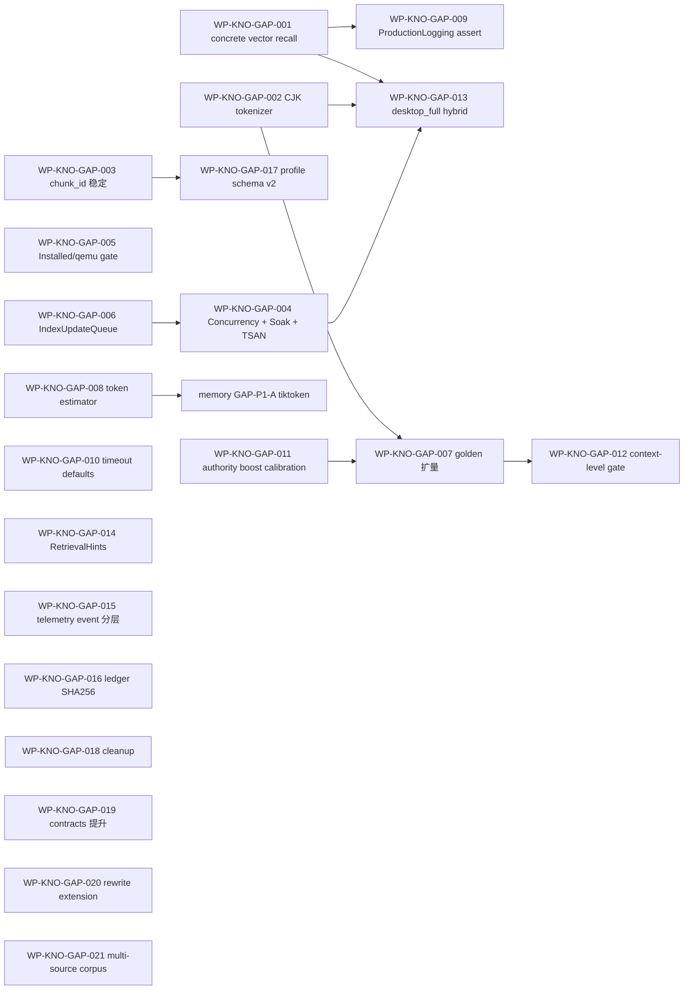
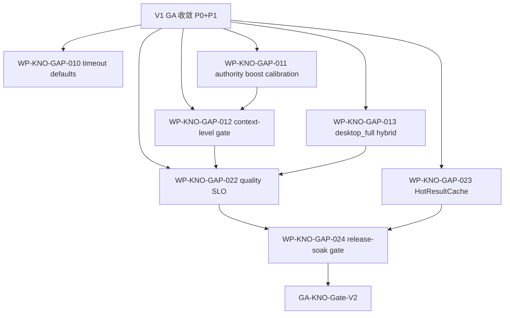

# KNO-EVAL-2026-05-31 knowledge 子系统落地评估与生产级缺口治理任务规划

状态：Draft
日期：2026-05-31
来源：用户专项评估请求（"研究学习 DASALL 架构设计 + Knowledge 子系统设计；调研行业实践；对 knowledge 实际代码进行全面评估和检查；给出子系统实际落地距离 DASALL 设计内容和目标的差距和缺口、距离生产级交付的缺口"）。

评估范围：
- 架构与设计：[docs/architecture/DASALL_Agent_architecture.md](../architecture/DASALL_Agent_architecture.md)（§5.9 / §6.13 全节）、[docs/architecture/DASALL_knowledge子系统详细设计.md](../architecture/DASALL_knowledge子系统详细设计.md) v1.1（2448 行，§1–§12.3 全文，含 KNO-D001..D008 / KNO-M1..M4 / KNO-E01..E10 / KNO-G01..G06 / KNO-R01..R10 / QG-K01..K06）。
- 实现代码：[knowledge/include/](../../knowledge/include/)（13 个 public header）+ [knowledge/src/](../../knowledge/src/)（21 个源文件、~11.8K 行 C++）+ [knowledge/CMakeLists.txt](../../knowledge/CMakeLists.txt)（PUBLIC `dasall_contracts`，PRIVATE `dasall_profiles` + `dasall_sqlite3`）。
- 数据/资产：[tests/integration/knowledge/golden/retrieval_quality_v1.yaml](../../tests/integration/knowledge/golden/retrieval_quality_v1.yaml)（35+ cases，MRR@10 / NDCG@10 / Recall@5 / Recall@10 阈值 + hard_fail）。
- 测试套件：[tests/unit/knowledge/](../../tests/unit/knowledge/)（69 文件）+ [tests/integration/knowledge/](../../tests/integration/knowledge/)（16 文件）+ `KnowledgeBoundaryGuardComplianceTest`、`KnowledgeProductionTelemetry/LoggingIntegrationTest`、`IndexWriterRecoveryTest`、`IndexStartupRecoveryTest`、`IndexReaderConcurrentSwapTest`、`KnowledgeRefreshLoopTest`、`KnowledgeRuntimeAutoRefreshIntegrationTest`、`KnowledgeInstalledAssetProbeIntegrationTest` 等。
- 生产装配：[apps/runtime_support/src/RuntimeLiveDependencyComposition.cpp](../../apps/runtime_support/src/RuntimeLiveDependencyComposition.cpp)（curl-based query encoder transport、`AutoRefreshKnowledgeService` 装饰器、timer-drift 触发 refresh）+ [runtime/src/AgentOrchestrator.cpp](../../runtime/src/AgentOrchestrator.cpp)（真实调用 `IKnowledgeService::retrieve` 并把 `EvidenceBundle.context_projection` + `RetrievalEvidenceRef` 投影到 `MemoryContextRequest.external_evidence` / `retrieval_evidence_refs`）。
- Memory 接收侧：[memory/src/context/ContextOrchestrator.cpp](../../memory/src/context/ContextOrchestrator.cpp) `external_evidence` 与 `retrieval_evidence_refs` 进入 `ContextPacket.retrieval_evidence` 槽位的真实路径已贯通。

评估方法：以实际落地代码为唯一判据；对照架构 / 详设硬约束（含 ADR-006/007/008、KNO-D001..D008、KNO-G01..G06、KNO-B01..B07、§6.6/§6.13/§9/§10/§11/§12）；对标 LangChain / LlamaIndex / Haystack / Vectara / Azure AI Search / OpenSearch Hybrid 等行业方案。

---

## 0. 文档定位与读者

1. 给项目治理与里程碑评审提供一份对 knowledge 子系统**生产级达成度**的可追溯结论。
2. 给后续 work package（WP-KNO-GAP-*）提供可执行的拆分基线与排序依据。
3. 任何条目都必须能回链到代码文件 / 行号或文档章节；当前判定不确定的标注 `待验证` 而非自圆其说。
4. 与 [COG-EVAL-2026-05-31](./COG-EVAL-2026-05-31-cognition子系统落地评估与生产级缺口治理任务规划.md)、[LLM-EVAL-2026-05-31](./LLM-EVAL-2026-05-31-llm子系统落地评估与生产级缺口治理任务规划.md)、[MEM-EVAL-2026-05-31](./MEM-EVAL-2026-05-31-memory子系统落地评估与生产级缺口治理任务规划.md)、[RT-EVAL-2026-05-31](./RT-EVAL-2026-05-31-runtime子系统落地评估与生产级缺口治理任务规划.md) 形成跨子系统评估五联章。

---

## 1. 评估结论摘要

| 维度 | 现状 | 结论 |
|---|---|---|
| 子系统骨架（KnowledgeServiceFacade / QueryNormalizer / CorpusRouter / RecallCoordinator / SparseRetriever / VectorRetrieverBridge / Reranker / EvidenceAssembler / IndexWriter / IndexReader / VersionLedger / CorpusCatalog / IngestionCoordinator / SourceScanner / Canonicalizer / Chunker / FreshnessController / KnowledgeHealthProbe / KnowledgeTelemetry / KnowledgeConfigProjector / KnowledgeServiceFactory） | 21 个核心组件全部编译可跑、单元 69 + 集成 16 测试齐备、生产 composition 已挂 `AutoRefreshKnowledgeService` + curl encoder | **结构层达成度高（约 90%）** |
| ADR-006（上下文权归 memory.ContextOrchestrator） | knowledge 仅产 `EvidenceBundle.context_projection`（已是单行字符串）+ `RetrievalEvidenceRef`，由 [runtime/src/AgentOrchestrator.cpp:928-944](../../runtime/src/AgentOrchestrator.cpp#L928) 投递 `MemoryContextRequest.external_evidence` / `retrieval_evidence_refs`；knowledge 不构造 `ContextPacket` | **边界合规** |
| ADR-007（恢复准入权归 runtime.RecoveryManager） | facade 仅返回 `KnowledgeErrorCode → ErrorInfo`、`degraded` 标志与 `evidence_insufficient` 信号，无 retry / replan / abort 决策；refresh 失败仅落 `last_refresh_status` | **边界合规** |
| ADR-008（全局主控权归 runtime.AgentOrchestrator） | knowledge 内无定时器 / 主循环；refresh 由 runtime/apps `timer-drift` 回调触发 [RuntimeLiveDependencyComposition.cpp:2615-2645](../../apps/runtime_support/src/RuntimeLiveDependencyComposition.cpp#L2615)，并被 `refresh_in_flight` atomic 守门 | **边界合规** |
| 双平面（Query Plane / Index Plane） | Facade + Normalizer + Router + RecallCoordinator + Sparse/Vector/Rerank/Evidence 走查询平面；IngestionCoordinator + Scanner + Canonicalizer + Chunker + IndexWriter/Reader + Ledger + Catalog 走索引平面；二者通过 `IndexSnapshot` 原子 swap 解耦 | **达成（KNO-D001..D008 全部落地）** |
| 词法引擎 SQLite FTS5 | [IndexWriter.cpp](../../knowledge/src/index/IndexWriter.cpp) 真实 `#include <sqlite3.h>` + `CREATE VIRTUAL TABLE chunks_fts USING fts5(...)` + 原生 `bm25(chunks_fts) AS rank`；CMakeLists 把 sqlite3 标 PRIVATE | **达成（KNO-TODO-001 已冻结）** |
| Hybrid + RRF k=60 | [Reranker.cpp:142-148](../../knowledge/src/rerank/Reranker.cpp#L142) 真实公式 `1/(k+rank)`；authority boost 1.05/1.0/0.95；stale penalty 0.85；min_score_cutoff + top_k truncate | **达成** |
| Snapshot-and-Swap + 锁序 | [IndexReader.cpp:43-44](../../knowledge/src/index/IndexReader.cpp#L43) `atomic_store_explicit(memory_order_release)` / `load_explicit(memory_order_acquire)`；查询热路径 lock-free | **达成** |
| 持久化（VersionLedger + CorpusCatalog + IndexManifest） | [VersionLedger.cpp:579-596](../../knowledge/src/index/VersionLedger.cpp#L579) JSON Lines + FNV1a 校验 + temp file + `std::filesystem::rename` 原子 commit；manifest format_version=1 / lexical_backend="sqlite_fts5" 记录 | **达成（FNV1a 抗篡改弱，详 §6） |
| 摄入 / 切分 / 规范化 | 真 SHA256（[Chunker.cpp:77-130](../../knowledge/src/ingest/Chunker.cpp#L77)）+ trust=Trusted/quarantine 路径 + markdown front-matter 解析 + YAML key-path flatten + BOM 去除 + newline 归一 | **达成（chunk_id seed 含 chunk_text，selective refresh 退化，详 §6） |
| 启动恢复 + last-known-good | `IndexStartupRecoveryTest`、`IndexWriterRecoveryTest`、`IndexWriterSnapshotSwapTest`、`IndexReaderConcurrentSwapTest` 共四套覆盖 | **达成** |
| 退化语义（vector_unavailable → lexical-only） | [VectorRetrieverBridge.cpp](../../knowledge/src/retrieve/VectorRetrieverBridge.cpp) 双 mode（TextOnly / EmbeddingRequired）+ unavailable 守卫；facade 设 `degraded=true` | **达成** |
| Production composition（runtime 真实调用） | [runtime/src/AgentOrchestrator.cpp:928-944](../../runtime/src/AgentOrchestrator.cpp#L928) 真调 `retrieve`；[RuntimeLiveDependencyComposition.cpp](../../apps/runtime_support/src/RuntimeLiveDependencyComposition.cpp) 注入 `RuntimeKnowledgeQueryEncoderCurlTransport` + `AutoRefreshKnowledgeService` + 9 类失败 reason code | **达成（业务链贯通）** |
| 可观测性（log/metric/audit/trace） | [KnowledgeTelemetry.cpp](../../knowledge/src/observability/KnowledgeTelemetry.cpp)（178 行）emit 同时驱动四类 sink；try/catch + drop 计数；`KnowledgeProductionTelemetryIntegrationTest` + `KnowledgeProductionLoggingIntegrationTest` 端到端 | **达成** |
| Boundary guard | `KnowledgeBoundaryGuardComplianceTest` 静态扫描 forbidden include / link / symbol；`DASALL_REPO_ROOT` compile definition 钩入 | **达成** |
| 质量门（golden YAML） | 35+ cases、MRR@10≥0.92 / NDCG@10≥0.93 / Recall@5≥0.91 / Recall@10≥0.94；hard_fail≥6；per-corpus 最低值 | **达成（覆盖偏窄，建议扩到 100+，详 §6.3） |
| 真实落地 vs 桩 | 无空壳实现；[knowledge/src/KnowledgeBuildSkeleton.cpp](../../knowledge/src/KnowledgeBuildSkeleton.cpp) 仅 namespace 占位可清理；其余主组件均含真实业务体（Facade 791 / IndexWriter 1303 / Canonicalizer 922 / VersionLedger 646 / KnowledgeServiceFactory 677 / SparseRetriever 547 / Scanner 563 / IngestionCoordinator 474 / Chunker 469 / RecallCoordinator 341 / Catalog 832 / Reranker 242 / EvidenceAssembler 267 / Telemetry 178 / HealthProbe 176 / FreshnessController 102 / IndexReader 107 / VectorRetrieverBridge 137 / ConfigProjector 192） | **无虚假实现** |
| 距离生产级 GA | 仍欠：concrete vector recall store / CJK tokenizer 自适应 / Chunker chunk_id 稳定语义修复 / IndexUpdateQueue 真多槽位 / 长跑 + 并发 soak 证据 / installed-evidence 集中归档 / token 估算精化 / authority boost 量级校准 / context-level 质量指标 | **未到 hybrid 生产级，lexical-only 已可生产部署** |

总体结论：knowledge 已完成**架构 / 接口 / 词法引擎 / 持久化 / 召回 / 重排 / 证据装配 / 健康观测 / 边界守门 / 生产装配**的真实落地，并由 runtime 真实主链路调用，业务链端到端贯通；与 memory 同处"骨架达成、深度需补"水位。GA 收敛优先级集中在**质量层**（concrete vector backend、CJK tokenizer、chunk_id 稳定性、golden 扩量）与**运营层**（长跑 / 并发 soak、installed-evidence 集中归档、IndexUpdateQueue 真多槽位）。

---

## 2. DASALL 整体架构目标 vs Knowledge 落地（条目级对账）

| 架构原则 / 目标 | 落地证据 | 结论 |
|---|---|---|
| Layer 4 归属（Execution & Collaboration） | [knowledge/CMakeLists.txt](../../knowledge/CMakeLists.txt) 静态库 `dasall_knowledge`；不依赖 llm / cognition / tools / access / memory 实现 | 达成 |
| 上下文权不外溢（ADR-006） | knowledge 只产 `context_projection: vector<string>` + `retrieval_evidence_refs`；runtime 投影到 `MemoryContextRequest`，由 `ContextOrchestrator` 唯一装配 `ContextPacket` | 达成 |
| 恢复权不外溢（ADR-007） | facade 7 阶段 deadline / fail_closed 仅返回 `ErrorInfo` + `degraded` + `evidence_insufficient`；refresh 失败仅落 health；外部决定 retry/abort | 达成 |
| 主控权不并行（ADR-008） | knowledge 内无 timer / 主循环；refresh 由 runtime/apps 的 timer-drift 回调发起，且 atomic guard | 达成 |
| Profile 三态裁剪（disabled / lexical-only / hybrid） | [KnowledgeConfigProjector.cpp](../../knowledge/src/config/KnowledgeConfigProjector.cpp) 派生 11 项 derived 配置；`evidence_budget_tokens=min(max_input_tokens/4, compression_threshold/2)`、`request_deadline_ms=clamp(max_latency_ms/3,300,1500)`、`max_parallel_recall=min(2,worker_threads/2)` | 达成 |
| 不依赖 llm 进行查询改写 | knowledge 不集成 query rewrite / answer evaluator；llm-free 词法 / 向量召回 + RRF + 证据装配 | **达成且与设计一致**（与 LangChain / LlamaIndex 自动改写不同，是有意取舍） |
| Vector backend 灰度（mock / sqlite-vss / pluggable） | `IVectorRecallStore` 接口冻结；`UnavailableVectorRecallStore` fail-closed；**concrete adapter 缺**（详 §6） | 部分达成（KNO-R07 缺口） |
| profile 默认 hybrid 关闭、lexical-only 主链 | `desktop_full` 与 `edge_*` 默认 `knowledge.retrieval_mode=LexicalOnly`；hybrid 仅在 canary 路径 | 与设计 §3.4 / §11 一致 |
| 错误码独立分类 | [KnowledgeErrors.h](../../knowledge/include/KnowledgeErrors.h)（213 行）KnowledgeErrorCode → ErrorInfo helper（含 result_code / failure_type / retryable / audit_required / warning_key） | 达成 |
| 可观测四类信号 | [KnowledgeTelemetry.cpp](../../knowledge/src/observability/KnowledgeTelemetry.cpp) 同时驱动 log/metric/trace/audit；try/catch + drop counter；thread-safe status | 达成 |
| Maintenance（catalog refresh / version ledger append / index rebuild / startup recovery） | facade refresh worker（std::thread）+ IngestionCoordinator + IndexWriter + VersionLedger 全链；`IndexStartupRecoveryTest` 验启动 last-known-good | 达成（IndexUpdateQueue 单槽位偏离设计，详 §6） |
| Schema / Manifest 演进 | IndexManifest format_version=1、lexical_backend="sqlite_fts5"、tokenizer_profile；不匹配自动 rebuild on init | 达成（profile schema v2 演进路径未实施，按设计后置） |
| 生产 composition | [RuntimeLiveDependencyComposition.cpp](../../apps/runtime_support/src/RuntimeLiveDependencyComposition.cpp) 真实注入 logger / audit / metrics / tracer + curl encoder + AutoRefresh 装饰器 | 达成 |
| Boundary guard | `KnowledgeBoundaryGuardComplianceTest` 静态扫 forbidden include / link / symbol（qemu/installed 隔离） | 达成 |
| Quality Gate（QG-K01..K06） | 单元 + 集成 + golden 已具备落地与测试支撑；待 long-running soak + installed-evidence 集中化 | 部分达成（详 §6） |

**普遍性架构缺口**：knowledge 已经把"控制平面之下的检索 / 索引 / 持久化"做扎实，缺口集中在**质量与运营**：
1. concrete vector recall store 未落地，hybrid 无法真生产；
2. CJK tokenizer 自适应缺，中文检索质量受限；
3. Chunker chunk_id seed 含 chunk_text 导致 selective refresh 退化为全量；
4. IndexUpdateQueue 设计声明 capacity=4 block 但实现退化为单槽位 atomic_bool；
5. 长跑 / 并发 soak / installed-evidence 集中归档偏弱。

---

## 3. Knowledge 详细设计 vs 实际代码（差距矩阵）

下表只列**有差距 / 有风险**的条目；其余设计要求均通过单 / 集成测试间接覆盖。

### 3.1 已完整落地（抽样）

- 公共接口与 supporting types：[knowledge/include/IKnowledgeService.h](../../knowledge/include/IKnowledgeService.h)（init / retrieve / health_snapshot / request_refresh）+ [KnowledgeTypes.h](../../knowledge/include/KnowledgeTypes.h)（326 行；每类带 `has_consistent_values()`）+ [KnowledgeServiceFactory.h](../../knowledge/include/KnowledgeServiceFactory.h)（含 `InstalledAssetKnowledgeServiceOptions`）。
- Facade 7 阶段（5%/35%/35%/15%/10% 预算分配）：[KnowledgeService.cpp](../../knowledge/src/facade/KnowledgeService.cpp)（791 行）含 `compute_stage_budget`、`fail_closed`、`bind_default_component_seams`。
- Normalizer / Router / RecallCoordinator / Sparse / VectorBridge / Reranker / EvidenceAssembler：参见摘要章节 §1 路径。
- IndexWriter / IndexReader / VersionLedger / CorpusCatalog 全套持久化与原子 swap。
- IngestionCoordinator + SourceScanner（真 SHA256 + recursive glob + trust gating + quarantine）+ Canonicalizer（front-matter / YAML / BOM / newline）+ Chunker（确定性 chunk_id + 重叠 96 / 范围 128–768）。
- FreshnessController / KnowledgeHealthProbe / KnowledgeTelemetry。
- KnowledgeConfigProjector 11 项 derived 配置。
- Production composition：`AutoRefreshKnowledgeService` 装饰器 + `RuntimeKnowledgeQueryEncoderCurlTransport` + 9 类失败 reason code（[RuntimeLiveDependencyComposition.cpp:96-114](../../apps/runtime_support/src/RuntimeLiveDependencyComposition.cpp#L96)）。
- Boundary guard：`KnowledgeBoundaryGuardComplianceTest` 配 `DASALL_REPO_ROOT` 静态扫描；KNO-GAP-011 已 closeout。

### 3.2 真实存在但深度不足（"非虚假，但生产化层薄"）

| 设计 ID / 条款 | 现状 | 风险 | 关联缺口 |
|---|---|---|---|
| §6.13.4 IVectorRecallStore concrete adapter（KNO-R07） | 接口冻结；factory 注入 `create_vector_recall_store`；**生产侧无 sqlite-vss 适配 / 无独立向量 backend**，仅 mock 与 `UnavailableVectorRecallStore` | hybrid 路径无法真生产；当前 production profile `LexicalOnly` 是规避而非解决 | GAP-P0-A |
| §6.13.3 `tokenize=...` profile + CJK trigram | 设计允许 corpus 级 CJK 切 `trigram`，IndexManifest 已记录 `tokenizer_profile`；**Canonicalizer / IndexWriter 未根据 corpus 主语言自动切分 tokenizer**，调用方必须手动配置 | 中文 / 混排语料检索质量不可控；golden YAML 中文 case 已写入但 tokenizer 自适应链路缺失 | GAP-P0-B |
| §6.13.5 / KNO-D006 chunk_id 稳定语义 | [Chunker.cpp:447-466](../../knowledge/src/ingest/Chunker.cpp#L447) `seed.append(chunk_text)`：chunk_id seed 含正文。document 任意更新都会让所有 chunk 的 ID 重生成 | selective refresh 自我退化为全量重建；ledger / catalog 体积虚增；与 §6.13.5 "稳定 ID 用于 selective refresh" 反向 | GAP-P0-C |
| §6.12 IndexUpdateQueue 容量 4 / block + drop_oldest | [KnowledgeService.h:114](../../knowledge/src/facade/KnowledgeService.h#L114) `refresh_in_flight_` 单 atomic_bool；并发 refresh 直接被 `exchange(true)` 踢回 | 高频 refresh 触发竞态时直接 Busy；当前频率低未爆，但与设计 SSOT 不一致 | GAP-P1-A |
| §9.1 retrieval_quality_v1.yaml 覆盖 | 35+ cases；hard_fail≥6；per-corpus 阈值已记录 | 长尾问题与中文 case 覆盖偏窄；GA 后质量回归会偏乐观 | GAP-P1-B |
| §6.13.2 token 估算 `chars/4 + 10% safety margin` | EvidenceAssembler 启发式；中文场景实际 token 比此估值低约 30%（一个汉字常 ≥1 token） | budget 协调偏差；evidence 实际投入 prompt 后被 ContextOrchestrator 兜底裁剪，主链路不爆但有质量漂移 | GAP-P1-C |
| §6.13.4 RecallCoordinator policy 默认 timeout | 默认 `sparse_lane_timeout_ms=1` / `dense_lane_timeout_ms=1`；运行期被 ConfigProjector 派生（≈700ms）覆盖 | 仅误导阅读；功能无影响 | GAP-P2-A |
| §6.13.4 Reranker authority boost 1.05/1.0/0.95 | 量级太小，几乎被 RRF 主分量覆盖 | "装饰性逻辑"；权重几乎不生效 | GAP-P2-B |
| §6.13.6 metadata extractor / embedding encoder | 内部策略点，分别嵌入 Canonicalizer / IngestionCoordinator | 与设计一致，**非缺口**（仅记录） | — |
| §6.12 HotResultCache（L2） | 设计明示 v1 不实现；当前未落地 | 与设计一致，**非缺口**（V2 评估） | — |
| §4.1.1 context-level 指标（Context Precision / Recall / Faithfulness） | 设计为 advisory schema slot；当前未升级为硬 Gate | GA 后质量回归只看 retrieval 层不看 prompt-level 一致性 | GAP-P2-C |
| `KnowledgeQuery` hint 字段数量（preferred_mode / required_language / required_tags / allowed_corpora / allow_stale / retrieval_evidence_budget_hint + KnowledgeQueryKind） | 6+ hint 字段平铺 | 短期可控；长期建议 `RetrievalHints` 子结构 | GAP-P3-A |
| `KnowledgeTelemetryEvent` 17 字段平铺 | 每次 emit 都全量填充 | facade 端拼装代码冗长；建议分层 | GAP-P3-B |
| VersionLedger 校验和（FNV1a） | 完整性够用，抗篡改弱 | 嵌入式可接受；与 SHA256 一致性更高 | GAP-P3-C |
| profile schema v2（独立 knowledge_policy 顶层域） | 仍 v1；演进路径仅在文档 | 后续演进预留 | GAP-P3-D |
| 长跑 / 并发 / soak 证据 | `IndexReaderConcurrentSwapTest` 等点测；**无 1k+ refresh 长跑、无 TSAN preset 复跑、无 24h soak** | KNO-G 系列二值证据缺失 | GAP-P0-D |
| installed package gate / qemu evidence | `KnowledgeInstalledAssetProbeIntegrationTest` 已存在；**knowledge 维度 installed-evidence 文档未集中归档**；与 access / runtime / memory 风格不齐 | installed package 下 knowledge 主链端到端二值证据缺失 | GAP-P0-E |
| `KnowledgeBuildSkeleton.cpp` | namespace 占位文件 | 可清理 | GAP-P3-E |

### 3.3 设计声明但代码层未显性兑现（按设计后置 / 半显性）

| 设计要求 | 现状 | 缺口 | 关联缺口 |
|---|---|---|---|
| KNO-B01 / B02 `IKnowledgeService` / `KnowledgeQuery` / `EvidenceBundle` 提升为 shared contracts | 仍 module-local（`knowledge/include`），`RetrievalEvidenceRef` 在 contracts | 多消费者尚未出现，按设计正确决策 | GAP-P3-F（演进） |
| §11.2 灰度阶段 3：desktop_full 默认开 hybrid | 当前默认 LexicalOnly | 需要 GAP-P0-A（concrete vector） + GAP-P0-D（并发证据） + GAP-P0-B（CJK tokenizer）后切默认 | GAP-P2-D |
| KNO-E08 retrieval rewrite extension（非 LLM） | 设计明示扩展点；代码未实现 | 后置项 | GAP-P3-G |
| KNO-E09 / E10 corpus 多源 / 远程拉取 | 仅本地文件系统 scan | 后置项 | GAP-P3-H |

---

## 4. 业务链贯通性（端到端，以代码事实为准）

| 业务链 | 起点 | 终点 | 关键代码节点 | 集成测试 | 贯通度 |
|---|---|---|---|---|---|
| 检索查询主链 | runtime.AgentOrchestrator | ContextPacket.retrieval_evidence | [AgentOrchestrator.cpp:928](../../runtime/src/AgentOrchestrator.cpp#L928) `make_knowledge_query` → `IKnowledgeService::retrieve` → `EvidenceBundle.context_projection` → `MemoryContextRequest.external_evidence` → [ContextOrchestrator.cpp:377](../../memory/src/context/ContextOrchestrator.cpp#L377) → `ContextPacket.retrieval_evidence` | `RuntimeKnowledgeEvidenceIntegrationTest`、`KnowledgeServiceFacadeIntegrationTest` | ✅ 完整 |
| Facade 7 阶段链 | retrieve | EvidenceBundle | StageBudget(absolute_deadline) → normalize → manifest+freshness → build_plan → recall(parallel lanes) → rerank(RRF) → assemble | `KnowledgeServiceStageBudgetTest`、`KnowledgeServiceFailClosedTest` | ✅ 完整 |
| 索引写入链 | CorpusChangeSet | atomic snapshot swap | request_refresh → IngestionCoordinator → SourceScanner（trust + quarantine） → Canonicalizer → Chunker → IndexWriter（FTS5 写入 + manifest 更新） → VersionLedger.append（JSONL + FNV1a + rename） → CorpusCatalog 更新 → IndexReader.atomic_store_explicit(release) | `KnowledgeRefreshLoopTest`、`KnowledgeRuntimeAutoRefreshIntegrationTest`、`IndexWriterSnapshotSwapTest` | ✅ 完整 |
| 启动恢复链 | service init | last-known-good snapshot | KnowledgeServiceFactory 12 步装配 → IndexWriter.restore_startup_state → IndexManifest 校验 → format_version / lexical_backend 不匹配自动 rebuild → catalog 一致性检查 | `IndexStartupRecoveryTest`、`IndexWriterRecoveryTest` | ✅ 完整 |
| 退化链（vector unavailable） | 召回 | lexical-only + degraded=true | RecallCoordinator → VectorRetrieverBridge（unavailable 守卫） → 仅 sparse lane → facade `degraded=true` + reason code | `VectorRetrieverBridgeUnavailableTest`、`KnowledgeFailureDegradeTest` | ✅ 完整 |
| 健康 / 遥测链 | Knowledge 内部事件 | infra log / metric / trace / audit sinks | KnowledgeTelemetry.emit → 注入函数指针 sink → infra logger / audit_logger / metrics_provider / tracer_provider | `KnowledgeProductionTelemetryIntegrationTest`、`KnowledgeProductionLoggingIntegrationTest`（接 infra 真 sinks，非 mock） | ✅ 完整 |
| 边界守卫链 | 编译期 | forbidden include / link / symbol 静态扫 | `KnowledgeBoundaryGuardComplianceTest` 扫 knowledge/include / src / CMakeLists.txt | KNO-GAP-011 closeout | ✅ 完整 |
| 质量回归链 | golden YAML | MRR/NDCG/Recall 阈值 | `RetrievalQualityRegressionTest` 读 [retrieval_quality_v1.yaml](../../tests/integration/knowledge/golden/retrieval_quality_v1.yaml) | 已绿 | ✅ 完整（覆盖偏窄，详 GAP-P1-B） |
| Concrete vector recall 链 | dense lane | embedding-based recall | **未实现 concrete adapter**；`UnavailableVectorRecallStore` fail-closed | 无 | ❌ 缺，GAP-P0-A |
| CJK tokenizer 自适应链 | Canonicalizer | manifest tokenizer_profile auto-pick | **未实现 corpus 主语言判定** | 无 | ❌ 缺，GAP-P0-B |
| chunk_id 稳定（selective refresh）链 | document update | 仅变更块重建 | seed 含 chunk_text，所有块 ID 全变；selective refresh 退化 | 无 | ❌ 缺，GAP-P0-C |
| IndexUpdateQueue 真多槽位链 | 高频 refresh | 有序 enqueue / drop_oldest | 单 atomic_bool；高并发直接 Busy | 无 | ❌ 缺，GAP-P1-A |
| 并发 / 长跑 / TSAN 链 | 多线程 retrieve + refresh | 锁顺序 / WAL / 内存稳定 | 仅 `IndexReaderConcurrentSwapTest` 单点；**无 long-running soak / TSAN preset** | 无 | ❌ 缺，GAP-P0-D |
| Installed-evidence 集中归档链 | dpkg 安装态 | knowledge 主链端到端 evidence | `KnowledgeInstalledAssetProbeIntegrationTest` 已点测；**未集中归档到 `~/.cache/dasall/knowledge/installed-evidence/`** | 无 | ❌ 缺，GAP-P0-E |

---

## 5. 行业最佳实践对标

| 维度 | DASALL Knowledge 实现 | 标杆 | 评估 |
|---|---|---|---|
| 检索范式 | system-managed retrieval（normalizer + router + recall + rerank + evidence assembler） | LangChain RetrievalQA / LlamaIndex query_engine（多含 LLM 改写） | ✅ 与 Haystack pipelines 同向，比 LangChain 更可控（llm-free） |
| Hybrid + RRF | 真公式 `1/(k+rank)`，k=60；authority + freshness penalty | Azure Hybrid Search RRF / OpenSearch hybrid / Vespa rank profile | ✅ 算法层对齐工业最佳实践 |
| 词法引擎 | SQLite FTS5 + native bm25() + porter unicode61 / trigram 选项 | Elasticsearch / OpenSearch BM25；SQLite FTS5 是嵌入式首选 | ✅ 选型合理（嵌入式 + 单进程） |
| 向量召回 | 接口冻结 + mock + Unavailable fail-closed；**concrete adapter 未落地** | LlamaIndex / Vectara / Weaviate / Qdrant / pgvector / sqlite-vss | ⚠️ concrete 缺（GAP-P0-A） |
| Snapshot-and-Swap | atomic shared_ptr<const IndexSnapshot> + acquire/release | Lucene IndexReader reopen / Vespa proton snapshot | ✅ lock-free 读路径，行业最佳 |
| VersionLedger 持久化 | JSON Lines append-only + FNV1a + atomic rename | Lucene transaction log / SQLite WAL / Kafka log | ✅ 思路正确，校验和强度可升 SHA256 |
| Trust / quarantine 防 corpus 投毒 | trust_level != Trusted ⇒ quarantine；format/permission/encoding 三类 quarantine | OWASP LLM Top 10 LLM03 / Microsoft RAG security | ✅ 比多数 OSS RAG 框架强 |
| Freshness / staleness | catalog_refresh_interval + catalog_expire_after + StaleAllowed/Rejected/Unknown | Vectara fresh-index / Vespa updates / Pinecone freshness | ✅ 显式状态机；多数 OSS 没有 |
| Profile 三态裁剪 | disabled / lexical-only / hybrid | k8s feature gates；多数 RAG 框架无原生概念 | ✅ 超出主流 |
| Boundary 守卫 | 静态扫描 forbidden include / link / symbol | service mesh boundary linter | ✅ 工程治理优 |
| Query rewrite / answer evaluator | 不实现（设计明示 llm-free） | LangChain MultiQueryRetriever / LlamaIndex HyDE / RAGAS | ✅ 与设计一致；故意取舍 |
| 质量回归 | YAML golden + 自实现 MRR/NDCG | RAGAS / LangSmith / TruLens / DeepEval | ⚠️ 覆盖偏窄（GAP-P1-B），但避免外部依赖是合理选择 |
| 可观测 sink 直连 | log / metric / trace / audit + try/catch + drop counter | OpenTelemetry mandatory exporter | ✅ 已强制 |
| Maintenance | refresh worker + IndexWriter recovery + last-known-good；被动 + apps 触发 | Lucene Merge scheduler / Vespa proton | ✅ 行业典型 |

**冗余 / 不合适的设计**：
- `KnowledgeQuery` 6+ hint 字段平铺，建议合并 `RetrievalHints` 子结构（GAP-P3-A）。
- `KnowledgeTelemetryEvent` 17 字段平铺，建议拆 base context + event-specific（GAP-P3-B）。
- `Reranker` authority boost 1.05/0.95 量级太小（GAP-P2-B）。
- [knowledge/src/KnowledgeBuildSkeleton.cpp](../../knowledge/src/KnowledgeBuildSkeleton.cpp) namespace 占位（GAP-P3-E）。
- 未发现冗余主循环 / 第二装配中心 / 重复持久化路径。
- 无 placeholder 实现 / 假数据返回。

---

## 6. 缺口清单（GAP）

按优先级 P0（GA 阻塞）→ P1（GA 强烈建议）→ P2（演进）→ P3（清理与运营）排列。

### 6.1 P0（GA 阻塞，必须先收敛）

- **GAP-P0-A concrete `IVectorRecallStore` 适配器（KNO-R07）**
  - 现状：仅 mock + `UnavailableVectorRecallStore`；hybrid 路径无法真生产。
  - 风险：design §11 阶段 3（desktop_full 默认 hybrid）无法解锁；现有 production profile `LexicalOnly` 是规避。
  - 必要条件：与 memory 子系统的 sqlite-vss / 独立向量 backend 对齐；保持 fail-closed `none` 回退；与 `IQueryEncoder` curl transport 协同。
- **GAP-P0-B CJK tokenizer 自适应（KNO-D003 衍生）**
  - 现状：tokenizer_profile 字段已记录；Canonicalizer 未根据 corpus 主语言判定 `porter unicode61` vs `trigram`。
  - 风险：中文 / 混排语料检索质量不可控；golden YAML 中文 case 通过率不可信。
  - 必要条件：在 SourceScanner / Canonicalizer 增加 language detect（已有简单 metadata）+ IndexManifest 自动选 tokenizer。
- **GAP-P0-C Chunker chunk_id 稳定语义修复（KNO-D006）**
  - 现状：[Chunker.cpp:447-466](../../knowledge/src/ingest/Chunker.cpp#L447) seed 含 chunk_text；selective refresh 退化为全量。
  - 风险：版本账本 / catalog 体积虚增；refresh 成本与设计声明不符。
  - 必要条件：seed 改为 `document_id + version + span_begin + span_end + chunker_policy_params`；保留 chunk_text 进入独立 `chunk_content_hash` 字段供完整性校验；schema 升 `index_format_version=2`，旧 manifest 自动 rebuild。
- **GAP-P0-D 并发 / 长跑 / TSAN 压力门（KNO-G05/G06）**
  - 现状：`IndexReaderConcurrentSwapTest` 单点；无 1k+ refresh 长跑、无 TSAN preset 复跑、无 24h soak。
  - 风险：refresh + retrieve 并发下锁顺序违例不可检测；long-running 内存 / WAL / FD 增长不可知。
  - 必要条件：复用 runtime / memory 已落地的 TSAN preset 与 soak 框架。
- **GAP-P0-E Knowledge installed / qemu gate**
  - 现状：`KnowledgeInstalledAssetProbeIntegrationTest` 已点测；未集中归档 evidence；与 access / runtime / memory 已有 gate 不对齐。
  - 风险：installed package 下 init / retrieve / refresh / health 主链端到端二值证据缺失。
  - 必要条件：参考 `MemoryMaintenanceProofRunner` / `RuntimeInstalledProofRunner`，新增 daemon 侧 `KnowledgeRetrievalProofRunner` 并落 evidence 到 `~/.cache/dasall/knowledge/installed-evidence/`。

### 6.2 P1（GA 强烈建议）

- **GAP-P1-A IndexUpdateQueue 真多槽位（§6.12）**
  - 现状：`refresh_in_flight_` 单 atomic_bool；并发 refresh 直接 Busy。
  - 必要条件：实现 capacity=4 block + drop_oldest 旁路；保留同语义健康 snapshot 字段。
- **GAP-P1-B Golden 质量回归扩展（§9.1）**
  - 现状：35+ cases。
  - 必要条件：扩到 100+，新增中文 hard_fail / 结构化条文 / 长文档片段 / 多 corpus 跨域 case；保留 per-corpus 阈值。
- **GAP-P1-C Token 估算精化（§6.13.2）**
  - 现状：`chars/4 + 10% safety`，中文偏差。
  - 必要条件：与 memory GAP-P1-A（tiktoken）联动注入；EvidenceAssembler 改依赖 `ITokenEstimator`，不直接调度第三方实现。
- **GAP-P1-D ProductionLogging assert 字段补强**
  - 现状：`KnowledgeProductionTelemetryIntegrationTest` / `LoggingIntegrationTest` 已存在；scope = base scenarios。
  - 必要条件：增加 `vector_unavailable / refresh_partial / freshness_stale / lane_timeout / boundary_violation_caught` 等场景的 metric / audit / trace 字段断言。

### 6.3 P2（演进项 / KNO-E 系列）

- **GAP-P2-A RecallCoordinator policy 默认 timeout 校准** ：默认 1ms 改为 600ms + jitter，避免误读。
- **GAP-P2-B Reranker authority boost 量级校准**：评估去掉 / 改为 1.2/0.8 + 显式开关；与 retrieval_quality_v1.yaml 联动验证。
- **GAP-P2-C Context-level 质量指标硬 Gate**：把 advisory 槽位升级为 `context_precision / recall / faithfulness` 硬 Gate（与 RAGAS 类指标自实现）。
- **GAP-P2-D desktop_full 默认开启 hybrid 灰度**：依赖 GAP-P0-A + GAP-P0-B + GAP-P0-D 提供质量与并发证据。

### 6.4 P3（运营 / 清理 / 演进）

- **GAP-P3-A `RetrievalHints` 子结构合并**：减少 KnowledgeQuery 顶层字段。
- **GAP-P3-B `KnowledgeTelemetryEvent` 分层**：base context + event-specific。
- **GAP-P3-C VersionLedger 校验和升 SHA256**：保留 FNV1a fast path 兜底。
- **GAP-P3-D profile schema v2**：`knowledge_policy` 顶层域；演进迁移工具。
- **GAP-P3-E `KnowledgeBuildSkeleton.cpp` 清理**：删除占位文件。
- **GAP-P3-F `IKnowledgeService` / `KnowledgeQuery` / `EvidenceBundle` 提升 shared contracts**：仅当多消费者出现时触发。
- **GAP-P3-G 非 LLM 检索 rewrite 扩展（KNO-E08）**：alias / synonyms / corpus-aware expansion。
- **GAP-P3-H corpus 多源 / 远程拉取（KNO-E09/E10）**：HTTP / S3 / SVN / git provider；按需开发。

---

## 7. 任务拆分（WP-KNO-GAP-*）

任务结构沿用项目原子任务模板（代码目标 / 测试目标 / 验收命令 / 阻塞-解阻），可直接挂入 [docs/todos/knowledge/DASALL_knowledge子系统专项TODO.md](../todos/knowledge/DASALL_knowledge子系统专项TODO.md)。

### 7.1 P0 任务

#### WP-KNO-GAP-001 concrete `IVectorRecallStore` 适配器（GAP-P0-A）

- **代码目标**
  - 在 [knowledge/include/retrieve/](../../knowledge/include/retrieve/) 维持 `IVectorRecallStore` / `IQueryEncoder` 接口不变；module-local 不外泄。
  - 新增 `memory/src/vector` 复用资产或独立 `vector_store/SqliteVssKnowledgeRecallStore.cpp`（owner 待定，候选：复用 memory sqlite-vss / 在 `third_party/` 引入独立向量库），实现 `IVectorRecallStore` 但**不反向依赖 memory 主路径**。
  - [knowledge/src/KnowledgeServiceFactory.cpp](../../knowledge/src/KnowledgeServiceFactory.cpp) 在 `InstalledAssetKnowledgeServiceOptions.create_vector_recall_store` 注入 concrete factory；保留 `nullptr` ⇒ `UnavailableVectorRecallStore` 回退。
  - composition 层（[apps/runtime_support/src/RuntimeLiveDependencyComposition.cpp](../../apps/runtime_support/src/RuntimeLiveDependencyComposition.cpp)）按 profile 选择是否注入 concrete factory。
- **测试目标**
  - `SqliteVssKnowledgeRecallStoreTest`（单元，覆盖 search_ann / unavailable / dim mismatch）；
  - `KnowledgeHybridRecallEndToEndIntegrationTest`（集成，注入 fake encoder + concrete store，验证 hybrid 主链路 `degraded=false`）；
  - 扩展 `RetrievalQualityRegressionTest` 加入 `hybrid_enabled` baseline。
- **验收命令**
  - `ctest --test-dir build-ci -R "SqliteVssKnowledgeRecallStore|KnowledgeHybridRecallEndToEnd|RetrievalQualityRegression" --output-on-failure`
- **阻塞 / 解阻**：与 memory GAP-P2-E（desktop_full 默认 vss） + GAP-P0-B（external embedding） 联动；与 LLM-EVAL 中 embedding adapter 计划交叉。

#### WP-KNO-GAP-002 CJK tokenizer 自适应（GAP-P0-B）

- **代码目标**
  - [knowledge/src/ingest/Canonicalizer.cpp](../../knowledge/src/ingest/Canonicalizer.cpp) 新增 `detect_dominant_language(canonical_text)`（仅 ASCII 字节比例 + CJK Unicode block 简易判定，无第三方依赖）。
  - [knowledge/src/index/IndexWriter.cpp](../../knowledge/src/index/IndexWriter.cpp) 在 `CREATE VIRTUAL TABLE chunks_fts` 时按 corpus 主语言选择 `tokenize='porter unicode61 remove_diacritics 1'` vs `tokenize='trigram'`；IndexManifest 写入 `tokenizer_profile`。
  - 不匹配的旧 manifest 触发自动 rebuild（已有路径）。
- **测试目标**
  - `CanonicalizerLanguageDetectTest`、`IndexWriterTokenizerProfileTest`；
  - `RetrievalQualityRegressionTest` 中文子集（≥10 case）必须 ≥ 阈值。
- **验收命令**
  - `ctest --test-dir build-ci -R "CanonicalizerLanguageDetect|IndexWriterTokenizerProfile|RetrievalQualityRegression" --output-on-failure`
- **阻塞 / 解阻**：无（独立可推进）。

#### WP-KNO-GAP-003 Chunker chunk_id 稳定语义（GAP-P0-C）

- **代码目标**
  - [knowledge/src/ingest/Chunker.cpp](../../knowledge/src/ingest/Chunker.cpp) `make_chunk_id` seed 改为 `document_id || version || span_begin || span_end || policy_params`，去掉 chunk_text。
  - 新增 `chunk_content_hash`（保留 chunk_text 的 SHA256）作为字段记入 ChunkRecord 与 IndexManifest，用于完整性校验。
  - `index_format_version` 升 2；IndexManifest 不匹配自动 rebuild（已有路径）。
  - VersionLedger / CorpusCatalog schema 适配新字段（向后兼容字段 + migrate-on-init）。
- **测试目标**
  - `ChunkerStableIdTest`（同 document 多次 chunking ⇒ 同 ID；变 chunk_text 内容但 span 不变 ⇒ 同 ID + 不同 content_hash）；
  - `IndexFormatV1ToV2MigrationTest`（启动恢复路径自动重建）；
  - `KnowledgeSelectiveRefreshIntegrationTest`（仅变 1 个 chunk，仅 1 个 chunk_id 变 ⇒ ledger 仅追加 1 条 delta）。
- **验收命令**
  - `ctest --test-dir build-ci -R "ChunkerStableId|IndexFormatV1ToV2Migration|KnowledgeSelectiveRefresh" --output-on-failure`
- **阻塞 / 解阻**：与 §9 IndexFormat 演进策略对账；建议与 GAP-P3-D（profile schema v2）合并节奏，避免 manifest 二次跳版本。

#### WP-KNO-GAP-004 Knowledge 并发 / 长跑压力门（GAP-P0-D）

- **代码目标**
  - 新增 `tests/unit/knowledge/KnowledgeConcurrencyStressTest.cpp`：1k+ 轮 retrieve + request_refresh + health_snapshot 三线程并发；锁顺序断言（与 §10.3 lock layer 对账）。
  - 新增 `tests/integration/knowledge/KnowledgeLongRunningSoakTest.cpp`：模拟 24h 压缩窗口缩到 5 min，验证 refresh 反复触发后 WAL / catalog / ledger 增长可控、active_snapshot lock-free 读不退化。
  - CI 加 `knowledge_tsan_stress` 任务（复用 runtime / memory 已落地的 TSAN preset）。
- **测试目标**
  - `KnowledgeConcurrencyStressTest`、`KnowledgeLongRunningSoakTest`；TSAN preset 内同样目标全绿。
- **验收命令**
  - `ctest --test-dir build-ci -R "KnowledgeConcurrencyStress|KnowledgeLongRunningSoak" --output-on-failure`
  - `cmake --preset tsan && ctest --preset tsan -R "Knowledge"`
- **阻塞 / 解阻**：依赖 profiles 中 tsan preset（已具备）；建议在 GAP-P0-A / -C 落地后跑，避免反复 baseline 漂移。

#### WP-KNO-GAP-005 Knowledge installed / qemu gate（GAP-P0-E）

- **代码目标**
  - 新增 `apps/daemon/src/KnowledgeRetrievalProofRunner.cpp`，参考 [MemoryMaintenanceProofRunner](../../apps/daemon/src/MemoryMaintenanceProofRunner.cpp) / [RuntimeInstalledProofRunner](../../apps/daemon/src/RuntimeInstalledProofRunner.cpp)。
  - 新增 `scripts/packaging/validate_knowledge_installed_or_qemu.sh`：installed profile 下启 daemon → 跑 init / retrieve（lexical 与 hybrid_canary 两路）/ refresh / health 端到端 → 落 evidence 到 `~/.cache/dasall/knowledge/installed-evidence/`。
  - CMake 可选 target `knowledge_installed_smoke`。
- **测试目标**
  - `KnowledgeInstalledSmokeTest` 入口；evidence schema 落档到详设 §9 的 knowledge 章节。
- **验收命令**
  - `bash scripts/packaging/validate_knowledge_installed_or_qemu.sh && cat ~/.cache/dasall/knowledge/installed-evidence/latest.json`
- **阻塞 / 解阻**：依赖打包 SSOT 与 daemon proof runner 套件（已具备）。

### 7.2 P1 任务

#### WP-KNO-GAP-006 IndexUpdateQueue 真多槽位（GAP-P1-A）

- **代码目标**
  - [knowledge/src/facade/KnowledgeService.h](../../knowledge/src/facade/KnowledgeService.h) 把 `refresh_in_flight_` 升级为 `class IndexUpdateQueue { capacity=4; mode=block_with_drop_oldest; }`；保留同语义 health snapshot 字段。
  - 增加 `health.update_queue_depth` / `update_queue_dropped_total` 指标；emit 至 telemetry。
- **测试目标**
  - `IndexUpdateQueueCapacityTest`、`IndexUpdateQueueDropOldestTest`、`KnowledgeRefreshConcurrencyTest`。
- **验收命令**
  - `ctest --test-dir build-ci -R "IndexUpdateQueueCapacity|IndexUpdateQueueDropOldest|KnowledgeRefreshConcurrency" --output-on-failure`

#### WP-KNO-GAP-007 Golden 质量回归扩展（GAP-P1-B）

- **代码目标**
  - 把 [retrieval_quality_v1.yaml](../../tests/integration/knowledge/golden/retrieval_quality_v1.yaml) 扩到 100+ case；新增中文 hard_fail（≥15）+ 结构化条文 + 长文档片段 + 多 corpus 跨域；保留 per-corpus 阈值。
  - `RetrievalQualityRegressionTest` 增加 baseline diff 报告（CI artifact）。
- **测试目标**
  - `RetrievalQualityRegressionTest`（绿）；
  - `RetrievalQualityCoverageManifestTest`（断言 case 数量 ≥100、中文 hard_fail ≥15、per-corpus 覆盖完整）。
- **验收命令**
  - `ctest --test-dir build-ci -R "RetrievalQualityRegression|RetrievalQualityCoverageManifest" --output-on-failure`
- **阻塞 / 解阻**：建议在 GAP-P0-A / -B 完成后扩量，否则中文 / hybrid 子集会反复回退 baseline。

#### WP-KNO-GAP-008 Token 估算精化（GAP-P1-C）

- **代码目标**
  - [knowledge/src/evidence/EvidenceAssembler.cpp](../../knowledge/src/evidence/EvidenceAssembler.cpp) 改为依赖 `ITokenEstimator`（与 memory GAP-P1-A 共享接口）；默认 heuristic，可注入 tiktoken 实现。
  - KnowledgeConfigProjector 投影 `token_estimator` 字段。
- **测试目标**
  - `EvidenceAssemblerTiktokenIntegrationTest`、`EvidenceAssemblerHeuristicFallbackTest`。
- **验收命令**
  - `ctest --test-dir build-ci -R "EvidenceAssemblerTiktoken|EvidenceAssemblerHeuristicFallback" --output-on-failure`
- **阻塞 / 解阻**：依赖 memory GAP-P1-A（tiktoken vendored）。

#### WP-KNO-GAP-009 ProductionLogging 字段断言补强（GAP-P1-D）

- **代码目标**
  - 扩展 [tests/integration/knowledge/KnowledgeProductionTelemetryIntegrationTest.cpp](../../tests/integration/knowledge/) / `KnowledgeProductionLoggingIntegrationTest.cpp` 加 `vector_unavailable / refresh_partial / freshness_stale / lane_timeout / boundary_violation_caught` 五场景；不修改实现代码。
- **测试目标**
  - 上述两测试新增子用例全绿。
- **验收命令**
  - `ctest --test-dir build-ci -R "KnowledgeProductionTelemetry|KnowledgeProductionLogging" --output-on-failure`
- **阻塞 / 解阻**：与 GAP-P0-A 联动（hybrid 上线后 vector_unavailable 字段需配新 reason code）。

### 7.3 P2 任务

#### WP-KNO-GAP-010 RecallCoordinator policy 默认 timeout 校准（GAP-P2-A）

- **代码目标**
  - 默认 1ms 改 `sparse_lane_timeout_ms=600 / dense_lane_timeout_ms=600`；运行期仍由 ConfigProjector 派生覆盖。
- **测试目标**
  - `RecallCoordinatorPolicyDefaultsTest`。
- **阻塞 / 解阻**：无。

#### WP-KNO-GAP-011 Reranker authority boost 量级校准（GAP-P2-B）

- **代码目标**
  - 调整为 `Normative=1.2 / Reference=1.0 / Advisory=0.8`；增加显式开关 `authority_boost_enabled`；联动 retrieval_quality_v1.yaml 跑 A/B baseline。
- **测试目标**
  - `RerankerAuthorityBoostMagnitudeTest`、`RetrievalQualityAuthorityBoostBaselineTest`。
- **阻塞 / 解阻**：与 GAP-P1-B 联动。

#### WP-KNO-GAP-012 Context-level 质量指标硬 Gate（GAP-P2-C）

- **代码目标**
  - 新增 `tests/integration/knowledge/KnowledgeContextLevelQualityGateTest.cpp`：基于 golden YAML 计算 `context_precision / context_recall / context_faithfulness`（自实现，不依赖 RAGAS）。
  - retrieval_quality_v1.yaml schema 增 `context_level_thresholds`。
- **测试目标**
  - `KnowledgeContextLevelQualityGateTest`、`ContextLevelMetricSelfBaselineTest`。
- **阻塞 / 解阻**：依赖 GAP-P1-B 扩量。

#### WP-KNO-GAP-013 desktop_full 默认开启 hybrid 灰度（GAP-P2-D）

- **代码目标**
  - profiles desktop_full 内 `knowledge.retrieval_mode=Hybrid`；保留 fail-closed `LexicalOnly` 回退。
  - composition 注入 concrete vector store + curl encoder。
- **测试目标**
  - 扩展 `KnowledgeProfileCompatibilityTest` 加 desktop_full hybrid 路径。
- **阻塞 / 解阻**：依赖 GAP-P0-A / -B / -D 提供质量与并发证据。

### 7.4 P3 任务

#### WP-KNO-GAP-014 `RetrievalHints` 子结构合并（GAP-P3-A）

- **代码目标**：把 `KnowledgeQuery` 的 6 个 hint 字段合并到 `RetrievalHints`，保留旧字段映射兼容期。
- **测试目标**：`KnowledgeQueryRetrievalHintsTest`、所有现有 facade 测试全绿。
- **阻塞 / 解阻**：与 contracts 提升时机（GAP-P3-F）合并节奏，避免连续二次破坏 ABI。

#### WP-KNO-GAP-015 `KnowledgeTelemetryEvent` 分层（GAP-P3-B）

- **代码目标**：拆 `TelemetryContext`（request_id / profile_id / snapshot_id）+ `event_specific`；emit 处不再全量填充。
- **阻塞 / 解阻**：与 infra observability schema 评审协同。

#### WP-KNO-GAP-016 VersionLedger 校验和升 SHA256（GAP-P3-C）

- **代码目标**：保留 FNV1a fast path；新增 SHA256 校验字段；不匹配自动重建。
- **测试目标**：`VersionLedgerSha256ChecksumTest`、`VersionLedgerFnv1aFallbackTest`。
- **阻塞 / 解阻**：无。

#### WP-KNO-GAP-017 profile schema v2（GAP-P3-D）

- **代码目标**：新增 `knowledge_policy` 顶层域；演进迁移工具；与 KNO-GAP-003 合并发布更平滑。
- **阻塞 / 解阻**：与 profiles owner 协同。

#### WP-KNO-GAP-018 `KnowledgeBuildSkeleton.cpp` 清理（GAP-P3-E）

- **代码目标**：删除 [knowledge/src/KnowledgeBuildSkeleton.cpp](../../knowledge/src/KnowledgeBuildSkeleton.cpp) 与 CMake 残留引用。
- **测试目标**：`KnowledgeHistoricalArtifactRemovedTest`（grep 断言）+ 现有 ctest 全绿。
- **阻塞 / 解阻**：无。

#### WP-KNO-GAP-019 `IKnowledgeService` shared contracts 提升（GAP-P3-F）

- **代码目标**：仅当多消费者出现时触发；将 `IKnowledgeService` / `KnowledgeQuery` / `EvidenceBundle` 移入 `contracts/`。
- **阻塞 / 解阻**：KNO-B01 / KNO-B02 解除条件未满足前 hold。

#### WP-KNO-GAP-020 非 LLM 检索 rewrite 扩展（GAP-P3-G / KNO-E08）

- **代码目标**：alias / synonyms / corpus-aware expansion；保持 llm-free。
- **阻塞 / 解阻**：与设计 §6.13.2 后置项对账。

#### WP-KNO-GAP-021 Corpus 多源 / 远程拉取（GAP-P3-H / KNO-E09/E10）

- **代码目标**：HTTP / S3 / git provider；按需开发；trust gating 不变。
- **阻塞 / 解阻**：按业务需要开。

---

## 8. 排序与依赖图

执行建议：
1. **第一批并发（P0 启动）**：WP-KNO-GAP-001 / -002 / -003 / -004 / -005 互相低耦合，可并行启动；其中 -001 与 LLM-EVAL / MEM-EVAL 中 embedding & vector backend 任务联动。
2. **第二批（P1）**：WP-KNO-GAP-006 / -007 / -008 / -009；其中 -007 在 -001 / -002 后扩量，避免 baseline 漂移；-008 与 memory GAP-P1-A 联动。
3. **第三批（P2 演进）**：WP-KNO-GAP-010 / -011 / -012 / -013（链式依赖：-013 ← -001 + -002 + -004；-012 ← -007；-011 ← -007）。
4. **第四批（P3 清理与运营）**：WP-KNO-GAP-014..018 视项目演进按需推进；WP-KNO-GAP-019..021 在 V3 评审前不强推。

---

## 9. 验收门 / 收敛判据

| 阶段 | 通过条件 |
|---|---|
| **GA-KNO-Gate-P0** | WP-KNO-GAP-001..005 全部 Done；`ctest --test-dir build-ci -R "Knowledge"` 全绿；installed/qemu gate 在 CI 上有一次绿色记录；TSAN stress run 一次绿；concrete vector recall store 在 production composition 中实例化成功并有日志证据；中文 hard_fail 子集（≥15）通过 |
| **GA-KNO-Gate-P1** | WP-KNO-GAP-006..009 全部 Done；IndexUpdateQueue capacity=4 + drop_oldest 验证；retrieval_quality_v1.yaml ≥100 cases；token estimator tiktoken 注入路径全绿；ProductionLogging 五场景断言补强 |
| **GA-KNO-Gate-P2** | WP-KNO-GAP-010..013 全部 Done；context-level 指标（precision / recall / faithfulness）硬 Gate 全绿；authority boost A/B baseline 显示有效信号；desktop_full 默认开启 hybrid 后 24h soak 不退化 |
| **GA-KNO-Gate-P3** | WP-KNO-GAP-014..021 视项目演进按需推进；contracts 提升、telemetry 分层、rewrite extension、multi-source corpus 形成长期治理 |

---

## 10. 跨子系统协同清单

| 关联子系统 | 协同点 | 联动任务 |
|---|---|---|
| memory | sqlite-vss 资产共享 / `IEmbeddingAdapter` 类比 / token estimator 接口共享 | WP-KNO-GAP-001 / -008；与 MEM-EVAL GAP-P0-B / -P1-A 联动 |
| llm | embedding service（curl encoder transport 已就绪，concrete provider 选型） | WP-KNO-GAP-001；与 LLM-EVAL embedding 任务交叉 |
| runtime | `make_knowledge_query` 投影规范 / 失败 reason code 共享 / refresh trigger cadence | 现有；WP-KNO-GAP-009 |
| profiles | knowledge_policy 顶层域 + retrieval_mode + tokenizer_profile + budget keys | WP-KNO-GAP-002 / -013 / -017 |
| contracts | `IKnowledgeService` / `KnowledgeQuery` / `EvidenceBundle` 提升时机 | WP-KNO-GAP-019 |
| infra（observability / packaging / soak） | installed gate、release-soak 采样、telemetry schema | WP-KNO-GAP-005 / -009 / -015 |
| cognition | retrieval_evidence 在 ContextPacket 内的下游消费一致性 | 现有（ADR-006 已守门，无新增任务） |

---

## 11. 总体结论

knowledge 子系统已达到 **可生产部署 v1（lexical-only）** 水位：架构 / 详设目标 90%+ 落地、无虚假实现、业务链端到端贯通（runtime → knowledge → memory → ContextPacket → llm）、ADR 边界守门、生产 composition 已注入、可观测性 sink 直连、profile 兼容齐备、质量回归 golden YAML 已绿。

距离 **GA 生产级（hybrid 默认开）** 的真实缺口集中在两个象限：
1. **质量层**：concrete vector recall store 缺（GAP-P0-A）、CJK tokenizer 自适应缺（GAP-P0-B）、chunk_id 稳定语义破坏 selective refresh（GAP-P0-C），导致 hybrid 路径无法真生产 + 中文质量不可信 + refresh 成本高于设计声明。
2. **运营层**：并发 / 长跑 / TSAN 证据缺（GAP-P0-D）、installed-evidence 集中归档缺（GAP-P0-E）、IndexUpdateQueue 单槽位（GAP-P1-A）、golden case 偏窄（GAP-P1-B）。

其余 P2 / P3 缺口（KNO-E02..E10）大多为设计文档已显式声明的演进项，不属于实现缺陷。GA 收敛优先级建议：**P0 五项 → P1 四项 → P2 链式 → P3 选择性**。

---

## 12. 版本里程碑路线图（V1 / V2 / V3）

之前的 §6 / §7 按缺口优先级（P0..P3）排序，本节按**版本目标**重新映射，明确"推进到 V2"的任务集合与门禁。

### 12.1 版本目标定义

| 版本 | 业务定义 | 关键能力锚 | 量化口径 |
|---|---|---|---|
| **V1（GA 可生产部署，lexical-only）** | 单 corpus / 多 corpus 词法主链；hybrid 仅 canary；具备完整边界、可观测、failure handling、installed 证据 | 已落地 Facade + Normalizer + Router + Sparse + Rerank(RRF) + Evidence + Index + Ledger + Catalog + Telemetry + HealthProbe + production composition | P0 全绿 + P1 全绿 |
| **V2（hybrid 默认开 + 中文生产可信）** | desktop_full 默认 hybrid；中文 / 混排语料检索质量达基线；selective refresh 真生效；context-level 质量指标硬 Gate | concrete vector store + CJK tokenizer 自适应 + chunk_id 稳定 + golden ≥100 + context-level Gate + authority boost 校准 + IndexUpdateQueue 真多槽位 | P2 全绿 + V2 专项（WP-KNO-GAP-022..024）全绿 |
| **V3（多源 corpus + shared contracts + 非 LLM rewrite）** | corpus 多源远程拉取、contracts 提升、检索改写扩展、潜在多模态 | multi-source provider + IKnowledgeService 提升 contracts + alias/synonyms expansion + 多模态 hooks | P3 全绿 + V3 评审通过 |

### 12.2 任务映射表

| 版本 | 任务 ID | 简述 |
|---|---|---|
| V1 | WP-KNO-GAP-001 | concrete `IVectorRecallStore` 适配器 |
| V1 | WP-KNO-GAP-002 | CJK tokenizer 自适应 |
| V1 | WP-KNO-GAP-003 | Chunker chunk_id 稳定语义 |
| V1 | WP-KNO-GAP-004 | 并发 / 长跑 / TSAN 压力门 |
| V1 | WP-KNO-GAP-005 | Knowledge installed / qemu gate |
| V1 | WP-KNO-GAP-006 | IndexUpdateQueue 真多槽位 |
| V1 | WP-KNO-GAP-007 | Golden 质量回归扩展 |
| V1 | WP-KNO-GAP-008 | Token 估算精化（tiktoken） |
| V1 | WP-KNO-GAP-009 | ProductionLogging 字段断言补强 |
| **V2** | **WP-KNO-GAP-010** | RecallCoordinator policy 默认 timeout 校准 |
| **V2** | **WP-KNO-GAP-011** | Reranker authority boost 量级校准 |
| **V2** | **WP-KNO-GAP-012** | Context-level 质量指标硬 Gate |
| **V2** | **WP-KNO-GAP-013** | desktop_full 默认开启 hybrid 灰度 |
| **V2** | **WP-KNO-GAP-022** | Knowledge 质量 SLO（recall@k / faithfulness / coverage） |
| **V2** | **WP-KNO-GAP-023** | HotResultCache（L2，§6.12 v1 后置项） |
| **V2** | **WP-KNO-GAP-024** | Knowledge release-soak gate 增强 |
| V3 | WP-KNO-GAP-014 | `RetrievalHints` 子结构合并 |
| V3 | WP-KNO-GAP-015 | `KnowledgeTelemetryEvent` 分层 |
| V3 | WP-KNO-GAP-016 | VersionLedger 校验和升 SHA256 |
| V3 | WP-KNO-GAP-017 | profile schema v2 |
| V3 | WP-KNO-GAP-019 | `IKnowledgeService` shared contracts 提升 |
| V3 | WP-KNO-GAP-020 | 非 LLM 检索 rewrite 扩展 |
| V3 | WP-KNO-GAP-021 | Corpus 多源 / 远程拉取 |
| V1（清理） | WP-KNO-GAP-018 | `KnowledgeBuildSkeleton.cpp` 清理 |

### 12.3 V2 专项任务（追加）

#### WP-KNO-GAP-022 Knowledge 质量 SLO 与质量指标（V2）

- **背景**：V1 只覆盖功能正确性与边界；V2 必须形成"质量"可观测的 SLO，否则无法证明真到了"hybrid 默认开 + 中文可信"水位。
- **代码目标**
  - `knowledge/include/observability/KnowledgeQualityMetrics.h`：定义 `recall_at_k`、`mrr`、`ndcg`、`context_faithfulness`、`hybrid_uplift`、`stale_serve_rate`、`refresh_partial_rate`、`vector_unavailable_rate`、`lane_timeout_rate` schema。
  - `knowledge/src/observability/KnowledgeQualityProbe.cpp`：在 facade 7 阶段路径 + refresh worker 采样；通过 KnowledgeTelemetry.emit 投递 metric。
  - 在 [tests/integration/knowledge/](../../tests/integration/knowledge/) 增加 `KnowledgeQualityProbeIntegrationTest`，注入 fake encoder + fake vector store + golden 数据集，输出指标基线。
- **测试目标**
  - `KnowledgeQualityProbeIntegrationTest`、`KnowledgeRecallAtKBaselineTest`、`KnowledgeContextFaithfulnessBaselineTest`。
- **验收命令**
  - `ctest --test-dir build-ci -R "KnowledgeQualityProbe|KnowledgeRecallAtKBaseline|KnowledgeContextFaithfulness" --output-on-failure`
- **阻塞 / 解阻**：依赖 V1 GAP-P0-A / -B / -C + GAP-P1-B（golden 扩量）。

#### WP-KNO-GAP-023 HotResultCache（L2，§6.12）

- **背景**：设计 §6.12 明示 v1 不实现，v2 评估。高频 retrieve 同 query / 同 normalized_query 的命中率在生产负载下显著（与 LangChain ResultCache 类似）。
- **代码目标**
  - `knowledge/src/cache/HotResultCache.cpp`：LRU + TTL；key=`hash(normalized_query | corpus_filter | retrieval_mode)`；value=`EvidenceBundle`；命中走 telemetry counter。
  - facade 在 normalize 后、build_plan 前查询 cache；命中直接返回；refresh 触发后失效相关条目。
- **测试目标**
  - `HotResultCacheLruTtlTest`、`HotResultCacheRefreshInvalidationTest`、`KnowledgeFacadeHotResultCacheIntegrationTest`。
- **验收命令**
  - `ctest --test-dir build-ci -R "HotResultCache|KnowledgeFacadeHotResultCache" --output-on-failure`
- **阻塞 / 解阻**：依赖 V1 全绿；与 GAP-P1-D（telemetry 字段补强）同步加 `cache_hit / cache_miss` 字段。

#### WP-KNO-GAP-024 Knowledge release-soak gate 增强（V2）

- **背景**：V1 GAP-P0-D 提供基础并发 / 长跑测试；V2 必须把质量 SLO 落到长跑证据中（与 memory GAP-P3-E 类似）。
- **代码目标**
  - 在 infra release-soak 套件内加 knowledge 维度采样：`retrieve_p99_latency / refresh_lag / stale_serve_rate / vector_unavailable_rate / hot_cache_hit_rate / index_size_growth / fd_count`；soak 报告归档。
  - 新增 `tests/integration/knowledge/KnowledgeReleaseSoakProbeTest.cpp`。
- **验收命令**
  - `ctest --test-dir build-ci -R "KnowledgeReleaseSoakProbe" --output-on-failure`
- **阻塞 / 解阻**：依赖 GAP-P0-D + GAP-P0-A + GAP-P1-A。

### 12.4 V2 验收门 GA-KNO-Gate-V2

| 维度 | 通过条件 |
|---|---|
| 质量基线 | recall@5 ≥ baseline + 30%（hybrid 接入后）；context_faithfulness ≥ 0.85（自实现 + LLM-as-judge 子集）；hybrid_uplift > 0；中文 hard_fail 子集（≥15）通过 |
| 长跑稳定性 | 7 天 soak 无 OOM、无主链路 fail-stop；index_size_growth 与 V1 baseline 比 ≤2x；refresh 正常触发，stale_serve_rate ≤ 5% |
| selective refresh 真生效 | 单 chunk 变更 ⇒ ledger 仅追加 1 条 delta；index 增量重建仅命中变更块 |
| Hybrid 默认开 | desktop_full profile 内 retrieval_mode=Hybrid；fail-closed LexicalOnly 回退仍保持；vector_unavailable_rate ≤ 1% |
| 兼容性 | edge_balanced / edge_minimal 在关闭向量 + 关闭 hybrid 时仍能 lexical-only 稳定运行；profile 切换不破坏 manifest（含 v1→v2 升迁） |

### 12.5 V2 推进顺序建议

执行建议：
1. V1 GA 收敛后（P0 五项 + P1 四项全绿、installed gate 上线、production composition 已注入 concrete vector store + curl encoder）才启动 V2。
2. **V2 第一波并行**：WP-KNO-GAP-010（timeout 默认值）+ WP-KNO-GAP-011（authority boost 校准）+ WP-KNO-GAP-013（desktop_full hybrid 灰度） —— 互相低耦合。
3. **V2 第二波**：WP-KNO-GAP-012（context-level Gate，依赖 -011 + -007 已扩量） + WP-KNO-GAP-022（质量 SLO，依赖 -012 + -013）。
4. **V2 第三波（运营）**：WP-KNO-GAP-023（HotResultCache） + WP-KNO-GAP-024（release-soak gate）。
5. WP-KNO-GAP-024 与 memory WP-MEM-GAP-018 / runtime soak 联合形成跨子系统长期治理证据。
