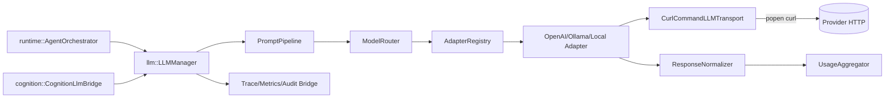
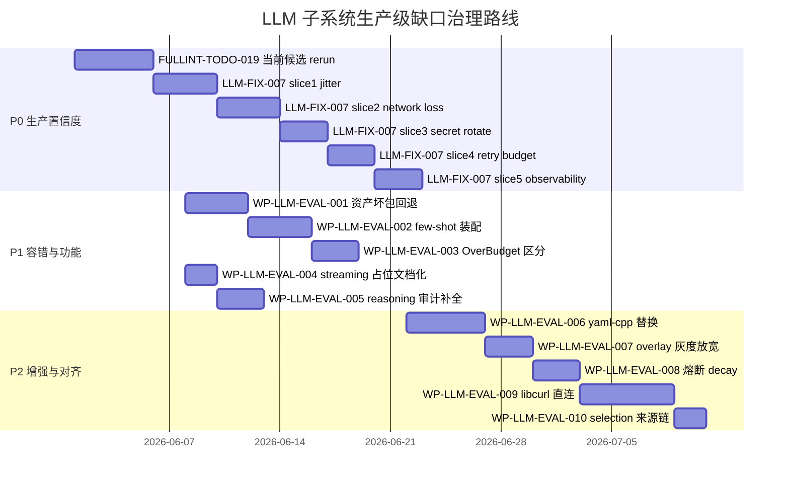

# LLM-EVAL-2026-05-31 LLM 子系统落地评估与生产级缺口治理任务规划

状态：Draft
日期：2026-05-31
来源：用户专项评估请求（架构覆盖 / 详设覆盖 / 业务链贯通 / 实际代码判据 / 行业最佳实践）
评估范围：
- 架构基线：[docs/architecture/DASALL_Agent_architecture.md](../architecture/DASALL_Agent_architecture.md)（2630 行）
- 详细设计：[docs/architecture/DASALL_llm子系统详细设计.md](../architecture/DASALL_llm子系统详细设计.md) v1.1（2102 行；含 17 项评审闭环）
- 实施代码：[llm/](../../llm/) 35 个 C++ 文件 + 11 份资产清单，合计约 14 644 行
- 上游消费方：[runtime/src/AgentOrchestrator.cpp](../../runtime/src/AgentOrchestrator.cpp)、[cognition/src/llm/CognitionLlmBridge.cpp](../../cognition/src/llm/CognitionLlmBridge.cpp)、[apps/runtime_support/src/RuntimeLiveDependencyComposition.cpp](../../apps/runtime_support/src/RuntimeLiveDependencyComposition.cpp)
- 测试矩阵：[tests/unit/llm/](../../tests/unit/llm/) 35 个、[tests/integration/llm/](../../tests/integration/llm/) 11 个、[tests/contract/llm](../../tests/contract/llm/) 1 个、[tests/contract/prompt](../../tests/contract/prompt/) 5 个

评估方法：以**实际落地代码为唯一硬证据**；架构与详设作为应然基线；行业实践（LiteLLM / openClaw / OpenRouter / DeepSeek 官方、LangChain Prompt template、OpenAI Agents SDK、OpenTelemetry GenAI semconv）作为对账参考。任何"待执行 / 待验证"项一律标注，禁止以测试存在等同于生产置信度。

---

## 0. 文档定位

1. 给项目治理与里程碑评审一份对 llm 子系统**生产级达成度**的可追溯结论。
2. 给后续 work package（WP-LLM-GAP-* / 复用现存 LLM-FIX-007 / FULLINT-TODO-019）提供**可执行的拆分基线**与**排序依据**。
3. 任何条目都必须能回链到代码文件:行 或 文档章节；无法直接验证的标注 `待验证`，不允许"自我证明"。

---

## 1. 评估结论摘要

| 维度 | 现状 | 结论 |
|---|---|---|
| 子系统骨架（Public IF / Prompt 三段 / 路由 / Adapter / Observability / Streaming） | 真实编译可跑、35 个 unit + 11 个 integration + 6 个 contract test 已发现 | **结构层达成度高（约 90%）** |
| 与 ADR-006 / ADR-007 / ADR-008 owner 边界 | 严格遵守：`LLMBoundaryGuardComplianceTest` 自动扫描 llm/include / llm/src / CMake，未发现回灌 memory/runtime/tools 私有实现 | **边界合规** |
| contracts 不被 llm 侵入 | shared admission 仍只有 `LLMRequest / LLMResponse / Prompt*`；`ResolvedModelRoute / PromptPolicyDecision / StreamSessionRef` 全部 module-local | **契约纪律 OK** |
| v1.1 评审闭环（1×P0 / 9×P1 / 7×P2，共 17 项） | 全部可在代码中验证，无"冻结但未实现"的虚假闭环 | **达成** |
| 业务链贯通（Runtime / Cognition → LLMManager → Pipeline → Router → Adapter → 真实 HTTP） | 三入口（unary / streaming / health）均真实接通；CognitionLlmBridge 真实持有 `shared_ptr<ILLMManager>`；`create_production_llm_manager` 真实落地 | **可贯通** |
| 真实落地 vs 桩 | placeholder.cpp 仍存在但只是历史 bootstrap；非 OpenAI 族 streaming 是已 deferred 的"显式占位"；其余无空跑 / 伪实现 | **基本无虚假** |
| 距离生产级 | 仍欠 current release candidate rerun + L6 soak（FULLINT-TODO-019 / LLM-FIX-007 五个 slice）+ 坏包回退 + few-shot 装配 + Over-Budget vs RequireRecompose 区分 | **未到生产级** |

**总体结论**：llm 子系统已完成**架构 / 接口 / 治理面**的真实落地（结构层），**外部长稳态证据 / 容错回退 / Prompt 资产装配深度**仍存在 P0–P1 缺口；GA 前必须收敛 P0 项，并在 P1 中明确"哪些可作为已知限制随版本发布、哪些必须在 GA 前关闭"。

---

## 2. DASALL 整体架构目标 vs LLM 落地（条目级对账）

| 架构原则 / 目标 | 落地证据 | 结论 |
|---|---|---|
| 控制与认知分离（Runtime 主控） | LLMManager 不接管调用时机，仅返回 `LLMManagerResult` 与 `governance_disposition` | 达成 |
| 屏蔽 Cloud / LAN / Local 部署位置差异 | [OpenAICompatibleAdapter.cpp](../../llm/src/adapters/OpenAICompatibleAdapter.cpp)（901 行真实 HTTP+SSE）、[OllamaAdapter.cpp](../../llm/src/adapters/OllamaAdapter.cpp)、[LocalLLMAdapter.cpp](../../llm/src/adapters/LocalLLMAdapter.cpp) | 达成 |
| Prompt 资产化与三段治理 | [PromptRegistry.cpp](../../llm/src/prompt/PromptRegistry.cpp) / [PromptComposer.cpp](../../llm/src/prompt/PromptComposer.cpp) / [PromptPolicy.cpp](../../llm/src/prompt/PromptPolicy.cpp) / [PromptPipeline.cpp](../../llm/src/prompt/PromptPipeline.cpp) | 达成（few-shot 外部解析占位见 §3） |
| 阶段化路由（Cloud → LAN → Local） | [ModelRouter.cpp](../../llm/src/route/ModelRouter.cpp) 636 行确定性评分；[AdapterRegistry.cpp](../../llm/src/route/AdapterRegistry.cpp) CoW 健康聚合（含 `record_call_success/failure` L424/L453） | 达成 |
| 输出语义统一（Direct / ToolCall / Clarification / Replan） | [ResponseNormalizer.cpp](../../llm/src/execution/ResponseNormalizer.cpp) 真实四类映射 + reasoning_content 剥离 | 达成 |
| 可观测（log / trace / metric / audit） | [LLMTraceBridge.cpp](../../llm/src/observability/LLMTraceBridge.cpp) / [LLMMetricsBridge.cpp](../../llm/src/observability/LLMMetricsBridge.cpp) / [LLMAuditBridge.cpp](../../llm/src/observability/LLMAuditBridge.cpp) 真实接入 infra；敏感值脱敏 13 项前缀 | 达成；TraceBridge `status_message` 较薄（GAP-P2-5） |
| 可恢复（超时 / 重试 / 回退 / 降级） | LLMManager 的 retry 循环（L1475+）+ degrade_policy fallback chain + AdapterRegistry 熔断 | 达成；熔断**无时间窗 decay**（GAP-P2-3） |
| 不接管 ContextPacket / Tool 授权 / Recovery 主控 | LLMBoundaryGuardComplianceTest 自动守 | 达成 |
| 配置式 provider 接入 | [assets/providers/{deepseek,ollama_lan,local_runtime}](../../llm/assets/providers/)；`auth_ref` 强制 `secret://` 或 `profile://` | 达成 |
| 不依赖额外 LLM 推理选模型 | ModelRouter 确定性评分 + `selection_reason_codes` | 达成（行业最佳实践对齐） |

**普遍性架构缺口**：
1. **生产置信度证据未闭环**：FULLINT-TODO-019 当前 release candidate rerun + LLM-FIX-007 五个 soak slice 仍待执行；这是 GA 前唯一系统性 P0 阻断。
2. **资产装载半成品保护**：详设 §6.6.2 / §6.10.3 要求"snapshot 校验失败必须保留上一份 valid catalog"，但当前 [PromptAssetRepository::reload()](../../llm/src/prompt/PromptAssetRepository.cpp) / [ProviderCatalogRepository::reload()](../../llm/src/provider/ProviderCatalogRepository.cpp) 失败时 hard-fail，无自动 fallback。

---

## 3. LLM 详细设计 vs 实际代码（差距矩阵）

下表只列**有差距 / 有风险**的条目；v1.1 闭环对照表 17 项全部已落地，详见原详设末尾 §12.4。

### 3.1 已完整落地（抽样）

- 五层组件：Public IF / Prompt 治理 / 调用控制 / Adapter / Observability，全部存在且可被 ctest 发现。
- v1.1 P0-1 IPromptPipeline facade：[IPromptPipeline.h](../../llm/include/prompt/IPromptPipeline.h) + [PromptPipeline.cpp](../../llm/src/prompt/PromptPipeline.cpp) 真实串联三段。
- v1.1 COMP-1 ILLMAdapter.generate() 返回 [AdapterCallResult](../../llm/src/adapters/AdapterCallResult.h) 而非 LLMResponse，且不抛异常。
- v1.1 GAP-1 / GAP-2：[TokenEstimator.cpp](../../llm/src/TokenEstimator.cpp) 含 UTF-8 + CJK 分类；[UsageAggregator.cpp](../../llm/src/UsageAggregator.cpp) 含 cache hit/miss 分价。
- v1.1 GAP-3 模板引擎安全：[TemplateRenderer.cpp](../../llm/src/prompt/TemplateRenderer.cpp) 变量名白名单 + UTF-8 截断 + 嵌套拒绝 + `{{`/`}}` 转义。
- v1.1 CONC-1 / 2 / 3：PromptAssetRepository / ProviderCatalogRepository 使用 `std::atomic_store_explicit` immutable swap；AdapterRegistry 使用 CoW snapshot。
- ModelRouter 确定性评分：tier_family / latency_tier / cost_tier / reasoning_depth_tier 四档统一抽象，DeepSeek `chat`/`reasoner` 是该抽象的实例而非硬编码分支。
- 边界守护自动化：[LLMBoundaryGuardComplianceTest.cpp](../../tests/unit/llm/LLMBoundaryGuardComplianceTest.cpp)。
- shared admission No-Go：`LLM-TODO-036` / `LLM-TODO-037` 评审结论已在详设 §7.2.1 / §7.2.2 冻结。

### 3.2 真实存在但深度 / 容错不足（"非虚假，但有产线短板"）

| 设计 ID / 章节 | 现状 | 风险 | 关联缺口 |
|---|---|---|---|
| §6.6.2 Prompt 资产坏包回退 | [PromptAssetRepository::reload()](../../llm/src/prompt/PromptAssetRepository.cpp) 失败时整体返回 false，不保留上一份 valid snapshot | 现场 deployment override 故障会让 catalog 进入空状态，全链路 prompt 治理瘫痪 | GAP-P1-B |
| §6.10.3 Provider Catalog 坏包回退 | 同上，[ProviderCatalogRepository::reload()](../../llm/src/provider/ProviderCatalogRepository.cpp) | 现场 OTA / snapshot 损坏可能导致全部 provider 失效 | GAP-P1-B |
| §6.6.1 Prompt 包 few-shot 装配 | [PromptComposer.cpp](../../llm/src/prompt/PromptComposer.cpp) `default_resolve_few_shots` 仅支持 `inline:` 前缀；外部 `few_shots/*.md` 引用记 `unresolved_few_shot_ref` warning | 启用 few-shot 包时静默退化，模型质量/一致性受损 | GAP-P1-C |
| §6.5.1 / §6.7.x 非 OpenAI 族 streaming | [OllamaAdapter::stream_generate()](../../llm/src/adapters/OllamaAdapter.cpp) / [LocalLLMAdapter::stream_generate()](../../llm/src/adapters/LocalLLMAdapter.cpp) 返回硬编码 `"...-not-implemented"` session_id | 与详设 deferred 意图一致，但 manager 上游不感知差异，调用方可能误以为 streaming 已就绪 | GAP-P1-D |
| §6.5.5 / §6.7.2 OverBudget vs RequireRecompose | [LLMManager.cpp](../../llm/src/LLMManager.cpp)（L842–L860）两态合并为 `safe_to_replan=true` 同一分支 | Runtime 无法区分"预算溢出"与"组合不可用"两种治理意图，影响 ContextOrchestrator 重装配策略 | GAP-P1-E |
| §6.10.3 / §6.15.2 ProviderCatalog overlay 严格度 | [apply_provider_overlay()](../../llm/src/provider/ProviderCatalogRepository.cpp) 对非白名单字段一律 Deny | 灰度只能改 auth_ref / base_url alias 等极少字段，灵活度低于设计预期 | GAP-P2-2 |
| §6.11 AdapterRegistry 熔断 | [route_is_blocked](../../llm/src/route/AdapterRegistry.cpp)（含 record_call_success/failure）阈值无时间窗 decay | burst 失败后 route 长期 block 直到手工干预 | GAP-P2-3 |
| §6.6.4 KeyValueYamlParser | [KeyValueYamlParser.h](../../llm/src/asset/KeyValueYamlParser.h) 不支持嵌套对象 / 对象列表，靠扁平点号 key 兜底 | 资产作者必须手工扁平化，非标准 YAML，可读性差 | GAP-P2-1 |
| §6.5.1 Transport 层 | [CurlCommandLLMTransport](../../llm/src/transport/CurlCommandLLMTransport.cpp) 用 `popen()` 调 curl 子进程；安全转义到位 | 高 QPS 下 fork+exec 开销大，且失去连接复用 / HTTP/2 / 取消信号能力 | GAP-P2-4 |
| §6.12.4 reasoning_content 审计 | [LLMManager.cpp](../../llm/src/LLMManager.cpp)（L480–L520）仅在 `reasoning_content_stripped=true` 时记审计 | LLM-C027 要求"显式治理与脱敏链路"，但未记录"为何脱敏 / 脱了什么 / 审计字段长度" | GAP-P2-5 |

### 3.3 设计声明但代码层未显性兑现

| 设计要求 | 现状 | 缺口 |
|---|---|---|
| §6.10.4 / §6.10.5 model tier 通用化 | ModelRouter 已读取 `tier_family / latency_tier / cost_tier / reasoning_depth_tier`，但 `selection_hint.previous_route_failures` 来源链不明（LLMManager 未显式赋值） | GAP-P2-6 |
| §6.15.1 路由"recovery bias" | ModelRouter 中 fallback route penalty/bonus 已实现，但缺少跨调用 / 跨会话的失败序列学习 | 工程上属于增强，非阻断 |
| §6.8 审计锚点 | 主链路日志含 selected_prompt_id / version / route / latency / fallback_used / selection_reason_codes / cost_estimate；但 `prompt_cache_hit_tokens` / `miss_tokens` 字段贯穿到 metrics 已就绪，trace 仅在 normalize span 出现 | 不阻断，但 OpenTelemetry GenAI semconv 对齐空间存在 |
| §6.13 与 profiles 的策略消费 | [LLMSubsystemConfig.cpp](../../llm/src/LLMSubsystemConfig.cpp) 投影 model_profile / prompt_policy / degrade_policy / timeout_policy；`render_budget_tokens / active_scene / active_persona / visible_tools` 推到 LLMManager `make_prompt_policy_input()` 时再补 | 不阻断，但语义切片散落在 manager 与 config 两处 |

---

## 4. 业务链贯通性评估

### 4.1 主链路调用路径（实际代码追踪）

证据：
- Runtime → LLM：[AgentOrchestrator.cpp](../../runtime/src/AgentOrchestrator.cpp) `make_runtime_response_llm_request` (L723) + `has_production_llm_direct_path` (L666)
- Cognition → LLM：[CognitionLlmBridge.cpp](../../cognition/src/llm/CognitionLlmBridge.cpp) (L270 / L289 / L356)
- Production composition：[RuntimeLiveDependencyComposition.cpp](../../apps/runtime_support/src/RuntimeLiveDependencyComposition.cpp) (L3335) `create_production_llm_manager`
- Pipeline → Adapter → Network：LLMManager → ModelRouter → AdapterRegistry → Adapter → CurlCommandLLMTransport (`popen()` 真实子进程)

### 4.2 测试矩阵贯通性

| 类型 | 数量 | 关键覆盖 |
|---|---|---|
| Unit | 35 | InterfaceSurface / LLMManager{Success,Fallback,Failure,Retry,Timeout,Concurrency} / ModelRouter{Policy,Fallback,ReasoningModeSelection,Stability} / Prompt{Asset,Source,Registry,Composer,Policy,Pipeline} / Provider{Catalog,Overlay,Metadata,Config} / Adapter{Health,Protocol} / ResponseNormalizer{Reasoning,Semantic,Usage} / Stream / Token / TemplateRenderer / Boundary / Observability |
| Integration | 11 | Smoke / Fallback / Profile / DualMode / Persona / PromptSourceSwitch / ProviderAssetOnboarding / Streaming / GovernanceFailure / ProductionObservability |
| Contract | 6 | LLMRequest+Response / PromptCompose{Request,Result}{Field}? / PromptSpecRelease |

**贯通性结论**：业务链**完整且真实贯通**；Runtime / Cognition 两条入口均真实穿越完整 llm 链路；唯一已知非生产能力是非 OpenAI 族 streaming（GAP-P1-D）。

---

## 5. 行业最佳实践对齐评估

| 实践方向 | DASALL 落地 | 业界对比 | 评价 |
|---|---|---|---|
| Provider/Model 资产外置 | `assets/providers/*.yaml` + `auth_ref` 引用 secret | LiteLLM `model_list` / openClaw `models.providers` | **对齐且更严**：禁止明文密钥 |
| 多模型 tier 抽象 | `tier_family / latency_tier / cost_tier / reasoning_depth_tier` vendor-neutral | OpenRouter model attributes | **更优**：显式建模而非依赖厂商命名 |
| Prompt 三段治理 | Registry → Composer → Policy + Pipeline facade | LangChain PromptTemplate（无 Policy 层）；OpenAI Agents SDK `instructions` 字段 | **更严**：多了发送前 allowlist / redaction / budget |
| 路由 fallback | 确定性评分 + degrade_policy 显式 chain | LiteLLM Router fallbacks | **对齐** |
| 不依赖元 LLM 选 LLM | 详设 §6.6.7 显式禁止 | LangGraph 部分实现 | **对齐** |
| reasoning_content 边界 | ResponseNormalizer 剥离 + 不进 history + 审计 | DeepSeek 官方建议 | **对齐** |
| 模板引擎安全 | simple_var 不支持代码执行；变量白名单 + UTF-8 截断 | Jinja2 有 SSTI 风险 | **更安全** |
| Streaming 治理 | StreamSessionRegistry 状态机 + bounded capacity + TTL reap | 多数实现裸用 SSE | **更严**（仅 OpenAI 族落地） |
| Token / 成本归因 | UsageAggregator + cache hit/miss 分价 + LLMMetricsBridge | OpenAI Agents SDK / OpenTelemetry GenAI semconv | **基本对齐**；trace span 字段可继续向 semconv 靠拢 |

### 5.1 不必要 / 冗余设计点（评审）

- **CurlCommandLLMTransport 用 popen 调 curl 子进程**：当前实现已正确处理转义、超时、HTTP 状态提取，但属于**性能与连接复用上的次优实现**，不是冗余设计。GA 前可作为已知性能限制随版本发布；GA 后建议演进为 libcurl 直连。
- 其他组件（包括 PromptPipeline facade、独立 TokenEstimator/UsageAggregator、ProviderCatalog 加载器）都有具体测试覆盖与上游消费者，**未发现冗余/过度设计**。

---

## 6. 距生产级交付的缺口汇总

| 优先级 | 缺口 ID | 描述 | 阻断 GA？ |
|---|---|---|---|
| **P0** | GAP-P0-1 | 当前 release candidate rerun 未归档（FULLINT-TODO-019） | **是** |
| **P0** | GAP-P0-2 | LLM-FIX-007 五个 soak slice（jitter / network loss / secret rotate / retry budget exhaustion / observability trend）未执行归档 | **是** |
| P1 | GAP-P1-A | TraceBridge / Audit reasoning_content 治理路径细节不全 | 否（可观测性短板）|
| P1 | GAP-P1-B | PromptAsset / ProviderCatalog 坏包回退缺失 | 部分（运维手工回滚可缓解）|
| P1 | GAP-P1-C | PromptComposer few-shot 外部解析占位 | 仅当启用 few-shot 包时阻断 |
| P1 | GAP-P1-D | Ollama / Local adapter streaming 占位需文档化 + 调用方守护 | 否（设计已 deferred）|
| P1 | GAP-P1-E | OverBudget vs RequireRecompose 区分回流 | 否（影响 Runtime 重装配优化空间） |
| P2 | GAP-P2-1 | KeyValueYamlParser 嵌套对象 / 对象列表缺失（替换 yaml-cpp） | 否 |
| P2 | GAP-P2-2 | ProviderCatalog overlay 严格度过高 | 否 |
| P2 | GAP-P2-3 | AdapterRegistry 熔断无时间窗 decay | 否 |
| P2 | GAP-P2-4 | CurlCommandLLMTransport 子进程性能（替换为 libcurl） | 否 |
| P2 | GAP-P2-5 | reasoning_content 审计字段细化 | 否 |
| P2 | GAP-P2-6 | `selection_hint.previous_route_failures` 来源链显式化 | 否 |

---

## 7. 任务拆分与规划

### 7.1 拆分原则

1. 每个 task 必须包含**代码目标 / 测试目标 / 验收命令**三件套；这是 DASALL Design→Build 双轨基线。
2. 已有的 LLM-FIX-007 / FULLINT-TODO-019 已是 P0 的执行容器，本规划**不重新发明 ID**，而是把它们直接挂为 P0 项的执行入口。
3. P1 / P2 全部是**新工作包**，按照仓库现行编号（`WP-LLM-EVAL-XXX`）追加；后续可由专项 TODO 文档接管原子化拆分。
4. 任务粒度：P0 按 slice、P1 按组件、P2 按改造点，确保每个 task 在 1–3 个工作日内可关闭。
5. 排序依据：**生产置信度 > 容错回退 > 功能完备 > 性能/可观测增强**。

### 7.2 任务总图（甘特序）

### 7.3 P0 任务（GA 阻断，必须收敛）

#### P0-T1：FULLINT-TODO-019 当前 release candidate rerun

- 关联：[docs/todos/llm/deliverables/FULLINT-TODO-019-*](../todos/llm/deliverables/) （若不存在则在 docs/todos/llm/ 新建）
- 代码目标：在 release runner（真实 ubuntu 容器或 qemu）上完成当前候选 rerun，归档 `runtime-installed-proof.json` / `runtime-proof.json`。
- 测试目标：`scripts/packaging/run_local_qemu_gate.sh` 在最新 candidate 上 PASS；artifacts 写入 `~/.cache/dasall/qemu/autopkgtest-output/<ts>/`。
- 验收命令：
  - `bash scripts/packaging/pkg_smoke_install.sh --explicit-start-check`
  - `sh scripts/packaging/run_local_qemu_gate.sh`
- 依赖：rt-fix-006 / rtsup-fix-005 已就绪（见仓库现有 task 标签）。

#### P0-T2 ~ P0-T6：LLM-FIX-007 五个 soak slice

| ID | Slice | 代码 / 脚本目标 | 验收命令（建议） |
|---|---|---|---|
| P0-T2 | provider jitter | 注入 50–500ms 抖动，跑 30 分钟 soak | `ctest --test-dir build-ci -R LLMSoakProviderJitter` |
| P0-T3 | network loss | 注入 1–5% 丢包，跑 30 分钟 soak | `ctest --test-dir build-ci -R LLMSoakNetworkLoss` |
| P0-T4 | secret rotate | 中途 rotate auth_ref，验证不停服 | `ctest --test-dir build-ci -R LLMSoakSecretRotate` |
| P0-T5 | retry budget exhaustion | 跑 N 次直到 retry_budget 耗尽 | `ctest --test-dir build-ci -R LLMSoakRetryBudget` |
| P0-T6 | observability trend | 收集 30 分钟 metrics / trace 趋势 | `ctest --test-dir build-ci -R LLMSoakObservabilityTrend` |

执行入口：[docs/todos/llm/deliverables/LLM-FIX-007-external-provider长稳态与L6-soak执行计划.md](../todos/llm/deliverables/LLM-FIX-007-external-provider长稳态与L6-soak执行计划.md)。归档证据写入 `docs/worklog/DASALL_开发执行记录.md` 与 `docs/todos/llm/DASALL_llm子系统专项TODO.md`。

### 7.4 P1 任务（GA 前应收敛，部分可作为已知限制随版本发布）

#### WP-LLM-EVAL-001 资产坏包回退（PromptAsset + ProviderCatalog）

- 设计依据：详设 §6.6.2 / §6.10.3。
- 代码目标：
  - [PromptAssetRepository::reload()](../../llm/src/prompt/PromptAssetRepository.cpp)：parse 失败时**保留** `last_valid_snapshot_`，仅当显式 `force_replace=true` 才覆盖。
  - [ProviderCatalogRepository::reload()](../../llm/src/provider/ProviderCatalogRepository.cpp)：同上语义。
  - 在 ResultCode 中明确 "loaded_with_stale_snapshot" 状态，并通过 audit event 上报。
- 测试目标：
  - 新增 `PromptAssetSnapshotFallbackTest` / `ProviderCatalogSnapshotFallbackTest`（注入坏包 → 校验 catalog 仍指向上一份 valid）。
  - 扩展 `LLMPromptSourceSwitchIntegrationTest` 覆盖故障重试。
- 验收命令：`ctest --test-dir build-ci -R "(PromptAssetSnapshotFallback|ProviderCatalogSnapshotFallback|LLMPromptSourceSwitch)" --output-on-failure`

#### WP-LLM-EVAL-002 PromptComposer few-shot 外部装配

- 设计依据：详设 §6.6.1。
- 代码目标：
  - [PromptComposer.cpp](../../llm/src/prompt/PromptComposer.cpp) 注入 `IFewShotResolver`，默认实现读取 `assets/prompts/<id>/few_shots/*.md`，用 `PromptAssetRepository` 提供的根目录解析。
  - few_shots 计数受 `PromptComposerConfig.max_few_shot_count`（默认 5）限制。
  - 解析失败 → ResultCode 失败 + composition_warning，不静默退化。
- 测试目标：
  - 新增 `PromptComposerFewShotResolutionTest`（覆盖 inline / external 文件 / 缺失 / 超限四类）。
  - 在 `LLMSubsystemSmokeIntegrationTest` 中加入 few-shot 启用场景。
- 验收命令：`ctest --test-dir build-ci -R "PromptComposerFewShotResolutionTest|LLMSubsystemSmokeIntegrationTest" --output-on-failure`

#### WP-LLM-EVAL-003 OverBudget vs RequireRecompose 回流区分

- 设计依据：详设 §6.5.5 / §6.7.2 / §6.15.6。
- 代码目标：
  - [LLMManager.cpp](../../llm/src/LLMManager.cpp)（L842–L860）将两态分开：
    - `OverBudget` → `safe_to_replan=true`，`recompose_hint="reduce_context"`。
    - `RequireRecompose` → `safe_to_replan=true`，`recompose_hint="reselect_release"`。
  - LLMManagerResult 增加 `recompose_hint` 字段（module-local，不入 contracts）。
- 测试目标：
  - 扩展 `LLMManagerFailureMappingTest`，覆盖两态分别产生不同 recompose_hint。
  - 在 `LLMGovernanceFailureIntegrationTest` 中添加 RequireRecompose 路径。
- 验收命令：`ctest --test-dir build-ci -R "LLMManagerFailureMappingTest|LLMGovernanceFailureIntegrationTest" --output-on-failure`

#### WP-LLM-EVAL-004 非 OpenAI 族 streaming 占位文档化与调用方守护

- 设计依据：详设 §6.5.1。
- 代码目标：
  - [OllamaAdapter::stream_generate()](../../llm/src/adapters/OllamaAdapter.cpp) / [LocalLLMAdapter::stream_generate()](../../llm/src/adapters/LocalLLMAdapter.cpp) 修改为返回明确失败的 `StreamSessionRef`，并通过 observer 回调 `error="streaming_not_supported"`，而非硬编码 `session_id`。
  - LLMManager 在收到 streaming 不支持时降级为 unary 或 fail-closed（按 degrade_policy）。
  - 详设 §6.5.1 / §6.10.3 增加"非 OpenAI 族 streaming 限制"声明。
- 测试目标：
  - 扩展 `AdapterProtocolMappingTest` 覆盖 stream_generate 不支持路径。
  - 新增 `LLMManagerStreamingDowngradeTest`。
- 验收命令：`ctest --test-dir build-ci -R "AdapterProtocolMappingTest|LLMManagerStreamingDowngradeTest" --output-on-failure`

#### WP-LLM-EVAL-005 reasoning_content 治理审计补全

- 设计依据：约束 LLM-C027 + 详设 §6.12.4。
- 代码目标：
  - [LLMManager.cpp](../../llm/src/LLMManager.cpp)（L480–L520）的 audit 事件追加：`stripped_byte_count` / `reasoning_mode_effective` / `provider_id` / `model_id` / `pricing_ref`；保留长度上限避免审计放大。
  - [LLMTraceBridge.cpp](../../llm/src/observability/LLMTraceBridge.cpp) 的 `status_message` 序列化补 `failure_category` 详细字段。
- 测试目标：
  - 扩展 `LLMAuditEventCoverageTest` 覆盖新字段。
  - 扩展 `ResponseNormalizerReasoningContentStripTest` 校验剥离长度。
- 验收命令：`ctest --test-dir build-ci -R "LLMAuditEventCoverageTest|ResponseNormalizerReasoningContentStripTest" --output-on-failure`

### 7.5 P2 任务（增强与对齐，可在 GA 后分版本承接）

#### WP-LLM-EVAL-006 KeyValueYamlParser → yaml-cpp（或 mini-yaml）替换

- 代码目标：在 [llm/src/asset](../../llm/src/asset/) 引入 yaml-cpp（需经依赖 Admit）；保留旧 parser 作为 fallback；assets 文件支持嵌套与对象列表。
- 测试目标：扩展 `PromptAssetPackageParseTest` / `ProviderCatalogParseTest` / `ProviderModelMetadataParseTest` 用嵌套语法重写。
- 验收命令：`ctest --test-dir build-ci -R "PromptAssetPackageParseTest|ProviderCatalogParseTest|ProviderModelMetadataParseTest" --output-on-failure`

#### WP-LLM-EVAL-007 ProviderCatalog overlay 灰度放宽

- 代码目标：[apply_provider_overlay()](../../llm/src/provider/ProviderCatalogRepository.cpp) 引入 `mutable_field_policy`，允许 deployment override 修改 `display_name / capability_tags / verification_state` 等明确灰度字段；`pricing / context_window / metadata_source_uri` 保持只读。
- 测试目标：扩展 `ProviderCatalogOverlayTest` 覆盖白名单与拒绝路径。
- 验收命令：`ctest --test-dir build-ci -R ProviderCatalogOverlayTest --output-on-failure`

#### WP-LLM-EVAL-008 AdapterRegistry 熔断时间窗 decay

- 代码目标：[AdapterRegistry.cpp](../../llm/src/route/AdapterRegistry.cpp)（含 record_call_failure L453）增加 `failure_window_ms`（默认 5 分钟）；超过窗口的 failure 不计入 consecutive_failures。
- 测试目标：新增 `AdapterRegistryCircuitDecayTest`。
- 验收命令：`ctest --test-dir build-ci -R AdapterRegistryCircuitDecayTest --output-on-failure`

#### WP-LLM-EVAL-009 CurlCommandLLMTransport → libcurl 直连

- 代码目标：在 [llm/src/transport/](../../llm/src/transport/) 新增 `LibcurlLLMTransport`，复用 ILLMTransport SPI；通过 LLMSubsystemConfig.transport_kind 切换；老 popen 实现保留为兼容路径，并标记 deprecated。
- 测试目标：现有所有 adapter 测试在两种 transport 下均通过；新增 `LibcurlTransportPerfSmokeTest` 验证连接复用。
- 验收命令：`ctest --test-dir build-ci -R "Adapter|LibcurlTransportPerfSmokeTest" --output-on-failure`

#### WP-LLM-EVAL-010 ModelSelectionHint.previous_route_failures 来源链显式化

- 代码目标：[LLMManager.cpp](../../llm/src/LLMManager.cpp) 在 fallback 进入下一跳前，把上一跳失败计数显式写入 selection_hint，并通过 trace span 暴露。
- 测试目标：扩展 `ModelRouterStabilityTest` 覆盖 previous_route_failures 影响评分。
- 验收命令：`ctest --test-dir build-ci -R ModelRouterStabilityTest --output-on-failure`

### 7.6 任务执行总览表

| 优先级 | Task ID | 名称 | 估算工日 | 关联文件 / 章节 | 验收门 |
|---|---|---|---|---|---|
| P0 | P0-T1 | FULLINT-TODO-019 candidate rerun | 5 | scripts/packaging/* | qemu gate PASS + artifacts 归档 |
| P0 | P0-T2 | LLM-FIX-007 jitter slice | 4 | tests/integration/llm/* | LLMSoakProviderJitter PASS |
| P0 | P0-T3 | LLM-FIX-007 network loss slice | 4 | tests/integration/llm/* | LLMSoakNetworkLoss PASS |
| P0 | P0-T4 | LLM-FIX-007 secret rotate slice | 3 | tests/integration/llm/* | LLMSoakSecretRotate PASS |
| P0 | P0-T5 | LLM-FIX-007 retry budget slice | 3 | tests/integration/llm/* | LLMSoakRetryBudget PASS |
| P0 | P0-T6 | LLM-FIX-007 observability trend slice | 3 | tests/integration/llm/* | LLMSoakObservabilityTrend PASS |
| P1 | WP-LLM-EVAL-001 | 资产坏包回退 | 4 | PromptAssetRepository / ProviderCatalogRepository | 两个新 fallback 测试 PASS |
| P1 | WP-LLM-EVAL-002 | few-shot 外部装配 | 4 | PromptComposer | PromptComposerFewShotResolutionTest PASS |
| P1 | WP-LLM-EVAL-003 | OverBudget vs RequireRecompose | 3 | LLMManager | LLMManagerFailureMappingTest 扩展 PASS |
| P1 | WP-LLM-EVAL-004 | streaming 占位治理 | 2 | OllamaAdapter / LocalLLMAdapter | AdapterProtocolMappingTest + LLMManagerStreamingDowngradeTest PASS |
| P1 | WP-LLM-EVAL-005 | reasoning 审计补全 | 3 | LLMManager / LLMTraceBridge / LLMAuditBridge | LLMAuditEventCoverageTest 扩展 PASS |
| P2 | WP-LLM-EVAL-006 | yaml-cpp 替换 | 5 | llm/src/asset/* | 三类资产 parse 测试以嵌套语法 PASS |
| P2 | WP-LLM-EVAL-007 | overlay 灰度放宽 | 3 | ProviderCatalogRepository | ProviderCatalogOverlayTest 扩展 PASS |
| P2 | WP-LLM-EVAL-008 | 熔断 decay | 3 | AdapterRegistry | AdapterRegistryCircuitDecayTest PASS |
| P2 | WP-LLM-EVAL-009 | libcurl 直连 | 6 | llm/src/transport/* | 现有 adapter 测试 + LibcurlTransportPerfSmokeTest PASS |
| P2 | WP-LLM-EVAL-010 | previous_route_failures 来源链 | 2 | LLMManager / ModelRouter | ModelRouterStabilityTest 扩展 PASS |

合计：P0 共 6 项约 22 工日；P1 共 5 项约 16 工日；P2 共 5 项约 19 工日。

### 7.7 进入 GA 的硬门禁清单

下述全部 PASS 后，llm 子系统可宣布 GA-ready：

1. P0-T1 ~ P0-T6 全部 PASS 且证据归档进 `docs/worklog/DASALL_开发执行记录.md`。
2. WP-LLM-EVAL-001 ~ 003 全部合入主干并通过 build-ci。
3. WP-LLM-EVAL-004 ~ 005 至少完成 PR 评审（可作为 GA 后第一个补丁版本随版本发布）。
4. 现有所有 unit / integration / contract test 在 build-ci 上保持 100% PASS。
5. `LLMBoundaryGuardComplianceTest` 始终 PASS（边界回归防线持续守住）。
6. release runner contract（dasall daemon / cli / common deb）仍然合规。

---

## 8. 风险与回退

| 风险 | 描述 | 缓解 / 回退 |
|---|---|---|
| LLM-FIX-007 soak 在外部 provider 上费用 / 限流过高 | DeepSeek / OpenAI 长稳态测试可能击穿 budget | 优先用 local_runtime + ollama 跑结构性 soak；外部 provider 仅做最后一轮真实证据 |
| WP-LLM-EVAL-001 fallback 改动引入"假 PASS"风险 | 上一份 valid snapshot 长期被锁定可能掩盖现场资产损坏 | 对 stale snapshot 强制 audit + metric `llm_asset_stale_snapshot_total`，超过阈值告警 |
| WP-LLM-EVAL-006 yaml-cpp 引入第三方依赖 | Admit、license、嵌入式编译尺寸 | 走 docs/governance 第三方依赖 Admit 流程；保留 KeyValueYamlParser 作为 minimal fallback |
| WP-LLM-EVAL-009 libcurl 与 popen 行为差异 | 错误分类 / 取消语义可能不一致 | 双 transport 共享 `AdapterCallResult` mapping 测试矩阵；切换走 config，问题时一键回滚 |
| 任务排期延误影响 GA | P0 soak 因 provider 不稳重跑 | 按 5.1 行业实践把 GAP-P2-4（curl 子进程）作为已知限制保留至 GA 后版本 |

---

## 9. 与既有治理文档的衔接

1. 本评估**不重新发明** P0 容器：FULLINT-TODO-019 / LLM-FIX-007 既有交付物继续作为 P0 执行入口，本文档只做**任务挂接和总览**。
2. P1 / P2 工作包（WP-LLM-EVAL-001 ~ 010）建议在 [docs/todos/llm/DASALL_llm子系统专项TODO.md](../todos/llm/DASALL_llm子系统专项TODO.md) 中作为**新 deliverable** 追加；执行细节遵循 [docs/development/WP双轨任务执行提示词模板.md](../development/WP双轨任务执行提示词模板.md)；提交语义遵循 [docs/development/Git提交信息规范.md](../development/Git提交信息规范.md)。
3. 任何任务的关闭都必须**双轨证据回写**：worklog 行 + TODO 表 closeout + memory/repo/ 关键发现笔记（如有）。

---

## 10. 评审与签字

- 评估作者：Copilot（基于实际代码遍历与详设对账）
- 评审建议提交对象：DASALL 项目 owner / llm WP owner
- 关键判据：本文 §1 摘要 + §6 缺口表 + §7 任务表
- 反馈方式：在仓库 `docs/deliverables/` 内对本文件追加 `<!-- review: ... -->` 注释或新增 review 子文件

---

附：本评估对应的现场代码扫描状态：
- llm/include + llm/src 共 14 644 行扫描完成
- 35 个 unit + 11 个 integration + 6 个 contract test 已确认存在
- 所有引用代码行号基于 2026-05-31 工作树状态；后续如有 PR 落地，行号会漂移，引用位置仍可通过函数名 / 测试名稳定定位
