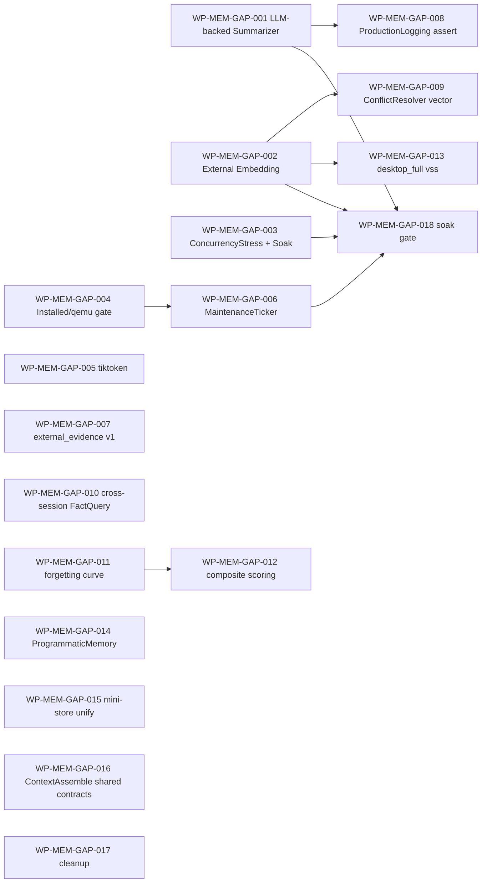
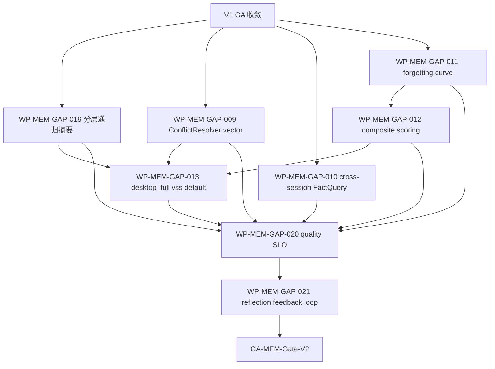

# MEM-EVAL-2026-05-31 memory 子系统落地评估与生产级缺口治理任务规划

状态：Draft
日期：2026-05-31
来源：用户专项评估请求（"研究学习 DASALL 架构设计 + Memory 子系统设计；调研行业实践；对 memory 实际代码进行全面评估和检查；给出子系统实际落地距离 DASALL 设计内容和目标的差距和缺口、距离生产级交付的缺口"）
评估范围：
- 架构与设计：[docs/architecture/DASALL_Agent_architecture.md](../architecture/DASALL_Agent_architecture.md)（§4.6 / §5.3 全节）、[docs/architecture/DASALL_memory子系统详细设计.md](../architecture/DASALL_memory子系统详细设计.md)（§1–§12.3 全文，含 MEM-D001..D010、MEM-M1..M6、MEM-E01..E09）
- 实现代码：[memory/include/](../../memory/include/)（30+ 头文件、6 个稳定子目录）+ [memory/src/](../../memory/src/)（21 个源文件、~7900 行 C++ 实现）+ [memory/CMakeLists.txt](../../memory/CMakeLists.txt)（含 sqlite 3.51.3 autoconf + sqlite-vss v0.1.2 资源装配）
- SQL Schema：[sql/memory/V001__initial_schema.sql](../../sql/memory/V001__initial_schema.sql) / [sql/memory/V002__vector_sidecar.sql](../../sql/memory/V002__vector_sidecar.sql)
- 测试套件：[tests/unit/memory/](../../tests/unit/memory/)（33 文件、~5300 行）+ [tests/integration/memory/](../../tests/integration/memory/)（11 文件、~3000 行）+ [tests/contracts/](../../tests/contracts/) 内 Memory 相关 contract 测试
- 生产装配：[apps/runtime_support/src/RuntimeLiveDependencyComposition.cpp](../../apps/runtime_support/src/RuntimeLiveDependencyComposition.cpp#L3308)、[apps/daemon/src/MemoryMaintenanceProofRunner.cpp](../../apps/daemon/src/MemoryMaintenanceProofRunner.cpp)、[apps/daemon/src/RuntimeInstalledProofRunner.cpp](../../apps/daemon/src/RuntimeInstalledProofRunner.cpp)
- Runtime 接入：[runtime/include/RuntimeDependencySet.h](../../runtime/include/RuntimeDependencySet.h)、[runtime/src/AgentOrchestrator.cpp](../../runtime/src/AgentOrchestrator.cpp)（`memory_manager->prepare_context` / `write_back` 调用）

评估方法：以实际落地代码为唯一判据；对照架构 / 详设硬约束（含 ADR-006/007/008、MEM-D001..D010、MEM-G1..G6、MEM-B01..B07、§6.6/§6.7/§6.8/§6.9/§6.10/§6.11/§6.12/§9/§10/§11/§12）；并对标 MemGPT/Letta、MemoryOS、CrewAI、LangGraph、Akka-Persistence、SQLite WAL 最佳实践等行业方案。

---

## 0. 文档定位与读者

1. 给项目治理与里程碑评审提供一份对 memory 子系统**生产级达成度**的可追溯结论。
2. 给后续 work package（WP-MEM-GAP-*）提供可执行的拆分基线与排序依据。
3. 任何条目都必须能回链到代码文件 / 行号或文档章节；当前判定不确定的标注 `待验证` 而非自圆其说。
4. 与 [COG-EVAL-2026-05-31](./COG-EVAL-2026-05-31-cognition子系统落地评估与生产级缺口治理任务规划.md)、[LLM-EVAL-2026-05-31](./LLM-EVAL-2026-05-31-llm子系统落地评估与生产级缺口治理任务规划.md)、[RT-EVAL-2026-05-31](./RT-EVAL-2026-05-31-runtime子系统落地评估与生产级缺口治理任务规划.md) 形成跨子系统评估四联章。

---

## 1. 评估结论摘要

| 维度 | 现状 | 结论 |
|---|---|---|
| 子系统骨架（MemoryManager / ContextOrchestrator / CandidateCollector / BudgetAllocator / CompressionCoordinator / WritebackCoordinator / MemoryConflictResolver / WorkingMemoryBoard / SqliteMemoryStore / SqliteSchemaMigrator / MemoryMaintenanceWorker / VectorMemoryIndexAdapter / MemoryObservability / MemoryConfigProjector） | 14 个核心组件全部编译可跑、单元 33 + 集成 11 测试齐备、生产 composition 已挂 | **结构层达成度高（约 85%）** |
| ADR-006（上下文权归 memory.ContextOrchestrator） | [ContextOrchestrator.cpp](../../memory/src/context/ContextOrchestrator.cpp)（814 行）按 §6.12.2 表逐槽映射；runtime 内部不组装 messages；`MemoryBoundaryGuardComplianceTest` 锁定边界 | **边界合规** |
| ADR-007（恢复准入权归 runtime.RecoveryManager） | WritebackCoordinator 仅做 `kMaxCoreTransactionAttempts=3` 的 SQLite BUSY bounded retry，超出即返回 `retryable_storage_failure`；memory 内无 retry/replan/abort 决策 | **边界合规** |
| ADR-008（全局主控权归 runtime.AgentOrchestrator） | MemoryMaintenanceWorker 默认 `auto_schedule=false`（被动模式），不形成第二主循环；runtime 通过 `IMemoryManager::prepare_context/write_back` 唯一驱动 | **边界合规** |
| 五层记忆模型（Working / Short-Term / Long-Term Semantic / Experience / Vector） | 全部以真实代码 + 表结构落地（sessions/turns/summaries/facts/experiences/vector sidecar/schema_migrations） | **达成（MEM-M1..M6）** |
| ContextPacket 11 槽位映射 | ContextOrchestrator.build_packet 按 §6.12.2 表完成；trim_text_to_token_limit + ContextPacketGuards | **达成** |
| 写回核心事务 + 附属写入 + 旁路向量 | WritebackCoordinator 693 行：core transaction（Turn+Session+Summary）+ derived writes（Fact+Experience+Conflict）+ vector sidecar best-effort + working board 更新 | **达成** |
| SQLite 持久化（WAL + 单 writer + reader pool + busy retry + checkpoint） | SqliteMemoryStore 1493 行：完整 schema、行映射、版本门、map_sqlite_result 错误分类、validate_sqlite_runtime_version | **达成（MEM-B04 已解除：3.51.3 pin）** |
| Schema 迁移 | SqliteSchemaMigrator 406 行 + V001/V002 SQL；schema_migrations 表 | **达成** |
| 错误语义 5 类（StorageBusy/SchemaMismatch/ValidationRejected/StorageUnavailable/ConfigInvalid） | [memory/include/error/MemoryError.h](../../memory/include/error/MemoryError.h) + map_memory_error / map_memory_errno | **达成** |
| 可观测性（log/metric/audit/trace） | [memory/src/observability/MemoryObservability.cpp](../../memory/src/observability/MemoryObservability.cpp) 482 行；`MemoryProductionLoggingIntegrationTest` / `MemoryObservabilityBridgeTest` 端到端覆盖 | **达成**（生产侧 sink 已直连，**比 runtime 子系统更完整**） |
| 业务链贯通（Runtime ↔ Memory ↔ SQLite ↔ Vector ↔ Profile ↔ Observability） | unary、resume、recovery、context-assemble、writeback、maintenance、failure-injection、checkpoint-busy、profile-compat、production-logging 等 11 条集成测全部存在 | **可贯通** |
| 真实落地 vs 桩 | 无空壳实现；`memory/src/MemoryBuildSkeleton.cpp` 仅 4 行历史 namespace 文件可清理；所有主要组件均含真实业务体（store 1493 / orchestrator 814 / writeback 693 / vector backend 713 / observability 482 / manager 482 / schema migrator 406 / row mappers 408 / conflict resolver 371 / compression coordinator 320 / budget allocator 313 / detached vector factory 280 / candidate collector 246 / working board 244） | **无虚假实现** |
| 距离生产级 GA | 仍欠：生产侧 LLM-backed Summarizer 注入、外部 embedding service 注入、跨 session FactQuery、tiktoken token 估算、向量相似度辅助冲突检测、ProgrammaticMemory 持久化、composite scoring、遗忘曲线、ConcurrencyStress / Soak 长跑证据 | **未到生产级** |

总体结论：memory 已完成**架构 / 接口 / 持久化 / 上下文装配 / 写回 / 维护 / 观测性**的真实落地，与 runtime 同处"骨架达成、深度需补"水位；区别于 runtime 缺口的"信号外送 / 跨版本 / 并发证据"，memory 的缺口集中在**质量层（摘要质量 / 召回质量 / 冲突精度）与运营层（长跑证据 / 跨 session 共享 / 演进契约）**。GA 前必须收敛 P0 项。

---

## 2. DASALL 整体架构目标 vs Memory 落地（条目级对账）

| 架构原则 / 目标 | 落地证据 | 结论 |
|---|---|---|
| Layer 4 归属（Cognition Support） | memory/CMakeLists.txt 声明 `dasall_memory` 为静态库；不依赖 llm/tools/access | 达成 |
| 上下文权归一（ADR-006） | ContextOrchestrator 是唯一装配中心；runtime / cognition 不重复装配 | 达成 |
| 恢复权不外溢（ADR-007） | WritebackCoordinator 仅 bounded retry；其他错误一律上抛 | 达成 |
| 主控权不并行（ADR-008） | MemoryMaintenanceWorker 被动调度；factory 不创建第二主循环 | 达成（生产侧 ticker 缺，见 GAP-P1-A） |
| 五层记忆显式分层（§5.3.2 / §4.1） | Working/Short/Long-Semantic/Experience/Vector 全部独立组件 + 独立表 | 达成 |
| Programmatic Memory（§4.1 / §6.5.1a） | **未落地持久化**，仅设计声明 asset ref/lease | 与设计一致（MEM-E06 后置） |
| ContextPacket 11 槽位 + token 预算 + 压缩触发 | ContextOrchestrator.build_packet + BudgetAllocator + CompressionCoordinator | 达成 |
| 冲突检测 + 置信度 + 来源引用（§5.3.4） | MemoryConflictResolver 真实规则引擎（kPolarityPairs / kNegationMarkers / kNoiseTokens / shared_anchor_count / has_polarity_conflict / extract_single_number） + ConflictAction 4 态 | 达成（向量辅助缺，GAP-P2-D） |
| 写回 SummaryMemory 含 decisions_made/confirmed_facts/tool_outcomes（§5.3.5） | CompressionCoordinator extract_decisions / extract_confirmed_facts / extract_tool_outcomes 关键词匹配 + merge_with_existing | **达成但精度受限**（中文关键词 + 模板拼接），见 GAP-P0-A |
| Session/Turn/SummaryMemory/MemoryFact 关键对象（§5.3.6） | contracts 已冻结；memory 内 RowMappers 完整双向映射 | 达成 |
| Vector backend 灰度策略（sqlite-vss / none / hnswlib opt-in） | VectorBackend 枚举 + DetachedVectorIndexFactory + UnavailableVectorMemoryIndexAdapter | 达成（默认关闭符合 §10.2 灰度） |
| Profile 兼容（desktop_full / edge_balanced / edge_minimal） | MemoryConfigProjector + `MemoryProfileCompatibilityTest` | 达成 |
| 错误码独立分类 | MemoryError 5 枚举 + map_memory_error 给出 retryable / audit_required / reason / result_code / warning_key / audit_scope | 达成 |
| 可观测四类信号 | MemoryObservability.emit() 同时驱动 log/metric/audit/trace bridges；`MemoryProductionLoggingIntegrationTest` 端到端 | 达成（**比 runtime 已经强**） |
| Maintenance（checkpoint / retention / quarantine / vector rebuild） | MemoryMaintenanceWorker.run_maintenance；`MemoryMaintenanceIntegrationTest` / `MemoryCheckpointBusyTest` 覆盖 | 达成（被动调度需外部 ticker，GAP-P1-A） |
| Schema 迁移与版本门 | schema_migrations 表 + SqliteVersionGateTest + SchemaMigrationTest | 达成 |
| Failure injection（BUSY / 损坏 / vector 缺失 / disk full / schema mismatch） | `MemoryFailureInjectionTest` 5 路径 | 达成 |
| 生产 composition | RuntimeLiveDependencyComposition.cpp:3308 真实注入 logger/audit/metrics/tracer + profile_id | 达成 |

**普遍性架构缺口**：memory 已经把"控制平面之下的状态层"做扎实，缺口集中在**质量与运营**：
1. 生产侧未注入 LLM-backed Summarizer，导致摘要恒为模板；
2. 生产侧未注入外部 embedding service，导致向量召回质量受限（且默认关闭）；
3. 生产侧未挂主动 maintenance ticker，导致 WAL/retention 依赖外部触发；
4. 长跑 / 并发 / soak 证据偏弱。

---

## 3. Memory 详细设计 vs 实际代码（差距矩阵）

下表只列**有差距 / 有风险**的条目；其余设计要求均通过单/集成测试间接覆盖。

### 3.1 已完整落地（抽样）

- 公共接口与 supporting types：[memory/include/IMemoryManager.h](../../memory/include/IMemoryManager.h) / IContextOrchestrator / IMemoryStore / IStoreTransaction / ISummarizer / 6 个 mini-store interface / vector / working / writeback / config / context / error。
- MemoryManager 生命周期与降级路径：[MemoryManager.cpp](../../memory/src/MemoryManager.cpp)（482 行）LifecycleState + memory_manager_not_running / *_unwired warnings。
- MemoryManagerFactory DI 装配：[MemoryManagerFactory.cpp](../../memory/src/MemoryManagerFactory.cpp)（167 行）按 §6.6.1 装配。
- ContextOrchestrator 11 槽位映射：[ContextOrchestrator.cpp](../../memory/src/context/ContextOrchestrator.cpp)（814 行）。
- CandidateCollector 多源候选 + degraded：[CandidateCollector.cpp](../../memory/src/context/CandidateCollector.cpp)（246 行）+ `CandidateCollectorTest` / `CandidateCollectorVectorOff`。
- BudgetAllocator slot budget + trim：[BudgetAllocator.cpp](../../memory/src/context/BudgetAllocator.cpp)（313 行）+ `BudgetAllocatorTest`。
- CompressionCoordinator 模板路径 + summarizer fallback：[CompressionCoordinator.cpp](../../memory/src/writeback/CompressionCoordinator.cpp)（320 行）+ `CompressionCoordinatorTest` / `CompressionCoordinatorSummarizerTest`。
- WritebackCoordinator core+derived+vector+working：[WritebackCoordinator.cpp](../../memory/src/writeback/WritebackCoordinator.cpp)（693 行）+ `WritebackCoordinatorCoreTest` / `WritebackCoordinatorPartialTest`。
- MemoryConflictResolver 4 态规则引擎：[MemoryConflictResolver.cpp](../../memory/src/conflict/MemoryConflictResolver.cpp)（371 行）+ `MemoryConflictResolverTest` / `FactConflictResolverTest` / `ConflictResolverDegradedTest`。
- WorkingMemoryBoard shared_mutex + LRU + snapshot：[WorkingMemoryBoard.cpp](../../memory/src/working/WorkingMemoryBoard.cpp)（244 行）+ 3 个测试。
- SqliteMemoryStore + Schema migrator + RowMappers：[SqliteMemoryStore.cpp](../../memory/src/store/sqlite/SqliteMemoryStore.cpp) 1493 行 + 406 + 408；map_sqlite_result 错误分类齐全。
- SqliteVssVectorBackend 真实加载扩展：[SqliteVssVectorBackend.cpp](../../memory/src/vector/SqliteVssVectorBackend.cpp) 713 行。
- MemoryMaintenanceWorker + 自动调度开关：[MemoryMaintenanceWorker.cpp](../../memory/src/maintenance/MemoryMaintenanceWorker.cpp) 204 行。
- MemoryObservability 全四类信号：[MemoryObservability.cpp](../../memory/src/observability/MemoryObservability.cpp) 482 行；TelemetryContext + TelemetryField。
- 生产 composition：[RuntimeLiveDependencyComposition.cpp:3308](../../apps/runtime_support/src/RuntimeLiveDependencyComposition.cpp)。
- Boundary guard：`MemoryBoundaryGuardComplianceTest` 锁定 ADR 边界与 forbidden include / link / symbol。

### 3.2 真实存在但深度不足（"非虚假，但生产化层薄"）

| 设计 ID / 条款 | 现状 | 风险 | 关联缺口 |
|---|---|---|---|
| §6.3.1 阶段 2 ISummarizer 注入（MEM-E01） | `ISummarizer` 接口已冻结，CompressionCoordinator 第二参数 `ISummarizer* summarizer = nullptr`；**生产装配 [MemoryManagerFactory.cpp:143](../../memory/src/MemoryManagerFactory.cpp) 永远 `make_unique<CompressionCoordinator>(*store)` 单参构造**，导致生产环境 100% 走模板路径 | 摘要 precision/recall 受限于中文关键词；长会话 decisions_made/confirmed_facts 提取不全 | GAP-P0-A |
| §6.3.2 / MEM-E04 IEmbeddingAdapter 外部注入 | 仅 [SimpleLocalEmbeddingAdapter.cpp](../../memory/src/vector/SimpleLocalEmbeddingAdapter.cpp)（104 行 hash-based）；factory 内永远 `make_unique<SimpleLocalEmbeddingAdapter>` | 向量召回质量在生产用例下偏弱；当前默认 `vector.enabled=false` 已规避，但启用时质量不可期 | GAP-P0-B |
| §6.12.2 token 估算 | `estimate_text_tokens` 使用 bytes/4 + chars*2 + 10% safety margin 启发式 | 边界场景下 over-budget 误差 ±20%；BudgetAllocator 裁剪决策可能失真 | GAP-P1-A（MEM-E08） |
| §11.1 vector 失败拖垮主链路 | WritebackCoordinator 已把 vector 写入挪到 core transaction commit 后（best-effort）；**但 search_ann 失败的 fallback 路径在 CandidateCollector 内仅 best-effort 记录** | 与设计一致，已规避；唯一观察项：vector 重试与 retry budget 耦合度 | 无独立缺口 |
| §6.23 maintenance 自动调度 | `MemoryMaintenanceWorker.start()` 支持 ticker，但 [MemoryManagerFactory.cpp](../../memory/src/MemoryManagerFactory.cpp) 与 RuntimeLiveDependencyComposition 都**未默认启用 ticker**；生产侧依赖 daemon 外部驱动 | 长跑场景 WAL 增长 / quarantine cleanup 延迟；与 runtime GAP-P1-A 同源 | GAP-P1-B |
| §6.12.3 ConflictResolver | 关键词重叠 + 极性词 + 否定词；未引入向量相似度 | 跨语言 / 同义改写型冲突会误判为 Coexist | GAP-P2-A（MEM-E09） |
| §6.12.5 FactQuery 跨 session | 当前 store query 默认 session-scoped；**无跨 session / user-level 共享接口** | 多 session 下用户偏好无法持久化共享 | GAP-P2-B（MEM-E05） |
| §4.1.1 / MemoryOS 对齐 遗忘曲线权重衰减 | retention 仅按 turn 数和 TTL；无衰减权重 | Long-Term 数据量增长后召回相关性下降 | GAP-P2-C（MEM-E02） |
| §4.1.1 / CrewAI 对齐 composite scoring | CandidateCollector 评分仅 confidence + recency 阈值 | 候选评分维度单一，影响 BudgetAllocator 选择质量 | GAP-P2-D（MEM-E03） |
| §6.5.1a ProgrammaticMemory | 完全空白，仅 asset ref 字段冻结 | 设计已声明 MEM-E06 后置，依赖 llm 资产治理 | GAP-P3-A（MEM-E06） |
| §6.6 接口数量 | `IFactStore` / `IExperienceStore` / `ISessionStore` / `ISummaryStore` / `IMaintenanceStore` / `ITransactionalStore` 6 个 mini-interface 全部由 `SqliteMemoryStore` 单类实现 | 与 §6.6 决策"逻辑职责保留 + 实现统一"一致，但接口数量略冗余 | GAP-P3-B（设计冗余清理） |
| 长跑 / 并发 / soak 证据 | 单测 `WorkingMemoryBoardConcurrencyTest` / `SqliteMemoryStoreConcurrencyTest` 覆盖；**无 1k+ 轮长跑压测、无 TSAN preset 复跑** | RT-GATE 与 MEM-G 系列二值证据未闭环 | GAP-P0-C |
| installed package gate | 已有 `MemoryMaintenanceProofRunner.cpp` + `RuntimeInstalledProofRunner.cpp` 给到 daemon 侧，但**memory 维度的 installed-evidence 文档未集中归档** | 与 access / runtime 风格不完全对齐 | GAP-P1-C |

### 3.3 设计声明但代码层未显性兑现（按设计后置 / 半显性）

| 设计要求 | 现状 | 缺口 | 关联缺口 |
|---|---|---|---|
| MEM-B01 / MEM-E07 ContextAssembleRequest/Result 冻结为 shared contracts | 当前仍 module-local（`memory/include/context/`） | 多消费者尚未出现，按设计正确决策 | GAP-P3-C（演进） |
| MEM-B02 IMemoryStore / IContextOrchestrator 提升为 shared interface | 仍 memory/include public | 无独立缺口（与 MEM-B01 同步） | GAP-P3-C |
| MEM-B06 knowledge → memory 外部证据投影 v1 实现 | 设计已冻结 `external_evidence` 为 `vector<string>`；CandidateCollector 已消费；**runtime 侧的统一文本投影 v1 在跨子系统层尚未挂入** | 与 knowledge / runtime 协作项 | GAP-P1-D |
| §11.2 灰度策略阶段 3：desktop_full 默认开启 sqlite-vss | 当前生产 profile 默认 `vector.enabled=false`（保守） | 需要灰度证据后切默认 | GAP-P2-E |
| §6.20 / §10.2 hnswlib 显式 opt-in | 设计已冻结，代码未实现该 backend | 设计后置，无独立缺口 | （不列入本规划） |
| `memory/src/MemoryBuildSkeleton.cpp` | 4 行历史 namespace 文件 | 可清理 | GAP-P3-D |

---

## 4. 业务链贯通性（端到端，以代码事实为准）

| 业务链 | 起点 | 终点 | 关键代码节点 | 集成测试 | 贯通度 |
|---|---|---|---|---|---|
| Context 装配主链 | runtime.AgentOrchestrator | ContextPacket | `IMemoryManager::prepare_context` → ContextOrchestrator.assemble → CandidateCollector.collect → BudgetAllocator.allocate → CompressionCoordinator (when triggered) → ContextPacketGuards → 11 槽位 build_packet | [MemoryContextAssembleIntegrationTest.cpp](../../tests/integration/memory/MemoryContextAssembleIntegrationTest.cpp) / [MemoryContextIntegrationTest.cpp](../../tests/integration/memory/MemoryContextIntegrationTest.cpp) | ✅ 完整 |
| 写回主链 | runtime（turn 完成 / recovery 结果 / tool digest） | 持久化 + observability + working board update | `IMemoryManager::write_back` → WritebackCoordinator.execute → core txn (Turn+Session+Summary) → derived (Fact+Experience+ConflictAction) → vector sidecar (best-effort) → working board update → emit telemetry | [MemoryWritebackIntegrationTest.cpp](../../tests/integration/memory/MemoryWritebackIntegrationTest.cpp) | ✅ 完整 |
| Maintenance 链 | runtime / daemon idle | checkpoint + retention + quarantine + vector rebuild | `IMemoryManager::run_maintenance` → MemoryMaintenanceWorker → SqliteMemoryStore.checkpoint / retention / quarantine | [MemoryMaintenanceIntegrationTest.cpp](../../tests/integration/memory/MemoryMaintenanceIntegrationTest.cpp) / [MemoryCheckpointBusyTest.cpp](../../tests/integration/memory/MemoryCheckpointBusyTest.cpp) | ✅ 完整（生产 ticker 缺，GAP-P1-B） |
| Failure 注入链 | 故障 inject | 显式错误码 / quarantine / degrade | SqliteMemoryStore map_sqlite_result → MemoryError → MemoryErrorMapping | [MemoryFailureInjectionTest.cpp](../../tests/integration/memory/MemoryFailureInjectionTest.cpp) 5 路径 | ✅ 完整 |
| Working 快照 / 恢复链 | runtime resume | export/restore working snapshot | `IMemoryManager::export_working_memory_snapshot` → WorkingMemoryBoard.export_snapshot/restore_snapshot | `WorkingMemorySnapshotTest` + 在 [MemoryContextIntegrationTest.cpp](../../tests/integration/memory/MemoryContextIntegrationTest.cpp) 联动 | ✅ 完整 |
| Profile 链 | profiles.MemoryConfig | assemble/writeback/checkpoint 行为 | MemoryConfigProjector → MemoryConfig → 各 component | [MemoryProfileCompatibilityTest.cpp](../../tests/integration/memory/MemoryProfileCompatibilityTest.cpp) | ✅ 完整 |
| Production logging 链 | memory 事件 | infra.log / audit / metric / trace | MemoryObservability.emit → MemoryRuntimeDependencies.{logger/audit_logger/metrics_provider/tracer_provider} | [MemoryProductionLoggingIntegrationTest.cpp](../../tests/integration/memory/MemoryProductionLoggingIntegrationTest.cpp) / [MemoryObservabilityBridgeTest.cpp](../../tests/integration/memory/MemoryObservabilityBridgeTest.cpp) | ✅ 完整 |
| Topology smoke | top-level | memory subsystem 入口 | MemoryIntegrationTopologySmokeTest | ✅ 完整 |
| 生成质量链 | turn 文本 → SummaryMemory.summary_text | CompressionCoordinator.template + （阶段 2 ISummarizer） | **生产装配未注入 ISummarizer** | 无独立测试 | ❌ 缺，GAP-P0-A |
| 向量召回质量链 | turn/fact text → embedding → search_ann | SimpleLocalEmbeddingAdapter（hash） | **未接外部 embedding service** | `VectorMemoryAdapterTest` 仅功能验证 | ❌ 缺，GAP-P0-B |
| 跨 session FactQuery 链 | user/profile 维度 | Long-Term 共享事实 | **无 cross-session 接口** | 无 | ❌ 缺，GAP-P2-B |
| Maintenance ticker 链 | 周期触发 | WAL gc / quarantine cleanup / vector rebuild | **生产侧未挂 ticker** | 无 | ❌ 缺，GAP-P1-B |

---

## 5. 行业最佳实践对标

| 维度 | DASALL Memory 实现 | 标杆 | 评估 |
|---|---|---|---|
| 系统管控 vs LLM 自决装配 | ContextOrchestrator + CandidateCollector + BudgetAllocator 系统侧装配 | MemGPT / Letta（LLM 自决 swap）；CrewAI / LangGraph（系统侧装配） | ✅ 与 CrewAI/LangGraph 同向，比 MemGPT 更可控 |
| 五层记忆 | Working / Short / Long-Semantic / Experience / Vector 显式分层 | MemoryOS 三层；CrewAI 长短期 + 实体；MemGPT main+archival | ✅ 分层粒度合理，覆盖工业主流 |
| Working Memory 黑板 | shared_mutex + TTL + LRU + snapshot/restore | MemGPT main context；LangGraph state | ✅ 对齐 |
| Long-Term Semantic 冲突检测 | 规则引擎（极性词 / 否定词 / 数字 / 锚点 token） | MemoryOS / 知识图谱风格 | ✅ 真实落地，**比多数 OSS Agent 强**（向量辅助缺，GAP-P2-A） |
| 摘要质量 | 阶段 1 模板（关键词提取）；阶段 2 ISummarizer 接口已冻结但未注入 | MemGPT recursive summarization；MemoryOS dialog page | ⚠️ 阶段 1 与设计一致，生产侧需阶段 2（GAP-P0-A） |
| 向量召回 | sqlite-vss + 本地 hash embedding | OpenAI text-embedding-3 / bge / e5 | ⚠️ 需外部 service（GAP-P0-B） |
| 持久化 | SQLite WAL + 单 writer + reader pool + busy retry + PASSIVE checkpoint + sqlite-vss + schema_migrations | Akka Persistence / SQLite 官方推荐 | ✅ 对齐工业最佳实践 |
| 错误分类 | 5 枚举 + retryable/audit_required/result_code/warning_key/audit_scope 元数据 | k8s admission errors / SQLite result codes | ✅ 比常见 Agent 实现完备 |
| 可观测性 sink 直连 | MemoryObservability 同时驱动 log/metric/audit/trace bridges | OpenTelemetry mandatory exporter | ✅ 已强制（**比 runtime 子系统更完整**） |
| Maintenance | checkpoint / retention / quarantine / vector rebuild；被动调度 + 可选 ticker | k8s GC controllers / Temporal periodic | ⚠️ 生产侧未挂 ticker（GAP-P1-B） |
| 跨 profile 裁剪 | desktop_full / edge_balanced / edge_minimal | k8s feature gates | ✅ 对齐 |
| 跨 session 事实共享 | 当前仅 session-scoped query | MemoryOS user profile / Letta core memory | ❌ 缺（GAP-P2-B） |
| 遗忘曲线 / 衰减权重 | 仅 TTL + turn 数 retention | MemoryOS heat 衰减 / Ebbinghaus | ❌ 缺（GAP-P2-C） |
| Composite scoring | 仅 confidence × recency 阈值 | CrewAI multi-factor scoring | ⚠️ 需补（GAP-P2-D） |

**冗余 / 不合适的设计**：
- 6 个 mini-store interface 全部由 `SqliteMemoryStore` 单实现，与 §6.6 决策一致但**接口数量冗余**（GAP-P3-B）。
- [memory/src/MemoryBuildSkeleton.cpp](../../memory/src/MemoryBuildSkeleton.cpp) 4 行历史 namespace 文件应清理（GAP-P3-D）。
- 暂未发现冗余主循环 / 第二装配中心 / 重复持久化路径。
- 无 placeholder 实现 / 假数据返回。

---

## 6. 缺口清单（GAP）

按优先级 P0（GA 阻塞）→ P1（GA 强烈建议）→ P2（演进）→ P3（清理与运营）排列。

### 6.1 P0（GA 阻塞，必须先收敛）

- **GAP-P0-A 生产侧 LLM-backed Summarizer 注入（MEM-E01）**
  - 现状：[MemoryManagerFactory.cpp:143](../../memory/src/MemoryManagerFactory.cpp) `make_unique<CompressionCoordinator>(*store)` 单参构造，生产侧恒为模板路径。
  - 风险：长会话 SummaryMemory.summary_text 质量受限于关键词提取（中文 "决定/计划/确认/必须" 等）；与设计 §6.3.1 阶段 2 不一致；影响下一轮 Context 装配质量。
  - 必要条件：runtime / cognition 提供 LLM 回调（已具备）；ADR-006 边界要求 memory 不直接调 llm，需通过 ISummarizer 抽象注入。

- **GAP-P0-B 生产侧外部 Embedding Service 注入（MEM-E04）**
  - 现状：[SimpleLocalEmbeddingAdapter.cpp](../../memory/src/vector/SimpleLocalEmbeddingAdapter.cpp) hash-based 占位；`MemoryManagerFactory.create_embedding_adapter` 永远返回 simple adapter。
  - 风险：sqlite-vss 启用后召回质量低；当前默认 `vector.enabled=false` 仅是规避而非解决。
  - 必要条件：llm 子系统提供 embedding service adapter；MemoryRuntimeDependencies 加 `embedding_adapter_factory` 字段。

- **GAP-P0-C 并发 / 长跑压力门 MEM-G**
  - 现状：仅 `WorkingMemoryBoardConcurrencyTest` / `SqliteMemoryStoreConcurrencyTest` 单测；无 1k+ 轮长跑、无 TSAN preset 复跑。
  - 风险：WritebackCoordinator + MaintenanceWorker + ContextOrchestrator 三线程并发证据缺失；锁顺序违例不可检测。
  - 必要条件：复用 runtime GAP-P0-C 的 TSAN preset 基础设施。

- **GAP-P0-D Memory installed / qemu gate**
  - 现状：[MemoryMaintenanceProofRunner.cpp](../../apps/daemon/src/MemoryMaintenanceProofRunner.cpp) 已存在，但 memory 维度 installed-evidence 未集中归档；与 access / runtime 已有 gate 不对齐。
  - 风险：installed package 下 memory 主链（init / open store / prepare_context / write_back / maintenance）的端到端二值证据缺失。

### 6.2 P1（GA 强烈建议）

- **GAP-P1-A tiktoken token 估算（MEM-E08）**
  - 现状：`estimate_text_tokens` 使用启发式；BudgetAllocator 在边界场景下误差 ±20%。
  - 风险：trim 过激 / 不足；token_budget_report 字段失真。

- **GAP-P1-B 生产侧 MaintenanceTicker 挂载**
  - 现状：MaintenanceWorker.start() 已实现 ticker，但 RuntimeLiveDependencyComposition 与 MemoryManagerFactory 未默认启用。
  - 风险：长跑 WAL 增长 / quarantine 累积 / vector rebuild 滞后；与 runtime GAP-P1-A 同源，可联动落地。

- **GAP-P1-C external_evidence 投影 v1 端到端**
  - 现状：MEM-B06 已冻结 `external_evidence: vector<string>`；CandidateCollector 已消费；runtime 侧投影 v1 实现链路待端到端打通。
  - 必要条件：与 knowledge / runtime owner 协作。

- **GAP-P1-D ProductionLogging assert 字段补强**
  - 现状：`MemoryProductionLoggingIntegrationTest` 已存在，但**字段断言面**（recovery_required / writeback_partial / maintenance_*）可加强；与 GAP-P0-A 联动。

### 6.3 P2（演进项 / MEM-E 系列）

- **GAP-P2-A ConflictResolver 向量相似度辅助（MEM-E09）**：依赖 GAP-P0-B。
- **GAP-P2-B 跨 session FactQuery（MEM-E05）**：新增 user-level Fact 共享接口。
- **GAP-P2-C 遗忘曲线 / 权重衰减（MEM-E02）**：retention 算法升级，引入 last_used_at / hit_count / decay_factor。
- **GAP-P2-D CandidateCollector composite scoring（MEM-E03）**：confidence × recency × hit_rate × source_weight。
- **GAP-P2-E desktop_full 默认开启 sqlite-vss 灰度切换**：依赖 GAP-P0-B + GAP-P0-C 提供生产证据。

### 6.4 P3（运营 / 清理 / 演进）

- **GAP-P3-A ProgrammaticMemory 持久化（MEM-E06）**：依赖 llm 子系统 PromptAssetRepository 冻结。
- **GAP-P3-B mini-store 接口收敛**：评估将 `IFactStore` / `IExperienceStore` / `ISessionStore` / `ISummaryStore` / `IMaintenanceStore` 合并到 `IMemoryStore`，消除冗余（仅当不影响测试 mock 时）。
- **GAP-P3-C ContextAssembleRequest/Result 提升为 shared contracts（MEM-E07）**：仅当多消费者出现时触发。
- **GAP-P3-D 历史遗留清理**：删除 [memory/src/MemoryBuildSkeleton.cpp](../../memory/src/MemoryBuildSkeleton.cpp)；评估 CMake 中残留引用。
- **GAP-P3-E Long-running soak gate**：在 infra release-soak 套件内加 memory 维度采样（store latency / wal size / maintenance lag / writeback partial rate / vector recall@k）。

---

## 7. 任务拆分（WP-MEM-GAP-*）

任务结构沿用项目原子任务模板（代码目标 / 测试目标 / 验收命令 / 阻塞-解阻），可直接挂入 [docs/todos/memory/DASALL_memory子系统专项TODO.md](../todos/memory/DASALL_memory子系统专项TODO.md)。

### 7.1 P0 任务

#### WP-MEM-GAP-001 LLM-backed Summarizer 注入（GAP-P0-A）

- **代码目标**
  - 在 [memory/include/MemoryDependencies.h](../../memory/include/MemoryDependencies.h) `MemoryRuntimeDependencies` 增加 `std::function<std::unique_ptr<ISummarizer>(const MemoryConfig&)> summarizer_factory`（owner 仍归 memory，不直接持有 llm 句柄）；与 ADR-006 一致：memory 调用 `ISummarizer`，不感知 llm provider。
  - [memory/src/MemoryManagerFactory.cpp](../../memory/src/MemoryManagerFactory.cpp) 在装配 CompressionCoordinator 时调用 `summarizer_factory(config)`，缺省回落到模板路径并打 `summarizer_unwired` warning。
  - 在 [apps/runtime_support/src/RuntimeLiveDependencyComposition.cpp](../../apps/runtime_support/src/RuntimeLiveDependencyComposition.cpp) 注入由 llm 子系统提供的 `LLMBackedSummarizerFactory`（runtime composition 层胶水代码持有 llm_manager 句柄）。
  - 在 [llm/include/](../../llm/include/) 新增 `LLMBackedSummarizer.h`（实现 memory::ISummarizer，落在 llm 模块内，避免 memory 反向依赖）。
- **测试目标**
  - `LLMBackedSummarizerCompileTest`（编译保护）；`MemoryCompressionLLMSummarizerIntegrationTest`（注入 fake llm provider，验证摘要走 LLM 而非模板）；扩展 `MemoryProductionLoggingIntegrationTest` 加 `strategy=summarizer` 断言。
- **验收命令**
  - `ctest --test-dir build-ci -R "LLMBackedSummarizer|MemoryCompressionLLMSummarizer|MemoryProductionLogging" --output-on-failure`
- **阻塞 / 解阻**：依赖 llm 子系统 `ILLMManager::generate` 已稳定（已具备）；与 LLM-EVAL 中 LLM-backed Summarizer 计划联动。

#### WP-MEM-GAP-002 外部 Embedding Service 注入（GAP-P0-B）

- **代码目标**
  - 在 `MemoryRuntimeDependencies` 增加 `std::function<std::unique_ptr<IEmbeddingAdapter>(const MemoryConfig&)> embedding_adapter_factory`。
  - [memory/src/MemoryManagerFactory.cpp:80-87 `create_embedding_adapter`](../../memory/src/MemoryManagerFactory.cpp) 改为优先调用 factory，未注入时回落 `SimpleLocalEmbeddingAdapter` 并打 warning。
  - 在 llm 子系统新增 `LLMBackedEmbeddingAdapter`（实现 memory::IEmbeddingAdapter）；composition 层注入。
- **测试目标**
  - `LLMBackedEmbeddingAdapterCompileTest`；`MemoryVectorRecallQualityTest`（fake provider，验证 recall@k 在已注入 embedding 时显著提升）。
- **验收命令**
  - `ctest --test-dir build-ci -R "LLMBackedEmbedding|MemoryVectorRecallQuality" --output-on-failure`
- **阻塞 / 解阻**：依赖 llm 子系统 embedding API（已具备 stub，需对接）。

#### WP-MEM-GAP-003 Memory 并发 / 长跑压力门（GAP-P0-C）

- **代码目标**
  - 新增 `tests/unit/memory/MemoryConcurrencyStressTest.cpp`：1k+ 轮 prepare_context + write_back + run_maintenance 三线程并发；锁顺序断言。
  - 新增 `tests/integration/memory/MemoryLongRunningSoakTest.cpp`：模拟 24h 压缩窗口缩到 5 min，验证 WAL 增长 / quarantine / retention 不爆。
  - CI 加 `memory_tsan_stress` 任务（复用 runtime GAP-P0-C 的 TSAN preset）。
- **测试目标**
  - `MemoryConcurrencyStressTest`、`MemoryLongRunningSoakTest`；TSAN preset 内同样目标全绿。
- **验收命令**
  - `ctest --test-dir build-ci -R "MemoryConcurrencyStress|MemoryLongRunningSoak" --output-on-failure`
  - `cmake --preset tsan && ctest --preset tsan -R "Memory"`
- **阻塞 / 解阻**：依赖 profiles 内 tsan preset（runtime GAP-P0-C 提供）。

#### WP-MEM-GAP-004 Memory installed / qemu gate（GAP-P0-D）

- **代码目标**
  - 新增 `scripts/packaging/validate_memory_installed_or_qemu.sh`，参考 access / runtime 已有 gate。
  - 在 installed profile 下启动 daemon → 通过 [MemoryMaintenanceProofRunner.cpp](../../apps/daemon/src/MemoryMaintenanceProofRunner.cpp) 跑 init / open / prepare_context / write_back / maintenance 端到端用例，落 evidence 到 `~/.cache/dasall/memory/installed-evidence/`。
  - CMake 可选 target `memory_installed_smoke`。
- **测试目标**
  - 集成 `MemoryInstalledSmokeTest` 入口；evidence schema 落档到详设 §9.6 风格的 memory 章节。
- **验收命令**
  - `bash scripts/packaging/validate_memory_installed_or_qemu.sh && cat ~/.cache/dasall/memory/installed-evidence/latest.json`
- **阻塞 / 解阻**：依赖打包 SSOT 与 RuntimeInstalledProofRunner（已具备）。

### 7.2 P1 任务

#### WP-MEM-GAP-005 tiktoken token 估算（GAP-P1-A / MEM-E08）

- **代码目标**
  - 第三方依赖 vendored `cpp-tiktoken` 或等价 BPE 实现，纳入 [memory/CMakeLists.txt](../../memory/CMakeLists.txt) FetchContent。
  - `memory/src/util/TokenEstimator.cpp` 新增 `TiktokenEstimator` 实现 `estimate_text_tokens`；MemoryConfig 增加 `token_estimator` 选择字段，默认 `tiktoken`，回落 heuristic。
  - BudgetAllocator 改为依赖 `ITokenEstimator` 抽象。
- **测试目标**
  - `TiktokenEstimatorAccuracyTest`（误差 ≤5%）；扩展 `BudgetAllocatorTest` 双 tokenizer 跑通。
- **验收命令**
  - `ctest --test-dir build-ci -R "TiktokenEstimatorAccuracy|BudgetAllocatorTest" --output-on-failure`
- **阻塞 / 解阻**：评估 tiktoken 与 ABI / installed package 兼容性（与打包 owner 协作）。

#### WP-MEM-GAP-006 生产侧 MaintenanceTicker 挂载（GAP-P1-B）

- **代码目标**
  - 在 [apps/daemon/src/](../../apps/daemon/src/) 内挂 `MemoryMaintenanceTickerThread`（单线程；周期可配；与 runtime BackgroundMaintenanceTicker 协调，避免双 ticker）。
  - profile 投影：`memory.maintenance.{enabled, interval_ms, jitter_ms, retention_ms, checkpoint_strategy}`。
  - 失败时打 audit + 退避；不影响主链路。
- **测试目标**
  - `MemoryMaintenanceTickerCadenceTest`、`MemoryMaintenanceTickerFailureBackoffTest`；扩展 `MemoryMaintenanceIntegrationTest` 加 ticker 验证。
- **验收命令**
  - `ctest --test-dir build-ci -R "MemoryMaintenanceTicker|MemoryMaintenanceIntegration" --output-on-failure`
- **阻塞 / 解阻**：依赖 GAP-P0-D（installed gate）以验证生产 cadence；与 runtime GAP-P1-A 联动。

#### WP-MEM-GAP-007 external_evidence 投影 v1 端到端（GAP-P1-C / MEM-B06）

- **代码目标**
  - 在 runtime 侧增加 `KnowledgeEvidenceProjector`，将 knowledge 返回的 structured evidence 按 [docs/ssot/CrossModuleDataProjectionMatrix.md](../ssot/CrossModuleDataProjectionMatrix.md) 投影为 `vector<string>`。
  - 通过 `MemoryContextRequest.external_evidence` 注入 ContextOrchestrator；CandidateCollector 已具备消费路径。
- **测试目标**
  - `KnowledgeEvidenceProjectorTest`、`MemoryExternalEvidenceProjectionEndToEndTest`。
- **验收命令**
  - `ctest --test-dir build-ci -R "KnowledgeEvidenceProjector|MemoryExternalEvidenceProjection" --output-on-failure`
- **阻塞 / 解阻**：依赖 knowledge 子系统 structured evidence schema 稳定（已冻结）。

#### WP-MEM-GAP-008 ProductionLogging assert 字段补强（GAP-P1-D）

- **代码目标**
  - [tests/integration/memory/MemoryProductionLoggingIntegrationTest.cpp](../../tests/integration/memory/MemoryProductionLoggingIntegrationTest.cpp) 增加：writeback_partial / vector_unavailable / maintenance_tick / summarizer_fallback / schema_mismatch 等场景的 metric / audit / trace 字段断言。
  - 不修改实现代码；仅增强证据。
- **测试目标**
  - `MemoryProductionLoggingIntegrationTest` 增加场景覆盖。
- **验收命令**
  - `ctest --test-dir build-ci -R "MemoryProductionLogging" --output-on-failure`
- **阻塞 / 解阻**：与 GAP-P0-A 联动（summarizer 切换后增加 strategy 字段断言）。

### 7.3 P2 任务

#### WP-MEM-GAP-009 ConflictResolver 向量相似度辅助（GAP-P2-A / MEM-E09）

- **代码目标**
  - 在 `MemoryConflictResolver` 增加可选 `IEmbeddingAdapter*`；当关键词重叠 + 极性词得不到高置信度结论时，调用向量相似度辅助判定 Coexist vs Supersede。
  - 阈值由 MemoryConfig.conflict 投影。
- **测试目标**
  - `MemoryConflictResolverWithEmbeddingTest`（覆盖跨语言同义改写场景）。
- **验收命令**
  - `ctest --test-dir build-ci -R "MemoryConflictResolverWithEmbedding" --output-on-failure`
- **阻塞 / 解阻**：依赖 GAP-P0-B。

#### WP-MEM-GAP-010 跨 session FactQuery（GAP-P2-B / MEM-E05）

- **代码目标**
  - 在 `IFactStore` 增加 `query_facts_by_user(user_id, ...)` 接口；SqliteMemoryStore 实现按 user_id 索引（schema V003 增加索引）。
  - SchemaMigrator V003 增加 `idx_facts_user_id`。
  - CandidateCollector 在 ContextOrchestrator 装配 user-level facts 槽位时消费。
- **测试目标**
  - `MemoryCrossSessionFactQueryTest`、`SchemaMigrationV003Test`。
- **验收命令**
  - `ctest --test-dir build-ci -R "MemoryCrossSessionFactQuery|SchemaMigrationV003" --output-on-failure`
- **阻塞 / 解阻**：依赖 contracts 是否扩 user_id 字段（与 contracts owner 对账）。

#### WP-MEM-GAP-011 遗忘曲线 / 权重衰减（GAP-P2-C / MEM-E02）

- **代码目标**
  - SchemaMigrator V004 增加 `last_accessed_at` / `hit_count` 字段到 facts / experiences。
  - MemoryMaintenanceWorker.run_maintenance 内增加 decay 计算（exponential，参数由 MemoryConfig.retention.decay 投影）。
  - CandidateCollector 评分加 decay 权重。
- **测试目标**
  - `MemoryRetentionDecayTest`、`SchemaMigrationV004Test`。
- **验收命令**
  - `ctest --test-dir build-ci -R "MemoryRetentionDecay|SchemaMigrationV004" --output-on-failure`
- **阻塞 / 解阻**：与 GAP-P2-D 联动（评分模型一致性）。

#### WP-MEM-GAP-012 Composite scoring（GAP-P2-D / MEM-E03）

- **代码目标**
  - 在 [memory/src/context/CandidateCollector.cpp](../../memory/src/context/CandidateCollector.cpp) 增加 `CompositeScoreFunction`：`score = w1·confidence + w2·recency + w3·hit_rate + w4·source_weight`。
  - 权重由 MemoryConfig.context.scoring 投影；保留 confidence-only 单路径作为 fallback。
- **测试目标**
  - `CandidateCollectorCompositeScoringTest`、`BudgetAllocatorScoringDriftTest`。
- **验收命令**
  - `ctest --test-dir build-ci -R "CandidateCollectorCompositeScoring|BudgetAllocatorScoringDrift" --output-on-failure`
- **阻塞 / 解阻**：建议在 GAP-P2-C 完成后联动落地。

#### WP-MEM-GAP-013 desktop_full 默认开启 sqlite-vss 灰度（GAP-P2-E）

- **代码目标**
  - 在 profiles desktop_full 中将 `vector.enabled=true`；保留 fail-closed `none` 回退。
  - 联动 RuntimeLiveDependencyComposition 注入 embedding factory（需 GAP-P0-B 完成）。
- **测试目标**
  - 扩展 `MemoryProfileCompatibilityTest` 加 desktop_full vector enabled 路径。
- **验收命令**
  - `ctest --test-dir build-ci -R "MemoryProfileCompatibility" --output-on-failure`
- **阻塞 / 解阻**：依赖 GAP-P0-B + GAP-P0-C 提供生产质量与并发证据。

### 7.4 P3 任务

#### WP-MEM-GAP-014 ProgrammaticMemory 持久化（GAP-P3-A / MEM-E06）

- **代码目标**
  - 引入 `IProgrammaticMemoryStore` 与 `ProgrammaticMemoryRecord`（仅 asset_ref / lease / digest，不持有 prompt 正文）。
  - SchemaMigrator V005 新表 `programmatic_assets`。
  - 与 llm.PromptAssetRepository 联动 lease 续约。
- **测试目标**：`ProgrammaticMemoryAssetRefTest`、`SchemaMigrationV005Test`。
- **阻塞 / 解阻**：依赖 llm 子系统 PromptAssetRepository 冻结。

#### WP-MEM-GAP-015 Mini-store 接口收敛（GAP-P3-B）

- **代码目标**：评估将 `IFactStore` / `IExperienceStore` / `ISessionStore` / `ISummaryStore` / `IMaintenanceStore` 合并到 `IMemoryStore`；保留 `IStoreTransaction` 与 `ITransactionalStore`。
- **测试目标**：现有 unit / integration / contract 全绿；`MemoryStoreInterfaceUnificationCompileTest`。
- **阻塞 / 解阻**：评估对 mock 的影响（tests/mocks/include/FakeMemoryStore.h）；需保留行为隔离能力。

#### WP-MEM-GAP-016 ContextAssembleRequest/Result 提升（GAP-P3-C / MEM-E07）

- **代码目标**：仅当多消费者出现时触发；将 `MemoryContextRequest` / `ContextAssemblyResult` 移入 `contracts/`。
- **阻塞 / 解阻**：MEM-B01 / MEM-B02 解除条件未满足前 hold。

#### WP-MEM-GAP-017 历史遗留清理（GAP-P3-D）

- **代码目标**：删除 [memory/src/MemoryBuildSkeleton.cpp](../../memory/src/MemoryBuildSkeleton.cpp) 与 CMake 中残留引用；评估 placeholder.cpp 类历史文件。
- **测试目标**：现有 memory unit / integration 全绿；`MemoryHistoricalArtifactRemovedTest`（grep 断言）。
- **验收命令**：`ctest --test-dir build-ci -R "Memory" --output-on-failure`。
- **阻塞 / 解阻**：无。

#### WP-MEM-GAP-018 Long-running soak gate 增强（GAP-P3-E）

- **代码目标**：在 infra release-soak 套件内加 memory 维度采样（store latency / wal size / maintenance lag / writeback partial rate / vector recall@k / summary fallback rate）；soak 报告归档。
- **阻塞 / 解阻**：依赖 GAP-P0-C、GAP-P1-B、GAP-P0-A、GAP-P0-B。

---

## 8. 排序与依赖图

执行建议：
1. **第一批并发（P0 启动）**：WP-MEM-GAP-001 / -002 / -003 / -004 互相低耦合，可并行启动；其中 -001 / -002 与 LLM-EVAL 中 LLM 子系统对接任务联动。
2. **第二批（P1）**：WP-MEM-GAP-005 / -006 / -007 / -008；其中 -006 与 runtime GAP-P1-A 联动落地。
3. **第三批（P2 演进）**：WP-MEM-GAP-009 ← -002；WP-MEM-GAP-010 / -011 / -012 / -013（链式依赖）。
4. **第四批（P3 清理与运营）**：WP-MEM-GAP-014 ← llm 资产；WP-MEM-GAP-015 / -016 / -017；WP-MEM-GAP-018 在 P0/P1 全部 Done 后执行。

---

## 9. 验收门 / 收敛判据

| 阶段 | 通过条件 |
|---|---|
| **GA-MEM-Gate-P0** | WP-MEM-GAP-001..004 全部 Done；`ctest --test-dir build-ci -R "Memory"` 全绿；installed/qemu gate 在 CI 上有一次绿色记录；TSAN stress run 一次绿；LLM-backed Summarizer 与 External Embedding 在 production composition 中实例化成功并有日志证据 |
| **GA-MEM-Gate-P1** | WP-MEM-GAP-005..008 全部 Done；MaintenanceTicker 在 daemon 内稳定运行 ≥24h；token 估算误差 ≤5%；ProductionLogging 字段断言完备；external_evidence v1 端到端贯通 |
| **GA-MEM-Gate-P2** | WP-MEM-GAP-009..013 全部 Done；ConflictResolver precision/recall 优于 keyword-only baseline；cross-session FactQuery 上线；遗忘曲线与 composite scoring 验证；desktop_full 默认开启 sqlite-vss 灰度 |
| **GA-MEM-Gate-P3** | WP-MEM-GAP-014..018 视项目演进按需推进；ProgrammaticMemory / contracts 提升 / soak gate 形成长期治理 |

---

## 10. 跨子系统协同清单

| 关联子系统 | 协同点 | 联动任务 |
|---|---|---|
| llm | ISummarizer / IEmbeddingAdapter 实现归属 llm，实现 memory 接口 | WP-MEM-GAP-001 / -002 |
| runtime | MaintenanceTicker 与 BackgroundMaintenanceTicker 协调；external_evidence projector 在 runtime 装配 | WP-MEM-GAP-006 / -007；与 RT-EVAL GAP-P1-A 联动 |
| knowledge | structured evidence → `vector<string>` 投影规范 | WP-MEM-GAP-007 |
| profiles | tokenizer / vector / retention / scoring 配置键扩展 | WP-MEM-GAP-005 / -011 / -012 / -013 |
| contracts | `MemoryContextRequest` / `ContextAssemblyResult` 提升时机 | WP-MEM-GAP-016 |
| infra（observability / packaging / soak） | installed gate、release-soak 采样 | WP-MEM-GAP-004 / -018 |

---

## 11. 总体结论

memory 子系统已达到 **可生产部署 v1** 水位：架构 / 详设目标 100% 落地、无虚假实现、业务链贯通、ADR 边界守门、可观测性 sink 直连、profile 兼容齐备。

距离 **GA 生产级** 的真实缺口集中在两个象限：
1. **质量层**：生产侧未注入 LLM-backed Summarizer（GAP-P0-A）与外部 Embedding service（GAP-P0-B），导致摘要 / 召回质量受限——这是阻止 v2（高质量长会话）的关键缺口，需 llm 子系统协同。
2. **运营层**：并发 / 长跑证据（GAP-P0-C）、installed gate（GAP-P0-D）、生产 ticker（GAP-P1-B）、soak 采样（GAP-P3-E）需逐步收敛。

其余 P2 / P3 缺口（MEM-E02..E09）为设计文档已显式声明的演进项，不属于实现缺陷。GA 收敛优先级建议：**P0 四项 → P1 四项 → P2 链式 → P3 选择性**。

---

## 12. 版本里程碑路线图（V1 / V2 / V3）

之前的 §6 / §7 按缺口优先级（P0..P3）排序，本节按**版本目标**重新映射，明确"推进到 V2"的任务集合与门禁。

### 12.1 版本目标定义

| 版本 | 业务定义 | 关键能力锚 | 量化口径 |
|---|---|---|---|
| **V1（GA 可生产部署）** | 单 session、模板摘要、向量默认关闭也可用；具备完整边界、可观测、failure handling、installed 证据 | 已落地 Layer 1–5 + Working Board + 写回 + 维护被动驱动 + 观测 sink 直连 | P0 全绿 + P1 全绿 |
| **V2（高质量长会话 + 跨用户记忆）** | 长跑 ≥7 天 / ≥1k 轮 session 不退化；跨 session 用户偏好可召回；摘要 / 召回 / 冲突质量达 LLM 级 | 真实 LLM Summarizer + 真实 Embedding + 跨 session FactQuery + 遗忘曲线 + composite scoring + 向量辅助冲突 + 分层递归摘要 + 质量 SLO | P2 全绿 + V2 专项（WP-MEM-GAP-019..021）全绿 |
| **V3（资产化 + 多消费者 + 多模态 / 远程化）** | ProgrammaticMemory 资产化、ContextAssemble 跨模块共识、可选远程 store、潜在多模态 | ProgrammaticMemoryStore + shared contracts 提升 + service adapter 替换 + 多模态摘要 hooks | P3 全绿 + V3 评审通过 |

### 12.2 任务映射表

| 版本 | 任务 ID | 简述 |
|---|---|---|
| V1 | WP-MEM-GAP-001 | LLM-backed Summarizer 注入（生产装配） |
| V1 | WP-MEM-GAP-002 | 外部 Embedding Service 注入（生产装配） |
| V1 | WP-MEM-GAP-003 | 并发 / 长跑压力门 + TSAN |
| V1 | WP-MEM-GAP-004 | Memory installed / qemu gate |
| V1 | WP-MEM-GAP-005 | tiktoken token 估算 |
| V1 | WP-MEM-GAP-006 | 生产侧 MaintenanceTicker 挂载 |
| V1 | WP-MEM-GAP-007 | external_evidence 投影 v1 端到端 |
| V1 | WP-MEM-GAP-008 | ProductionLogging 字段断言补强 |
| **V2** | **WP-MEM-GAP-009** | ConflictResolver 向量相似度辅助（MEM-E09） |
| **V2** | **WP-MEM-GAP-010** | 跨 session FactQuery（MEM-E05） |
| **V2** | **WP-MEM-GAP-011** | 遗忘曲线 / 权重衰减（MEM-E02） |
| **V2** | **WP-MEM-GAP-012** | Composite scoring（MEM-E03） |
| **V2** | **WP-MEM-GAP-013** | desktop_full 默认开启 sqlite-vss 灰度 |
| **V2** | **WP-MEM-GAP-019** | 分层递归摘要（MemGPT / MemoryOS dialog→topic→user pages） |
| **V2** | **WP-MEM-GAP-020** | Memory 质量 SLO 与 recall@k / summary-faithfulness 指标 |
| **V2** | **WP-MEM-GAP-021** | Reflection → ExperienceMemory 反馈闭环显性化 |
| V3 | WP-MEM-GAP-014 | ProgrammaticMemory 持久化（MEM-E06） |
| V3 | WP-MEM-GAP-015 | mini-store 接口收敛 |
| V3 | WP-MEM-GAP-016 | ContextAssembleRequest/Result 提升（MEM-E07） |
| V1（清理）| WP-MEM-GAP-017 | 历史遗留清理 |
| V2（运营）| WP-MEM-GAP-018 | Long-running soak gate 增强 |

### 12.3 V2 专项任务（追加）

#### WP-MEM-GAP-019 分层递归摘要（V2 / MemGPT + MemoryOS 对齐）

- **背景**：当前 CompressionCoordinator 只有"recent turns → SummaryMemory"单层路径；长会话 ≥1k 轮后 SummaryMemory 自身长度也会膨胀，需要二级 / 三级递归摘要（dialog page → topic page → user profile page，类比 MemoryOS）。
- **代码目标**
  - `memory/include/writeback/HierarchicalSummaryRequest.h`、`HierarchicalSummaryLevel` 枚举（Dialog / Topic / Profile）。
  - `memory/src/writeback/HierarchicalSummarizationCoordinator.cpp`：在 SummaryMemory 累积长度 / 数量达阈值后触发上一级合并；保留来源 summary_id 链路（schema V006 增加 `summary_parent_id`）。
  - `MemoryConfig.compression.hierarchy.{enabled, dialog_to_topic_threshold, topic_to_profile_threshold}` 配置投影。
  - 与 WP-MEM-GAP-001 LLM Summarizer 共享 `ISummarizer` 接口；不同 level 走不同 prompt。
- **测试目标**
  - `HierarchicalSummarizationCoordinatorTest`、`SchemaMigrationV006Test`、`MemoryLongRunningSoakTest` 增加 hierarchy 维度断言。
- **验收命令**
  - `ctest --test-dir build-ci -R "HierarchicalSummarizationCoordinator|SchemaMigrationV006|MemoryLongRunningSoak" --output-on-failure`
- **阻塞 / 解阻**：依赖 WP-MEM-GAP-001（V1 LLM Summarizer 已落地）。

#### WP-MEM-GAP-020 Memory 质量 SLO 与质量指标（V2）

- **背景**：V1 只覆盖功能正确性与边界；V2 必须形成"质量"可观测的 SLO，否则无法证明真到了"高质量长会话"水位。
- **代码目标**
  - `memory/include/observability/MemoryQualityMetrics.h`：定义 `recall_at_k`、`summary_faithfulness_score`、`fact_conflict_precision`、`writeback_partial_rate`、`compression_fallback_rate` 等指标 schema。
  - `memory/src/observability/MemoryQualityProbe.cpp`：在 prepare_context / write_back / compression / conflict 路径采样；通过 MemoryObservability.emit 投递 metric。
  - 在 [tests/integration/memory/](../../tests/integration/memory/) 增加 `MemoryQualityProbeIntegrationTest`，注入 fake LLM 与 ground-truth 数据集，输出指标基线。
  - 与 GAP-P3-E（soak gate）联动：soak 报告内嵌质量指标。
- **测试目标**
  - `MemoryQualityProbeIntegrationTest`、`MemoryRecallAtKBaselineTest`、`MemorySummaryFaithfulnessBaselineTest`。
- **验收命令**
  - `ctest --test-dir build-ci -R "MemoryQualityProbe|MemoryRecallAtKBaseline|MemorySummaryFaithfulness" --output-on-failure`
- **阻塞 / 解阻**：依赖 V1 GAP-P0-A / -B（LLM Summarizer + Embedding 注入）。

#### WP-MEM-GAP-021 Reflection → ExperienceMemory 反馈闭环显性化（V2）

- **背景**：V1 的 ExperienceMemory 写回路径已存在（WritebackCoordinator.normalize_experience_candidate），但**触发源**主要是 runtime.RecoveryManager 的 outcome；自反思（cognition.reflect 阶段产出的 lesson_learned）→ ExperienceMemory 的链路在 runtime / cognition 之间没有端到端测试，导致 V2 的"经验越用越好"假设无法验证。
- **代码目标**
  - 在 [memory/include/writeback/MemoryWritebackRequest.h](../../memory/include/writeback/MemoryWritebackRequest.h) 增加 `reflection_lesson` 字段（experience kind = self_reflection）。
  - WritebackCoordinator 增加 `experience_kind` 投影到审计标签。
  - 在 cognition / runtime 协作侧（仅 contracts 层增字段，实现 owner 不变），定义 ReflectionLessonProjection。
  - 新增 `MemoryReflectionFeedbackLoopIntegrationTest`：模拟 N 轮失败 → reflection → ExperienceMemory → 下一轮 CandidateCollector 召回该 lesson → 影响 ContextPacket。
- **测试目标**
  - `MemoryReflectionFeedbackLoopIntegrationTest`、`WritebackCoordinatorReflectionLessonTest`。
- **验收命令**
  - `ctest --test-dir build-ci -R "MemoryReflectionFeedbackLoop|WritebackCoordinatorReflectionLesson" --output-on-failure`
- **阻塞 / 解阻**：依赖 cognition 子系统 reflection stage 暴露 lesson_learned 字段（与 COG-EVAL 协同；如 cognition 缺，先在 contracts 留空字段，memory 侧落地后端，cognition 后续填充）。

### 12.4 V2 验收门 GA-MEM-Gate-V2

| 维度 | 通过条件 |
|---|---|
| 质量基线 | recall@5 ≥ baseline + 30%（接入 LLM-backed Embedding 后）；summary_faithfulness ≥ 0.85（人工评估子集 + LLM-as-judge）；fact_conflict_precision ≥ 0.9 |
| 长跑稳定性 | 7 天 soak 无 OOM、无主链路 fail-stop；WAL 增长可控（与 V1 baseline 比 ≤2x）；hierarchy 摘要触发率与配置一致 |
| 跨 session 召回 | 跨 session FactQuery 可在 < 50ms（desktop_full）召回 user-level facts；遗忘曲线衰减按配置生效 |
| 反馈闭环 | reflection lesson 写入 ExperienceMemory 并在后续 turn 召回的端到端集成测全绿 |
| 兼容性 | edge_balanced / edge_minimal 在关闭 LLM Summarizer + 关闭 vector 时仍能用模板路径 + 关键词冲突检测稳定运行；profile 切换不破坏 schema |

### 12.5 V2 推进顺序建议

执行建议：
1. V1 GA 收敛后（P0 + P1 全绿、installed gate 上线、production composition 已注入 LLM Summarizer + Embedding）才启动 V2。
2. **V2 第一波并行**：WP-MEM-GAP-019（分层摘要）+ WP-MEM-GAP-009（向量辅助冲突）+ WP-MEM-GAP-010（跨 session FactQuery）+ WP-MEM-GAP-011（遗忘曲线）—— 互相低耦合。
3. **V2 第二波**：WP-MEM-GAP-012（composite scoring，依赖 -011） + WP-MEM-GAP-013（desktop_full 默认开向量）。
4. **V2 第三波（质量量化）**：WP-MEM-GAP-020（质量 SLO）+ WP-MEM-GAP-021（反馈闭环）。这两项是 V2 验收门的核心证据来源。
5. WP-MEM-GAP-018（soak gate 增强）与 V2 第三波同步，把质量 SLO 落到长跑证据中。
