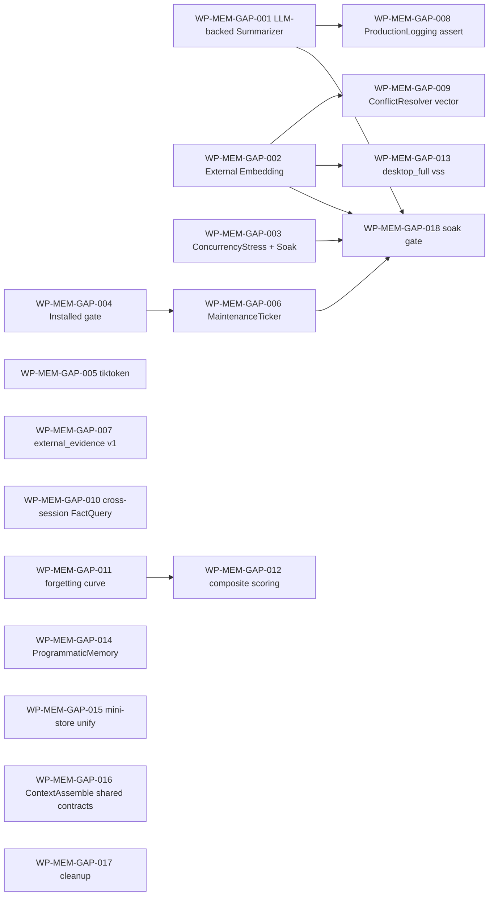
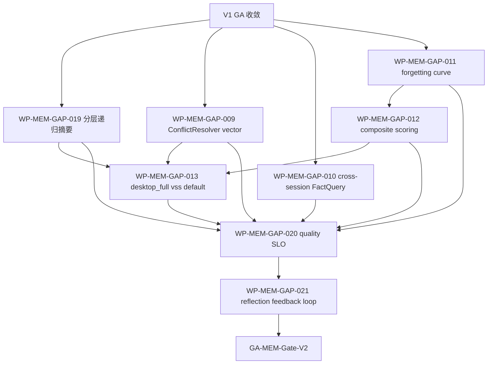

# MEM-EVAL-2026-05-31 memory 子系统落地评估与生产级缺口治理任务规划

状态：Draft
日期：2026-05-31
来源：用户专项评估请求（"研究学习 DASALL 架构设计 + Memory 子系统设计；调研行业实践；对 memory 实际代码进行全面评估和检查；给出子系统实际落地距离 DASALL 设计内容和目标的差距和缺口、距离生产级交付的缺口"）
评估范围：
- 架构与设计：[docs/architecture/DASALL_Agent_architecture.md](../architecture/DASALL_Agent_architecture.md)（§4.6 / §5.3 全节）、[docs/architecture/DASALL_memory子系统详细设计.md](../architecture/DASALL_memory子系统详细设计.md)（§1–§12.3 全文，含 MEM-D001..D010、MEM-M1..M6、MEM-E01..E09）
- 实现代码：[memory/include/](../../memory/include/)（30+ 头文件、6 个稳定子目录）+ [memory/src/](../../memory/src/)（21 个源文件、~7900 行 C++ 实现）+ [memory/CMakeLists.txt](../../memory/CMakeLists.txt)（含 sqlite 3.51.3 autoconf + sqlite-vss v0.1.2 资源装配）
- SQL Schema：[sql/memory/V001__initial_schema.sql](../../sql/memory/V001__initial_schema.sql) / [sql/memory/V002__vector_sidecar.sql](../../sql/memory/V002__vector_sidecar.sql) / [sql/memory/V003__fact_user_lookup_index.sql](../../sql/memory/V003__fact_user_lookup_index.sql)
- 测试套件：[tests/unit/memory/](../../tests/unit/memory/)（33 文件、~5300 行）+ [tests/integration/memory/](../../tests/integration/memory/)（11 文件、~3000 行）+ [tests/contracts/](../../tests/contracts/) 内 Memory 相关 contract 测试
- 生产装配：[apps/runtime_support/src/RuntimeLiveDependencyComposition.cpp](../../apps/runtime_support/src/RuntimeLiveDependencyComposition.cpp#L3308)、[apps/daemon/src/MemoryMaintenanceProofRunner.cpp](../../apps/daemon/src/MemoryMaintenanceProofRunner.cpp)、[apps/daemon/src/RuntimeInstalledProofRunner.cpp](../../apps/daemon/src/RuntimeInstalledProofRunner.cpp)
- Runtime 接入：[runtime/include/RuntimeDependencySet.h](../../runtime/include/RuntimeDependencySet.h)、[runtime/src/AgentOrchestrator.cpp](../../runtime/src/AgentOrchestrator.cpp)（`memory_manager->prepare_context` / `write_back` 调用）

评估方法：以实际落地代码为唯一判据；对照架构 / 详设硬约束（含 ADR-006/007/008、MEM-D001..D010、MEM-G1..G6、MEM-B01..B07、§6.6/§6.7/§6.8/§6.9/§6.10/§6.11/§6.12/§9/§10/§11/§12）；并对标 MemGPT/Letta、MemoryOS、CrewAI、LangGraph、Akka-Persistence、SQLite WAL 最佳实践等行业方案。

---

## 0. 文档定位与读者

1. 给项目治理与里程碑评审提供一份对 memory 子系统**生产级达成度**的可追溯结论。
2. 给后续 work package（WP-MEM-GAP-*）提供可执行的拆分基线与排序依据。
3. 任何条目都必须能回链到代码文件 / 行号或文档章节；当前判定不确定的标注 `待验证` 而非自圆其说。
4. 与 [COG-EVAL-2026-05-31](./COG-EVAL-2026-05-31-cognition子系统落地评估与生产级缺口治理任务规划.md)、[LLM-EVAL-2026-05-31](./LLM-EVAL-2026-05-31-llm子系统落地评估与生产级缺口治理任务规划.md)、[RT-EVAL-2026-05-31](./RT-EVAL-2026-05-31-runtime子系统落地评估与生产级缺口治理任务规划.md) 形成跨子系统评估四联章。

---

## 1. 评估结论摘要

| 维度 | 现状 | 结论 |
|---|---|---|
| 子系统骨架（MemoryManager / ContextOrchestrator / CandidateCollector / BudgetAllocator / CompressionCoordinator / WritebackCoordinator / MemoryConflictResolver / WorkingMemoryBoard / SqliteMemoryStore / SqliteSchemaMigrator / MemoryMaintenanceWorker / VectorMemoryIndexAdapter / MemoryObservability / MemoryConfigProjector） | 14 个核心组件全部编译可跑、单元 33 + 集成 11 测试齐备、生产 composition 已挂 | **结构层达成度高（约 85%）** |
| ADR-006（上下文权归 memory.ContextOrchestrator） | [ContextOrchestrator.cpp](../../memory/src/context/ContextOrchestrator.cpp)（814 行）按 §6.12.2 表逐槽映射；runtime 内部不组装 messages；`MemoryBoundaryGuardComplianceTest` 锁定边界 | **边界合规** |
| ADR-007（恢复准入权归 runtime.RecoveryManager） | WritebackCoordinator 仅做 `kMaxCoreTransactionAttempts=3` 的 SQLite BUSY bounded retry，超出即返回 `retryable_storage_failure`；memory 内无 retry/replan/abort 决策 | **边界合规** |
| ADR-008（全局主控权归 runtime.AgentOrchestrator） | MemoryMaintenanceWorker 默认 `auto_schedule=false`（被动模式），不形成第二主循环；runtime 通过 `IMemoryManager::prepare_context/write_back` 唯一驱动 | **边界合规** |
| 五层记忆模型（Working / Short-Term / Long-Term Semantic / Experience / Vector） | 全部以真实代码 + 表结构落地（sessions/turns/summaries/facts/experiences/vector sidecar/schema_migrations） | **达成（MEM-M1..M6）** |
| ContextPacket 11 槽位映射 | ContextOrchestrator.build_packet 按 §6.12.2 表完成；trim_text_to_token_limit + ContextPacketGuards | **达成** |
| 写回核心事务 + 附属写入 + 旁路向量 | WritebackCoordinator 693 行：core transaction（Turn+Session+Summary）+ derived writes（Fact+Experience+Conflict）+ vector sidecar best-effort + working board 更新 | **达成** |
| SQLite 持久化（WAL + 单 writer + reader pool + busy retry + checkpoint） | SqliteMemoryStore 1493 行：完整 schema、行映射、版本门、map_sqlite_result 错误分类、validate_sqlite_runtime_version | **达成（MEM-B04 已解除：3.51.3 pin）** |
| Schema 迁移 | SqliteSchemaMigrator 406 行 + V001/V002/V003 SQL；schema_migrations 表 | **达成** |
| 错误语义 5 类（StorageBusy/SchemaMismatch/ValidationRejected/StorageUnavailable/ConfigInvalid） | [memory/include/error/MemoryError.h](../../memory/include/error/MemoryError.h) + map_memory_error / map_memory_errno | **达成** |
| 可观测性（log/metric/audit/trace） | [memory/src/observability/MemoryObservability.cpp](../../memory/src/observability/MemoryObservability.cpp) 482 行；`MemoryProductionLoggingIntegrationTest` / `MemoryObservabilityBridgeTest` 端到端覆盖 | **达成**（生产侧 sink 已直连，**比 runtime 子系统更完整**） |
| 业务链贯通（Runtime ↔ Memory ↔ SQLite ↔ Vector ↔ Profile ↔ Observability） | unary、resume、recovery、context-assemble、writeback、maintenance、failure-injection、checkpoint-busy、profile-compat、production-logging 等 11 条集成测全部存在 | **可贯通** |
| 真实落地 vs 桩 | 无空壳实现；`WP-MEM-GAP-017` 已删除 `memory/src/MemoryBuildSkeleton.cpp` 历史 build anchor，所有主要组件均含真实业务体（store 1493 / orchestrator 814 / writeback 693 / vector backend 713 / observability 482 / manager 482 / schema migrator 406 / row mappers 408 / conflict resolver 371 / compression coordinator 320 / budget allocator 313 / detached vector factory 280 / candidate collector 246 / working board 244） | **无虚假实现** |
| 距离生产级 GA | 仍欠：installed gate 绿色记录、更高层质量 SLO / soak 量化 | **未到生产级** |

总体结论：memory 已完成**架构 / 接口 / 持久化 / 上下文装配 / 写回 / 维护 / 观测性**的真实落地，与 runtime 同处"骨架达成、深度需补"水位；区别于 runtime 缺口的"信号外送 / 跨版本 / 并发证据"，memory 当前剩余缺口集中在**质量层（feedback loop 与更高层 soak / judge 量化）与运营层（installed / soak 证据）**。GA 前仍需继续收敛剩余 P0 项。

---

## 2. DASALL 整体架构目标 vs Memory 落地（条目级对账）

| 架构原则 / 目标 | 落地证据 | 结论 |
|---|---|---|
| Layer 4 归属（Cognition Support） | memory/CMakeLists.txt 声明 `dasall_memory` 为静态库；不依赖 llm/tools/access | 达成 |
| 上下文权归一（ADR-006） | ContextOrchestrator 是唯一装配中心；runtime / cognition 不重复装配 | 达成 |
| 恢复权不外溢（ADR-007） | WritebackCoordinator 仅 bounded retry；其他错误一律上抛 | 达成 |
| 主控权不并行（ADR-008） | MemoryMaintenanceWorker 被动调度；factory 不创建第二主循环 | 达成（生产侧 ticker 缺，见 GAP-P1-A） |
| 五层记忆显式分层（§5.3.2 / §4.1） | Working/Short/Long-Semantic/Experience/Vector 全部独立组件 + 独立表 | 达成 |
| Programmatic Memory（§4.1 / §6.5.1a） | 已通过 `IProgrammaticMemoryStore` + `programmatic_assets` + runtime prompt-asset projection 落地 `asset_ref/digest/lease` 持久化，且不复制 Prompt 正文 | **达成（2026-06-23 闭合 MEM-E06）** |
| ContextPacket 11 槽位 + token 预算 + 压缩触发 | ContextOrchestrator.build_packet + BudgetAllocator + CompressionCoordinator | 达成 |
| 冲突检测 + 置信度 + 来源引用（§5.3.4） | MemoryConflictResolver 真实规则引擎（kPolarityPairs / kNegationMarkers / kNoiseTokens / shared_anchor_count / has_polarity_conflict / extract_single_number） + 可选 embedding 余弦相似度辅助 + ConflictAction 4 态 | 达成（2026-06-15 已闭合 MEM-E09） |
| 写回 SummaryMemory 含 decisions_made/confirmed_facts/tool_outcomes（§5.3.5） | CompressionCoordinator extract_decisions / extract_confirmed_facts / extract_tool_outcomes + runtime_support 注入的 `LLMBackedSummarizer`；`prompt_release_id_override=responder@2026.06.02` 输出结构化 summary payload | **达成**（2026-06-02 已接入生产侧 LLM-backed Summarizer；后续仅继续治理 prompt/provider 质量） |
| Session/Turn/SummaryMemory/MemoryFact 关键对象（§5.3.6） | contracts 已冻结；memory 内 RowMappers 完整双向映射 | 达成 |
| Vector backend 灰度策略（sqlite-vss / none / hnswlib opt-in） | VectorBackend 枚举 + DetachedVectorIndexFactory + UnavailableVectorMemoryIndexAdapter | 达成（默认关闭符合 §10.2 灰度） |
| Profile 兼容（desktop_full / edge_balanced / edge_minimal） | MemoryConfigProjector + `MemoryProfileCompatibilityTest` | 达成 |
| 错误码独立分类 | MemoryError 5 枚举 + map_memory_error 给出 retryable / audit_required / reason / result_code / warning_key / audit_scope | 达成 |
| 可观测四类信号 | MemoryObservability.emit() 同时驱动 log/metric/audit/trace bridges；`MemoryProductionLoggingIntegrationTest` 端到端 | 达成（**比 runtime 已经强**） |
| Maintenance（checkpoint / retention / quarantine / vector rebuild） | MemoryMaintenanceWorker.run_maintenance；`MemoryMaintenanceIntegrationTest` / `MemoryCheckpointBusyTest` 覆盖 | 达成（被动调度需外部 ticker，GAP-P1-A） |
| Schema 迁移与版本门 | schema_migrations 表 + SqliteVersionGateTest + SchemaMigrationTest | 达成 |
| Failure injection（BUSY / 损坏 / vector 缺失 / disk full / schema mismatch） | `MemoryFailureInjectionTest` 5 路径 | 达成 |
| 生产 composition | RuntimeLiveDependencyComposition.cpp:3308 真实注入 logger/audit/metrics/tracer + profile_id | 达成 |

**普遍性架构缺口**：memory 已经把"控制平面之下的状态层"做扎实；`GAP-P0-A` 与 `GAP-P0-B` 已于 2026-06-02 通过 runtime_support owner glue 闭合，当前剩余缺口集中在**质量与运营**：
1. 生产侧未挂主动 maintenance ticker，导致 WAL / retention 依赖外部触发；
2. 长跑 / 并发 / soak 证据偏弱；
3. 遗忘曲线、composite scoring 与向量质量增强仍属于后续质量演进项；token 估算已于 2026-06-03 收口到 `cl100k_base` 兼容实现。

---

## 3. Memory 详细设计 vs 实际代码（差距矩阵）

下表只列**有差距 / 有风险**的条目；其余设计要求均通过单/集成测试间接覆盖。

### 3.1 已完整落地（抽样）

- 公共接口与 supporting types：[memory/include/IMemoryManager.h](../../memory/include/IMemoryManager.h) / IContextOrchestrator / IMemoryStore / IStoreTransaction / ISummarizer / mini-store compatibility headers（`IFactStore` / `IExperienceStore` / `ISessionStore` / `ISummaryStore` / `IMaintenanceStore`）/ vector / working / writeback / config / context / error。
- MemoryManager 生命周期与降级路径：[MemoryManager.cpp](../../memory/src/MemoryManager.cpp)（482 行）LifecycleState + memory_manager_not_running / *_unwired warnings。
- MemoryManagerFactory DI 装配：[MemoryManagerFactory.cpp](../../memory/src/MemoryManagerFactory.cpp)（167 行）按 §6.6.1 装配。
- ContextOrchestrator 11 槽位映射：[ContextOrchestrator.cpp](../../memory/src/context/ContextOrchestrator.cpp)（814 行）。
- CandidateCollector 多源候选 + degraded：[CandidateCollector.cpp](../../memory/src/context/CandidateCollector.cpp)（246 行）+ `CandidateCollectorTest` / `CandidateCollectorVectorOff`。
- BudgetAllocator slot budget + trim：[BudgetAllocator.cpp](../../memory/src/context/BudgetAllocator.cpp)（313 行）+ `BudgetAllocatorTest`。
- CompressionCoordinator 模板路径 + summarizer fallback：[CompressionCoordinator.cpp](../../memory/src/writeback/CompressionCoordinator.cpp)（320 行）+ `CompressionCoordinatorTest` / `CompressionCoordinatorSummarizerTest`。
- WritebackCoordinator core+derived+vector+working：[WritebackCoordinator.cpp](../../memory/src/writeback/WritebackCoordinator.cpp)（693 行）+ `WritebackCoordinatorCoreTest` / `WritebackCoordinatorPartialTest`。
- MemoryConflictResolver 4 态规则引擎：[MemoryConflictResolver.cpp](../../memory/src/conflict/MemoryConflictResolver.cpp)（371 行）+ `MemoryConflictResolverTest` / `FactConflictResolverTest` / `ConflictResolverDegradedTest`。
- WorkingMemoryBoard shared_mutex + LRU + snapshot：[WorkingMemoryBoard.cpp](../../memory/src/working/WorkingMemoryBoard.cpp)（244 行）+ 3 个测试。
- SqliteMemoryStore + Schema migrator + RowMappers：[SqliteMemoryStore.cpp](../../memory/src/store/sqlite/SqliteMemoryStore.cpp) 1493 行 + 406 + 408；map_sqlite_result 错误分类齐全。
- SqliteVssVectorBackend 真实加载扩展：[SqliteVssVectorBackend.cpp](../../memory/src/vector/SqliteVssVectorBackend.cpp) 713 行。
- MemoryMaintenanceWorker + 自动调度开关：[MemoryMaintenanceWorker.cpp](../../memory/src/maintenance/MemoryMaintenanceWorker.cpp) 204 行。
- MemoryObservability 全四类信号：[MemoryObservability.cpp](../../memory/src/observability/MemoryObservability.cpp) 482 行；TelemetryContext + TelemetryField。
- 生产 composition：[RuntimeLiveDependencyComposition.cpp:3308](../../apps/runtime_support/src/RuntimeLiveDependencyComposition.cpp)。
- Boundary guard：`MemoryBoundaryGuardComplianceTest` 锁定 ADR 边界与 forbidden include / link / symbol。

### 3.2 真实存在但深度不足（"非虚假，但生产化层薄"）

| 设计 ID / 条款 | 现状 | 风险 | 关联缺口 |
|---|---|---|---|
| §6.3.1 阶段 2 ISummarizer 注入（MEM-E01） | 已通过 [memory/include/MemoryDependencies.h](../../memory/include/MemoryDependencies.h) `summarizer_factory` + [memory/src/MemoryManagerFactory.cpp](../../memory/src/MemoryManagerFactory.cpp) owner 装配 + [apps/runtime_support/src/RuntimeLiveDependencyComposition.cpp](../../apps/runtime_support/src/RuntimeLiveDependencyComposition.cpp) 注入 [apps/runtime_support/src/LLMBackedSummarizer.h](../../apps/runtime_support/src/LLMBackedSummarizer.h) / [apps/runtime_support/src/LLMBackedSummarizer.cpp](../../apps/runtime_support/src/LLMBackedSummarizer.cpp) 闭合 | 结构性缺口已清零；后续仅继续治理 prompt release / provider 质量与更高层 SLO | GAP-P0-A 已闭合（2026-06-02） |
| §6.3.2 / MEM-E04 IEmbeddingAdapter 外部注入 | 已通过 [memory/include/MemoryDependencies.h](../../memory/include/MemoryDependencies.h) `embedding_adapter_factory` + [memory/src/MemoryManagerFactory.cpp](../../memory/src/MemoryManagerFactory.cpp) factory 优先/本地 fallback 装配 + [apps/runtime_support/src/RuntimeLiveDependencyComposition.cpp](../../apps/runtime_support/src/RuntimeLiveDependencyComposition.cpp) 注入 [apps/runtime_support/src/LLMBackedEmbeddingAdapter.h](../../apps/runtime_support/src/LLMBackedEmbeddingAdapter.h) / [apps/runtime_support/src/LLMBackedEmbeddingAdapter.cpp](../../apps/runtime_support/src/LLMBackedEmbeddingAdapter.cpp) 闭合 | 结构性缺口已清零；后续仅继续补 installed / qemu / soak 证据与更高层质量指标 | GAP-P0-B 已闭合（2026-06-02） |
| §6.12.2 token 估算 | 已通过 [memory/src/util/TokenEstimator.cpp](../../memory/src/util/TokenEstimator.cpp) `ITokenEstimator` + vendored `cl100k_base` 兼容 tokenizer 收口，`BudgetAllocator` / `CandidateCollector` / `ContextOrchestrator` / `CompressionCoordinator` 统一走 shared estimator | 结构性缺口已清零；后续只继续扩展更多 tokenizer/profile 演进键，不再停留在启发式粗估 | GAP-P1-A 已闭合（2026-06-03） |
| §11.1 vector 失败拖垮主链路 | WritebackCoordinator 已把 vector 写入挪到 core transaction commit 后（best-effort）；**但 search_ann 失败的 fallback 路径在 CandidateCollector 内仅 best-effort 记录** | 与设计一致，已规避；唯一观察项：vector 重试与 retry budget 耦合度 | 无独立缺口 |
| §6.23 maintenance 自动调度 | `MemoryMaintenanceWorker.start()` 的 internal worker 仍保留，但 [apps/daemon/src/MemoryMaintenanceTickerThread.cpp](../../apps/daemon/src/MemoryMaintenanceTickerThread.cpp) 已成为 production cadence owner；[RuntimeLiveDependencyComposition.cpp](../../apps/runtime_support/src/RuntimeLiveDependencyComposition.cpp) 显式关闭 `maintenance.auto_schedule` 避免双 ticker | 结构性缺口已清零；更高层 24h stable / soak 证据仍留在 GA gate | GAP-P1-B 已闭合（2026-06-03） |
| §6.12.3 ConflictResolver | 已通过 [memory/include/config/MemoryConfig.h](../../memory/include/config/MemoryConfig.h) `ConflictConfig.embedding_similarity_threshold`、[memory/src/conflict/MemoryConflictResolver.cpp](../../memory/src/conflict/MemoryConflictResolver.cpp) 可选 `IEmbeddingAdapter*` 与余弦相似度辅助收口跨语言 / 同义改写歧义路径 | 结构性缺口已清零；后续仅继续做 precision/recall 与更高层质量指标治理 | GAP-P2-A 已闭合（2026-06-15） |
| §6.12.5 FactQuery 跨 session | 已通过 [memory/include/IFactStore.h](../../memory/include/IFactStore.h) `query_facts_by_user(...)`、[memory/src/store/sqlite/SqliteMemoryStore.cpp](../../memory/src/store/sqlite/SqliteMemoryStore.cpp) user-scoped query、[sql/memory/V003__fact_user_lookup_index.sql](../../sql/memory/V003__fact_user_lookup_index.sql) 与 [memory/src/context/CandidateCollector.cpp](../../memory/src/context/CandidateCollector.cpp) user-level facts 装配闭合 | 结构性缺口已清零；后续只继续治理 `< 50ms` latency / profile 基线与更高层 scoring | GAP-P2-B 已闭合（2026-06-17） |
| §4.1.1 / MemoryOS 对齐 遗忘曲线权重衰减 | 已通过 `last_accessed_at` / `hit_count`、指数衰减权重、access touch 与 decay purge 收口 fact / experience 热度治理 | 结构性缺口已清零；后续只继续在 012 上扩展多因子 scoring | GAP-P2-C 已闭合（2026-06-17） |
| §4.1.1 / CrewAI 对齐 composite scoring | 已通过 [memory/include/config/MemoryConfig.h](../../memory/include/config/MemoryConfig.h) `ContextConfig::ScoringConfig`、[memory/src/config/MemoryConfigProjector.cpp](../../memory/src/config/MemoryConfigProjector.cpp) 权重投影、[memory/src/context/CandidateCollector.cpp](../../memory/src/context/CandidateCollector.cpp) `confidence + recency + hit_rate + source_weight` 组合评分与 confidence-only fallback 收口 | 结构性缺口已清零；后续只继续治理更高层 recall / quality 指标 | GAP-P2-D 已闭合（2026-06-18） |
| §6.5.1a ProgrammaticMemory | 已通过 [memory/include/IProgrammaticMemoryStore.h](../../memory/include/IProgrammaticMemoryStore.h)、[sql/memory/V005__programmatic_assets.sql](../../sql/memory/V005__programmatic_assets.sql)、[memory/src/store/sqlite/SqliteMemoryStore.cpp](../../memory/src/store/sqlite/SqliteMemoryStore.cpp) 与 [runtime/src/PromptAssetWritebackProjector.cpp](../../runtime/src/PromptAssetWritebackProjector.cpp) 闭合 `asset_ref + digest + lease` 路径 | 风险已从“未实现”收敛为后续更高层 asset family 扩展 | GAP-P3-A（已闭合，2026-06-23） |
| §6.6 接口数量 | 已通过 [memory/include/IMemoryStore.h](../../memory/include/IMemoryStore.h) 将 session / summary / fact / experience / maintenance 方法重新收口到单一 `IMemoryStore` façade，并把 [memory/include/IFactStore.h](../../memory/include/IFactStore.h) / [memory/include/IExperienceStore.h](../../memory/include/IExperienceStore.h) / [memory/include/ISessionStore.h](../../memory/include/ISessionStore.h) / [memory/include/ISummaryStore.h](../../memory/include/ISummaryStore.h) / [memory/include/IMaintenanceStore.h](../../memory/include/IMaintenanceStore.h) 降为 compatibility alias + supporting type headers；内部消费者已回到直接依赖 `IMemoryStore` | 结构性缺口已清零；后续仅在 shared contracts uplift 或 public ABI 清理阶段再评估是否移除兼容别名 | GAP-P3-B 已闭合（2026-06-25） |
| 长跑 / 并发 / soak 证据 | 已通过 [tests/unit/memory/MemoryConcurrencyStressTest.cpp](../../tests/unit/memory/MemoryConcurrencyStressTest.cpp) 1k+ 轮 manager 并发压力、[tests/integration/memory/MemoryLongRunningSoakTest.cpp](../../tests/integration/memory/MemoryLongRunningSoakTest.cpp) 压缩长跑 soak，以及 [scripts/ci/memory_tsan_stress.sh](../../scripts/ci/memory_tsan_stress.sh) / [.github/workflows/ci.yml](../../.github/workflows/ci.yml) 的 `memory_tsan_stress` 复跑 | 结构性缺口已清零；后续只保留 installed / qemu 与更高层 release-soak 采样 | GAP-P0-C 已闭合（2026-06-02） |
| installed package gate | 已有 `MemoryMaintenanceProofRunner.cpp` + `RuntimeInstalledProofRunner.cpp` 给到 daemon 侧，但**memory 维度的 installed-evidence 文档未集中归档** | 与 access / runtime 风格不完全对齐 | GAP-P1-C |

### 3.3 设计声明但代码层未显性兑现（按设计后置 / 半显性）

| 设计要求 | 现状 | 缺口 | 关联缺口 |
|---|---|---|---|
| MEM-B01 / MEM-E07 ContextAssembleRequest/Result 冻结为 shared contracts | 已通过 [contracts/include/context/ContextAssembleRequest.h](../../contracts/include/context/ContextAssembleRequest.h)、[contracts/include/context/ContextAssembleResult.h](../../contracts/include/context/ContextAssembleResult.h) 与 [memory/include/context/MemoryContextRequest.h](../../memory/include/context/MemoryContextRequest.h) / [memory/include/context/ContextAssemblyResult.h](../../memory/include/context/ContextAssemblyResult.h) compatibility alias 落地 | 结构性缺口已清零；后续只保留 interface admission 评审 | GAP-P3-C 已闭合（2026-06-29） |
| MEM-B02 IMemoryStore / IContextOrchestrator 提升为 shared interface | 仍 memory/include public；request/result uplift 已完成 | 无独立实现缺口；仅剩 future shared interface admission 评审，不在本轮推进 | GAP-P3-C（后续 interface review） |
| MEM-B06 knowledge → memory 外部证据投影 v1 实现 | 设计已冻结 `external_evidence` 为 `vector<string>`；CandidateCollector 已消费；**runtime 侧的统一文本投影 v1 在跨子系统层尚未挂入** | 与 knowledge / runtime 协作项 | GAP-P1-D |
| §11.2 灰度策略阶段 3：desktop_full 默认开启 sqlite-vss | 已通过 [profiles/desktop_full/runtime_policy.yaml](../../profiles/desktop_full/runtime_policy.yaml) `memory_vector: true`、[memory/src/config/MemoryConfigProjector.cpp](../../memory/src/config/MemoryConfigProjector.cpp) 的 manifest 投影，以及 [apps/runtime_support/src/RuntimeLiveDependencyComposition.cpp](../../apps/runtime_support/src/RuntimeLiveDependencyComposition.cpp) 的 sqlite-vss 资产缺失 fail-closed 路径收口 | 结构性缺口已清零；后续只继续治理更高层 recall / quality 指标 | GAP-P2-E 已闭合（2026-06-18） |
| §6.20 / §10.2 hnswlib 显式 opt-in | 设计已冻结，代码未实现该 backend | 设计后置，无独立缺口 | （不列入本规划） |
| 历史 build anchor 清理 | 已删除 `memory/src/MemoryBuildSkeleton.cpp`，并新增 `MemoryHistoricalArtifactRemovedTest` 锁定 `memory/src` / `memory/CMakeLists.txt` 无 skeleton/placeholder 残留 | 结构性缺口已清零；后续只保留 soak gate 运营采样 | GAP-P3-D 已闭合（2026-06-29） |

---

## 4. 业务链贯通性（端到端，以代码事实为准）

| 业务链 | 起点 | 终点 | 关键代码节点 | 集成测试 | 贯通度 |
|---|---|---|---|---|---|
| Context 装配主链 | runtime.AgentOrchestrator | ContextPacket | `IMemoryManager::prepare_context` → ContextOrchestrator.assemble → CandidateCollector.collect → BudgetAllocator.allocate → CompressionCoordinator (when triggered) → ContextPacketGuards → 11 槽位 build_packet | [MemoryContextAssembleIntegrationTest.cpp](../../tests/integration/memory/MemoryContextAssembleIntegrationTest.cpp) / [MemoryContextIntegrationTest.cpp](../../tests/integration/memory/MemoryContextIntegrationTest.cpp) | ✅ 完整 |
| 写回主链 | runtime（turn 完成 / recovery 结果 / tool digest） | 持久化 + observability + working board update | `IMemoryManager::write_back` → WritebackCoordinator.execute → core txn (Turn+Session+Summary) → derived (Fact+Experience+ConflictAction) → vector sidecar (best-effort) → working board update → emit telemetry | [MemoryWritebackIntegrationTest.cpp](../../tests/integration/memory/MemoryWritebackIntegrationTest.cpp) | ✅ 完整 |
| Maintenance 链 | runtime / daemon idle | checkpoint + retention + quarantine + vector rebuild | `IMemoryManager::run_maintenance` → MemoryMaintenanceWorker → SqliteMemoryStore.checkpoint / retention / quarantine | [MemoryMaintenanceIntegrationTest.cpp](../../tests/integration/memory/MemoryMaintenanceIntegrationTest.cpp) / [MemoryCheckpointBusyTest.cpp](../../tests/integration/memory/MemoryCheckpointBusyTest.cpp) | ✅ 完整（daemon ticker 已闭合，原 GAP-P1-B） |
| Failure 注入链 | 故障 inject | 显式错误码 / quarantine / degrade | SqliteMemoryStore map_sqlite_result → MemoryError → MemoryErrorMapping | [MemoryFailureInjectionTest.cpp](../../tests/integration/memory/MemoryFailureInjectionTest.cpp) 5 路径 | ✅ 完整 |
| Working 快照 / 恢复链 | runtime resume | export/restore working snapshot | `IMemoryManager::export_working_memory_snapshot` → WorkingMemoryBoard.export_snapshot/restore_snapshot | `WorkingMemorySnapshotTest` + 在 [MemoryContextIntegrationTest.cpp](../../tests/integration/memory/MemoryContextIntegrationTest.cpp) 联动 | ✅ 完整 |
| Profile 链 | profiles.MemoryConfig | assemble/writeback/checkpoint 行为 | MemoryConfigProjector → MemoryConfig → 各 component | [MemoryProfileCompatibilityTest.cpp](../../tests/integration/memory/MemoryProfileCompatibilityTest.cpp) | ✅ 完整 |
| Production logging 链 | memory 事件 | infra.log / audit / metric / trace | MemoryObservability.emit → MemoryRuntimeDependencies.{logger/audit_logger/metrics_provider/tracer_provider} | [MemoryProductionLoggingIntegrationTest.cpp](../../tests/integration/memory/MemoryProductionLoggingIntegrationTest.cpp) / [MemoryObservabilityBridgeTest.cpp](../../tests/integration/memory/MemoryObservabilityBridgeTest.cpp) | ✅ 完整 |
| Topology smoke | top-level | memory subsystem 入口 | MemoryIntegrationTopologySmokeTest | ✅ 完整 |
| 生成质量链 | turn 文本 → SummaryMemory.summary_text | CompressionCoordinator.template fallback + `LLMBackedSummarizer`（阶段 2 已注入） | `LLMBackedSummarizerCompileTest` / `MemoryCompressionLLMSummarizerIntegrationTest` / `MemoryProductionLoggingIntegrationTest` | ✅ 已闭合（原 GAP-P0-A） |
| 向量召回质量链 | turn/fact text → embedding → search_ann | `MemoryRuntimeDependencies.embedding_adapter_factory` + `MemoryManagerFactory` factory selection/fallback + `RuntimeLiveDependencyComposition` 注入 `LLMBackedEmbeddingAdapter` | `LLMBackedEmbeddingAdapterCompileTest` / `MemoryVectorRecallQualityTest` | ✅ 已闭合（原 GAP-P0-B；更高层 installed authoritative gate / optional qemu chaining 证据另归 GAP-P0-D） |
| 跨 session FactQuery 链 | user/profile 维度 | Long-Term 共享事实 | `IFactStore::query_facts_by_user` → `SqliteMemoryStore` user-scoped query + `idx_facts_user_id` → `CandidateCollector` → `ContextOrchestrator.build_belief_state_summary` | [MemoryCrossSessionFactQueryTest.cpp](../../tests/integration/memory/MemoryCrossSessionFactQueryTest.cpp) / [SchemaMigrationV003Test.cpp](../../tests/unit/memory/SchemaMigrationV003Test.cpp) | ✅ 已闭合（2026-06-17） |
| Maintenance ticker 链 | 周期触发 | WAL gc / quarantine cleanup / vector rebuild | [MemoryMaintenanceTickerThread.cpp](../../apps/daemon/src/MemoryMaintenanceTickerThread.cpp) + daemon main lifecycle wiring + live composition internal auto_schedule off | [MemoryMaintenanceTickerThreadTest.cpp](../../tests/unit/apps/daemon/MemoryMaintenanceTickerThreadTest.cpp) / [MemoryMaintenanceIntegrationTest.cpp](../../tests/integration/memory/MemoryMaintenanceIntegrationTest.cpp) | ✅ 已闭合（2026-06-03） |

---

## 5. 行业最佳实践对标

| 维度 | DASALL Memory 实现 | 标杆 | 评估 |
|---|---|---|---|
| 系统管控 vs LLM 自决装配 | ContextOrchestrator + CandidateCollector + BudgetAllocator 系统侧装配 | MemGPT / Letta（LLM 自决 swap）；CrewAI / LangGraph（系统侧装配） | ✅ 与 CrewAI/LangGraph 同向，比 MemGPT 更可控 |
| 五层记忆 | Working / Short / Long-Semantic / Experience / Vector 显式分层 | MemoryOS 三层；CrewAI 长短期 + 实体；MemGPT main+archival | ✅ 分层粒度合理，覆盖工业主流 |
| Working Memory 黑板 | shared_mutex + TTL + LRU + snapshot/restore | MemGPT main context；LangGraph state | ✅ 对齐 |
| Long-Term Semantic 冲突检测 | 规则引擎（极性词 / 否定词 / 数字 / 锚点 token）+ embedding 余弦相似度辅助 | MemoryOS / 知识图谱风格 | ✅ 真实落地，**比多数 OSS Agent 强**（2026-06-15 已闭合 GAP-P2-A） |
| 摘要质量 | 阶段 1 模板 fallback + 阶段 2 `LLMBackedSummarizer`（`responder@2026.06.02`） | MemGPT recursive summarization；MemoryOS dialog page | ✅ 生产装配已闭合；后续只剩 prompt/provider 质量指标治理 |
| 向量召回 | sqlite-vss + runtime_support 注入外部 embedding service，缺 provider / transport 时回落本地 hash | OpenAI text-embedding-3 / bge / e5 | ✅ 生产装配已闭合；installed / qemu / soak 证据继续治理 |
| 持久化 | SQLite WAL + 单 writer + reader pool + busy retry + PASSIVE checkpoint + sqlite-vss + schema_migrations | Akka Persistence / SQLite 官方推荐 | ✅ 对齐工业最佳实践 |
| 错误分类 | 5 枚举 + retryable/audit_required/result_code/warning_key/audit_scope 元数据 | k8s admission errors / SQLite result codes | ✅ 比常见 Agent 实现完备 |
| 可观测性 sink 直连 | MemoryObservability 同时驱动 log/metric/audit/trace bridges | OpenTelemetry mandatory exporter | ✅ 已强制（**比 runtime 子系统更完整**） |
| Maintenance | checkpoint / retention / quarantine / vector rebuild；被动调度 + 可选 ticker | k8s GC controllers / Temporal periodic | ✅ production daemon ticker 已挂载；更高层 24h stable / soak 仍在 GA gate |
| 跨 profile 裁剪 | desktop_full / edge_balanced / edge_minimal | k8s feature gates | ✅ 对齐 |
| 跨 session 事实共享 | `query_facts_by_user(...)` + `idx_facts_user_id` + `MemoryCrossSessionFactQueryTest` 已闭合 user-level 共享事实主链 | MemoryOS user profile / Letta core memory | ✅ 已闭合（2026-06-17） |
| 遗忘曲线 / 衰减权重 | `last_accessed_at` + `hit_count` + exponential decay + touch/update + cold purge 已闭合 | MemoryOS heat 衰减 / Ebbinghaus | ✅ 已闭合（GAP-P2-C） |
| Composite scoring | `MemoryConfig.context.scoring` + `CandidateCollector` 已闭合 `confidence + recency + hit_rate + source_weight` 组合评分，并保留 confidence-only fallback | CrewAI multi-factor scoring | ✅ 已闭合（GAP-P2-D，2026-06-18） |

**冗余 / 不合适的设计**：
- 原 6 个 mini-store interface 冗余已于 2026-06-25 通过 `WP-MEM-GAP-015` 收口：当前只保留 compatibility alias，不再让内部组件依赖独立 mini-store 构造签名。
- `WP-MEM-GAP-017` 已于 2026-06-29 删除 `MemoryBuildSkeleton.cpp` 历史 build anchor，并以 `MemoryHistoricalArtifactRemovedTest` 锁定残留回退（GAP-P3-D）。
- 暂未发现冗余主循环 / 第二装配中心 / 重复持久化路径。
- 无 placeholder 实现 / 假数据返回。

---

## 6. 缺口清单（GAP）

按优先级 P0（GA 阻塞）→ P1（GA 强烈建议）→ P2（演进）→ P3（清理与运营）排列。

### 6.1 P0（GA 阻塞，必须先收敛）

- **GAP-P0-A 生产侧 LLM-backed Summarizer 注入（MEM-E01）**（已闭合，2026-06-02）
  - 完成情况：[memory/include/MemoryDependencies.h](../../memory/include/MemoryDependencies.h) 已新增 `summarizer_factory`， [memory/src/MemoryManagerFactory.cpp](../../memory/src/MemoryManagerFactory.cpp) 会装配 summarizer owner 并把 `ISummarizer*` 注入 `CompressionCoordinator`，生产侧不再固定走模板路径。
  - 边界说明：deliverable 草案原写法是把 `LLMBackedSummarizer` 放进 llm 模块，但 [tests/unit/llm/LLMBoundaryGuardComplianceTest.cpp](../../tests/unit/llm/LLMBoundaryGuardComplianceTest.cpp) 已禁止 llm include/link memory；因此 concrete 实现实际落在 [apps/runtime_support/src/LLMBackedSummarizer.h](../../apps/runtime_support/src/LLMBackedSummarizer.h) / [apps/runtime_support/src/LLMBackedSummarizer.cpp](../../apps/runtime_support/src/LLMBackedSummarizer.cpp)，由 runtime_support 持有 `llm_manager` 并通过 composition 注入。
  - 验证证据：`LLMBackedSummarizerCompileTest`、`MemoryCompressionLLMSummarizerIntegrationTest`、`MemoryProductionLoggingIntegrationTest` 与 `DaemonRuntimeLiveDependencyCompositionTest` 已通过。

- **GAP-P0-B 生产侧外部 Embedding Service 注入（MEM-E04）**（已闭合，2026-06-02）
  - 完成情况：[memory/include/MemoryDependencies.h](../../memory/include/MemoryDependencies.h) 已新增 `embedding_adapter_factory`；[memory/src/MemoryManagerFactory.cpp](../../memory/src/MemoryManagerFactory.cpp) 现优先调用 factory，factory 缺失或返回空时回落 `SimpleLocalEmbeddingAdapter`，并发出 `factory.embedding_adapter.degraded` warning；[apps/runtime_support/src/LLMBackedEmbeddingAdapter.h](../../apps/runtime_support/src/LLMBackedEmbeddingAdapter.h) / [apps/runtime_support/src/LLMBackedEmbeddingAdapter.cpp](../../apps/runtime_support/src/LLMBackedEmbeddingAdapter.cpp) 与 [apps/runtime_support/src/RuntimeLiveDependencyComposition.cpp](../../apps/runtime_support/src/RuntimeLiveDependencyComposition.cpp) 已把 runtime-owned 外部 embedding adapter 注入 live composition，并复用 knowledge query encoder 的 provider / transport 选择链。
  - 边界说明：deliverable 草案原写法是把 `LLMBackedEmbeddingAdapter` 放进 llm 模块，但 [tests/unit/llm/LLMBoundaryGuardComplianceTest.cpp](../../tests/unit/llm/LLMBoundaryGuardComplianceTest.cpp) 已禁止 llm include / link memory；因此 concrete 实现实际落在 runtime_support，llm 继续只暴露 transport / provider / secret public SPI。
  - 验证证据：`LLMBackedEmbeddingAdapterCompileTest`、`MemoryVectorRecallQualityTest` 已通过。

- **GAP-P0-C 并发 / 长跑压力门 MEM-G**（已闭合，2026-06-02）
  - 完成情况：已新增 [tests/unit/memory/MemoryConcurrencyStressTest.cpp](../../tests/unit/memory/MemoryConcurrencyStressTest.cpp) 与 [tests/integration/memory/MemoryLongRunningSoakTest.cpp](../../tests/integration/memory/MemoryLongRunningSoakTest.cpp)，并分别接入 [tests/unit/memory/CMakeLists.txt](../../tests/unit/memory/CMakeLists.txt) 与 [tests/integration/memory/CMakeLists.txt](../../tests/integration/memory/CMakeLists.txt)；[CMakePresets.json](../../CMakePresets.json) 已补 `tsan` presets；[scripts/ci/memory_tsan_stress.sh](../../scripts/ci/memory_tsan_stress.sh)、[scripts/ci/memory_tsan.supp](../../scripts/ci/memory_tsan.supp) 与 [.github/workflows/ci.yml](../../.github/workflows/ci.yml) 已形成统一 `memory_tsan_stress` 入口。
  - TSAN 说明：首轮 TSAN 报告停在 SQLite WAL shared-memory header 读取链（`walTryBeginRead` / `walIndexReadHdr`），与 SQLite 3.51.3 源码对该路径的 false-positive 注释一致；本轮仅以 `memory_tsan.supp` 窄 suppression 固定第三方噪声，不覆盖任何 `memory/src/*` 栈帧。
  - 验证证据：`MemoryConcurrencyStressTest`、`MemoryLongRunningSoakTest` build-tree 直跑通过；`bash scripts/ci/memory_tsan_stress.sh` 复跑结果为 `100% tests passed, 0 tests failed out of 2`。

- **GAP-P0-D Memory installed gate（qemu optional chaining）**
  - 现状：`validate_memory_installed_or_qemu.sh`、`memory_installed_smoke` target 与 `MemoryInstalledSmokeTest` 已存在；Memory owner 的 authoritative 口径已固定为本机 installed evidence，qemu 只保留为脚本可选 chaining 与 packaging / release hardening。
  - 风险：若 broader installed package-smoke readiness 回退，wrapper 将无法继续稳定产出 `~/.cache/dasall/memory/installed-evidence/latest.json`；该风险属于 installed gate 本身，而非 qemu 依赖。

### 6.2 P1（GA 强烈建议）

- **GAP-P1-A tiktoken token 估算（MEM-E08）**（已闭合，2026-06-03）
  - 完成情况：[memory/CMakeLists.txt](../../memory/CMakeLists.txt) 已 pin vendored `cpp-tiktoken` source 并装配 `cl100k_base.tiktoken` 到 build/install `share/dasall/memory/tokenizers`；[memory/src/util/TokenEstimator.cpp](../../memory/src/util/TokenEstimator.cpp) 已新增 `ITokenEstimator` / `TiktokenTokenEstimator` / heuristic fallback；[memory/src/MemoryManagerFactory.cpp](../../memory/src/MemoryManagerFactory.cpp) 现统一创建 shared estimator 并注入 `BudgetAllocator`、`CandidateCollector`、`ContextOrchestrator` 与 `CompressionCoordinator`。
  - 验证证据：`TiktokenEstimatorAccuracyTest`、双 backend `BudgetAllocatorTest`、`MemoryInterfaceCompileTest` 与 `MemoryProfileCompatibilityTest` 已通过；`CandidateCollectorTest`、`ContextOrchestratorTest`、`CompressionCoordinatorTest` 等相关 slice tests 也已通过。

- **GAP-P1-B 生产侧 MaintenanceTicker 挂载**
  - 现状：MaintenanceWorker.start() 已实现 ticker，但 RuntimeLiveDependencyComposition 与 MemoryManagerFactory 未默认启用。
  - 风险：长跑 WAL 增长 / quarantine 累积 / vector rebuild 滞后；与 runtime GAP-P1-A 同源，可联动落地。

- **GAP-P1-C external_evidence 投影 v1 端到端**（已闭合，2026-06-03）
  - 完成情况：已新增 [runtime/src/KnowledgeEvidenceProjector.h](../../runtime/src/KnowledgeEvidenceProjector.h) / [runtime/src/KnowledgeEvidenceProjector.cpp](../../runtime/src/KnowledgeEvidenceProjector.cpp)，并更新 [runtime/src/AgentOrchestrator.cpp](../../runtime/src/AgentOrchestrator.cpp) / [runtime/CMakeLists.txt](../../runtime/CMakeLists.txt)，把 knowledge structured evidence 到 `MemoryContextRequest.external_evidence` / `retrieval_evidence_refs` 的投影 owner 收口到 runtime 单一 projector。
  - 验证证据：已新增 [tests/unit/runtime/KnowledgeEvidenceProjectorTest.cpp](../../tests/unit/runtime/KnowledgeEvidenceProjectorTest.cpp) 与 [tests/integration/memory/MemoryExternalEvidenceProjectionEndToEndTest.cpp](../../tests/integration/memory/MemoryExternalEvidenceProjectionEndToEndTest.cpp)；`KnowledgeEvidenceProjectorTest` 与 `MemoryExternalEvidenceProjectionEndToEndTest` 已通过。

- **GAP-P1-D ProductionLogging assert 字段补强**（已闭合，2026-06-03）
  - 完成情况：已更新 [tests/integration/memory/MemoryProductionLoggingIntegrationTest.cpp](../../tests/integration/memory/MemoryProductionLoggingIntegrationTest.cpp)，补齐 `writeback_partial` / `vector_unavailable` / `maintenance_tick` / `summarizer_fallback` / `schema_mismatch` 场景下的 metric / audit / trace 字段断言；其中 context degraded 场景新增第二轮 writeback seed，稳定触发 `summarizer_fallback` 与 `strategy:template`，schema mismatch 场景按实际 manager preopen 路径固定 `failure_reason=store_preopen_failed`。
  - 验证证据：`Build_CMakeTools(buildTargets=["dasall_memory_production_logging_integration_test"])` 与 `RunCtest_CMakeTools(tests=["MemoryProductionLoggingIntegrationTest"])` 已通过。

### 6.3 P2（演进项 / MEM-E 系列）

- **GAP-P2-A ConflictResolver 向量相似度辅助（MEM-E09）**（已闭合，2026-06-15）：[memory/include/config/MemoryConfig.h](../../memory/include/config/MemoryConfig.h)、[memory/src/config/MemoryConfigProjector.cpp](../../memory/src/config/MemoryConfigProjector.cpp)、[memory/src/conflict/MemoryConflictResolver.h](../../memory/src/conflict/MemoryConflictResolver.h)、[memory/src/conflict/MemoryConflictResolver.cpp](../../memory/src/conflict/MemoryConflictResolver.cpp) 已引入 `ConflictConfig.embedding_similarity_threshold`、可选 `IEmbeddingAdapter*` 与 embedding 余弦相似度辅助；[tests/unit/memory/MemoryConflictResolverWithEmbeddingTest.cpp](../../tests/unit/memory/MemoryConflictResolverWithEmbeddingTest.cpp) 已覆盖跨语言同义改写 high-similarity Supersede 与低相似度 Coexist 负例，且 `MemoryInterfaceCompileTest` / `MemoryProfileCompatibilityTest` 已锁定配置投影面。
- **GAP-P2-B 跨 session FactQuery（MEM-E05）**（已闭合，2026-06-17）：[memory/include/IFactStore.h](../../memory/include/IFactStore.h)、[memory/src/store/sqlite/SqliteMemoryStore.cpp](../../memory/src/store/sqlite/SqliteMemoryStore.cpp)、[sql/memory/V003__fact_user_lookup_index.sql](../../sql/memory/V003__fact_user_lookup_index.sql) 与 [memory/src/context/CandidateCollector.cpp](../../memory/src/context/CandidateCollector.cpp) 已新增 user-scoped fact query seam、SQLite user_id 索引与 ContextOrchestrator 消费路径；[tests/integration/memory/MemoryCrossSessionFactQueryTest.cpp](../../tests/integration/memory/MemoryCrossSessionFactQueryTest.cpp) 与 [tests/unit/memory/SchemaMigrationV003Test.cpp](../../tests/unit/memory/SchemaMigrationV003Test.cpp) 已闭合行为与迁移证据。
- **GAP-P2-C 遗忘曲线 / 权重衰减（MEM-E02）**（已闭合，2026-06-17）：retention 算法已完成 `last_accessed_at` / `hit_count` / exponential decay / access touch / cold purge 闭环。
- **GAP-P2-D CandidateCollector composite scoring（MEM-E03）**（已闭合，2026-06-18）：[memory/include/config/MemoryConfig.h](../../memory/include/config/MemoryConfig.h)、[memory/src/config/MemoryConfigProjector.cpp](../../memory/src/config/MemoryConfigProjector.cpp)、[memory/include/IFactStore.h](../../memory/include/IFactStore.h)、[memory/include/IExperienceStore.h](../../memory/include/IExperienceStore.h)、[memory/src/store/sqlite/SqliteMemoryStore.cpp](../../memory/src/store/sqlite/SqliteMemoryStore.cpp) 与 [memory/src/context/CandidateCollector.cpp](../../memory/src/context/CandidateCollector.cpp) 已引入 `ContextConfig::ScoringConfig`、raw recency / hit-rate signal 与 `confidence + recency + hit_rate + source_weight` 组合评分；[tests/unit/memory/CandidateCollectorCompositeScoringTest.cpp](../../tests/unit/memory/CandidateCollectorCompositeScoringTest.cpp) 与 [tests/unit/memory/BudgetAllocatorScoringDriftTest.cpp](../../tests/unit/memory/BudgetAllocatorScoringDriftTest.cpp) 已闭合排序与预算防漂移证据。
- **GAP-P2-E desktop_full 默认开启 sqlite-vss 灰度切换**（已闭合，2026-06-18）：[profiles/desktop_full/runtime_policy.yaml](../../profiles/desktop_full/runtime_policy.yaml) 已固定 `memory_vector: true`；[memory/src/config/MemoryConfigProjector.cpp](../../memory/src/config/MemoryConfigProjector.cpp) 已按 manifest 投影 `vector.enabled=true` 与 `backend_type=sqlite-vss`；[apps/runtime_support/src/RuntimeLiveDependencyComposition.cpp](../../apps/runtime_support/src/RuntimeLiveDependencyComposition.cpp) 已保留 `embedding_adapter_factory` 注入与 sqlite-vss 资产缺失 fail-closed 回退；`MemoryProfileCompatibilityTest` 与 `DaemonRuntimeLiveDependencyCompositionTest` 已通过 focused 回归。

### 6.4 P3（运营 / 清理 / 演进）

- **GAP-P3-A ProgrammaticMemory 持久化（MEM-E06）**（已闭合，2026-06-23）：已通过 llm public `PromptAssetMetadata` seam、[memory/include/IProgrammaticMemoryStore.h](../../memory/include/IProgrammaticMemoryStore.h)、[sql/memory/V005__programmatic_assets.sql](../../sql/memory/V005__programmatic_assets.sql) 与 runtime prompt-asset projection 落地 `asset_ref / content_digest / lease_expires_at` 持久化；Prompt 正文仍保持由 llm owner 管理，不复制到 memory。
- **GAP-P3-B mini-store 接口收敛**（已闭合，2026-06-25）：[memory/include/IMemoryStore.h](../../memory/include/IMemoryStore.h) 已重新承载完整 store façade；[memory/include/IFactStore.h](../../memory/include/IFactStore.h) / [memory/include/IExperienceStore.h](../../memory/include/IExperienceStore.h) / [memory/include/ISessionStore.h](../../memory/include/ISessionStore.h) / [memory/include/ISummaryStore.h](../../memory/include/ISummaryStore.h) / [memory/include/IMaintenanceStore.h](../../memory/include/IMaintenanceStore.h) 已收口为 compatibility alias + supporting type headers；[memory/src/context/CandidateCollector.cpp](../../memory/src/context/CandidateCollector.cpp)、[memory/src/writeback/WritebackCoordinator.cpp](../../memory/src/writeback/WritebackCoordinator.cpp)、[memory/src/conflict/MemoryConflictResolver.cpp](../../memory/src/conflict/MemoryConflictResolver.cpp) 与 [memory/src/maintenance/MemoryMaintenanceWorker.cpp](../../memory/src/maintenance/MemoryMaintenanceWorker.cpp) 已直接依赖 `IMemoryStore`，新增 [tests/unit/memory/MemoryStoreInterfaceUnificationCompileTest.cpp](../../tests/unit/memory/MemoryStoreInterfaceUnificationCompileTest.cpp) 锁定新语义；同轮 memory-scoped 66 条 unit / integration / contract 回归已全绿。
- **GAP-P3-C ContextAssembleRequest/Result 提升为 shared contracts（MEM-E07）**（已闭合，2026-06-29）：已新增 [contracts/include/context/ContextAssembleRequest.h](../../contracts/include/context/ContextAssembleRequest.h) 与 [contracts/include/context/ContextAssembleResult.h](../../contracts/include/context/ContextAssembleResult.h)，并将 [memory/include/context/MemoryContextRequest.h](../../memory/include/context/MemoryContextRequest.h) / [memory/include/context/ContextAssemblyResult.h](../../memory/include/context/ContextAssemblyResult.h) 收口为 compatibility alias；新增 [tests/contract/context/ContextAssembleContractTest.cpp](../../tests/contract/context/ContextAssembleContractTest.cpp) 并更新 [tests/contract/CMakeLists.txt](../../tests/contract/CMakeLists.txt)，同时扩展 [tests/unit/memory/MemoryInterfaceCompileTest.cpp](../../tests/unit/memory/MemoryInterfaceCompileTest.cpp) 以锁定 shared contract 与 memory alias 的同型语义；`Build_CMakeTools(buildTargets=["dasall_contract_context_assemble_test","dasall_memory_interface_compile_unit_test"])` 通过，`RunCtest_CMakeTools` 当前环境返回泛化 `生成失败`，故本轮改用 build-tree 二进制直跑 `ContextAssembleContractTest` / `MemoryInterfaceCompileTest` 与 `InterfaceCatalogContractTest` 复验通过，且 `MEM-B01` 已解除、`MEM-B02` 继续仅阻塞 future shared interface admission。
- **GAP-P3-D 历史遗留清理**（已闭合，2026-06-29）：已删除 [memory/src/MemoryBuildSkeleton.cpp](../../memory/src/MemoryBuildSkeleton.cpp) 并清理 [memory/CMakeLists.txt](../../memory/CMakeLists.txt) 残留引用；新增 [tests/unit/memory/MemoryHistoricalArtifactRemovedTest.cpp](../../tests/unit/memory/MemoryHistoricalArtifactRemovedTest.cpp) 锁定 skeleton/placeholder 残留回退。
- **GAP-P3-E Long-running soak gate**：在 infra release-soak 套件内加 memory 维度采样（store latency / wal size / maintenance lag / writeback partial rate / vector recall@k）。

---

## 7. 任务拆分（WP-MEM-GAP-*）

任务结构沿用项目原子任务模板（代码目标 / 测试目标 / 验收命令 / 阻塞-解阻），可直接挂入 [docs/todos/memory/DASALL_memory子系统专项TODO.md](../todos/memory/DASALL_memory子系统专项TODO.md)。

### 7.1 P0 任务

#### WP-MEM-GAP-001 LLM-backed Summarizer 注入（GAP-P0-A）

- **状态**：已完成（2026-06-02）。
- **代码结果**
  - [memory/include/MemoryDependencies.h](../../memory/include/MemoryDependencies.h)、[memory/src/MemoryManagerInternal.h](../../memory/src/MemoryManagerInternal.h) 与 [memory/src/MemoryManagerFactory.cpp](../../memory/src/MemoryManagerFactory.cpp) 已新增 `summarizer_factory` seam、summarizer owner 生命周期与 `CompressionCoordinator` 注入路径；未注入时仍保留模板 fallback 和 warning 语义。
  - [apps/runtime_support/src/RuntimeLiveDependencyComposition.cpp](../../apps/runtime_support/src/RuntimeLiveDependencyComposition.cpp) 现会先创建 `llm_manager` 再创建 `memory_manager`，并通过 runtime-owned lambda 注入 summarizer；concrete 类型落在 [apps/runtime_support/src/LLMBackedSummarizer.h](../../apps/runtime_support/src/LLMBackedSummarizer.h) / [apps/runtime_support/src/LLMBackedSummarizer.cpp](../../apps/runtime_support/src/LLMBackedSummarizer.cpp)，而不是 llm public surface。
  - [llm/assets/prompts/responder/memory_summary/manifest.yaml](../../llm/assets/prompts/responder/memory_summary/manifest.yaml)、[llm/assets/prompts/responder/memory_summary/system.md](../../llm/assets/prompts/responder/memory_summary/system.md) 与 [llm/assets/prompts/responder/memory_summary/task.md](../../llm/assets/prompts/responder/memory_summary/task.md) 已冻结 `responder@2026.06.02` summary prompt release；[memory/src/context/ContextOrchestrator.cpp](../../memory/src/context/ContextOrchestrator.cpp) 与 [memory/src/observability/MemoryObservability.cpp](../../memory/src/observability/MemoryObservability.cpp) 已补 `compression_strategy=summarizer` telemetry。
- **测试结果**
  - [tests/unit/memory/LLMBackedSummarizerCompileTest.cpp](../../tests/unit/memory/LLMBackedSummarizerCompileTest.cpp) 验证 request 投影、tag slot、schema / format 选择。
  - [tests/integration/memory/MemoryCompressionLLMSummarizerIntegrationTest.cpp](../../tests/integration/memory/MemoryCompressionLLMSummarizerIntegrationTest.cpp) 验证真实 memory manager 压缩链会走 LLM-backed summarizer，而不是模板 fallback。
  - [tests/integration/memory/MemoryProductionLoggingIntegrationTest.cpp](../../tests/integration/memory/MemoryProductionLoggingIntegrationTest.cpp) 现断言 `compression_strategy=summarizer`；[tests/integration/access/DaemonRuntimeLiveDependencyCompositionTest.cpp](../../tests/integration/access/DaemonRuntimeLiveDependencyCompositionTest.cpp) 证明 daemon live composition 已带上该 wiring。
- **验收证据**
  - `Build_CMakeTools(buildTargets=["dasall_memory_llm_backed_summarizer_compile_unit_test","dasall_memory_compression_llm_summarizer_integration_test"])`：通过。
  - `RunCtest_CMakeTools(tests=["LLMBackedSummarizerCompileTest","MemoryCompressionLLMSummarizerIntegrationTest"])`：通过，2/2。
  - `Build_CMakeTools(buildTargets=["dasall_memory_production_logging_integration_test","dasall_access_daemon_runtime_live_dependency_composition_integration_test"])`：通过。
  - `RunCtest_CMakeTools(tests=["MemoryProductionLoggingIntegrationTest","DaemonRuntimeLiveDependencyCompositionTest"])`：通过，2/2。
- **阻塞 / 解阻**：已解阻。`ILLMManager::generate` 与 responder prompt pipeline 已具备；本轮唯一偏差是把 concrete summarizer 从草案中的 llm 模块调整到 runtime_support，以保持 llm boundary guard 不回退。

#### WP-MEM-GAP-002 外部 Embedding Service 注入（GAP-P0-B）

- **状态**：已完成（2026-06-02）。
- **代码结果**
  - [memory/include/MemoryDependencies.h](../../memory/include/MemoryDependencies.h) 与 [memory/src/MemoryManagerFactory.cpp](../../memory/src/MemoryManagerFactory.cpp) 已新增 `embedding_adapter_factory` seam、factory 优先 / fallback 选择与 `factory.embedding_adapter.degraded` warning emit；未注入或 factory 返回空时仍回落 `SimpleLocalEmbeddingAdapter`。
  - [apps/runtime_support/src/LLMBackedEmbeddingAdapter.h](../../apps/runtime_support/src/LLMBackedEmbeddingAdapter.h)、[apps/runtime_support/src/LLMBackedEmbeddingAdapter.cpp](../../apps/runtime_support/src/LLMBackedEmbeddingAdapter.cpp)、[apps/runtime_support/src/RuntimeLiveDependencyComposition.cpp](../../apps/runtime_support/src/RuntimeLiveDependencyComposition.cpp) 与 [apps/runtime_support/CMakeLists.txt](../../apps/runtime_support/CMakeLists.txt) 已新增 runtime-owned 外部 embedding adapter，并在 live composition 中复用 knowledge query encoder 的 provider / transport / secret 选择链。
- **测试结果**
  - [tests/unit/memory/LLMBackedEmbeddingAdapterCompileTest.cpp](../../tests/unit/memory/LLMBackedEmbeddingAdapterCompileTest.cpp) 验证 `/embeddings` request 投影、auth / header / body 与 response parsing。
  - [tests/unit/memory/MemoryVectorRecallQualityTest.cpp](../../tests/unit/memory/MemoryVectorRecallQualityTest.cpp) 用 fake provider + scoring sqlite-vss driver 证明注入语义 embedding 后 recall@1 相比本地 hash baseline 提升。
  - [tests/unit/memory/CMakeLists.txt](../../tests/unit/memory/CMakeLists.txt) 已接入两个新 target 与 CTest。
- **验收证据**
  - `cmake -S . -B build-ci -G "Unix Makefiles"`：通过。
  - `cmake --build build-ci --target dasall_memory_llm_backed_embedding_adapter_compile_unit_test dasall_memory_vector_recall_quality_unit_test`：通过。
  - `ctest --test-dir build-ci -R "^(LLMBackedEmbeddingAdapterCompileTest|MemoryVectorRecallQualityTest)$" --output-on-failure`：通过，2/2。
- **阻塞 / 解阻**：已解阻。草案中的“llm 子系统新增实现 `memory::IEmbeddingAdapter` 的 concrete”与 llm boundary guard / `ILLMManager` 当前 public SPI 不相容；本轮改为 runtime_support owner glue 持有 llm transport / secret seam 并注入 memory，保持 llm public surface 不感知 memory。

#### WP-MEM-GAP-003 Memory 并发 / 长跑压力门（GAP-P0-C）

- **状态**：已完成（2026-06-02）。
- **代码结果**
  - [tests/unit/memory/MemoryConcurrencyStressTest.cpp](../../tests/unit/memory/MemoryConcurrencyStressTest.cpp) 已新增 manager 级 1k+ 轮并发压力门，覆盖 `prepare_context()` / `write_back()` / `run_maintenance()` 三线程交错，并通过 [tests/unit/memory/CMakeLists.txt](../../tests/unit/memory/CMakeLists.txt) 注册 `MemoryConcurrencyStressTest`。
  - [tests/integration/memory/MemoryLongRunningSoakTest.cpp](../../tests/integration/memory/MemoryLongRunningSoakTest.cpp) 已新增压缩长跑 soak，用批量写回 + maintenance 循环验证 WAL 增长、checkpoint、retention 与 quarantine cleanup，并通过 [tests/integration/memory/CMakeLists.txt](../../tests/integration/memory/CMakeLists.txt) 注册 `MemoryLongRunningSoakTest`。
  - [CMakePresets.json](../../CMakePresets.json)、[scripts/ci/memory_tsan_stress.sh](../../scripts/ci/memory_tsan_stress.sh)、[scripts/ci/memory_tsan.supp](../../scripts/ci/memory_tsan.supp) 与 [.github/workflows/ci.yml](../../.github/workflows/ci.yml) 已补齐 `tsan` preset、CI job 与统一脚本入口，同名 `memory_tsan_stress` 现复用同一条命令链。
- **测试结果**
  - `MemoryConcurrencyStressTest` 已证明 shared writer mutex wiring、并发 `prepare_context()` 与 manager 级 writeback / maintenance 交错路径稳定。
  - `MemoryLongRunningSoakTest` 已证明压缩长跑下 checkpoint 确实执行、retention / quarantine cleanup 生效，且 WAL 尺寸保持在约束上界内。
  - 首轮 TSAN 复跑暴露的报告停在 SQLite WAL shared-memory header 读取链，不属于 Memory owner 锁序；本轮以 [scripts/ci/memory_tsan.supp](../../scripts/ci/memory_tsan.supp) 仅匹配 `walTryBeginRead` / `walIndexReadHdr` / `walIndexTryHdr` / `walIndexWriteHdr` 四个 SQLite 函数名，未扩大到 `memory/src/*`。
- **验收证据**
  - `Build_CMakeTools(buildTargets=["dasall_memory_concurrency_stress_unit_test"])`：通过。
  - `RunCtest_CMakeTools(tests=["MemoryConcurrencyStressTest"])`：通过。
  - `Build_CMakeTools(buildTargets=["dasall_memory_long_running_soak_integration_test"])`：通过。
  - `RunCtest_CMakeTools(tests=["MemoryLongRunningSoakTest"])`：通过。
  - `bash scripts/ci/memory_tsan_stress.sh`：通过，`100% tests passed, 0 tests failed out of 2`。
- **阻塞 / 解阻**：已解阻。本轮同回合补齐 `tsan` preset；随后把 SQLite WAL 共享内存假阳性收口到窄 suppression 文件，未改写 Memory owner 语义。

#### WP-MEM-GAP-004 Memory installed gate（qemu optional chaining，GAP-P0-D）

- **代码目标**
  - 固定 `scripts/packaging/validate_memory_installed_or_qemu.sh` 为 Memory owner 的 installed authoritative wrapper；可选 `-- <virt cmd>` 仅用于 qemu chaining，不再作为 Memory blocker。
  - 在 installed profile 下启动 daemon → 通过 [MemoryMaintenanceProofRunner.cpp](../../apps/daemon/src/MemoryMaintenanceProofRunner.cpp) 与 package-smoke raw artifacts 汇总 init / open / prepare_context / write_back / maintenance 端到端证据，落 evidence 到 `~/.cache/dasall/memory/installed-evidence/`。
  - CMake 可选 target `memory_installed_smoke`。
- **测试目标**
  - 集成 `MemoryInstalledSmokeTest` 真正执行 wrapper 的 `--reuse-artifacts` 汇总路径，并校验 `latest.json` schema 与 `latest` symlink。
  - evidence schema 落档到详设 §9.6 风格的 memory 章节。
- **验收命令**
  - `bash scripts/packaging/validate_memory_installed_or_qemu.sh && cat ~/.cache/dasall/memory/installed-evidence/latest.json`
- **阻塞 / 解阻**：打包 SSOT 与 RuntimeInstalledProofRunner 已具备；qemu 已降为 optional chaining，不再回流成 Memory owner blocker。剩余收敛项是 installed gate 的 CI / release-runner 绿色记录与 broader package-smoke readiness 稳定性。

### 7.2 P1 任务

#### WP-MEM-GAP-005 tiktoken token 估算（GAP-P1-A / MEM-E08）

- **状态**：已完成（2026-06-03）。
- **代码结果**
  - [memory/CMakeLists.txt](../../memory/CMakeLists.txt) 已 pin vendored `cpp-tiktoken` source，并把 `cl100k_base.tiktoken` 复制到 build-tree / install-tree `share/dasall/memory/tokenizers`；系统 `pcre2-8` 作为底层 regex 依赖复用，不再把整套 PCRE2 install 规则引入 Memory package。
  - [memory/include/config/MemoryConfig.h](../../memory/include/config/MemoryConfig.h) 与 [memory/src/config/MemoryConfigProjector.cpp](../../memory/src/config/MemoryConfigProjector.cpp) 已新增 `token_estimator` 配置字段，默认 `tiktoken`。
  - [memory/src/util/TokenEstimator.h](../../memory/src/util/TokenEstimator.h) / [memory/src/util/TokenEstimator.cpp](../../memory/src/util/TokenEstimator.cpp) 已引入 `ITokenEstimator`、`HeuristicTokenEstimator`、vendored `TiktokenTokenEstimator` 与 shared factory；[memory/src/MemoryManagerFactory.cpp](../../memory/src/MemoryManagerFactory.cpp) 会只创建一次 shared estimator，并统一注入 [memory/src/context/BudgetAllocator.cpp](../../memory/src/context/BudgetAllocator.cpp)、[memory/src/context/CandidateCollector.cpp](../../memory/src/context/CandidateCollector.cpp)、[memory/src/context/ContextOrchestrator.cpp](../../memory/src/context/ContextOrchestrator.cpp) 与 [memory/src/writeback/CompressionCoordinator.cpp](../../memory/src/writeback/CompressionCoordinator.cpp)。
- **测试结果**
  - [tests/unit/memory/TiktokenEstimatorAccuracyTest.cpp](../../tests/unit/memory/TiktokenEstimatorAccuracyTest.cpp) 已验证 `cl100k_base` 参考样例 token 数；[tests/unit/memory/BudgetAllocatorTest.cpp](../../tests/unit/memory/BudgetAllocatorTest.cpp) 已扩展为 tiktoken / heuristic 双 backend 跑通。
  - [tests/unit/memory/MemoryInterfaceCompileTest.cpp](../../tests/unit/memory/MemoryInterfaceCompileTest.cpp) 与 [tests/integration/memory/MemoryProfileCompatibilityTest.cpp](../../tests/integration/memory/MemoryProfileCompatibilityTest.cpp) 已把 `token_estimator=tiktoken` 纳入默认值与 profile projection 断言。
- **验收证据**
  - `Build_CMakeTools(buildTargets=["dasall_memory_tiktoken_estimator_accuracy_unit_test","dasall_memory_budget_allocator_unit_test","dasall_memory_interface_compile_unit_test","dasall_memory_profile_compatibility_integration_test"])`：通过。
  - `RunCtest_CMakeTools(tests=["TiktokenEstimatorAccuracyTest","BudgetAllocatorTest","MemoryInterfaceCompileTest","MemoryProfileCompatibilityTest"])`：通过，4/4。
  - `RunCtest_CMakeTools(tests=["CandidateCollectorTest","CandidateCollectorVectorOffTest","ContextOrchestratorBudgetTest","ContextOrchestratorTest","CompressionCoordinatorTest","CompressionCoordinatorSummarizerTest"])`：通过，6/6。
- **阻塞 / 解阻**：已解阻。ABI / installed package 风险本轮通过“vendor tokenizer source + 复用系统 `pcre2-8` + Memory owner 自管 build/install asset path”收口，不再需要单独的 blocker round。

#### WP-MEM-GAP-006 生产侧 MaintenanceTicker 挂载（GAP-P1-B）

- **代码结果**
  - [apps/daemon/src/MemoryMaintenanceTickerThread.h](../../apps/daemon/src/MemoryMaintenanceTickerThread.h) / [apps/daemon/src/MemoryMaintenanceTickerThread.cpp](../../apps/daemon/src/MemoryMaintenanceTickerThread.cpp) 已新增 daemon-owned ticker：单线程 cadence、runtime idle hook publish、warning/exception audit + backoff 全部落盘；[apps/daemon/src/main.cpp](../../apps/daemon/src/main.cpp) 已在 daemon 生命周期中接线启停。
  - [profiles/include/RuntimePolicySnapshot.h](../../profiles/include/RuntimePolicySnapshot.h)、[profiles/src/RuntimePolicyProvider.cpp](../../profiles/src/RuntimePolicyProvider.cpp)、[profiles/src/ProfileOverlayComposer.cpp](../../profiles/src/ProfileOverlayComposer.cpp) 与五档 [profiles](../../profiles) `runtime_policy.yaml` 已新增 `memory.maintenance.{enabled, interval_ms, jitter_ms, retention_ms, checkpoint_strategy}`。
  - [memory/src/config/MemoryConfigProjector.cpp](../../memory/src/config/MemoryConfigProjector.cpp) 现从 `snapshot.memory_maintenance_policy()` 投影 maintenance cadence；[apps/runtime_support/src/RuntimeLiveDependencyComposition.cpp](../../apps/runtime_support/src/RuntimeLiveDependencyComposition.cpp) 显式关闭 `maintenance.auto_schedule`，消除 production 双 ticker 根因。
- **测试结果**
  - [tests/unit/apps/daemon/MemoryMaintenanceTickerThreadTest.cpp](../../tests/unit/apps/daemon/MemoryMaintenanceTickerThreadTest.cpp) 已新增 `MemoryMaintenanceTickerCadenceTest` 与 `MemoryMaintenanceTickerFailureBackoffTest`。
  - [tests/integration/memory/MemoryMaintenanceIntegrationTest.cpp](../../tests/integration/memory/MemoryMaintenanceIntegrationTest.cpp) 已扩展 daemon-owned ticker 驱动真实 sqlite maintenance 的集成验证。
- **验收证据**
  - `cmake --build build-ci --target dasall-daemon`：通过。
  - `cmake -S . -B build-ci && cmake --build build-ci --target "dasall-daemon_memory_maintenance_ticker_unit_test" dasall_memory_maintenance_integration_test && ctest --test-dir build-ci --output-on-failure -R "MemoryMaintenanceTickerCadenceTest|MemoryMaintenanceTickerFailureBackoffTest|MemoryMaintenanceIntegrationTest"`：通过，3/3。
- **阻塞 / 解阻**：已解阻。GAP-P0-D 当前 authoritative 内容已是 installed gate wrapper regression，不再阻断本任务；runtime GAP-P1-A 仍是 sibling capability，但非本任务前置。

#### WP-MEM-GAP-007 external_evidence 投影 v1 端到端（GAP-P1-C / MEM-B06）

- **状态**：已完成（2026-06-03）。
- **代码结果**
  - 新增 [runtime/src/KnowledgeEvidenceProjector.h](../../runtime/src/KnowledgeEvidenceProjector.h) 与 [runtime/src/KnowledgeEvidenceProjector.cpp](../../runtime/src/KnowledgeEvidenceProjector.cpp)，并更新 [runtime/src/AgentOrchestrator.cpp](../../runtime/src/AgentOrchestrator.cpp) / [runtime/CMakeLists.txt](../../runtime/CMakeLists.txt)，把 knowledge structured evidence 的 text/ref 投影 owner 从 `AgentOrchestrator` 内联循环收口为 runtime 单一 projector。
  - 新增 [tests/unit/runtime/KnowledgeEvidenceProjectorTest.cpp](../../tests/unit/runtime/KnowledgeEvidenceProjectorTest.cpp) 与 [tests/integration/memory/MemoryExternalEvidenceProjectionEndToEndTest.cpp](../../tests/integration/memory/MemoryExternalEvidenceProjectionEndToEndTest.cpp)，并更新 [tests/unit/runtime/CMakeLists.txt](../../tests/unit/runtime/CMakeLists.txt) / [tests/integration/memory/CMakeLists.txt](../../tests/integration/memory/CMakeLists.txt)，锁定文本投影去重、invalid ref 过滤与 `memory_manager->prepare_context()` 边界的 end-to-end 证据。
- **测试结果**
  - `KnowledgeEvidenceProjectorTest` 已验证 baseline evidence 保留、`context_projection` 去重与 `retrieval_evidence_refs` 的重复/无效项过滤。
  - `MemoryExternalEvidenceProjectionEndToEndTest` 已通过 recording memory manager 证明 runtime 在 knowledge -> memory `prepare_context()` 边界会同时保留 runtime baseline evidence、knowledge 文本投影与结构化 refs。
- **验收证据**
  - `Build_CMakeTools(buildTargets=["dasall_runtime_knowledge_evidence_projector_unit_test","dasall_memory_external_evidence_projection_integration_test"])`：通过。
  - `RunCtest_CMakeTools(tests=["KnowledgeEvidenceProjectorTest","MemoryExternalEvidenceProjectionEndToEndTest"])`：通过，2/2。
- **阻塞 / 解阻**：已解阻。knowledge structured evidence schema 已冻结；本轮把验收边界固定在 `prepare_context()` 请求已收到正确 projection，避免把不属于本任务的 full unary terminal-state 噪声误判为 blocker。

#### WP-MEM-GAP-008 ProductionLogging assert 字段补强（GAP-P1-D）

- **状态**：已完成（2026-06-03）。
- **代码结果**
  - 已更新 [tests/integration/memory/MemoryProductionLoggingIntegrationTest.cpp](../../tests/integration/memory/MemoryProductionLoggingIntegrationTest.cpp)，把 `writeback_partial`、`vector_unavailable`、`maintenance_tick`、`summarizer_fallback` 与 `schema_mismatch` 五类场景的 metric / audit / trace 字段断言固定到同一条 production logging focused integration test；本轮未修改 memory 实现代码。
  - context degraded 场景现增加第二轮正常 writeback 作为 compression seed，确保 `prepare_context()` 稳定进入 compression path，并对 `compression_note_count=2`、`compression_strategy=template`、`warning_codes=vector_unavailable` 做 log / audit / trace 断言。
  - maintenance degraded 场景现锁定 `checkpoint_requested`、`retention_requested`、`quarantine_requested`、`vector_rebuild_requested` 与 `warning_codes=vector_rebuild_skipped`；schema mismatch 场景则按真实 manager preopen 路径固定 `result_code`、`failure_reason=store_preopen_failed` 与 `storage_backend=sqlite` 的 audit / trace 字段。
- **测试结果**
  - `MemoryProductionLoggingIntegrationTest` 现同时覆盖 redacted persisted/query artifact、LLM summarizer success strategy、partial writeback degraded fields、vector unavailable + summarizer fallback degraded fields、maintenance tick requested fields 与 schema mismatch lifecycle fields。
- **验收证据**
  - `Build_CMakeTools(buildTargets=["dasall_memory_production_logging_integration_test"])`：通过。
  - `RunCtest_CMakeTools(tests=["MemoryProductionLoggingIntegrationTest"])`：通过，1/1。
- **阻塞 / 解阻**：已解阻。初版字段断言在单轮 writeback 下不会稳定触发 compression fallback；本轮通过测试前置补一轮 compression seed writeback 收口，不改 owner 实现。 

### 7.3 P2 任务

#### WP-MEM-GAP-009 ConflictResolver 向量相似度辅助（GAP-P2-A / MEM-E09）

- **状态**：已完成（2026-06-15）。
- **代码结果**
  - [memory/include/config/MemoryConfig.h](../../memory/include/config/MemoryConfig.h) 与 [memory/src/config/MemoryConfigProjector.cpp](../../memory/src/config/MemoryConfigProjector.cpp) 已新增 `ConflictConfig.embedding_similarity_threshold`，并把默认阈值 `0.85` 纳入统一 profile projection。
  - [memory/src/conflict/MemoryConflictResolver.h](../../memory/src/conflict/MemoryConflictResolver.h) / [memory/src/conflict/MemoryConflictResolver.cpp](../../memory/src/conflict/MemoryConflictResolver.cpp) 已新增可选 `IEmbeddingAdapter*` 注入；当关键词锚点重叠但 polarity / negation / number 规则无法高置信度判定时，会计算 embedding 余弦相似度，超过阈值且新事实置信度更高时将 `Coexist` 收敛为 `Supersede`；embedding 失败则仅追加 `conflict_embedding_similarity_skipped` warning 并保持 fail-soft，不阻断写回主链路。
  - [memory/src/MemoryManagerFactory.cpp](../../memory/src/MemoryManagerFactory.cpp) 已把 `config.conflict` 与 runtime-owned `embedding_adapter` 注入 `MemoryConflictResolver`，保持 owner 边界继续留在 memory / runtime_support 既有分层内。
- **测试结果**
  - 新增 [tests/unit/memory/MemoryConflictResolverWithEmbeddingTest.cpp](../../tests/unit/memory/MemoryConflictResolverWithEmbeddingTest.cpp)，覆盖跨语言同义改写 high-similarity `Supersede` 与低相似度 `Coexist` 负例。
  - 更新 [tests/unit/memory/CMakeLists.txt](../../tests/unit/memory/CMakeLists.txt)、[tests/unit/memory/MemoryInterfaceCompileTest.cpp](../../tests/unit/memory/MemoryInterfaceCompileTest.cpp) 与 [tests/integration/memory/MemoryProfileCompatibilityTest.cpp](../../tests/integration/memory/MemoryProfileCompatibilityTest.cpp)，锁定新 target discoverability、`MemoryConfig.conflict` ABI 与 profile projection 默认值。
- **验收证据**
  - `Build_CMakeTools(buildTargets=["dasall_memory_conflict_resolver_with_embedding_unit_test","dasall_memory_interface_compile_unit_test","dasall_memory_profile_compatibility_integration_test"])`：通过。
  - `RunCtest_CMakeTools(tests=["MemoryConflictResolverWithEmbeddingTest","MemoryInterfaceCompileTest","MemoryProfileCompatibilityTest"])`：通过，3/3。
- **阻塞 / 解阻**：已解阻。前置 `GAP-P0-B` 已于 2026-06-02 闭合；本轮直接复用 runtime_support 注入的 embedding seam，不新增跨层依赖。

#### WP-MEM-GAP-010 跨 session FactQuery（GAP-P2-B / MEM-E05）

- **状态**：已完成（2026-06-17）。
- **代码结果**
  - [memory/include/IFactStore.h](../../memory/include/IFactStore.h) 已新增显式 `query_facts_by_user(const std::string& user_id, const FactQuery& query)` seam；[memory/src/store/sqlite/SqliteMemoryStore.h](../../memory/src/store/sqlite/SqliteMemoryStore.h) / [memory/src/store/sqlite/SqliteMemoryStore.cpp](../../memory/src/store/sqlite/SqliteMemoryStore.cpp) 已通过清空 `session_id` 并强制 `user_id` filter 的方式复用既有 query path，显式表达“按用户跨 session 查事实”语义。
  - 已新增 [sql/memory/V003__fact_user_lookup_index.sql](../../sql/memory/V003__fact_user_lookup_index.sql) 创建 `idx_facts_user_id`；[tests/unit/memory/SchemaMigrationTest.cpp](../../tests/unit/memory/SchemaMigrationTest.cpp) 已同步把 bundled migration target version 更新为 `3`。
  - [memory/src/context/CandidateCollector.cpp](../../memory/src/context/CandidateCollector.cpp) 现会在 session 带有 `user_id` 时优先走 `query_facts_by_user(...)`，让 [memory/src/context/ContextOrchestrator.cpp](../../memory/src/context/ContextOrchestrator.cpp) 组装 `belief_state_summary` 时自然消费同一用户的 sibling-session facts，而不是继续被 `session_id` 过滤掉。
  - [tests/mocks/include/FakeMemoryStore.h](../../tests/mocks/include/FakeMemoryStore.h)、[tests/unit/memory/CandidateCollectorTest.cpp](../../tests/unit/memory/CandidateCollectorTest.cpp)、[tests/unit/memory/WritebackCoordinatorCoreTest.cpp](../../tests/unit/memory/WritebackCoordinatorCoreTest.cpp)、[tests/unit/memory/WritebackCoordinatorPartialTest.cpp](../../tests/unit/memory/WritebackCoordinatorPartialTest.cpp)、[tests/unit/memory/ConflictResolverDegradedTest.cpp](../../tests/unit/memory/ConflictResolverDegradedTest.cpp) 与 [tests/unit/memory/MemoryInterfaceCompileTest.cpp](../../tests/unit/memory/MemoryInterfaceCompileTest.cpp) 已同步扩展新接口面，保持 compile surface 与测试替身不回退。
- **测试结果**
  - 已新增 [tests/integration/memory/MemoryCrossSessionFactQueryTest.cpp](../../tests/integration/memory/MemoryCrossSessionFactQueryTest.cpp) 并更新 [tests/integration/memory/CMakeLists.txt](../../tests/integration/memory/CMakeLists.txt)，验证“fact 只写入历史 session，但当前 session 的 `ContextOrchestrator` 仍能在 `belief_state_summary` 中召回该 user-level 偏好”。
  - 已新增 [tests/unit/memory/SchemaMigrationV003Test.cpp](../../tests/unit/memory/SchemaMigrationV003Test.cpp) 并更新 [tests/unit/memory/CMakeLists.txt](../../tests/unit/memory/CMakeLists.txt)，验证 fresh DB 与 V002→V003 升级两条路径都会创建 `idx_facts_user_id`。
  - [tests/unit/memory/SqliteMemoryStoreTest.cpp](../../tests/unit/memory/SqliteMemoryStoreTest.cpp) 已补 sibling-session user-scoped lookup 覆盖，锁定 `query_facts_by_user(...)` 的真实 SQLite 查询行为与排序。
- **验收证据**
  - `Build_CMakeTools(buildTargets=["dasall_memory_schema_migration_unit_test","dasall_memory_schema_migration_v003_unit_test","dasall_memory_sqlite_store_unit_test","dasall_memory_cross_session_fact_query_integration_test"])`：通过。
  - `RunCtest_CMakeTools(tests=["SchemaMigrationTest","SchemaMigrationV003Test","SqliteMemoryStoreTest","MemoryCrossSessionFactQueryTest"])`：通过，4/4。
- **阻塞 / 解阻**：已解阻。原规划中的 contracts blocker 未实际触发；[contracts/include/memory/Session.h](../../contracts/include/memory/Session.h) 与 [sql/memory/V001__initial_schema.sql](../../sql/memory/V001__initial_schema.sql) 已在本轮前具备 `user_id` 字段，故无需先做额外 contracts 任务。

#### WP-MEM-GAP-011 遗忘曲线 / 权重衰减（GAP-P2-C / MEM-E02）

- **状态**：已完成（2026-06-17）。
- **代码结果**
  - [sql/memory/V004__retention_decay_metadata.sql](../../sql/memory/V004__retention_decay_metadata.sql)、[memory/src/store/sqlite/SqliteSchemaMigrator.cpp](../../memory/src/store/sqlite/SqliteSchemaMigrator.cpp) 与 [tests/unit/memory/SchemaMigrationTest.cpp](../../tests/unit/memory/SchemaMigrationTest.cpp) 已把 bundled schema baseline 抬到 V004：`facts` / `experiences` 现新增 `last_accessed_at` 与 `hit_count` 字段，并在 upgrade 时从 `created_at` 回填访问时间、将命中数初始化为 1。
  - [memory/include/config/MemoryConfig.h](../../memory/include/config/MemoryConfig.h) 与 [memory/src/config/MemoryConfigProjector.cpp](../../memory/src/config/MemoryConfigProjector.cpp) 已新增 module-local `maintenance.decay` 配置面；本轮沿用既有 `memory.maintenance.*` policy owner，在不扩 profile schema 的前提下给出 `time_constant_ms`、`minimum_score` 与 `minimum_age_ms` 默认投影。
  - [memory/include/IFactStore.h](../../memory/include/IFactStore.h)、[memory/include/IExperienceStore.h](../../memory/include/IExperienceStore.h)、[memory/src/store/sqlite/SqliteMemoryStore.h](../../memory/src/store/sqlite/SqliteMemoryStore.h) 与 [memory/src/store/sqlite/SqliteMemoryStore.cpp](../../memory/src/store/sqlite/SqliteMemoryStore.cpp) 已新增 retrieval decay metadata 与 `touch_facts(...)` / `touch_experiences(...)` seam；SQLite 查询现按 `last_accessed_at` / `hit_count` 计算 decay weight，并在 collect 成功后 best-effort 回写 access touch，同时 maintenance 可对“足够老且足够冷”的 fact / experience 执行 decay purge。
  - [memory/src/context/CandidateCollector.h](../../memory/src/context/CandidateCollector.h) / [memory/src/context/CandidateCollector.cpp](../../memory/src/context/CandidateCollector.cpp) 现按 `confidence_score × decay_weight` / `effectiveness_score × decay_weight` 对 fact / experience 结果重排，并在 collect 后 touch 已返回的记录；[memory/src/context/ContextOrchestrator.cpp](../../memory/src/context/ContextOrchestrator.cpp) 同步移除对 `belief_state_summary` 的二次 confidence-only 重排，避免把 decay 排序洗掉。
  - [tests/mocks/include/FakeMemoryStore.h](../../tests/mocks/include/FakeMemoryStore.h)、[tests/unit/memory/CandidateCollectorTest.cpp](../../tests/unit/memory/CandidateCollectorTest.cpp)、[tests/unit/memory/WritebackCoordinatorCoreTest.cpp](../../tests/unit/memory/WritebackCoordinatorCoreTest.cpp)、[tests/unit/memory/WritebackCoordinatorPartialTest.cpp](../../tests/unit/memory/WritebackCoordinatorPartialTest.cpp) 与 [tests/unit/memory/ConflictResolverDegradedTest.cpp](../../tests/unit/memory/ConflictResolverDegradedTest.cpp) 已同步扩展新 seam，保持 compile surface 与测试替身不回退。
- **测试结果**
  - 已新增 [tests/unit/memory/SchemaMigrationV004Test.cpp](../../tests/unit/memory/SchemaMigrationV004Test.cpp) 并更新 [tests/unit/memory/CMakeLists.txt](../../tests/unit/memory/CMakeLists.txt)，验证 fresh DB 与 V003→V004 upgrade 两条路径都会创建/回填 `last_accessed_at` / `hit_count`。
  - 已新增 [tests/unit/memory/MemoryRetentionDecayTest.cpp](../../tests/unit/memory/MemoryRetentionDecayTest.cpp)，验证 CandidateCollector 会优先返回 recently-accessed hot fact / experience、collect 后会递增 access touch 计数、maintenance 会 purge 低热度且达到最小 age gate 的冷数据。
  - [tests/unit/memory/MemoryInterfaceCompileTest.cpp](../../tests/unit/memory/MemoryInterfaceCompileTest.cpp) 已补 `maintenance.decay` 默认值断言，锁定 module-local config ABI。
- **验收证据**
  - `Build_CMakeTools(buildTargets=["dasall_memory_schema_migration_v004_unit_test","dasall_memory_retention_decay_unit_test"])`：通过。
  - `RunCtest_CMakeTools(tests=["SchemaMigrationV004Test","MemoryRetentionDecayTest"])`：通过，2/2。
- **阻塞 / 解阻**：已解阻。本轮不需要先切到 012；相反，011 已把后续 composite scoring 需要的 decay metadata / touch seam /排序基线先行闭合。

#### WP-MEM-GAP-012 Composite scoring（GAP-P2-D / MEM-E03）

- **状态**：已完成（2026-06-18）。
- **代码结果**
  - [memory/include/config/MemoryConfig.h](../../memory/include/config/MemoryConfig.h) 与 [memory/src/config/MemoryConfigProjector.cpp](../../memory/src/config/MemoryConfigProjector.cpp) 已新增 `ContextConfig::ScoringConfig`，提供 `confidence_weight`、`recency_weight`、`hit_rate_weight`、`source_weight` 四个权重与 `composite_enabled` fallback 开关；默认 profile 继续走 composite path。
  - [memory/include/IFactStore.h](../../memory/include/IFactStore.h)、[memory/include/IExperienceStore.h](../../memory/include/IExperienceStore.h)、[memory/src/store/sqlite/SqliteMemoryStore.cpp](../../memory/src/store/sqlite/SqliteMemoryStore.cpp) 与 [tests/mocks/include/FakeMemoryStore.h](../../tests/mocks/include/FakeMemoryStore.h) 已在 query result 中新增 `recency_score_by_*` / `hit_rate_score_by_*` raw signal，保留 011 闭合的 decay seam 不回退。
  - [memory/src/context/CandidateCollector.cpp](../../memory/src/context/CandidateCollector.cpp) 现已用 `confidence + recency + hit_rate + source_weight` 组合评分对 fact / experience 排序，并按 provenance completeness 计算 `source_weight`；当 `composite_enabled=false` 或权重失效时回退到 confidence-only 排序。
  - [tests/unit/memory/CMakeLists.txt](../../tests/unit/memory/CMakeLists.txt) 已新增 `dasall_memory_candidate_collector_composite_scoring_unit_test` 与 `dasall_memory_budget_allocator_scoring_drift_unit_test` discoverability wiring。
- **测试结果**
  - 新增 [tests/unit/memory/CandidateCollectorCompositeScoringTest.cpp](../../tests/unit/memory/CandidateCollectorCompositeScoringTest.cpp)，验证 composite scoring 会让近期高频且来源完整的候选压过单一高置信旧候选，并验证关闭 composite 后可回退到 confidence-only 排序。
  - 新增 [tests/unit/memory/BudgetAllocatorScoringDriftTest.cpp](../../tests/unit/memory/BudgetAllocatorScoringDriftTest.cpp)，验证候选顺序变化不会改变 `BudgetAllocator` 的 slot budget / trim actions。
  - 紧邻回归 [tests/unit/memory/CandidateCollectorTest.cpp](../../tests/unit/memory/CandidateCollectorTest.cpp)、[tests/unit/memory/CandidateCollectorVectorOffTest.cpp](../../tests/unit/memory/CandidateCollectorVectorOffTest.cpp)、[tests/unit/memory/BudgetAllocatorTest.cpp](../../tests/unit/memory/BudgetAllocatorTest.cpp)、[tests/unit/memory/MemoryRetentionDecayTest.cpp](../../tests/unit/memory/MemoryRetentionDecayTest.cpp)、[tests/unit/memory/SqliteMemoryStoreTest.cpp](../../tests/unit/memory/SqliteMemoryStoreTest.cpp)、[tests/unit/memory/MemoryInterfaceCompileTest.cpp](../../tests/unit/memory/MemoryInterfaceCompileTest.cpp) 与 [tests/integration/memory/MemoryProfileCompatibilityTest.cpp](../../tests/integration/memory/MemoryProfileCompatibilityTest.cpp) 均保持绿色。
- **验收证据**
  - `Build_CMakeTools(buildTargets=["dasall_memory_candidate_collector_composite_scoring_unit_test","dasall_memory_budget_allocator_scoring_drift_unit_test"])`：通过。
  - `RunCtest_CMakeTools(tests=["CandidateCollectorCompositeScoringTest","BudgetAllocatorScoringDriftTest"])`：通过，2/2。
  - `RunCtest_CMakeTools(tests=["MemoryInterfaceCompileTest","MemoryProfileCompatibilityTest","CandidateCollectorTest","CandidateCollectorVectorOffTest","BudgetAllocatorTest","MemoryRetentionDecayTest","SqliteMemoryStoreTest"])`：通过，7/7。
- **阻塞 / 解阻**：已解阻。`WP-MEM-GAP-011` 已在上一轮闭合 decay metadata / touch seam /排序基线，本轮直接在同一 scoring seam 上扩维，不需要额外 blocker round。

#### WP-MEM-GAP-013 desktop_full 默认开启 sqlite-vss 灰度（GAP-P2-E）

- **状态**：已完成（2026-06-18）。
- **代码结果**
  - [profiles/desktop_full/runtime_policy.yaml](../../profiles/desktop_full/runtime_policy.yaml) 当前已固定 `enabled_modules.memory_vector: true`，`desktop_full` 不再是默认关闭向量的 profile。
  - [memory/src/config/MemoryConfigProjector.cpp](../../memory/src/config/MemoryConfigProjector.cpp) 当前已按 build manifest 投影 `config.vector.enabled=true`、`backend_type=sqlite-vss` 与 desktop_full 的较宽 `search_top_k`。
  - [apps/runtime_support/src/RuntimeLiveDependencyComposition.cpp](../../apps/runtime_support/src/RuntimeLiveDependencyComposition.cpp) 当前已保留 runtime-owned `embedding_adapter_factory` 注入；若 `vector0` / `vss0` 共享库缺失，会 fail-closed 回退到 `VectorBackend::None`，不拖垮主链。
  - 本轮未新增 C++ 实现改动：当前工作树已满足代码目标，本轮主要完成 focused 验收与文档 closeout。
- **测试结果**
  - [tests/integration/memory/MemoryProfileCompatibilityTest.cpp](../../tests/integration/memory/MemoryProfileCompatibilityTest.cpp) 已锁定 `desktop_full` 的 manifest `memory_vector`、`config.vector.enabled` 与 `backend_type=sqlite-vss` 路径。
  - [tests/integration/access/DaemonRuntimeLiveDependencyCompositionTest.cpp](../../tests/integration/access/DaemonRuntimeLiveDependencyCompositionTest.cpp) 继续证明 live composition 仍会组合 runtime-owned embedding glue，而不会回退到错误的无向量默认语义。
- **验收证据**
  - `RunCtest_CMakeTools(tests=["MemoryProfileCompatibilityTest"])`：通过，1/1。
  - `RunCtest_CMakeTools(tests=["DaemonRuntimeLiveDependencyCompositionTest"])`：通过，1/1。
- **阻塞 / 解阻**：已解阻。`GAP-P0-B` 与 `GAP-P0-C` 已在前序轮次闭合，本轮只需把已落地实现的状态回写到规划文档与总账。

### 7.4 P3 任务

#### WP-MEM-GAP-014 ProgrammaticMemory 持久化（GAP-P3-A / MEM-E06）

- **状态**：已完成（2026-06-23）。
- **代码结果**
  - 新增 [memory/include/IProgrammaticMemoryStore.h](../../memory/include/IProgrammaticMemoryStore.h)，冻结 `ProgrammaticMemoryRecord`、`ProgrammaticMemoryQuery`、`ProgrammaticMemoryLease` 与 `query/upsert/renew` public seam；[memory/include/IMemoryStore.h](../../memory/include/IMemoryStore.h) 现聚合该接口。
  - 新增 [sql/memory/V005__programmatic_assets.sql](../../sql/memory/V005__programmatic_assets.sql)，落盘 `programmatic_assets` 表与 session/lease 索引；[memory/src/store/sqlite/RowMappers.h](../../memory/src/store/sqlite/RowMappers.h)、[memory/src/store/sqlite/RowMappers.cpp](../../memory/src/store/sqlite/RowMappers.cpp)、[memory/src/store/sqlite/SqliteMemoryStore.h](../../memory/src/store/sqlite/SqliteMemoryStore.h) 与 [memory/src/store/sqlite/SqliteMemoryStore.cpp](../../memory/src/store/sqlite/SqliteMemoryStore.cpp) 已补 query/upsert/lease-renew 路径。
  - [memory/include/writeback/MemoryWritebackRequest.h](../../memory/include/writeback/MemoryWritebackRequest.h)、[memory/src/writeback/WritebackCoordinator.h](../../memory/src/writeback/WritebackCoordinator.h)、[memory/src/writeback/WritebackCoordinator.cpp](../../memory/src/writeback/WritebackCoordinator.cpp) 与 [memory/src/MemoryManagerFactory.cpp](../../memory/src/MemoryManagerFactory.cpp) 现支持 `programmatic_candidates` derived writes；[runtime/src/PromptAssetWritebackProjector.h](../../runtime/src/PromptAssetWritebackProjector.h)、[runtime/src/PromptAssetWritebackProjector.cpp](../../runtime/src/PromptAssetWritebackProjector.cpp) 与 [runtime/src/AgentOrchestrator.cpp](../../runtime/src/AgentOrchestrator.cpp) 则把 direct LLM response 的 selected prompt release 投影为 `prompt:<release_id>` ProgrammaticMemory candidate。
  - 前置 llm blocker 已通过 [llm/include/prompt/PromptAssetMetadata.h](../../llm/include/prompt/PromptAssetMetadata.h)、[llm/include/ILLMManager.h](../../llm/include/ILLMManager.h) 与 [tests/unit/llm/PromptAssetMetadataLookupTest.cpp](../../tests/unit/llm/PromptAssetMetadataLookupTest.cpp) 闭合，memory 未直接依赖 llm 私有实现。
- **测试结果**
  - [tests/unit/memory/SchemaMigrationV005Test.cpp](../../tests/unit/memory/SchemaMigrationV005Test.cpp) 验证 fresh DB 与 V004 -> V005 upgrade 两条路径都会创建 `programmatic_assets` 与对应索引。
  - [tests/unit/runtime/PromptAssetWritebackProjectorTest.cpp](../../tests/unit/runtime/PromptAssetWritebackProjectorTest.cpp) 已通过 `ProgrammaticMemoryAssetRefTest` 名称注册，验证 runtime 会把 `LLMResponse.prompt_id/prompt_version` 与 llm public metadata seam 投影成稳定 `asset_ref/content_digest/lease`。
  - [tests/unit/memory/SqliteMemoryStoreTest.cpp](../../tests/unit/memory/SqliteMemoryStoreTest.cpp)、[tests/unit/memory/WritebackCoordinatorCoreTest.cpp](../../tests/unit/memory/WritebackCoordinatorCoreTest.cpp)、[tests/unit/memory/WritebackCoordinatorPartialTest.cpp](../../tests/unit/memory/WritebackCoordinatorPartialTest.cpp) 与 [tests/unit/memory/MemoryInterfaceCompileTest.cpp](../../tests/unit/memory/MemoryInterfaceCompileTest.cpp) 已锁定 SQLite roundtrip、derived writeback partial 语义与 public surface regression。
- **验收证据**
  - `ctest --test-dir build-ci -R "^(ProgrammaticMemoryAssetRefTest|SchemaMigrationV005Test|SqliteMemoryStoreTest|WritebackCoordinatorCoreTest|WritebackCoordinatorPartialTest|MemoryInterfaceCompileTest)$" --output-on-failure`：通过，6/6。
  - `ctest --test-dir build-ci -R "^(SchemaMigrationTest|SchemaMigrationV003Test|SchemaMigrationV004Test|SchemaMigrationV005Test|SchemaMigrationV006Test)$" --output-on-failure`：通过，5/5。
  - `ctest --test-dir build-ci -R "^PromptAssetMetadataLookupTest$" --output-on-failure`：通过，1/1。
- **阻塞 / 解阻**：已解阻。`PromptAssetRepository` 冻结已在同日 blocker-fix 提交中通过 llm public metadata seam 闭合；主任务本轮未再引入新的跨层 blocker。

#### WP-MEM-GAP-015 Mini-store 接口收敛（GAP-P3-B）

- **状态**：已完成（2026-06-25）。
- **代码结果**
  - 已更新 [memory/include/IMemoryStore.h](../../memory/include/IMemoryStore.h)，将 session / summary / fact / experience / maintenance 方法重新收口为单一 `IMemoryStore` façade，同时继续保留 `IStoreTransaction` / `ITransactionalStore` 事务 seam。
  - 已更新 [memory/include/IFactStore.h](../../memory/include/IFactStore.h)、[memory/include/IExperienceStore.h](../../memory/include/IExperienceStore.h)、[memory/include/ISessionStore.h](../../memory/include/ISessionStore.h)、[memory/include/ISummaryStore.h](../../memory/include/ISummaryStore.h)、[memory/include/IMaintenanceStore.h](../../memory/include/IMaintenanceStore.h)，把它们降为 compatibility alias + supporting type headers，不再各自承载独立虚接口。
  - 已更新 [memory/src/context/CandidateCollector.h](../../memory/src/context/CandidateCollector.h) / [memory/src/context/CandidateCollector.cpp](../../memory/src/context/CandidateCollector.cpp)、[memory/src/writeback/CompressionCoordinator.h](../../memory/src/writeback/CompressionCoordinator.h) / [memory/src/writeback/CompressionCoordinator.cpp](../../memory/src/writeback/CompressionCoordinator.cpp)、[memory/src/writeback/HierarchicalSummarizationCoordinator.h](../../memory/src/writeback/HierarchicalSummarizationCoordinator.h) / [memory/src/writeback/HierarchicalSummarizationCoordinator.cpp](../../memory/src/writeback/HierarchicalSummarizationCoordinator.cpp)、[memory/src/conflict/MemoryConflictResolver.h](../../memory/src/conflict/MemoryConflictResolver.h) / [memory/src/conflict/MemoryConflictResolver.cpp](../../memory/src/conflict/MemoryConflictResolver.cpp)、[memory/src/writeback/WritebackCoordinator.h](../../memory/src/writeback/WritebackCoordinator.h) / [memory/src/writeback/WritebackCoordinator.cpp](../../memory/src/writeback/WritebackCoordinator.cpp)、[memory/src/maintenance/MemoryMaintenanceWorker.h](../../memory/src/maintenance/MemoryMaintenanceWorker.h) / [memory/src/maintenance/MemoryMaintenanceWorker.cpp](../../memory/src/maintenance/MemoryMaintenanceWorker.cpp)，统一回到直接依赖 `IMemoryStore` 的构造签名。
  - 已更新 [memory/src/MemoryManagerFactory.cpp](../../memory/src/MemoryManagerFactory.cpp)，统一以单一 `IMemoryStore` wiring 组装内部组件，并把 `CandidateCollector` 的 access-touch 写路径接入 shared writer mutex；已同步更新 [memory/src/store/sqlite/SqliteMemoryStore.cpp](../../memory/src/store/sqlite/SqliteMemoryStore.cpp)，把 maintenance busy exhaustion 从 hard failure warning 收口为 `*_busy` warning，消除 `MemoryConcurrencyStressTest` 的稳定失败。
  - 已新增 [tests/unit/memory/MemoryStoreInterfaceUnificationCompileTest.cpp](../../tests/unit/memory/MemoryStoreInterfaceUnificationCompileTest.cpp)，并更新 [tests/unit/memory/MemoryInterfaceCompileTest.cpp](../../tests/unit/memory/MemoryInterfaceCompileTest.cpp) 与 [tests/unit/memory/CMakeLists.txt](../../tests/unit/memory/CMakeLists.txt)，锁定 “mini-store compatibility alias == `IMemoryStore`” 与 “内部组件直接依赖单一 store façade” 的 compile-time 语义。
  - 同轮 validation surfaced blocker-fix：`ILLMManager` 新增 `lookup_prompt_asset_metadata()` 后，[apps/runtime_support/src/RuntimeLiveDependencyComposition.cpp](../../apps/runtime_support/src/RuntimeLiveDependencyComposition.cpp) 内的 `ScriptedCognitionFirstLLMManager` 与 [tests/mocks/include/MockLLMManager.h](../../tests/mocks/include/MockLLMManager.h) 变成 abstract，阻断 memory-scoped 全量 build；本轮已通过最小 override 解阻，不扩任务边界。
- **测试结果**
  - 已同步更新 [tests/unit/memory/CandidateCollectorTest.cpp](../../tests/unit/memory/CandidateCollectorTest.cpp)、[tests/unit/memory/CandidateCollectorVectorOffTest.cpp](../../tests/unit/memory/CandidateCollectorVectorOffTest.cpp)、[tests/unit/memory/CandidateCollectorCompositeScoringTest.cpp](../../tests/unit/memory/CandidateCollectorCompositeScoringTest.cpp)、[tests/unit/memory/MemoryRetentionDecayTest.cpp](../../tests/unit/memory/MemoryRetentionDecayTest.cpp)、[tests/unit/memory/HierarchicalSummarizationCoordinatorTest.cpp](../../tests/unit/memory/HierarchicalSummarizationCoordinatorTest.cpp)、[tests/unit/memory/ContextOrchestratorTest.cpp](../../tests/unit/memory/ContextOrchestratorTest.cpp)、[tests/unit/memory/ContextOrchestratorDegradedTest.cpp](../../tests/unit/memory/ContextOrchestratorDegradedTest.cpp)、[tests/unit/memory/ContextOrchestratorEvidenceProjectionTest.cpp](../../tests/unit/memory/ContextOrchestratorEvidenceProjectionTest.cpp)、[tests/integration/memory/MemoryCrossSessionFactQueryTest.cpp](../../tests/integration/memory/MemoryCrossSessionFactQueryTest.cpp)、[tests/unit/memory/WritebackCoordinatorCoreTest.cpp](../../tests/unit/memory/WritebackCoordinatorCoreTest.cpp)、[tests/unit/memory/WritebackCoordinatorPartialTest.cpp](../../tests/unit/memory/WritebackCoordinatorPartialTest.cpp)、[tests/unit/memory/ConflictResolverDegradedTest.cpp](../../tests/unit/memory/ConflictResolverDegradedTest.cpp) 等直接受新构造签名影响的测试调用点与替身。
  - `MemoryStoreInterfaceUnificationCompileTest` 现已专门验证 alias 收敛语义；`MemoryConcurrencyStressTest` 经 writer mutex 收口后重新通过，锁定 `prepare_context()` access-touch / writeback / maintenance 共用 writer serialization 的并发语义。
- **验收证据**
  - `Build_CMakeTools(buildTargets=[memory-scoped unit / integration / contract targets])`：通过；同轮首次构建暴露 `ScriptedCognitionFirstLLMManager` 与 `MockLLMManager` 缺失 `lookup_prompt_asset_metadata()` override，补齐 blocker-fix 后再次通过。
  - `ctest --test-dir build/vscode-linux-ninja --output-on-failure -R '^(Memory.*|CandidateCollector.*|BudgetAllocator.*|CompressionCoordinator.*|ContextOrchestrator.*|ConflictResolverDegradedTest|FactConflictResolverTest|HierarchicalSummarizationCoordinatorTest|LLMBacked.*|SimpleLocalEmbeddingAdapterTest|Sqlite.*|TiktokenEstimatorAccuracyTest|VectorMemoryAdapterTest|WorkingMemory.*|TurnSessionSummaryMemoryContractTest|MemoryFactExperienceContractTest|ContextPacketFieldContractTest)$'`：通过，66/66。
  - `ctest --test-dir build/vscode-linux-ninja --output-on-failure -R '^MemoryConcurrencyStressTest$'`：在 writer mutex / busy warning 收口后复验通过，1/1。
- **阻塞 / 解阻**：已解阻。原任务说明中的 mock 风险未演化为设计 blocker；真正阻塞出口的是 validation 期间暴露的两个 `ILLMManager` test double 抽象化与 `prepare_context()` access-touch 未复用 writer mutex，这两处均已在同轮最小修复。

#### WP-MEM-GAP-016 ContextAssembleRequest/Result 提升（GAP-P3-C / MEM-E07）

- **状态**：已完成（2026-06-29）。
- **代码结果**
  - 已新增 [contracts/include/context/ContextAssembleRequest.h](../../contracts/include/context/ContextAssembleRequest.h) 与 [contracts/include/context/ContextAssembleResult.h](../../contracts/include/context/ContextAssembleResult.h)，把 runtime <-> memory 边界已稳定的 request/result supporting surface 收口到 shared contracts。
  - 已更新 [memory/include/context/MemoryContextRequest.h](../../memory/include/context/MemoryContextRequest.h) 与 [memory/include/context/ContextAssemblyResult.h](../../memory/include/context/ContextAssemblyResult.h)，将原 memory public supporting types 改为对 shared contracts 的 compatibility alias，避免 runtime / tests 现有 include 路径被破坏。
  - 已新增 [tests/contract/context/ContextAssembleContractTest.cpp](../../tests/contract/context/ContextAssembleContractTest.cpp) 并更新 [tests/contract/CMakeLists.txt](../../tests/contract/CMakeLists.txt)，锁定 shared request/result 的默认值、payload 与 warnings/degraded 语义；同时更新 [tests/unit/memory/MemoryInterfaceCompileTest.cpp](../../tests/unit/memory/MemoryInterfaceCompileTest.cpp)，以 `static_assert` 锁定 `memory::MemoryContextRequest == contracts::ContextAssembleRequest` 与 `memory::ContextAssemblyResult == contracts::ContextAssembleResult`。
- **测试结果**
  - `Build_CMakeTools(buildTargets=["dasall_contract_context_assemble_test","dasall_memory_interface_compile_unit_test"])`：通过。
  - `RunCtest_CMakeTools(tests=["ContextAssembleContractTest","MemoryInterfaceCompileTest"])`：当前环境返回泛化 `生成失败`，未提供可归因断言；本轮据此回退到 build-tree 直接执行测试二进制记账。
  - `./build/vscode-linux-ninja/tests/contract/dasall_contract_context_assemble_test`：通过，`4 passed, 0 failed`。
  - `./build/vscode-linux-ninja/tests/unit/memory/dasall_memory_interface_compile_unit_test`：通过，补充显式输出 `MemoryInterfaceCompileTest: PASS`。
  - `./build/vscode-linux-ninja/tests/contract/dasall_contract_interface_catalog_test`：通过，`6 passed, 0 failed`，证明本轮 supporting-object uplift 未误把 `IMemoryStore` / `IContextOrchestrator` 一并放进 shared interface admission。
- **阻塞 / 解阻**：`MEM-B01` 已于本轮解除；`MEM-B02` 仍保留，但其影响已收窄为 future interface admission 评审，不再阻塞 `WP-MEM-GAP-016` 的 supporting-object uplift。

#### WP-MEM-GAP-017 历史遗留清理（GAP-P3-D）

- **状态**：已完成（2026-06-29）。
- **代码结果**
  - 已更新 [memory/CMakeLists.txt](../../memory/CMakeLists.txt)，移除 `src/MemoryBuildSkeleton.cpp`，并将 source 列表语义从 skeleton sources 收口为 library sources。
  - 已删除 [memory/src/MemoryBuildSkeleton.cpp](../../memory/src/MemoryBuildSkeleton.cpp) 这个 4 行历史 namespace build anchor。
  - 已更新 [tests/unit/memory/MemoryInterfaceCompileTest.cpp](../../tests/unit/memory/MemoryInterfaceCompileTest.cpp)，将“module 不再 placeholder-only”的正例锚点改为真实实现源 `MemoryManager.cpp`。
  - 已新增 [tests/unit/memory/MemoryHistoricalArtifactRemovedTest.cpp](../../tests/unit/memory/MemoryHistoricalArtifactRemovedTest.cpp) 并更新 [tests/unit/memory/CMakeLists.txt](../../tests/unit/memory/CMakeLists.txt)，以 grep 风格锁定 `memory/src` 与 `memory/CMakeLists.txt` 中不存在 `MemoryBuildSkeleton.cpp`、`placeholder.cpp` 与 `keep_library_non_empty` 残留。
- **测试结果**
  - `Build_CMakeTools(buildTargets=["dasall_memory","dasall_memory_interface_compile_unit_test","dasall_memory_historical_artifact_removed_unit_test"])`：通过。
  - `RunCtest_CMakeTools(tests=["MemoryHistoricalArtifactRemovedTest","MemoryInterfaceCompileTest"])`：当前环境继续返回泛化 `生成失败`；经 `ListTests_CMakeTools` 复核，两条 focused tests 均已 discoverable，因此回退到 build-tree 二进制直跑记账。
  - `./build/vscode-linux-ninja/tests/unit/memory/dasall_memory_historical_artifact_removed_unit_test && ./build/vscode-linux-ninja/tests/unit/memory/dasall_memory_interface_compile_unit_test`：通过，命令零输出返回。
- **阻塞 / 解阻**：无功能 blocker；仅记录当前 VS Code CMake Tools test execution 层的泛化 `生成失败`，不影响 focused build 与 build-tree 直跑验收。

#### WP-MEM-GAP-018 Long-running soak gate 增强（GAP-P3-E）

- **状态**：已完成（2026-07-13）；authoritative local installed release-soak 已取得绿色记录。
- **代码结果**
  - 已新增 [tests/integration/memory/MemoryReleaseSoakProbeTest.cpp](../../tests/integration/memory/MemoryReleaseSoakProbeTest.cpp) 与 [tests/integration/memory/CMakeLists.txt](../../tests/integration/memory/CMakeLists.txt) 注册项，固定输出 `memory-release-soak-summary.json`，覆盖 `store_latency_ms`、`wal_size_bytes.max`、`maintenance_lag_ms`、`writeback_partial_rate`、`summary_fallback_rate`、`vector_recall_at_k` 与 `retrieval_recall_at_k`。
  - 已新增 [tests/integration/memory/MemoryReleaseSoakWiringTest.cpp](../../tests/integration/memory/MemoryReleaseSoakWiringTest.cpp)，锁定 [scripts/packaging/infra_release_soak_gate.sh](../../scripts/packaging/infra_release_soak_gate.sh)、[.github/workflows/release-package-gate.yml](../../.github/workflows/release-package-gate.yml)、[scripts/packaging/README.md](../../scripts/packaging/README.md) 与 memory integration CMake 的接线不回退。
  - 已更新 [scripts/packaging/infra_release_soak_gate.sh](../../scripts/packaging/infra_release_soak_gate.sh)，在 infra owner harness 内执行 `MemoryReleaseSoakProbeTest`，并把 `memory-release-soak-summary.json` 嵌入 `infra-release-soak-summary.json` 的 `memory_release_soak_summary` 字段。
  - 已更新 [.github/workflows/release-package-gate.yml](../../.github/workflows/release-package-gate.yml) 与 [scripts/packaging/README.md](../../scripts/packaging/README.md)，把 release-runner local focused build、artifact 归档矩阵与功能说明扩展为包含 Memory soak summary。
- **验证证据**
  - `cmake -S . -B build-ci && cmake --build build-ci --target dasall_memory_release_soak_probe_integration_test && ./build-ci/tests/integration/memory/dasall_memory_release_soak_probe_integration_test --artifact-dir /tmp/dasall-mem-gap-018-probe`：通过，生成 `memory-release-soak-summary.json`。
  - `sh -n scripts/packaging/infra_release_soak_gate.sh`：通过。
  - `cmake -S . -B build-ci && cmake --build build-ci --target dasall_memory_release_soak_wiring_integration_test && ./build-ci/tests/integration/memory/dasall_memory_release_soak_wiring_integration_test`：通过。
  - `cmake --build build-ci --target dasall_infra_diagnostics_smoke_integration_test dasall_infra_diagnostics_integration_test dasall_health_wiring_integration_test dasall_infra_health_cadence_integration_test dasall_memory_release_soak_probe_integration_test dasall_secret_failure_injection_integration_test dasall_plugin_lifecycle_state_unit_test dasall_metrics_failure_injection_integration_test`：通过。
  - `DASALL_INFRA_RELEASE_SOAK_ITERATIONS=10 bash scripts/packaging/infra_release_soak_gate.sh --artifact-dir /tmp/dasall-mem-gap-018-soak-current --build-dir build-ci`：通过；完成 10 次 installed readiness / diagnostics iteration、全部 focused binary slices 与 Memory probe，并归档 `infra-release-soak-summary.json` / `memory-release-soak-summary.json`。artifact 记录 320 次 writeback、`store_latency_ms.p95=9.104`、`wal_size_bytes.max=86552`（ceiling 2097152）、40 次 maintenance 的 `maintenance_lag_ms.p95=12.301` 与 `vector_recall_at_k.semantic_adapter=1.0`。
- **阻塞 / 解阻**：已解阻。普通用户不可遍历 `/run/dasall` 是服务 socket 目录权限边界；gate 按既有 `run_root` authoritative 路径执行，当前环境下 readiness / diagnostics 与完整 release-soak 均已通过。

---

## 8. 排序与依赖图

```mermaid
flowchart LR
  A[WP-MEM-GAP-001 LLM-backed Summarizer] --> H[WP-MEM-GAP-008 ProductionLogging assert]
  B[WP-MEM-GAP-002 External Embedding] --> I[WP-MEM-GAP-009 ConflictResolver vector]
  B --> M[WP-MEM-GAP-013 desktop_full vss]
  C[WP-MEM-GAP-003 ConcurrencyStress + Soak]
  D[WP-MEM-GAP-004 Installed gate] --> F[WP-MEM-GAP-006 MaintenanceTicker]
  E[WP-MEM-GAP-005 tiktoken]
  F --> P18[WP-MEM-GAP-018 soak gate]
  G[WP-MEM-GAP-007 external_evidence v1]
  J[WP-MEM-GAP-010 cross-session FactQuery]
  K[WP-MEM-GAP-011 forgetting curve] --> L[WP-MEM-GAP-012 composite scoring]
  P14[WP-MEM-GAP-014 ProgrammaticMemory]
  P15[WP-MEM-GAP-015 mini-store unify]
  P16[WP-MEM-GAP-016 ContextAssemble shared contracts]
  P17[WP-MEM-GAP-017 cleanup]
  A --> P18
  B --> P18
  C --> P18
```

执行建议：
1. **剩余 P0**：WP-MEM-GAP-004 继续单独推进；WP-MEM-GAP-001 / -002 / -003 已于 2026-06-02 闭合。
2. **第二批（P1）**：WP-MEM-GAP-005 / -006 / -007 / -008 已于 2026-06-03 全部闭合；P1 entry tasks 不再剩余未收口项。
3. **第三批（P2 演进）**：WP-MEM-GAP-009 已于 2026-06-15 闭合，WP-MEM-GAP-010 与 WP-MEM-GAP-011 已于 2026-06-17 闭合，WP-MEM-GAP-012 与 WP-MEM-GAP-013 已于 2026-06-18 闭合；P2 entry tasks 已全部 Done。
4. **第四批（P3 清理与运营）**：WP-MEM-GAP-014 已于 2026-06-23 闭合，WP-MEM-GAP-015 已于 2026-06-25 闭合，WP-MEM-GAP-016 与 WP-MEM-GAP-017 已于 2026-06-29 闭合，`WP-MEM-GAP-018` 已于 2026-07-13 取得 authoritative local release-soak 绿色记录；当前该批次全部闭合。

---

## 9. 验收门 / 收敛判据

| 阶段 | 通过条件 |
|---|---|
| **GA-MEM-Gate-P0** | WP-MEM-GAP-001..004 全部 Done；`ctest --test-dir build-ci -R "Memory"` 全绿；installed gate 在 CI 或 release-runner local authoritative path 上有一次绿色记录；TSAN stress run 一次绿；LLM-backed Summarizer 与 External Embedding 在 production composition 中实例化成功并有日志证据 |
| **GA-MEM-Gate-P1** | WP-MEM-GAP-005..008 全部 Done；MaintenanceTicker 在 daemon 内稳定运行 ≥24h；token 估算误差 ≤5%；ProductionLogging 字段断言完备；external_evidence v1 端到端贯通 |
| **GA-MEM-Gate-P2** | WP-MEM-GAP-009..013 全部 Done；ConflictResolver precision/recall 优于 keyword-only baseline；cross-session FactQuery 上线；遗忘曲线与 composite scoring 验证；desktop_full 默认开启 sqlite-vss 灰度 |
| **GA-MEM-Gate-P3** | WP-MEM-GAP-014..018 视项目演进按需推进；ProgrammaticMemory / contracts 提升 / soak gate 形成长期治理 |

---

## 10. 跨子系统协同清单

| 关联子系统 | 协同点 | 联动任务 |
|---|---|---|
| runtime_support + llm | runtime_support owner glue 持有 `llm_manager` / transport / secret seam，并注入 `LLMBackedSummarizer` 与 `LLMBackedEmbeddingAdapter`；llm 继续只暴露能力与 prompt/provider/transport 治理 | WP-MEM-GAP-001 / -002（均已闭合，2026-06-02） |
| runtime | daemon-owned MaintenanceTicker 已通过 BackgroundMaintenanceHooks 协调；external_evidence projector 在 runtime 装配 | WP-MEM-GAP-006（已闭合，2026-06-03） / -007；与 RT-EVAL GAP-P1-A 联动 |
| knowledge | structured evidence → `vector<string>` 投影规范 | WP-MEM-GAP-007 |
| profiles | tokenizer / vector / retention / scoring 配置键扩展 | WP-MEM-GAP-005 / -011 / -012 / -013 |
| contracts | `ContextAssembleRequest` / `ContextAssembleResult` 已提升；`IContextOrchestrator` admission 时机继续待 MEM-B02 | WP-MEM-GAP-016（已闭合，2026-06-29） |
| infra（observability / packaging / soak） | installed gate、release-soak 采样 | WP-MEM-GAP-004 / -018 |

---

## 11. 总体结论

memory 子系统已达到 **可生产部署 v1** 水位：架构 / 详设目标 100% 落地、无虚假实现、业务链贯通、ADR 边界守门、可观测性 sink 直连、profile 兼容齐备。

距离 **GA 生产级** 的真实缺口集中在两个象限：
1. **质量层**：`GAP-P0-A` 与 `GAP-P0-B` 已于 2026-06-02 闭合，`GAP-P1-A` 已于 2026-06-03 把 token 估算收口到 `cl100k_base` 兼容实现，`GAP-P2-A` 已于 2026-06-15 闭合，`GAP-P2-B` 与 `GAP-P2-C` 已于 2026-06-17 闭合，`GAP-P2-D`、`GAP-P2-E`、`WP-MEM-GAP-019`、`WP-MEM-GAP-020` 与 `WP-MEM-GAP-021` 已于 2026-06-18 闭合；quality / feedback loop 指标现已嵌入 authoritative release-soak evidence。
2. **运营层**：并发 / 长跑 / TSAN 压力门（GAP-P0-C）已于 2026-06-02 通过 build-tree + TSAN 证据闭合；`GAP-P1-B` 已于 2026-06-03 完成 daemon-owned MaintenanceTicker 挂载；`GAP-P3-E` 已于 2026-07-13 通过 installed local release-soak 取得绿色采样记录。

其余 P2 / P3 缺口（MEM-E02..E09）为设计文档已显式声明的演进项，不属于实现缺陷。GA 收敛优先级建议：**剩余 P0 一项 → soak / installed 运营证据 → P3 选择性（当前收敛为 WP-MEM-GAP-018）**。

---

## 12. 版本里程碑路线图（V1 / V2 / V3）

之前的 §6 / §7 按缺口优先级（P0..P3）排序，本节按**版本目标**重新映射，明确"推进到 V2"的任务集合与门禁。

### 12.1 版本目标定义

| 版本 | 业务定义 | 关键能力锚 | 量化口径 |
|---|---|---|---|
| **V1（GA 可生产部署）** | 单 session、模板摘要、向量默认关闭也可用；具备完整边界、可观测、failure handling、installed 证据 | 已落地 Layer 1–5 + Working Board + 写回 + 维护被动驱动 + 观测 sink 直连 | P0 全绿 + P1 全绿 |
| **V2（高质量长会话 + 跨用户记忆）** | 长跑 ≥7 天 / ≥1k 轮 session 不退化；跨 session 用户偏好可召回；摘要 / 召回 / 冲突质量达 LLM 级 | 真实 LLM Summarizer + 真实 Embedding + 跨 session FactQuery + 遗忘曲线 + composite scoring + 向量辅助冲突 + 分层递归摘要 + 质量 SLO | P2 全绿 + V2 专项（WP-MEM-GAP-019..021）全绿 |
| **V3（资产化 + 多消费者 + 多模态 / 远程化）** | ProgrammaticMemory 资产化、ContextAssemble 跨模块共识、可选远程 store、潜在多模态 | ProgrammaticMemoryStore + shared contracts 提升 + service adapter 替换 + 多模态摘要 hooks | P3 全绿 + V3 评审通过 |

### 12.2 任务映射表

| 版本 | 任务 ID | 简述 |
|---|---|---|
| V1 | WP-MEM-GAP-001 | LLM-backed Summarizer 注入（生产装配，已完成 2026-06-02） |
| V1 | WP-MEM-GAP-002 | 外部 Embedding Service 注入（生产装配，已完成 2026-06-02） |
| V1 | WP-MEM-GAP-003 | 并发 / 长跑压力门 + TSAN（已完成 2026-06-02） |
| V1 | WP-MEM-GAP-004 | Memory installed gate（qemu optional chaining） |
| V1 | WP-MEM-GAP-005 | tiktoken token 估算（已完成 2026-06-03） |
| V1 | WP-MEM-GAP-006 | 生产侧 MaintenanceTicker 挂载（已完成 2026-06-03） |
| V1 | WP-MEM-GAP-007 | external_evidence 投影 v1 端到端（已完成 2026-06-03） |
| V1 | WP-MEM-GAP-008 | ProductionLogging 字段断言补强（已完成 2026-06-03） |
| **V2** | **WP-MEM-GAP-009** | ConflictResolver 向量相似度辅助（MEM-E09，已完成 2026-06-15） |
| **V2** | **WP-MEM-GAP-010** | 跨 session FactQuery（MEM-E05，已完成 2026-06-17） |
| **V2** | **WP-MEM-GAP-011** | 遗忘曲线 / 权重衰减（MEM-E02，已完成 2026-06-17） |
| **V2** | **WP-MEM-GAP-012** | Composite scoring（MEM-E03，已完成 2026-06-18） |
| **V2** | **WP-MEM-GAP-013** | desktop_full 默认开启 sqlite-vss 灰度（已完成 2026-06-18） |
| **V2** | **WP-MEM-GAP-019** | 分层递归摘要（MemGPT / MemoryOS dialog→topic→user pages，已完成 2026-06-18） |
| **V2** | **WP-MEM-GAP-020** | Memory 质量 SLO 与 recall@k / summary-faithfulness 指标（已完成 2026-06-18） |
| **V2** | **WP-MEM-GAP-021** | Reflection → ExperienceMemory 反馈闭环显性化（已完成 2026-06-18） |
| V3 | WP-MEM-GAP-014 | ProgrammaticMemory 持久化（MEM-E06） |
| V3 | WP-MEM-GAP-015 | mini-store 接口收敛（已完成 2026-06-25） |
| V3 | WP-MEM-GAP-016 | ContextAssembleRequest/Result 提升（MEM-E07，已完成 2026-06-29） |
| V1（清理）| WP-MEM-GAP-017 | 历史遗留清理（已完成 2026-06-29） |
| V2（运营）| WP-MEM-GAP-018 | Long-running soak gate 增强 |

### 12.3 V2 专项任务（追加）

#### WP-MEM-GAP-019 分层递归摘要（V2 / MemGPT + MemoryOS 对齐）

- **状态**：已完成（2026-06-18）。
- **代码结果**
  - 已新增 [memory/include/writeback/HierarchicalSummaryRequest.h](../../memory/include/writeback/HierarchicalSummaryRequest.h)、[memory/src/writeback/HierarchicalSummarizationCoordinator.h](../../memory/src/writeback/HierarchicalSummarizationCoordinator.h) 与 [memory/src/writeback/HierarchicalSummarizationCoordinator.cpp](../../memory/src/writeback/HierarchicalSummarizationCoordinator.cpp)，定义 `HierarchicalSummaryLevel::{Dialog,Topic,Profile}`、level tag helper、`HierarchicalSummaryRequest` 与 best-effort 层级晋升协调器；实现采用 segmented page 语义，把一批 unparented child summaries 合并为上一级 page，而不是继续把 latest summary 做无限增量拼接。
  - 已更新 [memory/include/ISummaryStore.h](../../memory/include/ISummaryStore.h)、[memory/src/store/sqlite/SqliteMemoryStore.h](../../memory/src/store/sqlite/SqliteMemoryStore.h) 与 [memory/src/store/sqlite/SqliteMemoryStore.cpp](../../memory/src/store/sqlite/SqliteMemoryStore.cpp)，新增按 level 查询 latest summary、加载 unparented child summaries 与 `assign_summary_parent(...)` seam；SQLite summary upsert 保持 dialog latest pointer 兼容，只让 dialog level 更新 `sessions.latest_summary_memory_ref`，避免 topic/profile page 污染既有 Context 装配读取口径。
  - 已新增 [sql/memory/V006__summary_hierarchy.sql](../../sql/memory/V006__summary_hierarchy.sql)，为 `summaries` 增加 `summary_parent_id` 与 hierarchy lookup index；`SummaryMemory` shared contract 本身未扩字段，parent 链路继续留在 module-local schema 中。
  - 已更新 [memory/include/config/MemoryConfig.h](../../memory/include/config/MemoryConfig.h)、[memory/src/config/MemoryConfigProjector.cpp](../../memory/src/config/MemoryConfigProjector.cpp)、[memory/src/writeback/WritebackCoordinator.h](../../memory/src/writeback/WritebackCoordinator.h)、[memory/src/writeback/WritebackCoordinator.cpp](../../memory/src/writeback/WritebackCoordinator.cpp) 与 [memory/src/MemoryManagerFactory.cpp](../../memory/src/MemoryManagerFactory.cpp)，新增 `MemoryConfig.compression.hierarchy.{enabled,dialog_to_topic_threshold,topic_to_profile_threshold}` 投影，并在 summary core commit 后由 `WritebackCoordinator` 在同一 writer mutex 下 best-effort 触发 hierarchy promotion；若 hierarchy 失败，仅回写 warning，不回滚 turn/session/dialog summary 的核心事务。
- **测试结果**
  - 已新增 [tests/unit/memory/HierarchicalSummarizationCoordinatorTest.cpp](../../tests/unit/memory/HierarchicalSummarizationCoordinatorTest.cpp) 并更新 [tests/unit/memory/CMakeLists.txt](../../tests/unit/memory/CMakeLists.txt)，验证 threshold 未达时不晋升、达阈值时会创建 topic page，并把 child dialog summaries 从 unparented 集合中移除。
  - 已新增 [tests/unit/memory/SchemaMigrationV006Test.cpp](../../tests/unit/memory/SchemaMigrationV006Test.cpp)，并同步更新 [tests/unit/memory/SchemaMigrationTest.cpp](../../tests/unit/memory/SchemaMigrationTest.cpp)，验证 fresh DB 与 V004→V006 upgrade 都会得到 `summary_parent_id` 与 hierarchy index，且 migration ledger `current_version/target_version` 正确推进到 6。
  - 已更新 [tests/integration/memory/MemoryLongRunningSoakTest.cpp](../../tests/integration/memory/MemoryLongRunningSoakTest.cpp)，在长跑窗口内显式开启 hierarchy 并断言 topic/profile page 实际出现；同时回归 [tests/unit/memory/WritebackCoordinatorCoreTest.cpp](../../tests/unit/memory/WritebackCoordinatorCoreTest.cpp)、[tests/unit/memory/WritebackCoordinatorPartialTest.cpp](../../tests/unit/memory/WritebackCoordinatorPartialTest.cpp)、[tests/unit/memory/MemoryInterfaceCompileTest.cpp](../../tests/unit/memory/MemoryInterfaceCompileTest.cpp) 与 [tests/integration/memory/MemoryProfileCompatibilityTest.cpp](../../tests/integration/memory/MemoryProfileCompatibilityTest.cpp) 以锁定新 seam 不回退。
- **验收证据**
  - `Build_CMakeTools(buildTargets=["dasall_memory","dasall_memory_hierarchical_summarization_coordinator_unit_test","dasall_memory_schema_migration_v006_unit_test","dasall_memory_long_running_soak_integration_test","dasall_memory_writeback_core_unit_test","dasall_memory_writeback_partial_unit_test","dasall_memory_profile_compatibility_integration_test","dasall_memory_interface_compile_unit_test","dasall_memory_schema_migration_unit_test"])`：通过。
  - `RunCtest_CMakeTools(tests=["MemoryInterfaceCompileTest","MemoryProfileCompatibilityTest","SchemaMigrationTest","SchemaMigrationV006Test","WritebackCoordinatorCoreTest","WritebackCoordinatorPartialTest","HierarchicalSummarizationCoordinatorTest","MemoryLongRunningSoakTest"])`：通过，8/8。
- **阻塞 / 解阻**：已解阻。`WP-MEM-GAP-001` 的 LLM Summarizer 注入已在前序轮次闭合；本轮未再引入 shared contracts blocker 或 runtime owner blocker。

#### WP-MEM-GAP-020 Memory 质量 SLO 与质量指标（V2）

- **状态**：已完成（2026-06-18）。
- **代码结果**
  - 已新增 [memory/include/observability/MemoryQualityMetrics.h](../../memory/include/observability/MemoryQualityMetrics.h)，冻结 `memory_quality_recall_at_k`、`memory_quality_summary_faithfulness_score`、`memory_quality_fact_conflict_precision`、`memory_quality_writeback_partial_rate`、`memory_quality_compression_fallback_rate` 与默认 SLO floor/ceiling。
  - 已更新 [memory/src/observability/MemoryObservability.h](../../memory/src/observability/MemoryObservability.h) / [memory/src/observability/MemoryObservability.cpp](../../memory/src/observability/MemoryObservability.cpp)，新增 `MemoryMetricSample` 与 `emit_metric_sample()`，让 quality probe 复用既有 memory -> infra metrics sink，而不是另起第二套 telemetry stack。
  - 已新增 [memory/src/observability/MemoryQualityProbe.h](../../memory/src/observability/MemoryQualityProbe.h) / [memory/src/observability/MemoryQualityProbe.cpp](../../memory/src/observability/MemoryQualityProbe.cpp)，并更新 [memory/src/context/ContextOrchestrator.h](../../memory/src/context/ContextOrchestrator.h)、[memory/src/context/ContextOrchestrator.cpp](../../memory/src/context/ContextOrchestrator.cpp)、[memory/src/writeback/WritebackCoordinator.h](../../memory/src/writeback/WritebackCoordinator.h)、[memory/src/writeback/WritebackCoordinator.cpp](../../memory/src/writeback/WritebackCoordinator.cpp)、[memory/src/MemoryManagerFactory.cpp](../../memory/src/MemoryManagerFactory.cpp) 与 [memory/CMakeLists.txt](../../memory/CMakeLists.txt)，在 `prepare_context()` / `write_back()` owner 路径采样 recall@k、summary faithfulness、fact conflict precision、writeback partial rate 与 compression fallback rate。
  - 已更新 [tests/unit/memory/MemoryInterfaceCompileTest.cpp](../../tests/unit/memory/MemoryInterfaceCompileTest.cpp)，把 `observability/MemoryQualityMetrics.h` 与新的 public include 子目录锁进 memory interface surface regression。
- **测试结果**
  - 已新增 [tests/integration/memory/MemoryQualityProbeIntegrationTest.cpp](../../tests/integration/memory/MemoryQualityProbeIntegrationTest.cpp)，验证同一 manager 下的 quality metric baseline 会进入 metrics facade aggregation snapshot。
  - 已新增 [tests/integration/memory/MemoryRecallAtKBaselineTest.cpp](../../tests/integration/memory/MemoryRecallAtKBaselineTest.cpp)，验证 relaxed budget 与 tight budget 下的 retrieval evidence recall 会形成可区分 baseline。
  - 已新增 [tests/integration/memory/MemorySummaryFaithfulnessBaselineTest.cpp](../../tests/integration/memory/MemorySummaryFaithfulnessBaselineTest.cpp)，验证 fully grounded single-claim summary 与 partially unsupported summary 在 `summary_faithfulness_score` 上形成数值分离；同时更新 [tests/integration/memory/CMakeLists.txt](../../tests/integration/memory/CMakeLists.txt) 完成 discoverability / link / SQL schema wiring。
- **验收证据**
  - `cmake --build build-ci --target dasall_memory`：通过。
  - `cmake --build build-ci --target dasall_memory_quality_probe_integration_test && cmake --build build-ci --target dasall_memory_recall_at_k_baseline_integration_test && cmake --build build-ci --target dasall_memory_summary_faithfulness_baseline_integration_test`：通过。
  - `ctest --test-dir build-ci -R "MemoryQualityProbe|MemoryRecallAtKBaseline|MemorySummaryFaithfulness" --output-on-failure`：通过，3/3。
  - `cmake --build build-ci --target dasall_memory_interface_compile_unit_test && ctest --test-dir build-ci -R "^MemoryInterfaceCompileTest$" --output-on-failure`：通过，1/1。
- **阻塞 / 解阻**：已解阻。`GAP-P0-A / -B` 在前序轮次已闭合；本轮未扩 shared contracts，也未引入新的 runtime / llm owner blocker。 

#### WP-MEM-GAP-021 Reflection → ExperienceMemory 反馈闭环显性化（V2）

- **状态**：已完成（2026-06-18）。
- **代码结果**
  - 已新增 [contracts/include/checkpoint/ReflectionLessonProjection.h](../../contracts/include/checkpoint/ReflectionLessonProjection.h)，并更新 [cognition/include/CognitionTypes.h](../../cognition/include/CognitionTypes.h)，为 `CognitionReflectionResult` 增加 suggestion-only `reflection_lesson` 字段；实现保持 owner 不变，不回退 `ReflectionDecision` / `RecoveryOutcome` 分层。
  - 已更新 [cognition/src/CognitionFacade.cpp](../../cognition/src/CognitionFacade.cpp)，在已有 `reflection_decision` 成功产出后，按 failed observation / decision kind 合成 lesson summary、trigger condition、recommended action、effectiveness score 与 `reflection` / `stage:reflection` tags；本轮未新增新的 reflection structured-output schema。
  - 已更新 [memory/include/writeback/MemoryWritebackRequest.h](../../memory/include/writeback/MemoryWritebackRequest.h) 与 [memory/src/writeback/WritebackCoordinator.cpp](../../memory/src/writeback/WritebackCoordinator.cpp)，新增 `reflection_lesson` 写回入口，并把其归一化为 self-reflection `ExperienceCandidate`；writeback telemetry 现会把 `experience_kind=self_reflection` 投影到审计/指标字段。
  - 已新增 [runtime/src/ReflectionLessonProjector.h](../../runtime/src/ReflectionLessonProjector.h) 与 [runtime/src/ReflectionLessonProjector.cpp](../../runtime/src/ReflectionLessonProjector.cpp)，并更新 [runtime/src/AgentOrchestrator.cpp](../../runtime/src/AgentOrchestrator.cpp) / [runtime/CMakeLists.txt](../../runtime/CMakeLists.txt)，让 runtime 在 reflection 成功后按既有 belief writeback 语义发起 lesson 的 best-effort memory writeback。
  - 已更新 [memory/src/context/ContextOrchestrator.cpp](../../memory/src/context/ContextOrchestrator.cpp)，把 `CandidateSet.relevant_experiences` 规范化投影到现有 `retrieval_evidence` 槽位，兑现“下一轮 recall 已影响 `ContextPacket`”而不扩 frozen slots。
- **测试结果**
  - 已新增 [tests/unit/memory/WritebackCoordinatorReflectionLessonTest.cpp](../../tests/unit/memory/WritebackCoordinatorReflectionLessonTest.cpp) 并更新 [tests/unit/memory/CMakeLists.txt](../../tests/unit/memory/CMakeLists.txt)，验证 `reflection_lesson` 会落成可按 `stage="reflection"` 召回的 `ExperienceMemory`，并保留 `experience_kind:self_reflection` 审计 tag。
  - 已新增 [tests/integration/memory/MemoryReflectionFeedbackLoopIntegrationTest.cpp](../../tests/integration/memory/MemoryReflectionFeedbackLoopIntegrationTest.cpp) 并更新 [tests/integration/memory/CMakeLists.txt](../../tests/integration/memory/CMakeLists.txt)，用真实 cognition reflection flow + runtime projector + sqlite-backed memory manager 证明 failed observation 产生的 lesson 会在下一轮 `prepare_context(stage="reflection")` 中以 `retrieval_evidence` 形式回灌 `ContextPacket`。
  - 已更新 [tests/unit/memory/MemoryInterfaceCompileTest.cpp](../../tests/unit/memory/MemoryInterfaceCompileTest.cpp)，把 `ReflectionLessonProjection` include 与 `MemoryWritebackRequest.reflection_lesson` surface 纳入 compile regression。
- **验收证据**
  - `ctest --test-dir build-ci -R "^WritebackCoordinatorReflectionLessonTest$" --output-on-failure`：通过，1/1。
  - `cmake --build build-ci --target dasall_memory_reflection_feedback_loop_integration_test && ctest --test-dir build-ci -R "^MemoryReflectionFeedbackLoopIntegrationTest$" --output-on-failure`：通过，1/1。
  - `ctest --test-dir build-ci -R "^(WritebackCoordinatorReflectionLessonTest|MemoryReflectionFeedbackLoopIntegrationTest|MemoryInterfaceCompileTest)$" --output-on-failure`：通过，3/3。
- **阻塞 / 解阻**：已解阻。原规划中的“cognition 需先暴露 lesson 字段”在本轮被最小方案吸收：shared contracts 先增加空心 `ReflectionLessonProjection`，cognition 本地即合成该字段，不需要额外拆 blocker 任务。

### 12.4 V2 验收门 GA-MEM-Gate-V2

| 维度 | 通过条件 |
|---|---|
| 质量基线 | recall@5 ≥ baseline + 30%（接入 LLM-backed Embedding 后）；summary_faithfulness ≥ 0.85（人工评估子集 + LLM-as-judge）；fact_conflict_precision ≥ 0.9 |
| 长跑稳定性 | 7 天 soak 无 OOM、无主链路 fail-stop；WAL 增长可控（与 V1 baseline 比 ≤2x）；hierarchy 摘要触发率与配置一致 |
| 跨 session 召回 | 跨 session FactQuery 可在 < 50ms（desktop_full）召回 user-level facts；遗忘曲线衰减按配置生效 |
| 反馈闭环 | reflection lesson 写入 ExperienceMemory 并在后续 turn 召回的端到端集成测全绿 |
| 兼容性 | edge_balanced / edge_minimal 在关闭 LLM Summarizer + 关闭 vector 时仍能用模板路径 + 关键词冲突检测稳定运行；profile 切换不破坏 schema |

### 12.5 V2 推进顺序建议

```mermaid
flowchart TB
  V1[V1 GA 收敛] --> S1[WP-MEM-GAP-019 分层递归摘要]
  V1 --> S2[WP-MEM-GAP-009 ConflictResolver vector]
  V1 --> S3[WP-MEM-GAP-010 cross-session FactQuery]
  V1 --> S4[WP-MEM-GAP-011 forgetting curve]
  S4 --> S5[WP-MEM-GAP-012 composite scoring]
  S1 --> S6[WP-MEM-GAP-013 desktop_full vss default]
  S2 --> S6
  S5 --> S6
  S1 --> S7[WP-MEM-GAP-020 quality SLO]
  S2 --> S7
  S3 --> S7
  S4 --> S7
  S5 --> S7
  S6 --> S7
  S7 --> S8[WP-MEM-GAP-021 reflection feedback loop]
  S8 --> V2[GA-MEM-Gate-V2]
```

执行建议：
1. V1 GA 收敛后（P0 + P1 全绿、installed gate 上线、production composition 已注入 LLM Summarizer + Embedding）才启动 V2。
2. **V2 第一波并行**：`WP-MEM-GAP-019` 已于 2026-06-18 闭合，`WP-MEM-GAP-011` 已于 2026-06-17 闭合；该波次当前已全部收口，不再作为 open wave 保留。
3. **V2 第二波**：`WP-MEM-GAP-012` 与 `WP-MEM-GAP-013` 已于 2026-06-18 闭合；该波次已完成，后续进入质量量化与 feedback loop 收口。
4. **V2 第三波（质量量化）**：`WP-MEM-GAP-020` 与 `WP-MEM-GAP-021` 已于 2026-06-18 闭合；`WP-MEM-GAP-018` 已于 2026-07-13 完成 authoritative local release-soak 复验，第三波已全部收口。
5. `WP-MEM-GAP-018` 已直接消费现有 quality metrics baseline，把 recall / partial / fallback 指标嵌入长跑证据；release-soak 绿色记录已归档，后续只需按同一 command / artifact contract 例行复验。
