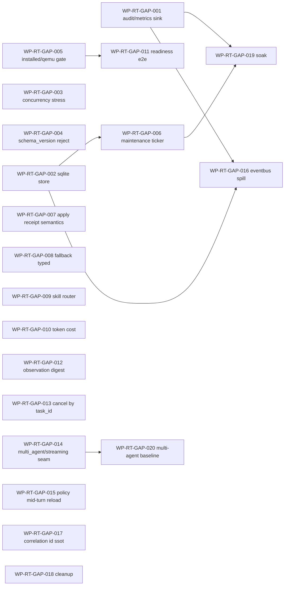

# RT-EVAL-2026-05-31 runtime 子系统落地评估与生产级缺口治理任务规划

状态：Draft
日期：2026-05-31
来源：用户专项评估请求
评估范围：[docs/architecture/DASALL_Agent_architecture.md](../architecture/DASALL_Agent_architecture.md)、[docs/architecture/DASALL_架构设计文档.md](../architecture/DASALL_架构设计文档.md)、[docs/architecture/DASALL_runtime子系统详细设计.md](../architecture/DASALL_runtime子系统详细设计.md)、[runtime/](../../runtime/)（include 18 文件 + src 33 文件，合计约 15089 行 C++）、[tests/unit/runtime/](../../tests/unit/runtime/)（28 文件）、[tests/integration/agent_loop/](../../tests/integration/agent_loop/)（16 文件）、[tests/integration/full_business_chain/](../../tests/integration/full_business_chain/)
评估方法：以实际落地代码为唯一判据；对照架构 / 详设硬约束（含 ADR-006/007/008、RT-C001..C023、RT-GATE-01..08、§6.5/§6.7/§6.11/§6.12/§6.14/§6.16/§6.17/§6.20/§6.21/§6.23/§6.24）；并对标 Temporal Workflow / LangGraph / Akka-Persistence / Kubelet syncLoop / OpenTelemetry semconv 等行业实践。

---

## 0. 文档定位与读者

1. 给项目治理与里程碑评审提供一份对 runtime 子系统**生产级达成度**的可追溯结论。
2. 给后续 work package（WP-RT-GAP-*）提供可执行的拆分基线与排序依据。
3. 任何条目都必须能回链到代码文件:行 或 文档章节；凡当前判定不确定的，标注 `待验证` 而非自圆其说。
4. 与 [COG-EVAL-2026-05-31](./COG-EVAL-2026-05-31-cognition子系统落地评估与生产级缺口治理任务规划.md) / [LLM-EVAL-2026-05-31](./LLM-EVAL-2026-05-31-llm子系统落地评估与生产级缺口治理任务规划.md) 形成跨子系统评估三联章。

---

## 1. 评估结论摘要

| 维度 | 现状 | 结论 |
|---|---|---|
| 子系统骨架（AgentFacade / Orchestrator 五阶段 / 17 状态 FSM / 5 维 Budget / Scheduler 三队列 / Recovery / Checkpoint / Session / SafeMode / EventBus / Telemetry / Health / Maintenance） | 全部编译可跑、单元 28 + 集成 16 测试齐备 | **结构层达成度高（约 80%）** |
| ADR-006（上下文权归 memory.ContextOrchestrator） | runtime/src 内全部经 [AgentOrchestrator.cpp:1055,2466,2779,2891](../../runtime/src/AgentOrchestrator.cpp) `memory_manager->prepare_context(...)` 获取 ContextPacket，无独立装配中心 | **边界合规** |
| ADR-007（恢复准入权归 runtime.RecoveryManager） | [RecoveryManager.cpp:364-606](../../runtime/src/recovery/RecoveryManager.cpp) `evaluate/execute/apply` 三段实在；评估真实组合 ReflectionDecision + Budget + retry_count + checkpoint | **owner 边界合规；apply 语义需精确化（见 GAP-P1-B）** |
| ADR-008（全局主控权归 runtime.AgentOrchestrator） | [AgentOrchestrator.cpp:2144-2153](../../runtime/src/AgentOrchestrator.cpp) 五阶段枚举 preflight/main_loop/tool_round/recovery_round/terminalize；apps/daemon、apps/gateway 直接链接 dasall_runtime | **唯一主控、生产装配链路存在** |
| 17 FSM + GuardTable + CheckpointStateMapper | [AgentFsm.cpp](../../runtime/src/fsm/AgentFsm.cpp) + [TransitionGuardTable.cpp](../../runtime/src/fsm/TransitionGuardTable.cpp) (305 行) + [CheckpointStateMapper.cpp](../../runtime/src/checkpoint/CheckpointStateMapper.cpp) 全部有专属单测 | **达成（RT-GATE-06/07）** |
| 五维预算 + deadline min(request, budget) | [BudgetController.cpp](../../runtime/src/budget/BudgetController.cpp) 真实扣减；[AgentOrchestrator.cpp:589-624](../../runtime/src/AgentOrchestrator.cpp) deadline 取 min | **达成** |
| Cancellation 传播 | [CancellationToken.h](../../runtime/include/CancellationToken.h) shared State 模型；[SchedulerTicket.h:128,142](../../runtime/include/scheduling/SchedulerTicket.h) 嵌入 token；[RuntimeCancellationPropagationIntegrationTest.cpp](../../tests/integration/agent_loop/RuntimeCancellationPropagationIntegrationTest.cpp) 端到端覆盖 | **达成（DEF-02 / RT-C019）** |
| 业务链贯通（Access ↔ Runtime ↔ Cognition ↔ LLM ↔ Memory ↔ Tool ↔ Knowledge ↔ Response） | unary / durable resume / recovery context / safe mode / cancellation / health maintenance / policy consumer / production logging / profile compatibility / required-optional ports / fixture / evidence projection 共 16 条集成测全部存在 | **可贯通** |
| 真实落地 vs 桩 | 无空壳实现；[placeholder.cpp](../../runtime/src/placeholder.cpp) 是历史空 namespace 文件可清理；所有主要组件均含真实业务体（Orchestrator 5651 行 / Checkpoint 1244 行 / Facade 899 行 / Session 802 行 / Recovery 611 行 / Scheduler 423 行 / SafeMode 422 行 / Fsm+Guard 数百行） | **无虚假实现** |
| 距离生产级 GA | 仍欠 audit/metrics 强制 sink、checkpoint schema_version 强制校验、SQLite 持久化后端、并发压力门、后台维护驱动器、SkillRouter、cancel(task_id)、multi_agent / streaming seam | **未到生产级** |

总体结论：runtime 已完成**架构 / 接口 / 治理 / FSM / 恢复 / 检查点骨架**的真实落地，distinct from cognition 的"语义薄"问题——runtime 的缺口集中在**生产侧 sink 强制化、跨版本兼容、并发证据与可裁剪后置项**；GA 前必须收敛 P0 项。

---

## 2. DASALL 整体架构目标 vs Runtime 落地（条目级对账）

| 架构原则 / 目标 | 落地证据 | 结论 |
|---|---|---|
| 唯一全局主控（ADR-008） | AgentOrchestrator 单一实现；runtime/ 内无第二 orchestrator；apps/* 不构建并行主控 | 达成 |
| 控制平面少线程模型（§6.14 / RT-C013） | Scheduler 三队列 + 单 worker；mutex 保护；recovery 在主循环内串行 | 达成（缺并发压测，见 GAP-P0-C） |
| 13 步运行时调用链（§3.3.1） | 11 步真实落地；Skill Router 缺失（§6.22 自承认）；Observation Digest 弱化（合并到 persist_turn） | **2 处弱化**，见 GAP-P1-D / GAP-P2-A |
| 五维预算 + 停止条件（§5.1.3 / RT-C007） | BudgetController 五维 + can_continue/can_replan/can_call_tool；deadline min；StopConditions 由 Orchestrator 解读 | 达成 |
| Checkpoint 前后持久化 + pending_action（§3.8.3 / RT-C008） | CheckpointManager.save 在状态转移前后被调用；pending_action 写入；`durable_state_root_` hex KV | 达成（持久化后端弱，见 GAP-P0-B） |
| 显式等待态 WaitingClarify / WaitingConfirm（§6.8 MUST） | FSM 17 状态枚举完整；GuardTable 含等待转移规则 | 达成 |
| FailedSafe 强制收敛（§6.8 MUST） | RecoveryManager.execute 显式 `final_runtime_state = "FailedSafe"`；SafeModeController 四态 | 达成 |
| 审计显式终态前位置（§6.8 MUST / RT-C011） | Orchestrator 写 `audit_summary` 字符串到 SessionSnapshot；**无任何 `audit_logger->...` 直接调用** | **未达成**，见 GAP-P0-A |
| 恢复准入独占（ADR-007） | RecoveryManager.evaluate/execute 是唯一准入点；apply 仅写 receipt（不直接突变 FSM/Budget） | 达成（语义需文档精确化，GAP-P1-B） |
| 协同子域不越权（ADR-008 / RT-C018） | runtime/ 全文 `multi_agent / streaming` 零命中 | 达成（按设计后置，GAP-P2-C） |
| 超时中断传播（§5.2 / §6.5.3 MUST / RT-C019） | CancellationToken + SchedulerTicket + 集成测 | 达成 |
| 检查点版本元数据（§6.20 / RT-C022） | [CheckpointBuildTypes.h:16-20](../../runtime/include/checkpoint/CheckpointBuildTypes.h) 仅定义 tag 字符串 `rt.schema_version` / `rt.fsm_state_enum_version` / `rt.budget_schema_version`；**load 路径未发现强制 reject** | **未达成**，见 GAP-P0-D |
| 独立错误码域 RT_E_*（§6.15 / RT-C023） | [RuntimeErrorCode.h](../../runtime/include/RuntimeErrorCode.h) 100-699 分域；RecoveryManager / SafeMode / Budget 全部消费 | 达成 |
| Profile 兼容性（§9.1 三档） | RuntimePolicySnapshot 经 dependency_set 注入；[RuntimeProfileCompatibilityTest.cpp](../../tests/integration/agent_loop/RuntimeProfileCompatibilityTest.cpp) 覆盖 | 达成 |
| 生产 composition（§6.24.12.3 / RuntimeAppCompositionV1） | apps/daemon、apps/gateway 链接 dasall_runtime；fail-closed 由 [RuntimeDependencySetReadinessTest.cpp](../../tests/unit/runtime/RuntimeDependencySetReadinessTest.cpp) 覆盖 | 达成 |
| 后台维护（§6.23） | [BackgroundMaintenanceHooks.cpp](../../runtime/src/maintenance/BackgroundMaintenanceHooks.cpp) 仅 publish_idle_tick；**无主动 ticker 线程**；TTL gc / session 过期 / profile 刷新依赖外部调用 | **半实现**，见 GAP-P1-A |
| 可观测四类信号（§6.12） | log/event 走 RuntimeLoggingBridge / RuntimeEventBus / RuntimeTelemetryBridge；metric/audit sink **未直连** infra | **半达成**，见 GAP-P0-A |
| Health cadence 投影（§6.23.1 SSOT） | [RuntimeHealthProbe.cpp](../../runtime/src/health/RuntimeHealthProbe.cpp) 实现 IHealthProbe，集成测 [RuntimeHealthMaintenanceIntegrationTest.cpp](../../tests/integration/agent_loop/RuntimeHealthMaintenanceIntegrationTest.cpp) | 达成（待验证 production signal_provider 注入） |

**普遍性架构缺口**：runtime 已经把"控制平面"做扎实，但**信号外送 / 持久化生产化 / 并发证据**这三条贯通生产级 GA 的硬轴线尚未闭环。这与 cognition 的"语义薄"、llm 的"多 provider 路由"是不同象限的缺口。

---

## 3. Runtime 详细设计 vs 实际代码（差距矩阵）

下表只列**有差距/有风险**的条目；其余设计要求均通过单/集成测试间接覆盖。

### 3.1 已完整落地（抽样）

- AgentFacade 三入口 init/handle/resume/stop：[AgentFacade.cpp](../../runtime/src/AgentFacade.cpp)。
- AgentOrchestrator 五阶段编排 + stage_trace + run_result：[AgentOrchestrator.cpp:2144-2153](../../runtime/src/AgentOrchestrator.cpp)。
- FSM 17 状态 + GuardTable + CheckpointStateMapper：[AgentFsm.cpp](../../runtime/src/fsm/AgentFsm.cpp) / [TransitionGuardTable.cpp](../../runtime/src/fsm/TransitionGuardTable.cpp) / [CheckpointStateMapper.cpp](../../runtime/src/checkpoint/CheckpointStateMapper.cpp)。
- BudgetController 五维 + deadline 协同：[BudgetController.cpp](../../runtime/src/budget/BudgetController.cpp) + Orchestrator [589-624](../../runtime/src/AgentOrchestrator.cpp)。
- Scheduler 三队列 + 反压 + worker ticket：[Scheduler.cpp](../../runtime/src/scheduling/Scheduler.cpp)。
- RecoveryManager evaluate 真实组合预算 / 决策 / retry / checkpoint：[RecoveryManager.cpp:364-481](../../runtime/src/recovery/RecoveryManager.cpp)。
- CheckpointManager build/save/load/validate/make_resume_plan：[CheckpointManager.cpp](../../runtime/src/checkpoint/CheckpointManager.cpp)。
- SessionManager load/prepare_turn/persist_turn/bind_checkpoint_ref/build_resume_seed：[SessionManager.cpp](../../runtime/src/session/SessionManager.cpp)。
- SafeModeController 四态 + degrade_policy 投影：[SafeModeController.cpp](../../runtime/src/safety/SafeModeController.cpp)。
- RuntimeEventBus 审计 / 非审计分队列 + 自动丢弃 + 序列化：[RuntimeEventBus.cpp](../../runtime/src/telemetry/RuntimeEventBus.cpp)。
- CancellationToken + Ticket 传播：[CancellationToken.h](../../runtime/include/CancellationToken.h) + [RuntimeCancellationPropagationIntegrationTest.cpp](../../tests/integration/agent_loop/RuntimeCancellationPropagationIntegrationTest.cpp)。
- Resume 集成：[RuntimeDurableResumeIntegrationTest.cpp](../../tests/integration/agent_loop/RuntimeDurableResumeIntegrationTest.cpp) / [RuntimeResumeIntegrationTest.cpp](../../tests/integration/agent_loop/RuntimeResumeIntegrationTest.cpp)。
- RuntimeAppCompositionV1：apps/daemon / apps/gateway 链接 + readiness 单测。

### 3.2 真实存在但深度不足（"非虚假，但治理面薄"）

| 设计 ID / 条款 | 现状 | 风险 | 关联缺口 |
|---|---|---|---|
| §6.12 audit/metrics 必填字段 | TelemetryBridge 仅写内存 records；EventBus 仅内存队列；**无 `audit_logger->...` / `metrics_provider->...` 直连** | 高风险确认 / 补偿 / SafeMode 进入事件可能静默丢失（违反 RT-C011） | GAP-P0-A |
| §6.20 / RT-C022 schema_version | tag 字符串已定义，但 load 路径未发现 `RT_E_412_RESUME_REJECTED` 因版本不匹配触发的强制路径 | 跨版本部署 resume 失败时无显式拒绝；既存 [RuntimeCheckpointReplayCompatibilityTest.cpp](../../tests/integration/agent_loop/RuntimeCheckpointReplayCompatibilityTest.cpp) 主要验证 replay 一致性 | GAP-P0-D |
| §6.23 后台维护 | 仅 `publish_idle_tick`；TTL gc / session 过期 / profile 刷新 / telemetry flush 缺主动驱动 | 长跑场景持久化目录爆炸；profile 热更新延迟 | GAP-P1-A |
| §6.13 RecoveryManager.apply 语义 | apply 仅写 receipt 与日志；FSM/Budget/Session 突变由 Orchestrator 在 `recovery_round` 自行解读 outcome | owner 边界与详设语义存在歧义；外部调用方误用风险 | GAP-P1-B |
| §6.22 SkillRouter | runtime/ 内无 SkillRouter 实现；详设 §6.22 已自承认 | 多 profile 意图分流缺失；后续接入需改 RuntimeDependencySet | GAP-P1-D |
| §6.14 并发安全 / RT-GATE-08 | 全 mutex；锁顺序在代码注释中存在；**无独立并发压测**（grep 未见 stress / concurrency 测试） | RT-GATE-08 二值判据未闭环 | GAP-P0-C |
| §6.5 ObservationDigest 节点 | 合并到 persist_turn；无独立 digest 算子 | 工具结果摘要权落到下游，损失可观测性 | GAP-P2-A |
| IAgent.cancel(task_id)（架构 §6.3） | 仅 stop(timeout_ms)；无按 task_id 取消 | 大并发场景细粒度取消缺失 | GAP-P2-B |

### 3.3 设计声明但代码层未显性兑现（按设计后置 / 半显性）

| 设计要求 | 现状 | 缺口 | 关联缺口 |
|---|---|---|---|
| RT-BLK-002 streaming（StreamHandle 进阶段 J 后） | runtime/ 无 streaming 概念 | 阶段 L 待开 | GAP-P2-C |
| RT-BLK-003 multi_agent | runtime/ 无 IMultiAgentCoordinator | 阶段 L 待开；建议预留空 interface 避免 contracts 二次冻结 | GAP-P2-C |
| §6.21.x SafeMode fallback 类型化（model_failover vs budget_degrade vs tool_skip） | SafeModeController 当前从 degrade_policy 取列表，但**类型化语义在代码内并未细化** | 与 LLM 子系统 model failover 的实际联动需要进一步对账 | GAP-P1-C |
| §6.19 策略热更新 | RuntimePolicySnapshot 注入是冷路径；mid-turn 更新行为代码内**未显式定义**（默认不更新） | 与 infra.config 的 reload 联动未端到端验证 | GAP-P2-D |
| §6.18 关联 ID 所有权 | request_id / trace_id / session_id / turn_id 在 Orchestrator 与 SessionManager 内有传播；但**端到端审计字段表**未形成 SSOT 文档 | 跨子系统排障一致性 | GAP-P3-A |
| `runtime/src/placeholder.cpp` | 空 namespace 历史遗留 | 可清理（J0 已不需要） | GAP-P3-B |

---

## 4. 业务链贯通性（端到端，以代码事实为准）

| 业务链 | 起点 | 终点 | 关键代码节点 | 集成测试 | 贯通度 |
|---|---|---|---|---|---|
| Unary 主链 | apps/daemon HTTP/IPC | AgentResult | AccessGateway → AgentFacade.handle → Orchestrator.run_once → memory.prepare_context → cognition.decide → tool.invoke → cognition.reflect → response.build → session.persist_turn → checkpoint.save | [RuntimeUnaryIntegrationTest.cpp](../../tests/integration/agent_loop/RuntimeUnaryIntegrationTest.cpp) / [RuntimeUnaryFixtureIntegrationTest.cpp](../../tests/integration/agent_loop/RuntimeUnaryFixtureIntegrationTest.cpp) | ✅ 完整 |
| Recovery 链 | tool 失败 / budget reject | FailedSafe / Degraded / Replan | RecoveryManager.evaluate → execute → apply → Orchestrator.recovery_round | [RuntimeRecoveryContextIntegrationTest.cpp](../../tests/integration/agent_loop/RuntimeRecoveryContextIntegrationTest.cpp) | ✅ 完整 |
| Resume 链 | client resume / 系统重启 | 继续主链 | SessionManager.load_session → CheckpointManager.load → make_resume_plan → Orchestrator.resume_once | [RuntimeDurableResumeIntegrationTest.cpp](../../tests/integration/agent_loop/RuntimeDurableResumeIntegrationTest.cpp) / [RuntimeResumeIntegrationTest.cpp](../../tests/integration/agent_loop/RuntimeResumeIntegrationTest.cpp) | ✅ 完整（schema 强制校验缺，GAP-P0-D） |
| SafeMode 链 | budget exhaustion / 多次失败 | SafeMode / Degraded | SafeModeController.evaluate_entry → emit_safe_mode | [RuntimeSafeModeIntegrationTest.cpp](../../tests/integration/agent_loop/RuntimeSafeModeIntegrationTest.cpp) | ✅ 完整 |
| Cancel 链 | deadline / 客户端取消 | 中断传播 | CancellationToken.cancel → ticket → tool/llm | [RuntimeCancellationPropagationIntegrationTest.cpp](../../tests/integration/agent_loop/RuntimeCancellationPropagationIntegrationTest.cpp) | ✅ 完整（缺 task_id 入口，GAP-P2-B） |
| Health 链 | infra.health cadence | RuntimeHealthSnapshot | RuntimeHealthProbe.probe → HealthSnapshot 投影 | [RuntimeHealthMaintenanceIntegrationTest.cpp](../../tests/integration/agent_loop/RuntimeHealthMaintenanceIntegrationTest.cpp) | ✅ 完整 |
| Policy 链 | profiles.RuntimePolicySnapshot | 各 controller 行为 | dependency_set.policy_snapshot → BudgetController/SafeModeController | [RuntimePolicyConsumerIntegrationTest.cpp](../../tests/integration/agent_loop/RuntimePolicyConsumerIntegrationTest.cpp) | ✅ 完整（mid-turn reload 未验证，GAP-P2-D） |
| Ports 必选 / 可选 | dependency_set | fail-closed / degraded | RuntimeDependencySet.has_live_unary_ports | [RuntimeRequiredOptionalPortsIntegrationTest.cpp](../../tests/integration/agent_loop/RuntimeRequiredOptionalPortsIntegrationTest.cpp) | ✅ 完整 |
| 全业务链 | apps/daemon | AgentResult + audit + checkpoint | full_business_chain 套件 | [tests/integration/full_business_chain/](../../tests/integration/full_business_chain/) | ✅ 完整 |
| Audit / Metrics 信号 | runtime 事件 | infra.audit / infra.metrics | **当前仅写入内存 records / EventBus** | 无直连 sink 集成测 | ❌ 缺，GAP-P0-A |
| Multi-agent / Streaming | — | — | runtime/ 无 | 无 | ⏸ 阶段 L 后置，GAP-P2-C |
| Skill 路由 | profile.routing → cognition pipeline | — | runtime/ 无 SkillRouter | 无 | ❌ 缺，GAP-P1-D |

---

## 5. 行业最佳实践对标

| 维度 | DASALL Runtime 实现 | 标杆 | 评估 |
|---|---|---|---|
| 主控状态机 | 17 状态 + 显式 GuardTable + ResumePlan | Temporal Workflow / LangGraph state graph | ✅ 对齐 |
| 检查点版本化 | schema_version tag 已定义但未强制 reject | Temporal history version / Akka schema evolution | ⚠️ 需补强（GAP-P0-D） |
| Cancellation 传播 | shared State + Token + 集成测 | Go context.Context / Java InterruptionFlag | ✅ 对齐 |
| 控制平面线程模型 | 单 worker + mutex；recovery 串行 | Kubelet syncLoop / Erlang gen_server | ✅ 模型正确，缺并发证据（GAP-P0-C） |
| Backpressure | Scheduler 三队列 + 显式信号 + 溢出处理 | Akka 入队限流 / k8s admission queue | ✅ 对齐 |
| Recovery 准入与执行分离 | evaluate / execute / apply 三段；apply 仅 receipt | Temporal 决策-执行分离 / SAGA | ⚠️ 需文档精确化（GAP-P1-B） |
| 可观测性 sink 强制化 | EventBus 软可观测 + telemetry record；audit/metrics 不直连 | OpenTelemetry mandatory exporter | ❌ 应强制（GAP-P0-A） |
| 持久化后端 | hex-encoded 文件 KV + atomic rename | SQLite WAL / RocksDB / Akka journal | ⚠️ 适合 desktop/edge，production 需升级（GAP-P0-B） |
| 跨 profile 裁剪 | desktop_full / edge_balanced / edge_minimal | k8s feature gates | ✅ 对齐 |
| 后台维护 | 仅 idle_tick API；无主动 ticker | k8s GC controllers / Temporal periodic tasks | ⚠️ 需 ticker（GAP-P1-A） |

**冗余 / 不合适的设计**：
- [runtime/src/placeholder.cpp](../../runtime/src/placeholder.cpp) 空 namespace 文件应清理（GAP-P3-B）。
- 暂未发现冗余主循环 / 第二调度中心 / 重复编排路径。

---

## 6. 缺口清单（GAP）

### 6.1 P0（GA 阻塞，必须先收敛）

- **GAP-P0-A audit/metrics 强制 sink**：在 AgentFacade.init 内挂 default subscriber，把 telemetry record（recovery_reject / safe_mode_entered / high_risk_confirmation / budget_reject / checkpoint_save_failure 等）强制转发给 `infra::audit::IAuditLogger` 与 `infra::metrics::IMetricsProvider`；提供 fail-closed 与 fail-open 两档策略；新增集成测验证不可静默丢失。证据：runtime/ 全文 `grep audit_logger->|metrics_provider->` 当前为零。
- **GAP-P0-B 持久化生产化**：production profile 切到 SQLite WAL（沿用 memory 子系统已选定后端）；保留 desktop/edge 的文件 KV 作为 fallback；引入 fsync barrier。证据：[CheckpointManager.cpp](../../runtime/src/checkpoint/CheckpointManager.cpp) / [SessionManager.cpp](../../runtime/src/session/SessionManager.cpp) 当前为 hex 文件。
- **GAP-P0-C 并发压力门 RT-GATE-08**：补 `RuntimeConcurrencyStressTest`（main loop + recovery + checkpoint persist 三线程，1k 轮无死锁、无事件丢失、锁顺序违例可检测），输出生产级证据。
- **GAP-P0-D checkpoint schema_version 强制校验**：在 `CheckpointManager::load` 中显式比较 `rt.schema_version` / `rt.fsm_state_enum_version` / `rt.budget_schema_version`，不兼容时返回 `RT_E_412_RESUME_REJECTED`；新增专属拒绝路径集成测。
- **GAP-P0-E qemu / installed gate**：runtime 子系统目前主要依赖 build-tree integration；与 access / infra / memory 风格对齐，需要一条 `runtime_qemu_or_installed_smoke` gate 作为 RT-GATE-04 在 installed profile 上的二值证据。

### 6.2 P1（GA 强烈建议）

- **GAP-P1-A BackgroundMaintenanceTicker**：daemon / 长跑容器内挂 `MaintenanceTickerThread`（控制平面少线程模型），周期触发 checkpoint TTL gc、session 过期检查、telemetry buffer flush、profile 刷新探测；提供采样率 / 周期 / 关闭开关 profile 投影。
- **GAP-P1-B RecoveryManager.apply 语义精确化**：在详设 §6.13 显式说明 apply 是 receipt（不直接突变 FSM/Budget/Session），并在代码注释 + 集成测中加固该约束；可选：把 receipt 转交给 Orchestrator 的 hook 设为内部 friend 关系，避免外部误用。
- **GAP-P1-C SafeMode fallback 类型化**：把 fallback_chain 的元素从字符串改为枚举（model_failover / budget_degrade / tool_skip / abort_safe），在 SafeModeController 内做类型化分支；与 LLM 子系统 model failover 联动加端到端集成测。
- **GAP-P1-D SkillRouter 最小落地**：基于 profile.runtime_policy.routing 的轻量 dispatcher，运行在 Orchestrator preflight 阶段；不引入第二调度中心；输出 skill_id 到 stage_trace 与日志。
- **GAP-P1-E Token / Cost 归因**：runtime 侧聚合 cognition / llm 子系统报告的 token usage 到 `RuntimeTelemetryRecord` 与 metrics 标签；与 BudgetController.max_tokens 实时联动。
- **GAP-P1-F production composition readiness 端到端**：[RuntimeDependencySetReadinessTest.cpp](../../tests/unit/runtime/RuntimeDependencySetReadinessTest.cpp) 已覆盖 unit 层；补 installed profile 下 daemon 启动 → readiness probe 绿 / fail-closed 红 的端到端证据。

### 6.3 P2（演进项）

- **GAP-P2-A ObservationDigest 节点显性化**：把工具结果摘要从 persist_turn 拆出，落到 Orchestrator 显式 stage（与详设 §6.5 一致）；保持 owner 不变。
- **GAP-P2-B IAgent.cancel(task_id)**：补按 task_id 路由 CancellationToken.cancel 的入口；与 Scheduler ticket 表对齐。
- **GAP-P2-C multi_agent / streaming 空 interface 预留**：在 runtime/include 内放 `IMultiAgentCoordinator.h` / `IStreamHandle.h` 作为 header-only seam；阶段 L 接入时不再触动 contracts 冻结面。
- **GAP-P2-D RuntimePolicySnapshot mid-turn reload 行为**：明确"mid-turn 不更新、turn 边界更新"或反之；新增 `RuntimePolicyMidTurnReloadTest` 端到端验证 + telemetry 记录。
- **GAP-P2-E EventBus 持久化（可选）**：审计事件队列溢出时可降级写盘；与 GAP-P0-A 配合。

### 6.4 P3（运营 / 安全 / 清理）

- **GAP-P3-A 关联 ID SSOT**：把 request_id / trace_id / session_id / turn_id / checkpoint_id / span_id 的所有权与传播规则形成详设 §6.18 的端到端字段表 SSOT，runtime 侧做断言检查。
- **GAP-P3-B 历史遗留清理**：删除 [runtime/src/placeholder.cpp](../../runtime/src/placeholder.cpp) 与 CMake 中残留引用；删除任何不再消费的 `kRuntimeOrchestratorSkeleton*` 常量。
- **GAP-P3-C 长跑灰度 soak gate**：infra release-soak 已有套件，需要 runtime 维度采样（FSM 转移成功率 / checkpoint save 成功率 / safe_mode_entries / recovery_reject）。
- **GAP-P3-D Multi-Agent 协同基线测试**：依赖 multi_agent 子系统就绪。

---

## 7. 任务拆分（WP-RT-GAP-*）

任务结构沿用项目原子任务模板（代码目标 / 测试目标 / 验收命令 / 阻塞-解阻），可直接挂入 [docs/todos/runtime/DASALL_runtime子系统专项TODO.md](../todos/runtime/DASALL_runtime子系统专项TODO.md)。

### 7.1 P0 任务

#### WP-RT-GAP-001 Audit / Metrics 强制 sink（GAP-P0-A）

- **代码目标**
  - 在 [AgentFacade.cpp](../../runtime/src/AgentFacade.cpp) `init()` 中挂 `RuntimeAuditSinkSubscriber` 与 `RuntimeMetricsSinkSubscriber`，订阅 RuntimeEventBus 上的关键事件类（recovery_reject / safe_mode_entered / budget_reject / checkpoint_save_failure / high_risk_confirmation）并强制转发给 `infra::audit::IAuditLogger` / `infra::metrics::IMetricsProvider`。
  - 提供 `RuntimeSinkPolicy{ fail_closed_on_audit_failure, drop_on_metrics_failure }` 由 RuntimePolicySnapshot 投影。
  - dependency_set 缺失 audit/metrics 时 production profile 走 fail-closed。
- **测试目标**
  - `RuntimeAuditSinkForwardingTest`、`RuntimeMetricsSinkForwardingTest`、`RuntimeSinkFailClosedTest`、扩展 [RuntimeProductionLoggingIntegrationTest.cpp](../../tests/integration/agent_loop/RuntimeProductionLoggingIntegrationTest.cpp) 加 audit assertion。
- **验收命令**
  - `ctest --test-dir build-ci -R "RuntimeAuditSink|RuntimeMetricsSink|RuntimeSinkFailClosed|RuntimeProductionLogging" --output-on-failure`
- **阻塞 / 解阻**：依赖 infra.audit / infra.metrics public interface 已冻结（已满足）。

#### WP-RT-GAP-002 Production SQLite 持久化后端（GAP-P0-B）

- **代码目标**
  - 抽 `IRuntimeDurableStore` 接口（put / get / delete / list / fsync / version）；现有 hex KV 改为 `FileKvDurableStore` 实现。
  - 新增 `SqliteDurableStore` 实现（沿用 memory 子系统已 pin 的 SQLite 版本）；启用 WAL + busy_timeout。
  - profile 投影选择 store：production → sqlite，desktop/edge → file_kv。
  - SessionManager / CheckpointManager 通过 `IRuntimeDurableStore` 注入。
- **测试目标**
  - `RuntimeDurableStoreContractTest`（同一组用例跑两份实现）、`RuntimeSqliteDurableStoreCrashRecoveryTest`、扩展 resume 集成测在 sqlite store 下复跑。
- **验收命令**
  - `ctest --test-dir build-ci -R "RuntimeDurableStore|RuntimeSqlite|RuntimeDurableResume" --output-on-failure`
- **阻塞 / 解阻**：依赖 memory 子系统 SQLite pin（已满足）。

#### WP-RT-GAP-003 RT-GATE-08 并发压力门（GAP-P0-C）

- **代码目标**
  - 新增 `tests/unit/runtime/RuntimeConcurrencyStressTest.cpp`：1k+ 轮 main loop + recovery + checkpoint persist 三线程并发；锁顺序检测器（按 §6.14 声明顺序）；事件丢失计数。
  - 失败 / 数据竞争通过 ThreadSanitizer build 复跑捕获。
- **测试目标**
  - `RuntimeConcurrencyStressTest`、CI 加 `runtime_tsan_stress` 任务。
- **验收命令**
  - `ctest --test-dir build-ci -R "RuntimeConcurrencyStress" --output-on-failure`
  - `cmake --preset tsan && ctest --preset tsan -R "Runtime"`
- **阻塞 / 解阻**：依赖 profiles 内 tsan preset；可在本任务内补 preset。

#### WP-RT-GAP-004 Checkpoint schema_version 强制校验（GAP-P0-D）

- **代码目标**
  - 在 [CheckpointManager.cpp](../../runtime/src/checkpoint/CheckpointManager.cpp) `load()` 中检查 `rt.schema_version` / `rt.fsm_state_enum_version` / `rt.budget_schema_version`；任一不兼容 → 返回 `RT_E_412_RESUME_REJECTED` + telemetry。
  - 在 `build_checkpoint()` 中确保元数据写入；版本常量集中到 [CheckpointBuildTypes.h](../../runtime/include/checkpoint/CheckpointBuildTypes.h)。
- **测试目标**
  - `CheckpointSchemaVersionRejectTest`（构造旧版 checkpoint → load 拒绝）、`CheckpointSchemaVersionBumpRoundtripTest`、扩展 [RuntimeCheckpointReplayCompatibilityTest.cpp](../../tests/integration/agent_loop/RuntimeCheckpointReplayCompatibilityTest.cpp) 加拒绝路径。
- **验收命令**
  - `ctest --test-dir build-ci -R "CheckpointSchemaVersion|RuntimeCheckpointReplay" --output-on-failure`
- **阻塞 / 解阻**：无外部阻塞。

#### WP-RT-GAP-005 Runtime qemu / installed gate（GAP-P0-E）

- **代码目标**
  - 新增 `scripts/packaging/validate_runtime_installed_or_qemu.sh`，参考 access / memory 已有 gate。
  - 在 installed profile 下启动 daemon → 跑 unary + resume + safe mode 端到端用例，落 evidence 到 `~/.cache/dasall/runtime/installed-evidence/`。
  - CMake 可选 target `runtime_installed_smoke`。
- **测试目标**
  - 集成 `RuntimeInstalledSmokeTest` 入口；evidence schema 落档到详设 §9.6。
- **验收命令**
  - `bash scripts/packaging/validate_runtime_installed_or_qemu.sh && cat ~/.cache/dasall/runtime/installed-evidence/latest.json`
- **阻塞 / 解阻**：依赖打包 SSOT（已具备）。

### 7.2 P1 任务

#### WP-RT-GAP-006 BackgroundMaintenanceTicker（GAP-P1-A）

- **代码目标**
  - 在 apps/daemon 内挂 `MaintenanceTickerThread`（单线程；周期可配）；触发 BackgroundMaintenanceHooks.publish_idle_tick 与 checkpoint TTL gc / session 过期 / profile 刷新。
  - profile 投影：`runtime.maintenance.{enabled, interval_ms, ttl_ms}`。
- **测试目标**
  - `BackgroundMaintenanceTickerCadenceTest`、`CheckpointTtlGcTest`、扩展 [RuntimeHealthMaintenanceIntegrationTest.cpp](../../tests/integration/agent_loop/RuntimeHealthMaintenanceIntegrationTest.cpp) 加 ticker 验证。
- **验收命令**
  - `ctest --test-dir build-ci -R "BackgroundMaintenance|CheckpointTtlGc|RuntimeHealthMaintenance" --output-on-failure`
- **阻塞 / 解阻**：依赖 GAP-P0-B（store 接口）以驱动 gc。

#### WP-RT-GAP-007 RecoveryManager.apply 语义精确化（GAP-P1-B）

- **代码目标**
  - 在 [docs/architecture/DASALL_runtime子系统详细设计.md](../architecture/DASALL_runtime子系统详细设计.md) §6.13 / §6.11 显式定义 apply 为 receipt-only。
  - 在 [RecoveryManager.cpp](../../runtime/src/recovery/RecoveryManager.cpp) apply() 注释加固，并加入对调用方的运行时断言（apply 只能在 Orchestrator 已经处理完 outcome 后调用，否则返回 RT_E_500）。
- **测试目标**
  - `RecoveryManagerApplyReceiptSemanticsTest`（覆盖：apply 不会突变 FSM / Budget；外部直接调用得到一致 receipt）。
- **验收命令**
  - `ctest --test-dir build-ci -R "RecoveryManagerApplyReceiptSemantics" --output-on-failure`
- **阻塞 / 解阻**：无。

#### WP-RT-GAP-008 SafeMode fallback 类型化（GAP-P1-C）

- **代码目标**
  - `runtime/include/safety/SafeFallbackKind.h` 引入枚举（ModelFailover / BudgetDegrade / ToolSkip / AbortSafe）。
  - SafeModeController 解析 degrade_policy.fallback_chain 时按枚举派发；保留字符串后向兼容字段。
- **测试目标**
  - `SafeModeFallbackTypedDispatchTest`、`SafeModeModelFailoverIntegrationTest`（与 LLM 子系统联动）。
- **验收命令**
  - `ctest --test-dir build-ci -R "SafeModeFallbackTyped|SafeModeModelFailoverIntegration" --output-on-failure`
- **阻塞 / 解阻**：依赖 LLM 子系统 model failover（已具备）。

#### WP-RT-GAP-009 SkillRouter 最小落地（GAP-P1-D）

- **代码目标**
  - `runtime/include/skill/ISkillRouter.h` + 默认实现 `RuntimeSkillRouter`；按 profile.runtime_policy.routing 决定 cognition pipeline 的 skill_id 标签。
  - 在 Orchestrator preflight 阶段调用，写入 stage_trace。
- **测试目标**
  - `SkillRouterRoutingTest`、扩展 [RuntimeProfileCompatibilityTest.cpp](../../tests/integration/agent_loop/RuntimeProfileCompatibilityTest.cpp) 加 routing 维度。
- **验收命令**
  - `ctest --test-dir build-ci -R "SkillRouter|RuntimeProfileCompatibility" --output-on-failure`
- **阻塞 / 解阻**：依赖 profile.runtime_policy 增加 routing 字段（与 profiles owner 协作）。

#### WP-RT-GAP-010 Token / Cost 归因（GAP-P1-E）

- **代码目标**
  - 在 RuntimeTelemetryBridge 增加 `emit_token_usage(stage, prompt_tokens, completion_tokens, cost_estimate)`；与 LLM 子系统的 usage 报告对接。
  - BudgetController.max_tokens 使用真实 token 计数代替占位值。
- **测试目标**
  - `RuntimeTokenUsageBridgeTest`、`BudgetControllerTokenAwareConsumeTest`。
- **验收命令**
  - `ctest --test-dir build-ci -R "RuntimeTokenUsage|BudgetControllerTokenAwareConsume" --output-on-failure`
- **阻塞 / 解阻**：依赖 LLM 子系统 usage 字段（已具备）。

#### WP-RT-GAP-011 Production composition readiness 端到端（GAP-P1-F）

- **代码目标**
  - apps/daemon 启动脚本暴露 `--readiness-probe` 与 `--fail-closed`；CI installed 任务 assert 其行为。
- **测试目标**
  - `RuntimeProductionReadinessProbeInstalledTest`（installed gate 内）。
- **验收命令**
  - 同 WP-RT-GAP-005 gate 脚本扩展。
- **阻塞 / 解阻**：依赖 GAP-P0-E。

### 7.3 P2 任务

#### WP-RT-GAP-012 ObservationDigest 显性化（GAP-P2-A）

- **代码目标**
  - 在 Orchestrator 主链路 tool_round 后加显式 ObservationDigest 阶段；摘要算子在 cognition 子系统内（保持 owner 不变），runtime 仅做调用与 stage_trace 记录。
- **测试目标**
  - `ObservationDigestStageTest`、扩展 [RuntimeUnaryIntegrationTest.cpp](../../tests/integration/agent_loop/RuntimeUnaryIntegrationTest.cpp)。
- **验收命令**
  - `ctest --test-dir build-ci -R "ObservationDigestStage|RuntimeUnaryIntegration" --output-on-failure`
- **阻塞 / 解阻**：依赖 cognition 子系统暴露 digest 入口。

#### WP-RT-GAP-013 IAgent.cancel(task_id)（GAP-P2-B）

- **代码目标**
  - IAgent 增加 `cancel(task_id, reason)`；Scheduler 维护 task_id → ticket 反向索引；CancellationToken.cancel 路由到对应 ticket。
- **测试目标**
  - `AgentFacadeCancelByTaskIdTest`、`SchedulerCancelByTaskIdTest`。
- **验收命令**
  - `ctest --test-dir build-ci -R "CancelByTaskId" --output-on-failure`
- **阻塞 / 解阻**：无。

#### WP-RT-GAP-014 multi_agent / streaming 空 interface 预留（GAP-P2-C）

- **代码目标**
  - `runtime/include/multi_agent/IMultiAgentCoordinator.h` / `runtime/include/streaming/IStreamHandle.h` header-only seam；RuntimeDependencySet 暴露可选 shared_ptr 字段（默认 nullptr）。
  - 不引入实现；保证 contracts 不变。
- **测试目标**
  - `RuntimeMultiAgentSeamCompileTest`、`RuntimeStreamingSeamCompileTest`（仅头文件可包含 + 空实现可编译）。
- **验收命令**
  - `ctest --test-dir build-ci -R "RuntimeMultiAgentSeam|RuntimeStreamingSeam" --output-on-failure`
- **阻塞 / 解阻**：与 contracts owner 对账。

#### WP-RT-GAP-015 Policy mid-turn reload 行为定义（GAP-P2-D）

- **代码目标**
  - 在详设 §6.19 显式声明 policy snapshot 在 turn 边界更新；runtime 内加入快照版本号；mid-turn 配置变更被记录但不立即生效。
  - infra.config reload 事件经 EventBus 投递 `runtime.policy.reload_pending`。
- **测试目标**
  - `RuntimePolicyMidTurnReloadTest`、`RuntimePolicyTurnBoundaryRefreshTest`。
- **验收命令**
  - `ctest --test-dir build-ci -R "RuntimePolicyMidTurnReload|RuntimePolicyTurnBoundaryRefresh" --output-on-failure`
- **阻塞 / 解阻**：依赖 infra.config reload event。

#### WP-RT-GAP-016 EventBus 持久化降级（GAP-P2-E）

- **代码目标**
  - 审计事件队列高水位时降级写盘（落到 IRuntimeDurableStore namespace `runtime/event_overflow/`）；恢复后重放；与 GAP-P0-A audit sink 串行。
- **测试目标**
  - `RuntimeEventBusOverflowSpillTest`、`RuntimeEventBusReplayTest`。
- **验收命令**
  - `ctest --test-dir build-ci -R "RuntimeEventBusOverflowSpill|RuntimeEventBusReplay" --output-on-failure`
- **阻塞 / 解阻**：依赖 GAP-P0-B、GAP-P0-A。

### 7.4 P3 任务

#### WP-RT-GAP-017 关联 ID SSOT（GAP-P3-A）

- **代码目标**
  - 详设 §6.18 端到端字段表 SSOT；runtime 在每个 stage_trace 节点 assert 必填字段。
- **测试目标**
  - `RuntimeCorrelationIdSsotAssertionTest`。
- **验收命令**
  - `ctest --test-dir build-ci -R "RuntimeCorrelationIdSsotAssertion" --output-on-failure`
- **阻塞 / 解阻**：依赖跨子系统 trace baseline。

#### WP-RT-GAP-018 历史遗留清理（GAP-P3-B）

- **代码目标**
  - 删除 [runtime/src/placeholder.cpp](../../runtime/src/placeholder.cpp) 与 CMake 引用；清理 `kRuntimeOrchestratorSkeleton*` 等历史常量；评估替换或归档相关日志 reason。
- **测试目标**
  - 现有 runtime 单元 / 集成测全绿；`RuntimeHistoricalArtifactRemovedTest`（grep 断言）。
- **验收命令**
  - `ctest --test-dir build-ci -R "Runtime" --output-on-failure`
- **阻塞 / 解阻**：无。

#### WP-RT-GAP-019 Long-running soak gate 增强（GAP-P3-C）

- **代码目标**
  - 在 infra release-soak 套件内加 runtime 维度采样（FSM 转移成功率 / checkpoint save 成功率 / safe_mode_entries / recovery_reject）；soak 报告归档。
- **测试目标**：脚本化 soak 任务 + 报告归档。
- **阻塞 / 解阻**：依赖 GAP-P0-A、GAP-P1-A。

#### WP-RT-GAP-020 Multi-Agent 协同基线（GAP-P3-D）

- **代码目标**：与 multi_agent 子系统协作；runtime 提供 worker 受控入口、reentrancy 与隔离基线测试；保持 ADR-008 主控权不变。
- **测试目标**：`MultiAgentRuntimeCoordinationBaselineTest`。
- **阻塞 / 解阻**：依赖 multi_agent 子系统就绪 + GAP-P2-C seam。

---

## 8. 排序与依赖图

执行建议：
1. **第一批并发**：GAP-P0-A / GAP-P0-C / GAP-P0-D / GAP-P0-E（互相低耦合，可并行启动）。
2. **第二批**：GAP-P0-B（sqlite store）落地后启动 GAP-P1-A（ticker）与 GAP-P2-E（eventbus spill）。
3. **第三批**：GAP-P1-B/C/D/E/F 与 GAP-P0-* 解耦，可在 P0 收敛过程中并行；GAP-P1-D 需 profiles 协作。
4. **第四批**：GAP-P2-* / GAP-P3-* 按容量逐步引入；GAP-P2-C / GAP-P3-D 需 multi_agent 子系统协同。

---

## 9. 验收门 / 收敛判据

| 阶段 | 通过条件 |
|---|---|
| **GA-RT-Gate-P0** | WP-RT-GAP-001..005 全部 Done；`ctest --test-dir build-ci -R "Runtime"` 全绿；installed/qemu gate 在 CI 上有一次绿色记录；TSAN stress run 一次绿；schema_version 拒绝路径有 evidence |
| **GA-RT-Gate-P1** | WP-RT-GAP-006..011 全部 Done；token/cost SLO published；apply receipt 语义文档落档；SafeMode 类型化 fallback 在 LLM failover 联动测通过 |
| **GA-RT-Gate-P2** | WP-RT-GAP-012..016 全部 Done；observation digest 显性化；cancel(task_id) e2e 绿；multi_agent / streaming seam 编译通过；policy mid-turn 行为可观测 |
| **GA-RT-Gate-P3** | WP-RT-GAP-017..020 至少完成 P3-A / P3-B；P3-C / P3-D 进入观测阶段 |

将上述四档与 §9.6 RT-GATE-01..08 的对应关系：

| RT-GATE | 主负责 GAP |
|---|---|
| RT-GATE-01 FSM 全分支覆盖 | 现状已通过；维持 GAP-P3-B 后回归 |
| RT-GATE-02 异常 / 超时降级安全收敛 | GAP-P1-C / GAP-P0-A |
| RT-GATE-03 checkpoint save/load/resume 可验证 | GAP-P0-D / GAP-P0-B |
| RT-GATE-04 unary 主流程 3 档 profile | 现状通过；GAP-P0-E 提供 installed evidence |
| RT-GATE-05 contracts 边界未破坏 | 现状通过；GAP-P2-C 维持 |
| RT-GATE-06 FSM guard 全覆盖 | 现状通过 |
| RT-GATE-07 CheckpointState 映射一致 | 现状通过；GAP-P0-D 强化 |
| RT-GATE-08 并发安全无死锁 | GAP-P0-C |

---

## 10. 文档回写约定

1. 每完成一项 WP-RT-GAP-* 任务，在 [docs/worklog/DASALL_开发执行记录.md](../worklog/DASALL_开发执行记录.md) 与本文件 §7 对应任务后追加 closeout 段落（含证据链接、测试命令输出摘要、build 名称、commit SHA）。
2. 任何对详设字段 / schema / owner 语义的改动，必须先在 [docs/architecture/DASALL_runtime子系统详细设计.md](../architecture/DASALL_runtime子系统详细设计.md) 落档再写实现。
3. 任务的"代码目标 / 测试目标 / 验收命令"三件套同时同步到 [docs/todos/runtime/DASALL_runtime子系统专项TODO.md](../todos/runtime/DASALL_runtime子系统专项TODO.md)。
4. 阻塞项必须在本文件 §7 各任务"阻塞 / 解阻"小节内显式记录；禁止在代码 comment 内绕过；跨子系统阻塞同步 [docs/todos/DASALL_子系统查漏补缺专项记录.md](../todos/DASALL_子系统查漏补缺专项记录.md)。
5. 本文件的 §1 / §6 结论变更需触发评审；P0/P1 收敛后更新 §9 验收门状态并归档到 deliverables 目录。
