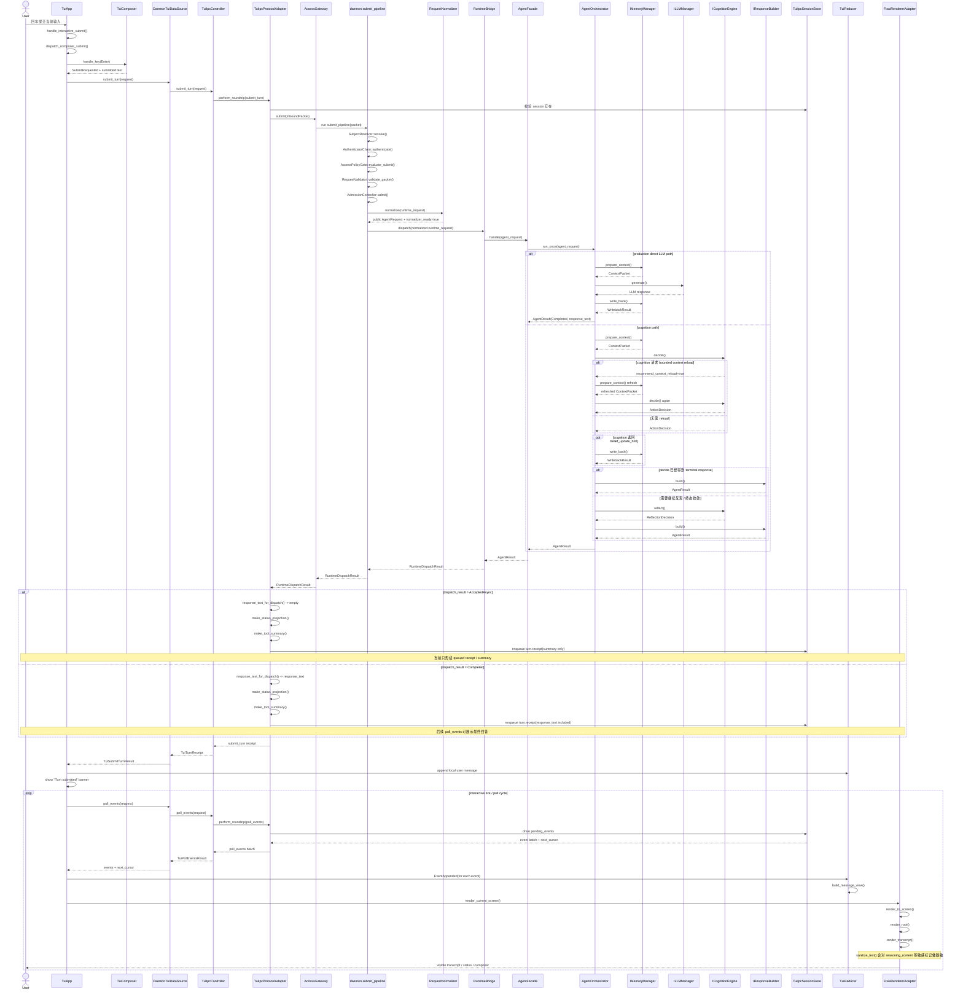

# DASALL TUI 会话提交到结果展示调用链学习笔记

文档版本：v1.0
日期：2026-06-15
状态：Study Note / source-based

## 1. 文档定位

本文档汇总 DASALL formal TUI 主链中，从用户在 composer 提交一次会话，到前台 transcript 展示可见结果之间的调用链。

本文只做源码学习总结，不替代权威设计与规范文档；权威边界仍以 architecture、ssot、deliverables 为准。

本文重点回答四个问题：

1. TUI 的正式提交入口到底在哪里。
2. submit_turn 如何穿过 daemon、access 和 runtime。
3. runtime 内部有哪些正式执行分支会产出最终可见结果。
4. 结果是如何从 runtime 回流到 TUI transcript 并被渲染出来的。

## 2. 范围与边界

### 2.1 本文覆盖范围

本文覆盖 formal TUI 主链：

1. TuiApp 交互入口。
2. DaemonTuiDataSource / TuiIpcController 的 client IPC。
3. daemon 侧 TuiIpcProtocolAdapter。
4. access submit pipeline。
5. runtime AgentFacade / AgentOrchestrator。
6. poll_events 回流、reducer 投影、renderer 渲染。

### 2.2 本文明确排除

本文不把 [apps/tui/src/manual_terminal_main.cpp#L724](../../apps/tui/src/manual_terminal_main.cpp#L724) 一类 manual harness 视为正式链路。该文件中的 handle_submit 只做本地模拟，不进入 formal daemon/access/runtime 主链。

### 2.3 “推理结果”在当前仓库中的精确定义

在当前 formal TUI 路径里，用户最终看到的不是 raw Chain-of-Thought，也不是 provider-private reasoning_content，而是已经过 owner 收敛后的用户可见投影结果，主要包括：

1. turn receipt。
2. summary_text。
3. response_text。
4. status_delta。
5. tool_summary。

这一定义非常关键，因为当前 formal TUI 的结果展示面本质上是“投影结果展示”，不是“原始模型思维流展示”。

## 3. 一页结论

当前 formal TUI 路径里，submit 和 assistant 结果展示是解耦的。用户按下回车后，TUI 先经 submit_turn 拿到一份 receipt，并立即把用户消息插入本地 transcript；真正的 assistant 可见结果，要等后续 tick 触发 poll_events，把 daemon 侧排队的事件批次拉回，再由 reducer 追加到 transcript，最后由 renderer 渲染到屏幕。

daemon 在 TUI 协议层不会把 runtime 内部复杂对象直接暴露给 TUI，而是把 RuntimeDispatchResult 立刻投影成 turn.receipt 事件，入 session_store 的 pending_events。若 dispatch_result 是 accepted_async，TUI 当前通常只能先看到 queued summary；若 dispatch_result 已经是 completed，TUI 才能在 receipt/event 中直接拿到 response_text 并展示最终回答。

runtime 内部至少存在两条正式分支。第一条是 production direct LLM path：memory prepare_context 后直接调用 llm_manager，再写回 memory 并生成 AgentResult。第二条是 cognition path：memory prepare_context 后进入 cognition decide，必要时再走 reflect 和 response builder，最后收敛为 AgentResult。两条分支最终都会回到同一个 TUI 投影出口。

## 4. 分层调用链梳理

### 4.1 TUI 交互入口与本地提交动作

formal TUI 的交互循环在 [apps/tui/src/app/TuiApp.cpp#L719](../../apps/tui/src/app/TuiApp.cpp#L719) 的 TuiApp::run_interactive_session。用户回车时，交互循环会进入 [apps/tui/src/app/TuiApp.cpp#L1255](../../apps/tui/src/app/TuiApp.cpp#L1255) 的 TuiApp::handle_interactive_submit；如果当前输入不是 slash command，则会进一步进入 [apps/tui/src/app/TuiApp.cpp#L1140](../../apps/tui/src/app/TuiApp.cpp#L1140) 的 TuiApp::dispatch_composer_submit。

dispatch_composer_submit 内部会调用 [apps/tui/src/view/TuiComposer.cpp#L33](../../apps/tui/src/view/TuiComposer.cpp#L33) 的 TuiComposer::handle_key，并命中 [apps/tui/src/view/TuiComposer.cpp#L107](../../apps/tui/src/view/TuiComposer.cpp#L107) 的 Enter 分支，把当前 draft 转成 SubmitRequested 动作，同时清空输入框、切换 composer 状态并冻结本轮提交文本。

### 4.2 TUI client IPC 到 daemon TUI 协议入口

dispatch_composer_submit 组装 TuiSubmitTurnRequest 后，经 [apps/tui/src/data/DaemonTuiDataSource.cpp#L31](../../apps/tui/src/data/DaemonTuiDataSource.cpp#L31) 的 DaemonTuiDataSource::submit_turn 进入 [apps/tui/src/ipc/TuiIpcController.cpp#L2055](../../apps/tui/src/ipc/TuiIpcController.cpp#L2055) 的 TuiIpcController::submit_turn，再由 [apps/tui/src/ipc/TuiIpcController.cpp#L1817](../../apps/tui/src/ipc/TuiIpcController.cpp#L1817) 的 perform_roundtrip 通过 daemon 控制 socket 发往 daemon。

daemon 侧收到请求后，最终由 [access/src/daemon/TuiIpcProtocolAdapter.cpp#L1561](../../access/src/daemon/TuiIpcProtocolAdapter.cpp#L1561) 的 TuiIpcProtocolAdapter::dispatch_tui_ipc_operation 分派，并落到 [access/src/daemon/TuiIpcProtocolAdapter.cpp#L1393](../../access/src/daemon/TuiIpcProtocolAdapter.cpp#L1393) 的 handle_submit_turn。

### 4.3 daemon/access 管线内部顺序

handle_submit_turn 在确认 session 存在后，会调用 [access/src/AccessGateway.cpp#L54](../../access/src/AccessGateway.cpp#L54) 的 AccessGateway::submit。AccessGateway 自身只做 facade 转发，真正的 submit 管线是在 [access/src/AccessGatewayFactory.cpp#L1156](../../access/src/AccessGatewayFactory.cpp#L1156) 的 build_daemon_submit_pipeline 中装配出来的。

在这条 daemon submit pipeline 中，请求会按顺序经过以下关键节点：

1. SubjectResolver::resolve，调用点位于 [access/src/AccessGatewayFactory.cpp#L1315](../../access/src/AccessGatewayFactory.cpp#L1315)。
2. AuthenticatorChain::authenticate，调用点位于 [access/src/AccessGatewayFactory.cpp#L1317](../../access/src/AccessGatewayFactory.cpp#L1317)。
3. AccessPolicyGate::evaluate_submit，调用点位于 [access/src/AccessGatewayFactory.cpp#L1346](../../access/src/AccessGatewayFactory.cpp#L1346) 和 [access/src/AccessGatewayFactory.cpp#L1351](../../access/src/AccessGatewayFactory.cpp#L1351)。
4. RequestValidator::validate_packet，调用点位于 [access/src/AccessGatewayFactory.cpp#L1458](../../access/src/AccessGatewayFactory.cpp#L1458)。
5. AdmissionController::admit，调用点位于 [access/src/AccessGatewayFactory.cpp#L1466](../../access/src/AccessGatewayFactory.cpp#L1466)。
6. RequestNormalizer::normalize，调用点位于 [access/src/AccessGatewayFactory.cpp#L1481](../../access/src/AccessGatewayFactory.cpp#L1481)。
7. RuntimeBridge::dispatch，调用点位于 [access/src/AccessGatewayFactory.cpp#L1493](../../access/src/AccessGatewayFactory.cpp#L1493)。

其中，RequestNormalizer 会在 [access/src/RequestNormalizer.cpp#L27](../../access/src/RequestNormalizer.cpp#L27) 的 normalize 中把 access 侧上下文投影成 public AgentRequest；对应的 project_agent_request 位于 [access/src/RequestNormalizer.cpp#L93](../../access/src/RequestNormalizer.cpp#L93)。归一化完成后，它还会在 [access/src/RequestNormalizer.cpp#L67](../../access/src/RequestNormalizer.cpp#L67) 写入 normalizer_ready=true，作为 RuntimeBridge 的前置 guard。

RuntimeBridge 本身在 [access/src/RuntimeBridge.cpp#L42](../../access/src/RuntimeBridge.cpp#L42) 做最后一道 public handoff 校验，只允许 normalizer_ready=true、decision_proof=Allow、AgentRequest 字段守卫通过的请求进入 runtime。

### 4.4 daemon 到 runtime 的组合根连接

RuntimeBridge 的 backend 不是直接静态绑定到某个 runtime 类，而是由 daemon main 在组合根注入。对应 wiring 位于 [apps/daemon/src/main.cpp#L684](../../apps/daemon/src/main.cpp#L684)。这段 runtime_dispatch_backend 会先调用 [runtime/src/AgentFacade.cpp#L856](../../runtime/src/AgentFacade.cpp#L856) 的 AgentFacade::handle，再通过 [apps/daemon/src/main.cpp#L407](../../apps/daemon/src/main.cpp#L407) 的 map_agent_result_to_dispatch_result 把 AgentResult 重新映射回 Access 层的 RuntimeDispatchResult。

这意味着 access 和 runtime 之间的稳定边界是 public AgentRequest / AgentResult，而不是 runtime 内部的 session、fsm、llm 或 cognition 私有对象。

### 4.5 runtime 内部的两条正式执行分支

runtime 正式 unary 入口位于 [runtime/src/AgentOrchestrator.cpp#L2203](../../runtime/src/AgentOrchestrator.cpp#L2203) 的 AgentOrchestrator::run_once。

当前源码中至少有两条与 TUI 结果展示直接相关的正式分支：

#### 4.5.1 production direct LLM path

当 runtime 命中 production direct LLM path 时，主要顺序为：

1. memory_manager->prepare_context，调用点位于 [runtime/src/AgentOrchestrator.cpp#L2452](../../runtime/src/AgentOrchestrator.cpp#L2452)。
2. llm_manager->generate，调用点位于 [runtime/src/AgentOrchestrator.cpp#L2525](../../runtime/src/AgentOrchestrator.cpp#L2525)。
3. memory_manager->write_back，调用点位于 [runtime/src/AgentOrchestrator.cpp#L2603](../../runtime/src/AgentOrchestrator.cpp#L2603)。
4. make_result 收敛最终 AgentResult，定义位于 [runtime/src/AgentOrchestrator.cpp#L1648](../../runtime/src/AgentOrchestrator.cpp#L1648)。

这条路径绕过了 cognition decide / reflect / response builder，直接由 LLM 结果形成最终 response_text。

#### 4.5.2 cognition path

当 runtime 没有走 direct LLM path 时，会进入 cognition 驱动的主链：

1. memory_manager->prepare_context，调用点位于 [runtime/src/AgentOrchestrator.cpp#L2765](../../runtime/src/AgentOrchestrator.cpp#L2765)。
2. cognition_engine->decide，调用点位于 [runtime/src/AgentOrchestrator.cpp#L2854](../../runtime/src/AgentOrchestrator.cpp#L2854)。
3. 如需 bounded context reload，会再次调用 prepare_context 和 decide，调用点位于 [runtime/src/AgentOrchestrator.cpp#L2877](../../runtime/src/AgentOrchestrator.cpp#L2877) 与 [runtime/src/AgentOrchestrator.cpp#L2885](../../runtime/src/AgentOrchestrator.cpp#L2885)。
4. 如 cognition 生成 belief_update_hint，会做 memory write_back，调用点位于 [runtime/src/AgentOrchestrator.cpp#L2929](../../runtime/src/AgentOrchestrator.cpp#L2929)。
5. 若 decide 已经得到 terminal response，则进入 response_builder->build，调用点位于 [runtime/src/AgentOrchestrator.cpp#L3050](../../runtime/src/AgentOrchestrator.cpp#L3050)。
6. 若中间进入 tool/recovery 分支，后续还会调用 cognition_engine->reflect，调用点位于 [runtime/src/AgentOrchestrator.cpp#L3710](../../runtime/src/AgentOrchestrator.cpp#L3710)，并在后续再次进入 response_builder->build，调用点位于 [runtime/src/AgentOrchestrator.cpp#L4056](../../runtime/src/AgentOrchestrator.cpp#L4056)。

在 cognition 内部，decide 阶段可通过 [cognition/src/CognitionFacade.cpp#L3431](../../cognition/src/CognitionFacade.cpp#L3431) 的 consume_decision_bridge_stage 进入 stage LLM bridge；当前关键调用点分别位于 [cognition/src/CognitionFacade.cpp#L2579](../../cognition/src/CognitionFacade.cpp#L2579)、[cognition/src/CognitionFacade.cpp#L2786](../../cognition/src/CognitionFacade.cpp#L2786)、[cognition/src/CognitionFacade.cpp#L3018](../../cognition/src/CognitionFacade.cpp#L3018)。

response builder 正式入口位于 [cognition/src/response/ResponseBuilder.cpp#L1309](../../cognition/src/response/ResponseBuilder.cpp#L1309)。如果选中 llm bridge mode，会进入 [cognition/src/response/ResponseBuilder.cpp#L1107](../../cognition/src/response/ResponseBuilder.cpp#L1107) 的 build_with_llm_bridge，经 [cognition/src/response/ResponseBuilder.cpp#L1132](../../cognition/src/response/ResponseBuilder.cpp#L1132) 调 bridge.invoke_stage，并在 [cognition/src/response/ResponseBuilder.cpp#L1204](../../cognition/src/response/ResponseBuilder.cpp#L1204) 做 structured response envelope 投影。

### 4.6 runtime 结果如何被投影回 TUI

一旦 runtime 返回 AgentResult，daemon main 会用 map_agent_result_to_dispatch_result 把它包装成 RuntimeDispatchResult。随后，TUI 协议层的 handle_submit_turn 会从 dispatch_result 提取 response_text，位置在 [access/src/daemon/TuiIpcProtocolAdapter.cpp#L1194](../../access/src/daemon/TuiIpcProtocolAdapter.cpp#L1194)，再用 [access/src/daemon/TuiIpcProtocolAdapter.cpp#L1078](../../access/src/daemon/TuiIpcProtocolAdapter.cpp#L1078) 的 make_status_projection 和 [access/src/daemon/TuiIpcProtocolAdapter.cpp#L1092](../../access/src/daemon/TuiIpcProtocolAdapter.cpp#L1092) 的 make_tool_summary 生成 event projection。

这些投影会在 [access/src/daemon/TuiIpcProtocolAdapter.cpp#L1448](../../access/src/daemon/TuiIpcProtocolAdapter.cpp#L1448)、[access/src/daemon/TuiIpcProtocolAdapter.cpp#L1455](../../access/src/daemon/TuiIpcProtocolAdapter.cpp#L1455)、[access/src/daemon/TuiIpcProtocolAdapter.cpp#L1456](../../access/src/daemon/TuiIpcProtocolAdapter.cpp#L1456) 被合成到 turn.receipt 事件里，并排入 session_store 的 pending_events。

### 4.7 poll_events 回流、reducer 投影与屏幕渲染

TUI 主循环会持续调用 [apps/tui/src/app/TuiApp.cpp#L982](../../apps/tui/src/app/TuiApp.cpp#L982) 的 TuiApp::tick。tick 通过 [apps/tui/src/data/DaemonTuiDataSource.cpp#L36](../../apps/tui/src/data/DaemonTuiDataSource.cpp#L36) 的 poll_events 进入 [apps/tui/src/ipc/TuiIpcController.cpp#L2089](../../apps/tui/src/ipc/TuiIpcController.cpp#L2089) 的 TuiIpcController::poll_events，再经 perform_roundtrip 回到 daemon，最终由 [access/src/daemon/TuiIpcProtocolAdapter.cpp#L1333](../../access/src/daemon/TuiIpcProtocolAdapter.cpp#L1333) 的 handle_poll_events 返回 event batch。

tick 对每个 event 触发 EventAppended 动作后，会进入 [apps/tui/src/app/TuiApp.cpp#L919](../../apps/tui/src/app/TuiApp.cpp#L919) 的 dispatch_action，再进入 [apps/tui/src/model/TuiReducer.cpp#L94](../../apps/tui/src/model/TuiReducer.cpp#L94) 的 reduce；其中 EventAppended 分支位于 [apps/tui/src/model/TuiReducer.cpp#L202](../../apps/tui/src/model/TuiReducer.cpp#L202)，真正把 event 投影成 transcript message 的函数是 [apps/tui/src/model/TuiReducer.cpp#L32](../../apps/tui/src/model/TuiReducer.cpp#L32) 的 build_message_view，追加位置在 [apps/tui/src/model/TuiReducer.cpp#L223](../../apps/tui/src/model/TuiReducer.cpp#L223)。

最后，屏幕刷新由 [apps/tui/src/app/TuiApp.cpp#L1735](../../apps/tui/src/app/TuiApp.cpp#L1735) 的 render_current_screen 触发，进入 [apps/tui/src/terminal/FtxuiRendererAdapter.cpp#L612](../../apps/tui/src/terminal/FtxuiRendererAdapter.cpp#L612) 的 render_to_screen 和 [apps/tui/src/terminal/FtxuiRendererAdapter.cpp#L550](../../apps/tui/src/terminal/FtxuiRendererAdapter.cpp#L550) 的 render_root。transcript 视图具体在 [apps/tui/src/view/TuiTranscriptView.cpp#L205](../../apps/tui/src/view/TuiTranscriptView.cpp#L205) 的 render_transcript 和 [apps/tui/src/view/TuiTranscriptView.cpp#L251](../../apps/tui/src/view/TuiTranscriptView.cpp#L251) 的 flatten_transcript 中展开，并在 [apps/tui/src/view/TuiTranscriptView.cpp#L77](../../apps/tui/src/view/TuiTranscriptView.cpp#L77) 的 sanitize_text 处做最后一层文本脱敏。

## 5. 当前行为特征与学习要点

### 5.1 submit_turn 成功不等于 assistant 内容已经显示

用户消息会在 submit 成功后由 TUI 本地先插入 transcript，对应 [apps/tui/src/app/TuiApp.cpp#L1238](../../apps/tui/src/app/TuiApp.cpp#L1238)。但 assistant 结果不是 submit_turn 同步画出来的，而是要等 tick -> poll_events -> reducer 之后才追加到 transcript。

### 5.2 为什么有时只能看到 queued summary

如果 runtime 经 access 返回的是 accepted_async，TUI 协议层只会投影 queued receipt 和 summary；这在 [tests/integration/tui/TuiDaemonBackedE2ETest.cpp#L170](../../tests/integration/tui/TuiDaemonBackedE2ETest.cpp#L170) 的集成测试里是明确固定的。

只有当 dispatch_result 已经是 completed，TUI receipt/event 才会带 response_text；这在 [tests/integration/tui/TuiDaemonBackedE2ETest.cpp#L243](../../tests/integration/tui/TuiDaemonBackedE2ETest.cpp#L243) 的 completed 场景里有直接证据。

### 5.3 当前 formal TUI 不是 raw streaming thought UI

当前 formal path 依赖 submit_turn 后的 event batch 回流，不是逐 token 的推理流渲染链。也就是说，它更像“结果投影 UI”，而不是“中间思维流 UI”。

### 5.4 为什么前台不会显示 raw reasoning_content

LLM normalizer 会在 [llm/src/execution/ResponseNormalizer.cpp#L230](../../llm/src/execution/ResponseNormalizer.cpp#L230) 记录 reasoning_content_stripped 审计事实，而不把 provider-private reasoning_content 继续向上透传。TUI transcript view 还会在 [apps/tui/src/view/TuiTranscriptView.cpp#L16](../../apps/tui/src/view/TuiTranscriptView.cpp#L16) 定义 forbidden markers，并在 sanitize_text 里做 fail-closed redaction。因此前台展示面不应出现 raw reasoning_content、provider-private reasoning 或未清洗的敏感载荷。

## 6. 函数调用树

说明：

1. 下列树保留函数名、文件行号，并在同一行补充功能作用。
2. 跨模块接口节点在必要时使用“调用点行号”，而不是实现类定义行号。
3. 匿名 lambda 不单列为树节点；需要经过 lambda 的地方，直接落到它实际调用的命名函数。

### 6.1 formal submit 主链

```text
TuiApp::run_interactive_session() [apps/tui/src/app/TuiApp.cpp:719] - 驱动交互终端主循环，读取键盘输入并在回车时进入提交路径。
└── TuiApp::handle_interactive_submit() [apps/tui/src/app/TuiApp.cpp:1255] - 区分 slash command 和普通会话提交，决定走命令分支还是 formal submit。
    └── TuiApp::dispatch_composer_submit() [apps/tui/src/app/TuiApp.cpp:1140] - 冻结当前 draft，调用 submit_turn，并在成功后追加本地 user transcript 与 banner。
        └── TuiComposer::handle_key() [apps/tui/src/view/TuiComposer.cpp:33] - 处理 Enter，记录历史并产出 SubmitRequested，同时清空输入框并切到 submitting。
        └── DaemonTuiDataSource::submit_turn() [apps/tui/src/data/DaemonTuiDataSource.cpp:31] - 作为 daemon-backed 数据源适配层，把提交请求转发给 IPC controller。
            └── TuiIpcController::submit_turn() [apps/tui/src/ipc/TuiIpcController.cpp:2055] - 封装 submit_turn IPC envelope，校验请求并把 receipt payload 解码回 TUI 结果。
                └── perform_roundtrip() [apps/tui/src/ipc/TuiIpcController.cpp:1817] - 建立 socket 连接、发送请求、接收响应，并校验 schema 与 request/response 对应关系。
                    └── TuiIpcProtocolAdapter::dispatch_tui_ipc_operation() [access/src/daemon/TuiIpcProtocolAdapter.cpp:1561] - 在 daemon 协议层按 operation 分派到 submit/poll/open/close 等处理函数。
                        └── handle_submit_turn() [access/src/daemon/TuiIpcProtocolAdapter.cpp:1393] - 校验 session 与 payload，调用 access gateway，并把 dispatch 结果投影成 receipt/event 入队。
                            └── AccessGateway::submit() [access/src/AccessGateway.cpp:54] - 检查 gateway 生命周期状态后执行 submit pipeline，并补齐 request/session/trace 锚点。
                                └── build_daemon_submit_pipeline() [access/src/AccessGatewayFactory.cpp:1156] - 装配 daemon formal submit 管线，把鉴权、策略、准入、归一化和 runtime bridge 串起来。
                                    └── SubjectResolver::resolve() [access/src/AccessGatewayFactory.cpp:1315] - 从 local peer 或身份 hint 推导 subject_identity，无法确认时 fail-closed 或生成 challenge。
                                    └── AuthenticatorChain::authenticate() [access/src/AccessGatewayFactory.cpp:1317] - 选择认证链并校验凭据，把 subject 变成 authenticated/challenge/rejected 结果。
                                    └── AccessPolicyGate::evaluate_submit() [access/src/AccessGatewayFactory.cpp:1346] - 对 submit 请求执行策略裁定，产出 allow/deny/confirmation 及 decision_proof。
                                    └── RequestValidator::validate_packet() [access/src/AccessGatewayFactory.cpp:1458] - 校验必填元数据、协议白名单、payload 大小与 request_context 头字段合法性。
                                    └── AdmissionController::admit() [access/src/AccessGatewayFactory.cpp:1466] - 执行并发上限和幂等窗口判定，为本次请求分配 inflight ticket 或返回 replay/conflict。
                                    └── RequestNormalizer::normalize() [access/src/AccessGatewayFactory.cpp:1481] - 把 access 请求收敛为 public AgentRequest 与 publish context，并写入 normalizer_ready。
                                        └── RequestNormalizer::project_agent_request() [access/src/RequestNormalizer.cpp:93] - 将 packet、trace、会话和白名单上下文字段投影到 contracts::AgentRequest。
                                    └── RuntimeBridge::dispatch() [access/src/AccessGatewayFactory.cpp:1493] - 通过 access->runtime 唯一 handoff seam 把归一化请求送往 runtime backend。
                                        └── RuntimeBridge::dispatch() [access/src/RuntimeBridge.cpp:42] - 校验 normalizer_ready、Allow 决策和 AgentRequest 字段守卫后调用 runtime backend。
                                            └── AgentFacade::handle() [runtime/src/AgentFacade.cpp:856] - 作为 runtime facade 一元入口，把 public AgentRequest 转交内部运行时编排根。
                                                └── AgentOrchestrator::run_once() [runtime/src/AgentOrchestrator.cpp:2203] - 执行单轮 runtime 主链，负责 session 预检、分支选择、结果收敛与终态返回。
                                            └── map_agent_result_to_dispatch_result() [apps/daemon/src/main.cpp:407] - 把 runtime AgentResult 回映为 access RuntimeDispatchResult，并补齐 dispatch 上下文。
                            └── response_text_for_dispatch() [access/src/daemon/TuiIpcProtocolAdapter.cpp:1194] - 从 publish_envelope/agent_result 中提取可公开的 response_text。
                            └── make_status_projection() [access/src/daemon/TuiIpcProtocolAdapter.cpp:1078] - 为 turn.receipt 合成一份面向状态栏的粗粒度 status projection。
                            └── make_tool_summary() [access/src/daemon/TuiIpcProtocolAdapter.cpp:1092] - 为 turn.receipt 合成一份面向 transcript 的 tool summary 投影。
```

### 6.2 runtime 生产直连 LLM 分支

```text
AgentOrchestrator::run_once() [runtime/src/AgentOrchestrator.cpp:2203] - 命中 production direct LLM path 时，负责走最短主链并直接生成最终回答。
└── IMemoryManager::prepare_context() [runtime/src/AgentOrchestrator.cpp:2452] - 通过 memory seam 组装 direct LLM 所需的完整上下文包。
└── ILLMManager::generate() [runtime/src/AgentOrchestrator.cpp:2525] - 调用选定 LLM 路由生成直接回答，不经过 cognition decide/reflect。
└── IMemoryManager::write_back() [runtime/src/AgentOrchestrator.cpp:2603] - 把 direct LLM 生成的回答回写到 memory，形成会话持久化证据。
└── make_result() [runtime/src/AgentOrchestrator.cpp:1648] - 把 response_text、状态、request/trace/checkpoint 等收敛成最终 AgentResult。
```

### 6.3 runtime cognition 分支

```text
AgentOrchestrator::run_once() [runtime/src/AgentOrchestrator.cpp:2203] - 在 live unary cognition path 中负责调度 decide、可选 reload、belief writeback 与终态响应构建。
└── IMemoryManager::prepare_context() [runtime/src/AgentOrchestrator.cpp:2765] - 为 cognition decide 组装首轮上下文包。
└── ICognitionEngine::decide() [runtime/src/AgentOrchestrator.cpp:2854] - 执行 cognition 决策主链，产出 action_decision、context sufficiency 与可选 belief hint。
    └── consume_decision_bridge_stage() [cognition/src/CognitionFacade.cpp:3431] - 在 perception/planning/execution 阶段调用结构化 llm bridge，并处理诊断、降级与 fallback。
└── IMemoryManager::prepare_context() [runtime/src/AgentOrchestrator.cpp:2877] - 当 cognition 请求 bounded reload 时重新装配刷新后的上下文包。
└── ICognitionEngine::decide() [runtime/src/AgentOrchestrator.cpp:2885] - 基于刷新后的上下文再次做最终 action decision。
    └── consume_decision_bridge_stage() [cognition/src/CognitionFacade.cpp:3431] - 复用结构化 stage bridge 完成 reload 后的二次感知/规划/执行决策。
└── IMemoryManager::write_back() [runtime/src/AgentOrchestrator.cpp:2929] - 将 belief_update_hint 以 best-effort 方式回写 memory seam。
└── IResponseBuilder::build() [runtime/src/AgentOrchestrator.cpp:3050] - 对 terminal cognition decision 生成正式的用户可见 AgentResult。
    └── ResponseBuilder::build() [cognition/src/response/ResponseBuilder.cpp:1309] - 校验 build request，选择响应模式，并验证最终 response envelope。
        ├── build_with_llm_bridge() [cognition/src/response/ResponseBuilder.cpp:1107] - 走 response-stage llm bridge，投影结构化响应，必要时回退到模板分支。
        │   └── project_response_envelope() [cognition/src/response/ResponseBuilder.cpp:572] - 把结构化 payload 解析成 public response envelope 字段。
        └── build_with_template() [cognition/src/response/ResponseBuilder.cpp:1056] - 用 summary seed 走本地模板兜底，并执行脱敏与输出裁剪。
```

### 6.4 runtime 反思 / 终态响应收敛分支

```text
AgentOrchestrator::run_once() [runtime/src/AgentOrchestrator.cpp:2203] - 在 tool/recovery 后进入 reflection，再把结果收敛为终态用户响应。
└── ICognitionEngine::reflect() [runtime/src/AgentOrchestrator.cpp:3710] - 读取最新 observation，对失败分析、恢复与下一步决策做反思裁定。
    └── run_reflection_pipeline() [cognition/src/CognitionFacade.cpp:3222] - 执行 reflection policy plan，并协调反思阶段的 bridge/self-refine 路径。
        └── consume_reflection_bridge_stage() [cognition/src/CognitionFacade.cpp:3600] - 调用 reflection llm bridge 生成 failure analysis，自带诊断记录与降级处理。
└── IResponseBuilder::build() [runtime/src/AgentOrchestrator.cpp:4056] - 在反思链结束后，把最终 action decision/observation 收口成可展示回答。
    └── ResponseBuilder::build() [cognition/src/response/ResponseBuilder.cpp:1309] - 根据 policy/config 选择响应构建模式并生成最终 response envelope。
```

### 6.5 event 回流与屏幕渲染链

```text
TuiApp::tick() [apps/tui/src/app/TuiApp.cpp:982] - 周期性拉取 daemon 事件批次，更新 cursor，并把每个 event 转成 EventAppended action。
└── DaemonTuiDataSource::poll_events() [apps/tui/src/data/DaemonTuiDataSource.cpp:36] - 作为 daemon-backed 数据源适配层，把事件轮询请求转发给 IPC controller。
    └── TuiIpcController::poll_events() [apps/tui/src/ipc/TuiIpcController.cpp:2089] - 封装 poll_events 请求，执行 IPC roundtrip，并解码 event batch/next_cursor。
        └── perform_roundtrip() [apps/tui/src/ipc/TuiIpcController.cpp:1817] - 通过 daemon socket 完成请求发送、响应接收与 envelope 一致性校验。
            └── TuiIpcProtocolAdapter::dispatch_tui_ipc_operation() [access/src/daemon/TuiIpcProtocolAdapter.cpp:1561] - 在 daemon 协议层把 poll_events operation 分派到对应 handler。
                └── handle_poll_events() [access/src/daemon/TuiIpcProtocolAdapter.cpp:1333] - 查找 session，drain 当前 pending_events 队列，并返回 batch 与 next_cursor。
└── TuiApp::dispatch_action() [apps/tui/src/app/TuiApp.cpp:919] - 把 action 送进 reducer，并处理 submit/status 等副作用后触发重渲染。
    └── reduce() [apps/tui/src/model/TuiReducer.cpp:94] - 以 fail-closed 方式把 event、banner、status、modal 等动作折叠进 screen model。
        └── build_message_view() [apps/tui/src/model/TuiReducer.cpp:32] - 将 turn.receipt/tool_summary/system event 投影成 transcript message view。
└── TuiApp::render_current_screen() [apps/tui/src/app/TuiApp.cpp:1735] - 调用 renderer 产出当前屏幕字符串，并按需 flush 到输出流。
    └── FtxuiRendererAdapter::render_to_screen() [apps/tui/src/terminal/FtxuiRendererAdapter.cpp:612] - 基于 render frame 选择 ASCII 或 FTXUI 输出后端生成完整屏幕文本。
        └── FtxuiRendererAdapter::render_root() [apps/tui/src/terminal/FtxuiRendererAdapter.cpp:550] - 计算布局并组装 transcript、status、composer、footer、modal 各区域内容。
            └── TuiTranscriptView::render_transcript() [apps/tui/src/view/TuiTranscriptView.cpp:205] - 根据 scroll offset 与 viewport 裁出当前可见 transcript 行。
                └── TuiTranscriptView::flatten_transcript() [apps/tui/src/view/TuiTranscriptView.cpp:251] - 把消息列表展开成 header/body 文本行，附带 badge、折叠和换行处理。
                    └── sanitize_text() [apps/tui/src/view/TuiTranscriptView.cpp:77] - 在最终显示前 fail-closed 脱敏 reasoning 和敏感标记。
```

### 6.6 完整时序图



## 7. 学习时最容易踩偏的点

1. 不要把 manual_terminal_main 当成 formal TUI 主链。
2. 不要把 submit_turn 的同步返回误当成“assistant 已经渲染完成”。
3. 不要把 accepted_async 的 queued receipt 误判成 runtime 最终回答。
4. 不要把 TUI transcript 当成 raw reasoning viewer；它看到的是经过 owner 投影和脱敏后的结果。
5. 不要只追 TuiApp 到 TuiIpcController 就停下；真正的主控权和结果生产仍在 runtime。

## 8. 建议的继续学习顺序

如果下一步要继续深入，建议按下面顺序看：

1. 先看 [docs/architecture/DASALL_TUI客户端设计方案.md](../architecture/DASALL_TUI客户端设计方案.md)，确认 TUI 的 owner 边界。
2. 再看 [apps/tui/src/app/TuiApp.cpp](../../apps/tui/src/app/TuiApp.cpp) 和 [access/src/daemon/TuiIpcProtocolAdapter.cpp](../../access/src/daemon/TuiIpcProtocolAdapter.cpp)，确认 formal TUI 的 ingress / egress。
3. 然后看 [runtime/src/AgentOrchestrator.cpp](../../runtime/src/AgentOrchestrator.cpp)，区分 production direct LLM path 与 cognition path。
4. 最后看 [cognition/src/response/ResponseBuilder.cpp](../../cognition/src/response/ResponseBuilder.cpp) 和 [llm/src/execution/ResponseNormalizer.cpp](../../llm/src/execution/ResponseNormalizer.cpp)，理解“为什么前台只看到可公开结果投影”。

## 9. 方案评估与行业对照

### 9.1 综合结论

当前 formal TUI 的调用流程设计方向总体合理，但实现完整度仍然停留在“可工作的阶段性闭环”，尚未达到生产级长时交互客户端的完整状态。

更准确地说，这套方案已经具备以下能力：

1. formal submit 能稳定进入 daemon/access/runtime 主链。
2. 当前前台 session 能通过受控 projection 回流到 transcript、status panel 和 composer 状态。
3. accepted_async 与 completed 两类结果在协议层都有明确定义。
4. raw reasoning_content、provider-private reasoning 和 raw tool output 没有直接穿透到前台展示面。

但它同时也保留了几块关键缺口：

1. accepted_async 没有真正闭合到“后续完成态自然回流”的正式链路。
2. event_cursor 虽然出现在协议里，但当前实现仍然更接近“一次性队列 drain”而不是真正的可重放事件流。
3. production direct LLM path 与 cognition path 的最终回答收口策略并不统一。
4. 输入体验的状态机设计已经成型，但底层输入事件循环仍主要靠自管 raw terminal 逻辑维持。

因此，如果把当前方案视作“单前台 session + unary / accepted_async receipt 的阶段性交付”，它是合理的；如果把它视作“生产级 Agent TUI 最终方案”，则目前仍不完整。

### 9.2 与行业实践的对照

| 维度 | 行业常见做法 | 当前方案现状 | 判断 |
|---|---|---|---|
| UI 状态流 | Elm / Redux / Textual 一类实践普遍采用 Model-View-Update 或 reactive state | [docs/architecture/DASALL_TUI客户端设计方案.md#L85](../architecture/DASALL_TUI客户端设计方案.md#L85) 已冻结 MVU；实现中有 `TuiAction`、`TuiReducer`、`TuiScreenModel` | 对齐较好 |
| 交互输入 | prompt_toolkit 一类输入栈强调 multiline、history、autosuggest、key binding、session 级输入对象 | DASALL composer 状态机方向正确，但事件循环仍在 [apps/tui/src/app/TuiApp.cpp#L765](../../apps/tui/src/app/TuiApp.cpp#L765) 与 [apps/tui/src/app/TuiApp.cpp#L786](../../apps/tui/src/app/TuiApp.cpp#L786) 自管 poll/read | 方向对，工程化仍偏重自研 |
| 会话状态 | 成熟模型 API 和终端 Agent 往往提供 durable conversation id、previous response chaining、compaction | 当前 formal TUI 已有 session_id，但 TUI protocol store 仍是 in-memory、per-process、不可 replay 的临时态 | 部分对齐 |
| 实时结果反馈 | 现代流式接口通常提供 created / delta / completed 等 typed semantic events | 当前 formal path 主要是 submit receipt + poll batch；缺少真正的 async completed 回灌和细粒度 delta | 明显偏保守 |
| 展示安全 | 不展示 provider-private reasoning、未清洗工具输出、敏感字段 | [apps/tui/src/view/TuiTranscriptView.cpp#L15](../../apps/tui/src/view/TuiTranscriptView.cpp#L15) 到 [apps/tui/src/view/TuiTranscriptView.cpp#L23](../../apps/tui/src/view/TuiTranscriptView.cpp#L23) 与对应单测已经落地 | 对齐较好 |

### 9.3 当前方案的主要优点

1. **分层边界清楚**。TUI 没有越权直接持有 runtime 主控，而是通过 daemon/access 进入 public AgentRequest / AgentResult 边界，这一点和 [docs/architecture/DASALL_TUI客户端设计方案.md#L113](../architecture/DASALL_TUI客户端设计方案.md#L113) 的既定设计保持一致。
2. **UI shell 可测试性高**。`ITuiDataSource` seam 已固定在 [apps/tui/src/data/ITuiDataSource.h#L136](../../apps/tui/src/data/ITuiDataSource.h#L136)，并同时存在 fake 与 daemon-backed 两套实现，使 reducer、composer、route selector、status projection 和 formal roundtrip 都能独立验证。
3. **展示面坚持 projection-first**。TUI 不是直接消费 runtime 内部对象，而是只接受 `TuiTurnReceipt`、`TuiStatusProjection`、`TuiToolSummaryView` 等投影对象，这降低了 owner 泄漏风险。
4. **安全展示收口比较成熟**。TUI transcript view 对 reasoning_content、provider-private reasoning、raw tool output、secret marker 做了 fail-closed 脱敏；status panel integration 也显式阻止内部字段名直接外泄。
5. **formal ingress 已经跑通**。从 `submit_turn()` 到 `poll_events()` 的 daemon-backed E2E 已在 [tests/integration/tui/TuiDaemonBackedE2ETest.cpp#L170](../../tests/integration/tui/TuiDaemonBackedE2ETest.cpp#L170) 和 [tests/integration/tui/TuiAppSubmitTurnIntegrationTest.cpp#L305](../../tests/integration/tui/TuiAppSubmitTurnIntegrationTest.cpp#L305) 获得正向证据。

### 9.4 当前方案的主要缺点与风险

1. **accepted_async 生命周期没有真正闭环**。当前服务端只会在 [access/src/daemon/TuiIpcProtocolAdapter.cpp#L1451](../../access/src/daemon/TuiIpcProtocolAdapter.cpp#L1451) 到 [access/src/daemon/TuiIpcProtocolAdapter.cpp#L1463](../../access/src/daemon/TuiIpcProtocolAdapter.cpp#L1463) 生成一次 turn.receipt 事件并排入 `pending_events`。后续 [access/src/daemon/TuiIpcProtocolAdapter.cpp#L1333](../../access/src/daemon/TuiIpcProtocolAdapter.cpp#L1333) 的 `handle_poll_events()` 只是把当前队列 drain 掉，并没有看到“同一 receipt 后续变为 completed/failed/cancelled”的正式回流入口。
2. **event_cursor 合同和实现不一致**。客户端会在 [apps/tui/src/app/TuiApp.cpp#L989](../../apps/tui/src/app/TuiApp.cpp#L989) 发送 `event_cursor`，并在 [apps/tui/src/app/TuiApp.cpp#L1026](../../apps/tui/src/app/TuiApp.cpp#L1026) 保存 `next_cursor`；但服务端当前实现并不消费请求里的 cursor，而是在 [access/src/daemon/TuiIpcProtocolAdapter.cpp#L1351](../../access/src/daemon/TuiIpcProtocolAdapter.cpp#L1351) 直接 `swap` 整个 `pending_events`。这会让协议表面看起来像“可重放事件流”，实际上却仍是“一次性队列”。
3. **direct LLM path 的最终回答收口不统一**。`make_llm_response_text()` 在 [runtime/src/AgentOrchestrator.cpp#L777](../../runtime/src/AgentOrchestrator.cpp#L777) 到 [runtime/src/AgentOrchestrator.cpp#L788](../../runtime/src/AgentOrchestrator.cpp#L788) 直接把 `llm.origin=`、`model=`、`finish_reason=` 拼进 `response_text`，并在 [runtime/src/AgentOrchestrator.cpp#L2570](../../runtime/src/AgentOrchestrator.cpp#L2570) 被 direct path 使用。这与 cognition path 走 response builder 的 structured output / fallback / redaction 逻辑不是同一收口口径。
4. **输入运行时仍偏重自研**。设计文档在 [docs/architecture/DASALL_TUI客户端设计方案.md#L36](../architecture/DASALL_TUI客户端设计方案.md#L36) 与 [docs/architecture/DASALL_TUI客户端设计方案.md#L62](../architecture/DASALL_TUI客户端设计方案.md#L62) 明确提出“不应自研最底层终端 renderer 和事件循环”；但当前 TUI app 仍在 [apps/tui/src/app/TuiApp.cpp#L765](../../apps/tui/src/app/TuiApp.cpp#L765)、[apps/tui/src/app/TuiApp.cpp#L786](../../apps/tui/src/app/TuiApp.cpp#L786)、[apps/tui/src/app/TuiApp.cpp#L816](../../apps/tui/src/app/TuiApp.cpp#L816) 自己维护 poll/read/escape sequence 解析逻辑。这会把 IME、CJK、复杂键位和终端差异的维护压力留在自有代码里。
5. **access 已有的 async query/cancel 能力还没上浮到 TUI 正式协议**。access daemon pipeline 已在 [access/src/AccessGatewayFactory.cpp#L1282](../../access/src/AccessGatewayFactory.cpp#L1282) 和 [access/src/AccessGatewayFactory.cpp#L1418](../../access/src/AccessGatewayFactory.cpp#L1418) 暴露 `status` / `cancel`，对应后端查询与取消逻辑位于 [access/src/daemon/DaemonTaskQueryHandler.cpp#L8](../../access/src/daemon/DaemonTaskQueryHandler.cpp#L8) 与 [access/src/daemon/DaemonTaskQueryHandler.cpp#L70](../../access/src/daemon/DaemonTaskQueryHandler.cpp#L70)。但 TUI protocol operation 当前仍只有 [apps/tui/src/ipc/TuiIpcController.h#L19](../../apps/tui/src/ipc/TuiIpcController.h#L19) 到 [apps/tui/src/ipc/TuiIpcController.h#L24](../../apps/tui/src/ipc/TuiIpcController.h#L24) 这五个操作，缺少 status/cancel/snapshot 一类正式 surface。

### 9.5 综合判断

可以把当前方案按“合理性”和“完整性”拆开看：

1. **合理性**：较高。架构方向、边界切分、MVU 状态流、projection-first 展示、安全脱敏、fake/daemon 双数据源 seam 都符合成熟终端 Agent UI 的常见做法。
2. **完整性**：中等偏低。它已经能支撑 foreground session 的 formal submit、即时 receipt 展示、completed 结果投影和 status refresh，但还不能自然支撑真正的异步任务完成态、细粒度增量事件、可 replay 事件流、持久会话恢复和统一的最终回答收口。
3. **适用范围**：当前更适合“单前台 session + unary / accepted_async receipt + polling 回流”的阶段性交付，不适合直接宣称为生产级、长时运行、强恢复语义、强实时感知的终端 Agent 客户端。

### 9.6 建议的优先改进顺序

1. **先闭合 accepted_async 的完成态回流**。不一定一步做到 full streaming，但至少要让一个已受理任务可以通过正式 TUI protocol 继续演进到 completed / failed / cancelled。
2. **再修正 event_cursor 合同**。要么实现真正的 cursor-based replay，要么在协议面明确把它收窄为 queue drain，避免“契约先超前、实现没跟上”。
3. **统一最终回答收口**。direct LLM path 不应继续把 `llm.origin=` 这类内部信息直接拼入用户面 `response_text`；应和 cognition path 在 presentation 层保持一致口径。
4. **收敛输入运行时策略**。如果决定继续使用 FTXUI 作为主基座，则应评估是否把更多输入处理下沉到成熟框架/组件能力，而不是长期维护 raw poll/read/escape parsing。
5. **最后再考虑细粒度 semantic streaming**。相比当前缺口，typed delta event、tool progress event 和实时增量渲染更像体验增强项，而不是第一优先级的主链补洞项。

### 9.7 外部调研来源

本节判断主要参考以下几类资料：

1. Elm Architecture：Model / View / Update 模式，说明交互式 UI 适合先把输入与外部事件转成消息，再统一更新状态。
2. Textual Reactivity 指南：强调 reactive state、watch/update、smart refresh、data binding 等模式，适合作为终端交互 UI 的状态更新参照。
3. prompt_toolkit 输入指南：重点参考 PromptSession、History、multiline、custom key bindings、async prompt 等能力，用于对照 composer 与终端输入栈的成熟做法。
4. OpenAI Conversation State 指南：重点参考 durable conversation id、previous response chaining、context compaction 等多轮会话状态管理思路。
5. OpenAI Streaming Responses 指南：重点参考 created / delta / completed 等 typed semantic event 的流式交互模型，以及 streaming 带来的 moderation 和产品权衡。