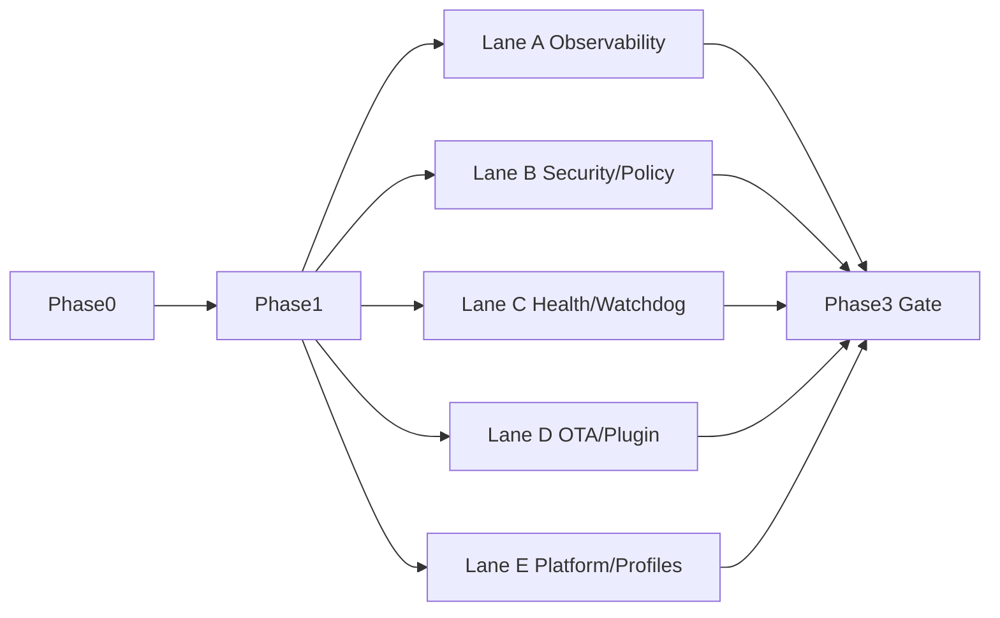

# DASALL Infrastructure 评审后 TODO 落地实施步骤指引（2026-03-26）

适用范围：
1. docs/todos/DASALL_infrastructure子系统专项TODO.md
2. 12 份 infra 组件专项 TODO
3. docs/todos/DASALL_platform_linux组件专项TODO.md
4. docs/todos/DASALL_profiles子系统专项TODO.md

目标：
1. 将评审结论转为可执行实施顺序
2. 明确依赖链、关键路径、并行泳道
3. 保证每个落地任务均满足三件套（代码目标+测试目标+验收命令）

执行原则：
1. 先解阻再实现
2. 先接口与对象冻结，再业务闭环
3. 先 unit/contract，后 integration/failure/profile
4. 任一 Phase 退出条件未满足，不得推进下一 Phase

---

## 1. 全局入口任务（新增）

以下 4 项为本轮新增“跨组件解阻”任务，必须先入库：

| TODO ID | 状态 | 任务描述 | 前置依赖 | 代码目标 | 测试目标 | 验收命令 | 优先级 |
|---|---|---|---|---|---|---|---|
| INF-PLAT-INT-001 | Not Started | 顶层接入 integration 子目录与标签规范 | 无 | tests/CMakeLists.txt 新增 add_subdirectory(integration) 与标签约定；docs/development/InfraIntegrationTopology.md 作为 SSOT | ctest -N 可发现 integration 用例 | cmake -S . -B build-ci -G Ninja && ctest --test-dir build-ci -N | P0 |
| INF-NAME-001 | Not Started | 统一 tracer/tracing 命名与引用 | 无 | docs/architecture 与 docs/todos 命名统一回链 | 命名扫描无冲突 | rg -n "tracer|tracing" docs/architecture docs/todos | P1 |
| INF-CONCUR-001 | Not Started | 冻结并发背压与锁顺序规范 | INF-PLAT-INT-001 | 新增并发策略规范文档并被组件引用 | 并发规范检查清单可执行 | rg -n "overflow_policy|lock order|backpressure" docs | P1 |
| INF-GATE-UNIFY-001 | Not Started | 建立 infra 统一 gate 脚本 | INF-PLAT-INT-001 | scripts/ci/infra_gate.sh 统一触发 unit/contract/integration/failure | gate 输出分类结果并可重复 | bash scripts/ci/infra_gate.sh | P1 |

---

## 2. Phase 总览

| Phase | 目标 | 输入条件 | 输出/退出条件 | 关键任务 | 并行任务 |
|---|---|---|---|---|---|
| 0 阻塞清理 | 清除全局阻塞 | 当前 15 份 TODO 基线存在 | integration 顶层接线、命名统一、并发规范冻结 | INF-PLAT-INT-001 | INF-NAME-001, INF-CONCUR-001, INF-GATE-UNIFY-001 |
| 1 基础支撑 | 接口与对象冻结 | Phase 0 完成 | infra/platform/profiles 核心接口与对象可编译，unit/contract 发现性通过 | INF-TODO-001~012 | 各组件类型定义与接口骨架并行 |
| 2 核心链路 | 打通关键功能闭环 | Phase 1 完成 | secret/policy/diagnostics/watchdog/ota 主链路可跑 unit/contract，部分 integration 可执行 | 组件 M2/M3 任务 | audit/logging/metrics/tracing 并行 |
| 3 增强收口 | 完成集成门禁和证据收口 | Phase 2 完成 | integration/failure/profile gate 可执行且有证据 | 各组件“回写质量门”任务 | 压测与灰度并行 |

---

## 3. 关键路径与并行泳道

### 3.1 Critical Path

1. INF-PLAT-INT-001
2. INF-TODO-001~012（接口/对象/构建/测试入口）
3. Secret + Policy + OTA + Watchdog 主链路（依赖最多）
4. integration/failure/profile 全门禁执行
5. 证据回写与准入复核

### 3.2 Parallel Lanes

1. Lane A（可观测）：audit/logging/metrics/tracing
2. Lane B（安全与策略）：secret/policy
3. Lane C（健康与运行保障）：diagnostics/health/watchdog
4. Lane D（升级与扩展）：ota/plugin
5. Lane E（基础支撑）：platform_linux/profiles

### 3.3 依赖图

---

## 4. Phase 0 实施步骤（阻塞清理）

### 4.1 步骤清单

| 步骤 ID | 任务 | 代码目标 | 测试目标 | 验收命令 | 完成判定 |
|---|---|---|---|---|---|
| P0-S1 | 执行 INF-PLAT-INT-001 | 修改 tests/CMakeLists.txt 接入 integration 子目录 | ctest -N 可发现 integration 用例 | cmake -S . -B build-ci -G Ninja && ctest --test-dir build-ci -N | 能看到 integration 用例列表 |
| P0-S2 | 执行 INF-NAME-001 | 统一 tracer/tracing 命名 | 文档扫描无冲突 | rg -n "tracer|tracing" docs/architecture docs/todos | 命名一致且追溯不丢失 |
| P0-S3 | 执行 INF-CONCUR-001 | 固化并发策略文档 | 组件 TODO 可引用策略条目 | rg -n "overflow_policy|lock order" docs | 可被引用并通过评审 |
| P0-S4 | 执行 INF-GATE-UNIFY-001 | 新增统一 gate 脚本 | gate 能分类执行四类测试 | bash scripts/ci/infra_gate.sh | 输出含 unit/contract/integration/failure |

### 4.2 Phase 0 退出条件

1. tests 顶层 integration 接线完成
2. tracer/tracing 命名统一
3. 并发规范文档冻结并被组件引用
4. 统一 gate 脚本可执行

---

## 5. Phase 1 实施步骤（基础支撑）

### 5.1 子系统基础任务

| 任务组 | 必做 TODO | 代码目标 | 测试目标 | 验收命令 |
|---|---|---|---|---|
| 基础对象冻结 | INF-TODO-001/003/004/007 | infra/include 下对象头文件落盘 | 对象字段与约束单测 | cmake --build build-ci && ctest --test-dir build-ci -L unit |
| 接口冻结 | INF-TODO-002/005/006/008 | IInfrastructureService/ILogger/IAuditLogger/IHealthMonitor | 接口编译测试 + 边界测试 | cmake --build build-ci --target dasall_infra && ctest --test-dir build-ci -L "unit|contract" |
| 错误与构建 | INF-TODO-009/010 | 私有错误码域 + infra 构建入图 | 错误映射 contract 测试 | ctest --test-dir build-ci -L contract |
| 测试入口 | INF-TODO-011/012 | unit/contract 注册 | 发现性 + 执行性 | ctest --test-dir build-ci -N && ctest --test-dir build-ci -L "unit|contract" |

### 5.2 平台与 profiles 并行任务

| 任务组 | 代码目标 | 测试目标 | 验收命令 |
|---|---|---|---|
| platform_linux | IThread/ITimer/IQueue/IFileSystem/INetwork/IIPC 抽象与 linux 入口骨架 | 平台接口编译与基础单测 | cmake --build build-ci --target dasall_platform |
| profiles | 各 profile.cmake/runtime_policy.yaml 从占位转最小可执行基线 | profile 兼容性与覆盖次序验证 | ctest --test-dir build-ci -L "unit|contract" |

### 5.3 Phase 1 退出条件

1. infra/platform/profiles 核心接口和对象可编译
2. unit/contract 注册可发现且可执行
3. infra 不再是 placeholder-only 唯一入口

---

## 6. Phase 2 实施步骤（核心链路）

### 6.1 组件优先级

1. P0 组件：secret、ota、watchdog、audit、diagnostics、policy
2. P1 组件：logging、metrics、tracing、health、plugin

### 6.2 组件实施模板（统一三件套）

| 组件 | 代码目标 | 测试目标 | 验收命令 |
|---|---|---|---|
| secret | ISecretManager + SecretTypes + backend 骨架 + zeroize | SecretTypeBoundaryTest/SecretBackendAdapterTest/SecretZeroizeTest | ctest --test-dir build-ci -R "SecretTypeBoundaryTest|SecretBackendAdapterTest|SecretZeroizeTest" |
| ota | OTATypes + IOTAManager + Precheck/Verifier/Rollback 骨架 | OTAPrecheckServiceTest/OTAPackageVerifierTest/OTARollbackControllerTest | ctest --test-dir build-ci -R "OTAPrecheckServiceTest|OTAPackageVerifierTest|OTARollbackControllerTest" |
| watchdog | IWatchdogService + Registry/Policy/Event/Audit 骨架 | HeartbeatRegistryTest/TimeoutPolicyTest/WatchdogTimeoutFlowIntegrationTest | ctest --test-dir build-ci -R "HeartbeatRegistryTest|TimeoutPolicyTest|WatchdogTimeoutFlowIntegrationTest" |
| audit | IAuditLogger + AuditPipeline/Fallback/Service | AuditTypesTest/AuditServiceFallbackTest/AuditBoundaryContractTest | ctest --test-dir build-ci -R "AuditTypesTest|AuditServiceFallbackTest|AuditBoundaryContractTest" |
| policy | PolicyTypes + ISecurityPolicyManager + Snapshot/Manager 骨架 | PolicySnapshotCompatibilityTest/PolicyDecisionBoundaryTest | ctest --test-dir build-ci -R "PolicySnapshotCompatibilityTest|PolicyDecisionBoundaryTest" |
| diagnostics | IDiagnosticsService + Snapshot/Export 骨架 | DiagnosticsSnapshotExportTest/InfraDiagnosticsSmokeTest | ctest --test-dir build-ci -R "DiagnosticsSnapshotExportTest|InfraDiagnosticsSmokeTest" |

### 6.3 Blocked 转换规则

1. 任一 Blocked 任务必须先满足“解阻条件”列，方可从 Blocked -> Not Started。
2. 解阻后第一步必须执行最小编译或最小测试，不得直接标记 Done。
3. 若解阻依赖跨组件任务，需在组件 TODO 和子系统 TODO 双回链。

### 6.4 Phase 2 退出条件

1. 关键组件主链至少通过 unit+contract
2. 组件关键失败路径具备可观测输出
3. integration 任务从“不可发现”转为“可发现、可执行（允许部分失败待修）”

---

## 7. Phase 3 实施步骤（增强与收口）

### 7.1 重点任务

| 步骤 ID | 任务 | 代码目标 | 测试目标 | 验收命令 | 完成判定 |
|---|---|---|---|---|---|
| P3-S1 | 组件 integration/failure 完整接线 | tests/integration/infra/* 全量注册 | 集成链路可执行 | ctest --test-dir build-ci -L integration | 用例可发现且可运行 |
| P3-S2 | profile 差异回归 | profiles 与组件配置联动验证 | profile consistency 测试 | ctest --test-dir build-ci -R "Profile|Compatibility" | 不同 profile 行为符合预期 |
| P3-S3 | 统一 gate 收口 | 执行 infra_gate 脚本并归档结果 | 四类测试结果可追溯 | bash scripts/ci/infra_gate.sh | gate 结果可复现 |
| P3-S4 | 文档证据回写 | 更新各组件 TODO 的 gate 与阻塞变化 | 文档与命令结果一致 | rg -n "Gate|阻塞|回退" docs/todos/DASALL_infrastructure*专项TODO.md | 每个 gate 有结论与命令证据 |

### 7.2 Phase 3 退出条件

1. 关键路径组件 integration/failure 可执行
2. gate 脚本可重复执行
3. 所有关键阻塞项状态变化有证据回写
4. 满足准入门槛：
- 无 P0 未闭环
- Design->Component->TODO->Build/Test 可追溯
- TODO 三件套完整率 >=95%
- 关键路径命令集可执行

---

## 8. 责任矩阵

| 责任域 | 负责人建议 | 主要职责 |
|---|---|---|
| Infra 架构组 | 架构 owner | Phase Gate 判定、边界一致性、命名一致性 |
| 组件负责人 | 各组件 maintainer | 执行组件任务、解阻回链、测试落地 |
| 平台组 | platform owner | 时钟/线程/队列等抽象冻结，支撑并发模型 |
| 测试平台组 | test owner | tests 顶层接线、标签规范、统一 gate |
| CI 组 | devops owner | gate 脚本接入流水线、报告归档 |

---

## 9. 每日执行节奏（建议）

1. 每日站会前：更新 Blocked 变化与解阻证据
2. 每日主执行：1 条关键路径任务 + 1 条并行泳道任务
3. 每日收尾：执行最小验收命令并回写 TODO 状态
4. 每周里程碑：按 Phase 退出条件做一次准入复核

---

## 10. 最终交付清单

1. 代码交付：接口/对象/实现骨架/测试注册
2. 测试交付：unit/contract/integration/failure 可执行证据
3. 文档交付：组件 TODO 与子系统 TODO 回写完整
4. 门禁交付：统一 gate 脚本与结果归档

本指引的执行口径：
1. 不追求一次性“全绿”，追求“按 Phase 稳定收敛”。
2. 不允许越过解阻条件推进 Blocked 任务。
3. 每个 Done 必须有命令证据可复查。
