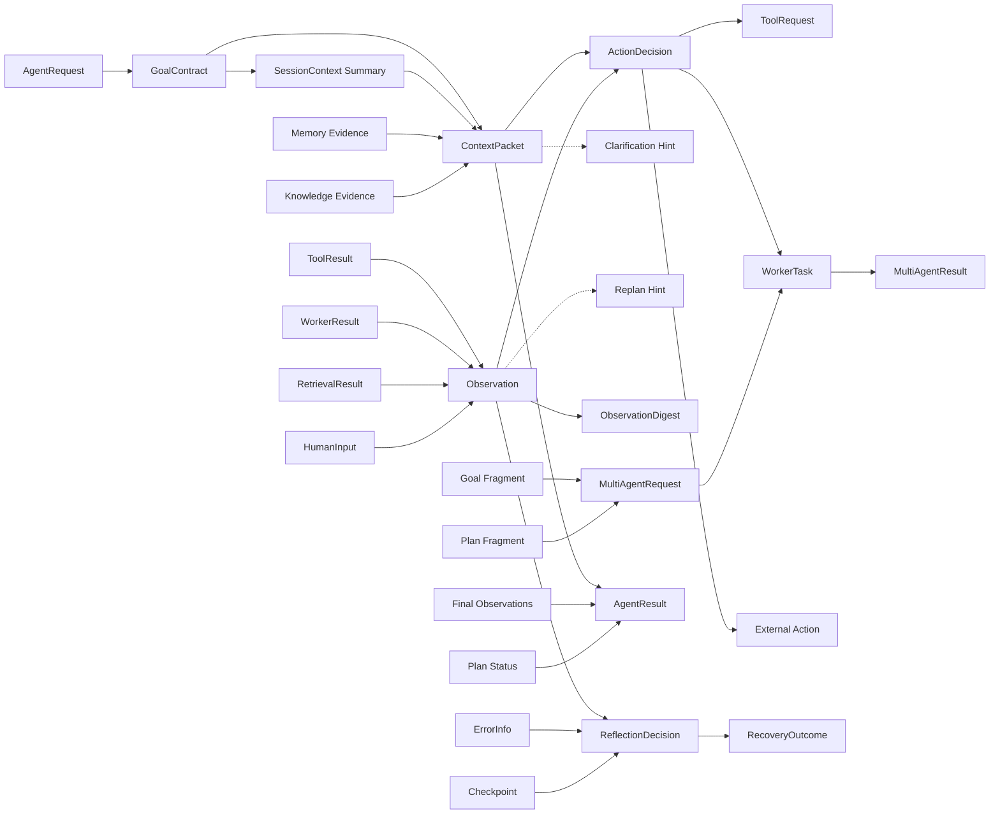

# WP01-T005 顶层对象流图 v1

最近更新时间：2026-03-13
任务状态：In Review
任务编号：WP01-T005
上游输入：WP01-T003 术语定义表 v1，WP01-T004 术语消费者矩阵

## 1. 任务范围

本交付仅完成“顶层对象流图初稿”，不包含：

1. 图中节点是否属于 contracts 的稳定性标注（WP01-T006）。
2. 内部对象与禁止外溢对象标记（WP01-T007）。
3. 边界说明正文（WP01-T008）。

## 2. 建模依据

1. 计划文档第 7 节规定的八条顶层链路。
2. T003 的核心术语定义。
3. T004 的术语层级与主要消费者归类。
4. ADR-006、ADR-007、ADR-008 的边界裁定。

## 3. 顶层对象流图（Mermaid）

## 4. 八条链路覆盖核对

| 链路 | 目标表达 | 图中路径 |
|---|---|---|
| 入口链路 | AgentRequest -> GoalContract -> SessionContext 摘要 | AgentRequest -> GoalContract -> SessionContext Summary |
| 上下文链路 | GoalContract + Session/Memory/Knowledge -> ContextPacket | GoalContract + SessionContext Summary + Memory Evidence + Knowledge Evidence -> ContextPacket |
| 决策链路 | ContextPacket + Observation -> ActionDecision / Clarification / Replan Hint | ContextPacket + Observation -> ActionDecision；ContextPacket -> Clarification Hint；Observation -> Replan Hint |
| 执行链路 | ActionDecision -> ToolRequest / WorkerTask / External Action | ActionDecision -> ToolRequest / WorkerTask / External Action |
| 观测链路 | ToolResult / WorkerResult / RetrievalResult / HumanInput -> Observation -> ObservationDigest | ToolResult/WorkerResult/RetrievalResult/HumanInput -> Observation -> ObservationDigest |
| 恢复链路 | Observation + ErrorInfo + Checkpoint -> ReflectionDecision -> RecoveryOutcome | Observation + ErrorInfo + Checkpoint -> ReflectionDecision -> RecoveryOutcome |
| 输出链路 | ContextPacket + Final Observations + Plan Status -> AgentResult | ContextPacket + Final Observations + Plan Status -> AgentResult |
| 协同链路 | Goal Fragment + Plan Fragment -> MultiAgentRequest -> WorkerTask -> MultiAgentResult | Goal Fragment + Plan Fragment -> MultiAgentRequest -> WorkerTask -> MultiAgentResult |

## 5. 图面约束说明

1. 图中仅表达对象级流转关系，不表达线程、时序细节和重试策略参数。
2. Clarification Hint 与 Replan Hint 在本图仅作为决策侧分支信号，不替代主对象链。
3. WorkerTask 在执行链路与协同链路复用，体现其“执行单元”角色，不表达全局主控语义。
4. RecoveryOutcome 仅挂在恢复链路输出，不直接替代 AgentResult。

## 6. 可追溯依据（代表性）

1. 八条链路原始定义来自实施计划第 7 节。
2. ContextPacket 与 Prompt 装配分层来自 ADR-006。
3. ReflectionDecision 与 RecoveryOutcome 分层来自 ADR-007。
4. MultiAgentRequest、MultiAgentResult、WorkerTask 分层来自 ADR-008。

## 7. 完成判定核对

对应 WP01-T005 完成判定“覆盖入口、上下文、决策、执行、观测、恢复、输出、协同八条链路”：

1. 八条链路均已在图中给出明确路径。
2. 每条链路均已在核对表中逐项映射。
3. 图面保持对象级抽象，可直接供 T006 进行稳定对象标注。

## 8. 风险与回退策略

### 8.1 风险

1. SessionContext Summary、Final Observations、Plan Status 当前作为桥接节点，后续可能出现命名统一讨论。
2. Clarification Hint 与 Replan Hint 尚未在术语主清单冻结为对象，可能在后续任务中调整表现形式。
3. 协同链路与执行链路复用 WorkerTask，评审中可能出现“同节点多语境”理解偏差。

### 8.2 回退策略

1. 若评审要求严格限定术语主清单，可把桥接节点改为注释节点，不作为对象节点。
2. 若评审要求只保留已冻结术语，移除 Hint 分支并保留 ActionDecision 主分支。
3. 若评审对复用节点有歧义，可拆分为 WorkerTask(Execution) 与 WorkerTask(Collaboration) 视图别名，不改语义主名。

## 9. 交付物映射

1. 本文件即 WP01-T005 交付物“对象流图 v1”。
2. 可直接作为 WP01-T006 与 WP01-T007 输入。
