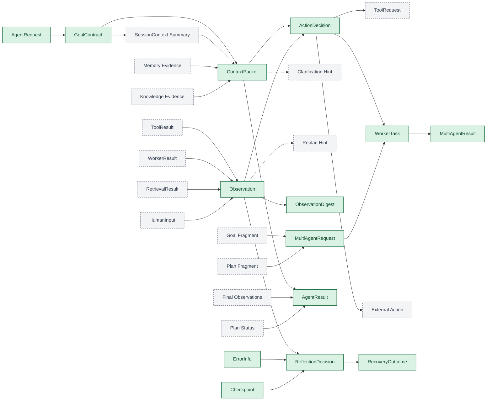

# WP01-T006 稳定对象标注版流图

最近更新时间：2026-03-13
任务状态：In Review
任务编号：WP01-T006
上游输入：WP01-T005 顶层对象流图 v1，WP01-T004 术语消费者矩阵

## 1. 任务范围

本交付仅完成“标出对象流图中的跨模块稳定对象”，不包含：

1. 内部对象与禁止外溢对象的禁止性判断（WP01-T007）。
2. contracts 边界说明正文（WP01-T008）。
3. ADR 字段级一致性核对（WP01-T009 至 T011）。

## 2. 标注规则

1. `Stable`：已在 T004 中被判定为“跨模块稳定对象”，属于 contracts 共享语义对象。
2. `Non-Contract`：不属于当前 contracts 稳定对象集合，可能是桥接节点、输入来源、外部动作或提示性分支。
3. 本任务只回答“是否属于 contracts”，不回答“是否必须禁止外溢”；后者留给 T007。
4. 若对象名未进入 T003/T004 主术语集合，则默认按 `Non-Contract` 处理，除非已有 ADR 明确要求进入 contracts。

## 3. 稳定对象标注版流图（Mermaid）

## 4. 节点归属判定表

| 节点 | 判定 | 说明 |
|---|---|---|
| AgentRequest | Stable | T004 已归类为跨模块稳定对象 |
| GoalContract | Stable | T004 已归类为跨模块稳定对象 |
| SessionContext Summary | Non-Contract | 当前仅作为入口到上下文的桥接摘要节点，未进入核心术语主清单 |
| ContextPacket | Stable | T004 已归类为跨模块稳定对象 |
| Memory Evidence | Non-Contract | 当前仅表示上下文输入来源，不是已冻结 contracts 对象 |
| Knowledge Evidence | Non-Contract | 当前仅表示上下文输入来源，不是已冻结 contracts 对象 |
| ActionDecision | Stable | T004 已归类为跨模块稳定对象 |
| Observation | Stable | T004 已归类为跨模块稳定对象 |
| Clarification Hint | Non-Contract | 当前仅为决策侧提示分支，未进入核心术语主清单 |
| Replan Hint | Non-Contract | 当前仅为决策侧提示分支，未进入核心术语主清单 |
| ToolRequest | Non-Contract | 尚未在 WP01 已完成任务中冻结为稳定对象，留待后续子域细化 |
| WorkerTask | Stable | T004 已归类为跨模块稳定对象 |
| External Action | Non-Contract | 外部执行动作语义，不是当前 contracts 核心对象 |
| ToolResult | Non-Contract | 尚未在 WP01 已完成任务中冻结为稳定对象，留待后续子域细化 |
| WorkerResult | Non-Contract | 当前为协同执行结果来源节点，不是已冻结主对象 |
| RetrievalResult | Non-Contract | 当前为知识检索结果来源节点，不是已冻结主对象 |
| HumanInput | Non-Contract | 当前为输入来源节点，不是单独冻结的 contracts 对象 |
| ObservationDigest | Stable | T004 已归类为跨模块稳定对象 |
| ErrorInfo | Stable | T004 已归类为跨模块稳定对象 |
| Checkpoint | Stable | T004 已归类为跨模块稳定对象 |
| ReflectionDecision | Stable | T004 已归类为跨模块稳定对象 |
| RecoveryOutcome | Stable | T004 已归类为跨模块稳定对象 |
| AgentResult | Stable | T004 已归类为跨模块稳定对象 |
| Final Observations | Non-Contract | 当前仅为输出阶段桥接节点，不是已冻结独立对象 |
| Plan Status | Non-Contract | 当前仅为输出阶段桥接节点，不是已冻结独立对象 |
| Goal Fragment | Non-Contract | 当前为协同链路输入片段，不是已冻结独立对象 |
| Plan Fragment | Non-Contract | 当前为协同链路输入片段，不是已冻结独立对象 |
| MultiAgentRequest | Stable | T004 已归类为跨模块稳定对象 |
| MultiAgentResult | Stable | T004 已归类为跨模块稳定对象 |

## 5. 汇总判定

1. 图中 `Stable` 节点：14 个。
2. 图中 `Non-Contract` 节点：15 个。
3. 已满足 T006 完成判定：图中每个节点都能判断是否属于 contracts。

## 6. 可追溯依据（代表性）

1. T005 提供完整对象流图基础视图。
2. T004 提供“跨模块稳定对象 / 模块内部术语”归类依据。
3. 计划文档第 7 节提供八条顶层链路骨架。
4. ADR-006、ADR-007、ADR-008 提供边界对象进入 contracts 的直接依据。

## 7. 风险与回退策略

### 7.1 风险

1. ToolRequest 与 ToolResult 在后续 WP-05 很可能进入 contracts，当前判定为 `Non-Contract` 只代表在 WP01 阶段尚未冻结。
2. Goal Fragment、Plan Fragment、Final Observations、Plan Status 这些桥接节点在后续评审中可能被替换为更正式的对象名。
3. WorkerResult、RetrievalResult 等来源节点可能在后续子域细化时拆解为更具体的 contracts 对象。

### 7.2 回退策略

1. 若后续工作包冻结了新的稳定对象，本图保留为 v1，并增量升级为 v2，不回写改变本阶段判断依据。
2. 若评审要求仅展示已冻结主术语，可移除全部 `Non-Contract` 桥接节点并保留稳定主链。
3. 若某个节点归属存在争议，优先回到 T004 的 contracts 判定规则重新裁定。

## 8. 交付物映射

1. 本文件即 WP01-T006 交付物“稳定对象标注版流图”。
2. 可直接作为 WP01-T007 与 WP01-T008 输入。