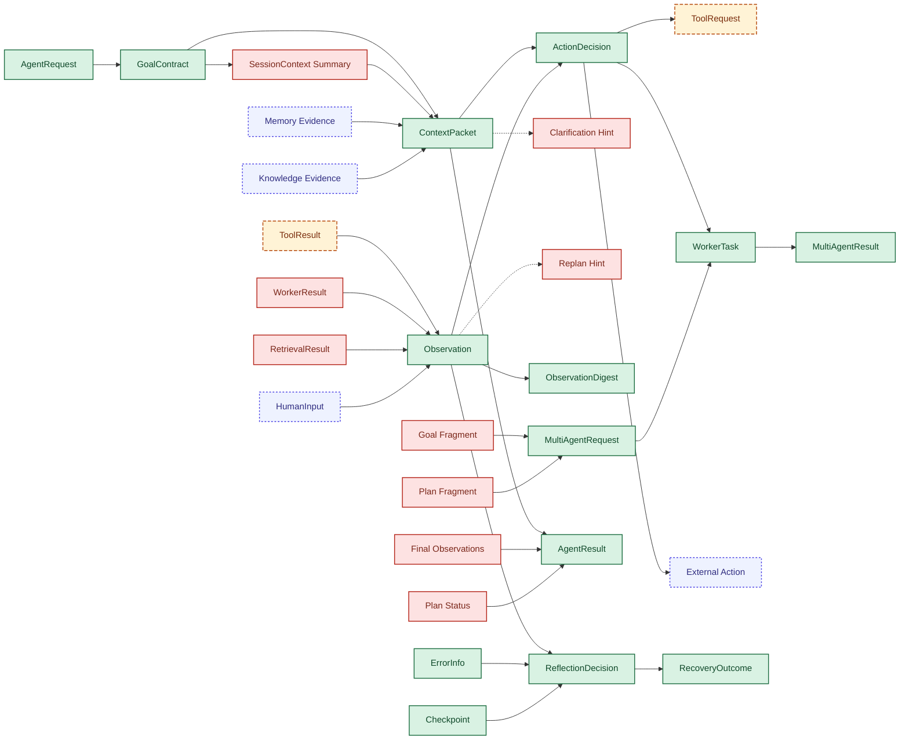

# WP01-T007 内部对象边界清单

最近更新时间：2026-03-13
任务状态：In Review
任务编号：WP01-T007
上游输入：WP01-T006 稳定对象标注版流图，WP01-T004 术语消费者矩阵，ADR-006/007/008

## 1. 任务范围

本交付完成“标记对象流图中的内部对象和禁止外溢对象”，回答以下两个问题：

1. T006 中的 `Non-Contract` 节点里，哪些属于模块内部对象或桥接节点，不能直接进入 contracts。
2. 哪些节点虽然当前不属于顶层 contracts，但只是阶段性不外溢，需留待后续子域工作包细化。

本交付不包含：

1. contracts 边界说明正文（WP01-T008）。
2. ADR 字段级约束核对（WP01-T009 至 T011）。
3. 对后续 WP-05 子域对象是否冻结的最终结论。

## 2. 判定规则

1. `Internal-Blocked`：模块内部对象、桥接摘要、原始来源结果或提示性分支，只服务某个模块或某一段流程折叠，不能以当前形态进入 contracts。
2. `Deferred`：当前不属于 WP01 的顶层稳定对象，但存在在后续子域工作包中被正式对象化的可能；因此“本阶段不得外溢”，但不下永久禁止结论。
3. `External/Action`：外部输入来源或外部动作本身，不是共享契约对象，必须先被折叠进稳定对象后才能跨模块流通。
4. 若一个节点不能满足“跨模块共享语义稳定、不会暴露下层内部结构、可被多个模块直接消费”三个条件之一，则不得以该节点名义进入 contracts。

## 3. T007 标记版流图（Mermaid）

## 4. 节点边界判定表

| 节点 | T007 判定 | 是否禁止外溢 | 说明 |
|---|---|---|---|
| SessionContext Summary | Internal-Blocked | 是 | 仅为入口链到上下文链的桥接摘要，不是稳定共享对象；若直接外溢，会把 session 内部摘要形态固化进 contracts。 |
| Memory Evidence | External/Action | 是 | 表示 memory 侧输入来源而非稳定对象；跨模块应通过 ContextPacket 或 ObservationDigest 暴露，而不是暴露原始 evidence 占位节点。 |
| Knowledge Evidence | External/Action | 是 | 表示 knowledge 输入来源而非稳定对象；应先折叠为可共享语义，再进入 contracts。 |
| Clarification Hint | Internal-Blocked | 是 | 属于认知侧提示性分支信号，不是独立共享契约；若外溢会把认知内部提示机制提升为系统主对象。 |
| Replan Hint | Internal-Blocked | 是 | 属于认知侧计划修补提示，不具备独立稳定对象地位；应作为 ReflectionDecision 等稳定对象的附属语义承载。 |
| ToolRequest | Deferred | 本阶段是 | 当前只是在顶层图中的粗粒度执行节点，尚未经过 tool 子域冻结；在 WP-05 前不得进入顶层 contracts，但后续可被正式对象化。 |
| External Action | External/Action | 是 | 表示系统对外触发的动作，不是共享数据契约；contracts 只承载动作意图或结果，不承载“外部动作”这个占位节点。 |
| ToolResult | Deferred | 本阶段是 | 当前只是在顶层图中的粗粒度结果节点，尚未经过 tool 子域冻结；在 WP-05 前不得进入顶层 contracts，但后续可被正式对象化。 |
| WorkerResult | Internal-Blocked | 是 | 属于协同子域原始执行结果来源；跨模块流通前应被折叠进 Observation 或 MultiAgentResult，而不是以裸结果节点外溢。 |
| RetrievalResult | Internal-Blocked | 是 | 属于知识检索原始结果来源；对外应暴露为证据摘要或 Observation，而不是暴露检索内部结果结构。 |
| HumanInput | External/Action | 是 | 表示外部输入来源，不是共享 contracts 对象；进入系统后应被折叠为 AgentRequest 补充信息、Observation 或 Clarification 流程语义。 |
| Final Observations | Internal-Blocked | 是 | 仅为输出阶段桥接聚合节点，不是独立冻结对象；若外溢会把结果组装过程的中间态固化。 |
| Plan Status | Internal-Blocked | 是 | 仅为输出阶段或运行态折叠节点，不是当前主术语对象；若需要共享，应后续以正式状态对象定义，而不是沿用图中占位词。 |
| Goal Fragment | Internal-Blocked | 是 | 属于协同拆分时的子目标桥接片段，应被吸收到 MultiAgentRequest 或 WorkerTask 中，而非独立成为顶层 contracts 对象。 |
| Plan Fragment | Internal-Blocked | 是 | 属于协同拆分时的计划片段桥接节点，应被吸收到 MultiAgentRequest 或 WorkerTask 中，而非独立成为顶层 contracts 对象。 |

## 5. 汇总分组

### 5.1 强禁止外溢对象

以下 13 个节点应视为“不能以当前形态进入 contracts”的对象或占位节点：

1. SessionContext Summary
2. Memory Evidence
3. Knowledge Evidence
4. Clarification Hint
5. Replan Hint
6. External Action
7. WorkerResult
8. RetrievalResult
9. HumanInput
10. Final Observations
11. Plan Status
12. Goal Fragment
13. Plan Fragment

### 5.2 阶段性不外溢对象

以下 2 个节点在 WP01 阶段不得外溢，但不作永久禁止结论：

1. ToolRequest
2. ToolResult

它们是否进入 contracts，需等待 WP-05 的 tool 子域对象细化后，以正式字段边界重新裁定。

## 6. 判定理由归纳

1. 桥接摘要类节点不得外溢：SessionContext Summary、Final Observations、Plan Status、Goal Fragment、Plan Fragment 都只服务图面连接，不具备稳定共享对象语义。
2. 原始来源类节点不得外溢：Memory Evidence、Knowledge Evidence、WorkerResult、RetrievalResult、HumanInput 都是来源侧或执行侧原始材料，应先折叠进稳定 contracts 对象。
3. 提示信号类节点不得外溢：Clarification Hint、Replan Hint 属于认知建议信号，若共享应内嵌于稳定决策对象，不应独立漂移成顶层对象。
4. 外部动作占位不得外溢：External Action 代表副作用执行，不是共享数据契约。
5. 子域待冻结对象暂不外溢：ToolRequest、ToolResult 尚未完成 tool 子域边界冻结，当前不能用顶层图占位词直接进入 contracts。

## 7. 对 T008 的直接输入

T008 可直接复用以下规则：

1. “跨模块稳定契约”必须是多个模块直接消费的共享语义对象，而不是桥接、来源、提示或外部动作占位。
2. “模块内部结构”不仅包括实现组件名，也包括图面中的中间摘要节点、片段节点和原始来源节点。
3. 对未来可能进入 contracts 的对象，应标记为“阶段性不外溢”，避免把“当前未冻结”误判为“永久禁止”。

## 8. 风险与回退策略

### 8.1 风险

1. ToolRequest、ToolResult 在后续 WP-05 很可能进入 contracts，若评审忽略“阶段性不外溢”与“永久禁止”的区别，容易形成误判。
2. HumanInput、Memory Evidence、Knowledge Evidence 在不同图法中可能被画成对象节点或注释节点，存在表示法争议。
3. Plan Status 若在后续被对象化，可能需要改名为更正式的状态对象名。

### 8.2 回退策略

1. 若后续子域工作包正式冻结 ToolRequest、ToolResult，本文件保留为 v1，并以增量版本改写其判定为 stable/deferred resolved。
2. 若评审要求顶层图只保留 contracts 主对象，可在 T005/T006/T007 的下一版中移除全部 blocked/external 节点，仅保留稳定链路。
3. 若桥接节点需要保留，可改为图注或边标签，而不再作为对象节点出现。

## 9. 交付物映射

1. 本文件即 WP01-T007 交付物“内部对象边界清单”。
2. 可直接作为 WP01-T008 输入。