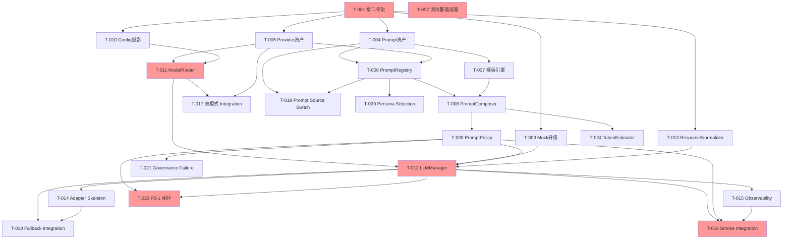

# DASALL LLM 子系统 TODO 落地实施步骤指引

版本：v1.0
日期：2026-04-10
来源：DASALL_llm子系统详细设计.md v1.0 + 设计评审报告 2026-04-10
适用模块：llm/

---

## 导言

本文档基于 DASALL_llm子系统详细设计.md §7.1 Design→Build 映射表，结合设计评审报告的发现，将 LLM-D1~D10 拆分为可执行原子任务。每个任务均包含代码目标、测试目标、验收命令三件套。

评审报告已识别 §12.2 LLM-TODO 列表三件套完整率仅 14.3%，本文档是其替代品。

---

## Phase 0：阻塞清理与测试基础设施

### T-001：建立 llm/include 公共接口骨架（Design: LLM-D1）

| 属性 | 内容 |
|---|---|
| **任务描述** | 在 llm/include 下新增 ILLMAdapter.h、ILLMManager.h、IPromptRegistry.h、IPromptComposer.h、IPromptPolicy.h 五个公共接口头文件，以及 LLMGenerateRequest.h、LLMManagerResult.h 两个 module-local 公共对象。接口签名严格遵循详细设计 §6.5。 |
| **前置依赖** | 无（contracts 已冻结） |
| **代码目标** | `llm/include/ILLMAdapter.h`、`llm/include/ILLMManager.h`、`llm/include/prompt/IPromptRegistry.h`、`llm/include/prompt/IPromptComposer.h`、`llm/include/prompt/IPromptPolicy.h`、`llm/include/LLMGenerateRequest.h`、`llm/include/LLMManagerResult.h`、`llm/include/prompt/PromptQuery.h`、`llm/include/prompt/PromptPolicyDecision.h`、`llm/include/route/ResolvedModelRoute.h`、`llm/include/route/ModelSelectionHint.h`、`llm/include/stream/StreamSessionRef.h`；更新 `llm/CMakeLists.txt` 将 include 目录加入公共头路径 |
| **测试目标** | `tests/unit/llm/InterfaceSurfaceTest.cpp`：验证所有公共接口可被包含、纯虚析构函数存在、module-local 对象默认构造与字段存取 |
| **验收命令** | `cmake --build build-ci --target dasall_llm && cmake --build build-ci --target dasall_unit_tests && ctest --test-dir build-ci -R LLMInterfaceSurfaceTest --output-on-failure` |
| **优先级** | Critical |

### T-002：建立测试基础设施

| 属性 | 内容 |
|---|---|
| **任务描述** | 激活 tests/unit/llm/CMakeLists.txt（替换占位注释）；创建 tests/integration/llm/ 目录与 CMakeLists.txt；确保两者被 tests/CMakeLists.txt 注册到 dasall_unit_tests 和 dasall_integration_tests 目标。 |
| **前置依赖** | 无 |
| **代码目标** | `tests/unit/llm/CMakeLists.txt`（激活）；`tests/integration/llm/CMakeLists.txt`（新建）；`tests/CMakeLists.txt`（确认 add_subdirectory） |
| **测试目标** | ctest -N 可发现 llm 占位测试 |
| **验收命令** | `cmake --build build-ci && ctest --test-dir build-ci -N \| grep llm` |
| **优先级** | Critical |

### T-003：升级 MockLLMAdapter 为生产接口 Mock

| 属性 | 内容 |
|---|---|
| **任务描述** | 将 tests/mocks/include/MockLLMAdapter.h 从基于字符串的脚手架 mock 升级为继承 ILLMAdapter 的生产接口 mock。实现 init()、generate()、stream_generate()、health_check() 四个虚函数，支持可编程的返回值和调用计数。 |
| **前置依赖** | T-001（ILLMAdapter 接口存在） |
| **代码目标** | `tests/mocks/include/MockLLMAdapter.h` |
| **测试目标** | `tests/unit/llm/MockLLMAdapterSurfaceTest.cpp`：验证 mock 可注入、generate() 返回可编程结果、health_check() 工作正常 |
| **验收命令** | `cmake --build build-ci --target dasall_unit_tests && ctest --test-dir build-ci -R MockLLMAdapterSurfaceTest --output-on-failure` |
| **优先级** | High |

---

## Phase 1：Prompt 资产与 Provider 资产

### T-004：Prompt 资产包规范与 PromptAssetRepository 解析器（Design: LLM-D4 拆分 1/3）

| 属性 | 内容 |
|---|---|
| **任务描述** | 定义 Prompt 包形态规范：manifest.yaml + system.md + task.md + few_shots/*.md + policy_notes.md。实现 PromptAssetRepository，支持 baseline→deployment→snapshot 三层装载与 hash/source 校验。新增 llm/assets/prompts/ 基线样例。 |
| **前置依赖** | T-001 |
| **代码目标** | `llm/src/prompt/PromptAssetDescriptor.h`（module-local）；`llm/src/prompt/PromptAssetRepository.h`；`llm/src/prompt/PromptAssetRepository.cpp`；`llm/assets/prompts/planner/default/manifest.yaml`、`system.md`、`task.md`（最小基线样例） |
| **测试目标** | `tests/unit/llm/PromptAssetPackageParseTest.cpp`：验证 manifest 解析、Markdown 正文加载、content hash 校验、缺失字段拒绝。`tests/unit/llm/PromptSourceOverlayTest.cpp`：验证三层装载优先级与坏包回退。 |
| **验收命令** | `cmake --build build-ci --target dasall_unit_tests && ctest --test-dir build-ci -R "PromptAsset(PackageParse\|SourceOverlay)Test" --output-on-failure` |
| **优先级** | High |

### T-005：Provider Catalog 资产规范与解析器（Design: LLM-D4 拆分 2/3）

| 属性 | 内容 |
|---|---|
| **任务描述** | 定义 Provider Catalog 包形态：catalog.yaml + provider/manifest.yaml + provider/models.yaml。实现 ProviderCatalogRepository 或等价加载器。冻结 ModelCatalogEntry 的 context_window/pricing/verification_state 等元数据 schema。新增 llm/assets/providers/ 基线样例（含 DeepSeek 双模式模型目录）。 |
| **前置依赖** | T-001 |
| **代码目标** | `llm/include/provider/ProviderDescriptor.h`；`llm/include/provider/ModelCatalogEntry.h`；`llm/src/provider/ProviderCatalogRepository.h`；`llm/src/provider/ProviderCatalogRepository.cpp`；`llm/assets/providers/catalog.yaml`；`llm/assets/providers/deepseek/manifest.yaml`；`llm/assets/providers/deepseek/models.yaml` |
| **测试目标** | `tests/unit/llm/ProviderCatalogParseTest.cpp`：验证 manifest/models 解析、secret ref 留白校验、api family 提取。`tests/unit/llm/ProviderCatalogOverlayTest.cpp`：验证三层合并、回退和拒绝规则。`tests/unit/llm/ProviderModelMetadataParseTest.cpp`：验证 context_window/pricing/effective_at/verification_state 提取。 |
| **验收命令** | `cmake --build build-ci --target dasall_unit_tests && ctest --test-dir build-ci -R "ProviderCatalog(Parse\|Overlay)Test\|ProviderModelMetadataParseTest" --output-on-failure` |
| **优先级** | High |

### T-006：PromptRegistry 选择逻辑（Design: LLM-D4 拆分 3/3）

| 属性 | 内容 |
|---|---|
| **任务描述** | 实现 IPromptRegistry 的 select() 逻辑：按 stage/task_type/language/model_family/scene_id/persona_id 从 PromptAssetRepository 的 catalog 中选定 PromptRelease。选择优先级：显式 prompt_release_id > scene/persona > profile default > 包内 default。定义 PromptRegistryResult 类型。 |
| **前置依赖** | T-004（PromptAssetRepository 可用） |
| **代码目标** | `llm/include/prompt/PromptRegistryResult.h`；`llm/src/prompt/PromptRegistry.cpp` |
| **测试目标** | `tests/unit/llm/PromptRegistrySelectionTest.cpp`：覆盖 stage/scene/persona 命中、版本命中、default fallback。`tests/unit/llm/PromptRegistryTrustSourceTest.cpp`：覆盖 trusted source 过滤、untrusted 拒绝。 |
| **验收命令** | `cmake --build build-ci --target dasall_unit_tests && ctest --test-dir build-ci -R "PromptRegistry(Selection\|TrustSource)Test" --output-on-failure` |
| **优先级** | High |

### T-007：Prompt 模板引擎选型与安全规范（评审新增）

| 属性 | 内容 |
|---|---|
| **任务描述** | 选定 Prompt 模板语法（推荐 Mustache/简化变量替换），定义安全边界：禁止模板中执行代码、禁止外部 URL 引用、对槽位值做转义。编写模板注入防护测试基线。 |
| **前置依赖** | T-004 |
| **代码目标** | `llm/src/prompt/TemplateRenderer.h`；`llm/src/prompt/TemplateRenderer.cpp`（仅变量替换，不引入外部模板库） |
| **测试目标** | `tests/unit/llm/TemplateRendererTest.cpp`：覆盖正常替换、未定义变量处理、注入攻击向量（如 `{{system_instructions}}` 中嵌入恶意内容）、转义规则。 |
| **验收命令** | `cmake --build build-ci --target dasall_unit_tests && ctest --test-dir build-ci -R TemplateRendererTest --output-on-failure` |
| **优先级** | High |

---

## Phase 2：Prompt 治理核心

### T-008：PromptComposer 装配与 over-budget warning（Design: LLM-D5）

| 属性 | 内容 |
|---|---|
| **任务描述** | 实现 IPromptComposer 的 compose()：消费 PromptComposeRequest + PromptRelease，通过 TemplateRenderer 渲染槽位，产出 PromptComposeResult（含 messages、estimated_tokens、composition_warnings）。over-budget 时返回 warning，不自行裁剪语义。 |
| **前置依赖** | T-006（PromptRegistry 可提供 PromptRelease）、T-007（TemplateRenderer 可用） |
| **代码目标** | `llm/src/prompt/PromptComposer.cpp` |
| **测试目标** | `tests/unit/llm/PromptComposerSlotMappingTest.cpp`：验证基础变量替换、few-shot 注入、空槽位处理。`tests/unit/llm/PromptComposerOverBudgetTest.cpp`：验证 estimated_tokens 超过目标模型 context_window 时返回 over-budget warning。 |
| **验收命令** | `cmake --build build-ci --target dasall_unit_tests && ctest --test-dir build-ci -R "PromptComposer(SlotMapping\|OverBudget)Test" --output-on-failure` |
| **优先级** | High |

### T-009：PromptPolicy 发送前治理（Design: LLM-D6）

| 属性 | 内容 |
|---|---|
| **任务描述** | 实现 IPromptPolicy 的 evaluate()：按固定顺序执行 trusted source → allowed_prompt_releases → tool visibility patch → redaction → render budget 五步治理。产出 PromptPolicyDecision（Allow/Deny/OverBudget/RequireRecompose）。定义 PromptPolicyInput 类型。 |
| **前置依赖** | T-008（PromptComposeResult 可用） |
| **代码目标** | `llm/include/prompt/PromptPolicyInput.h`；`llm/src/prompt/PromptPolicy.cpp` |
| **测试目标** | `tests/unit/llm/PromptPolicyAllowlistTest.cpp`：覆盖 allowlist deny、trusted source 缺失 fail-closed、版本不在允许列表。`tests/unit/llm/PromptPolicyToolVisibilityTest.cpp`：覆盖 tool visibility patch、redaction 后长度变化、over-budget 回流。`tests/unit/llm/PromptPolicyProfileDiffTest.cpp`：覆盖同一 prompt 在不同 profile 下的 Allow/Deny 差异。 |
| **验收命令** | `cmake --build build-ci --target dasall_unit_tests && ctest --test-dir build-ci -R "PromptPolicy(Allowlist\|ToolVisibility\|ProfileDiff)Test" --output-on-failure` |
| **优先级** | High |

### T-010：LLMSubsystemConfig 与 profile 投影（Design: LLM-D2）

| 属性 | 内容 |
|---|---|
| **任务描述** | 实现 LLMSubsystemConfig 投影逻辑：从 RuntimePolicySnapshot 中提取 model_profile、prompt_policy、timeout_policy、degrade_policy 并投影为 llm 模块内消费的配置视图。不直接持有 RuntimePolicySnapshot 全对象。补充 prompt/provider asset roots、active scene/persona 等配置键。 |
| **前置依赖** | T-001 |
| **代码目标** | `llm/include/LLMSubsystemConfig.h`；`llm/src/LLMSubsystemConfig.cpp` |
| **测试目标** | `tests/unit/llm/LLMSubsystemConfigProjectionTest.cpp`：验证从 policy snapshot 提取 model routes、prompt allowlist、timeout budget；验证默认值填充；验证 profile 差异。 |
| **验收命令** | `cmake --build build-ci --target dasall_unit_tests && ctest --test-dir build-ci -R LLMSubsystemConfigProjectionTest --output-on-failure` |
| **优先级** | High |

---

## Phase 3：路由与调用核心

### T-011：ModelRouter 与双模式选择（Design: LLM-D3）

| 属性 | 内容 |
|---|---|
| **任务描述** | 实现 ModelRouter：读取 ModelSelectionHint + model_profile + degrade_policy + health snapshot + Provider Catalog，按固定四步算法（候选装配→硬过滤→确定性评分→fallback 展开）生成 ResolvedModelRoute。覆盖 deepseek-chat/deepseek-reasoner 双模式选择。 |
| **前置依赖** | T-005（Provider Catalog 可用）、T-010（profile 投影可用） |
| **代码目标** | `llm/src/route/ModelRouter.h`；`llm/src/route/ModelRouter.cpp` |
| **测试目标** | `tests/unit/llm/ModelRouterPolicyTest.cpp`：覆盖 stage 路由选择、profile 不一致拒绝、空候选集 fail-closed。`tests/unit/llm/ModelRouterFallbackTest.cpp`：覆盖 fallback chain 展开顺序、degrade_policy 限制、exhausted 报告。`tests/unit/llm/ModelRouterReasoningModeSelectionTest.cpp`：覆盖 reasoning 档升级、interactive 降级、工具能力未验证回退 chat、上下文超窗拒绝、budget 限制降级。`tests/unit/llm/ModelRouterStabilityTest.cpp`：覆盖同一输入重复调用的稳定决策。 |
| **验收命令** | `cmake --build build-ci --target dasall_unit_tests && ctest --test-dir build-ci -R "ModelRouter(Policy\|Fallback\|ReasoningModeSelection\|Stability)Test" --output-on-failure` |
| **优先级** | Critical |

### T-012：LLMManager unary 主链路与失败映射（Design: LLM-D7 拆分 1/2）

| 属性 | 内容 |
|---|---|
| **任务描述** | 实现 ILLMManager 的 generate()：串联 ModelRouter→CallExecutor/AdapterRegistry→ResponseNormalizer→observability→fallback。返回 LLMManagerResult。首轮将 CallExecutor 作为 LLMManager 内部 helper 实现（评审建议 P2-1），不独立为组件。 |
| **前置依赖** | T-011（ModelRouter）、T-003（MockLLMAdapter 可注入）、T-009（PromptPolicy 已完成，LLMGenerateRequest 可构造） |
| **代码目标** | `llm/src/LLMManager.cpp`；`llm/src/route/AdapterRegistry.h`；`llm/src/route/AdapterRegistry.cpp`；`llm/src/execution/CallExecutor.h`；`llm/src/execution/CallExecutor.cpp` |
| **测试目标** | `tests/unit/llm/LLMManagerSuccessPathTest.cpp`：验证 unary 成功路径端到端（MockAdapter→ResponseNormalizer→LLMManagerResult）。`tests/unit/llm/LLMManagerFallbackTest.cpp`：验证 primary timeout→fallback success、fallback exhausted。`tests/unit/llm/LLMManagerFailureMappingTest.cpp`：验证 6 类 LLMFailureCategory 正确映射。 |
| **验收命令** | `cmake --build build-ci --target dasall_unit_tests && ctest --test-dir build-ci -R "LLMManager(SuccessPath\|Fallback\|FailureMapping)Test" --output-on-failure` |
| **优先级** | Critical |

### T-013：ResponseNormalizer 与 reasoning_content 剥离（Design: LLM-D7 拆分 2/2）

| 属性 | 内容 |
|---|---|
| **任务描述** | 实现 ResponseNormalizer：将 provider raw result 归一化为 shared LLMResponse（DirectResponse/ToolCallIntent/ClarificationRequest/ReplanSuggestion/Refusal 五类语义）。处理 reasoning_content 等 provider-private 字段的剥离。处理 usage 归一化（含 prompt_cache_hit_tokens/miss_tokens）。 |
| **前置依赖** | T-001（LLMResponse contracts 可用） |
| **代码目标** | `llm/src/execution/ResponseNormalizer.h`；`llm/src/execution/ResponseNormalizer.cpp`；`llm/src/adapters/AdapterCallResult.h` |
| **测试目标** | `tests/unit/llm/ResponseNormalizerSemanticMappingTest.cpp`：覆盖 direct/tool_call/clarification/replan/refusal 五类语义归一化。`tests/unit/llm/ResponseNormalizerReasoningContentStripTest.cpp`：覆盖 reasoning_content 剥离、malformed payload fail-closed、unknown finish_reason 审计。`tests/unit/llm/ResponseNormalizerUsageTest.cpp`：覆盖 usage 归一化、cache hit/miss token 归并。 |
| **验收命令** | `cmake --build build-ci --target dasall_unit_tests && ctest --test-dir build-ci -R "ResponseNormalizer(SemanticMapping\|ReasoningContentStrip\|Usage)Test" --output-on-failure` |
| **优先级** | High |

---

## Phase 4：Provider 适配与可观测

### T-014：Cloud/LAN/Local adapter skeleton（Design: LLM-D8）

| 属性 | 内容 |
|---|---|
| **任务描述** | 实现 OpenAICompatibleAdapter、OllamaAdapter、LocalLLMAdapter 三个 concrete adapter skeleton。每个 adapter 实现 ILLMAdapter 的 init/generate/stream_generate（占位）/health_check。首轮 generate 可返回 mock 结果或调用 HTTP client 接口（transport 抽象为可注入依赖以支持单测 mock）。 |
| **前置依赖** | T-012（AdapterRegistry 可注册 adapter） |
| **代码目标** | `llm/src/adapters/OpenAICompatibleAdapter.h`；`llm/src/adapters/OpenAICompatibleAdapter.cpp`；`llm/src/adapters/OllamaAdapter.h`；`llm/src/adapters/OllamaAdapter.cpp`；`llm/src/adapters/LocalLLMAdapter.h`；`llm/src/adapters/LocalLLMAdapter.cpp`；`llm/include/ILLMTransport.h`（HTTP client 抽象接口，用于单测 mock） |
| **测试目标** | `tests/unit/llm/AdapterHealthProbeTest.cpp`：覆盖 health_check 返回正常/降级/不可用。`tests/unit/llm/AdapterProtocolMappingTest.cpp`：覆盖 LLMRequest→provider-specific 请求转换、provider-specific→AdapterCallResult 转换。 |
| **验收命令** | `cmake --build build-ci --target dasall_unit_tests && ctest --test-dir build-ci -R "Adapter(HealthProbe\|ProtocolMapping)Test" --output-on-failure` |
| **优先级** | High |

### T-015：Observability bridge 接线（Design: LLM-D9 拆分 1/2）

| 属性 | 内容 |
|---|---|
| **任务描述** | 实现 LLMTraceBridge、LLMMetricsBridge、LLMAuditBridge，将 §6.12 定义的 17 个日志字段、12 个指标和 6 个 span 接入 infra observability。fire-and-forget 模式，不在 adapter I/O 锁内执行。 |
| **前置依赖** | T-012（LLMManager 主链路可埋点） |
| **代码目标** | `llm/src/observability/LLMTraceBridge.h`；`llm/src/observability/LLMTraceBridge.cpp`；`llm/src/observability/LLMMetricsBridge.h`；`llm/src/observability/LLMMetricsBridge.cpp`；`llm/src/observability/LLMAuditBridge.h`；`llm/src/observability/LLMAuditBridge.cpp` |
| **测试目标** | `tests/unit/llm/LLMObservabilityFieldCompletenessTest.cpp`：验证调用链日志含 stage/model_route/prompt_id/prompt_version/model_name/latency_ms/error_type/selection_reason_codes/reasoning_mode_effective 等关键字段。 |
| **验收命令** | `cmake --build build-ci --target dasall_unit_tests && ctest --test-dir build-ci -R LLMObservabilityFieldCompletenessTest --output-on-failure` |
| **优先级** | Medium |

---

## Phase 5：集成与质量门

### T-016：LLM Subsystem Smoke Integration Test（Design: LLM-D9 拆分 2/2）

| 属性 | 内容 |
|---|---|
| **任务描述** | 端到端 smoke 测试：PromptRegistry→Composer→Policy→LLMManager→MockAdapter→ResponseNormalizer→LLMManagerResult。验证 Prompt 三段 + unary 调用 + 语义输出归一化主路径。 |
| **前置依赖** | T-012、T-009、T-015 |
| **代码目标** | `tests/integration/llm/LLMSubsystemSmokeIntegrationTest.cpp` |
| **测试目标** | 主路径可通过，audit 字段完整 |
| **验收命令** | `cmake --build build-ci --target dasall_integration_tests && ctest --test-dir build-ci -R LLMSubsystemSmokeIntegrationTest --output-on-failure` |
| **优先级** | Critical |

### T-017：DeepSeek 双模式选择 Integration Test

| 属性 | 内容 |
|---|---|
| **任务描述** | 集成测试：同一 provider 下 deepseek-chat/deepseek-reasoner 按 complexity_tier、latency_sla_tier、budget_tier、requires_reasoning 切换。验证选择原因可审计。 |
| **前置依赖** | T-011、T-005 |
| **代码目标** | `tests/integration/llm/DeepSeekDualModeSelectionIntegrationTest.cpp` |
| **测试目标** | chat→reasoner 升级和 reasoner→chat 降级路径可通过 |
| **验收命令** | `cmake --build build-ci --target dasall_integration_tests && ctest --test-dir build-ci -R DeepSeekDualModeSelectionIntegrationTest --output-on-failure` |
| **优先级** | High |

### T-018：LLM Fallback Integration Test

| 属性 | 内容 |
|---|---|
| **任务描述** | 集成测试：Cloud adapter 超时/失败后切换到 LAN/Local adapter。验证 fallback_used=true、attempted routes 完整、failure_category 正确。 |
| **前置依赖** | T-012、T-014 |
| **代码目标** | `tests/integration/llm/LLMFallbackIntegrationTest.cpp` |
| **测试目标** | primary 失败→fallback 成功路径、fallback exhausted 路径 |
| **验收命令** | `cmake --build build-ci --target dasall_integration_tests && ctest --test-dir build-ci -R LLMFallbackIntegrationTest --output-on-failure` |
| **优先级** | High |

### T-019：LLM Prompt Source Switch Integration Test

| 属性 | 内容 |
|---|---|
| **任务描述** | 集成测试：基线资产→deployment override→trusted snapshot 三层来源切换与回退。验证坏包回退到上一 valid catalog。 |
| **前置依赖** | T-004、T-006 |
| **代码目标** | `tests/integration/llm/LLMPromptSourceSwitchIntegrationTest.cpp` |
| **测试目标** | overlay 切换与坏包回退路径 |
| **验收命令** | `cmake --build build-ci --target dasall_integration_tests && ctest --test-dir build-ci -R LLMPromptSourceSwitchIntegrationTest --output-on-failure` |
| **优先级** | High |

### T-020：LLM Persona Selection Integration Test

| 属性 | 内容 |
|---|---|
| **任务描述** | 集成测试：同一 stage 下基于 scene_id/persona_id 的 Prompt 变体选择与审计锚点。验证 persona 切换不改变 Prompt 三段实现。 |
| **前置依赖** | T-006 |
| **代码目标** | `tests/integration/llm/LLMPersonaSelectionIntegrationTest.cpp` |
| **测试目标** | persona 选择命中与审计字段 |
| **验收命令** | `cmake --build build-ci --target dasall_integration_tests && ctest --test-dir build-ci -R LLMPersonaSelectionIntegrationTest --output-on-failure` |
| **优先级** | Medium |

### T-021：LLM Governance Failure Integration Test

| 属性 | 内容 |
|---|---|
| **任务描述** | 集成测试：PromptPolicy allowlist deny、trusted source reject、over-budget 回流 Runtime 三条治理失败路径。验证模型调用不被执行。 |
| **前置依赖** | T-009 |
| **代码目标** | `tests/integration/llm/LLMGovernanceFailureIntegrationTest.cpp` |
| **测试目标** | 治理拒绝时 adapter 不被调用、PromptPolicyDecision 记录完整 |
| **验收命令** | `cmake --build build-ci --target dasall_integration_tests && ctest --test-dir build-ci -R LLMGovernanceFailureIntegrationTest --output-on-failure` |
| **优先级** | High |

---

## Phase 6（可选）：Streaming

### T-022：Streaming 生命周期与 StreamSessionRef（Design: LLM-D10）

| 属性 | 内容 |
|---|---|
| **任务描述** | 实现 StreamSessionRef 与 StreamSessionRegistry，支持 stream_generate 的会话创建、数据分发、取消和资源回收。bounded + reject new session 策略。 |
| **前置依赖** | Phase 5 退出（unary 稳定） |
| **代码目标** | `llm/include/stream/StreamSessionRef.h`（完善）；`llm/src/stream/StreamSessionRegistry.h`；`llm/src/stream/StreamSessionRegistry.cpp` |
| **测试目标** | `tests/unit/llm/StreamSessionLifecycleTest.cpp`：覆盖创建→数据→完成、创建→取消→回收、bounded reject。 |
| **验收命令** | `cmake --build build-ci --target dasall_unit_tests && ctest --test-dir build-ci -R StreamSessionLifecycleTest --output-on-failure` |
| **优先级** | Low（延后） |

---

## 评审新增任务（非 Phase 内）

### T-023：闭环 P0-1 — PromptPipeline Facade 或 LLMManager 集成 Prompt 三段

| 属性 | 内容 |
|---|---|
| **任务描述** | 评审 P0-1 要求：解决 Runtime 编排 Prompt 三段的控制流问题。方案一：在 llm 公共接口中新增 PromptPipelineRunner helper，封装 PromptRegistry→Composer→Policy 三段为一步调用。方案二：在 ILLMManager.generate() 内提供 "full pipeline" 模式，接收未装配的请求并内部完成 Prompt 治理。最终方案需确保 llm 对 Runtime 暴露的公共接口数量 ≤ 3。 |
| **前置依赖** | T-009（PromptPolicy 完成）、T-012（LLMManager 完成） |
| **代码目标** | 待选型确定后补充 |
| **测试目标** | 待选型确定后补充 |
| **验收命令** | 待选型确定后补充 |
| **优先级** | Critical（P0 闭环） |

### T-024：TokenEstimator 组件落地（评审 GAP-1）

| 属性 | 内容 |
|---|---|
| **任务描述** | 实现预调用 token 预估器，用于 PromptComposer over-budget 检查与 ModelRouter 上下文窗口硬门禁。首轮可基于字符数经验换算（DeepSeek 等 BPE tokenizer 约 1:3.5 字符/token），预留真实 tokenizer 接入接口。 |
| **前置依赖** | T-008（PromptComposer 需要消费 token 估算） |
| **代码目标** | `llm/src/prompt/TokenEstimator.h`；`llm/src/prompt/TokenEstimator.cpp` |
| **测试目标** | `tests/unit/llm/TokenEstimatorTest.cpp`：覆盖 ASCII/中文/混合文本估算精度、安全余量策略、空输入处理。 |
| **验收命令** | `cmake --build build-ci --target dasall_unit_tests && ctest --test-dir build-ci -R TokenEstimatorTest --output-on-failure` |
| **优先级** | High |

---

## 任务依赖图

红色节点为关键路径任务。

---

## 完成判定总表

| Phase | 退出条件 | 验证命令 |
|---|---|---|
| Phase 0 | dasall_llm 编译不只依赖 placeholder；ctest -N 可发现 ≥2 个 llm 单测 | `cmake --build build-ci --target dasall_llm && ctest --test-dir build-ci -N \| grep -c llm` |
| Phase 1 | Prompt 包解析 + Provider Catalog 解析 + PromptRegistry 单测全绿 | `ctest --test-dir build-ci -R "(PromptAsset\|ProviderCatalog\|PromptRegistry\|TemplateRenderer)" --output-on-failure` |
| Phase 2 | PromptComposer + PromptPolicy + Config 单测全绿 | `ctest --test-dir build-ci -R "(PromptComposer\|PromptPolicy\|LLMSubsystemConfig)" --output-on-failure` |
| Phase 3 | ModelRouter + LLMManager + ResponseNormalizer 单测全绿 | `ctest --test-dir build-ci -R "(ModelRouter\|LLMManager\|ResponseNormalizer)" --output-on-failure` |
| Phase 4 | Adapter + Observability 单测全绿 | `ctest --test-dir build-ci -R "(Adapter\|LLMObservability)" --output-on-failure` |
| Phase 5 | smoke + failure + prompt switch + persona + governance 集成测试全绿 | `ctest --test-dir build-ci -R "LLM.*IntegrationTest\|DeepSeek.*IntegrationTest" --output-on-failure` |
| 全局 | 所有 llm 单测和集成测试全绿 + contracts 不回归 | `ctest --test-dir build-ci -R "(llm\|LLM\|Prompt\|Provider\|Adapter\|ResponseNormalizer\|DeepSeek)" --output-on-failure && ctest --test-dir build-ci -R "(LLMRequestResponse\|PromptCompose\|PromptSpecRelease)ContractTest" --output-on-failure` |

---

## Gate 映射

| Gate | 对应 Phase | 进入条件 | 通过标准 |
|---|---|---|---|
| D Gate | Phase 0 之前 | 本文档 + 评审报告完成 | P0 问题有闭环方案 |
| U Gate | Phase 1-4 | 代码提交前 | 对应 Phase 单测全绿 |
| C Gate | 若涉及 shared contracts | contracts 变动前 | 现有 contract tests 全绿 |
| I Gate | Phase 5 | 进入核心链路前 | smoke + failure integration 全绿 |
| O Gate | Phase 5 后 | 进入长期演进前 | 观测字段完整、日志可审计 |

---

*本文档为 DASALL LLM 子系统 Build 执行的唯一任务基线。任何偏离本文档的任务拆分或验收标准需经评审确认。*
