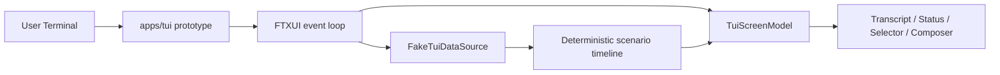

# DASALL TUI 小样快速实现设计方案与专项 TODO

最近更新时间：2026-05-12
阶段：TUI Prototype Design -> Special TODO
适用范围：`apps/tui/`、`tests/unit/tui/`、`tests/integration/tui/`、`docs/todos/tui/`、`docs/architecture/DASALL_TUI客户端设计方案.md`
当前结论：本专项只实现可交互 TUI 小样，后台数据服务全部使用本地 fake/mock，不接入 `apps/daemon`，不接入真实 Access -> Runtime 主链，不启动 DASALL Agent 真实执行。该小样的最终样品将作为后续 DASALL TUI 客户端交互、布局、视觉样式和键盘模型的决策基准。

## 文档头

输入依据：

1. `docs/architecture/DASALL_TUI客户端设计方案.md`
2. `docs/architecture/DASALL-cli本地控制面详细设计.md`
3. `docs/plans/DASALL_工程落地实现步骤指引.md`
4. `docs/development/DASALL_工程协作与编码规范.md`
5. `docs/development/DASALL_子系统专项TODO生成提示词模板.md`
6. `apps/CMakeLists.txt`
7. `apps/cli/CMakeLists.txt`
8. `cmake/DASALLThirdParty.cmake`
9. `debian/control`
10. `debian/dasall-cli.install`

行业与工程最佳实践参照：

1. Terminal-first Agent 产品实践：默认键盘驱动、低干扰状态反馈、可折叠工具摘要、输入区优先级高于装饰性布局。
2. Model-View-Update / Elm style：UI 状态集中在 screen model，事件通过 action/reducer 更新，renderer 尽量纯展示，降低后续接入真实数据时的重写成本。
3. Clean Architecture for UI shell：TUI 依赖抽象数据源，不依赖 daemon、runtime 或 provider 实现；小样用 fake 数据源验证交互，不让 mock 泄漏为真实业务契约。
4. Test Pyramid for UI prototype：优先覆盖 view model、composer、selector、layout reducer；少量 snapshot/golden 覆盖渲染输出；最终必须有人机样品评审证据。
5. Design Token practice：颜色、间距、宽度、状态 badge、焦点样式集中定义，避免每个组件散落硬编码。
6. Responsive terminal constraints：以 80x24 为最低可用基线，120x36 为完整布局基线，明确 narrow fallback。
7. International text readiness：从小样阶段就验证 UTF-8、CJK 宽字符、粘贴、resize 和 IME 交互下限。

编制原则：

1. 只做界面开发，不接 daemon，不接真实 IPC，不调用 runtime，不调用 LLM provider。
2. 先完成可运行、可演示、可评审的 TUI 样品，再讨论接入真实数据。
3. 小样代码可服务后续转正，但小样期间所有数据源必须通过 fake scenario 注入。
4. 每个原子任务必须包含代码目标、测试目标、验收命令三件套。
5. 最终样品评审是硬门禁；未通过前不得把该交互与样式迁移到正式 DASALL TUI 客户端。

## 1. 概述与目标

### 1.1 专项目标

本专项目标是在独立的 `apps/tui` 工程内实现一个可运行的 DASALL TUI 快速小样，用于冻结后续正式客户端的交互与视觉方向。

小样必须达成以下目标：

1. 通过独立 target 构建并运行 TUI 原型，不依赖 `apps/cli` 私有实现。
2. 展示完整首屏：顶部会话头、主 transcript、右侧状态栏、LLM selector strip、底部 composer、底部状态条。
3. 支持 mock 多轮对话、mock 工具摘要、mock stage/budget/recovery 状态变化。
4. 支持 composer 的多行输入、发送、换行、历史召回、反向搜索、busy draft 展示。
5. 支持 LLM selector 的 Auto / Prefer Depth / Pin Model 三模式 mock 交互。
6. 在 80x24、120x36 两类终端尺寸下不出现内容重叠、不可恢复布局或关键文字截断。
7. 输出可评审样品证据，作为后续正式 DASALL TUI 的样式和交互决策输入。

### 1.2 纳入范围

1. `apps/tui/` 独立 CMake target 与原型入口。
2. TUI screen model、fake data source、mock event timeline、design tokens、FTXUI adapter。
3. Transcript、status panel、LLM selector、composer、footer、help/status/session modal 的界面行为。
4. View model 单元测试、fake scenario 测试、composer/selector 状态机测试、render snapshot 测试。
5. 终端人工验收清单与样品评审证据。

### 1.3 不纳入范围

1. 不接入 `apps/daemon`。
2. 不接入真实 `platform::IIPC`、UDS、AccessGateway、RuntimeBridge 或 AgentFacade。
3. 不实现真实 LLM provider、真实工具调用、真实 memory/context、真实 recovery。
4. 不实现 Debian 安装态命令迁移。
5. 不实现正式 `dasall` 命令 owner 切换。
6. 不实现跨启动 session 恢复、多 session 列表或长期历史存储。
7. 不声明 stream-ready；小样中的流动效果只来自 fake event timeline。

## 2. 当前状态

| 维度 | 当前状态 | 对小样的影响 |
|---|---|---|
| TUI 设计文档 | 已形成 `DASALL_TUI客户端设计方案.md`，明确 `apps/tui` 独立工程、FTXUI 候选和主布局 | 可直接进入小样设计与任务拆分 |
| 代码工程 | 当前仓库尚无 `apps/tui/` substrate | 需要先建立独立 target 与测试入口 |
| 真实后端 | daemon/access/runtime 主链不作为小样依赖 | 所有数据必须 fake 化，避免误接真实服务 |
| 命令迁移 | `dasall` 命令释放另由附录 B 管理 | 本专项只产出 prototype target，不改变安装态命令 |
| FTXUI 依赖 | 已被推荐为首选候选，但尚未验证 | 小样必须验证 CJK、resize、composer、snapshot 可行性 |
| 样式决策 | 尚未冻结正式视觉语言 | 小样输出将作为正式样式 baseline |

当前判断：本专项具备 Design -> Build 条件，但粒度只能推进到 L2/L3 混合。可对 screen model、fake source、composer、selector 细化到 L3；FTXUI 复杂输入、IME 和终端兼容性仍需要 spike 与人工门禁验证。

## 3. 约束条件

### 3.1 架构约束

1. `apps/tui` 与 `apps/cli` 独立存在、独立运行、互不依赖私有实现。
2. 小样不得 include 或 link `apps/daemon` 私有实现。
3. 小样不得通过 UDS 连接真实 daemon。
4. 小样不得直接依赖 runtime implementation、llm provider implementation 或 profile secret 文件。
5. 小样可以定义 `FakeTuiDataSource`、`FakeScenarioClock`、`FakeRouteCatalog` 等原型私有对象。
6. 所有 mock 数据必须带 `fake` 或 `prototype` 命名，避免后续误认为真实 contract。

### 3.2 产品约束

1. 小样第一屏就是可交互客户端，不做 landing page 或介绍页。
2. 不使用营销化 hero、装饰性大图或与终端工作台无关的视觉元素。
3. 使用密度适中的工作台式布局，优先让用户看清 transcript、状态、输入和模型偏好。
4. UI 文案不解释“这是怎么实现的”，只展示用户自然需要的信息。
5. 颜色不能只依赖单一蓝紫或单一深色主题，状态差异必须可被文字、图标或 badge 共同表达。
6. 不展示 raw Chain-of-Thought 或 provider-private reasoning 内容，即使 fake 数据中也不模拟这类内容。

### 3.3 验证约束

1. 每个 UI 组件至少有 view model 或 reducer 级测试。
2. 主界面必须有 80x24 与 120x36 的 snapshot/golden 验证。
3. CJK 样本文本必须出现在 transcript、composer 和 status panel 验证中。
4. fake 数据源必须可 deterministic replay。
5. 最终样品必须经过人工评审，并明确记录采纳、延后、废弃的交互/样式决策。

## 4. 小样设计方案与 Design Track 映射

### 4.1 小样运行模型



运行规则：

1. `apps/tui` 启动后进入 full-screen alternate screen。
2. `FakeTuiDataSource` 加载本地内置 scenario，不读取 daemon 或外部服务。
3. 所有 assistant、tool、stage、budget、recovery、route 变化由 deterministic timeline 驱动。
4. 用户可以真实编辑 composer、切换 selector、打开本地 modal，但发送后的响应仍由 fake timeline 产生。
5. 小样退出后不保存 session，不写入 profile，不修改系统配置。

### 4.2 组件设计

| 组件 | 职责 | 数据来源 | 小样验收重点 |
|---|---|---|---|
| `TuiApp` | 组装 event loop、screen model、fake source 和 root view | 本地构造 | 可启动、可退出、无 daemon 依赖 |
| `TuiScreenModel` | 保存全部 UI 状态与 focus 状态 | reducer/action | 状态更新可单测 |
| `FakeTuiDataSource` | 提供 deterministic transcript/status/route timeline | 内置 scenario | 可 replay、可切换场景 |
| `TuiTranscriptView` | 展示消息、工具摘要、折叠段和滚动位置 | screen model | 80x24 不遮挡 composer |
| `TuiStatusPanel` | 展示 stage/tool/pending/budget/recovery/health | fake projection | 状态变化清晰、非颜色唯一 |
| `TuiModelSelector` | 展示 Current route 与 Next preference 三模式 | fake route catalog | 禁用原因、apply/cancel 清晰 |
| `TuiComposer` | 多行输入、发送、换行、历史、反向搜索、busy draft | 用户输入 + model | 键盘行为稳定 |
| `TuiDesignTokens` | 颜色、间距、边框、badge、焦点样式 | 静态 token | 风格统一、可评审 |
| `FtxuiRendererAdapter` | 将 view model 渲染为 FTXUI component | screen model | FTXUI 类型不泄漏到 model 测试 |

### 4.3 Fake 场景集合

| 场景 ID | 用途 | 必须覆盖 |
|---|---|---|
| `golden_ready` | 标准空闲主界面 | daemon ready mock、profile、current route、空闲 composer |
| `planning_tools` | 执行中状态 | planning、tool calling、budget 变化、busy draft |
| `needs_confirm` | 等待用户交互 | pending interaction、confirmation modal、禁用发送 |
| `recovering` | 恢复摘要展示 | reflecting、recovery accepted/rejected summary |
| `route_switch` | LLM selector 展开与切换 | Auto / Prefer Depth / Pin Model、禁用项原因 |
| `narrow_cjk` | 80x24 + 中文压力 | CJK transcript、composer、status panel、截断策略 |

### 4.4 样式与交互决策面

小样最终评审必须冻结或明确延后以下决策：

1. 主布局比例：transcript 与 status panel 的横向比例、80x24 fallback 是否隐藏右栏。
2. Transcript 表达：assistant/tool/system summary 的层次、折叠样式、滚动提示。
3. Composer 行为：默认行数、最大行数、发送/换行键、history recall 边界行为。
4. LLM selector 表达：strip 文案、展开 modal、禁用原因、apply/cancel 反馈。
5. 状态栏表达：stage、budget、recovery、health 的优先级和 badge 样式。
6. 色彩与密度：默认 theme、焦点态、错误态、降级态、CJK 文本显示效果。

### 4.5 Design Track 映射

| Design ID | 设计结论 | 对应 TODO |
|---|---|---|
| TUI-PROT-DES-001 | 小样只做 UI，后台全部 fake，不接 daemon | TUI-PROTO-001、003、004、016 |
| TUI-PROT-DES-002 | `apps/tui` 独立工程，CLI/TUI 互不依赖 | TUI-PROTO-004、016 |
| TUI-PROT-DES-003 | FTXUI 只进入 app shell private dependency | TUI-PROTO-004、015 |
| TUI-PROT-DES-004 | screen model 与 renderer 分离 | TUI-PROTO-005、015 |
| TUI-PROT-DES-005 | fake timeline deterministic replay | TUI-PROTO-006、014 |
| TUI-PROT-DES-006 | 主布局为 transcript + status + selector + composer | TUI-PROTO-008、009、010 |
| TUI-PROT-DES-007 | composer 是核心交互面 | TUI-PROTO-012、014 |
| TUI-PROT-DES-008 | selector 三模式 mock | TUI-PROTO-011、014 |
| TUI-PROT-DES-009 | CJK 与 80x24 是最低验收门槛 | TUI-PROTO-013、015、017 |
| TUI-PROT-DES-010 | 最终样品决定正式交互与样式 | TUI-PROTO-017 |

## 5. Build Track 映射

| Build Area | 目标 | 产出 |
|---|---|---|
| Build-001 独立工程骨架 | 新增 `apps/tui` 与 prototype target | `apps/tui/CMakeLists.txt`、`dasall_tui_prototype` |
| Build-002 状态模型 | 建立 reducer/action/screen model | `TuiScreenModel`、`TuiAction`、`TuiFocusState` |
| Build-003 fake 数据层 | 内置 scenario 与 fake clock | `FakeTuiDataSource`、`FakeScenarioCatalog` |
| Build-004 视觉 token | 集中管理 theme、spacing、badge、focus | `TuiDesignTokens` |
| Build-005 主界面渲染 | 完成主布局与组件组合 | `TuiApp`、`FtxuiRendererAdapter`、各 view |
| Build-006 输入与 selector | 完成 composer、history、selector modal | `TuiComposer`、`TuiModelSelector` |
| Build-007 验证与证据 | 单元、snapshot、人工评审证据 | tests + deliverables |

## 6. 任务表（四分段）

### 6.1 补设计 / 评审解阻

| Task ID | Status | 任务标题 | 设计依据 | 精确范围 | 粒度 | 代码目标 | 目标函数/接口/数据结构 | 测试目标 | 验收命令 | 前置任务 | 关联阻塞项 | 解阻条件 | 交付物 | 完成判定 |
|---|---|---|---|---|---|---|---|---|---|---|---|---|---|---|
| TUI-PROTO-001 | NotStarted | 冻结 no-daemon 小样契约 | TUI-PROT-DES-001 | 小样边界、fake-only、禁 daemon | L2 | `docs/todos/tui/DASALL_TUI小样快速实现专项TODO-2026-05-12.md` | PrototypeBoundary | 文档一致性检查 | `rg -n "不接入 .*daemon|FakeTuiDataSource|no-daemon" docs/todos/tui/DASALL_TUI小样快速实现专项TODO-2026-05-12.md` | 无 | 无 | 文档明确 fake-only | 本文档 | 文档中明确禁止 daemon/IPC/runtime/LLM 真实接入 |
| TUI-PROTO-002 | NotStarted | 冻结样式 token 与布局断点 | TUI-PROT-DES-006/009/010 | 80x24、120x36、颜色、badge、focus | L2 | `apps/tui/src/TuiDesignTokens.h`、`apps/tui/src/TuiLayoutMetrics.h` | `TuiDesignTokens`、`TuiLayoutMetrics` | `TuiDesignTokensTest` | `ctest --preset vscode-linux-ninja -R "TuiDesignTokens" --output-on-failure` | TUI-PROTO-001 | BLK-TUI-PROT-002 | 评审通过默认 theme 与断点 | token 头文件 + 测试 | token 集中定义且无散落 magic color/spacing |
| TUI-PROTO-003 | NotStarted | 冻结 fake 场景目录 | TUI-PROT-DES-001/005 | golden_ready、planning_tools、needs_confirm、recovering、route_switch、narrow_cjk | L2 | `apps/tui/src/FakeScenarioCatalog.h` | `FakeScenarioCatalog::load()` | `TuiFakeScenarioCatalogTest` | `ctest --preset vscode-linux-ninja -R "TuiFakeScenarioCatalog" --output-on-failure` | TUI-PROTO-001 | 无 | 场景覆盖 4.3 表 | fake catalog + 测试 | 每个场景可 deterministic replay |

### 6.2 骨架与公共接口面

| Task ID | Status | 任务标题 | 设计依据 | 精确范围 | 粒度 | 代码目标 | 目标函数/接口/数据结构 | 测试目标 | 验收命令 | 前置任务 | 关联阻塞项 | 解阻条件 | 交付物 | 完成判定 |
|---|---|---|---|---|---|---|---|---|---|---|---|---|---|---|
| TUI-PROTO-004 | NotStarted | 建立 apps/tui 原型 target | TUI-PROT-DES-002/003 | CMake、main、prototype target、不安装 | L2 | `apps/tui/CMakeLists.txt`、`apps/tui/src/main.cpp`、`apps/CMakeLists.txt` | `main()`、`dasall_tui_prototype` | `TuiPrototypeBuildSmokeTest` | `cmake --build --preset vscode-linux-ninja --target dasall_tui_prototype` | TUI-PROTO-001 | BLK-TUI-PROT-001 | FTXUI 依赖路径可解析 | build target | target 可构建且不改变安装态 `dasall` |
| TUI-PROTO-005 | NotStarted | 实现 screen model 与 action reducer | TUI-PROT-DES-004 | session/header/transcript/status/selector/composer/focus | L3 | `apps/tui/src/TuiScreenModel.h`、`apps/tui/src/TuiScreenModel.cpp`、`apps/tui/src/TuiAction.h` | `TuiScreenModel::apply()`、`TuiAction` | `TuiScreenModelTest` | `ctest --preset vscode-linux-ninja -R "TuiScreenModel" --output-on-failure` | TUI-PROTO-004 | 无 | 模型字段与 action 枚举冻结 | model + reducer 测试 | reducer 不依赖 FTXUI 类型 |
| TUI-PROTO-006 | NotStarted | 实现 fake 数据源与 fake clock | TUI-PROT-DES-001/005 | fake event、fake route、fake tool、fake status | L3 | `apps/tui/src/FakeTuiDataSource.h`、`apps/tui/src/FakeTuiDataSource.cpp`、`apps/tui/src/FakeScenarioClock.h` | `FakeTuiDataSource::next_event()`、`FakeScenarioClock::tick()` | `FakeTuiDataSourceTest` | `ctest --preset vscode-linux-ninja -R "FakeTuiDataSource" --output-on-failure` | TUI-PROTO-003/005 | 无 | fake scenario catalog 已冻结 | fake source + tests | 同一 scenario 多次 replay 输出一致 |
| TUI-PROTO-007 | NotStarted | 增加 no-daemon 边界测试 | TUI-PROT-DES-001/002 | 禁 daemon include/link、禁 IPC 真实连接 | L2 | `tests/unit/tui/TuiNoDaemonBoundaryTest.cpp`、`apps/tui/CMakeLists.txt` | `TuiNoDaemonBoundary` | `TuiNoDaemonBoundaryTest` | `ctest --preset vscode-linux-ninja -R "TuiNoDaemonBoundary" --output-on-failure` | TUI-PROTO-004 | 无 | CMake target 可枚举依赖 | boundary test | 测试能证明 prototype 不 link daemon/runtime provider |

### 6.3 界面组件与交互实现

| Task ID | Status | 任务标题 | 设计依据 | 精确范围 | 粒度 | 代码目标 | 目标函数/接口/数据结构 | 测试目标 | 验收命令 | 前置任务 | 关联阻塞项 | 解阻条件 | 交付物 | 完成判定 |
|---|---|---|---|---|---|---|---|---|---|---|---|---|---|---|
| TUI-PROTO-008 | NotStarted | 实现主界面 layout shell | TUI-PROT-DES-006/009 | header、transcript、status、selector、composer、footer | L2 | `apps/tui/src/TuiApp.h`、`apps/tui/src/TuiApp.cpp`、`apps/tui/src/FtxuiRendererAdapter.cpp` | `TuiApp::run()`、`render_root()` | `TuiMainLayoutSnapshotTest` | `ctest --preset vscode-linux-ninja -R "TuiMainLayoutSnapshot" --output-on-failure` | TUI-PROTO-002/005/006 | BLK-TUI-PROT-003 | snapshot harness 可运行 | app + snapshot | 80x24 与 120x36 snapshot 无重叠 |
| TUI-PROTO-009 | NotStarted | 实现 transcript view | TUI-PROT-DES-006 | user/assistant/tool summary、折叠、滚动提示 | L3 | `apps/tui/src/TuiTranscriptView.h`、`apps/tui/src/TuiTranscriptView.cpp` | `render_transcript()`、`TuiMessageView` | `TuiTranscriptViewTest` | `ctest --preset vscode-linux-ninja -R "TuiTranscriptView" --output-on-failure` | TUI-PROTO-008 | 无 | 主 layout 已接通 | transcript view + tests | CJK 与长消息不会挤压 composer |
| TUI-PROTO-010 | NotStarted | 实现 status panel | TUI-PROT-DES-006 | stage/tool/pending/budget/recovery/health | L3 | `apps/tui/src/TuiStatusPanel.h`、`apps/tui/src/TuiStatusPanel.cpp` | `render_status_panel()`、`TuiStatusProjection` | `TuiStatusPanelTest` | `ctest --preset vscode-linux-ninja -R "TuiStatusPanel" --output-on-failure` | TUI-PROTO-008 | 无 | fake status projection 可用 | status panel + tests | 状态不只靠颜色表达 |
| TUI-PROTO-011 | NotStarted | 实现 LLM selector strip 与 modal | TUI-PROT-DES-008 | Current route、Next preference、Auto/Depth/Pin | L3 | `apps/tui/src/TuiModelSelector.h`、`apps/tui/src/TuiModelSelector.cpp` | `TuiModelSelector::apply()`、`TuiModelSelectorState` | `TuiModelSelectorTest` | `ctest --preset vscode-linux-ninja -R "TuiModelSelector" --output-on-failure` | TUI-PROTO-005/006/008 | 无 | fake route catalog 可用 | selector + tests | apply/cancel/disabled reason 行为可判定 |
| TUI-PROTO-012 | NotStarted | 实现 composer 状态机 | TUI-PROT-DES-007 | ready/editing/history/search/submitting/busy draft | L3 | `apps/tui/src/TuiComposer.h`、`apps/tui/src/TuiComposer.cpp` | `TuiComposer::handle_key()`、`TuiComposerState` | `TuiComposerTest` | `ctest --preset vscode-linux-ninja -R "TuiComposer" --output-on-failure` | TUI-PROTO-005/008 | BLK-TUI-PROT-002 | 键盘语义冻结 | composer + tests | Enter/Alt+Enter/Ctrl+R/Up/Down 行为符合设计 |
| TUI-PROTO-013 | NotStarted | 实现 help/status/session modal | TUI-PROT-DES-006/010 | `/help`、`/status`、`/session` local modal | L3 | `apps/tui/src/TuiSlashCommandParser.h`、`apps/tui/src/TuiSlashCommandParser.cpp`、`apps/tui/src/TuiModalView.cpp` | `TuiSlashCommandParser::parse()`、`render_modal()` | `TuiSlashCommandParserTest` | `ctest --preset vscode-linux-ninja -R "TuiSlashCommandParser|TuiModal" --output-on-failure` | TUI-PROTO-012 | 无 | composer 可提交 slash command | parser + modal | 三个本地命令不触发 daemon 依赖 |
| TUI-PROTO-014 | NotStarted | 接入 fake timeline 驱动 UI 变化 | TUI-PROT-DES-005/006 | tick、auto-advance、busy draft、scenario switch | L3 | `apps/tui/src/TuiPrototypeController.h`、`apps/tui/src/TuiPrototypeController.cpp` | `TuiPrototypeController::tick()` | `TuiPrototypeControllerTest` | `ctest --preset vscode-linux-ninja -R "TuiPrototypeController" --output-on-failure` | TUI-PROTO-006/008/009/010/011/012 | 无 | fake source 与组件已可渲染 | prototype controller | 场景切换可驱动 transcript/status/selector 同步变化 |

### 6.4 测试支撑 / 集成 / 门禁

| Task ID | Status | 任务标题 | 设计依据 | 精确范围 | 粒度 | 代码目标 | 目标函数/接口/数据结构 | 测试目标 | 验收命令 | 前置任务 | 关联阻塞项 | 解阻条件 | 交付物 | 完成判定 |
|---|---|---|---|---|---|---|---|---|---|---|---|---|---|---|
| TUI-PROTO-015 | NotStarted | 建立 render snapshot/golden 测试 | TUI-PROT-DES-004/009 | 80x24、120x36、narrow_cjk、route modal | L2 | `tests/unit/tui/TuiRenderSnapshotTest.cpp`、`tests/fixtures/tui/golden/` | `render_to_screen()` | `TuiRenderSnapshotTest` | `ctest --preset vscode-linux-ninja -R "TuiRenderSnapshot" --output-on-failure` | TUI-PROTO-008~014 | BLK-TUI-PROT-003 | snapshot harness 与 golden 更新规则冻结 | snapshot tests | snapshot 覆盖核心场景且可稳定复现 |
| TUI-PROTO-016 | NotStarted | 增加 prototype 集成 smoke | TUI-PROT-DES-001/002/010 | build/run/fake-only/exit path | L2 | `tests/integration/tui/TuiPrototypeSmokeTest.cpp` | `TuiPrototypeSmoke` | `TuiPrototypeSmokeTest` | `ctest --preset vscode-linux-ninja -R "TuiPrototypeSmoke" --output-on-failure` | TUI-PROTO-014/015 | 无 | prototype 可非交互 smoke | smoke test | smoke 不需要 daemon 即可启动和退出 |
| TUI-PROTO-017 | NotStarted | 产出样品评审证据包 | TUI-PROT-DES-010 | 截图/终端录制/评审结论/采纳清单 | L1 | `docs/todos/tui/deliverables/TUI-PROTO-017-样品评审证据.md` | PrototypeReviewEvidence | 人工评审清单 | `rg -n "Gate-TUI-PROT-06|采纳|延后|废弃" docs/todos/tui/deliverables/TUI-PROTO-017-样品评审证据.md` | TUI-PROTO-015/016 | BLK-TUI-PROT-004 | 产品/工程评审完成 | 评审证据包 | 明确哪些交互和样式进入正式 TUI baseline |

## 7. 执行顺序建议与质量门

### 7.1 执行顺序

1. 第一批：TUI-PROTO-001、002、003，冻结边界、token、fake 场景。
2. 第二批：TUI-PROTO-004、005、006、007，建立独立工程、screen model、fake source 与 no-daemon gate。
3. 第三批：TUI-PROTO-008、009、010，先把主界面可视骨架跑起来。
4. 第四批：TUI-PROTO-011、012、013、014，补齐 selector、composer、modal 与 fake timeline。
5. 第五批：TUI-PROTO-015、016、017，完成 snapshot、smoke 与最终样品评审。

### 7.2 必过质量门

| Gate ID | 触发时机 | 通过条件 | 回退动作 | 对应设计 Gate |
|---|---|---|---|---|
| Gate-TUI-PROT-01 | TUI-PROTO-004 后 | `apps/tui` target 可构建，且不改变安装态命令 | 回退到 CMake 骨架修复 | TUI-PROT-DES-002 |
| Gate-TUI-PROT-02 | TUI-PROTO-007 后 | prototype 不 link daemon/runtime/provider implementation | 阻断后续 UI 开发 | TUI-PROT-DES-001 |
| Gate-TUI-PROT-03 | TUI-PROTO-008 后 | 80x24 / 120x36 主界面无重叠 | 调整 layout metrics | TUI-PROT-DES-006/009 |
| Gate-TUI-PROT-04 | TUI-PROTO-012 后 | composer 键盘语义与历史/搜索行为可测试 | 回退 composer 状态机 | TUI-PROT-DES-007 |
| Gate-TUI-PROT-05 | TUI-PROTO-015 后 | snapshot/golden 稳定，CJK 场景通过 | 更新 renderer 或 token | TUI-PROT-DES-009 |
| Gate-TUI-PROT-06 | TUI-PROTO-017 后 | 样品评审明确采纳/延后/废弃清单 | 不进入正式 TUI 实现 | TUI-PROT-DES-010 |

## 8. 阻塞项与解阻条件

| Blocker ID | 状态 | 描述 | 影响任务 | 解阻条件 | 对应设计 Blocker |
|---|---|---|---|---|---|
| BLK-TUI-PROT-001 | Open | FTXUI 接入方式尚未落地到仓库第三方依赖治理 | TUI-PROTO-004 | 按 `cmake/DASALLThirdParty.cmake` 选定 submodule/local cache/FetchContent 路径 | TUI-PROT-DES-003 |
| BLK-TUI-PROT-002 | Open | IME、Alt+Enter、Ctrl+R、CJK 编辑细节需要实测 | TUI-PROTO-002、012 | 完成手工键盘矩阵，必要时降级为外部编辑器入口 | TUI-PROT-DES-007/009 |
| BLK-TUI-PROT-003 | Open | FTXUI render snapshot/golden harness 尚未验证 | TUI-PROTO-008、015 | 建立稳定 `render_to_screen()` 或等价测试工具 | TUI-PROT-DES-004/009 |
| BLK-TUI-PROT-004 | Open | 最终样品采纳标准需要产品/工程共同评审 | TUI-PROTO-017 | 评审证据包中明确采纳、延后、废弃项 | TUI-PROT-DES-010 |

## 9. 测试矩阵与统一验收命令

### 9.1 单元测试清单

| 测试 | 覆盖任务 | 验证点 |
|---|---|---|
| `TuiDesignTokensTest` | TUI-PROTO-002 | token、断点、状态 badge 一致性 |
| `TuiFakeScenarioCatalogTest` | TUI-PROTO-003 | fake 场景完整性和可 replay |
| `TuiScreenModelTest` | TUI-PROTO-005 | reducer、focus、状态流转 |
| `FakeTuiDataSourceTest` | TUI-PROTO-006 | deterministic timeline |
| `TuiNoDaemonBoundaryTest` | TUI-PROTO-007 | 无 daemon/runtime/provider 私有依赖 |
| `TuiTranscriptViewTest` | TUI-PROTO-009 | 消息层级、CJK、折叠和滚动 |
| `TuiStatusPanelTest` | TUI-PROTO-010 | stage/tool/budget/recovery 展示 |
| `TuiModelSelectorTest` | TUI-PROTO-011 | 三模式、禁用原因、apply/cancel |
| `TuiComposerTest` | TUI-PROTO-012 | Enter、Alt+Enter、Ctrl+R、history、busy draft |
| `TuiSlashCommandParserTest` | TUI-PROTO-013 | `/help`、`/status`、`/session` 本地解析 |

### 9.2 集成与快照测试清单

| 测试 | 覆盖任务 | 验证点 |
|---|---|---|
| `TuiMainLayoutSnapshotTest` | TUI-PROTO-008 | 主界面 80x24 / 120x36 布局 |
| `TuiRenderSnapshotTest` | TUI-PROTO-015 | golden_ready、planning_tools、route_switch、narrow_cjk |
| `TuiPrototypeControllerTest` | TUI-PROTO-014 | fake timeline 驱动 UI 同步变化 |
| `TuiPrototypeSmokeTest` | TUI-PROTO-016 | 无 daemon 启动、fake scenario 运行、退出路径 |

### 9.3 质量门清单

| Gate | 对应任务 | 必过条件 |
|---|---|---|
| Gate-TUI-PROT-01 | TUI-PROTO-004 | target 可构建 |
| Gate-TUI-PROT-02 | TUI-PROTO-007 | no-daemon boundary 通过 |
| Gate-TUI-PROT-03 | TUI-PROTO-008 | 主布局无重叠 |
| Gate-TUI-PROT-04 | TUI-PROTO-012 | composer 状态机通过 |
| Gate-TUI-PROT-05 | TUI-PROTO-015 | snapshot/golden 稳定 |
| Gate-TUI-PROT-06 | TUI-PROTO-017 | 样品评审通过 |

### 9.4 统一验收命令

```bash
cmake --build --preset vscode-linux-ninja --target dasall_tui_prototype dasall_tui_prototype_tests
ctest --preset vscode-linux-ninja -R "Tui(DesignTokens|FakeScenarioCatalog|ScreenModel|NoDaemonBoundary|TranscriptView|StatusPanel|ModelSelector|Composer|SlashCommandParser|MainLayoutSnapshot|RenderSnapshot|PrototypeController|PrototypeSmoke)" --output-on-failure
```

人工验收命令建议：

```bash
./build/apps/tui/dasall_tui_prototype --scenario golden_ready
./build/apps/tui/dasall_tui_prototype --scenario planning_tools
./build/apps/tui/dasall_tui_prototype --scenario route_switch
./build/apps/tui/dasall_tui_prototype --scenario narrow_cjk
```

说明：人工命令路径以后续实际 CMake 输出目录为准；如果构建目录不同，执行者必须在交付证据中记录实际路径。

## 10. 风险与回退策略

| 风险 | 影响 | 缓解 | 对应设计 Risk |
|---|---|---|---|
| FTXUI 输入能力不满足 composer 需求 | 小样交互不可作为正式客户端基线 | 保留外部编辑器入口，必要时调整 composer 目标 | TUI-PROT-DES-007 |
| fake timeline 太理想化 | 样品不能代表真实 Agent 体验 | 场景必须覆盖等待、错误、恢复、route 禁用和 CJK 压力 | TUI-PROT-DES-005 |
| 小样误接真实 daemon | 原型污染架构边界 | no-daemon boundary test 作为必过门禁 | TUI-PROT-DES-001 |
| snapshot 过度脆弱 | 每次小改都造成测试噪声 | snapshot 只覆盖结构和关键文案，token 细节由单测覆盖 | TUI-PROT-DES-004/009 |
| 样式评审不收敛 | 后续正式实现反复返工 | TUI-PROTO-017 必须输出采纳/延后/废弃清单 | TUI-PROT-DES-010 |

## 11. 可行性结论

本专项可立即启动，但必须按 fake-only、independent `apps/tui`、FTXUI private dependency 三条边界执行。

推荐执行策略：

1. 先用最小 CMake target 和 `TuiScreenModel` 打通测试闭环。
2. 再接 `FakeTuiDataSource` 与主界面布局，尽快获得可视样品。
3. Composer 与 selector 是影响正式产品体验的核心，不应压缩为纯展示控件。
4. 在样品评审通过前，不应开始正式 daemon attach、真实 route projection 或安装态 `dasall` 命令迁移。

可行性判断：当前设计足以支撑原型实现，风险集中在 FTXUI 输入能力、snapshot 测试夹具和样品评审收敛。上述风险都有明确解阻任务和门禁，不构成启动阻塞。

## 12. 未决问题处置表

| OQ ID | 问题 | 当前处置 | 进入正式 TUI 前的条件 |
|---|---|---|---|
| TUI-PROT-OQ-001 | `/clear` 最终行为是清空视图还是新建 session | 小样中先作为本地 fake 行为，不冻结正式语义 | 正式 session seam 设计完成 |
| TUI-PROT-OQ-002 | 80x24 是否隐藏右侧 status panel | 小样评审决定 | Gate-TUI-PROT-06 输出采纳结论 |
| TUI-PROT-OQ-003 | IME 输入是否满足内嵌 composer | 小样实测决定 | TUI-PROTO-012 和人工键盘矩阵通过 |
| TUI-PROT-OQ-004 | LLM selector 是否需要快捷键直达 | 小样保留 Tab/focus 方案，评审后决定 | Gate-TUI-PROT-06 输出采纳结论 |
| TUI-PROT-OQ-005 | fake streaming 动效是否进入正式客户端 | 小样只模拟，不作为 stream-ready 证据 | access/llm streaming lifecycle 冻结 |
