# TUI-TODO-004 NextTurnPreference 承载决策

状态：Done
日期：2026-05-22
来源 TODO：docs/todos/tui/DASALL_TUI客户端专项TODO-2026-05-13.md

## 1. 任务边界

1. 本任务只冻结 `NextTurnPreference` 从 TUI draft 到 Access/Runtime/LLM 的真实承载位置、owner 边界，以及 `Auto` / `PreferDepth` / `PinModel` 三模式的失败语义。
2. 本任务不实现 `apps/tui`、access、runtime 或 llm 生产代码，不冻结 `route_catalog` 全字段表，也不提前宣称 daemon session seam、selector daemon path 或 bare `dasall` 命令迁移已 ready。
3. 本任务只解 `BLK-TUI-004`。`TUI-TODO-015` 仍只交付 fake selector 行为，`TUI-TODO-027~029` 继续分别负责 route catalog projection、daemon 消费接线与 next preference 端到端回显。

## 2. 本地事实与证据

1. `docs/architecture/DASALL_TUI客户端设计方案.md` 第 6.4~6.6 节已明确：TUI 只拥有 `NextTurnPreference` 草稿，不拥有最终模型路由权；现状只是“UI draft -> submit turn -> route projection”的抽象建议，还没有冻结真实 carrier。
2. `docs/ssot/RuntimePolicyConsumerMatrix.md` 已冻结：profile 语义 owner 是 profiles，consumer 只能消费 projection，不能私自重解释 profile 键，更不能通过 runtime override / deployment override 之外的通道偷偷写入新的 profile 语义。
3. `docs/adr/ADR-006-context-orchestrator-vs-prompt-composer.md` 已冻结：`ContextPacket` 属于语义上下文 owner，Prompt/LLM 侧只消费上下文和路由输入，不应把模型路由偏好伪装成 Context owner 的共享上下文字段。
4. `docs/ssot/AccessUnaryProductionPathV1.md` 已冻结：`request_context` 只允许承载 tracing、publish hint、治理投影等 sidecar 元数据，不能成为共享请求事实的唯一运输通道；`RuntimeDispatchRequest` 由 `RequestNormalizer` 作为唯一 owner 生成。
5. `docs/ssot/CrossModuleDataProjectionMatrix.md` 已冻结：shared contracts 只承载稳定最小视图；module-local 结构化对象继续归 owner 所有。若后续需要更丰富的跨模块对象，必须新增可选 projection object，而不是重解释现有 string 字段。
6. `contracts/include/agent/AgentRequest.h` 当前只有 `client_capabilities` 这类“客户端能力声明”字符串，没有 per-turn route preference typed field；同一文件也明确 `AgentRequest` 不承载 provider private fields、rendered prompt 或 runtime 内部状态。
7. `llm/include/route/ModelSelectionHint.h` 当前只表达 `stage`、`task_type`、`complexity_tier`、`latency_sla_tier`、`budget_tier`、`requires_tools`、`requires_reasoning` 等路由提示，不覆盖 `pinned_provider_id`、`pinned_model_id` 或显式 `preferred_depth_tier`。
8. `llm/src/LLMManager.cpp` 当前 `make_selection_hint()` 只是在缺省时构造 balanced hint；如果没有上游显式注入，真实链路不会自动得到 TUI selector 的 per-turn route intent。

## 3. 外部参考

1. gRPC Metadata 指出 metadata 是与 RPC 关联的 side channel，适合承载认证、追踪和附加头信息，而不是替代 typed request payload 本体。这与本仓 `request_context` 的 sidecar 定位一致，因此不应把 `NextTurnPreference` 真正做成“只有 key-value metadata 才知道”的 carrier。
   - 参考：https://grpc.io/docs/guides/metadata/
2. Martin Fowler 在 Flag Argument 中强调：当调用方确实需要表达明确意图时，应优先使用显式接口/参数，而不是把不同语义塞进含混的 flag 或泛化字段。对本任务而言，这意味着不应把 per-turn route preference 偷塞进 `client_capabilities` 这类泛化字符串位。
   - 参考：https://martinfowler.com/bliki/FlagArgument.html

## 4. 备选承载方案对比

| 方案 | 结论 | 取舍理由 |
|---|---|---|
| `request_context` 作为唯一 carrier | Reject | 与 `AccessUnaryProductionPathV1` 冲突。`request_context` 适合 tracing / publish hint / audit crumbs，不适合承载影响路由裁定的唯一 typed 输入；string map 也不利于稳定校验和版本演进。 |
| `AgentRequest.client_capabilities` | Reject | `client_capabilities` 的冻结语义是“客户端能力声明”，不是“本轮用户模型意图”。把 `PinModel` / `PreferDepth` 混入该字段会把 caller capability 和 request intent 混层，并引入 stringly-typed 解析。 |
| profile override | Reject | 与 `RuntimePolicyConsumerMatrix` 冲突。`NextTurnPreference` 是 next-turn-only 用户意图，不是 profile owner 的持久策略；若写成 override，就会把 TUI 变成 profile writer，并破坏 `ModelRouter` / profiles owner 边界。 |
| 新的 Access/Runtime typed request-scope projection | Accept | 符合 `CrossModuleDataProjectionMatrix` 的“shared contracts 保持最小、module-local richer projection 由 owner 负责”的规则；也符合 access `RequestNormalizer` 与 runtime invoke handoff 的现有 owner 结构。 |

补充结论：本轮不把 `NextTurnPreference` 直接抬升到 shared `AgentRequest`。原因不是它“不重要”，而是当前只需要 access/runtime/llm owner 之间的 request-scope typed carrier，尚无 CLI/gateway/其他入口共同依赖同一 stable supporting contract 的证据。若未来出现多入口共享需求，应新增 additive supporting contract，而不是回头重解释 `client_capabilities` 或 `request_context`。

## 5. 冻结结论

### 5.1 真实 carrier 选型

1. TUI 本地仍使用 module-local `NextTurnPreference` 作为 UI draft，字段保留 `mode`、`preferred_depth_tier`、`pinned_provider_id`、`pinned_model_id`、`user_visible_summary`、`source`、`applies_to_next_turn_only`。
2. 真正进入 Access/Runtime 主链的不是这份 UI draft 原样对象，而是由 `RequestNormalizer` 归一化后的 module-local `NextTurnPreferenceCarrier`。该 carrier 作为 `RuntimeDispatchRequest` / `RuntimeInvokeContext` 的 typed sidecar 承载，而不是写进 `request_context` string map。
3. `NextTurnPreferenceCarrier` 冻结为 next-turn-only、request-scoped、non-persistent 输入：它只对本次 `submit_turn` 生效，不跨 session、不反写 profile、不在下一轮继续隐式沿用。
4. `AgentRequest` 继续保持最小 shared request，不新增 `client_capabilities` 语义，不把 provider/model pin 偷渡成 shared contract。
5. `request_context` 若为了 observability 需要，可以镜像最小 audit crumbs，例如 `next_turn_preference_present=true`、`next_turn_preference_mode=pin_model`，但这些 crumbs 不是 authoritative carrier，更不能作为 runtime/llm 的唯一输入。

### 5.2 Access -> Runtime -> LLM 链路

冻结后的真实链路如下：

```mermaid
flowchart LR
  UI["TUI NextTurnPreference draft"] --> IPC["TuiIpcRequestEnvelope.submit_turn.payload.next_preference"]
  IPC --> N["RequestNormalizer"]
  N --> C["RuntimeDispatchRequest.next_turn_preference_carrier"]
  C --> I["RuntimeInvokeContext.route_preference"]
  I --> H["ModelSelectionHint.route_preference or equivalent llm-local route input"]
  H --> M["ModelRouter"]
  M --> P["TuiModelRouteProjection / TuiTurnReceipt"]
```



链路规则：

1. `TuiIpcRequestEnvelope.submit_turn.payload.next_preference` 是 TUI IPC seam 上的用户输入事实源；它可以保留 UI 友好的 summary/source，但只能由 access owner 读取和归一化。
2. `RequestNormalizer` 是唯一允许把 TUI draft 转成 request-scope carrier 的 owner；`RuntimeBridge` 和 runtime 只消费已归一化的 `NextTurnPreferenceCarrier`，不反向解析 TUI 原始 payload。
3. runtime 进入 llm 边界时，必须把 `NextTurnPreferenceCarrier` 投影为 llm module-local 的 route input。首选做法是给 `ModelSelectionHint` 增加一个 optional `route_preference` supporting field；若 llm owner 选择等价的新 supporting type，也必须保持 module-local，且 owner 仍然是 llm。
4. `ModelRouter` 继续保有最终裁定权。`NextTurnPreferenceCarrier` 只表达 caller intent，不等于“路由已强制生效”。
5. TUI 的回显入口是 `TuiModelRouteProjection` / `TuiTurnReceipt`；只有这些 owner projection 可以告诉 UI 最终 effective route 或 fail-closed reason，UI 不得自行猜测。

### 5.3 `NextTurnPreferenceCarrier` 最小字段

`NextTurnPreferenceCarrier` 建议冻结为以下最小字段家族：

```cpp
enum class NextTurnPreferenceMode {
  kAuto,
  kPreferDepth,
  kPinModel,
};

struct NextTurnPreferenceCarrier {
  NextTurnPreferenceMode mode = NextTurnPreferenceMode::kAuto;
  std::optional<std::string> preferred_depth_tier;
  std::optional<std::string> pinned_provider_id;
  std::optional<std::string> pinned_model_id;
  std::string source = "tui";
  bool applies_to_next_turn_only = true;
};
```

字段规则：

1. `user_visible_summary` 停留在 TUI draft，不进入 runtime/llm carrier。
2. `source` 只保留稳定来源标签，如 `tui`，供 observability/audit 使用，不得演化为 provider-private 参数槽位。
3. `applies_to_next_turn_only` 在 v1 固定为 `true`；若未来需要跨多轮或 profile-level 偏好，必须另起设计，不在本 carrier 上做语义漂移。

## 6. 三模式语义与失败规则

### 6.1 `Auto`

1. `Auto` 不携带显式 route pin；runtime/llm 只看到 `mode=kAuto` 或等价“无 preference”输入。
2. `Auto` 不因为 selector 本身触发 fail-closed；若本轮失败，失败原因仍归属既有 route/policy/runtime 错误，而不是 `NextTurnPreference`。

### 6.2 `PreferDepth`

1. `PreferDepth` 是 advisory，而不是 binding pin。它只表达 `preferred_depth_tier`，不指定 provider/model。
2. 若 depth tier 字段本身非法、为空或与 mode 组合不一致，access/local validation 必须直接拒绝，返回 `reason_domain=request`、`reason_code=validation_failed`。
3. 若 depth tier 合法但当前 profile/model catalog/health 不能满足，`ModelRouter` 可以按既有 profile 策略回退到其他 depth 或 route；这里不做 silent profile mutation，也不持久化为 override。
4. 回显必须通过 `TuiModelRouteProjection` 说明 effective depth / route；若 depth 偏好未满足，可通过 projection summary 或 disabled reason 解释，但不把 advisory 偏好升级成 hard failure。

### 6.3 `PinModel`

1. `PinModel` 是 binding caller intent：它要求本轮尝试指定的 `provider_id/model_id`，但最终仍由 `ModelRouter` 做 allowlist/verification/health/credential/policy 审核。
2. `PinModel` 绝不写 profile override，也不允许在失败后 silently 回落到另一个 provider/model 冒充“pin 生效”。
3. 以下情况必须 fail-closed，而不是静默降级：
   - pin 的 provider/model 不在当前 route catalog。
   - 当前 profile / allowlist / policy 明确禁止该 pin。
   - verification / health / credentials / activation 条件不满足。
   - daemon/access/runtime/llm 侧还不支持该 mode 的真实消费。
4. `PinModel` fail-closed 时，稳定 reason family 冻结为 `reason_domain=route`，`reason_code` 至少覆盖：
   - `preference_invalid`
   - `preference_not_supported`
   - `route_disallowed`
   - `route_unavailable`
5. `route_disallowed` 用于 allowlist / policy / verification deny；`route_unavailable` 用于 health / credentials / catalog absence / activation false；更细粒度 disabled reason 可在 `TUI-TODO-027` 继续加法细化，但不得反向改写这四个顶层提交语义。

## 7. 与现有类型的关系

| 对象 | 是否继续使用 | 处理方式 |
|---|---|---|
| `NextTurnPreference` | Yes | 保留为 TUI module-local UI draft；不直接进入 runtime/llm。 |
| `request_context` | Limited | 只保留 observability/audit crumbs；不是 authoritative carrier。 |
| `AgentRequest.client_capabilities` | No | 继续表达客户端能力，不承载 next-turn route intent。 |
| profile override | No | 保持 owner 禁止；TUI 不写 profile/runtime override。 |
| `ModelSelectionHint` | Yes, additive | llm owner 需要增加 optional `route_preference` 或等价 module-local route input，以消费 access/runtime 已归一化 carrier。 |

## 8. 对后续任务的直接约束

| 后续任务 | 锁定的代码目标 | 锁定的测试目标 | 锁定的验收命令 |
|---|---|---|---|
| `TUI-TODO-015` | fake selector 继续只生成 `NextTurnPreference` draft，但不再把“真实 carrier 未冻结”作为 blocker；实现中不得写 profile 或 `client_capabilities` | `TuiModelSelectorTest`、`TuiRouteCatalogFilterTest` | `ctest --preset vscode-linux-ninja -R "Tui(ModelSelector|RouteCatalog)" --output-on-failure` |
| `TUI-TODO-027` | `route_catalog` 字段表必须围绕 `PinModel` fail-closed 与 `PreferDepth` advisory 语义补足 disabled reason / current route / effective route 展示字段 | `TuiRouteCatalogProjectionTest` | `rg -n "current_provider_id|current_model_id|disabled_reasons|allowlist|verification_state|health" docs/todos/tui/deliverables/TUI-TODO-027-route-catalog-projection.md` |
| `TUI-TODO-028` | daemon selector 消费必须通过 access/runtime typed carrier，不得把 `NextTurnPreference` 塞进 `request_context` 或 `client_capabilities` | `TuiRouteCatalogProjectionTest`、`TuiModelSelectorDaemonTest` | `ctest --preset vscode-linux-ninja -R "Tui(RouteCatalogProjection|ModelSelectorDaemon)" --output-on-failure` |
| `TUI-TODO-029` | next preference 提交时，`PinModel` 失败必须 fail-closed 并回显 `route.*` reason；`PreferDepth` 未命中时必须回显 effective route，而不是宣称 pin/depth 已强制生效 | `TuiNextPreferenceIntegrationTest` | `ctest --preset vscode-linux-ninja -R "TuiNextPreference" --output-on-failure` |
| access/runtime/llm 后续实现 | `RequestNormalizer` / `RuntimeDispatchRequest` / `RuntimeInvokeContext` / `ModelSelectionHint` 需补 typed carrier 投影，不得引入 shared contract 漂移 | focused unit/integration 由 owner TODO 补充 | 本任务只冻结设计，不预先声明 build command |

## 9. D Gate 结果

1. `BLK-TUI-004` 已被收敛为单一结论：`NextTurnPreference` 的真链路不进入 `request_context` 唯一 sidecar、不进入 `client_capabilities`、不写 profile override，而是进入 access/runtime owner 的 typed request-scope carrier，再映射到 llm module-local route input。
2. `ModelRouter` owner 边界保持不变：TUI 只表达 caller intent，profiles/runtime/llm 仍保有 policy、allowlist、verification、health 与最终 route 裁定权。
3. `PinModel` 的 fail-closed 语义、`PreferDepth` 的 advisory 语义，以及 `Auto` 的无偏好语义已冻结到可执行粒度，足以解除 `TUI-TODO-015`、`027`、`028`、`029` 的设计 blocker。

结论：TUI-TODO-004 D Gate = PASS。本任务为文档决策任务，无独立 B 阶段；完成条件是 deliverable、专项 TODO、详设、总账与 worklog 口径同步回写。